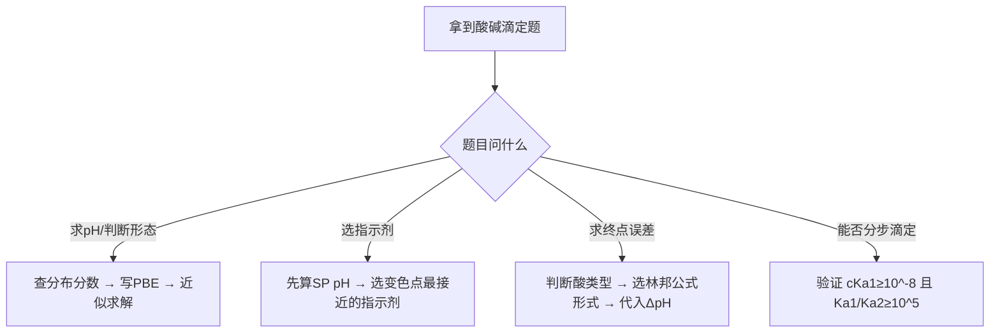

---
title: 专题-容量分析基础与酸碱滴定
type: 专题
topic_type: calculation
subject: 分析化学
syllabus_codes: ["18"]
tags: [化竞, 专题, 分析化学, 滴定, 酸碱滴定, 网课回流]
difficulty: 3
importance: 5
status: 精品
updated: 2026-06-03
---

# 专题：容量分析基础与酸碱滴定

> 本专题对应考纲条目：[[18]]
> 核心知识点：[[ ]]、[[ ]]

---

## 一、核心结论汇总 {#core-conclusions}

> 用 1-3 句话概括本专题的"最大公约数"。
> 再加 1 条「最高频决策路径」。

**必须记住：**
容量分析的底层逻辑是"计量点(SP)与滴定终点(EP)不重合必然产生系统误差"，林邦误差公式 $E_t = (10^{\Delta\text{pH}} - 10^{-\Delta\text{pH}})/\sqrt{c_{\text{sp}}K_t}$ 是统一计算所有酸碱滴定误差的竞赛核心工具。多元酸分步滴定的可行性判据为 $cK_{a1} \geq 10^{-8}$ 且 $K_{a1}/K_{a2} \geq 10^5$。

**最高频决策路径：**



## 二、对比表格

> 专题页的灵魂。把分散在多个知识点中的信息横向对比。
> 新增「触发条件」列：告诉学生"题目出现什么关键词时"来查这一行。

| 触发条件（题目关键词） | 比较维度 | A | B | 常见陷阱 |
|:---|:---|:---|:---|:---|
| "准确度""精密度""系统误差""随机误差" | 准确度 vs 精密度 | 准确度：测定值与真值的接近程度（反映系统误差） | 精密度：多次测定值之间的接近程度（反映随机误差） | 准确度高不一定精密度高；精密度高是准确度高的必要非充分条件 |
| "突跃范围""指示剂选择""变色点" | 强酸强碱滴定 vs 弱酸强碱滴定 | 强酸强碱：突跃宽（如0.1M时pH 4.3→9.7），甲基橙/酚酞均可 | 弱酸强碱：突跃窄且在碱性区（如HAc滴定7.76→9.70），只能选酚酞类 | 弱酸滴定不能用甲基橙；浓度降低10倍突跃减小2个pH单位 |
| "能否滴定""分步滴定""几个突跃" | 一元弱酸 vs 多元酸滴定条件 | 一元弱酸：$cK_a \geq 10^{-8}$ 即可准确滴定 | 多元酸：需同时满足 $cK_{a1} \geq 10^{-8}$ 且 $K_{a1}/K_{a2} \geq 10^5$ | 只满足第一个条件只能滴定到第一终点；指示剂选择需匹配各计量点pH |
| "林邦公式""终点误差""Et" | 强酸滴定 vs 弱酸滴定误差公式 | 强酸：$E_t = (10^{\Delta\text{pH}} - 10^{-\Delta\text{pH}})/\sqrt{c_{\text{sp}}K_t}$ | 弱酸：$E_t = (10^{\Delta\text{pH}} - 10^{-\Delta\text{pH}}) \cdot \sqrt{K_w/c_{\text{sp}}K_a}$ | $K_t$ 在不同体系中含义不同（强酸中 $K_t=1/K_w$，弱酸中 $K_t=K_a/K_w$）；注意ΔpH符号 |
| "有效数字""修约""四舍六入" | 加减法 vs 乘除法有效数字规则 | 加减法：以小数点后位数最少为准（绝对误差最大） | 乘除法：以有效数字位数最少为准（相对误差最大） | 禁止连续修约；对数运算小数部分为有效数字位数 |
| "基准物质""标定""直接配制" | 基准物质 vs 非基准物质 | 基准物质：纯度>99.9%、组成与化学式一致、稳定、摩尔质量大（如K₂Cr₂O₇、邻苯二甲酸氢钾） | 非基准物质：需用基准物质标定（如NaOH、HCl） | NaOH易吸CO₂、易潮解，不能直接配标准溶液；KMnO₄见光分解 |
| "缓冲溶液""缓冲容量""pH不变" | 缓冲溶液有效范围 vs 最大缓冲容量 | 有效缓冲范围：pH = pKa ± 1 | 最大缓冲容量：pH = pKa 处，β_max = 0.576c | 总浓度c越大缓冲能力越强；超出pKa±1范围几乎无缓冲能力 |

### 表2：四大滴定法对比（容量分析总览）

| 触发条件（题目关键词） | 比较维度 | 酸碱滴定 | 络合滴定 | 氧化还原滴定 | 沉淀滴定 |
|:---|:---|:---|:---|:---|:---|
| "滴定类型""选择方法" | 反应本质 | 质子转移（H⁺ + OH⁻ → H₂O） | 配位反应（M + Y → MY） | 电子转移（Ox + ne⁻ → Red） | 沉淀反应（Ag⁺ + X⁻ → AgX↓） |
| "标准溶液""滴定剂" | 常用滴定剂 | NaOH、HCl | EDTA | KMnO₄、Na₂S₂O₃、I₂ | AgNO₃、NH₄SCN |
| "指示剂""终点判断" | 指示剂类型 | 酸碱指示剂（甲基橙、酚酞） | 金属指示剂（EBT、XO） | 氧化还原指示剂/自身指示剂 | 吸附指示剂/分步沉淀指示剂 |
| "条件控制""pH影响" | 关键条件 | 酸度决定突跃范围 | pH控制酸效应系数 | 酸度决定反应方向和速度 | 酸度决定沉淀形式和溶解度 |
| "误差公式""终点误差" | 统一误差工具 | 林邦公式（ΔpH） | 林邦公式（ΔpM） | 林邦公式（ΔE） | 林邦公式（ΔpAg） |
| "准确滴定""判据" | 可行性判据 | cKa ≥ 10⁻⁸ | cK'MY ≥ 10⁶ | 反应完全度K ≥ 10⁶ | Ksp足够小，沉淀完全 |

> **记忆口诀**：酸碱看质子，络合看配位，氧化看电子，沉淀看Ksp；四大方法统一用林邦算误差。

### 表3：指示剂选择决策树

| 触发条件（题目关键词） | 滴定类型 | 计量点pH范围 | 推荐指示剂 | 变色点pH | 常见陷阱 |
|:---|:---|:---:|:---|:---:|:---|
| "强酸强碱""NaOH滴定HCl" | 强酸强碱滴定 | 7.0（中性） | 甲基橙（3.1-4.4）或酚酞（8.0-10.0） | 3.4 / 9.0 | 突跃宽（4.3-9.7），两种均可；浓度降低10倍突跃减2个pH单位 |
| "弱酸强碱""NaOH滴定HAc" | 弱酸强碱滴定 | 碱性区（8-9） | 酚酞（8.0-10.0）或百里酚酞（9.4-10.6） | 9.0 / 10.0 | **绝对不能选甲基橙**（变色点在酸性区，远离突跃） |
| "弱碱强酸""HCl滴定NH₃" | 弱碱强酸滴定 | 酸性区（5-6） | 甲基橙（3.1-4.4）或甲基红（4.4-6.2） | 3.4 / 5.0 | 不能选酚酞（变色点在碱性区） |
| "多元酸""H₃PO₄""分步滴定" | 多元酸分步滴定 | 第一SP≈4.7，第二SP≈9.7 | 第一SP：甲基红（4.4-6.2）；第二SP：百里酚酞（9.4-10.6） | 5.0 / 10.0 | 第三SP（HPO₄²⁻→PO₄³⁻）不可直接滴定，因Ka₃太小 |
| "混合碱""Na₂CO₃/NaHCO₃" | 双指示剂法 | 酚酞终点≈8.3；甲基橙终点≈3.9 | 酚酞（第一终点）+ 甲基橙（第二终点） | 9.0 / 3.4 | 酚酞变色时Na₂CO₃只转化为NaHCO₃，不是完全中和 |

> **决策路径**：先算SP pH → 查突跃范围 → 选变色点落入突跃的指示剂 → 验证Et ≤ 0.2%。

### 表4：林邦误差公式适用条件

| 触发条件（题目关键词） | 滴定体系 | 林邦公式形式 | 参数含义 | 适用条件 |
|:---|:---|:---|:---|:---|
| "强酸强碱""Et计算" | 强酸滴定强碱 | $E_t = \dfrac{10^{\Delta\text{pH}} - 10^{-\Delta\text{pH}}}{\sqrt{c_{\text{sp}}K_t}}$ | $K_t = 1/K_w = 10^{14}$（25℃） | 任何浓度强酸强碱滴定；ΔpH = pH_ep - pH_sp |
| "弱酸滴定""弱碱滴定" | 弱酸滴定强碱 | $E_t = (10^{\Delta\text{pH}} - 10^{-\Delta\text{pH}}) \cdot \sqrt{\dfrac{K_w}{c_{\text{sp}}K_a}}$ | $K_t = K_a/K_w$ | 一元弱酸（或弱碱）的准确滴定；cK_a ≥ 10⁻⁸ |
| "多元酸""分步滴定误差" | 多元酸分步滴定 | 第一SP：$E_t = \dfrac{10^{\Delta\text{pH}} - 10^{-\Delta\text{pH}}}{\sqrt{c_{\text{sp}}K_{a1}/K_{a2}}}$ | 用相邻两级Ka比值 | Ka₁/Ka₂ ≥ 10⁵时才可用；第二SP公式类推 |
| "络合滴定""ΔpM" | 络合滴定 | $E_t = \dfrac{10^{\Delta\text{pM}} - 10^{-\Delta\text{pM}}}{\sqrt{c_{\text{sp}}K'_{\text{MY}}}}$ | ΔpM = pM_ep - pM_sp | cK'MY ≥ 10⁶；金属指示剂确定pM_ep |
| "氧化还原""ΔE" | 氧化还原滴定 | $E_t = \dfrac{10^{\Delta E \cdot z/0.059} - 10^{-\Delta E \cdot z/0.059}}{\sqrt{K}}$ | ΔE = E_ep - E_sp | 对称电对；反应完全度K ≥ 10⁶ |

> **核心规律**：林邦公式的统一形式为 $E_t = (10^{\Delta} - 10^{-\Delta})/\sqrt{c_{\text{sp}}K_t}$，其中Δ和K_t随滴定类型变化。

### 表5：双指示剂法 V1/V2 判组成速查表

| 触发条件（题目关键词） | V1与V2关系 | 样品组成 | 反应过程 | 含量计算公式 |
|:---|:---|:---|:---|:---|
| "V1 > V2" | V1 > V2 > 0 | NaOH + Na₂CO₃ | V1对应：NaOH→H₂O + Na₂CO₃→NaHCO₃；V2对应：NaHCO₃→H₂CO₃ | w(NaOH) = c(V1-V2)M/1000m_s；w(Na₂CO₃) = c·2V2·M/2000m_s |
| "V1 = V2" | V1 = V2 | 纯 Na₂CO₃ | V1：CO₃²⁻→HCO₃⁻；V2：HCO₃⁻→H₂CO₃ | w(Na₂CO₃) = c(V1+V2)M/2000m_s = c·V1·M/1000m_s |
| "V1 < V2" | V1 < V2 | Na₂CO₃ + NaHCO₃ | V1：CO₃²⁻→HCO₃⁻；V2-V1：原有HCO₃⁻+新生HCO₃⁻→H₂CO₃ | w(Na₂CO₃) = c·2V1·M/2000m_s；w(NaHCO₃) = c(V2-V1)M/1000m_s |
| "V1 = 0" | V1 = 0，V2 > 0 | 纯 NaHCO₃ | 酚酞不变色（无Na₂CO₃）；甲基橙：HCO₃⁻→H₂CO₃ | w(NaHCO₃) = c·V2·M/1000m_s |
| "V2 = 0" | V2 = 0，V1 > 0 | 纯 NaOH | 酚酞：NaOH→H₂O；甲基橙不变色（已完全中和） | w(NaOH) = c·V1·M/1000m_s |

> **记忆口诀**：V1=V2纯碳酸钠；V1>V2碱加碳；V1<V2碳加氢；V1=0纯碳酸氢；V2=0纯氢氧化。
> **关键理解**：酚酞变色点pH≈8.3，此时CO₃²⁻只被中和到HCO₃⁻（一半）；甲基橙变色点pH≈3.9，HCO₃⁻被完全中和到H₂CO₃。

---

## 二点五、信号-响应速查矩阵（元素化学/推断类专题专用，可选）

> 元素化学专题的灵魂。把"实验现象"作为检索入口，替代"元素性质罗列"。
> 非元素化学专题可直接删除本段。

> 本专题为分析化学滴定专题，不涉及元素推断，此段不适用。

---

## 三、解题套路 / 决策流程

> 给出可执行的解题步骤或判断流程图。每一步必须链接到具体 KP，方便学生点击深入。
> 解题不是罗列公式，而是「条件判断 → 选择路径 → 执行操作 → 检查验证」的闭环。

### Step 1：判断溶液类型与可滴定性
- **操作**：识别题目中的酸/碱类型（强/弱/多元/两性），判断能否直接滴定
  - 一元弱酸：验证 $cK_a \geq 10^{-8}$
  - 多元酸：验证 $cK_{a1} \geq 10^{-8}$ 且 $K_{a1}/K_{a2} \geq 10^5$
  - 两性物质：一般不能直接滴定，需判断哪个解离占主导
- **依据 KP**：[[03-知识点/分析化学/酸碱滴定]]、[[03-知识点/分析化学/指示剂]]
- **检查点**：☐ 已确认酸的元数 ☐ 已查得Ka值 ☐ 已验证可滴定判据

### Step 2：计算计量点(SP) pH
- **操作**：
  - 强酸强碱：SP时pH=7
  - 弱酸强碱：SP生成共轭碱，$[OH^-] = \sqrt{c_{sp}K_b} = \sqrt{c_{sp}K_w/K_a}$
  - 多元酸第一SP：按两性物质处理，$[H^+] = \sqrt{K_{a1}K_{a2}}$
- **依据 KP**：[[03-知识点/分析化学/酸碱滴定]]、[[03-知识点/分析化学/电荷平衡]]
- **检查点**：☐ 已确定SP时溶液组成 ☐ 已选择正确近似公式 ☐ pH计算结果合理（弱酸滴定SP在碱性区）

### Step 3：选择指示剂并计算终点误差
- **操作**：
  - 指示剂选择：变色点pH最接近SP pH
  - 误差计算：确定ΔpH = pH_ep - pH_sp，代入对应林邦公式
    - 强酸强碱：$E_t = (10^{\Delta\text{pH}} - 10^{-\Delta\text{pH}})/\sqrt{c_{sp}/K_w}$
    - 弱酸：$E_t = (10^{\Delta\text{pH}} - 10^{-\Delta\text{pH}}) \cdot \sqrt{K_w/c_{sp}K_a}$
- **依据 KP**：[[03-知识点/分析化学/指示剂]]、[[03-知识点/分析化学/误差]]
- **检查点**：☐ 指示剂变色范围覆盖SP ☐ ΔpH符号正确 ☐ Et绝对值<0.2%（竞赛通常要求）

| 步骤 | 核心操作 | 依据 KP | 检查清单 |
|:---|:---|:---|:---|
| 1 | 判断溶液类型与可滴定性 | [[03-知识点/分析化学/酸碱滴定]] | ☐ 酸类型确认 ☐ Ka值已知 ☐ 判据验证通过 |
| 2 | 计算计量点pH | [[03-知识点/分析化学/酸碱滴定]] | ☐ SP组成确定 ☐ 公式选择正确 ☐ 结果合理 |
| 3 | 选择指示剂并计算误差 | [[03-知识点/分析化学/指示剂]]、[[03-知识点/分析化学/误差]] | ☐ 指示剂匹配 ☐ ΔpH正确 ☐ Et合格 |

---

## 四、反应机理拆解（含检查表）（可选，机理类专题启用）

> 适用于有机反应、氧化还原电子转移、配合物晶体场等需要"箭头推动"或"分步推导"的专题。
> 非机理类专题可直接删除本段。

> 本专题为分析化学定量计算专题，不涉及反应机理推导，此段不适用。

---

## 五、典型例题串讲

> 每道例题必须覆盖一个"跨知识点的综合场景"。

### 例题 1：NaOH滴定HAc的终点误差计算
**题目：**
用0.1000 mol/L NaOH滴定0.1000 mol/L HAc（$K_a = 1.8 \times 10^{-5}$），若选用酚酞为指示剂（变色点pH ≈ 9.0），计算终点误差 $E_t$。[数值据教材补全]

**分析：**
1. 先判断可滴定性：$cK_a = 0.1 \times 1.8 \times 10^{-5} = 1.8 \times 10^{-6} \geq 10^{-8}$，可以准确滴定。
2. 计算SP pH：SP时生成NaAc，$[OH^-] = \sqrt{c_{sp}K_w/K_a} = \sqrt{0.05 \times 10^{-14}/1.8 \times 10^{-5}} = 5.27 \times 10^{-6}$，pH_sp = 8.72。
3. 确定ΔpH：pH_ep = 9.0，ΔpH = 9.0 - 8.72 = +0.28。
4. 选用弱酸滴定林邦公式计算误差。

**解答：**
$$E_t = (10^{\Delta\text{pH}} - 10^{-\Delta\text{pH}}) \cdot \sqrt{\frac{K_w}{c_{sp}K_a}}$$

代入数据：
$$E_t = (10^{0.28} - 10^{-0.28}) \cdot \sqrt{\frac{10^{-14}}{0.05 \times 1.8 \times 10^{-5}}}$$

$$= (1.905 - 0.525) \times 1.054 \times 10^{-5} = 1.38 \times 1.054 \times 10^{-5}$$

$$\approx +0.015\%$$

误差很小，酚酞是合适指示剂。

**反思：**
- 本题综合了可滴定判据、SP pH计算、指示剂选择和林邦误差公式四个知识点。
- 若误用强酸强碱的林邦公式，会得到错误结果。
- 若ΔpH符号取反，误差符号也会反，但实际只需关注绝对值。
- 竞赛中常考"Et ≤ 0.2%"作为指示剂选择标准，本题远小于此限。

### 例题 2：H₃PO₄分步滴定判断与指示剂选择
**题目：**
用0.1000 mol/L NaOH滴定0.1000 mol/L H₃PO₄（$pK_{a1}=2.16$，$pK_{a2}=7.21$，$pK_{a3}=12.32$），问：
(1) 能否分步滴定？能滴定到第几个计量点？
(2) 各计量点应选什么指示剂？[数值据教材补全]

**分析：**
1. 检查分步滴定条件：$cK_{a1} = 0.1 \times 10^{-2.16} = 6.9 \times 10^{-4} \geq 10^{-8}$ ✓
2. $K_{a1}/K_{a2} = 10^{5.05} \geq 10^5$ ✓，第一、二计量点可分辨
3. $cK_{a3} = 0.1 \times 10^{-12.32} = 4.8 \times 10^{-14} \ll 10^{-8}$ ✗，第三计量点无法滴定
4. 计算各SP pH，匹配指示剂

**解答：**
(1) 能分步滴定到第二计量点。因为：
- $cK_{a1} \geq 10^{-8}$ 且 $K_{a1}/K_{a2} \geq 10^5$，第一SP可辨
- $cK_{a2} = 0.033 \times 10^{-7.21} = 2.1 \times 10^{-9} \geq 10^{-8}$ 且 $K_{a2}/K_{a3} \geq 10^5$，第二SP可辨
- $cK_{a3} \ll 10^{-8}$，第三SP不可滴定

(2) 指示剂选择：
- 第一SP（pH = 4.70）：甲基橙（变色点3.1-4.4）或甲基红（4.4-6.2），优选甲基红
- 第二SP（pH = 9.66）：百里酚酞（9.4-10.6）或酚酞（8.0-10.0），优选百里酚酞

**反思：**
- 网课中以此例巩固多元酸误差公式，但竞赛中更常考"能否滴定"的判断而非具体误差计算。
- 常见错误：忽略浓度在SP时稀释为2/3倍，直接用初始浓度计算。
- 指示剂选择原则：变色点最接近SP pH，且变色范围落在突跃范围内。
- 第一SP的突跃较窄，指示剂选择比第二SP更关键。

---

## 六、关联知识点

- [[03-知识点/分析化学/酸碱滴定]]
- [[03-知识点/分析化学/指示剂]]
- [[03-知识点/分析化学/误差]]
- [[03-知识点/分析化学/偏差]]
- [[03-知识点/分析化学/准确度]]
- [[03-知识点/分析化学/精密度]]
- [[03-知识点/分析化学/数据处理]]
- [[03-知识点/分析化学/标准溶液]]
- [[03-知识点/分析化学/基准物质]]
- [[03-知识点/分析化学/滴定曲线]]

## 七、关联题型

- [[题型-滴定计算]]
- [[题型-误差分析]]

---

## 八、相关真题 {#related-exam-questions}

```dataview
TABLE file.name AS "文件名", year AS "年份", type AS "题型", difficulty AS "难度"
FROM "04-题库"
WHERE contains(knowledge_points, "酸碱滴定") OR contains(knowledge_points, "指示剂") OR contains(knowledge_points, "终点误差") OR contains(knowledge_points, "林邦误差公式")
SORT year DESC, difficulty ASC
```

---

*本专题依据 [[模板-专题]] v1.7 生成，状态：精品。*

---

## 九、相关课件与讲义

- [[07-资料提炼/教学逻辑提炼/分析化学/教学逻辑提炼-分析化学网课-容量分析概论与酸碱滴定]]（本专题核心内容来源）
