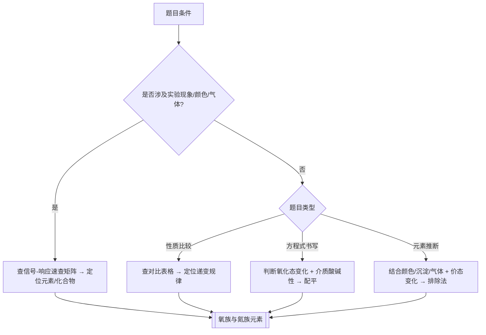
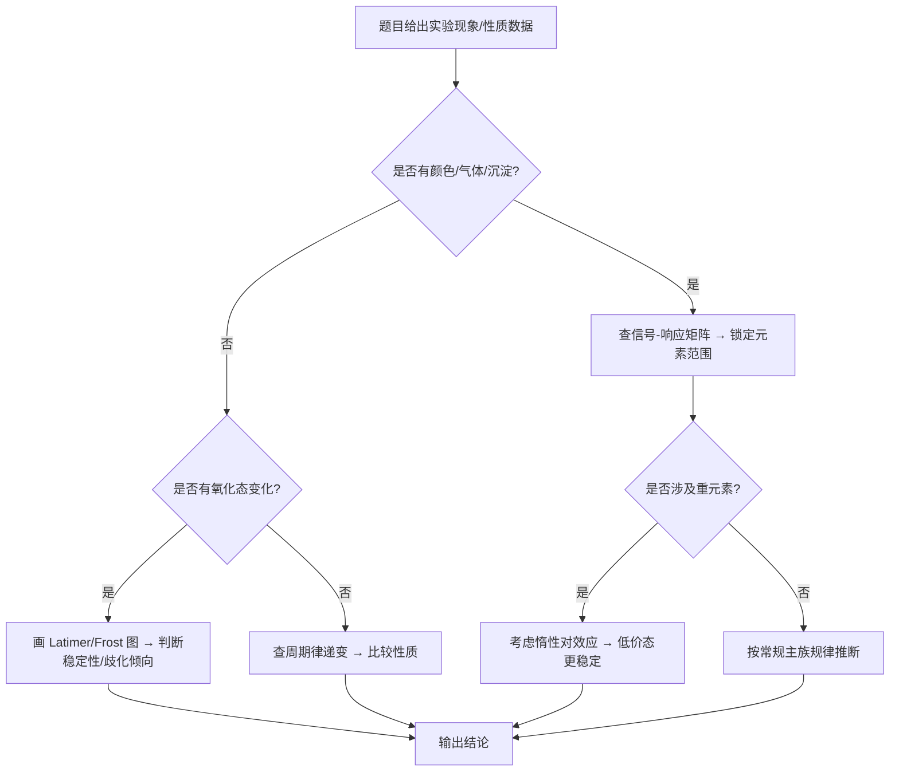

# 专题：氧族与氮族元素

> 本专题对应考纲条目：[[13]]
> 核心知识点：[[氮族元素]]、[[氧族元素]]、[[磷化学]]、[[砷]]、[[惰性对效应]]、[[氢化物]]、[[氧化物]]、[[无机酸]]

---

## 一、核心结论汇总 {#sec-1}

**必须记住：**

1. **N 的成键多样性**：N 可形成 N≡N（945 kJ/mol，惰性）、NH₃（Lewis 碱）、NOx（奇电子分子/混合价态）、HNO₃（强氧化性）等多种键型，是竞赛推断题的高频切入口。
2. **S 的多种氧化态**：硫的氧化态覆盖 −2（H₂S）~ +6（H₂SO₄、SO₃），中间价态（SO₂、S₂O₃²⁻、S₂O₄²⁻）既可被氧化也可被还原，歧化反应是方程式书写的高频考点。
3. **氮族氢化物碱性递变**：NH₃（弱碱）> PH₃（近中性）> AsH₃（近中性）> SbH₃ > BiH₃，同族自上而下碱性递减，还原性递增。
4. **氧族氢化物酸性递变**：H₂O（中性）< H₂S（弱酸，Ka1~10⁻⁷）< H₂Se < H₂Te，同族自上而下酸性递增，热稳定性递减。
5. **Bi 的惰性电子对效应**：6s² 电子因相对论效应难以参与成键，Bi³⁺ 稳定而 Bi(V)（如 NaBiO₃）是强氧化剂；同族自上而下低价态稳定性递增。

**最高频决策路径：**



---

## 二、对比表格 {#sec-2}

### 表 1：N/P/As 含氧酸对比

| 触发条件（题目关键词） | 比较维度 | N（+5） | P（+5） | As（+5） | 常见陷阱 |
|:---|:---|:---|:---|:---|:---|
| "含氧酸酸性比较" "Pauling 规则" | 非羟基氧数 N | HNO₃：N=2 | H₃PO₄：N=1 | H₃AsO₄：N=1 | N 不同时不能用 Pauling 规则直接横向比 |
| "氧化性" "与金属反应产物" | 氧化还原性 | 强氧化性（浓/稀产物不同） | 无氧化性无还原性 | 弱氧化性（酸性中可氧化 I⁻） | 误以为 H₃PO₄ 有氧化性 |
| "热稳定性" "加热分解" | 热稳定性 | 易分解（光/热） | 较稳定 | 较稳定 | HNO₃ 需避光保存 |
| "缩合酸" "多聚" | 缩合倾向 | 不形成稳定缩合酸 | 焦磷酸、偏磷酸、聚磷酸常见 | 缩合酸较少见 | 混淆焦磷酸与偏磷酸结构 |
| "与 Ag⁺ 反应" | 与 AgNO₃ | 无沉淀（酸性） | 生成 Ag₃PO₄ 黄色沉淀 | 生成 Ag₃AsO₄ 暗红色沉淀 | 颜色差异可用于区分 |

### 表 2：O/S/Se 氢化物对比

| 触发条件（题目关键词） | 比较维度 | H₂O | H₂S | H₂Se | 常见陷阱 |
|:---|:---|:---|:---|:---|:---|
| "酸性比较" "Ka" | 水溶液酸性 | 中性（Kw=10⁻¹⁴） | 弱酸（Ka1~10⁻⁷） | 弱酸（Ka1~10⁻⁴） | 第二周期 H₂O 因氢键异常，不能简单按同族递变 |
| "热稳定性" "分解温度" | 热稳定性 | 最高 | 较高 | 较低 | 键能：O–H > S–H > Se–H |
| "还原性" "被氧化" | 还原性 | 很弱 | 弱（可被 SO₂、Fe³⁺ 氧化） | 中等 | H₂S 通入 FeCl₃ 溶液生成 S 沉淀 |
| "沸点异常" "氢键" | 沸点 | 100°C（异常高） | −60°C | −41°C | H₂O 因氢键沸点远高于同族 |
| "与金属反应" | 与活泼金属 | 常温缓慢 | 常温可反应 | 常温可反应 | Na 与 H₂O 剧烈反应，与 H₂S 较温和 |

### 表 3：NOx 性质对比

| 触发条件（题目关键词） | 化合物 | 氧化态 | 颜色 | 磁性 | 关键性质 | 常见陷阱 |
|:---|:---|:---:|:---|:---|:---|:---|
| "笑气" "麻醉气体" | N₂O | +1 | 无色 | 抗磁性 | 直线形 N–N–O，π₃⁴ 键 | 不是 NO 的二聚体 |
| "血管舒张" "棕色环" | NO | +2 | 无色 | 顺磁性（奇电子） | 与 Fe²⁺ 配位形成棕色环 | 易被 O₂ 氧化为 NO₂ |
| "红棕色气体" "二聚" | NO₂ | +4 | 红棕色 | 顺磁性（奇电子） | 低温二聚为 N₂O₄（无色） | 平衡：2NO₂ ⇌ N₂O₄ ΔH<0 |
| "硝酸酸酐" "脱水" | N₂O₅ | +5 | 白色固体 | 抗磁性 | 离子型固体 [NO₂]⁺[NO₃]⁻ | 气态为共价分子 |
| "亚硝酸酸酐" | N₂O₃ | +3 | 蓝色液体 | 抗磁性 | 仅存在于低温/固态 | 易分解为 NO + NO₂ |

### 表 4：NH₃/PH₃/AsH₃ 对比

| 触发条件（题目关键词） | 比较维度 | NH₃ | PH₃ | AsH₃ | 常见陷阱 |
|:---|:---|:---|:---|:---|:---|
| "碱性比较" "质子接受能力" | 碱性 | 弱碱（Kb~1.8×10⁻⁵） | 近中性 | 近中性 | 误以为 PH₃ 是弱碱 |
| "键角" "VSEPR" | 键角 | 107.8° | 93.6° | 91.8° | PH₃、AsH₃ 键角接近 90°，非纯 sp³ |
| "还原性" "自燃" | 还原性 | 弱（需强氧化剂） | 较强（空气中自燃） | 强（受热分解） | 自燃性：PH₃ > AsH₃ > NH₃ |
| "配合物" "配位能力" | 配位能力 | 强（常见氨配合物） | 较强（膦配体） | 较弱 | Ag⁺ + 2NH₃ → [Ag(NH₃)₂]⁺ |
| "制备方法" | 实验室制备 | 铵盐 + 强碱 | 磷化物 + 水/酸 | 砷化物 + 酸 | Zn₃P₂ + 6HCl → 2PH₃ + 3ZnCl₂ |

### 表 5：氧族与氮族族内递变对比（核心框架）

| 触发条件（题目关键词） | 族 | 第二周期 | 第三周期 | 第四周期 | 第五周期 | 第六周期 | 递变规律 | 常见陷阱 |
|:---|:---|:---:|:---:|:---:|:---:|:---:|:---|:---|
| "氢化物酸性"、"Ka比较" | 氧族氢化物 | H₂O（中性） | H₂S（弱酸） | H₂Se（弱酸） | H₂Te（弱酸） | — | 酸性↑，热稳定性↓ | H₂O因氢键反常，不能简单递变 |
| "氢化物碱性"、"Kb比较" | 氮族氢化物 | NH₃（弱碱） | PH₃（近中性） | AsH₃（近中性） | SbH₃（中性） | BiH₃（中性） | 碱性↓，还原性↑ | PH₃不是弱碱，是近中性 |
| "最高价含氧酸" | 氮族含氧酸 | HNO₃（强氧化性） | H₃PO₄（无氧化性） | H₃AsO₄（弱氧化性） | — | — | 氧化性↓，酸性（N特殊） | H₃PO₄无氧化性是常考点 |
| "单质状态"、"颜色" | 氧族单质 | O₂（无色气） | S（黄色固） | Se（灰固） | Te（银白固） | Po（金属） | 非金属性↓，金属性↑ | S₈环状结构是稳定形态 |
| "单质状态"、"颜色" | 氮族单质 | N₂（无色气） | P₄（白/红/黑磷） | As（灰固） | Sb（银白固） | Bi（银白固） | 非金属性↓，金属性↑ | 白磷剧毒，红磷稳定 |

### 表 6：歧化反应条件汇总（硫/氮核心）

| 触发条件（题目关键词） | 反应物 | 酸性条件 | 碱性条件 | 温度影响 | 常见陷阱 |
|:---|:---|:---|:---|:---|:---|
| "硫代硫酸遇酸"、"乳白色浑浊" | S₂O₃²⁻ + H⁺ | S₂O₃²⁻ + 2H⁺ → S↓ + SO₂↑ + H₂O（歧化） | 稳定，不反应 | 常温即反应 | 产物S和SO₂的氧化态：0和+4 |
| "亚硫酸遇酸" | SO₃²⁻ + H⁺ | HSO₃⁻ / H₂SO₃（不歧化） | 稳定 | — | 亚硫酸根在酸中不歧化，区别于硫代硫酸根 |
| "硫化氢被氧化" | H₂S + O₂ | 2H₂S + O₂ → 2S + 2H₂O（不完全燃烧） | — | 点燃完全燃烧→SO₂ | 条件决定产物：不完全→S，完全→SO₂ |
| "NO₂溶于水" | NO₂ + H₂O | 3NO₂ + H₂O → 2HNO₃ + NO（歧化） | 2NO₂ + 2OH⁻ → NO₃⁻ + NO₂⁻ + H₂O | 低温有利于N₂O₄ | NO₂既是氧化剂又是还原剂 |
| "亚硝酸盐遇酸" | NO₂⁻ + H⁺ | 2HNO₂ → NO↑ + NO₂↑ + H₂O（歧化） | 稳定 | 加热加速 | 亚硝酸不稳定，只能存在于冷稀溶液 |
| "磷在碱中歧化" | P₄ + OH⁻ | 不反应 | P₄ + 3OH⁻ + 3H₂O → PH₃↑ + 3H₂PO₂⁻（热浓碱） | 热浓碱才反应 | 产物PH₃（还原）和H₂PO₂⁻（氧化） |

### 表 7：最高价含氧酸酸性 vs 氧化性 反向规律

| 触发条件（题目关键词） | 中心原子 | 含氧酸 | 非羟基氧数 | 酸性强度 | 氧化性 | 典型反应 | 常见陷阱 |
|:---|:---|:---|:---:|:---|:---|:---|:---|
| "最强氧化性含氧酸" | N（+5） | HNO₃ | 2 | 强 | 极强（浓/稀均强） | Cu + 4HNO₃(浓) → Cu(NO₃)₂ + 2NO₂ + 2H₂O | 浓→NO₂，稀→NO，极稀→NH₄⁺ |
| "无氧化性" | P（+5） | H₃PO₄ | 1 | 中强 | 无 | 与金属反应不放出还原性气体 | 误以为H₃PO₄有氧化性 |
| "弱氧化性" | As（+5） | H₃AsO₄ | 1 | 中强 | 弱（酸性中可氧化I⁻） | H₃AsO₄ + 2I⁻ + 2H⁺ → H₃AsO₃ + I₂ + H₂O | As(V)氧化性弱于N(V) |
| "强氧化性" | S（+6） | H₂SO₄(浓) | 2 | 强 | 强（仅浓酸） | C + 2H₂SO₄(浓) → CO₂ + 2SO₂ + 2H₂O | 稀H₂SO₄无氧化性（H⁺氧化性除外） |
| "弱氧化性" | Se（+6） | H₂SeO₄ | 2 | 强 | 弱于H₂SO₄ | — | 同族从上到下含氧酸氧化性减弱 |
| "强氧化性（反常）" | Cl（+7） | HClO₄ | 3 | 极强 | 极弱（热浓才反应） | 常温不与金属反应 | 酸性最强但氧化性极弱 |

> **反向规律总结**：对于同一中心原子，氧化态越高→非羟基氧越多→酸性越强；但同时O–X键越稳定→越难断裂释放氧化能力→氧化性越弱。N是例外（HNO₃兼具强酸性和强氧化性）。

---

## 二点五、信号-响应速查矩阵（元素化学/推断类专题专用） {#sec-2-5}

| 信号类型 | 具体现象 | 可能物种 | 验证操作 | 关联 KP | 典型真题 |
|:---:|:---|:---|:---|:---|:---|
| 颜色 | 红棕色气体 | NO₂（或 N₂O₄ 与 NO₂ 平衡体系） | 降温→颜色变浅（N₂O₄ 无色）；加 O₂→颜色加深 | [[氮族元素]] | 30届初赛-2（棕色环） |
| 颜色 | 无色气体遇空气变红棕 | NO | 通入 FeSO₄ + 浓 H₂SO₄ → 棕色环 | [[氮族元素]] | 30届初赛-2-1 |
| 颜色 | 白色固体，强干燥性 | P₄O₁₀ | 加水→剧烈放热，生成 H₃PO₄ | [[磷化学]] | 常见性质题 |
| 颜色 | 黄色固体，剧毒，水中保存 | 白磷 P₄ | 空气中自燃，发磷光；溶于 CS₂ | [[磷化学]] | 元素推断题 |
| 颜色 | 橙红色矿物 | 雄黄 As₄S₄ | 煅烧→As₂O₃（白色，砒霜） | [[砷]] | 39届初赛-1（雄黄变铁） |
| 颜色 | 白色剧毒固体 | 砒霜 As₂O₃ | 溶于 NaOH → NaAsO₂；与 Zn/HCl → AsH₃ | [[砷]] | 39届初赛-1 |
| 沉淀 | 通入 H₂S 产生黑色沉淀 | PbS、CuS、As₂S₃ 等 | 加稀 HCl：PbS 不溶，ZnS 溶；加 Na₂S：As₂S₃ 溶（生成硫代酸盐） | [[氧族元素]] | 定性分析经典 |
| 沉淀 | 黄色沉淀，溶于浓 HCl | SnS₂ | 不溶于稀酸，溶于碱（与 SnS 区分） | [[碳族元素]] | 29届初赛-8 |
| 气体 | 臭鸡蛋气味 | H₂S | 醋酸铅试纸变黑（PbS） | [[氧族元素]] | 定性分析 |
| 气体 | 大蒜气味，空气中自燃 | PH₃ | 通入 AgNO₃ 溶液→黑色 Ag 沉淀 | [[磷化学]] | 元素推断 |
| 气体 | 极毒，受热分解 | AsH₃ | Marsh 试砷法：热玻璃管中分解→砷镜 | [[砷]] | 经典定性分析 |
| 价态变化 | Sb³⁺ → Sb⁵⁺（需强氧化剂） | SbCl₃ + Cl₂ → SbCl₅ | SOCl₂ 可将 Sb₂O₃ 氧化为 SbCl₅ | [[惰性对效应]] | 36届初赛第二场-1-4 |
| 价态变化 | Bi³⁺ 稳定，Bi(V) 强氧化 | NaBiO₃（紫红色） | 在酸性条件下氧化 Mn²⁺ → MnO₄⁻ | [[惰性对效应]] | 常见性质题 |
| 价态变化 | S₂O₃²⁻ 与酸反应→S + SO₂ | 硫代硫酸分解 | 产物既有 S（0）又有 SO₂（+4），歧化特征 | [[氧族元素]] | 方程式书写 |
| 酸碱性 | 氧化物溶于酸又溶于碱 | As₂O₃（两性偏酸）、Sb₂O₃（两性偏碱） | 溶于 NaOH → 亚砷酸盐/亚锑酸盐；溶于酸 → M³⁺ | [[氧化物]] | 性质比较题 |
| 酸碱性 | 碱性氧化物，不溶于碱 | Bi₂O₃ | 溶于酸 → Bi³⁺（或 BiO⁺）；不溶于碱 | [[氧化物]] | 性质比较题 |
| 配合物 | 深蓝色溶液 | [Cu(NH₃)₄]²⁺ | 加 NaOH 无 Cu(OH)₂ 沉淀（氨配合物稳定） | [[氮族元素]] | 配合物推断 |
| 焰色 | 无焰色（s区外） | As³⁺/Sb³⁺/Bi³⁺ | — | [[氮族元素]] | 氮族离子无焰色，与碱金属区分 |
| 两性氢氧化物 | 白色沉淀，溶于酸和过量碱 | As(OH)₃ / Sb(OH)₃ | 注意Bi(OH)₃不溶于碱（碱性） | [[氮族元素]] | As/Sb两性，Bi碱性 |

> 填写原则：每一行必须对应到一道真题或经典教材例题，确保信号不是"编造"的，而是竞赛考过的。

---

## 三、解题套路 / 决策流程 {#sec-3}

### 套路 A：p区元素推断决策流程



### 套路 B：方程式书写决策流程

| 步骤 | 核心操作 | 依据 KP | 检查清单 |
|:---|:---|:---|:---|
| 1 | 确定反应物和已知产物，标出各元素氧化态 | [[价态-氧化态-形式电荷]] | ☐ 所有元素氧化态已标出 |
| 2 | 判断是否为氧化还原反应；若是，确定氧化剂/还原剂 | [[氧化还原反应方程式配平]] | ☐ 电子得失数计算正确 |
| 3 | 判断反应介质（酸性/碱性/中性），选择 H⁺/OH⁻/H₂O 配平 | [[离子方程式]] | ☐ 介质与题目条件一致 |
| 4 | 配平：先电子守恒 → 再原子守恒 → 最后电荷守恒 | [[方程式书写]] | ☐ 各元素原子数左右相等 ☐ 电荷左右相等 |
| 5 | 验证：检查是否有特殊条件（加热、催化剂、光照） | [[反应速率]] | ☐ 反应条件标注完整 |

### 套路 C：性质比较题决策流程

- **步骤 1**：识别比较维度（酸性/碱性/氧化性/还原性/热稳定性/键角/沸点）
- **步骤 2**：选择正确的比较框架
  - 含氧酸酸性 → Pauling 规则（非羟基氧数）+ 同族电负性趋势
  - 氢化物酸性/碱性 → 键能 + 中心原子电负性 + 半径
  - 氧化还原性 → 标准电极电势 + 介质酸碱性
  - 热稳定性 → 键能 + 晶格能（离子化合物）
- **步骤 3**：注意第二周期反常（N、O、F 的氢键、键能异常）
- **步骤 4**：注意惰性对效应对重元素（Tl、Pb、Bi）的影响

---

## 四、典型例题串讲 {#sec-4}

### 例题 1：氮氧化物反应推断（棕色环反应）⭐⭐

**题目：**（30届初赛第2题改编）
鉴定 NO₃⁻ 离子的方法之一是利用"棕色环"现象：将含有 NO₃⁻ 的溶液放入试管，加入 FeSO₄，混匀，然后顺着管壁加入浓 H₂SO₄，在溶液的界面上出现"棕色环"。分离出棕色物质，研究发现其化学式为 [Fe(NO)(H₂O)₅]SO₄。写出形成"棕色环"的反应方程式。

**分析：**
1. 棕色物质的中心是 Fe²⁺ 与 NO 配位形成的 [Fe(NO)]²⁺ 配离子
2. 反应物中只有 NO₃⁻ 含氮，因此 NO 只能是 NO₃⁻ 的还原产物
3. Fe²⁺ 在酸性条件下具有还原性，可将 NO₃⁻ 还原为 NO
4. 浓 H₂SO₄ 的作用是提供 H⁺，调控电极电势使反应发生

**解答：**

分步反应：

(1) Fe²⁺ 还原 NO₃⁻（酸性条件）：
$$3\mathrm{Fe}^{2+} + \mathrm{NO}_3^- + 4\mathrm{H}^+ \longrightarrow 3\mathrm{Fe}^{3+} + \mathrm{NO} + 2\mathrm{H}_2\mathrm{O}$$

(2) Fe²⁺ 与 NO 配位：
$$\mathrm{Fe}^{2+} + \mathrm{NO} \longrightarrow [\mathrm{Fe}(\mathrm{NO})]^{2+}$$

合并反应：
$$4\mathrm{Fe}^{2+} + \mathrm{NO}_3^- + 4\mathrm{H}^+ \longrightarrow 3\mathrm{Fe}^{3+} + [\mathrm{Fe}(\mathrm{NO})]^{2+} + 2\mathrm{H}_2\mathrm{O}$$

**反思：**
- 浓 H₂SO₄ 提供 H⁺ 是关键：没有酸则看不到棕色环
- NO₃⁻ 在稀酸中被 Fe²⁺ 还原的主要产物是 NO，不是 NO₂
- 合并方程式时需同时满足氧化还原守恒和物料守恒

---

### 例题 2：硫的含氧酸计算与推断 ⭐⭐

**题目：**（常见竞赛改编题）
某含硫化合物 A 的钠盐溶液呈弱碱性。向 A 的溶液中加入稀盐酸，产生乳白色浑浊 B 和刺激性气味气体 C。B 不溶于稀盐酸但可溶于 Na₂S₂O₃ 溶液。气体 C 可使品红溶液褪色。请推断 A、B、C 的化学式，并写出相关反应方程式。

**分析：**
1. "含硫化合物" + "钠盐呈弱碱性" → 可能是硫代硫酸钠 Na₂S₂O₃（弱碱性因 S₂O₃²⁻ 水解）
2. "加稀盐酸产生乳白色浑浊" → 单质硫 S（乳白色/淡黄色）
3. "刺激性气味气体，使品红褪色" → SO₂（特征漂白性，可逆）
4. S 不溶于稀盐酸但溶于 Na₂S₂O₃ → 生成 Na₂S₄O₆（连四硫酸钠），验证

**解答：**

A：Na₂S₂O₃（硫代硫酸钠）
B：S（硫单质）
C：SO₂（二氧化硫）

反应方程式：
$$\mathrm{Na}_2\mathrm{S}_2\mathrm{O}_3 + 2\mathrm{HCl} \longrightarrow 2\mathrm{NaCl} + \mathrm{S}\downarrow + \mathrm{SO}_2\uparrow + \mathrm{H}_2\mathrm{O}$$

S 溶于 Na₂S₂O₃：
$$2\mathrm{Na}_2\mathrm{S}_2\mathrm{O}_3 + \mathrm{S} \longrightarrow \mathrm{Na}_2\mathrm{S}_4\mathrm{O}_6$$

**反思：**
- 硫代硫酸根中 S 的平均氧化态为 +2，歧化为 0（S）和 +4（SO₂）
- 该反应是硫代硫酸根的特征反应，常用于定性鉴定
- SO₂ 使品红褪色是可逆的（加热恢复红色），与 Cl₂ 的不可逆漂白区分

---

### 例题 3：磷的卤化物水解与结构 ⭐⭐⭐

**题目：**（常见竞赛改编题）
PCl₃ 和 PCl₅ 分别与水反应，产物有何不同？请写出反应方程式，并解释原因。固态 PCl₅ 的导电性如何？解释其结构。

**分析：**
1. PCl₃ 中 P 为 +3 氧化态，水解时 P–Cl 键被 P–OH 取代
2. PCl₅ 中 P 为 +5 氧化态，水解更剧烈，生成 H₃PO₄ 和 HCl
3. 固态 PCl₅ 导电 → 存在离子 → [PCl₄]⁺[PCl₆]⁻

**解答：**

PCl₃ 水解：
$$\mathrm{PCl}_3 + 3\mathrm{H}_2\mathrm{O} \longrightarrow \mathrm{H}_3\mathrm{PO}_3 + 3\mathrm{HCl}$$

PCl₅ 水解：
$$\mathrm{PCl}_5 + 4\mathrm{H}_2\mathrm{O} \longrightarrow \mathrm{H}_3\mathrm{PO}_4 + 5\mathrm{HCl}$$

固态 PCl₅ 结构：
$$\mathrm{PCl}_5(\text{固态}) \longrightarrow [\mathrm{PCl}_4]^+[\mathrm{PCl}_6]^-$$

- [PCl₄]⁺：四面体，P 为 sp³ 杂化
- [PCl₆]⁻：八面体，P 为 sp³d² 杂化
- 固态 PCl₅ 因存在离子而具有一定导电性

**反思：**
- PCl₃ 水解产物 H₃PO₃ 是二元酸（有一个 H 直接连在 P 上，不参与电离）
- PCl₅ 气态为三角双锥分子，固态因晶格稳定化转变为离子型结构
- 卤化物水解是竞赛高频考点，需注意氧化态对产物的影响

---

## 五、关联知识点 {#sec-5}

- [[氮族元素]]
- [[氧族元素]]
- [[磷化学]]
- [[磷]]
- [[砷]]
- [[惰性对效应]]
- [[氢化物]]
- [[氧化物]]
- [[无机酸]]
- [[主族元素化学]]
- [[元素化学]]
- [[价态-氧化态-形式电荷]]
- [[氧化还原反应方程式配平]]
- [[离子方程式]]

## 六、关联题型 {#sec-6}

- [[题型-元素推断]]
- [[题型-反应方程式书写]]
- [[题型-性质比较]]
- [[题型-硫的歧化反应]]
- [[题型-氮族化合物推断]]
- [[题型-磷化学推断]]

---

## 七、相关真题 {#sec-7}

```dataview
TABLE file.name AS "文件名", year AS "年份", type AS "题型", difficulty AS "难度"
FROM "04-题库"
WHERE contains(knowledge_points, "氮族元素") OR contains(knowledge_points, "氧族元素") OR contains(knowledge_points, "磷化学") OR contains(knowledge_points, "砷") OR contains(knowledge_points, "惰性对效应") OR contains(knowledge_points, "氮氧化物") OR contains(knowledge_points, "硫的含氧酸") OR contains(knowledge_points, "硫化物")
SORT year DESC, difficulty ASC
```

---

> 涉及本专题的典型真题：
> - 39届初赛 1-2/1-3：雄黄煅烧与伪金分解（As/Sn 热力学计算）（⭐⭐⭐）
> - 39届初赛 1-1：雄黄变铁与砒黄变铜（元素推断）（⭐⭐）
> - 37届决赛理 1-4：磷的结构化学（紫磷/蓝磷晶胞计算）（⭐⭐⭐）
> - 35届初赛 1-3：Fe³⁺氧化硫化物矿（方程式配平）（⭐⭐⭐）
> - 31届初赛 3-1：铋的推断与A的化学式（热重分析）（⭐⭐⭐）
> - 30届初赛 2-1：棕色环形成反应方程式（⭐⭐）
> - 30届初赛 2-3：棕色物质中NO键长变化（⭐⭐⭐）

---

*本专题依据 [[模板-专题]] v1.7 生成，状态：精品。最后更新：2026-06-03。*
