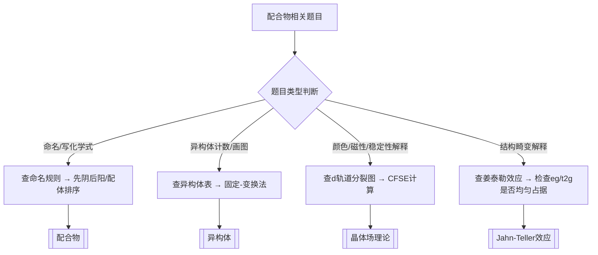
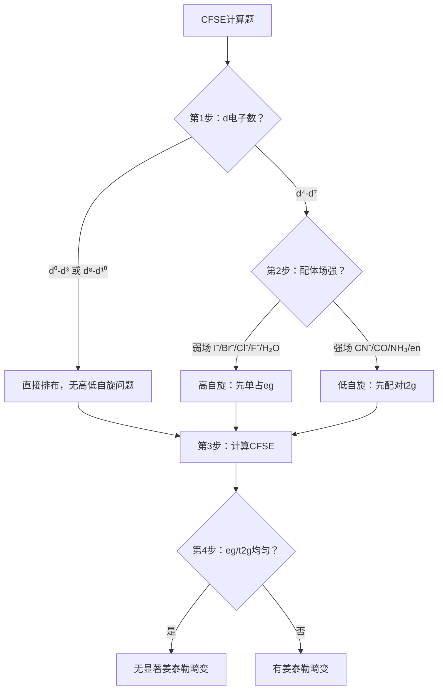

# 专题：配位化学

> 本专题对应考纲条目：[[12]]
> 核心知识点：[[配合物]]、[[晶体场理论]]、[[异构体]]、[[Jahn-Teller效应]]
>
> 新授课教学设计请参考：[[2026-05-31-配位化学-第一轮|备课大纲-配位化学-第一轮]]

---

> 📌 **锚点规范**：
> - `[[专题-配位化学#core-conclusions]]` → 核心结论汇总
> - `[[专题-配位化学#comparison-table]]` → 对比表格
> - `[[专题-配位化学#problem-solving-routine]]` → 解题套路
> - `[[专题-配位化学#mechanism-analysis]]` → d轨道分裂机理
> - `[[专题-配位化学#typical-examples]]` → 典型例题
> - `[[专题-配位化学#related-kp]]` → 关联知识点
> - `[[专题-配位化学#related-exam-questions]]` → 相关真题

## 一、核心结论汇总 {#core-conclusions}

**必须记住：**
1. 配合物命名遵循"先阴后阳、配体排序、词尾变化"三原则，特殊符号 μ（桥联）和 ηⁿ（n齿配位）是配位化学特有的结构语言。
2. 八面体是异构体最丰富的构型：Ma₂b₂c₂ 有 **5种立体异构体**（含1对对映体）；手性判断口诀是 **"无σ无i无S₄则Chiral"**。
3. 晶体场理论的核心是 **d轨道分裂** 与 **CFSE稳定化能**：分裂能 Δ 与配对能 P 的竞争决定高/低自旋；光谱化学序列是竞赛必背的场强排序工具。

**最高频决策路径：**



---

## 二、对比表格 {#comparison-table}

### 表1：杂化类型-构型-实例对应表

| 触发条件 | 杂化类型 | 配位数 | 构型 | 内轨/外轨 | 典型实例 |
|:---|:---|:---:|:---|:---:|:---|
| 配位数2 | sp | 2 | 直线形 | — | [Ag(NH₃)₂]⁺ |
| 配位数4，d⁸强场 | dsp² | 4 | 平面四方形 | 内轨 | [Ni(CN)₄]²⁻ |
| 配位数4，弱场/主族 | sp³ | 4 | 四面体 | 外轨 | [NiCl₄]²⁻、ZnCl₄²⁻ |
| 配位数5 | dsp³ / sp³d | 5 | 三角双锥 | 内轨/外轨 | Fe(CO)₅ |
| 配位数6，强场 | d²sp³ | 6 | 八面体 | 内轨 | [Fe(CN)₆]⁴⁻ |
| 配位数6，弱场 | sp³d² | 6 | 八面体 | 外轨 | [FeF₆]⁴⁻ |

> ⚠️ **常见陷阱**：d⁹ 的平面四方形**不是 dsp²**，而是拉长八面体的极限。看到 Cu²⁺ + 平面 → 先想姜泰勒效应。

### 表2：d轨道分裂能级对比

| 场类型 | 分裂方式 | 能级顺序（高→低） | 分裂能 | 相对大小 |
|:---|:---|:---|:---|:---:|
| 球形场 | 不分裂 | 全部简并 | 0 | 基准 |
| 八面体场 | eg ↑ / t2g ↓ | eg > t2g | Δo | 1.0 |
| 四面体场 | t2 ↑ / e ↓ | t2 > e | Δt ≈ 4/9 Δo | ~0.44 |
| 平面四边形 | 四组分裂 | d_x²₋y² > d_xy > d_z² > d_xz/d_yz | Δp > Δo | >1.0 |

> 💡 **记忆口诀**：八面体 eg 高（像"鹅哥"飞得高），t2g 低（像"踢二哥"蹲得低）；四面体反过来。

### 表3：光谱化学序列与配体分类

| 场强分类 | 配体 | 电子效应 | 典型配合物 | 自旋倾向 |
|:---|:---|:---|:---|:---|
| 弱场（Δ小） | I⁻、Br⁻、Cl⁻、F⁻ | σ给电子 + π给电子（△↓） | [FeF₆]⁴⁻ | 高自旋 |
| 中强场 | H₂O | σ给电子 | [Fe(H₂O)₆]²⁺ | 高自旋（d⁶时） |
| 强场 | NH₃、en | σ给电子 | [Co(NH₃)₆]³⁺ | 低自旋 |
| 强场 | CN⁻、CO | σ给电子 + π受电子（△↑） | [Fe(CN)₆]⁴⁻ | 低自旋 |

> 📌 **初赛要求**：只掌握排序和强弱分类。PPh₃ > I⁻ 等反常现象需要 [[配体场理论]] 解释（σ/π给受电子效应）。

### 表4：CFSE计算速查表（八面体场）

| dⁿ | 弱场(HS)电子排布 | CFSE(HS) | 强场(LS)电子排布 | CFSE(LS) | 自旋状态 |
|:---:|:---|:---:|:---|:---:|:---:|
| d¹ | t2g¹ | -0.4Δo | — | — | — |
| d² | t2g² | -0.8Δo | — | — | — |
| d³ | t2g³ | -1.2Δo | — | — | — |
| d⁴ | t2g³eg¹ | -0.6Δo | t2g⁴ | -1.6Δo | Δ<P HS, Δ>P LS |
| d⁵ | t2g³eg² | 0 | t2g⁵ | -2.0Δo | Δ<P HS, Δ>P LS |
| d⁶ | t2g⁴eg² | -0.4Δo | t2g⁶ | -2.4Δo | Δ<P HS, Δ>P LS |
| d⁷ | t2g⁵eg² | -0.8Δo | t2g⁶eg¹ | -1.8Δo | Δ<P HS, Δ>P LS |
| d⁸ | t2g⁶eg² | -1.2Δo | — | — | — |
| d⁹ | t2g⁶eg³ | -0.6Δo | — | — | — |
| d¹⁰ | t2g⁶eg⁴ | 0 | — | — | — |

> 🔥 **竞赛高频**：d⁴-d⁷ 是高低自旋的"决策区间"，必考。

### 表5：八面体配合物立体异构体速查

| 类型 | 立体异构体数 | 对映体对数 | 记忆提示 |
|:---|:---:|:---:|:---|
| Ma₆ / Ma₅b | 1 | 0 | 全同或单取代 |
| Ma₄b₂ | 2 | 0 | 顺/反 |
| Ma₃b₃ | 2 | 0 | 面式(fac)/经式(mer) |
| Ma₄bc | 2 | 0 | — |
| Ma₃b₂c | 3 | 0 | — |
| **Ma₂b₂c₂** | **5** | **1对** | **核心考点** |
| Ma₂b₂cd | 6 | 1对 | — |
| M(AA)b₂c₂ (AA=双齿) | 更多 | 更多 | 螯合环引入新手性 |

---

## 三、解题套路 / 决策流程 {#problem-solving-routine}

### 套路A：配合物命名拆解

| 步骤 | 核心操作 | 依据 KP | 检查清单 |
|:---|:---|:---|:---|
| 1 | 拆内外界：方括号内 = 内界（配位单元），方括号外 = 外界 | [[配合物]] | ☐ 中心离子氧化态正确 |
| 2 | 配体排序：先无机后有机；同类型先阴离子后中性；字母序 | [[配合物]] | ☐ 配体名称正确（cyano, ammine, chloro） |
| 3 | 中心金属：名称 + 氧化态（罗马数字）| [[配合物]] | ☐ 氧化态计算无误 |
| 4 | 词尾：外界阳离子 → "酸"；外界阴离子或无外界 → "化" | [[配合物]] | ☐ 词尾正确 |
| 5 | 特殊符号：μ = 桥联，ηⁿ = n个原子配位 | [[配合物]] | ☐ 希腊字母标注正确 |

### 套路B：八面体异构体系统枚举

| 步骤 | 核心操作 | 依据 KP | 检查清单 |
|:---|:---|:---|:---|
| 1 | 确定配位数和构型（通常是八面体） | [[异构体]] | ☐ 不是四面体（四面体无几何异构） |
| 2 | 区分构造异构 vs 立体异构 | [[异构体]] | ☐ 连接方式是否相同 |
| 3 | 固定-变换法：固定一个配体在顶点，变换其对位配体 | [[异构体]] | ☐ 没有重复计数 |
| 4 | 对每种构型检查 σ/i/S₄ → 判断手性 | [[异构体]] | ☐ 口诀：无σ无i无S₄则Chiral |
| 5 | 对照速查表验证总数 | [[异构体]] | ☐ Ma₂b₂c₂ = 5种（1对对映体） |

### 套路C：CFSE计算与高低自旋判断

| 步骤 | 核心操作 | 依据 KP | 检查清单 |
|:---|:---|:---|:---|
| 1 | 确定中心金属的 d 电子数 | [[配合物]] | ☐ 氧化态正确 |
| 2 | 判断配体场强（查光谱化学序列） | [[晶体场理论]] | ☐ 配体在序列的左/中/右 |
| 3 | 比较 Δo 与 P：Δo > P → 低自旋；Δo < P → 高自旋 | [[晶体场理论]] | ☐ d⁴-d⁷ 才需要判断 |
| 4 | 写出电子排布，计算 CFSE | [[晶体场理论]] | ☐ t2g 降 2/5Δo，eg 升 3/5Δo |
| 5 | （可选）检查姜泰勒畸变：eg/t2g 是否均匀占据 | [[Jahn-Teller效应]] | ☐ d⁹ 最显著 |



---

## 四、反应机理拆解（d轨道分裂机理） {#mechanism-analysis}

#### 步骤 1：球形场基准
- **状态**：5个 d 轨道简并，能量相同
- **操作**：以球形对称的负电荷场为能量零点

#### 步骤 2：八面体配体接近
- **攻击位点**：6个配体沿 ±x、±y、±z 轴接近
- **轨道排斥**：d_x²₋y² 和 d_z²（eg）电子云指向配体 → 能量升高 +3/5Δo
- **轨道避斥**：d_xy、d_xz、d_yz（t2g）电子云避开配体 → 能量降低 -2/5Δo
- **电子流**：
  ```
  球形场:  ===== ===== ===== ===== =====  (简并)
             ↓     ↓           ↓     ↓
  八面体:   eg↑   eg↑   t2g↓  t2g↓  t2g↓   (分裂)
  ```

#### 步骤 3：电子填充与竞争
- **操作**：d 电子填入分裂后的轨道
- **决策点**：Δo > P？→ 配对（低自旋）: 单占（高自旋）
- **检查表**：
  - ☐ 以球形场为基准计算 CFSE，不是自由离子
  - ☐ t2g 轨道先填满（能量最低原理）
  - ☐ 高自旋时 eg 也单占（洪特规则）

---

## 五、典型例题串讲 {#typical-examples}

### 例题 1：综合——命名 + 异构体 + CFSE
**题目：** [Co(en)₂Cl₂]Cl 的系统命名是什么？它有多少种立体异构体？Co³⁺ 为 d⁶，判断其自旋状态和 CFSE。

**分析：**
1. 命名：en（乙二胺）双齿配体，Cl⁻ 单齿，配体排序先 Cl 后 en → 二氯·二(乙二胺)合钴(III)氯化物
2. 异构体：八面体 M(AA)₂b₂ 型，有 2 种几何异构（顺/反），顺式有旋光性 → 共 3 种立体异构体（1对对映体 + 1个反式）
3. CFSE：Co³⁺ d⁶，en 是强场配体 → 低自旋 t2g⁶eg⁰ → CFSE = -2.4Δo

**解答：**
- 命名：二氯·二(乙二胺)合钴(III)氯化物
- 异构体：3种立体异构体（顺式1对对映体 + 反式1种）
- 自旋：低自旋（反磁性）
- CFSE = -2.4Δo

**反思：** 这道题横跨命名、异构体、CFSE 三个知识块，是竞赛常见综合题模式。

### 例题 2：高低自旋与磁性
**题目：** 比较 [Fe(H₂O)₆]²⁺ 和 [Fe(CN)₆]⁴⁻ 的磁矩大小，并解释原因。

**分析：** Fe²⁺ 为 d⁶。H₂O 是中强场，CN⁻ 是强场。

**解答：**
- [Fe(H₂O)₆]²⁺：H₂O 场强不够 → Δo < P → 高自旋 → t2g⁴eg² → 4个未成对电子 → 磁矩较大（顺磁性）
- [Fe(CN)₆]⁴⁻：CN⁻ 强场 → Δo > P → 低自旋 → t2g⁶eg⁰ → 无未成对电子 → 磁矩 = 0（反磁性）

**反思：** 磁矩实验是判断高/低自旋的实用方法；理论判断通过光谱化学序列。

---

### 例题 3：18 电子规则与配合物稳定性（周坤无机，⭐⭐⭐⭐）

**题目：**
(1) 确定 Fe(CO)ₓ(NO)ᵧ 中 x, y 的值（满足 18 电子规则）。
(2) 判断 Mn(CO)₅ 为何倾向于二聚形成 Mn₂(CO)₁₀。
(3) 写出 Re₂O₇ 与 CO 反应的方程式。

**分析：**
18 电子规则：过渡金属配合物中，金属的 d 电子 + 配体提供的电子 = 18 时最稳定。CO 提供 2e⁻，NO 作为亚硝酰配体时提供 3e⁻（直线型）或 1e⁻（弯曲型，此处取 3e⁻）。

**解答：**
- (1) Fe 原子价电子数 = 8。设 CO 数 = x，NO 数 = y：
  8 + 2x + 3y = 18。取 y = 1（一个 NO），则 x = (18−8−3)/2 = 3.5（不合理）；取 y = 2，则 x = (18−8−6)/2 = 2。**Fe(CO)₂(NO)₂**
  （注：实际稳定存在的是 Fe(CO)₅，NO 替代时常见 Fe(CO)₂(NO)₂）
- (2) Mn(CO)₅：Mn 价电子 = 7，5×CO 提供 10e⁻，总电子数 = 17，不满足 18 电子规则。二聚后 Mn-Mn 键提供 1e⁻ 给每个 Mn：7 + 10 + 1 = **18**，稳定。
- (3) Re₂O₇ + 17CO → 2Re(CO)₅ + 7CO₂（Re 从 +7 被 CO 还原为 0，CO 被氧化为 CO₂）

**反思：**
- 18 电子规则是过渡金属有机化学的核心工具，但不是绝对规律（如 16e⁻ 的 Rh 配合物也有催化活性）
- 二聚化、配体取代、氧化还原都是实现 18 电子的常用策略
- NO 的电子计数：直线型 M-N-O 视为 NO⁺（3e⁻ 给体），弯曲型视为 NO⁻（1e⁻ 给体）

---

## 六、关联知识点 {#related-kp}

- [[配合物]] — 定义、命名、配位数与构型
- [[晶体场理论]] — d轨道分裂、CFSE、光谱化学序列、高低自旋
- [[异构体]] — 构造异构、立体异构、手性判断、枚举方法
- [[Jahn-Teller效应]] — 结构畸变、eg/t2g不均匀占据
- [[杂化轨道理论]] — sp³、dsp²、d²sp³ 等杂化与构型对应
- [[配体场理论]] — σ/π给受电子效应，解释光谱化学序列（第二轮）

## 七、关联题型

- [[题型-配合物命名]]
- [[题型-异构体计数与画图]]
- [[题型-CFSE计算]]
- [[题型-高低自旋判断]]
- [[题型-结构畸变解释]]

---

## 八、相关真题 {#related-exam-questions}

```dataview
TABLE file.name AS "文件名", year AS "年份", type AS "题型", difficulty AS "难度"
FROM "04-题库"
WHERE contains(knowledge_points, "配合物") OR contains(knowledge_points, "晶体场理论") OR contains(knowledge_points, "异构体")
SORT year DESC, difficulty ASC
```

> 查询关键词：配合物、晶体场理论、异构体、配位化学

---

*本专题依据 [[模板-专题]] v1.6 生成，状态：可用。*
*教学逻辑来源：[[教学逻辑提炼-质心-配位化学-第一轮]]*
*新授课教学设计请参考独立的备课大纲文件。*
