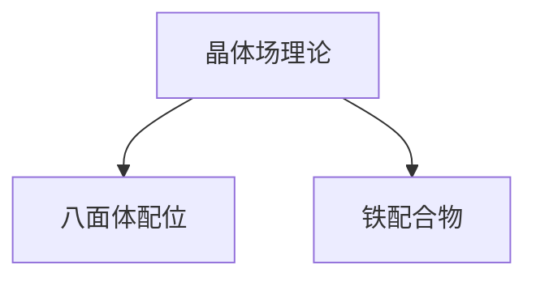

# 晶体场理论等3个知识点 - 新授课

> 生成时间：2026-05-23 | 受众：基础 | 时长：60min
> 引用 KP：3 个 | 难度范围：3 ~ 4

## 一、学习目标

- 能解释 晶体场理论 的核心原理：**具体数值实例**（《普通化学原理》第 14 章）：...
- 能解释 八面体配位 的核心原理：自由离子中 5 个 d 轨道能量简并。在八面体场中，6 个配体沿坐标轴方向接近中心离子：...
- 能解释 铁配合物 的核心原理：Fe²⁺ 为 d⁶ 组态，在八面体场中可形成高自旋或低自旋配合物：...

## 二、前置知识回顾

- [[配合物]]
- [[d轨道]]
- [[配合物]]
- [[VSEPR]]
- [[电子排布]]
- [[氧化还原反应]]

## 三、核心内容

### 3.1 晶体场理论

**核心原理**：
### 八面体场（Oh）中的 d 轨道分裂
- **$e_g$ 轨道**（$d_{x^2-y^2}, d_{z^2}$）：指向配体 → 能量升高
- **$t_{2g}$ 轨道**（$d_{xy}, d_{xz}, d_{yz}$）：指向配体之间 → 能量降低
- **分裂能** $\Delta_o = E(e_g) - E(t_{2g})$，也称 $10Dq$

**具体数值实例**（《普通化学原理》第 14 章）：
- $\mathrm{FeF_6^{3-}}$（弱场）：$\Delta_o = 13700\,\mathrm{cm^{-1}}$，$P = 30000\,\mathrm{cm^{-1}}$，$\Delta_o < P$ → 高自旋
- $\mathrm{Fe(CN)_6^{3-}}$（强场）：$\Delta_o = 34250\,\mathrm{cm^{-1}}$，$\Delta_o > P$ → 低自旋
- $\mathrm{Ti(H_2O)_6^{3+}}$：$\Delta_o = 20400\,\mathrm{cm^{-1}}$（对应吸收波长约 $500\,\mathrm{nm}$）

### 四面体场（Td）
- 分裂能 $\Delta_t \approx \frac{4}{9}\Delta_o$
- 总是**高自旋**（$\Delta_t$ 较小，无法克服配对能）

### 平面正方形场
- 从八面体去掉 z 轴配体推导

**关键结论**：
### 光谱化学序列（配体场强）
$$\mathrm{I}^- < \mathrm{Br}^- < \mathrm{Cl}^- < \mathrm{F}^- < \mathrm{OH}^- < \mathrm{C_2O_4^{2-}} < \mathrm{H_2O} < \mathrm{SCN}^- < \mathrm{NH_3} < \mathrm{en} < \mathrm{SO_3^{2-}} < o\text{-phen} < \mathrm{NO_2^-} < \mathrm{CN}^-, \mathrm{CO}$$

（资料来源：《普通化学原理 第4版》14.5.1 节）

- 弱场配体（$\mathrm{I^-}$ 到 $\mathrm{F^-}$）：$\Delta_o$ 小 → 高自旋
- 中等强场（$\mathrm{H_2O}$、$\mathrm{NH_3}$ 等）：$\Delta_o$ 中等
- 强场配体（$\mathrm{NO_2^-}$、$\mathrm{CN}^-$、CO）：$\Delta_o$ 大 → 低自旋
- 大体以水和 $\mathrm{NH_3}$ 为分界。对不同的中心离子，顺序略有差异。

> ...（详见 [[晶体场理论]] §四）

**典型题型**：
- 题型-晶体场分裂能比较
- 题型-高/低自旋判断
- 题型-CFSE计算
- 题型-配合物颜色推断

### 3.2 八面体配位

**核心原理**：
### 3.1 八面体场中的 d 轨道分裂

自由离子中 5 个 d 轨道能量简并。在八面体场中，6 个配体沿坐标轴方向接近中心离子：

- **$d_{z^2}$ 和 $d_{x^2-y^2}$**（统称 $e_g$ 轨道）：电子云极大值方向正对配体，受排斥较强，能量**升高**
- **$d_{xy}$、$d_{yz}$、$d_{zx}$**（统称 $t_{2g}$ 轨道）：电子云极大值方向位于配体之间，受排斥较弱，能量**降低**

分裂能记为 $\Delta_o$（或 $10Dq$），表示 $e_g$ 与 $t_{2g}$ 之间的能量差：

$$E(e_g) - E(t_{2g}) = \Delta_o$$

以球形场为能量零点：
- $e_g$ 轨道能量：$+\frac{3}{5}\Delta_o = +6Dq$
- $t_{2g}$ 轨道能量：$-\frac{2}{5}\Delta_o = -4Dq$

### 3.2 光谱化学序列

分裂能 $\Delta_o$ 的大小取决于配体场强：

$$
\mathrm{I^- < Br^- < Cl^- < F^- < OH^- < C_2O_4^{2-} < H_2O < SCN^- < NH_3 < en < SO_3^{2-} < phen < NO_2^- < CN^- \sim CO}
$$

> ...（内容过长，详见 [[八面体配位]]）

**关键结论**：
### 4.1 配合物颜色的来源

过渡金属配合物的颜色源于 **d-d 跃迁**：$t_{2g}$ 电子吸收可见光光子跃迁到 $e_g$ 轨道。

- 分裂能 $\Delta_o$ 越大，吸收光波长越短（能量越高）
- 观察到的是被吸收光的**互补色**

| 吸收光颜色 | 波长/nm | 观察到颜色 |
|:---|:---:|:---|
| 紫 | 400–435 | 绿黄 |
| 蓝 | 435–480 | 黄 |
| 绿蓝 | 480–490 | 橙 |
| 蓝绿 | 490–500 | 红 |
| 绿 | 500–560 | 红紫 |
| 黄 | 580–595 | 蓝 |
| 红 | 605–750 | 蓝绿 |

**实例**：
- $[\mathrm{Ti(H_2O)_6}]^{3+}$（d¹）：吸收 ~500 nm 蓝绿光 → 呈**红紫色**
- $[\mathrm{Ni(H_2O)_6}]^{2+}$（d⁸）：吸收红光 → 呈**绿色**
- $[\mathrm{Ni(en)_3}]^{2+}$：en 场强 > H₂O，分裂能增大，吸收光波长变短 → 呈**深蓝色**

### 4.2 磁性的判断

仅自旋磁矩：$\mu_{so} = \sqrt{n(n+2)}\ \mu_B$，其中 $n$ 为未成对电子数。

> ...（详见 [[八面体配位]] §四）

**典型题型**：
1. **判断高/低自旋**：根据配体判断分裂能大小，与成对能比较
2. **CFSE 计算**：给定组态和场强，计算 CFSE
3. **磁性判断**：确定未成对电子数，计算磁矩或判断顺/抗磁性
4. **颜色预测**：根据配体场强变化判断吸收光波长移动方向
5. **Jahn-Teller 判断**：哪些组态的配合物会发生畸变

### 3.3 铁配合物

**核心原理**：
### 3.1 Fe(II) 配合物（d⁶）

Fe²⁺ 为 d⁶ 组态，在八面体场中可形成高自旋或低自旋配合物：

| 配体类型 | 自旋状态 | d 电子排布 | 未成对电子 | 磁性 | 实例 |
|:---|:---:|:---:|:---:|:---:|:---|
| 弱场（$\mathrm{H_2O}$、$\mathrm{F^-}$） | 高自旋 | $t_{2g}^4e_g^2$ | 4 | 顺磁 | $[\mathrm{Fe(H_2O)_6}]^{2+}$（淡绿色）|
| 强场（$\mathrm{CN^-}$、phen） | 低自旋 | $t_{2g}^6$ | 0 | 抗磁 | $[\mathrm{Fe(CN)_6}]^{4-}$（黄色）|

**Fe(II) 配合物的特征**：
- 高自旋 Fe(II) 配合物通常具有还原性，易被氧化为 Fe(III)
- 低自旋 Fe(II) 配合物（如 $[\mathrm{Fe(CN)_6}]^{4-}$）因 CFSE 大（$-2.4\Delta_o$）而非常稳定，显示惰性
- 邻菲啰啉（phen）配合物 $[\mathrm{Fe(phen)_3}]^{2+}$ 呈深红色，用于 Fe²⁺ 的比色测定

### 3.2 Fe(III) 配合物（d⁵）

Fe³⁺ 为 d⁵ 组态：

> ...（内容过长，详见 [[铁配合物]]）

**关键结论**：
### 4.1 Fe(II) 与 Fe(III) 配合物的比较

| 性质 | Fe(II) 配合物 | Fe(III) 配合物 |
|:---|:---|:---|
| d 电子数 | d⁶ | d⁵ |
| 氧化还原性 | 易被氧化（还原性） | 可被还原，也可氧化其他物质 |
| 水解倾向 | 较弱 | 较强（溶液显酸性） |
| 典型颜色 | 淡绿、黄、深红（phen） | 淡紫、黄、血红（SCN⁻） |
| 高低自旋 | 弱场高自旋，强场低自旋 | 弱场高自旋，强场低自旋 |
| 稳定化能（弱场） | $-0.4\Delta_o$ | $0$ |
| 稳定化能（强场） | $-2.4\Delta_o + 2P$ | $-2.0\Delta_o + 2P$ |

### 4.2 铁配合物的颜色

> ...（详见 [[铁配合物]] §四）

**典型题型**：
1. **自旋状态判断**：根据配体判断 Fe(II)/Fe(III) 配合物的高/低自旋
2. **磁矩计算**：确定未成对电子数，计算仅自旋磁矩
3. **颜色预测**：根据配体场强变化判断吸收光波长移动
4. **氧化还原反应**：写出 Fe(II) 被氧化或 Fe(III) 被还原的配位反应方程式
5. **鉴定反应**：利用 SCN⁻、phen 等配体鉴定 Fe²⁺/Fe³⁺

## 四、易错点预警

**晶体场理论**：
- **❌ 错：** 混淆 CFSE 公式的正负号 → $t_{2g}$: −0.4Δo, $e_g$: +0.6Δo（记住：$t_{2g}$ 降低能量，$e_g$ 升高能量）
- **❌ 错：** LS 的 CFSE 忘记加配对能项 → LS 比 HS 多出的配对电子对需要额外能量
- **❌ 错：** 将四面体场的 d 轨道符号写成 $e_g$/$t_{2g}$ → Td 中无对称中心，记作 e 和 t₂
- **❌ 错：** 认为所有 d⁴-d⁷ 都有 HS/LS 之分 → 4d 和 5d 金属几乎总是 LS（Δo 足够大）

**八面体配位**：
1. **四面体场分裂方向记反**：四面体场中 $e$ 能量低于 $t_2$，与八面体相反

**铁配合物**：
1. **混淆 Fe(II) 和 Fe(III) 配合物的颜色**：如将 $[\mathrm{Fe(CN)_6}]^{4-}$（黄）与 $[\mathrm{Fe(CN)_6}]^{3-}$（红）记混

## 五、课堂例题

**晶体场理论**：
> 详见 [[晶体场理论]] §十

**八面体配位**：
> 详见 [[八面体配位]] §十

**铁配合物**：
> 详见 [[铁配合物]] §十

## 六、知识网络

## 七、课后小结

- **晶体场理论**（importance=5, difficulty=4）
- **八面体配位**（importance=4, difficulty=3）
- **铁配合物**（importance=4, difficulty=3）

## 八、📝 授课复盘

（授课后填写）

- 实际用时：
- 学生反馈：
- 需调整内容：
- 补充真题：
