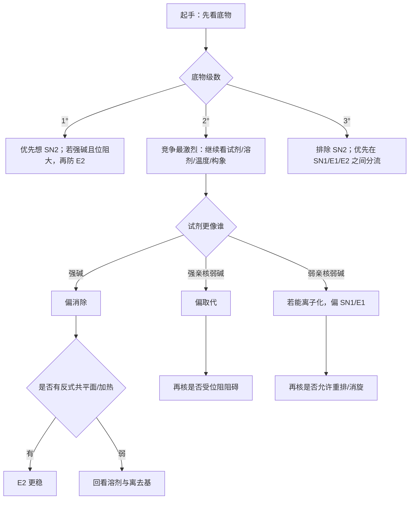

# 亲核取代与消除反应（提高班新授课）

> *2026-06-19 复核说明：本页已与专题页、备课大纲、教学洞察完成成套校对，状态统一升为 `已审校`。*

> 课型：新授课 | 轮次/班型：第三轮/提高班 | 时长：180 min | 核心 KP：6 个
>
> 📌 前置知识：[[专题-活性中间体与反应机理基础]]、[[有机结构基础与电子效应]]、[[立体化学]]
> 🔗 对应备课大纲：[[04-课件/备课大纲/2026-06-04-亲核取代与消除反应-提高班]]

## 0.1 来源与工具入口

- **主要来源**：[[07-资料提炼/教学逻辑提炼/学而思 有机化学基础/教学逻辑提炼-学而思有机化学基础-批次B-SN与E及加成系统]]、[[07-资料提炼/网课资料/学而思 有机化学基础/提炼-学而思有机化学基础-批次B-卤代烃烯烃炔烃与二烯烃]]
- **建议先配合使用**：[[第三轮有机判断总卡]]、[[第三轮有机-常见试剂与机理赛道总表]]
- **本讲推荐工具卡**：[[04-课件/工具卡/SN-E竞争一页判断卡]]

---

## 一、课堂引入与本节问题

### 1.1 课堂切入

- **现象/问题/情境**：
  1. 为什么同一个卤代烃，换个试剂就可能从取代变成消除？
  2. 为什么有些题主要考构型翻转，有些题却在考烯烃位置？
  3. 为什么第三轮必须把 SN1、SN2、E1、E2 统一起来看？
- **学生已有认知**：你已经见过四类反应的基本定义，但现在还缺一套稳定的竞争判断方法。
- **本节要解决的问题**：
  1. 第三轮遇到 SN/E 题时，第一步到底看什么？
  2. 怎样分清强亲核和强碱的不同角色？
  3. 怎样避免在二级底物和环己烷 E2 题里失分？

### 1.2 学习目标

- **本节讲到哪里为止**：能对第三轮常见 SN/E 竞争题完成主路径判断、立体后果判断和特殊修正判断。
- **后续深入学习**：更高阶速率理论、特殊 SNi / SRN1、大量金属有机特化路径。

### 1.3 本节使用方式

- 课堂上请把这节当成“判断课”而不是“背概念课”。
- 每道题先按五问走：
  1. 底物几级
  2. 试剂更亲核还是更碱
  3. 溶剂在帮谁
  4. 温度在推谁
  5. 有没有构象、重排、邻基参与修正
- 课后复盘时，优先把二级底物竞争题和环己烷 E2 题单独拿出来重做一遍。

> **本节先给结论**：第三轮取代/消除题统一按五问走：
>
> 1. 底物几级？
> 2. 试剂更亲核还是更碱？
> 3. 溶剂在帮谁？
> 4. 温度在推谁？
> 5. 有没有几何、重排、邻基参与修正？

---

## 二、知识内容

### 2.1 为什么四条路径要统一看

**从问题出发**：为什么学生把 SN1、SN2、E1、E2 分开背之后，做题反而更乱？

**课堂精简版：**

```text
因为题目真正考的
不是“你记不记得四个定义”，
而是“你能不能判断谁在竞争中胜出”。
```

本节把四条路径压成两个维度：

- **协同 vs 分步**
- **取代 vs 消除**

这样看，四条路径就不再是四个孤岛。

**阶段性小结**：

- 第三轮做这类题时，先进入竞争视角，再想具体机理。

> [!tip] 学而思式课堂抓手
>
> 第三轮 SN/E 题最容易失分的，不是不会定义，而是“第一眼没先判赛道”。
> 看到题目先不要急着写 `SN2` 或 `E2`，先问自己：
> `这是在比谁更快进攻，还是在比谁更容易夺 β-H？`
> 这一步做对了，后面的机理名往往就是结果而不是起点。

> [!info]- 课堂补充表：SN/E 题第一步怎么分流
>
> | 维度 | 优先看什么 | 常见意义 |
> |:---|:---|:---|
> | 底物 | 甲基/一级/二级/三级 | 决定哪几条路径有资格竞争 |
> | 试剂 | 强亲核还是强碱 | 决定偏取代还是偏消除 |
> | 溶剂 | 极性质子/非质子 | 决定是否扶持离子型或背面进攻 |
> | 温度 | 是否升高 | 常推动消除 |

---

### 2.2 SN2 / SN1：取代的两种语言

#### 2.2.1 SN2：背面进攻才是灵魂

**课堂精简版：**

```text
SN2
一步协同
亲核体从背面进攻
离去基同时离去
所以构型翻转
```

这类题最常见模板：

- 甲基或一级底物；
- 强亲核、弱碱；
- 极性非质子溶剂；
- 明确出现构型翻转。

#### 2.2.2 SN1：碳正离子一出现，事情就复杂了

**课堂精简版：**

```text
SN1
先离去形成碳正离子
再被亲核体捕获

所以要同时防：
外消旋
重排
和 E1 竞争
```

第三轮最重要的是：

- SN1 不要只记“三级底物”；
- 一旦判到 SN1，就要自动联想到 **重排** 和 **E1**。

**阶段性小结**：

- SN2 看背面进攻，SN1 看碳正离子后果。

**例题化训练 1：**

```text
题目：某二级卤代烃在 NaCN / DMSO 中反应，为什么优先想到 SN2？
课堂重点：
1. 先看底物没有大到完全堵死
2. 再看 CN- 更像强亲核弱碱
3. 极性非质子溶剂继续扶持 SN2
```

---

### 2.3 E2 / E1：消除的两种语言

#### 2.3.1 E2：先看 anti，不先看 Zaitsev

**课堂精简版：**

```text
E2
一步协同
β-H 和离去基要 anti-periplanar
满足几何后再谈主产物
```

所以第三轮里：

- 环己烷 E2 题必须翻椅式；
- 大位阻碱会把选择性往 Hofmann 侧推；
- 几何要求经常比“哪边更稳定”更先决定能不能反应。

#### 2.3.2 E1：和 SN1 共享同一个碳正离子

E1 最好永远和 SN1 一起讲：

- 先形成碳正离子；
- 再失 β-H 形成烯烃；
- 高温常更有利于消除路径。

**阶段性小结**：

- E2 的门槛是几何，E1 的门槛是碳正离子。

> [!info]- 课堂补充表：SN2 / E2 最短对照
>
> | 比较点 | SN2 | E2 |
> |:---|:---|:---|
> | 本质 | 背面进攻取代 | 协同消除 |
> | 最常看 | 亲核性、位阻 | 碱性、anti 几何 |
> | 高频结果 | 构型翻转 | 烯烃位置与构型 |
> | 易错点 | 忘看位阻 | 忘看反式共平面 |

---

### 2.4 二级底物：真正的竞争主战场

**从问题出发**：为什么二级卤代烃最难判断？

**关键推理/观察**（课堂精简版）：

```text
二级底物
既不够空让 SN2 永远稳赢
也不够稳让 SN1 永远稳赢

所以必须同时看：
试剂
溶剂
温度
几何
```

第三轮这里最容易掉进的坑是：

- 看到 `HO-` 就机械写 SN2；
- 看到 `EtOH` 就机械写 SN1；
- 完全不做并列权重判断。

**阶段性小结**：

- 二级底物题的目标不是“秒答”，而是“并列判断后再收敛”。

**例题化训练 2：**

```text
题目：二级卤代烃在 EtONa / EtOH / 加热条件下主路径是什么？
课堂重点：
1. 先承认有竞争
2. 再把强碱、质子溶剂、加热并列进去
3. 最后收敛到 E2 更占优
```

---

### 2.5 E2 构象：环己烷题必须做空间分析

**从问题出发**：为什么有的底物看起来有 β-H，却就是不走 E2？

**课堂精简版：**

```text
不是所有 β-H 都能消。

E2 需要：
H 和离去基反式共平面
在环己烷里常对应 trans-diaxial
```

这类题第三轮一定要会：

1. 翻椅式；
2. 找轴向离去基；
3. 找与之 anti 的轴向 β-H；
4. 再判能生成哪一支烯烃。

**阶段性小结**：

- 对 E2 来说，空间几何不是修饰信息，而是准入条件。

> [!info]- 课堂补充表：环己烷 E2 的固定检查顺序
>
> 1. 先翻到离去基尽量轴向  
> 2. 再找与之 trans-diaxial 的 β-H  
> 3. 再判断能生成哪支烯烃  
> 4. 最后才谈 Zaitsev / Hofmann

---

### 2.6 邻基参与：为什么有些题“看起来像错了”

**从问题出发**：为什么有些取代题最后却表现得像构型保持？

**关键推理/观察**（课堂精简版）：

```text
邻基参与
先分子内帮忙成环或成鎓离子
再被外来亲核体打开

两次翻转
表面上就可能变成保持
```

第三轮先建立识别意识就够：

- 异常快；
- 异常保持；
- 出现分子内协助离去；
- 这类都应优先想到邻基参与。

**阶段性小结**：

- 邻基参与不是“偏题”，而是第三轮判断框架里的修正器。

### 2.8 取代/消除工具整合页：第三轮最常用的“判断按钮”

> [!info]- 课堂总表：SN/E 题的五个按钮
>
> | 按钮 | 代表问题 | 常见落点 |
> |:---|:---|:---|
> | 底物级数 | 哪几条路径有资格竞争 | 先筛赛道 |
> | 亲核/碱性 | 试剂更想“打”还是“拔” | 取代 vs 消除 |
> | 溶剂 | 帮离子型还是帮背面进攻 | SN1/E1 vs SN2 |
> | 温度 | 是否推动消除 | E1/E2 比例 |
> | 修正器 | 几何、重排、邻基参与 | 防止机械套结论 |

### 2.9 课堂例题串讲模板

#### 例题 A：一级/三级快速判断

```text
课堂重点：
1. 先用底物级数删去不合理路径
2. 再看试剂亲核/碱性
3. 最后补溶剂和温度
```

#### 例题 B：环己烷 E2

```text
课堂重点：
1. 必翻椅式
2. 必找 trans-diaxial
3. 不要直接套 Zaitsev
```

---

### 2.7 课末统一收束：五问判断法

**第三轮固定操作：**

1. **底物几级**
2. **试剂更亲核还是更碱**
3. **溶剂在帮谁**
4. **温度在推谁**
5. **几何/重排/邻基参与有没有修正**

> [!info]- 课后复习用：本节统一判断清单
>
> ```text
> 甲基/一级 + 强亲核弱碱 → SN2
> 三级 + 极性质子 → SN1 / E1
> 二级 + 强碱 → 优先防 E2
> 环己烷 E2 → 必做 trans-diaxial 检查
> 一旦有碳正离子 → 自动防重排
> ```

---

## 三、课堂投影速查卡

### 3.1 一页判断卡

| 先看什么 | 典型信号 | 第一判断 |
|:---|:---|:---|
| 底物级数 | 1° / 2° / 3° | 先排除不可能的机理 |
| 试剂角色 | 强亲核 / 强碱 / 弱亲核弱碱 | 先判取代还是消除更占优 |
| 溶剂 | 极性质子 / 极性非质子 | 是在扶持离子型还是协同进攻 |
| 温度 | 加热 / 常温 | 是否明显推消除 |
| 几何条件 | 环己烷、反式共平面 | E2 是否被构象强约束 |

### 3.2 图后立刻练 / 讲后 1 题 / 课后 2 题

**图后立刻练**

- `2-溴丁烷 + EtONa / EtOH, △`，先不写答案，只说你会先看哪三项。

**讲后 1 题**

- 比较 `2-溴丁烷 + NaCN / DMSO` 与 `2-溴丁烷 + t-BuOK / t-BuOH` 的主路径，要求先说“五问法”中的前两问。

**课后 2 题**

- 自拟一个“二级底物 + 强亲核弱碱”场景，说明为什么更偏 `SN2`。
- 自拟一个“二级底物 + 强碱 + 加热”场景，说明为什么更偏 `E2`，并补一句构象或热力学理由。

### 3.3 第二张教学图



### 3.4 配套题单入口

- `第一组（基础分流）`：一级 / 二级 / 三级底物各 2 题，只练“主路径判断”。
- `第二组（高频失分）`：二级底物竞争、环己烷 `E2`、弱亲核弱碱离子型分流。
- `第三组（讲评专用）`：让学生先口述“五问法”，再允许写机理名，训练“先判断后命名”。
- 对应独立题单：[[04-课件/新授课/2026-06-14-SN-E配套题单-提高班]]
- 对应讲评顺序页：[[04-课件/新授课/2026-06-15-SN-E讲评顺序页-提高班]]

---

## 四、课堂小结

### 3.1 本节主结论

1. 第三轮 SN/E 题必须按竞争系统来做，而不是按单一机理定义来背。
2. SN1 与 E1 共用碳正离子，SN2 与 E2 共用协同几何逻辑。
3. 二级底物是竞争主战场，环己烷 E2 是几何主战场。
4. 邻基参与和重排是最常见的修正因子。

### 3.2 你现在应该会做的事

- 能先判断主竞争路径；
- 能说清为什么是取代还是消除；
- 能判断 Walden 翻转、外消旋、E2 几何要求；
- 能识别重排与邻基参与。

---

## 五、板书建议 / 课堂抓手

```text
五问判断法
1. 底物几级
2. 亲核 or 碱
3. 溶剂
4. 温度
5. 修正项

两对关系
SN1 ↔ E1（碳正离子）
SN2 ↔ E2（协同）
```

---

## 六、课后任务

1. 用五问法整理 4 道 SN/E 综合题。
2. 写一张 `SN1/SN2/E1/E2` 对照卡。
3. 若学有余力，再做 1 道环己烷 E2 构象题。

---

*本讲义依据 [[模板-新授课]] 结构与第三轮专题口径整理。*
