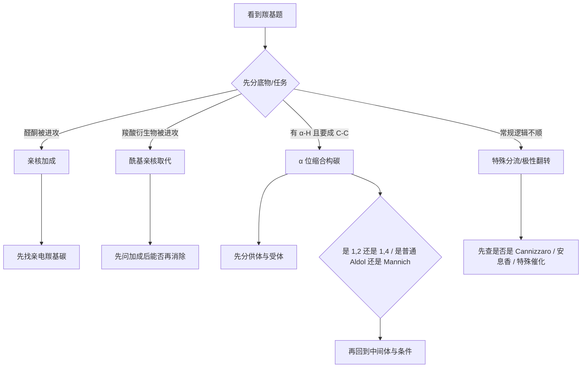

# 羰基化学与缩合反应（提高班新授课）

> 课型：新授课　|　轮次/班型：第三轮/提高班　|　时长：180 min　|　核心 KP：10 个
>
> 📌 前置知识：[[亲核加成]]、[[亲核取代]]、[[专题-活性中间体与反应机理基础]]
> 🔗 对应备课大纲：[[04-课件/备课大纲/2026-06-04-羰基化学与缩合反应-提高班]]
>
> 2026-06-18 复核说明：本讲义引用的 `教学洞察`、工具卡、配套题单与讲评顺序页均已实存；当前仍需继续补的是题库层的正式真题挂接，而不是讲义主干内容。

## 0.1 来源与工具入口

- **主要来源**：[[07-资料提炼/教学逻辑提炼/学而思 有机化学基础/教学逻辑提炼-学而思有机化学基础-批次D-羰基亲核加成与转化网络]]、[[07-资料提炼/教学逻辑提炼/学而思 有机化学基础/教学逻辑提炼-学而思有机化学基础-批次E-酰基取代与活泼亚甲基工具箱]]、[[07-资料提炼/教学逻辑提炼/Zchem 有机反应合成与机理/教学逻辑提炼-Zchem-周环反应与活性中间体-第三轮]]、[[07-资料提炼/教学逻辑提炼/Zchem 有机反应合成与机理/教学逻辑提炼-Zchem-波谱分析与结构表征-第三轮]]
- **建议先配合使用**：[[第三轮有机判断总卡]]、[[第三轮有机-常见试剂与机理赛道总表]]
- **本讲推荐工具卡**：[[04-课件/工具卡/羰基四分法工具卡]]、[[04-课件/工具卡/碳试剂工具箱总表]]

### 0.1.1 本课网课调用顺序

1. **学而思批次 D**：先立住羰基亲电中心和“为什么会被进攻”的总纲。
2. **学而思批次 E**：再把酰基取代和活泼亚甲基工具箱接上。
3. **Zchem 活性中间体页**：把烯醇/烯醇负离子和机理解释层抬高。
4. **Zchem 波谱页**：最后补上羰基判断的证据层。

---

## 一、课堂引入与本节问题

### 1.1 课堂切入

- **现象/问题/情境**：
  1. 为什么醛酮总像在“挨打”，不断被各种亲核试剂进攻？
  2. 为什么羧酸衍生物不像醛酮那样停在加成，反而常继续消除？
  3. 为什么同样围绕羰基，Aldol、Mannich、Knoevenagel、安息香缩合会走出完全不同的构碳路径？
- **学生已有认知**：你已经见过羰基、亲核加成、亲核取代、Grignard、碳负离子和部分人名反应，但这些知识还没有被组织成一个统一框架。
- **本节要解决的问题**：
  1. 怎样用统一语言看待“羰基为什么会反应”？
  2. 怎样快速判断题目属于加成、取代、缩合还是特殊分流？
  3. 怎样从羰基题直接过渡到第三轮综合机理题和基础逆合成题？

### 1.2 学习目标

- **本节讲到哪里为止**：建立“羰基主线四分法”，掌握常见缩合和特殊分流的判断口径。
- **后续深入学习**：Mukaiyama Aldol、Reformatsky、不对称控制模型、复杂保护基路线。

### 1.3 本节使用方式

- 这节最重要的是先分流，不要一上来就猜反应名。
- 看到羰基题先判断它属于哪一类：
  1. 亲核加成
  2. 酰基亲核取代
  3. α 位活化后的缩合构碳
  4. 特殊分流/极性翻转
- 课后复盘建议顺序：
  1. 先把“羰基四分法”说顺
  2. 再回做 `Aldol / Cannizzaro / 安息香 / Mannich`
  3. 最后再看活泼亚甲基工具题

> **本节先给结论**：第三轮看到羰基题，先不要急着背反应名，而要先问四件事：
>
> 1. 这里是不是在考 **亲核加成**？
> 2. 这里是不是在考 **酰基亲核取代**？
> 3. 这里是不是在考 **α 位活化后的缩合构碳**？
> 4. 这里是不是在考 **特殊分流/极性翻转**？

---

## 二、知识内容

> 📷 **图片策略**：本专题类型为 `mechanism`，默认 `images_priority: high`。
> - **机理类**（mechanism）：鼓励在讲义中预留箭头推动图位置，或引用 Excalidraw 手绘图

### 2.1 羰基为什么是有机反应中的“反应中心”

**从问题出发**：为什么很多有机试剂最后都在“找羰基”？

**关键推理/观察**（课堂精简版）：

```text
O 的电负性 > C
→ C=O 极化
→ 羰基碳带部分正电
→ 成为亲核试剂最常见的攻击位点
```

羰基的最核心结构特征有两点：

1. **极性强**：C=O 不是中性对称双键，而是明显偏向 O 的极性双键。
2. **平面结构**：羰基碳通常为 `sp2` 杂化，进攻前后立体后果清晰，便于后续讨论选择性。

> [!tip] 网课常用判断抓手
>
> 第三轮羰基题不要背成“很多人名反应的名单”，而要先问：
> `这个底物现在更像是在提供亲电中心，还是在提供 α 位碳负离子等效体？`
> 一旦这个角色分清，Aldol、Mannich、Cannizzaro、安息香这几条线就不会混成一团。

> [!info]- 完整推导与教材对照（课后复习用）
>
> **教材来源**：ABOC 第 6 章相关部分、[[教学逻辑提炼-学而思有机化学基础-批次D-羰基亲核加成与转化网络]]
>
> **完整推导/补充内容**：
> ```text
> 羰基亲电性大小通常受两类因素控制：
> 1. 电子因素：取代基越给电子，羰基碳越不缺电子
> 2. 位阻因素：周围越拥挤，亲核体越难靠近
> 
> 因此常见活性顺序可粗略理解为：
> HCHO > 脂肪醛 > 芳香醛 > 脂肪酮 > 芳香酮
> ```
>
> **与教材的对照说明**：
> - 教材常先分“命名/分类/性质”，本讲义直接把主线压到“羰基亲电中心”上。
> - 学而思资料更强调“Nu 不同导致分流不同”，这正是第三轮最有用的组织方式。

**阶段性小结**：

- 第三轮看羰基，第一反应应是：**谁会来进攻羰基碳**。
- 但这只是第一层，后面还要看它会不会停在加成、继续消除，或干脆转去 α 位化学。

> [!info]- 课堂补充表：羰基题四分法总表
>
> | 题型 | 一号判断 | 常见代表 |
> |:---|:---|:---|
> | 亲核加成 | 谁打羰基碳 | NaBH4、Grignard、HCN |
> | 酰基亲核取代 | 有没有离去基 | 酰氯、酯、酰胺 |
> | α 位缩合 | 谁做供体、谁做受体 | Aldol、Mannich、Claisen |
> | 特殊分流/极性翻转 | 是否在考反常路径 | Cannizzaro、安息香缩合 |

**对比表格**：

| 维度 | 醛 | 酮 | 常见陷阱 |
|:---|:---|:---|:---|
| 电子效应 | 通常更亲电 | 两侧烷基/芳基给电子更强 | 只背“醛比酮活泼”不解释 |
| 位阻 | 更小 | 更大 | 忘记位阻是第二重原因 |
| 亲核加成活性 | 通常更高 | 通常更低 | 把所有例外都强行套顺序 |

> 🔷 **拓展**（选讲）：芳香酮为什么常比脂肪酮还难加成？可从共轭与位阻双重角度理解。

---

### 2.2 为什么有的羰基“停在加成”，有的却“继续消除”

**从问题出发**：同样是亲核试剂进攻羰基，为什么醛酮和羧酸衍生物走的不是同一条路？

**关键推理/观察**（课堂精简版）：

```text
醛酮：Nu 进攻 → 四面体中间体 → 常停在加成产物

羧酸衍生物：Nu 进攻 → 四面体中间体
                 ↓
             存在可离去基
                 ↓
             再消除 → 酰基亲核取代产物
```

这意味着羰基题至少分成两种母型：

1. **亲核加成型**：典型对象是醛、酮。
2. **酰基亲核取代型**：典型对象是酰氯、酸酐、酯、酰胺等羧酸衍生物。

> [!info]- 完整推导与教材对照（课后复习用）
>
> **教材来源**：ABOC 第 6 章、[[羧酸衍生物]]、[[教学逻辑提炼-学而思有机化学基础-批次E-酰基取代与活泼亚甲基工具箱]]
>
> **完整推导/补充内容**：
> ```text
> 羧酸衍生物之所以能“加成后再消除”，关键在于：
> - 羰基旁边带着潜在离去基（Cl, OCOR, OR, NR2 等）
> - 四面体中间体可回塌
> - 回塌后若离去基能离去，就形成新的酰基取代产物
> 
> 活性顺序本质：
> 酰氯 > 酸酐 > 酯 > 酰胺
> 
> 根本原因不是“官能团名字不同”，而是离去基稳定性不同。
> ```

**阶段性小结**：

- 第三轮区分羰基题时，第二个动作是看：**这个羰基旁边有没有可离去基**。
- 一旦有离去基，就要考虑“加成-消除”而不是“单纯加成”。

**例题化训练 1：**

```text
题目：为什么酯和 Grignard 反应常不会停在一次加成产物？
课堂重点：
1. 先画四面体中间体
2. 再看 OR 是否能离去
3. 最后解释为什么会继续走
```

**对比表格**：

| 维度 | 醛/酮 | 羧酸衍生物 | 常见陷阱 |
|:---|:---|:---|:---|
| 基本反应型 | 亲核加成 | 酰基亲核取代 | 把所有羰基都按加成处理 |
| 四面体中间体后果 | 常停在加成物 | 常继续消除 | 只会画第一步，不会判断终点 |
| 关键判据 | 羰基亲电性 | 离去基能力 | 忘记看离去基 |

---

### 2.3 羧酸衍生物为什么不能直接“想当然”成酰胺

**从问题出发**：为什么合成题里“羧酸 + 胺”不能随手直接写成酰胺？

**关键推理/观察**（课堂精简版）：

```text
羧酸 + 胺
→ 先发生酸碱中和
→ 得到铵盐
→ 胺亲核性下降
同时羧酸本身的 -OH 又是差离去基
→ 直接高效酰胺化困难
```

因此，第三轮合成设计中更合理的口径是：

- 先把羧酸**活化**成更高活性的酰基衍生物；
- 再让胺去进攻；
- 或使用缩合剂完成“等效活化”。

> [!info]- 完整推导与教材对照（课后复习用）
>
> **教材来源**：[[羧酸衍生物]]、ABOC 羧酸衍生物部分
>
> **完整推导/补充内容**：
> ```text
> 直接酰胺化困难的两个根本原因：
> 1. 酸碱反应比亲核加成更快
> 2. 羧酸的 -OH 不是好离去基
> 
> 典型解决路径：
> 羧酸 → 酰氯 / 酸酐 / 活化酯 → 酰胺
> ```

**阶段性小结**：

- 第三轮合成题里看到羧酸和胺共存，先不要写“直接成酰胺”。
- 先问一句：**有没有活化步骤？**

> [!info]- 课堂补充表：看到羧酸 + 胺时先排查什么
>
> | 问题 | 先看什么 | 常见结论 |
> |:---|:---|:---|
> | 能否直接酰胺化 | 是否先发生酸碱中和 | 常常先成盐 |
> | 是否需要活化 | `-OH` 是否是好离去基 | 通常需要活化 |
> | 合成题是否合理 | 有没有酰氯/缩合剂/DCC 等 | 没有就先警觉 |

---

### 2.4 α 位活化：羰基不只会“挨打”，也会“反攻”

**从问题出发**：为什么羰基化学后半段突然出现那么多缩合反应？

**关键推理/观察**（课堂精简版）：

```text
羰基 α-H 在一定条件下可被夺走
→ 形成烯醇/烯醇负离子
→ 这个物种可作为亲核体去攻击别的亲电中心
→ 构成一大类缩合反应
```

所以第三轮缩合题的关键不是背名字，而是先判断：

1. **谁能做供体**：谁有可用的 α-H，谁更容易去质子化。
2. **谁能做受体**：谁更适合被进攻，尤其是无 α-H 的醛、活化的亚胺正离子等。

> [!info]- 完整推导与教材对照（课后复习用）
>
> **教材来源**：ABOC 羰基 α 位反应、[[Aldol缩合]]、[[Mannich反应]]
>
> **完整推导/补充内容**：
> ```text
> 缩合反应的统一模板可写成：
> 供体（enolate 或等价物） + 受体（羰基 / 亚胺正离子 / 活化双键） → 新 C-C 键
> 
> 供体能力由什么决定？
> - 是否有 α-H
> - α-H 酸性是否足够
> - 去质子化后是否稳定
> 
> 受体能力由什么决定？
> - 是否本身足够亲电
> - 是否能避免自己也变成供体
> ```

**阶段性小结**：

- 第三轮缩合题第一问不是“这是什么反应”，而是“谁是供体，谁是受体”。

> [!info]- 课堂补充表：缩合工具箱的统一入口
>
> | 反应 | 供体 | 受体 | 第三轮抓手 |
> |:---|:---|:---|:---|
> | Aldol | 烯醇负离子 | 羰基 | 有没有 α-H |
> | Mannich | 烯醇负离子 | 亚胺正离子 | 含氮羟醛变体 |
> | Claisen | 酯烯醇负离子 | 酯羰基 | 产物再去质子化推动平衡 |
> | Knoevenagel | 活泼亚甲基 | 醛/酮 | 供体酸性更强 |
> | Michael | 软亲核供体 | 活化烯烃 | `1,4` 构碳 |

**对比表格**：

| 缩合类型 | 供体 | 受体 | 关键判断 | 常见陷阱 |
|:---|:---|:---|:---|:---|
| Aldol | 烯醇负离子 | 羰基 | 先看 α-H | 忘记交叉缩合混合物问题 |
| Mannich | 烯醇负离子/烯胺 | 亚胺正离子 | 先识别“甲醛 + 胺” | 把它写成普通羟醛 |
| Knoevenagel | 活泼亚甲基 | 醛/酮 | 供体酸性更强 | 忘记其“供体升级版”本质 |

---

### 2.5 交叉 Aldol、Mannich、活泼亚甲基：怎样放进同一个工具箱

#### 2.5.1 交叉 Aldol 的成功条件

第三轮最该强调的不是“交叉 Aldol 产物复杂”，而是**什么时候它可以不复杂**。

最常见的两个有利条件：

1. **受体无 α-H**  
   如苯甲醛、甲醛，只做受体，不会自己生成竞争性供体。

2. **供体更容易去质子化**  
   如 β-二羰基体系、活泼亚甲基体系，能优先定向形成供体。

#### 2.5.2 为什么 Mannich 常比“甲醛直接羟醛”更可控

Mannich 的实质不是“多一个氮”，而是它把甲醛先转成了**亚胺正离子**：

- 亲电体身份更清晰；
- 供体更容易定点进攻；
- 产物还能进一步消除，转成 Michael 受体。

#### 2.5.3 乙酰乙酸乙酯法与丙二酸二酯法的意义

这两类方法在第三轮里不是为了背流程，而是为了理解：

- 有时我们不直接拿普通酮或酯去做供体；
- 而是先借助“更稳定、更好操作的 α-碳负离子等价物”来搭骨架；
- 再通过水解、脱羧等步骤回到目标官能团。

> [!info]- 完整推导与教材对照（课后复习用）
>
> **教材来源**：[[乙酰乙酸乙酯合成法]]、[[丙二酸二酯合成法]]、ABOC 缩合章节
>
> **完整推导/补充内容**：
> ```text
> 乙酰乙酸乙酯法常用于构建取代甲基酮骨架；
> 丙二酸二酯法常用于构建取代乙酸骨架。
> 
> 共同语言：
> 先烷基化 → 再水解 → 再脱羧
> ```

**阶段性小结**：

- Aldol、Mannich、Knoevenagel、活泼亚甲基方法，都属于“α 位供体出去构碳”的同一家族。

---

### 2.6 特殊分流：当羰基主线“不按常规出牌”

#### 2.6.1 Cannizzaro：无 α-H 时，缩合线路被切断

如果某醛**没有 α-H**，它就不能走普通 Aldol 线路。  
在强碱下，某些体系会改走 **Cannizzaro 歧化**：

- 一分子被还原；
 另一分子被氧化。

特别要记住：

- **交叉 Cannizzaro** 中，甲醛常作为“牺牲型被氧化组分”。

#### 2.6.2 Beckmann：从羰基走向含氮重排

肟在酸性条件下可以发生 Beckmann 重排。  
第三轮高频口径只有三个问题：

1. 底物是不是肟？
2. 谁与 `OH` **反式**？
3. 最后是普通酰胺，还是扩环得到内酰胺？

#### 2.6.3 Baeyer-Villiger：从酮走向酯/内酯

看到 **酮 + 过酸**，就要立刻想到 B-V 氧化。  
第三轮高频口径也是三个问题：

1. 是不是酮 + 过酸？
2. 哪一侧迁移？
3. 若是环酮，是否扩一位生成内酯？

#### 2.6.4 安息香缩合：极性翻转的入门模型

安息香缩合最值得学的不是“两个芳香醛变成一个 α-羟基酮”，而是：

> 它第一次正式告诉我们：**羰基碳的极性可以被翻转。**

在 `CN-` 或 NHC 等催化体系中，原本偏亲电的醛，可以表现为“酰基负离子当量”，从而去完成通常难发生的偶联。

这就是第三轮里非常重要的关键词：

**umpolung（极性翻转）**

---

#### 2.6.5 题面没明说时，怎样用波谱和互变异构证据检查你的羰基判断

**从问题出发**：如果题目不给你完整机理，只给结构信息或波谱信息，怎么知道自己写的羰基主线有没有跑偏？

**课堂精简版：**

```text
羰基题真正稳定的做法，
不是只会“猜反应名”，
而是会反过来问：
这个结构证据支持我写的那条主线吗？
```

第三轮先抓三条最有用的证据线：

1. **IR 里有没有典型羰基峰**  
   如果你写成“已经完全烯醇化”，就要警觉题面证据是否真的支持。
2. **NMR 里有没有醛氢、α 位氢或明显去屏蔽信号**  
   这常帮助区分“普通醛酮”“共轭羰基”“活泼亚甲基体系”。
3. **互变异构到底只是少量存在，还是足以主导后续反应**  
   这决定你是停在“可形成烯醇/烯醇负离子”，还是已经进入明确缩合赛道。

> [!info]- 课堂补充表：羰基题的证据检查点
>
> | 你写的主线 | 最该回头看什么证据 | 课堂意义 |
> |:---|:---|:---|
> | 亲核加成 | 羰基是否仍清晰存在 | 判断是不是已经转成别的家族 |
> | 酰基取代 | 是否存在可离去基线索 | 不要把所有羰基都按醛酮处理 |
> | α 位缩合 | α-H、互变异构与去屏蔽信号 | 供体资格不是凭空来的 |
> | 极性翻转 | 特殊催化/底物组合线索 | 防止把特殊分流误写成普通 Aldol |

**阶段性小结：**

- 第三轮羰基题写完机理后，最好反问一句：`如果这是真的，题面证据应该长什么样？`

---

## 三、课堂投影速查卡

### 3.1 羰基四分法速查卡

| 先分哪一类 | 看到的典型信号 | 第一反应 |
|:---|:---|:---|
| 亲核加成 | 醛/酮 + 碳/氢/杂原子亲核试剂 | 先找亲电羰基碳 |
| 酰基亲核取代 | 酰氯/酯/酰胺等羧酸衍生物 | 先想“加成后能否再消除” |
| α 位缩合构碳 | 有 α-H、碱/酸催化、形成新 C-C | 先分供体和受体 |
| 特殊分流/极性翻转 | Cannizzaro、安息香等 | 先问是不是常规 enolate 逻辑失效 |

### 3.2 图后立刻练 / 讲后 1 题 / 课后 2 题

**图后立刻练**

- 看到“苯甲醛 + NaOH”时，先不要写产物，先判断它属于四分法中的哪一类，为什么。

**讲后 1 题**

- 比较“丙酮 + HCN”与“乙酸乙酯 + NH3”分别落在哪条主线，要求先说“为什么一个停在加成、一个常走到取代”。

**课后 2 题**

- 自拟一个 `Aldol` 场景，标出供体、受体和新成键位置。
- 自拟一个 `Cannizzaro` 场景，说明它为什么不走普通 enolate 缩合。

### 3.3 第二张教学图



### 3.4 配套题单入口

- `第一组（四分法识别）`：不给产物，只给底物和条件，让学生先分到四条主线之一。
- `第二组（缩合专项）`：专练供体/受体判断、`Aldol / Mannich / Cannizzaro` 区分。
- `第三组（综合讲评）`：把“加成 / 取代 / 缩合 / 特殊分流”四类题混编，训练学生先分类再作答。
- 对应独立题单：[[04-课件/新授课/2026-06-14-羰基四分法配套题单-提高班]]
- 对应讲评顺序页：[[04-课件/新授课/2026-06-15-羰基讲评顺序页-提高班]]

---

## 四、课堂例题

### 例题 1（⭐⭐ 基础）：反应型判断

**题目**：乙醛与甲醇在酸催化下反应、乙酰氯与甲醇反应，这两题的反应型是否相同？

**分析提示**：
- 第一题里羰基旁边有没有可离去基？
- 第二题里为什么会发生“加成后再消除”？

**完整解答路径**：

```text
乙醛 + 甲醇：典型亲核加成（后续可走缩醛化）
乙酰氯 + 甲醇：酰基亲核取代

根本区别：
乙酰氯带有 Cl，可作为离去基
乙醛没有类似离去基
```

> 💡 **课堂任务**：学生先分组判断两题属于哪一类，再由教师统一追问“为什么不是同一类”。

---

### 例题 2（⭐⭐ 基础）：交叉缩合是否可控

**题目**：为什么交叉 Aldol 常优先选苯甲醛作受体？

**分析提示**：
- 苯甲醛有没有 α-H？
- 受体为什么最好不要自己也能当供体？

**完整解答路径**：

```text
苯甲醛无 α-H
→ 不会自己形成烯醇负离子
→ 只能做受体
→ 有利于降低交叉缩合中的混乱组合数
```

> 💡 **课堂任务**：让学生把“交叉缩合为什么会乱”先口头说出来，再给出苯甲醛这个解决方案。

---

### 例题 3（⭐⭐ 基础）：直接酰胺化误判

**题目**：为什么在合成题中，“羧酸 + 胺 → 酰胺”通常不能直接写成一步？

**分析提示**：
- 先发生的是酸碱反应还是亲核加成？
- 羧酸的 `-OH` 是不是好离去基？

**完整解答路径**：

```text
羧酸先把胺质子化
→ 形成铵盐
→ 胺亲核性下降
同时羧酸的 -OH 离去能力差
→ 直接高效酰胺化通常不可行
→ 需要先活化成更高活性的羧酸衍生物
```

> 💡 **课堂任务**：用这题专门训练“不要看到两个官能团同框就直接连箭头”。

---

### 例题 4（⭐⭐⭐ 拓展）：Mannich 与普通羟醛的分流

**题目**：甲基乙基酮、甲醛、二甲胺在酸催化下反应，优先联想到什么类型的构碳反应？

**分析提示**：
- 先识别题目里最强的提示词是什么。
- 甲醛 + 胺会先变成什么？

**完整解答路径**：

```text
甲醛 + 二甲胺
→ 亚胺正离子
甲基乙基酮提供 α 位供体
→ 走 Mannich 反应
→ 生成 β-氨基羰基化合物
```

> 💡 **课堂任务**：让学生先回答“这题第一眼不是看酮，而是看甲醛 + 胺”。

---

### 例题 5（⭐⭐⭐ 拓展）：极性翻转识别

**题目**：为什么安息香缩合在第三轮里经常被单独强调？

**分析提示**：
- 它到底只是一个特殊二聚，还是体现了更高层的方法语言？

**完整解答路径**：

```text
安息香缩合的核心价值不只是得到 α-羟基酮
而是展示：
原本亲电的醛
在催化条件下可等效表现为“酰基负离子当量”
→ 完成极性翻转（umpolung）
```

> 🔷 **拓展例题**（可选）：比较安息香缩合和普通交叉 Aldol 在“供体如何形成”这一点上的本质差别。

---

## 五、即时演练

**演练题**：

判断下列情形最应该优先联想到哪条主线：

1. `RCHO + R'NH2 + H+`
2. `RCOCl + ROH`
3. `ArCHO + CN-`
4. `RCHO`（无 α-H）+ 浓碱

**自检答案**：

- (1) 亚胺/后续可进入 Mannich 路线
- (2) 酰基亲核取代
- (3) 安息香缩合 / 极性翻转
- (4) Cannizzaro 分流

---

## 六、本节形成的核心结论

1. **结论一**：第三轮羰基题首先用“加成 / 取代 / 缩合 / 极性翻转”四分法归类。
2. **结论二**：缩合题先判断供体和受体，而不是先背反应名。
3. **结论三**：羧酸衍生物的核心不是名字，而是离去基能力和活化思维。
4. **结论四**：Cannizzaro、Beckmann、Baeyer-Villiger、安息香缩合都应看成羰基主线的特殊分流。

**这些结论来自哪些问题？**

| 结论 | 回答了本节哪个问题 | 对应 KP/专题 |
|:---|:---|:---|
| 结论一 | 羰基题为什么总看起来很多很乱？ | [[专题-羰基化学与缩合反应]] |
| 结论二 | 为什么交叉缩合有时可控、有时失控？ | [[Aldol缩合]]、[[Mannich反应]] |
| 结论三 | 为什么合成题里不能直接写“羧酸 + 胺 → 酰胺”？ | [[羧酸衍生物]] |
| 结论四 | 为什么有些“人名反应”其实应回到羰基主线里理解？ | [[Cannizzaro反应]]、[[Beckmann重排]]、[[Baeyer-Villiger重排]]、[[安息香缩合]] |

---

## 七、⚠️ 易错点预警

| 错误想法 | 为什么错 | 正确理解 |
|:---|:---|:---|
| “所有羰基反应本质上都是亲核加成” | 羧酸衍生物常走加成-消除，不会停在加成 | 先看有无离去基 |
| “交叉 Aldol 只要两个羰基混一起就能做” | 若双方都能做供体，产物会复杂失控 | 先判断谁无 α-H、谁更适合做供体 |
| “羧酸和胺放一起就能一步得酰胺” | 实际先成盐，且羧酸 `-OH` 离去差 | 先活化再酰胺化 |
| “Mannich 只是多了个氮的 Aldol” | 更关键的是亲电体换成亚胺正离子 | 先认“甲醛 + 胺”信号 |
| “安息香缩合只是芳香醛的特殊二聚” | 它的教学价值在于极性翻转 | 看到 `CN-` 催化时要联想到 umpolung |

---

## 八、课后作业

### 7.1 必做（概念巩固，4-6 道）
1. 自己整理“羰基主线四分法”一张总表。
2. 比较乙醛、丙酮、苯甲醛的亲核加成活性，并解释原因。
3. 说明为什么交叉 Aldol 常优先选无 α-H 醛作受体。
4. 说明为什么羧酸不能直接高效与胺酰胺化。
5. 判断下列 4 组条件各属于哪条主线：`RMgX + RCHO`、`RCOCl + NH3`、`HCHO + 胺 + 酮`、`ArCHO + CN-`。

### 7.2 选做（拓展深化，2-3 道）
1. 用“供体/受体”语言比较 Aldol 与 Mannich 的本质差异。
2. 说明 Cannizzaro 与普通 Aldol 的分流条件。
3. 解释为什么 Baeyer-Villiger 与 Beckmann 都算“羰基后续分流”，但迁移规则不同。

### 7.3 延伸学习

- Mukaiyama Aldol、Reformatsky 等方法学升级版
- 更细的不对称控制模型
- 复杂保护基穿插的多步全合成

---

## 九、学生自查清单

- [ ] 我能说出第三轮羰基题的“四分法”
- [ ] 我能区分亲核加成和酰基亲核取代
- [ ] 我能先判断供体和受体，再去识别缩合反应名
- [ ] 我能解释为什么羧酸通常需要先活化再酰胺化
- [ ] 我能识别 Cannizzaro、Beckmann、Baeyer-Villiger、安息香缩合属于主线的哪种分流
- [ ] 我知道哪些高阶内容本节暂不要求掌握

---

## 十、下节衔接

**下节课**：[[专题-加成反应]] 或 [[专题-重排反应]]

**衔接点**：
- 若继续讲加成：把本节中“羰基只是加成体系的一部分”向烯烃/共轭体系展开。
- 若继续讲重排：把本节最后的 Beckmann / Baeyer-Villiger 作为重排专题入口。

---

## 附录：板书速查（学生课后整理用）

```text
羰基主线四分法：
1. 亲核加成
2. 酰基亲核取代
3. α位活化后的缩合构碳
4. 特殊分流 / 极性翻转

缩合题三问：
1. 谁能做供体？
2. 谁能做受体？
3. 后处理会不会继续分流？

特殊分流四问：
1. 无 α-H 吗？→ Cannizzaro
2. 肟吗？→ Beckmann
3. 酮 + 过酸吗？→ B-V
4. 芳香醛 + CN- 吗？→ 安息香缩合 / umpolung
```

---

*本讲义依据 [[模板-新授课]] v1.7 生成，对应备课大纲：[[04-课件/备课大纲/2026-06-04-羰基化学与缩合反应-提高班]]。创建时间：2026-06-04。*
