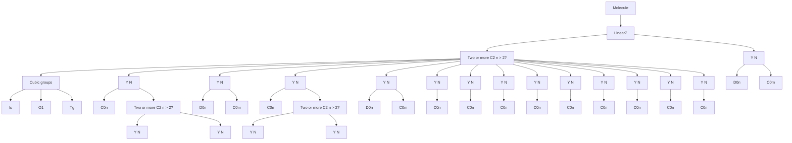
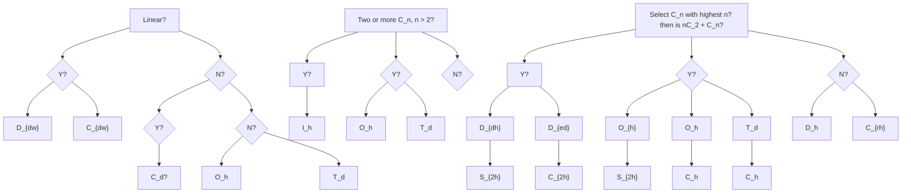

# 一、分子对称性00:04

# 1. 简单群论 06:56

# 1）群的定义 07:14

![[晶体结构I_笔记_images/af46cd5b8ba9462c3793d9ffbdc883f313dbe71daa32622e49f118354ae191e3.jpg]]

text_image

帮助
③正确理论分子性质.
结构→性质
相似性：旋光性
简单辩论。
释：一定规律，互相独立的元素的综合
对称操作化。A·B
① A·B 设同一群一作，A·B = C →
②

数学概念：群是指具有一定规律、互相联系的元素的集合  
- 分子对称性应用：在分子对称性研究中，群中的元素通常是对称操作  
● 表示方法：对称操作用字母加符号表示（如A）

# 2）群的基本运算：a乘以b 08:11

![[晶体结构I_笔记_images/256321ba51b5cf9ed7f106fd544ab7642126304154f63964dc7c63136c1de54e.jpg]]

text_image

般性：渐光性
简单群论。
解：一定规律，互相联系的元素的集合
对称样作化。·B
① ·B 从同一群一作，·B=C →
② 有主体作Ê，Ê·Â=Â

运算定义： $A \cdot B$ 表示先执行操作A再执行操作B  
- 封闭性：若A和B都是群中的操作，则 $A \cdot B = C$ 的结果C也必须是该群的操作  
● 实例说明：如旋转操作组合后仍属于该对称群

# 3）主操作（恒等操作）E 08:39

![[晶体结构I_笔记_images/83645fe583411b37b965306d296c44c36f28998ee1d7644fce6cb26409076f24.jpg]]

text_image

上午9:41 1月9日 周二
相似性：正元性
简单群论。
群：一定规律，互相联立的元素的综合
对称操作化：A·B
① A·B 反交同一群一操作，A·B = C →
② 有主操作E，E·A = A
③ 色操作：A·A' = A'·A = E
④ 络合律：

● 定义：主操作E（又称恒等操作、等同操作）是不改变分子构型的操作  
● 基本性质： $E \cdot A = A$ ，即与任何操作组合都保持原操作不变  
● 实际意义：相当于数学中的"1"或单位矩阵的作用

4）逆操作的概念与性质 09:08

\- 逆操作定义：对于操作A，存在逆操作 $A^{-1}$ 使其效果相互抵消

$\bullet$ 数学表达： $A\cdot A^{-1} = A^{-1}\cdot A = E$

● 实例说明：顺时针旋转60°与逆时针旋转60°互为逆操作

● 交换性：逆操作满足交换律，正逆序操作结果相同

5）结合律 09:44

- 运算规则： $(A\cdot B)\cdot C = A\cdot (B\cdot C)$   
● 实际应用：保证复杂操作组合的顺序不影响最终结果  
● 数学基础：与数论中的结合律概念一致，确保运算的确定性

# 2. 对称操作与对称元素

# 1）对称操作定义

![[晶体结构I_笔记_images/361d68511de509aa8f8d13b6f2fb8961fb5bb9460ea0dd5fcca0802947b1fa55.jpg]]

text_image

对称操作 又 对称元素。
L→实行到分子/原子中~一个(坐标变换)的交换操作。
交换后似测~与交换之前完全相同:
分段型.
取向/两点之间以矩的共轭相向
对称一

本质特征：对分子或原子进行坐标变换的交换操作  
● 效果要求：操作后分子构型与操作前完全相同（包括原子取向、距离等）  
● 数学表示：可通过矩阵变换描述（实际教学中简化处理）  
● 核心标准：能使分子"复原"的操作才称为对称操作

2）对称元素定义

● 基本概念：实现对称操作所需的几何要素

● 常见类型：点（对称中心）、面（镜面）、线（旋转轴）

● 实例说明：蝴蝶的镜面对称中，镜面是对称元素，反射是对称操作  
● 相互关系：对称元素决定可能的对称操作，对称操作体现对称元素的存在

# 3. 对称操作和对称元素 10:16

# 1）恒等元素和恒等操作 13:44

- 希腊语来源：恒等元素 $E$ 源自希腊语，意为"完全相同"  
● 数学本质：对应群论中的主操作，是每个分子必有的基本对称操作  
- 操作特点：保持分子完全不动（即"没有操作的操作"），使分子保持原始构型  
● 必要性：任何分子体系都必然包含恒等操作，这是对称操作的基础

# 2）旋转轴与旋转操作

\- 符号表示：旋转轴记为 $C_{n}$ ，其中 $n$ 表示旋转轴的阶数

● 操作定义：使分子绕轴旋转 $2\pi/n$ 角度后与原构型重合的操作

# ● 常见类型：

○ 二重旋转轴 $(C_{2})$ ：旋转180°  
○ 三重旋转轴 $(C_{3})$ ：旋转120°  
○ 四重旋转轴 $(C_{4})$ ：旋转 $90^{\circ}$

● 操作特性：连续执行n次 $C_{n}$ 操作等价于恒等操作E

# 3）旋转轴和旋转操作 14:49

# - 旋转轴的定义 15:18

![[晶体结构I_笔记_images/aa95bcf7e620640e64295382dac5c4f4225fa9fed3ded3998e1dec43553a0de3.jpg]]

text_image

对称元素 → 实现对称体作之元素
∠→一个点1-个面1-角线
· 恒变元素E和恒变操作(Einheit) => 完全相同
· 旋转轴Cn和旋转操作
Cn: 一个遗传分子的轴, 保分子原位轴旋转2π/8, 复数。
↓
ˆCn,ˆCn',ˆCn'...ˆCn'=ˆE   ˆC1=ˆE   ˆC1'=ˆE

基本概念：旋转轴（ $C_n$ ）是指通过分子的一条轴线，使分子绕此轴旋转后能与原分子重合。

数学表达：旋转操作 $C_{n}^{k}$ 表示绕轴旋转k次，每次旋转角度为 $\frac{2\pi}{n}$ ，当k=n时完成完整旋转（ $C_{n}^{n}=E$ ，等同操作）。

# ○ 特例说明：

■ $C_{1}$ 轴等同于恒等操作E   
■ 对于有限分子，理论上n可取任意正整数（与无限晶体体系不同）

# - 旋转操作的定义 15:36

![[晶体结构I_笔记_images/2defc3cc89e94e1b7e40bfee88b858bc60b176db69b2911efd79a114a336143f.jpg]]

text_image

上午9:41 1月9日 周二
Cn: 一个通过分子之新
↓
Ĉn, Ĉn̂, Ĉₙ ... Ĉₙ̂ = Ę    C₁ = Ę    Ĉ₁ = Ę
Hint1: 对于你来说, Cn ∼ n 理论上可以取任一正整数.
能
它电子结构
e.

操作序列：一个 $C_n$ 对称元素对应 $n$ 个对称操作： $C_n^1, C_n^2, ..., C_n^n = E$   
○ 特征操作：在 $C_{n}$ 的n个操作中，只有部分操作是独立的特征操作（如 $C_{4}$ 中的 $C_{4}^{1}$ 和 $C_{4}^{3}$ ）  
○ 周期关系：

■ $C_4^2$ 等价于 $C_2^1$   
■ $C_6^3$ 等价于 $C_2^1$   
■ $C_6^2$ 等价于 $C_3^1$

● 对称操作的包含性 18:27

![[晶体结构I_笔记_images/de5689b6c77e2d9e6499b58aea383c8726f9133bed7d90f8b41595e8c9598769.jpg]]

text_image

上午9:41 1月9日 周二
\hat{c}_n, \hat{c}_n', \hat{c}_n' \cdots \hat{c}_n' = \hat{E} \quad c_1 = \hat{E}
Hint1: 对于的来说, C_n ~ n 理论上可以推任 2.5分.
Hint2: 对称操作之包含: C_n → \hat{c}_n' - c_n'
C_a →
子结构
5/5

层级关系：

■ 高阶旋转轴包含低阶轴的全部对称操作（如 $C_{4}$ 包含 $C_{2}$ 的所有操作）  
■ $C_{6}$ 同时包含 $C_{2}$ 和 $C_{3}$ 的全部操作

○ 表示规则：当存在包含关系时，只需标明最高阶的旋转轴（如分子有 $C_{6}$ 轴时，不需额外说明 $C_{2}$ 或 $C_{3}$ 轴）

\- 分子中的主轴 22:56

![[晶体结构I_笔记_images/d3956752db502bec758ae4e97a2a183d2c4ff7d942b29a462530d1ee72701a6a.jpg]]

text_image

上午9:41 1月9日 周二
C6.5.5.5
C6.5.5.5.5.5.5.5.5.5.5.5.5.5.5.5.5.5.5.5.5.5.5.5.5.5.5.5.5.5.5.5.5.5.5.5.5.5.5.5
C6.5.5.5.5.5.5.5.5.5.5.5.5.5.5.5.5.5.5.5.5.5.5.5.5.5.5.5
C6 包含 C2，C3 都不构成任何。
Hint：分子中…主轴→n的最大…

定义：分子中旋转轴次n最大的 $C_{n}$ 轴称为主轴

○ 典型分子示例：

■ $C_{2}$ : $H_{2}O$ 、 $H_{2}O_{2}$   
■ $C_{3}$ : $NH_{3}$ 、 $PCl_{5}$ 、正四面体分子  
■ $C_{4}$ ：平面正方形配合物（如 $[Ni(CN)_{4}]^{2-}$ ）、 $SF_{6}$   
■ $C_{5}$ : 二茂铁、 $B_{12}H_{12}^{2-}$ 、 $C_{60}$   
■ $C_{6}$ ：苯、某些配合物  
■ $C_{\infty}$ ：所有直线型分子（如HCl、CO）

● 例题1: 判断分子的旋转轴 27:23

○ 甲烷的旋转轴

![[晶体结构I_笔记_images/26206b68af9a5c8e87e2915aa9eaa143760b79f2b839842089ce2c56507ada41.jpg]]

chemical

Hand-drawn chemical structures labeled C1, C2, C3 with H atoms and bonds, alongside a person in a chat interface.

题目解析

- $C_{3}$ 轴：4个，沿每个C-H键方向  
- $C_{2}$ 轴：3个，通过相对两条边的中点连线  
- 易错点：容易忽略 $C_2$ 轴的存在或错误计算数量

○ 八面体分子的旋转轴

![[晶体结构I_笔记_images/1456cb9a3ac5b33341dd699809c7070e53984395ee90572c90113234dba2cc25.jpg]]

text_image

上午9:41 1月9日 周二
C₃在哪，几个？
△C₃
C₂在哪！几个
SF₆ 6+6=12
F...F
F-S-F
F-

![[晶体结构I_笔记_images/fc2ecb0979de3a95cf03b9fa5f49dba7ab79b128130c65ce9e8ed4b98d6ccdb9.jpg]]

# 题目解析

● $C_{4}$ 轴：3个，穿过正方形面的中心  
- $C_{2}$ 轴：6个，通过相对边的中点连线（不含已包含在 $C_{4}$ 中的轴）  
● $C_{3}$ 轴：4个，通过相对三角形面的中心  
● 注意：需考虑对称操作的包含关系，避免重复计数

# ○ 乙烷交错构象的旋转轴

![[晶体结构I_笔记_images/1e7eb533e8d6e1b8a6c1a71f744005c1d2b6f7a84bfb4b0c17722a9576dea813.jpg]]

text_image

Q1C4几个，在哪？
3个C9
Q2：C9几个，在哪？
6个C2
Q3：C3几个，在那
4个C3

![[晶体结构I_笔记_images/cba0c7ac4a69a2aa6a90fe04a64c611240e71ba765e23489834204b73b6fb3f2.jpg]]

# 题目解析

- $C_{3}$ 轴：1个，沿C-C键方向  
- $C_{2}$ 轴: 3个, 通过C-C键中点与H-H连线中点的连线  
- 空间想象：需理解分子实际三维构象，三个H在上、三个H在下的交错排列

# 4）反演中心和反演操作 36:03

● 反演中心的定义与表示 36:08

![[晶体结构I_笔记_images/df2d73e230d91cff36a32b5a0f2e21111b4c11c36f801245304a6f763eb151c7.jpg]]

text_image

上午9:41-1月9日 周二
Q: C₂在哪
A. 两点连线
B. 两点中点的连线
C. 点呈.
· f
6/6

O

○ 表示符号：用大写字母I表示对称中心，也称为反演中心。  
- 几何意义：分子中存在一个点，使得分子中任意一点与该点连线后，在等距离的另一侧能找到完全相同的对应点。

● 反演操作的定义 36:28

- 操作本质：将分子中所有点通过中心点进行对称变换的操作。  
数学描述：若点P与反演中心I连线，在另一侧等距处找到对应点 $P'$ ，则称 $P'$ 为P的反演点。

● 中心对称分子的概念 37:04

○ 分类标准：

■ 有反演中心I的分子称为中心对称分子  
■ 无反演中心I的分子称为中心不对称分子

○ 特例说明：甲烷 $(CH_{4})$ 虽然对称性高，但没有反演中心。

● 举例说明反演中心和反演操作 37:29

![[晶体结构I_笔记_images/df5022f04f7fc7a1b193ea177ab2591ffda8db16463dfad704a08b615e34d107.jpg]]

text_image

• 桥可环己烷
Q: C₂在哪
A. 顶之连线
B. 边心中之连接
C. 坪呈.
• 反演中心(对称中心) i 又反演操作.
有一个i,任一点一i
i
{有i→中心对你与子
无i→不对你与子...
C=C
H
手.

O

○ 典型例子：

■ 椅式环己烷：中心点为反演中心，纸面上下的原子互为反演对应  
■ 人手模型：手掌中心可作为对称中心  
六氟化硫 $(SF_{6})$ ：中心硫原子为反演中心  
■ 线性分子：如二氧化碳 $(CO_{2})$

○ 非对称例子：

■ 一氧化碳(CO)  
■ 氨气 $(NH_{3})$   
■ 水( $H_{2}O$ )

● 反演操作的次数与效果 39:32

# 操作幂次：

■ 奇数次反演操作( $I^{n}$ , n为奇数): 等效于单次反演操作I   
■ 偶数次反演操作 $(I^n, n$ 为偶数): 等效于恒等操作 $E$ (即不改变分子构型)

# 5）镜面和镜面操作 40:42

# - 镜面对称性的定义 41:03

![[晶体结构I_笔记_images/be4e3497ab0cb152e69482cccc5ea65592e1311e2c9292087490f8cce3d1bcbe.jpg]]

text_image

上午9:41 1月9日 周二
L→对称面.
平分分子的平面, 成对排面在近似原侧
2
3
4
C₂

基本概念：平分分子的平面，使分子内容成对排列在镜面两侧。  
数学描述：对镜面σ作垂线，在等距另一侧能找到完全相同的对应点。

# - 镜面的分类 42:26

# ○ sigma\_v: 垂直镜面

![[晶体结构I_笔记_images/5207c3803578c0a2bfbd7dc549e7aabadc7a8514ca4d67bc2f1fd433ffaeb0c2.jpg]]

text_image

上午9:41 1月5日 周二
C₂
34C₂
C₂.2σv.
C₁.3σv.
Hint: 有Cₙ-分子,若有5v,那么一年有n个σv
σₙ: horizontal : 水平旋面. σₙ←Cₙ

定义特征：通过分子主轴的镜面  
■ 命名来源：v代表vertical（垂直）  
■ 数量关系：有 $C_{n}$ 轴的分子若有 $\sigma_{v}$ ，必有n个 $\sigma_{v}$   
实例：

● 水分子 $(H_{2}O)$ ：2个 $\sigma_{v}$ （纸面和垂直于纸面的面）  
● 氨分子 $(NH_{3})$ ：3个 $\sigma_{v}$

# ○ sigma\_h: 水平镜面

![[晶体结构I_笔记_images/94fce84269b81f11027a284fa58ad1a5372740288ba8aa986ec9ed63f60601b2.jpg]]

text_image

σh, horizontal : 水平锐面. σs1 cm
N=N
F O2
σh.
H C=C
c1
c1
c1
S=
c2
J C2
o
c2
6/6

![[晶体结构I_笔记_images/877714827d3f2ad2766e444eb265d6beddeac04477891c1ea937bee764856689.jpg]]

定义特征：垂直于主轴的镜面  
■ 命名来源：h代表horizontal（水平）  
实例：

- 反式二氟化二氮：垂直于 $C_{2}$ 轴的面  
- 六氟化硫 $(SF_{6})$ ：3个 $\sigma_{h}$ （垂直于 $C_4$ 轴）  
- 全重叠式二苯铬：中间平面为 $\sigma_{h}$

○ sigma\_d: 对角镜面

![[晶体结构I_笔记_images/0c09907d3c2feb9379854434a5a6cd3e239729175df7541a9d4443ba6e159474.jpg]]

text_image

上午9:41 1月9日 星二
√ √ T √
全通
c₂
c₁
σd: diagonal 对角说面.
有n个C₂⊥Cₙ.
有n个σv平方C₂轴, ⇒ σv → σd
c₂
i.
中心对你分子
…不对称分子…
6/6

![[晶体结构I_笔记_images/c8c109d230c2b26a6ed914ccf5c4a729e5543aa7224b880a268ca6017ab418d7.jpg]]

■ 前提条件：分子有n个 $C_{2}$ 轴垂直于主轴 $C_{n}$   
■ 定义特征：平分相邻 $C_{2}$ 轴夹角的镜面  
实例：

● 椅式环己烷：3个 $\sigma_{d}$ （通过对角顶点的平面）  
- 全交叉式乙烷：3个 $\sigma_{d}$

\- 镜面的操作与性质 50:00

○ 操作幂次：

■ 奇数次镜面操作( $\sigma^{n}$ , n为奇数): 等效于单次镜面操作 $\sigma$   
■ 偶数次镜面操作( $\sigma^{n}$ , n为偶数): 等效于恒等操作E

6）反轴与旋转反演操作 50:37

\- 基本定义

![[晶体结构I_笔记_images/5021aa9d029fe95d6838233fef15eaf06126625ef8ef707c0ba31108d44a7bfe.jpg]]

text_image

上午9:41 1月9日 周二
→中心动作
→…不对称子…
Brf4⁻
I₁. H₂O.
σⁿ = { n=odd
反轴 Iₙ 又旋转反演娜
def: 先转弦, 再沿中点反演
În' = În·î = î·în
Iₙ: Îₙ, Îₙ ... Îₙ
I₁ = c

![[晶体结构I_笔记_images/c14fa409ebddb375d3ec79ab232afcffa76b6ba3e88695e8008426ce6eae39b0.jpg]]

○ 表示符号：用 $I_{n}$ 表示n次反轴

$$
2 \pi
$$

- 操作本质：先绕轴旋转 $\overline{n}$ ，再沿中心点反演的组合操作  
基本关系： $I_{n}^{1} = C_{n}\cdot i = i\cdot C_{n}$

● 特殊反轴分析

○ I1反轴

■ 等效操作： $I_{1}=C_{1}\cdot i=i$   
■ 实际意义：等同于单纯的反演中心

○ 12反轴

■ 等效操作： $I_{2}^{1}=C_{2}\cdot i=\sigma_{h}$   
■ 实例说明：乙烷分子中，旋转180°再反演等效于镜面操作

○ 13反轴

■ 操作序列：包含6个独立操作( $I_{3}^{1}$ 到 $I_{3}^{6}$ )  
■ 重要结论： $I_{3}$ 轴隐含 $C_{3}$ 轴和反演中心i的存在

○ 14反轴

■ 独特性质：不能分解为其他对称操作的组合  
■ 包含关系：隐含 $C_{2}$ 轴但不完全等同于 $C_{2}$   
■ 实例探讨：甲烷分子中的 $C_{2}$ 轴是否为 $I_{4}$ 需要进一步验证

7）反轴和旋转反演操作 01:00:09

![[晶体结构I_笔记_images/ee75d77747b5cb6f9ec829a78cd1b342bb8f205b6659ae0806d522afa9b5a08e.jpg]]

text_image

上午9:41 1月9日 周二
I₄: I₄¹ = C₄²·i² I₄² = C₄³·i² = [C₂²] ⇒ C₂
I₄³ = C₄³·i³ = i·C₄² I₄⁴ = C₄⁵·i⁴ = E
I₄轴包含

- 定义：反轴 $I_{n}$ 是由旋转操作 $C_{n}$ 和反演操作i组合而成的对称元素，其操作可表示为 $I_{n}^{k}=C_{n}^{k}\cdot i^{k}$   
● 甲烷案例：

- 将甲烷分子放入假想正方体，编号1-4号顶点  
○ 进行 $C_{4}^{1}$ 操作后顶点位置变化： $1\rightarrow2\rightarrow3\rightarrow4\rightarrow1$   
- 再进行反演操作 $i$ ，发现结构与原结构完全重合  
○ 证明甲烷存在 $I_{4}$ 轴，且与 $C_{2}$ 轴重合

# ● 独立性与非独立性：

○ $I_{4}$ 是独立对称元素（如甲烷中的 $I_{4}$ ）  
○ $I_{6}$ 不是独立对称元素，可分解为 $C_{3}+\sigma$ 组合

# 8）应用案例 01:00:21

# ● 例题:四面体主轴判断

![[晶体结构I_笔记_images/fe2bc977dc13378309016f4de89566ae99c40f821b88e7e2c5c700ee3f646a55.jpg]]

text_image

CH₄ 有3个C₂.
I₆: I₆ = C₁·i = C₁·σ
I₆' = i·C₁' = i·C₁' = σ
I₆ = i·C₁' = σ·C₁'
I₆ 包6: C₃和σ. I₄ = C₃+σ

# ○ 关键概念：

■ 主轴定义：必须指旋转轴（如 $C_{4}$ ）  
■ 常见误区：误将 $C_{3}$ 当作甲烷最高次对称轴  
■ 正确答案：甲烷最高次对称轴是 $I_{4}$ 而非 $C_{3}$

# - 反轴操作分解：

$I_{6}^{1}=C_{6}^{1}\cdot i$ 可转化为 $C_{3}^{2}\cdot\sigma$   
■ $I_{6}^{2}=C_{3}^{1}$   
■ $I_{6}^{3}=\sigma$   
$I_{6}^{6}=E$ （恒等操作）

# ○ 晶体学应用：

■ 无限结构中通常不讨论 $S_{n}$ 而用 $I_{n}$   
■ 判断 $I_{6}$ 存在的方法：检测是否存在 $C_{3}$ 轴加镜面 $\sigma$   
■ $I_{4}$ 与 $S_{4}$ 关系：互为逆操作，乘积为 E

# 9）反轴和旋转反演操作 01:13:16

![[晶体结构I_笔记_images/f5aff0e9a9a26dadd4433e70ac91c761ca3185a69aa1aa3be0770c836d122564.jpg]]

text_image

上午9:41 1月9日 周二
I6 : I6' = C6' i = C3' σ
L > : C3' |C1' i |σ
I6' = i' C6 = i C3' = σ
I6' = i C6 = σ C3'
I6 包含 3 C3 和 σ.
I2 = C3 + σ
• 映轴 & 旋转反映

- 基本定义：反轴操作是旋转与反演的复合操作，数学表达式为 $I_{n}^{m}=C_{n}^{m}\cdot i$ ，其中 $C_{n}$ 表示旋转操作，i表示反演操作  
- 具体示例：

○ $I_{6}^{3}=\frac{13}{2}\cdot C_{6}=\tilde{i}C_{2}$   
$\circ I_0^a = C_6^a \cdot \frac{a}{a} = C_3^2$   
○ $I_{0}^{6}=E$ （恒等操作）

10）旋转反应操作 01:14:50

● 对称元素S的介绍 01:14:58

![[晶体结构I_笔记_images/f7d3815b964e3772ef53036741a12e5b4aed34cd71b12be1003e155154cd6e30.jpg]]

text_image

I₆ = i³·C₁ = i·C₂ = i̅
I₆ = i·C₂ = i̅·C₃
I₆ 包含 3 C₃ 和 σ. I₆ = C₃ + σ
• 映轴S₀ 又旋转反映操作
沉轴转 2π/σ，再化垂直于轴的平面反映

- 操作定义：绕轴旋转 $\overline{n}$ 角度后，再对垂直于轴的平面进行反映  
○ 数学表达： $S_{n}=\sigma\cdot C_{n}$ ，其中 $\sigma$ 表示反映操作  
○ 具体关系：

■ $S_{1}=\sigma$ （即简单反映）  
■ $S_{2}=i$ （反演操作）  
■ $S_{3}=C_{3}+\sigma$   
■ $S_{4}=C_{4}+\sigma$   
■ $S_{5}=C_{5}+\sigma$   
■ $S_{6}=C_{3}+i$

● I8的对称元素探讨 01:15:48

![[晶体结构I_笔记_images/481289b7d3250ddd1ffbefff05310debfcbd6f2925f53b26412272dab5e8b8b3.jpg]]

text_image

上午9:41 1月9日 周二
⊥6 包含3 C₃ 和 0°.    ⊥4 = C₃ + 0°
• 映轴Sₙ&旋转反映操作
绕轴转2π/σ. 再化重于轴的平面反映.
ˆSₙ' = ˆS.ˆCₙ'

○ 分解方法： $I_{8}$ 可分解为 $C_{8}$ 旋转与反演操作的组合

■ $I_{8}^{1} = C_{8}^{1}\cdot i$   
■ $I_8^2 = C_4^1\cdot C_4^1\cdot i$   
■ $I_8^4 = C_2^1\cdot i$

\- 特殊性质：当n为4的倍数时，反轴 $I_{n}$ 是独立的对称元素，不能简化为其他对称操作的组合

● 对称元素和对称操作的总结 01:19:14

\- 四大类对称元素：

■ 旋转轴和旋转操作  
■ 反演中心和反演操作  
■ 镜面和反映操作  
■ 反轴和旋转反演操作

○ 对应关系：每个对称元素都对应特定的对称操作，共同构成分子的对称性描述体系

11）分子点群 01:19:43

c1点群 01:20:05

○ c1点群的定义与对称元素

![[晶体结构I_笔记_images/66757e33c2f5e8aee7645cc32a8c22808b29e0953221aef89bb9a9108b3ed6f3.jpg]]

text_image

i₈³ = c₈² · i  i₈⁶ = c₄  i₈⁷ = c₈² · i  i₈⁸ = ē
σ = c₂ⁱ · i
In. n为4 ~倍数 => 独之对称元素.
分点群.
C₁ → 只有 C₁/E

7/7   
■ 定义: 最简单的点群，仅包含恒等操作E和反演操作I作为对称元素  
■ 对称操作: 只有 $C_{1}$ （即恒等操作E）和反演中心I

○ c1点群的实例 01:20:24

■ 典型分子：碳原子上连接四个不同取代基的分子，如一个氟、一个氢、一个氯、一个溴的甲烷衍生物（CHFClBr）

\- CS点群 01:20:37

![[晶体结构I_笔记_images/1dd35c0f19b1188b5394a7f72961718bd57e013f6f366ef195acd873d04b23d5.jpg]]

text_image

分子点群
C₁ → 只有 C₁/E
F
H-C…Br
Cl
Cs: 只有 E和 O
SOCl₂ NHR₂ O=Ir-O=O7⁺
Cl…O
Cl-S=O
Ci: E, i:
A...B-A...M-A-B
B-M-A-M-A-B
C
1
2
3
4
5
6
7/7

7/7   
■ 定义: 仅包含恒等操作E和一个镜面 $\sigma$ 的对称元素  
实例:

● 硫化亚风（三角锥形结构）  
● 二取代胺（三个原子共平面）  
● 过氧/超氧形式分子（整个分子只有一个对称平面）

◦ ci点群 01:21:33

■ 定义: 仅包含恒等操作E和反演中心I的对称元素  
实例:

● 具有对称中心的环状分子（如BAAB型结构）  
- 交叉式乙烷衍生物（当三个取代基均不相同时）  
- 某些特殊酸类分子

\- CN点群及c2点群 01:22:51

![[晶体结构I_笔记_images/ce9752302bf54647d862c10d30034b7c65cb90ac71543833d9b3c82fefac416b.jpg]]

chemical

Hand-drawn chemical reaction diagram showing conversion of Cn to C2 with electron transfer, alongside molecular structures and a photo of a person.

定义: 仅包含一个 $C_n$ 旋转轴的对称元素

c2点群特征:

- 主轴为 $C_{2}$ 旋转轴  
● 实例： $H_{2}O_{2}$ （过氧化氢）分子，其 $C_{2}$ 轴位于两个氢原子连线和两个氢原子连线的中点连线上

■ 判断技巧: 可将分子放入长方体框架中辅助确定 $C_{2}$ 轴位置

○ c3点群 01:26:33

典型分子:

- 乙烷衍生物（一边三个氯取代，一边三个氢取代，二面角在0-60°之间）  
- 某些配合物（如BABABA型结构）

■ 判断方法：将三个原子看作一个面，另外三个原子看作另一个面，观察旋转对称性

# ○ CNv点群及c2v、c3v等 01:27:34

![[晶体结构I_笔记_images/d3a9e9f468f003da0c7b98ddb1d237c9b0162cede6db098c96a5412e1be17db2.jpg]]

chemical

Handwritten chemical reaction equations involving CnV, NH3, and CHCl3 forming cyclic structures with labeled angles and substituents

■ 定义: 包含一个 $C_{n}$ 轴和n个垂直镜面 $\sigma_{v}$   
c2v实例:

- 水分子 $(H_{2}O)$   
- 吡啶分子

c3v实例:

- 氨分子 $(NH_{3})$   
- 氯仿 $(CHCl_{3})$   
● 乙烷衍生物（当三个氯和三个氢的二面角 $\varphi$ 为0°或60°时）

○ c4v、c5v、c6v及c无穷大v点群 01:28:24

c4v实例:

\- 四方锥形分子

c5v实例:

\- 某些镍配合物（一边一个配体分子，另一边一个帽状结构）

c6v实例:

● 格配合物（一边是苯环，一边是全取代苯环）

c∞v特征:

- 不对称直线型分子  
- 无对称中心 $I$   
● 实例：同核/异核双原子分子（如CO、NO等）

# - cn点群 01:30:11

![[晶体结构I_笔记_images/5f2c86a5c2b2578ab214c99d2d6a501e08af777571a1fa78e5db08faa34f2fda.jpg]]

text_image

S3=I6=C1+σ
S0=I3=C1+i
i̇/2·i̇ Îg=Cî
î/2·i̇ Îg=E
πσ.
Csv: Cp-Ni-NO
Cov: 
Cov: 不对称(元i):直方子. CO、HCN、NO、HCl.
Cnh: Cn, σh.
{n = even: Cn, σh, In
n = odd: Cn, In.
7/7}

- 分类依据: 仅基于 $C_{n}$ 旋转轴的对称性  
○ n的取值: 可以是任意正整数 $(n=1,2,3,\ldots)$   
- 对称操作: 仅包含 $C_{n}$ 旋转操作及其幂次操作

# ● cnv点群 01:31:29

![[晶体结构I_笔记_images/e8ee5efc201ff1ffc1d4e9c084d0b2764c543e99e5b54aefe361b0eafb821bcb.jpg]]

text_image

上午9:41 1月9日 星二
S F₆ H b=12
Q₁C₄几个在哪 Q₂C₄i，在哪 6个C₂
Q₃C₄i，在哪 4个C₃
将有体之比 Q₁C₄在哪
A. 做正连续
B. 由x轴上、通速
C. 做正
自集中心(对称中心) 只位置作，
有一个i，任一i→
{
有i→中心的分子
任i→
• 后由 I₂ 只通过的角
d(i)，先证明，直到得主的角
I₂₀ = C₂₀ - i = C₂₀
I₁₀ = C₁₀ - i = C₁₀
6/7 > i → I₂₀ = i

# ○ 对称元素:

一个 $C_n$ 主轴  
■ n个垂直镜面 $\sigma_{v}$

\- 组合规律: $C_{n}$ 轴与 $\sigma_{v}$ 镜面的组合会产生额外的对称操作

# ○ 特殊点群:

■ $D_{\infty h}$ : 线性分子的完全对称点群  
■ $T_{d}$ : 四面体对称点群  
■ $O_{h}$ : 八面体对称点群

# ● Cnh点群 01:34:28

○ Cnh点群的定义 01:34:32

![[晶体结构I_笔记_images/5388aa9241ac2b13d16e6ec61be7c08fe69632ddae4dee703d6190c59affd9b7.jpg]]

chemical

Chemical reaction equations and molecular structures for nitrile derivatives, including CnH, CnF, and DnH isomers

基本构成: 在 $C_n$ 主轴基础上加入水平对称面 $\sigma_h$ 形成的点群  
■ 特征元素: 包含 $C_{n}$ 轴和 $\sigma_{h}$ 对称面，当n为奇数时还包含 $S_{2n}$ 映轴  
■ 典型分子: 硼酸 $(B(OH)_{3})$ 实际属于 $D_{3h}$ 而非 $C_{3h}$

○ Dn点群的典型例子 01:34:53

■ 定义特征: 在 $C_{n}$ 主轴基础上加入n个垂直于主轴的 $C_{2}$ 轴  
■ 实例稀少性: 实际分子中属于纯 $D_{n}$ 点群的例子较少  
■ 特殊说明: 在判断点群时，通常将末端基团（如甲基）视为球体处理

○ D2点群的二面角范围 01:35:13

![[晶体结构I_笔记_images/54670ce2708b162179bc7395244e4ac3112cca356f795e7f56b9daed090ef636.jpg]]

text_image

D₂: φ = 0~90°
8/8

■ 几何特征: 当分子二面角在0-90°之间时可能形成 $D_{2}$ 对称性  
■ 平面分子特例: 硼酸作为平面分子实际属于 $D_{3h}$ 点群  
■ 乙烷构象: 乙烷在不同扭转角下可能呈现不同点群对称性

# ○ Dnh点群的定义 01:36:45

![[晶体结构I_笔记_images/7976c452c68adf8161f02b9e7b4e8ecfaff44d398c1f3d41322654d6638cf4db.jpg]]

text_image

上午9:41 1月9日 周二
Dhh:  n=0dd. Cn,I2n,n+C2,Sn.
n=even: Cn,n+C2,Gn,I2n,n+C2,i
D2n:  c=C-H (N-Cu-N)724
D3h:

对称操作: 在 $D_{n}$ 基础上加入垂直于主轴的 $\sigma_{h}$ 对称面

分类特征:

● n为奇数时：包含 $C_{n}$ 、 $nC_{2}$ 、 $\sigma_{h}$ 和I（对称中心）  
- n为偶数时：包含 $C_{n}$ 、 $nC_{2}$ 、 $\sigma_{h}$ 、 $n\sigma_{v}$ 和I

# ○ Dnh点群的分类讨论 01:38:05

■ 奇偶差异:

- 奇数阶：存在 $S_{2n}$ 映轴和对称中心  
● 偶数阶：额外包含垂直对称面 $\sigma_{v}$

■ 数学关系: $C_{2}+\sigma_{h}=\sigma_{v}$ ，因此不存在独立的 $D_{nv}$ 点群

# ○ Dnh点群的例子 01:39:01

![[晶体结构I_笔记_images/c090ec3d8b3649a9d8ddb52c7dd564a4ccbe3c2773e77095db97227b59e0998a.jpg]]

text_image

D3h: BF₃ φ=0°
D4h: Ni(COM)₂. PtCl₄. BrF₄. rE F₄
D5h: 鉰主 FeCps
D6h: +

■ D $_{2h}$ : 典型如乙烯分子  
■ $D_{3h}$ : 三氟化硼( $BF_{3}$ )和全重叠构象乙烷  
■ $D_{4h}$ : 四氰合镍离子 $[Ni(CN)_4]^{\wedge}\{2-\}$ 、平面四方形的 $PtCl_4^2$   
■ $D_{5h}$ : 二茂铁( $FeCp_{2}$ )的全重叠构象  
■ $D_{6h}$ : 苯分子  
■ $D_{\infty h}$ : 直线型对称分子（如 $CO_{2}$ ）

Dnd点群 01:42:17

○ Dnd点群的基本特征 01:42:24

![[晶体结构I_笔记_images/1dbacb0c678fc612b6ede2317315c19bd17f460c9e2386063fb5d8214afeb45c.jpg]]

text_image

Psh: 镱 FeCp₂
Deh: 草, 镱 Cr(PhH)₂
Dc2h: CO₂, H₂
Dnu x C₂ + σₕ = σᵥ
Dnd: Dₙ中加入钙分C₂抽在σᵥ→σd。
{n=odd. Cₙ, nC₂, nσd, i/In (Iₙ=Cₙ+i)}
8/8>

定义特征: 在 $D_{n}$ 基础上加入平分 $C_{2}$ 轴的 $\sigma_{d}$ 对称面  
■ 命名说明: $\sigma_{d}$ 表示对角反射面(diagonal mirror plane)  
■ 重要区别: 与 $D_{nh}$ 不同, $D_{nd}$ 不含水平对称面 $\sigma_{h}$

○ Dnd点群的构成元素 01:42:44

■ 奇数n时:

- 包含 $C_{n}$ 轴、 $nC_{2}$ 轴、 $n\sigma_{d}$ 对称面  
● 存在反演中心I（因为 $S_{2n}=C_{n}+I$ ）

■ 偶数n时:

● 包含 $S_{2n}$ 映轴、 $nC_{2}$ 轴、 $n\sigma_{d}$ 对称面  
● 无独立的反演中心

○ D2d点群的例子 01:43:23

![[晶体结构I_笔记_images/fa0a32b80bf9ef2f32bf1ab9a0dcf1d282b2cda3a3618bd09d4b9c320319934f.jpg]]

text_image

Dn: CO₂, H₂
Dnu x C₂ + σₙ = σv
Dnd: Dn中加入氧分C₂轴iσv→σd.
{n=odd. Cₙ, nC₂, nσd, i/In (Iₙ=Cₙ+i)}
{n—even: I₂n, nC₂, nσd}
D2d: H C=C=C-H
D3d: H H I
8/8

典型分子: 丙二烯型结构( $H_{2}C = C = CH_{2}$ )  
■ 对称特征: 当两端取代基相同时对称性从 $C_{2}$ 提升至 $D_{2d}$   
■ 几何识别: 可通过构建长方体框架辅助寻找对称元素

○ D3d点群的例子：环己烷 01:43:37

■ 椅式环己烷: 经典 $D_{3d}$ 对称性实例  
■ 乙烷构象: 全交叉式乙烷( $\varphi = 60^{\circ}$ )也属于 $D_{3d}$   
■ 对称操作: 包含3个 $C_{2}$ 轴和3个 $\sigma_{d}$ 对称面

○ D4d点群的例子与特征 01:44:03

![[晶体结构I_笔记_images/c729862d8abc4b8aab76ab197a7ebb0c609ab2ba99d0cf2ed284b84922c1b130.jpg]]

text_image

n = odd. Cn, nC2, nGd, i/In ( In = Cn+i )
n = even: I2n, nC2, nGd
D2d: H
H C = C = C ... H
φ = 60°
D3d: 
D4d:

四羰基锰: $Mn(CO)_{4}$ 因未形成δ键而采取交错构型

■ 四方反棱柱: 如硫八( $S_8$ )分子

■ 结构特征: 上下两层配体呈45°交错排列

○ 识别Dnd点群的方法 01:44:49

■ 关键步骤:

- 确认主轴 $C_n$ 的存在  
$\bullet$ 寻找 $n$ 个垂直于主轴的 $C_2$ 轴  
- 验证 $\sigma_{d}$ 对称面而非 $\sigma_{h}$ 的存在

■ 常见误区: 不要将 $\sigma_{d}$ 与 $\sigma_{v}$ 混淆

\- S4点群的介绍与例子 01:45:48

![[晶体结构I_笔记_images/f13ce130fdbf64bf6e809b4ffaee0a30f1fb5604881e170ed983f1b90aef8d1b.jpg]]

text_image

Dn: Dn中拟入物C₂抽i·σv→σd.
{n=odd C₁, nC₂, nσd. i/In (Iₙ=C₁+i)
{n-even: I₂n, nC₂, nGd}
D2a: H
H C=C=C-H
φ=60°
D1a: 
D1b: 
D1c: 
D1d: 
D1e: 
D1f: 
D1g: 
D1h: 
D1i: 
D1j: 
D1k: 
D1l: 
D1m: 
D1n: 
D1o: 
D1p: 
D1q: 
D1r: 
D1s: 
D1t: 
D1u: 
D1v: 
D1w: 
D1x: 
D1y: 
D1z: 
D1a: 
xeF8(回方程段栏) D2a
S8

定义特征: 仅包含 $S_{4}$ 映轴的特殊点群  
■ 典型实例: 四氟化二氮二硫 $(S_{4}N_{4}F_{4})$   
■ 结构特点: 硫原子共面，氮原子和氟原子上下交替排列  
■ 对称操作: 仅通过 $S_{4}$ 旋转反射操作能使分子复原

● 多面体点群 01:46:46

○ 点群类型概述 01:47:00

![[晶体结构I_笔记_images/21f858370861e265e18cc34087ba4b5a4fbbb2fd2d2a534f9483f78d79f394a3.jpg]]

text_image

φ' = 0 ~ 60°
i₂, Iₕ. ⇒ Σ₀
iₕ, Iₙ, n + Σ₀, i
7²¹
多面体点阵: 各个往轴:
Tₐ, Oₕ, Iₙ → { T, Tₕ, O, I }
Tₐ: 正曲面体: 4C₃, 3C₂(3I₆). σd
.
.
. ref₄
8/8

■ 核心点群：需要重点掌握Td、Oh和Ih三种多面体点群

■ 对称元素特点：与单主轴点群不同，多面体点群具有多个旋转主轴

■ 特殊说明：S8不能称为S八点群，因其包含其他对称元素，应归类为D4d点群

○ Td点群特征 01:48:09

![[晶体结构I_笔记_images/fd440e24940ed6b667a992a8b6fb856f75169d39d51dbf6a5b1c1a4b4ef6f1bf.jpg]]

text_image

上午9:41 1月9日 周二
Td.正四面体:4C₃.3C₂(3C₄).6D
6D
670a
CH₄.
α:正八方体:3C₄,4C₃,6C₂.i,60
d.

■ 典型代表：正四面体分子如甲烷 $(CH_{4})$

■ 对称元素：
- 旋转轴：4个 $C_{3}$ 轴，3个 $C_{2}$ 轴（同时也是 $S_{4}$ 轴）

\- 镜面：6个 $\sigma_{d}$ 镜面（通过立方体对角面）

■ 空间分布：在立方体中， $C_{2}$ 轴穿过对面中心， $\sigma_{d}$ 镜面包含两个顶点和两条对边中点

○ Oh点群特征 01:51:17

![[晶体结构I_笔记_images/5692d6f4be465151c0f148e75f7d55b25f4624a6f232ff05941d2216def0eabc.jpg]]

text_image

上午9:41 1月9日 周二
xyF₄
Oₙ: 五八方体: 3C₄, 4C₃, 6C₂. i, 60d, 30h
三方体: 3I₄ 4I₃.
SF₆. 三方烷.
Iₙ: 605, 10C₃, 154C₂, 155, i
α.
ln (Iₙ=Cₙ+i)

典型代表：

- 正八面体分子如六氟化硫 $(SF_{6})$   
- 立方烷分子

对称元素：

- 旋转轴：3个 $C_4$ 轴（同时也是 $I_4$ ），4个 $C_3$ 轴，6个 $C_2$ 轴  
- 反演中心：存在对称中心 $i$   
- 镜面：6个 $\sigma_{d}$ 和3个 $\sigma_{h}$   
- 旋转反演轴：4个 $I_{3}$ （等价于 $C_{3}+i$ ）

○ Ih点群特征 01:52:29

![[晶体结构I_笔记_images/3c95925c1f542ee2807723c050ba7a88d08be8f7285c340b4479025fee0c2f79.jpg]]

text_image

ref₄
CH₄.
α: 五入方体: 3C₄, 4C₃, 6C₂ ... , 60d, 30h
三方体: 3I₄ 4I₃.
SF₆. 三方烷.
I₄: 605,10C₃,15C₂,150, i
B₁₂H₁₂²⁻¹, C₆₀ C₂₀
↓
前角三角
12个五边形
20个边形.
ln(I₄=Cₙ+i)
二角二十方体
8/8

对称元素数量：

6个 $C_{5}$ 轴   
- 10个 $C_{3}$ 轴   
- 15个 $C_2$ 轴   
● 15个σ镜面  
- 反演中心i

典型代表：

- 二十面体结构的 $B_{12}H_{12}^{2}$   
- 足球烯 $C_{60}$ （削角二十面体）

■ 几何特征：

\- $C_{60}$ 包含12个五边形和20个六边形

● 最高阶旋转轴为 $C_{5}$ 轴（通过五边形中心）

\- 特殊多面体介绍 01:54:26

![[晶体结构I_笔记_images/8e6a8af77b47ffaa9950fc0e1ae9de36c323d53de937946d6d3230338cfbf008.jpg]]

text_image

: 6C5,10C3,154C2,155, i
Br2H4²⁻
C60
C20
(圆角十二代)
前角三角二代体
12个五边形
20个近形
三角二十代体
8/8

![[晶体结构I_笔记_images/1e937deca6a7b17ad9bf140fe5e55dda6097cad77768cfd568ab89675a03994c.jpg]]

■ 顶点规律：

- 二十面体：12个顶点  
- 十二面体：20个顶点

结构衍生：

- 正五角十二面体（如 $C_{20}$ ）  
- 三角二十面体（ $C_{60}$ 的基础结构）

轴系特征：

$C_{60}$ 中:

○ 通过六边形中心为 $C_{3}$ 轴（非 $C_{6}$ ）  
○ 通过五边形中心为 $C_{5}$ 轴

○ 点群判断方法 01:56:09

![[晶体结构I_笔记_images/a9ad6b487ab6959f846490500fa1c555c1e48d181dad6c3544b4230733589708.jpg]]

flowchart

![[晶体结构I_笔记_images/bfd98d656d944e9400e333a5f36dd98e21ea7588d66134f479d0f283d5f63a7d.jpg]]

■ 判断步骤:

- 线性分子：分为 $D_{\infty h}$ 或 $C_{\infty v}$   
- 多主轴分子:

○ 有对称中心：Oh或Ih（含 $C_{5}$ 为Ih）

○ 无对称中心：Td

\- 单主轴分子：

○ 无主轴： $C_{s}$ 、 $C_{i}$ 或 $C_{1}$   
○ 有主轴:

■ 无垂直 $C_{2}$ : $C_{n}$ 系列或 $S_{4}$   
■ 有垂直 $C_{2}$ : $D_{n}$ 系列

■ 细分规则：

● $C_{n}$ 系列：根据 $\sigma_{h}$ 、 $\sigma_{v}$ 、 $S_{4}$ 等对称元素细分  
- $D_{n}$ 系列：根据 $\sigma_{h}$ 、 $\sigma_{d}$ 细分 $D_{nh}$ 、 $D_{nd}$ 或 $D_{n}$

# 4. 分子对称性与点群

![[晶体结构I_笔记_images/02a23f859d7a44e71fa4093b9e9e3e2dd05025e9a661856896ee75fe94b49e7d.jpg]]

flowchart

● 对称元素类型：包括旋转轴 $(C_{n})$ 、镜面 $(\sigma)$ 、反演中心 $(i)$ 、非真旋转轴 $(S_{n})$ 等

# - 点群分类体系：

○ 线性群: $C_{\infty v}$ 、 $D_{\infty h}$   
○ 二面体群： $D_{nh}$ 、 $D_{nd}$   
○ 循环群: $C_{n}$ 、 $C_{nh}$ 、 $C_{nv}$ 、 $S_{n}$   
○ 立方群: $T_{d}$ 、 $O_{h}$ 、 $I_{h}$   
○ 特殊群： $C_{s}$ 、 $C_{i}$

# 1）对称元素考核要点

# ● 国初考试重点：

○ 必考对称元素的定义：镜面(σ)、旋转轴(Cn)、反轴(Sn)  
○ 特征对称元素的识别（如最高阶旋转轴）  
- 分子点群归属判断

# - 省选关键考点：

- 对称操作与对称元素的对应关系  
○ 实际分子对称性分析（如乙炔 $C_{2h}$ 、 $D_{\infty h}$ ）

# 2）旋光性判定规则

\- 判定依据：分子存在反演中心(i)或镜面(σ)或 $S_{4}$ 对称元素时无旋光性

# ● 有机化学应用：

- 手性分子必须缺乏上述对称元素  
○ 实际判断只需记忆结论，无需深究理论原因

# 3）特殊点群示例 02:09:30

\- $T_{h}$ 点群：出现在特定分子结构中（如某些碳簇）

# - 乙炔对称性：

○ 线性分子属于 $D_{\infty h}$ 点群  
○ 实际考试中可能简化为 $C_{2h}$ 处理

# 5. 晶体结构

# 1）点阵 02:09:37

\- 晶体结构的关键概念

三大核心要素：点阵、结构基元、晶包是晶体结构中最易混淆的三个关键概念，它们共同构成晶体结构的描述体系。

○ 概念层级：点阵是数学抽象，赋予实际化学意义后形成晶体结构，结构基元则是连接两者的桥梁。

● 晶体的定义与特点 02:10:24

![[晶体结构I_笔记_images/4f644f8d26311e2de81f096e51db28b9b16fdb8aafbfc22160fc31220fa33006.jpg]]

text_image

• 点阵(lattice)
一组无限:全圆心点:集合,连其任两点→矢量,
任一点偏无短半径
9/11

本质定义：由原子/分子周期性重复排列构成的固体物质  
○ 五大特征：

■ 均匀性：宏观性质均匀一致   
■ 各向异性：物理性质随方向变化  
■ 固定熔点：相变时温度恒定  
■ 对称性：存在空间对称操作（区别于准晶体的关键）  
■ 衍射性：能产生X射线衍射现象

○ 判定标准：对称性和衍射性是区分晶体与准晶体的必要条件

● 点阵的概念与性质 02:11:58

![[晶体结构I_笔记_images/b5a5ff8dd1a87797be92bb46fbc682029fa8639e1a265d1a793b31e9b7b7dd2a.jpg]]

text_image

晶体结构 = 单阵 + 结构美元
9/11

数学本质：一组无限的全同点的集合  
○ 平移对称性：

■ 任意两点连线形成矢量  
■ 任一点沿该矢量平移可复原整个点阵

\- 抽象特征：点阵本身不包含实际化学信息，仅表示空间排列规律

● 点阵与晶体结构的关系 02:13:10

![[晶体结构I_笔记_images/8a9109caf4b361462369dd3767cab6bebc9c68b9c768335006ac89a95f97ab99.jpg]]

text_image

结构美元(包含原子/分子的钟表/独立/删除方向)
晶体结构 = 单阵@结构美元

○ 转换关系：晶体结构 = 点阵 + 结构基元

○ 结构基元内涵:

■ 包含原子/分子的种类、数量及具体排列方式  
■ 示例：一个结构基元可能对应多个特定排列的原子

○ 二维实例：演示了如何将具体分子排列抽象为点阵点（9个点阵点对应9个结构基元）

# 2）晶体结构 02:13:38

# - 二维点阵体系

![[晶体结构I_笔记_images/209884b9335908bc5eef83b0e18010b6601f5645da230a43c0e74e672106f2f9.jpg]]

text_image

·二维点阵（五种）
平面点阵的正当单位可有四种形状，五种型式
正方 a b
a=b a^b=90°
矩形
矩形（带心）
a≠b a^b=90°
六方
a=b a^b=120°
a≠b a^b≠90°
一般平行四边形

基本类型：平面点阵有五种正当单位型式

\- 具体分类：

正方 $(a = b, a^{\wedge}b = 90^{\circ})$   
■ 矩形 $(a \neq b, a^{\wedge}b = 90^{\circ})$   
■ 带心矩形（中心附加点阵点）  
■ 六方 $(a=b, a^{\wedge}b=120^{\circ})$   
一般平行四边形

○ 选择原则：优先选择直角多、体积小的单元

# - 三维点阵与晶格

\- 晶格定义：平行六面体划分形成的空间网格（英文同为lattice）

○ 分类标准：

■ 素晶格：仅含1个点阵点  
■ 复晶格：含≥2个点阵点

\- 晶包概念：赋予结构基元后的实际重复单元

# - 正当晶包选择原则

![[晶体结构I_笔记_images/50e6e13ce1925165036822c8d17c939ecd11669984073de4c5d97207303cb7ab.jpg]]

text_image

上午9:41 1月9日 周二
32个 → 复格子 → 复晶胞
· 正当晶胞：正体（王准孙）
①能够结合平移对称形
②尽主度：90°角，/120°
③体积最小
→ 六种晶体外形，也称晶族（crystal family）
六大晶族。
立方 cubic  六方 hexagonal 四方 tetragonal
正交 orthorhombi
定义：
自定义半径
空间内同轴定理

# ○ ○ 三大准则：

■ 必须满足平移对称性（基本条件）  
■ 优先选择直角多的单元（其次考虑120°角）  
■ 选取体积最小的单元

# ○ 六大晶族：

立方 (Cubic)   
■ 六方 (Hexagonal)  
■ 四方（Tetragonal）  
■ 正交 (Orthorhombic)   
■ 单斜（Monoclinic）  
■ 三斜（Triclinic，简写为a）

○ 常见误区：晶族仅反映外形特征，与对称性无必然联系

\- 统计事实：自然界中单斜晶系占比最高（尤其是有机物晶体）

# 3）晶包参数 02:29:02

● 晶包参数的定义与来源 02:29:14

![[晶体结构I_笔记_images/e5b585864e896bed5e0b1870982b5bc544efe4de9902a010ccc8ffcaecb4be2e.jpg]]

text_image

上午9:41 1月9日 周二
射)
② 尽多：90°角，/120°
③ 体积最小
六种晶体外形，也称晶族（crystal family）
六大晶族
立方 cubic 六方 hexagonal 四方 tetragonal
正交 orthorhombic 单斜 monoclinic
三斜：triclinic/anorthic
钟表/改正/三角形
( )

右手坐标系建立：以原点O建立右手坐标系，定义x、y、z轴分别对应晶向 $\vec{a}$ 、 $\vec{b}$ 、 $\vec{c}$   
参数来源：晶包参数本质来源于点阵参数，两者具有理论关联性，但概念上需区分点阵（抽象几何）与晶包（具体结构）

● 晶包参数的表示方法 02:29:29

![[晶体结构I_笔记_images/7298a9735cf4e2e42f70a0ae0fce6b973b105fa7985b6bc628925e4ee24a8d36.jpg]]

text_image

上午9:41-1月9日 周二
a,b,c→x,y,z.
a=|a| b=|b| c
α=bαc β=bαc γ=8a,b
(x,y,z).  α=xy+xy+zy
晶胞体积. V=a,b,c√(-cos²α-cos²β-cos²γ+2cos²αcosβcosγ)
V=a,b,c sin(sinγ)

○
○ 边长定义：

■ $a = |\vec{a}|$ ( $\vec{a}$ 向量的模)   
$b = |\vec{b}|$   
■ $c = |\vec{c}|$

○ 夹角定义：

■ $\alpha$ : $\vec{b}$ 与 $\vec{c}$ 的夹角  
■ $\beta$ : $\vec{a}$ 与 $\vec{c}$ 的夹角  
■ γ: $\vec{a}$ 与 $\vec{b}$ 的夹角

● 原子坐标的表示 02:30:30

○ 向量表达式：原子坐标 $(x,y,z)$ 对应向量 $\vec{OA}=x\vec{a}+y\vec{b}+z\vec{c}$   
- 归一化处理：坐标值通常以晶格常数为单位进行归一化表示

● 晶胞体积的计算公式 02:30:51

# 通用公式：

$\circ V = abc\sqrt{1 - cos^2\alpha - cos^2\beta - cos^2\gamma + 2cos\alpha cos\beta cos\gamma}$   
- 考试注意：该公式适用于所有晶系，但实际考试中可能要求使用特定晶系的简化公式

● 特殊晶系的晶胞体积公式 02:32:11

○ 立方晶系： $V = a^{3}$   
○ 六方晶系： $V = a^{2}c \times \frac{\sqrt{3}}{2}$   
○ 四方晶系： $V = a^{2}c$   
○ 正交晶系：V = abc   
○ 单斜晶系： $V = abcsin\beta$   
○ 三斜晶系：必须使用通用公式

\- 棱面体的晶胞体积计算 02:33:16

○ 特殊性质：

■ 边长关系： $a = b = c$   
■ 夹角关系： $\alpha=\beta=\gamma\neq90^{\circ}$ 且 $<120^{\circ}$

# 体积公式：

○ $V = a^{3} \sqrt{1 - 3cos^{2}\alpha + 2cos^{3}\alpha}$   
- 分类说明：棱面体不属于国际标准六大晶族，但在某些文献中仍会出现

● 逻辑总结：点阵、晶包与晶体结构 02:33:54

○ 概念区分：

■ 点阵：抽象的几何点阵列   
■ 晶包：反映晶体平移对称性的最小重复单元

■ 晶体结构：包含具体原子排列的实际结构

○ 构建逻辑：先有点阵参数，再推导晶包参数，最终建立完整晶体结构模型

4）晶体结构的对称性 02:34:21

5）对称元素和对称操作 02:34:51

\- 旋转轴与旋转操作 02:34:58

○ 元素与操作对应：对称元素在前，对称操作在后，旋转操作对应旋转轴  
☐ 晶体表示差异：分子对称性用 $C_{n}$ 表示，晶体对称性直接用数字1,2,3,4,6表示  
○ 书写规范：2017年国考题在数字下加横线表示旋转轴，但多数教材直接使用数字

\- 镜面与反映操作 02:35:11

○ 表示方法：

■ 分子对称性：用 $\sigma$ 表示  
■ 晶体对称性：用m表示

\- 操作本质：通过镜面进行空间反射

● 反轴与旋转反演操作 02:35:28

○ 定义：旋转与反演操作的组合  
○ 表示方法：数字上方加横线（如3,4,6）  
○ 特殊情形：一次反轴1等价于对称中心I  
- 晶体特性：晶体学中只讨论反轴，不讨论映轴

● 晶体中的对称元素表示 02:36:00

○ 旋转轴：直接使用1,2,3,4,6数字表示  
○ 镜面：晶体中用m代替分子的σ  
- 对称中心：晶体中用1表示，不单独使用I符号  
- 反轴：3,4,6在晶体中常见

● 点阵与平移操作 02:37:06

![[晶体结构I_笔记_images/2bd8fa3f170e5e62e336912dae5e059b1576e345e47a05fc6f917a8be0a18409.jpg]]

text_image

Part II. 晶体结构:对称4主.
Cn(旋转镜像)
锐面α(反映)
向镜中心i(反向)
反轴Ln(旋转反向)
1, 2, 3, 4, 6
m
I
3, 4, 6
New: 点阵 — 平移

○ 对称元素：点阵  
○ 对应操作：平移操作  
○ 定义依据：任意矢量平移后能使点阵复原

● 螺旋轴与螺旋转操作 02:37:42

基本概念

![[晶体结构I_笔记_images/3894c769ac889b7a6e7afcd8ef2533f1d47997b572d9542a78bfcde8198d2686.jpg]]

text_image

自旋中心i（反滚）
反轴Ln（旋转反滚）
3,4,6
New: ① 点阵 — 平移
② 螺旋轴（Screw axis） — 螺旋旋转操作
Ln → 旋转 + 平移.
mn. 先顺 叶针转2π/n，再沿轴向下 平移n/n个失单

■ 表示符号： $m_{n}$ （如41，63）

操作步骤：

2π

- 先旋转 $\overline{m}$ 角度  
- 再沿轴向平移 $\frac{n}{m}$ 个晶格单位

■ 方向约定：顺时针旋转配合向下平移，或逆时针旋转配合向上平移
○ 典型实例

金刚石结构

![[晶体结构I_笔记_images/521b95fe16931a14a728fcabb2da0ed876ca4b68bab1238b1712178fdadd71ae.jpg]]

text_image

eg1:
eg2: 全月16中之螺旋转

● 41轴操作：

○ 旋转90°   
○ 平移1/4晶格常数  
○ 实例：金刚石中多个位置存在41轴

● 43轴操作：

○ 旋转90°   
○ 平移3/4晶格常数  
○ 与41轴方向相反

■ 镁的六方结构

![[晶体结构I_笔记_images/4c0fca6653c3371462cd224b406030ddf80725f31790905f8fd4f2e292af6bd0.jpg]]

text_image

eg3: Mg

![[晶体结构I_笔记_images/f95cfc21f9b6993baec30f35a034d03a9de1736e782f6ec306e530ed6de43036.jpg]]

# - 六方晶系特征：

○ 空间群P63/mmc

○ 特征对称元素：63螺旋轴

- 六次反轴：可分解为C3旋转加镜面操作  
● 重要概念：六方晶系的判定依据是存在63螺旋轴而非简单六次旋转轴

# - 滑移面与反映滑移操作 02:55:06

- 本质：反映操作与平移操作的组合  
○ 表示方法：

■ 镜面：m

■ 滑移面：a,b,c,n,d等字母表示

\- 操作过程：先在滑移面上反射，再进行特定方向的平移

# 6）滑移面和滑移操作 02:55:54

![[晶体结构I_笔记_images/81ebced0e807b5a4a0814b48c291a1acbc24e1762d1786ecc076e9b663ceb13e.jpg]]

text_image

上午9:41 1月9日 周二
3. 4. 6
③ 滑移面 (glide plane) 反映滑移操作
→ 反映+平移
m.锐角
a, b, c → 在滑移面上反映其后 a/b/c与轴平移 \frac{a}{2} / \frac{b}{2} / \frac{c}{2}
n 平移方向过某个面对角线方向 \frac{1}{2}(a+b) / \frac{1}{2}(a+c) / \frac{1}{2}(b+c).
d.
螺旋旋转操作
(上) 平移 \frac{n}{m} 个失生单位
长度.
1/4
10/11

- 基本概念：滑移面（glide plane）是晶体学中的对称操作，包含反映操作和平移操作的组合。  
● 操作过程：先在滑移面上进行反映操作，再沿特定方向平移一定距离（滑移量）。  
● a/b/c滑移面的操作 02:56:28

○ 滑移方向：沿a、b或c轴方向平移

○ 滑移量： $\frac{1}{2}$ 个晶格常数

■ a滑移面：平移 $\frac{1}{2}a$ 1   
■ b滑移面：平移 $\frac{1}{2}b$ 1   
■ c滑移面：平移 $\overline{2}c$

操作表示：先反映后平移，如 $S100R + FG\frac{6}{8}m$

● n滑移面（对角滑移面）的操作 02:56:45

○ 滑移方向：沿面对角线方向  
○ 滑移量： $\frac{1}{2}$ 个对角线长度

■ AB面对角线： $\frac{1}{2}(a+b)$ ■ AC面对角线： $\frac{1}{2}(a+c)$ ■ BC面对角线： $\frac{1}{2}(b+c)$

\- 特点：与a/b/c滑移面不同，平移方向不是沿晶轴而是沿对角线

● d滑移面（金刚石滑移面）的操作 02:57:43

![[晶体结构I_笔记_images/ffa1798a906cd0b2dba463ed8a98d1527f8c1860ba18fc6e2ada6d963ba271a5.jpg]]

text_image

上午9:41 1月9日 周二
m 故的
a,b,c→在滑移面
n 平移过的某个面
d(全网场-滑移面)
eg1.
eg2.
10/11

○ 别称：金刚石滑移面  
○ 滑移方向：沿面对角线方向  
○ 滑移量： $\frac{1}{4}$ 个对角线长度

■ 可能组合： $\frac{1}{4}(a\pm b)$ 、 $\frac{1}{4}(b\pm c)$ 、 $\frac{1}{4}(a\pm c)$

\- 特殊性：滑移量较小，为 $\frac{1}{4}$ 而非 $\frac{1}{2}$

\- 滑移面的重要性与应用 02:58:25

- 重要性比较：在晶体精细结构中，螺旋轴比滑移面更常见、更重要  
○ 对称元素分类：

■ 对称面包括：镜面m和滑移面(a/b/c/n/d)

■ 对称轴包括：旋转轴、反轴和螺旋轴

\- 晶体学意义：滑移面是某些晶体精细结构的特征对称元素

● 生活中的滑移面示例 02:59:41

![[晶体结构I_笔记_images/9ac204a567911639911f9241e54db3cd9f51ba4e497fbafa5dcc730ead882422.jpg]]

text_image

上午9:41 1月9日 周二
Select Image
m. 设的
a, b, c → 在滑移面上反映, 再沿 a/b/c 指定方向
n 平移方向过某个面对角线方向 \(\frac{1}{2}(a+b)/\frac{1}{2}(a-c)/\frac{1}{2}(b+c)\)
d(金刚石指接面) 阶段之 \(\frac{1}{4}(a±3)/\frac{1}{4}(b±c)/\frac{1}{4}(a±c).
e.g 1.
e.g 2.

行走示例：人走路时左右脚交替前进，相当于反映加滑移操作

○ 金刚石实例：

■ 金刚石空间群为Fd3m  
■ 包含多个d滑移面，位于1/8、3/8、5/8、7/8高度处  
■ 原子先反映后沿对角线平移 $\frac{1}{4}$ 向量

○ 空间群解读：

■ F表示面心点阵  
■ d表示a方向上的d滑移面  
■ 3表示a+b+c方向上的三次反轴  
■ m表示a+b方向上的镜面

# 6. 晶体中的对称面和对称轴 03:06:02

# 1）轴次定理

● 定理内容: 晶体中只可能存在1次、2次、3次、4次和6次对称轴, 不存在5次轴和7次以上的对称轴。  
- 证明基础：通过二维点阵的数学推导证明，所有旋转轴、反轴或螺旋轴在二维点阵上都会产生旋转作用。

# 2）轴次定理的数学证明

- 点阵定义: 设 $a_{1}, a_{2}, a_{3}, a_{4}$ 为等距排列的二维点阵, 间距为 $a$ 。  
- 旋转性质: 当点阵绕轴旋转角度 $\alpha$ 后:

○ 点 $a_{1}$ 旋转至 $a_{1}'$

○ 点 $a_{4}$ 旋转至 $a_{4}$

● 距离约束: 由于点阵周期性, $a_{1}$ 到 $a_{4}$ 的距离必须满足 $ma$ (m为整数)  
- 几何关系: 通过三角函数推导得到 $ma = a + 2a\cos \alpha$ ，即 $\cos \alpha = \frac{m}{2} - 1$

# 3）允许的轴次推导

● 取值范围: 由于cosα必须在[-1,1]之间，故m的取值范围为-1,0,1,2,3

\- 对应解:

○ $m = -1: \cos \alpha = -1 \rightarrow \alpha = 180^{\circ} \rightarrow 2$ 次轴  
○ $m = 0: \cos \alpha = -0.5 \rightarrow \alpha = 120^{\circ} \rightarrow 3$ 次轴  
○ $m = 1: \cos \alpha = 0 \rightarrow \alpha = 90^{\circ} \rightarrow 4$ 次轴  
○ $m = 2: \cos \alpha = 0.5 \rightarrow \alpha = 60^{\circ} \rightarrow 6$ 次轴  
○ $m = 3: \cos \alpha = 1 \rightarrow \alpha = 0^{\circ} \rightarrow 1$ 次轴

● 排除情况: 5次轴对应的 $\alpha = 72^{\circ}$ 不在解集中，因此不存在

# 二、晶体学基础03:10:09

# 1. 分子点型与对称操作

- 操作重点：对称操作（非对称元素）是分子点型的核心内容，需重点掌握操作的具体实现方式  
● 学习差异：相比对称元素和点群，对称操作是学生相对陌生的部分，需要额外练习  
● 时间分配：本部分讲解时间超出预期，导致后续内容时间压缩

# 2. 晶体基本概念

● 核心关系：点阵与晶胞存在关联但不等同，点阵是无限延伸的几何抽象，晶胞是晶体结构的最小重复单元  
● 维度体系：包含二维点阵和三维点阵两大体系，三维体系发展出完整的分类系统  
● 参数体系：晶胞参数是描述晶体结构的基本量化指标，包括边长和夹角等要素

# 3. 晶体对称体系

- 分类系统：晶体结构按对称性分为六大晶族，每个晶族有特定的对称特征  
- 操作延伸：晶体结构中的对称操作比分子对称更复杂，需考虑平移对称等新操作类型  
● 进阶预告：七大晶系和44种布拉维点阵将是下节课的重点内容

# 4. 作业说明

● 作业范围：作业一、二基于当前教学内容（各约5题），作业三涉及未讲的衍射内容暂不要求  
● 题目来源：习题选自多本教材的综合，难度经过调整适配当前教学进度

提交方式：通过课程群发布作业文件和参考答案，需及时关注群通知

\- 注：本笔记已过滤课程结束时的通知性内容（如评分提醒、加群提示等），聚焦于知识要点记录。三维点阵示意图、晶胞参数标注图等可视化内容建议参考对应幻灯片图示。

# 三、知识小结

<table><tr><td>知识点</td><td>核心内容</td><td>考试重点/易混淆点</td><td>难度系数</td></tr><tr><td>分子对称性基础</td><td>对称操作与对称元素的定义与区别(旋转轴CN、镜面σ、对称中心i等)</td><td>对称操作是使分子复原的动作,对称元素是实现操作的点/线/面</td><td>★★</td></tr><tr><td>分子点群分类</td><td>C1/CS/CI/CN/CNV/CNH/DN/DNH/DND等点群的特征与实例</td><td>DNH与DND的区别:前者有σh镜面,后者有σd对角镜面</td><td>★★★</td></tr><tr><td>晶体结构基础</td><td>点阵(数学抽象)与晶体结构(化学实体)的关系,结构基元的定义</td><td>点阵点代表结构基元而非具体原子</td><td>★★</td></tr><tr><td>晶系与晶族</td><td>六大晶族(立方/六方/四方/正交/单斜/三斜)与七大晶系的区别</td><td>六方晶系特征对称元素是六次轴(含螺旋轴/反轴)</td><td>★★★★</td></tr><tr><td>对称轴限制</td><td>晶体中只存在1/2/3/4/6次轴(轴次定理)</td><td>五次轴在晶体中不存在(准晶体除外)</td><td></td></tr><tr><td>螺旋轴</td><td>mn表示法(如41轴:转90°+平移1/4晶胞)</td><td>金刚石中的41/43螺旋轴位置判断</td><td></td></tr><tr><td>滑移面类型</td><td>a/b/c/n/d五种滑移面的平移量差异(如d滑移面平移1/4对角线)</td><td>n滑移面与d滑移面的区分</td><td></td></tr><tr><td>空间群表示</td><td>如Fd3m:面心立方+金刚石滑移面+三次反轴+镜面</td><td>空间群符号中各字母/数字的对应关系</td><td></td></tr></table>