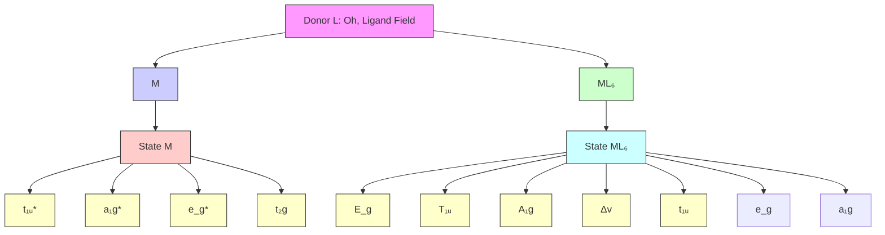
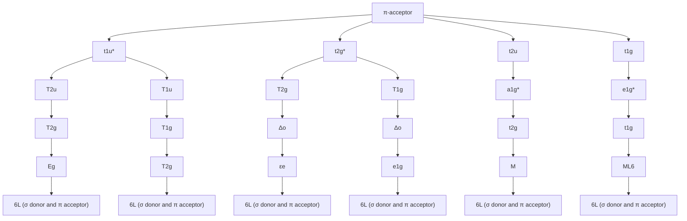
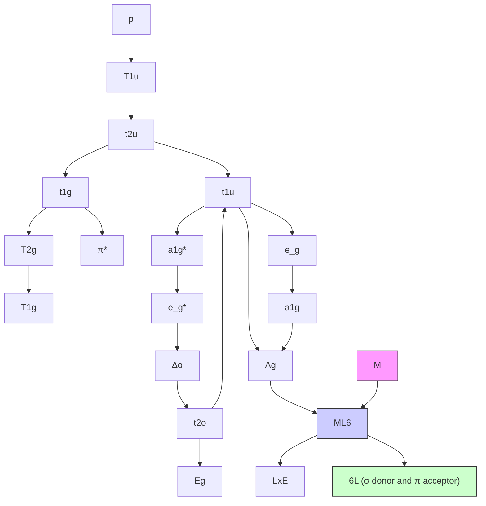

# 一、过渡元素结构化学00:07

# 1. 配体场理论 00:39

# 1）配体分类 01:01

sigma donor配体 01:22

![[过渡元素的结构化学I_笔记_images/18f40f80f79c059b23b021a43cd9bb0f8b19ef57207cc773e827e8ce764163dc.jpg]]

text_image

B. Bonding Theory.
Thermal/guanic sublying.
{ formation (gmml) (kg) ≠ HSAB.
Cholate Effect. { major as >20.
αH → Fe(II)Ag(III)O₂.

Product	ΔH⁺ (kJ/mol)	ΔS⁻ (J/mol K)	ΔC⁺ (J/mol K)
(CaCl₃(H₂O₄)₆H₅O₆)²⁻	-57.3	-67.3	-37.2	3.3 × 10⁹
(CaCl₃(H₂O₄)₆H₅O₆)²⁻	-36.5	+14.1	-60.7	4.0 × 10¹⁰
(Cu(NH₃)₂H₂O₄)²⁻	-46.4	-8	-43.9	4.5 × 10¹⁰
(CuCl₃(H₂O₄)₆H₅O₆)²⁻	-54.4	+23	-61.1	4.4 × 10¹⁰

NH₃	F⁻	CI⁻	Br⁻
2,000	0.68	1,200	20,000
17,000	8	1.2	0.9

用HSAB搅拌人对Fe(II)Ag(III)O₆⁻.

{ nanomagnetic 质态}
diamagnetic 连续.
{ ferromagnetic 铵烷化}
→ Fe(II)Ag(III)O₆⁻
→ Fe(II)Ag(III)O₆⁻
→ Fe(II)Ag(III)O₆⁻
4.LFT
①Ligand{ δ-donor
π - acceptor
π - donor
β - Cu(δ-donor) → △↓ g × O
→ Fe(γ-donor)
β - Cu(γ-donor) → △↓ g × H₂.
→ Fe(γ-donor)

a. μS (cathic acid donor): δ = δ-donor.
b. 4-hydroxylated product

基本分类：从轨道相互作用角度分为三类：仅σ给体（sigma donor only）、σ给体+π受体（π酸配体）、强σ给体+π给体  
○ 轨道作用顺序：永远先形成σ键再形成π键  
光谱学序列规律：强场配体通常是强π酸配体，中场配体是纯σ给体，弱场配体是强π给体  
○ 能量影响：强π酸和强σ给体会使分裂能(Δ)增大，强π给体会显著减小分裂能

\- pi donor配体 01:54

○ 典型例子：氟离子 $(F^{-})$ 和氯离子 $(Cl^{-})$ 都是π给体  
○ 轨道能量比较：氯的σ轨道能量显著高于氟，因为氯参与配位的是第三层轨道（3p），而氟是第二层（2p）  
○ 判断标准：当配体原子相同且无π轨道参与时，可用碱性强弱判断σ给体能力

# 2. 角重叠模型 05:53

# 1）sigma相互作用 06:10

● d轨道识别 08:11

![[过渡元素的结构化学I_笔记_images/2abfd7fa93080f6c2e9d1822b6c1529afdb3f04f16bbebaeaac56cef8d7ac3e8.jpg]]

text_image

3.3 × 10^6
4.0 × 10^10
4.5 × 10^7
4.4 × 10^10
000
0.9
①. 6-donor. interaction.
d2y2
-
-
-
-
-
-
-
-
-
-
-
-
-
-
-
-
-
-
-
-
-
-
-
-
-
-
-
-
-
-
-
-
-
-
-
-
-
-
-
-
-
-
-
-
-
-
-
-
-
-
-
-
-
-
-
-
-
-
-
-
-
-
-
-
-
-
-
-
-
-
-
-
-
-
-
-
-
-5/5
5/5
100% 100%

基本原理：配体σ轨道与金属d轨道相互作用，形成成键（能量下降）和反键（能量上升）轨道

○ 能量守恒：下降能量 $(e_{\sigma})$ 与上升能量数值相等  
○ 轨道识别：在x轴配体作用下，相互作用的d轨道是 $d_{x^{2}-y^{2}}$

● 八面体场分裂能 09:39

![[过渡元素的结构化学I_笔记_images/f900d37bbae128ef516fce7caea81363f12aa8bee0f89e6d4ce50d74f0f98d56.jpg]]

text_image

>0.
影响因素.
ΔG (kJ/mol)
ΔH' - TΔS'
K
-67.3 -37.2 3.3 × 10^6
+14.1 -60.7 4.0 × 10^10
-8 -43.9 4.5 × 10^7
+23 -61.1 4.4 × 10^10
Cl-
Br-
1,200 20,000
1.2 0.9
①. G-donor. interaction.
d₂ = :---: Ie₆.
y = :---: e₆
1/6 z².
2/4 - 2/5 ¼ z² + ¾ x²-y²
②. M(弱) donor? 现. G-down
5/5

○ 系数关系：轴向配体(1,6)与 $d_{z^{2}}$ 作用，赤道配体(2-5)与 $d_{z^{2}}$ 和 $d_{x^{2}-y^{2}}$ 共同作用，系数分别为1/4和3/4  
○ 能量变化：非键轨道 $(d_{xy},d_{xz},d_{yz})$ 能量不变，反键轨道 $(d_{z^{2}},d_{x^{2}-y^{2}})$ 上升 $3e_{\sigma}$   
○ 分裂能公式：八面体场分裂能 $\Delta_{0}=3e_{\sigma}$   
○ 影响因素：

■ 能量匹配：配体σ轨道与金属d轨道能量越接近， $e_{\sigma}$ 越大  
■ 重叠程度：轨道重叠的有效程度影响相互作用强度

# 3. 配体轨道分析 17:19

# 1）CO配体特性 17:32

● 配体性质：CO是典型的强 $\sigma$ 给体（donor）和强 $\pi$ 受体（acceptor）配体  
● 配位特点：在95%以上的配合物中通过碳原子配位  
- 分子轨道图 18:00

![[过渡元素的结构化学I_笔记_images/2ce5ee3c1aa23a18ac554d742b0f710616d37039eacc30f2210400055509bc57.jpg]]

text_image

eg. CO (强 G-donor 且强 π-acceptor 配)
π+
6
π
25
6/6

○ 轨道顺序：从2s轨道开始，依次为 $\sigma$ 和 $\sigma^{*}$ ，然后是2个 $\pi$ 轨道，接着是 $\sigma$ 轨道，最后是 $\pi^{*}$ 和 $\sigma^{*}$ 轨道  
○ HOMO位置： $\sigma$ 轨道是最高占据轨道（HOMO）  
○ LUMO位置：两个 $\pi$ 轨道是最低未占轨道（LUMO），是简并轨道

HOMO分析 19:10

![[过渡元素的结构化学I_笔记_images/5e7a474fedad0b9d05c3443c1ca9e1b1043a8273847d5761db9049bde0e96b92.jpg]]

text_image

eg. CO ( 强 G-donor A 强 π-acceptor 配体 ) .
LUMO
HOMO
C O
6
6
25
25
25
6/6

# ○ ○ 电子云分布：

■ HOMO轨道电子云主要分布在碳原子上  
■ 虽然CO分子偶极矩显示氧端带负电（ $\delta^{-}$ ），碳端带正电（ $\delta^{+}$ ）  
■ 电子密度图显示碳端呈现红色/黄色（缺电子），氧端呈现蓝色/绿色（富电子）

# ○ 配位解释：

■ 配位时使用HOMO轨道  
■ 由于HOMO电子云偏向碳端，导致CO主要通过碳原子配位  
■ 这与价键理论预测一致，但分子轨道理论提供了更精确的解释

![[过渡元素的结构化学I_笔记_images/4920d8cc91026c9ef38c3aadeafe2b4583e04bea63db6b30d19669d52fbc338e.jpg]]

text_image

Select Image
LUMO
HOMO
C O
x y/o
s'
→ s''
: C B O
π Acceptance
π Acceptance
6/6

# ○ 轨道相互作用：

■ 金属d轨道与CO的σ轨道（HOMO）形成σ配键  
■ 金属d电子反馈到CO的 $\pi^{*}$ 轨道（LUMO）形成 $\pi$ 反键

# ○ 配位图示要点：

■ 需能绘制金属与CO配体的轨道重叠示意图  
■ 重点展示 $\sigma$ 给体和 $\pi$ 受体的双重作用

# 4. 反馈π键 23:01

# 1）轨道重叠图 25:01

![[过渡元素的结构化学I_笔记_images/cb585f36f52329e5e0af6b39a84802f724311507b7727b91b95a183d97d090b8.jpg]]

text_image

③ π-acceptor Ligand.
eg. CD (强 6-donor 且强 π-acceptor 配体).
Lumo
Hokko
x y-pit
LUMO
HOMO
C O
π Acceptance
M C O
M C O
π Acceptance
8/6

![[过渡元素的结构化学I_笔记_images/e4ede5b081245f332632f9b0d25ba062ce628119c3a95006d2e3f39db33c87f9.jpg]]

\- 轨道相互作用：CO作为强σ-donor和强π-acceptor配体，与中心金属形成反馈π键时涉及d轨道与配体π\*轨道的重叠

# - 坐标系影响：

○ 在x轴上相互作用的是 $d_{xy}$ 和 $d_{xz}$ 轨道  
○ 在γ轴上相互作用的是 $d_{xz}$ 和 $d_{yz}$ 轨道  
○ 在z轴上相互作用的是 $d_{xz}$ 和 $d_{yz}$ 轨道  
○ 坐标系变化会导致结论改变（强调3次）

![[过渡元素的结构化学I_笔记_images/ef37e798d7a256b9a856e0380d84cb9832e967f08a6bac9e41f351d13c7ef392.jpg]]

text_image

29. CO (346-8-donor 点 346 π-acceptor 配等).
LUMO
Homo
x²稀
x y稀
dxy
× acceptance
× acceptance
HOMO
C O
8' + 6'
: C≡O
dN2.
1/6
6/6

# ● 配位场效应：

○ σ相互作用推高轴向轨道能量 $(d_{z^{2}}$ 、 $d_{x^{2}-y^{2}})$   
○ π相互作用降低平面轨道能量 $(d_{xy}、d_{xz}、d_{yz})$   
○ 八面体场分裂能公式： $\Delta_{0}=3e_{\sigma}+4e_{\pi}$

# ● 影响因素：

○ 能量匹配：d轨道能级上升（如第五周期过渡金属）会增强π反馈   
○ 轨道重叠程度：结构因素影响相互作用强度  
◦ 实际分析中能量匹配是最直接可判断的因素

![[过渡元素的结构化学I_笔记_images/5d2b0c97f771816fd855e53a73f1f0cb2c6dd1263207dede5937ddec91d9451e.jpg]]

text_image

Select Image
x轴
1/6 (x轴) dxy dyz
2/4 (x轴) dxy dxz
3/5 (y轴) dxy dyz
c0
c1
c2
dOrbitals in
uncordinated
metal
Ligand π+ orbitals
Ligand σ orbitals
6/6

# ● 轨道能量排序：

- 未配位时：5个d轨道简并  
○ σ作用后： $e_{g}$ 轨道 $(d_{z^{2}}、d_{x^{2}-y^{2}})$ 能量上升  
○ π作用后： $t_{2g}$ 轨道（ $d_{xy}$ 、 $d_{xz}$ 、 $d_{yz}$ ）能量下降  
总相互作用涉及12个π轨道（6个配体π\*轨道与3个金属d轨道）

# ● 记忆要点：

○ σ作用仅影响轴向轨道（3个）  
○ π作用仅影响平面轨道（3个）  
- 强π-acceptor配体会显著增大分裂能 $\Delta_{0}$   
- 分析时需先考虑σ作用，再考虑π作用

# 5. 派donor配体 31:11

# 1）分裂能计算 33:00

![[过渡元素的结构化学I_笔记_images/ca9fe0808eec795ec58e55383e6c9f7a5b6ed30b3a17428aa3dc5a6000abb694.jpg]]

text_image

d Orbitals in
uncoordinated
metal
4 e'
xy, xz, yz
Ligand σ orbitals
eσ
eπ 取决于 ① 能主匹见 ② 重铬极度

● 能量变化机制：派donor配体通过σ相互作用使 $e_{g}$ 轨道能量上升3倍 $e_{\sigma}$ ，同时通过π相互作用使 $t_{2g}$ 轨道能量上升4倍 $e_{\pi}$ （与派acceptor相反）  
- 分裂能公式： $\Delta_0 = 3e_{\sigma} - 4e_{\pi}$   
● 相互作用强度关系： $3e_{\sigma}$ 永远大于 $4e_{\pi}$ ，说明 $\sigma$ 相互作用强度始终大于 $\pi$ 相互作用  
- 轨道方向不变性：无论配体是派donor还是acceptor，轨道重叠方式保持不变（如x轴配体始终与 $d_{xz}$ 等轨道作用）

![[过渡元素的结构化学I_笔记_images/c88d1e6c67a4b335b722b53922468bf97f25962eef508e20a9fdf9e9d773a6a1.jpg]]

text_image

09:41 1月8日
z², x² - y²
3 e σ
4 e π
d Orbitals in
uncoordinated
metal
xy, xz, yz
e σ
2 e π
Ligand orbitals
-3
M -2
6/6

# ● 关键结论：

- 派donor使分裂能显著减小   
- 分裂能始终为正值  
- 该结论适用于所有金属和配体组合

● 物理解释： $\sigma$ 键的头碰头重叠方式比 $\pi$ 键的肩并肩重叠更有效，导致 $e_{\sigma}>e_{\pi}$

# 6. 四面体场分析 36:57

# 1）轨道相互作用特征

![[过渡元素的结构化学I_笔记_images/190ff70babd61a1253d00dd323ac25d8ec3302fa0ffdc1456f8f19559e55e135.jpg]]

text_image

△₀ = 3eₓ - 4eₙ.
(3e₆ 永边大于 4eₙ) ⇒ △ interaction > ∠ interaction.
四面体场
8
M
9
10
z
x

# - $\sigma$ 相互作用：

○ 作用轨道： $d_{xy}$ 、 $d_{xz}$ 、 $d_{yz}$ 各贡献1/3  
总能量变化：仍为 $e_{\sigma}$

# - $\pi$ 相互作用：

○ 轴上轨道 $(d_{x^{2}-y^{2}}, d_{z^{2}})$ 系数为2/3  
- 面上轨道系数为2/9   
○ 累计效果：每个配体贡献2倍 $e_{\pi}$

# 2）作业题布置 38:53

![[过渡元素的结构化学I_笔记_images/8221dab7eedafe568eaae9e3161628474a2082d466a5a7c1acca69ab66fc2a52.jpg]]

text_image

1π* orbitals
= 3e6+4eπ.
↓↓↓↓↓
nd σ orbitals
6. 7/8/9/10. 1/3dxy + 1/8dx2 + 1/3dyz
π. 7/8/9/10. 2/3dx2y + 2/3dx2²
+ 2/9dy + 2/9dx2 + 2/9dyz
±2eπ
作业.
1. 6-donor L 故 四面体场 ∂ Δt
2. π

# ● 推导任务：

- σ-donor配体的四面体场分裂能 $\Delta_{t}$   
- $\pi$ -donor配体的四面体场分裂能 $\Delta_{t}$   
- $\pi$ -acceptor配体的平面四边形场分裂能 $\Delta_{s}$

# ● 解题提示:

参考八面体场的推导方法  
- 注意配体位置变化对轨道重叠的影响  
- 平面四边形场可视为去除1,6位配体的八面体场

# 二、配位场理论40:21

# 1. 配体场分裂 40:33

![[过渡元素的结构化学I_笔记_images/64b2945f2c21f1f5cbb896a6f8d5d71a4efb700c3189a7423baa56ceecfc0d2b.jpg]]

text_image

1. π-acceptor: Liquid
a₁ (用π-acceptor是通过π-acceptor形成)
1/4 (x轴) d₁x d₂x
1/4 (x轴) d₂x d₃x
1/5 (y轴) dᵧ d₄x
2. π-acceptor: liquid
Ligand orbitals
Δ₀ = 3ε₀ - 4ε₀.
(ξ = θ = ξ + ξ - 4ξ₀) ≠ ← interaction > π-acceptor.
正弦物体
Ligand orbitals
← 7π/11/11/11 xₐₓ + xₐₓ + xₐₓ x₁₁/2
π = 2π/11/11/11 xₐₓ + xₐₓ + xₐₓ x₁₁/2
1/4 (x轴) d₂x d₃x
1/4 (x轴) d₃x d₄x
1/5 (y轴) dᵧ d₄x
2. π-acceptor: liquid
Ligand orbitals
P₁₂
π-acceptor: liquid
Ligand orbitals
6/7

● 轨道类型：包含金属中心d轨道（ $d_{x^{2}-y^{2}}$ 、 $d_{z^{2}}$ 、 $d_{xy}$ 、 $d_{xz}$ 、 $d_{yz}$ ）和配体轨道（ $\sigma$ 和 $\pi$ 轨道）  
- 分裂机制： $\sigma$ 相互作用导致 $e_g$ 轨道能量升高， $\pi$ 相互作用影响 $t_{2g}$ 轨道能量  
● 能级差： $\Delta = 3e_{g} - 4t_{2g}$ ，反映轨道间相互作用强度

# 2. 配体场理论应用 41:11

![[过渡元素的结构化学I_笔记_images/4a2ee4588fb3bcefad6ae84056dbafd77e8d09b953c8923a534e475f705d4e40.jpg]]

text_image

& -donor L & Oh . Lipard Field

- 简化模型：采用angular overlap方法代替完整配体场理论，便于理解轨道相互作用   
● 轨道扩展：分析时需同时考虑d轨道和sp轨道，使模型更复杂但更准确

# 3. 轨道相互作用 41:26

![[过渡元素的结构化学I_笔记_images/b8a49046afe2aa63df53306967a3d01e8d635f5d128122a7c820c68efe7bbf2a.jpg]]

flowchart

● σ给体作用：

○ 成键轨道：配体电子填入6个σ成键轨道 $(a_{1g}、e_{g}、t_{1u})$   
○ 非键轨道： $t_{2g}$ 保持非键特性  
- 反键轨道： $e_{g}^{*}$ 为反键轨道

● 电子排布：HOMO和LUMO均为d轨道相关能级

# 4. 八面体场分析 41:53

![[过渡元素的结构化学I_笔记_images/70dce12c38ae0f5c8bb5e39800d5e76e9b23d256f95b9f82104263fd23605061.jpg]]

text_image

6 - donor L + Dh , ligand Field
π - J
M M00 6L (or donor)

\- $\pi$ 受体效应：

○ 轨道变化： $t_{2g}$ 从非键轨道变为弱成键轨道  
○ 能级调整： $e_{g}^{*}$ 保持强反键特性  
○ 电子影响：d电子优先占据 $t_{2g}$ 轨道

5. 电子排布影响 42:56

![[过渡元素的结构化学I_笔记_images/d1bded79c230767ca28daef4afeccaa2fac5d5384ab4fff4b6a9ebb90e7fc20e.jpg]]

chemical

Molecular orbital diagram of a donor compound with labeled electron and transition states (e.g., t1u, t2g, ML6)

● 关键轨道：

○ 成键轨道：6个σ轨道填满配体电子对  
○ 非键轨道： $t_{2g}$ 容纳d电子  
- 反键轨道： $e_{g}^{*}$ 通常空置

\- 性质决定：物质性质主要由d电子在非键和反键轨道的排布决定

6. 配体场对比图 43:42

![[过渡元素的结构化学I_笔记_images/86f1d5f60e8325f63fb50d3ae4801da4d392b1a5106987bed766ad565049fb31.jpg]]

text_image

π-acceptor 与 π-donor 对比，可被拉长 tg，后标高 tg
E_g
t_2g
t_1g
t_0g
t_e
M
ML_g
6k. (σ donor and π acceptor)
t_2g
Empty ligand group orbital
e_g
Δ_g
e_g
Δ_g
e_g
Δ_g
t_2g
t_1g
t_0g
t_0g
M→L π bonding
σ bonds only
Filled ligand group orbital
t_2g
L→M π bonding
π-donor ligands
(a)
(b)

- $\pi$ 受体: 拉低 $t_{2g}$ 轨道能量, 增大分裂能 $\Delta$   
● $\pi$ 给体：推高 $t_{2g}$ 轨道能量，减小分裂能 $\Delta$   
● 共同特点：均不显著改变 $e_{g}$ 轨道能量

# 7. 分裂能影响因素 44:44

![[过渡元素的结构化学I_笔记_images/4b4ec0dd0dc2df53feedc38bb90ada8ea3e70324624f8c59af49335d85ac6861.jpg]]

flowchart

双重作用：

○ σ给体推高 $e_{g}$ 轨道  
○ $\pi$ 受体拉低 $t_{2g}$ 轨道

● 最大分裂：这种组合使 $\Delta$ 达到最大，形成强场配体

● 稳定化能：源于电子尽可能占据成键轨道获得的额外稳定能

# 8. 18电子规则 45:51

![[过渡元素的结构化学I_笔记_images/7e7543331cd6d823ecde936d0f5d0c4184e4d7ca0af002f579ec9ed938c3b109.jpg]]

flowchart

● 轨道基础： $6\sigma+3\pi=9$ 成键轨道，可容纳18电子  
● 稳定条件：当体系填满18电子时，所有成键轨道全满，达到最大稳定化

# 9. 配体场稳定化 46:28

![[过渡元素的结构化学I_笔记_images/c75c87fc56a6648272b9446efaf61b24c6d3b84e0cf63678bc55e620cbf23b96.jpg]]

text_image

08:41 1958 基二
T
T1x
T2x
T3x
T4x
T5x
T6x
T7x
T8x
T9x
T10x
T11x
T12x
T13x
T14x
T15x
T16x
T17x
T18x
T19x
T20x
T21x
T22x
T23x
T24x
T25x
T26x
T27x
T28x
T29x
T30x
T31x
T32x
T33x
T34x
T35x
T36x
T37x
T38x
T39x
T40x
T41x
T42x
T43x
T44x
T45x
T46x
T47x
T48x
T49x
T50x
T51x
T52x
T53x
T54x
T55x
T56x
T57x
T58x
T59x
T60x
T61x
T62x
T63x
T64x
T65x
T66x
T67x
T68x
T69x
T70x
T71x
T72x
T73x
T74x
T75x
T76x
T77x
M
MI10s
6L (or donor and π acceptor)
7/7

● 能量来源：主要来自电子填入成键轨道获得的稳定化能  
● 表现形式：分裂能 $\Delta$ 大小反映稳定化程度

# 10. 配体场理论总结 47:58

● 核心机制： $\sigma$ 和 $\pi$ 相互作用共同决定轨道分裂模式  
● 配体影响：

○ $\sigma$ 给体强度决定 $e_{g}$ 升高程度

\- $\pi$ 相互作用类型( $\pi$ 给体/受体)决定 $t_{2g}$ 能量变化

● 应用价值：解释配合物稳定性、磁性、光谱性质等

# 三、光谱化学序列 48:08

# 1. 强场配体 48:21

![[过渡元素的结构化学I_笔记_images/3da01c7513d540107530628b98f48416ff02d1fb03ca1366ae14789e8d0dcfb5.jpg]]

text_image

spectro chemical Series.
strong ≤-donor
+ > 6-donor only > medium ≤-donor
strong π-acceptor
medium ≤-donor
Strong π-donor.
CO. ©CN

● 组成特征: 强场配体是strongσdonor + strongπacceptor的组合  
● 场强比较：其场强大于仅有 $\sigma$ donor且donor能力中等偏弱的配体（medium to weak $\sigma$ donor）  
● 稳定条件: 稳定配位化合物至少需要形成 $\sigma$ 键，因此不可能存在weak $\sigma$ donor的配体  
● 典型例子: CO和CN $^{-}$ （等电子体）

\- σdonor能力: CN $^{-}$ > CO（通过HOMO轨道能量比较）

\- $\pi$ acceptor能力: CO > CN $^{-}$ (氧的电负性显著拉低 $\pi^{*}$ 轨道)

# 2. 弱场配体 49:36

● 组成特征: mediumσdonor + strongπdonor   
● 作用机制: $\pi$ donor效应越好，轨道能量匹配性越佳，使 $\pi$ 键能量上升  
● 判断经验: 当 $\pi$ 酸和 $\pi$ 碱配体竞争时， $\pi$ 效应通常起主导作用

# 3. 配体比较 50:28

![[过渡元素的结构化学I_笔记_images/c46ade3b4eb6e3b1173d6b7e4f637485c183ec9bdcfeefdf406c21cfbdbfa50e.jpg]]

text_image

spectro chemical Series.
strong ≤-donor
+
6-donor only
medium ≤-donor
+
strong π-acceptor
(medium ≤-donor
strong π-donor.
CO., C N >
H2O
F^- > Cl^- > Bi^- > Z^-

CO与CN⁻对比:

- 理论上场强相近（CN $^{-}$ 的σdonor更强，CO的πacceptor更强）  
部分文献认为CO略强，但实际应视为相当

\- NH₃与en对比:

二者均为 $\sigma$ donor only配体  
- en（乙二胺）碱性更强，donor能力更强，故场强更大

# 4. 卤素配体排序 52:54

![[过渡元素的结构化学I_笔记_images/b5dabfbc6113676b13aa176ca45f82eacddb75111044144d8638fa450bb97f6c.jpg]]

text_image

spectro chemical Series.
strong ≤-donor
+ > 6-donor only > medium ≤-donor
strong π-acceptor
(medium ≤-donor) strong π-donor.
CO., C N > H2O > F > OH > Cl > Bi > Z

- 排序依据: 主要考虑 $\pi$ donor能力  
● 场强序列: $F^{-} > Cl^{-} > Br^{-} > I^{-}$ ( $\pi$ donor能力递增导致场强递减)   
● 本质原因: 重原子轨道能量匹配性更好， $\pi$ 键能量上升更显著

# 5. 水与羟基配体 54:09

![[过渡元素的结构化学I_笔记_images/071a128f75d66ea77740f11f70a6b16fd4b619ab62d217677773cab265046c57.jpg]]

text_image

spectro chemical Series.
strong ≤-donor
+
6-donor only
medium ≤-donor
+
strong π-acceptor
(medium ≤-donor
strong π-donor.
CO., C N >
H2O > F > OH
> Cl > Bi > Z

# - 对比分析:

- OH $^{-}$ 是更强的σdonor，但也是更强的πdonor  
- 水（ $\mathrm{H}_{2} \mathrm{O}$ ）场强略大于 $\mathrm{OH}^{-}$

● 理论解释: 虽然 $OH^{-}$ 的 $\sigma$ donor效应更强，但 $\pi$ donor效应起主导作用

● 实验序列: 实际测得的光谱化学序列为 $H_{2}O > F^{-} > OH^{-} > Cl^{-} > Br^{-} > I^{-}$

# 四、电子光谱基础56:11

# 1. 分裂能计算 57:23

![[过渡元素的结构化学I_笔记_images/0bd819dae814e445ea47d6781360c824cc0041bf6c1d0512ae48cbf7ab60b5ea.jpg]]

text_image

09:41 1月8日 星二
① π-αφορει Lígond
α₁ (用) Φ=δων 点法为-π-αφορει 则得。
② Φ=δων
③ Φ=δων
④ Φ=δων
⑤ Φ=δων
⑥ Φ=δων
⑦ Φ=δων
⑧ Φ=δων
⑨ Φ=δων
⑩ Φ=δων
⑪ Φ=δων
⑫ Φ=δων
⑬ Φ=δων
⑭ Φ=δων
⑮ Φ=δων
⑯ Φ=δων
⑰ Φ=δων
⑱ Φ=δων
⑲ Φ=δων
⑳ Φ=δων
㉑ Φ=δων
㉒ Φ=δων
㉓ Φ=δων
㉔ Φ=δων
㉕ Φ=δων
㉖ Φ=δων
㉗ Φ=δων
㉘ Φ=δων
㉙ Φ=δων
㉚ Φ=δων
㉛ Φ=δων
㉜ Φ=δων
㉝ Φ=δων
㉞ Φ=δων
㉟ Φ=δων
㉳ Φ=δων
㉴ Φ=δων
㉵ Φ=δων
㉳ Φ=δων
㉎ Φ=δων
㉟η Φ=δων
㉞ Φ=δων
㉟α Φ=δων
㉟β Φ=δων
㉟c Φ=δων
㉟d Φ=δων
㉟e Φ=δων
㉟f Φ=δων
㉟g Φ=δων
㉟h Φ=δων
㉟i Φ=δων
㉟j Φ=δων
㉟k Φ=δων
㉟l Φ=δων
㉟m Φ=δων
㉟n Φ=δων
㉟o Φ=δων
㉟p Φ=δων
㉟q Φ=δων
㉟r Φ=δων
㉟s Φ=δων
㉟t Φ=δων
㉟u Φ=δων
㉟v Φ=δων
㉟w Φ=δων
㉟x Φ=δων
㉟y Φ=δων
㉟z Φ=δων
㉞ Φ=δων
㉟α Φ=δων
㉟β Φ=δων
㉟c Φ=δων
㉟d Φ=δων
㉟e Φ=δων
㉟f Φ=δων
㉟g Φ=δων
㉟h Φ=δων
㉟iθη δ(θ) δ(θ) δ(θ) δ(θ) δ(θ) δ(θ) δ(θ) δ(θ) δ(θ) δ(θ) δ(θ) δ(θ) δ(θ) δ(θ) δ(θ) δ(θ) δ(θ) δ(θ) δ(θ) δ(θ) δ(θ) δ(θ) δ(θ) δ(θ) δ(θ) δ(θ)
△+2ε6-4ε6.
(ξε6或ξε6) =ξε×α×α×γ×α×α×γ×α×γ×α×γ×α×γ×α×γ×α×γ×α×γ×α×γ×α×γ×α×γ×α×γ×α×γ×α×γ×α×γ×α×γ×α×γ×α×γ×α×γ×α×γ×α×γ×α×γ×α×γ×α×γ×α×γ×α×γ×α×τ)
① 3π/2π/2π/2π/2π/2π/2π/2π/2π/2π/2π/2π/2π/2π/2π/2π/2π/2π/2π/2π/2π/2π/2π/2π/2π/2π/2π/2π/2π/2π/2π/2π/2π/2π/2pi/2π/2π/2π/2π/2π/2π/2π/2π/2π/2π/2π/2π/2π/2π/2π/2π/2π/2π/2π/2π/2π/2π/2π/2π/2π/2π/2π/2π/2π/2π/2π/2π/2π/s/
Lígond στήσεις τησόμεις τησόμεις τησόμεις τησόμεις τησόμεις τησόμεις τησόμεις τησόμεις τησόμεις τησόμεις τησόμεις τησόμεις τησόμειςτησόμεις τησόμεις τησόμεις τησόμεις τησόμεις τησόμεις τησόμεις τησόμεις τησόμεις τησόμεις τησόμεις τησόμεις τησόκούρούρούρούρούρούρούρούρούρούρούρούρούρούρούρούρούρούρούρούρούρούρούρούρούρούρούρούρούρούρούρούρούρούρυκέται αυκάται αυκάται αυκάται αυκάται αυκάται αυκάται αυκάται αυκάται αυκάται αυκάται αυκάται αυκάται αυκάται αυκάται αυκάται αυκάται αυκάται ααυκάται αυκάται αυκάται αυκάται αυκάται αυκάται αυκάται αυκάται αυκάται αυκάται αυκάται αυκάται αυκάται αυκάται αυκάται αυκάται αυκάctαι αυκάctαι αυκάctαι αυκάctαι αυκάctαι αυκάctαι αυκάctαι αυκάctαι αυκάctαι αυκάctαι αυκάctαι αυκάctαι αυκάctαι αυκάctαι αυκάctαι αυκάctαι αυκάctαι αυχαλίου καλίου καλίου καλίου καλίου καλίου καλίου καλίου καλίου καλίου καλίου καλίου καλίου καλίου καλίου καλίου καλίου καλίου καλίου καλίου καλίου νυχή υψος νυχή υψος νυχή υψος νυχή υψος νυχή υψος νυχή υψος νυχή υψος νυχή υψος νυχή υψος νυχή υψος νυχή υψος νυχή υψος γιχή υψος γιχή γιχή γιχή γιχή γιχή γιχή γιχή γιχή γιχή γιχή γιχή γιχή γιχή γιχή γιχή γιχή γιχή γιχή γιχή γιχή γιχή γιχή γιχή γιχή γιχή γιχΗ γιχή γιχή γιχή γιχή γιχή γιχή γιχή γιχή γιχή γιχή γιχή γιχή γιχή γιχή γιχή γιχή γιχή γιχή γιχή γιχή γιχή γιχή γιχή γιχή γιχ<nl>

●   
● 基本公式: $\Delta_{0}=3e_{\sigma}-4e_{\pi}$ ( $\pi$ acceptor配体)  
● 变体公式: $\Delta_{0}=3e_{\sigma}+4e_{\pi}$ ( $\pi$ donor配体)  
- 轨道作用:

○ σdonor推高 $e_{g}$ 轨道

\- $\pi$ acceptor拉低 $t_{2g}$ 轨道

○ $\pi$ donor推高 $t_{2g}$ 轨道

2. 前线轨道分析 59:39  
![[过渡元素的结构化学I_笔记_images/75c51c37dfede4dfc447c36c385674948ff0c9c63a1b1c5eea99bebe08438116.jpg]]

text_image

Oh . Ligand Field
Overview:
spectrochemical Series.
Strong 6-donor
+ > 6-donor only
Strong π-acceptor
(medium ≤-dose)
Alloy π-donor.
CO. , (N) > en > NH3 > H2O > F > "OH > Cu">H2O2"
Oh . Ligand Field
T1u*
T2u*
T2u
T1g
T2u
T1g
T2g
T1g
T2g
T1g
T2g
T1g
T2g
T1g
T2g
T1g
T2g
T1g
T2g
T1g
7/7

●   
- 分析要点:  
- 需要熟练掌握σdonor和π效应对轨道能量的影响趋势  
- 关键记忆： $\sigma$ donor推高什么轨道， $\pi$ 效应如何改变轨道能量

\- 应用延伸:

\- 与前线轨道理论相通（HOMO-LUMO分析）

\- 在软硬酸碱理论中同样重要

# 五、电子跃迁类型01:05:10

1. dd跃迁 01:05:47

![[过渡元素的结构化学I_笔记_images/822d9a4120e8aecbd5be9631df3375a5a3869b2703b091b7302e667b0f56b8a3.jpg]]

text_image

stony <-donor
+ > <-donor only
+ medium <-down
strong π-acceptor
(medium <-down
stony <-d
co. , ©N > en > NH3 > H2O > F" > "OH > Cl">Br>2"
Part III Electronic Spectra
T2u T1u
T2g T1g
π*

● 定义：指d电子在配位场中不同能级间的跃迁，是过渡金属配合物的特征光谱  
- 互补色原理：吸收特定波长的光后，物质呈现其互补色。例如吸收紫光（400-450nm）呈现黄色，吸收蓝光（450-490nm）呈现橙色  
- 颜色判断依据：通过配合物显现的颜色可推测其分裂能高低，这是光谱化学的重要应用

# 2. 电荷转移 01:06:42

![[过渡元素的结构化学I_笔记_images/33bccc512731039231c3be82c4f84272fda95ef693cf0f114b7846f119ba9cfd.jpg]]

text_image

09:41 18GB 基二
Photos 1079
All Photos 1073
V-AC(2H5)2
N=O
M=O
N=O
N=O
N=O
N=O
N=O
N=O
N=O
N=O
N=O
N=O
N=O
N=O
N=O
N=O
N=O
N=O
N=O
N=O
N=O
N=O
N=O
N=O
N=O
N=O
N=O
10.2 (Figures 1)
10.2 (Figures 2)
10.2 (Figures 3)
10.2 (Figures 4)
10.2 (Figures 5)
10.2 (Figures 6)
10.2 (Figures 7)
10.2 (Figures 8)
10.2 (Figures 9)
10.2 (Figures 10)
10.2 (Figures 11)
10.2 (Figures 12)
10.2 (Figures 13)
10.2 (Figures 14)
10.2 (Figures 15)
10.2 (Figures 16)
10.2 (Figures 17)
10.2 (Figures 18)
10.2 (Figures 19)
10.2 (Figures 20)
10.2 (Figures 21)
10.2 (Figures 22)
10.2 (Figures 23)
10.2 (Figures 24)
10.2 (Figures 25)
10.2 (Figures 26)
10.2 (Figures 27)
10.2 (Figures 28)
10.2 (Figures 29)
10.2 (Figures 30)
10.2 (Figures 31)
10.2 (Figures 32)
10.2 (Figures 33)
10.2 (Figures 34)
10.2 (Figures 35)
10.2 (Figures 36)
10.2 (Figures 37)
10.2 (Figures 38)
10.2 (Figures 39)
10.2 (Figures 40)
10.2 (Figures 41)
10.2 (Figures 42)
10.2 (Figures 43)
10.2 (Figures 44)
10.2 (Figures 45)
10.2 (Figures 46)
10.2 (Figures 47)
10.2 (Figures 48)
10.2 (Figures 49)
10.2 (Figures 50)
10.2 (Figures 51)
10.2 (Figures 52)
10.2 (Figures 53)
10.2 (Figures 54)
10.2 (Figures 55)
10.2 (Figures 56)
10.2 (Figures 57)
10.2 (Figures 58)
10.2 (Figures 59)
10.2 (Figures 60)
10.2 (Figures 61)
10.2 (Figures 62)
10.2 (Figures 63)
10.2 (Figures 64)
10.2 (Figures 65)
10.2 (Figures 66)
10.2 (Figures 67)
10.2 (Figures 68)
10.2 (Figures 69)
10.2 (Figures 70)
10.2 (Figures 71)
10.2 (Figures 72)
10.2 (Figures 73)
10.2 (Figures 74)
10.2 (Figures 75)
10.2 (Figures 76)
10.2 (Figures 77)
10.2 (Figures 78)
10.2 (Figures 79)
10.2 (Figures 80)
10.2 (Figures 81)
10.2 (Figures 82)
10.2 (Figures 83)
10.2 (Figures 84)
10.2 (Figures 85)
10.2 (Figures 86)
10.2 (Figures 87)
10.2 (Figures 88)
10.2 (Figures 89)
10.2 (Figures 90)
10.2 (Figures 91)
10.2 (Figures 92)
10.2 (Figures 93)
10.2 (Figures 94)
10.2 (Figures 95)
10.2 (Figures 96)
10.2 (Figures 97)
10.2 (Figures 98)
10.2 (Figures 99)
10.2 (Figures 100)

● 常见配体：2,2'-联吡啶(bpy)和1,10-菲啰啉(phen)是典型双齿配体  
- 同族元素规律：

- 第四周期: $[MnO_4]^- < [TcO_4]^- < [ReO_4]^-$   
- 第五周期： $[CrO_{4}]^{2-} < [MoO_{4}]^{2-} < [WO_{4}]^{2-}$   
○ 第六周期： $[VO_{4}]^{3-} < [NbO_{4}]^{3-} < [TaO_{4}]^{3-}$

# 3. 光谱化学应用 01:08:08

<table><tr><td>Wavelength Range (nm)</td><td>Wave Numbers (cm⁻¹)</td><td>Color</td><td>Complementary Color</td></tr><tr><td>&lt; 400</td><td>&gt;25,000</td><td>Ultraviolet</td><td></td></tr><tr><td>400-450</td><td>22,000-25,000</td><td>Violet</td><td>Yellow</td></tr><tr><td>450-490</td><td>20,000-22,000</td><td>Blue</td><td>Orange</td></tr><tr><td>490-550</td><td>18,000-20,000</td><td>Green</td><td>Red</td></tr><tr><td>550-580</td><td>17,000-18,000</td><td>Yellow</td><td>Violet</td></tr><tr><td>580-650</td><td>15,000-17,000</td><td>Orange</td><td>Blue</td></tr><tr><td>650-700</td><td>14,000-15,000</td><td>Red</td><td>Green</td></tr><tr><td>&gt;700</td><td>&lt; 14,000</td><td>Infrared</td><td></td></tr></table>

● 可见光范围：400-700nm（不同教材可能扩展至800nm）  
● 颜色对应关系：

○ 紫（400-450nm）↔黄

○ 蓝（450-490nm）↔橙

○ 绿（490-550nm）↔红

○ 黄（550-580nm）↔紫

○ 红（650-700nm）↔绿

实际应用案例：六水合铜(II)离子 $[Cu(H_{2}O)_{6}]^{2+}$

○ 主要吸收带在\~1300cm^-1（近红外区）  
- 理论应显蓝绿色，实际呈蓝色  
- 说明：颜色预测存在偏差，因实际吸收带可能重叠

# 六、选律理论01:09:27

1. 自旋选律 01:10:37

● 核心规则： $\Delta S = 0$ ，即跃迁过程中单电子数不能发生变化  
- 违反后果: 一旦违反自旋选律, 吸光系数将小于 $1 \mathrm{~mol}^{- 1} \mathrm{~cm}^{- 1}$   
- 典型示例：八面体场中，从全充满的 $t_{2g}$ 轨道跃迁到 $e_g$ 轨道会产生两个单电子，违反自旋选律  
● 重要性：这是最重要的选律限制，违反后几乎不产生吸光现象

2. 宇称选律 01:13:21

- Laporte规则：又称宇称选律，是关于对称性的选律限制  
● 适用性：仅适用于d-d跃迁，不适用于电荷转移(CT)跃迁  
- 违反后果:

- 违反宇称选律时吸光系数为 $20 - 100 \mathrm{~mol}^{-1} \mathrm{~cm}^{-1}$   
- 完全符合选律的d-d跃迁吸光系数约 $500 \mathrm{~mol}^{-1} \mathrm{~cm}^{-1}$

● 实际表现：在理想八面体场中d-d跃迁通常违反宇称选律，但实际对称性不完美时仍能微弱发生

3. 选律应用 01:15:24

\- 颜色表现：

- d-d跃迁产生的颜色通常较淡（吸光系数小）  
- CT跃迁产生的颜色非常浓烈（吸光系数大，1000-50000mol $^{-1}$ cm $^{-1}$ ）

● 实验设计：需先测定物质的吸收光谱，确定主要吸收带位置后选择合适波长进行测量

● 记忆要点：电荷转移(CT)跃迁不受任何选律限制，因此吸光强度显著高于d-d跃迁

# 七、电荷转移光谱01:16:25

# 1. 配体到金属转移 01:17:58

● 定义：电子从配体轨道跃迁到金属空轨道（LMCT）  
● 特点：不受选律限制，吸光系数极高（1000-50000mol $^{-1}$ cm $^{-1}$ ）

# 2. 金属到配体转移 01:19:29

● 定义：电子从金属d轨道跃迁到配体空轨道（MLCT）  
● 特点：同样不受选律限制，产生强烈吸收

# 3. CT光谱特征 01:20:21

● 强度特征：比d-d跃迁强10-1000倍   
● 应用价值：常用于高灵敏度分析检测

● 颜色表现：当CT跃迁发生在可见光区时，会产生非常鲜艳的颜色

# 八、实例分析01:21:21

# 1. 六氨合铬光谱 01:22:26

# 1）跃迁选择规则

- 自旋允许条件： $\Delta s = 0$ 的跃迁是允许的， $\Delta s \neq 0$ 是禁阻的（如 $t_{2g}^{3} e_{g}^{1}$ 到 $t_{2g}^{2} e_{g}^{2}$ ）  
- 宇称禁阻规则：具有对称中心的分子中，奇偶对称性相同轨道间跃迁禁阻（ $g \to g$ 或 $u \to u$ ）  
- 对称性标识：分子轨道下标u/g表示奇偶性（如 $t_{2g}$ 、 $a_{eg}$ 等），实际操作中通过查表获取

# 2）八面体场dd跃迁

- 典型禁阻跃迁： $t_{2g} \rightarrow e_g$ 在八面体场中属于宇称禁阻（g→g）  
● 实际表现：禁阻跃迁仍会发生但概率低，吸收峰强度较弱   
● 应用场景：过渡金属配合物研究中需结合Laporte规则分析（如同步辐射谱研究）

# 3）电荷转移光谱

# - LMCT（配体到金属）

○ 电子转移方向：配体HOMO→金属LUMO

○ 发生条件:

■ 配体给电子能力强（如含S/I配体）  
金属高氧化态（如 $Cr^{3+}$ ）

○ 光谱特征：多数在紫外区，吸光系数大（logε值高）

# - MLCT（金属到配体）

○ 电子转移方向：金属d轨道→配体 $\pi^{*}$ 轨道

○ 发生条件：

低价/零价后过渡金属（如Ru(II)）  
■ 强 $\pi$ 受体配体（如联吡啶、菲啰啉）

○ 能级关系：金属d轨道升高或配体 $\pi^{*}$ 下降导致红移

# 2. 五氨一氯合铬光谱 01:24:59

# 1）取代效应分析

\- 红移现象： $[Cr(NH_3)_5Cl]^{2+}$ 的CT吸收峰相比 $[Cr(NH_3)_6]^{3+}$ 发生红移

# - 原因解析：

- Cl $^{-}$ 给电子能力比NH $_{3}$ 强，抬高配体HOMO能级  
○ 降低LUMO-HOMO能隙，波长 $\lambda$ 增大

● 对称性变化：降低对称性可能部分解除宇称禁阻

# 2）过渡金属显色规律

- 同族元素趋势：周期数增加 $\rightarrow$ d轨道能级上升 $\rightarrow$ LMCT蓝移（如 $\mathrm{MnO_4^-}\rightarrow \mathrm{TcO_4^-}\rightarrow \mathrm{ReO_4^-})$   
● 同周期元素趋势：氧化态升高→LUMO下降→LMCT红移（如 $VO_{4}^{3-}\rightarrow CrO_{4}^{2-}\rightarrow MnO_{4}^{-}$ ）

● 颜色深度：可见光区CT跃迁通常显深色 ( $\varepsilon>10^{3}$ )

3）典型光谱对比

● dd跃迁峰：六氨合铬在400nm和550nm处有两个弱吸收（自旋允许但宇称禁阻）

\- CT带位置：

○ $\left[Cr(NH_{3})_{6}\right]^{3+}$ : <200nm （紫外区）

○ $[Cr(NH_{3})_{5}Cl]^{2+}: \sim250nm$ （红移约50nm）

# 九、配位化学01:46:23

1. 配体交换机理 01:47:28

1）解离机理 02:00:26

● 过程类比：类似于SN1反应，被替换配体先离开配合物  
● 动力学特征：第一步为快速平衡，可用平衡假设处理；速率决定步骤通常是第二步  
● 适用场景：常见于配体容易解离的情况，如弱场配体或高自旋配合物

2）交换机理 02:01:17

- 过程类比：类似于SN2反应，新旧配体同时参与键的断裂与形成  
● 作用机制：新配体(Y)与金属(M)相互作用会削弱原有M-X键的轨道重叠  
● 特点：新旧键的断裂与形成同步进行，形成过渡态而非中间体

3）缔合机理 02:02:23

● 独特特征：过渡金属配位数灵活，可形成高配位中间体  
● 过程描述：先形成高配位中间体（如六配位→七配位），再解离一个配体  
● 常见性：在过渡金属配合物中非常常见，是有机反应不具备的特点

2. 反式效应 02:04:00

1）σ键效应解释 02:08:54

● 作用机制：强σ给体配体会削弱反位配体与金属的σ键  
- 极化解释：强σ给体使金属对位带δ⁻，导致反位配体键易断裂   
● 配体排序： $H^{-}>I^{-}\approx CH_{3}^{-}\approx CO\approx CN^{-}>Br^{-}>Cl^{-}>OH^{-}$   
● 规律总结： $\sigma$ 给体能力越强，反式效应越显著

2）派键效应解释 02:06:49

● 作用条件：主要适用于缔合机理的情况  
● 派受体作用：强派受体配体使金属中心更缺电子，能稳定更多配体  
● 稳定机制：金属电子云可被分摊到派受体配体上  
● 与σ效应区别：σ效应促进解离，派效应促进缔合机理

3. 动力学效应 02:15:51

1）反式效应机理

● 活化能降低原理：当存在强π酸配体时，能更好地稳定配体交换过渡态，从而显著降低活化能 $E_{A}$   
- 轨道作用机制：互为反式的两个配体与之相互作用的d轨道完全重合，产生类似 $S_{N}2$ 反应的削弱效应  
● 配体影响对比：  
○ σ键合：通过使原料能量上升来促进反应（不稳定化效应）  
- $\pi$ 键合：通过显著拉低过渡态能量来促进反应（稳定化效应）

2）配体强度排序

● 最强π酸配体：CN $^{-}$ 和CO（兼具强π酸和强σ给体特性）

\- 次级π酸配体：

- PR3 (强σ给体+良好π受体)  
○ $S^{2-}$ （与磷类似）  
○ $NO_{2}^{-}$

\- 较弱配体：

○ 其他阴离子（主要σ给体）  
o py（吡啶，理论应为较好π酸但实际表现弱）  
- $\mathrm{NH}_{3}$ （与py类似，难以用理论完全解释）

# 4. 配位化学总结 02:24:52

# 1）反式效应本质

● 动力学特性：反映反应速率差异而非热力学稳定性  
● 实际表现：决定配体在反位优先被替换的顺序   
● 机理分类：

○ D机理（解离机理）：先离去后结合，类似 $S_{N}1$

○ A机理（结合机理）：先结合后离去，类似 $S_{N}2$

# 2）配体交换基本概念

● 研究意义：是理解反式效应的基础（虽然本身不常直接考查）  
● 过渡态稳定化： $\pi$ 酸配体通过 $d_{xy}$ 和 $d_{xz}$ 轨道与配体 $\pi^{*}$ 轨道相互作用  
● 记忆要点：

○ 强π受体配体 → 强π键合效应 → 强反式效应

作用轨道：主要在xy和xz平面上的 $d_{xy}$ 和 $d_{xz}$ 轨道

☐ 注：根据课程记录，后续关于配合物氧化还原和配体修饰的内容建议参考教材第五章，此处不作展开。

# 十、金属有机化学02:26:24

# 1. 金属有机定义 02:27:23

● 核心概念: 研究含有金属-碳键（metal-carbon bonds）化合物的化学分支  
- 英文定义: The chemistry of compounds that contain metal-carbon bonds

# 2. 历史发展 02:27:49

# 1）蔡思妍发现 02:28:23

● 发现时间: 1827年首次报道  
● 物理性质: 黄色针状晶体（yellow needle-like crystal）  
● 结构解析: 100多年后才确定其结构  
- 分子结构:

\- 内界由铂（Pt）、3个氯（Cl）和1个乙烯（ $\mathrm{C_2H_4}$ ）组成

\- 乙烯配体构型：在四配位平面结构中呈垂直取向

# - 成键机制:

○ σ键：由乙烯的π轨道与铂的 $d_{x^{2}-y^{2}}$ 轨道形成  
- 反馈π键：由乙烯的π\*反键轨道与铂的 $d_{xy}$ 轨道形成  
氢原子位移：由于反馈π键作用，四个氢原子不再与碳共平面

# 2）四羰基镍合成 02:32:55

● 发现时间: 1890年  
● 主要用途: 镍的纯化工艺  
- 反应特性:

○ 可逆反应：Ni + 4CO ⇌ Ni(CO) $_{4}$   
- 温度控制：低温利于形成四羰基镍，高温使其分解

# - 空间构型:

\- 涉及 $d_{xz}$ 轨道形成蝴蝶形（butterfly-shaped）反馈键

# 3）维生素B12研究 02:37:53

# - 结构特征:

○ 中心钴离子（Co）位于咕啉环骨架中  
○ 上下轴向分别连接配体

# ● 研究历程:

- 1928年：发现肝脏提取物可治疗恶性贫血  
- 1934年：获诺贝尔医学奖（肝脏疗法）  
- 1948年：分离出有效成分B12  
- 1956年：X射线衍射确定结构（获1964年化学诺奖）

# - 全合成突破:

- 1972年由Woodward（哈佛）和Eschenmoser（ETH）团队合作完成  
研究规模：

■ 哈佛投入90余名博士后

■ 苏黎世理工投入10余名博士生

○ 合成参数：72步反应，总产率0.01%

\- 科学意义：确立了"任何稳定分子均可人工合成"的信念

# - 理论衍生:

- 在全合成过程中孕育了前线轨道理论雏形  
- 为Hoffmann获得诺贝尔奖奠定基础

# ● 二茂铁发现:

- 1951年通过格氏试剂偶联意外获得  
- 1956年X射线确认三明治结构

# ● 构型争议:

- 早期误判为D5d交叉式构型（因环旋转）  
- 98K低温测定实为D5h重叠式构型  
○ 能量差异：不同构型间能垒很小

# 3. 18电子规则 02:45:32

# 1）适用条件 02:49:55

\- 计算方法：存在两种计算方式：

A: 将所有组分视力离子计算（如 $[Fe(CN)_6]^{4-}$ 中 $CN^{-}$ 计6e， $Fe^{2+}$ 计6e，总电子数 $= 6 \times 2 + 6 = 18\mathrm{e}$ ）

○ Method B: 不考虑配体与金属间电子得失（CN计5e，Fe计8e，总电子数 $= 5 \times 2 + 8 = 18\mathrm{e}$ ）

# NO配体特例：

○ 弯曲型NO：离子算法计2e（视为单齿配体），中性算法计1e（仅提供反键轨道电子）  
◦ 直线型NO：中性算法计3e（CO等电子体，更常见）

● 理论依据：当9个成键轨道（5d+1s+3p）全满时最稳定，类似八隅体规则   
- 典型体系：八面体场强 $\pi$ 酸配体（如羰基化合物），因强场配体将 $t_{2g}$ 轨道显著下拉，使6个配体轨道+3个 $t_{2g}$ 轨道全满（共18e）

2）超18电子情况 02:53:24

● 形成条件：当 $e_{g}$ 轨道近似非键轨道时  
● 电子分布：6个配体轨道+3个 $t_{2g}$ +2个 $e_{g}=11$ 轨道（最多22e）  
● 实例： $[Zn(en)_{3}]^{2+}$ （乙二胺配锌）为22电子体系  
● 配体特征：中等强度σ给体且无其他效应（纯σ给体配体）

3）少于18电子情况 02:54:28

八面体场情况

○ 形成机制： $t_{2g}$ 轨道显著升高（与18e情况相反）  
○ 电子分布：仅6个配体轨道参与（极限12e）  
○ 实例： $[TiF_{6}]^{2-}$ （六氟合钛离子）  
○ 配体特征：强π给体配体

\- 平面四边形场情况

\- 稳定构型：后过渡金属（Ni、Pd、Pt等）常见16/14e规则

# ○ 轨道分布：

■ 16e: 4个配体轨道+4个金属轨道（空置 $d_{x^{2}-y^{2}}$ ）  
■ 14e: 进一步空置 $d_{z^{2}}$ 轨道

\- 理论解释：后过渡金属d轨道能量显著升高，导致弱成键/非键特性

# ● 配体标记规则

○ η^n标记：表示配体中n个原子与金属键合（省略数字时表示所有可配位点均参与）

■ 例： $\eta^{5}-C_{5}H_{5}$ （五配位茂基）可简写为 $\eta-C_{5}H_{5}$

\- $\mu^{\wedge} n$ 标记：表示配体桥连 $n$ 个金属（省略数字时默认 $\mu_2$ 桥连）

■ 例：端基CO记为 $\mu_{1}-CO$ ，桥连CO记为 $\mu_{2}-CO$ 或简写为 $\mu-CO$

# 4. 常见配体 03:01:28

# 1）羰基配体 03:06:43

# - 基本性质

○ 配位特性: CO既是强的σ给体（sigma donor），也是强的π受体（pi acceptor）  
○ 电子规则: 羰基配合物通常符合18电子规则

# - 红外光谱分析

○ 波数关系: 红外波数( $\bar{v}$ )与键能(k)的关系为 $\bar{v} \propto \sqrt{k/m}$ ，其中m为折合质量

○ 键能判断: 对于相同化学键，键能越大键长越短，红外波数越大

# ○ 实验数据:

■ 自由CO波数：2143 cm^{-1}  
■ 配合物中CO波数范围：1748-2204 cm^{-1}

# ● 配位效应分析

# ○ σ给体效应:

■ 增强键能，缩短键长  
■ 机理：将电子云从O端拉回C-O键区域，增强核电子约束

# ○ π反馈效应:

■ 减弱键能，增长键长  
■ 机理：电子填入CO反键轨道

# ○ 特殊案例:

六羰基二价铁中CO键能>自由CO  
■ 解释：以σ给体效应主导，反馈π键极弱

# ● 配位方式比较

# ○ 端基配位(μ1):

■ 通常π反馈效应主导  
■ 波数小于自由CO

# ○ 桥联配位(μ2):

■ 需分别考虑σ和π轨道重叠   
■ 轴向位置形成 $\pi$ 键，面内位置形成 $\sigma$ 键

# ● 非常规配位方式

- 0端配位: 与极硬路易斯酸配位时可能出现  
- N2类比: CO与N2为等电子体，但O端配位在CO中较罕见

# 2）桥联配体 03:17:13

# 金属-金属多重键

○ 键长变化: 实验显示某些二聚体中M-M键缩短79 pm（约0.79 Å）  
○ 键级判断: 显著键长缩短通常表明形成三重键

# ● 非常规桥联方式

\- 不对称桥联: 存在非经典的不对称桥联结构

■ 特点：红外波数减小

■ 配位方式：侧向倾斜配位

○ 轨道图示: 需分别绘制σ和π轨道重叠示意图

# 5. 制备方法 03:26:39

- 直接金属加CO法：通过金属直接与一氧化碳反应制备，如镍与CO反应生成羰基镍 $Ni(CO)_{4}$ 的经典例子  
- 氧化物还原法：利用CO的双重性质（既是还原剂又是配体），将金属氧化物还原并配位形成羰基化合物  
- 卤化物还原法：采用活泼金属（通常为碱金属或碱土金属）与金属卤化物 $M^{\prime}X$ 在CO存在下反应，如 $\mathrm{Fe(CO)}_{5}$ 的制备  
● 多核化反应：通过加热或光照使简单羰基化合物转化为多核羰基簇合物，典型例子：  
- 光照条件：五羰基合铁 $Fe(CO)_{5}$ 在紫外光照射下发生二聚  
◦ 加热条件： $Fe(CO)_{5}$ 加热生成三核簇合物 $Fe_{3}(CO)_{12}$

# 十一、知识小结

<table><tr><td>知识点</td><td>核心内容</td><td>考试重点/易混淆点</td><td>难度系数</td></tr><tr><td>配体场理论</td><td>配体分为 $\sigma$ donor、 $\pi$ acceptor、 $\pi$ donor三种类型,解释分裂能变化原理</td><td>强场配体( $CO/CN^{-}$ )同时具有 $\sigma$ donor和 $\pi$ acceptor特性</td><td>★★★★</td></tr><tr><td>轨道重叠模型</td><td>使用angular overlap方法分析配体与金属d轨道的相互作用</td><td> $\sigma$ 相互作用推高轴向轨道( $z^{2}/x^{2}-y^{2}$ ), $\pi$ 相互作用影响平面轨道( $xy/xz/yz$ )</td><td>★★★★☆</td></tr><tr><td>光谱化学序列</td><td>配体场强排序: $CO \approx CN^{-} > PR_{3} > I^{-} > Br^{-} > Cl^{-} > F^{-} > OH_{2} > NH_{3}$ </td><td>记忆关键: $\pi$ 酸配体&gt;纯 $\sigma$ 配体&gt; $\pi$ 碱配体</td><td>★★★☆</td></tr><tr><td>电子光谱</td><td>d-d跃迁选律(自旋禁阻/宇称禁阻)、电荷转移谱带(LMCT/MLCT)</td><td>CT跃迁吸光系数( $10^{3}-10^{5}$ )远高于d-d跃迁( $1-10^{2}$ )</td><td>★★★★</td></tr><tr><td>反式效应</td><td>平面四边形配合物中配体对反位配体的取代活化作用</td><td>双重机制: $\sigma$ 给电子能力( $H^{-}>I^{-}$ )和 $\pi$ 受电子能力( $CO>C_{2}H_{4}$ )</td><td>★★★★</td></tr><tr><td>18电子规则</td><td>后过渡金属羰基化合物符合18e规则( $Fe(CO)_{5}=8+2\times5=18$ )</td><td>例外情况:16e平面四边形( $PtCl_{4}^{2-}$ )、14e配位不饱和体系</td><td>★★★☆</td></tr><tr><td>羰基配位化学</td><td>CO通过 $\sigma$ donation和 $\pi$ back donation形成反馈键</td><td>IR频率变化:桥连 $CO$ ( $\mu_{2}$ )&lt;端基 $CO$ ( $\mu_{1}$ )&lt;游离 $CO$ ( $2143cm^{-1}$ )</td><td>★★★★</td></tr><tr><td>金属有机历史</td><td>蔡斯盐(1827)、二茂铁(1951)、维生素B12全合成(1972)里程碑事件</td><td>结构突破:X射线衍射技术对配合物构型确认的关键作用</td><td>★★☆</td></tr></table>