# 一、铁系元素08:17

# 1. 铁系元素概述 10:36

# 1）铁系元素的定义与电子排布

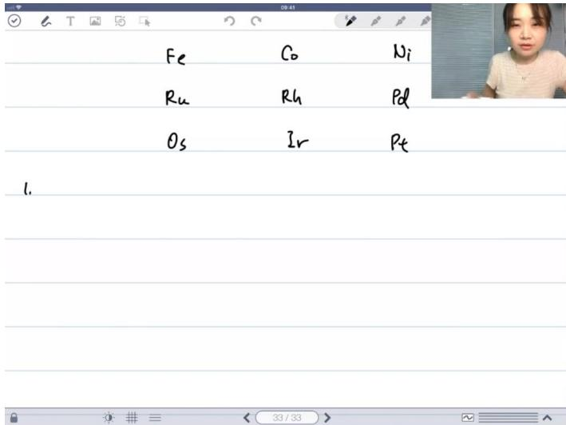

text_image

Fe	Co	Ni
Ru	Rh	Pd
Os	Ir	Pt
1.

- 族别特征：属于8B族，电子排布为 $d^{6-8}s^{2}$ ，包含铁(Fe)、钴(Co)、镍(Ni)、钌(Ru)、铑(Rh)、钯(Pd)、锇(Os)、铱(Ir)、铂(Pt)九种元素  
● 周期规律：由于镧系收缩效应，第五、六周期的6个元素（钌、铑、钯、锇、铱、铂）性质更为接近

# 2）铁系元素的性质比较 11:07

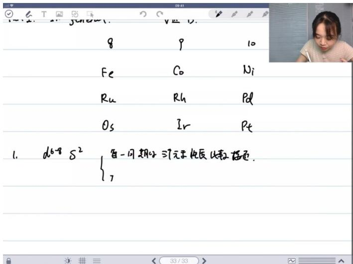

text_image

8
9
10
Fe
Co
Ni
Ru
Rh
Pd
Os
Ir
Pt
1. d6-8 S²
{每一周期分37元素性质比较越好.
7

- 分组相似性：实际观察中，钴(Co)与镍(Ni)性质更相似，铁(Fe)与同周期其他元素差异较大  
- 催化特性：钌(Ru)、铑(Rh)、钯(Pd)、锇(Os)、铱(Ir)、铂(Pt)中，钌、铑、钯的催化性能更为突出，实际应用案例更多  
● 教材争议：多本教材强调周期三元素性质接近，但实际教学观察发现该描述存在不准确性

# 3）铁系元素的氧化态与化合物 12:41

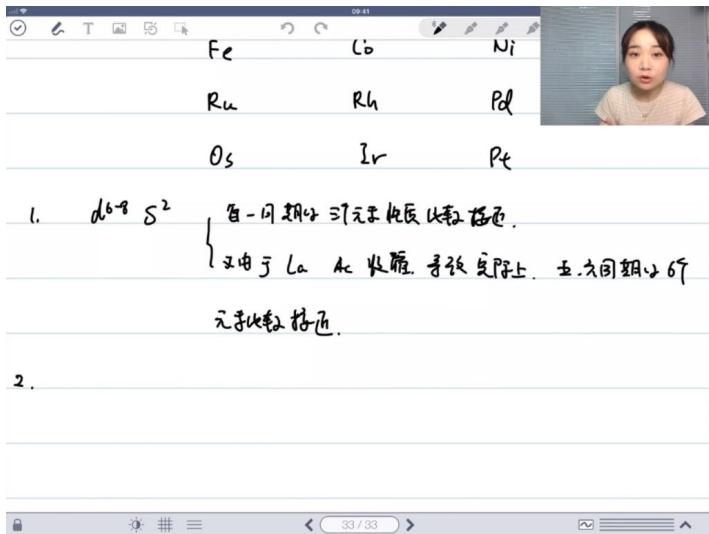

text_image

Fe	Ci0	Ni
Ru	Rh	Pd
Os	Ir	Pt
1.	d6-8 S2	每一周期比37元素性质比数范围.
	又由于LaAc收缩,导致气际上.五、六周期比6个
	元来此数接近.
2.

- 理论极限：前周期过渡金属可达高价态（如锰 $Mn^{7+}$ 、钒 $V^{5+}$ ），但铁系元素难以达到理论最高氧化态  
- 稳定特例：四氧化锇 $(OsO_{4})$ 是唯一较稳定存在的高氧化态化合物，用于有机反应中的双羟基化反应  
● 特殊案例：四氧化钌 $(RuO_{4})$ 虽存在但极不稳定，不能作为常规高价态化合物代表

4）铁系元素的活泼性与反应 15:25

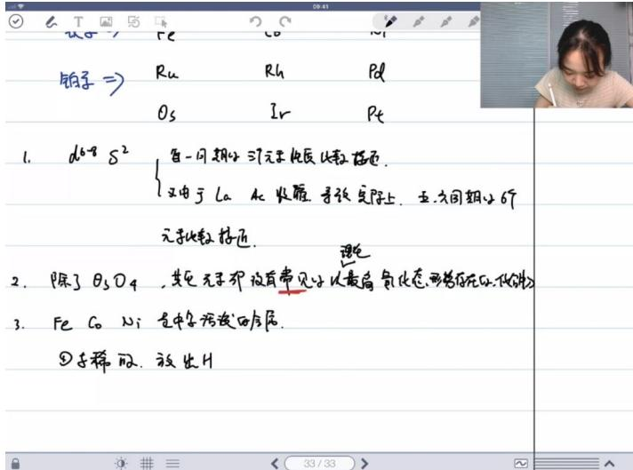

text_image

铂子 →
Ru Rh Pd
Os Ir Pt
1. d⁶⁰⁸ S²
{ 每一月期以 37 元来比质比数递减.
    义由于 La Ac 收缩，导致定际上。五、六周期以 6 个
    元来数接近。
2. 除了 θsO₄，其它无界却没有常见子以最高氧化态，形等存在以水为例
3. Fe Co Ni 是中等排放的金属.
① 李稀酸，放出 H

33/33   
● 活泼性排序：铁(Fe) > 钴(Co) ≈ 镍(Ni)，铁系比铂系金属活泼性强  
- 酸反应性:

○ 稀酸反应：能与稀酸反应放出氢气 $(H_{2})$

\- 浓酸钝化：会被浓硫酸 $\left(H_{2}SO_{4}\right)$ 和浓硝酸 $\left(HNO_{3}\right)$ 钝化，表面形成致密氧化膜

● 碱反应性：

- 铁可极缓慢与强碱反应，生成 $[Fe(OH)_{4}]^{-}$ 等配合物  
- 钴、镍不与氢氧化钠反应

● 标准电极电位： $\varphi_{Fe^{2+}/Fe}^{\circ}=-0.44V,\quad\varphi_{Co^{2+}/Co}^{\circ}=-0.28V,\quad\varphi_{Ni^{2+}/Ni}^{\circ}=-0.23V$

5）铂系元素的惰性与催化性质 18:40

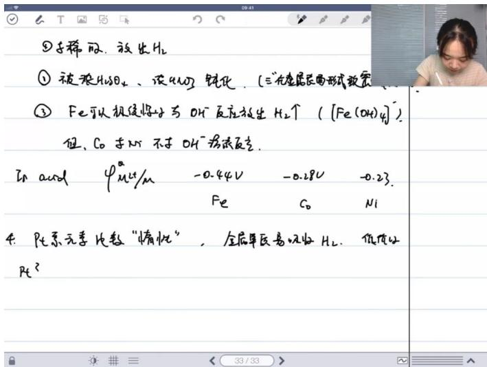

text_image

②水稀酸.放出H₂
①被银H₂SO₄、淡4NO₂锐化.(三"光基层反面形式致密)
③Fe可以机使溶于为OH⁻反应放出H₂↑( [Fe(OH)₄]⁻).
但,Co水不与OH⁻易燃反应.
In acid φMn/m -0.44V -0.28V -0.23.
Fe Co Ni
4.Pt系元素比数"情悦", 全层单质吸收H₂. 低质以
Pt³

- 化学惰性：铂系元素（钌、铑、钯、锇、铱、铂）金属性弱，需用王水溶解  
● 吸氢特性：单质易吸收氢气 $(H_{2})$ ，特别是低价态铂系元素  
- 催化应用：

- 钉(Ru)、铑(Rh)、钯(Pd)等具有丰富催化性质  
- 目前诺贝尔奖级催化剂多含铂系元素  
该领域仍属新兴交叉学科（无机/有机化学交界）

# 2. 铁系元素的低价化合物 21:29

# 1）铁系元素的低价化合物

\- 羰基化合物 21:52

text_image

Part II. Fe, Co, Nf.

1. 低氧化氢 (Oxidation State).

$Fe(10)_{5}$

基本结构：最简单的铁羰基化合物是 $Fe(CO)_{5}$ ，呈三角双锥形结构，铁原子满足18电子规则。  
○ 二聚体结构： $Fe(CO)_{5}$ 可失去一个CO形成 $[Fe_{2}(CO)_{9}]$ ，其中：

■ 电子计算：每个铁原子自带8个电子，需要10个电子达到18电子稳定结构  
■ 键型判断：必须存在Fe-Fe单键（1个）和桥连CO配体（3个）才能满足18电子规则  
■ 对称性：具有 $D_{3h}$ 对称性，含C3旋转轴和垂直对称面

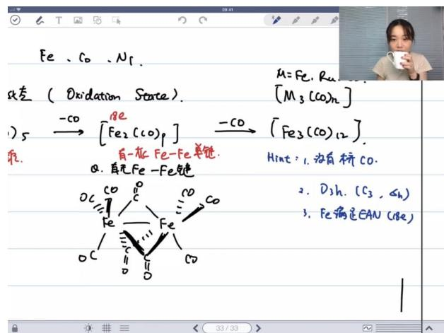

text_image

Fe、Co、Ni.
铁差 ( Oxidation State ).          M=Fe, Ru
          [M₃(CO)ₙ]
1)₅ → [Fe₂(C(O)ₚ)] → [Fe₃(CO)₁₂]
取.      有一花 Fe-Fe 羊链.
         Q. 有无 Fe-Fe 键
          Hint: 1. 为有桥 CO.
           2. D₃h. (C₃, Δh)
           3. Fe滴足EAN (Be)

○ 三聚体形成：进一步失去CO可形成 $[Fe_{3}(CO)_{12}]$ 三核结构

■ 电子分布：每个铁原子周围有4个CO配体（提供8e $^{-}$ ），铁自身8e $^{-}$ ，还需形成2个Fe-Fe键  
■ 空间构型：呈非垂直角度的一上一下键接方式，平面内配位完成18电子构型

# 二茂铁

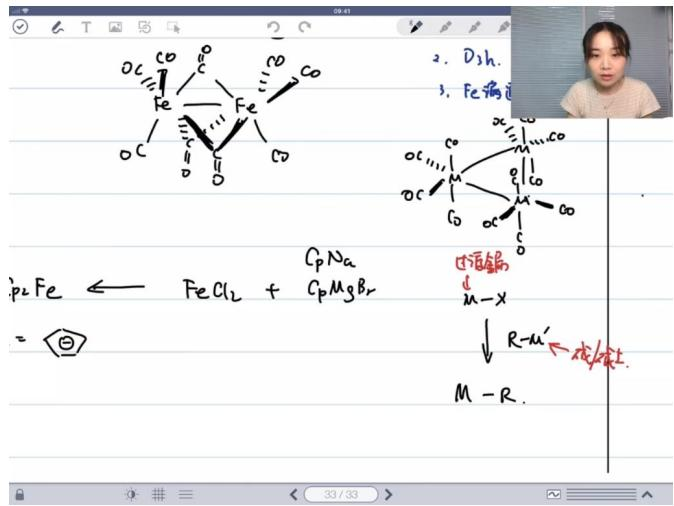

chemical

Chemical reaction diagram showing iron complex formation with phosphate and magnesium bromide, followed by hydrogenation and reduction steps

# ○ 制备方法：

■ 经典方法： $FeCl_{2}$ 与环戊二烯基格氏试剂（CpMgBr）或 CpNa 反应  
■ 反应本质：过渡金属卤化物与主族金属有机试剂的配体交换反应

# ○ 电子构型：

■ 铁为+2价（d6构型）  
■ 每个 $Cp^{-}$ 提供6个电子，总电子数= $6+6\times2=18e^{-}$   
■ 注意：与羰基化合物不同，此处铁为+2价而非0价

text_image

Screenshot of a graphic editing software interface showing toolbars, a person's photo with color palette, and Chinese UI elements.

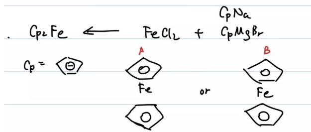

chemical

Chemical reaction diagram showing Cp2Fe reacting with FeCl2 and CpMgBr to form Fe or FeNα structures

text_image

Q: in Cp2Fe, Fe is 16e or 18e?

# ○ 结构争议：

■ 两种可能构型：交错式 $(D_{5d})$ 和重叠式 $(D_{5h})$   
■ 稳定性分析：

● 传统认为交错式更稳定（类比乙烷构象）  
● 实际不存在显著位阻效应（Cp环间距大）  
● 最终确认两种构型能量接近，不同条件下可分别存在

\- 物理性质：橙黄色固体

\- 钉和锇的羰基化合物 39:38

○ 特殊现象：钌(Ru)和锇(Os)不形成单核或双核羰基化合物

■ 最简单羰基化合物直接为三核结构 $[M_3(CO)_{12}]$   
■ 这是VIII族元素的常见特征性羰基化合物

2）二价铁、钴、镍的化合物颜色 40:15

● 镍化合物的稳定形态与电子结构 40:19

○ 电子构型：镍 $(d^{9})$ 的稳定形态不以单体形式存在，其中性化合物为 $Co_{4}$ 结构  
○ 电子倾向：镍倾向于再获得一个电子达到稳定构型

● 镍羰基化合物的结构特点 40:43

text_image

② C02(CO)1
Current
Previous
Default
4
33 / 34

○ 中性化合物： $Co_{2}(CO)_{8}$ 是镍的典型羰基化合物  
○ 结构特征：含有一根金属-金属键（骨单键）

● 镍化合物的18电子规则与桥羰基 42:37

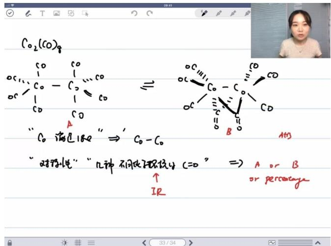

text_image

CO₂(CO)₉
C₀ - C₀ = CO
C₀
“C₀ 滴足180” ⇒ C₀ - C₀
“对称性”“几种不同化学系统中 C=O”
IR ⇒ A or B
or percentage

○ 结构平衡：存在两种结构的平衡态（有/无桥羰基）  
参考书籍：北大版《中级无机化学》对配位化合物讲解透彻  
○ 结构推断：
■ 通过18电子规则可推断存在金属-金属键

■ 桥羰基的存在需结合对称性和不同化学环境的羰基信息判断

# ○ 测试方法：

■ 红外光谱适合检测羰基（1700cm $^{-1}$ 附近）  
■ 核磁共振仅适用于逆磁性物质

● 例题1: 通过红外光谱推断镍化合物结构 44:20

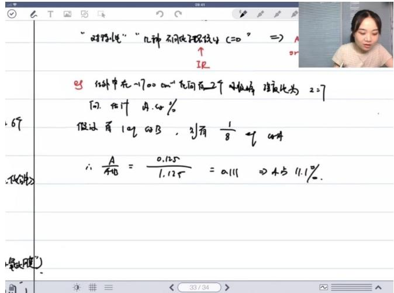

text_image

“对称性”“几种不同比子比较小(=0)”=>A
↑           =#
IR

95.6个中在-1700cm²内向后2个物体，按变比为2:7
问：估计 A:40%
假设有 102 AB ，则有 1/8 < A×A
∴ A/AB = (0.125)/1.125 = 0.111 ⇒ A占11.1%。
（代例）
最大值）

# ○ 题目解析

■ 数据解读：红外光谱在 $1700\mathrm{cm}^{-1}$ 出现两个峰，强度比2:7  
计算过程:

● 假设b当量的B结构（含2个桥羰基）  
- 剩余1/8当量对应A结构

$$
0. 1 2 5
$$

● A占比计算： $\overline{1.125}=0.111\quad(11.1\%)$

■ 考点：通过红外峰强比推算结构比例

● 镍羰基化合物的金属金属键与电子数 48:56

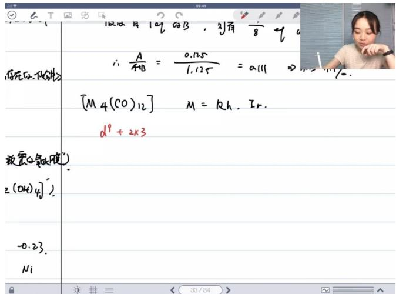

text_image

假设月 10g 的 B，引用 8 g C
存在Cu2代铅锌2
∴ A/48 = 0.125/1.125 = a111 ⇒ 4 = 1.1%
[M 4(CO)12] M = Kh, Ir.
d⁹ + 2×3
致氧氢脱膜
2(OH)₄]
-0.23.
Ni

○ 形成规律：原子半径越大越易形成原子簇  
○ 电子计算：

■ $d^{9}$ 构型+6个电子（3个羰基×2电子）=15电子

■ $d^{9}$ 构型+6个电子（3个羰基×2电子）=15电子

■ 需形成3个金属键达到18电子规则

○ 结构推断：四核结构 $[M_{4}(CO)_{12}]$ 中每个金属形成3个M-M键

● 镍化合物满足18电子规则的普遍性 50:50

- 普遍性：绝大多数羰基化合物满足18电子规则  
◦ 例外情况：第四周期元素可能因位阻效应不满足  
- 补偿机制：通过聚合形成金属键来满足电子规则

# 3）镍的低价化合物 51:17

# ● 镍的基本介绍与性质 51:19

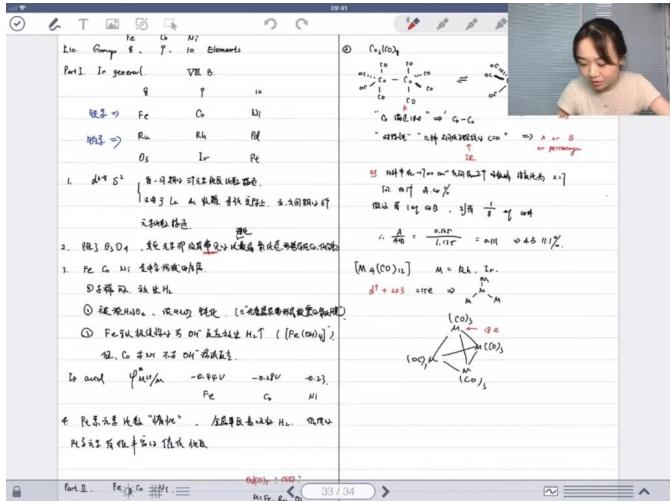

text_image

Li: Gump 8. Y: 10 Elements
Part I In gencel VIII 6.
g Y 10
银离子 Fe Co Ni
银离子 → Ru Rh Fe
Os Ir Fe
L dS² { 银离子FeO₂的反应描述.
{ 银离子LaFe酸钠铁化反应上,去作用防止
无相色指示. 现化
2. 除了O₃O₄,氧化金矿的稀有足之式金属铁化反应的SO₄的
1. Fe (C) 1): 水分子形成的元素
D溶解法发生比
① 连接点的O₂、FeO₂的键定 (无氧原子表面质量分数相同)
② Fe(碳化物)分为OH和NaOH共在H₂↑ ([Fe(OH)₃])⁻¹
Fe₂ + Na₂ + Na⁺ + H₂O₃⁻
Fe₃ + Na₂ + Na⁺ + H₂O₃⁻
Fe₃ + Na₂ + Na⁺ + H₂O₃⁻
Fe₃ + Na₂ + Na⁺ + H₂O₃⁻
Fe₃ + Na₂ + Na⁺ + H₂O₃⁻
Fe₃ + Na₂ + Na⁺ + H₂O₃⁻
Fe₃ + Na₂ + Na⁺ + H₂O₃⁻
③ Fe(CO)₃ = Fe(CO)₃
Fe(CO)₃ = Fe(CO)₃
Fe(CO)₃ = Fe(CO)₃
Fe(CO)₃ = Fe(CO)₃
Fe(CO)₃ = Fe(CO)₃
Fe(CO)₃ = Fe(CO)₃
Fe(CO)₃ = Fe(CO)₃
Fe(CO)₃ = Fe(CO)₃
Fe(Co)₃ = Fe(CO)₃
Fe(CO)₃ = Fe(CO)₃
Fe(CO)₃ = Fe(CO)₃
Fe(CO)₃ = Fe(CO)₃
Fe(CO)₃ = Fe(CO)₃
Fe(CO)₃ = Fe(CO)₃
Fe(CO)₃ = Fe(CO)₃
Fe(CO)₁ = Fe(CO)₁
Fe(CO)₁ = Fe(CO)₁
Fe(CO)₁ = Fe(CO)₁
Fe(CO)₁ = Fe(CO)₁
Fe(CO)₁ = Fe(CO)₁
Fe(CO)₁ = Fe(CO)₁
Fe(CO)₁ = Fe(CO)₁
Fe(CO)₁ = Fe(CO)₁
Fe(CO)₁ = Fe(CO)₁
Fe(CCO)₃ = Fe(CCO)₃
Fe(CCO)₃ = Fe(CCO)₃
Fe(CCO)₃ = Fe(CCO)₃
Fe(CCO)₃ = Fe(CCO)₃
Fe(CCO)₃ = Fe(CCO)₃
Fe(CCO)₃ = Fe(CCO)₃
Fe(CCO)₃ = Fe(CCO)₃
Fe(CCO)₃ = Fe(CCO)₃
Cu and Fe₂ (N=H), -0.43V -0.19V +0.2,
Fe, Co, Ni
Pc系元素代数“磷化”, 全量原子表示如H₂, 用作以
Pc系元素代数“磷化”, 全量原子表示如H₂, 用作以
Pc系元素代数“磷化”, 全量原子表示如H₂, 用作以

○ 电子构型：镍 $(d^{10})$ 形成稳定的四羰基化合物 $Ni(CO)_{4}$   
○ 点群对称：具有 $T_{d}$ 点群对称性（正四面体结构）

● 镍的低价化合物的稳定性 51:44

- 铂族特性：铂(Pt)和钯(Pd)的羰基化合物在普通条件下不常见  
- 研究挑战：无机化合物存在许多理论难以预测的例外情况

● 无机化合物的存在与合成 52:40

- 理论局限：无机反应机理研究仍处于初级阶段  
◦ 动力学稳定：某些理论上不稳定的化合物可能因动力学原因实际稳定存在

● 理论与实际稳定性的差异 53:09

- 研究现状：新型无机化合物不断被合成，常突破传统认知  
影响因素：反应条件温和度、动力学稳定性等都会影响实际存在性

● 例题1:预测钠与五羰基铁的反应产物 54:05

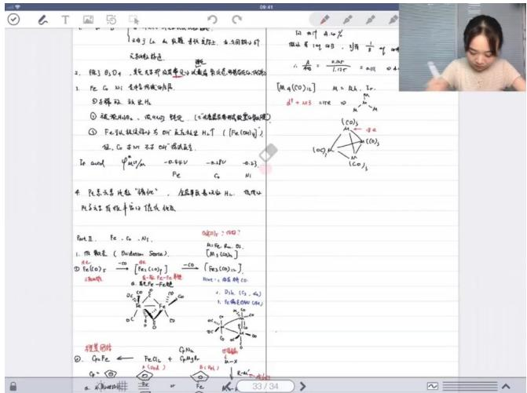

text_image

2. 镀子O₁, O₂, 氧化氢钾和氢氧化钡反应生成的氢气相色谱
3. Fe(C)₄: 含氧水溶液的结晶
①溶解, 氧化氢
②凝固气体： 氧化H₂ 钝定（“滴度量常测试数据和测量”
③ Fe₂⁺: 氧化盐酸钠与 H₂↑（[Fe(OH)₃]⁻）
Fe₂ + Fe₂ → FeCl₂ (Cu)
Fe + Fe₂ → FeCl₂ (Cu)
Fe + Fe₂ → FeCl₂ (Cu)
Fe + Fe₂ → FeCl₂ (Cu)
Fe + Fe₂ → FeCl₂ (Cu)
Fe + Fe₂ → FeCl₂ (Cu)
Fe + Fe₂ → FeCl₂ (Cu)
Fe + Fe₂ → FeCl₂ (Cu)
Fe + Fe₂ → FeCl₂ (Cu)
Fe + Fe₂ → FeCl₂ (Cu)
Fe²⁺ ⇌ FeCl₂ (Cu)
Fe²⁺ ⇌ FeCl₂ (Cu)
Fe²⁺ ⇌ FeCl₂ (Cu)
Fe²⁺ ⇌ FeCl₂ (Cu)
Fe²⁺ ⇌ FeCl₂ (Cu)
Fe²⁺ ⇌ FeCl₂ (Cu)
Fe²⁺ ⇌ FeCl₂ (Cu)
Fe²⁺ ⇌ FeCl₂ (Cu)
Fe²⁺ ⇌ FeCl₂ (Cu)
Fe²⁺ ⇌ 100%
Fe²⁺ ⇌ 100%
Fe²⁺ ⇌ 100%
Fe²⁺ ⇌ 100%
Fe²⁺ ⇌ 100%
Fe²⁺ ⇌ 100%
Fe²⁺ ⇌ 100%
Fe²⁺ ⇌ 100%
Fe²⁺ ⇌ 100%
Fe²⁺ ⇌ 100%
Fe²⁺ ⇌ 100%

○
○ 题目解析

■ 反应过程：钠与 $Fe(CO)_{5}$ 在液氨中反应生成 $Na^{+}$ 和阴离子A

■ 结构推断：

■ 反应过程：钠与 $Fe(CO)_{5}$ 在液氨中反应生成 $Na^{+}$ 和阴离子A
■ 结构推断：

- 铁获得2个电子从 $d^{8}$ 变为 $d^{10}$   
- 四个羰基占据sp³轨道  
- 形成 $T_{d}$ 点群的正四面体结构

■ 答案：产物为四羰基铁阴离子 $[Fe(CO)_{4}]^{2-}$

# 4）应用案例

● 例题:三氯化铁与钠的反应 56:03

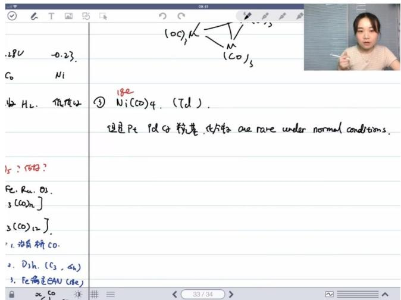

text_image

.28V -0.23.
Co Ni
Cu H₂ 低浓度
15: 高分子?
Fe, Ru, Os,
3 (CO)ₙ]
3 (CO)₁₂
1. 有异构 CO.
2. D₂h, (C₃, Δh)
3. Fe 满足BAN (BE)
(OC), K
M
(CO)₃
③ Ni(CO)₄, (Td).
但是 Pt Pd O 粒基，比小数 are rare under normal conditions.

○ 18电子规则应用：生成的化合物b分子中只含有一个金属原子且满足EAN规则  
- 分子式推测：可能是 $HCo(CO)_4$ ，但不一定是CRV  
○ 结构分析：若将氢看作氢负离子，金属为正一价d8构型，可能形成DSP3四方锥结构（ $C_{4v}$ 对称性）

● 例题:基的化合物反应 58:51

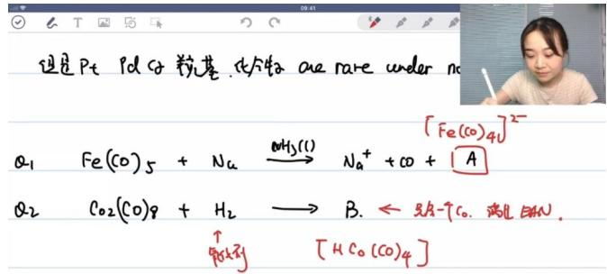

text_image

但是Pt PdO 粒基.化合物 are rare under no
[Fe(CO)4]2-
Q1 Fe(CO)5 + Na → NH3(1) Na+ + CO + A
Q2 CO2(CO)8 + H2 → B. ← 无A→C0. 满足B/N.
↑ [HCO(CO)4]

反应机理：羰基化合物被氢气氧化，氢作为氢负离子参与反应  
○ 价态变化：金属从零价变为正一价（d8构型）  
○ 结构转变：氧化后可能形成DSP3杂化的四方锥结构  
- 对称性确认：最终确定为 $C_{4v}$ 点群而非 $C_{2v}$

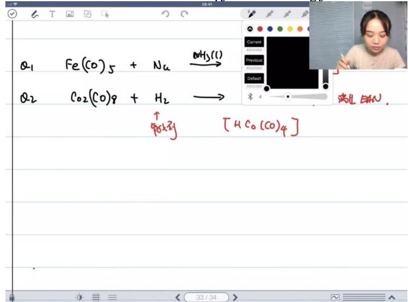

text_image

Q₁ Fe(CO)₅ + Na → NH₃(1)
Q₂ CO₂(CO)₈ + H₂ → [HCO(CO)₄]

○ 结构预测难点：五配位化合物在三角双锥和四方锥构型间转变能垒较低，难以确定确切结构

# ● 例题:三氯化铁与氨气的反应 01:03:27

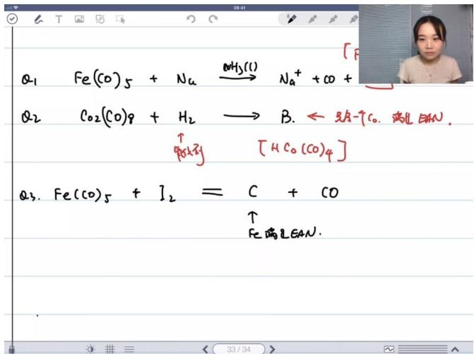

chemical

Chemical reaction equations involving iron and sodium hydroxide, forming carbon nanotubes and leucine groups

反应特征：放出CO分子显著降低题目难度

氧化过程：碘作为氧化剂将零价铁氧化为正二价

○ 电子计数：正二价铁（d6构型）配合两个碘和四个羰基满足18电子规则

○ 立体异构：存在顺反异构问题，顺式构型为 $C_{2v}$ 点群

■ 对称元素：含一个 $C_{2}$ 旋转轴和两个对称面（平行和垂直于纸面）

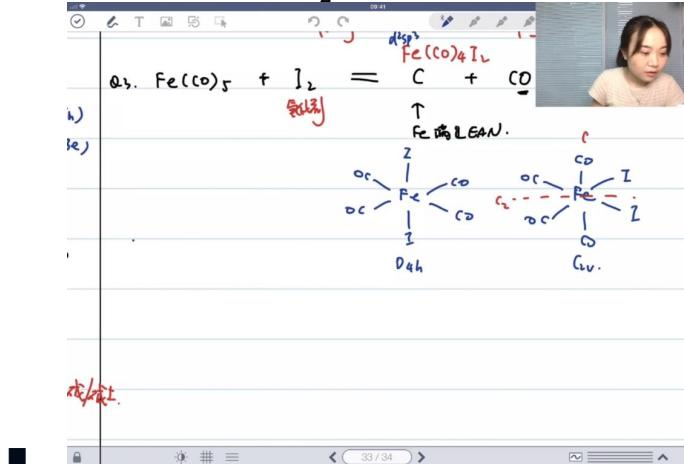

chemical

Chemical reaction equation showing Fe(CO)5 + I2 → Fe(CO)4I2 forming a cyclic structure with CO, I, and D groups

\- 杂化方式： $d^{2}sp^{3}$ 杂化形成八面体构型

场强影响：羰基配体产生强场导致低自旋排布

# 5）过渡金属化合物性质

# - 铁系元素氢氧化物

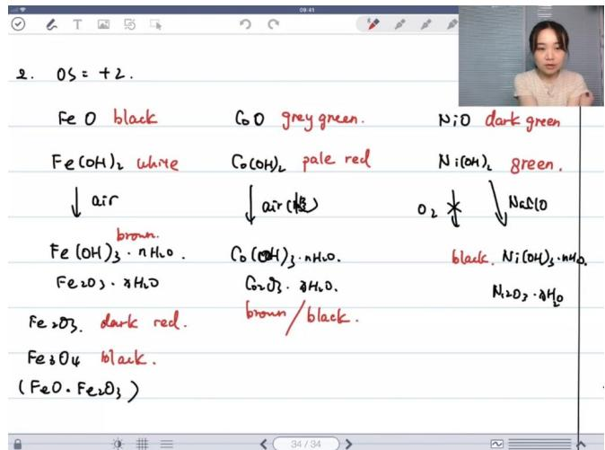

text_image

2. OS = +2.
Fe O black
Co grey green.
NiO dark green
Fe(OH)2 white
Co(OH)2 pale red
Ni(OH)2 green.
↓ air
↓ air (g)
O2 * ↓ NaClO
brown.
Fe(OH)3·nH2O.
Co(OH)3·nH2O.
black, Ni(OH)3·nH2O.
Fe2O3·xH2O
Co2O3·xH2O.
Ni2O3·xH2O
Fe2O3. dark red.
brown / black.
Fe3O4 black.
(FeO·Fe2O3)

O

○ 铁化合物：

■ 氧化亚铁（黑色）  
■ 氢氧化亚铁（白色）→空气中迅速氧化为氢氧化铁水合物（褐色/深红色）  
■ 氧化铁（红色/砖红色）  
四氧化三铁（黑色，含 $FeO\cdot Fe_{2}O_{3}$ ）

# ○ 钴化合物：

■ 氧化钴（灰绿色）  
■ 氢氧化钴（粉红色/浅红色/玫瑰色）  
■ 三价钴（棕色/黑色）

# ○ 镍化合物：

■ 氧化镍（深绿色）  
■ 氢氧化镍（绿色）  
■ 三价镍（颜色变深）

# - 氧化还原特性

○ 还原性顺序：Fe > Co > Ni

■ 二价铁还原性最强，易被空气氧化  
■ 钴在配合物中倾向形成正三价（d6构型）  
■ 镍主要形成正二价（d8构型）配合物

# 高价态存在：

镍和钴存在四价态  
■ 铁存在六价态（较罕见）

# 3. 二价铁、钴、镍的化合物颜色 01:09:22

# 1）镍离子颜色 01:10:23

- 水合离子颜色：二价镍的水合离子 $[Ni(H_2O)_6]^{2+}$ 呈现泛绿色（greenish），这是最常见的镍水合离子颜色特征。  
- 颜色记忆技巧：铁系元素中，二价铁水合离子为浅绿色，二价钴为粉红色，二价镍为泛绿色，可通过"铁绿钴粉镍泛绿"口诀记忆。

# 2）镍配合物颜色 01:11:01

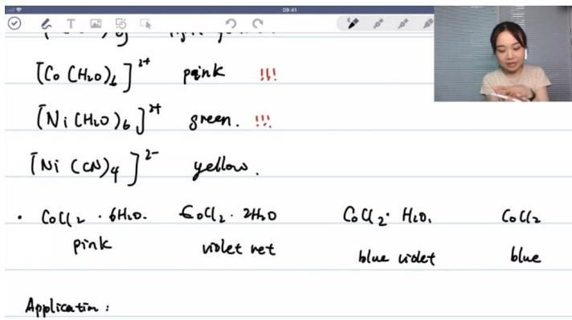

text_image

[Co (H2O)6]2+ pink !!!
[Ni (H2O)6]2+ green. !!!
[Ni (CN)4]2- yellow.
• CoCl2·6H2O. 50Cl2·2H2O  CoCl2·H2O.  CoCl2
pink violet net blue violet blue
Application:

- 平面四边形配合物：镍(II)易形成四配位平面四边形结构，如 $[Ni(CN)_4]^{2-}$ 呈黄色（yellow），这是d8电子构型的特征配位方式。  
● 配体影响：硫氰根配合物 $[Ni(SCN)_{4}]^{2-}$ 需要在有机溶剂（如丙酮）中稳定存在，在水中易分解。

# 3）镍的沉淀颜色 01:22:02

# - 氢氧化物沉淀

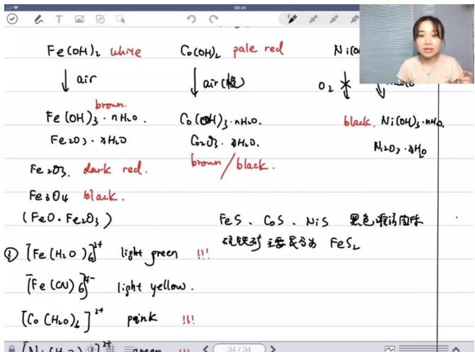

text_image

Fe(OH)2white
↓air
brown.
Fe(OH)3·nH2O
Fe2O3·xH2O
Fe2O3, dark red.
Fe3O4 black.
(FeO·Fe2O3)
① [Fe(H2O)6]2+ light green !!!
[Fe(CN)6]2- light yellow.
[Co(H2O)4]2+ pink !!!
Co(OH)2 pale red
↓air(橙)
Co(OH)3·nH2O.
Co2O3·xH2O.
brown/black.
Ni(OH)3·mH2O
black. Ni(OH)3·mH2O.
N2O3·AH0
硅铁矿主要袋分为 FeS2

○ 初始沉淀：向镍(Ⅱ)溶液加碱生成Ni(OH) $_{2}$ ，呈浅绿色（pale green）。  
○ 氧化过程：暴露空气中会逐渐被氧化为 $Ni(OH)_{3}\cdot nH_{2}O$ ，颜色变为褐色。

# ● 特征沉淀反应

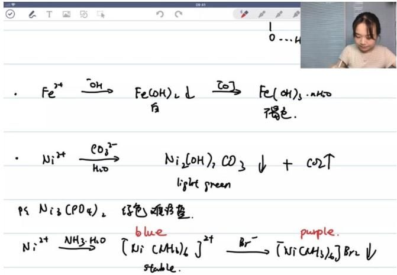

text_image

Fe²⁺ → Fe(OH)₂, d → Fe(OH)₃·NH₅O
有色.
Ni²⁺ → Ni₂(OH)₃, CO₃ ↓ + CO₂↑
light green
Ni₃(PO₄)₂ 绿色难得蓝.
Ni²⁺ → [Ni(CH₃)₆]²⁺ → [Ni(CH₃)₄]Br₂ ↓
blue purple.
stable.

碳酸盐沉淀：镍(Ⅱ)与碳酸钠反应生成 $Ni_{2}(OH)_{2}CO_{3}$ ，呈浅绿色沉淀并放出 $CO_{2}$ 。  
○ 磷酸盐沉淀： $Ni_{3}(PO_{4})_{2}$ 为绿色难溶盐，可作为镍的特征沉淀。  
○ 氨配合物：在氨水中形成稳定的蓝色 $[Ni(NH_3)_6]^{2+}$ ，与溴离子反应生成紫色沉淀 $[Ni(C_4H_8N_2O_2)_2]$ 。

# - 丁二酮肟反应

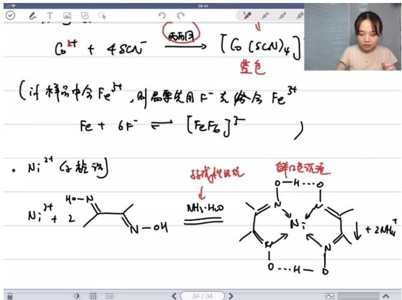

chemical

Chemical reaction equation involving nickel complex formation and fluorination, with photochemical analysis of Ni reacting with Fe²⁺

反应条件：需在弱碱性环境（氨水）中进行，生成鲜红色沉淀。

○ 结构特征：沉淀为平面四边形结构，镍(Ⅱ)与两个丁二酮肟分子配位，化学式为 $Ni(C_{4}H_{7}N_{2}O_{2})_{2}$ 。  
应用价值：该反应是检测镍离子的特征反应，灵敏度高且颜色鲜明。

# 4）镍的氧化态与颜色关系 01:27:38

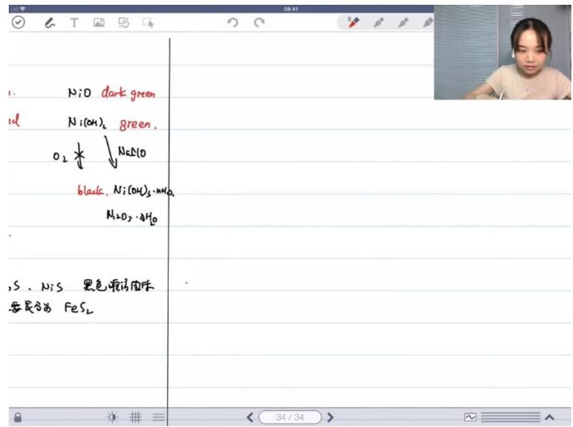

text_image

N2O dark green
Ni(OH)2 green.
O2* NcClO
black. Ni(OH)2·NH4
N2O2·NH4

S、NiS 黑色溶液固体
聚氯化为 FeS2

# - 二价镍化合物:

○ $Ni(OH)_{2}$ : 绿色  
○ $NiCO_{3}$ : 黑色  
○ $Ni_{2}O_{3}\cdot xH_{2}O$ : 黑色  
○ NiS: 黑色沉淀，类似 $FeS_{2}$

# 5）三价及高价铁钴镍的性质

# - 氧化性比较

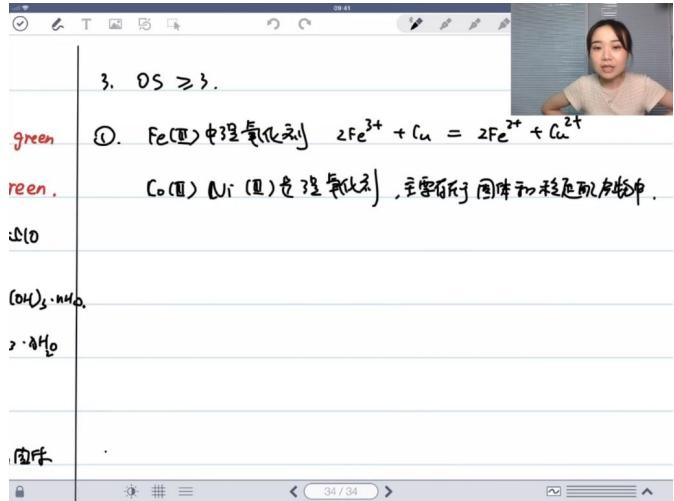

text_image

3. OS ≥ 3.
green
①. Fe(Ⅲ)中湿氧化剂 2Fe³⁺ + Cu = 2Fe²⁺ + Cu²⁺
reen.
Co(Ⅲ) Ni(Ⅱ)氢氧化剂，主要有由于固体和移延反应物。
卤①
(OH)₃·NH₂O
2·AH₂O
固体
34/34

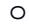

# ○ 氧化性强度:

■ 三价铁( $Fe^{3+}$ ): 中强氧化剂  
■ 三价钴 $(Co^{3+})$ 和四价镍 $(Ni^{4+})$ ：强氧化剂

# ○ 存在形式:

■ 主要存在于固体和稳定配合物中（配位平衡和沉淀溶解平衡）

# - 重要反应

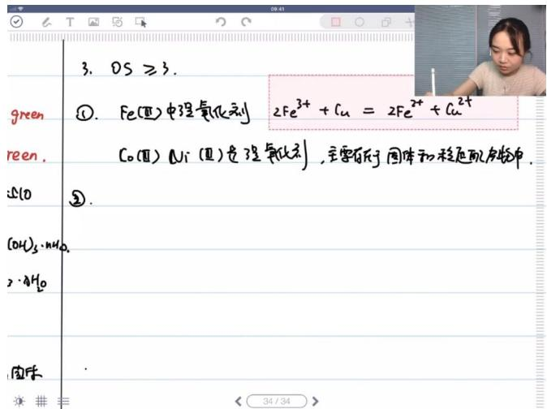

text_image

3. OS ≥ 3.
green
①. Fe(Ⅲ)中理氧化剂 2Fe³⁺ + Cu = 2Fe²⁺ + Cu²⁺
reen.
Co(Ⅲ) Ni(Ⅲ) 化理氧化剂，主要有利于固体和移延配比物。
出10
②.
(OH)₃·NH₄O
2·Al₂O
固体
34/34

# 三价铁刻蚀铜板：

■ 反应式： $2Fe^{3+} + Cu = 2Fe^{2+} + Cu^{2+}$   
■ 记忆点：该反应表明二价铁不足以还原二价铜，帮助记忆氧化还原电势关系

# - 三价铁的性质

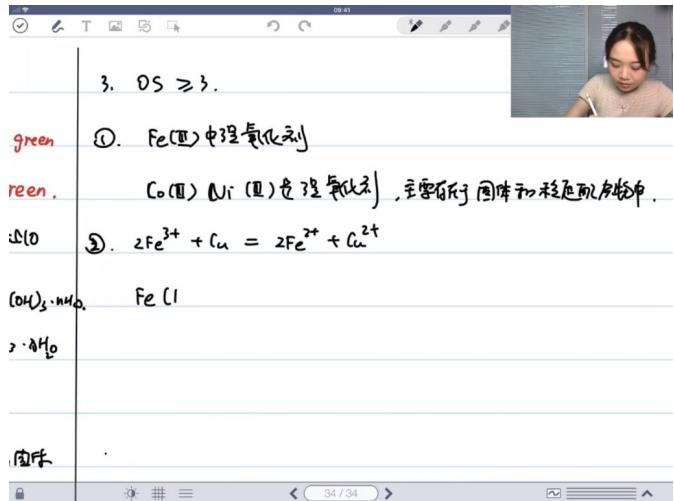

text_image

3. OS ≥ 3.
green
①. Fe(Ⅲ)中湿氧化剂
reen.
Co(Ⅲ) Ni(Ⅲ) 氧化剂，主要有低于固体和稳压配比分布.
②. 2Fe³⁺ + Cu = 2Fe²⁺ + Cu²⁺
(OH)₃·NH₄
FeCl
2·H₂O
固体
34/34

# 存在条件:

■ 仅在强酸性条件下稳定存在(pH>2.3时开始水解)

# ○ 颜色特性:

■ 强酸性溶液中：淡紫色(高自旋d5电子构型，dd跃迁弱)  
■ 含氯离子时：黄色(配位数可变)   
■ 联想记忆：与二价锰 $(Mn^{2+})$ 类似，都是几乎无色的浅色

# - 三价铁的显色反应

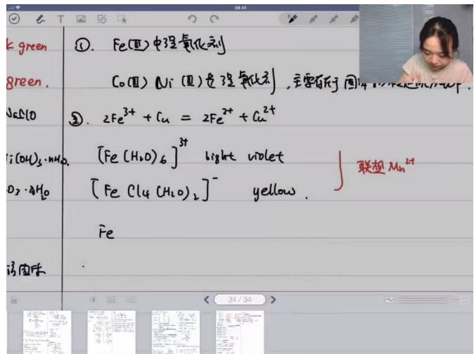

text_image

k green
green.
N2O10
Ni(OH)3·NH4O
O2·NH2O
卤肉味
①. Fe(Ⅲ)中湿氧化剂
Co(Ⅲ) Ni(Ⅲ)是湿氧化剂，主要有利于固体的光催化物。
②. 2Fe3+ + Cu = 2Fe2+ + Cu2+
[Fe(H2O)6]3+ light violet
[FeCl4(H2O)2]-
yellow.
Fe
34/34>

# - 硫氰酸根显色:

■ 反应式： $[Fe(H_{2}O)_{6}]^{3+} + SCN^{-} \rightarrow [Fe(SCS)(H_{2}O)_{5}]^{2+} + H_{2}O$   
■ 现象：加入硫氰化钾立即呈现深血红色  
■ 注意：实际反应是水合铁离子的配体交换过程

# - 铁的配合物

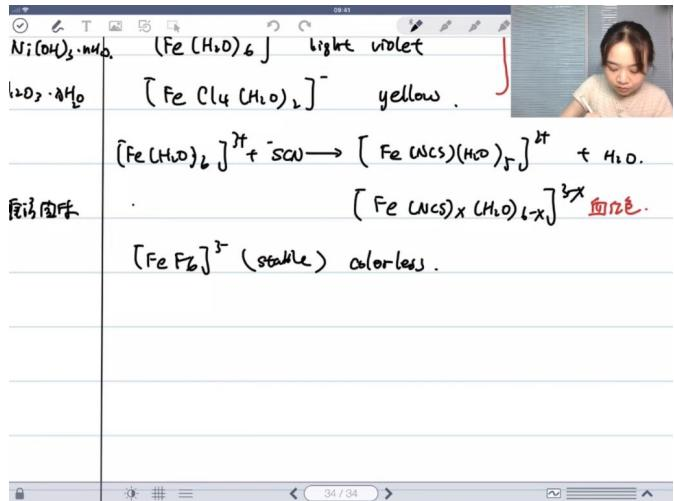

text_image

Ni(OH)₃·NH₂
[Fe(H₂O)₆]⁻ light violet
[FeCl₄(H₂O)₂]⁻ yellow.
[Fe(H₂O)₆]²⁺ + SCN → [Fe(NCS)(H₂O)₅]²⁺ + H₂O.
[Fe(NCS)ₓ(H₂O)₆-x]³⁺ 面红色.
[FeFe]³⁻ (stable) colorless.

# ○ 常见配合物:

$[FeF_{6}]^{3-}$ ：无色(氟离子作为掩蔽剂)  
$[Fe(C_{2}O_{4})_{3}]^{3-}$ ：淡橙黄色  
■ $[Fe(CN)_{6}]^{3-}$ ：淡橙色

# ○ 稳定性:

■ 三价铁易水解，不存在稳定的六氨合三价铁配合物

# 6）钴的氧化还原性质

# ● 钴的配合物反应

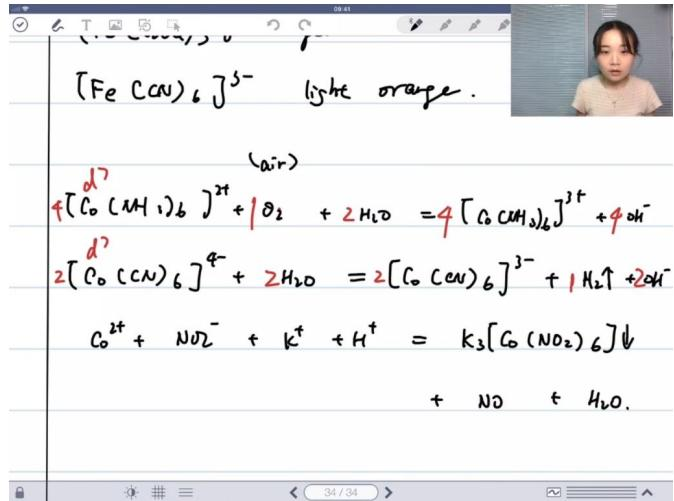

text_image

[Fe (CN)6]3- light orange.
(d)
+ [C0(NH2)6]2+ + 1O2 + 2H2O = 4 [C0(CNH3)6]3+ + 4OH-
[ d ]
2 [ C0 (CN)6 ]4- + 2H2O = 2 [ C0 (CN)6 ]3- + 1H2↑ + 2OH-
C02+ NO2- + K+ + H+ = K3 [ C0 (NO2)6 ]↓
+ NO + H2O.

# ○ ○ 六氨合钴(II):

■ 反应式： $4[Co(NH_{3})_{6}]^{2+} + O_{2} + 2H_{2}O = 4[Co(NH_{3})_{6}]^{3+} + 4OH^{-}$   
■ 配平技巧：1分子O2得4电子，所以系数为4

# ○ 六氰合钴(II):

■ 反应式： $2[Co(CN)_{6}]^{4-} + 2H_{2}O = 2[Co(CN)_{6}]^{3-} + H_{2}\uparrow + 2OH^{-}$   
■ 热力学解释：配体场强增加使还原电势变负(还原性增强)

# ● 钴的沉淀反应

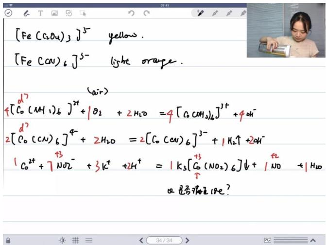

text_image

[Fe (C2O4)3]5- yellow.
[Fe (CN)6]5- light orange.
(d)
d²
[C0 (NH4)6]2+1O2 + 2H2O = 4[C0(CNH4)6]3+4OH-
d²
[C0 (CN)6]4- + 2H2O = 2[C0(CN)6]3- + 1H2↑ + 2OH-
[C02+7NO2- + 3K+ + 2H+ = 1K3[C0(NO2)6]↓ + 1NO + |H2O
② 是否满足 IRe?

# 亚硝酸钴钾沉淀:

■ 反应式： $Co^{2+} + 7NO_{2}^{-} + 3K^{+} + 2H^{+} = K_{3}[Co(NO_{2})_{6}] \downarrow + NO + H_{2}O$   
■ 配平方法：Co升1价，N降1价，系数1:1，再平衡电荷和原子  
■ 18电子规则： $[Co(NO_{2})_{6}]^{3-}$ 满足18电子规则(NO\_2^-提供2电子)

# 7）高价氧化物与高铁酸盐

# - 高价氧化物存在性

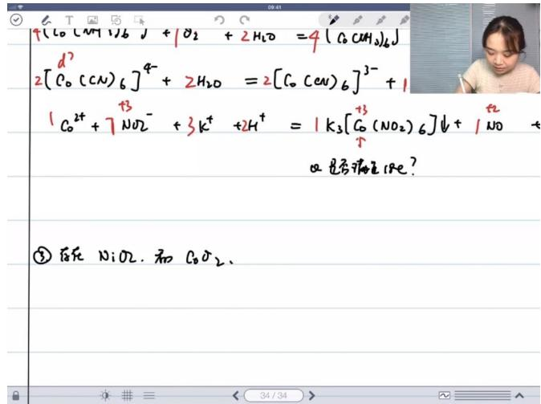

text_image

4(C0(NH3)6)2 + 1O2 + 2H2O = 4(C0CuH2)6
2[(C0(CN)6]4- + 2H2O = 2[C0(CN)6]3- + 1
1C02+ + 7NO2- + 3K+ + 2H+ = 1K3[C0(NO2)6]↓ + 1NO+
② 是否满足 Ipe?
③存在 NiO2，和 C0O2。

# ○ 存在形式:

镍：存在 $NiO_{2}$   
钴：存在 $CoO_{2}$   
■ 铁：主要以高铁酸根 $(FeO_{4}^{2-})$ 形式存在

# ● 高铁酸盐性质

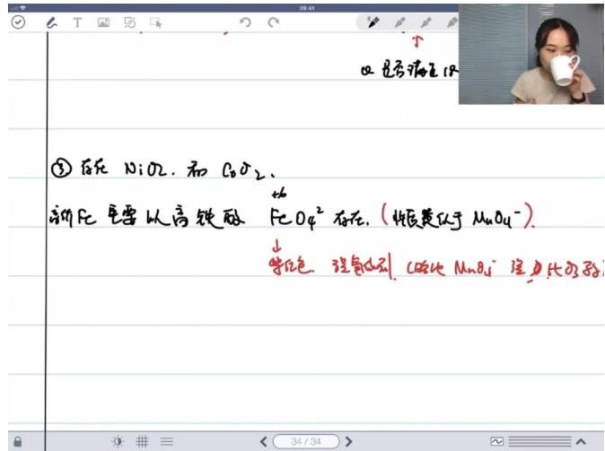

text_image

③存在 NiO₂，而 C₆O₄₂。
新化需要以高纯度 FeO₄²⁻ 存在，（饱和质位于 MnO₄⁻）。
等红色 程解剂：C6H4MnO₄⁺ 填身化步骤

# - 性质:

颜色：紫红色(类似高锰酸钾)  
■ 氧化性：比高锰酸根强，比臭氧弱

# ○ 制备方法:

■ 碱性条件： $2Fe(OH)_{3} + 3ClO^{-} + 4OH^{-} = 2FeO_{4}^{2-} + 3Cl^{-} + 5H_{2}O$   
固相反应： $Fe_{2}O_{3} + 3KNO_{3} + 4KOH = 2K_{2}FeO_{4} + 3KNO_{2} + 2H_{2}O$

# - 酸性条件分解:

■ 反应式: $4FeO_{4}^{2-} + 20H^{+} = 4Fe^{3+} + 3O_{2}\uparrow + 10H_{2}O$   
■ 配平技巧：1个 $FeO_{4}^{2-}$ 得3电子，4个共得12电子，对应3个 $O_{2}$

# 二、铂系元素 01:56:50

# 1. 铂系元素概述 01:57:18

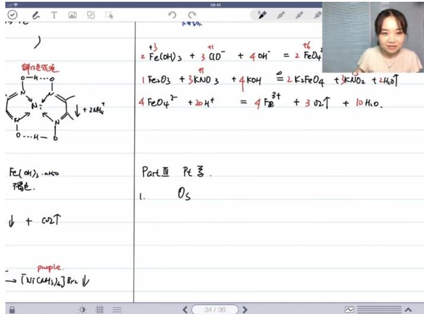

text_image

2Fe(OH)₃ + 3ClO⁻ + 4OH⁻ = 2FeO₄
1Fe₂O₃ + 3KNO₃ + 4KOH = 2K₂FeO₄ + 3KNO₂ + 2H₂O↑
4FeO₄²⁻ + 2OH⁴⁻ = 4Fe³⁺ + 3O₂↑ + 10H₂O.
Fe(OH)₃·NHCO
褐色.
↓ + CO₂↑
purple.
→ [Ni(CuH₃)₄]Br₂↓
Part III Pt Ⅲ.
1. Os

- 铁化合物反应： $Fe(OH)_{3} + 3CO^{-} + 4OH^{-} = 2FeO_{4}^{2-}$ 生成鲜红色沉淀  
- 鹅金属特性：鹅金属非常重，理论上为蓝色液体但实际罕见，在空气中会缓慢氧化生成四氧化鹅

# 2. 正六价的铂系元素 01:59:03

# 1）六氟合铂（IV）氧的强氧化性 01:59:19

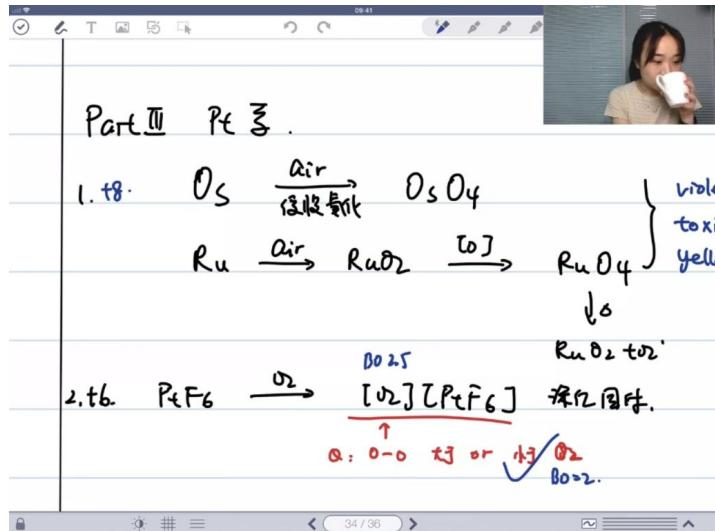

text_image

PartⅢ Pt Ⅱ.
1. t8. Os air Os O4
Ru air RuO2 [O] RuO4
↓o
2. t6. PtF6 → [O2][O2][PtF6]
Q: 0-0 +J or 小 BO=2.
DO 25 RuO2 to2
深化固体.

- 氧化能力： $[PtF_{6}]^{-}$ 氧化性极强，可氧化氧气生成 $O_{2}^{+}[PtF_{6}]^{-}$ 深红色固体  
- 真题考点：该化合物在真题中多次出现，主要考查 $O_{2}^{+}$ 的氧氧键特性

# 2）六氟合铂（IV）氧的键长特性 02:00:44

● 键长比较： $O_{2}^{+}$ 中的氧氧键键长小于氧气分子 $O_{2}$ 的键长（注意：键级为2.5 vs 2）

3）六氟合铂（IV）的离子构型 02:01:29

● 电子排布：铂为 $d^{5}$ 电子构型（ $Pt^{5+}$ 为 $d^{5}$ ）  
● 杂化方式： $SP^{3}d^{2}$ 杂化形成正八面体构型  
● 配体场强：氟为弱场配体，无姜泰勒效应

4）铂的杂化与姜泰勒效应 02:03:08

● 高自旋状态：弱场配体下 $d^{5}$ 为高自旋，电子均匀分布  
- 对称性：属于 $O_{b}$ 点群的正八面体结构

3. 正四价的钯和铂 02:04:56

1）正四价钯和铂的溶解性 02:05:17

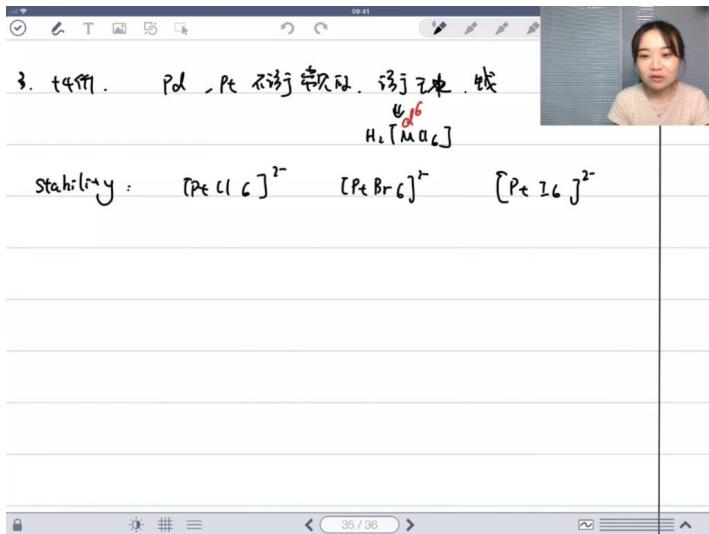

text_image

3. t491. Pd, Pt 不溶于常欣的, 浓于乙炔, 钱
H₂[MAc₆]
stahirliny: [Pt Cl C]²⁻ [Pt BrC]²⁻ [Pt I₆]²⁻

- 溶解特性：不溶于常见酸，溶于王水（浓硝酸+浓盐酸）生成 $H_{2}PtCl_{6}$

2）正四价钯和铂的电子构型与18电子规则 02:06:10

● 电子构型：正四价铂符合18电子规则（ $d^{6}$ 构型）

3）正四价铂的软硬酸碱性质 02:07:18

● 特殊性质：四价铂是罕见的软酸（需特别注意记忆）  
● 稳定性顺序： $[PtCl_{6}]^{2-}<[PtBr_{6}]^{2-}<[PtI_{6}]^{2-}$ （随卤素原子序数增加稳定性增强）

4）二价钯和铂的配合物 02:08:34

● 配位特点：二价铂（ $d^{8}$ 构型）易形成四配位平面四边形配合物

5）蔡思盐的结构与特点 02:09:21

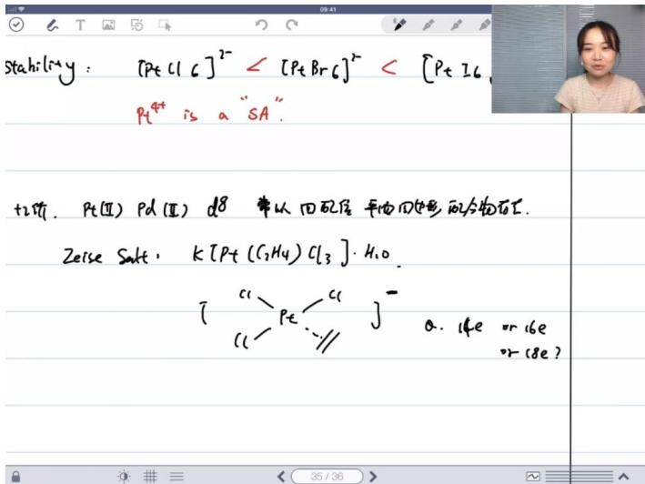

text_image

stahily: [Pt Cl C]²⁻ < [Pt Br C]²⁻ < [Pt I₆,
Pt⁴⁺ is a "SA".
t2折. Pt(Ⅱ) Pd(Ⅲ) d⁸ 带以四配位 平面四边形的化合物石.
Zeise Salt: K [Pt (C₂H₄) Cl₃]·H₂O.
[ c₁ ~ Pt ~ c₂ ]⁻
[ c₁ ~ ... // ] 0. 46e or 16e
or (8e?)

● 历史意义：最早的金属有机化合物之一  
● 结构特征：平面四边形结构，通过 $\pi$ 键配位

6）正二价铂的电子数计算 02:10:47

● 电子计数：四配位的二价铂配合物通常为16电子构型（8+8）  
● 后过渡金属特点：后过渡金属常见14/16/18电子构型，需特别注意区分

# 4. 顺式二氯二胺合铂 02:11:27

# 1）顺式二氯二胺合铂的基本介绍 02:11:47

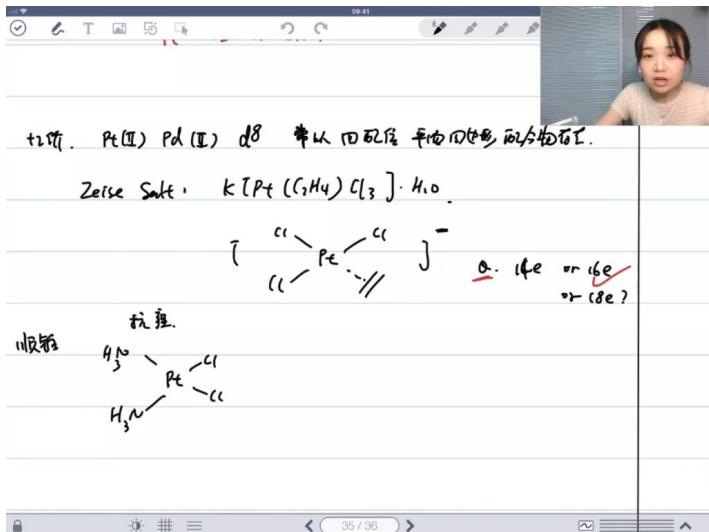

text_image

t2价. Pt(Ⅱ) Pd(Ⅱ) d8 带以四配位 并为四配位,配合物有工.
Zeise Salt: K[Pt(C2H4)Cl3]·H2O.
[ C1 C2 C3 C4 C5 C6 C7 C8 C9 C10 C11 C12 C13 C14 C15 C16 C17 C18 C19 C20 C21 C22 C23 C24 C25 C26 C27 C28 C29 C30 C31 C32 C33 C34 C35 C36 C37 C38 C39 C40 C41 C42 C43 C44 C45 C46 C47 C48 C49 C50 C51 C52 C53 C54 C55 C56 C57 C58 C59 C60
顺程 抗程
9/30 9/30
Pt Cl
H3N H3N
Q. 14e or 16e
or (8e?)

- 化学式: 中性配合物, 化学式为 $[Pt(NH_3)_2Cl_2]$   
● 配位构型: 四配位平面四边形构型, 属于 $d^{8}$ 电子构型  
● 历史地位: 最早的抗癌药物之一，后续经过多次结构修饰

# 2）顺式二氯二胺合铂作为抗癌药的原理 02:12:01

● 作用靶点: 主要作用于DNA分子  
● 作用机制:

\- 通过氨配体与DNA碱基对中的氮原子发生配体交换
- 破坏DNA双螺旋结构，抑制癌细胞繁殖

● 选择性: 对快速增殖的癌细胞DNA破坏作用更显著

3）顺式二氯二胺合铂的副作用 02:12:36  
- 毒性表现:

- 无差别破坏所有细胞的DNA复制  
- 对正常细胞代谢造成严重损伤

● 毒性原因: 能作用于DNA的药物通常具有高度毒性

# 4）反位效应的概念与重要性 02:13:11

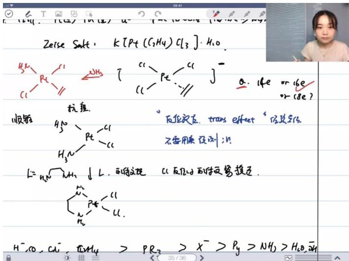

text_image

Zeise Salt: k[Pt (C2H4) Cl3]·H2O.
↑↓
Pt ←→ [C1/2]Pt →[C1] J-
↑↓
Cl /|| | Cl /|| | 0. 14e or 16e
or (8e)?
顺缩 抗痕
P2O  Pt - Cl
H3N
L = nNO NH3 ↓ L. 可持这处 C1 反位的特征势接近.
Pt - Cl
n
H-10, CN-, TNH4 > PR2 > x^- > Py > NH4 > H60, 24

● 定义: 在平面四边形配合物中，特定配体对其反位配体稳定性的影响  
● 研究背景: 基于顺铂研究发现的实验现象

● 应用范围: 主要适用于二价铂的四配位配合物反应性解释  
● 注意事项: 属于经验总结规律，不适用于预测反应

5）反位效应的应用与解释 02:13:41

● 配体交换规律:

- 氯反位的配体更容易被取代  
例如乙二胺配体取代时，优先取代氨对位的氯

● 配体影响顺序:

○ $CO, CN^{-}$ ，烯烃(如 $C_{2}H_{4}$ ) > 膦配体 > 卤素 > 吡啶 > $NH_{3} > H_{2}O, OH^{-}$

● 电子效应解释:

- 二价铂为软酸，但软硬酸碱理论不能完全解释该现象  
- 乙烯反位的氯最易离去，符合反位效应顺序

# 5. 催化循环

# 1）基本概念

text_image

Part IV Catalytic Cycle. 催成循环.
1.

● 定义: 催化剂参与反应但最终恢复原状的循环过程

● 学习要求: 能够理解循环过程，不要求独立设计

# 2）铑催化循环实例

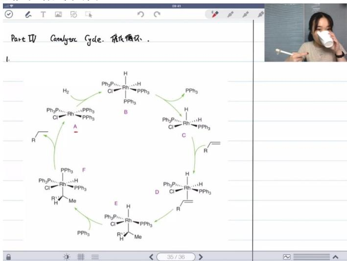

chemical

Catalytic cycle diagram for methane (CH₃P) formation, showing intermediates and products labeled A–F

初始催化剂: $\left[Rh(PPh_{3})_{3}Cl\right]$ ， $d^{8}$ 构型，16电子，Rh(I)

● 关键步骤:

○ 氧化加成: 加入 $H_{2}$ ，Rh(I)→Rh(III)，16e→18e

○ 配体解离: 18e→16e，氧化态不变(Rh(III))

○ 配体交换: 烯烃配位, 16e→18e

\- 氧化加成: 加入 $H_{2}$ , Rh(I)→Rh(III), 16e→18e
- 配体解离: 18e→16e, 氧化态不变(Rh(III))
- 配体交换: 烯烃配位, 16e→18e

○ 插入反应: 氢迁移, 形成Rh-C键, 16e  
○ 还原消除: Rh(III)→Rh(I), 类似α消除

# 3）催化循环净效应分析

- 反应物: 烯烃和氢气  
- 产物: 烷烃   
● 催化剂: 循环结束后恢复初始状态   
● 关键步骤: 氧化加成和还原消除构成循环核心

# 三、催化循环 02:16:56

# 1. 催化循环示例 02:18:19

# 1）烯烃的氢化 02:29:08

text_image

Part IV Catalytic Cycle. T

1. Hydrogenation of alkene. 烯烃氢化.

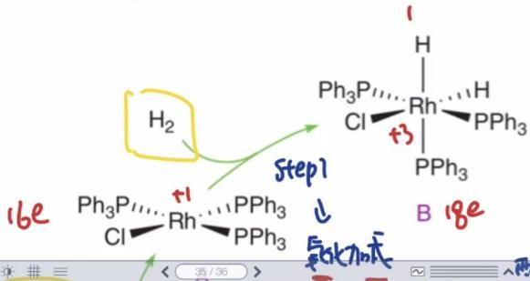

chemical

Organometallic reaction mechanism diagram showing hydrogenation and stepwise addition of alkene to rhodium complex

- 催化剂结构: 使用 $Ph_{3}P|RhH_{2}Cl|PPh_{3}$ 作为催化剂, 其中Rh为中心金属原子, $PPh_{3}$ 为配体  
● 反应类型: 属于均相催化反应，Rh配合物在溶液中催化烯烃加氢  
- 考点提示:

- 2004年考题涉及钒催化剂催化过氧化氢反应  
◦ 重点考察催化循环中钒的化合价变化  
- 需要掌握催化反应的具体过程

# - 催化循环机理

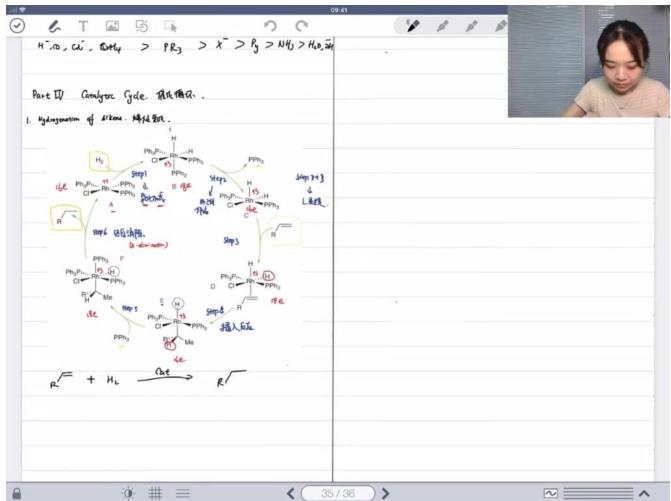

chemical

Chemical reaction diagram showing hydrogenation of a cyclic compound with phosphine and methyl groups, including reaction conditions and structural formulas.

步骤1: $Ph_{3}PHRhH_{2}Cl+3PPh_{3}$ 形成活性催化剂  
- 步骤2: 烯烃配位到Rh中心，发生氧化加成  
- 步骤3: 氢分子插入Rh-烯烃键，形成Rh-烷基中间体  
- 步骤4: 还原消除生成烷烃产物，催化剂再生

○ 电子变化: 整个循环涉及6电子转移过程  
○ 关键中间体: 注意Rh的氧化态在+1和+3之间变化

\- 反应特点

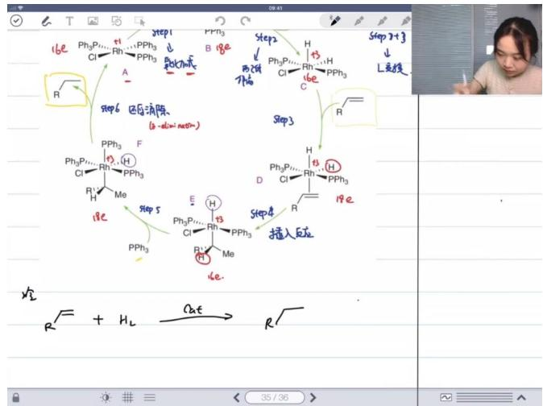

chemical

Chemical reaction mechanism diagram showing phosphorus-catalyzed step 5 with reagents and conditions

立体选择性: 通常得到顺式加成产物  
○ 配体效应: $PPh_{3}$ 配体的空间位阻影响反应速率和选择性  
- 副反应: 可能发生双键迁移或异构化  
- 记忆要点: 催化循环中Rh的配位数在16-18电子规则间变化

\- 钒催化剂对比

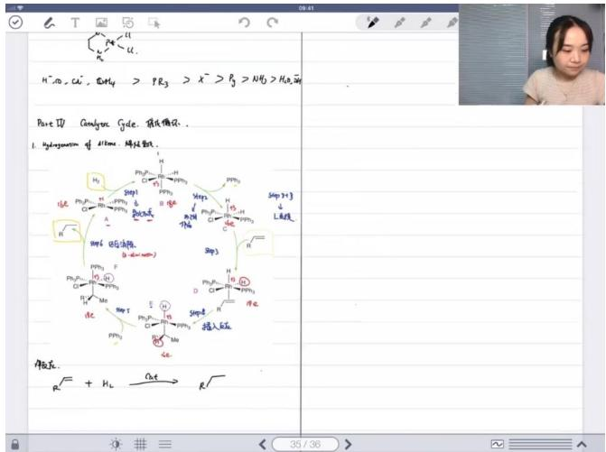

chemical

Chemical reaction diagram showing hydrogenation of a disulfide with phosphorus and nitrogen, forming a hydrocarbon chain and then reacting with H₂ to form an alkene.

对比反应: 钒催化过氧化氢分解为次氯酸和水  
- 价态变化: 钒在+4和+5价之间循环   
○ 考试重点:

■ 催化循环的具体步骤   
■ 中心金属的氧化态变化  
■ 每步反应的电子计数

2）应用案例 02:30:24

例题:烯烃催化反应

\- 净反应分析

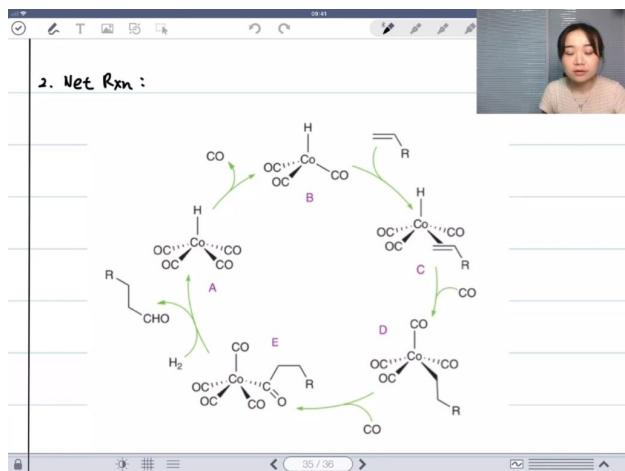

chemical

Chemical reaction mechanism diagram showing cobalt-catalyzed ring-opening with labeled intermediates A–E and stereochemistry

■ 反应物与产物：进入1个烯烃、2个一氧化碳和1个氢气，生成1个醛和1个羰基

净效应：烯烃加羰基加氢气生成醛（ $RCH = CH_{2} + CO + H_{2} \rightarrow RCH_{2}CHO$ ）

# ○ 催化循环机理

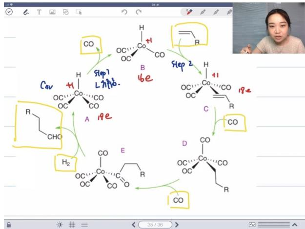

chemical

Reaction mechanism diagram showing steps of cobalt-catalyzed carbocation rearrangement with labeled intermediates and products

35/36

# ■ 起始配合物A:

● 钴价态：正一价 $(Co^{+})$   
● 电子数：18电子(d8构型，五配位)  
- 对称性：C4v点群

# 配体解离：

● 变化：失去1个CO配体  
● 结果：价态保持+1，电子数减至16  
● 类型：配体解离反应

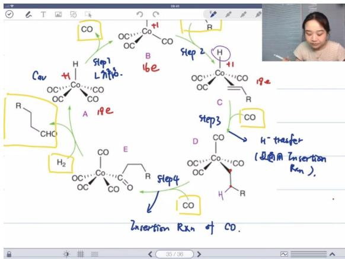

chemical

Chemical reaction mechanism diagram showing CO insertion and hydrogen transfer steps with labeled intermediates and reagents

# 插入反应：

● 类型1：氢负离子迁移(hydride transfer)

● 类型2：羰基插入(CO insertion)   
● 特点：通常插入已吸附在金属中心的配体

# ○ 氧化还原过程

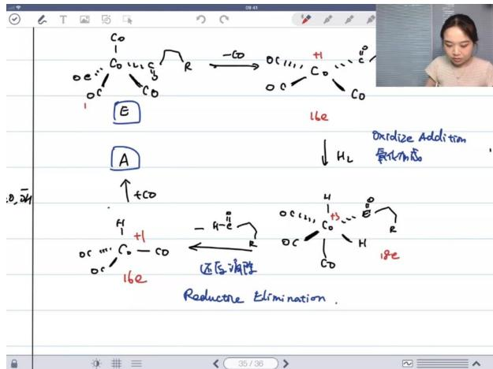

chemical

Chemical reaction diagram showing oxidation and reduction of a cyclic carbonate with CO, H, and H2 groups, leading to reductive elimination.

# ■ 氧化加成：

● 定义：金属同时接受两个配体  
● 变化：化合价升2，电子数增2  
- 示例： $Co^{+}(16e)+H_{2}\rightarrow Co^{3+}(18e)+2H$

# ■ 还原消除：

● 定义：金属释放两个配体  
● 变化：化合价降2，电子数减2  
- 示例： $Co^{3+}(18e)\rightarrow Co^{+}(16e)+H_{2}$

# ● 例题:交叉偶联反应 02:44:07

# - 净反应分析

■ 反应物：溴苯和烯烃  
■ 产物：偶联产物和溴化氢   
■ 断键类型：SP2碳-溴键和SP2碳-氢键断裂

# ○ 催化循环机理

■ 起始催化剂A:   
- 钯价态：零价 $(Pd^{0})$   
● 电子数：16电子

# ■ 氧化加成步骤：

- 变化： $Pd^{0}(16\mathrm{e})\rightarrow Pd^{2 + }(18\mathrm{e})$   
● 特点：经典氧化加成，化合价升2，电子数增2

# 配体交换：

● 过程：烯烃取代膦配体  
● 特点：价态不变(保持 $Pd^{2+}$ )，电子数保持18

# 非经典还原：

- 变化： $Pd^{2+}(16e)\rightarrow Pd^{0}(16e)$   
● 区别：化合价降2但电子数不变，非经典还原消除

# - 重要反应类型

# ■ 核心反应：

● 必须掌握：氧化加成与还原消除   
- 次要重要：插入反应(insertion reaction)  
● 辅助反应：配体交换(ligand exchange)

# 3）应用案例 02:57:48

# 例题：烯烃复分解

诺贝尔奖背景：2005年诺贝尔化学奖授予烯烃复分解反应研究，主要贡献者为Robert H. Grubbs（MIT教授）和Richard R. Schrock

研究历程：

Grubbs早期在杜邦公司进行研究工作  
■ Schrock是无机化学家，专注于金属-碳双键结构研究  
Grubbs是有机化学家，更关注反应性和实际应用

○ 催化剂特点：

■ 存在Schrock催化剂和Grubbs催化剂两种主要类型  
Grubbs催化剂已商业化三代，第一代使用钌（Ru）金属中心  
■ 典型结构：中心金属 $Ru^{2+}$ ，配体包括两个氯、两个膦配体和一个卡宾配体

○ 催化机理：

■ 实际使用的是催化剂前体（catalyst precursor），因其更稳定  
■ 催化循环中会生成亚甲基卡宾 ( $CH_{2}$ 卡宾)  
净反应通式： $R_{1}=+R_{2}=\rightarrow R_{1}R_{2}+$ （乙烯副产物）

○ 电子计数：

■ 催化剂前体（a）： $Ru^{2+}$ ，16电子构型  
■ 中间体（b）： $Ru^{4+}$ ，16电子构型  
■ 卡宾配合物：按中性卡宾处理，提供2个电子

工业应用：

Grubbs因其企业家精神推动催化剂工业化应用  
■ 该催化剂在工业界广泛应用20-30年后获得诺贝尔奖

○ 典型反应：

■ 环己烯在Grubbs催化剂作用下发生复分解反应  
■ 主要产物为1,5-环辛二烯（产物命名需掌握）  
■ 副产物为乙烯

# 四、镧系元素 03:15:40

1. 镧系元素概述 03:16:04

\- 别称与定义:

○ 又称稀土元素（rare earth elements），化学符号为Ln  
○ 包含从镧（La）到镥（Lu）的15种元素

\- 存在形式:

- 主要呈+3价态存在  
○ $Ln^{3+}$ 属于硬路易斯酸（hard Lewis acid）

● 地壳分布特点:

- 绝对丰度不低但分布极分散  
○ 常以共生矿形式存在（如独居石、氟碳铈矿）

● 关键现象:

○ 镧系收缩：原子半径随原子序数增加而减小的现象   
■ 原因：新增电子填入内层4f轨道 $(4f^{0}\rightarrow4f^{14})$   
■ 外层5d和6s电子受有效核电荷增加影响  
■ 例外： $4f^{7}$ 和 $4f^{14}$ （半满/全满）时出现半径突增
● 因屏蔽效应增强导致外层电子云扩张

○ 离子半径特性:

■ $Ln^{3+}$ 离子半径呈现单调递减（无半满/全满例外）  
■ 原因：失去5d和6s电子后仅剩4f电子

2. 镧系元素的分离 03:19:38

\- 分离基础:

- 利用 $Ln^{3+}$ 离子半径微小差异（ $La^{30}$ 最大→ $Lu^{3+}$ 最小）  
○ 化学性质高度相似导致传统方法失效

# - 离子交换法:

# ○ 阳离子交换阶段:

■ 树脂原有阳离子（如 $H^{+}$ 、 $NH_{4}^{+}$ ）与 $Ln^{3+}$ 发生置换  
■ 水合离子半径影响扩散速率：  
● 大半径离子（如 $La^{3+}$ ）极化弱→水合层薄→扩散快  
● 小半径离子（如 $Lu^{3+}$ ）极化强→水合层厚→扩散慢

# ○ 洗脱阶段:

■ 配体（如EDTA）与树脂竞争结合 $Ln^{3+}$   
■ 规律：离子半径越小，配位常数越大  
- $\mathrm{Lu}^{3+}$ 优先被洗脱（因结合力强）  
- La $^{3+}$ 最后洗脱

# - 注意事项:

◦ 实际顺序可能因树脂/洗脱剂不同而变化  
- 考试重点在于理解半径-扩散速率-结合力的逻辑关系

# 3. 学习资源建议

# ● 基础教材:

◦ 严宣申《无机化学》（北大版）  
○ 张祖德《无机化学》（中科大版）

# - 进阶学习:

○ 项斯芬《中级无机化学》（配位化学专题）  
○ 格林伍德《元素化学》（特殊结构案例）

# - 复习策略:

- 无机化学本质是"基本原理+结构化学"  
○ 重点掌握：热力学计算、晶格能、配合物理论

# 五、知识小结

<table><tr><td>主题</td><td>核心内容</td><td>考试重点/易混淆点</td><td>难度系数</td></tr><tr><td>过渡金属化学</td><td>铁钴镍低价化合物性质对比</td><td>二茂铁结构争议(乙烷构象类比)</td><td></td></tr><tr><td>催化循环机理</td><td>氧化加成/还原消除反应</td><td>电子数计算规则( $16e^{-}$  vs  $18e^{-}$ )</td><td></td></tr><tr><td>稀土元素特性</td><td>镧系收缩现象及应用</td><td>离子交换分离原理(水合半径影响)</td><td></td></tr><tr><td>配合物结构</td><td>羰基化合物18电子规则</td><td>Fe(CO) $_{5}$ 点群判断(TD vs D4h)</td><td></td></tr><tr><td>颜色反应</td><td>特征离子颜色记忆要点</td><td>Co $^{2+}$ 水合颜色变化(粉红→紫红→蓝紫)</td><td></td></tr><tr><td>氧化还原反应</td><td>高价态化合物制备</td><td>高铁酸盐稳定性(碱性条件制备)</td><td></td></tr><tr><td>诺贝尔奖案例</td><td>Grubbs烯烃复分解催化剂</td><td>卡宾配体电子计数(中性vs负电)</td><td></td></tr><tr><td>实验现象</td><td>特征沉淀反应</td><td>[Ni(dmg) $_{2}$ ]鲜红色沉淀</td><td>[GXBA]</td></tr></table>