# 一、课程介绍00:08

# 1. 课程群说明 00:30

- 入群要求：报名后需在课程中心扫描二维码加入课程群，用于接收课后笔记、作业及课程讨论  
● 当前状态：目前群成员约20-30人，仅为报名人数的一半左右  
● 课程资料：课前不提供笔记，课后会发放每节课的笔记和作业，结课前有期末考试

# 2. 无机化学学习建议 01:21

● 课程定位：本课程是z com课程体系第一轮最后一门课，进度安排比其他机构更紧凑  
● 前置知识：默认学生已掌握有机化学、化学键、热力学和动力学基础知识  
● 学习对象：主要面向9月将参加国初考试的高二学生  
- 互动要求：鼓励通过弹幕提问，老师会实时解答或课后在群内讨论

# 3. 考试重点分析 02:46

# - 晶体结构：

○ 课时分配：共3小时  
- 考试占比：国初必考8-10分  
学习建议：属于必得分考点，常规考题难度较低，仅复杂图形可能造成部分失分  
- 关联内容：包含分子结构中的杂化轨道理论，默认学生已掌握杂化判断能力

# - 元素化学:

# ○ 主族元素：

■ 学习难点：理论解释性弱，知识点零散  
■ 备考策略：不追求满分，重点掌握多本教材重叠部分  
■ 推荐教材：师大版/武大吉大版无机化学下册、中科大张祖德版  
■ 学习方法：至少二刷不同版本教材，重点关注理论可解释的内容

# ○ 过渡金属：

■ 核心内容：第四周期元素（Sc-Ti-V-Cr-Mn-Fe-Co-Ni-Cu-Zn）  
■ 考试特点：侧重立体化学和化学键理论，得分率较高

# ● 考试趋势：

近年变化：无机化学考题难度降低，更侧重规律性知识  
- 记忆要求：俗名等纯记忆内容考查减少（如萤石 $= CaF_{2}$ ）  
- 答题技巧：非常规结构题会提供提示信息，不要求死记硬背

# - 学习策略：

○ 时间分配：理论性强的内容优先保证满分  
目标设定：省一考生不需追求无机元素满分，省队考生需接近满分  
教材选择：第一轮不推荐《格林伍德》，适合第二轮拓展视野使用

# 二、稀有气体 11:25

# 1. 稀有气体概述 12:38

# 1）稀有气体元素 12:51

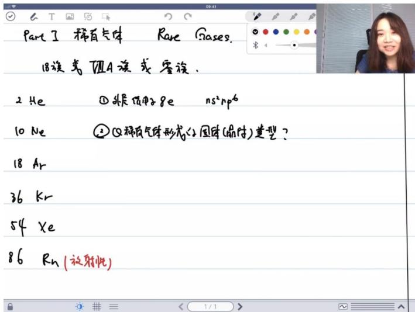

text_image

Part I 稀有气体 Rare Gases.
18 族 式 周A 族 式 零族。
2 He ① 非银质子 8e ns²np⁶
10 Ne ② Q稀有气体形成C₂固体(晶体)典型？
18 Ar
36 Kr
54 Xe
86 Rn (放射性)

- 元素组成: 包括氦(He)、氖(Ne)、氩(Ar)、氪(Kr)、氙(Xe)和放射性元素氡(Rn)  
● 周期表位置: 第18族（或8A族/零族），原子序数依次为2(He)、10(Ne)、18(Ar)、36(Kr)、54(Xe)、86(Rn)  
● 原子序数规律: 相邻元素原子序数差呈现8-8-18-18-32的递增规律

2）稀有气体性质 15:45

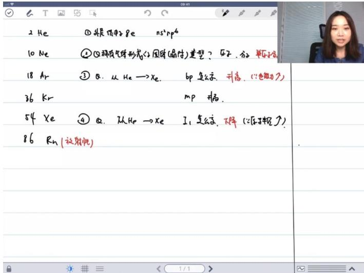

text_image

2 He ①提低电子8e ns²np⁶
10 Ne ②③稀有气体形成的固体(晶体)造型？原子，分子量原子数
18 Ar ③ Q.从He→Xe，bp 空心求，升高，（：色细胞）？
36 Kr mp 升级.
54 Xe ④ Q.从He→Xe I₁ 空心求，下降（：原子规模）？
86 Rn（放射性）

● 电子构型: 外层电子为 $ns^{2}np^{6}$ 稳定结构（除He为 $1s^{2}$ ）  
● 固体类型: 形成单原子分子构成的分子晶体（也可称为原子晶体）  
- 沸点变化: 从He到Xe沸点(BP)逐渐升高，因色散力随原子质量增大而增强  
- 熔点变化: 从He到Xe熔点(MP)同样逐渐升高，原因与沸点相同  
● 电离能变化: 第一电离能 $(I_{1})$ 从He到Xe逐渐降低，主要由于原子半径增大  
● 历史名称: 曾被称为惰性气体(inert gas)，因其化学性质极不活泼

2. 稀有气体应用 19:42

1）稀有气体的基本性质与名称 19:48

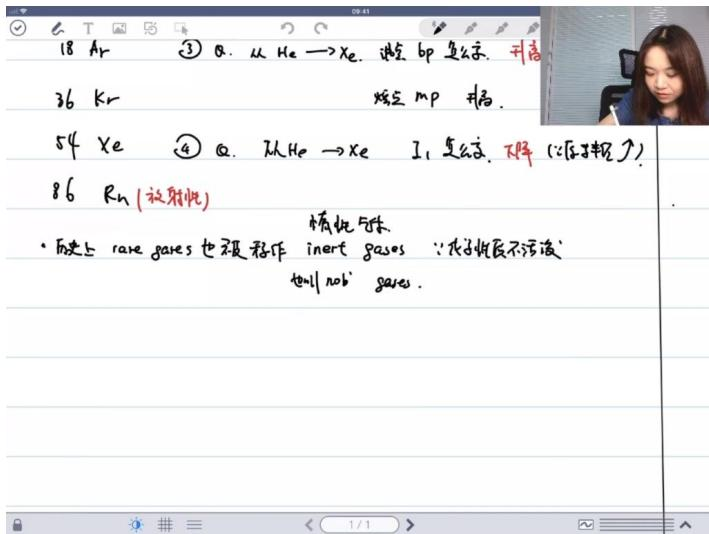

text_image

18 Ar
3 Q. 从 He → Xe. 涉 bp 急么求. 开启
26 Kr
熔点 mp 持。
54 Xe
④ Q. 从 He → Xe I₁ 急么求. 下降 (以原子转运)
86 Rh (放射性)
惰此与水.
• 反受上 rare gases 也被移作 inert gases '次子性质不活泼'
也可 no' gases.

● 现代命名: 现多称"稀有气体"(rare gases)或"贵气体"(noble gases)

● 化学惰性: 氦、氖、氩在常规条件下几乎不参与化学反应

● 发现突破: 1962年首次制得氙化合物 $Xe^{+}[PtF_{6}]^{-}$ （黄色固体），打破了"惰性"认知

2）稀有气体的主要应用 21:03

3）氦气的应用 21:19

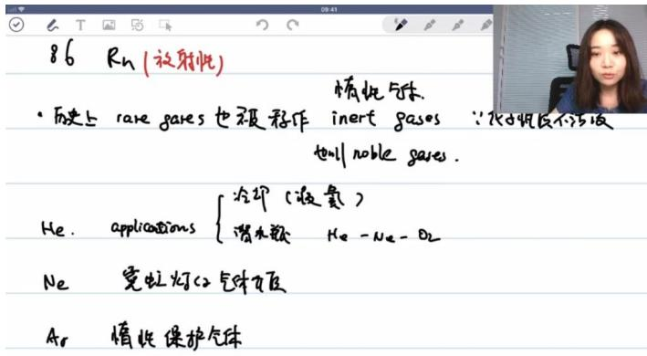

text_image

86 Rn (放射性)
• 历史上 rare gases 也被称作 inert gases ∵化小能反不污染
也可 noble gases.
He. applications { 冷却（液氨）
    谓水数 He - Ne - O2
Ne 克虹灯(2)气体平衡
Ar 情性保护气体

● 低温冷却: 液态氦用于超导磁体冷却（如核磁共振仪），保持4K低温环境  
- 潜水气体: 配制 $He-N_{2}-O_{2}$ 混合气体替代氮气，防止潜水员得减压病  
● 使用特点: 液氦昂贵需配合液氮使用，通常半年至一年更换一次  
4）氖气的应用 23:20  
● 照明技术: 用作霓虹灯填充气体，发出橙红色光  
● 保护气体: 在某些特殊化学反应中作为惰性保护气氛  
5）氩气的应用与特性 23:43

text_image

He. applications { He (吸氧) 
    潜水瓶  He - Ne - O₂
Ne 克虹灯(2)气体介质

A. 惰性保护气体 0.93% (体实质应稀有气体).

1/1   
● 丰度最高: 占大气中稀有气体的0.93%，是地表最丰富的稀有气体  
● 保护气体: 实验室常用保护气，特别适用于会与氮气反应的活泼金属（如Li、Al等）  
● 实验室配置: 常见钢瓶气体之一，通常与氮气、氧气钢瓶配合使用

# 3. 稀有气体化合物 25:11

# 1）氙的氟化物 26:42

\- 氙与氟气的反应 27:06

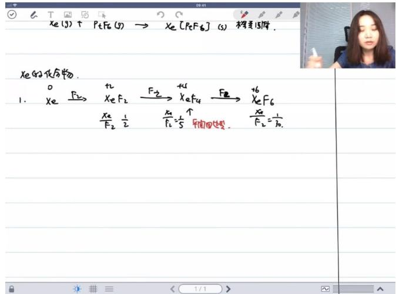

text_image

xe(s) ↑ PtF6(s) → Xe[FeF6](s) 横变15°
xe的化合物.
1. 0  F2  +  F2  F2  +  F4  F4  +  F6
      xe F2   xeF4   xeF6
          ×e  1/2   ×e  ↑   ×e
          F2 = s 平面四边形.   F2 = 1/2

反应规律：随着氟气比例增加，氙的氧化数升高

■ $\frac{Xe}{F_2} = \frac{1}{2}$ 生成二氟化氙 $(XeF_2)$   
■ $\frac{Xe}{F_2} = \frac{1}{20}$ 生成四氟化氙 $(XeF_4)$   
■ $\frac{Xe}{F_2} = \frac{1}{30}$ 生成六氟化氙（ $XeF_6$ ）

○ 氧化数变化： $Xe^{0}\rightarrow Xe^{2+}\rightarrow Xe^{4+}\rightarrow Xe^{6+}$

四氟化氙的分子结构 28:42

○ 空间构型：平面四边形（正方形）  
○ 杂化方式： $sp^{3}d^{2}$ 杂化  
○ 实验现象：实际生成物常为混合物

\- 六氟化氙的分子构型 29:38

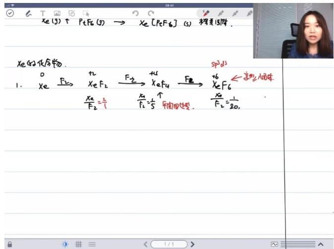

text_image

Xe(S) + PtFe(S) → Xe[PtFe](S) 模糊步骤.
Xe的化合物.
1. Xe F2 → XeF2 → XeF4 → XeF6 ← 透明,不溶解
xE = 1 / (xF2 - xF4) ↑ 平面四边形.
xE/F2 = 1 / (xF2 - xF4) ↑
xE/F2 = 1 / (xF2 - xF4) ↑
xE/F2 = 1 / (xF2 - xF4) ↑
xE/F2 = 1 / (xF2 - xF4) ↑
xE/F2 = 1 / (xF2 - xF4) ↑
xE/F2 = 1 / (xF2 - xF4) ↑
xE/F2 < 透明,不溶解

○ 空间构型：变形八面体（实验测定结果）  
○ 电子对排布：7对价层电子（6个F+1个孤对电子）  
○ 理论解释：

■ 杂化轨道理论在重元素中适用性有限   
■ 价层电子对互斥理论预测七对电子多为变形八面体

2）氙化合物水解 31:46

\- 氙氟化物与氢气的反应 32:37

○ 通式： $XeF_{n} + H_{2} \rightarrow Xe + HF$   
○ 注意事项：反应中不生成氟气（避免爆炸危险）

\- 氙氟化物与水的反应 33:27

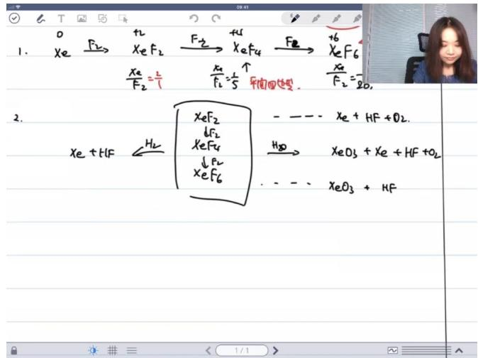

text_image

1. 0
Xe F₂ → XeF₂ → F₂ → XeF₄ → F₂ → XeF₆
      ×e = 1/7    ×e = 1/5 ↑    ×e = 20.
2. 
      Xe + HF ← H₂
      XeF₂
      dF₂
      XeF₄
      ↓F₂
      XeF₆
      - - - - Xe + HF + O₂
      H₂O → XeO₃ + Xe + HF + O₂
      - - - XeO₃ + HF

二氟化氙： $XeF_{2} + H_{2}O \rightarrow Xe + HF + O_{2}$ （氧化还原）  
四氟化氙：发生歧化反应，生成Xe、 $XeO_{3}$ 、HF混合物  
○ 六氟化氙：完全水解生成 $XeO_{3} + HF$ （正六价保持）

● 水解反应对比 35:01

○ 氧化数变化：

■ $XeF_{2}$ : +2→0 (单纯还原)   
■ $XeF_{4}$ : +4→0/+6 (歧化)   
■ $XeF_{6}$ : +6保持不变（水解）

3) 氙化合物氧化性 35:18

● XeF6作为氧化剂 35:25

text_image

e16
xe03

3. $XeF_{6}$ 做为氧化剂：

$$
ⓘ x _ {e} F _ {6} + C _ {b} H _ {2} \rightarrow C _ {b} H _ {5} F + x _ {e} + H F
$$

$$
\begin{array}{c} X e F _ {6} + S i O _ {2} \longrightarrow X e O F _ {4} + S i F _ {4} \\ \downarrow S i O _ {2} \end{array}
$$

$$
X e O _ {3} + S i F _ {4}
$$

与苯反应： $XeF_{6} + C_{6}H_{6} \rightarrow C_{6}H_{5}F + Xe + HF$

○ 与 $SiO_{2}$ 反应：

■ 阶段1: $XeF_{6} + SiO_{2} \rightarrow XeOF_{4} + SiF_{4}$   
■ 阶段2： $XeOF_{4} + SiO_{2} \rightarrow XeO_{3} + SiF_{4}$

● XeOF4分子构型 36:40

○ 空间构型：四方锥  
○ 杂化方式： $sp^{3}d^{2}$ 杂化  
- 孤电子对：八面体一个顶点被孤对电子占据

● XeF2的特殊反应 39:19

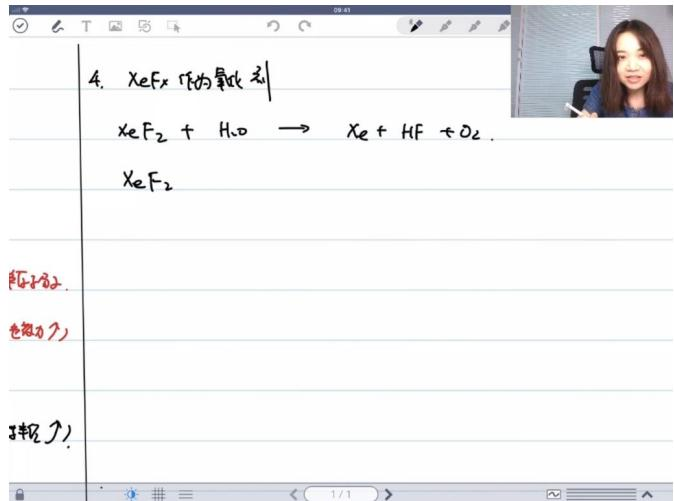

text_image

4. XeFx 仍为氧化剂
XeF₂ + H₂O → Xe + HF + O₂.
XeF₂
Fe₂放水
饱和少
Fe(少)

与 $H_{2}O_{2}$ 反应：产物与水解相同 $(Xe + HF + O_{2})$

○ 与HCl反应： $XeF_{2} + HCl \rightarrow Xe + Cl_{2} + HF$

○ 与NH3反应： $XeF_{6} + 8NH_{3} \rightarrow Xe + N_{2} + 6NH_{4}F$

● 高价态化合物 43:02

○ 高氙酸盐： $XeO_{6}^{4-}$ （正八价）

■ 制备： $XeO_{3}$ 在碱性条件下与臭氧反应

■ 氧化性：极强氧化剂

■ 制备： $XeO_{3}$ 在碱性条件下与臭氧反应
■ 氧化性：极强氧化剂

4）高氙酸盐 44:22

\- 氙的氟化物反应

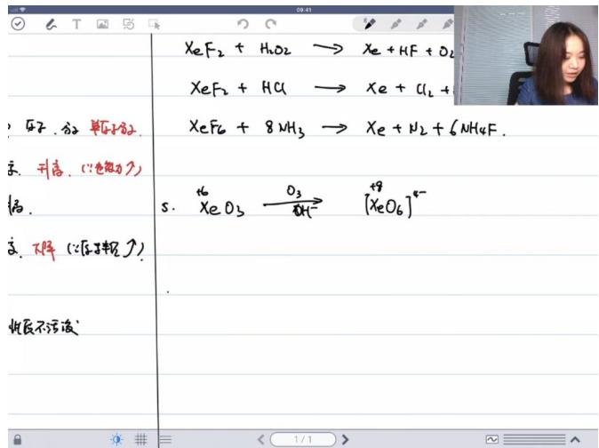

text_image

XeF₂ + H₂O₂ → Xe + HF + O₂
XeF₂ + HCl → Xe + Cl₂ + 
XeF₆ + 8NH₃ → Xe + H₂ + 6NH₄F.
XeO₃ \xrightarrow{O_3} [XeO_6]^2-
5. XeO₃ \xrightarrow{OH^-} [XeO_6]^2-
XeF₂ + HCl → Xe + Cl₂ + 
XeF₆ + 8NH₃ → Xe + H₂ + 6NH₄F.
XeO₃ \xrightarrow{OH^-} [XeO_6]^2-
XeF₂ + HCl → Xe + Cl₂ + 
XeF₆ + 8NH₃ → Xe + H₂ + 6NH₄F.
XeO₃ \xrightarrow{OH^-} [XeO_6]^2-
XeF₂ + HCl → Xe + Cl₂ + 
XuF₂ + HCl → Xe + Cl₂ + 
XeF₆ + 8NH₃ → Xe + H₂ + 6NH₄F.
XuO₃ \xrightarrow{OH^-} [XeO_6]^2-
XuF₂ + HCl → Xe + Cl₂ + 
XuF₆ + 8NH₃ → Xe + H₂ + 6NH₄F.
XuO₃ \xrightarrow{OH^-} [XeO_6]^2-
XuF₂ + HCl → Xe + Cl₂ + 
XuF₆ + 8NH₃ → Xe + H₂ + 6NH₄F.
XuO₃ \xrightarrow{OH^-} [XₑO₆]^2-
XuF₂ + HCl → Xe + Cl₂ + 
XuF₆ + 8NH₃ → Xe + H₂ + 6NH₄F.
XuO₃ \xrightarrow{OH^-} [XₑO₆]^2-
XuF₂ + HCl → Xe + Cl₂ + 
XuF₆ + 8NH₃ → Xe + H₂ +

○ 水解反应： $XeF_{2} + H_{2}O_{2} \rightarrow Xe + HF + O_{2}$ ，二氟化氙与过氧化氢反应生成氙气、氟化氢和氧气  
○ 氨解反应： $XeF_{6} + 8NH_{3} \rightarrow Xe + N_{2} + 6NH_{4}F$ ，六氟化氙与氨气反应生成氙气、氮气和氟化铵

\- 氙的配合物

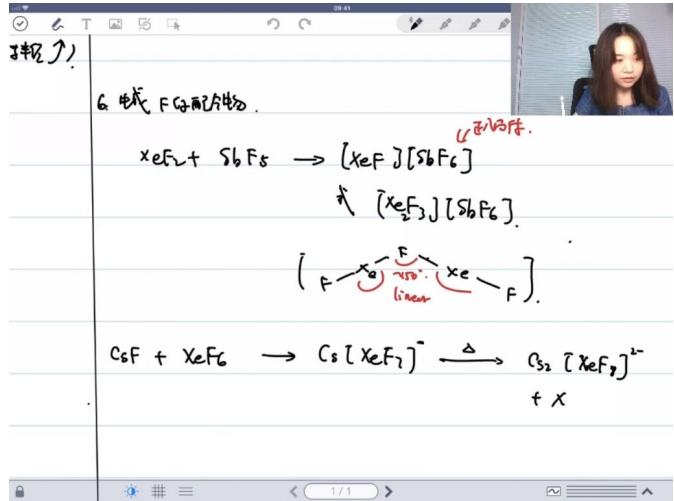

text_image

6. 生成 F 的配合物.

x eF₂ + SbF₅ → [xₑF] [SbF₆]

式 [xₑF₂] [SbF₆].

[F] ←[linear] ←[xₑ] ←[F]

CsF + xₑF₆ → Cs [xₑF₂]⁻ ⇌ Cs₂ [xₑF₃]²⁻

+ x

配合物生成： $XeF_{2} + SbF_{5} \rightarrow [XeF]^{+}[SbF_{6}]^{-}$ ，二氟化氙与五氟化锑反应生成氟化氙正离子和六氟锑配

○ 分子构型特点：

■ 氟化氙正离子( $[XeF]^+$ )为直线形结构  
■ 三氟化二氙正离子( $[X_{2}F_{3}]^{+}$ )呈V字形，键角约150度  
六氟锑酸负离子 $\left[\left[SbF_{6}\right]^{-}\right)$ 为正八面体构型

○ 配合物转化反应：

■ $CsF + XeF_{6} \rightarrow Cs[XeF_{7}]^{-} \Delta Cs_{2}[XeF_{8}]^{2-} + XeF_{6}$   
■ 七氟化氙负离子加热生成更稳定的八氟化氙二负离子

\- 氙的氧化还原反应

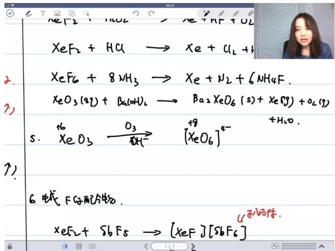

text_image

XeF2 + HCl → Xe + Cl2 + H
XeF2 + HCl → Xe + Cl2 + H
XeF6 + 8NH3 → Xe + N2 + 6NH4F.
XeO3(89) + Ba(OH)2 → Ba2XeO6(s) + Xe(89) + O2(89)
s. XeO3 → [XeO6]4-
+H2O.
6. 电式 F₂ 配分物.
XeF2 + SbF5 → [XeF] [SbF6]

与盐酸反应： $XeF_{2} + HCl \rightarrow Xe + Cl_{2} + HF$ ，二氟化氙氧化盐酸生成氙气、氯气和氟化氢

高氙酸钡生成： $2XeO_{3} + 2Ba(OH)_{2} \rightarrow Ba_{2}XeO_{6}(s) + Xe(g) + O_{2}(g) + 2H_{2}O$

■ 反应中氙从+6价变为0价和+8价  
■ 氧从-2价变为0价   
■ 电子得失守恒，需注意配平

\- 氙化合物的应用特性

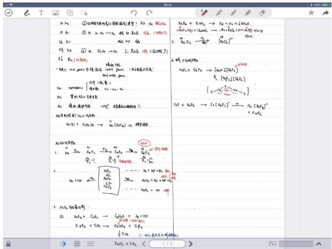

text_image

① Fe + 3H₅ → Xe + 2L + 6NH4.
② Fe(OH)₂ + 3NaOH → [Fe + HCl₂ (O) + H₂O]⁻
③ Fe + O₂ → [FeO₃]⁻
④ Fe + H₂O → [FeO₃]⁻
⑤ Fe + H₂O → [FeO₃]⁻
⑥ Fe + H₂O → [FeO₃]⁻
⑦ Fe + H₂O → [FeO₃]⁻
⑧ Fe + H₂O → [FeO₃]⁻
⑨ Fe + H₂O → [FeO₃]⁻
⑩ Fe + H₂O → [FeO₃]⁻
⑪ Fe + H₂O → [FeO₃]⁻
⑫ Fe + H₂O → [FeO₃]⁻
⑬ Fe + H₂O → [FeO₃]⁻
⑭ Fe + H₂O → [FeO₃]⁻
⑮ Fe + H₂O → [FeO₃]⁻
⑯ Fe + H₂O → [FeO₃]⁻
⑰ Fe + H₂O → [FeO₃]⁻
⑱ Fe + H₂O → [FeO₃]⁻
⑲ Fe + H₂O → [FeO₃]⁻
⑳ Fe + H₂O → [FeO₃]⁻
⑴ Fe + H₂O → [FeO₃]⁻
⑵ Fe + H₂O → [FeO₃]⁻
⑶ Fe + H₂O → [FeO₃]⁻
⑷ Fe + H₂O → [FeO₃]⁻
⑧ Fe + H₂O → [FeO₃]⁻
⑨ Fe + H₂O → [FeO₃]⁻
⑩ Fe + H₂O → [FeO₃]⁻
⑪ Fe + H₂O → [FeO₃]⁻
⑫ Fe + H₂O → [FeO₃]⁻
⑬ Fe + H₃O → [FeO₃]⁻
⑭ Fe + H₃O → [FeO₃]⁻
⑮ Fe + H₃O → [FeO₃]⁻
⑯ Fe + H₃O → [FeO₃]⁻
⑰ Fe + H₄O → [FeO₃]⁻
⑱ Fe + H₄O → [FeO₃]⁻
⑲ Fe + H₄O → [FeO₃]⁻
⑳ Fe + H₄O → [FeO₃]⁻
㉑ Fe + H₅O → [FeO₃]⁻
㉒ Fe + H₅O → [FeO₃]⁻
㉓ Fe + H₅O → [FeO₃]⁻
㉔ Fe + H₆O → [FeO₃]⁻
㉕ Fe + H₆O → [FeO₃]⁻
㉖ Fe + H₇O → [FeO₃]⁻
㉗ Fe + H₇O → [FeO₃]⁻
㉘ Fe + H₈O → [FeO₃]⁻
㉙ Fe + H₈O → [FeO₃]⁻
㉚ Fe + H₉O → [FeO₃]⁻
㉛ Fe + H₉O → [FeO₃]⁻
㉜ Fe + H₁₀O → [FeO₃]⁻
㉝ Fe + H₁₀O → [FeO₃]⁻
㉞ Fe + H₁₁O → [FeO₃]⁻
㉟ Fe + H₁₁O → [FeO₃]⁻

氧化剂性质：氙的氟化物 $(XeF_{2}, XeF_{4}, XeF_{6})$ 常用作强氧化剂  
历史意义：1962年首次制得氙的化合物，打破了"惰性气体"不能形成化合物的传统认知  
○ 稀有气体特性:

■ 外层电子构型为 $ns^{2}np^{6}$   
■ 氦(He)到氡(Rn)的物理性质变化规律  
■ 工业应用：霓虹灯、保护气体等

# 三、氢元素 59:58

1. 氢同位素 01:03:04

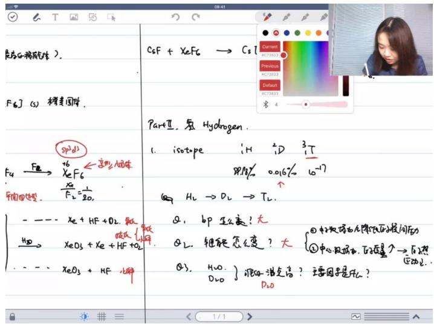

text_image

Fe₆] (s) 稀离固体.
F₄ → Fe + XeF₆ ← 弱化固体
平面四边形. \frac{Xe}{F₂} = \frac{1}{20}
Sp³d³
→
xₑ + HF + O₂. 额
H₂O → XeO₃ + Xe + HF + O₂
--- xₑO₃ + HF 化部
CsF + XeF₆ → CsI
Current
AC72031
Previous
AC72033
Detected
AC72034
Part II. 悬 Hydrogen.
1. isotope : H ²D ³T
89.0% 0.016% 6⁻¹⁷
H₂ → O₂ → T₂.
Q. 即怎么变? 无
Q₂. 键能怎么变? 大
① 中心极强的无降低的极间的力
② 中心极强的正负量? → 反向热
运动压.
Q₃. H₂O.
D₂O } 非饱和态高? 主要因于是先?
P₂O
1/1

# - 三种同位素：

○ 氖（ $^{1}H$ ）：丰度99.99%  
○ 氘（ $^{2}H$ 或D）：丰度0.016%  
- 氘（ $^{3}H$ 或T）：丰度极低（10^{-17}量级）

# - 物理性质变化规律：

○ 沸点： $H_{2}<D_{2}<T_{2}$ （分子质量增大导致色散力增强）  
○ 键能： $H_{2}<D_{2}<T_{2}$ （原因：①中子数增加降低核间斥力；②原子质量增大减弱热运动）  
○ 氢键强度： $H_{2}O < D_{2}O$ （质量效应导致振动减弱）

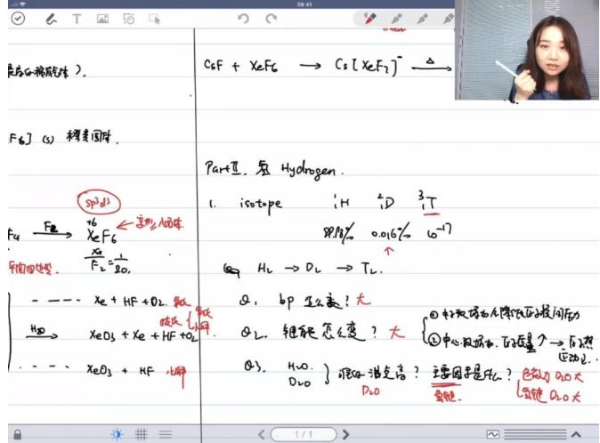

text_image

Fe₆] (1) 橡黄固体.
F₄ → Fe₂ + XeF₆ ← 黑色固体
→ Fe₂ = 1 / F₂ = 1/2₀. 
——— Xe + HF + O₂, 验
Hypo → XeO₃ + Xe + HF + O₂
——— XeO₃ + HF, 水解
CsF + XeF₆ → Cs[Fe₂F₇]⁻ → △
Part II. 氧 Hydrogen.
1. isotope H D T
89.9% 0.016% 0⁻¹⁷
① H₂ → O₂ → T₂.
② bp 玻离！大
③ 中性酸钾在降低氧化物间H₂O
④ 中性酸钾在防止氧量↑→后点燃
⑤ 运动。
⑥ 3. H₂O
D₂O } 很好湿失？
主要因是Fe₂？色动力 90 大
负键。 D₂O
① 化能：a₁₀ 大

# D2O特性：

- 沸点高于 $H_{2}O$ （核心因素：氢键增强）  
- 氢键增强机制：氘原子质量更大，热运动幅度更小

# 2. 氢化物类型 01:09:27

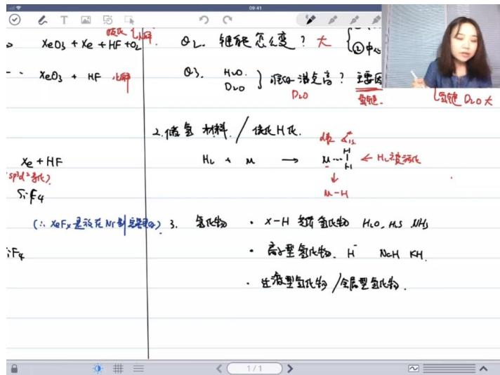

text_image

O2L. 锤能怎么变？大
①中心
O3. H2O.
D2O } 氢酸-混色亭？主要因
D2O
氢键
O2O大
2.储氢材料：/ 使化H化.
H4 + M → M-H ← H2被稀释
↓
M-H
Xe + HF
'spd²⁻系化)
Si·F4
(∴ XeFx是改花Nr制定基氧)
3. 氢化物 · X-H 氢钾氢氧化物 H2O, H2S NH3
· 高氢型氢化物、H⁺ NcH KH.
· 连溶型氢化物/金属型氢化物。

# ● 共价型氢化物：

○ 典型： $H_{2}O$ 、 $NH_{3}$ 、 $H_{2}S$   
○ 特征：与非金属元素形成共价键

# - 离子型氢化物：

○ 典型：NaH、KH   
○ 特征：含 $H^{-}$ 离子（hydride），显强碱性

# ● 金属型氢化物：

○ 形成机制：氢原子嵌入金属晶格  
- 特性：表现金属导电性（如储氢材料）

# 3. 储氢材料 01:12:54

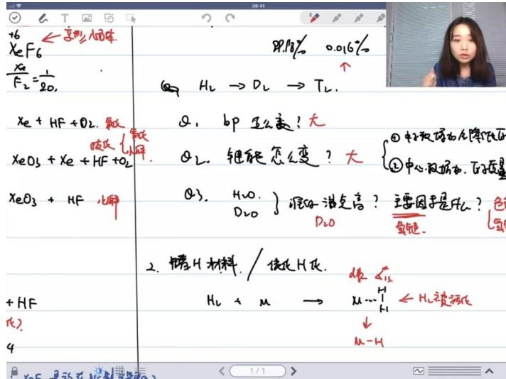

text_image

+6
XeF6 ← 弦形气体
89.1%
0.016%
H2 → D2 → T2.
Xe + HF + O2. 镀
Q1. bp 王么变？无
XeO3 + Xe + HF + O2
O2. 锯能怎么变？大
① 中子吸收为无降低压
② 中心吸收为无质量
XeO3 + HF 化解
Q3. H2O.
D2O 液水-液化氢？主要因求是H2？包
P2O
氧键.
2. 镀H材料 / 使光H2.
H2 + M → M-H ← H2被溶化
↓
M-H
+HF
(+)
4

# ● 活化机制：

○ 金属d轨道与 $H_{2}$ 反键轨道（ $\sigma^{*}$ ）相互作用  
○ 导致H-H键级降低（<1）甚至解离为氢原子

# - 两种吸附形式：

○ 分子吸附： $H_{2}$ 保持完整  
- 原子吸附：解离为H原子（更常见）

# 应用场景：

◦ 催化氢化反应（有机化学）  
- 新能源存储（需配合合适金属基质）

# ● 特殊形态：

\- 理论预测金属氢存在（高压条件下）

○ 过渡金属易形成非化学计量氢化物 $(MH_{x}, 0 < x < 1)$

# 四、碱金属01:16:14

# 1. 碱金属物理性质 01:17:06

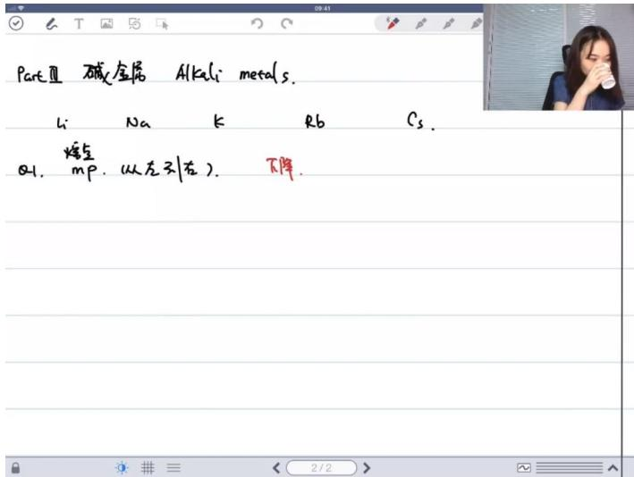

text_image

PartⅡ 碱金属 Alkali metals.
Li Na K Rb Cs.
熔点
Q1. mp. (以左引右). 下降.

\- 熔点趋势：从Li到Cs熔点逐渐下降（Cs熔点仅29℃），原因是：

金属键强度：碱金属只有一个价电子，金属键较弱，导致整体熔点偏低  
- 原子半径影响：随着原子半径增大，金属离子与电子云的连接作用减弱，升华能逐渐降低（Li→Cs升华能：161→79 kJ/mol）

text_image

Li
Na
K
Rb
①. 熔点
mp. (以左引右). 下降.
r
M(5)

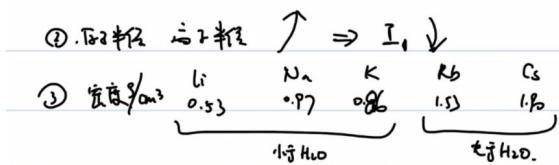

text_image

③.原子半径: 高工半径: ↑ ⇒ I₁↓
③ 宽度g/cm³ Li N₂ K Rb C₃
0.53 0.97 0.86 1.53 1.80
小于H₂O
电子H₂O.

# ● 密度特征：

○ Li(0.53g/cm³)、Na(0.97g/cm³)、K(0.86g/cm³)密度小于水  
○ Rb(1.53g/cm³)、Cs(1.90g/cm³)密度大于水  
总体趋势随原子质量增大而升高，但Na-K存在反常

# ● 电离能规律：

- 第一电离能从Li到Cs单调递减  
- 原子半径和离子半径均随原子序数增加而增大

# 2. 碱金属与水反应 01:23:35

text_image

①. 熔点
mp. (从左引右). 下降. r)

②.后半径 $\therefore$ 上半径 $\uparrow \Rightarrow I_{1} \downarrow$

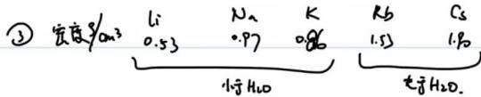

text_image

③ 宪度9/cm³ Li Ni K Rb Cs
0.53 0.97 0.86 1.53 1.90
小于H₂O
大于H₂O

④ M. + H $_{2}$ O. Li Na K Rb Cs
程和 巨烈 烧炼水反应
gently

2/2

# - 反应现象梯度：

○ Li: 温和反应  
○ Na/K：剧烈反应（金属球在水面快速移动）  
○ Rb/Cs: 爆炸性反应

# ● 关键影响因素：

- 密度决定反应位置：Rb/Cs沉入水中导致全面接触，而Li/Na/K浮于水面仅部分接触  
与金属性（电极电势）关联性较弱（Li:-3.04V, Na:-2.71V, K:-2.94V, Rb:-2.92V, Cs:-3.03V）

# 3. 电极电势分析 01:28:21

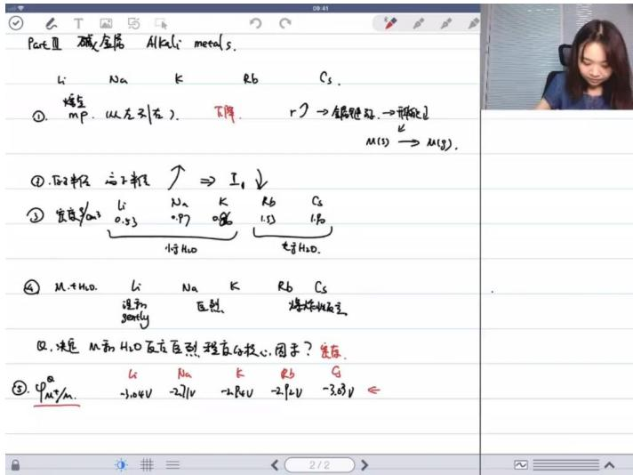

text_image

Part III 碱金属 Alkali metals.
Li Na K Rb Cs.
①.熔点
mp. (从左到右). 下降. r)→溶解剂.→稀释液
M(1) → M(g).
②.反应中反应下限 ↑ ⇒ I₁↓
③ 发展y(m) Li Na K Rb Cs
0.33 0.97 0.86 1.53 1.90
小于H₂O 等于H₂O.
④ M+H₂O. Li Na K Rb Cs
饱和 巨燃 焊核反应
searily
⑫.决定 M和H₂O反应直到程度的核心因素?
⑬ φₘ/% = Li Na K Rb G
-1.04V -2.71V -2.86V -2.92V -3.03V ←
2/2

● 热力学循环三要素：

- 升华能（吸热）：Li(161kJ/mol)>Na(109)>K(90)>Rb(86)>Cs(79)  
○ 电离能（吸热）：Li>Na>K>Rb>Cs  
○ 水合能（放热）： $Li^{+}>Na^{+}>K^{+}>Rb^{+}>Cs^{+}$ （与离子半径负相关）

# ● 电势反常解释：

○ Li的高水合能（小半径强极化）补偿了其高电离能  
○ Cs的低升华能部分抵消了其低电离能优势   
○ 最终电极电势呈现非单调变化： $\mathrm{Li}(-3.04\mathrm{V})\approx\mathrm{Cs}(-3.03\mathrm{V})>\mathrm{Na}(-2.71\mathrm{V})>\mathrm{K}(-2.94\mathrm{V})\approx\mathrm{Rb}(-2.92\mathrm{V})$

# 五、碱金属与水的反应01:33:56

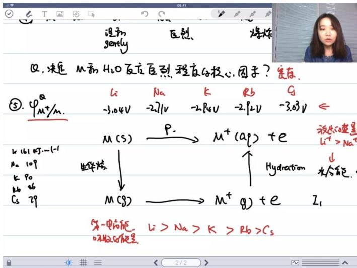

text_image

温和
gently
巨烈
炼炼
⑤. φM⁺/m.
Li Na K Rb G
-3.04V -2.71V -2.94V -2.92V -3.03V ≈
M (S) P. → M⁺ (aP) + e
生华炼
↓
Hydration ↓
水合能。
M (G) → M⁺ (g) + e I₁
第一电荷能 Li > Na > K > Rb > Cs
吸收的重量

# 1. 反应能量分析

# 1）升华能与电离能

● 能量PK机制：反应剧烈程度取决于升华能+电离能与水合能的能量对比关系

# - 半径影响规律：

\- 半径小的金属（如Li）：升华和电离需要能量多，但水合放出能量也多
- 半径大的金属（如Cs）：升华和电离需要能量少，水合放出能量也少

● 非线性能量转换：电极电势变化不是简单的线性关系

# 2）水合能 01:34:48

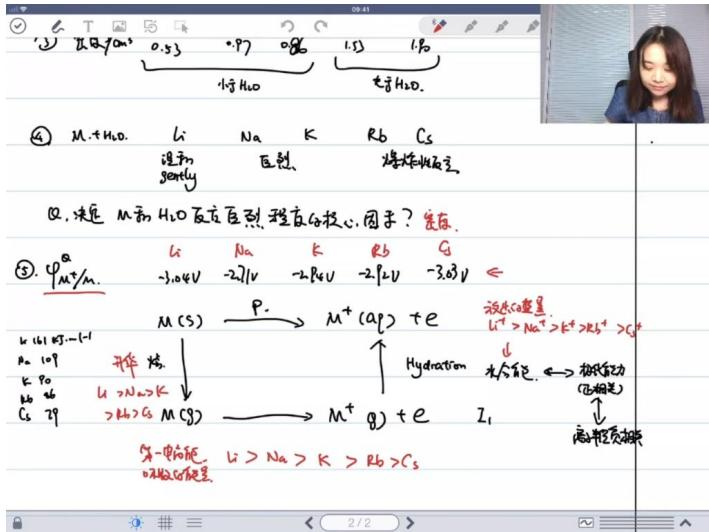

text_image

① 电池ρgm
0.53 0.97 0.86
小H2O
1.53 1.90
电子H2O.
④ M+H2O
Li Na K Rb Cs
饱和 直热 炼炼反应态
Q,决定 M和 H2O 反应巨烈程度的极心因子? 家庭.
⑤ φMg/m
Li Na K Rb S
-3.04V -2.71V -2.94V -2.92V -3.03V ←
M(S) P→ M+(ap)+e
↓ 气泡的重量
Li2 > Na2 > K2 > Rb2 > Cs2
U 161 kJ...(-1)
Pa 109
K Pa
Rb R6
Cs 79
升华 烯
U > Na2 > K
>Rb2 > Cs M(g)
↑ Hydration ↓
水合能,←→ 极级动能
(见相关)
Z1 ↑
离子电荷泵
第一电荷能 Li > Na > K > Rb > Cs
吸收电荷量

定义：离子与水分子结合时放出的能量  
● 变化规律：与离子半径呈负相关 $(Li^{+}>Na^{+}>K^{+}>Rb^{+}>Cs^{+})$   
● 能量对比：水合能需要与升华能+电离能进行综合比较

# 2. 离子半径影响 01:37:59

# 1）半径与能量关系

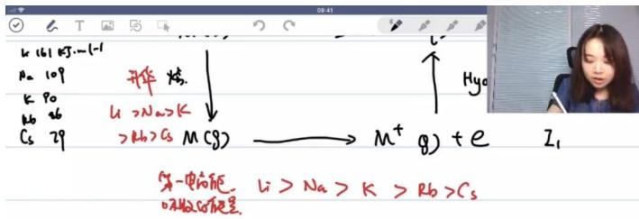

text_image

u 161 kJ = l⁻¹
Pₐ 109
K 90
Rb 46
Cs 29
开性烯.
u >Na >K
>Rb>Cs M (S)
→ M⁺ (g) + e I₁
第一电向能 Li > Na > K > Rb > Cs
不可取S的反应

⑥. 气原子位 $Li^{+}<Na^{+}<K^{+}$

易题. 12-c-4

2/2   
● 半径排序： $Li^{+}<Na^{+}<K^{+}<Rb^{+}<Cs^{+}$   
- 冠醚匹配：

○ $Li^{+}$ 匹配12-冠-4（12原子环含4个氧）  
○ $Na^{+}$ 匹配15-冠-5   
○ $K^{+}$ 匹配18-冠-6

● 应用实例：分子自组装的基础原理（诺贝尔奖相关研究）

2）电极电势变化 01:38:43

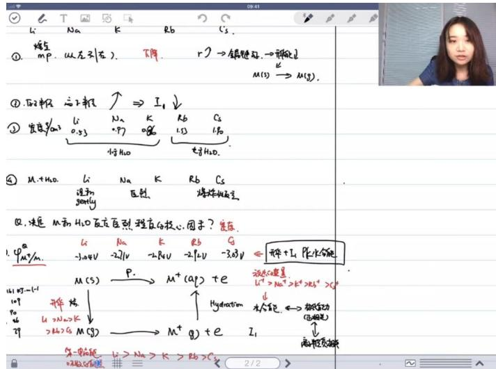

text_image

Li Na K Rb Cs.
① 烯气
mp. (从左三方向). 下降. r) → 错壁对. → 预化
M(S) → M(S).
② 压乙炔 后下相  ⇒ I₁↓
③ 发亮/g Na K Rb Cs
0.33 0.7 0.86 1.3 1.40
将H₂O 与H₂O.
④ M₁ + H₂O. Li Na K Rb Cs
饱和 压乙炔 焊体反应
gorfully 压乙炔
Ⅱ. 快速 M和H₂O反应互溶程度的核心, 因求? 质量.
P = a
-1.04V -2.7V -2.9V -3.0V ≪ 桶+I₁PK水合能
M(S) P → M⁺(aP) + e
升华：→
P: → M⁺(aP) + e
u > Na₂ > K² > Na₃² > C₆
u > N₂ > K → ↑ Hydration ↓
29 > Mg(S) → M⁺(g) + e I₁
离键变换
第一定律是: L₁ > Na₂ > K > Rb > Cs
2/2

电势排序： $Li(-3.04V) > Na(-2.71V) > K(-2.92V) > Rb(-2.92V) > Cs(-3.03V)$   
● 物理解释：

- 第一电离能： $Li > Na > K > Rb > Cs$   
- 极化能力：与离子半径直接相关   
○ 金属键强度：原子半径决定升华能大小

# 六、碱金属物理性质 01:43:37

1. 第一电离能

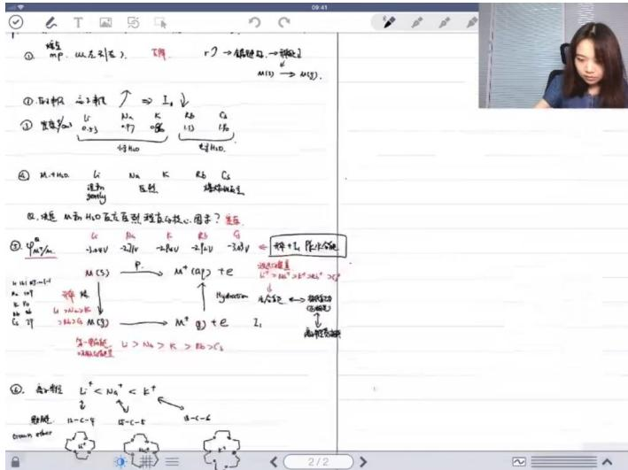

text_image

① 燃生
mp. (从左引右). 下降 r) → 错酸钙 → 钾酸钾
M(1) → M(2).
① 后中仅 之二机 ↑ => I₁↓
② 发泡/ha: U N₂ K Rb Ca
47h100 0.3 -17 0.6 13 15
H₂ + H₂O.
③ H₂ + H₂O ⇄ Na K Rb Cs
还原 压缩 增强的退火
④ 液速 从高、H₂O变为剧烈，提高各核心固态？高压。
⑤ 甲⁺⁰
Mg/H₂O
-1.0kV -2.7kV -2.8kV -2.9kV -3.0kV ← 平+L₁ 长水溶解
M(S) P → M⁺(Ag) + e⁻¹
↑ Hydroxide m
u + H₂O ⇄ H₂O + Ag
u + H₂O ⇄ H₂O + Ag
→ H⁺(S) + e⁻¹
I₁
⑥ 后中性
L > Na > K > Ag > C₆
⑦ 后中性
L < Na < k⁺
电极：n-c-y 15-c-l 1-b-c-6
⑧ 公司其他

● 电离能趋势：碱金属第一电离能随原子序数增大而减小，顺序为 $Li^{+}>Na^{+}>K^{+}>Rb^{+}>Cs^{+}$   
- 反应剧烈程度：与 $H_{2}O$ 反应的剧烈程度由电离能决定，电离能越小反应越剧烈（如Cs遇水会剧烈爆炸）  
● 水合能影响：金属离子水合能 $M^{+}(g)\rightarrow M^{+}(aq)$ 释放能量与电离能呈正相关关系

# 2. 极化能力 01:48:24

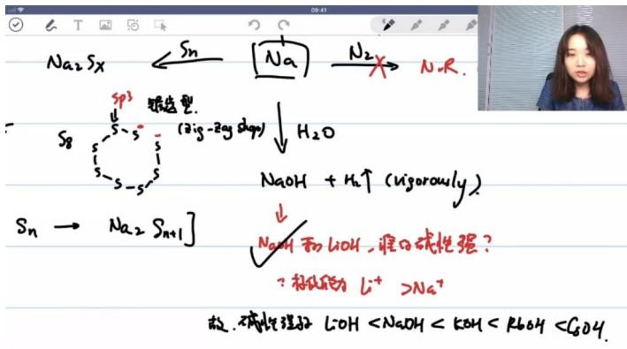

text_image

Na₂Sₓ ← Sn → Na₂N₂R.
→
sp³ 铣造型.
s⁻¹ s⁻¹ (zig - 2gy deg)
s⁻¹ s⁻¹
Sn → Na₂Sn+1]
NaOH + H₂↑ (vigorously)
↓
NaOH 和 LiOH，羟口碱性强？
? 粘状能为 Li⁺ > Na⁺
故，碱性理好 LiOH < NaOH < KOH < RbOH < C₆O₄。

碱性强度规律： $LiOH < NaOH < KOH < RbOH < CsOH$ ，氢氧化锂碱性最弱  
- 极化作用解释： $Li^{+}$ 离子半径小、电荷密度高，对 $OH^{-}$ 的极化能力强，削弱O-H键程度大  
- 典型数据：氢氧化铝 $K_{b} = 0.675$ ，但更需记忆碱性趋势而非绝对值  
- 应用实例：解释LiBr比NaBr更易吸水形成水合物（如 $LiX\cdot3H_{2}O$ ， $X=Cl,Br,I$ ）

# 3. 吸水盐判断 01:49:46

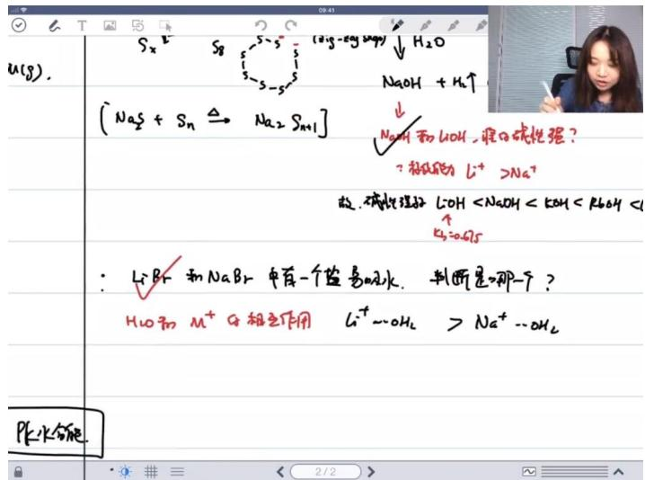

text_image

u(g).
Sx Sg S-3 (zig-ery map) H2O
NaOH + H↑
[NaS + Sn → Na2Sn+1] ↓
NaOH 和 LiOH, 避口纯性强?
= 相应能 Li+ > Na2+
故, 确性理好 LiOH < NaOH < KOH < RbOH <
K=0.675
LiBr 和 NaBr 中有一个盐易喝水, 判断是哪一个 ?
H2O 和 M+ Q 相应作用 Li+ ~ OH2 > Na+ ~ OH2
Pk水合能

● 判断依据： $Li^{+}$ 水合能显著大于 $Na^{+}$ （ $Li^{+}\cdot OH_{2}>Na^{+}\cdot OH_{2}$ ）  
- 结晶水形成：LiX易形成三水合物 $LiX\cdot3H_{2}O$ ，源于 $Li^{+}$ 强极化能力  
● 实验现象：钠溶于液氨形成深蓝色溶液（稀溶液），浓溶液呈青铜色，最终生成氨基钠和氢气  
● 特殊反应：在乙二胺溶液中可形成 $Na^{-}$ 负离子，证明碱金属可获得电子

# 七、碱金属氧化物反应 01:55:48

1. 钠与氧气 01:55:51

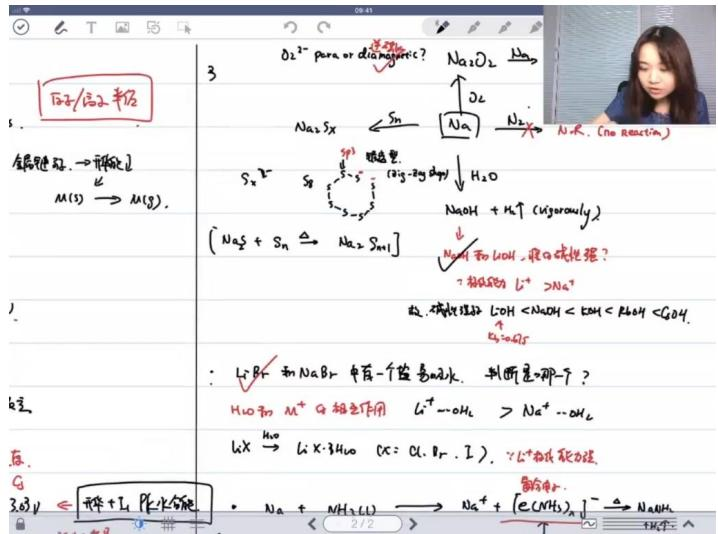

text_image

O22- para or diagnostic? Na2O2 Na2
Na2Sx Sn Na N2x N.R. (no reaction)
Sx2 Sx 5-S 5-S (zig-2g dpp) H2O
[NaS + Sn △ Na2Sn1] NaOH + H2↑ (ugorously)
↓ NaOH 和 LiOH，使口碱性强？
: 钼酸钠 Li+ >Na+
故，碱性强？ LiOH < NaOH < KM < RbOH < GdOH.
LiBr 和 NaBr 中有一个盐水，判断是否哪一个？
H2O 和 M+ △ 相交作用 Li+ ~OH2 > Na+ ~OH4
LiX → LiX·3H2O (C= Cl、Br、I)，? Li+ 气化能力强
3OH ⇌ 桶水 + Li Pk水合能
Na + NH2(L) → Na+ + [e(NH3)2]− → NaNH4
2/2

- 反应产物: 钠与氧气反应生成过氧化钠( $Na_{2}O_{2}$ ), 英文名称为sodium peroxide  
● 反应条件：常温下即可反应，区别于锂生成氧化锂 $(Li_{2}O)$   
● 与水反应：

○ 冷水中： $Na_{2}O_{2} + H_{2}O \rightarrow NaOH + H_{2}O_{2}$   
◦ 加热时：进一步分解为 $NaOH + O_{2}\uparrow$

● 碱性比较: LiOH < NaOH < KOH < RbOH < CsOH, 随原子序数增大碱性增强

2. 钾与氧气 01:56:20

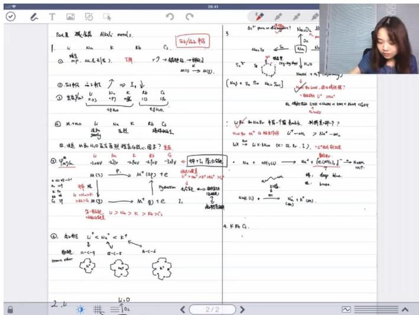

text_image

Fe₂O₄: 碱/Fe₂O₄ Alkali; 10H₂/Fe₂O₄
① Fe₂O₄ (p) → H₂O₄ (p)
② Fe₂O₄ (p) ⇌ H₂O₄ (p)
③ Fe₂O₄ (p) ⇌ H₂O₄ (p)
④ Fe₂O₄ (p) ⇌ H₂O₄ (p)
B. 连速: 100 mL/L 20 ml/100 ml 气化物-溶解性物质(图示):
① Fe₂O₄ (p) ⇌ H₂O₄ (p)
② Fe₂O₄ (p) ⇌ H₂O₄ (p)
③ Fe₂O₄ (p) ⇌ H₂O₄ (p)
④ Fe₂O₄ (p) ⇌ H₂O₄ (p)
⑤ Fe₂O₄ (p) ⇌ H₂O₄ (p)
⑥ Fe₂O₄ (p) ⇌ H₂O₄ (p)
⑦ Fe₂O₄ (p) ⇌ H₂O₄ (p)
⑧ Fe₂O₄ (p) ⇌ H₂O₄ (p)
⑨ Fe₂O₄ (p) ⇌ H₂O₄ (p)
⑩ Fe₂O₄ (p) ⇌ H₂O₄ (p)
⑪ Fe₂O₄ (p) ⇌ H₂O₄ (p)
⑫ Fe₂O₄ (p) ⇌ H₂O₄ (p)
⑬ Fe₂O₄ (p) ⇌ H₂O₄ (p)
⑭ Fe₂O₄ (p) ⇌ H₂O₄ (p)
⑮ Fe₂O₄ (p) ⇌ H₂O₄ (p)
⑯ Fe₂O₄ (p) ⇌ H₂O₄ (p)
⑰ Fe₂O₄ (p) ⇌ H₂O₄ (p)
⑱ Fe₂O₄ (p) ⇌ H₂O₄ (p)
⑲ Fe₂O₄ (p) ⇌ H₂O₄ (p)
⑳ Fe₂O₄ (p) ⇌ H₂O₄ (p)
⑴ Fe₂O₄ (p) ⇌ H₂O₄ (p)

● 超氧化物：钾、铷、铯与氧气反应生成超氧化物 $(MO_{2})$ ，英文名superoxide  
● 与水反应： $MO_{2} + H_{2}O \rightarrow MOH + O_{2}\uparrow + H_{2}O_{2}$ ，最终产物为氢氧化物和氧气  
● 反应剧烈程度：从锂到铯与水反应剧烈程度递增，铯与水反应具有爆炸性

# 八、多硫化物性质 01:58:26

# 1. 硫链结构

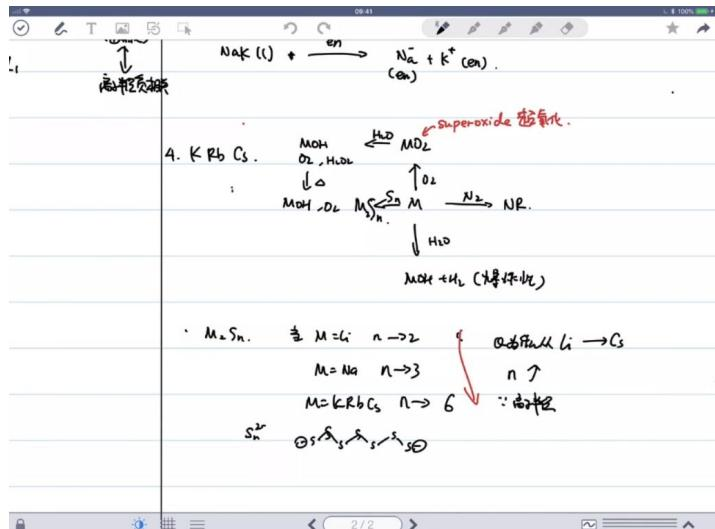

text_image

NaK (1) + → Na⁺ + K⁺ (en).
(En)
高半烷交换
Superoxide 气相氧化
4. K Rb Cs.
↑ O₂, H₂O₂
↓
↑ O₂
↓ MOH₂O₂ M₅S₂₀ M → N₂ → NR.
↓ H₂O
MOH + H₂ (绿体化)
M₂Sₙ.
↑ M = Li n → 2
M = Na n → 3
M = K Rb C₃ n → 6
S₂ⁿ
②为氢从 Li → C₃
n ↑
∵ 高半烷
③S₂Sₙ→S₂Sₙ→S₂Sₙ

● 结构特征：多硫化物 $(M_{2}S_{n})$ 中硫原子呈锯齿形链状排列，两端带负电荷

\- n值规律：

○ 锂多硫化物： $n \approx 2$   
○ 钠多硫化物：n≈3   
○ 钾/铷/铯多硫化物：n≈6

● 实际状态：实际为不同链长硫化物的混合物，n值为平均值

# 2. 离子半径影响 02:00:04

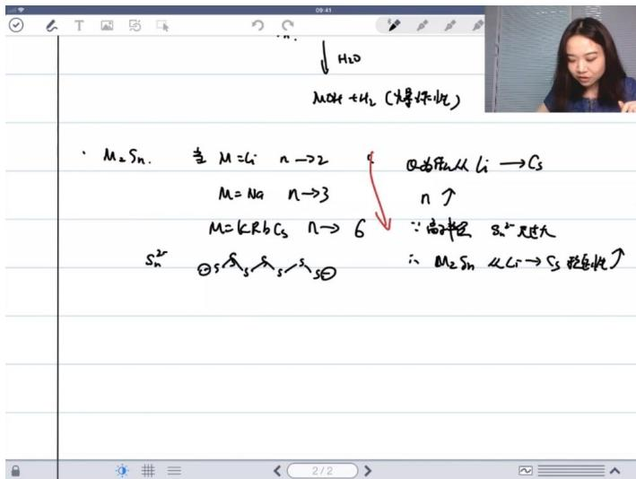

text_image

H2O
MnOH + H2 (干燥性)
· M2Sn. ⅔ M = Li n → 2
      M = Na n → 3
      M = K R b C s n → 6
S²ₙ ② S₅S₅S₅S₅S₅S₅S₅S₅S₅S₅S₅S₅S₅S₅S₅S₅S₅S₅S₅S₅S₅S₅S₅S₅S₅S₅S₅S₅S₅S₅S₅S₅S₅S₅S_5
①为Fe从Li→Cs
n↑
∵高程 8-10元
∴M2Sn从Cr→Cs(反应性)

● 稳定性规律：从Li到Cs多硫化物稳定性递增， $Cs_{2}S_{n}$ 最稳定  
● 关键因素：金属离子半径与 $S_{n}^{2-}$ 阴离子大小的匹配程度

\- 较大阳离子 $(Cs^{+})$ 能更好稳定较大的多硫阴离子

○ 小半径 $Li^{+}$ 难以稳定长硫链结构

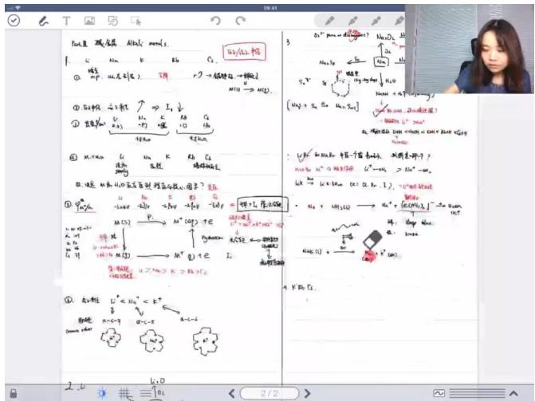

text_image

Porel  碱金量: AlkO₃⁻ monol.
① C H₂ N K H₂ O
② 玻璃 → H₂O₃⁻ (H₂O₃) → H₂O
③ H₂O₃⁻ ⇌ H₂O₃⁻ (H₂O₃) → H₂O
④ H₂O₃⁻ ⇌ H₂O₃⁻ (H₂O₃) → H₂O
⑤ 气泡 → H₂O₃⁻ (H₂O₃) → H₂O
⑥ 气泡 → H₂O₃⁻ (H₂O₃) → H₂O
⑦ 气泡 → H₂O₃⁻ (H₂O₃) → H₂O
⑧ 气泡 → H₂O₃⁻ (H₂O₃) → H₂O
⑨ 气泡 → H₂O₃⁻ (H₂O₃) → H₂O
⑩ 气泡 → H₂O₃⁻ (H₂O₃) → H₂O
⑪ 气泡 → H₂O₃⁻ (H₂O₃) → H₂O
⑫ 气泡 → H₂O₃⁻ (H₂O₃) → H₂O
⑬ 气泡 → H₂O₃⁻ (H₂O₃) → H₂O
⑭ 气泡 → H₂O₃⁻ (H₂O₃) → H₂O
⑮ 气泡 → H₂O₃⁻ (H₂O₃) → H₂O
⑯ 气泡 → H₂O₃⁻ (H₂O₃) → H₂O
⑰ 气泡 → H₂O₃⁻ (H₂O₃) → H₂O
⑱ 气泡 → H₂O₃⁻ (H₂O₃) → H₂O
⑲ 气泡 → H₂O₃⁻ (H₂O₃) → H₂O
⑳ 气泡 → H₂O₃⁻ (H₂O₃) → H₂O
⑴ 气泡 → H₂O₃⁻ (H₂O₃) → H₂O
⑵ 气泡 → H₂O₃⁻ (H₂O₃) → H₂O
⑶ 气泡 → H₂O₃⁻ (H₂O₃) → H₂O
⑦ 气泡 → H₂O₃⁻ (H₂O₃) → H₂O
⑧ 气泡 → H₂O₃⁻ (H₂O₃) → H₂O

● 反应活性趋势：Li < Na < K < Rb < Cs，随原子序数增大反应活性增强  
● 第一电离能：从Li到Cs逐渐减小，与反应活性趋势一致

# 九、碱土金属性质02:12:38

# 1. 金属键强度

1）金属键强度与金属性质的关系 02:12:50

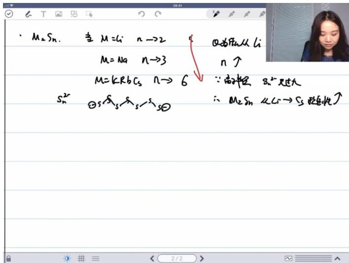

text_image

M₂Sₙ. ⅔ M=Li n→2
      M=Na n→3
      M=KRCs n→6
Sₙ²⁻ ②s⁻⁰.⁵s⁻¹.⁵s⁻¹
            ∵ 高分子  8n²⁺无过大
            ∴ M₂Sₙ 从Li→Cs转变化↑

- 硬度与熔沸点：碱土金属（ $2s^{2}$ 电子构型）的金属键强度显著高于碱金属，导致其硬度和熔沸点都大于碱金属  
- 离子半径影响： $S_{n}^{2-}$ 离子半径过大时， $M_{2}S_{n}$ 化合物（如Li2S）会呈现特殊性质

2）氢氧化钾与水的反应及臭氧反应 02:13:04

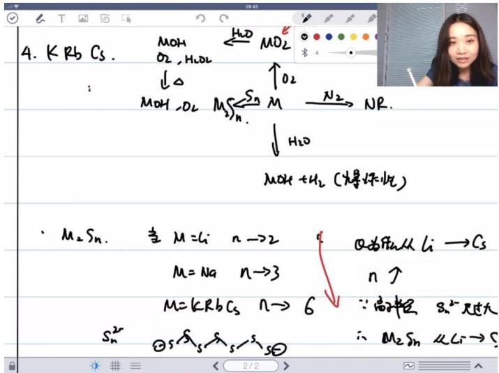

text_image

4. K RB Cs.
↓△
↑O₂
↓H₂O
MnS←Sn M → NR.
↓H₂O
MnH + H₂ (爆炸性)
· M₂Sn.
½ M = Li n → 2
M = Na n → 3
M = K RB Cs n → 6
Sₙ²⁻
⊙ SₙSₙSₙSₙ
○为Cu从Li→Cs
n↑
∵ 高分子 Si²⁻无过失
∴ M₂Sn ← Li → S

- 爆炸性反应：氢氧化钾（KOH）与水反应会爆炸性生成氢氧化钾溶液和氢气（ $H_{2}$ ）  
● 臭氧反应：固体氢氧化钾与臭氧（ $O_{3}$ ）反应会生成氧化物并放出氧气

3）金属有机化合物概述 02:13:50  
● 性价比学习：格林伍德教材虽全面但内容过多，建议第二轮复习时作为拓展阅读  
● 反应特殊性：某些金属有机反应（如钾与水反应）具有奇特性质，了解主要反应即可  
4）金属有机锂化合物的制备与性质 02:14:00

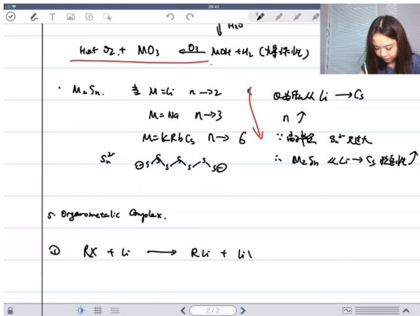

text_image

H2O
H2O + O2 + MO3 ⇌ O3 + NH4 + H2 (爆炸性)
· MnSn. ⅓ M = Li n → 2
      M = Na n → 3
      M = K Rb Cs n → 6
Sn²⁺ ⇌ S₂Sₙ ⇌ S₃S₂S₄
s. Organometallic ampolarx.
① Rx + Li → RLi + Li

● 制备方法：通过卤素交换反应制备（ $RX + Li \rightarrow RLi + LiX$ ，X=Cl/Br），机理为单电子转移  
● 键的性质：碳锂键（C-Li）电负性差1.6（C=2.5，Li=0.9），属于离子-共价混合键

5）金属有机化合物的结构分析 02:15:31

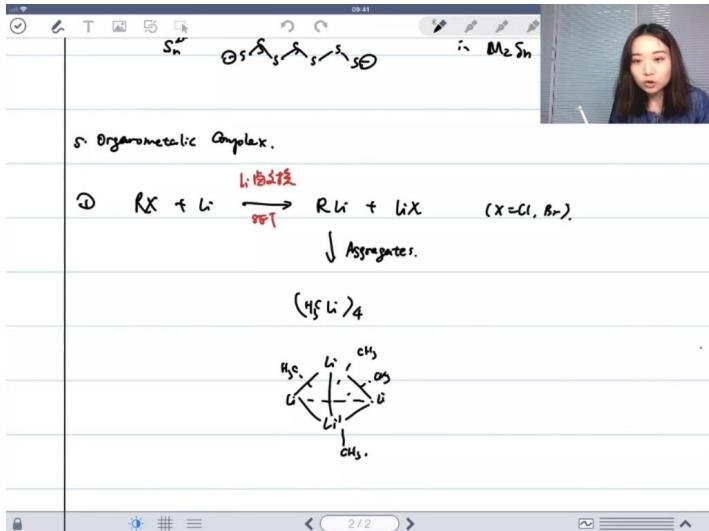

chemical

Chemical reaction diagram showing organometallic amplexity with Li and Li+ ions, forming a lithium complex (HfLi)4

\- 四聚体结构：甲基锂通常形成四聚体（ $[LiCH_3]_4$ ），具有四面体结构（Td点群）

每个面形成 $\pi$ 键（ $\pi 4^{2}$ ），每个面贡献1个电子（3个Li共贡献3个电子，均摊到4个面）

- 六聚体结构：乙基锂形成八面体六聚体，仍保持 $\pi 4^{2}$ 电子构型  
● 平衡体系：丁基锂存在四聚体和六聚体的动态平衡

6）碱土金属与碱金属的性质对比 02:21:02

● 金属键差异：碱土金属（2价）金属键强度显著高于碱金属（1价）  
● 有机化合物：钠可与有机化合物反应生成具有芳香性的环戊二烯基负离子（CP $^{-}$ ）

2. 碳酸盐稳定性 02:22:43

1）碱土金属碳酸盐的热稳定性 02:22:52

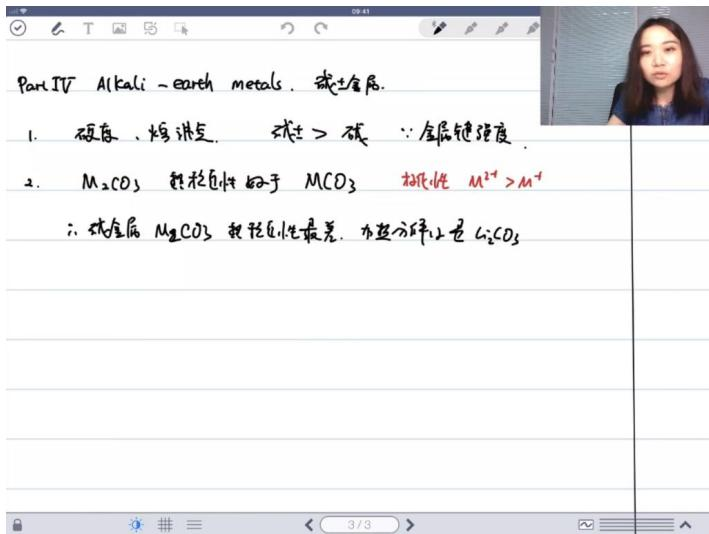

text_image

Part IV Alkali - earth metals. 碳基金属
1. 硬存、熔沸气. 碳 > 碳 ∴ 全层键强度
2. M₂CO₃ 熔粒化性弱于 MCO₃ 挑化性 M²⁺ > M⁻¹
∴ 碳金属 MgCO₃ 熔粒化性最差. 加热分解比是 Li₂CO₃

- 极化作用： $M^{2+}$ 极化能力> $M^{+}$ ，更容易使 $CO_{3}^{2-}$ 分解为 $CO_{2}$   
● 稳定性顺序：碱金属碳酸盐热稳定性 > 碱土金属碳酸盐

2）碱金属与碱土金属碳酸盐热稳定性的比较 02:23:57

● 分解温度：碱土金属碳酸盐分解温度普遍低于碱金属碳酸盐

● 晶格能影响：二价离子晶格能更大，但极化效应占主导地位

3）碱金属碳酸盐的热分解特性 02:24:32

● 一般性质：大多数碱金属碳酸盐（如 $Na_{2}CO_{3}$ ）加热不分解

● 特殊现象：氧化钠在空气中会自发吸水并吸收 $CO_{2}$

4）碳酸锂的特殊性 02:25:34

● 唯一分解： $Li_{2}CO_{3}$ 是唯一加热会分解的碱金属碳酸盐（ $Li_{2}CO_{3}\rightarrow Li_{2}O+CO_{2}$ ）

● 原因分析：锂离子半径小，极化能力接近碱土金属

# 3. 极化性比较 02:25:59

1）碱土金属卤化物的极化性 02:26:02

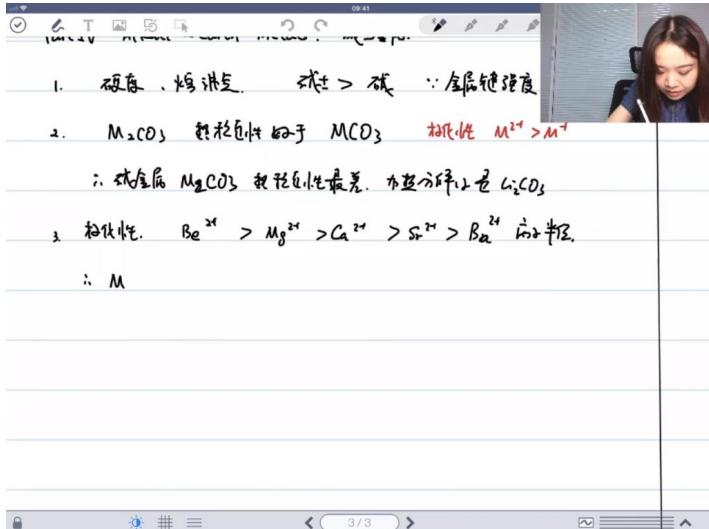

text_image

1. 硬度、熔沸气、碱 > 碱 ∵金属键强度
2. M₂CO₃ 熔粒特性好于 MCO₃ 桌比性 M²⁺ > M⁻¹
∴ 硫金属 MgCO₃ 熔粒特性最差，加热分解比是 Li₂CO₃
3. 松化性：Be²⁺ > Mg²⁺ > Ca²⁺ > Sr²⁺ > Ba²⁺ 的半位
∴ M

- 极化性排序： $Be^{2+} > Mg^{2+} > Ca^{2+} > Sr^{2+} > Ba^{2+}$ ，铍的极化性最强，因其离子半径最小  
● 共价性表现：只有 $BeX_{2}$ （如 $BeCl_{2}$ ）显共价性，其他碱土金属卤化物主要显离子性

2）二氯化铍的分子构型与杂化方式 02:26:51

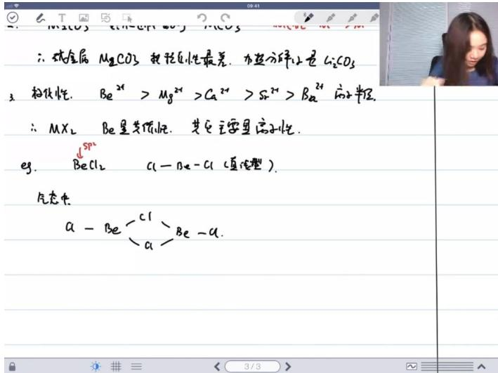

text_image

∴ 硫金属 MgCO₃ 振轻性最差，加热分解比是 Li₂CO₃
粒状性. Be²⁺ > Mg²⁺ > Ca²⁺ > Sr²⁺ > Ba²⁺ 应水半压.
∴ MX₂ Be 是共价性. 其它主要是离子性.
eg. BeCl₂ Cl - Be - Cl (直接型).
气态中.
a - Be < Cl / a > Be - a.

● 气态构型：单体 $BeCl_{2}$ 为直线型，中心铍原子采用sp杂化  
● 特殊性质：不符合八隅体规则，通过价层电子对互斥理论可解释其直线型结构  
● 固态结构：形成二聚体 $(BeCl_{2})_{2}$ ，铍原子采用 $sp^{3}$ 杂化，呈现链状结构

3）极化能力与电荷、半径的关系 02:28:17

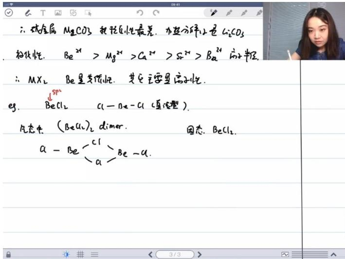

text_image

∴ 氨金属 MgCO₃ 轻轻化性最差. 有盐分界比是 Li₂CO₃
相化性. Be²⁺ > Mg²⁺ > Ca²⁺ > Sr²⁺ > Ba²⁺ 的子半径.
∴ MX₂ Be 是苯价忆. 其它主要呈离子性.
eg. BeCl₂ Cl - Be - Cl (连续型).
气态中 (BeCu₂)₂ dimer. 因态. BeCl₂.
a - Be < cl > Be - a.
3/3>

\- 决定因素：电荷越高、半径越小，极化能力越强

- 极化效应：极化能力指使其他粒子电荷分布不均匀的能力，与被极化性（自身受外界影响能力）不同  
● 典型例子： $Li^{+}$ 因半径极小，水合能强，对氧的极化能力显著

4）极化性与共价性的关系 02:29:54

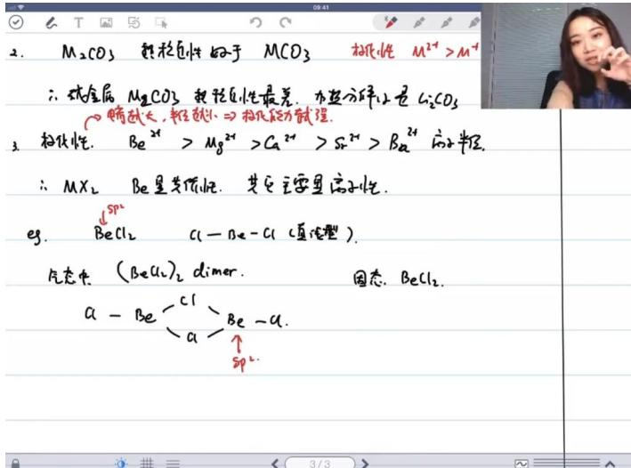

text_image

2. M₂CO₃ 熬粒化性好于 MCO₃ 桡核性 M²⁺ >M⁻¹
∴ 染金属 MgCO₃ 熬粒化性最差，为盐分子上是 Li₂CO₃
→ 起始大，半径就小 ⇒ 桡核能为凝墨。
3. 桑核性. Be²⁺ > Mg²⁺ > Ca²⁺ > Sr²⁺ > Ba²⁺ 后水半位.
∴ MX₂ Be 显芳烃化. 其它主要是离子性.
eg. BeCl₂ Cl - Na - Cl (直线型).
气态中 (BeCl₂)₂ dimer. 因态. BeCl₂.
a - Be <^c1/a> Be - a.
↑
sp².

● 作用机制：阳离子极化能力强时，会将已给阴离子的电子重新"拽回"，使电子对位于两原子之间  
● 键型转变：本应形成离子键的化合物（如 $BeCl_{2}$ ）因强极化作用展现共价性特征

5）离子键与共价键的本质差距 02:30:14

- 离子键特征：电负性差异大时，电子完全转移形成正负离子  
● 共价键特征：电负性差异较小时，电子对共享于原子之间  
● 过渡状态：极化作用可使本应离子性的化合物呈现部分共价性

6）二氯化铍的共价性表现 02:31:05

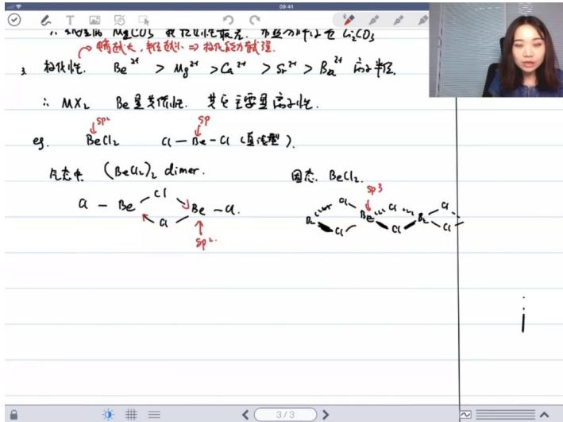

text_image

∴ 2H₂=NH₃CO₃ 氨CH₄OH 聚光, 为逆变体键, 为正能键. G₂CO₃
→ 睡破大, 氨CH₄OH → 相应能力减缓.
1. 相化性: Be²⁺ > Mg²⁺ > Ca²⁺ > Sr²⁺ > Ba²⁺ 后子中位.
∴ MX₂ Be 是共轭化. 其它主要是离子化.
eg. BeCl₂ Cl - Be-Cl (直连型).
气态: (BeCl₂)₂ dimer.
固态: BeCl₂.
a - Be⁻¹ → Be - a.
sp⁴.
sp³
a⁻¹ → b⁻¹ → c⁻¹
sp².

● 配位键形成：固态 $BeCl_{2}$ 中，氯的孤对电子填入铍的空轨道形成配位共价键  
● 杂化变化：气态sp杂化（直线型）→固态 $sp^{3}$ 杂化（链状结构）  
● 结构特点：固态呈现桥键结构，类似后续学习的铝化合物结构特征

# 十、碱土金属反应02:32:52

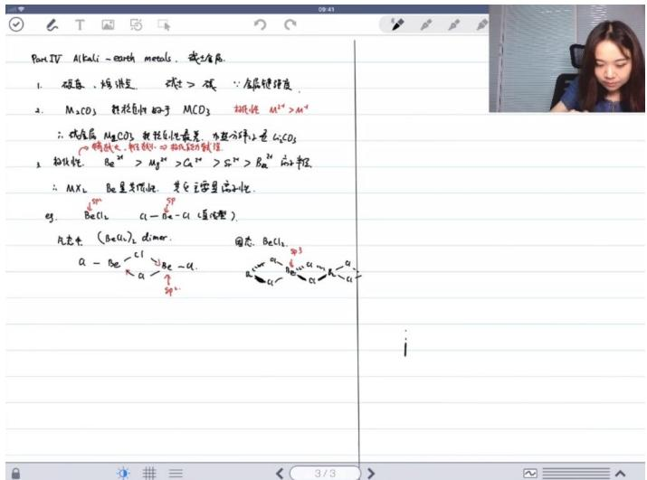

text_image

Part IV Alkali - earth metals. 成立体系
1. 碳基、熔块变  碱基 > 碱  ∴ 含量键密度
2.  \( \mathrm{M}_{\alpha}\mathrm{CO}_{3} \)  氧积物和离子  \( \mathrm{M}_{\alpha}\mathrm{CO}_{3} \)  框核化  \( \mathrm{M}^{2+} > \mathrm{M}^{-} \) 
∴ 碱金属  \( \mathrm{MgCO}_{3} \)  氧性活性最强，为盐酸水和少量  \( \mathrm{C}_{12}\mathrm{CO}_{3} \) 
    硝酸氢、钙酸氢 ⇌ 钼酸钠的制备
3. 粗化性  \( \mathrm{Be}^{2+} > \mathrm{Mg}^{2+} > \mathrm{Ca}^{2+} > \mathrm{Si}^{2+} > \mathrm{Ba}^{2+} \)  去子体积
∴  \( \mathrm{MX}_{2} \)   \( \mathrm{BeO} \)  是氧饱和，其它主要氧碳体积.
eg.  \( \mathrm{BeCl}_{2} \)   \( a-\mathrm{Ba}-a \)  (直径整).
凡老:  \( (\mathrm{BaCl}_{2})_{2} \)  dimer.
    回态:  \( \mathrm{BeCl}_{2} \) .
    a - Be - Cl → Be - a.
    ↑
    □
3/3

●

● 硬度特性：碱土金属比碱金属更硬，主要由于金属键强度更高。  
- 碳酸盐稳定性： $M_{2}CO_{3}$ 型碳酸盐稳定性优于 $MCO_{3}$ 型，且 $M^{2+}$ 离子半径越小（如 $Be^{2+}$ ）对应的碳酸盐稳定性越差。  
- 极化能力顺序: $Be^{2+} > Mg^{2+} > Ca^{2+} > Sr^{2+} > Ba^{2+}$ , 其中 $BeCl_{2}$ 为共价化合物（直线型结构），固态时 $[Be_{2}Cl_{4}]$ 。

# 1. 与氮气反应

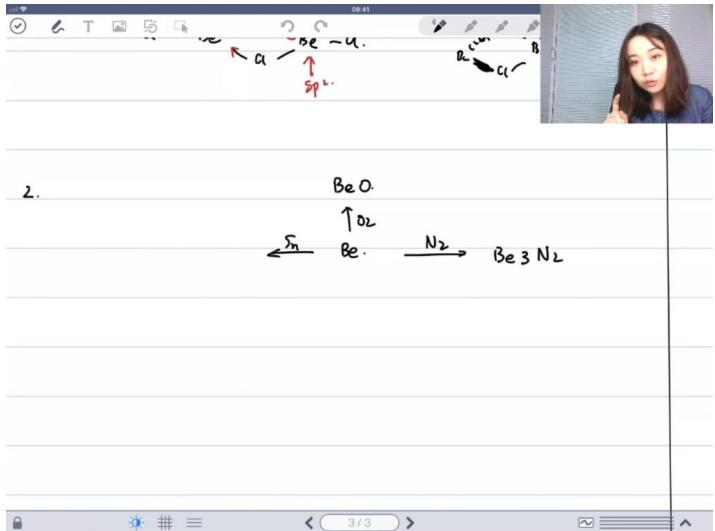

text_image

Be-O
↑O₂
Be. → N₂ → Be₃N₂

●

● 反应通式：碱土金属与氮气反应生成氮化物，如 $3Be + N_{2} \rightarrow Be_{3}N_{2}$ 。  
● 保护气体选择：许多金属能与氮气反应，因此保护气体需谨慎选择（如氩气）。  
● 对角相似性：镁与锂性质相似（对角现象），均可与氮气反应。

# 2. 与碳反应 02:33:58

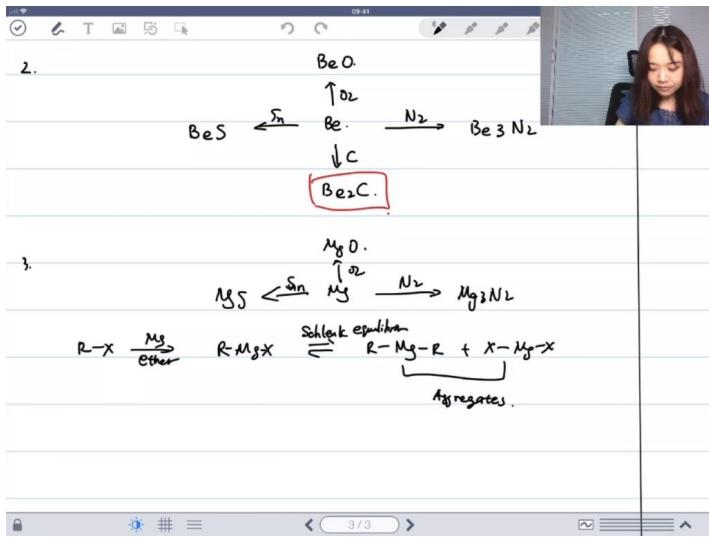

chemical

Chemical reaction diagram showing transformation of BeS with Sn and BeO with N2 to Be3N2, followed by reduction to Be2C, then to MgO and MgS with Sn and N2 to form Mg3N2 and R-X/ether.

# ● 产物差异:

○ 铍生成 $Be_{2}C$ （共价性显著）  
○ 钙生成 $CaC_{2}$ （乙炔化物）  
○ 镁碳化物具体结构需查证（可能为丙二烯镁）

● 水解特性： $CaC_{2}$ 遇水生成乙炔， $Be_{2}C$ 水解生成甲烷。

# 3. 水解反应 02:38:03

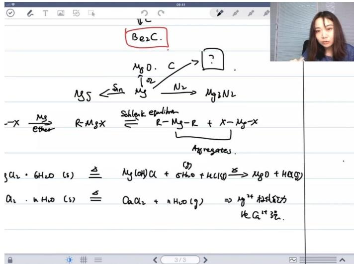

chemical

Chemical reaction equations and molecular structures for magnesium hydroxide and calcium carbonate, including electron transfer and ion exchange steps

# 氯化物水解：

○ $CaCl_{2}\cdot6H_{2}O$ 加热脱水生成无水 $CaCl_{2}$   
○ $MgCl_{2}\cdot6H_{2}O$ 加热水解生成 $\mathrm{Mg(OH)Cl}$ ，最终得 MgO  
- 原因分析: $Be^{2+}$ 极化能力极强, $BeCl_{2}$ 在水中完全水解。

# - 氢化物性质:

○ $BeH_{2}$ 为共价型氢化物  
○ 其他碱土金属氢化物（ $MgH_{2}$ 等）为离子型  
○ 遇水反应： $MH_{2} + 2H_{2}O \rightarrow M(OH)_{2} + H_{2}\uparrow$

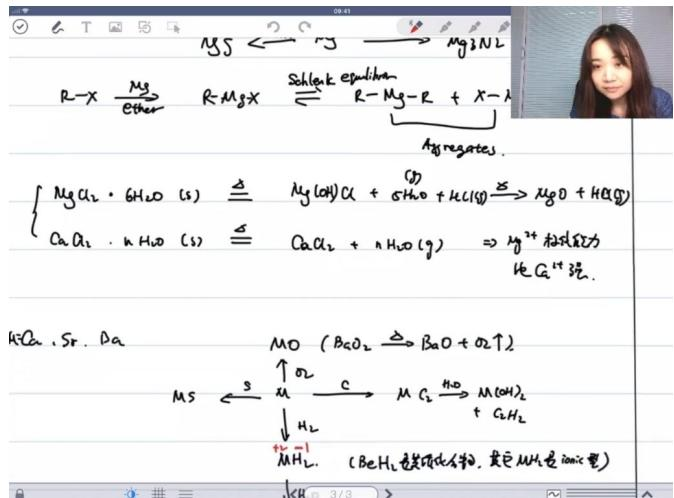

chemical

Chemical reaction equation involving magnesium chloride and calcium carbonate with water, showing species and reaction conditions

● 碱性顺序: $Be(OH)_{2} < Mg(OH)_{2} < Ca(OH)_{2} < Sr(OH)_{2} < Ba(OH)_{2}$   
● 理论解释：离子半径增大→ $M^{2+}$ 与 $OH^{-}$ 作用减弱→更易解离出 $OH^{-}$

# 4. 重要化合物

text_image

↓H₂O
M(OH)₂ + H₂↑

$H_{12}$ 碱化 $Be \rightarrow Ba$ . 证明 or 变好? $m^{2+}$ 半径

$CaSO_{4} \cdot 2H_{2}O$ 生态 $2CaSO_{4} \cdot H_{2}O$ 熬石

BaSO4 钡铬. 白色难熔盐. ∴也可作为白漆@石料.

$M{F}_{2}$ ${M}^{2 + }$ 从而心. 主心点堆积。 ${F}^{ - }$ 填回两件总重

问 四酮清除必须充分是多少. 100%.

3/3

\- 硫酸钙：

○ 生石膏： $CaSO_{4}\cdot2H_{2}O$   
○ 熟石膏： $2CaSO_{4}\cdot H_{2}O$ （加水硬化）

\- 硫酸钡：

○ 钡餐用途（X光造影）  
- 难溶原因： $Ba^{2+}$ 与 $SO_{4}^{2-}$ 半径匹配良好

● 溶解性对比: $BaSO_{4} < CaSO_{4}$ (微溶)   
- 氟化物晶体结构：

○ 面心立方密堆积（如 $MF_{2}$ ）

四面体空隙填充率100%时形成闪锌矿结构

# 十一、综合问题分析02:48:58

1. 碳酸盐溶解性 02:49:18

1）碱金属碳酸盐溶解性

- 碳酸氢钠与碳酸钠对比：碳酸氢钠（ $NaHCO_{3}$ ）和碳酸钠（ $Na_{2}CO_{3}$ ）相比，碳酸钠的溶解性更好。  
- 溶解性规律：碱金属碳酸盐通常易溶于水，但存在例外情况，如铝盐（ $Al^{3+}$ ）常表现出特殊性质。

2）碱土金属碳酸盐溶解性

● 普遍规律：碱土金属碳酸盐（如 $CaCO_{3}$ 、 $BaCO_{3}$ ）通常难溶于水，但存在例外情况。

● 特殊案例：

- 碳酸铍（ $BeCO_{3}$ ）是可溶的例外  
- 碳酸氢钙（ $Ca(HCO_3)_2$ ）比碳酸钙（ $CaCO_3$ ）更易溶

\- 晶格能解释：

○ 二价正离子与二价负离子（ $CO_{3}^{2-}$ ）间的晶格能远大于一价负离子（ $HCO_{3}^{-}$ ）  
- 碳酸钙的晶格能显著大于碳酸氢钙，导致溶解性差异

2. 钡化合物转化 02:51:16

1）钡的化合物转化关系

\- 转化路径：

○ 钡和水反应生成氢氧化钡 $(Ba(OH)_{2})$   
○ 氢氧化钡与二氧化碳反应生成碳酸钡 $(BaCO_{3})$   
○ 碳酸钡与碳反应生成碳化钡 $(BaC_{2})$   
○ 碳化钡与水反应重新生成氢氧化钡  
○ 氢氧化钡与盐酸反应生成氯化钡 $(BaCl_{2})$

● 关键化合物：

○ 碳化钡的正确化学式为 $BaC_{2}$ （类似碳化钙 $CaC_{2}$ ）  
○ 氢氧化钡 $(Ba(OH)_{2})$ 是转化过程中的重要中间体

3. 无机推断题 02:53:23

1）无机推断解题技巧

\- 解题思路：

○ 根据反应物和产物关系进行合理猜测  
◦ 重点考虑化合物存在的合理性  
○ 注意特殊元素（如铍、铝）的异常性质

\- 典型反应：

- 钠与氢气反应生成氢化钠（NaH）  
○ 熔融钠与氯化钾反应生成氯化钠和钾蒸气（利用钾的低沸点）  
- 氟化锂与碳酸钠反应生成碳酸锂和氟化钠

2）特殊反应示例

\- 臭氧相关反应：

- 臭氧化钾与水反应最终生成氢氧化钾和氧气  
所有钾的过氧化物、超氧化物、臭氧化物与水反应最终产物均为氢氧化物和氧气

\- 氟化反应:

- 二氧化硅与过量氟反应生成四氟化硅（ $SiF_{4}$ ）和氧  
- 二氧化硅不足量时生成四氟化硅和氧化氙

3）晶格能与溶解性

核心概念：

- 晶格能（Lattice energy）是衡量离子键强度的指标   
○ 二价离子间的相互作用远强于一价离子

\- 应用实例：

- 碳酸钙难溶而碳酸氢钙可溶的解释   
- 碱土金属碳酸盐普遍难溶的原因分析

十二、知识小结

<table><tr><td>知识点</td><td>核心内容</td><td>考试重点/易混淆点</td><td>难度系数</td></tr><tr><td>稀有气体性质</td><td>单原子分子、沸点/熔点随原子序数升高、第一电离能下降规律</td><td>沸点变化原因(色散力与分子质量关系)、惰性气体命名演变</td><td>★★</td></tr><tr><td>氙化合物</td><td>六氟化铂氧化氙反应、二/四/六氟化氙制备与水解差异</td><td>四氟化氙平面四边形构型 vs 六氟化氙变形八面体构型</td><td></td></tr><tr><td>碱金属物理性质</td><td>熔点递减(Li→Cs)、密度非单调变化、与水反应剧烈程度</td><td>反应剧烈程度解释(密度差异导致接触面积不同)</td><td></td></tr><tr><td>碱金属化学反应</td><td>Li生成氧化物/Na生成过氧化物/K/Rb/Cs生成超氧化物</td><td>多硫化物n值规律(离子半径匹配性影响稳定性)</td><td></td></tr><tr><td>碱土金属特性</td><td>Be2+强极化能力导致共价性(如BeCl2聚合结构)、碳酸盐热稳定性</td><td>BeCl2气态二聚体SP2杂化vs 固态链状SP3杂化</td><td></td></tr><tr><td>氢化物分类</td><td>共价型(H2O/NH3)、离子型(NaH)、金属型(储氢材料)</td><td>LiH水解反应vs 共价氢化物水解机制差异</td><td></td></tr><tr><td>晶体结构考点</td><td>面心立方密堆积四面体空隙填充率(如硫化锌结构)</td><td>晶格能与溶解性关系(CaSO4微溶vs BaSO4难溶)</td><td></td></tr><tr><td>元素周期律应用</td><td>主族元素学习策略(教材共性知识优先)、过渡金属理论解释优先</td><td>格林伍德使用建议(第二轮拓展用,非初学必备)</td><td></td></tr></table>