# 一、上回知识点复习 15:09

# 1. 稀有气体 15:52

# 1）基本性质

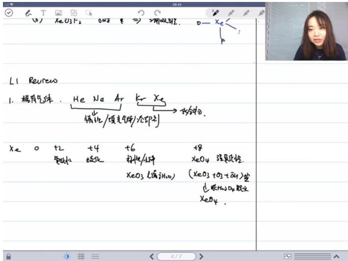

text_image

(8) XeO3H2 O2 → 2H2O2H2. O—Xe
L1 Review
1. 橡有气体 . He Ne Ar Kr Xe → 形分物.
Xe 0 +2 +4 +6 +8
氢氧化钠 氢化钠 核化/LH3 XeO4 强氧化铵.
XeO3 (溶于H2O) (XeO3 +O3 +O4)盐
↓碳H2O2胶水
XeO4.

元素组成: 主要包括氦(He)、氖(Ne)、氩(Ar)、氪(Kr)、氙(Xe)等  
● 特性: 具有惰性(inert)，常作为填充气体或冷却剂使用  
● 核心化合物: 以氙(Xe)的化合物为主要研究对象

# 2）氙的化合物

# - 不同价态特性

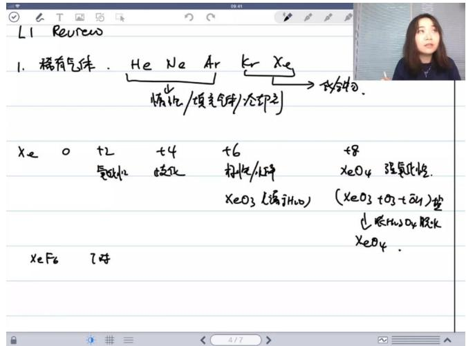

text_image

L1 Review
1. 稀有气体. He Ne Ar Kr Xe → 形合物.
情况/填充气体/冷却剂
Xe 0 t2 t4 t6 t8
氢氧化碳化 材核/反应 XeO₄ 强氧化性.
XeO₃ (溶于H₂O) (XeO₃ + O₃ - tOH) 壹
↓ 聚H₂O₄脱水
XeO₄
XeF₆ 7对

- 0价: 单原子分子，化学性质不活泼   
○ +2价: 主要表现氧化性  
- +4价: 容易发生歧化反应，生成+2价和+6价化合物  
- +6价: 极性很强，易水解，三氧化氙( $\mathrm{XeO_{3}}$ )相对稳定且有一定水溶性  
○ +8价:

四氧化氙(XeO4)固态易爆炸分解为XeO3和O2  
■ 气态时为正四面体结构，对称性高，强氧化性

# 四氧化氙制备

\- 方法1: 三氧化氙碱性溶液中加臭氧

\- 方法2: 制备盐后脱水

\- 方法1: 三氧化氙碱性溶液中加臭氧
- 方法2: 制备盐后脱水

先制得盐

■ 再用浓硫酸脱水得到 $XeO_{4}$

\- 先制得盐
- 再用浓硫酸脱水得到 $\mathrm{XeO_4}$

# 3）结构化学

# ● 常见结构类型

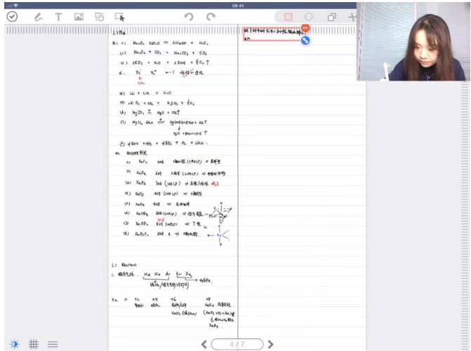

text_image

1. 研究
A) ① H₂O₃ + NaCl = 2AlAlOH + H₂O₃
(1) H₂O₃ + CO₂ = H₂CO₃ + V₂O₃
(2) 2SO₃ + H₂O + 2OH + 2O₂↑
C: O₃'→ C'' → C'' + 2H₂O₃ → 2H₂O₃
② H₂O₃
③ H₂ + H₂O = 0.0
④ ⑤ O₂ + O₂ + K₂O₃ + L₂O₃
(3) H₂O₃ → H₂O + H₂O↑
(4) H₂O₃ → H₂O + H₂O↑
(5) H₂O₃ → H₂O + H₂O↑
(6) H₂O₃ → H₂O + H₂O↑
(7) H₂O₃ → H₂O + H₂O↑
(8) H₂O₃ → H₂O + H₂O↑
(9) H₂O₃ → H₂O + H₂O↑
(10) H₂O₃ → H₂O + H₂O↑
(11) H₂O₃ → H₂O + H₂O↑
L1: Reaction
1. 氨化物：H₂O₃ → [H₂O₃] → NaCl
      (H₂O₃)/H₂O₃(OH)CH=CH₂

2. ① H₂O₃ → ② H₂O₃ → ③ H₂O₃ (H₂O₃) → NaCl
      (H₂O₃)/H₂O₃(OH)CH=CH₂

3. ② H₂O₃ → ③ H₂O₃ → ④ H₂O₃ (H₂O₃) → NaCl

○ XeO3: 4对电子(1对孤对电子)，三角锥形  
○ XeO4: 正四面体  
○ XeOF4: 四方锥形  
○ XeOF2: 5对电子，T型  
○ $Xe_{2}O_{3}F_{2}$ : 双锥结构

# - 七对电子结构

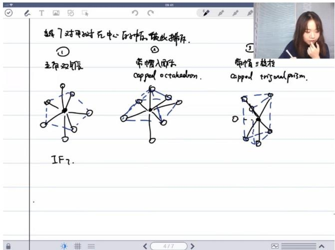

text_image

解7对可射后中心的叶板被处排列.
①
主序双倍
常帽入叶板
capped octahedron.
IF7.
②
常帽三棱柱
capped trigonal prism.

○ 五角双锥: 如XeF7-  
- 戴帽八面体: 先画八面体, 在三角形面上"戴帽"  
○ 戴帽三棱柱: 先画三棱柱，在四边形面上加"帽"  
○ 实际应用:

■ XeF $_{6}$ 为变形八面体，孤对电子放在"帽子"位置  
$XeOF_{5}^{-}$ 为五角双锥结构

\- 注意: 七对电子结构不总是变形八面体，实验测得的结构可能有多种稳定形式

# 4）重要反应

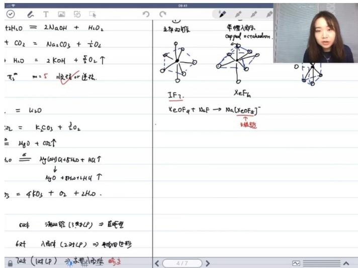

text_image

t2H2O = 2NaOH + H2O2
+ CO2 = Na2CO3 + 1/2O2
: H2O = 2KOH + 5/2O2↑
Ti3^m m=5 非接触或连续.
. = Li2O
:O2 = K2CO3 + 3/2O2
≡ MgO + CO2↑
:O = MgCa(O)4 + 5/2H2O + H2O↑
↓
:O + H2O + 5H2O + 4H4↑
:O3 = 4FeO3 + O2 + 2H2O.
6对 消断铝(3对:CLP) ⇒ 直线型
6对 八面体(2对:CLP) ⇒ 辅助四边形
7对 (对:CLP) ⇒ 多型六面体 略支

\- $\mathrm{XeOF_4 + NaF\rightarrow Na[XeOF_5]^-}$ :在适当溶剂中反应生成五角双锥结构的阴离子

# 2. 氢化物 26:28

# 1）氢同位素

- 种类: 氘(H)、氘(D)、氚(T)  
● 键能规律: 重同位素形成的键能比轻同位素形成的键能强  
● 应用: 理解同位素效应

# 2）氢化物概述

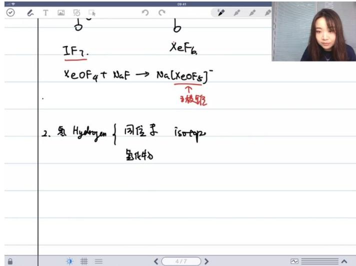

text_image

IF7.
XeOF6
XeOF4 + NaF → Na[XeOF5]-
↑
玻璃瓶
2. 氢 Hydrogen { 同位素  isotop2
氢化物

● 特点: 将在其他元素章节中详细讨论  
● 重要性: 是后续3d和4f元素学习的重点内容

# 3. 碱和碱土金属 26:52

1）碱和碱土金属的性质解释 27:00

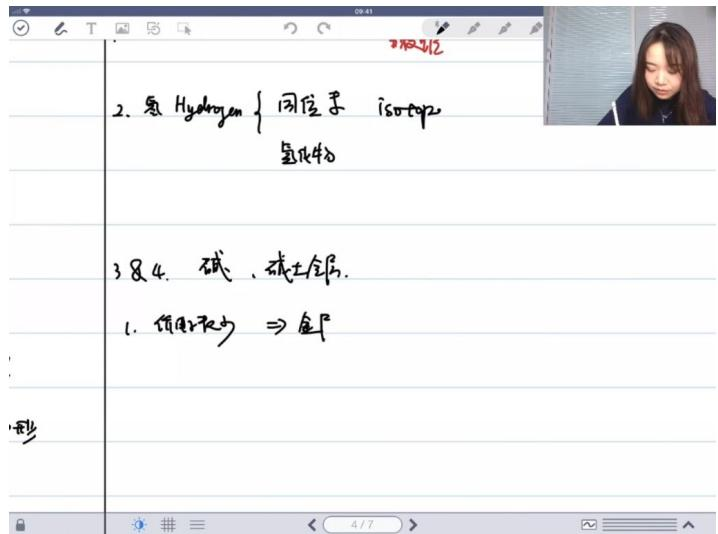

text_image

2. 氢 Hydrogen { 同位素 isotop
氢化物
3 & 4. 碱、碳土金属.
1. 储用积少 ⇒ 金尸

● 价电子影响：由于价电子数少（碱金属1个，碱土金属2个），金属键较弱，导致：

\- 硬度低且软

\- 沸点和熔点较低

● 半径规律：原子半径从上往下依次增大，Be和Li的化合物表现出共价性（反常现象）

2）原子半径和离子半径的变化规律 27:49   
● 半径趋势：原子半径和离子半径均呈现从上往下依次增大的规律  
● 反常现象：Be和Li的化合物因半径较小，表现出共价性而非典型的离子性

3）对角线效应 28:35

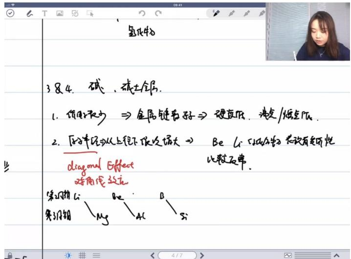

text_image

氢化物
3.8.4. 碱、碳土全层.
1. 仔细可读 ⇒ 金属链着弱 ⇒ 硬直低，浅发/熔点低。
2. 压体径从上往下依次增大 ⇒ Be Li（此分数）表说有苛性
diagonal Effect
对角线效应
第24期 Li
夹细细 / Mg / Ac / Si

● 定义：第二周期与第三周期斜对角元素（如Li-Mg、Be-Al、B-Si）性质相似的现象  
- 两种解释：

○ 半径效应：斜对角元素的原子/离子半径相近  
- 性质抵消：从左到右半径缩小共价性增强，从上到下金属性增强，斜向抵消

● 实际应用：经验规则，Li与Mg化合物性质特别相似（如碳酸盐、磷酸盐溶解性）

4）卤化物和碱金属的卤化物溶解性 31:56

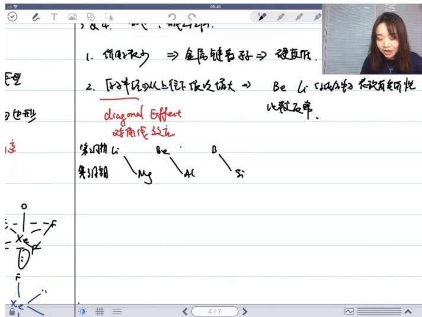

text_image

1. 仿制项为 ⇒ 金属链要素 ⇒ 硬直体.
2. 原子项与从上往下依次增大 ⇒ Be Li [小球分数] 表改有关特性
diagonal Effect
对角线效应
第2列 Li
夹弧组 Mg AC Si

●   
● 普遍规律：碱金属卤化物易溶，但LiF难溶  
● 溶解性原理：取决于晶格能和水合能的平衡，最终仍与离子半径相关  
● 碱土金属卤化物：主要表现离子性，但Be化合物例外（共价性）

5）碳酸盐、磷酸盐的溶解性 32:37

● 特殊现象：锂的碳酸盐、磷酸盐不溶（与镁相似，体现对角线效应）

● 碱土金属：Be的化合物表现共价性，其他主要为离子型

6）过氧化物的稳定性 33:28

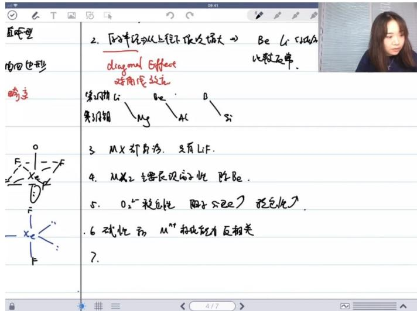

text_image

直线型
由四边形
畸变
O
F=1=F
xₑ
F
-xₑ
F
2. [正半径从上行下依次增大 → Be Li SiCu的
diagonal Effect
对角线效应
第4次例 Li Be B O Si
先设铝 Mg Al Si
3 MX 都为负，只有 LiF.
4. Mx₂ 增长反向子比 除 Be .
5. O₂ 稳化性 固子 size > 稳化价 >
6 砝化剂 M⁺¹ 核状能力 反相关
7.

●   
● 阳离子影响：阳离子半径越大，过氧化物 $(O_{2}^{2-})$ 稳定性越高  
● 极化作用：小半径阳离子对过氧离子极化能力强，导致稳定性降低

7）碱性与离子极化能力的关系 33:46

● 反比关系：离子极化能力越强，碱性越弱

例：LiOH碱性弱于NaOH，因 $Li^{+}$ 极化能力强

8）氢化物的反应活性 34:03

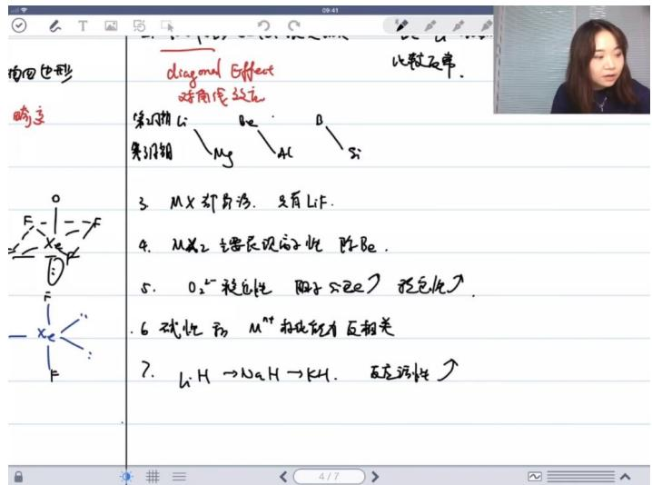

text_image

肉四也形
畸变
diagonal Effect
对角线反应
第2小排 Li
先闪针
My
Al
Si
3 MX 防击该. 只有 LiF.
4. MX2 也要反应的子化 除 Be .
5. O₂²⁻ 稳定性 (原子 size) 拉色化?
6 砝定为 M²⁺ 拉化能力反相关
7. LiH → NaH → KH. 碱化活性 ↑

● 活性序列： $LiH \rightarrow NaH \rightarrow KH$ 反应活性递增  
● 原因：氢负离子（ $H^{-}$ ）体积小，LiH晶格能强故惰性，KH晶格能弱更活泼  
- 应用差异：

○ 氢化锂：几乎不与乙醇反应  
- 氢化钠/钾：可用于醇羟基的甲氧基化反应（与碘甲烷配合）

9）氮化物、碳化物、硫化物的特殊性 35:17

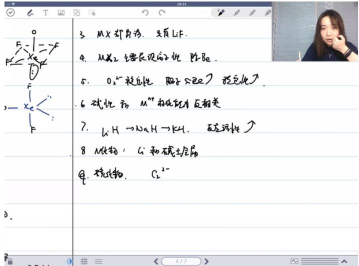

text_image

3. MX 都 dev. 只有 LiF.
4. MX2 比要反现的性 除Be.
5. O₂²⁻ 稳化性 阳子 size) 纳化性
6. 砝化为 M^n 桃化能有反相关
7. LiH → NaH → KH. 反应活性 ↑
8. N化物: Li 和碱化金属
9. 碳化物: C₂²⁻

氮化物：仅Li和碱土金属能与 $N_{2}$ 直接反应  
● 碳化物：

○ 乙炔化物（ $C_{2}^{2-}$ ）：碱土金属（如Ca）能稳定存在，因二价阳离子稳定作用强  
制备方法：碱金属需特殊方法制备，碱土金属可直接与碳反应

\- 硫化物：

○ 多硫化物：碱金属与硫反应生成 $S_{n}^{2-}$ （n随阳离子半径增大而增加）  
- 特殊结构：硫链长度与阳离子尺寸正相关

# 二、碳族和硼族元素 38:18

1. 铝元素 46:52

1）单质 46:59

text_image

在于“40”字的电子词数以正为负，“不41”字的
性反常之志。

$$
\begin{array}{cccccc}
I_{(1/4)\mathrm{mol}^{-1}} & 2P(5)^{2}) & 577 & 656 & 510. \\
& & & & \\
& & & & ZL\\
1. & \text{单层} & B\text{单层硬度大, 环网状晶压, 晶体B,} & Bn & \\
\end{array}
$$

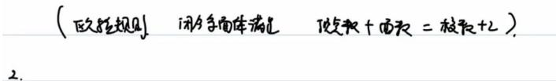

text_image

(欧拉规则 闭合两面体满足 使交积 + 而反 = 极反 + 2)
2.

● 物理特性：硬度大，存在晶体硼和无定形硼两种形态  
- 晶体结构：

- 无定形硼：灰色粉末  
- 晶体硼： $B_{12}$ 构成的二十面体结构（ih点群）  
- 通过共价键连接形成六方密堆积结构

● 欧拉规则：闭合多面体满足顶点数+面数=棱数+2

2）氢化物 49:36

\- $BH_{3}$ 的二聚现象与 $B_{2}H_{6}$ 的性质 50:00

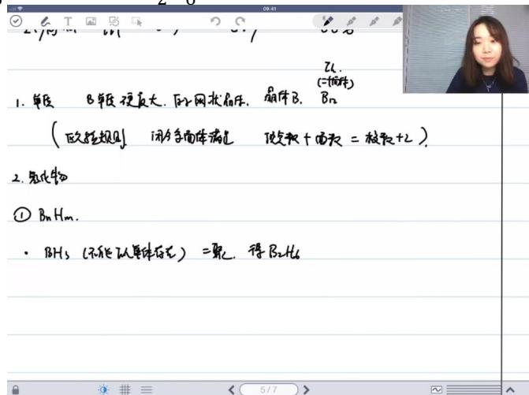

text_image

1. 单质 B单质硬放大. 的网状晶体. 晶体B. Bn
(欧拉规则 闭合界面满足 使体积+面次=极次+L)
2. 氢化物
① BnHm.
· BH₃ (不能以单体存在) =聚乙 得B₂H₆

单体不稳定性： $BH_{3}$ 不能以单体形式存在，会自发二聚形成 $B_{2}H_{6}$   
○ 二聚体特性：

■ 剧毒气体  
■ 在空气中可自燃  
■ 分子式为 $B_{2}H_{6}$

● $B_{2}H_{6}$ 作为火箭燃料的探讨50:49

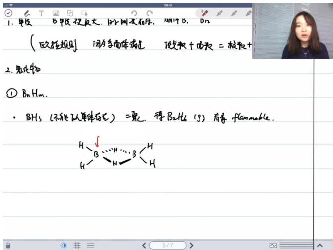

text_image

1. 单质 B单质硬度大，B2H2O↑标度，dm19 B，Dn
（欧拉规则） 闭合多面体满足 使体积+面积=枚数+
2. 氧化物
① BmHm.
• BH₃ (不能以单体存在) =肥。得B₂H₆(g)有毒 flammable.
H   S   H   H   H
      B   ...H   ...B   H
      H   H   H

- 燃料优势：能量密度极高

○ 弃用原因：

■ 安全性问题（剧毒且易燃）  
■ 燃烧产物会堵塞火箭喷口（生成 $B_{2}O_{3}$ 固体和水）

● 硼烷的结构特征：三中心两电子键 52:34

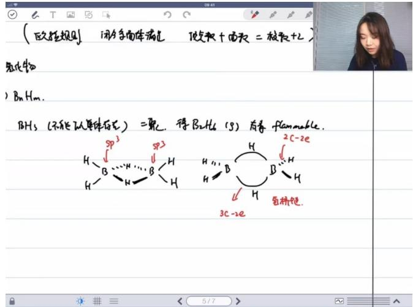

chemical

Chemical reaction diagram showing phosphorus ion (SP³) formation with benzene and hydrogen bonds, forming a flammable compound

○ 键型特点：

■ 常规键：两中心两电子键（普通σ键和π键）

■ 特殊键：三中心两电子键（氢桥键）

○ 轨道杂化：硼原子采用 $sp^{3}$ 杂化

\- 科学意义：硼烷结构的三中心两电子键解释曾获诺贝尔奖

● 硼烷的复杂结构与"way through"规则 54:30

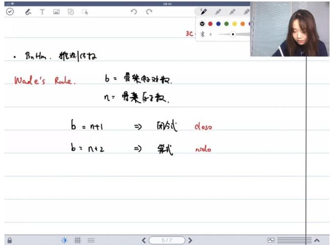

text_image

BnHm. 推测对数
Wade's Rule.
b = 骨束对数.
n = 骨束对数.
b = n+1 ⇒ 的方式 closo
b = n+2 ⇒ 算式 nido

O

# ○ 骨架定义：

b: 骨架电子对数  
n: 骨架原子数

# ○ 结构分类规则：

■ $b = n + 1$ ：闭合式（closo）结构  
■ $b = n + 2$ ：巢式（nido）结构  
■ $b = n + 3$ ：网式（arachno）结构  
■ $b = n + 4$ : 链式结构

# 3）蓬烷的结构 55:29

# ● 蓬烷的结构类型 56:21

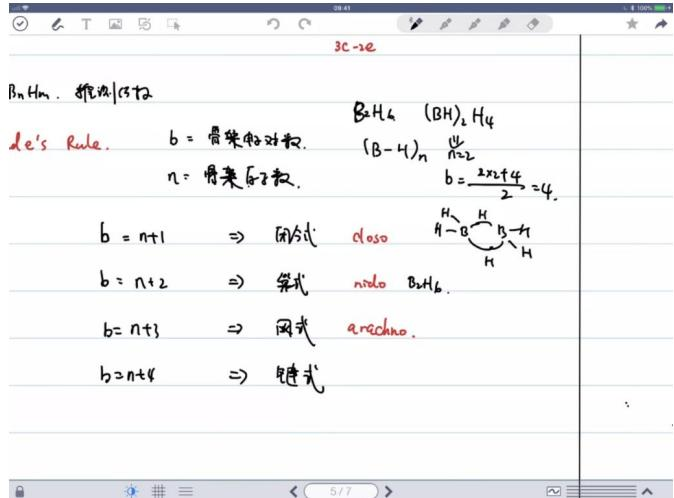

text_image

3C-2e
BnHm. 雅洗|3+2
de's Rule.
b = 骨束电子对称.
n = 骨束原子数.
B₂H₄ (BH)₂H₄
(B-4)n
H=2
b = 2×2+4/2 = 4.
b = n+1 ⇒ 团式 close
b = n+2 ⇒ 算式 nido B₂H₆.
b = n+3 ⇒ 网式 a.rechno.
b = n+4 ⇒ 链式

骨架原子数n: 将每个BH基团视为一个结构单元, 如 $B_{2}H_{6}$ 可分成2个BH单元和4个H原子, 故n=2

骨架电子对数b计算： $b=\frac{2n+x}{2}$ ，其中x为剩余H原子数（如 $B_{2}H_{6}$ 中x=4，得b=4）

# ○ 结构分类标准：

■ 闭合式(closo): b=n+1 (如 $B_{5}H_{5}^{2-}$ )   
■ 巢式(nido): b=n+2 (如 $B_{2}H_{6}$ )   
■ 网式(arachno): b=n+3 (如 $B_{4}H_{10}$ )  
■ 链式：尚未在蓬烷中发现

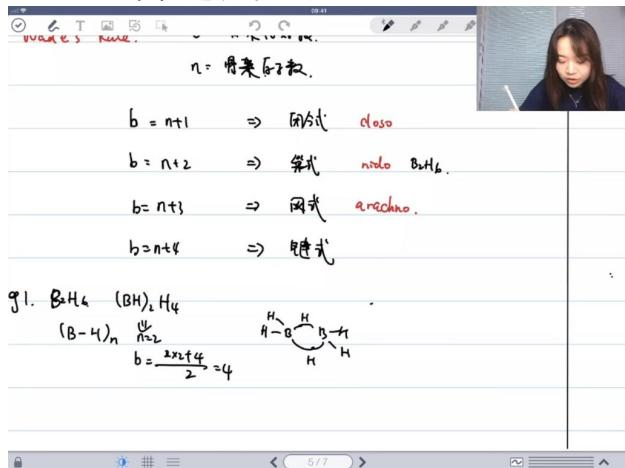

text_image

n = 骨来原子数.
b = n+1 ⇒ 硝式 close
b = n+2 ⇒ 算式 node B₂H₆.
b = n+3 ⇒ 网式 arechno.
b = n+4 ⇒ 键式
g1. B₂H₄ (BH)₂H₄
(B-4)_n \frac{H}{n+2} \frac{H-H}{H-H}
b = \frac{2\times 2 + 4}{2} = 4

○ 电子分配原理：每个BH单元贡献2个价电子，剩余H各贡献1个电子，总电子数除以2得b

# ○ 实例分析：

$B_{4}H_{10}$ : n=4, $x=6\rightarrow b=\frac{2\times4+1\times6}{2}=7$ (网式结构)

$B_{5}H_{5}^{2-}: n=5$ ，额外2个电子 $\rightarrow b=\frac{2\times5+2}{2}=6$ （闭合式）

● 蓬烷的实验室使用 01:08:40

○ 存在形式：纯 $BH_{3}$ 为有毒气体，实验室常用其配合物形式：

■ 乙醚溶液（形成 $BH_{3}\cdot OEt_{2}$ ）  
四氢呋喃溶液（典型浓度1M）

\- 稳定性原因： $BH_{3}$ 严重缺电子，需通过 $\mathsf{SP}^3$ 杂化形成配合物稳定结构

● 蓬烷的配位键形成 01:09:24

反应本质：路易斯酸（ $BH_{3}$ ）与路易斯碱（如 $NH_{3}$ ）的配位反应  
○ 键型特点：形成配位共价键(coordinate covalent bond)，电子对完全由碱提供

● 蓬烷的NMR化学环境 01:12:21

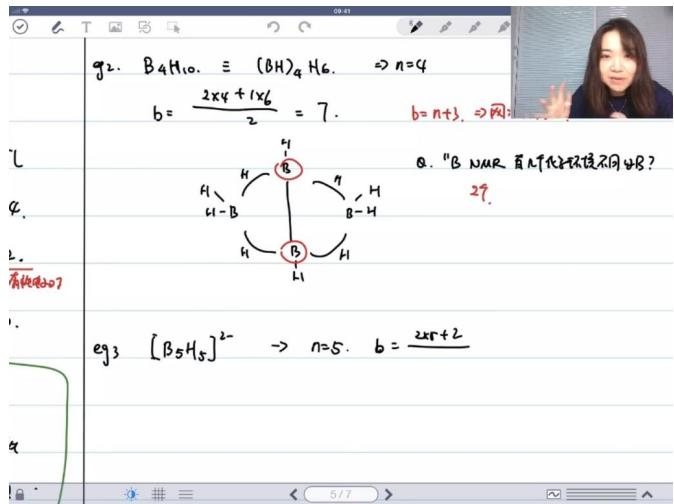

chemical

Chemical reaction diagram showing hydrogen-bonded borane (B) formation with electron transfer, including equilibrium and ring closure steps

○ 结构鉴别应用：通过 $^{11}$ BNMR可判断不同化学环境的硼原子  
○ 典型实例：

■ $B_{4}H_{10}$ ：显示2种化学环境不同的B原子  
■ $B_{5}H_{5}^{2-}$ ：三角双锥结构，所有B化学环境相同

\- 环境差异原因：与B原子连接的H桥键数量及空间位置不同导致

● 蓬烷的键种类与结构多样性 01:15:38

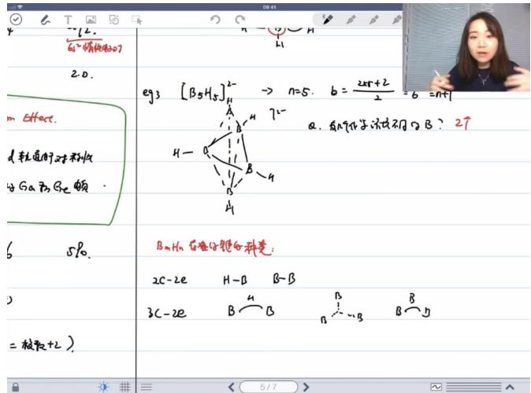

text_image

2.0.
m Effect.
d. 轮道的对称
的GaPhBe倾
6 5%
2c-2e H-B B-B
3c-2e B-B n-1g B-B y
BnHn在催化剂的种类：
xC-2e H-B B-B
=酸氧+L)

○ 键型分类：

■ 两中心两电子键（2c-2e）：如B-B键
■ 三中心两电子键（3c-2e）：包括B-H-B和B-B-B两种形式

○ 结构特征：

\- 存在网状和巢状两种基本结构
- 化学式 $B_{m}H_{n}$ 中 $\mathfrak{m}$ 和 $\mathfrak{n}$ 的不同组合可形成多种结构变体

■ 实际结构中硼原子的位置排列具有确定性

# ● 蓬烷的X射线衍射测量 01:16:46

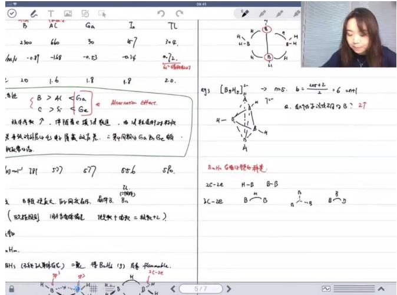

text_image

B
2300
mN
2.20
C
60
-0.97
1.6
A C
660
-168
Al
5:5
Gn
Ge
-0.53
Ga
30
47
-0.24
Hg
Hg-Hg
Hg-Hg
Hg-Hg
Hg-Hg
Hg-Hg
Hg-Hg
Hg-Hg
Hg-Hg
Hg-Hg
Hg-Hg
Hg-Hg
Hg-Hg
Hg-Hg
Hg-Hg
Hg-Hg
Hg-Hg
Hg-Hg
Hg-Hg
Hg-Hg
Hg-Hg
Hg-LHg
Hg-LHg
Hg-LHg
Hg-LHg
Hg-LHg
Hg-LHg
Hg-LHg
Hg-LHg
Hg-LHg
Hg-LHg
Hg-LHg
Hg-LHg
Hg-LHg
Hg-LHg
Hg-LHg
Hg-LHg
Hg-LHg
H 27
27
27
27
27
27
27
27
27
27
27
27
27
27
27
27
27
27
27
27
27
27
27
27
27
27
27
27
27
27
27
27
27
27
5/7

# ○ 测量原理：

■ 采用X射线衍射技术测定原子位置  
■ 激光束照射样品产生衍射图谱

# ○ 测量特性：

■ 硼原子定位：由于硼原子核较重，衍射信号强，位置测定准确  
■ 氢原子限制：氢原子核太小导致衍射能力弱，位置测定不精确

# ○ 结构规律：

■ 实验证实硼原子排列遵循特定空间规律   
■ 结构测定为理解蓬烷化学键提供了实验依据

# ● 蓬烷的结构规律与对称性 01:17:16

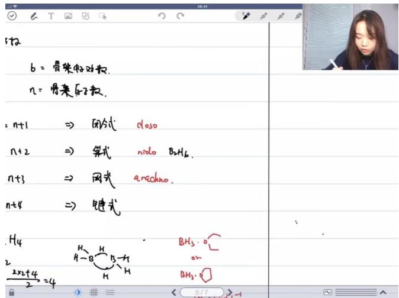

text_image

b = 骨架的对称.
n = 梗架的子称.

= n+1 ⇒ 固式 close
n+2 ⇒ 算式 nodo B₂H₆.
n+3 ⇒ 网式 arcchno.
n+4 ⇒ 键式

H₄
2
2x₂+4/2=4
BH₃·O
OH
BH₃·O
5/7

# ○ Wade规则的应用

■ 闭合式结构：当骨架电子对数 $b=n+1$ 时，形成对称性良好的闭合笼状结构。例如 $B_{6}H_{6}^{2-}$ 呈现正八面体构型， $B_{12}H_{12}^{2-}$ 形成正二十面体构型。  
■ 巢式结构：当 $b=n+2$ 时，通过在 $n+1$ 顶点笼状结构上移除一个BH单元（拆角）得到，不同拆角方式可能产生异构体。  
■ 网式结构：当 $b=n+3$ 时，在 $n+2$ 顶点笼状结构基础上移除两个顶点形成，具体结构取决于移除顶点的位置选择。

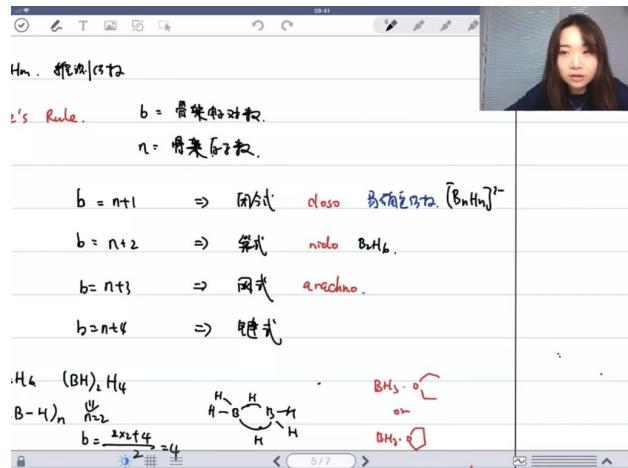

text_image

Hm. 推法15+2
2's Rule. b = 骨柴轮动权.
n = 骨柴轮子数.
b = n+1 ⇒ 的式 closo 异有色四边. [BnHn]2-
b = n+2 ⇒ 算式 nido B₂H₆.
b = n+3 ⇒ 团式 a.e.c.hno.
b = n+4 ⇒ 键式
1.H₆ (BH)₂H₄
B-Hₙ
b = 2x2+4 = 4
B H₃·O
OH
BH₃·O
5/7

# ○ 结构特征与数学关系

■ 对称性规律：闭合式结构对称性最佳， $B_{n}H_{n}^{2-}$ 系列符合欧拉规则（顶点数+面数=边数+2）。  
■ 电子计数：通过公式 $b=\frac{2x+4}{2}$ 计算骨架电子对数，其中x为硼原子数，如示例中计算结果b=4。  
■ 结构验证：教材通常用标记法（如红圈）指示顶点移除位置，实际考试中会提供结构推导方法而非要求记忆具体构型。

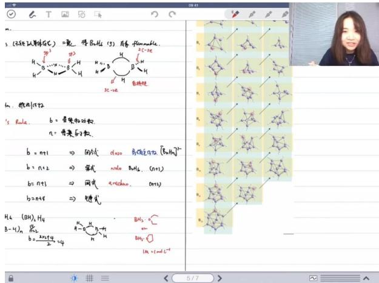

chemical

Chemical reaction diagram showing nucleophilic substitution of ethylene with hydrogen and boronate groups, alongside molecular structures of H4, B, and H2O molecules.

# ○ 化学键类型

■ 2c-2e键：存在于H-B和B-B之间的常规共价键  
■ 3c-2e键：特征性的氢桥键，在B-H-B结构中形成  
■ sp杂化：硼原子采用 $sp^{3}$ 杂化轨道成键

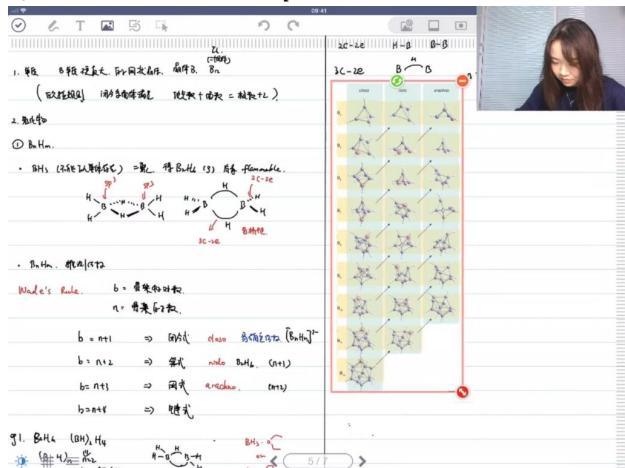

text_image

1. 额酸：碳酸锂、钠的测定与反应，溶解方程
（现象规则）：钠的溶解方程，溶解方程（反应式 = 额酸和二）。
2. 氨氧化物
① 6H₅
· 6H₅（碳化氢氧化物）=氮 + 持 6H₅（3）原子 6H₅
· 6H₅、微弱水相
MnO₂e's rule: b = 氨氧化物结构
n = 氨氧化物的数.
b = n+1 → 钠酸式 6H₅（碳化氢氧化物）[6H₅]²⁻
b = n+2 → 等式 6H₅（n+1）
b = n+1 → 钠酸式 6H₅（n+2）
b > n+4 → 键式
g1. 6H₅ (6H₅) H₄
(3-4) 5/7

# ○ 制备方法

■ 合成途径：通过硼的卤化物与强还原剂反应制得，如 $BX_{3}$ 在还原条件下生成硼氢化物

稳定性: $BH_{3}$ 不能单独存在, 会二聚形成易燃的 $B_{2}H_{6}$ (二硼烷)

注：关于结构拆解规则的数学原理（如拓扑学应用）属于拓展内容，教材不作要求，但可通过专业文献进一步研究。

# 4）卤化物 01:20:41

● 卤化硼的路易斯酸性变化 01:21:04

- 酸性变化规律：从 $BF_{3}$ 到 $BI_{3}$ 路易斯酸性逐渐增强，因为卤素电负性减弱（F>Cl>Br>I），与硼形成的pπ-pπ反馈键强度降低  
○ 结构基础：所有三卤化硼均为平面三角形结构，硼采用 $sp^{2}$ 杂化  
○ 键合特点： $BF_{3}$ 能形成较强的π键，而 $BI_{3}$ 中硼-碘键更接近极性单键，正电荷更集中在硼原子上

\- 卤化硼的水解反应 01:23:08

○ 水解差异： $BCl_{3}$ 易水解生成硼酸和HCl，而 $BF_{3}$ 相对稳定  
○ 机理解释：水解本质是水的氧原子进攻路易斯酸中心，酸性越强越易水解  
- 稳定性原因： $BF_{3}$ 路易斯酸性较弱，且能形成稳定的 $BF_{4}^{-}$ 负离子

\- 卤化硼的负离子接受性 01:24:02

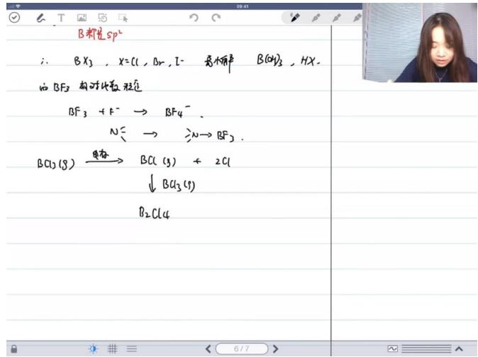

text_image

B稀盐sp²
∴ BX₃, X=C₁, Dr, I- 增小稀盐 B(CH₃)₂, HX.
由 BF₃ 相对比数程化
BF₃ + F⁻ → BF₄⁻
N ⇌ → ⇌ N→BF₃
BCl₃(g) 释放 → BCl(g) + 2Cl
↓ BC₃(g)
B₂Cl₄

配位特性： $BF_{3}$ 可与 $F^{-}$ 形成四面体结构的 $BF_{4}^{-}$ 配离子  
○ 反应示例： $BF_{3} + F^{-} \rightarrow BF_{4}^{-}$   
应用价值：这种配位能力使其成为重要的路易斯酸催化剂

\- 卤化硼的结构与性质 01:24:29

○ 物理状态： $BCl_{3}$ 为气体，在电场作用下可解离为 BCl 和氯原子  
二聚特性：两分子 $BCl_{3}$ 可形成 $B_{2}Cl_{4}$ 气体，冷凝后得固体  
○ 还原反应： $BCl_{3}$ 可被还原剂还原为 $B_{2}Cl_{4}$

\- 卤化硼的氧化还原反应 01:25:21

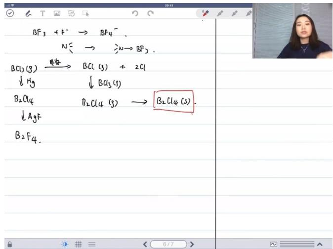

text_image

BF₃ + F⁻ → BF₄⁻
N= → N→ BF₃
BCl₃(g) ⇌ BC(3) + 2Cl
↓ Mg ↓ BCl₃(s)
B₂Cl₄ B₂Cl₄(s) → B₂Cl₄(s)
↓ AgF
B₂F₄.

低价态形成：硼可形成+1价卤化物如 $B_{4}Cl_{4}$   
○ 结构特征： $B_{4}Cl_{4}$ 为四面体结构（ $T_{d}$ 点群），所有硼原子等价  
- 制备方法：通过还原三卤化硼获得

\- 卤化硼的对称性与结构推测 01:26:20

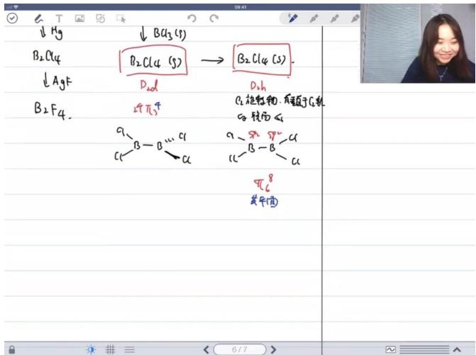

chemical

Chemical reaction diagram showing transformation of alkyl halide to boron chloride with labeled reactants and products

固态结构： $B_{2}Cl_{4}$ 固态为 $D_{2h}$ 点群，具有 C2 旋转轴和垂直镜面  
○ 气态变化：气态时对称性降低为 $D_{2d}$ ，π键从 $\pi_{6}^{8}$ 变为两个 $\pi_{3}^{4}$   
○ 结构演变：气态时两个平面正交旋转，各自形成独立π体系

5）其他元素的氢化物和卤化物 01:30:27

\- 铝的卤化物

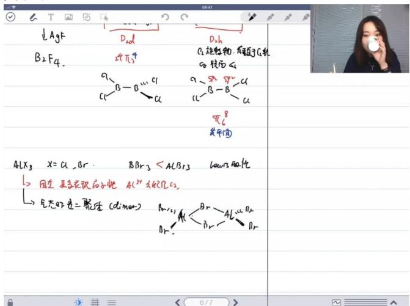

text_image

↓AgF
B₂F₄.
24π⁴
C₁-Br-O-CI
Cl-B-Cu
a-B-O-Cu
C₆
共平面
AlX₃ X=Cl,Br. BBr₃<AlBr₃ lows Al₂H₂
→ 固定  复合表现的水性 Al³⁺ 为铝化Cu
→ 气态对二聚乙烯 (dimor)
Br₁₁ Br-Br-Al-Cu
Br-Br-Br
6/7

酸性比较： $AlBr_{3}$ 路易斯酸性强于 $BBr_{3}$ ，因铝金属性更强

○ 结构特性：固态 $AlCl_{3}$ 为离子晶体，铝填在八面体空隙；气态时为二聚体  
○ 制备反应： $AlCl_{3} + LiH \rightarrow LiAlH_{4} + LiCl$

\- 低价卤化物

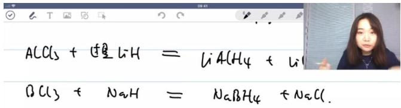

chemical

Chemical reaction equation showing acetic acid and sodium bicarbonate forming a calcium chloride compound

$$
A l x _ {3} + 2 A C \longrightarrow A (x \text {   不成立   }
$$

$$
G a I n T l. M F \mathrm{不设近.}
$$

○ 形成条件：铝与过量卤素反应可生成不稳定AlX (X=Cl,Br,I)  
- 稳定性规律：氟化物不稳定，因氟吸电子能力过强  
○ 镓化合物： $2GaX_{3}(s)+Ga(s)\rightarrow3GaX(s)$ 形成离子固体

\- 硼氢化物

text_image

BCl₃ + NaH = NaBH₄ + N

$$
A (x _ {3} + 2 A C \longrightarrow A (x \text {   不成立   })
$$

$$
\begin{array}{l}{G a \mathrm{InII.} \quad \stackrel {\rightarrow} {M F} \mathrm{不似} \triangleq \quad - M X \quad x = a. B r. I. Q | \mathrm{有} I.}\\{2 G a \times 3 (s) + G a (s) \xrightarrow {\triangleq} 3 G a _ {X _ {2}} (s). \quad x = a. B r. I.}\\{\mathrm{Ⅱ.} G a _ {3 0} \mathrm{因分体in} G a _ {X _ {2}} (s). \quad \equiv \quad \stackrel {+ 1} {G a [ G a \times 4 ]}.}\end{array}
$$

$$
\mathrm{同理存在} I _ {n} C l _ {2} \mathrm{为} \pi B r _ {2}.
$$

○ 制备方法： $BCl_{3} + NaH \rightarrow NaBH_{4} + NaCl$   
○ 结构特点：氢化锂铝 $(LiAlH_{4})$ 为常见还原剂  
- 应用价值：这些氢化物在有机合成中作为强还原剂使用

6）氧化物 01:43:32

● 硼的氧化物 01:43:50

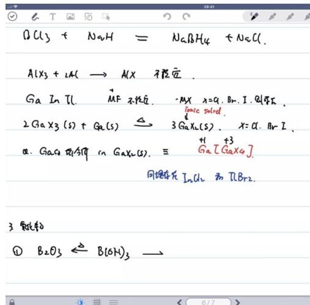

text_image

DCl₃ + Na₂H = NaBH₄ + NaCl.
AlX₃ + 2H → AlX 不稳定.
Ga In Tl. MF 不稳定. -MX x=α, Br, I, 则有花.
2Ga×3(s) + Ga(s) ⇌ 3Ga×10⁻⁵(s), x=α, Br, I.
α, GaO ⇌ 3Ga × 10⁻⁵(5)
in Ga×2(s). ≡ Ga [Ga×O]
同理存在 InCl₂ 和 TlBr₂.
3 氨化物
① B₂O₃ ⇌ B(OH)₃ →

常见形式: 最常见的铜氧化物是 $B_{2}O_{3}$ ，这是硼氧化物的基础形式。

● 硼酸的生成与性质 01:44:05

○ 生成方式: 硼酸可以通过硼的卤化物水解生成  
○ 酸性特征:

■ 一元酸特性: 硼酸是一元酸而非三元酸，其三个OH基团不会全部电离   
■ 电离机制: 通过结合一分子水形成 $[B(OH)_{4}]^{-}$ 和 $H^{+}$ 的方式产生酸性  
■ 增强酸性方法: 加入二醇类物质可显著增强硼酸酸性

● 硼酸的结构与杂化 01:45:22

○ 杂化转变:

■ 核心过程: 硼从 $SP^{2}$ 杂化转变为 $SP^{3}$ 杂化  
■ 电荷变化: $SP^{3}$ 杂化的硼带一个负电荷，同时释放 $H^{+}$ 离子

○ 结构特点:

■ 双态共存: 硼氧化合物可以稳定存在 $SP^{2}$ 形式，也有倾向接受路易斯碱变为 $SP^{3}$   
■ 缺电子特性: 硼终归是缺电子中心，倾向于接受电子对

○ 研究方法:

■ 核磁表征: 硼谱可区分 $SP^{2}$ 和 $SP^{3}$ 杂化的硼  
■ 比例测定: 科研中通过测定两种杂化硼的比例来研究结构

● 硼酸根的结构举例 01:48:01

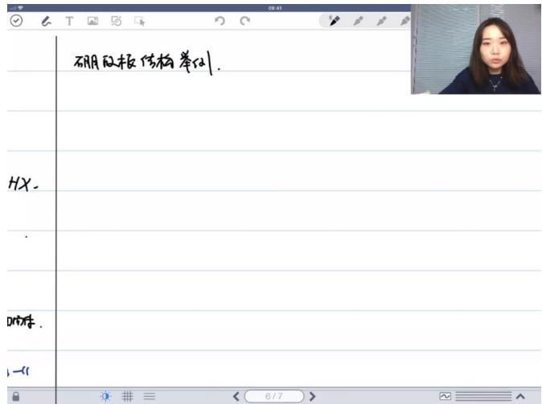

text_image

研段板结构举例.
H/Y.
.
D/Y.
.
-

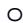

○ 链状结构:

■ $BO_{2}$ 单元: 形成链状结构, 每个硼周围有两个氧  
■ 类比硅氧: 类似硅氧四面体，但这里是硼氧三角形共用顶点  
■ 电荷分布: 负电荷位于非共用氧原子上

# ○ 硼砂结构:

■ 表示形式: 可表示为 $[B_{4}O_{5}(OH)_{4}]^{2}$   
■ 配位特点: 每个硼配一个OH，形成特定环状结构

# ● 硼酸根的复杂结构 01:52:03

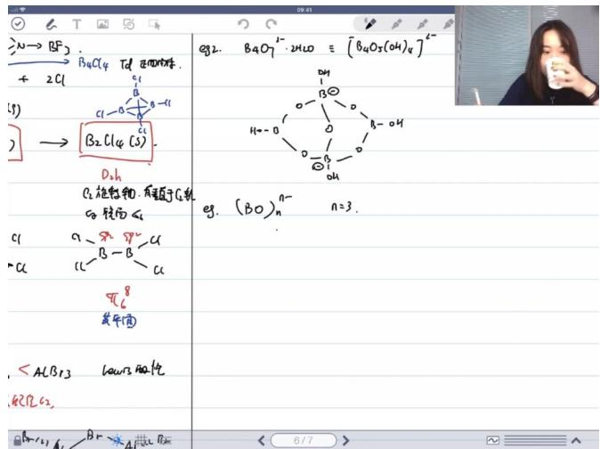

text_image

N→BF3
+ 2Cl
(g)
→
B2Cl4 (s)
D2h
C2植物物，有氧原子C₂O
C6钝角C6
Cl a B-C u
-Cu Cl- C6
π6
共平面
<AlB13 lawr3的比
配比C2
eg2. B4O72^-·2H2O ≡ [B4O5(OH)4]2-
OH
B-OH
H=0
OH
(BO)n n=3.
6/7

# ○ ○ 环状结构:

$B_{3}O_{6}^{3-}$ : 三个 $BO_{2}$ 单元形成环状结构  
■ 杂化方式: 硼保持 $SP^{2}$ 杂化  
■ 结构特点: 类似无限链状结构的闭环形式

# ○ 其他结构:

$\left[B_{5}O_{6}(OH)_{4}\right]^{-}$ : 中心硼带负电荷，周围四个硼各带一个BOH

# ● 氢氧化铝的两性 02:04:19

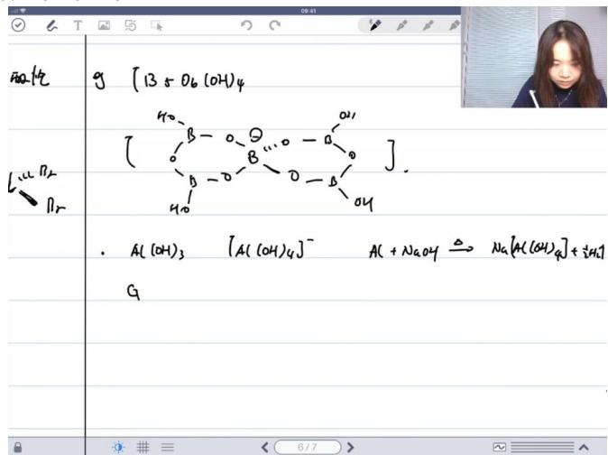

chemical

Chemical reaction equation showing nucleophilic addition of phenylalanine to aldehyde and sodium hydroxide

# ○ ○ 两性表现:

■ 碱性溶解: 铝溶于氢氧化钠溶液加热可形成 $[Al(OH)_{4}]^{-}$   
■ 类比硼酸: 与硼酸类似, 可接受 $OH^{-}$ 形成配离子

# ○ 两性本质:

■ 电负性原因: 铝的电负性介于金属与非金属之间  
■ 其他元素: 锗(Ge)也能形成类似 $\left[Ge(OH)_{4}\right]^{-}$ 的结构

# 7）硼的氢化物、氧化物和卤化物 02:05:17

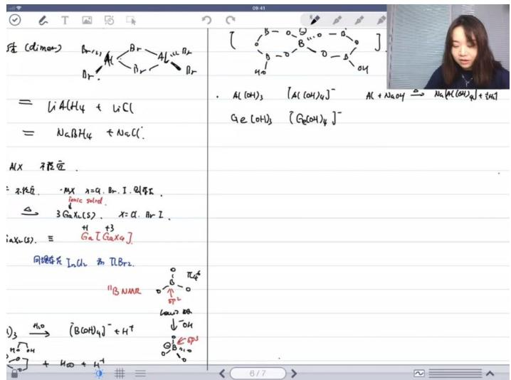

text_image

生 (dimor)
Br₂
Al
Br
Al
Br
= LiAlH₄ + LiCl
= NaBH₄ + NaCl.
AlX 不稳定。
= 不稳定。
- Alx x=0. Br.I. ①(Ⅲ)
\xrightarrow{finic solid}
3GaXu(S). x=0. Br.I.
inXu(S). ≡ +3
Ga[GaXa]
用熔存在 InCH₃ 为 PbBr₂.
↑B NAME
O → O
down→ on
)₃ → [B(OH)₄]⁻ + H⁺
↓OH
②B = ③C = ④
⑤C = ⑥D = ⑦
⑧C = ⑨D = ⑩
⑪C = ⑫D = ⑬
6/7

- 两性特征： $Al(OH)_{3}$ 和 $[Al(OH)_{4}]^{-}$ 显示铝的两性特征，类似地 $Ge(OH)_{3}$ 和 $[Ge(OH)_{4}]^{-}$ 显示锗的两性特征  
● 还原反应： $NaBH_{4}$ 作为典型还原剂参与反应，生成 $NaAlH_{4}$ 等氢化物  
● 碳氮化物介绍 02:05:26

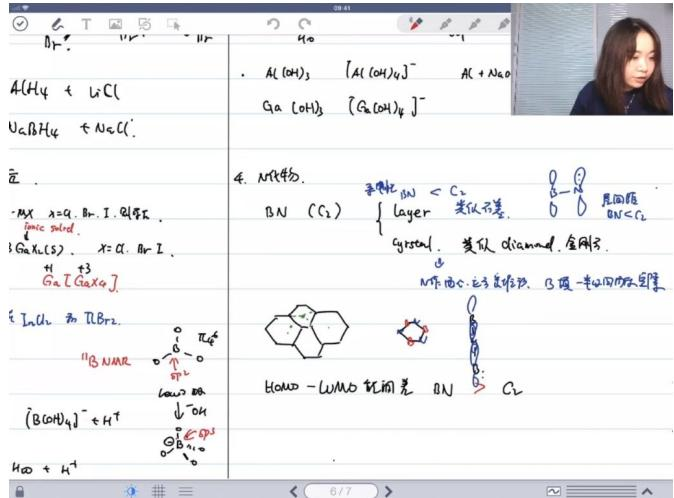

text_image

A(H4 + LiCl)
UaBH4 + NaCl

- MX x = a, Br, I, 则注
ionic solid.
3 GaXc(S). x = a, Br I.
H + 3
Ga [GaXa]

= InCl2 和 TiBr2.

"B NMR"
(B(OH)4]⁻ + H⁺

HCO + H⁻

Al(OH)₃ [Al(OH)₄]⁻
Ga(OH)₃ [Ga(OH)₄]⁻

4. N化物.
BN (C₂)
{ layer 类似不差.
gystal. 美似 diamond. 金刚石.
M作两心，立方体等。
HOWO - WNO 轮丽克 BN > C₂
6/7

等电子体：BN是 $C_2$ 的等电子体，具有类似结构特征  
存在形式：存在层状结构和晶体结构两种形态，类似石墨和金刚石

● 碳氮化物晶体结构 02:06:17

堆积方式：氮原子作面心立方堆积，硼原子填充一半四面体空隙

\- 杂化类型：晶体结构中硼氮均为sp³杂化，形成四面体构型

○ 类比金刚石：与金刚石结构相似，每个B-N键对应C-C键

● 碳氮化物层状结构 02:07:44

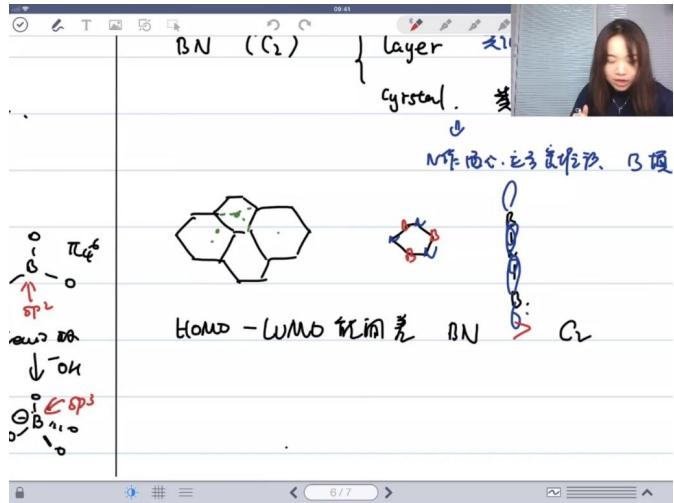

text_image

BN (C₂) { layer } 无
crystal. 美
N作四心之方复核化、B项
HOMO - LWMO 化洞差 BN C₂

O

- 导电性差异：BN导电性弱于石墨，因HOMO-LUMO能隙更大  
○ 层间距：BN层间距(≈100pm)仅为石墨(≈300pm)的1/3  
○ 堆叠方式：BN为硼氮原子上下对齐，石墨为碳原子错位排列

● 类苯化合物制备与结构 02:11:53

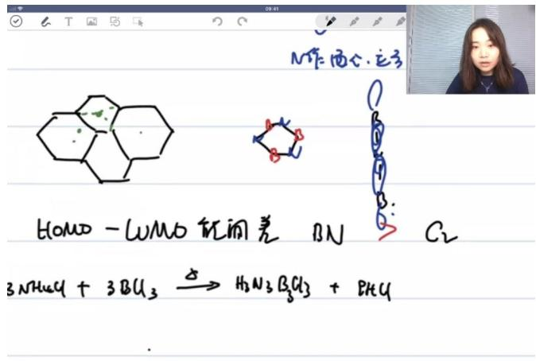

chemical

Chemical reaction diagram showing conversion of HOMO to BN and C2 with hydrogenation steps

制备反应： $3NH_{4}Cl + 3BCl_{3}\rightarrow H_{3}N_{3}B_{3}Cl_{3} + 9HCl$   
○ 结构特征：六元环状结构，氢在氮上，氯在硼上  
○ 还原反应：可用 $LiAlH_{4}$ 将B-Cl键还原为B-H键

● 类苯化合物反应活性 02:14:42

- 芳香性差异：BN环芳香性弱于苯环，因π电子离域性较差  
- 共振结构：负电荷更倾向分布在电负性大的氮原子上

\- 氯化氢加成反应 02:16:22

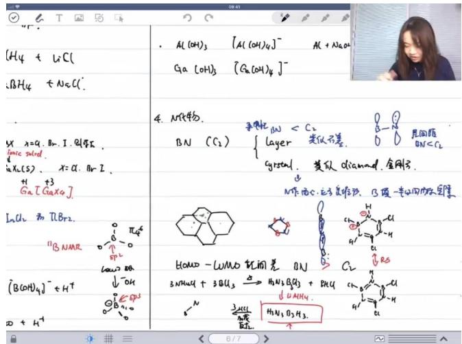

text_image

[H4 + LiCl
;B2H4 + NaCl\(
x = a, Br, I, 则带式
ionic solid
aXc(S), x = a, Br, I,
Ga [GaXa]
IndU2为TlBr2.
"B NMR
(BcOH)4]− + H+
D + H-
Al(OH)3 [Al(OH)4]− Al + Na2O
Ga [OH]3 [Ga(OH)4]−
4. Ni(IV)物.
BN (C2) 采用化 BN < C2
layer 类似石墨.
gristal. 类似 diamond. 金刚石.
N作中心、正方差推法、正值一半四内存在完整
HOMO - LUMO 轮面差 BN
3NHCH + 3BU3 → H2N3BaO3 + BnCl
↓ CH4
H2N3BaH3.
N
① ② ③ ④ ⑤ ⑥ ⑦ ⑧ ⑨ ⑩ ⑪ ⑫ ⑬ ⑭ ⑮ ⑯ ⑰ ⑱ ⑲ ⑳ ㉑ ㉒ ㉓ ㉔ ㉕ ㉖ ㉗ ㉙ ㉚ ㉛ ㉜ ㉝ ㉟ ㉳ ㉟ ㉳ ㉟ ㉟ ㉟ ㉟ ㉟ ㉟ ㉟ ㉟ ㉟ ㉟ ㉟ ㉟ ㉟ ㉟ ㉟ ㉟ ㉟ ㉟ ㉟ ㉟ ㉟ ㉟ ㉟ ㉟ ㉟ ㉟ ㉟ ㉟ ㉟ ㉟ ㉟ ㉟ ㉟ ㉟

加成位置：HCI中H加在N上，CI加在B上  
○ 产物构型：形成全顺式结构更稳定  
○ 电子效应：尽管B电负性较小，但实验证实CI加成在B上

8）碳族元素 02:24:58

\- 元素组成与价态特征

text_image

Part II. Group 14 Element 硫模.
C Si Ge Sn Pb.

○ 组成元素：包括碳(C)、硅(Si)、锗(Ge)、锡(Sn)、铅(Pb)  
○ 价电子特征：

■ 除铅因 $6s^{2}$ 惰性电子对效应外，其他元素主要形成4价化合物  
■ 锡存在二价和四价态，其中二价锡具有显著还原性

\- 单质性质与制备

○ 键能特征

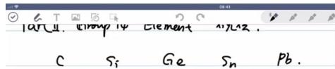

text_image

arc II. Group 14 Element 17L12.
C Si Ge Sn Pb.

- 階了Pb. (6S $^{2}$ 烯烃电解液对反应) 变已无子溶液用4个VE水  
- 除Jph. 其它元素及却有 allotropes (同子异形体).  
C. S; (如B类似) 表现出明显“季气”“季氟化

定能 kg·mol $^{-1}$ ∴C≡O·1026.

c-c 348 c-0 360 c-f 486 c=0 743

${S}_{i} - {S}_{i} = {226}\;{S}_{i} - 0\;{466}\;{S}_{i} - F\;{584}$

Ge-Ge 186 Sn-Sn 400 Pb-Pb 87.

7/7

■ 亲氧/亲氟性：碳、硅与硼类似，表现出强烈亲氧/亲氟性  
■ 键能数据：

● 碳相关键能：C - C 348 kJ / mol, C - O 360 kJ / mol, C - F 486 kJ / mol   
- 硅相关键能：Si - Si 226 kJ / mol, Si - O 466 kJ / mol, Si - F 584 kJ / mol  
● 键能变化规律：随原子半径增大（C→Pb），同元素键能显著降低

\- 硅的工业制备

■ 反应原理： $SiO_{2}(s)+2C(s)\rightarrow Si(s)+2CO(g)$   
■ 产物选择：

● 高温下生成CO而非 $CO_{2}$ 主要考虑熵增效应  
● 温度高时 $\Delta S$ 项影响显著，生成气体分子数更多的一氧化碳

■ 提纯工艺：通过制备四氯化硅气体进行提纯，再还原得高纯硅

\- 碳的同素异形体

○ 石墨特性

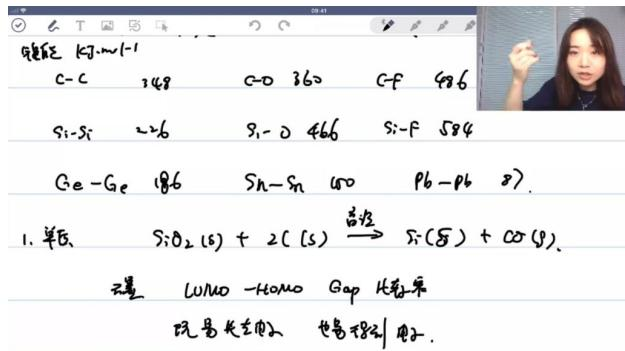

text_image

键能 kgJ·mol⁻¹
C-C 148 C-O 360 C-F 486
Si-Si 226 Si-O 466 Si-F 584
Ge-Ge 186 Sn-Sn 450 Pb-Pb 87.
1. 单反 SiO₂(s) + 2(Cs) → Si(δ) + CO(ρ).
无量 LUMO-HOMO Gap 比要采集
玩易失主电子 也是得到电子.

# ■ 电子结构：

● HOMO-LUMO能隙窄，导电性好   
- 兼具得失电子能力，可形成插层化合物

# ■ 典型插层化合物：

- 钾石墨系列： $KC_{8}$ 、 $KC_{12}$ 、 $KC_{24}$   
● 其他： $C_{8}Br$ 等卤素插层化合物

# ○ 锂电池应用

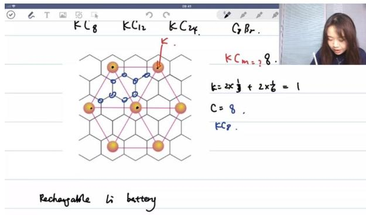

chemical

Diagram of a rechartable Li battery structure with labeled layers and thermal conductivity values

■ 阳极反应: $C_{6}Li \rightarrow C_{6}(graphite) + Li^{+} + e^{-}$   
■ 工作原理：锂离子在石墨层间可逆嵌入/脱出  
■ 电解质：采用锂盐溶液传导离子

# - 富勒烯与纳米管

■ 结构关系：可视为"卷曲的石墨层"  
化学性质：

● 可接受金属形成化合物（如 $K_{3}C_{60}$ ）

\- 可被氧化，电子结构类似石墨

# - 锡的特殊性质

# ○ 同素异形体：

■ 白锡（硬度大）  
■ 灰锡（粉末状，低温稳定）

历史典故：拿破仑远征俄国失败可能与锡制品低温变性有关（食物罐头/军服纽扣争议）

# 例题：晶胞计算

单质 $SiO_{2}(s) + 2(s) \rightarrow Si(S) +$

云墨 LUMO-HOMO Gap 比较紧

玩易先去电子 也要得到电子.

$KC_{8}$ $KC_{12}$ $KC_{24}$ $C_{7}B_{r}$

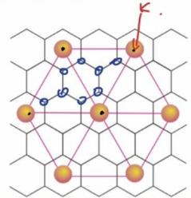

chemical

Molecular structure diagram showing interconnected atoms and bonds in a hexagonal lattice

$$
k C _ {m} = ? 8
$$

$$
k = 2 \times \frac {1}{3} + 2 \times \frac {1}{6} = 1
$$

$$
C = 8.
$$

# ○ ○ 题目解析：

■ 结构特征：钾原子规则分布在石墨层间  
计算方法:

● 确定每个钾原子分摊数： $2 \times \frac{1}{3} + 2 \times \frac{1}{6} = 1$   
● 统计晶胞内碳原子数：8个

■ 答案：化学式为 $KC_{8}$

# 9）硅元素 02:38:47

● 硅烷 02:38:54

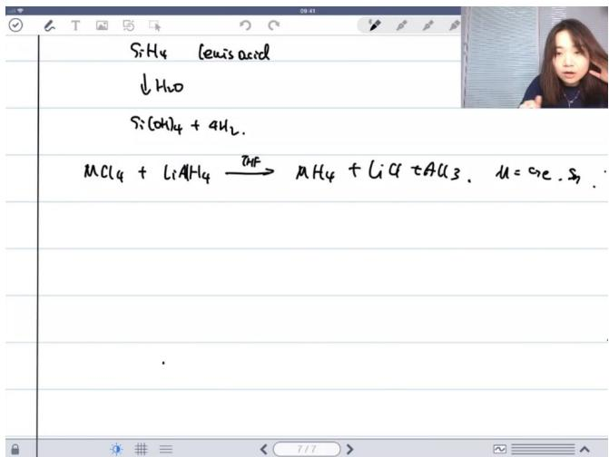

chemical

Chemical reaction equation showing hydrolysis of ethylene oxide with sodium chloride

键能特性：硅硅键键能显著小于碳碳键，最大硅烷分子中硅原子数不超过20个（不同教材表述差异）  
○ 化学性质：

■ 表现路易斯酸性  
■ 遇水剧烈水解生成原硅酸和氢气： $SiH_{4} + 4H_{2}O \rightarrow H_{4}SiO_{4} + 4H_{2}$

○ 制备方法：

■ 类似硼族氢化物制备：卤化物与强还原剂四氢铝锂反应  
■ 反应式： $MCl_{4} + LiAlH_{4} \rightarrow MH_{4} + LiAlCl_{4}$

\- 稳定性规律：

■ 氢被烷基取代后稳定性提高  
■ 原因：①超共轭效应 ②位阻效应阻碍路易斯碱接近

● 硅的卤化物 02:41:41

○ 水解特性：

■ 碳卤化物（除 $CF_{4}$ 外）不水解：因碳无d轨道且位阻保护

■ 硅卤化物易水解（除 $SiF_{4}$ 外）

○ 键能对比：

■ 碳氟键异常稳定（C - F键能>800kJ/mol）  
■ 其他碳卤键强度： $C - Cl(-65\mathrm{kJ/mol}) < C - Br(148\mathrm{kJ/mol}) < C - I(>0)$

○ 特殊性质：

■ 全氟化物化学惰性（如 $CF_{4}$ 不燃烧）  
■ 碳卤键可发生金属插入反应（如格氏试剂制备）

● 硅和锡的卤化物 02:47:03

○ 硅氟键特性：

■ 氟对硅亲和力极强，Si - F键能显著大于Si - Cl键   
■ 与过量氟离子形成六氟合硅酸根： $SiF_{4} + 2F^{-} \rightarrow [SiF_{6}]^{2-}$

\- 有机硅应用：

■ TMS（三甲基氯硅烷）常用作羟基保护基  
■ 反应机理： $ROH + (CH_{3})_{3}SiCl \rightarrow ROSi(CH_{3})_{3} + HCl$

● 硒的化合物 02:49:03

○ 价态特性：

■ 二价硒（ $SeCl_{2}$ ）为还原剂  
四价硒化合物存在（ $SeCl_{4}$ 等），呈共价性四面体结构

○ 特殊结构：

固体易升华  
四氟化硒保留部分离子性

● 铅的化合物 02:50:27

○ 氧化态稳定性：

四价铅不稳定（强氧化性），如 $PbCl_{4}$ 室温分解： $PbCl_{4} \rightarrow PbCl_{2} + Cl_{2}$

○ 颜色特征：

■ 二价铅氧化物黄色  
■ 硫化铅黑色沉淀   
■ 混合价态氧化物（如 $Pb_{3}O_{4}$ ）为红色

10）氧化物 02:51:56

\- 碳氧化物：

○ $CO_{2}$ 路易斯酸性，与氨反应生成尿素： $2NH_{3} + CO_{2} \rightarrow (NH_{2})_{2}CO + H_{2}O$   
○ 线性分子 $C_{3}O_{2}$ 存在

\- 硅氧化物：

- 硅氧四面体网络结构（ $[SiO_{4}]$ 共用顶点/边）  
○ 高熔点、高硬度特性

\- 硫化物：

○ $CS_{2}$ 碱性条件下反应： $CS_{2} + Na_{2}S \rightarrow Na_{2}CS_{3}$   
与氢氧化钠反应： $3CS_{2}+6NaOH\rightarrow2Na_{2}CS_{3}+Na_{2}CO_{3}+3H_{2}O$

11）碳化物 03:02:20

\- 氰化物：

○ 类卤素性质，电子结构类似 $N_{2}$   
- 负电荷集中在碳端

\- 硅碳化物：

\- 原子晶体结构，超高硬度

\- 氮化物：

○ 三聚氰胺制备路线： $CaC_{2} + N_{2} \rightarrow CaCN_{2} \rightarrow$ 三聚

\- 杂化差异：

○ 三甲基胺氮 $sp^{3}$ 杂化

# 三甲基硅基胺氮 $sp^{2}$ 杂化（因硅d轨道参与作用）

☐ 注：所有反应条件、键能数据、空间构型描述均严格依据课程讲解内容整理，保留了原课程中的关键比较（如碳/硅化合物差异）和典型实例（如保护基应用）。

三、知识小结

<table><tr><td>知识点</td><td>核心内容</td><td>考试重点/易混淆点</td><td>难度系数</td></tr><tr><td>硼烷结构</td><td>B2H6的二聚体结构,三中心两电子键(桥氢键)</td><td>SP3杂化与常规两中心两电子键的区别</td><td>★★★★</td></tr><tr><td>硼酸特性</td><td>一元酸性质,SP2/SP3杂化转换机制</td><td>与二醇类物质反应增强酸性的原理</td><td>★★★</td></tr><tr><td>类苯化合物</td><td>BN等电子体结构,加成反应位点判断</td><td>氯加在硼上而非氮上的反常现象</td><td>★★★★</td></tr><tr><td>碳族元素键能</td><td>C-F键(486kJ/mol)异常强度,Si-Si键(226kJ/mol)较弱</td><td>四氯化碳动力学稳定但热力学不稳定</td><td>★★★</td></tr><tr><td>对角线规则</td><td>Li-Mg、Be-Al性质相似性</td><td>离子半径相近导致的异常规律</td><td>★★</td></tr><tr><td>惰性电子对效应</td><td>Tl(+1)、Pb(+2)的稳定性</td><td> $6s^{2}$ 电子难参与成键</td><td>★★★</td></tr><tr><td>石墨插层化合物</td><td>KC8的晶体结构计算</td><td>每层钾对应8个碳的配比关系</td><td>★★★★</td></tr><tr><td>硅烷制备</td><td>SiCl4 + LiAlH4 → SiH4</td><td>水解生成硅酸和氢气</td><td>★★</td></tr><tr><td>七配位化合物</td><td>五角双锥 vs 戴帽八面体构型</td><td>XeF7-的构型选择</td><td>★★★★</td></tr><tr><td>考试技巧</td><td>结构推断题优先考虑对称性信息</td><td>核磁共振峰数与化学环境关系</td><td>★★★</td></tr></table>