# 一、氮族元素 01:09:57

# 1. 氮族元素的结构与性质 01:10:06

# 1）氮族的单质 01:15:54

# - 磷的单质-红磷 01:16:14

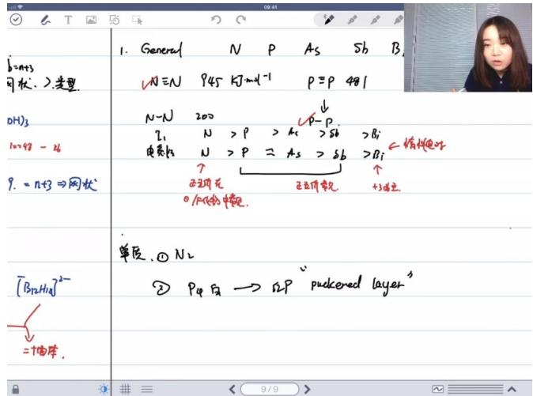

text_image

b=mt+3
可状，>变型.
NH≡N 945 kJ mol-1 P≡P 481
OH₃
100+8 - 46
9. = nt+3 ⇒ 网状
N-N 200
Z₁ N >P >K >Sb >Bi
电荷比 N >P ≈ As >Sb >Bi
↑
正正用花
正正用花
0 /P(Fe) 水解.
单质，① N₂
② P₄ F₂ → S₂P "puckened layer"³
=个偏半。

○ 结构特征：红磷由船式六元环构成，每个磷原子通过 $SP^{3}$ 杂化与周围3个同层磷原子成键，层间存在相互作用，整体形成皱褶网状结构。  
○ 键合方式：每个磷原子平均配位数为4-6个，主要来自同层3个和层间3个磷原子的相互作用。  
物理特性：相比白磷更稳定，属于无定型结构，层间排列较混乱，结构规整度较差。

# - 磷的单质-黑磷 01:18:02

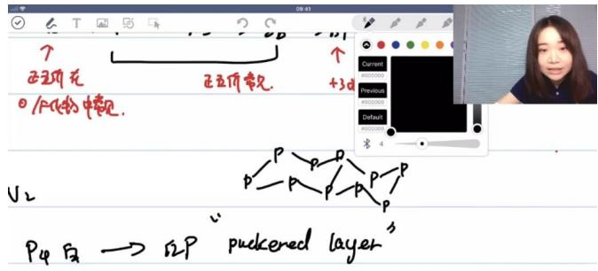

text_image

正五阶花
正五阶花
+3d
V2
P4 白 → R2P "puckened layer"

○ 结构演变：红磷在高温高压下转变为黑磷，形成更规整的层状晶体结构。  
○ 排列特征：层内保持船式六元环结构，但层间堆叠更整齐，原子排布更紧凑。  
○ 配位数：每个磷原子最终配位数为6个（同层3个+上下层各3个），密度显著高于红磷。  
- 稳定性：是磷单质中最稳定的晶型存在，具有明确的晶体结构特征。

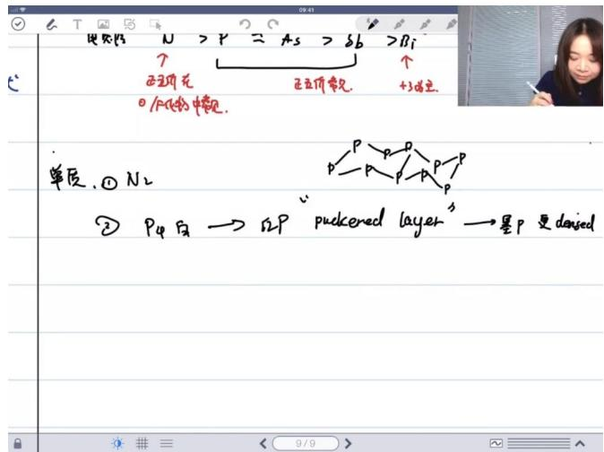

text_image

使用 N > P = As > Sb > Bi
?
正五价元
正五价常数
+3点位
0.1/4(6)中常数.
单质，① N₂
② P₄ 底 → ΩP "puckered layer" → 是P 更 danised

反应活性：白磷最活泼，红磷较稳定，黑磷最稳定且具有最佳晶体规整性。  
○ 电子构型：所有磷单质中磷原子均采用 $SP^{3}$ 杂化，形成3个单键并保留1个孤电子对。  
○ 典型结构：白磷以 $P_{4}$ 正四面体为基本单元，每个磷原子连接3个磷原子并带孤对电子。

# 2）氮族的化合物 01:21:39

● 氮化物 01:22:14

○ 离子型氮化物

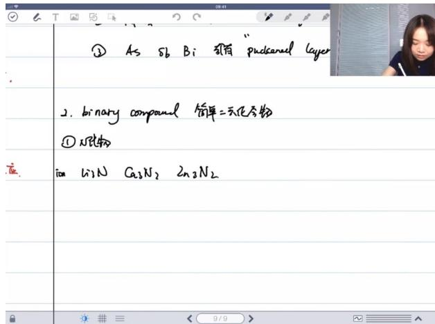

text_image

① As sb Bi 简有 "pudcanal layer"
2. binary compound 简单=无记分物
① N形物
ton li3N G3N2 2n3N2

形成条件：金属性强的金属（如碱金属、碱土金属）直接与氮气反应生成  
■ 结构特点：以离子键为主的离子固体，但高电荷正负离子间存在共价成分  
■ 典型例子： $Li_{3}N$ 、 $Ca_{3}N_{2}$ 、 $NaN_{3}$   
■ 性质：电荷分布高，共价成分显著

○ 共价型氮化物

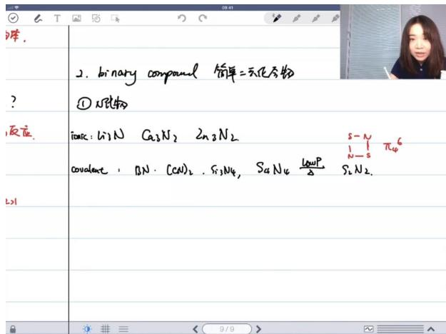

text_image

?
反应
L21
?
? 
? 
2. binary compound 简单=元化方物
① N₂C物
ionic: Li:N Ca₃N₂ 2n₃N₂
COvalent : BN·(CN)₂, Si₃N₄, S₄N₄ \frac{lowP}{\Delta} S₄N₂.
s-N
N-S π₄⁶

■ 典型例子：BN（类石墨结构）、 $C_{3}N_{4}$ 、 $Si_{3}N_{4}$

结构特征：

- 平面四边形结构（如 $S_{4}N_{4}$ ）  
- 摇篮型结构（两端翘起的八元环）  
● 硬度大，属于原子网络结构

# ○ 金属性氮化物

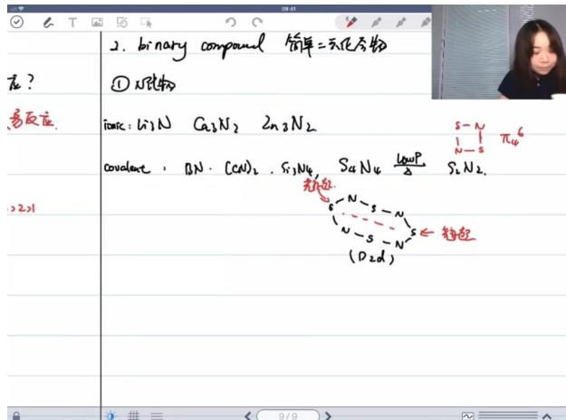

text_image

在?
反应
2. binary compound 简单=无化合物
① N₂化物
ionic: Li₃N Ca₃N₂ 2n₂N₂
covalent: BN·(CN)₂·Si₃N₆·S₄N₄ 1/2ωP/2 Si₄N₂.
→
→
→
→
→
→
→
→
→
→
→
→
→
→
→
→
→
→
→
→
→
→
→
→
→
→
→
→
→
→
→
→
→
→
→
→
→
→
→
→
→
→
→
→
→
→
→
→
→
→
→

■ 组成特点： $M_{x}N_{y}$ （y/x<1），氮原子掺入金属晶格

■ 结构特征：氮原子填充金属原子堆叠的八面体空隙

典型性质：

● 过渡金属氮化物特别硬   
- 化学惰性强（inert）  
- 导电性良好

# ○ 叠氮化物

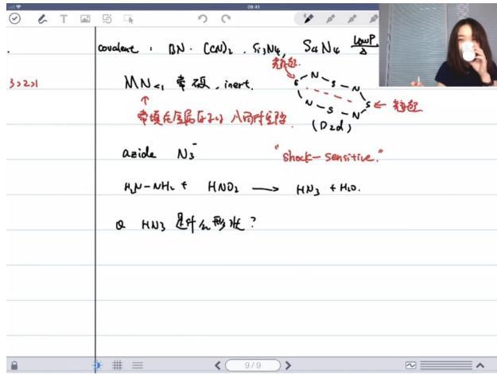

text_image

covalent : BN·C(N)2,Si3N4,S4N4
3>2>1
MN<1 常硬,insert.
↑
常项在金属(原子)入两件定得 (D2d)
azide N3 "shock-sensitive."
HN-NH2 + HNO2 → HN3 + H2O.
Q HN3 是什么形状？

■ 制备方法：肼 $(HN-NH_{2})$ 与亚硝酸反应制得叠氮酸 $(HN_{3})$   
■ 爆炸特性：shock-sensitive（对震动敏感）  
■ 酸性：pKa=4.75（与乙酸相当）  
■ 分子结构：

- 叠氮酸（ $HN_{3}$ ）：V型/L型结构  
- 叠氮离子（ $N_{3}^{-}$ ）：直线型结构

■ 键长数据：N-N键长110pm，N≡N键长129pm

# ○ 特殊氮化物

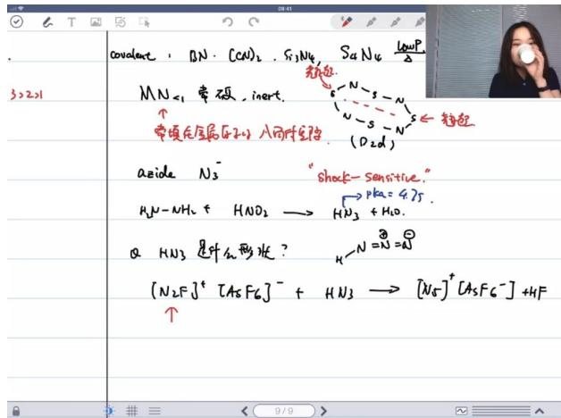

text_image

covalent : BN·(CN)2·Si3N4·SaN4·CuOP2
3>2>1
MN<1 带试, insert.
↑
常项在金属压石上入而作定性
（D2d）
azide N3-
"shock-sensitive."
→PKa=4.75.
H2N-NH2+ HNO2 → HN3+H2O.
α HN3 是什么形状？
→N=N=②
[N2F]+[AsFc]− + HN3 → [N5]+[AsFc-]+HF
↑
9/9

$N_{5}^{+}$ 合成： $[N_{2}F]^{+}[AsF_{6}]^{-} + HN_{3}\rightarrow[N_{5}]^{+}[AsF_{6}]^{-} + HF$

结构特征：

● V型结构（键角111°）  
- 中心氮杂化介于 $sp^{2} - sp^{3}$ 之间  
- 末端N-N键更短（绿色键）

# - 磷化物 01:40:00

# ○ 磷化物的简介与常见类型 01:40:17

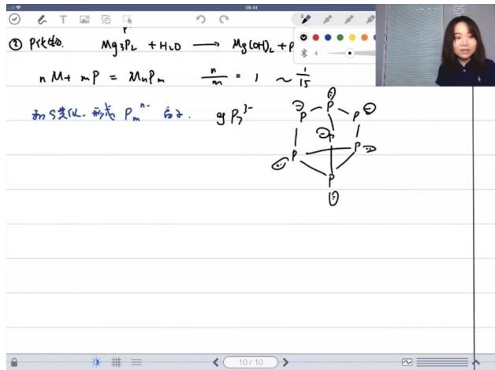

text_image

① Pkt生物. Mg₃P₂ + H₂O → Mg(OH)₂ + P
n M + m P = MnPm    n/m = 1 ~ 1/15
和S共化, 形表 Pm^n- 后子. gP3^2-
      3 - P - P
      1 2 3 4 5 6 7 8 9 10 11 12 13 14 15 16 17 18 19 20 21 22 23 24 25 26 27 28 29 30 31 32 33 34 35 36 37 38 39 40 41 42 43 44 45 46 47 48 49 50 51 52 53 54 55 56 57 58 59 60 61 62 63 64 65 66 67 68 69 70 71 72 73 74 75 76 77 78 79 80

典型反应： $Mg_{3}P_{2} + H_{2}O \rightarrow Mg(OH)_{2} + PH_{3}$

■ 离子特性：形成 $P^{3}$ -离子

# 金属磷化物的n/m比值范围 01:41:05

■ 组成范围： $M_{x}P_{y}$ 中 y/x 比值从 1:1 到 1:15  
■ 结构类比：类似硫化物中的多硫离子

# ○ 多磷负离子的形成与结构特点 01:41:32

■ 形成机制：通过P-P键形成链状或环状结构  
典型例子： $P_{7}^{3}$

- 以白磷四面体为基础结构  
- 在棱上插入磷原子

● 带负电荷的磷原子保留孤对电子

○ 磷化物作为半导体材料的应用 01:43:40

半导体特性：

● 与Ⅲ族元素（如硼）组合形成p型半导体  
● 与 V 族元素（如砷）组合形成 n 型半导体

■ 掺杂原理：通过控制电子缺陷调节导电性

\- 氢化物 01:45:01

○ 氨(NH₃)

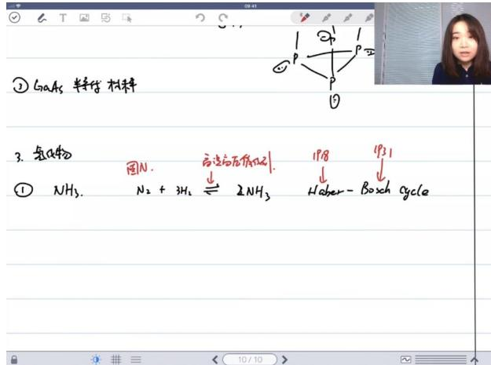

text_image

② GaAs 特性 材料
3. 氢氧化物
固N.
↓
NH₃.
N₂ + 3H₂ ⇌ 2NH₃
反应方程式(2)
198
1931
Haber - Boxh cycle

■ 哈伯-博施循环：氮气与氢气在高温高压催化剂条件下合成氨的反应 $(N_{2}+3H_{2}\rightleftharpoons2NH_{3})$ ，该反应因氮气的惰性而难以发生。

■ 历史意义：哈勃1918年因该理论获诺奖，1931年工业化实践者再获诺奖，解决了人工合成氮肥难题，取代了传统的鸟粪肥料。

■ 现代地位：至今仍是最高效的固氮方法，尚无更优替代方案。

■ 物理性质：沸点-33℃，液态温度范围窄。

■ 化学性质：在水中pKa=9.25，可发生自电离 $(2NH_{3}\rightleftharpoons NH_{4}^{+}+NH_{2}^{-})$ 。

○ 铵盐热分解

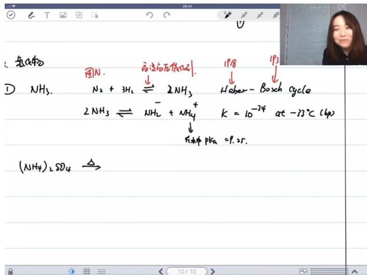

text_image

① 氢气体
图N.
应变为无氧原子
↓
2NH₃ ⇌ NH₂ + 3H₂
② NH₃.
Na + 3H₂ ⇌ 2NH₃
2NH₃ ⇌ NH₂ + NH₄⁺
↑
K = 10⁻⁷⁴ at -33℃ (4p)
↓
充种PKa = 9.25.
(NH₄)₂SO₄ →
1P8
Haber-Boxch cycle
1P2

■ 硫酸铵：加热分解为硫酸氢铵和氨气 $\left(\left(NH_{4}\right)_{2}SO_{4}\Delta NH_{4}HSO_{4}+NH_{3}\uparrow\right)$   
■ 硝酸铵：加热分解为氮气、氧气和水 $(NH_{4}NO_{3}\Delta N_{2}\uparrow+O_{2}\uparrow+H_{2}O\uparrow)$   
■ 毒性特征：氨气有刺激性气味，毒性中等，不及磷化氢、砷化氢剧毒。

○ 肼 $(N_{2}H_{4})$

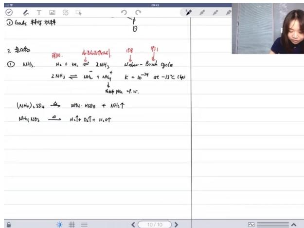

text_image

① CaNH₃ 科学 材料
② 
3. 氨物种
① NH₃
N₂ + 3H₆ ⇌ 2NH₃
2NH₃ ⇌ NH₄ + NH₄↑
NaOH PK₆ = P. 2P.
(NH₄)₂SO₄ → NH₄·H₂SO₄ + NH₃↑
NH₄·NO₃ → N₃↑ + D₂T + H₂O↑
10/10

■ 结构特点：SP³杂化，N-N键可旋转，存在交叉式构象。

■ 应用领域：火箭燃料，实际使用甲基取代衍生物(偏二甲肼)以提高能量密度。

■ 能量参数：能量密度-116.7 kJ/g，优于氢气(-29.9 kJ/g)的储存便利性。

# ○ 其他氢化物

text_image

α 相比于 H₂ 品品燃料的伏驾？ 悟乐，先不好怕

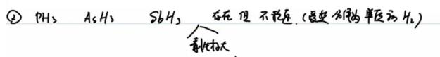

text_image

② PH₃ A₆H₅ SbH₃ 存在但不稳压(变速为单位的H₂)
→
制气标大

Q. 锥角是保边,支小还是变大

$NH_{3}$ $PH_{3}$ $AsH_{3}$ $SbH_{2}$

10/10   
■ 稳定性趋势： $PH_{3}>AsH_{3}>SbH_{3}$ ，随原子序数增加稳定性降低。

■ 键角规律： $NH_{3}(107^{\circ}) > PH_{3}(93.5^{\circ}) > AsH_{3}(92^{\circ}) > SbH_{3}(91^{\circ})$ ，因中心原子电负性递减和孤电子对影响增强。

■ 特殊用途： $AsH_{3}$ 、 $SbH_{3}$ 用于半导体掺杂，实现单原子级掺入。

# ○ 卤化物

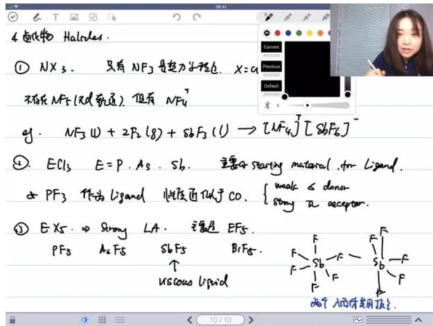

text_image

4.卤化物 Halides.
① NX₃. 只有 NF₃ 是超力学理论. X=O
不存在 NF₃ (无氧轨道). 但有 NF₄⁺
gY. NF₃ W + 2F₂(g) + 86F₃(U) → [NF₄]⁻ [SbF₆]⁻
② ECl₃ E=P. As. Sb. 主要为 starting material. for Liand.
PF₃ 作为 ligand 性度近似于 CO. { weak ≤ donor
    strong π acceptor.
③ EXs. → Strong LA. 主要是 EF₅.
PF₃ As F₅ Sb F₅ Br F₅.
↑ uscous liquid
两个入件使用顶点.

# ■ 氮的卤化物：

- 仅NF3热力学稳定，其他NX3有爆炸性  
- 不存在NF5(无d轨道)，但可形成NF4+

# ■ 磷的卤化物：

- $\mathrm{PCI}_{3}$ 是重要配体合成原料  
- PF₃配位性质类似CO，兼具σ给体和π受体特性

# 高价卤化物：

- PF $_{5}$ 、AsF $_{5}$ 、SbF $_{5}$ 为强路易斯酸  
● $SbF_{5}$ 易形成超酸体系(如HSbF $_{6}$ )

# - 固态结构转变

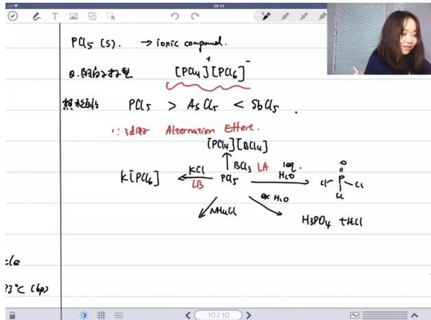

text_image

PCl₅ (s). → ionic compound.
0.阳离子打型 [PCl₄]⁺[PCl₆]⁻
饱和物s PCl₅ > AsCl₃ < SbCl₅
∵ 3d/er Alternation Effect
[PCl₄][BCl₄]
K[PCl₆] ← KCl / LB PA₅ → [BCl₃ LA H₂O] → H₃PO₄ + HCl
↓ NH₄Cl → H₂O
=1e
p3℃ (4p)

■ 对称性转变： $\mathrm{PCl}_{5}$ 液态为三角双锥，固态转为 $[\mathrm{PCl}_{4}]^{+}[\mathrm{PCl}_{6}]^{-}$ 离子晶体，获得更高对称性(四面体+八面体)。  
双重性质： $\mathrm{PCl}_{5}$ 既可作为路易斯酸(与KCl反应生成K[PCI6])，又可作路易斯碱(与AlCl3反应生成[PCI4]+[AlCl4]−)。

# ■ 水解反应：

● 限量水： $PCl_{5} + H_{2}O \rightarrow POCl_{3} + 2HCl$   
● 过量水： $POCl_{3} + 3H_{2}O \rightarrow H_{3}PO_{4} + 3HCl$

# - 卤氧化物

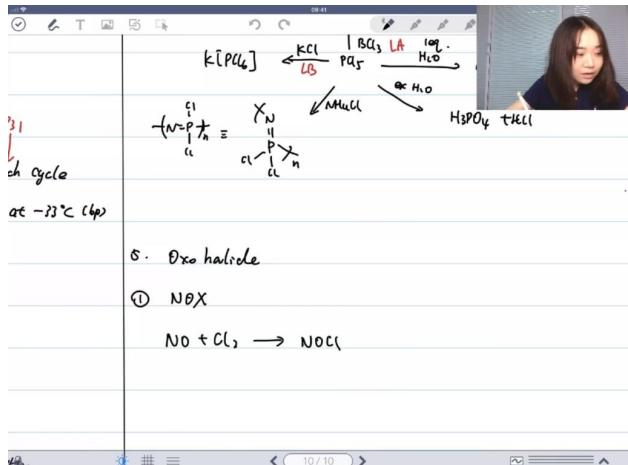

chemical

Chemical reaction equation involving potassium chloride, potassium sulfate, and acid chloride with NOx hydroxide formation

■ NOCl: NO与Cl₂反应产物，中心原子为N(SP²杂化)。  
■ $NO_{2}F$ : $NO_{2}$ 与 $F_{2}$ 反应产物，同样 $SP^{2}$ 杂化。  
■ $POCl_{3}$ ： $PCl_{5}$ 与限量水反应制得，是有机磷配体合成的重要中间体。

# - 卤化物和氧化物 02:05:03

氧化物 02:22:50

根据课程记录，我将为您整理一份结构化的化学笔记，重点涵盖氮的氧化物和硝酸相关内容：

■ 硝酸的制备与性质 02:23:27

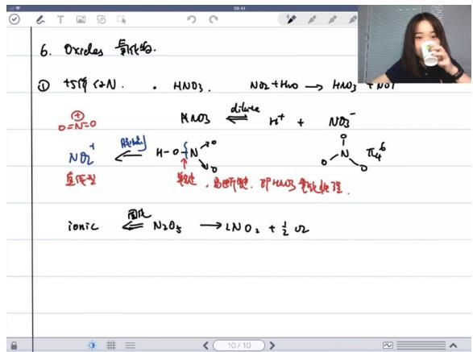

text_image

6. Oxides 氧化物.
① +SO₄⁻ (2N) . HNO₃ . NO₂ + HNO → HNO₃ + NO₃⁻
②
O=N=0
NO₃⁻ ⇌ H⁺ + NO₃⁻
NH₂↑
直度型
FeCl₂ → H-O{N}⁺
↓
N₂O
FeCl₂, 高解键, 即HNO₃氧化处理.
ionic ⇌ N₂O₈ → LNO₂ + ½ O₂

● 制备原理：通过 $NO_{2}$ 与水的反应制备硝酸，同时生成NO，NO在空气中会被氧化为 $NO_{2}$ 继续参与反应  
- 浓度差异:

\- 稀硝酸：主要表现酸性，电离为 $H^{+}$ 和 $NO_{3}^{-}$

\- 浓硝酸：强氧化剂，以分子形式存在时氮氧键易断裂

\- 结构特性：分子状态的硝酸根（ $HNO_{3}$ ）比离子状态的硝酸根（ $NO_{3}^{-}$ ）更容易断裂氮氧键

■ 硝酸根离子的结构 02:25:02

\- 分子结构：

○ 硝酸分子中存在大π键（π4 $^{6}$ ）  
- 以硝酸根离子存在时氮氧键更稳定

● 反应中间体：在脱水剂存在下可形成 $NO_{2}^{+}$ 离子

○ 构型：直线型（与 $CO_{2}$ 为等电子体）  
- 性质：强路易斯酸，易被亲核试剂进攻

■ 五氧化二氮的性质与结构 02:27:37

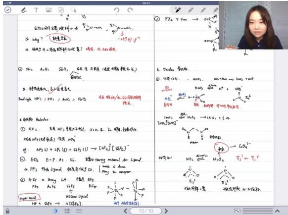

text_image

① PAX + Hα → OCH₃
② POH₃ + Hα → CH₃ + NH₂
③ POH₃ + Hα → CH₃ + NH₂
④ POH₃ + Hα → CH₃ + NH₂
⑤ POH₃ + Hα → CH₃ + NH₂
⑥ POH₃ + Hα → CH₃ + NH₂
⑦ POH₃ + Hα → CH₃ + NH₂
⑧ POH₃ + Hα → CH₃ + NH₂
⑨ POH₃ + Hα → CH₃ + NH₂
⑩ POH₃ + Hα → CH₃ + NH₂
⑪ POH₃ + Hα → CH₃ + NH₂
⑫ POH₃ + Hα → CH₃ + NH₂
⑬ POH₃ + Hα → CH₃ + NH₂
⑭ POH₃ + Hα → CH₃ + NH₂
⑮ POH₃ + Hα → CH₃ + NH₂
⑯ POH₃ + Hα → CH₃ + NH₂
⑰ POH₃ + Hα → CH₃ + NH₂
⑱ POH₃ + Hα → CH₃ + NH₂
⑲ POH₃ + Hα → CH₃ + NH₂
⑳ POH₃ + Hα → CH₃ + NH₂
㉑ POH₃ + Hα → CH₃ + NH₂
㉒ POH₃ + Hα → CH₃ + NH₂
㉓ POH₃ + Hα → CH₃ + NH₂
㉔ POH₃ + Hα → CH₃ + NH₂
㉕ POH₃ + Hα → CH₃ + NH₂
㉖ POH₃ + Hα → CH₃ + NH₂
㉗ POH₃ + Hα → CH₃ + NH₂
㉙ POH₃ + Hα → CH₃ + NH₂
㉚ POH₃ + Hα → CH₃ + NH₂
㉛ POH₃ + Hα → CH₃ + NH₂
㉜ POH₃ + Hα → CH₃ + NH₂
㉝ POH₃ + Hα → CH₃ + NH₂
㉞ POH₃ + Hα → CH₃ + NH₂
㉟ POH₃ + Hα → CH₃ + NH₂
㉳ POH₃ + Hα → CH₃ + NH₂
㉴ POH₃ + Hα → CH₃ + NH₂
㉵ POH₃ + Hα → CH₃ + NH₂
㉶ POH₃ + Hα → CH₃ + NH₂
㉷ POH₃ + Hα → CH₃ + NH₂
㉸ POH₃ + Hα → CH₃ + NH₂
㉹ POH₃ + Hα → CH₃ + NH₂
㉺ POH₃ + Hα → CH₃ + NH₂
㉻ POH₃ + Hα → CH₃ + NH₂
㉳ POH₃ + Hα → CH₃ + NH₂
㉳ POH₃ + Hα → CH₃ + NH₂
㉟ POH₃ + Hα → CH₃ + NH₂
㉟ POH₃ + Hα → CH₃ + NH₂
㉟ POH₃ + Hα → CH₃ + NH₂
㉟ POH₃ + Hα → CH₃ + NH₂
㉟ POH₃ + Hα → CH₃ + NH₂
㉟ POH₃ + Hα → CH₃ + NH₂

\- 化学性质：

○ 不稳定，易分解为 $NO_{2}$ 和 $O_{2}$   
- 固态时为离子化合物 $(NO_{2}^{+}NO_{3}^{-})$

\- 结构特征：

- 阴离子 $NO_{3}^{-}$ 为平面三角形  
○ 存在大π键结构

■ 二氧化氮与四氧化二氮的结构与性质 02:29:52

\- 存在形式:

○ $NO_{2}$ 易二聚形成 $N_{2}O_{4}$   
平衡体系中两者共存

● 电子结构：

- 不能用经典价键理论完全解释  
○ 介于 $\pi3^{3}$ 和 $\pi3^{4}$ 之间

# ● 键能特性：

○ $N_{2}O_{4}$ 中N-N键较弱（与草酸根离子对比）  
- 在空气中会部分解离为 $NO_{2}$

# ■ 三氧化二氮与亚硝酸的性质 02:32:26

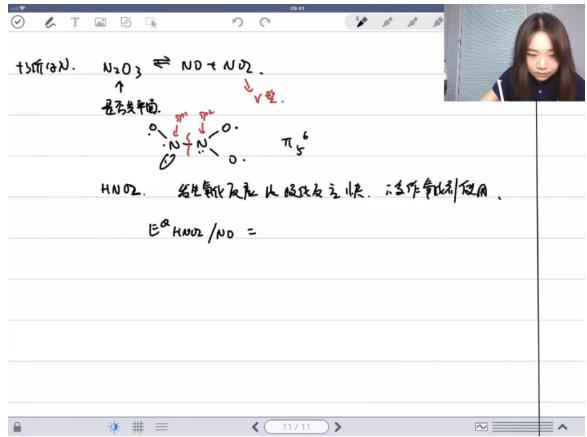

text_image

+SO₄(N). N₂O₃ ⇌ NO + NO₂.
↑
是否生成
N⁺/N⁻¹⁰
O
π₅⁶
HNO₂. 若生成氧化反应比较反应快，若作氧化剂使用，
EaHNO₂/NO =

# 三氧化二氮：

- 可解离为NO和NO $_{2}$   
- 分子呈V型，所有N原子为 $sp^{2}$ 杂化  
○ 存在 $\pi5^{6}$ 大 $\pi$ 键

# ● 亚硝酸：

- 反应特性：氧化反应快于歧化反应，常用作氧化剂  
- 脱水产物：可形成 $NO^{+}$ 离子

■ 与CO为等电子体  
既是σ给体又是π受体  
■ 强路易斯酸，可与 $F^{-}$ 反应生成NOF（V型结构）

阴离子： $NO_{2}^{-}$ 为V型结构

☐ 注：笔记中所有化学方程式和结构描述均严格遵循课程原始内容，保留了关键反应机理和结构特征的解释，并按照康奈尔笔记法进行了系统化整理。

# ■ 一氧化氮的反应与性质 02:40:23

# ● 一氧化氮的氧化特性

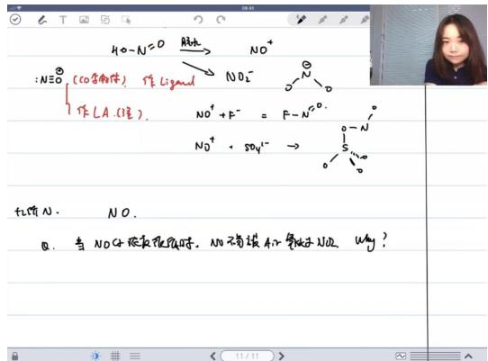

text_image

40-N=0
NO-
N≡O (COOH)
作Ligand
NO2-
作LA(湿).
NO+ + P- = P-N°0.
NO+ · SO42- →
tions N. NO.
①. 当NOCH浓和焦固时，NO有铵A的等效水NO2，Why?
11/11

- 浓度依赖反应性：高浓度NO会迅速被空气氧化为 $NO_{2}$ ，而汽车尾气中的低浓度NO难以被氧化  
○ 二聚体反应机理：动力学研究表明NO在反应速率控制步骤中常以二聚体 $(N_{2}O_{2})$ 形式参与反应  
电子结构解释：NO分子含有单电子，二聚后更容易被氧化，解释了高浓度时的快速氧

尾气处理困境：尾气中NO浓度过低导致无法有效二聚，因此以单体形式存在时氧化速率显著降低

\- 氮的+1价化合物

text_image

当NO₄被灰色物质, NO不溶态和氢键比NO₂. Why?
ROS ≠ NO是以二整体形式替代反应. =整体极析
N₂D. - + N=N=0

○
○ $N_{2}O$ 性质:

■ 热力学特性：酸性条件下电极电势达1.5-2.0V，具有强氧化性  
■ 动力学特性：实际反应活性较低，动力学上不活泼

○ $N_{2}O_{2}^{2-}$ 离子:

■ 结构特征：氮氮单键连接的负离子结构  
■ 存在性：教材中记载但实际应用罕见

■ 磷的氧化物与多磷酸的结构 02:46:03

\- 磷氧化物系列

text_image

N2O2
[ O-N-O ]1-

○ 组成范围：从 $P_{4}O_{6}$ 到 $P_{4}O_{10}$ ，氧原子数逐步增加

○ 结构演变：

■ $P_{4}O_{6}$ ：白磷四面体每条棱上添加氧原子  
■ $P_{4}O_{10}$ ：进一步氧化磷的孤对电子

○ 水解产物：

■ $P_{4}O_{6}$ 水解生成亚磷酸( $H_{3}PO_{3}$ )  
■ $P_{4}O_{10}$ 水解生成正磷酸( $H_{3}PO_{4}$ )

\- 磷酸及其衍生物

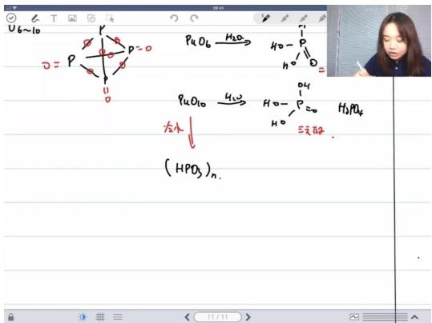

chemical

Hand-drawn chemical reaction diagram showing phosphorus oxidation with water to form HPO₄ and H₂PO₄, with an inset photo of a person observing.

# ○ ○ 亚磷酸特性：

■ 结构： $H_{3}PO_{3}$ 实际为二元酸，因含P-H键  
■ 区分要点：与表观羟基数的差异是常见考点

# ○ 多磷酸形成：

■ 脱水机制：磷酸分子间脱水形成 $(HPO_{3})_{n}$ 链状或环状结构  
■ 结构特征：每个磷原子平均连接3个氧原子  
■ 酸性差异：链中间OH酸性强于端基OH

# - 多磷酸的化学性质

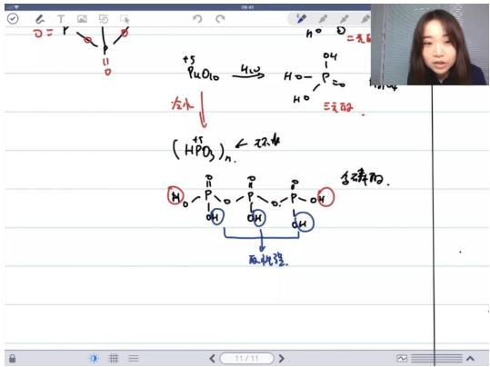

chemical

Hand-drawn chemical reaction diagram showing phosphorus transformation with H2O3 and H2O2, including reaction conditions and products like (HPD3)2.

# ○ 电子效应：

■ 中间OH受相邻P=O强极性键影响，质子更易解离  
■ 端基OH仅受单个P=O影响，酸性较弱

# ○ 分析方法：

■ 滴定法可测定链状多磷酸的聚合度n值   
■ 通过酸性差异可判断链长结构特征

# ■ 链状多磷酸的滴定分析 02:52:17

# - 滴定法判断聚合度n

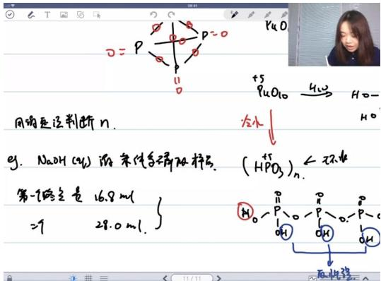

text_image

用的底设判断n.
g. NaOH (OH) 的条件是磷的核苷.
第一峰含量 16.8ml
=9 28.0ml.
+5
940
H2O
4H2
H2O-
冷水
(HPO3)n.
←环水
①P=O-P=O-P=O
OH
OH
OH
取性质

实验方法：使用氢氧化钠溶液滴定链状多磷酸 $(HPO_{3})_{n}$ 样品溶液

# - 终点数据：

■ 第一个终点：16.8 mL  
■ 第二个终点：28.0 mL  
■ 关键差值：28.0 mL - 16.8 mL = 11.2 mL

# 滴定原理

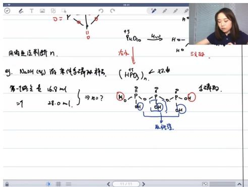

text_image

用钠定位判断n.
g₁. NaOH (mg) 的条件等稀释
第一次含量 16.8 ml
=9 28.0 ml. } ⇒ NaO?
+3
P4O10 → 4H2 → H2O → 5H2
(HPdO3)n.
H2O P-O → P-OH
↓
反洗理.
生锈的.
11/11>

# 结构特性：

● 端基OH：1个OH对应半个P=O双键（强极性键）  
- 中间OH：1个OH对应1个完整P=O双键

# 酸性差异：

● 端基第一个 $H^{+}$ ：酸性最强（一元酸特性）  
● 端基第二个 $H^{+}$ ：酸性较弱（二元酸第二个 $H^{+}$ 特性）  
- 中间OH：酸性中等（一元酸特性）

# ○ 计算方法

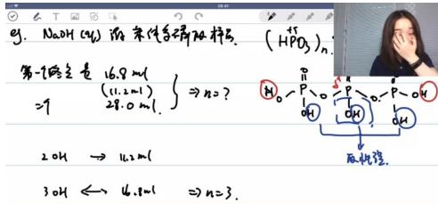

text_image

g. NaOH (aq) 的条件是添加物。
第一反应量 16.8 ml
(11.2 ml)
28.0 ml.
⇒ n=0?
H₀ P O P O
OH
2 OH → 16.2 ml
3 OH ← 4.8 ml ⇒ n=3.

# ■

# 关键步骤：

● 11.2 mL对应2个端基OH（差值计算）  
● 16.8 mL对应3个中间OH（比例关系）

# 结论推导：

- 链状结构判定：两个终点说明是链状而非环状  
● 聚合度计算：n=3（通过OH比例关系得出）

# 常见误区：

● 不能直接用28.0 mL计算，必须用差值11.2 mL  
● 端基OH与中间OH的当量关系不同

# - 分析化学常识

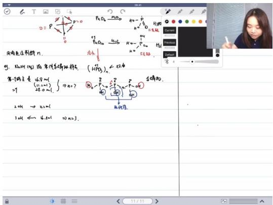

text_image

肉肉毛坯判断 n.
想, 20cm (m) 的条件和性质符号
=1
(1:1-1)
+1.0 m,
即 n??
R₀ → 4.0 m
①n₁ ← 4.0 m → n??
(1:1-1)
HPO₃
H₂O₃ → H₂O₃
H₂O₃ → H₂O₃
②n₁ ← 4.0 m → n??
(1:1-1)
HPO₃
H₂O₃ → H₂O₃
③n₁ ← 4.0 m → n??
(1:1-1)
④n₁ ← 4.0 m → n??
(1:1-1)
⑤n₁ ← 4.0 m → n??
(1:1-1)
⑥n₁ ← 4.0 m → n??
(1:1-1)
⑦n₁ ← 4.0 m → n??
(1:1-1)
⑧n₁ ← 4.0 m → n??
(1:1-1)
⑨n₁ ← 4.0 m → n??
(1:1-1)
⑩n₁ ← 4.0 m → n??
(1:1-1)
⑪n₁ ← 4.0 m → n??
(1:1-1)
⑫n₁ ← 4.0 m → n??
(1:1-1)
⑬n₁ ← 4.0 m → n??
(1:1-1)
⑭n₁ ← 4.0 m → n??
(1:1-1)
⑮n₁ ← 4.0 m → n??
(1:1-1)
⑯n₁ ← 4.0 m → n??
(1:1-1)
⑰n₁ ← 4.0 m → n??
(1:1-1)
⑱n₁ ← 4.0 m → n??
(1:1-1)
(2) n??
(2) n??
(2) n??
(2) n??
(2) n??
(2) n??
(2) n??
(2) n??
(2) n??
(2) n??
(2) n??
(2) n??
(2) n??
(2) n??
(2) n??
(2) n??
(2) n??
(2) # n??
(2) # n??
(2) # n??
(2) # n??
(2) # n??
(2) # n??
(2) # n??
(2) # n??
(2) # n??
(2) # n??
(2) # n??
(2) # n??
(2) # n??
(2) # n??
(2) # n!?
(2) # n!?
(2) # n!?
(2) # n!?
(2) # n!?
(2) # n!?
(2) # n!?
(2) # n!?
(2) # n!?
(2) # n!?
(2) # n!?
(2) # n!?
(2) # n!?
(2) # n!?
(2) # n!?

# ○ ○ 核心考点：

■ 物质当量关系计算（1:1或1:2等）  
■ 终点差值的重要性（非绝对体积值）

# ○ 近年趋势：

■ 减少纯分析化学考查  
■ 侧重化学平衡与当量关系

# ○ 记忆要点：

■ 链状多磷酸必有两个滴定终点  
环状多磷酸只有一个终点

# ■ 砷的氧化物 02:58:04

# ● 常见氧化物

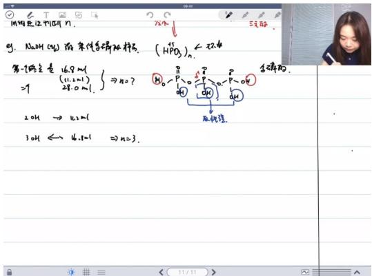

text_image

MnOH 12.11(3H) N
75.4
5元/瓶
O₂: NaOH (CH₃) 溶-杂价多烯酸钠粉。(HPO₄)ₙ ← 环滴
第-7项元素 16.8 ml
(11.2ml)
28.0 ml.
N₀-P(OH)₃
→ 4.3ml
3OH ← 4.8ml → n=3.
反应式：
反浓度：

# ○ 稳定形态：

$As_{2}O_{3}$ （正三价氧化物）  
$As_{2}O_{5}$ （存在但不稳定）

# ○ 对比元素:

■ 锑： $Sb_{2}O_{3}$ 、 $Sb_{2}O_{5}$ （存在）  
■ 铋： $Bi_{2}O_{5}$ （极不稳定，易分解）

# - 化学性质

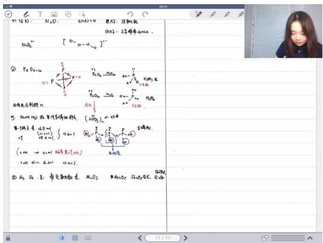

text_image

PbO₄²⁻¹ [O₂H-CH₂]²⁺
② PbO₄²⁻¹ (OH)₃ + 2SO₄ → Fe(OH)₃
Fe(OH)₃ + Fe(OH)₃ + Fe(OH)₃ → Fe(OH)₃ + Fe(OH)₃
Fe(OH)₃ + Fe(OH)₃ + Fe(OH)₃ → Fe(OH)₃ + Fe(OH)₃
Fe(OH)₃ + Fe(OH)₃ + Fe(OH)₃ → Fe(OH)₃ + Fe(OH)₃
Fe(OH)₃ + Fe(OH)₃ + Fe(OH)₃ → Fe(=O)₃ + Fe(=O)₃ + Fe(=O)₃ + Fe(=O)₃
Fe(OH)₃ + Fe(OH)₃ + Fe(OH)₃ → Fe(=O)₃ + Fe(=O)₃ + Fe(=O)₃ + Fe(=O)₃
Fe(OH)₃ + Fe(OH)₃ + Fe(OH)₃ → Fe(=O)₃ + Fe(=O)₃ + Fe(=O)₁
Fe(OH)₃ + Fe(OH)₃ + Fe(OH)₃ → Fe(=O)₃ + Fe(=O)₃ + Fe(=O)₃ + Fe(=O)₃
① Fe₂, H₂, B₁, Na⁺, H₂O, H₂O₃, H₂O₂, H₂O₁, H₂O₂, H₂O₁, H₂O₂, H₂O₁, H₂O₂, H₂O₁, H₂O₂, H₂O₁, H₂O₂, H₂O₁, H₂O₂, H₂O₁, H₂O₂, H₂O₁, H₂O₂, H₂O₁, H₂O₂, H₂O₁, H₂O₂, H₂O₀, H₂O₁, H₂O₂, H₂O₁, H₂O₂, H₂O₁, H₂O₂, H₂O₁, H₂O₂, H₂O₁, H₂O₂, H₂O₁, H₂O₂, H₂O₁, H₂O₂, H₂O₁, H₂O₂, H₂O₁, H₂O₂, H₂O₁, H₂O₁, H₂O₁, H₂O₁, H₂O₁, H₂O₁, H₂O₁, H₂O₁, H₂O₁, H₂O₁, H₂O₁, H₂O₁, H₂O₁, H₂O₁, H₂O₁, H₂O₁, H₂O₁, H₂O₁, H₂O₁, H₂O₁, H₂O₀, H₂O₀

O

# - 稳定性规律：

■ 从上到下高价氧化物稳定性降低  
■ $Bi_{2}O_{5}$ 会分解放出氧气

# ○ 结构特征：

■ 三价氧化物均为 $M_{2}O_{3}$ 形式  
■ 五价氧化物随原子序数增大稳定性下降

# ■ 磷酸根 02:58:54

# ■ 磷酸根的基本结构 02:59:19

● 杂化方式: 所有磷酸根中的磷原子均为 $sp^{3}$ 杂化  
● 空间构型: 呈现四面体构型  
● 常见形式: 最常见的是 $PO_{4}^{3-}$ （正磷酸根）

# ■ 磷酸根的变种：焦磷酸等 03:00:04

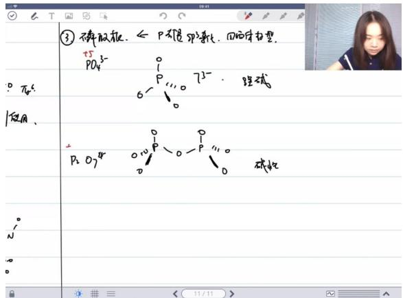

text_image

③ 不溶胶瓶. ← P 不溶于磷化, 回溶于力塑.
+5
PO₄³⁻
⁰ π/4³⁻
使用.
P₂O₇⁴⁻
⁰ + 0 P - 0 P - 0 P - 0 P - 0 P - 0 P - 0 P - 0 P - 0 P - 0 P - 0 P - 0 P - 0 P - 0 P - 0 P - 0 P - 0 P - 0 P - 0 P - 0 P - 0 P - 0 P - 0 P - 0 P - 0 P - 0 P
碱性
碱性
碱性
11/11

\- 焦磷酸: 由两个磷酸根通过氧原子连接形成 $P_{2}O_{7}^{4-}$

● 多磷酸: 可继续连接形成更长的链状结构

● 碱性比较: 焦磷酸的碱性弱于正磷酸根 $(PO_{4}^{3-})$

# ■ 正四价磷酸 03:01:02

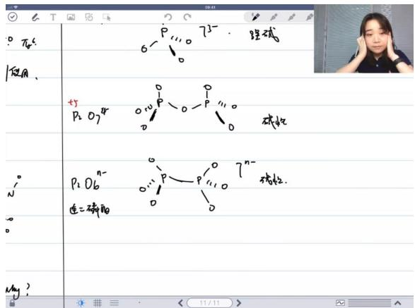

text_image

P₄
使用
+5
P₂O₇⁴⁻
连二磷酸
7³⁻ 硫碱
P₁O₆⁰⁻
连二磷酸
P₁O₆⁰⁻
P₁O₆⁰⁻
P₁O₆⁰⁻
P₁O₆⁰⁻
P₁O₆⁰⁻
P₁O₆⁰⁻
P₁O₆⁰⁻
P₁O₆⁰⁻
P₁O₆⁰⁻
P₁O₆⁰⁻
P₁O₆⁰⁻
P₁O₆⁰⁻

特殊形式: $P_{2}O_{6}^{4-}$ (连二磷酸根)

● 结构特点: 将多磷酸中间的氧替换为P-P单键

● 化合价: 磷呈现+4价，较为少见

● 电荷数: 带4个负电荷

# ■ 亚磷酸与正三价磷 03:02:45

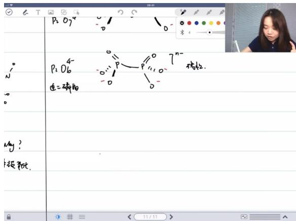

text_image

P₂O₇⁴
P₂O₆
连二磷酸
P₁O₇⁴
P₁O₆
连二磷酸
P₁O₇⁴
P₁O₆
连二磷酸
P₁O₇⁴
P₁O₆
连二磷酸
P₁O₇⁴
P₁O₆
连二磷酸
P₁O₇⁴
P₁O₆
连二磷酸
P₁O₇⁴
P₁O₆
连二磷酸
P₂O₇⁴
P₂O₆
P₂O₇⁴
P₂O₆
连二磷酸
P₂O₇⁴
P₂O₆
连二磷酸

●   
- 化学式: $HPO_{3}^{2-}$   
● 化合价: 磷呈现+3价  
● 性质特征: 主要表现还原性，同时具有弱碱性

■ 正一价磷与次磷酸 03:03:23  
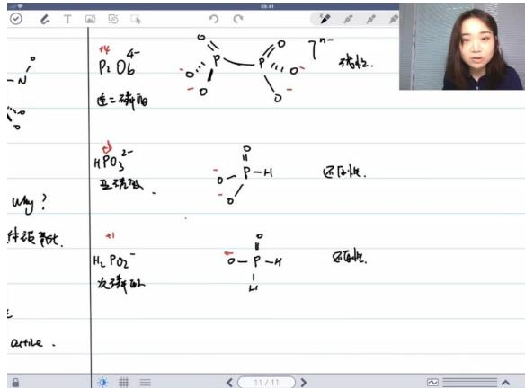

text_image

-
N
...
why?
体积：pot.
active.
4P2O6
连二磷的
HPO3
亚硝酸
H2PO2
次磷酸的
7n-才粒。
0-P-H 还反应。
0-P-H 8%反应。

●   
- 化学式: $H_{2}PO_{2}^{-}$   
- 化合价: 磷呈现+1价  
● 应用: 在有机化学中用于去除氨基（与亚硝酸反应后）  
● 还原性: 具有强还原性

■ 特殊磷酸盐结构与性质 03:04:41  
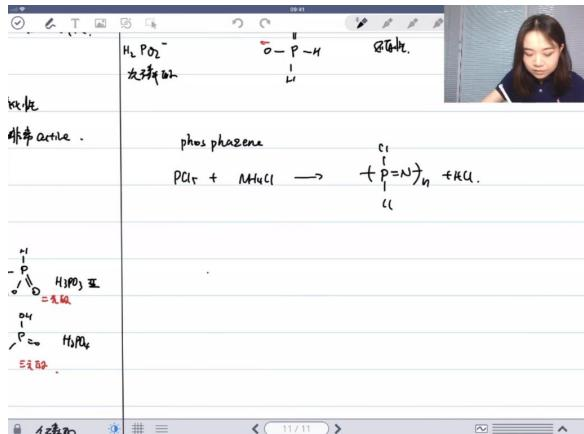

text_image

H₂PO₂⁻
O—P—H
反应性.
次序反应
Kα比
非苯active.
phosphazene
Cl
PCl₄ + NH₄Cl → (+P=N)ₙ + HCl.
=无级.
H₁PO₃蓝
P₄
P=O H₁PO₄
三元酚.
11/11

●   
● 形成反应: 由氯化铵和五氯化磷反应生成  
● 聚合特性: 可形成环状结构（如六元环 $P_{3}N_{3}Cl_{6}$ ）  
● 结构特点: 磷氮交替排列，磷上连接氯原子  
● 反应性: 可与格氏试剂反应将氯全部替换为其他基团  
● 对称性: 具有高度对称的结构，常作为无机推断题的考点

二、知识小结

<table><tr><td>知识点</td><td>核心内容</td><td>考试重点/易混淆点</td><td>难度系数</td></tr><tr><td>硼族元素化学</td><td>硼的氢化物、卤化物、氧化物性质及结构特点</td><td>硼酸根结构(SP2/SP3杂化共存)、硼烷结构类型判断(闭合/巢/网状)</td><td></td></tr><tr><td>碳族元素化学</td><td>碳单质反应性、硅烷稳定性、四卤化碳热力学/动力学稳定性差异</td><td>石墨与BN反应性对比(能带理论解释)、硅氧四面体与硼酸根结构差异</td><td></td></tr><tr><td>氮族元素概述</td><td>电负性反常(N&gt;P)、成键特性(N倾向多重键)、惰性电子对效应</td><td>Alternation effect在氮族的表现、五价化合物稳定性趋势</td><td></td></tr><tr><td>氮氧化物化学</td><td>从N2O到N2O5的价态变化及结构特征</td><td>NO2二聚平衡、硝酸分子态/离子态氧化性差异、亚磷酸实际为二元酸</td><td></td></tr><tr><td>磷氧化物体系</td><td>P4O6→P4O10的氧化过程、多磷酸结构(链状/环状)</td><td>磷酸根SP3杂化统一性、多磷酸滴定终点分析(n值计算)</td><td></td></tr><tr><td>特殊化合物</td><td>叠氮酸(HN3)结构(V型)、N5+离子共振式、磷氮烯聚合物</td><td>N3-直线型与HN3构型对比、PCI5固态离子化现象</td><td></td></tr><tr><td>学习策略</td><td>元素化学学习方法:多教材交叉验证、区分核心与边缘知识</td><td>格林伍德使用时机(基础扎实后再拓展)、结构推导优先于记忆</td><td></td></tr></table>