# 一、氧族00:13

# 1. 作业 02:21

1）例题1: 正常水解反应 02:33  
● 加热条件影响：在加热条件下，碱土金属氢氧化物的稳定性较差，而碱金属氢氧化物稳定性相对较好  
● 极化能力影响: 阳离子极化能力越强的氢氧化物稳定性越差  
2）例题2: 井和亚硝酸的反应 03:31  
● 反应类比: 类似于苯胺与亚硝酸反应制备重氮盐的过程  
● 产物特征: 反应生成重氮酸 ( $HN_{3}$ )

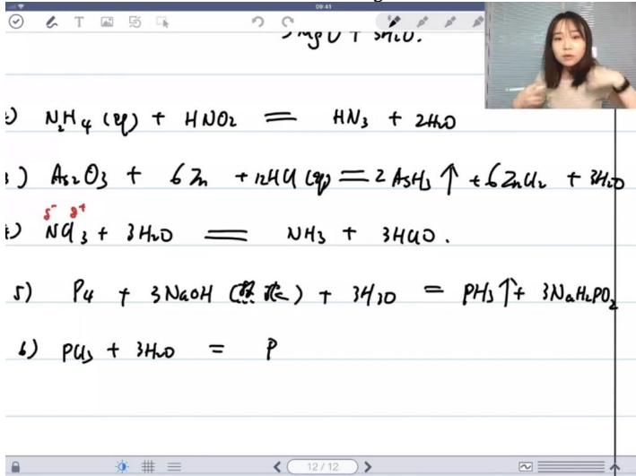

chemical

Handwritten chemistry reaction equations involving ammonia, sulfuric acid, and phosphoric acid with water, showing reactions and products

3）例题3: 三氧化二砷（邳霜）与锌和盐酸的反应 04:06  
● 还原程度: 反应需要考察砷被还原的价态  
● 产物判断: 生成砷化氢气体 ( $AsH_{3}\uparrow$ )  
4）例题4: 氮带德尔塔负的水解反应 04:47  
● 电性分析: 氮原子带δ负电, 氯原子带δ正电  
● 水解方向: 氢与氮结合, 羟基与氯结合  
● 产物判断: 水解生成氨 $(NH_{3})$ 而非氮氧化物  
5）例题5: 磷在热浓碱性条件下的歧化反应 05:27

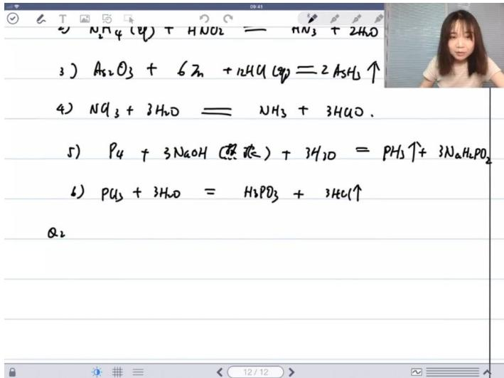

text_image

2) NH₄ (aq) + HNO₂ = NH₃ + 2H₂O
3) As₂O₃ + 6Zn + 2HCl (aq) = 2AsH₃↑
4) Na₃ + 3H₂O = NH₃ + 3H₂O.
5) P₄ + 3NaOH (热浓) + 3H₂O = PH₃↑ + 3Na₂H₄PO₂
6) PU₃ + 3H₂O = H₃PO₃ + 3HCl↑
Q₂

反应条件: 热浓氢氧化钠溶液

● 产物特征: 生成磷化氢 ( $PH_{3}\uparrow$ ) 和次磷酸钠 ( $NaH_{2}PO_{2}$ )  
● 酸性特征: 次磷酸是一元酸

6）例题6: 三氯化磷的水解反应 06:07

● 路易斯酸性: 三氯化磷是良好的路易斯酸  
● 应用价值: 与路易斯碱反应是制备磷簇体的重要方法  
● 水解产物: 生成亚磷酸 $\left(H_{3}PO_{3}\right)$ 和氯化氢

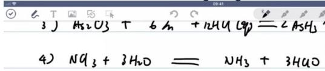

chemical

Chemical reaction equation showing diazotization of ethylene with sodium hydroxide and ammonia to form 2,4,5,6,7,8,9,10,11,12,13,14,15,16,17,18,19,20,21,22,23,24,25,26,27,28,29,30,31,32,33,34,35,36,37,38,39,40,41,42,43,44,45,46,47,48,49,50,51,52,53,54,55,56,57,58,59,60,61,62,63,64,65,66,67,68,69,70,71,72,73,74,75,76,77,78,79,80,81,82,83,84,85,86,87,88,89,90

5) $P_{4} + 3NaOH$ (蒸馏) + $3H_{2}O = PH_{3}\uparrow + 3Na_{2}H_{2}PO$

6) $P_{u_{2}} + 3H_{2}O = H_{3}PO_{3} + 3HCl \uparrow$

Q2

例题7: 二氧化氮通入氢氧化钠的歧化反应 08:33  
● 反应类型: 典型的歧化反应  
● 反应机理: 二氧化氮在碱性条件下发生价态变化  
8）例题8: 三氯化磷的氧化反应 08:57  
● 反应特征: 三氯化磷被氧化生成特定产物  
● 注意事项: 与水解反应的区别  
9) 例题9: 次磷酸与过量氢氧化钠的反应 09:08  
● 关键考点: 次磷酸是一元酸的性质  
● 反应判断: 与过量碱反应的特征  
10）例题10: 亚磷酸与过量氢氧化钠的反应 09:24  
● 结构特征: 需要正确画出亚磷酸的结构式  
● 反应判断: 基于结构判断与碱反应的特性

2. 上节题目 09:35

1）例题:磷酸和亚磷酸的电离

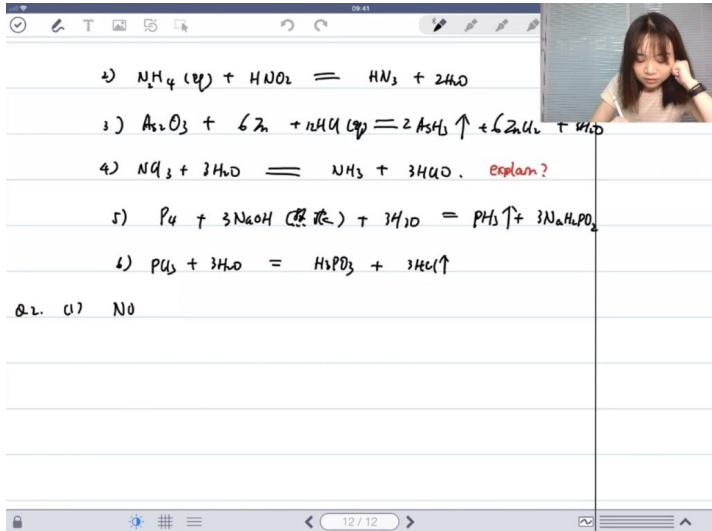

text_image

2) NH₄ (H) + HNO₂ = HN₃ + 2H₂O
3) As₂O₃ + 6Zn + NH₄ (Hg) = 2AsH₃↑ + 6ZnH₂ + H₂O
4) NH₃ + 3H₂O = NH₃ + 3H₂O. explain?
5) P₄ + 3NaOH (烧杯) + 3H₂O = pH₃↑ + 3NaH₆PO₂
6) Pd + 3H₂O = H₂PO₃ + 3HCl↑
Q2. (1) NO

关键反应：

$\circ NH_{4}^{+}(aq) + HNO_{2} = HN_{3} + 2H_{2}O$   
$\circ \quad As_{2}O_{3} + 6Zn + 12H_{2}O(aq) = 2AsH_{3}\uparrow +6ZnO_{2} + 3H_{2}O$   
○ $Na_{3}N + 3H_{2}O = NH_{3} + 3NaOH$   
$\circ P_{4} + 3NaOH(\text{热浓}) + 3H_{2}O = PH_{3}\uparrow + 3NaH_{2}PO_{2}$   
○ $P_{4} + 3H_{2}O = H_{3}PO_{3} + 3H_{2}\uparrow$

# 2）例题:硫酸氨加热产物 10:01

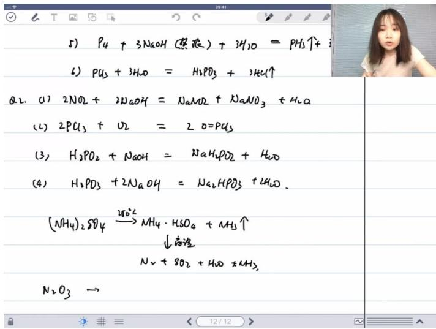

text_image

5) P4 + 3NaOH (热浓) + 2H2O = PH3↑;
6) PCu3 + 3H2O = H2PO3 + 3HCl↑
Q2. (1) 2NO2 + 2NaOH = NaMO2 + NaNO3 + H2O
(2) 2PCu3 + O2 = 2O=PCu3
(3) H3PO2 + NaOH = NaH4PO2 + H2O
(4) H3PO3 + 2NaOH = Na2HPO3 + 2H2O.
(NH4)2SO4 → NH4·HSO4 + NH3↑
↓溶液
Nv + 8O2 + H2O + NH3,
N2O3 →

# ● 加热产物：

○ 250°C分解： $(NH_{4})_{2}SO_{4}\rightarrow NH_{4}\cdot HSO_{4}+NH_{3}\uparrow$   
○ 高温分解：最终产物为 $N_{2}+SO_{2}+H_{2}O$ ，而非 $NH_{3}$ 和硫酸

# ● 实验验证：

- 文献证实硫酸氨加热不会生成氨和硫酸  
- 高温下测得的气体混合物包含氮气、二氧化硫和水

# 3）例题:a元素推断 14:07

# ● 题目信息

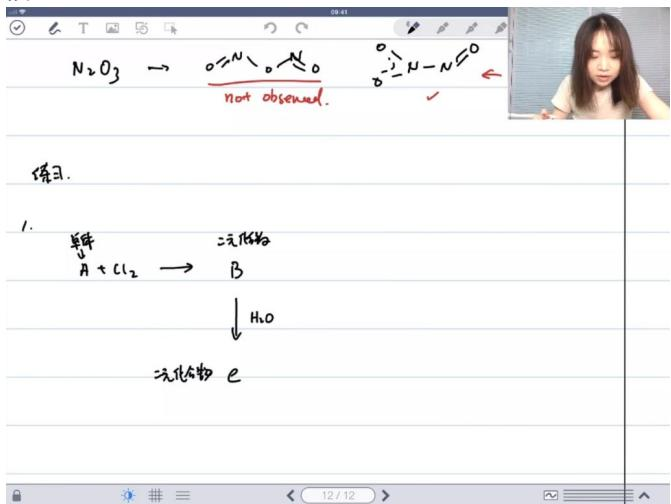

text_image

N₂O₃ → 0=N-N=0
not observed.
N-N=0
练习.
单体        二元化物
A + Cl₂ → B
↓ H₂O
   二元化物 e

# ○ 关键条件：

■ 价电子主量子数n=4  
生成氢化物 $AH_{3}$   
■ 化合物c具有4个 $C_{3}$ 旋转轴（正四面体构型）

# - 解题过程

# ○ 对称性分析：

■ $C_{3}$ 旋转轴：正三角锥有1个 $C_{3}$ 轴（旋转120°重合）  
■ 对称面数量：正三角锥有3个对称面

■ 正八面体：主轴为 $C_{4}$ 旋转轴  
■ 水分子：有1个 $C_{2}$ 轴和2个对称面

# ○ 元素推断：

■ A元素确定：价电子n=4且生成 $AH_{3}\rightarrow$ 砷(As)  
■ 化合物推导：

B: $AsCl_{3}$ (三氯化砷)

D: $AsCl_{5}$ (五氯化砷)

E: $AsEt_{3}$ (三乙基砷)

● C: $As_{4}O_{6}$ (六氧化四砷，类比 $P_{4}O_{6}$ 结构)

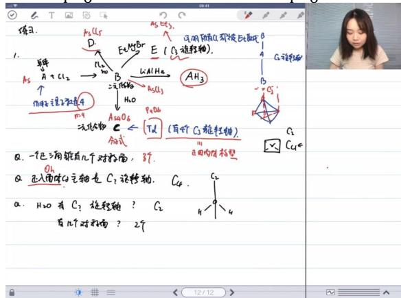

text_image

项目.

1. 
As A + Cl₂↑
→
mH₂ 碳子酸 4
→
无水物 C ← (有针 C₃ 气粒物)
式
→
Al₂O₆
H₂O
PdO₆
Td
(有针 C₃ 气粒物)
→
Al₂O₅
AsCl₃
B
E (C₃ 旋粒物)
wAlH₂
AH₃

Q. 一个3角锥直几个对称面，37.
Q. 进入固体的主轴是 C₁ 旋粒物，C₄.

α. H₂O 有 C₃ 旋粒物？ C₂
有几个对称面？2个

# ○ 结构特点：

■ 六氧化四砷具有正四面体结构，氧原子位于棱上  
■ 与三氯化砷反应的格式试剂可完全取代氯原子

# - 重要概念

# ○ 点群与对称性：

■ TD点群对应正四面体构型  
■ 国初考试常回避点群术语，用"4个 $C_{3}$ 轴"描述正四面体  
■ 常见分子对称性：

● 水分子： $C_{2}$ 轴+2个对称面  
- 正八面体： $O_{h}$ 点群

# 4）例题:二元化合物推断 37:27

# - 反应体系分析

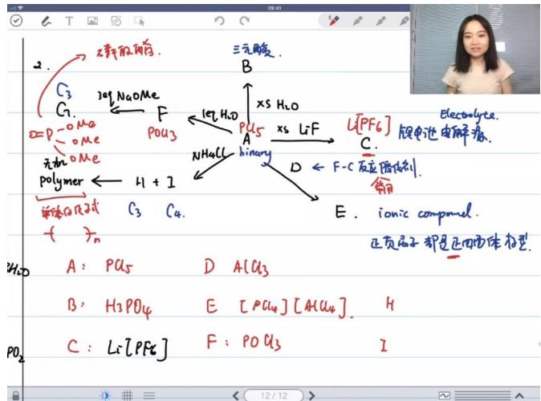

text_image

2. ×碳取代有.
C₃ 3.9g NaOMe
G₁ F
ε = D - O Me POU₃
O Me
无机 O Me
Polymer ← H + I
单体的反式 C₃ C₄.
f > n
H₂O A: PCa₅ D AlCl₃
B: H₃PO₄ E [PCa₄][AlCl₄]. H
PO₂ C: Li[PF₆] F: POCl₃ I
三元酸.
B
×(L H₂O) PdI₅ xS LiF L[PF₆]
A binary D ← F-C反应催化剂.
E. ionic compound.
正负离子都是正四面体机型.
Electrolyte.
锂电池电解液。
保留

○ 二元化合物定义：由两种元素组成的化合物称为二元化合物（binary compound）

# ○ 反应路径：

■ 化合物A（ $PCl_{5}$ ）与过量水反应生成三元酸B（ $H_{3}PO_{4}$ ）

■ A与一当量水反应生成化合物F ( $POCl_{3}$ )  
■ F与三当量甲醇钠反应生成G（磷酸三甲酯），具有 $C_{3}$ 旋转轴  
■ A与过量LiF反应生成C（ $Li[PF_{6}]$ ），用作锂电池电解液  
■ A与D（ $AlCl_{3}$ ）反应生成离子化合物，正负离子均为正四面体构型  
■ A与氯化铵反应生成H和I的混合物，均可转化为无机聚合物

# ● 关键化合物解析

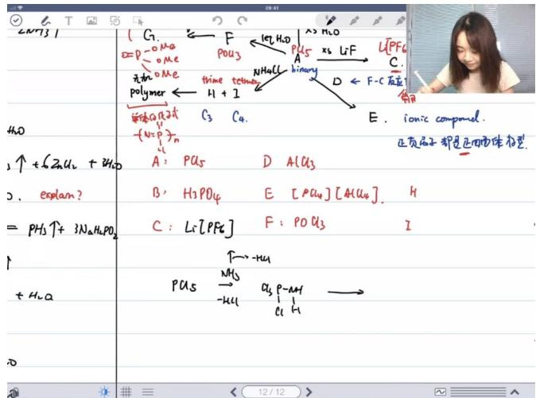

text_image

C1: 
C=P
O M e
P O U 3
H N H C l
P O U 5
A
x s Li F
L P F C
C
P O U 4
H + I
D ← F-C 玻立
pymer ←
trime tetrahedral
H + I
C3 C4.
E. ionic compound.
-N-P)
正负离子都是正四固体有型.
↑ +6Cu2 + H2O
A: P O 5 D Al Cu3
B: H2PO4 E [P Cu4] [Al Cu4]. H
C: Li [P Fe]
F: PO Cu3 I
↑ → -HCl
P O U 5 → NH3
-H Cl CH3 P-NH →
+ H2O
D

○ C的稳定性： $Li[PF_{6}]$ 中 $PF_{6}^{-}$ 为正八面体结构，使该物质特别稳定  
○ D的选择依据：必须能形成正四面体离子，排除了 $AlBr_{3}$ 等替代物  
○ 聚合物形成机理：  
■ 先通过氯化铵分解产生 $NH_{3}$   
■ 经历亲核进攻和β消除反应  
■ 最终通过缩聚反应形成无机聚合物

# - 结构特征验证

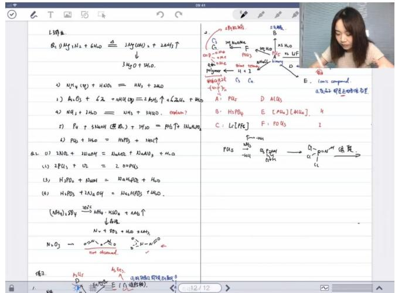

text_image

L溶血
B1: NH2 + 6H2O ⇌ 3NH2(OH)2 + 2eH3↑
↓
3H2O + 4H2O.
1) NH4(OH)2 + 2H2O = NH3 + 2H2O
1) A2O3 + 6H2O + NH4(OH)2 = 2NH3↑ + 6H2O + H2O
2) NH3 + 2H2O = NH3 + 3H2O. 气体?
3) P4 + 5NaOH (还原) + 1H2O = P4O↑ + NH4PO4
4) P4O + H2O = P4PO3 + NH3↑
A2: 2NaOH + 2H2OH = NaOH + NaNH3 + H2O
(1) 2PO43 + O2 = 2 O=PO3
(3) H2PO4 + NH3 = NH4PO43 + H2O
(6) H2PO4 + 2NaOH = NH4PO43 + H2O.
(NaOH)2PO4 → NH4·H2O + NH3↑
↓溶液
N2O3 → 0.5×10^-7 × 0.5×10^-7
→ N₂O₃
→ 0.5×10^-7 × 0.5×10^-7
→ 0.5×10^-7 × 0.5×10^-7
结论:
A: PO4 → D: NH3
B: H2PO4 → E: [PO4] [NH4O]
C: Li[PO4] → F: PO4S
F: NH4
P4S → CH3
CH3 → CH3
CH3 → CH3
CH3 → CH3
CH3 → CH3
CH3 → CH3
CH3 → CH3
CH3 → CH3
CH3 → CH3
CH3 → CH3
CH3 → CH3
CH3 → CH3
CH3 → CH3
CH3 → CH3
CH3 → CH3
CH3 → CH3
CH3 → CH3
CH3 → CH3

○ H和I的结构：

■ H为三聚体（trimer），具有 $C_{3}$ 旋转轴

■ I为四聚体（tetramer），具有 $C_{4}$ 旋转轴

■ 实验室实际得到的是三聚体和四聚体的混合物

○ 单体化学式：正确写法应为 $(NPCl_{2})_{n}$ ，需注意氯原子连接在磷原子上

# - 反应机理补充

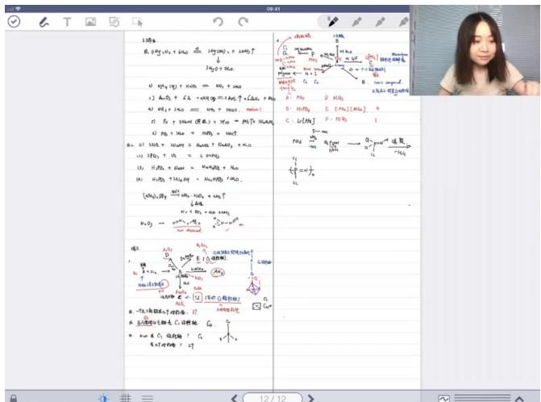

text_image

1. 2. 3. 4. 5. 6. 7. 8. 9. 10. 11. 12. 13. 14. 15. 16. 17. 18. 19. 20. 21. 22. 23. 24. 25. 26. 27. 28. 29. 30. 31. 32. 33. 34. 35. 36. 37. 38. 39. 40. 41. 42. 43. 44. 45. 46. 47. 48. 49. 50. 51. 52. 53. 54. 55. 56. 57. 58. 59. 60. 61. 62. 63. 64. 65. 66. 67. 68. 69. 70. 71. 72. 73. 74. 75. 76. 77. 78. 79. 80. 81. 82. 83. 84. 85. 86. 87. 88. 89. 90. 91. 92. 93. 94. 95. 96. 97. 98. 99. 100.
a) H(0) + H(1) = H(2) + H(3)
b) H(0) + H(1) = H(2) + H(3)
c) H(0) + H(1) = H(2) + H(3)
d) H(0) + H(1) = H(2) + H(3)
e) H(0) + H(1) = H(2) + H(3)
f) F(0) + F(1) = F(2) + F(3)
g) G(0) + G(1) = G(2) + G(3)
h) h(0) + h(1) = h(2) + h(3)
i) i(0) + i(1) = i(2) + i(3)
j) j(0) + j(1) = j(2) + j(3)
k) k(0) + k(1) = k(2) + k(3)
l) l(0) + l(1) = l(2) + l(3)
m) m(0) + m(1) = m(2) + m(3)
n) n(0) + n(1) = n(2) + n(3)
o) o(0) + o(1) = o(2) + o(3)
p) p(0) + p(1) = p(2) + p(3)
q) q(0) + q(1) = q(2) + q(3)
r) r(0) + r(1) = r(2) + r(3)
s) s(0) + s(1) = s(2) + s(3)
t) t(0) + t(1) = t(2) + t(3)
u) u(0) + u(1) = u(2) + u(3)
v) v(0) + v(1) = v(2) + v(3)
w) w(0) + w(1) = w(2) + w(3)
x) x(0) + x(1) = x(2) + x(3)
y) y(0) + y(1) = y(2) + y(3)
z) z(0) + z(1) = z(2) + z(3)

○ 特殊反应提示： $PCl_{5}$ 与 $NH_{4}Cl$ 的反应较难记忆，需特别注意

■ 反应分步进行：先分解 $NH_{4}Cl$ ，再发生亲核进攻  
■ 中间经历β消除过程  
■ 最终形成环状三聚体或四聚体结构

# 5）氧和硫 50:15

● 氧的单质 52:23

○ 氧气的分子轨道 52:38

text_image

中宠比 3.5 2.6 2.6
4年
8年度
① 02
i
4€

绘制要求：双原子体系必须掌握分子轨道图绘制，这是国初/国爵考试重点  
■ 轨道顺序：按能级从低到高依次为：

- $\sigma_{2s}$ (成键轨道)   
- $\sigma_{2s}^{*}$ (反键轨道)   
• $\sigma_{2p}$   
$\pi_{2p}$ （简并轨道）  
- $\pi_{2p}^{*}$ (反键简并轨道)   
- $\sigma_{2p}^{*}$ (最高能级反键轨道)

■ 氮气特例： $N_{2}$ 的 $\pi_{2p}$ 能级低于 $\sigma_{2p}$ ，电子填充顺序不同

○ 氧气的键级与磁性 53:27

■ 键级计算： $BO=\frac{成键电子数-反键电子数}{2}$ ， $O_{2}$ 的键级为2  
■ 磁性表现：

\- 顺磁性（存在未成对电子）

\- 经典考题：比较 $Na_{2}O_{2}$ 、 $O_{2}$ 、 $O_{2}^{-}$ 的氧氧键级（ $O_{2}$ 最高，键级依次为1、2、1.5）

■ 电子排布： $(\sigma_{2s})^{2}(\sigma_{2s}^{*})^{2}(\sigma_{2p})^{2}(\pi_{2p})^{4}(\pi_{2p}^{*})^{2}$ 是最稳定状态

# ○ 三线态与单线态氧气 55:14

# ■ 三线态氧气

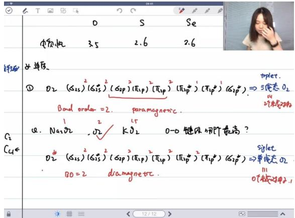

text_image

0 S Se
折负比 3.5 2.6 2.6
① O₂ (S₁₃)² (S₁₃*)² (S₂p)² (T₁p)² (T₁p)² (T₁p*)² (T₁p*)² (S₂p*) ⇒ 淀态 O₂
Bond order = 2 paramagnetic.
② Na₂O₂, O₂ K O₂ O-O 链碳哪个最高？
O₂ (S₁₃)² (S₁₃*)² (S₂p)² (T₁p)² (T₁p)² (T₁p*)² (T₁p*)² (S₂p*) ⇒ 单线态 O₂
O₂ = 2 d/a-magneto.
Siglet
O(铁矿粉)

●

● 定义：基态氧气（triplet $O_{2}$ ）含两个未成对电子  
● 自旋状态：根据公式 $2nI + 1$ （ $I = 1 / 2$ ），两个未成对电子对应三线态  
- 反应特性：

○ 氧化性强但活化能高  
既不是好的σ给体（sigma donor）也不是好的π受体（pi acceptor）  
○ 电子转移需克服配对能

# 单线态氧气

● 激发机制：吸收能量后两个电子填入同一 $\pi_{2p}^{*}$ 轨道  
- 性质变化:

○ 键级仍为2但变为反磁性 (singlet $O_{2}$ )

\- 反应活性增强：成为更好的σ给体和π受体

● 实际应用：过渡金属催化体系中通常产生单线态氧  
● 能级关系：单线态能量更高但更易参与反应（动力学有利）

# - 臭氧的分子结构与极性 01:09:36

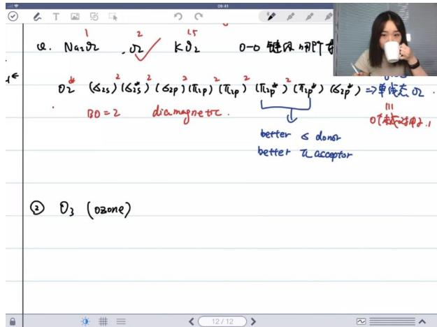

text_image

① Na₂O₂ 2 KO₂ 0→0 链风的↑↑↑
O₂⁴ (S₂₅)² (S₁₅)² (S₂p)² (π₁p)² (π₁p)² (π₁p)² (π₁p)² (S₂p)² →单线态 O₂
O₂ = 2 dia.magnetc.
better ≤ done
better π acceptor
② O₃ (Ozone)

分子形状: V型结构, 中心氧原子采用 $sp^{2}$ 杂化, 含有一个孤电子对  
■ 电子排布: 中心氧原子剩余两个电子与两侧氧原子形成三中心四电子大π键 ( $\pi_{3}^{4}$ )  
■ 路易斯结构：形式电荷计算显示中心氧为+1，两侧氧为-1，导致电荷分布不均  
■ 分子极性:
● 极性判断: 极性分子（polar），是单质分子中极性的典型反例

● 偶极方向：从中心氧（δ+）指向两侧氧（δ-），矢量合成方向如蓝色箭头所示

■ 对称性: 具有 $C_{2}$ 旋转轴

\- 臭氧的颜色与性质 01:16:00

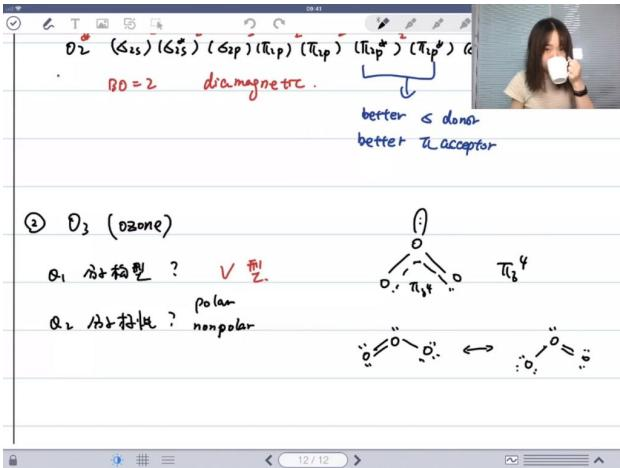

text_image

O2* (S2s) (S2s*) (S2p) (T1p) (T1p) (T1p*) (T1p*) (O
O0 = 2 diamagnetic.
better ≤ dono
better π acceptor
② O3 (ozone)
O1 分构型 ? V 型
O2 分子特性 ? polar
nonpolar
π3 4
← : : : : : : : : : : : : : : : : : : : : : : : : : : : : : : : : : : : : : : : : : : : : : : : : : : : : : : : : : : : : : : : : : : : : : : : : : : : : : : : : : : : : : : : : : : : : : : : : : : : : :
12/12

物理状态:

● 气态: 稀薄浓度时有清新气味，高浓度呈蓝色至黑色   
● 固态: 易爆炸，可自发分解为氧气

化学性质:

● 氧化性: 强氧化剂, 常用于处理含氰废水 $(CN^{-}\rightarrow OCN^{-}\rightarrow CO_{2}+N_{2})$   
● 电子转移: 通常一个臭氧分子可转移两个电子

■ 磁性: 反磁性 (diamagnetic)   
臭氧化物:

● 存在形式: 碱金属臭氧化物（如臭氧化钾KO3）

● 显色机理: 配体到金属的电子转移（LMCT）导致深色（如砖红色）

\- 硫的单质与硫硫键能 01:19:31

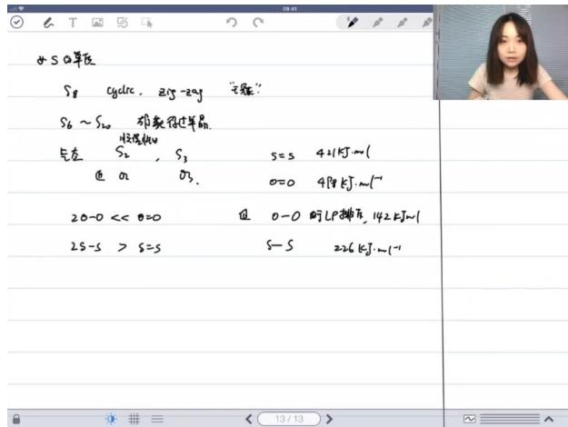

text_image

S0单质
S8 cyclrc, zig-2ay "主题"
S6 ~ S20 雄酸得过单晶.
气态 S2, S3 s=s 421kJ~1
近 o1 o3. o=0 49kJ·m⁻¹
20-0 << o=0 且 0-0 的LP排布, 142kJ~1
2S-S > s=s S-S 226kJ·m⁻¹⁻¹

同素异形体:

● 固态: $S_{6}-S_{20}$ 环状结构（王冠型），均已获得单晶  
● 气态: 存在 $S_{2}$ （顺磁性）和 $S_{3}$ ，结构与 $O_{2}/O_{3}$ 类似

■ 键能比较:

● 数据对比:

○ S = S 双键：421 kJ/mol  
○ O = O 双键：498 kJ/mol   
○ S - S单键：226 kJ/mol  
○ O - O单键：142 kJ/mol

● 核心原因:

○ 氧单键因孤电子对排斥导致键能过低（2×142=284<498）  
- 硫单键键能正常（ $2 \times 226 = 452 > 421$ ），故更倾向形成单键

■ 稳定性差异: 氧氧单键在反应中极易断裂，而硫硫单键相对稳定

● 氧的氢化物 01:24:02

○ 氢化物沸点比较 01:24:22

沸点趋势：水(100℃) > H₂S(-60℃) > H₂Se(-41℃)  
■ 原因分析:

● 色散力主导： $H_{2}S$ 到 $H_{2}Se$ 的沸点升高主要由色散力增强导致  
- 氢键异常：水的沸点显著高于其他氢化物是因为存在强氢键作用

○ 氢键的本质与类型 01:25:13

■ 双组分本质：

● 静电相互作用：带δ+的H与带δ-的原子间静电吸引  
● 轨道相互作用：H与孤对电子轨道的有效重叠

实验证据：

● 静电模型解释 $NH_{3}$ 形成多个氢键的现象  
● 轨道模型解释水的氢键方向性（键角≈160°-180°）

○ 氢键的方向性和饱和性 01:27:46

■ 结构特征：

● 单个水分子最多形成4个氢键（2个给体，2个受体）  
● 冰晶体中氧周围通常有4个邻近氢

IUPAC定义：

● 2010年代将两种相互作用机制均纳入氢键定义  
- 不同体系可能以某一种机制为主导

○ 氢键强度的比较 01:29:24

text_image

2s-s > s=s
s-s

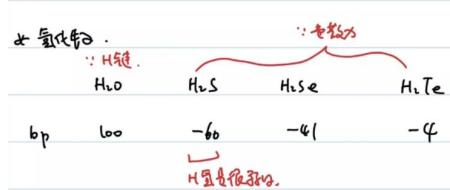

text_image

氢化钙
H₂O
6p 100
H₂S H₂Se H₂Te
-60 -41 -4
H₂显是很弱的。

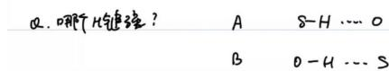

■ 轨道角度:

● S的孤对电子更易极化，轨道重叠更有效  
- O-H…S比S-H…O的氢键更强

■ 静电角度:

● 与O相连的H带更多δ+电荷   
- 但整体仍支持O-H…S更强

○ 氢化物PK值变化趋势 01:29:51

■ pKa趋势： $H_{2}O(14) > H_{2}S(7) > H_{2}Se(4) > H_{2}Te(3)$   
影响因素：

● 电负性效应：O电负性最大但酸性最弱  
● 原子半径效应：更大的原子半径使负电荷更分散（主导因素）  
● 经典案例：HI > HBr > HCl > HF的酸性反常

● 应用案例 01:30:46

# 例题: 判断氢化物PK

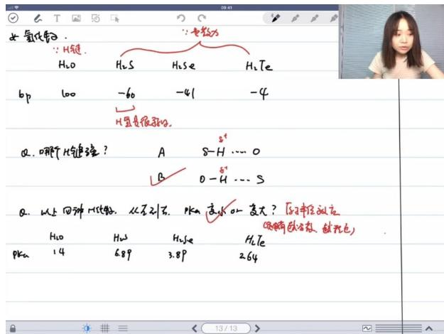

text_image

水氧化物
H₂O
H₂S
H₂Te
6p 100
-60 -41 -4
H₂O是很强的。
Q. 哪哪个氢很强？
A S-H ... O
B O-H ... S
Q. 以上四种氢Fe₂，从不引石 PkNa 流水OH 改大？原中性反应
（稀酸铁含量、黏稠色）
H₂O H₂S H₂Te H₂Te
PKₐ 14 6.89 3.89 2.64

# 解题关键：

● 比较共轭碱的负电荷稳定性  
● 原子半径越大，负电荷分散度越高

# ■ 记忆技巧:

● 类比硼烷酸性规律   
● 记住HI酸性最强的反常案例

# ● 过氧化氢作为溶剂 01:39:50

\- 过氧化氢的基本性质 01:39:55

# 物理参数：

- 沸点：150°C  
● 密度：1.445 g/cm $^{3}$ （25℃）

# ■ 溶剂特性：

- 液态温度范围比水更宽   
● 稳定性较差（易分解）

\- 过氧化氢的氢键特性 01:40:15

# ■ 氢键数量：

● 平均每个 $H_{2}O_{2}$ 分子形成>2个氢键  
● 比水分子（≈2个）更多但有限

# 结构特点：

\- 孤对电子增多但H数量不变

\- 过氧化氢的酸性强弱 01:41:09

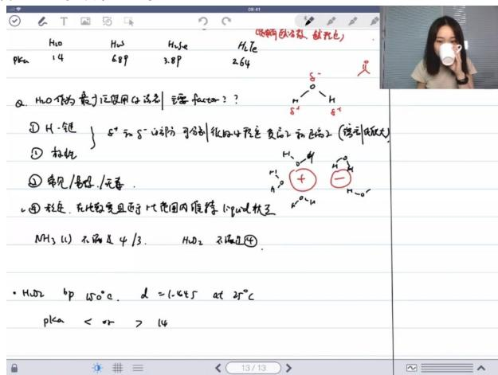

text_image

H2O H2 H2Fe H2Fe
PKa 14 6.89 3.89 2.64
① H2O作为离子迁移用的法对 环境 factor ? 
② H₂-链 δ'和δ'-的部分 可能| 很约性现象 贫点2 和已知2 (得到极光)
③ 标兑
④ 常见/易见/无毒
⑤ 钱定：在此前变且近于H₂范围内维持 10μm/L 杆亚
NH3(L) 不满足 4/3. H2O2 不满足④
• H2O2 bp 450°C. d = 1.445 at 25°C
pKa < or > 14

# ■ pKa比较： $H_{2}O_{2}(11.6) < H_{2}O(14)$

# 原因解释：

● O原子只需吸引1个 $H^{+}$ ，静电作用更强

● 类比气相醇类酸性规律

\- 过氧化氢的氧化还原性 01:42:40

# ■ 反应特性：

● 常用作氧化剂（漂白、消毒）  
● 遇强氧化剂时可作还原剂

# 条件依赖：

● 酸性条件倾向氧化剂  
● 碱性条件倾向还原剂

# ■ 应用实例：

● 过氧乙酸用于SARS消毒  
- 反应选择需"随机应变"

# ● 硫氢化物 01:43:58

\- 硫化氢的性质 01:44:01

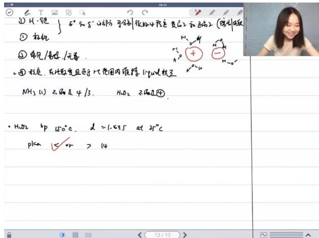

text_image

① H₂-银
② 标兑
③ 常见/表根./无毒.
④ 镒度，在比数变且远于H₂范围内维持10μmol/L氧量
MH₃(1) 不满足4/3. H₂O₂ 不满足④.
• H₂O₂ 6p 150°C. d = 1.485 at 25°C
pKa ≤ or > 14

■ 溶解性：硫化氢 $(H_{2}S)$ 易溶于水，在水中可发生电离  
■ 毒性特征：硫化氢为常见有毒气体，需注意防护   
物理状态：在接近室温范围内能维持液态 $(NH_{3}(l))$

\- 硫化氢的电离特性 01:44:12

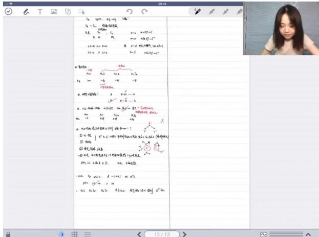

text_image

T4: 4000 kg/m³
S1 ~ 500 kg/m³
E.E. 2000 - T1 9.5 ±0.07 = -
E. a. P1 9.00 ±0.03 = -
2000 cc 900 g 1.0 - (1)×10^6.5 kg/m³
25.5 > 250 g-5 kg/m³
a. b. c. d.
m. e. f. g. h.
f. i. j. k. l.
m. m. n.
a. o. p. q. r.
m. s. t. u.
m. v. w. x.
m. w. y.
m. z. z.
a. w. w. x.
m. w. y.
m. w. z.
b. w. z.
m. w. x.
m. w. y.
m. w. z.
c. w. w. x.
m. w. y.
m. w. z.
d. w. w. x.
m. w. y.
m. w. z.
e. w. w. x.
m. w. y.
m. w. z.
f. w. w. x.
m. w. y.
m. w. z.
g. w. w. x.
m. w. y.
m. w. z.
h. w. w. x.
m. w. y.
m. w. z.
i. w. w. x.
m. w. y.
m. w. z.
j. w. w. x.
m. w. y.
m. w. z.
k. w. w. x.
m. w. y.
m. w. z.
l. w. w. x.
m. w. y.
m. w. z.
m. w. x.
n
13/13

■ 多级电离：与水的单级电离 $(H_{2}O\rightleftharpoons H^{+}+OH^{-})$ 不同， $H_{2}S$ 具有pKa1和pKa2两级电离  
■ 酸性比较：硫族氢化物酸性强于水，因硫原子半径大能更好分散两个负电荷  
■ 电离产物：最终可产生极少量 $S^{2-}$ 离子，但浓度远低于 $HS^{-}$

\- 硫的氧化物转化流程 01:45:11

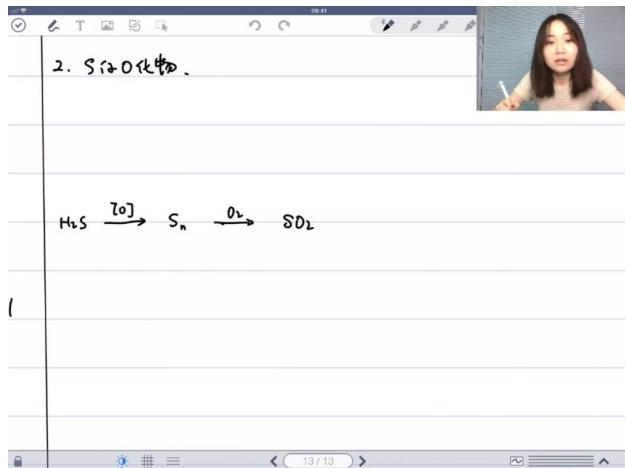

text_image

2. S₂O化物。
H₂S → [70] Sₙ → O₂ → SO₂
13/13

■ 氧化路径： $H_{2}S[\theta]S_{n}\theta_{2}SO_{2}$

实验现象： $H_{2}S$ 溶液在空气中会缓慢生成黄色硫单质沉淀

■ 燃烧反应：干燥硫单质燃烧可直接获得 $SO_{2}$

○ 水的PK值讨论 01:46:33

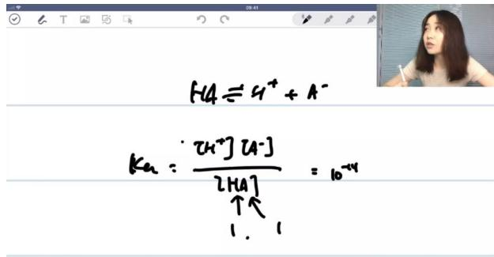

text_image

H4 = 4^+ + A^-
Ka : \frac{[4^-] [4^-]}{[4A]^2} = 10^{-4}
↑ ↑
1.1

标准定义：水的pK严格定义为14（25°C时 $[H^{+}][OH^{-}]=10^{-14}$ ）

■ 历史差异：部分有机教材采用15.7是因计算时使用纯水摩尔浓度(55.6mol/L)而非标准1mol/L

■ 学科争议：物理化学/无机化学统一采用14，有机化学因历史原因部分教材仍保留15.7

■ 典型案例：某环境学院教授编写的有机教材正确采用14，因其非有机专业背景不受传统影响

\- 硫氧化物化学

\- 二氧化硫性质

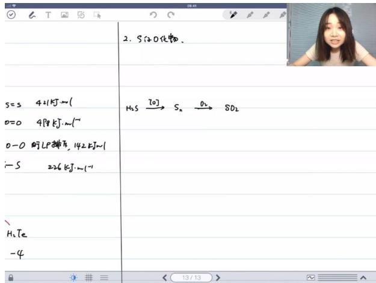

text_image

2. S=O 代数。
s=s 42kJ·m-1
o=0 42kJ·m-1
o-0 的LP排项，142kJ~1
i-S 226kJ·m-1
H₂S [O] Sₙ O₂ SO₂
H₂Te
-4

■ 分子构型： $SO_{2}$ 为 V 型分子，属于 $C_{2v}$ 点群  
■ 对称元素：具有1个 $C_{2}$ 旋转轴和2个垂直镜面  
■ 催化氧化：在催化剂作用下可进一步氧化为 $SO_{3}$

# ○ 三氧化硫性质

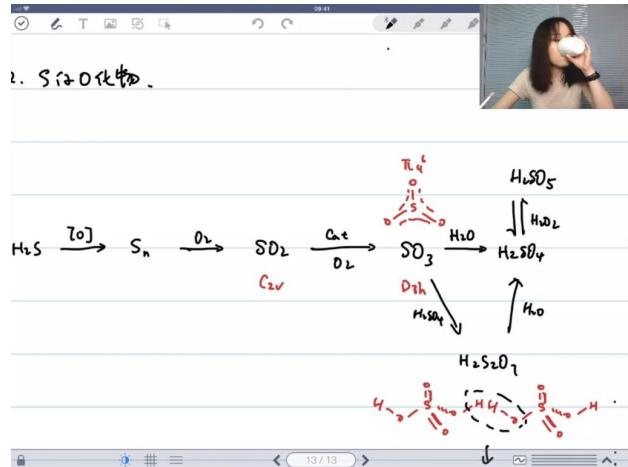

chemical

Chemical reaction diagram showing sulfur dioxide (S₂O₇) reacting with water to form SO₃ and H₂SO₄, with intermediate steps labeled in Chinese.

■ 分子构型： $SO_{3}$ 为平面三角形，属于 $D_{3h}$ 点群

■ 对称特征：具有1个 $C_{3}$ 主轴，1个 $\sigma_{h}$ 水平镜面和3个 $\sigma_{v}$ 垂直镜面

■ 水合反应： $SO_{3} + H_{2}O \rightarrow H_{2}SO_{4}$ 生成硫酸

■ 特殊反应： $SO_{3}$ 溶于浓硫酸生成焦硫酸 $(H_{2}S_{2}O_{7})$ ，加水稀释可重新得到硫酸

# - 过氧硫酸衍生物

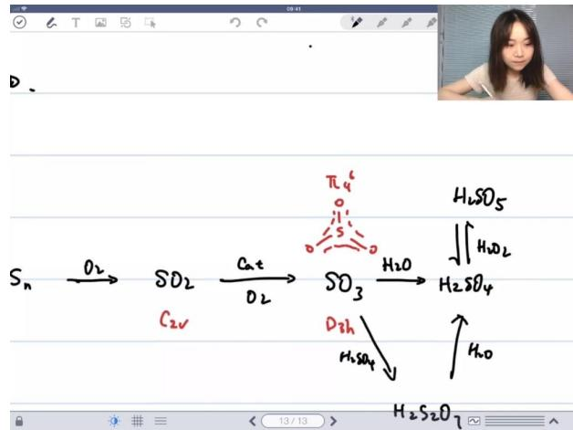

chemical

Chemical reaction diagram showing transformations of nitric acid and sulfate with water, labeled with reagents and products

13/13

■ 过一硫酸： $H_{2}SO_{5}$ 含过氧键(-O-O-)，硫保持+6价

■ 结构特征：在硫酸基础上增加过氧基团，避免硫出现+8价不合理状态

■ 过二硫酸： $S_{2}O_{8}^{2-}$ 含S-S键和两个过氧基团，通过电解硫酸氢盐制备

# - 亚硫酸体系化学

# ○ 亚硫酸及其盐

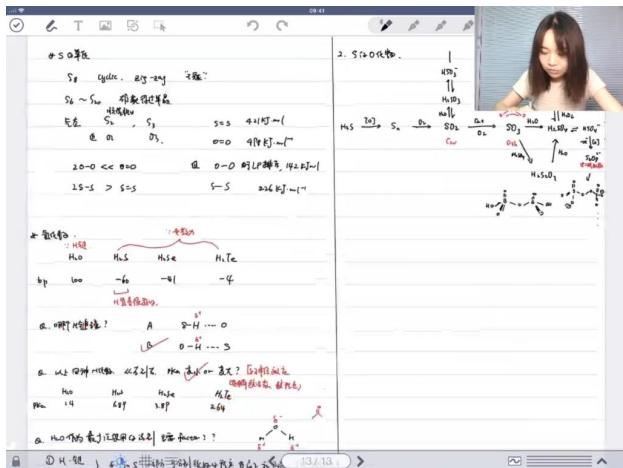

text_image

① H₂O键
S₂ qdm, 2g=ay 文本
S₃ ~ Sₙ 将氧得定基素
它差 S₂，S₁ s=3 4.11时→(
设 a O₃，0=0 4.11时→
20-0 << 0=0 且 0-0 的LPR排点，4.25时→
2.5-3 > s=3 5-5 2.65kJ→1-7
2. S₂的化氢物：
H₂O H₂S H₂Se H₂Te
kp 100 -60 -81 -4
"里多像由o。
a. 哪哪代继续？ A 8-H…0
B 0-H…3
a. 以上条件不继续。从水到Zn，Na+O+—Na+？反应生成
Na⁺ H₂O H₂S H₂Se H₂Te
Pb 1.4 6.97 2.97 2.64
a. H₂O的量过压使所以分别 空气和碳？！
① H₂键） 水相与氧气相制，转化成氧气上重占 \( ^{1/2} \) 氧相（13/13）

■ 水合平衡： $SO_{2} + H_{2}O \rightleftharpoons H_{2}SO_{3}$   
■ 分级电离：二元酸性质，可生成 $HSO_{3}^{-}$ 和 $SO_{3}^{2-}$   
■ 离子构型： $SO_{3}^{2-}$ 为三角锥形( $C_{3v}$ 点群)，与 $SO_{2}$ 的V型构型不同

# ○ 亚硫酸氢根结构

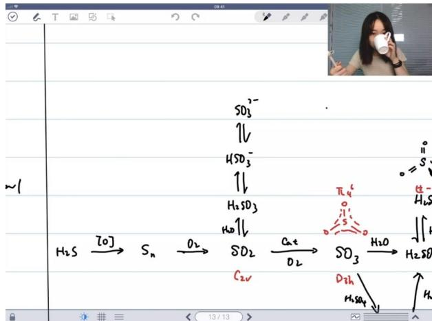

chemical

Chemical reaction diagram showing sulfur dioxide transformations with labeled species and reaction steps

■ 结构异构： $HSO_{3}^{-}$ 在水溶液中存在两种平衡结构  
■ 异构体A：具有对称面的常规结构( $C_{s}$ 点群)  
■ 异构体B：质子与不同氧原子结合的变体结构 $C_{3v}$ 点群  
■ 平衡机制：溶液中的氧负离子与硫孤对电子竞争质子导致结构互变

# ○ 硫代硫酸盐

text_image

S 任0化物。

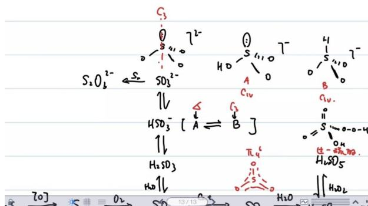

chemical

Chemical reaction diagram showing sulfonation and acid-base interactions with labeled species and intermediates

■ 形成反应： $SO_{3}^{2-} + S \rightarrow S_{2}O_{3}^{2-}$   
■ 结构特征：硫原子取代硫酸根中一个氧原子，保持四面体构型  
■ 命名由来："硫代"表示硫原子取代氧原子的位置

# ○ 连四硫酸盐

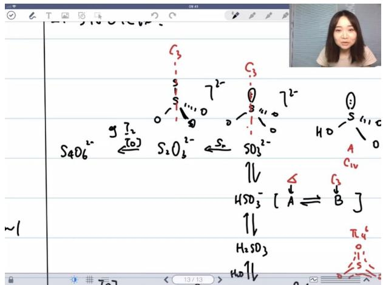

chemical

Chemical reaction diagram showing sulfonation and reduction steps with labeled species and products

氧化产物： $S_{2}O_{3}^{2-}$ 经氧化生成 $S_{4}O_{6}^{2-}$   
■ 结构特点：含S-S键的双核结构，每个硫原子保持四面体配位  
■ 制备方法：常用碘作为氧化剂实现该转化

● 硫氧化合物 01:49:49

例题:推断卤化物 02:18:20

■ 硫卤化物反应系列

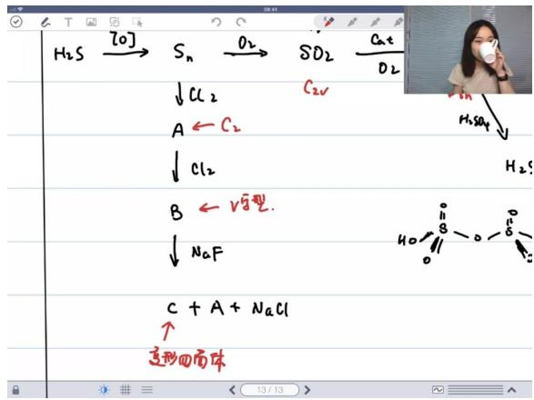

text_image

H₂S → [O] Sₙ → O₂ → SO₂ → CaO
↓ Cl₂        C₂V      H₂S
A ← C₂
↓ Cl₂              H₂S
B ← ν型.
↓ NaF             40°C = 8 - 6 - 2
C + A + NaCl
↑
连形四角体

反应过程：

○ $2S + Cl_{2} \rightarrow S_{2}Cl_{2}(A)$   
$\circ S_{2}Cl_{2} + Cl_{2}\rightarrow 2SCl_{2}(B)$   
$\circ \quad SCl_{2} + NaF \rightarrow SF_{4} + S_{2}Cl_{2} + NaCl(C)$

\- 分子构型：

○ A(S₂Cl₂): C₂对称性，类似过氧化氢的二面角结构  
○ B(SCl₂): V字型分子构型  
○ C(SF4): 变形四面体构型（三角双锥去除一个孤对电子位置）

\- 价态变化：

反应过程中硫的价态从+1(A)→+2(B)→+5(C)和+1(A)的歧化反应

■ $S_{2}Cl_{2}$ 分子结构详解

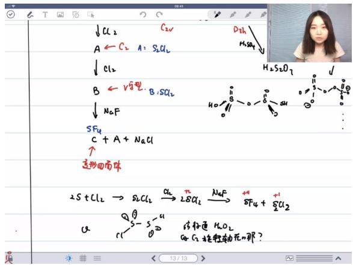

chemical

Chemical reaction diagram showing sulfuric acid reacting with sodium chloride, forming a trioxide intermediate and hydrogen peroxide

# - 结构特征：

○ 非平面结构，形成二面角  
○ 含两个孤对电子

# ● C2旋转轴：

○ 位于两个S原子中点和两个Cl原子中点的连线上  
- 标准表述：AA中点和BD中点的延长线

# - 化学性质：

○ 加水发生歧化反应： $S_{2}Cl_{2} + H_{2}O \rightarrow SO_{2} + HCl + S$   
- 主要用途：橡胶交联剂（形成硫桥）

# ■ 硫氟化物系列

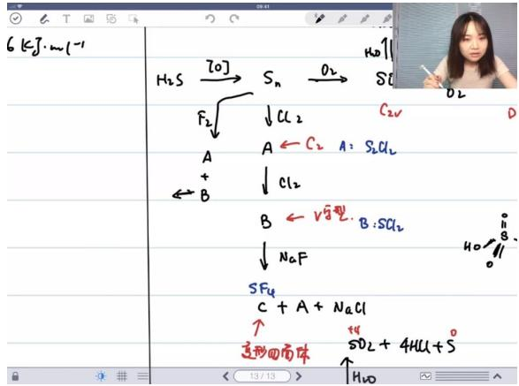

text_image

6 kJ·mol⁻¹
H₂S → [O] Sₙ → O₂ → SO₂
F₂ ↓ Cl₂ C₂
A ← C₂ A: S₂Cl₂
B + ↓ Cl₂
B ← v型 B: SCl₂
↓ NaF
SF₄
C + A + NaCl
↑ 14
→ 连形四面体 SO₂ + 4HCl + S
↑ H₂O
13/13>

# - 反应体系：

- 硫与过量氟反应制备SF6(A)  
副产物 $S_{2}F_{10}(B)$ 可缓慢转化为 $SF_{6}$ 和 $SF_{4}(C)$

# - 分子特性：

○ A(SF6): 正八面体构型  
○ B(S₂F₁₀): 制备过程的副产物  
○ C(SF4): 变形四面体

# - 衍生反应:

○ B与Br₂反应生成SF₅Br(D)，具有C₄旋转轴  
○ B与NH₃反应生成含C₃旋转轴的化合物(E)  
○ E在2200cm $^{-1}$ 附近有红外吸收（含三键特征）

# ■ 构型异构体

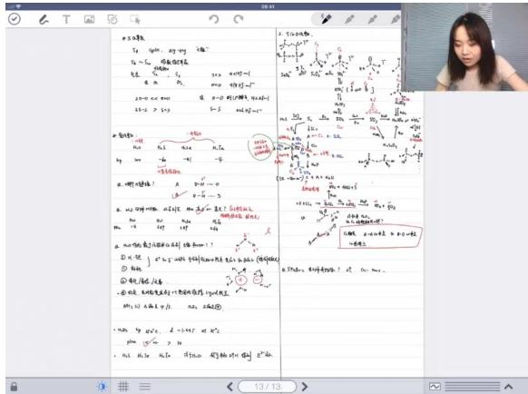

text_image

Handwritten math worksheet with diagrams, equations, and annotations in Chinese, featuring a photo of a person.

# SF4Br2异构体：

○ 顺式(cis)和反式(trans)两种构型  
○ 区别在于Br原子的相对位置（邻位或对位）

# - 记忆要点:

○ 变形四面体的构型判断基于孤对电子位置  
- VSEPR理论在判断分子构型中的核心应用  
- 红外特征吸收可用于判断特殊化学键存在

# ● 硫的氧化物 02:38:59

\- 二氧化硫与硫酸的反应及H2S2O6的结构 02:39:27

text_image

紫色物匠.

$$
\mathrm{SO} _ {2} + \mathrm{H} _ {2} \mathrm{SO} _ {4} \rightleftharpoons \mathrm{H} _ {2} \mathrm{S} _ {2} \mathrm{O} _ {6} \quad\begin{array}{c c c}0&0\\4 0 - s - s - o H\\0&0\end{array}
$$

13/13   
■ 反应方程式： $SO_{2} + H_{2}SO_{4} \rightleftharpoons H_{2}S_{2}O_{6}$   
■ 结构特点：H2S2O6中两个硫原子直接相连，所有硫的含氧酸中硫均为正四面体构型  
■ 制备方法：二氧化锰与二氧化硫反应可制备，该酸不稳定但能以盐的形式存在

\- 硫的含氧酸的构型与特性 02:40:12

■ 基本构型：所有硫酸根中的硫都采用四面体构型  
■ 特殊酸根： $S_{2}O_{4}^{2-}$ （连二亚硫酸根）中硫原子直接相连，仍保持四面体构型  
■ 命名规则：硫-硫直接连接的称为"连X硫酸"，如连二亚硫酸

○ S2O4^2-酸根的结构 02:41:20

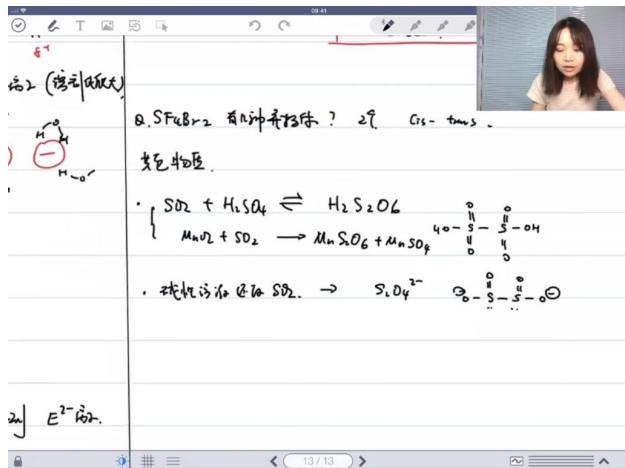

text_image

高2（溶无）(极软大)
Q. \( SF_4Br_2 \) 有几种并归纳？2g \( C_{16} \)-tmax
饱和物区.
\( SO_2 + H_2SO_4 \rightleftharpoons H_2S_2O_6 \)
\( MnO_2 + SO_2 \rightarrow MnSO_6 + MnSO_4 \quad 40 - \frac{O}{S} - \frac{O}{S} - OH \)
. 砝化方法：还原 \( SO_2 \). → \( S_2O_4^{2-} \) \( O_3 - \frac{O}{S} - \frac{O}{S} - O \)

生成条件：在碱性溶液中还原SO2可获得  
■ 结构特征：两个硫原子直接连接，每个硫原子保持四面体构型  
■ 电子排布：硫原子具有孤对电子，整体结构呈现对称分布

\- 六氟化硫与四氟化硫的性质 02:42:21

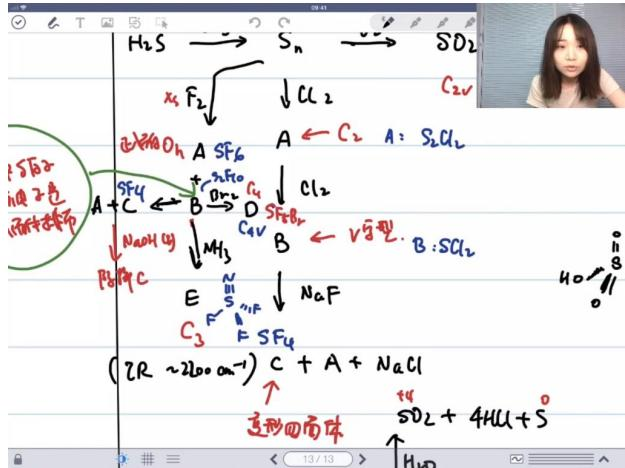

text_image

H₂S → Sₙ → SO₂
x₃F₂↓ ↓Cl₂ C₂v
正向的OₙA SF₆ A ← C₂ A: S₂Cl₂
A + C ⇌ B → D SF₆B₂ ↓ Cl₂
↓ NaOH C H₃ C₄V B ← ν型·B:SCl₂
Pd C E N S N F ↓ NaF
C₃ F S F₄ 40 8
(2R ~200 cm⁻¹) C + A + NaCl ↑
→ 连形四面体 SD₂ + 4HU + S H₂O

六氟化硫稳定性：由于硫的价电子全部被利用，六个氟原子包裹使其不易被进攻  
四氟化硫特性：反应活性高，是良好的氟化剂  
■ 分离方法：通过氢氧化钠溶液可除去四氟化硫，获得纯净的六氟化硫

○ 四氟化硫的水解反应 02:43:06

■ 水解产物：与一当量水反应时，产物与亚硫酰氯（SOCl2）水解类似

■ 反应特点：水解过程释放HF，反应活性高于六氟化硫

\- 重要的硫化合物概述 02:43:50

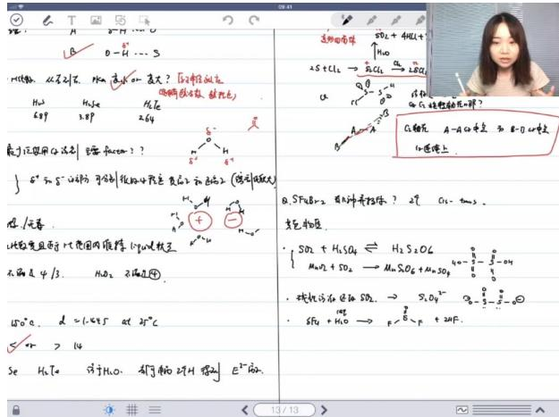

text_image

H₂SO₄ 从氧化钙、H₂O₂沸点成一表大？在神经泡发生
②酸碱反应，生成氢气。

H₂O₂ H₂SO₄ H₂O₂
6.89 3.89 2.64

酸碱反应：
②酸碱反应：A-A的水是 B-O的水
②酸碱反应：
②酸碱反应：
②酸碱反应：
②酸碱反应：
②酸碱反应：
②酸碱反应：
②酸碱反应：
②酸碱反应：
②酸碱反应：
②酸碱反应：
②酸碱反应：
②酸碱反应：
②酸碱反应：
②酸碱反应：
②酸碱反应：
②酸碱反应：
②酸碱反应：
②酸硫化物：H₂SO₄ ⇌ H₂S₂O₆
MnO₂ + SO₄ → MnSO₄ + MnSO₃ 4= - ½ = - ½ - 0.1
COOH → SO₄²⁻ 5= - ½ = - ½ - 0
COOH → Fe³⁺ 2H₃ + 2NH₄

②酸碱反应：
②酸碱反应：
②酸碱反应：
②酸碱反应：
②酸碱反应：
②酸碱反应：
②酸碱反应：
②酸碱反应：
②酸碱反应：
②酸碱反应：
②酸碱反应：
②酸碱反应：
②酸碱反应：
②酸碱反应：
②酸碱反应：
②酸碱反应：
②酸碳化物：H₂SO₄ ⇌ H₂S₂O₆
MnO₂ + SO₄ → MnSO₄ + MnSO₃ 4= - ½ = - ½ - 0.1
COOH → SO₄²⁻ 5= - ½ = - ½ - 0
COOH → Fe³⁺ 2H₃ + 2NH₄

②酸碱反应：
③酸碱反应：
④酸碱反应：
⑤酸碱反应：
⑥酸碱反应：
⑦酸碱反应：
⑧酸碱反应：
⑨酸碱反应：
⑩酸碱反应：
⑪酸碱反应：
⑫酸碱反应：
⑬酸碱反应：
⑭酸碱反应：
⑮酸碱反应：
⑯酸碱反应：
⑰酸碱反应：
⑱酸碱反应：
⑲酸碱反应：
⑳酸碱反应：
㉑酸碱反应：
㉒酸碱反应：
㉓酸碱反应：
㉔酸碱反应：
㉕酸碱反应：
㉖酸碱反应：
㉗酸碱反应：
㉙酸碱反应：
㉚酸碱反应：
㉛酸碱反应：
㉜酸碱反应：
㉝酸碱反应：
㉞酸碱反应：
㉟酸碱反应：
㉳酸碱反应：
㉟酸碱反应：
㉳酸碱反应：
㉟酸碱反应：
㉳酸碱反应：
㉟酸碱反应：
㉳酸碱反应：
㉟酸碱反应：
㉳酸碱反应：
㉟酸碱反应：
㉳酸碱反应：

■ 核心物质：硫化氢（H2S）、二氧化硫（SO2）、三氧化硫（SO3）、亚硫酸（H2SO3）  
■ 特殊化合物：硫代硫酸钠（Na2S2O3）具有较高重要性  
■ 结构规律：硫化合物中硫原子可通过氧桥连接或直接相连

○ 三氧化硫的结构与状态 02:44:30  
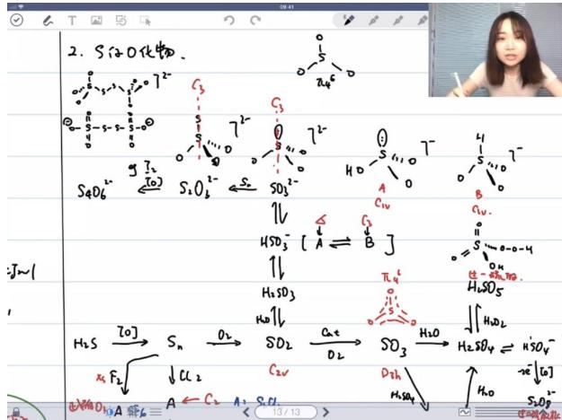

chemical

Chemical reaction diagram showing sulfur dioxide formation and subsequent decomposition steps with labeled intermediates and products

气/液态结构：单分子状态，平面三角形构型，具有大π键  
■ 固态结构：形成三聚体（SO3）3，属于C3v点群  
■ 构型特点：固态时三个硫和三个氧不共平面，硫和氧均为sp2杂化

二、知识小结

<table><tr><td>知识点</td><td>核心内容</td><td>考试重点/易混淆点</td><td>难度系数</td></tr><tr><td>氧的单质</td><td>氧气分子轨道图、臭氧结构与性质、臭氧分子极性分析</td><td>臭氧分子偶极方向、三线态与单线态氧气区别</td><td></td></tr><tr><td>硫的单质</td><td>硫同素异形体(S6-S20)、硫硫键能比较、硫单质稳定性</td><td>为什么硫更易形成单键而非双键</td><td></td></tr><tr><td>氢化物比较</td><td>H2O/H2S/H2Se/H2Te沸点与酸性变化规律</td><td>PK值变化趋势、氢键强度比较(a vs b型)</td><td></td></tr><tr><td>含氧酸结构</td><td>硫酸/焦硫酸/过一硫酸/过二硫酸结构推导</td><td>硫代硫酸根构型、亚硫酸氢根两种平衡结构</td><td></td></tr><tr><td>卤化物反应</td><td>S2Cl2/SCL2/SF4系列反应与结构特征</td><td>变形四面体构型、C2旋转轴定位方法</td><td></td></tr><tr><td>多硫/硒/碲离子</td><td>链状与双环结构、电子构型分析</td><td>SP3d2杂化判断、平面四边形构型</td><td></td></tr><tr><td>硫氮化合物</td><td>S2N2/S3N3-/S4N3+芳香性判断</td><td>休克尔规则应用、电子计数方法</td><td></td></tr><tr><td>重要反应机理</td><td>三氯化氮水解、硫酸铵热分解、磷化合物歧化</td><td>重氮盐制备、次磷酸一元酸性</td><td></td></tr><tr><td>对称性分析</td><td>分子点群判断(C2v/D3h/Td等)、旋转轴识别</td><td>正八面体对称元素、镜面数量计算</td><td></td></tr><tr><td>推断题技巧</td><td>深化合物系列推断、磷卤化物反应流程</td><td>电解质组成推断、几何构型提示运用</td><td></td></tr></table>