# 一、卤素元素概述00:14

# 1. 卤素元素性质 32:09

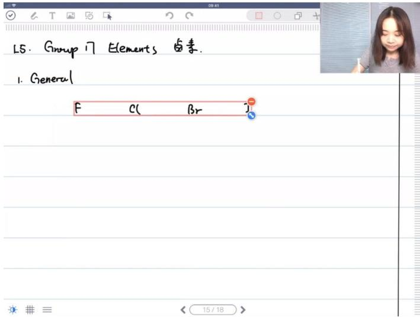

text_image

L5. Group 17 Elements 昇素.
1. General
F C Br

● 元素范围: 主要讨论氟(F)、氯(Cl)、溴(Br)、碘(I)四种常见卤素

# 1）原子半径变化 32:26

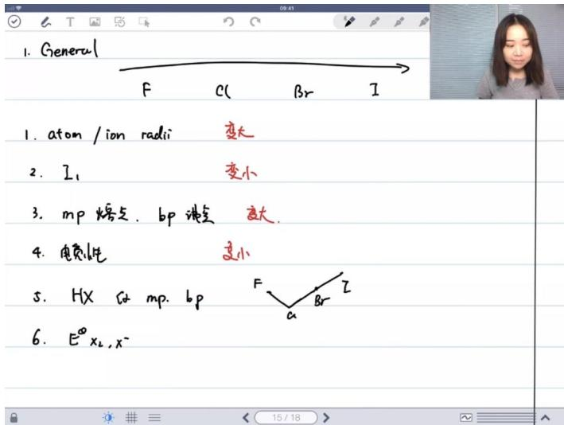

text_image

1. General
F C Br I
1. atom / ion radii 变大
2. I₁ 变小
3. mp 熔与，bp 滴定 变大.
4. 电离性 变小
5. HX ⊕ mp，bp F
6. E∞x₂，x⁻
15/18

基本规律: 从F到I，原子半径和负离子半径逐渐增大  
● 理论解释: 随着电子层数增加，原子核对外层电子吸引力减弱  
● 记忆技巧: "卤素半径下楼梯" (自上而下递增)

2）电离能变化 33:36

● 变化趋势: 从F到I第一电离能逐渐减小  
● 关键原因: 原子半径增大导致核对外层电子束缚力减弱  
● 特殊说明: 该规律与广义芳香性无关，属于基础性知识点

3）熔沸点变化 34:10

● 总体趋势: 熔点和沸点随原子序数增加而升高  
● 根本原因: 分子间色散力逐渐增强 ( $F_{2} < Cl_{2} < Br_{2} < I_{2}$ )  
● 数据参考: 实际考试中通常只需掌握趋势而非具体数值

4）电负性变化 35:14

● 变化规律: 电负性从F到I递减 (F > Cl > Br > I)  
● 极端特性: 氟是电负性最强的元素 (Pauling标度4.0)

5）氢化物性质 35:31

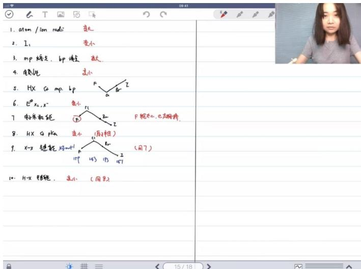

text_image

1. atom / ion radii 变大
2. I₁ 变小
3. mp 烯支，lp 滴支 越大
4. 做氧化 变小
5. HX α mp lp F
6. E⁰ x₁, x⁻
7. 酸米和铯 (反半锥)
8. HX α PKA 变小 (反半锥)
9. x-x 锏能 (同7)
10. H-x 锏能，变小 (同8)

● 熔沸点异常: HF因氢键存在呈现反常高值（HCl < HBr < HI < HF）  
● 空间记忆法: "HF独居高位，其他按序排列"  
● 重要提醒: 该知识点常作为考试陷阱出现

6）标准电极电势 36:41

● 电势趋势: $E^{\ominus}(X_{2}/X^{-})$ 从F到I递减  
● 化学意义: 反映氧化性强度 $F_{2} > Cl_{2} > Br_{2} > I_{2}$   
● 记忆口诀: "电势跳水，氧化性退位"

7）电子亲和能 37:12

● 反常现象: Cl > F > Br > I (Cl电子亲和能最大)  
- 原因分析:

- F的特殊性: 原子半径过小导致电子云拥挤，排斥力大  
- CI优势: 适中半径实现最佳核-电子吸引平衡

● 数据参考: 实际值 Cl(349kJ/mol) > F(328kJ/mol)

8）氢化物酸性 38:42

● pKa变化: HX酸性随原子序数增加而增强（HF < HCI < HBr < HI）  
● 决定因素: 键能减弱和阴离子稳定性增加  
● 关联知识: 与氢卤键能变化趋势一致（见1.10）

9）卤素键能 39:15

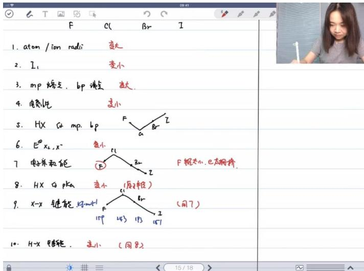

text_image

F C( Br I
1. atom / ion radii 变大
2. I₁ 变小
3. mp 烯支，bp 滴支 变大.
4. 电刻性 变小
5. HX α mp bp F
6. E⁰ x₂, x⁻ 变小 F锐大小，e为两桥.
7. 电子和机能 (原子半径)
8. HX α pKa 变小 (同7)
9. x-x 锂能 (同8)
10. H-x 锂能 变小 (同8)

关键数据:

o F-F: 159 kJ/mol   
○ Cl-Cl: 243 kJ/mol   
○ Br-Br: 193 kJ/mol

○ I-I: 151 kJ/mol

● 特殊现象: F₂键能异常低（与I₂相近），解释其高反应活性  
● 记忆要点: "氯气键能最高，两端数值相近"

# 10）氢卤键能 41:30

● 变化趋势: H-X键能从F到I逐渐减弱   
● 化学影响: 直接决定氢卤酸酸性强度  
● 理论解释: 键长增加导致键强度降低

# 二、卤素单质制备42:04

# 1. 氟气制备 42:15

# 1）电解KHF2 44:00

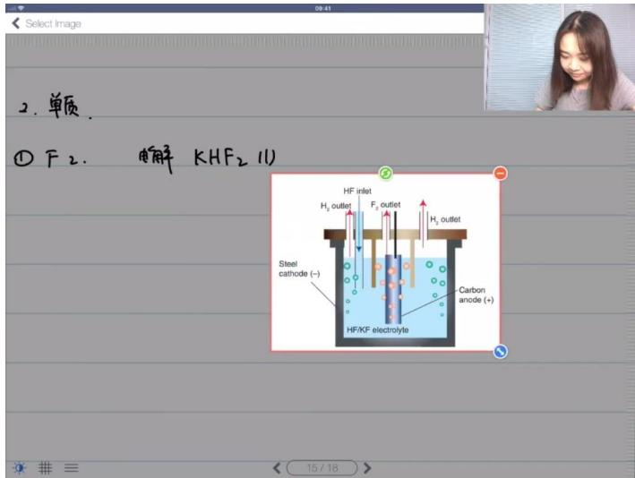

text_image

2. 单质.
① F₂. 电解 KHF₂ Ⅱ
Steel
cathode (-)
HF inlet
H₃ outlet
F₂ outlet
H₂ outlet
Carbon
anode (+)
HF/KF electrolyte

工业重要性：氟气和氯气都是工业上大量制备的初级原料，其制备方法具有实际应用价值  
- 电解原理：电解熔融 $KHF_{2}$ （氟氢化钾）制备氟气，反应式为2HF - $KF(l)\rightarrow F_{2}(g)+H_{2}(g)+KF$   
● 装置特点：

○ 阳极（碳电极）： $2F^{-}\rightarrow F_{2}+2e^{-}$   
○ 阴极（钢电极）： $2H^{+} + 2e^{-} \rightarrow H_{2}$   
○ 需持续补充HF维持反应

● 不能电解水溶液的原因：氟的氧化电势高于氧，在电解水溶液时氧气会先于氟气析出  
- $\mathrm{HF}_2^-$ 离子结构：具有对称的F-H-F线性结构，键长相等，被认为是已知最强的氢键  
● 安全措施：氢气和氟气必须通过不同管道分离收集，防止混合爆炸

# 2. 氯气制备 49:27

# 1）氯碱工业 49:52

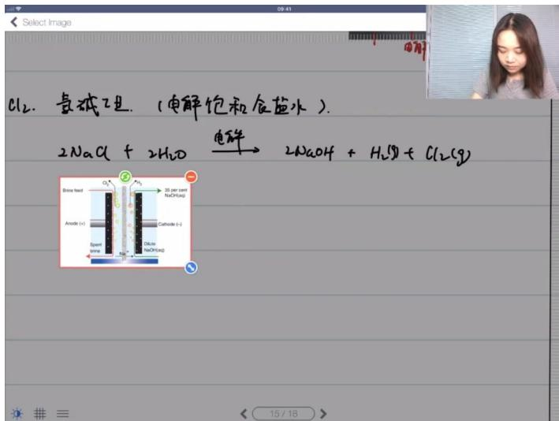

text_image

Cl₂. 氨碱工业. (电解饱和食盐水).
2NaCl + 2H₂O → 2NaOH + H₂SO₄ + Cl₂(g)

● 工业地位：氯碱工业是一个完整的行业体系，生产氯气和氢氧化钠  
● 电解原理：电解饱和食盐水（氯化钠溶液），反应式为

$$
2 N a C l + 2 H _ {2} O \rightarrow 2 N a O H + H _ {2} + C l _ {2}
$$

● 电极反应：

○ 阳极： $2Cl^{-}\rightarrow Cl_{2}+2e^{-}$   
○ 阴极： $2H^{+} + 2e^{-} \rightarrow H_{2}$

● 产物分离：需隔离正负极，防止氢气和氯气混合

● 原料补充：需持续补充饱和食盐水（brine）

● 与氟气制备的区别：氯气氧化性弱于氧气，因此可以使用水溶液电解法

# 3. 溴碘制备 52:05

1）置换反应法 52:48

● 制备原理：利用氯气的氧化性置换溴离子和碘离子，反应式为 $Cl_{2} + 2X^{-} \rightarrow 2Cl^{-} + X_{2}$ (X=Br, I)  
● 原料来源：通常来自氯碱工业的母液或海水，其中富集了溴离子和碘离子  
● 反应条件：需在微酸性条件下进行，避免生成次氯酸  
● 工业流程：先制备氯气，再用氯气置换溴和碘

# 三、氟化物特性 53:48

1. 含氟牙膏 54:06

1）含氟牙膏的起源与背景 54:19

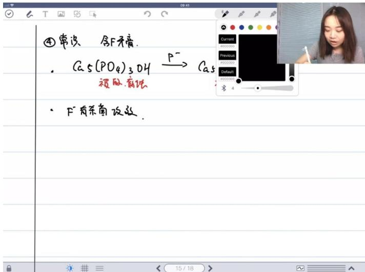

text_image

④常设 含F矛盾.
Ca5(PO4)3OH P⁻ → Ca5
被取弃渣
· F⁻有杀菌改张.

● 发现过程：二战前美国科罗拉多州牙医发现当地饮用水氟含量高的人群牙周病发病率低，由此提出在饮用水中添加低浓度氟离子（最初使用氟化钠）可预防龋齿

● 应用演变：发达国家早期在饮用水加氟（类似中国食盐加碘），近年建议改为个体化使用含氟牙膏/药物，避免全民加氟可能导致的过量问题  
● 类比说明：与食盐加碘类似，需根据地区氟含量决定是否补充，沿海地区居民可能不需要额外补碘/氟

2）氟离子对牙齿的保护作用 56:07

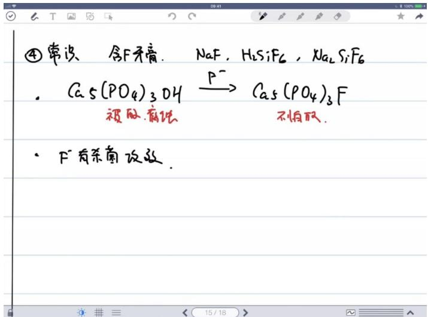

text_image

④常识 含F矛盾. NaF, H₂SiF₆, Na₂SiF₆
CaS(PO₄)₃OH P⁻ → CaS(PO₄)₃F
被取腐蚀 不怕取.
· F⁻有杀菌改效.

- 化学置换：牙齿主要成分为羟基磷酸钙 $Ca_{5}(PO_{4})_{3}OH$ ，氟离子可将其转化为更坚固的氟磷酸钙 $Ca_{5}(PO_{4})_{3}F$ ，反应式为： $Ca_{5}(PO_{4})_{3}OHF\rightarrow Ca_{5}(PO_{4})_{3}F$   
● 抗酸机制：羟基易被酸腐蚀，氟取代后增强耐酸性  
● 杀菌功效：氟离子被证实具有杀菌作用，与化学置换形成双重保护机制

3）含氟牙膏中的氟化物成分 57:27

● 历史成分：早期使用氟化钠（NaF）作为氟源

● 现代成分：现多采用六氟硅酸钠 $(Na_{2}SiF_{6})$ 等更稳定的化合物

\- 分子构型：六氟硅酸根离子（ $SiF_{6}^{2-}$ ）为八面体构型

2. 药物氟化 01:05:08

1）药物开发的困难与氟化策略 01:05:37

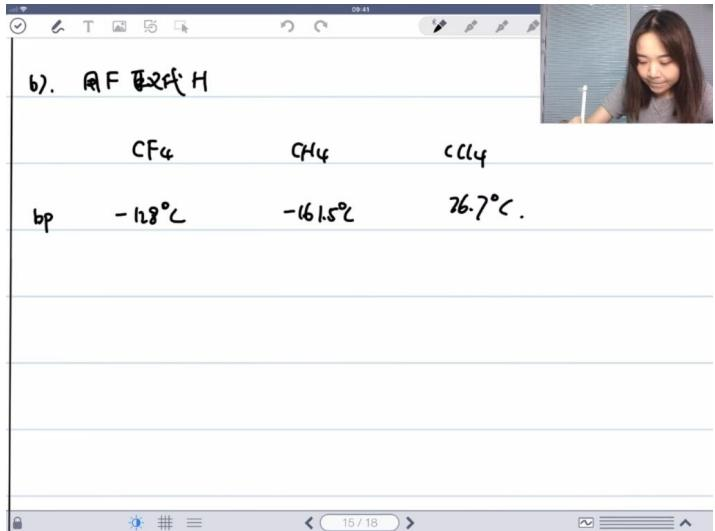

text_image

b). 用F取代H
CF₄ CH₄ CCl₄
bp -128°C -161.5°C 76.7°C.

● 开发难度：新药研发需经历分子库筛选→细胞实验→动物实验→临床实验等漫长流程，成功率极低（约1%）  
- 氟化优势：将已有药物分子中的氢原子替换为氟原子，可显著提高新药开发效率  
- 相似原理：氟与氢原子半径相近（ $r_{F} \approx r_{H}$ ），但电负性差异大，既能保持分子基本结构又改变部分性质

2）氟原子取代的化学基础 01:06:58

● 半径关键性：原子半径是决定元素性质的核心因素，对角线规则等现象均与半径相关   
- 诱导效应：在有机酸等小分子中，氟取代会显著增强酸性；大分子中少量氟取代主要影响空间结构  
● 特殊领域：氟化学存在大量反常现象，需用专门理论解释

# 3. 全氟烷烃 01:09:23

# 1）沸点异常现象 01:11:00

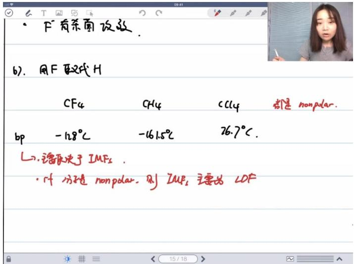

text_image

F有苯菌改致.
b). 用F取代H
CF₄     CH₄     CCl₄      都是 nonpolar.
bp    -128℃    -161.5℃    26.7℃.
L→.谱取决于IMFs.
·rf 分子进 nonpolar，则 IMFs 主要为 LDF

# 典型数据：

○ $CH_{4}$ 沸点-161.5℃   
○ $CF_{4}$ 沸点-128℃   
○ $CCl_{4}$ 沸点76.7℃   
○ $C_{2}F_{6}$ 沸点-78.2℃   
○ $C_{2}H_{6}$ 沸点-88.5℃

● 理论矛盾：按传统分子间作用力理论，沸点应与分子质量正相关，但全氟烷烃表现异常

# 2）反常机理分析

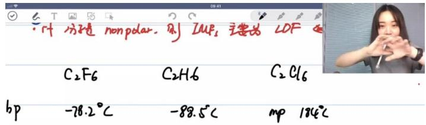

text_image

C₂F₆
C₂H₆
C₂Cl₆
bp -78.2℃ -88.5℃ mp 184℃

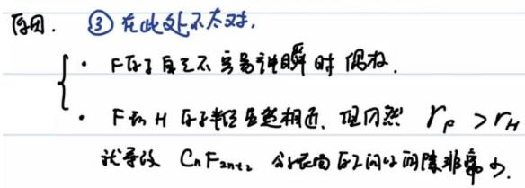

text_image

原因. ③ 在此处不小于对.
{ • F原子自己不容易说明时偶数.
• F从H原子单位连续相连, 因仍然 r_p > r_H
就导致 C_nF_{2n+2} 公司与原子间之间的间隔非常少.

● 电子效应：氟原子核束缚电子能力强，不易产生瞬时偶极（色散力减弱）  
● 空间效应：氟原子半径大于氢 $(r_{F}>r_{H})$ ，导致 $C_{n}F_{2n+2}$ 分子表面原子间隙极小  
- 分子刚性：全氟烷烃碳链被氟原子紧密包裹，分子变形能力差，难以极化

# 3）特殊物理性质

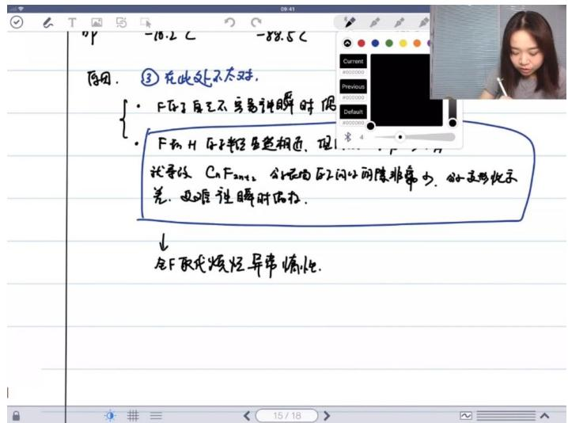

text_image

原因. ③ 在此处不太对.
F原子完全容易视瞳时偶
F前H原子半径多趋相近,但
此导致 CnF2m12 分层前正闪心间隙非常少,缺少形体差,
更难视瞳时偏松.
令F取代炫炫异常情性.

●

- 惰性表现：几乎不与氧气等物质反应，是优质阻燃剂  
- 流动特性：相比对应烷烃具有更低粘度（如全氟正己烷比正己烷流动性更好）  
- 溶解规律：体现特殊"相似相溶"原则（ $C_6F_{14}$ 易溶于 $C_6F_{14}$ 而非 $C_6H_{14}$ ）

# 4. 氟化氢自电离 01:22:26

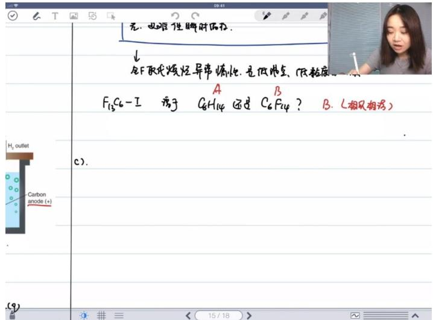

text_image

无. 反源性瞬时偏松.
↓
名F取代烷烃异声惰化,是低沸点、低粘度...
F₁₃C₆-I 浮于 C₆H₁₄ 还是 C₆F₁₄ ? B. (相反相反)
c).

●

- 自电离条件：液态氟化氢在低温条件下可以发生自电离，这与氨( $NH_{3}$ )和双氧水( $H_{2}O_{2}$ )类似。  
- 共性特征：具有强氢键的纯液体体系普遍存在自电离现象，但双氧水因不稳定而不适合作为溶剂，氨在 $-33^{\circ}\mathrm{C}$ 以下则是良好溶剂。  
- 溶剂特性：液态氟化氢的自电离使其具有作为溶剂的潜力，但需要严格控制低温条件。

# 5. 氟利昂替代 01:24:22

# 1）氟利昂的化学特性

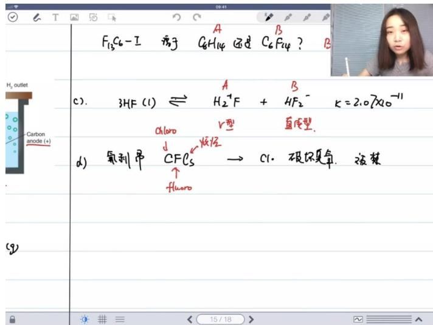

text_image

F13C6-I 浸子 A C6H14 还是 C6F24 ? B
H2outlet
c). 3HF (1) ⇌ H2+F + HF2- k=2.07×10-11
chloro r型 直型型.
d) 氧到吊 CFCs 低压 → Cl. 破坏复氧. 波禁
fluoro
(g)

- 化学组成：氟利昂是氟氯取代的烷烃 $(C_{n}H_{2n + 2})$ ，化学式通常表示为CFCs（氟氯烃）。  
- 破坏机制：碳氯键(C - Cl)不稳定易断裂，会生成氯自由基(Cl·)，这些自由基会催化分解臭氧( $O_3$ )。  
- 禁用依据：根据蒙特利尔公约，因破坏臭氧层而被全球禁用。

# 2）替代品HFCs

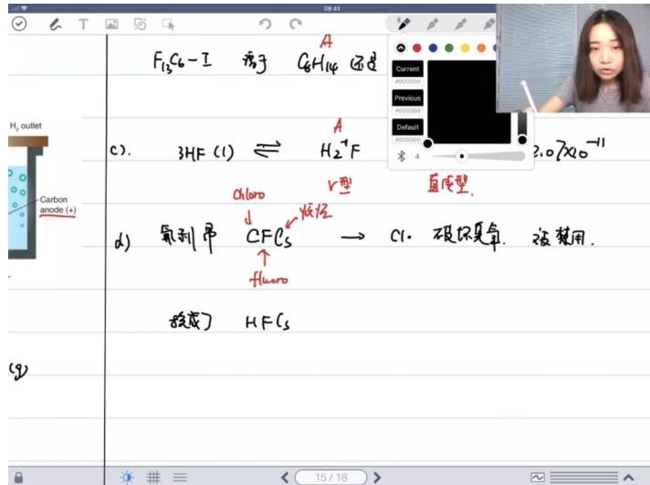

text_image

H₂ outlet
Carbon
anode (+)
F₁₅C₆-I 浮子 C₆H₁₄ 还过
c). 3HF (1) ⇌ H₂⁺F
chloro r型 直型型.
d) 氟到吊 CFCs 烯烃 → Cl. 破坏臭氧. 没禁用.
fluoro
换成) HFCs
(g)

- 改进原理：将CFCs中的氯替换为氢，形成氢氟烃(HFCs)，消除氯自由基的产生途径。  
● 实际应用：主要用于空调和冰箱的制冷剂，但存在两个显著缺点：

\- 制冷性能较氟利昂差

○ 具有一定可燃性（氟利昂完全不可燃）

\- 现状：目前尚未找到完美的环保替代品，禁用CFCs是保护臭氧层的应急措施。

# 四、卤化物性质 01:26:35

# 1. 三氟化铝特性 01:26:44

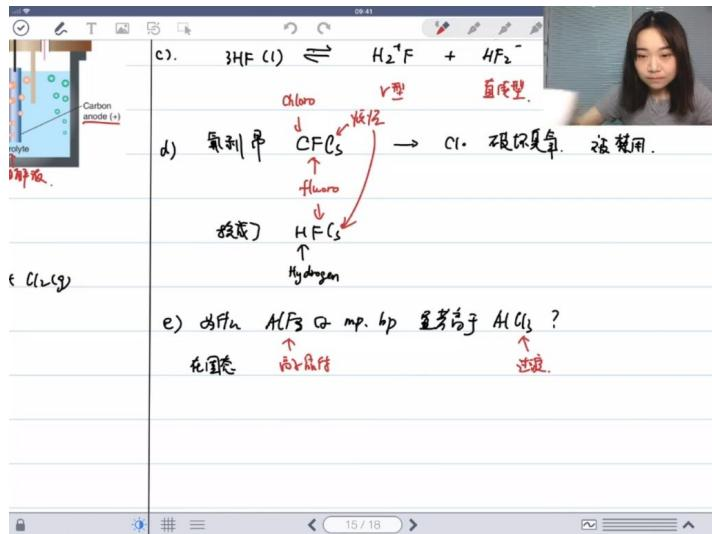

text_image

c). 3HF (1) ⇌ H₂↑F + HF₂⁻
Carbon
anode (+)
d) 氟到昂 CFCs → Cl⁻ 破坏是氧. 弓禁用.
Fluoro
换成了 HFCs
Hydrogen
e) 为什么 AlCl₃ → mp、hp 显考高于 AlCl₃ ?
在固态 后子屈服 过度.

- 熔沸点差异: 三氟化铝 $\left(AlF_{3}\right)$ 熔点高达 $1000^{\circ} \mathrm{C}$ 以上, 远高于三氯化铝 $\left(AlCl_{3}\right)$   
- 晶体类型：固态 $AlF_{3}$ 为离子晶体， $AlCl_{3}$ 为过渡态（介于离子晶体和分子晶体之间）  
● 配位数：固态 $Al^{3+}$ 周围有6个 $F^{-}$ 配位，而 $AlCl_{3}$ 在固态时每个 $Al^{3+}$ 周围有4个 $Cl^{-}$ 配位  
● 气态行为：气态 $AlCl_{3}$ 以二聚体形式存在

# 2. 铜卤化物稳定性 01:29:49

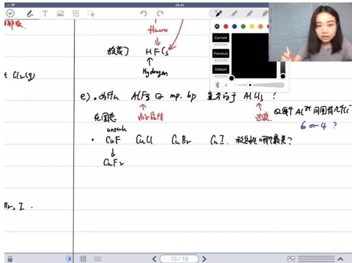

text_image

解放.
fluoro
↓
换成了 HFCs
↑
Hydrogen
e).为什么 ACF3 Q mp, bp 盈方向于 ACF3 ?
在固态 向水结晶
↑
unsoch
CuF CaCl CuBr CaI. 稳定性哪个最先?
↓
CuF2
6 or 4 ?
Br2 I.

- 氧化还原性：氟的吸电子能力极强，导致高价铜氟化物不稳定  
- 稳定形式：常温下二价铜氟化物（ $CuF_{2}$ ）稳定存在，而更高价的碘化铜会自发还原为一价铜  
● 软硬酸碱理论： $Cu^{+}$ 属于软酸，与软碱（如 $I^{-}$ ）结合更稳定  
● 特殊现象：二氟化钴不稳定，三氟化钴更稳定

# 3. 六氟化铀特性 01:32:21

- 分子化合物： $UF_{6}$ 是典型的分子化合物，用于铀浓缩  
- 分离原理：利用 $^{235}UF_{6}$ 和 $^{238}UF_{6}$ 分子质量差异，通过气体扩散法分离  
● 扩散方程：扩散速度与分子质量平方根成反比

# 五、过渡金属氟化物01:33:11

# 1. 三氟化钛结构 01:33:22

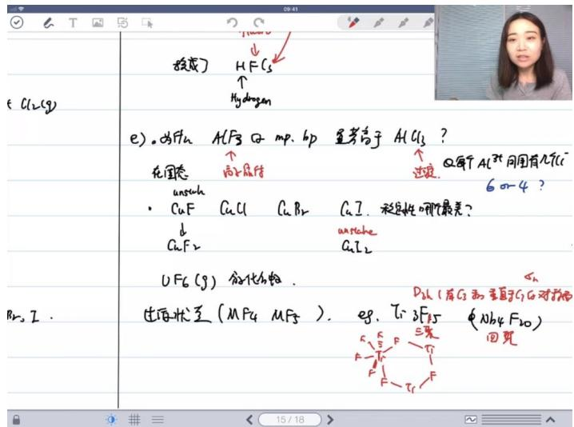

text_image

e. C₂(g)
Fe₃O₂
Fe₃
HFC₃
Hydrogen
e). 为Ph₃、AlF₃、mp、bp 显考离子 AlCl₃ ？
在固态
↑
向上晶体
unsech
CaF CaCl CaBr CaI 稳定性哪个最差?
↓
CaF₂ CaI₂
UF₆(g) 分化物.
出向状态 (MF₄ MF₅). eg. Ti:3Fe₅ (Nb4F₂₀)
三变
F F F F
②变
③变
④变
⑤变
⑥或4?

● 对称性： $Ti_{3}F_{15}$ 具有 $D_{3h}$ 对称性，含 $C_{3}$ 旋转轴和垂直对称面 $(\sigma_{h})$   
● 构型特征：三个八面体共顶点形成环状结构，每个钛周围配位6个氟  
● 结构类比：类似于三个八面体共顶点排列

# 2. 四氟化铌结构 01:35:56

● 结构特点： $Nb_{4}F_{20}$ 为四聚体结构  
● 对称性应用：对称性好的分子结构是重要考点，需重点掌握常见构型

# 六、VSEPR理论应用 01:37:15

# 1. 复杂分子构型预测 01:37:20

● 适用范围：VSEPR理论适用于简单分子构型预测  
● 复杂分子：对称性好的复杂分子构型需通过积累典型结构来掌握  
● 记忆技巧：常见对称性构型有限，通过反复接触建立认知

# 七、类卤素01:37:29

# 1. CN2和CN负离子 01:37:56

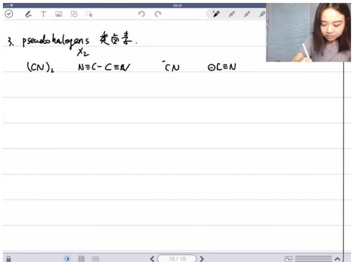

text_image

3. pseudohalogens 类白素.
(CN)₂ N≡C-C≡N CN ⊙C≡N

结构特征： $(CN)_{2}$ 为直线型（ $N \equiv C - C \equiv N$ ），碳为sp杂化  
● 等电子体： $CN^{-}$ 与 $N_{2}$ 为等电子体  
- 对应关系： $(CN)_{2}$ 对应 $X_{2}$ ， $CN^{-}$ 对应 $X^{-}$

# 2. SCN负离子 01:38:44

<table><tr><td>X₂</td><td></td><td>X⁻</td><td></td><td>HX</td></tr><tr><td>(CN)₂</td><td>N≡C-C≡N</td><td>-CN</td><td>OC≡N</td><td>PKa 8.2
H-C≡N</td></tr><tr><td>(SCN)₂</td><td>不是直线型
N≡C-S-S-C≡N</td><td>○SCN</td><td>⊙S-C≡N</td><td>PKa -1.9
H-S-C≡N</td></tr><tr><td>(OCN)₂</td><td>N≡C-O-O-C≡N</td><td>○OCN</td><td>O</td><td></td></tr><tr><td>Q</td><td>-OCN + H⁺</td><td>→</td><td>HOCN?</td><td>OCNH?</td></tr></table>

结构特点： $SCN^{-}$ 不是直线型，硫原子存在孤对电子  
● pKa值：HSCN的pKa为-1.9   
● 配位特性：配位到金属上时可能呈现直线型构型

# 3. OCN负离子 01:41:23

● 命名：氧氰（OCN）负离子  
● 制备方法：氰化物溶液通臭氧制得  
● 氢化物结构：加酸主要生成异氰酸（HNCO）而非氰酸（HOCN）  
● 稳定性： $OCN^{-}$ 负离子主要结构为 $[O=C=N]^{-}$ ，形成两个π34键

# 4. 雷酸结构 01:46:27

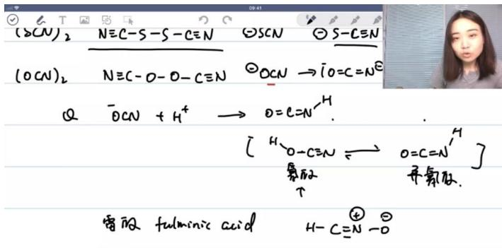

text_image

(SCN)2 N≡C-S-S-C≡N ⬤SCN ⬤S-C≡N
(OCN)2 N≡C-O-O-C≡N ⬤OCN → [O=C=N]
Q -OCN + H+ → O=C=N-H.
[H-O-C≡N] → [O=C=N'-H]
→ 并氨酸.
↑
雷放 fulminic acid H-C=N-0

同分异构体：雷酸（HONC）是异氰酸的同分异构体  
● 结构特点：氢连接在氧原子上，形成H-O-N≡C结构  
● 实际应用：主要存在于理论讨论中，实际应用较少

# 八、卤素互化物 01:47:35

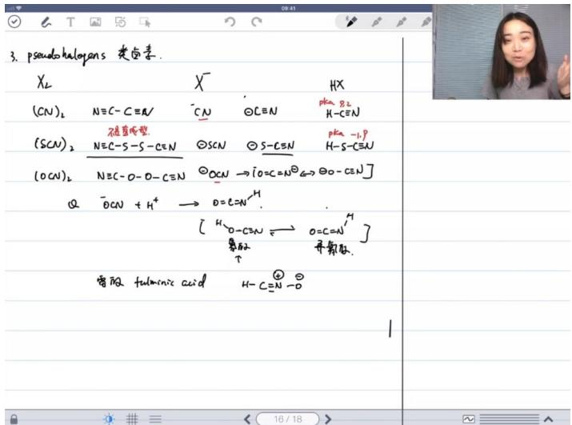

text_image

3. pseudo-halogens 类白素.
X₂
(CN)₂ N≡C-C≡N
(SCN)₂ 不重复型
(OCN)₂ N≡C-S-S-C≡N
① OCN → [O=C=N] → ② Θ-O-C≡N]
③ OCN + H⁺ → O=C=N⁻H
[ H₂O-C≡N ] → ④ O=C=N⁻H
⑤ 酸酚 → 平氨酸.
曾放 fulminic acid H-C≡N-0

- 类卤素定义：pseudohalogen（类卤素）因早期发现其与卤素具有相似简单反应而得名，如 $(CN)_2$ 与 $Cl_2$ 的相似反应性  
- 现代认知差异：

○ 配位化学中CN $^{-}$ 和SCN $^{-}$ 是重要配体，可显著改变配合物性质  
- 卤素在配位化学中表现单调，主要作为硬路易斯碱

● 特殊化合物：

- 雷酸(fulminic acid)结构: $H - C \equiv N - O$   
- 氰酸根(OCN $^{-}$ )存在共振结构: $O - C \equiv N \leftrightarrow O = C = N^{-}$

1. XY型互化物 01:54:01

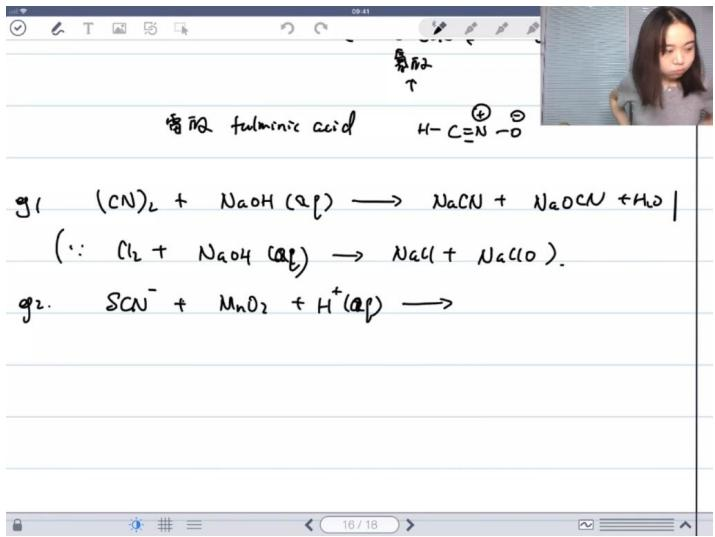

text_image

雷放 fulminic acid
H-C≡N-O
g1 (CN)₂ + NaOH (aq) → NaCN + NaOCN + H₂O |
(∵ Cl₂ + NaOH (aq) → NaCl + NaClO).
g2. SCN⁻ + MnO₂ + H⁺ (aq) →

● 典型反应：

○ $(CN)_{2} + NaOH(aq) \rightarrow NaCN + NaOCN + H_{2}O$ （类比 $Cl_{2} + NaOH$ 反应）  
○ $SCN^{-} + MnO_{2} + H^{+} \rightarrow (SCN)_{2} \uparrow + Mn^{2+} + H_{2}O$ （类比 $Cl^{-}$ 的氧化反应）

\- 毒性处理：

- OCN $^{-}$ 毒性虽弱于CN $^{-}$ 但仍需完全氧化处理  
- 废水处理需氧化至无毒产物（如 $N_{2}$ 、 $CO_{2}$ ）

2. XY3型互化物 01:54:26

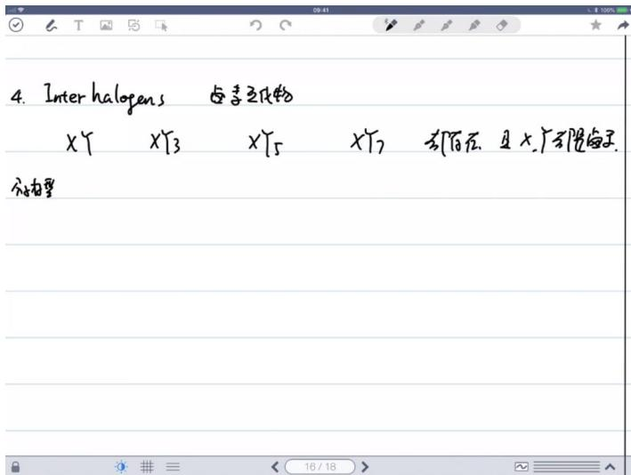

text_image

4. Inter halogens
XY XY3 XY5 XY7 邻存在 且 X, 广部限定义.
分的类型

# - 分子构型：

○ 采用VSEPR理论推导   
- XY3型为T型结构（中心原子保留两对孤对电子）

● 存在形式：所有卤素组合(XY、XY3、XY5、XY7)均存在

# 3. XY7型互化物 01:54:41

# ● 复杂构型：

○ 五角双锥（如 $IF_{7}$ ）  
○ 变形八面体  
○ 戴帽八面体

● 结构特点：中心原子价电子全部参与成键，形成高配位数结构

# 九、卤素互化物

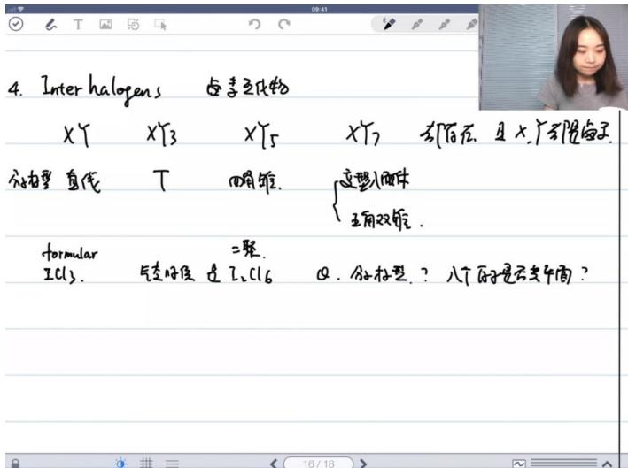

text_image

4. Inter halogens
XY XY3 XY5 XY7 郑在点，且X、Y都是直角。
方程型 直线 T 四角锥.
    这型入两体
        王角双锥.
formular
ICl₃.
        二聚.
        气态性质 过 I₂Cl₆
Q. 分子构型。？八个原子是否共平面？

基本类型：存在XY、 $XY_{3}$ 、 $XY_{5}$ 、 $XY_{7}$ 四种类型，其中 $XY_{2}$ 均为卤化物

# - 分子构型：

○ XY: 直线型  
○ XY3: T型  
○ XY5: 四方锥型  
○ XY7: 五角双锥型

# 1. 三氯化碘（ $\mathrm{ICl}_{3}$ ）的特殊性质

# - 存在形态:

○ 气态时以二聚体 $I_{2}Cl_{6}$ 形式存在  
- 固态时为离子化合物

# - 分子构型：

○ 二聚体 $I_{2}Cl_{6}$ 中八个原子共平面  
○ 每个碘原子采用 $sp^{3}d$ 杂化

# - 化学性质：

- 具有两性特征：既可作路易斯酸（接受Cl⁻形成ICl₄⁻），又可作路易斯碱  
- 卤键较弱，易发生解离和重组

# 2. 例题： $\mathrm{ICl}_{3}$ 分子构型分析

# ● 题目解析

○ 关键问题： $I_{2}Cl_{6}$ 二聚体是否共平面  
○ 分析要点：

■ 每个碘原子周围电子排布  
■ 孤对电子对分子构型的影响   
■ 与 $AlCl_{3}$ 二聚体结构的对比（Al为 $sp^{3}$ 杂化）

- 答案：八个原子共平面  
○ 易错点：容易忽略二聚体形成对分子构型的改变

# 十、卤素互化物化学性质

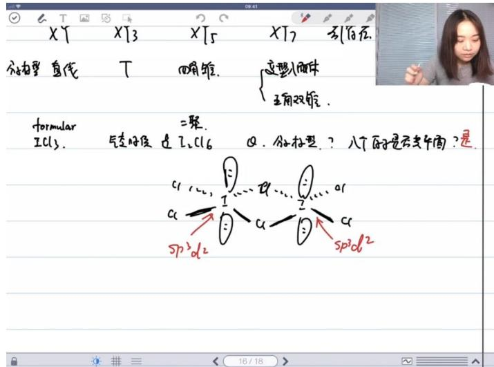

text_image

XY
XY3
XT5
XT7
引用在.

分构型 直线 T
四角锥.
造型入两体
五角双锥.

formular
ICl3.
气态作用 d I2Cl6
二聚.
α. 分构型 ? 八个原子是否含平面 ? 是

c1 ... 1 ... α ... 2 ... α1
c2 ... 1 ... α ... 2 ... c1
SP3d2
sp3d2

- 几何构型: ICI4-呈八面体构型，属于 $sp^{3}d^{2}$ 杂化  
● 平面性: 八个顶点不在同一平面上

# 1. 路易斯酸碱行为

● 两性特征: XY3型化合物（如ICI3）既可作路易斯酸又可作路易斯碱

○ 酸行为: 接受Cl-形成 $|Cl4-$ ( $ICl_{3} + Cl^{-} \rightarrow ICl_{4}^{-}$ )  
○ 碱行为: 失去Cl-形成ICl2+ $(ICl_{3}\rightarrow ICl_{2}^{+}+Cl^{-})$

● 典型实例: BrF3是重要的氟化试剂和氧化剂

# 2. 例题：BrF3的路易斯酸行为判断

# ● 题目解析

- 反应本质: BrF3作为路易斯酸时会转化为BrF4-离子  
选项分析:

■ A选项（CsF）：正确，生成CsBrF4  
B选项（SbF5）：可能不反应，理论上应生成BrF2+SbF6-但实际存疑  
■ C选项（SF6）：不反应，因SF6极其稳定

○ 关键考点: 路易斯酸碱理论的实际应用判断

○ 易错点: 需注意实际反应可能性与理论推导的差异

# 十一、卤素互化物与多卤离子

# 1. 卤素互化物性质

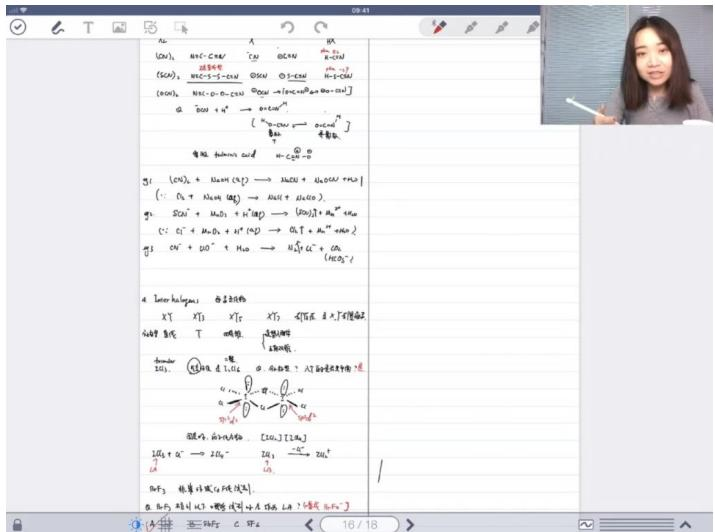

text_image

（CO2）：NHC-C-OH → C2H  OCH2W  K=O-H
（CO2），NHC-S-OH → OCH2W  O-CHOH
（CO2），NHC-O-O-H → OCH2W → [OCH2+O2O-CHOH]
a. SO2 + a" → O-CHO"
{ "O-CHO" → O-CHO"}
b. H2 + H2O-
CH2OH + CH2O-
CH2OH + CH2O-
CH2OH + CH2O-
CH2OH + CH2O-
CH2OH + CH2O-
CH2OH + CH2O-
CH2OH + CH2O-
CH2OH + CH2O-
CH2OH + CH2O-
CH2OH + CH2O-
CH2OH + CH2O-
CH2OH + CH2O-
CH2OH + CH2O-
4. Inter-halogen: 白子结构
XY XY XZ X3  有性质：A、B、C、D、E、F、G、H、I、J、K、L、M、N、O、P、Q、R、S、T、U、V、W、X、Y、Z、A、B、C、D、E、F、G、H、I、J、K、L、M、N、O、P、Q、R、S、T、U、V、W、X、Y、Z、A、B、C、D、E、F、G、H、I、J、K、L、M、N、O、P、Q、R、S、T、U、V、W、X，C=O
结构式：T = 硬构。{结构式：
结构式：
结构式：
结构式：
结构式：
结构式：
结构式：
结构式：
结构式：
结构式：
结构式：
结构式：
结构式：
结构式：
结构式：
结构式：
结构式：
结构式：
结构式：
结构式：
结构式：
结构式：
结构式：
结构式：
结构式：
结构式：
结构式：
结构式：
结构式：
结构式：
结构式：
结构式：
结构式：
结构式：
structure：
structure。
结构式：
结构式：
结构式：
结构式：
结构式：
结构式：
结构式：
结构式：
结构式：
结构式：
结构式：
结构式：
结构式：
结构式：
结构式：
结构式：
结构式：
结构式：
结构式：
结构式：
结构式：
结构式：
结构式：
结构式：
结构式：
结构式：
结构式：
结构式：
结构式：
结构式：
结构式：
结构式：
结构式：
组织形式：组织形式。
组别：组织形式。
组别：组织形式。
组别：组织形式。
组别：组织形式。
组别：组织形式。
组别：组织形式。
组别：组织形式。
组别：组织形式。
组别：组织形式。
组别：组织形式。
组别：组织形式。
组别：组织形式。
组别：组织形式。
组别：组织形式。
组别：组织形式。
组别：组织形式。
组别：组织形式。

● 路易斯酸特性： $BrF_{3}$ 是活泼的氟化试剂，同时具有氧化性  
- 反应机制：作为路易斯酸时， $BrF_{3}$ 会接受电子对形成 $BrF_{4}^{-}$ 负离子  
● 稳定性比较：六氟化硫 $(SF_{6})$ 比五氟化硫 $(SF_{5})$ 和七氟化硫 $(SF_{7})$ 更稳定

# 2. 多卤正离子

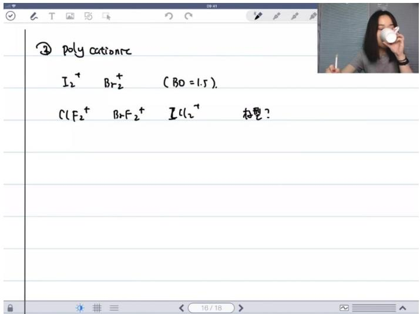

text_image

② poly cationics
I₂⁺ Br₂⁺ (BO = 1.5).
ClF₂⁺ Br₂F₂⁺ ICl₂⁺ 构型?

● 常见类型： $Br_{2}^{+}$ 、 $ClF_{2}^{+}$ 、 $BrF_{2}^{+}$ 等  
● 键级特征： $Br_{2}^{+}$ 的键级为1.5，使其成为常见中间体  
● 构型判断：绝大多数卤素互化物符合VSEPR理论预测的构型

# 3. 分子构型分析

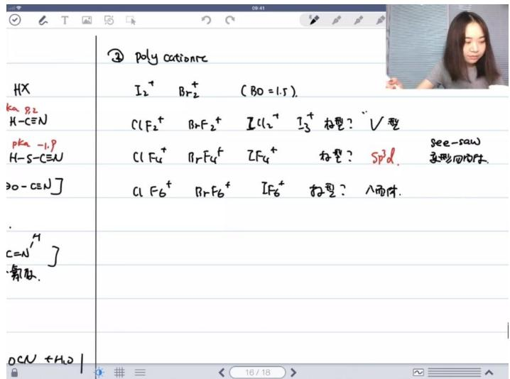

text_image

HX
kα 8.2
H-C≡N
pKa -1.9
H-S-C≡N
30-C≡N]
C=N'
-氰酞.
OCN +H2O
③ poly cationics
I2+ Br2+ (BO=1.5).
ClF2+ BrF2+ ICl2+ I3+ 气型? "V型
ClF4+ BrF4+ ZF4+ 气型? Sp3d. see-saw
Cl F6+ Br F6+ If6+ 气型? ∧面体.

● V型结构：如 $ClF_{2}^{+}$ 、 $BrF_{2}^{+}$ 等，采用 $sp^{3}d$ 杂化，含孤对电子  
- 八面体构型：如 $IF_{6}^{+}$ ，采用 $sp^3 d^2$ 杂化  
● 构型决定因素：外层电子数目决定分子构型，与具体原子种类无关

# 4. 多卤负离子

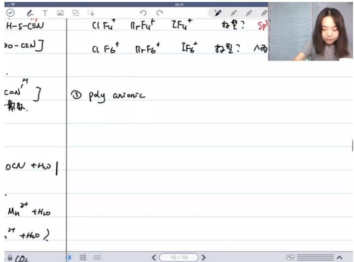

text_image

H-S-C≡N
≥0- C≡N]
C=N' ]
• 静取.
OCN +H2O
Mn2+ +H2O
2+ +H2O
③ poly anionic
CO2

● 13-离子特性：

基本构型：理论对称直线型  
○ 实际变化：受阳离子影响可变为不对称结构  
○ 键长差异：与四甲基铵离子配对时键长310pm和282pm   
- 稳定性：与钠离子配对时不稳定

\- 极化效应：阳离子极化能力越强，越容易使I3-不对称

\- 其他负离子：

○ $XY_{2}^{-}$ ：直线型  
○ $XY_{4}^{-}$ ：平面四边形 $(sp^{3}d^{2}$ 杂化)  
○ $XY_{6}^{-}$ ：变形八面体(如 $ClF_{6}^{-}$ 、 $BrF_{6}^{-}$ )

# 5. 例题：路易斯酸反应判断

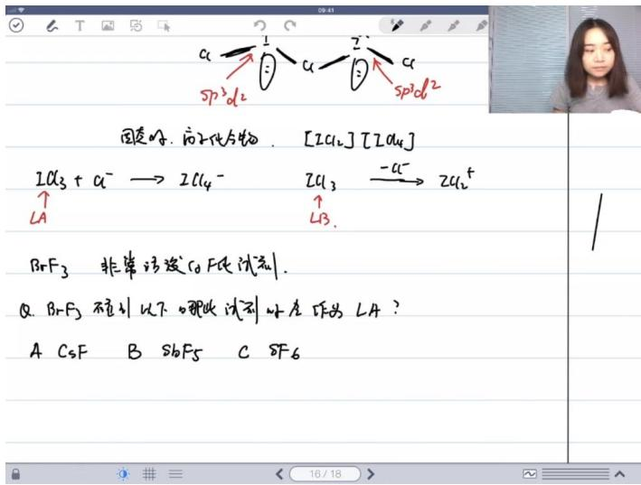

text_image

α → 1 → α → 2 → α
SP³ol² SP³ol²

固态时，向子化合物．[ZCu₂][ZCu₄]

I Ca₃ + a⁻ → ZCu₄⁻    ZCu₃    -a⁻ → ZCu₂⁺
↑        ↑
LA          LB.

BrF₃ 非常活泼的FC试剂.

Q. BrF₃ 不相互以下哪些试剂可作为LA？

A CsF   B SbF₅   C SF₆

# ● 题目解析

反应本质：判断 $BrF_{3}$ 与哪些试剂反应时会作为路易斯酸  
○ 产物分析：反应后应形成 $BrF_{4}$   
选项评估：

A(CSF): 可生成 $CSBrF_{4}$   
■ B( $SbF_{5}$ ): 可能不反应  
■ $C(SF_{6})$ ：极稳定，倾向不反应

\- 答案：A正确，B、C存疑需进一步验证

# 十二、反应速率分析02:23:14

# 1. 中心原子半径影响 02:23:22

# 1）多卤化物与拟卤化物

\- 多卤阴离子结构

<table><tr><td>30-CENJ</td><td>αF6+BrF6+IF6+粉型：A雨</td></tr><tr><td>C=N^M↓氯苯.</td><td>③poly anionic</td></tr><tr><td>OCN +H2O |</td><td>I3-I-I7- 对称.当Cation是 NMe4
1-7-2 不对称.当M+ = Cs+
Slop 2H2Pm NaI3 unstable.当M+ = Na+</td></tr><tr><td>Mn^2++H2O</td><td></td></tr><tr><td>2++H2O)</td><td></td></tr><tr><td>CO2(HCO3^-)</td><td></td></tr></table>

☐ I3⁻结构特征：呈现不对称线性结构（I-I-I⁻），键长分别为310pm和282pm。当阳离子为 + NMe₄时稳定，而NaI₃不稳定。  
- 稳定性规律：阳离子半径越大越稳定， $Cs^{+} > Na^{+}$ 。

\- 卤素间化合物阴离子

<table><tr><td></td><td></td></tr><tr><td></td><td></td></tr><tr><td></td><td></td></tr><tr><td></td><td></td></tr><tr><td></td><td></td></tr><tr><td></td><td></td></tr><tr><td>且x_广部限定式.</td><td></td></tr><tr><td></td><td></td></tr><tr><td></td><td></td></tr><tr><td></td><td></td></tr><tr><td></td><td></td></tr><tr><td></td><td></td></tr><tr><td></td><td></td></tr><tr><td></td><td></td></tr><tr><td></td><td></td></tr><tr><td></td><td></td></tr><tr><td></td><td></td></tr><tr><td></td><td></td></tr><tr><td></td><td></td></tr><tr><td></td><td></td></tr><tr><td></td><td></td></tr><tr><td></td><td></td></tr><tr><td></td><td></td></tr><tr><td></td><td></td></tr><tr><td></td><td></td></tr><tr><td></td><td></td></tr><tr><td></td><td></td></tr><tr><td></td><td></td></tr><tr><td></td><td></td></tr><tr><td></td><td></td></tr><tr><td></td><td></td></tr><tr><td></td><td></td></tr></table>

- - XY4-型：包括ClF $_{4}^{-}$ 、IF $_{4}^{-}$ 、ICl $_{4}^{-}$ 、IBr $_{4}^{-}$ ，均为平面四边形构型。

○ XY6-型:

- $ClF_{6}^{-}$ 和 $BrF_{6}^{-}$ : 三角八面体构型  
■ $IF_{6}^{-}$ ：反形八面体构型，存在F...I-F相互作用

○ 特殊构型：

■ $IF_{8}^{-}$ ：四方反棱柱构型（square antiprism），中心碘原子采用 $sp^{3}d^{4}$ 杂化，上下各一个正方形平面，氟原子位于顶点。

● 构型判断技巧

○ VSEPR应用：多数多卤离子构型可用价层电子对互斥理论预测

例外情况：

■ $sp^{3}d^{3}$ 杂化体系优先考虑变形八面体而非五角双锥   
■ 需额外信息（如存在C5旋转轴）才能确定五角双锥构型

\- 记忆重点：考试中未说明对称性时，默认选择变形八面体构型

● 拟卤化物反应

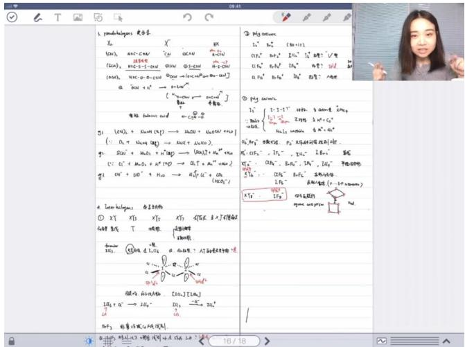

text_image

1. pseudoligons 更含有
X
(CN)  WIC-CwI  Cn  ACu  RX
(500)  HC-CH2-CwI  OH  CH2-CwI  H2C
(500)  NHC-Cr-O-CwI  OOH → (OCu-PaOx-3H)
a  CN + a' →  n+cm'
{ "n+cm" → "n+cm" }
#p
#Pg: balance and wC=O
G1 (CN) + NaOH (Al) → NaOH + NaOH + H2O
(Cl + Na + ClO) → NaCl + Cl(OH)
g1  ZnO + NbO + H2O → (SnO) + H2O + H2O
G2 (Cr + SnO + H2O) → G2T + H2O + H2O
g1  CN' + Sn'O + H2O → H2O + H2O (H2O)
a lasso conjugate  b/3ltral
① X1 X2 X3 X4 X5 X6 X7 X8 X9 X10 X11 X12 X13 X14 X15 X16 X17 X18 X19 X20 X21 X22 X23 X24 X25 X26 X27 X28 X29 X30 X31 X32 X33 X34 X35 X36 X37 X38 X39 X40 X41 X42 X43 X44 X45 X46 X47 X48 X49 X50 X51 X52 X53 X54 X55 X56 X57 X58 X59 X60 X61 X62 X63 X64 X65 X66 X67 X68 X69 X70 X71 X72 X73 X74 X75 X76 X77 X78 X79 X80
d/lnP = T - [m/z] / [m/z]
d/lnP = [m/z] / [m/z]
d/lnP = [m/z] / [m/z]
d/lnP = [m/z] / [m/z]
d/lnP = [m/z] / [m/z]
d/lnP = [m/z] / [m/z]
d/lnP = [m/z] / [m/z]
d/lnP = [m/z] / [m/z]
d/lnP = [Mn] / [Mn]
d/lnP = [Mn] / [Mn]
d/lnP = [Mn] / [Mn]
d/lnP = [Mn] / [Mn]
d/lnP = [Mn] / [Mn]
d/lnP = [Mn] / [Mn]
d/lnP = [Mn] / [Mn]
d/lnP = [Mn] / [Mn]
10H + H2O → H2O
1H + H2O → H2O
1H + H2O → H2O
1H + H2O → H2O
1H + H2O → H2O
1H + H2O → H2O
1H + H2O → H2O
1H + H2O → H2O
1H + H2O → H2O
1H + H2O → H2O
10H + H2O → H2O
1H + H2O → H2O
1H + H2O → H2O
1H + H2O → H2O
1H + H2O → H2O
1H + H2O → H2O
1H + H2O → H2O
1H + H2O → H2O
1H + H2O → H2O

$\mathrm{SCN}^{-}$ 氧化反应： $2SCN^{-} + MnO_{2} + 4H^{+}\rightarrow (SCN)_{2} + Mn^{2 + } + 2H_{2}O$   
○ OCN $^{-}$ 水解： $OCN^{-} + H_{2}O \rightarrow CO_{3}^{2-} + NH_{3}$

2）卤素含氧酸的结构与性质 02:29:09

\- 氟的氧化物

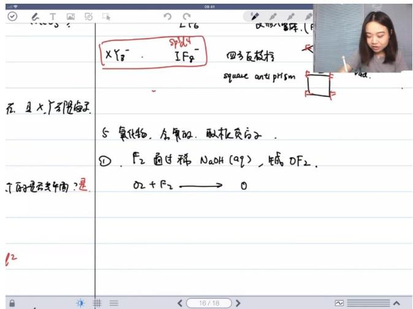

text_image

xY₂⁻
SPbO₄⁻
IF₂⁻
四方反极性
square anti-phsm
不，且x，p都是句子。
5 氧化物，含氧、取根负交子。
① F₂ 通过稀 NaOH(aq)，碱 OF₂.
O₂ + F₂ → 0
P₂
P₂是否弯曲？是
16/18

制备方法：氟气通过稀氢氧化钠溶液可生成 $OF_{2}$ ，反应式为 $F_{2}+$

$$
2 N a O H \rightarrow O F _ {2} + 2 N a F + H _ {2} O
$$

○ 特殊制备：液态氧和氟在特殊条件（光照/电解）下可制得 $O_{2}F_{2}$ ，但该物质不稳定

○ 结构特征： $O_{2}F_{2}$ 具有 $C_{2}$ 旋转轴，位于氧-氧连线中点与氟-氟连线中点的延长线上

○ 化学性质： $O_{2}F_{2}$ 是强氟化剂，结构与过氧化氢类似

\- 氯的含氧化物 02:30:47

○ 二氧化氯(CIO₂)

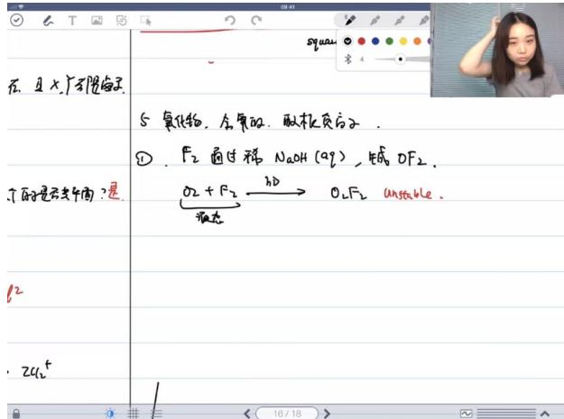

text_image

在,且大厂引起海天.
5. 氧化物,含氧的,取水质方程。
①. F₂ 通过稀 NaOH(aq),铸 O₂F₂.
T_2的是否去个面?是.
O₂ + F₂ → O₂F₂ unstable.
液态
f₂
zCu₄⁺
16/18

结构特征：顺磁性但不二聚，氯原子采用 $sp^{2}$ 杂化，孤对电子朝外

■ 制备方法：二氧化硫还原氯酸溶液，反应式为 $2ClO_{3}^{-} + SO_{2}H \neq 2ClO_{2} + SO_{4}^{2-}$

■ 应用：主要用于净水和纸张漂白，其漂白原理是利用强氧化性破坏染料分子的大π键

■ 对比：与二氧化硫漂白原理不同， $SO_{2}$ 是通过与有机物结合实现还原性漂白

○ 环境化学特性

■ 环境友好性：过氧化氢比含氯消毒剂更环保，因氯可能形成致癌的碳氯键化合物

■ 自由基危害：碳氯键易产生氯自由基，进而生成OH自由基破坏DNA

\- 溴和碘的氧化物

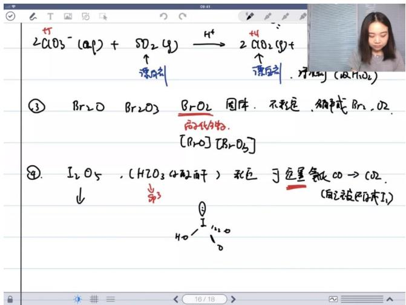

chemical

Chemical reaction equations involving bromination, acidification, and hydrogenation steps

溴氧化物： $Br_{2}O$ 、 $Br_{2}O_{3}$ 、 $BrO_{2}$ 均为固体，不稳定易分解为单质

○ 碘氧化物：

■ $I_{2}O_{5}$ 最稳定，是碘酸 $(HIO_{3})$ 的酸酐，加水生成碘酸  
■ 可定量氧化CO为 $CO_{2}$ ，自身被还原为碘单质  
■ 碘酸结构为 $SP^{3}$ 杂化的三角锥形，是一元酸

# 3）卤素含氧酸的氧化性比较 02:40:43

# - 氯含氧酸系列

<table><tr><td colspan="5">6 合聚的. 联椒质分子.</td></tr><tr><td>Q1</td><td>+1 HClO</td><td>+3 HClO2</td><td>+5 HClO3</td><td>+7 HClO4</td></tr><tr><td>pka</td><td>7.53</td><td>2</td><td>-1.2</td><td>-10.</td></tr><tr><td></td><td></td><td></td><td></td><td></td></tr><tr><td></td><td></td><td></td><td></td><td></td></tr><tr><td></td><td></td><td></td><td></td><td></td></tr><tr><td></td><td></td><td></td><td></td><td></td></tr><tr><td></td><td></td><td></td><td></td><td></td></tr><tr><td></td><td></td><td></td><td></td><td></td></tr><tr><td></td><td></td><td></td><td></td><td></td></tr><tr><td></td><td></td><td></td><td></td><td></td></tr><tr><td></td><td></td><td></td><td></td><td></td></tr><tr><td></td><td></td><td></td><td></td><td></td></tr><tr><td></td><td></td><td></td><td></td><td></td></tr><tr><td></td><td></td><td></td><td></td><td></td></tr><tr><td></td><td></td><td></td><td></td><td></td></tr><tr><td></td><td></td><td></td><td></td><td></td></tr><tr><td></td><td></td><td></td><td></td><td></td></tr></table>

酸性趋势： $HClO(pKa=7.5) < HClO_{2}(pKa=2) < HClO_{3}(pKa=-1.2) < HClO_{4}(pKa=-10)$

○ 结构解释：所有氯均为 $sp^{3}$ 杂化，随氧原子数增加酸性增强

# - 氧化性比较

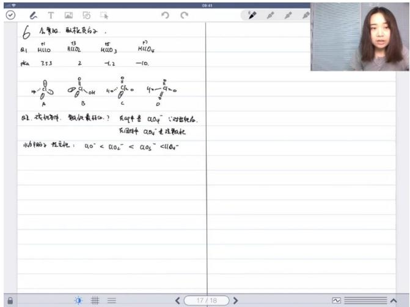

text_image

6 合物配: 酞盐负离子
Q1 HCO 13 HCO2 15 HCO3 17 HCO4
PNa 7.53 2 -1.2 -10.
H₂O 0 O₂⁻ 0 H₂O 0 0 H₂O 0
A B C D
Q2. 找标条件: 酞盐量的Q2? 在Q4中, 意 \( CO_4^- \) : 对出纯度,
在固体中, \( CO_4^- \) 是过氧化剂
小分子的, 总化: \( QO^- < CO_2^- < CO_3^- < CO_4^- \)
17/18

O

○ 溶液稳定性： $ClO^{-}<ClO_{2}^{-}<ClO_{3}^{-}<ClO_{4}^{-}$   
- 特殊现象：固体高氯酸盐是强氧化剂，与其在溶液中的稳定性相反  
- 分析方法：通过Frost图分析各价态氯的氧化还原特性，不推荐死记硬背

# 4）Frost Diagram与电极电势 02:45:47

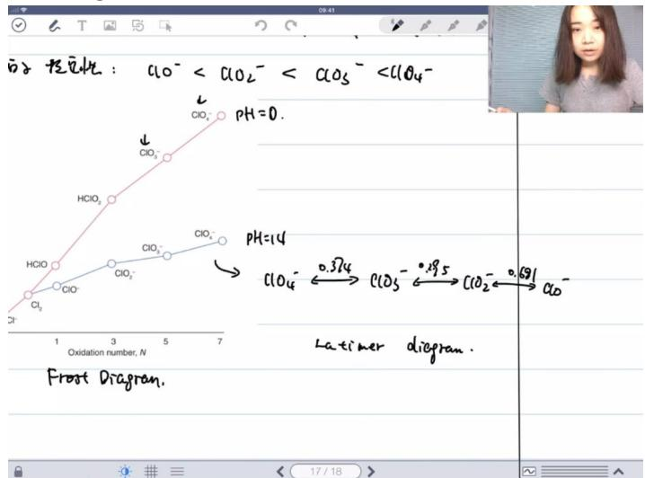

text_image

pH=0.
pH=14
ClO₄⁻ ⇌ ClO₃⁻ ⇌ ClO₂⁻ ⇌ ClO₄⁻
0.374 0.195 0.191
La timer diagram.
Cl₂ ClO₄⁻ ClO₃⁻ ClO₂⁻ ClO₄⁻
Oxidation number, N
Frost Diagram.

●

- 图示特征：横轴为氧化态（N），纵轴为 $nE^{\circ}$ （氧化态×标准电极电势）。零价态（ $\mathrm{Cl}_{2}$ ）始终位于原点，负价态在负半轴，正价态在正半轴。  
- 斜率意义：相邻两点连线的斜率代表该价态转化的电极电势。凸起的点位（如Cl₂、ClO₂⁻）易发生歧化反应。  
- 计算方法：计算不相邻价态间电势时，需加权平均各步电势。例如 $E^{\circ}(ClO_{4}^{-}/ClO^{-}) = (0.374 \times 2 + 0.295 \times 2 + 0.681 \times 2) / 6 = 0.45V$ 。

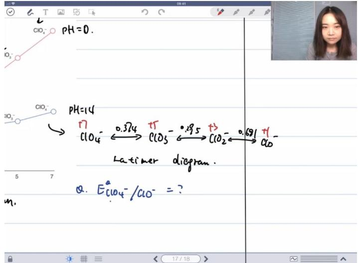

text_image

PH=0.
PH=14
ClO₄⁻ 0.374 T P CIO₃⁻ 0.295 T³ CIO₂⁻ 0.691 T¹ CIO
La timer diagram.
α. E²CIO₄⁻/CIO⁻ = ?
m.

●

\- pH影响：图中红线（pH=0）代表酸性条件，蓝线（pH=14）代表碱性条件。ClO $^{-}$ 和ClO $_{2}^{-}$ 在pH=0时仍保持酸根形式（pKa为负值）。

# 5）卤素含氧酸反应速率与pH的关系 02:56:27

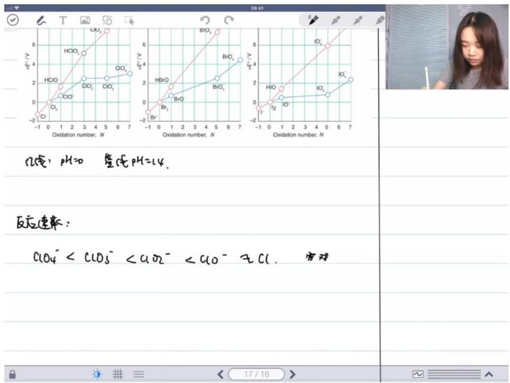

text_image

Cl₂
Oxidation number, N
HClO₄
Cl₂
Oxidation number, N
Br₂
Oxidation number, N
HBrO
Br₂
Oxidation number, N
BIO₄
Br₂
Oxidation number, N
Br₂
Oxidation number, N
HBrO₄
Br₂
Oxidation number, N
Br₂
Oxidation number, N
Br₂
Oxidation number, N
Br₂
Oxidation number, N
Br₂
Oxidation number, N
Br₂
Oxidation number, N
Br₂
Oxidation number, N
Br₂
Oxidation number, N
Br₂
Oxidation number, N
Br₂
Oxidation number, N

# ● 速率规律：

○ 氯系： $ClO_{4}^{-}<ClO_{3}^{-}<ClO_{2}^{-}\approx ClO^{-}\approx Cl_{2}$   
○ 溴系： $BrO_{4}^{-}<BrO_{3}^{-}\approx BrO^{-}\approx Br_{2}$   
○ 碘系： $IO_{4}^{-}<IO_{3}^{-}<I_{2}$   
○ 跨族比较： $ClO_{4}^{-}<BrO_{4}^{-}<IO_{4}^{-}$

# ● 影响因素：

- 对称性：高卤酸根（如 $ClO_{4}^{-}$ ）对称性高导致动力学惰性  
○ 中心原子半径：I > Br > Cl，半径越大越易发生反应  
pH效应：酸性条件（低pH）既提高热力学趋势（增加 $H^{+}$ 浓度促进氧化半反应），又改善动力学（破坏对称性降低活化能）

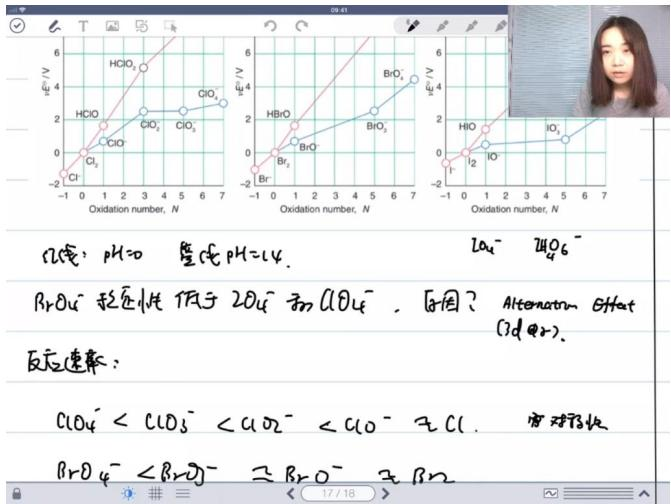

text_image

HClO₄
Cl₂
HClO
ClO₂⁻
ClO₃⁻
ClO₄⁻
-2
-1
0
1
2
3
4
5
6
7
Oxidation number, N
6
Oxidation number, N
BrO₄⁻
BrBr₂
BrBrO
BrBrO₃⁻
BrBrO₄⁻
BrBrO₅⁻
BrBrO₆⁻
Rh=O  简线pH=14.
BrO₄⁻ 轻定性 低于 204⁻ 和 ClOH₄⁻，原因？Alternaton Othat
(3d @8).
反应速率：
ClO₄⁻ < ClO₃⁻ < ClO₂⁻ < ClO⁻ 至 Cl⁻。
守对吸收
BrO₄⁻ < Br₂O₃⁻ = BrO⁻ 至 Br₂

\- 特殊结构：高碘酸根存在 $IO_{4}^{-}$ 和 $IO_{6}^{5-}$ 两种形式，后者通过脱水可形成 $I_{2}O_{9}^{4-}$ ，这种结构多样性影响其稳定性。

# ● 热力学vs动力学:

- 热力学：通过Frost Diagram判断反应可能性（ $\Delta G < 0$ ）  
- 动力学：需考虑对称性、空间位阻等因素，如 $ClO_{3}^{-}$ 虽热力学可行但实际反应慢

# 十三、知识小结

<table><tr><td>知识点</td><td>核心内容</td><td>考试重点/易混淆点</td><td>难度系数</td></tr><tr><td>卤素</td><td>原子半径、电离能、熔沸点、电负性变化规律</td><td>氟的反常性质(半径小导致电子排斥力大)</td><td>★★★</td></tr><tr><td>元素性质</td><td></td><td></td><td></td></tr><tr><td>卤素单质制备</td><td>氟气(电解KHF2)、氯气(氯碱工业)、溴/碘(氯置换法)</td><td>电解条件差异(氟必须无水)</td><td>★★★★</td></tr><tr><td>卤素互化物</td><td>XY/XY3/XY5/XY7型化合物</td><td>分子构型判断(VSEPR理论应用)</td><td>★★★★</td></tr><tr><td>类卤素物质</td><td>CN2/SCN-/OCN-等拟卤素性质</td><td>与卤素的反应类比(如CN2+NaOH→NaCN+NaOCN)</td><td>★★★★</td></tr><tr><td>卤素含氧酸</td><td>HClO/HClO2/HClO3/HClO4系列</td><td>酸性/氧化性变化规律(结构对称性影响)</td><td>★★★★</td></tr><tr><td>特殊化合物</td><td>全氟烷烃惰性、三氟化铝离子性、卤素多聚离子</td><td>I3-对称性受阳离子极化影响</td><td>★★★★</td></tr><tr><td>电化学图解</td><td>Frost图(斜率判歧化)、Latimer图(电势计算)</td><td>ClO4-热力学稳定但动力学惰性</td><td>★★★★★</td></tr><tr><td>实际应用</td><td>含氟牙膏(Ca5(PO4)3OH→Ca5(PO4)3F)、氟利昂替代品</td><td>环境化学考点(臭氧层破坏机制)</td><td>★★★</td></tr></table>