# 一、作业答疑02:17

# 1. 化学方程式配平

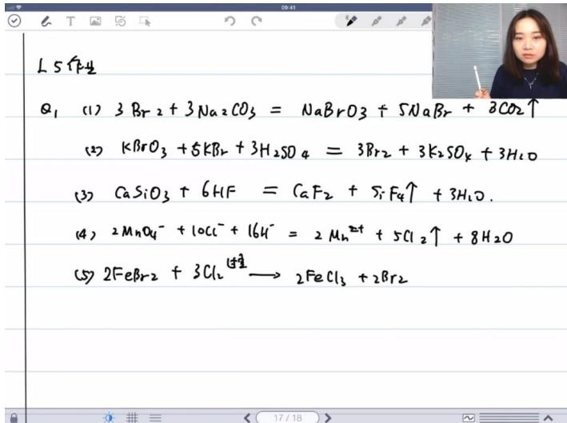

text_image

L 5 作
Q1 (1) 3 Br2 + 3 Na2CO3 = NaBrO3 + 5NaBr + 3CO2↑
(2) KBrO3 + 5KBr + 3H2SO4 = 3Br2 + 3K2SO4 + 3H2O
(3) CaSiO3 + 6HF = CaF2 + SiF4↑ + 3H2O.
(4) 2MnO4- + 10Cl- + 16H- = 2 Mn2↑ + 5Cl2↑ + 8H2O
(5) 2FeBr2 + 3Cl2 → 2FeCl3 + 2Br2

- 溴的价态稳定性：三价溴 $(Br^{3+})$ 很不稳定，正五价 $(BrO_{3}^{-})$ 和负一价 $(Br^{-})$ 比较稳定  
● 气体标注：反应中生成的气体需要标注气体符号(↑)   
● 歧化反应：在碱性条件下会发生歧化反应，酸性条件下发生氧化还原反应  
- 硅氟键特性：硅酸钙与氢氟酸反应时，氟硅键非常强，会生成四氟化硅气体 $(SiF_{4}\uparrow)$   
● 实验室制氯气：酸性条件下二氧化锰与氯离子反应制氯气的经典反应：

$$
2 M n O _ {4} ^ {-} + 1 0 C l ^ {-} + 1 6 H ^ {+} = 2 M n ^ {2 +} + 5 C l _ {2} \uparrow + 8 H _ {2} O
$$

● 工业制氯气：氯碱法是工业上大规模制氯气的方法，同时制得氢气和氢氧化钠

\- 铁离子氧化：二价铁 $(Fe^{2+})$ 被氧化成三价铁 $(Fe^{3+})$ ，过量时会将溴也氧化

# 2. 五元中强酸正四面体空间构型 06:01

# ● 高碘酸特性：

○ 化学式： $H_{5}IO_{6}$ （五元中强酸）  
- 酸强度：属于中强酸  
○ 空间构型：酸根离子 $(IO_{6}^{5-})$ 为正八面体构型  
- 失水反应：容易失水变成 $IO_{4}^{-}$   
- 杂化方式：碘原子采用 $sp^{3}d^{2}$ 杂化  
- 氧化性：具有氧化性

# 3. cl2o空间构型分析 07:10

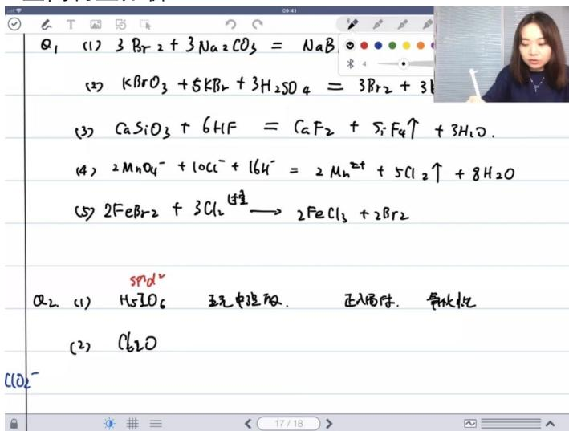

text_image

Q₁ (1) 3Br₂ + 3Na₂CO₃ = NaB
(2) KBrO₃ + 5KBr₂ + 3H₂SO₄ = 3Br₂ + 3H₂SO₄
(3) CaSiO₃ + 6HF = CaF₂ + SiF₄↑ + 3H₂O.
(4) 2MnO₄⁻ + 10Cl⁻ + 16H⁻ = 2Mn²↑ + 5Cl₂↑ + 8H₂O
(5) 2FeBr₂ + 3Cl₂ → 2FeCl₃ + 2Br₂
Q₂ (1) H₅SO₆ 现化中湿酸 正入腐蚀 异极化
(2) Cl₂O
C(O)⁻

# - Cl2O结构：

○ 构型：V字形结构（类似于水分子结构）

# - ClO2结构：

○ 构型：同样是V字形  
○ 键特性：含有大π键，键级介于1-2之间  
○ 键长：比Cl2O中的Cl-O单键更短

# 4. 酸的强弱比较 08:08

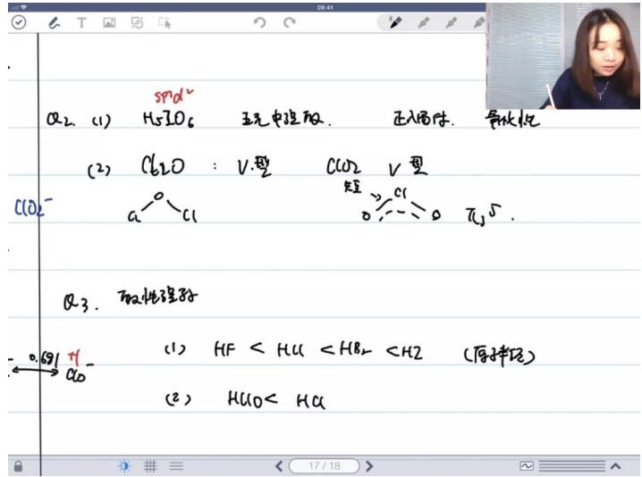

text_image

Q2. (1) H5IO6 玉光中度放. 正入易体. 异极化
(2) Cl2O : V型 CO2 V型
C(O)- a-Cl 0-:0 -:0 π/5.
Q3. 取性理导
(1) HF < HCl < HBr < H2 (原拌法)
(2) HClO < HCl

# ● 比较原则：

- 原子半径效应：当质子直接与原子相连时（如HI、HCI、HBr、HF），主要考虑原子半径效应  
○ 诱导效应：当中心原子与氢之间通过氧连接时（如含氧酸），主要考虑中心原子的电负性诱导效应  
- 极化效应：结构类似时，中心原子被更多氯氧键极化， $\delta+$ 越明显，负离子稳定性越高  
- 3d效应：溴的3d电子效应导致其电负性比实际表现要大

# 5. 高氯酸和磷酸的电负性 10:50

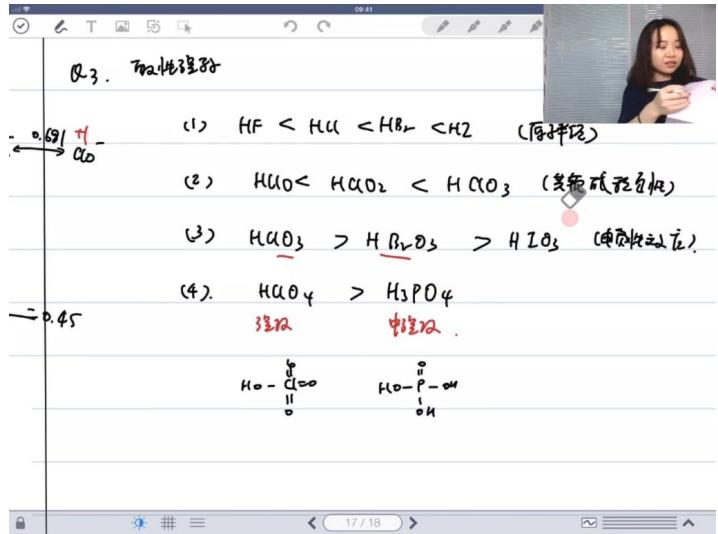

text_image

Q3. 取性理子
(1) HF < HCl < HBr2 < H2 (原样压)
(2) HClO < HCO2 < HCO3 (其他硫态正压)
(3) HCO3 > HBr2O3 > H2O3 (单质性动压)
(4). HCO4 > H2PO4
强反 电强反
HO - Cl=O  HO - P - OH
      0      0      0
      0      0      0
→ 0.45

# - 高氯酸 $(HClO_{4})$ 特性：

- 酸性：强酸  
○ 结构：有3个π键极化，使氯原子δ+非常明显

# - 磷酸 $(H_{3}PO_{4})$ 特性：

- 酸性：中强酸  
○ 结构：只有1个极化，其余为OH基团

● 比较结果： $HClO_{4}$ 的酸性远强于 $H_{3}PO_{4}$

# 二、国初考点 12:27

# 1. 晶体类型 14:12

# 1）固体类型 14:47

# - 晶体类型概述

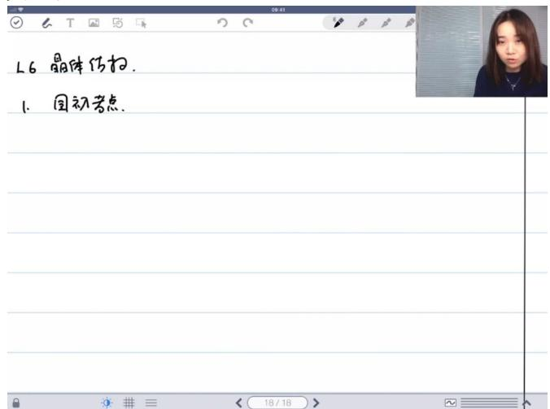

text_image

L6 晶体传扫.
1. 回初考点.

金属晶体判断标准：由纯金属原子构成或主要含金属原子（允许掺入少量其他原子），包括合金  
- 四大晶体类型：金属晶体、分子晶体、离子晶体、原子晶体（原子网状结构）  
○ 核心考点：能够准确判断给定物质的晶体类型

# - 分子晶体 15:15

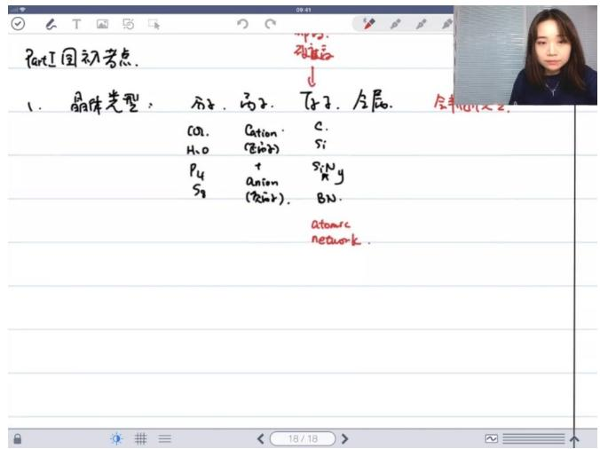

text_image

Part I 回初考点.
1. 晶体类型: 方子、句子、句子、金属.
CO₂、Cation、C
H₂O (Zürz)、Si
P₄ + anion、SᵢNᵧ
S₃ (Zürz)、BN.
 atoms
network.

○ 组成特征：晶体的基本组成单元是分子  
○ 典型实例： $CO_{2}$ 固体、冰（ $H_{2}O$ ）、 $H_{2}S$ 、 $S_{8}$ （硫八）、 $P_{4}$ （白磷）  
- 特殊说明：氟化氢固体（HF）可能存在特殊结构，需特别注意  
- 结合力本质：依靠分子间作用力维系晶体结构

# - 离子晶体 15:45

○ 结构特征：由正离子（阳离子）和负离子（阴离子）通过静电作用构成  
○ 典型实例：氯化钠（NaCl）、硫化锌（ZnS）  
- 识别要点：含有明确的正负离子对，通常是金属阳离子与非金属阴离子的组合

# - 原子晶体

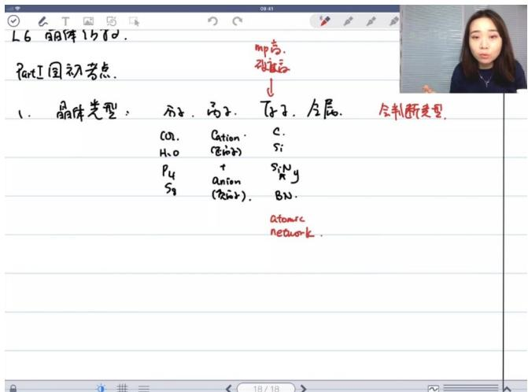

text_image

L6 铜体仍存。
Part I 国初考点.
1. 晶体类型：分子、离子、原子、金属、全制断变型.
CO₂.Cation.C.
H₂O(磁性)Si
P₄+SiNᵧ
S₈(anion BN.
(密尔克).atomerc
network.

○ 组成特征：由原子通过共价键直接构成三维网状结构  
○ 典型实例：金刚石（C）、单晶硅（Si）、氮化硅（ $Si_{3}N_{4}$ ）、氮化硼（BN）  
○ 特殊说明：石墨虽含碳原子但硬度不高，因其仅为层状结构而非三维网状  
- 硅碳混合物：通常也属于原子晶体范畴

● 不同晶体类型的性质对比 17:30

○ 熔点规律：

■ 原子晶体 > 离子晶体 > 金属晶体 > 分子晶体  
■ 分子晶体熔沸点最低（如 $CO_{2}$ 升华温度-78.5℃）

\- 硬度规律：

■ 原子晶体（金刚石莫氏硬度10）>离子晶体>金属晶体>分子晶体  
■ 石墨例外：熔点高但硬度低

○ 金属特性：

■ 熔点和硬度范围很广（汞常温液态，钨熔点3422℃）  
■ 典型高熔点金属：钨（灯丝材料）

○ 键能对比：

■ 共价键（原子晶体）≈离子键＞金属键＞分子间作用力

\- 记忆要点:

■ 原子晶体必具"两高"特性：高熔点、高硬度  
■ 分子晶体必具"两低"特性：低熔沸点、低硬度

2）晶包 18:48

● 晶包的定义、参数和坐标 18:53

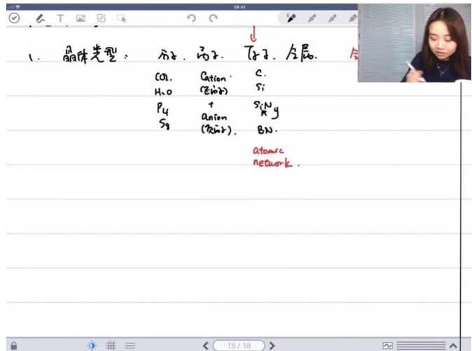

text_image

晶体类型：丙子、丙子、戊子、金属
CO₂、Cation、C.
H₂O（Si原子）
P₄ + SiNᵧ
Sg anion （SiSiR）. BN.
atomsc
network.

晶体组成要素：包含阳离子（如 $Co^{2+}$ ）、阴离子（如 $SiP^{n-}$ ）和中性原子（如BN）三种基本粒子类型

○ 核心概念：重点掌握原子坐标定义、参数体系及相关计算方法，通过实例演示常见考点  
学习目标：通过典型例题训练，掌握坐标计算、参数转换等高频考点题型

● 填隙模型及相关计算 20:19

○ 晶格能的概念 20:21

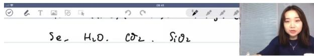

text_image

Se, H₂O, CO₂, SiO₂

Part II. Lattice Energy. 晶格能

18/18

物理意义：衡量离子键强度的热力学参数，对应 $MX(s) \rightarrow M^{n+}(g) + X^{n-}(g)$ 的焓变 $\Delta H_{\text{lattice}}$   
■ 关键区别：与共价键键能不同，晶格能描述的是离子晶体解离为气态离子的过程  
■ 计算特性：必为正值，数值越大表明离子键越强，晶体结构越稳定

○ 配位数与填隙模型 20:43

■ 关联知识：在讲解晶包结构时会同步介绍配位数概念和填隙模型的应用  
■ 教学逻辑：先建立晶格能计算基础，再通过晶包结构分析深化理解

○ 常见晶体类型概述 21:14

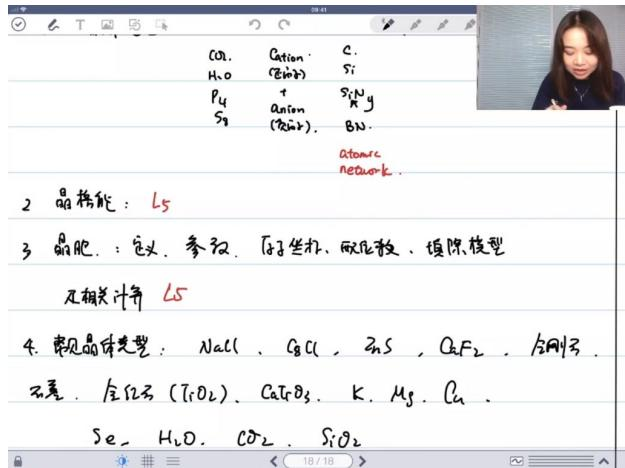

text_image

CO₂. Cation. C.
H₂O (SiO₃) Si
P₄ + SᵢNᵧ
Sg (FeNO₃) BN.
atomic
network.
2 晶格能：L5
3 晶胞：定义、参效、原子坐标、碳化碳、填除模型
见相关计算 L5
4. 需见晶体类型：NaCl, CaCl, ZnS, O₂F₂, 金刚石
石墨，金红石(TiO₂), CaTiO₃, K, Mg, Cu,
Se, H₂O, CO₂, SiO₂

■ 核心类型：重点掌握NaCl型、ZnS型（立方/六方）、 $\mathrm{CaF}_{2}$ 型、金刚石型等基本结构  
■ 特殊案例：金红石（ $\mathrm{TiO}_2$ ）作为典型氧化物晶体代表

\- 晶体类型具体分析 21:23

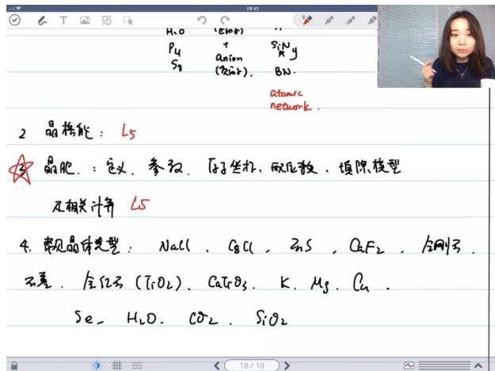

text_image

H₂O (ε⁻) P₄ + Si₂Ng
S₂ anion BN.
(FeBr) Atomic
network
2 晶格能：L5
晶胞：定义、参数、原子坐标、碳化致、填除模型
及相关计算 L5
4. 露见晶体类型：NaCl、CaCl、ZnS、CaF₂、金刚石
不差、金钇石(TiO₂)、CaTiO₃、K、Mg、Cu、
Se、H₂O、CO₂、SiO₂

■ 教学策略：通过典型晶体实例（如NaCl、ZnS等）反复训练填隙模型和配位数计算  
■ 扩展材料： $H_{2}O$ 、 $CO_{2}$ 、 $SiO_{2}$ 等分子晶体因缺乏理想图示需特殊注意

● 晶格能 23:25

例题:晶格能计算 25:46

text_image

M×(s) → M⁺(g) + X⁻(g) >L
↑
La

例1. 根据以下可知,计算 ${kCl}$ 的晶格能

$$
\begin{array}{l l}{\Delta H ^ {a}}&{k J \cdot m o l ^ {- 1}}\\{\mathrm{K} (s) \rightarrow k (g)}&{+ 8 9}\\{K (g) \rightarrow k ^ {+} (g)}&{+ 4 2}\end{array}
$$

解题方法：采用Born-Haber循环，基于状态函数性质建立能量守恒方程

■ 关键数据：

● K升华焓：+89 kJ/mol  
● K电离能：+425 kJ/mol   
- $\mathrm{Cl}_{2}$ 键能: +244 kJ/mol   
● Cl电子亲和能：-355 kJ/mol  
● 生成焓：-438 kJ/mol

计算过程:

$$
8 9 + 4 2 5 + \frac {2 4 4}{2} - 3 5 5 - \Delta H _ {\text { lattice }} = - 4 3 8
$$

■ $\Delta H_{lattice} = 719 \, kJ / mol$   
■ 注意事项：需注意 $Cl_{2}$ 键能数据对应的是2 mol原子，计算时需折半处理

■ 例题:晶格能计算 33:03

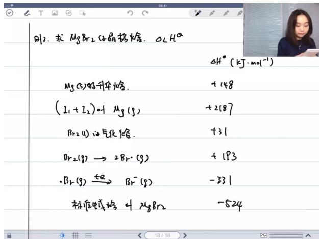

text_image

B12. 求 MgBr2 体弱热焓。O₂Hα
ΔH° (kJ·mol⁻¹)
Mg(C)的升华焓. +148
(I₁+I₂)叫 Mg(g) +2187
Br₂(II)的气化焓. +31
Br₂(g)→ 2Br-(g) +193
·Br₂(g)→ Br-(g) -331
标准电势焓叫 MgBr2 -524

解题要点：二价离子化合物需考虑第二电离能， $\mathrm{Br}_2$ 存在相变过程

■ 关键数据：

● Mg升华焓：+148 kJ/mol  
● Mg总电离能：+2187 kJ/mol   
- Br $_2$ 气化焓: +31 kJ/mol   
- Br $_2$ 键能: +193 kJ/mol   
● Br电子亲和能：-331 kJ/mol（需×2）  
● 生成焓：-524 kJ/mol

计算过程：

$$
1 4 8 + 2 1 8 7 + 3 1 + 1 9 3 - 3 3 1 \times 2 - \Delta H _ {\text { lattice }} = - 5 2 4
$$

■ $\Delta H_{lattice} = 2421 \, kJ / mol$   
■ 易错警示：Br电子亲和能需乘以化学计量数2，液态 $Br_{2}$ 需先气化再解离

2. 晶胞相关 39:25

1）晶胞的定义 40:31

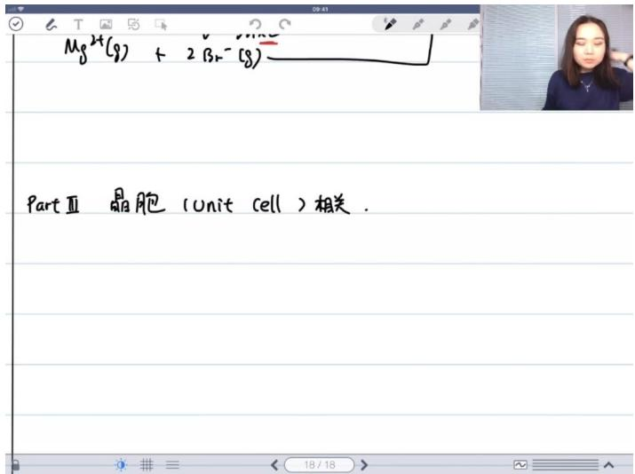

text_image

Mg2+(g) + 2Br-(g)
PartⅢ 晶胞(Unit cell)相关.

- 点阵基础：晶胞建立在晶体晶格(lattice)基础上，将晶格中的原子/离子/分子团看作点形成的阵列  
● 晶胞本质：从三维点阵中划分出的平行六面体，需满足两个核心条件：  
① 必须是该物质化学式的整数倍（如 $CaC_{2}$ 晶胞不能只含1个Ca和1个C）  
- ②通过无限重复堆叠能完整重构晶体结构（具有平移对称性）  
● 结构特征：晶胞需满足"平移排列无空隙"原则，即通过三维平移可填满整个空间  
2）晶胞的参数 42:25

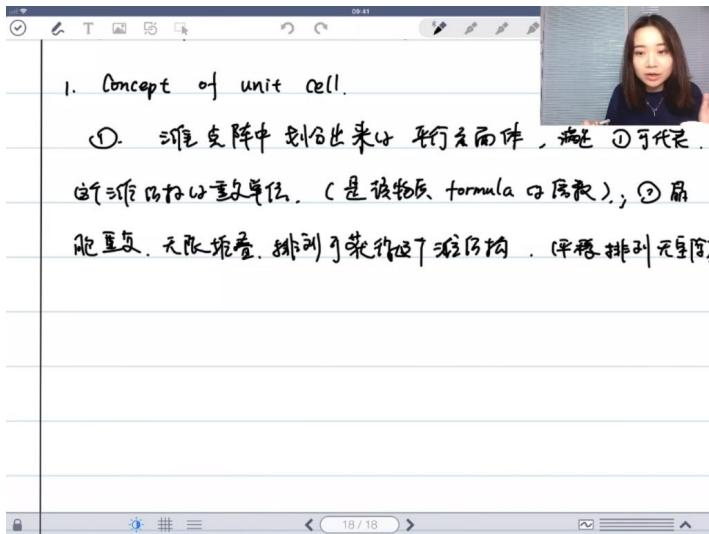

text_image

1. Concept of unit cell.
①. 潍支阵中划分为平行方体, 满足 ①可代表
这个源结构的重单位, (是该物质 formula 的质量);
②. 届胞重复, 无极地叠, 排到可获得这个源结构, (平稳排列无序)

# - 重复单元计算：

○ 顶点原子贡献度: $\frac{1}{8}$ (三维) 或 $\frac{1}{4}$ (二维)  
○ 棱心原子贡献度： $\frac{1}{4}$ （三维）或 $\frac{1}{2}$ （二维）  
○ 面心原子贡献度: $\frac{1}{2}$ (三维)

# - 典型示例：

○ 二维方阵中含5绿球4红球的晶胞，实际计算为：

■ 绿球： $1 + 4 \times \frac{1}{4} = 2$   
■ 红球： $4 \times \frac{1}{2} = 2$

# 3）应用案例 44:39

# 例题:晶胞判断

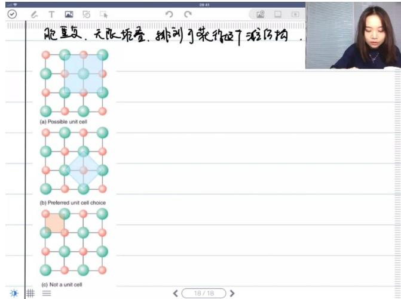

text_image

胞直交，无限拖叠，排列可获得近7游区肉。
(a) Possible unit cell
(b) Preferred unit cell choice
(c) Not a unit cell

# ○ 有效晶胞特征：

(a)(b)均为合法晶胞：可通过平移重构完整晶体  
(c)为无效晶胞：平移后红绿球位置与原始结构矛盾

# ○ 晶胞选择原则：

■ 优先选择对称性高的晶胞（如立方晶系）  
■ 兼顾最小重复单元原则（primitive cell）与实际观察需求

# ○ 特殊说明：

■ 复晶胞（如NaCl晶胞含4Na+4Cl）虽非最小单元，但因对称性高而常用  
■ 六方最密堆积选用平行六面体晶胞时，空隙分析较复杂

# 4）休息 54:28

# - 晶胞的划分与识别

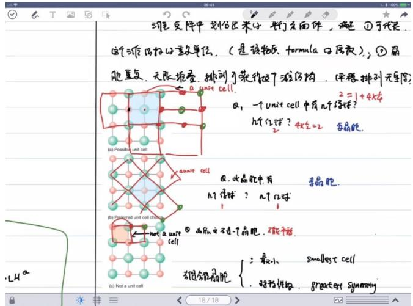

text_image

滩星复体中划分为米子平行无面体，满足①可代入
这个滩星权分量单位。（是该物质、formula 分量表）；②晶
胞重复，无限堆叠，排列可获得这个滩星构。（平移排列无量纲）
a unit cell.
Q₁ 一个unit cell中有几个绿球？
h个红球？4x=2 多晶胞。
b) Paiered unit cell changes
not a unit cell
c) Not a unit cell
Q. 水晶胞中有
h个绿球？n个红球
③ 由hₙ安不成立的细胞，不能平移。
右键分量细胞：
：最小 Smallest cell
. 对称性状. greatest symmetry

# ○ 选择标准：

■ 最小化原则（smallest cell）：包含最少的重复单元  
■ 最大化对称性（greatest symmetry）：优先选择立方等对称性高的晶胞

# ○ 实际应用：

■ 简单立方晶胞易可视化但对称性低   
■ 体心/面心立方晶胞虽原子数多，但对称性高更实用

# ● 晶体结构的分类 56:33

# ○ 晶系特征：

■ 立方晶系对称性最高，最易分析  
■ 六方晶系常采用特殊取向的平行六面体晶胞

# ○ 教学提示:

■ 三维晶胞的延伸想象比二维困难  
■ 复杂晶胞（如六方）的空隙分析需要空间想象力

# 5）晶体结构精细和对称性 01:01:36

# 七种晶体精细

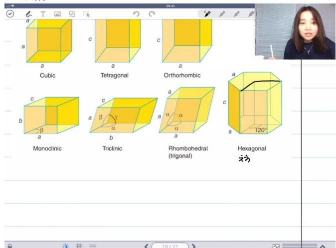

text_image

a
a
c
a
c
a
Cubic
Tetragonal
Orthorhombic
b
c
b
Monoclinic
Triclinic
Rhombohedral
(trigonal)
Hexagonal
120°
a
α
α
α
α
α
α
α
α
α
α
α
α
α
α
α
α
α
α
α
α
α
α
α
α
α
α
α
α
α
α
α
α
α
α
α
α
α
α
α
α
α
α
α
α
α
α
α
α
α
α
19/21

分类：立方(Cubic)、四方(Tetragonal)、正交(Orthorhombic)、单斜(Monoclinic)、三斜(Triclinic)、三方(Rhombohedral)、六方(Hexagonal)

# ○ 考点特点：

■ 国初考点：仅要求识别晶体类型，不要求对称性分析  
■ 出现频率：国初考试中出现1-2次，问题简单

○ 常见应用：元素周期表中常标注元素在自然界中的存在形态和晶体类型

# - 晶胞参数

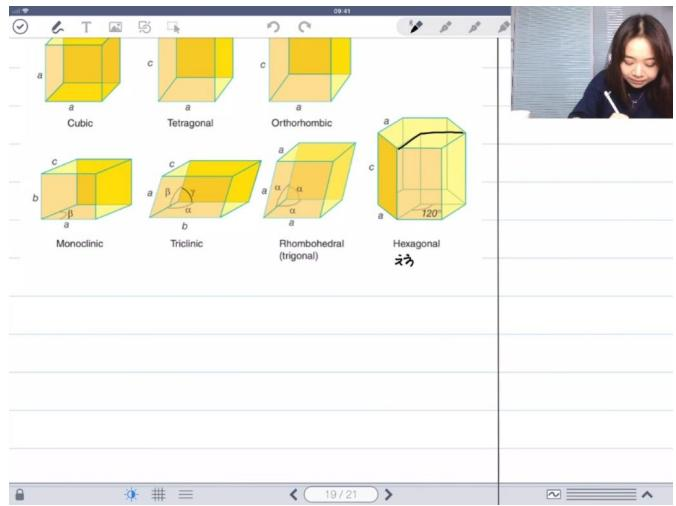

text_image

a
a
Cubic
c
a
c
a
c
Tetragonal
Orthorhombic
b
c
Monoclinic
c
a
b
Triclinic
a
α
α
α
Rhombohedral
(trigonal)
Hexagonal
120°
19 / 21

# O

# ○ 组成要素：

■ 边长参数：a、b、c（晶胞棱长）  
■ 夹角参数： $\alpha$ （b与c夹角）、 $\beta$ （a与c夹角）、 $\gamma$ （a与b夹角）

# ○ 默认规则：

■ 角度默认：不特别说明时，夹角默认为 $90^{\circ}$   
边长简写：  
$\bullet$ 仅写 $a$ 表示 $a = b = c$   
$\bullet$ 写 $a$ 和 $c$ 表示 $a = b \neq c$

# - 晶体精细参数详解

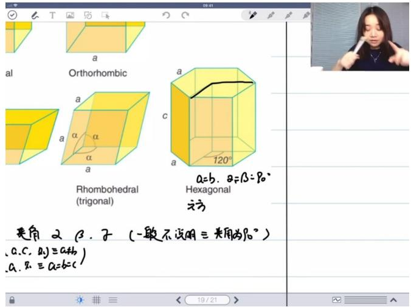

text_image

al
Orthorhombic
Rhombohedral
(trigonal)
Hexagonal
α=b. α=β:β₀°
α=c. β₁(一般不说明三夹角为β₀°)
α₂. β₂=α+b.
α₃. β₃=α=b=c
120°

# O

# ○ 六方晶体：

■ 参数特征： $a = b \neq c,\quad \alpha = \beta = 90^{\circ},\quad \gamma = 120^{\circ}$   
■ 结构特点：底面为 $120^{\circ}$ 平行四边形（两个正三角形组成）

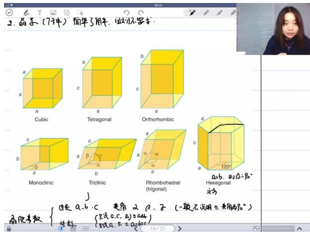

text_image

2. 晶子 (7件) 简单了用作, 试方不要求.
a
a
a
a
a
a
a
a
a
a
a
a
a
a
a
a
a
a
a
a
a
a
a
a
Monoclinic
Triclinic
Rhombohedral
(trigonal)
Hexagonal
立方
a=b, a=β=β°
α
α
α
α
α
α
α
α
α
α
α
α
α
α
α
α
α
α
α
α
α
α
α
α
α
α
α
α
α
α
α
α
α
α
α
α
α
α
α
α
α
α
α
α
α
α
α
α
α
α
a=b, a=β=β°

# ○ 立方晶体：

■ 参数特征： $a = b = c$ ， $\alpha = \beta = \gamma = 90^{\circ}$   
■ 最常见类型：结构最简单

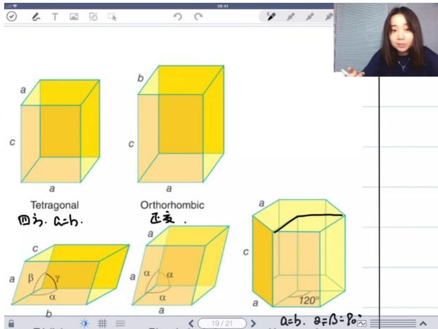

text_image

a
b
c
a
Tetragonal
四边. a=b.
Orthorhombic
正交 .
a
α
β
α
α
α
α
120°
a=b. α=β=90°

# - 四方晶体：

■ 参数特征： $a = b \neq c$ ，所有角度为 $90^{\circ}$

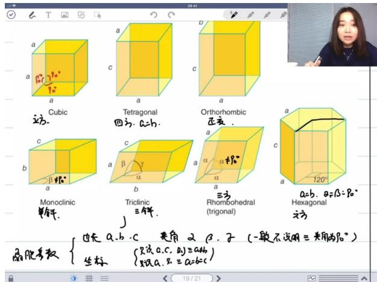

text_image

a
a
a
Cubic
立方.
Tetragonal
四方. a=b.
Orthorhombic
正交.
a
b
c
Monoclinic
单角.
Triclinic
三角.
Rhombohedral
(trigonal)
a=b. α=β=80°
Hexagonal
正交.
边长 a,b,c 角角 α β,子 (一般不说明三角角为80°)
椭圆参数 {边长 a,b,c 角角 α β,子 (一般不说明三角角为80°)}
坐标 {只设 a,c,α}=a+b;
只设 a,α=α=6c}

# ○ 正交晶体：

■ 参数特征： $a \neq b \neq c$ ，所有角度为 $90^{\circ}$

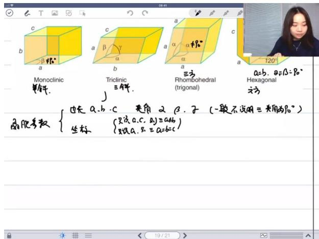

text_image

Monoclinic
平行.
Triclinic
三解.
Rhombohedral
(trigonal)
三角
a=b. θ=β=β₀°
Hexagonal
立方
偏角参数 {填充 a、b、c 角角 α β、子 (一般不说明三角角为β₀°)
坐标 {只设 a、c，a₁=α+b}
只设 a、c，a₂=α+b+c}

# ○ 单斜晶体：

■ 参数特征： $a \neq b \neq c,\quad \beta \neq 90^{\circ}\quad (\alpha = \gamma = 90^{\circ})$

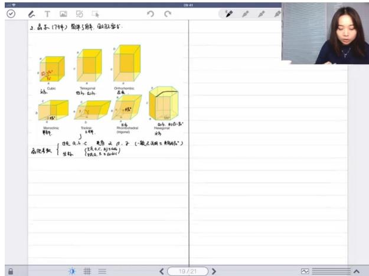

text_image

2.晶条（7件）简单了解体，如无零星。
 cubic
 tetragonal
四角，点心
 orthographic
基准
 Monochina
 Topiak
 Rongohyadral
 (regional)
 高级系数 {过长 a,小 c 是原 i (r,子) （一般不适用 未明确的）}
坐标 {(见点c、b)和b的}
{两点，n为曲面}

# ○ 三斜晶体：

■ 参数特征： $a \neq b \neq c,\quad \alpha \neq \beta \neq \gamma \neq 90^{\circ}$

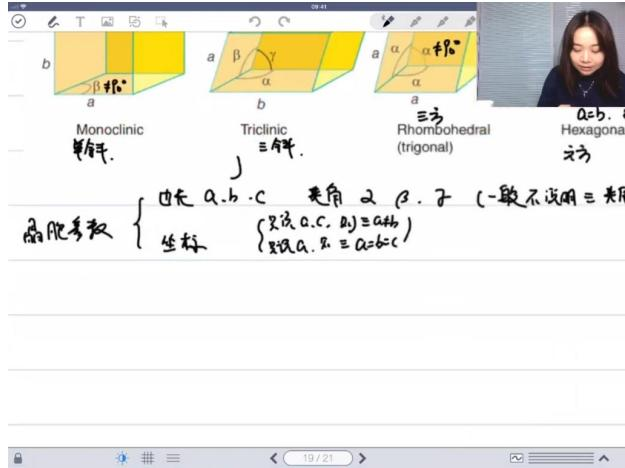

text_image

Monoclinic
椭率.

Triclinic
三等数.

Rhombohedral
(trigonal)

a=b.
Hexagonal

cos(θ)参数 { 也是 a、b、c，是角 α，子 (一般不说明三光度)
坐标 { 只设 a、c，a₁) ≡ a+b₀
    { 只设 a、b，a₂) ≡ a=b=c
}

# ○ 三方晶体：

■ 参数特征： $a = b = c$ ， $\alpha = \beta = \gamma \neq 90^{\circ}$

# - 最密堆积模型

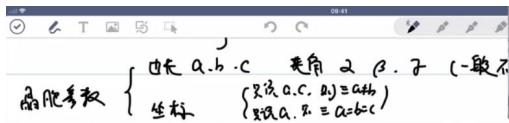

text_image

晶胞参数
{
填充 a、b、c
三角 α β、子 (一般不
坐标
(只设 a、c、D) = a+b
(只设 a、D) = a=b=c
}

3 Closet Packing 最要堆存

(金属晶体)“等价圆球”模型

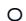

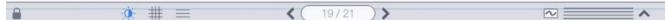

# 基本概念：

■ 等径圆球模型：将金属原子视为半径相同的圆球  
■ 堆积原理：相同大小的球体在空间中的最有效排列方式

\- 二维最密排列：单层球体呈六方密排结构

\- 两种最密堆积方式

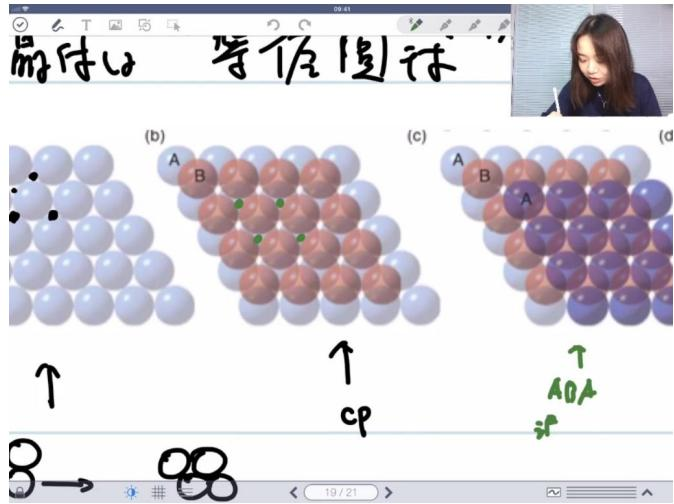

text_image

等位圆球
(b)
(c)
(d)
↑
↑
cp
A
B
A
AOA
8→
19/21

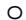

ABAB排列（hcp）：

■ 层序特点：ABA重复排列   
■ 别称：六方最密堆积（Hexagonal Close Packing）  
■ 特征："漏光"模型，层间有光线通道

○ ABC排列（ccp/fcc）：

■ 层序特点：ABC重复排列   
■ 别称：立方最密堆积（Cubic Close Packing）或面心立方（Face-Centered Cubic）  
■ 特征："不漏光"模型，无光线通道

● 体心立方堆积（bcc）

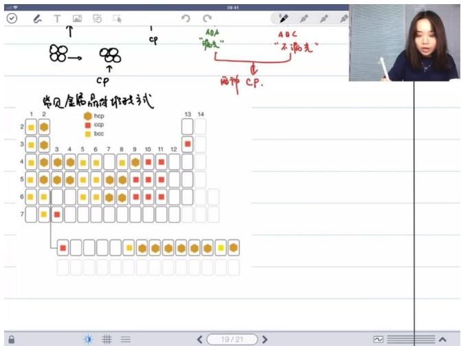

text_image

常见金属晶片堆放方式
1 2
3 4 5 6 7 8 9 10 11 12
13 14
hcp
ccp
bcc
ABA
“消失”
ABC
“不消失”
BCC
CPC.

# ○ 结构特点：

■ 排列方式：ABAB层状排列，但a层排列较松散  
堆积密度：非最密堆积   
■ 晶胞特征：立方体顶点+体心原子

# ○ 金属分布：

■ 采用hcp/ccp：大多数金属  
■ 采用bcc：碱金属等低密度金属

# - 晶胞坐标表示

○ 坐标系建立：右手螺旋确定a、b、c轴方向  
○ 坐标表示法： $(xa,yb,zc)$ 简写为 $(x,y,z)$

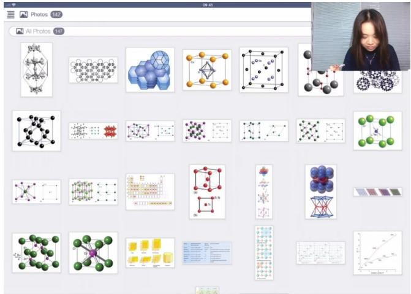

text_image

Photos 8.67
All Photos 142
09:41
10
20
30
40
50
60
70
80
90
100
110
120
130
140
150
160
170
180
190
200
210
220
230
240
250
260
270
280
290
300
310
320
330
340
350
360
370
380
390
400
410
420
430
440
450
460
470
480
490
500
510
520
530
540
550
560
570
580
590
600
610
620
630
640
650
660
670
680
690
700
710
720
730
740
750
760
770
780
790
800
810
820
830
840
850
860
870
880
890
900
910
920
930
940
950
960
970
980
990
1000

# ○ hcp晶胞坐标：

■ 顶点原子： $(0,0,0)$ 、 $(1,0,0)$ 、 $(0,1,0)$ 、 $(1,1,0)$ 等  
■ 内部原子： $\left(\frac{2}{3},\frac{1}{3},\frac{1}{2}\right)$

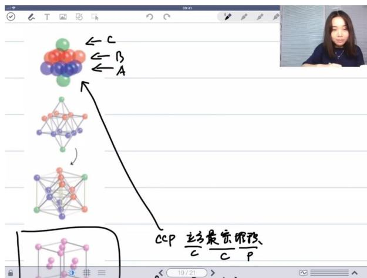

text_image

← C
← B
← A
CCP 立方最密闭修改
C C P
19/21

# ○ fcc晶胞坐标：

■ 顶点原子： $(0,0,0)$   
■ 面心原子： $(0,\frac{1}{2},\frac{1}{2})$ 、 $(\frac{1}{2},0,\frac{1}{2})$ 、 $(\frac{1}{2},\frac{1}{2},0)$

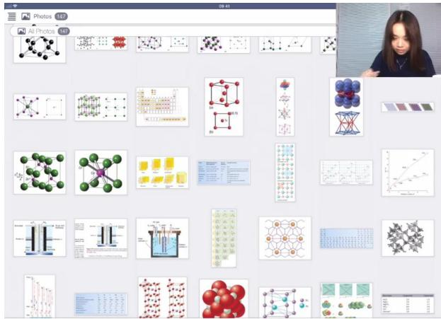

text_image

Screenshot of a photo editing interface displaying molecular diagrams, crystal structures, and data tables with Chinese text labels.

√

# ○ bcc晶胞坐标:

■ 顶点原子：(0,0,0)  
■ 体心原子： $\left(\frac{1}{2},\frac{1}{2},\frac{1}{2}\right)$

# - 晶胞中原子数计算

# ○ 计算方法:

■ 顶点原子：每个贡献1/8  
■ 棱上原子：每个贡献1/4  
■ 面心原子：每个贡献1/2  
■ 体内原子：每个贡献1

# ○ 典型结构：

■ fcc: 8顶点×1/8 + 6面心×1/2 = 4原子  
■ bcc: 8顶点×1/8 + 1体心 = 2原子

# ● 考试重点提示

# ○ 结构题特点：

■ 空间想象力要求不高，但计算要准确  
■ 属于国初考试中的"简单题"模块

# 备考策略：

■ 保证晶体结构题不丢分  
■ 重点掌握：  
- 七种晶体精细识别

- 晶胞参数理解  
- 三种堆积方式特点  
- 原子坐标表示  
- 晶胞原子数计算

# 6）最密堆积 01:09:40

● 例题:金属构造方式判断 01:38:14

○ 判断依据：根据元素周期表位置判断金属的堆积方式，金(Au)位于周期表特定位置，属于面心立方堆积(CCP)

○ 堆积方式对应关系：

■ CCP（立方最密堆积）等价于fcc（面心立方）  
■ 其他常见堆积方式：hcp（六方最密堆积）、bcc（体心立方）

○ 关键元素：金(原子序数79)、银(47)、铜(29)等贵金属通常采用CCP/fcc堆积方式

● 例题:晶体密度计算 01:43:32

○ 计算公式： $\rho=\frac{m}{V}$

○ 参数说明：

■ 金原子质量：196.97 g/mol  
■ 晶格常数: $a = 409 \mathrm{pm} = 4.09 \times 10^{-8} \mathrm{~cm}$   
■ 晶胞体积: $V = a^{3} = (4.09 \times 10^{-8})^{3} \mathrm{~cm}^{3}$   
■ 晶胞原子数：面心立方结构含4个原子

○ 计算过程:

■ 质量计算： $m=\frac{4\times196.97}{6.022\times10^{23}g}$   
■ 密度计算: $\rho = \frac{m}{V} \approx 19.1 \mathrm{~g} / \mathrm{cm}^{3}$

有效数字：结果保留三位有效数字（191）

● 例题:面心立方空间计算 01:45:28

○ 原子半径计算：

■ 面心立方对角线关系： $4r = \sqrt{2}a$   
半径公式： $r=\frac{\sqrt{2}}{4}a=\frac{a}{2\sqrt{2}}$   
■ 计算结果： $r \approx 144.6pm$ （保留三位有效数字）

\- 几何关系：在面心立方结构中，原子沿面对角线方向紧密接触

● 例题:空间利用率计算 01:46:46

○ 计算方法：

■ 晶胞中原子总体积： $4 \times \frac{4}{3} \pi r^{3}$   
■ 晶胞体积: $a^3$   
■ 空间利用率: $\frac{4 \times \frac{4}{3} \pi r^{3}}{a^{3}} \times 100\%$

\- 简化计算：

■ 代入 $r=\frac{\sqrt{2}}{4}a$ 关系

■ 最终结果：约74.05%

\- 物理意义：表示晶胞空间中被原子占据的比例

● 例题:hcp空间利用率计算 01:48:43

○ 结构特点：

■ 每个hcp晶胞含2个原子

堆积方式为ABAB...层状排列

○ 空间利用率:

■ 与fcc相同，均为约74%  
■ 计算复杂，需考虑非直角坐标系

○ 体心立方(bcc)对比：

■ 原子半径关系： $4r = \sqrt{3}a \rightarrow r = \frac{\sqrt{3}}{4}a$   
■ 空间利用率计算： $\frac{2\times\frac{4}{3}\pi(\frac{\sqrt{3}}{4}a)^{3}}{a^{3}}\approx68\%$   
■ 明显低于最密堆积的74%

3. 回顾考点 01:54:10

1）晶体结构基础

● 晶包定义: 晶体中最小的重复单元，能够通过平移操作填满整个空间。  
● 晶包参数: 包括晶轴长度a,b,c和轴间夹角 $\alpha,\beta,\gamma$ ，用于描述晶包几何特征。  
- 原子坐标: 表示原子在晶包中的相对位置，通常用分数坐标表示。

2）常见晶体类型

● 碱金属结构: 均为体心立方(bcc)结构, 空间利用率仅68%, 这是导致碱金属密度较低的主要原因。  
- 镁结构: 具有六方最密堆积(hcp)结构。  
- 铜结构: 同时存在六方最密堆积(hcp)和面心立方(ccp)两种结构。

3）配位数与填隙模型

● 配位数: 一个原子周围最近邻的原子数目，是描述晶体结构的重要参数。  
● 填隙模型: 描述原子在晶体中的堆积方式及空隙分布情况，与晶体性质密切相关。  
● 相关计算: 包括空间利用率计算、配位数确定等，是晶体结构分析的重要内容。

# 三、二元和填隙模型 01:55:44

1. 氯化钠晶体结构

- 基本描述：氯化钠(NaCl)晶体属于AB型离子晶体，其中钠离子 $(\mathrm{Na}^{+})$ 构成面心立方堆积(CCP)，即立方最密堆积。  
- 氯离子位置: 氯离子 $(\mathrm{Cl}^{-})$ 位于钠离子构成的八面体空隙中, 具体位置包括棱心和体心位置。  
● 填隙模型:

从填隙模型角度看，氯离子填充在钠离子构造的八面体空隙中

填充率为100%，即所有八面体空隙均被氯离子占据

\- 晶胞组成:

每个晶胞含有4个钠离子和4个氯离子(z=4)   
○ 符合晶胞必须是化学式整数倍的原则

2. 最密堆积的空隙规律

● 空隙数量关系:

○ 在最密堆积(CCP或HCP)中，若晶胞含有n个堆积原子：

■ 八面体空隙数量 = n  
四面体空隙数量 = 2n

\- 氯化钠案例:

- 钠离子做CCP堆积(n=4)   
○ 应有4个八面体空隙和8个四面体空隙

\- 八面体空隙位置:

○ 1个位于晶胞体心   
- 3个位于棱心位置(共12条棱，每个棱心位置贡献1/4个空隙)

# 3. 四面体空隙位置

# - 分布特点:

- 晶胞被分成8个小立方体  
○ 每个小立方体内有1个完整的四面体空隙   
○ 共8个四面体空隙

# - 组成方式:

○ 每个四面体由4个钠离子构成  
- 氯离子未占据这些四面体空隙

# 4. 晶体结构的可逆性

# - 结构互换:

氯化钠结构可以描述为氯离子做CCP堆积，钠离子填充八面体空隙  
两种描述方式等价，只是参考系不同

# - 位置对应:

○ 互换后:   
■ 体心和棱心位置变为钠离子  
■ 面心和顶点位置变为氯离子

# 5. 碳化铍(Be2C)结构

# - 堆积方式:

○ 碳原子做CCP堆积   
- 铍原子填充所有四面体空隙

# - 化学式推导:

○ 每个晶胞含4个碳原子(CCP堆积)  
- 8个四面体空隙全部被铍原子占据   
○ 化学式为Be₂C

# ● 特殊名称:

- 被称为"反氟化钙"结构  
- 与氟化钙(CaF₂)结构相同但正负离子位置相反

# 6. 氟化钙(CaF $_{2}$ )结构

# - 堆积方式:

- 钙离子做CCP堆积   
- 氟离子填充所有四面体空隙

# - 结构特点:

○ AB₂型晶体结构  
- 证明最密堆积中四面体空隙数量是堆积原子数的2倍

# - 应用价值:

作为典型结构模型用于理解填隙原理  
◦ 验证空隙数量与堆积原子数的比例关系

# 四、离子晶体结构类型02:16:26

# 1. 氯化钠型结构

● 基本特征：属于AB型离子晶体，化学式为1:1，正负离子配位数相等（CN=8）

# - 堆积方式：

- 氯离子（Cl $^{-}$ ）做简单立方堆积  
- 钠离子（ $\mathrm{Na}^{+}$ ）填在氯离子堆积形成的体心位置  
- 整体形成体心立方（bcc）结构

# ● 配位层分析：

- 第一配位层：中心离子周围有8个相反电荷离子  
- 第二配位层：6个同种离子构成八面体（通过立方体面心平移性解释）

# 2. 氟化钙型结构

- 别名：又称萤石结构  
● 配位数特征：

○ 钙离子（Ca $^{2+}$ ）CN=8  
- 氟离子（F⁻）CN=4

● 特殊说明：属于AB2型结构，配位数不相等

# 3. 硫化锌型结构

1）立方硫化锌（闪锌矿）

\- 堆积方式：

- 硫离子（ $S^{2-}$ ）做面心立方堆积（fcc）  
- 锌离子（ $\mathrm{Zn^{2+}}$ ）填 $50\%$ 四面体空隙

\- 距离计算：

○ 最近 $Zn^{2+}-S^{2-}$ 距离= $\frac{\sqrt{3}}{4}a$   
○ 坐标法计算：Zn(1/4,1/4,1/4)与S(0,0,0)距离

2）六方硫化锌（纤锌矿）

\- 堆积方式：

- 硫离子做六方密堆积（hcp）  
- 锌离子填50%四面体空隙

\- 空隙计算：

- 最密堆积中四面体空隙数=2×原子数  
○ 实际占据：金包内2个四面体空隙中占1个

4. 金红石型结构 (TiO $_{2}$ )

● 晶系：四方晶系（ $a=b\neq c$ ，所有角度 $90^{\circ}$ ）  
- 离子分布：

- 钛离子（ $\mathrm{Ti}^{4+}$ ）位于顶角和体心（2个/晶胞）  
○ 氧离子（ $O^{2-}$ ）4个/晶胞

● 配位数：

○ $Ti^{4+}CN=6$ （填在氧八面体空隙）  
○ $O^{2}-CN=3$ （特殊配位方式，不典型填隙）

5. 钙钛矿型结构 (ABX $_{3}$ )

\- 堆积方式：

○ A离子（如 $Ca^{2+}$ ）和X离子（如 $O^{2-}$ ）共同做面心立方堆积  
○ B离子（如 $Ti^{4+}$ ）填在八面体空隙

● 填隙率：

○ X离子构成的八面体空隙中，B离子填50%  
- 其他八面体空隙由4个X和2个A离子构成

● 典型配比：A:B:X=1:1:3（如CaTiO $_{3}$ ）

6. 尖晶石型结构

\- 结构特点：

○ 属于 $AB_{2}X_{4}$ 型复杂结构  
○ 氧离子做立方密堆积   
○ 金属离子填在四面体和八面体空隙

● 记忆要点：需注意正/反尖晶石结构的区别（金属离子分布不同）

# 五、休息 02:34:23

# 六、其他晶体结构示例 02:52:39

1. 立方硫化锌结构

- 结构特点：由4个硫原子做面心立方密堆积(CCP)，4个锌原子填其中一半的四面体空隙，晶胞中共含8个原子  
● 空隙填充：在n个原子组成的密堆积中会产生2n个四面体空隙，此处填充比例为50%  
● 化学式推导：ZnS化学式中原子比为1:1，与空隙填充比例一致

# 2. 过氧化物/超氧化物结构

● 典型示例：包括过氧化钡(BaO2)和超氧化钾(KO2)  
- 结构特征：

- 晶胞中含2个 $M^{2+}$ 正离子  
○ 含2个 $O_{2}^{2-}$ 负离子（实际电荷可能标注有误）  
○ 化学式严格保持1:2的比例关系

● 配位数：正负离子配位数相同，均为6配位（八面体空隙）

# 3. 富勒烯钾化合物

- 堆积方式: $C_{60}$ 分子做立方密堆积(CCP)  
● 空隙填充：

○ n个 $C_{60}$ 产生n个八面体空隙和2n个四面体空隙   
- 钾原子填满所有四面体和八面体空隙

\- 化学式: $K_{3}C_{60}$ (3:1的比例关系)

# 4. 钙硼六化合物

● 结构类比：类似氯化铯(CsCl)结构  
● 特殊填充：

- 顶点和体心位置为钙原子  
○ 每个棱心位置被 $B_{6}$ 原子团取代

\- 化学式: $CaB_{6}$ (1:6的比例关系)

# 5. 钙钛矿结构

\- 原子位置:

○ 钙原子位于体心(1/2,1/2,1/2)  
- 钛原子位于顶点(0,0,0)  
○ 氧原子位于面心(1/2,1/0,0)等位置

● 坐标识别：需熟练掌握分数坐标与晶格位置的对应关系

# 6. 晶格变换问题

● 变换方法：面心立方(FCC)转换为体心四方(BCT)时

○ 新晶胞参数 $c' = c$ （保持不变）  
○ $a'=\frac{\sqrt{2}}{2}a$ （对角线关系）

● 空间想象：需要将原晶胞扩展后重新选取基本单元

# 7. 密堆积空隙数量规律

● 通用规则：

○ 最密堆积中，n个原子产生：

■ 八面体空隙：n个   
四面体空隙：2n个

# - 化学式推导:

○ 填全部八面体空隙→MX（如NaCl）  
○ 填一半四面体空隙→MX（如ZnS）  
○ 填1/4四面体空隙→ $M_{3}X_{2}$   
○ 填全部四面体+八面体空隙→ $M_{3}X$ （如 $K_{3}C_{60}$ ）

# 8. 重要晶体结构总结

\- 七大典型结构：

\- 氯化钠(NaCl)型

- 氯化铯(CsCl)型  
- 硫化锌(ZnS)型  
- 氟化钙(CaF2)型  
◦ 金刚石型  
○ 二氧化钛(TiO2)型  
○ 钙钛矿(CaTiO3)型

# ● 掌握要点：

○ 配位数关系  
○ 空隙填充方式  
○ 化学式推导方法  
○ 分数坐标定位

七、知识小结

<table><tr><td>知识点</td><td>核心内容</td><td>考试重点/易混淆点</td><td>难度系数</td></tr><tr><td>晶格能计算</td><td>波恩-哈伯循环应用,通过状态函数计算离子晶体能量</td><td>氯化钾晶格能计算(719 kJ/mol),注意焓变符号处理</td><td>★★★</td></tr><tr><td>晶包定义</td><td>最小重复单元,需满足平移对称性和化学式整数倍</td><td>二维/三维晶包判断,复晶包与素晶包选择原则</td><td>★★</td></tr><tr><td>最密堆积模型</td><td>hcp (ABAB)与ccp (ABC)两种排列方式,空间利用率74%</td><td>六方vs立方密堆积识别,体心立方(68%)非最密</td><td>★★★★</td></tr><tr><td>填隙模型</td><td>四面体空隙数=2n,八面体空隙数=n</td><td>氯化钠(100%八面体),氟化钙(100%四面体)</td><td>★★★★</td></tr><tr><td>配位数计算</td><td>离子晶体中相反电荷离子的最近邻数量</td><td>金红石(Ti:6,O:3特殊配比),钙钛矿ABO3结构</td><td>★★★</td></tr><tr><td>晶胞参数</td><td>边长(a,b,c)与夹角(α,β,γ)关系,默认值规则</td><td>四方晶系a=b≠c,六方晶系120°夹角</td><td>★★</td></tr><tr><td>密度计算</td><td>使用公式ρ=m/V,注意阿伏伽德罗常数换算</td><td>金晶体计算案例(19.1g/cm3),有效数字处理</td><td>★★★</td></tr><tr><td>坐标确定</td><td>直角坐标系中原子位置表示(分数坐标)</td><td>面心立方(0,1/2,1/2等),六方晶系特殊坐标</td><td>★★★★</td></tr><tr><td>典型晶体结构</td><td>氯化钠型、闪锌矿型、萤石型对比</td><td>反萤石结构(如Be2C),填隙率差异(50% vs 100%)</td><td></td></tr><tr><td>考研题特征</td><td>中强酸判断、空间构型(如高碘酸根正八面体)</td><td>电负性反常(Br&gt;Cl诱导效应),键级计算陷阱</td><td></td></tr></table>