# 一、配位化学01:04:53

# 1. 配位化学一般 01:09:19

# 1）单齿配体 01:10:19

text_image

e - acceptor e - un

# 常见配体

1. 单色两体 monodentated ligand

${X}^{ - },\;{OH}_{2},\;N{H}_{3},\;P{y}_{r}\left( N\right) ,\;P{R}_{3},\;C O$

23/26   
● 定义：仅通过一个配位原子与中心金属离子结合的配体  
● 常见类型:

○ 卤素离子 $(X^{-})$   
○ 水分子 $(H_{2}O$ ，氧原子配位)  
○ 氨分子 $(NH_{3})$   
○ 吡啶（Py，氮原子配位）  
○ 三烷基膦 $(PR_{3})$   
- 一氧化碳（CO，碳原子配位）

● 电子给体特性：所有单齿配体都作为路易斯碱（Lewis base）提供孤对电子

# 2）多齿配体 01:11:23

text_image

X⁻, OH₂, NH₃, Pyr (M), PR

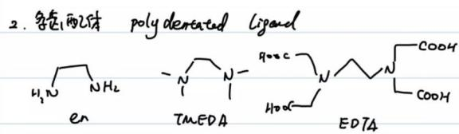

chemical

Chemical structures of polydentate ligand with labeled en, TMEDA, and EDTA polymers

23/26   
● 定义：含有多个配位原子可同时与中心金属结合的配体  
● 典型代表：

○ 乙二胺（en）：双齿配体  
○ 四甲基乙二胺（TMEDA）：双齿配体  
○ 乙二胺四乙酸（EDTA）：四齿或六齿配体

# - EDTA配位特性：

○ 中性形式：氧原子配位（羧酸氧）  
○ 二钠盐形式（EDTA $^{2-}$ ）：四齿配体（仅羧酸氧配位）  
○ 四负离子形式（EDTA $^{4-}$ ）：六齿配体（氮和氧均可配位）

● 冠醚：特殊环状多齿配体，可与金属离子形成主客体配合物

3）两可配体 01:16:24

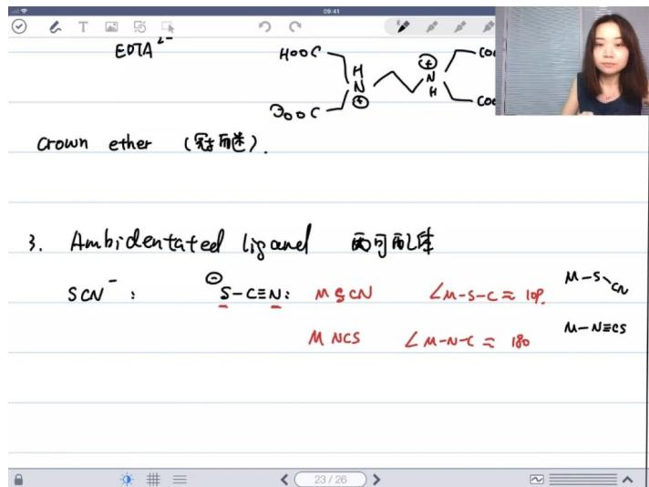

text_image

EDTA
crown ether (冠角迷).
3. Ambidentated liganel 两可配体
SCN⁻ : S-C≡N: M-SCN ∠M-S-C=109.
M NCS ∠M-N-C=180
M-S-CN
M-N≡es

定义：具有多个可能配位原子的配体，可通过不同原子与中心金属结合

\- 典型实例：

\- 硫氰酸根（ $SCN^{-}$ ）：

■ 硫配位（M-SCN）：键角约109°  
■ 氮配位（M-NCS）：键角约180°

○ 氰根 $(CN^{-})$ :

■ 碳配位（M-CN）：常见形式  
■ 氮配位（M-NC）：少见形式

○ 亚硝酸根 $(NO_{2}^{-})$ ：

■ 氮配位（硝基配位）  
■ 氧配位（亚硝酸酯配位）

● 配位方式影响：不同配位方式会导致配合物空间结构和性质显著差异

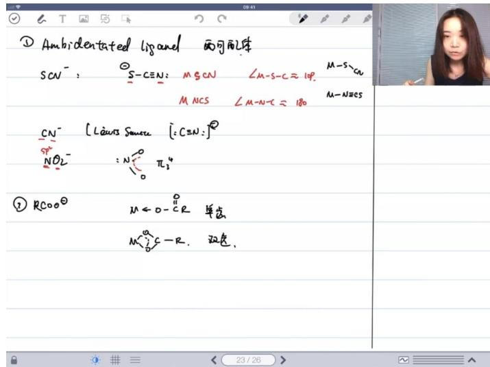

text_image

① Ambidentated ligand 两可配体
SCN⁻ : S-C≡N: M-SCN ∠M-S-C≈10⁹. M-S-C
M NCS ∠M-N-C≈180 M-NHES
CN⁻ [Lewis Smears : C≡N:]²
NO₂⁻ : N⁺π₃⁴
② RCOO⁻ M←O→C-R 单击
M⁺C-R. 双击.

● 特殊配位模式：

○ 单齿配位：通过一个氧原子与金属结合  
- 双齿配位：同时通过两个氧原子与金属结合  
- 桥联配位：在多个金属离子间形成配位桥

2. 晶体场理论 01:23:32

# 1）晶体场理论的模型 01:24:04

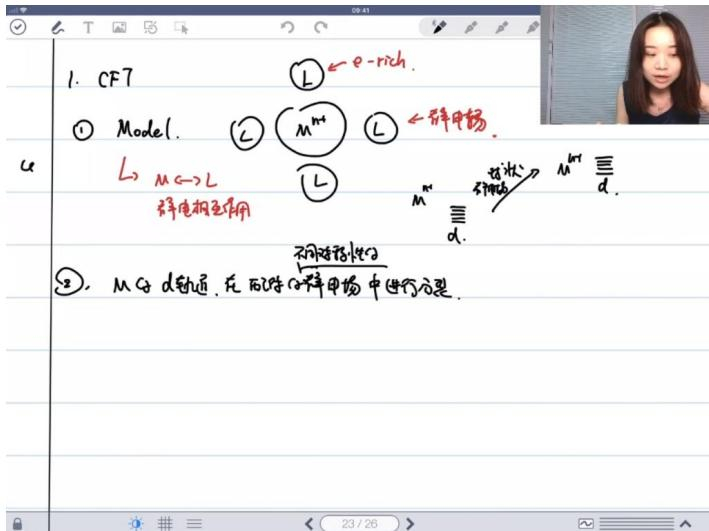

text_image

1. CF7
① Model.
L→ M←→ L
群电相互作用
②，Mg d轨道，在西游d释放甲场中进行分裂。
L ← e-rich.
L ← 辟甲场.
L → Mm
Mm
d.
d.
d.
d.
d.
d.
d.
d.
d.
d.
d.
d.
d.
d.
d.
d.
d.
d.
d.
d.
d.
d.
d.
d.
d.
d.
d.
d.
d.
d.
d.
d.
d.
d.
d.
d.
d.
d.
d.
d.
d.
d.
d.
d.
d.
d.
d.
d.
d.
d.
d.

● 基本模型：中心离子与配体通过静电相互作用构成静电场，配体作为电子给体（路易斯碱）包围中心离子  
- 相互作用本质：配体（无论中性或带负电）与中心金属离子之间是纯粹的静电相互作用，不涉及共价键形成

# 2）中心原子的d轨道 01:25:03

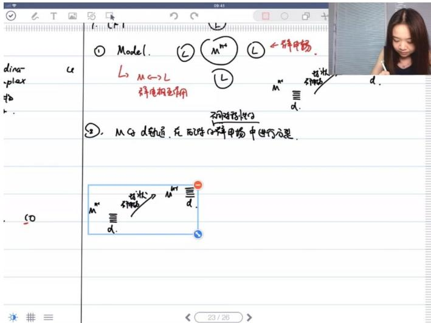

text_image

dina-
plax
物
b.
So
① Model.
L → M ← L
M⁺
←锌电场.
L
锌电极相互作用
M*
d.
不用铅锡引出
②, M → d射通, 在反应中的锌电场中进行方程式.
M⁺
d.
放状: O
M⁺
d.
d.
23/26

初始状态: 五个d轨道在自由离子中能量简并（能量相同）  
● 静电场影响:

均匀场: 在球形对称静电场中, 所有d轨道能量同等升高 (电子云与带负电配体场的排斥)  
○ 非均匀场: 实际配体场非球形对称，导致d轨道发生能级分裂

# 3）d轨道在配体静电场中的分裂 01:27:25

● 八面体场的分裂 01:28:18

text_image

a
L→M←→L
异电相互作用
②. M d轨道，在的阵中进行分裂.
硅塑
θh 引电场
(注入原体.)
异电场
M
d
M
d
d
23/26

○ 对称性: 正八面体场对应Oh点群对称性

○ 分裂方式:

■ t2g轨道: $d_{xy}$ 、 $d_{xz}$ 、 $d_{yz}$ 轨道能量下降（电子云避开配体方向）  
■ eg轨道: $d_{x^{2}-y^{2}}$ 、 $d_{z^{2}}$ 轨道能量上升（电子云指向配体方向）

○ 分裂能( $\Delta o$ ):

■ 定义: 最高（eg）与最低（t2g）轨道能量差  
■ 记忆技巧: 配体位于坐标轴时，轴向轨道（eg）与配体"迎头相撞"导致能量升高（虽科学上不严谨但实用）

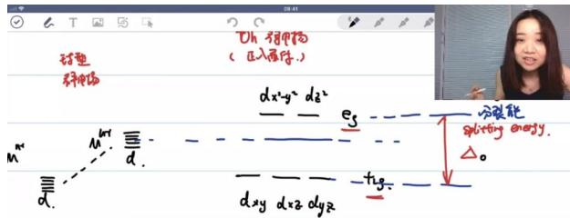

text_image

Uh - 矩甲构
(正入两体.)
球型
神经体
dx²-y² d₂²
e₅
分裂能
splitting energy.
△。
dxy dxz dyz
dxy

○ 能量守恒关系:

■ t2g轨道下降 $\frac{2}{5}\Delta_{o}$   
■ eg轨道上升 $\frac{3}{5}\Delta_{o}$   
■ 保持总能量不变 $(3 \times \frac{2}{5} = 2 \times \frac{3}{5})$

四面体场的分裂 01:33:23

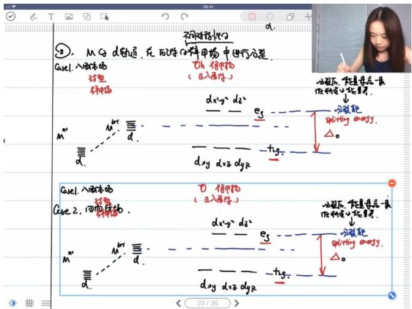

text_image

②. Mg d轨道，在配对称样电场中进行分裂.
Case1. 入面磁场
弹簧
弹簧
M
d
M
d
M
d
M
d
M
d
M
d
M
d
M
d
M
d
M
d
M
d
M
d
M
d
M
d
M
d
M
d
M
d
M
d
M
d
M
d
M
d
M
d
M
d
M
d
M
d
M
D
弹簧
弹簧
弹簧
弹簧
弹簧
弹簧
弹簧
弹簧
弹簧
弹簧
弹簧
弹簧
弹簧
弹簧
弹簧
弹簧
弹簧
弹簧
弹簧
弹簧
弹簧
弹簧
弹簧
弹簧
弹簧
弹簧
弹簧
弹簧
弹簧
弹簧
弹簧
弹簧
弹簧
弹簧
弹簧
弹簧
弹簧
弹簧
弹簧
弹簧
弹簧
弹簧
弹簧
弹簧
弹簧
弹簧
弹簧
弹簧
弹簧
弹簧

○ 对称性: 正四面体场对应Td点群  
○ 分裂特点:

■ 与八面体场"倒置": e轨道 $(d_{z^2}$ 、 $d_{x^2-y^2})$ 能量下降，t2轨道 $(d_{xy}$ 、 $d_{xz}$ 、 $d_{yz})$ 能量上升

分裂能 $\Delta_{t}$ 约为八面体场的 $\frac{4}{9}\Delta_{o}$

○ 能量关系:

■ e轨道下降 $\frac{3}{5}\Delta_{t}$   
■ t2轨道上升 $\frac{2}{5}\Delta_{t}$

● 平面四边形场的分裂 01:34:48

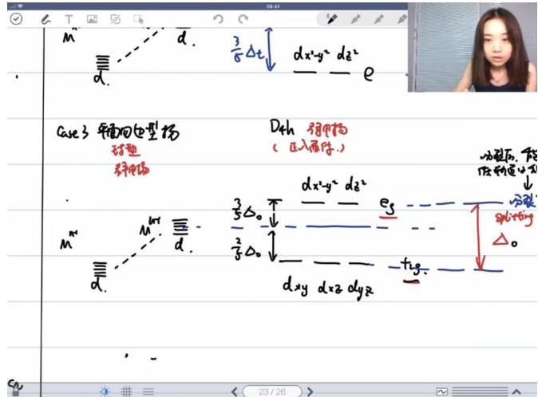

text_image

M
d.
3/6Δt
dx²-y² dξ²
e
Case 3 平面向边型场
硅塑
弱磁场
Dch 弱磁场
(注入原体.)
M
M/m
d/m
3/5Δ0
dxy dy2 dy2
eS
dxy dy2 dy2
Δo
分裂后，能
低阶速度方向
分裂
 splitting
Δo
d2y dy2 dy2
-

○ 形成机制: 八面体场z轴方向配体无限远离（拉长八面体的极限情况）  
○ 分裂特点:

■ 最低能级: $d_{xy}$ （完全避开配体方向）  
■ 次低能级: $d_{z^{2}}$ （部分避开）  
■ 高能级: $d_{xz}$ 、 $d_{yz}$ （平面内相互作用）  
■ 最高能级: $d_{x^{2}-y^{2}}$ （直接指向配体）

\- 分裂能: 在常见场型中最大（但无统一标准下标符号）

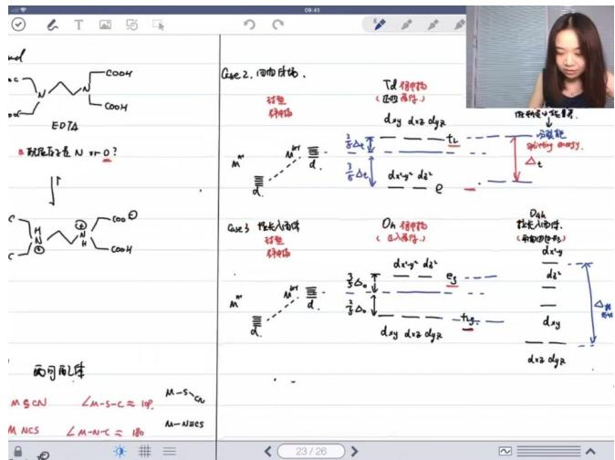

text_image

mol
C-C
COOH
COOH
EDTA
B-FeH原子是N-HrO?
↓
C-H
COO
COOH
面可用气体
MgCN
∠M-S-C≈10°
M-NCS
∠M-N-C≈10°
CuE 2. 四角体法.
MoH
TiD 磁中物
(凹洞条件)
砷化物
dxy d1/2 dxy
△乙酯
m" m" d-
3/2△t
½△t
½△t
dxy" d1/2"
e⁻
CuE 3 磁光入固体
MoH
Oh 磁中物
(已入固体)
砷化物
dxy d1/2 dxy
3/2△t
½△t
½△t
dxy d1/2 dxy
-dxy
d1/2 dxy
△乙酯
M" M" d-
3/2△t
½△t
½△t
dxy d1/2 dxy
-dxy
d1/2 dxy
23/26

# ○ ○ 核心记忆要点:

■ 必须掌握八面体场分裂模式  
四面体场是八面体场的"倒置版"  
■ 平面四边形场可视为拉长八面体的极限情况

应用联系: 分裂能大小直接影响后续讨论的晶体场稳定化能和高低自旋态判断

# 4）分裂能的相对大小 01:43:15

● 分裂能相对大小的规律 01:43:24

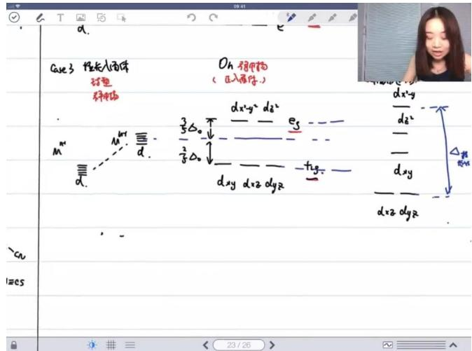

text_image

a.
case 3 长先入固体
弹簧
弹簧
Oh 矩形物
(正入器序.)
dx-y² d₈²
dₓ-y
d₈²
₃Δ₀
₃Δ₀
dᵧ d₂ dᵧ
dᵧ d₂ dᵧ
dy d₂ dᵧ
dy d₂ dᵧ
d₂ dᵧ
d₂ dᵧ
d₂ dᵧ
d₂ dᵧ
d₂ dᵧ
d₂ dᵧ
d₂ dᵧ
d₂ dᵧ
d₂ dᵧ
d₂ dᵧ
d₂ dᵧ
d₂ dᵧ
d₂ dᵧ
d₂ dᵧ
d₂ dᵧ
d₂ dᵧ
d₂ dᵧ
d₂ dᵧ
d₂ dᵧ
d₂ dᵧ
dn x y
dn x y
dn x y
dn x y
dn x y
dn x y
dn x y
dn x y
dn x y
dn x y
dn x y
dn x y
dn x y
dn x y
dn x y
dn x y
dn x y
dn x y
dn x y
dn x y
dn x y
dn x y
dn x y
dn x y
dn x y
dn x_y
dn x_y
dn x_y
dn x_y
dn x_y
dn x_y
dn x_y
dn x_y
dn x_y
dn x_y
dn x_y
dn x_y
dn x_y
dn x_y
dn x_y
dn x_y
dn x_y
dn x_y
dn x_y
dn x_y
dn x_y
dn x_y
dn x_y
dn x_y
dn x_y
dn x_x y
dn x_x y
dn x_x y
dn x_x y
dn x_x y
dn x_x y
dn x_x y
dn x_x y
dn x_x y
dn x_x y
dn x_x y
dn x_x y
dn x_x y
dn x_x y
dn x_x y
dn x_x y
dn x_x y
dn x_x y
dn x_x y
dn x_x y
dn x_xy

○ 规律总结：分裂能△值的大小遵循△四面体＞△八面体＞△平面四边形的规律

影响因素：配体场对称性不同导致d轨道能级分裂程度不同，四面体场分裂能最大，平面四边形最小

● 后过渡周期d轨道分裂能的特点 01:44:22

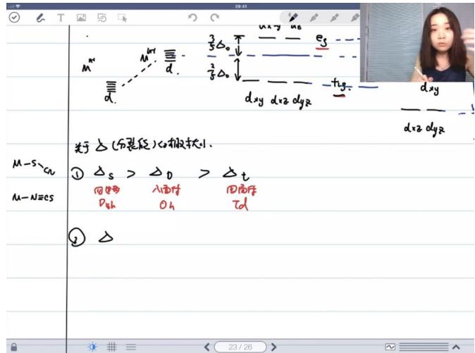

text_image

M-S-CN
M-N≡CS
① △s > △D > △t
四边形 入面F 四面F
Dyh Oh Td
② △
dxy
dxy dgy
关于△(分裂性)的极状小.
23/26

O

○ 轨道位置影响：后过渡周期d轨道离原子核较远，受外界静电场干扰更大  
- 极化效应：原子半径增大导致可极化性增强，更容易受到配体场扰动   
○ 典型表现： $\Delta_{5d} > \Delta_{4d} > \Delta_{3d}$ （第五周期>第四周期>第三周期）

● 中心原子电荷对分裂能的影响 01:45:53

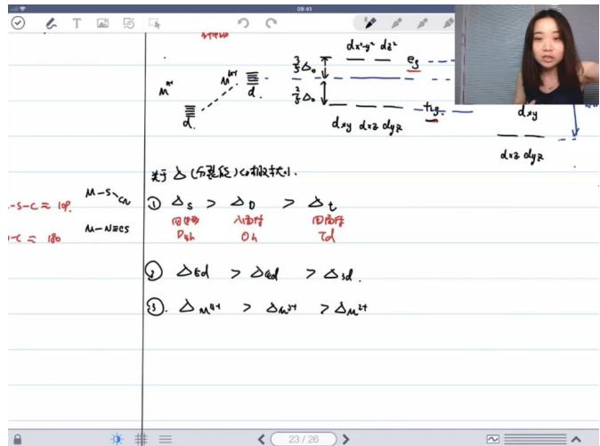

text_image

S-C ≈ 10^4
- C = 180
M-S-Gu
M-N#es
M-N#es
△s > △D > △t
回旋 Λ面转 四面转
Dzh Oh Td
② △Ed > △Ed > △sd.
③. △M#t > △M#t > △M#t
dxy d#z dyr
dy z dyr
dxy dyr
dxy dyr
dxy dyr
dxy dyr
dxy dyr
dxy dyr
dxy dyr
dxy dyr
dxy dyr
dxy dyr
dxy dyr
dxy dyr
dxy dyr
dxy dyr
dxy dyr
dxy dyr
dxy dyr
dxy dyr
dxy dyr
dxy dyr
dXY dY
dXY dY
dXY dY
dXY dY
dXY dY
dXY dY
dXY dY
dXY dY
dXY dY
dXY dY
dXY dY
dXY dY
dXY dY
dXY dY
dXY dY
dXY dY
dXY dY
dXY dY
dXY dY
dXY dY
dXY dQ
dXY dQ
dXY dQ
dXY dQ
dXY dQ
dXY dQ
dXY dQ
dXY dQ
dXY dQ
dXY dQ
dXY dQ
dXY dQ
dXY dQ
dXY dQ
dXY dQ
dXY dQ
dXY dQ
dXY dQ
dXY dQ
dXY dQ
dXY dO
dXY dO
dXY dO
dXY dO
dXY dO
dXY dO
dXY dO
dXY dO
dXY dO
dXY dO
dXY dO
dXY dO

- 电荷效应：中心原子电荷越高，分裂能 $\Delta$ 越大  
- 作用机制：高电荷将配体拉得更近，增强d轨道与配体相互作用  
- 静电模型：在静电相互作用模型中，金属-配体结合越紧密，分裂能越大

5）高自旋与低自旋 01:46:52

● 高自旋与低自旋的定义 01:47:15

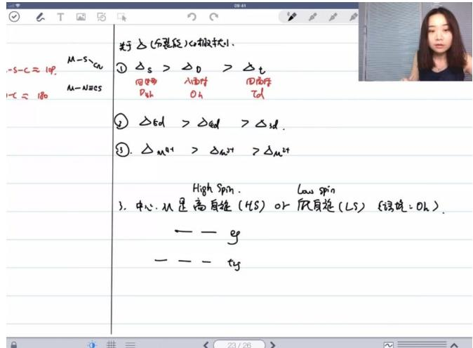

text_image

S-C ≈ 10P.
1-C ≈ 180
M-S-N
M-N/ges
M-S-N
① △S > △D > △t
四分型 A型 D型
Dth Oh Tcd
② △6d > △6d > △sd.
③. △M+1 > △M+1 > △M+1
High Spin. Low spin
3. 中心:从显高自旋(H/S)或尺自旋(L/S) {燃烧:Oh}.
——g
—— ty

○ 术语对照：高自旋(HS, High Spin) vs 低自旋(LS, Low Spin)   
- 适用条件：特指八面体场(d $^{4}$ -d $^{7}$ 构型)中的电子排布情况

● 八面体场中的电子排布 01:47:39

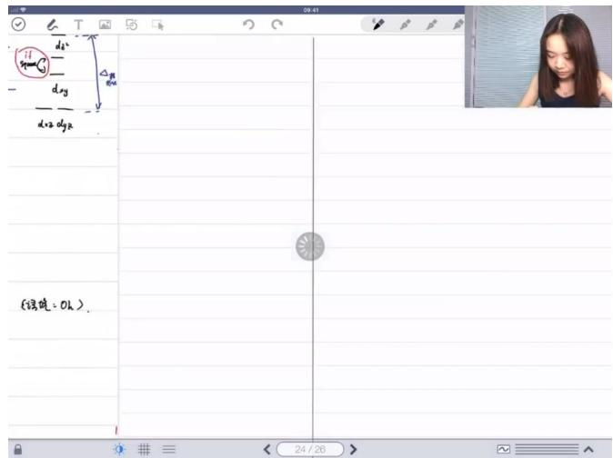

text_image

d²
Space
dy
dy+2 dy+2
(建筑: 0h)
24/26

○ 能级分布：在八面体场中，d轨道分裂为 $e_g(d_{x^2-y^2}, d_{z^2})$ 和 $t_{2g}(d_{xy}, d_{xz}, d_{yz})$ 两组  
填充规则：前3个电子按能量最低原理填充 $t_{2g}$ 轨道

● 高低自旋的决定因素：分裂能与配对能 01:48:34

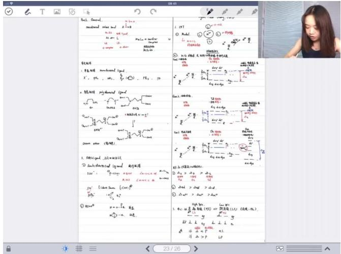

text_image

Bol. General
modular mixed bud 1:0
0.35 add (yod)
N = L
x = 2
x = 4
x = 6
x = 8
x = 10
x = 12
x = 14
x = 16
x = 18
x = 20
x = 22
x = 24
x = 26
x = 28
x = 30
x = 32
x = 34
x = 36
x = 38
x = 40
x = 42
x = 44
x = 46
x = 48
x = 50
x = 52
x = 54
x = 56
x = 58
x = 60
x = 62
x = 64
x = 66
x = 68
x = 70
x = 72
x = 74
x = 76
x = 78
x = 80
x = 82
x = 84
x = 86
x = 88
x = 90
x = 92
x = 94
x = 96
x = 98
x = 100
1. 阻角型式 ligand 纯形结构
100°: Q=100°, Q=100°, Q=100°, Q=100°, Q=100°, Q=100°, Q=100°, Q=100°, Q=100°, Q=100°, Q=100°, Q=100°, Q=100°, Q=100°, Q=100°, Q=-1.0
Q=1.0: λ=1.0, λ=1.0, λ=1.0, λ=1.0, λ=1.0, λ=1.0, λ=1.0, λ=1.0, λ=1.0, λ=1.0, λ=1.0, λ=1.0, λ=1.0, λ=1.0, λ=1.0, λ=1.0, λ=1.0, λ=1.
Q=2.0: λ=2.0, λ=2.0, λ=2.0, λ=2.0, λ=2.0, λ=2.0, λ=2.0, λ=2.0, λ=2.0, λ=2.0, λ=2.0, λ=2.0, λ=2.0, λ=2.0, λ=2.0, λ=2.0, λ=2.0, λ=2.
Q=3.0: λ=3.0, λ=3.0, λ=3.0, λ=3.0, λ=3.0, λ=3.0, λ=3.0, λ=3.0, λ=3.0, λ=3.0, λ=3.0, λ=3.0, λ=3.0, λ=3.0, λ=3.0, λ=3.0, λ=3.
Q=4.0: λ=4.0, λ=4.0, λ=4.0, λ=4.0, λ=4.0, λ=4.0, λ=4.0, λ=4.0, λ=4.0, λ=4.0, λ=4.0, λ=4.0, λ=4.0, λ=4.
Q=5.0: λ=5.0, λ=5.0, λ=5.0, λ=5.0, λ=5.0, λ=5.0, λ=5.0, λ=5.0, λ=5.0, λ=5.0, λ=5.0, λ=5.
Q=6.0: λ=6.0, λ=6.0, λ=6.0, λ=6.0, λ=6.0, λ=6.0, λ=6.0, λ=6.0, λ=6.0, λ=6.0, λ=6.
Q=7.0: λ=7.0, λ=7.0, λ=7.0, λ=7.0, λ=7.0, λ=7.0, λ=7.0, λ=7.0, λ=7.0, λ=7.0, λ=7.
Q=8.0: λ=8.0, λ=8.0, λ=8.0, λ=8.0, λ=8.0, λ=8.0, λ=8.0, λ=8.0, λ=8.0, λ=8.
Q=9.0: λ=9.0, λ=9.0, λ=9.0, λ=9.0, λ=9.0, λ=9.0, λ=9.0, λ=9.0, λ=9.
Q=-1.
Q=-2.
Q=-3.
Q=-4.
Q=-5.
Q=-6.
Q=-7.
Q=-8.
Q=-9.
Q=-12.
Q=-14.
Q=-16.
Q=-18.
Q=-21.
Q=-23.
Q=-25.
Q=-27.
Q=-29.
Q=-31.
Q=-33.
Q=-35.
Q=-37.
Q=-39.
Q=-41.
Q=-43.
Q=-45.
Q=-47.
Q=-49.
Q=-51.
Q=-53.
Q=-55.
Q=-57.
Q=-59.
Q=-61.
Q=-63.
Q=-65.
Q=-67.
Q=-69.
Q=-71.
Q=-73.
Q=-75.
Q=-77.
Q=-79.
Q=-81.
Q=-83.
Q=-85.
Q=-87.
Q=-89.
Q=-91.
Q=-93.
Q=-95.
Q=-97.
Q=-99.
Q=-101.
Q=-103.
Q=-105.
Q=-107.
Q=-11 |
Q=-12
Q=-13
Q=-14
Q=-15
Q=-16
Q=-17
Q=-18
Q=-19
Q=-21
Q=-22
Q=-23
Q=-24
Q=-25
Q=-26
Q=-27
Q=-28
Q=-29
Q=-31
Q=-32
Q=-33
Q=-34
Q=-35
Q=-36
Q=-37
Q=-38
Q=-39
Q=-41
Q=-42
Q=-43
Q=-44
Q=-45
Q=-46
Q=-47
Q=-48
Q=-49
Q=-51
Q=-52
Q=-53
Q=-54
Q=-55
Q=-56
Q=-57
Q=-58
Q=-59
Q=-61
Q=-62
Q=-63
Q=-64
Q=-65
Q=-66
Q=-67
Q=-68
Q=-69
Q=-71
Q=-72
Q=-73
Q=-74
Q=-75
Q=-76
Q=-77
Q=-78
Q=-79
Q=-81
Q=-82
Q=-83
Q=-84
Q=-85
Q=-86
Q=-87
Q=-88
Q=-89
Q=-91
Q=-92
Q=-93
Q=-94
Q=-95
Q=-96
Q=-97
Q=-98
Q=-99
Q=\frac{O}{O}=\frac{O}{O}
\frac{O}{O}=\frac{O}{O}
\frac{O}{O}=\frac{O}{O}
\frac{O}{O}=\frac{O}{O}
\frac{O}{O}=\frac{O}{O}
\frac{O}{O}=\frac{O}{O}
\frac{O}{O}=\frac{O}{O}
\frac{O}{O}=\frac{O}{O}
\frac{\text{原式}}{\text{原式}} \text{原式}

关键比较：

■ $\Delta < P$ （分裂能小于配对能）：选择高自旋排布，电子占据高能级轨道避免配对  
■ $\Delta>P$ （分裂能大于配对能）：选择低自旋排布，电子优先配对占据低能级轨道

○ 排布差异：从第4个电子开始出现排布方式的分歧

\- 第七个电子的高低自旋排布 01:50:22

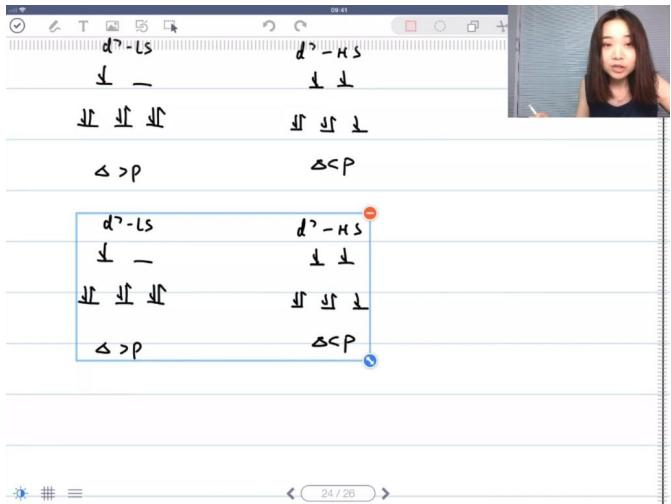

text_image

d² - ls
↓ —
↓ ↓ ↓ ↓
Δ > p
d² - ls
↓ —
↓ ↓ ↓ ↓
Δ > p
d² - HS
↓ ↓
↓ ↓ ↓ ↓
Δ < p
d² - HS
↓ ↓
↓ ↓ ↓ ↓
Δ < p

O

○ 低自旋排布：1-3电子填 $t_{2g}$ ，4-6电子填 $t_{2g}$ ，第7电子填 $e_{g}$   
○ 高自旋排布：1-3电子填 $t_{2g}$ ，4-5电子填 $e_{g}$ ，6-7电子填 $t_{2g}$

● 第八个电子的高低自旋排布无差别 01:51:11

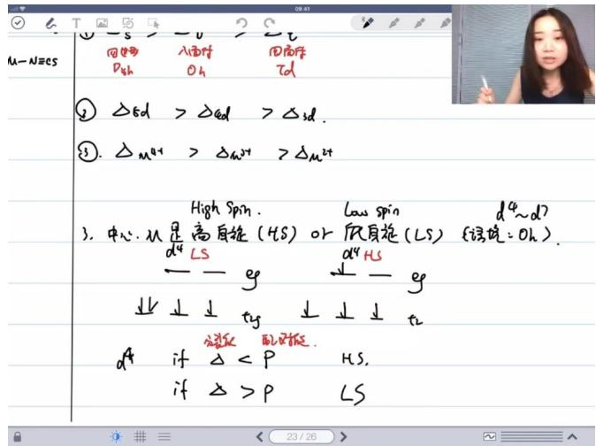

text_image

M-N≡es
① -s > -v > 2 S
同轴
Dzh
入面作
Oh
四面作
Td
② △Ed > △Ed > △sd.
③. △M²⁺ > △M²⁺ > △M²⁺
High Spin. Low Spin d⁴~d?
3. 中心:从显高自旋(HS)or底自旋(LS) {该说:Oh}.
d⁴ LS d⁴ HS
← g ↓ - g
↓ ↓ ↓ tg ↓ ↓ ↓ t₂
dA if △ < P Hs.
if △ > P Ls

最终状态：无论高低自旋， $d^{8}$ 构型最终都是 $t_{2g}^{6}e_{g}^{2}$   
填充路径：虽然填充顺序不同（低自旋先填 $e_{g}$ ，高自旋先填 $t_{2g}$ ），但结果相同

● 高低自旋的语境与适用范围 01:52:20

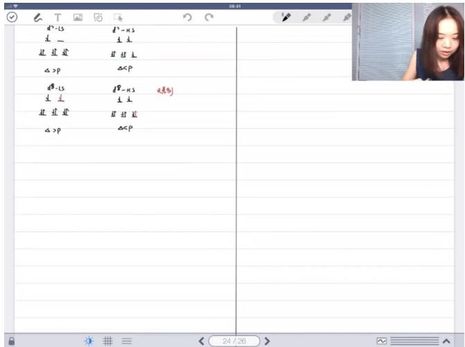

text_image

d* - ls
主 _ 
批 进 边
△ >p
d# - ls
主 _ 
批 进 边
△ >p
d" - HS
主 _ 
批 进 边
△ >p
△ < p
d# - HS
主 _ 
批 进 边
△ < p
d# - HS
主 _ 
批 进 边
△ >p
△ < p
24/26

○ 限定条件：仅适用于八面体场中的 $d^{4}-d^{7}$ 电子构型  
○ 特例说明： $d^{1}-d^{3}$ 和 $d^{8}-d^{10}$ 构型不存在高低自旋区别

6）光谱学序列 01:53:21

text_image

④. 先清学方子 | Spectro chemical Series. 
现场雨生
雨生地场心

污染. 配件. 入丙烯场 in general 对中心丙二分裂的体积

$$
\begin{array}{l}
\text{设} M + L \\
d \triangle.
\end{array}
\]
\[
\begin{array}{l}
i. f \quad \triangle > P \Rightarrow L \text{则矩形的对} \\
if \quad \triangle <  P \Rightarrow L \text{则矩形的对.}
\end{array}
$$

- 定义: 光谱学序列(Spectrochemical Series)是描述配体场强弱的理论序列，通过测量大量配合物的吸收光谱和发射光谱数据建立。  
- 理论基础: 当配体(L)在中心金属离子(M)周围形成配体场时, 会导致M的d轨道分裂, 分裂能 $\Delta$ 与配对能P的比较决定配体场强弱:

○ $\Delta > P$ : 强场配体  
○ $\Delta < P$ : 弱场配体

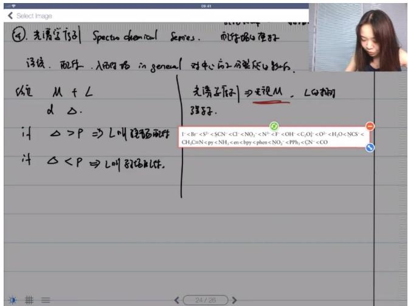

text_image

Select Image
④. 光谱学方向 Spectro chemical Serres. 而物体的壁好
浮线. 配压. 入面的场 in general 对中心向上分裂的心数比
缩 M + L
d △.
if △ > P ⇒ L则释放两件
if △ < P ⇒ L则释放两件.
先谱子[原] ⇒ 现星M，L时用
强子.
I⁻ < Br⁻ < S²⁻ < SCN⁻ < Cl⁻ < NO₂⁻ < N⁺ < F⁻ < OH⁻ < C₂O₃²⁻ < O³⁻ < H₂O < NCS⁻ <
CH₃C₆N < py < NH₄⁻ < en < bpy < phen < NO₂⁻ < PPh₃⁻ < CN⁻²⁻ < CO

# 典型序列：

- $I^{-} < Br^{-} < SCN^{-} < Cl^{-} < NO_{3}^{-} < F^{-} < OH^{-} < C_{2}O_{4}^{2-} < H_{2}O < NCS^{-} < CH_{3}CN < py < NH_{3} < en < bpy < phen < NO_{2}^{-} < PPh_{3} < CN^{-} < CO$   
- 记忆规则：

- 弱场配体：卤素离子 $(I^{-},Br^{-},Cl^{-})$ 是经典弱场配体  
- 中间场配体: $H_{2} O$ 和 $N H_{3}$ 属于中间场, 可强可弱  
○ 强场配体：具有π\*反键轨道或空d轨道的配体(如CO、CN^-、phen等)

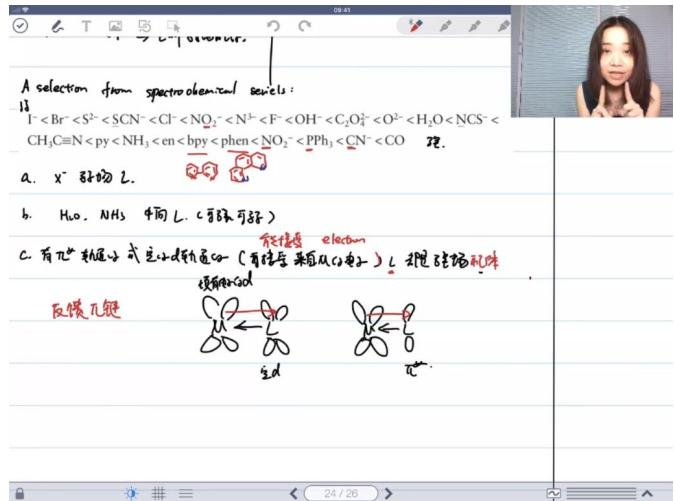

text_image

A selection from spectrochemical sewels:
I⁻ < Br⁻ < S²⁻ < SCN⁻ < Cl⁻ < NO₂⁻ < N³⁻ < F⁻ < OH⁻ < C₂O₄²⁻ < O²⁻ < H₂O < NCS⁻ <
CH₃C≡N < py < NH₃ < en < bpy < phen < NO₂⁻ < PPh₃ < CN⁻ < CO  现
a. x⁻ 弦畅 L.
b. H₂O, NH₃ 中向 L. (有碳可好)
c. 有π⁻轨道生成式定性d轨道(有结合来自从n分子) L 挑望硅场现象
反馈π键
→ ← →
生d
π⁻

\- 反馈π键：

○ 形成条件：配体具有 $\pi^{*}$ 反键轨道或空d轨道，可以接受来自中心金属d轨道的电子  
- 特点：肩并肩轨道重叠形成，增强金属-配体键强度  
○ 典型配体：CO、CN^-、NO\_2^- (N配位时)、膦配体等  
○ 电子效应：低价金属(如Ni(0)、Co(0))更易形成反馈π键

● 影响因素：

○ 配体接受电子能力越强，场强越大  
- 多齿配体通常产生较强场效应  
○ 配位原子性质(如PPh\_3中的P原子)影响场强

3. 配位化合物稳定性 02:05:48

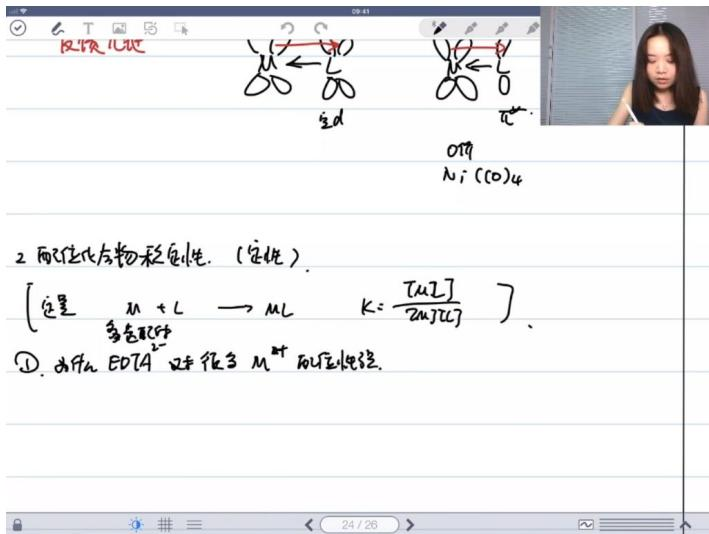

text_image

反馈儿址
2 配位化合物稳定性. (定性)
[定量 m + L → ML k = [mL/2] / 2mL/2]
① 为什么 EDTA 又中很多 M 的位性验证.

● 定量判断标准：用配位常数 $k=\frac{[ML]}{[M][L]}$ 衡量，k值越大配合物越稳定  
● 定性分析要点：主要从熵效应、反馈键形成、软硬酸碱理论三方面分析

# 1）EDTA稳定性 02:06:51

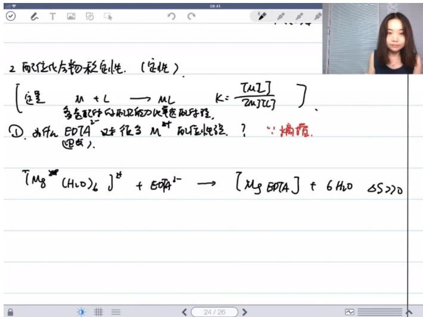

text_image

2 配位化合物稳定性. (定性)
[定量 m + L → mL k = [mL/2mL)]。
① 为什么 EOT4 反中很多 M 的位化验? 
(Mg(OH)₆) J# + EtOH# → [Mg EOT4] + 6H₂O ΔS >0

● 多齿配体优势：EDTA作为四齿配体（例： $[Mg(H_{2}O)_{6}]^{2+} + EDTA^{2-} \rightarrow [MgEDTA] + 6H_{2}O$ ）比单齿配体强

\- 熵增效应：反应释放6个水分子使 $\Delta S$ 显著增大（关键记忆点："熵增"是核心原因）

● 应用实例：冠醚配合（如12-crown-4与 $Li^{+}$ 结合）同样遵循此原理

# 2）形成反馈键 02:10:03

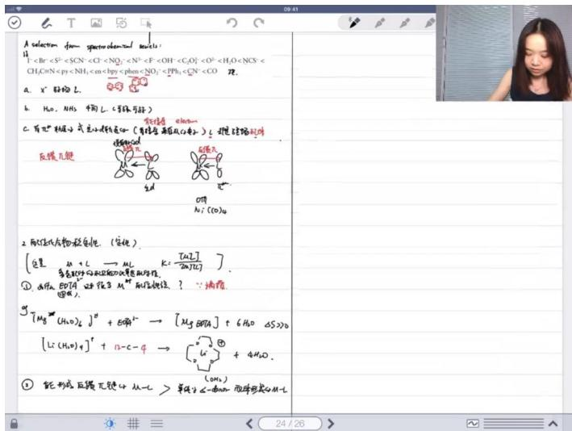

text_image

A selector from sperm cell wall:
1. <Br-<S2-<SCN-<Cl-<NO2-<N2-<F-<OH-<C2O3-<O2-<H2O<NCN-<CH3CO-N<pyNH4-cn-bpyp<phen(NO3)-<PPbH4-CN> <CO>
a. x' 阻缩 L.
b. H2O, NH3 作用 L.(单体可取)
C. 节皮性酮和二氢基小颗粒变(单体含苯酚酞酞酞酞)
反膜无键
[图示]
[图示]
[图示]
h: (0)4
② 阿定代入物质的性质（变化）
[这是 m + C → mL Kc [mL] / (mL)]。
① 气泡中的反应条件的性质：
② 消费：
g [Mg+(H2O)4]# + E##→ [Mg@M] + 6H2O @SO2O
[Li-(H2O)4]# + H-C-F → [u]# + 4H2O.
③ 能形成后膜无键的从L > 单体子←单体→双单体或从H-
24/26

● 键型比较：能形成反馈π键的配体（如CO、CN $^{-}$ ）>单纯σ给体（H $_{2}$ O、NH $_{3}$ ）  
● 本质原因：反馈键包含σ键+π键双重作用（记忆口诀："双键强于单键")  
● 配体强度序列： $H_{2}O<NH_{3}<en<bpy<phen<CO$ （需记忆典型排序）

# 3）SHAB理论 02:11:07

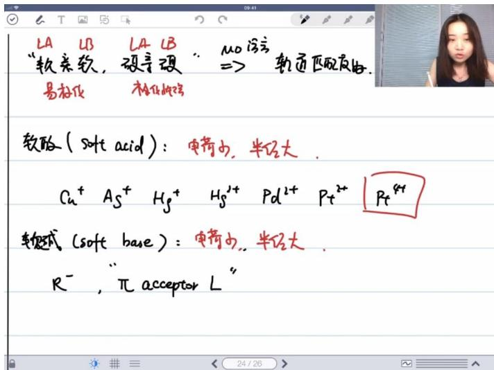

text_image

LA LB
“软柔软，硬坚硬” → “MO浮亏”
易老化
轻化难溶
软酸（soft acid）：电荷小，半径大。
Cu+ As+ Hg+ Hg2+ Pd2+ Pt2+ Pt4+
软酸式（soft base）：电荷小，半径大。
R-，“π acceptor L”

基本规则："软亲软，硬亲硬"（关键记忆口诀）  
● 软酸特征：电荷少、半径大（典型例子： $Cu^{+}$ 、 $Ag^{+}$ 、 $Pt^{2+}$ 、 $Hg^{2+}$ ）  
● 软碱特征：  
○ 配位化学特例： $H^{-}$ 视为软碱（与有机化学不同）  
○ 常见类型：含π电子配体（CO、烯烃）、大半径阴离子（I⁻、PPh₃）  
● 硬酸特征：电荷多、半径小（典型例子： $Al^{3+}$ 、 $Mg^{2+}$ 、高氧化态金属）  
● 硬碱特征：电负性大的给体原子 $(H_{2}O$ 、 $NH_{3}$ 、 $F^{-}$ 等）

# 4）软硬酸碱轨道匹配反应 02:12:16

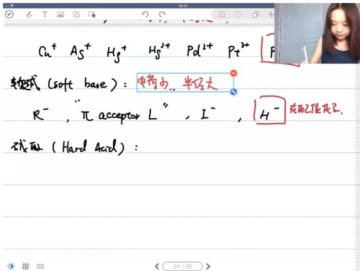

text_image

Cu²⁺ As²⁺ Hg²⁺ Hg²⁺ Pd²⁺ Pt²⁺
轴变式 (soft base): 电荷由, 半位大
R⁻, “π acceptor L”, I⁻, H⁻ 在配伍代号.
成酸 (Hard Acid):

● 本质原理：软-软相互作用源于轨道匹配度好（MO理论解释）

\- 极化性差异:

- 软酸碱：可极化性强   
- 硬酸碱：可极化性弱

● 特例说明：后过渡金属（第六周期）即使带4+电荷仍属软酸（如 $Pt^{4+}$ ）

4. 休息 02:18:51

5. VSEPR理论与配位化学的关系 02:22:27

1）VSEPR理论的基本概念

● 适用范围：主要应用于主族元素，特别是能形成多个键的无机主族元素  
● 核心理论：基于价层电子对互斥理论，即孤对电子和成键电子对之间的排斥力是决定分子构型的决定性因素  
● 限制条件：在第六周期某些元素中适用性降低，过渡金属元素基本不适用

2）VSEPR与过渡金属配合物的区别

● 电子拥挤度差异：

○ 主族元素：电子拥挤程度高，价层电子排斥效应显著  
- 过渡金属：外层空间较大（4-6周期），电子拥挤程度相对较低

● 轨道特性差异：

○ 主族元素：使用sp杂化轨道成键  
- 过渡金属：涉及d轨道参与成键，轨道能量差和取向影响更显著

\- 孤对电子位置：

○ 主族元素：价层孤对电子参与排斥  
- 过渡金属：孤对电子位于内层 $d$ 轨道，排斥效应不明显

3）理论失效的根本原因

● 轨道重叠方式：过渡金属中轨道重叠方式与主族元素不同  
● 影响因素转变：

○ 主族：电子对排斥力主导构型  
- 过渡金属：轨道能量差和取向的影响超过电子排斥力

\- 成键电子特性：过渡金属中用于成键的电子对排斥效应仍然存在，但内层孤对电子的排斥基本可以忽略

4）重要结论

● 理论边界：VSEPR理论在过渡金属配合物中"不太好用"，不能简单套用  
● 现象解释：过渡金属配合物中观察到的构型往往与VSEPR预测不符   
● 替代理论：需要采用配位场理论等更适合过渡金属的理论体系来解释

6. 配合物的构成方式 02:25:57

1）四到六配位 02:26:46

● 常见配位数：过渡金属常见配位数为4-6配位，其中2配位（直线型）较为少见

四面体构型：

○ 实例： $Ni(CO)_{4}$ 实验测得属于 $T_{d}$ 点群，为正四面体构型  
○ 成键理论：Ni为 $d^{10}$ 电子构型（ $3d^{10}$ ），采用 $sp^{3}$ 杂化空轨道接受4个CO的孤对电子  
○ 电子排布：在配体场作用下，外层电子先被"压入"内层轨道

\- 平面四边形构型：

○ 实例： $[Ni(CN)_{4}]^{2-}$ 测得 $D_{4h}$ 点群  
○ 电子构型： $Ni^{2+}$ 为 $d^{8}$ ，CN-为强场配体  
○ 杂化方式：采用 $dsp^{2}$ 杂化 $(d_{x^{2}-y^{2}}+s+p_{x}+p_{y})$   
- 与VSEPR差异：不能用价层电子对互斥理论解释平面构型

\- 异构现象：

○ 四面体 $MA_{2}B_{2}$ 型只有1种异构体  
- 平面四边形 $MA_{2}B_{2}$ 型有顺反2种异构体  
○ 实例： $Be(CH_{3})(C_{2}H_{5})Cl_{2}$ 因 $sp^{3}$ 杂化产生手性异构体

2）五配位 02:29:42

● 典型实例： $[Ni(CN)_{5}]^{3-}$ 同时存在三角双锥和四方锥两种构型  
● 动态转化：两种构型能垒较低可相互转化，但转化速率实验可测

\- 杂化方式：

○ $dsp^{3}$ 杂化（内轨型）：使用3d+4s+4p轨道  
- $sp^{3}d$ 杂化（外轨型）：使用4s+4p+4d轨道  
- 两者均可形成三角双锥/四方锥构型

\- 重要区别：

○ 不存在 $sp^{2}d$ 杂化（能量不合理）  
○ $d^{8}$ 电子构型在高自旋时为 $sp^{3}d$ ，低自旋时为 $dsp^{3}$

八面体场：

○ 轨道分裂： $t_{2g}$ （3个轨道能量低）和 $e_{g}$ （2个轨道能量高）  
○ 杂化方式: $sp^{3}d^{2}$ (外轨) 或 $d^{2}sp^{3}$ (内轨)  
- 稳定性：八面体构型对称性最好，最为稳定

7. 应用案例 02:44:30

1）五配位示例 02:46:45

● 考试要求：若题目要求写出五配位结构且无额外提示，必须同时写出三角双锥和四方锥两种构型

● 常见考点：

○ 题目通常会通过点群信息提示具体构型（如 $D_{3h}$ 点群对应三角双锥， $C_{4v}$ 点群对应四方锥）  
- 特殊配体结构可能限定构型（如卟啉环体系只能形成四方锥）

● 能量差异：两种构型能量接近，无提示时需都写   
● 特例规则：VSEPR理论中若无提示默认写三角双锥，但配合物中四方锥更常见

2）内外界变化构成电离异构 02:51:18

\- 界定标准：

- 内界：与中心原子形成配位键的配体（路易斯碱）  
外界：仅用于平衡电荷的离子

\- 异构现象：分子式相同但内外界分配不同即构成电离异构

\- 立体异构：以 $[MA_{2}B_{4}]$ 为例：

○ 顺式（cis）：两个A配体相邻（90°夹角）  
- 反式（trans）：两个A配体相对（180°夹角）

3）配位异构示例 02:54:42

● 典型体系： $[Co(NH_{3})_{6}][Cr(CN)_{6}]$ 与 $[Cr(NH_{3})_{6}][Co(CN)_{6}]$

● 电子构型分析：

○ $Co^{3+}(d^{6})$ ：强场 $d^{2}sp^{3}$ 或弱场 $sp^{3}d^{2}$ 杂化  
○ $Cr^{3+}(d^{3})$ ：固定为 $d^{2}sp^{3}$ 杂化

\- 重要提醒：

○ 实际不存在 $d^{4}sp$ 等非常规杂化，需用标准杂化方式解释  
- 杂化理论属于"事后解释"，应以实测结构为准

\- 铜配合物特例：

○ $Cu^{2+}$ ( $d^{9}$ ) 平面四边形构型应解释为拉长的 $sp^{3}d^{2}$ 八面体  
- 传统 $dsp^{2}$ 杂化解释存在理论缺陷

4）18电子规则

● 本质：经验规则 ( $ns^{2}np^{6}nd^{10}$ 电子构型)  
● 适用条件：

○ 金属簇合物（如羰基化合物）  
○ 强π受体配体体系

● 局限性：

○ 后过渡金属常见16电子构型  
- 空间位阻大的配体可能导致电子数偏离

\- 应用原则:

◦ 仅用于题干明确提示的情况  
- 不可用于预测未知结构

5）磁性测定

- 公式： $\mu = \sqrt{n(n + 2)}$ （ $n =$ 未成对电子数）  
- 应用示例：

○ 八面体场 $d^{6}$ 构型:

■ 高自旋 $(n=4)$ : $\mu=\sqrt{24}$   
■ 低自旋 $(n = 0)$ ： $\mu = 0$

● 测试意义：区分高低自旋态的重要实验手段

8. 十八电子规则 03:01:35

1）例题:钴的电子数计算 03:05:07

● 18电子规则计算原理

○ 计算方法：中心金属原子价电子数 + 配体提供电子数 = 18  
○ 实例分析：以 $Ni(CO)_{4}$ 为例，镍是第10族元素（ $d^{8}$ ），每个CO提供2个电子，计算式为 $10 + 2 \times 4 = 18$   
○ 常见配体贡献：CO、烯烃等中性配体通常提供2个电子，卤素离子提供1个电子例题解析

●

○ 题目解析

解题步骤:

● 确定中心金属价电子数（钴为第9族， $d^{7}$ ）  
● 计算配体贡献电子数（CO每个2电子）  
● 验证是否满足 $18e^{-}$ 规则

■ 易错点：注意过渡金属的d电子构型  
■ 答案： $7 + 2 \times 5 = 17e^{-}$ （需形成金属键补足）

2）例题:判断配合物构型 03:05:51

\- 对称性判断要点

○ 关键对称元素：区分 $D_{4d}$ 和 $D_{4h}$ 的核心在于是否存在水平镜面 $(\sigma_{h})$

# ○ 构型特征：

■ $D_{4h}$ ：具有 $C_{4}$ 主轴+垂直镜面，对称性更高  
■ $D_{4d}$ ：只有 $C_{4}$ 轴无水平镜面，对称性较低

○ 空间构型： $D_{4d}$ 通常呈现交错构型（如环戊二烯金属配合物）

例题解析

# ○ 题目解析

■ 解题关键：通过给定对称元素排除错误选项  
■ 典型错误：混淆 $D_{4d}$ 与 $D_{4h}$ 的对称操作  
■ 答案：选择无 $\sigma_{h}$ 的 $D_{4d}$ 构型（选项B）

# 3）例题:判断配合物键数和构型 03:11:40

# ● 金属-金属键形成规则

电子短缺补偿：当中心金属电子数不足18时，常通过形成M-M键补足

■ 实例： $Mn_{2}(CO)_{1}$ 0中每个 $Mn(d^{7})$ 需要1个电子，故形成单键

◦ 实验验证：通过键长测定推断键级，结合对称性要求  
- 桥连配体影响：CO既可作为端基也可桥连，影响电子计数

例题解析

# ○ 题目解析

■ 已知条件： $Fe_{2}(CO)_{9}$ 满足18e规则， $D_{3h}$ 对称性  
■ 分析过程:

- 每个Fe( $d^{8}$ )需10个电子  
- 桥连CO每个贡献1e，端基CO贡献2e   
- 必须形成Fe-Fe单键满足电子数

■ 答案：3个桥连CO，6个端基CO

# 4）例题:计算电子数 03:16:29

# ● 非18电子规则体系

# ○ 常见例外情况：

■ 中心原子太小（如Ti、V早期过渡金属）  
■ 配体位阻大（如 $Cp^{*}$ 配体）  
■ 后过渡金属（如Cu、Au）

# ○ 典型实例：

■ $Ti(Cp)(C_{2}H_{4})$ : $Ti(d^{2})+Cp(6e)+C_{2}H_{4}(2e)=16e$   
■ CuCl(CO): 单体形式14e, 实际多聚形成16e结构

例题解析

# ○ 题目解析

解题要点:

● 区分不同氧化态 ( $Pt^{2+}$ 为 $d^{8}$ )  
● 考虑配体性质（Cl^-提供1e，CO提供2e）  
- 注意聚合状态影响

■ 答案： $[PtCl_{4}]^{2-}$ 为16e体系 $(8+4\times2=16)$

# 二、知识小结

<table><tr><td>知识点</td><td>核心内容</td><td>考试重点/易混淆点</td><td>难度系数</td></tr><tr><td>晶体结构分类</td><td>原子晶体、金属晶体、分子晶体、离子晶体的划分方式及特点</td><td>国内主流划分与国际划分差异,网状原子晶体的特殊分类</td><td></td></tr><tr><td>晶胞参数计算</td><td>通过密度、相对分子质量等数据计算晶胞边长a</td><td>单位换算(厘米→皮米),有效数字处理,BCC结构中半径与边长的关系 $(4r=\sqrt{3}a)$ </td><td></td></tr><tr><td>配位化学基础</td><td>配位键形成原理(路易斯酸碱理论),单齿/多齿配体区分</td><td>EDTA配位原子选择(中性时氧配位,负离子时氮氧均可配位),两可配体 $(SCN^{-}/CN^{-}/NO_{2}^{-})$ </td><td></td></tr><tr><td>晶体场理论</td><td>d轨道在八面体场/四面体场中的分裂方式( $t_{2}g/eg$ 轨道)</td><td>分裂能Δ大小比较:平面四边形&gt;八面体&gt;四面体,强场配体 $(CO/CN^{-})$ 与弱场配体(卤素离子)</td><td></td></tr><tr><td>高低自旋判断</td><td> $d^{4}-d^{7}$ 电子组态在八面体场中的排布差异</td><td>分裂能Δ与配对能P的比较,磁矩公式 $μ=\sqrt[n(n+2)]$ 的实际应用</td><td></td></tr><tr><td>配合物异构现象</td><td>电离异构/配位异构/立体异构(顺反异构、旋光异构)</td><td> $[Co(NH_{3})_{4}Cl_{2}]^{+}$ 的顺反异构体识别,五配位化合物的三角双锥与四方锥构型</td><td></td></tr><tr><td>18电子规则</td><td>过渡金属配合物的电子计数方法(金属价电子+配体提供电子)</td><td>典型反例:前过渡金属( $TiCp_{2}$ )、后过渡金属( $PtCl_{4}^{2-}$ )的16电子构型</td><td></td></tr><tr><td>反馈π键形成</td><td>CO/CN−等配体与金属的空d轨道形成反馈键</td><td>配体场强弱与反馈键能力的关系(含π*轨道的配体为强场配体)</td><td></td></tr></table>