# 一、复习配合物的基本知识00:30

# 1. 晶体场理论 01:54

# 1）晶体场稳定化能 02:10

\- 定义：晶体场稳定化能（CFSE）是由于配体场存在导致d轨道能级分裂而产生的额外电子稳定性

● 计算基础：在八面体场中，t2g轨道能量下降 $\frac{2}{5}\Delta_{o}$ ，eg轨道能量上升 $\frac{3}{5}\Delta_{o}$

# 2）八面体场的d电子排布 03:06

● 关键问题：在 $\Delta_{0}$ 相同情况下，d电子数x为何值时CFSE最大

● 高自旋条件：假设配体场为弱场（high spin情况）

# 3）稳定的能量 04:32

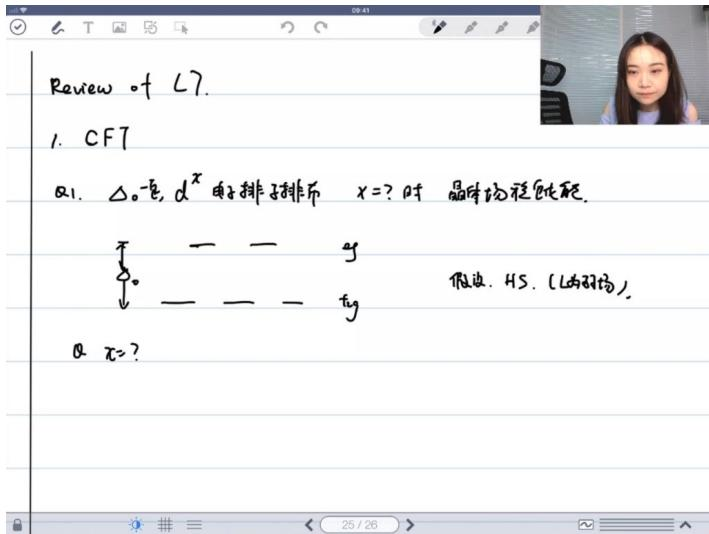

text_image

Review of L7.
1. CF7
Q1. △₀-△, d^x 的排子排布 x=? 时 晶体场稳定化呢.
假边. HS. (L为好场).
Q x=?

能量基准：未分裂的5个d轨道能量设为基准零点

\- 分裂状态：t2g轨道能量为 $-\frac{2}{5}\Delta_{o}$ ，eg轨道能量为 $+\frac{3}{5}\Delta_{o}$

● 最大CFSE：x=3和x=8时获得最大稳定化能

# 4）高自旋和低自旋 05:42

● 高自旋排布：电子优先占据不同轨道（Hund规则）

● 计算原理：前五个电子能量相互抵消，净CFSE来自超出5个的电子

# 5）第四电子的配置 07:31

● 电子排布与经济稳定化能 07:34

\- 纯场效应：CFSE仅考虑d轨道分裂带来的能量变化，不考虑电子配对能
- 相对值计算：以未分裂d轨道能量为基准计算变化量

● 经济稳定化能的计算 08:05

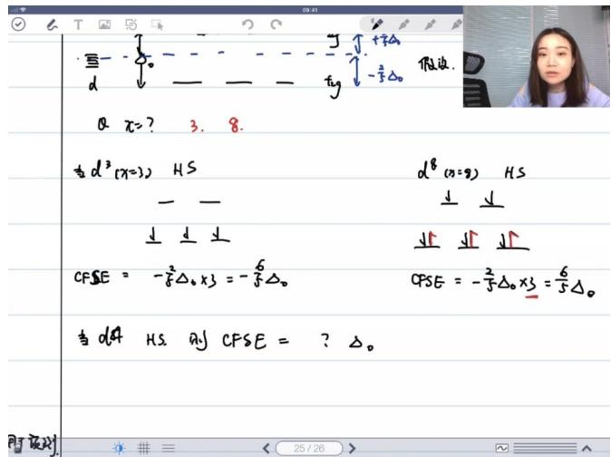

text_image

≡ - ∵ - - - - ∵ ↑ + 2△
d     - - - - ∵ ↑ - 2/3△
假边.
Q x=?    3.    8.
≠ d³(x=3) H S
      - -
      ↓ ↓ ↓
CFSE = -²/3△×3 = -6/3△。
当 dA H S 则 CPSE = ? △。

○ d3构型：CFSE = - $\frac{2}{5}\Delta_{o}$ × 3 = - $\frac{6}{5}\Delta_{o}$   
○ d8构型：同样获得 $-\frac{6}{5}\Delta_{o}$ 的稳定化能

● 具体计算示例 09:06

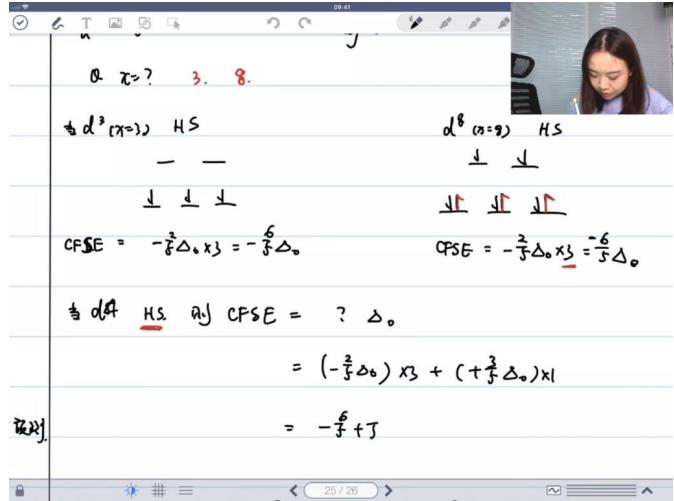

text_image

Q x=? 3.8.
当d³(x=1) HS
      — —
      ↓ ↓ ↓
CFSE = -½△₀×₃ = -6/5△₀
当d'4 HS 则 CFSE = ? △₀
          = (-½△₀)×₃ + (+½△₀)×₁
          = -6/5+7
设对:

$\circ$ d4高自旋：CFSE $= (-\frac{2}{5}\Delta_o\times 3) + (+\frac{3}{5}\Delta_o\times 1) = -0.6\Delta_o$   
符号意义：负值表示体系能量降低，绝对值越大越稳定

四面体场中的CFSE最大化10:06

- 分裂模式：四面体场 $\Delta_{t}$ 分裂与八面体场相反  
○ 低自旋条件：x=4时通过填满低能轨道获得最大CFSE

● 电子排布与能量状态 11:32

○ 实际应用：解释第四周期二价水合离子的水合能变化趋势  
○ 能量极值：理论上CFSE最大值为0（完全填满轨道）

CFSE的计算与解释 11:52

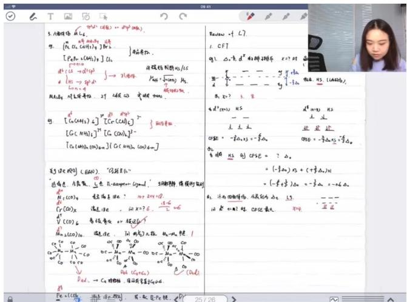

text_image

5. A物质 \( Cl_4 \) (液态) → \( Cl_2P \) (液体).
# [Cu, Ca(OH)₃] Br₂
[Pb(xH),C(H)] Cl₃
→ [Cu + H⁺] → [Cu + H⁺] → [Cu + H⁺] → [Cu + H⁺] → [Cu + H⁺] → [Cu + H⁺] → [Cu + H⁺] → [Cu + H⁺] → [Cu + H⁺] → [Cu + H⁺] → [Cu + H⁺] → [Cu + H⁺] → [Cu + H⁺] → [Cu + H⁺] → [Cu + H⁺] → [Cr(Ca)₃] C[Cr(Ca)₃] C[Cr(Ca)₃] C[Cr(Ca)₃] C[Cr(Ca)₃] C[Cr(Ca)₃] C[Cr(Ca)₃] C[Cr(Ca)₃] C[Cr(Ca)₃] C[Cr(Ca)₃] C[Cr(Ca)₃] C[Cr(Ca)₃] C[Cr(NH₄)₂] C[Cr(NH₄)₂] C[Cr(NH₄)₂] C[Cr(NH₄)₂] C[Cr(NH₄)₂] C[Cr(NH₄)₂] C[Cr(NH₄)₂] C[Cr(NH₄)₂] C[Cr(NH₄)₂] C[Cr(NH₄)₂] C[Cr(NH₄)²⁻]
Mn₂O₅ → 1:460 (mL) 或 1:460 (mL)
Mg = [Ca(NH₄)₂] [Cr(Ca)₃] → [Cu + H⁺] → [Cu + H⁺] → [Cu + H⁺] → [Cu + H⁺] → [Cu + H⁺] → [Cu + H⁺] → [Cu + H⁺] → [Cu + H⁺] → [Cu + H⁺] → [Cu + H⁺] → [Cu + H⁺] → [Cu + H⁺] → [Cu + H⁺] → [Cu + H⁺] ←
Mg: 2-? 3-8
Mg: d¹(mu) Ns
Mg: d²(mu) Ns
Mg: d³(mu) Ns
Mg: d⁴(mu) Ns
Mg: d⁵(mu) Ns
Mg: d⁶(mu) Ns
Mg: d⁷(mu) Ns
Mg: d⁸(mu) Ns
Mg: d⁹(mu) Ns
Mg: d¹⁰(mu) Ns
Mg: d¹¹(mu) Ns
Mg: d¹²(mu) Ns
Mg: d¹³(mu) Ns
Mg: d¹⁴(mu) Ns
Mg: d¹⁵(mu) Ns
Mg: d¹⁶(mu) Ns
Mg: d¹⁷(mu) Ns
Mg: d¹⁸(mu) Ns
Mg: d¹⁹(mu) Ns
Mg: d²⁰(mu) Ns
Mg: d²¹(mu) Ns
Mg: d²²(mu) Ns
Mg: d²³(mu) Ns
Mg: d²⁴(mu) Ns
Mg: d²⁵(mu) Ns
Mg: d²⁶(mu) Ns
Mg: d²⁷(mu) Ns
Mg: d²⁸(mu) Ns
Mg: d²⁹(mu) Ns
Mg: d³⁰(mu) Ns
Mg: d³¹(mu) Ns
Mg: d³²(mu) Ns
Mg: d³³(mu) Ns
Mg: d³⁴(mu) Ns
Mg: d³⁵(mu) Ns
Mg: d³⁶(mu) Ns
Mg: d³⁷(mu) Ns
Mg: d³⁸(mu) Ns
Mg: d³⁹(mu) Ns
Mg: d⁴⁰(mu) Ns
Mg: d⁴¹(mu) Ns
Mg: d⁴²(mu) Ns
Mg: d⁴³(mu) Ns
Mg: d⁴⁴(mu) Ns
Mg: d⁴⁵(mu) Ns
Mg: d⁴⁶(mu) Ns
Mg: d⁴⁷(mu) Ns
Mg: d⁴⁸(mu) Ns
Mg: d⁴⁹(mu) Ns
Mg: d⁵⁰(mu) Ns
Mg: d⁵¹(mu) Ns
Mg: d⁵²(mu) Ns
Mg: d⁵³(mu) Ns
Mg: d⁵⁴(mu) Ns
Mg: d⁵⁵(mu) Ns
Mg: d⁵⁶(mu) Ns
Mg: d⁵⁷(mu) Ns
Mg: d⁵⁸(mu) Ns
Mg: d⁵⁹(mu) Ns
Mg: d⁶⁰(mu) Ns
Mg: d⁶¹(mu) Ns
Mg: d⁶²(mu) Ns
Mg: d⁶³(mu) Ns
Mg: d⁶⁴(mu) Ns
Mg: d⁶⁵(mu) Ns
Mg: d⁶⁶(mu) Ns
Mg: d⁶⁷(mu) Ns
Mg: d⁶⁸(mu) Ns
Mg: d⁶⁹(mu) Ns
Mg: d⁷⁰(mu) Ns
Mg: d⁷¹(mu) Ns
Mg: d⁷²(mu) Ns
Mg: d⁷³(mu) Ns
Mg: d⁷⁴(mu) Ns
Mg: d⁷⁵(mu) Ns
Mg: d⁷⁶(mu) Ns
Mg: d⁷⁷(mu) Ns
Mg: d⁷⁸(mu) Ns
Mg: d⁷⁹(mu) Ns
Mg: d⁸⁰(mu) Ns
Mg: d⁸¹(mu) Ns
Mg: d⁸²(mu) Ns
Mg: d⁸³(mu) Ns
Mg: d⁸⁴(mu) Ns
Mg: d⁸⁵(mu) Ns
Mg: d⁸⁶(mu) Ns
Mg: d⁸⁷(mu) Ns
Mg: d⁸⁸(mu) Ns
Mg: d⁸⁹(mu) Ns

计算惯例：通常讨论CFSE的绝对值（体系能量降低程度）  
- 物理意义：反映配体场对中心原子电子结构的稳定化作用

# 6）水合能 12:33

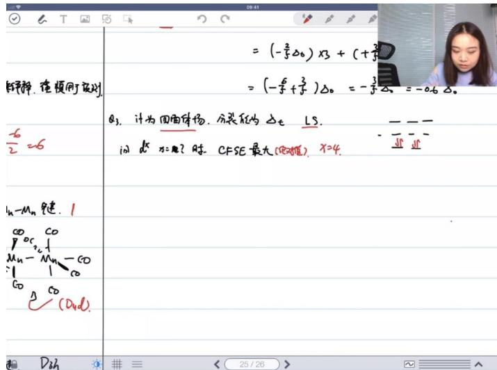

text_image

=(-3/5△0)×3+(+3/5)
=(-6/5+3/5)△0=-3/5△0=-0.6△0.
Q3, 计为四面体场, 分类转化为△t LS.
问 d' x=0? 时 CFSE 最大(绝对值), x=4.
D2h
D2h
Mn-Mn-CO
CO CO
(C2d)

- 定义：水合能是指第四周期过渡金属元素二价离子 $M^{2+}$ 与水分子结合形成六水合离子 $[M(H_{2}O)_{6}]^{2+}$ 时释放的能量  
● 测量对象：主要针对第一过渡周期（第四周期）元素，包括Ca、Sc、Ti、V、Cr、Mn、Fe、Co、Ni、Cu、Zn的二价离子

# 7）水合能趋势 14:36

● 预期值水合能上升趋势解释 15:04

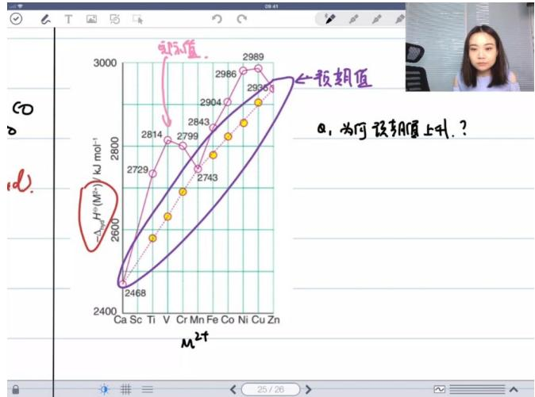

line

| Element | Value |
| ------- | ----- |
| Ca      | 2468  |
| Sc      | 2729  |
| Ti      | 2814  |
| V       | 2799  |
| Cr      | 2743  |
| Mn      | 2843  |
| Fe      | 2904  |
| Co      | 2966  |
| Ni      | 2986  |
| Cu      | 2989  |
| Zn      | 2996  |

○
○ 上升原因：  
○
○ 上升原因：

■ 离子半径下降：从左到右过渡金属离子半径逐渐减小   
■ 有效核电荷上升：核电荷增加导致离子与水分子相互作用增强

○ 坐标表示：纵坐标为负的水合能（即绝对值），因为水合过程是放热反应

● 实际值与预期值比较 17:11

○ 普遍规律：实际水合能值总是大于预期值  
○ 理论解释：晶体场稳定化能（CFSE）总是≤0，即总是使体系能量降低  
◦ 例外情况：当CFSE=0时，实际值与预期值相符

● 晶体场稳定化能（CFSE）的影响 17:33

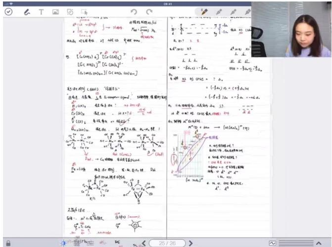

text_image

25/26
ZnH4H8e
Fe(1) + Fe(2) → Fe(3)
Fe(1) + Fe(2) → Fe(3)
Fe(1) + Fe(2) → Fe(3)
Fe(1) + Fe(2) → Fe(3)
Fe(1) + Fe(2) → Fe(3)
Fe(1) + Fe(2) → Fe(3)
Fe(1) + Fe(2) → Fe(3)
Fe(1) + Fe(2) → Fe(3)
Fe2 + Fe(2) → Fe(3)
Fe(1) + Fe(2) → Fe(3)
Fe(1) + Fe(2) → Fe(3)
Fe(1) + Fe(2) → Fe(3)
Fe(1) + Fe(2) → Fe(3)
Fe(1) + Fe(2) → Fe(3)
Fe(1) + Fe(2) → Fe(3)
Fe(1) + CoOH
Fe(1) + CoOH
Fe(1) + CoOH
Fe(1) + CoOH
Fe(1) + CoOH
Fe(1) + CoOH
Fe(1) + CoOH
Fe(1) + CoOH
Fe(1) + CoOH
Fe(1) + CoOH
Fe(1) + CoOH
Fe(1) + CoOH
Fe(1) + CoOH
Fe(1)
Fe(1)
Fe(2)
Fe(2)
Fe(3)
Fe(3)
Fe(4)
Fe(4)
Fe(5)
Fe(5)
Fe(6)
Fe(6)
Fe(7)
Fe(7)
Fe(8)
Fe(8)
Fe(9)
Fe(9)
Fe(10)
Fe(10)
Fe(11)
Fe(11)
Fe(12)
Fe(12)
Fe(13)
Fe(13)
Fe(14)
Fe(14)
Fe(15)
Fe(15)
Fe(16)
Fe(16)
Fe(17)
Fe(17)
Fe(18)
Fe(18)
Fe(19)
Fe(19)
Fe(20)
Fe(20)
Fe(21)
Fe(21)
Fe(22)
Fe(22)
Fe(23)
Fe(23)
Fe(24)
Fe(24)
Fe(25)
Fe(25)
Fe(26)
Fe(26)
Fe(27)
Fe(27)
Fe(28)
Fe(28)
Fe(29)
Fe(29)
Fe(30)
Fe(30)
Fe(31)
Fe(31)
Fe(32)
Fe(32)
Fe(33)
Fe(33)
Fe(34)
Fe(34)
Fe(35)
Fe(35)
Fe(36)
Fe(36)
Fe(37)
Fe(37)
Fe(38)
Fe(38)
Fe(39)
Fe(39)
Fe(40)
Fe(40)
Fe(41)
Fe(41)
Fe(42)
Fe(42)
Fe(43)
Fe(43)
Fe(44)
Fe(44)
Fe(45)
Fe(45)
Fe(46)
Fe(46)
Fe(47)
Fe(47)
Fe(48)
Fe(48)
Fe(49)
Fe(49)
Fe(50)
Fe(50)
Fe(51)
Fe(51)
Fe(52)
Fe(52)
Fe(53)
Fe(53)
Fe(54)
Fe(54)
Fe(55)
Fe(55)
Fe(56)
Fe(56)
Fe(57)
Fe(57)
Fe(58)
Fe(58)
Fe(59)
Fe(59)
Fe(60)
Fe(60)
Fe(61)
Fe(61)
Fe(62)
Fe(62)
Fe(63)
Fe(63)
Fe(64)
Fe(64
)(CoOH)(CoOCH₃)

MoH (CuOCH₃)

MoH (CuOCH₃)

MoH (CuOCH₃)

MoH (CuOCH₃)

MoH (CuOCH₃)

MoH (CuOCH₃)

MoH (CuOCH₃)

MoH (CuOCH₃)

MoH (CuOCH₃)

MoH (CuOCH₃)

MoH (CuOCH₃)

MoH (CuOH)

MoH (CuOH)

MoH (CuOH)

MoH (CuOH)

MoH (CuOH)

MoH (CuOH)

MoH (CuOH)

MoH (CuOH)

MoH (CuOH)

- 作用机制：CFSE使体系能量降低，导致实际水合能大于预期值  
○ 计算公式：对于八面体场高自旋情况， $CFSE=\left(-f+\frac{3}{5}\right)\Delta=-1\Delta=-0.6\Delta$

CFSE等于零的情况（d0配置）18:16

○ 对应电子构型：d0、d5（高自旋）、d10  
- 具体实例：

Ca $^{2+}$ (d0)   
■ $Mn^{2+}$ (d5)   
■ $Zn^{2+}$ (d10)

○ 配体环境：六水合离子 $\left[M\left(H_{2}O\right)_{6}\right]^{2+}$ ，水为弱场配体（高自旋）

● CFSE最大值出现的情况（d3或d8配置） 19:23

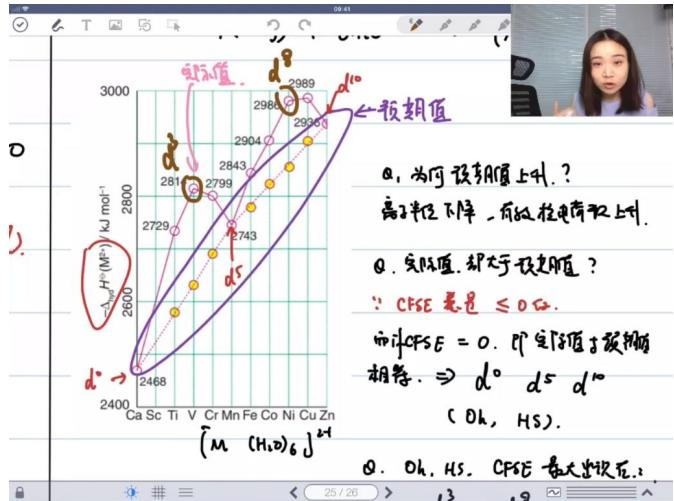

○ 最大CFSE构型：

■ d3 (如 $V^{2+}$ )   
■ d8 (如Ni $^{2+}$ )

○ 实验验证：图表中 $V^{2+}$ 和 $Ni^{2+}$ 对应的实际水合能峰值最高

● 应用：MO晶体(NaCl型)晶格能变化趋势 21:00

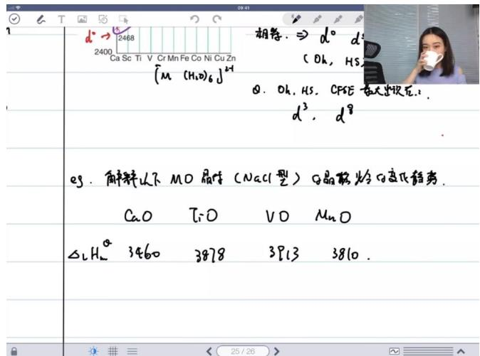

text_image

d' → 2468
Ca Sc Ti V Cr Mn Fe Co Ni Cu Zn
(m (H₂O)₆)²⁻¹
相等. ⇒ d° d'
( Oh, HS )
Q. Oh, HS. CFSE 气式出现.
d³, d⁸
eg. 解释以下 MO 晶体 (NaCl型) Q晶粒烃的变化趋势.
CaO TiO VO MnO
△L H₀ 3460 3878 3913 3810.

预期趋势：从左到右晶格能应单调上升（基于 $q_{1}q_{2} / r$ 公式）

○ 影响因素：

■ $M^{2+}$ 离子半径减小

■ 静电作用增强

○ 实际观察：某些点偏离预期趋势（如CoO、VO等），需考虑CFSE影响

8）晶体格能趋势 24:38

● 考虑晶体格能变化的物质 24:46

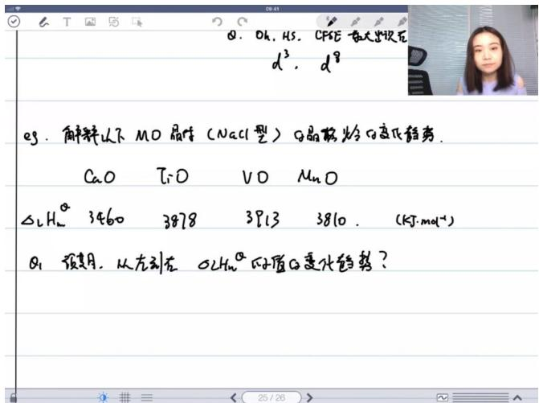

text_image

Q. Oh, HS. CFSE 最大出现在
d³, d⁸

eg. 解释以下 MO 层性 (NaCl型) O晶粉烃的变化趋势.

CaO TiO VO MnO

△LHₘ 3460 3878 3913 3810. (kJ·mol⁻¹)

Q₁ 设期，从左到右  △LHₘ 的质的变化趋势？

○ CFSE考虑范围：在 $d^{0}$ 到 $d^{5}$ 电子构型的过渡金属氧化物中，只有 $d^{3}(V)$ 和 $d^{4}(Cr)$ 需要考虑晶体场稳定化能(CFSE)，因为 $d^{0}(Ca)$ 和 $d^{5}(Mn)$ 在八面体弱场高自旋条件下不产生CFSE

○ 配体场类型： $O^{2-}$ 是弱场配体，形成八面体高自旋配合物， $d^{0}$ 和 $d^{5}$ 构型电子排布对称，CFSE为零

● 晶体格能变化趋势的理论解释 25:53

☐ 理论预期：根据晶体场理论， $d^{3}(V)$ 应具有最大的CFSE，因为其电子排布为 $(t_{2g})^{3}(e_{g})^{0}$ ，能获得最大的晶体场稳定化能

○ 变化基准线：以 $d^{0}(\mathrm{CaO})$ 和 $d^{5}(\mathrm{MnO})$ 的晶格能数据点(3460和3810kJ/mol)连线作为基准线，中间 $d^{1}$ 到 $d^{4}$ 的理论值应均匀分布在这条直线上

● 晶体格能变化趋势的验证与计算 27:10

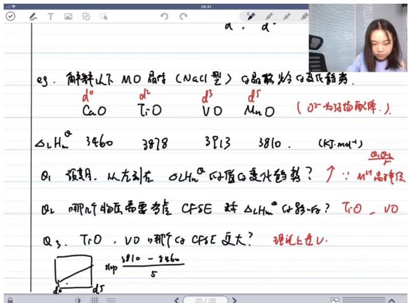

text_image

eg. 解释以下 MO 晶体 (NaCl 型) Q晶粉岭的氧化趋势.
CaO TiO VO MnO (0-为对场配准.)
△LHm 3460 3878 3913 3810. (kJ.mol-1)
Q1 设期，从左到右 O2HmO2O2O3O变化趋势？↑：∵MnO2O2O3O3O3O3O3O3O3O3O3O3O3O3O3O3O3O3O3O3O3O3O3O3O3O3O3O3O3O3O3O3O3O3O3O3O3O3O3O3O3O3O3O3O3O3O3O3O3O3O3O3O
Q2 哪几个物底需要考虑 CFSE 对 △LHmO2O2O2O3O2O3O3O3O3O3O3O3O3O3O3O3O3O3O3O3O3O3O3O3O3O3O3O3O3O3O3O3O3O3O3O3O3O3
Q3、Tr0、VO O2O O2CPE更大？ 现论上应U.
即 5
d5
a，a·
25/26

斜率计算：基准线斜率为(3810 - 3460) / 5 = 70kJ/mol·d电子，即每增加一个d电子，晶格能理论增加70 kJ/mol

○ 理论值推算：

■ $d^{2}(\text{TiO})$ 理论值： $3460 + 2 \times 70 = 3600 \, kJ/mol$   
■ $d^{3}(VO)$ 理论值： $3810 - 2 \times 70 = 3670kJ/mol$

○ CFSE计算：

■ TiO的CFSE：实际值-理论值=3878 - 3600 = 278kJ/mol   
■ VO的CFSE: 3913 - 3670 = 243kJ/mol

● 预期值与实际值的偏差分析 30:08

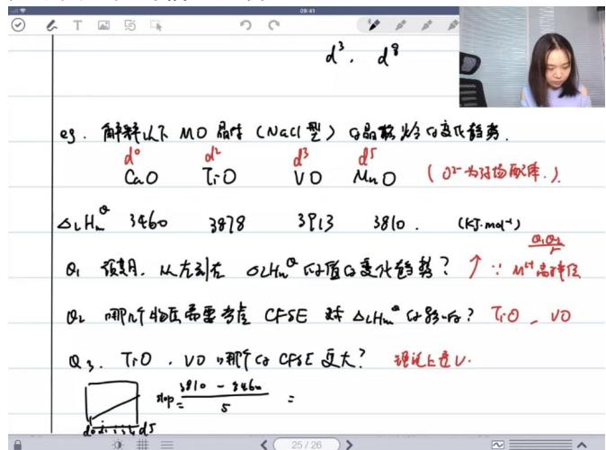

text_image

eg. 解析以下 MO 晶体 (NaCl 型) O晶数生成的卤化趋势.
d⁰ CaO d² TiO d³ VO d⁵ MnO (O²为对场取体.)
△LHm 3860 3878 3913 3810. (kJ mol⁻¹)
Q₁ 预期，从左到右 OCHₘC的质口变化趋势？↑：MnO溶液
Q₂ 哪几个物压需要考虑 CFSE 对 △LHmC影吗？TrO，VO
Q₃。TrO，VO 哪那个CO CFSE更大？理论上在V.
即P = 3810 - 3860 / 5 =

异常现象：实际计算显示TiO(278 kJ/mol)的CFSE反而大于VO(243 kJ/mol)，与理论预期 $d^{3}$ 应具有最大CFSE矛盾

○ 可能原因：

■ 晶格能变化并非严格的线性关系  
■ 存在其他影响因素未被考虑  
■ 实验数据可能存在系统误差

结论：单纯用斜率法计算CFSE存在局限性，需要更精确的计算方法

9）经常稳定化能 30:46

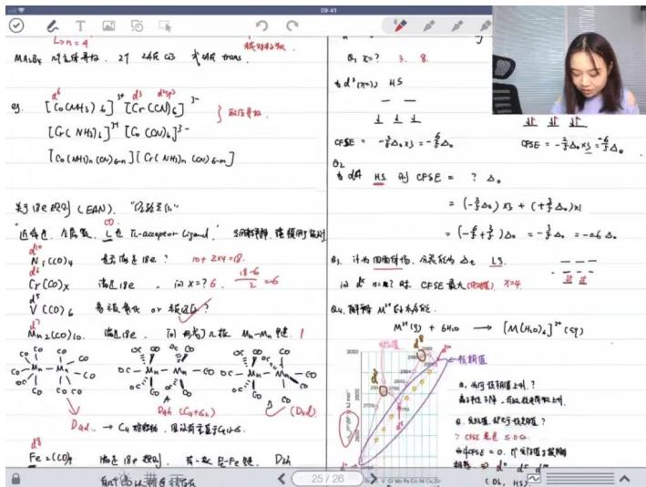

text_image

MA₂O₄: 时长等于0.2，2时长等于0.3，或此时长等于0.4。
y: [Cr(CaH₃)₄]²⁺ d¹ + m³²⁻
[Cr(Ca)₆]²⁻
[Cr(NH₃)₄]²⁺ [Co(CO)₆]²⁻
[Co(NH₃)ₙ(CO)₆m]²⁺ [Cr(NH₃)ₙ(CO)₆m]
关于PE(RO) (EAN)。“可将互为”
边形色、内层黄、上色、下三角形或圆柱深浅，分别排列。该顺序排列。该顺序排列。
N₁(CO)₄ 求有连线？10+2x=0.8。
Cr(CO)ₙ 满足PE。问x?6，\(\frac{18-6}{2}=6\)
V(CO)₆ 高强导火，必须满足？
Mn₂(CO)₁：端连PE。问两角n处接Mn-Mn键，
CO CO CO
CO-CO
CO-CO
OC-CO-CO
OC-CO-CO
OC-CO-CO
OC-CO-CO
OC-CO-CO
OC-CO-CO
OC-CO-CO
OC-CO-CO
OC-CO-CO
OC-CO-CO
OC-CO-CO
OC-CO-CO
OC-CO-CO
OC-CO-CO
OC-CO-CO
OC-CO-CO
OC-CO-CO
DQX → C₄C的释放，使以离子量直于C₄½c。
Fe₂(CO)₄ 求在BE和Pt之间，再与Fe键，DQX。
B₁C₂? 3.8
d' (m): H₂
⊥ ⊥ ⊥
CFSE = -½△, x₁ = -½△
PFSE = -½△, x₂ = -½△
β₂ dA H₂ 则 CFSE = ?△。
= (-½△)₃ x₁ + (+½△)ₙH
= (-f + ½)₃△ = -½△ = -0.6△。
θ₁ 计为四面体面，分裂变为△c L3.
问 θ₂ 0.02 时，CFSE最大（地幔）不等。
θ₂ 解解 M'' 的方程。
M''(5) + 6H₂O → [M(H₂O)₄]²⁺ (9q)
3000
物体比值小于0.1，但比值大于0.1。
0.1×10⁻⁶，此时长等于0.1℃。
0.2×10⁻⁶，此时长等于0.1℃。
0.3×10⁻⁶，此时长等于0.1℃。
0.4×10⁻⁶，此时长等于0.1℃。
FE₂(CO)₄ 求在BE和Pt之间，再与Fe键，DQX。

● 18电子规则：过渡金属配合物中，金属价电子数+配体提供电子数=18时最稳定

例： $\left[Co(CO)_{4}\right]^{-}$ ，Co有9个价电子，每个CO提供2个电子，加上1个负电荷： $9 + 2 \times 4 + 1 = 18$

- CFSE计算：在八面体场中， $d^{6}$ 高自旋构型的CFSE计算公式为 $-\frac{2}{5}\Delta_{0} \times 3 + \frac{3}{5}\Delta_{0} \times 1$   
- 金属-金属键：某些配合物如 $[Mn_{2}(CO)_{10}]$ 中，金属原子通过形成M-M键满足18电子规则

10）姜太乐效应

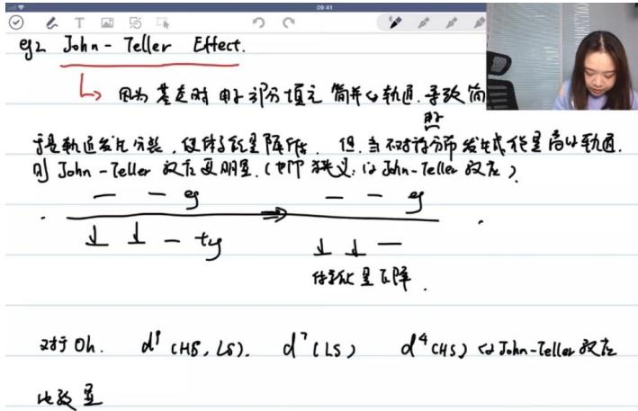

text_image

eg2 John - Teller Effect.
L→ 因为基态时电子部分填充简并心轨迹,导致简
于是轨迹发生分裂,使体子能量降低. 但,当不对称分布,发生的能量升高轨迹.
则 John - Teller 放在更明显.(即: 稀义: (2 John - Teller 放在)
↓ ↓ - ty → ← y
体软化呈下降.
对于 Oh. d¹(Hb, Ls). d²(Ls) d⁴(Hs) <John - Teller 放在
此效应

● 本质：由于基态时电子部分填充简并轨道，导致简并轨道发生分裂，使体系能量降低。  
● 关键条件：当电子在简并轨道中呈不对称分布时，姜太乐效应明显。  
- 简并轨道定义：能量相等的轨道，如八面体场中 $t_{2g}$ 为三重简并， $e_g$ 为二重简并。

text_image

你抓住是正降。

对于 Oh. $d^{1}(HB, LS)$ . $d^{7}(LS)$ $d^{4}(HS)$ <John-Teller 反应

比较显著，其中最常见的是 $d^{9}$

in $Cs_{2}[CuCl_{4}]$

26/26   
● 能量变化机制：填充电子的轨道能量略下降，未填充的轨道能量略上升，使体系总能量进一步降低。  
- 显著效应条件：通常指发生在能量高于分裂前水平的轨道（如 $e_g$ 轨道）中的不对称分布。  
- 狭义定义争议：部分教材仅将最高简并轨道的不对称分布称为姜太乐效应，这是不严谨但实验上合理的定义。  
- 八面体场中的典型情况

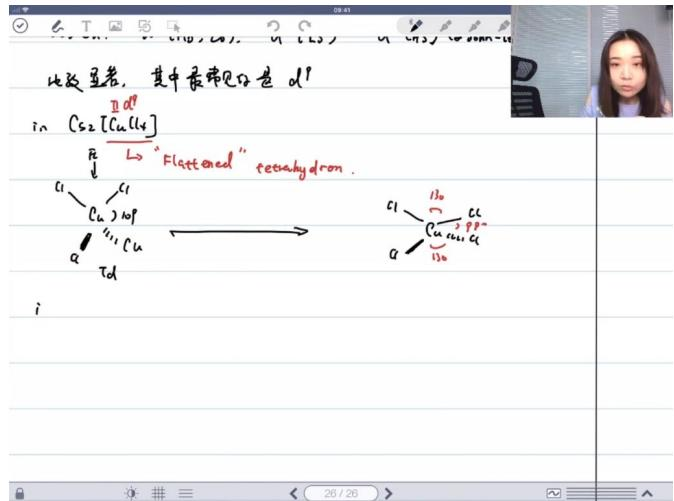

text_image

此故显若，其中氯弗见元素 dP
in Cs2 [Cu(II)] 
→ Flattened tetrahydron.
Cl/Cu/10P
O" Cu
α/Td
i
130
Cu 2.99
α 130
26/26

○ 显著效应构型： $d^{9}$ (高低自旋均可)、 $d^{7}$ (低自旋)、 $d^{4}$ (高自旋)。  
○ 最常见实例： $d^{9}$ 构型，如二价铜 $(Cu^{2+})$ 配合物。  
○ 结构畸变类型：拉长或压扁的八面体结构，对称性从 $O_{h}$ 降低为 $D_{4h}$ 。

\- 铜配合物实例分析

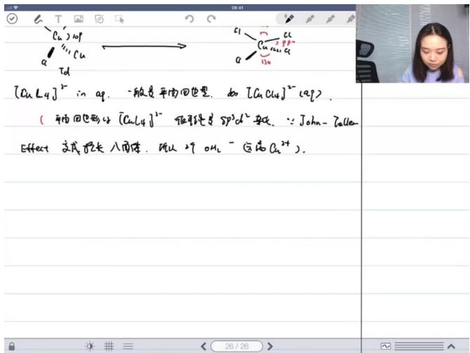

text_image

[CuL4]2- in aq. 一般是平面四边形, 如 [CuCl4]2-(aq).
( 平面四边形) [CuL4]2- 按开性是 Sp3d2- 按, ∴ John-Zeller
Effect 文式提尖八面体, 所以 27 OH- (设为 Ca2+).

四氯合铜酸盐：测得为扁平化四面体结构，键角从 $109^{\circ}$ 变为 $130^{\circ}$ 和 $99^{\circ}$ 。  
○ 水溶液结构：通常表现为平面四边形或拉长的八面体结构。  
- 杂化方式：可能为 $sp^3 d^2$ 杂化。

# ● 畸变机制详解

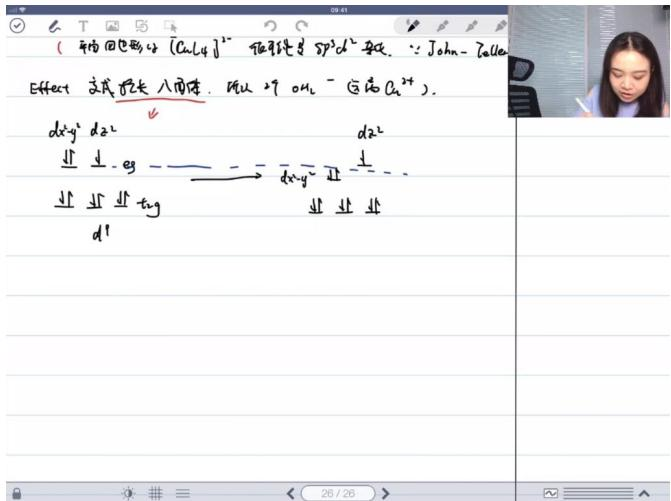

text_image

(平向四边形)2 [CaL4]²⁻ 垂开性 5P³d² 某状. ∵John-Zeller
Effect 文式换入两体. 如以 29 cm⁻¹ 区的 Ca²⁺.
d×y² dײ dײ
↓ ↓ - eg → d×y² II - 1
↓ ↓ ↓ ↑ tag ↓ ↓ ↓
d¹

拉长八面体：将单电子填入 $d_{z^{2}}$ 轨道，使 $d_{x^{2}-y^{2}}$ 轨道能量下降，导致z轴方向键长增加。

☐ 压扁八面体：将单电子填入 $d_{x^{2}-y^{2}}$ 轨道，使xy平面键长缩短，z轴方向键长增加。

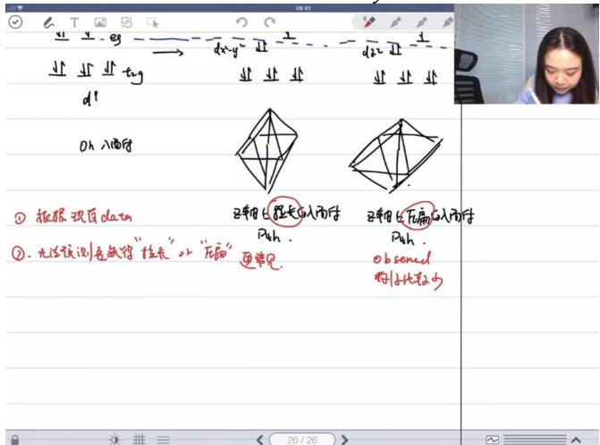

text_image

① 根据现有 da ma
② 无法预测长获得“拉长”或“后端”
③ 任意长度的长与前长
④ 任意长度的后端
⑤ 每小比较少

实验观测结果：绝大多数铜(II)配合物表现为拉长八面体，压扁八面体实例较少。  
○ 预测局限性：无法预先确定会形成拉长还是压扁结构，只能预测会发生畸变。

# ● 关键结论

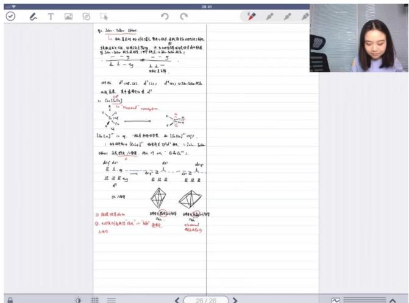

text_image

g: 240.1500
→
→
→
→
→
→
→
→
→
→
→
→
→
→
→
→
→
→
→
→
→
→
→
→
→
→
→
→
→
→
→
→
→
→
→
→
→
→
→
→
→
→
→
→
→
→
→
→
→
→
26/26

○ 核心特征：电子在简并轨道的不对称分布导致对称性降低和结构畸变。  
○ 实验验证难点：内层轨道 $(t_{2g})$ 的畸变效应过小，难以与实验误差区分。  
○ 化学意义：解释了过渡金属配合物结构偏离理想几何构型的原因。

# 11）应用案例 48:13

# 例题:配合物构型判断

○ 配合物畸变判断方法

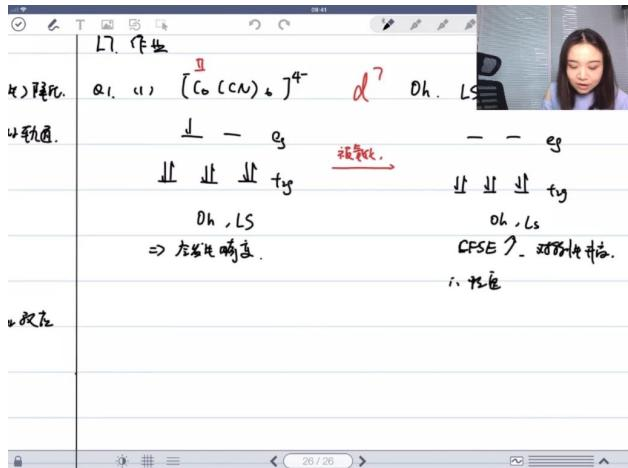

text_image

L7. 作业
(1) 降化.
Q1. (1) [C0(CN)6]4^2 d^7 Oh. LS
以轨通.
⊥ - eg 视觉比.
∥ ⊥ ⊥ ty
Oh, LS
⇒ 后发生畸变.
- - eg
⊥ ∥ ⊥ ty
Oh, LS
CFSE ↑ 对异性排离.
i 性应
此效应

■ d电子数判断：首先确定中心原子的d电子数，例如 $[Co(CN)_{6}]^{4-}$ 中Co为d7构型（ $Co^{2+}$ 的 $3d^{7}$ 电子构型）  
■ 配体场强判断：CN $^{-}$ 是强场配体，导致八面体场低自旋排布（t2g $^{6}$ eg $^{1}$ ）  
■ 姜泰勒效应：d7低自旋构型（不对称电子排布）会发生八面体畸变  
■ 还原性解释：畸变后若氧化为d6构型（ $\mathrm{t2g}^{6}$ ）可获得更稳定的对称结构，这是其强还原性的热力学解释

○ 水合配合物判断实例

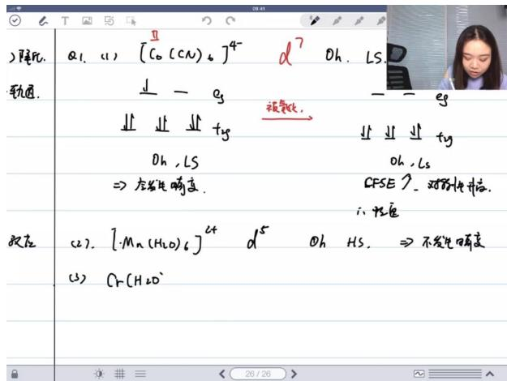

text_image

)降低.
轨迹.
(1) [C6(CN)6]4-d7 Oh, LS.
↓ - eg
↓ ↓ ↑ ty
Oh, LS
⇒ 发生畸变.
(2) [Mn(H2O)6]4-d5 Oh HS, ⇒ 不发生畸变
(3) Cr(H2O)
↓ - eg
↓ ↓ ↑ ty
Oh, LS
CFSE > 对物快开泡.
↓ 挑色

# Mn(H₂O)₆²⁺:

● $Mn^{2+}$ 为d5构型 $(3d^{5})$   
● $H_{2}O$ 是弱场配体→高自旋排布 ( $t_{2}g^{3}eg^{2}$ )  
- 对称排布 $\rightarrow$ 不发生畸变

# $\text{Cr(H}_{2}\text{O)}_{6}^{2+}$ :

- $\mathrm{Cr^{2+}}$ 为d4构型（ $3\mathrm{d}^4$ ）  
● 高自旋排布（ $t_{2}g^{3}eg^{1}$ ）→发生明显畸变

# 姜泰勒效应适用范围

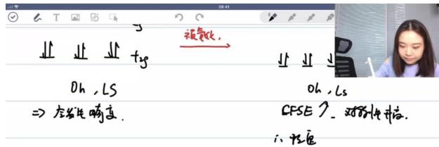

text_image

↓ ↓ ↓
Oh, Ls
⇒ 后发生畸变.
被氧化.
↓ ↓ ↓
Oh, Ls
CFSE 7_ 对物性开泡.
小 性变

$$
\begin{array}{cccccc}
1. & [Mn(H_2O)_6]^{2+} & d^5 & \text{Oh} & HS. & \Rightarrow & \text{不发生蠕变} \\
& [Cr(H_2O)_6]^{2+} & d^4 & \text{Oh} & HS. & \Rightarrow & \text{发生}.
\end{array}
$$

# 最显著情况：

- 低自旋d7 $(\mathrm{t_2g^6eg^1})$   
- 高自旋d4 (t2g $^{3}$ eg $^{1}$ )  
- 任何d9构型 $(\mathrm{t2g}^{6}\mathrm{eg}^{3})$

四面体场：理论上存在但效应较弱，因分裂能 $\Delta t$ 较小

● 例题:配合物构型推导 55:35

○ 四氨合镍配合物分析

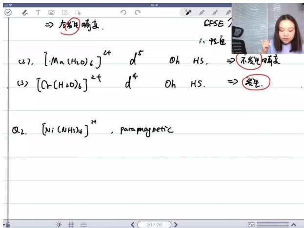

text_image

⇒ 余发电畸变.
(2). [Mn(H2O)6]2+ d5 Oh HS. ⇒ (不发电畸变)
(3) [Cr(H2O)6]2+ d4 Oh HS. ⇒ 等生.
Q2. [Ni(NH4)4]3+, para-PEGETIC
CFSE
i 性性

# Ni(NH $_3$ ) $_4^{2+}$ :

- $\mathrm{Ni}^{2+}$ 为d8构型（ $3\mathrm{d}^8$ ）  
- $\mathrm{NH}_{3}$ 是中等强度配体  
- 顺磁性表明存在未成对电子

# 几何构型判断：

- 常规推导： $\mathfrak{sp}^3$ 杂化 $\rightarrow$ 四面体  
● 实际限制：过渡金属中 $sp^{3}$ 不等同四面体（可能平面四边形）

# ○ 四氰合铀配合物分析

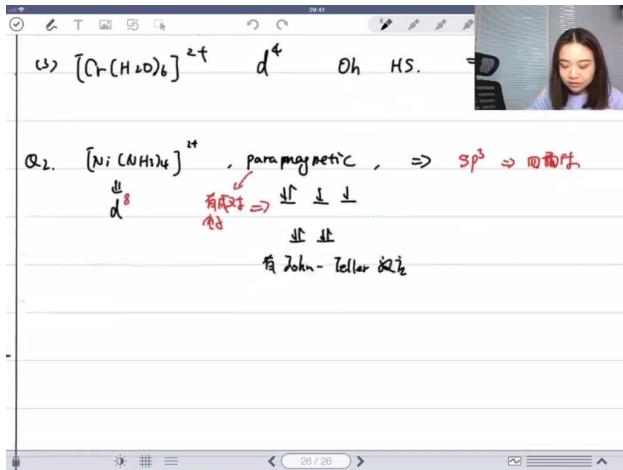

text_image

(3) [Cr(H2O)6] 2+ d4 Oh HS.
Q2. [Ni(CNH3)4] 1+, para magagnetic, ⇒ sp3 ⇒ 四面法
d8 有成对 ⇒ 业业
有 John-Teller 效立

# $[Ni(CN)_{4}]^{2-}$

Ni仍为d8构型  
- $\mathrm{CN^{-}}$ 是强场配体 $\rightarrow$ 电子重排（ $\mathrm{dsp}^2$ 杂化）  
- 形成正方形构型而非四面体

# ■ 强场配体效应：

● 增大分裂能△   
● 促进内层d电子压缩（使用(n-1)d轨道成键）  
● 存在 $\pi$ 反键相互作用增强配体场效应

● 例题:化合物xyz值 01:06:36

○ 18电子规则计算

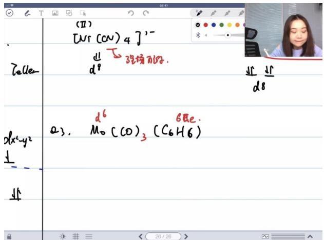

text_image

(Ⅱ)
[Nr (CN) 4]⁻
d↓
d⁸ 现场因子.
d↑
d8
dx²-y²
d⁶
a), Mo (CO)₃ (C₆H₆)
6即e.
↓
↓↑
26/26

■ 计算方法：根据18电子规则计算配合物中配体提供的电子数，中心金属的价电子数加上配体提供的电子数总和应为18。

■ 中心金属电子数：

- 汞(Hg)有9个价电子   
- 锰(Mn)有7个价电子

■ 配体电子贡献：

- 苯(C6H6)提供6个电子（通过π轨道配位）  
- 氢(H)提供1个电子  
- 羰基(CO)提供2个电子

金属-金属键：当电子数不足时，可能形成金属-金属键来补足18电子，如Mn2(CO)10中Mn-Mn键提供1个电子。

○ 配体电子贡献规则

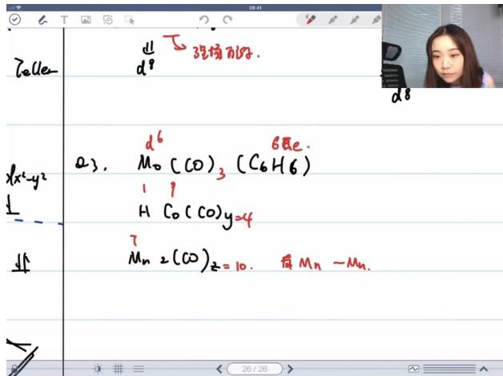

text_image

Zeller
d⁸
现场水下.
d⁸
x₁-y₂
a), M₀(CO)₃(C₆H₆)
1 9
H C₀(CO)y=4
Mn 2(CO)₂=10. 奇Mn-Mn.

■ σ键与π键区别：正常情况下配体通过孤对电子和π电子与中心原子相互作用，σ键电子不能作为路易斯碱。

■ 特殊配体：

● 苯环作为配体时提供6个电子  
- 氰根(CN-)通常提供1个电子  
- 氢原子提供1个电子

○ 高低自旋概念限制

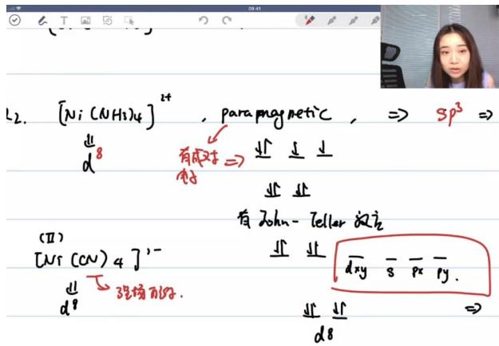

text_image

L2. [Ni (NH3)4] 2+, para magnetic, => sp³ => d⁸
有成对 ⇒ √ ↓ ↓
有 20h - teller 双元
(Ⅱ)
[Nr (CN) 4] 2-
d⁹ 强场因子.
∫ ∫ dxy s px ry.
∫ ∫ d8 ⇒

■ 适用条件：高低自旋概念仅适用于d4-d7电子构型，在d8电子构型时讨论高低自旋没有意义。  
■ 判断标准：高低自旋取决于晶体场分裂能( $\Delta$ )和电子成对能(P)，当 $\Delta>P$ 时选择低自旋， $\Delta<P$ 时选择高自旋。  
■ 常见误区：不能使用内轨型/外轨型概念来解释高低自旋现象。

# ○ Jahn-Teller效应

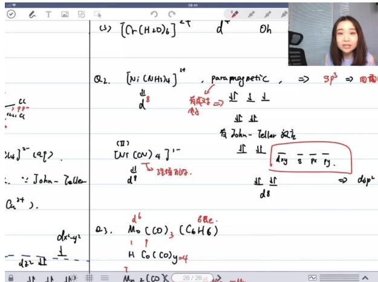

text_image

(3) [Cr(H2O)6]2+ d+ Oh
Q2. [Ni(CNH4)6]1+, paramagnetic, ⇒ sp³ ⇒ 四面
d 有反应 ⇒ 业 业
d 有双峰 ⇒ 业 业
d 有 John-Teller 放应
(Ⅱ)
[Ni(CN)4]1-
d 无结物的子.
d 无结物的子.
d 无结物的子.
d 无结物的子.
d 无结物的子.
d 无结物的子.
d 无结物的子.
d 无结物的子.
d 无结物的子.
d 无结物的子.
d 无结物的子.
d 无结物的子.
d 无结物的子.
d 无 结物的子.
d 无 结物的子.
d 无 结物的子.
d 无 结物的子.
d 无 结物的子.
d 无 结物的子.
d 无 结物的子.
d 无 结物的子.
d 无 结物的子.
d 无 结物的子.
d 无 结物的子.
d 无 结物的子.
d 无 结物的子。
d 无 结物的子.
d 无 结物的子.
d 无 结物的子.
d 无 结物的子.
d 无 结物的子.
d 无 结物的子.
d 无 结物的子.
d 无 结物的子.
d 无 结物的子.
d 无 结物的子.
d 无 结物的子.
d 无 结物的子.
d 无 约格的子.
d 无 约格的子.
d 无 约格的子.
d 无 约格的子.
d 无 约格的子.
d 无 约格的子.
d 无 约格的子.
d 无 约格的子.
d 无 约格的子.
d 无 约格的子.
d 无 约络的子.
d 无 约络的子.
d 无 约络的子.
d 无 约络的子.
d 无 约络的子.
d 无 约络的子.
d 无 约络的子.
d 无 约络的子.
d 无 约络的子.
d 无 约络的子.
d 无 约路的子.
d 无 约路的子.
d 无 约路的子.
d 无 约路的子.
d 无 约路的子.
d 无 约路的子.
d 无 约路的子.
d 无 约路的子.
d 无 约路的子.
d 无 约路的子.
d 无 约路线
d 无 约路线
d 无 约路线
d 无 约路线
d 无 约路线
d 无 约路线
d 无 约路线
d 无 约路线
d 无 约路线
d 无 约路线
d 无 约路线
d 无 约路线
d 无 约路线
d 无
- d²- II - d¹ -
Mn + (CO) × (26/20) Mn - Mn

■ 产生原因：当基态电子部分填充简并轨道时，会导致简并态分裂（对称性降低）。  
■ 表现形式:

● 在八面体场中，eg轨道简并分裂  
● 在四面体场中，t2轨道简并分裂

■ 特殊情况：d8电子构型在平面四边形场中也会表现出Jahn-Teller效应。

# 例题解析

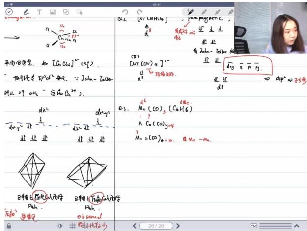

text_image

平肉四色里，如 [Cu(4)2]²⁻（4g）.
“和平鸡” Sr²d²-般，
∴ John-Zeller
所以 27 ou₁ - ⑤ (so Cu²⁺).
d²
d²-y
d²-y
d²-y
d²-y
d²-y
d²-y
d²-y
d²-y
d²-y
d²-y
d²-y
d²-y
d²-y
d²-y
d²-y
d²-y
d²-y
d²-y
d²-y
d²-y
d²-y
d²-y
d²-y
d²-y
d²-y
d²+y
d²+y
d²+y
d²+y
d²+y
d²+y
d²+y
d²+y
d²+y
d²+y
d²+y
d²+y
d²+y
d²+y
d²+y
d²+y
d²+y
d²+y
d²+y
d²+y
d²+y
d²+y
d²+y
d²+y
d²+y
d²=y
d²+y
d²+y
d²+y
d²+y
d²+y
d²+y
d²+y
d²+y
d²+y
d²+y
d²+y
d²+y
d²+y
d²+y
d²+y
d²+y
d²+y
d²+y
d²+y
d²+y
d²+y
d²+y
d²+y
d²+y
d²y1 (0)
Mn (0)₃ (C₆H₆)
H Co (CO)y = y
Mn 2 (CO)₄ = 10. 持 Mn - Mn.
23.
Mo (0)₃ (C₆H₆)
17.
H Co (CO)y = y.
Mn 2 (CO)₄ = 10. 持 Mn - Mn.
“和”更常见。
26/26>

# ■ 题目解析

- 对于Hg(CO)y化合物：Hg有9个电子，H提供1个电子，需要8个电子达到18电子规则，因此y=4（每个CO提供2个电子）  
- 对于Mn2(CO)z化合物：每个Mn需要11个电子，通过形成Mn-Mn金属键补足  
● 易错点：金属-金属键的电子贡献容易被忽略

# 二、复习软硬酸碱01:12:03

# 1. 例题: 单电子数计算 01:12:09

# 1）配合物磁矩与单电子数关系

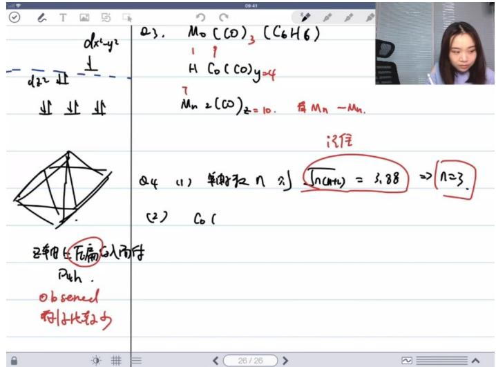

text_image

dxy²
dxy + 1/2
业业业
Q3. Mo (CO)₃ (C6H6)
1 9
H Co (CO)y=4
7
Mn₂ (CO)₂=10. 每Mn-Mn.
记住
Q4 (1) 单轴和n为√(n(n+4)=3.88) ⇒ n=3.
(2) Co(
已知长后偏点入而待
Pzh.
①obsened
对子比较少
26/26

● 磁矩公式: 通过磁矩测量可确定单电子数n，公式为 $\sqrt{n(n+2)}=3.88$ ，解得n=3

# - 应用实例:

\- 六氨合钴三正离子 $\left[\mathrm{Co}(\mathrm{NH}_{3})_{6}\right]^{3+}$ ： $d^6$ 电子构型， $n = 0$ ，为低自旋(LS)八面体场
- 六氨合钴二正离子 $\left[\mathrm{Co}(\mathrm{NH}_{3})_{6}\right]^{2+}$ ： $d^7$ 电子构型， $n = 3$ ，为高自旋(HS)八面体场

# 2）杂化轨道类型判断

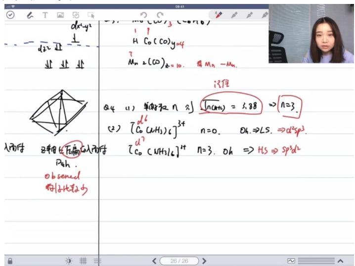

text_image

d_{x-y^2}
H C_0(CO)_y=4
M_n 2(CO)_z=10. 有 M_n - M_n.
记住
Q4 (1) 单面和 n 则 \(\sqrt{n(An)=3.88} \Rightarrow n=3\).
(2) \([C_0(NH_3)_6]^{3+} \quad n=0. \quad OH. \Rightarrow LS. \Rightarrow d^{2}sp^3.\)
\([C_0(NH_3)_6]^{3+} \quad n=3. \quad OH \Rightarrow HS \Rightarrow sp^3d^2\)
已用在压离的入面付
Pah.
observed
时子比较少

\- $d^{2}sp^{3}$ 杂化: 适用于低自旋八面体场配合物, 如 $\left[\mathrm{Co}(\mathrm{NH}_{3})_{6}\right]^{3+}$ - $sp^{3}d^{2}$ 杂化: 适用于高自旋八面体场配合物, 如 $\left[\mathrm{Co}(\mathrm{NH}_{3})_{6}\right]^{2+}$ - 注意点: 八面体场中 $d^{2}sp^{3}$ 和 $sp^{3}d^{2}$ 本质相同, 都是凑齐六个轨道形成八面体构型

# 3）晶体场分裂能影响因素

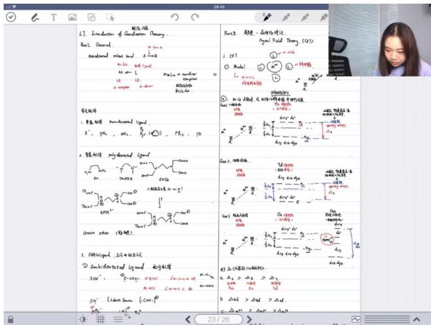

text_image

17. Introduction of Condonation Chemistry
Part I: Condonal
nucleated (mol/mol)
M = 0.53
M → L
L → 120
c - complex
molecular
RBCs/Ala
Pd/La
Part II: 纳键 - 高纯性比法
Signal Field Theory (QF1)
1. QF7
2. Model:
Lo (mmol/L)
形状图
Mg (mEq/kg)
Hg (mg/kg)
Fe (mg/kg)
Fe₂ (mg/kg)
Fe₃ (mg/kg)
Fe₄ (mg/kg)
Fe₅ (mg/kg)
Fe₆ (mg/kg)
Fe₇ (mg/kg)
Fe₈ (mg/kg)
Fe₉ (mg/kg)
Fe₁₀ (mg/kg)
Fe₁₁ (mg/kg)
Fe₁₂ (mg/kg)
Fe₁₃ (mg/kg)
Fe₁₄ (mg/kg)
Fe₁₅ (mg/kg)
Fe₁₆ (mg/kg)
Fe₁₇ (mg/kg)
Fe₁₈ (mg/kg)
Fe₁₉ (mg/kg)
Fe₂₀ (mg/kg)
Fe₂₁ (mg/kg)
Fe₂₂ (mg/kg)
Fe₂₃ (mg/kg)
Fe₂₄ (mg/kg)
Fe₂₅ (mg/kg)
Fe₂₆ (mg/kg)
Fe₂₇ (mg/kg)
Fe₂₈ (mg/kg)
Fe₂₉ (mg/kg)
Fe₃₀ (mg/kg)
Fe₃₁ (mg/kg)
Fe₃₂ (mg/kg)
Fe₃₃ (mg/kg)
Fe₃₄ (mg/kg)
Fe₃₅ (mg/kg)
Fe₃₆ (mg/kg)
Fe₃₇ (mg/kg)
Fe₃₈ (mg/kg)
Fe₃₉ (mg/kg)
Fe₄₀ (mg/kg)
Fe₄₁ (mg/kg)
Fe₄₂ (mg/kg)
Fe₄₃ (mg/kg)
Fe₄₄ (mg/kg)
Fe₄₅ (mg/kg)
Fe₄₆ (mg/kg)
Fe₄₇ (mg/kg)
Fe₄₈ (mg/kg)
Fe₄₉ (mg/kg)
Fe₅₀ (mg/kg)
Fe5₁ (mg/kg)
Fe5₂ (mg/kg)
Fe5₃ (mg/kg)
Fe5₄ (mg/kg)
Fe5₅ (mg/kg)
Fe5₆ (mg/kg)
Fe5₇ (mg/kg)
Fe5₈ (mg/kg)
Fe5₉ (mg/kg)
Fe6₀ (mg/kg)
Fe6₁ (mg/kg)
Fe6₂ (mg/kg)
Fe6₃ (mg/kg)
Fe6₄ (mg/kg)
Fe6₅ (mg/kg)
Fe6₆ (mg/kg)
Fe6₇ (mg/kg)
Fe6₈ (mg/kg)
Fe6₉ (mg/kg)
Fe7₀ (mg/kg)
Fe7₁ (mg/kg)
Fe7₂ (mg/kg)
Fe7₃ (mg/kg)
Fe7₄ (mg/kg)
Fe7₅ (mg/kg)
Fe7₆ (mg/kg)
Fe7₇ (mg/kg)
Fe7₈ (mg/kg)
Fe7₉ (mg/kg)

# ● 主要因素:

○ 中心离子电荷：电荷越高分裂能越大（如 $M^{3+}>M^{2+}$ ）  
○ 配体场强：强场配体导致更大分裂能  
- 过渡周期：同一族元素，周期数越大分裂能越大

# - 补充因素:

- 几何构型：平面四边形 > 八面体 > 四面体  
- 软硬酸碱理论（HSAB理论）

# 4）晶体场理论要点

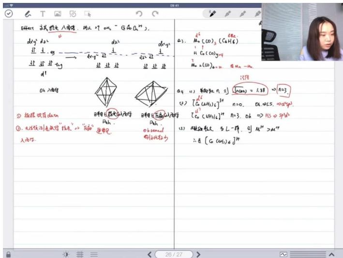

text_image

Effect: 式式提光 入丙烯，例如 27 cm - ①(有 Cl₂⁺)，
d(g) d₂ → d₂ → d(g)
Ⅱ Ⅰ. g → Ⅱ d(g) Ⅱ Ⅰ
Ⅲ Ⅳ Ⅴ. g → Ⅵ d(g) Ⅱ Ⅰ
d! 
OH 入丙烯

① 报提丙烷 (CH₃)
② 无氧烷测试的“热”气泡“热”
入丙烯。

d² = d₁ + d₀

d³ = d₂ + d₁

d⁴ = d₃ + d₂

③ 阻碳数为 L-异, ④ M⁺¹ > M⁻¹

∴ ⑤ [C(CH₃)₆]⁺

⑥ (1) 钢酸铵为 L-异, ⑦ M⁺¹ > M⁻¹

⑧ (2) [C(CH₃)₆]⁺

⑨ (3) [C(CH₃)₄]⁺

⑩ (4) [C(CH₃)₃]⁺

⑪ (5) [C(CH₃)₂]⁺

⑫ (6) [C(CH₃)₁]⁺

⑬ (7) [C(CH₃)₂]⁺

⑭ (8) [C(CH₃)₁]⁺

⑮ (9) [C(CH₃)₂]⁺

⑯ (10) [C(CH₃)₁]⁺

⑰ (11) [C(CH₃)₂]⁺

⑱ (12) [C(CH₃)₁]⁺

⑲ (13) [C(CH₃)₂]⁺

⑳ (14) [C(CH₃)₁]⁺

⑴ (15) [C(CH₃)₂]⁺

⑵ (16) [C(CH₃)₁]⁺

⑶ (17) [C(CH₃)₂]⁺

⑷ (18) [C(CH₃)₁]⁺

⑧ (19) [C(CH₃)₂]⁺

⑨ (20) [C(CH₃)₁]⁺

⑩ (21) [C(CH₃)₂]⁺

⑪ (22) [C(CH₃)₁]⁺

⑫ (23) [C(CH₃)₂]⁺

⑬ (24) [C(CH₃)₁]⁺

⑭ (25) [C(CH₃)₂]⁺

⑮ (26) [C(CH₃)₁]⁺

⑯ (27) [C(CH₃)₂]⁺

⑰ (28) [C(CH₃)₁]⁺

⑱ (29) [C(CH₃)₂]⁺

⑲ (30) [C(CH₃)₁]⁺

⑳ (31) [C(CH₃)₂]⁺

⑴ (32) [C(CH₃)₁]⁺

⑵ (33) [C(CH₃)₂]⁺

⑶ (34) [C(CH₃)₁]⁺

⑷ (35) [C(CH₃)₂]⁺

⑧ (36) [C(CH₃)₁]⁺

⑨ (37) [C(CH₃)₂]⁺

⑩ (38) [C(CH₃)₁]⁺

⑪ (39) [C(CH₃)₂]⁺

⑫ (40) [C(CH₃)₁]⁺

⑬ (41) [C(CH₃)₂]⁺

⑭ (42) [C(CH₃)₁]⁺

⑮ (43) [C(CH₃)₂]⁺

⑯ (44) [C(CH₃)₁]⁺

⑰ (45) [C(CH₃)₂]⁺

⑱ (46) [C(CH₃)₁]⁺

⑲ (47) [C(CH₃)₂]⁺

⑳ (48) [C(CH₃)₁]⁺

㉑ (49) [C(CH₃)₂]⁺

㉒ (50) [C(CH₃)₁]⁺

㉓ (51) [C(CH₃)₂]⁺

㉔ (52) [C(CH₃)₁]⁺

㉕ (53) [C(CH₃)₂]⁺

㉖ (54) [C(CH₃)₁]⁺

㉗ (55) [C(CH₃)₂]⁺

㉘ (56) [C(CH₃)₁]⁺

㉙ (57) [C(CH₃)₂]⁺

㉚ (58) [C(CH₃)₁]⁺

㉛ (59) [C(CH₃)₂]⁺

㉜ (60) [C(CH₃)₁]⁺

㉝ (61) [C(CH₃)₂]⁺

㉞ (62) [C(CH₃)₁]⁺

㉟ (63) [C(CH₃)₂]⁺

㉳ (64) [C(CH₃)₁]⁺

㉴ (65) [C(CH₃)₂]⁺

㉵ (66) [C(CH₃)₁]⁺

㉶ (67) [C(CH₃)₂]⁺

㉷ (68) [C(CH₃)₁]⁺

㉸ (69) [C(CH₃)₂]⁺

㉹ (70) [C(CH₃)₁]⁺

㉺ (71) [C(CH₃)₂]⁺

㉙ (72) [C(CH₃)₁]⁺

㉚ (73) [C(CH₃)₂]⁺

㉛ (74) [C(CH₃)₁]⁺

㉜ (75) [C(CH₃)₂]⁺

㉝ (76) [C(CH₃)₁]⁺

㉞ (77) [C(CH₃)₂]⁺

㉟ (78) [C(CH₃)₁]⁺

㉳ (79) [C(CH₃)₂]⁺

㉴ (80) [C(CH₃)₁]⁺

㉵ (81) [C(CH₃)₂]⁺

㉜ (82) [C(CH₃)₁]⁺

# ● 构型影响:

○ 八面体场：d轨道分裂为 $e_{g}$ （ $d_{x^{2}-y^{2}}$ ， $d_{z^{2}}$ ）和 $t_{2g}$ （ $d_{xy}$ ， $d_{xz}$ ， $d_{yz}$ ）两组  
- 分裂能大小: $\Delta_{oct}$ 表示八面体场分裂能

# ● 自旋状态判断:

○ 高自旋(HS): $\Delta < P$ (电子成对能)  
○ 低自旋(LS): $\Delta > P$   
○ 主要影响 $d^{4}\sim d^{7}$ 电子构型配合物

# 5）软硬酸碱理论

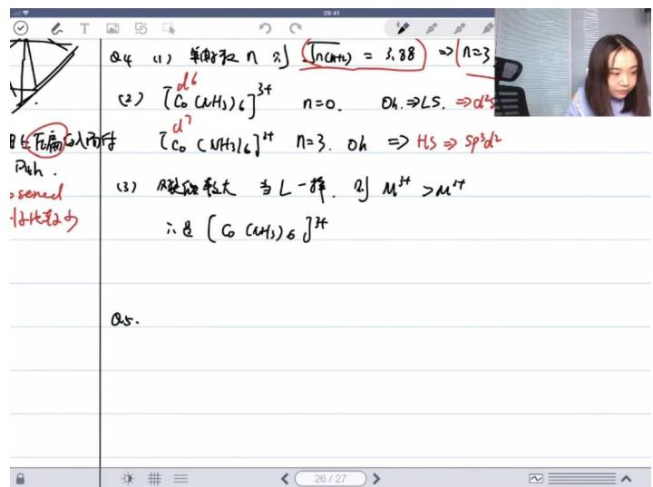

text_image

Q4 (1) 单轴和 n 则 \( \sqrt{n(a+1)} = 3.88 \Rightarrow n=3 \)
(2) \( [C_0(aH_3)_6]^{3+} \quad n=0. \quad OH \Rightarrow LS \Rightarrow d^2s \)
\( [C_0(aH_3)_6]^{4+} \quad n=3. \quad OH \Rightarrow HS \Rightarrow Sp^3d^2 \)
(3) 船裂较大 当 L一样, 则 \( M^{4+} > M^{4+} \)
∴是 \( [C_0(aH_3)_6]^{2+} \)
Q5.

●   
● 硬酸: 小尺寸、高电荷、不易极化（如 $H^{+}$ ， $Mg^{2+}$ ）  
● 软酸: 大尺寸、低电荷、易极化（如 $Cu^{+}$ ， $Hg^{2+}$ ）  
● 硬碱: 电负性高、不易给出电子（如 $F^{-}$ ， $H_{2}O$ ）  
● 软碱: 电负性低、易给出电子（如I $^{-}$ ，CN $^{-}$ ）

2. 例题：二价锰喜欢氨还是氢离子 01:17:26

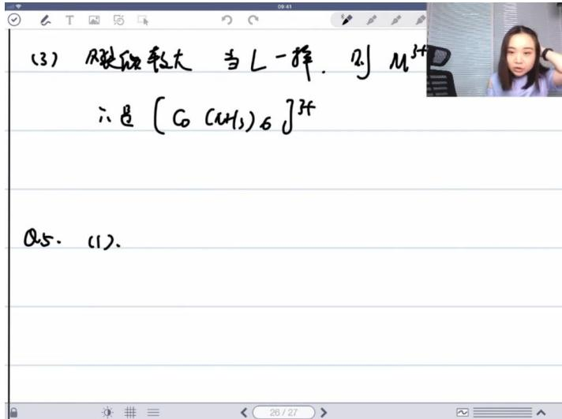

text_image

(3) 腰液较大 当L一样. 则M³⁺
    ∴ [C₀(CH₃)₆]³⁺
Q5. (1).

●   
● 配合物类型：比较四氨合锰 $\left(\left[Mn\left(NH_{3}\right)_{4}\right]^{2+}\right)$ 和四水合锰 $\left(\left[Mn\left(H_{2}O\right)_{4}\right]^{2+}\right)$ 的相对稳定性  
● 稳定性判断：

○ 二价锰离子 $(Mn^{2+})$ 属于边界酸，但更倾向于与硬碱配位

○ 氨 $(NH_{3})$ 是中等硬度碱，水 $(H_{2}O)$ 是典型硬碱

\- 结论： $Mn^{2+}$ 更倾向于与水配位，四水合锰更稳定

3. 例题：软硬酸碱离子构型预测 01:18:57

1）汞离子配合物

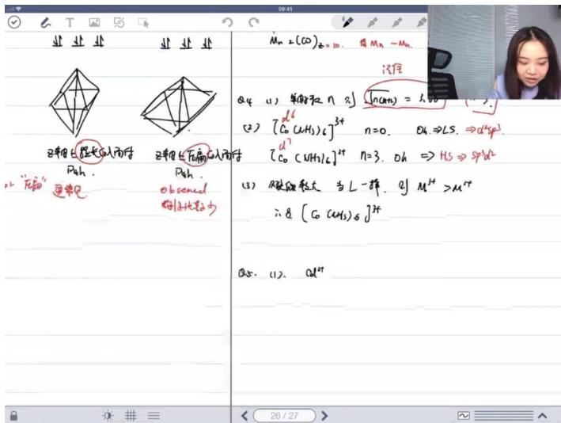

text_image

业 业 业
Mn=2(CO)2+10. 求 Mn-Mn.
注释
② (1) 铝和 N 点 [n(cm)=2.00 (1)
(2) [Co(CH3)6]3+n=0. OH⇒LS.⇒d²sp³
[Co(CH3)6]4+n=3. OH⇒HS⇒sp³s²
(3) 脱细较大 为 L 一样. 则 M4>M4
∴8 [Co(CH3)6]4
① (1). Q4

# ● 软酸特性：

- 汞(Ⅱ)离子( $Hg^{2+}$ )是典型软酸  
○ 易与软碱(如碘离子 $I^{-}$ )形成稳定配合物

# ● 构型预测：

- 不提供额外信息时，预测为 $sp^{3}$ 杂化  
○ 实际构型为直线型(如 $[HgI_{2}]$ )

# 2）银离子配合物

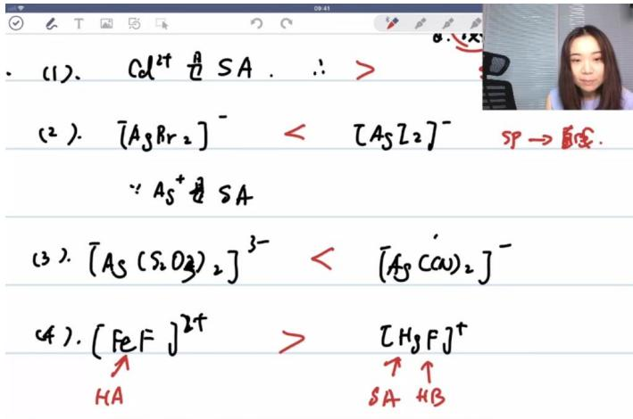

text_image

(1). \( \mathrm{Ca^{2+} \frac{H}{2} SA} \) . ∴ >
(2). \( [\mathrm{AgBr_2}]^- < [\mathrm{AsI_2}]^- \quad \mathrm{sp} \rightarrow \mathrm{固体}. \)
∵ \( \mathrm{As^+H_2SA} \)
(3). \( [\mathrm{As(S_2O_3)_2}]^{3-} < [\mathrm{Ag(Ca)}_2]^- \)
(4). \( [\mathrm{FeF}]^{2+} > [\mathrm{HgF}]^+ \)
HA
SA HB

# ● 软酸配位规律：

○ 银离子 $(Ag^{+})$ 是软酸(铜银金族，位于铜下方)  
- 与不同配体形成配合物的稳定性顺序:  
$[AsBr_{2}]^{-}>[As(S_{2}O_{3})_{2}]^{3-}$ (硫代硫酸根是较硬碱)   
■ 碘化银(AgI)溶解度小于溴化银(AgBr)

# - 典型构型：

○ 二配位时为直线型(sp杂化)  
○ 四配位时多为四面体 $sp^{3}$ 杂化

# 4. 例题：三价铁离子配位问题 01:23:31

text_image

无法预设后获得“拉长”或“后缀”更常见。
汤体.

$$
\begin{array}{l}{Q _ {1} \quad \left[ \mathrm{Fe} (\mathrm{H} _ {2} \mathrm{O}) _ {6} \right] ^ {3 +} + \cdot \mathrm{SCN} \rightarrow \left[ \mathrm{Fe} (\mathrm{SCN}) (\mathrm{H} _ {2} \mathrm{O}) _ {5} \right] ^ {2 +} + \mathrm{H} _ {2} \mathrm{O}}\\{\pm \mathrm{Fe} ^ {3 +} (\mathrm{BrC} _ {2} \text {   质   } S \text {   or   N }.}\end{array}
$$

26/27

\- 经典检验反应：

○ 三价铁离子 $(Fe^{3+})$ 与硫氰根 $(SCN^{-})$ 形成血红色配合物  
○ 反应式： $[Fe(H_{2}O)_{6}]^{3+} + SCN^{-} \rightarrow [Fe(SCN)(H_{2}O)_{5}]^{2+} + H_{2}O$

● 配位原子选择：

- 三价铁是硬酸，优先与硬碱配位  
- 硫氰根中氮是硬碱，硫是软碱   
○ 实际配位原子为氮(符合硬酸配硬碱原则)

5. 例题：普鲁士蓝配体判断 01:25:03

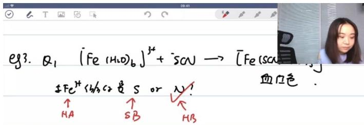

text_image

eg3. Q₁ [Fe(HiO)₆]³⁺ + SCN → [Fe(SCN)₃]
↑ ↑ ↓
Fe³⁺ (b/a)₂ δ S or N
HA SB HB

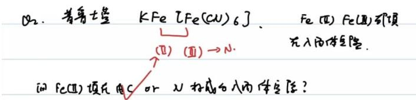

text_image

O₂. 着铬塔 KFe [Fe(CN)₆]、Fe(Ⅱ)Fe(Ⅲ)矿填充入丙体宝险.
(Ⅱ) (Ⅲ)→N.
(Ⅳ)Fe(Ⅲ)填充在AC或N构成的入丙体宝险？

26 / 27

\- 组成与结构：

○ 化学式: $KFe[Fe(CN)_{6}]$   
○ 包含 $Fe^{2+}$ 和 $Fe^{3+}$ 两种价态

● 配位规律：

○ 二价铁 $(Fe^{2+})$ 是较软酸，与碳配位  
○ 三价铁 $(Fe^{3+})$ 是硬酸，与氮配位  
- 晶体结构中： $Fe^{2+}$ 位于碳构成的八面体空隙， $Fe^{3+}$ 位于氮构成的八面体空隙

\- 经典案例：

- 完美体现软硬酸碱理论在实际配合物中的应用  
○ 配体场强差异导致不同价态铁离子的配位选择

# 三、同组和新组元素 01:35:25

1. 密度 01:36:15

● 密度特征：ds区元素（铜、银、金、锌、镉、汞）都是密度较大的金属，后过渡周期金属密度普遍在 $10g/cm^{3}$ 以上（水密度为 $1g/cm^{3}$ 作为对比）  
● 典型值：锂、钠等碱金属密度小于 $1g/cm^{3}$ ，而锌、镉、汞等ds区金属密度显著更高  
● 周期趋势：4-6周期过渡金属密度随周期增加而增大，汞是常温下唯一的液态金属

# 2. 硬度 01:38:30

<table><tr><td></td><td>Cu</td><td>As</td><td>Au</td><td>Zn</td></tr><tr><td>d(g·cm-3)</td><td>8.9</td><td>10.5</td><td>19.3</td><td>7.14 6.64 13.55.</td></tr><tr><td>(1mol)</td><td></td><td></td><td></td><td></td></tr><tr><td>Moh硬度.</td><td>3</td><td>2.97</td><td>2.5</td><td>2.5 2 -</td></tr></table>

27/31   
● 测试原理：采用莫氏硬度（1-10级），通过材料间相互刻划确定相对硬度  
- 硬度特征：  
○ 金：硬度很低（约2.5），纯金首饰可用手掰弯  
- 银：硬度略高于金（约2.7），但仍较软  
○ 铜：硬度更高（约3）  
- 汞：液态无硬度

● 应用实例：古代用咬金币验证真伪，因纯金软可留下牙印

# 3. 熔点 01:39:32

● 熔点特征：显著高于碱金属和碱土金属

● 原因:

○ 电子结构：d电子参与形成金属键（ $3d^{10}4s^{1}$ 或 $3d^{10}4s^{2}$ 构型）  
○ 轨道差异：3d和4s轨道能级差小于p和s轨道差，使d电子可参与成键

# 4. 单质性质 01:40:49

1）金的稳定性 01:41:42

● 化学惰性：金器稳定性极好，不易发生化学反应

● 文化应用：中国贵族传统偏好金器，因其贵重且稳定

2）银的杀菌效果与微溶性 01:42:09

● 杀菌机制：银原子可微量溶于水（10 $^{-7}$ 级别）具有杀菌效果

● 历史应用：欧洲贵族使用银器可能与此特性相关

3）银器发黑的原因 01:42:53

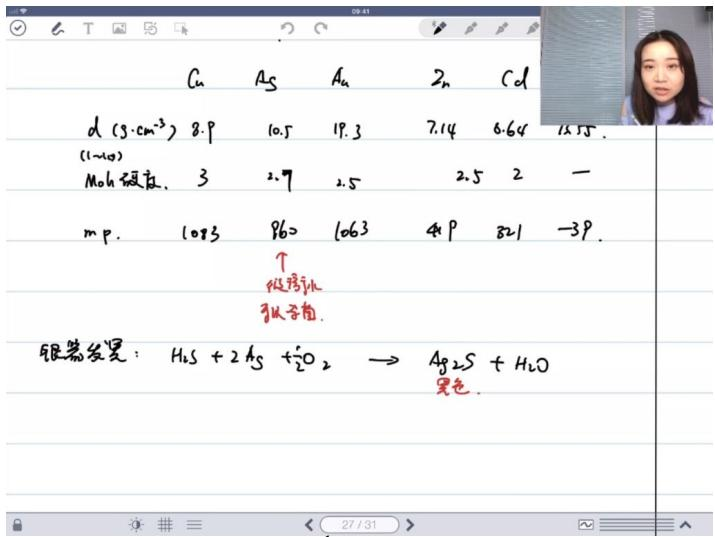

text_image

Cu A5 Au 2n Cd
d (s·cm-3) 8.9 10.5 19.3 7.14 6.64 12.55.
(1-10)
Moh 硬度. 3 2.9 2.5 2.5 2 -
mp. 1083 960 1063 419 821 -39.
↑
微弱孔
似弯曲.
银篇发黑： H₂S + 2 hS + 2O₂ → Ag₂S + H₂O
黑色.

● 反应机理： $2Ag + H_{2}S + \frac{1}{2}O_{2} \rightarrow Ag_{2}S + H_{2}O$   
● 现象：生成黑色硫化银导致银器变暗

4）银器清洁方法 01:43:51

\- 物理方法：

○ 小苏打（ $NaHCO_{3}$ ）糊状物摩擦  
◦ 牙膏打磨（优于砂纸，减少银损耗）

● 化学原理：实际是物理摩擦作用，非化学反应  
● 维护成本：专业银器需定期抛光保持光泽

5. 标准电极电势 01:47:04

text_image

小的文) NAC(03). → 15652 15652 打子有

2. 标准用电势1.

$$
\begin{array}{cccccc}
1 & K & C_{u} & C_{a} & Z_{n} \\
& -2.93 & 0.52 & -2.87 & -0.76.\\
3 & Rb & A_{o} & \end{array}
$$

1）为什么电极电势有显著差异 01:49:26

\- 横向对比（同周期碱金属vs ds区元素）：

○ 主要原因：

■ d轨道屏蔽效应弱   
■ 有效核电荷增加  
■ 升华焓差异（ds区金属升华需破坏更多金属键）

● 电势决定因素：

○ 固体→气态原子（升华焓）  
○ 气态原子→离子（电离能）  
○ 离子水合（水合能）

2）电极电势趋势 01:54:39

\- 纵向趋势（ds区元素自上而下）：

- 电极电势显著升高，还原性减弱  
○ 原因：

■ 镧系收缩效应  
■ s轨道钻穿效应增强   
■ 有效核电荷增加导致原子半径减小

# 6. 铜族元素化学

text_image

关键词：① 钢子钢条收缩.
② S轨迹#钻
顶子攀爬
有效核油释放↑

Part II 铜族

1. 关于Cu

酸性条件： $Cu^{2+}\xrightarrow{0.34}Cu^{+}\xrightarrow{0.52}Cu$

●   
● 稳定氧化态:

- 酸性条件下 $Cu^{2+}$ （+0.34V）比 $Cu^{+}$ （+0.52V）更稳定  
○ $Cu^{+}$ 易发生歧化反应： $2Cu^{+}\rightarrow Cu^{2+}+Cu$

# 7. 铜族 01:57:56

1）红铜的量化态和稳定性 01:59:37

● 正一价铜的稳定存在形式 01:59:39

text_image

Screenshot of a software interface with toolbars, color palette, and a person taking notes

Part II 铜族

1. 关于Cu

酸性条件： $Cu^{2+} \xrightarrow{0.34} Cu^{+} \xrightarrow{0.52} Cu$

$Q_{1}$ Cu(小粒)氢氧化氢量 $t_{1}$ or $t_{1}$ ?  
CuX. CuF
unstable.易被水
CuCl
2Kl $_{6}$ $^{-6}$ CuBr
2KlO $^{-9}$ CuI
1.1×10 $^{-12}$ K $_{89}$   
21. 线定性：升高. $\because Cu^{+}$ 是 $SA$ ，而 $I^{-}$ 是 $SB$ ， $P^{-}HB$ .  
$\textcircled{O}_{2}$ 预测 $\text{CuCN}$ $\text{CuSCN}$ 与 $\text{Cu(Cr)_{2}}$ 相交, $\text{Ca^{2+}}$ 相交, $\text{Ca^{2+}}$ 相交, $\text{Ca^{2+}}$ 相交, $\text{Ca^{2+}}$ 相交, $\text{Ca^{2+}}$ 相交, $\text{Ca^{2+}}$ 相交, $\text{Ca^{2+}}$ 相交, $\cdots$ , $\text{Na^{+}}$ 最大.

27/31

○ 电势关系： $Cu^{2+}$ 0.34VCu $^{+}$ 0.52VCu，显示Cu+易歧化为 $Cu^{2+}$ 和Cu  
- 稳定条件：需形成难溶盐（如卤化物）或配合物时才能稳定存在  
实例：红色卤化物（CuF、CuCl等）可稳定存在，其中CuF为红色，CuCl为白色

● 红铜卤化物的稳定性变化 02:00:15

- 稳定性规律：随卤素原子序数增加而升高（F<Cl<Br<I）  
- 原因： $\mathrm{Cu^{+}}$ 属于软酸，与软碱（ $\mathrm{I^{-}>Br^{-}>Cl^{-}>F^{-}}$ ）结合更稳定  
○ 特例：氟化亚铜极不稳定，因 $F^{-}$ 是硬碱

● 氟化亚铜的不稳定性原因 02:01:05

- 溶解性：易溶于水，空气中吸水后立即发生歧化  
- 热力学数据：Ksp(CuF)约 $10^{-6}$ 量级，显著大于其他卤化物

● 氢化亚铜、硫化亚铜与氯化亚铜的Ksp比较 02:02:20

<table><tr><td rowspan="2">②</td><td>K</td><td>Cu</td><td>Cu</td><td>Zn</td></tr><tr><td>-2B</td><td>0.52</td><td>-2.77</td><td>-0.74</td></tr><tr><td rowspan="2">③</td><td>Rb</td><td>d3</td><td>Sn</td><td>Cd</td></tr><tr><td>-1F</td><td>0.80</td><td>-2.91</td><td>-0.80</td></tr><tr><td rowspan="2">④</td><td>Cs</td><td>Aa</td><td>Ba</td><td>Hf</td></tr><tr><td>-1F</td><td>168</td><td>-2.71</td><td>0.365</td></tr><tr><td rowspan="13">植物：G、AsNa+Og+Na+Og+Fe+Fe+Fe+Fe+Fe+Fe+Fe+Fe+Fe+Fe+Fe+Fe+Fe+Fe+Fe+Fe+Fe+Fe+Fe+Fe+Fe+Fe+Fe+Fe+Fe+Fe+Fe+Fe+Fe+Fe+Fe+Fe+Fe+Fe+Fe+Fe+Fe+Fe+Fe+Fe+Fe+Fe+Fe+Fe+Fe+Fe+Fe+Fe+Fe+Fe+</td><td rowspan="13"></td><td rowspan="13"></td><td rowspan="13"></td><td rowspan="13"></td></tr><tr></tr><tr></tr><tr></tr><tr></tr><tr></tr><tr></tr><tr></tr><tr></tr><tr></tr><tr></tr><tr></tr><tr></tr><tr><td colspan="5">Pent互 阿同块</td></tr><tr><td colspan="5">1. 现子Ca.
配对称性：Ca&#x27;&#x27; + 0.18 → Ca&#x27; + 0.52 Ca</td></tr><tr><td colspan="5">①: Ca++性正向量 % 3/1 +1 ?</td></tr><tr><td>CaX CaF CaII CaM CaJ CaI CaJ CaIII CaIII CaIII CaIII CaIII CaIII CaIII CaIII CaIII CaIII CaIII CaIII CaIII CaIII CaIII CaIII CaIII CaIII CaIII CaIII CaIII CaIII CaIII CaIII CaIII CaIII CaIII CaIII CaIII CaIII CaIII CaIII CaIII CaIII CaIII CaIII CaIII CaIII CaIII CaIII CaIII CaIII CaIII CaIII CaIII CaIII CaIII CaIII CaIII CaIII Ca3H3H3H3H3H3H3H3H3H3H3H3H3H3H3H3H3H3H3H3H3H3H3H3H3H3H3H3H3H3H3H3H3H3H3H3H3H3H3H3H3H3H3H3H3H3H3H3H3H3H3 H3 H3 H3 H3 H3 H3 H3 H3 H3 H3 H3 H3 H3 H3 H3 H3 H3 H3 H3 H3 H3 H3 H3 H3 H3 H3 H3 H3 H3 H3 H3 H3 H3 H3 H3 H3 H3 H3 H3 H3 H3 H3 H3 H3 H3 H3 H3 H3 H3 H3H3 H3 H3 H3 H3 H3 H3 H3 H3 H3 H3 H3 H3 H3 H3 H3 H3 H3 H3 H3 H3 H3 H3 H3 H3 H3 H3 H3 H3 H3 H3 H3 H3 H3 H3 H3 H3 H3 H3 H3 H3 H3 H3 H3 H 10000000000000000000000000000000000000000000000000000000000000000000000000000000000000000000000000000 1 2 4 6 8 10 12 14 16 18 20 22 24 26 28 29 29 29 29 29 29 29 29 29 29 29 29 29 29 29 29 29 29 29 29 29 29 29 29 29 29 29 29 29 29 29 29 29 29</td><td></td><td></td><td></td><td></td></tr></table>

○ 具体数值：

CuCl: $2 \times 10^{-6}$   
CuBr: $2 \times 10^{-9}$   
CuCN: $1 \times 10^{-12}$

○ 溶解度顺序: CuCl > CuBr > CuCN   
- 原因：Cl $^{-}$ 的硬性较强，与Cu $^{+}$ 的反馈π键能力弱于CN $^{-}$

2）水和能 02:03:39

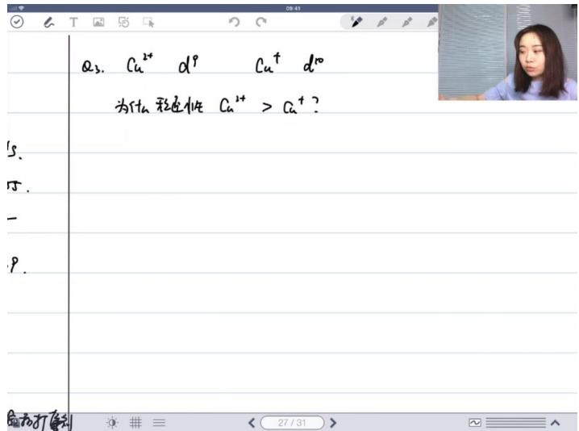

text_image

Q3. Cu²⁺ d⁹ Cu⁺ d¹⁰
为什么粒性Cu²⁺ > Cu⁺?
15.
15.
-
19.

● 固西打净利 ⚙️ ≡ ≡ < 27/31>
● 决定性因素：Cu $^{2+}$ 的水和能远大于Cu $^{+}$   
- 极化能力： $\mathrm{Cu}^{2+}$ （ $\mathrm{d}^{9}$ 构型）的极化能力显著强于 $\mathrm{Cu}^{+}$ （ $\mathrm{d}^{10}$ ）  
● 实验证据：标准电极电势显示 $Cu^{2+}/Cu(0.34V)<Cu^{+}/Cu(0.52V)$

3）应用案例 02:05:47

● 例题:二价铜与碘离子反应

text_image

23. Ca²⁺ d³⁰
为什么 稳定性 Ca²⁺ > Ca²⁺ ? 主因 H₂O 分离

4. 既然 $C{u}^{2 + }$ 增长性好于 $C{u}^{ - }$ . 设 ${Cu}$

$$
C u ^ {2 +} + 2 I ^ {-} \rightarrow C u I + \frac {1}{2} I _ {2}
$$

反应机理： $Cu^{2+} + 2I^{-} \rightarrow CuI + \frac{1}{2}I_{2}$ 反常现象：虽然 $Cu^{2+}$ 氧化性弱于 $Cu^{+}$ ，但反应仍可发生
关键原因：生成难溶CuI（ $Ksp=1\times10^{-12}$ ）大幅降低 $Cu^{+}$ 活度
配合物影响： $Cu^{+}$ 与 $I^{-}$ 形成稳定配合物（ $\beta\approx10^{30}$ ）

# 4）碘化亚铜用途 02:07:38

● 检测空气中的汞含量 02:08:00

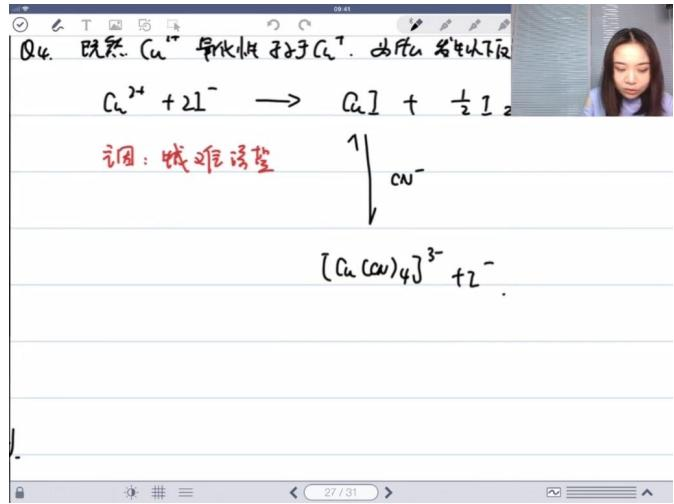

text_image

Q4. 既然 Cu²⁺ 异化快 子于 Cu²⁻。Cu²⁺ 发生以下反
Cu²⁺ + 2I⁻ → CuI + ½I₂
调：钱难渗透
[Cu(Cw)₄]³⁻ + 2⁻

反应式： $4CuI + Hg\rightarrow Cu_{2}HgI_{4} + 2Cu$   
- 灵敏度：可检测 $10^{-5}$ 量级汞浓度  
○ 颜色特征：CuI呈黄色， $Cu_{2}HgI_{4}$ 呈暗红色

\- 汞离子的构型判断 02:09:49

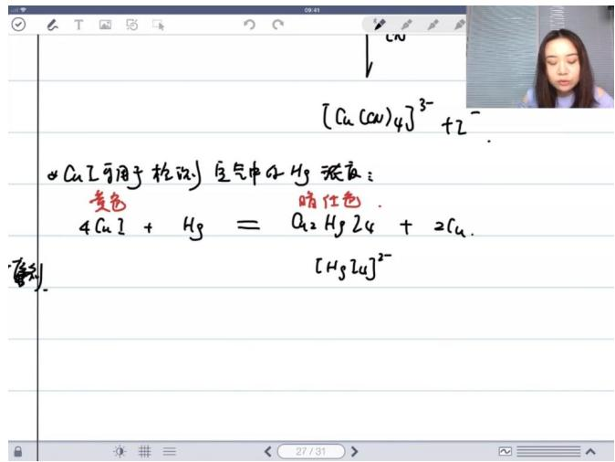

text_image

[Cu(Cu)4]3- + 2-
CuI可用于检测空气中CaHg浓度：
黄色
暗红色
4CuI + Hg = Ca2Hg24 + 2Cu.
[Hg]2-

O

○ 电子构型： $Hg^{2+}$ 为 $d^{10}$ 构型  
○ 空间构型： $[HgI_{4}]^{2-}$ 为 $sp^{3}$ 杂化的四面体结构

● 一价铜的稳定存在形式 02:11:52

○ 稳定途径：

■ 形成难溶盐（如CuI、CuCN等）  
■ 生成配合物（与 $NH_{3}$ 、卤素等配体）

○ 配体软硬度：软酸 $Cu^{+}$ 优先与软碱（ $I^{-}$ 、 $CN^{-}$ 等）结合

5）氧化铜颜色 02:12:46

● 氧化铜的颜色 02:12:50

○ 常温产物：铜在正常加热条件下生成黑色氧化铜（CuO）  
金属特性：红铜（金属铜）是第四周期过渡金属中少有的有颜色金属，呈现暗红色

\- 铜的颜色与性质 02:13:08

颜色特征：纯铜呈暗红色而非鲜红色，这是第四周期过渡金属需要掌握的特征颜色  
- 高温变化：当加热温度超过900℃时，会生成红色固体（氧化亚铜）

● 氧化亚铜的颜色与生成条件 02:13:39

- 外观描述：氧化亚铜（ $Cu_{2}O$ ）呈暗红色或红褐色  
- 反应条件：高温下铜与氧气反应生成氧化亚铜并放出氧气

● 二价铜离子的颜色与溶解性 02:14:01

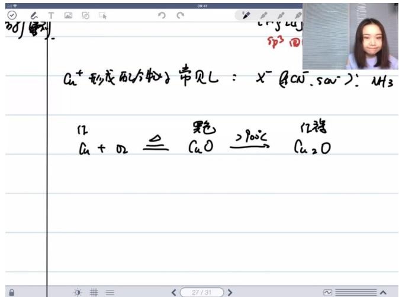

text_image

Cu⁺形成配合物₂ 常见L : X⁻(CaN⁻,SO₄⁻)₂: NH₃
12
Cu + O₂ ≌ 青色 >900℃ 亿得
CuO Cu₂O

酸性溶解：二价铜可溶于稀酸（不考虑酸的氧化性和配位性），形成蓝色的六水合铜离子 $[Cu(H_{2}O)_{6}]^{2+}$   
○ 构型特征：水合铜离子为畸变八面体构型（Jahn-Teller效应导致轴向拉长）

\- 铜离子的配位数与颜色变化 02:15:10

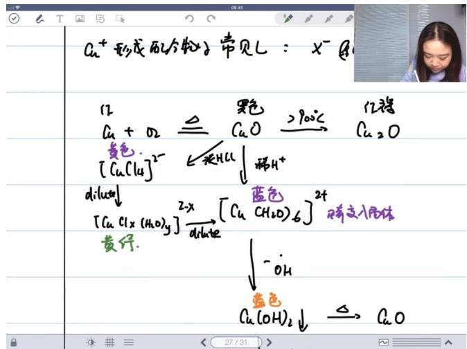

text_image

Cu+形成配冷粒子 常见L : x- @-
12
Cu + O2 → [CuCl4]2- → [CuO]2- → [Cu2O]
黄色.
[CuCl4]2- ←→ HCl↓ 稀H+
diluca↓
[CuClx(H2O)3y]2-x → [CuCH2O)6]2-t 白色
yellow.
[CuClx(H2O)3y]2-x → [CuCH2O)6]2-t 碎交入固体
黄色
[Cu(OH)2]2- → CaO

# ○ ○ 浓盐酸反应：

■ 形成氯配位配合物，实际配位数不固定（3-6配位均可能）  
■ 常见4配位（平面四边形）和6配位（压扁四面体）

\- 稀释变化：浓溶液为黄色，稀释后变为黄绿色（黄色与蓝色的混合）

○ 碱处理：

■ 加碱生成蓝色氢氧化铜沉淀 $(Cu(OH)_{2})$   
■ 加热沉淀会转变为黑色氧化铜（CuO）

○ 氨水溶解：氢氧化铜溶于氨水形成深蓝色的四氨合铜离子 $[Cu(NH_{3})_{4}]^{2+}$

四氨合铜的颜色与构型 02:19:09

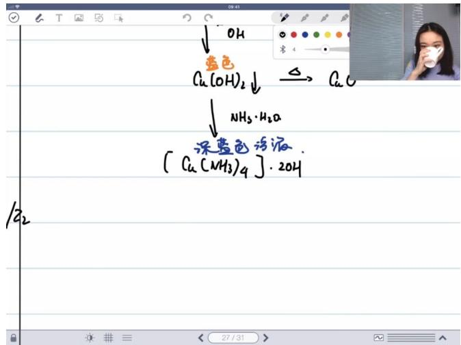

text_image

OH
蓝色
Cu(OH)₂↓ → CaO
↓ NH₃·H₂O
深蓝色溶液
[Cu(NH₃)₄]·20H
1/2

○ 溶液颜色：四氨合铜离子在水溶液中呈深蓝色  
○ 空间构型：平面四边形构型（水溶液中），无水环境下可能为畸变四面体  
- 溶解特性：二价铜盐大多可溶于水，能与卤素离子形成配合物但稳定性不高

● 波尔多液的制备与成分 02:22:04

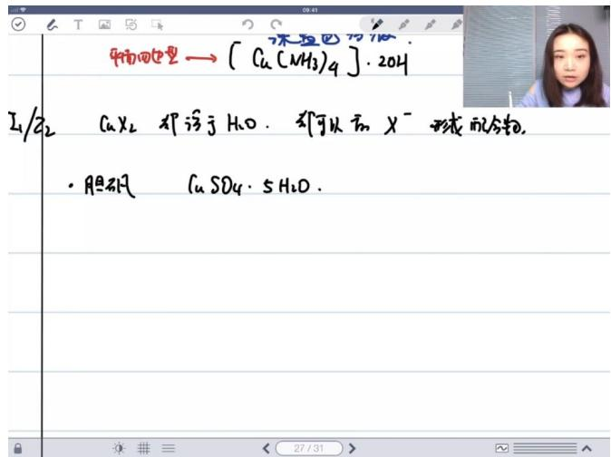

text_image

甲酚四边型 → [Cu(NH₃)₄]·20H
I₁/₂ CuX₂ 却溶于H₂O. 都可以为X⁻形成配合物。
· 胆研 CuSO₄·5H₂O.

○ 主要成分：胆矾（ $CuSO_{4} \cdot 5H_{2}O$ ）与氢氧化钙氨水反应制得  
○ 实际组成：氢氧化铜、硫酸钙和氢氧化钙的糊状混合物  
应用领域：农业上用于葡萄园的病虫害防治

● 二价铜的常见配体与配合物 02:22:48

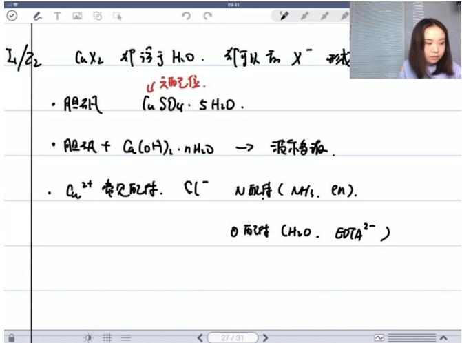

text_image

I₁/2₂ CaX₂ 抖溶于H₂O. 都可以在X⁻形式
• 胆研 CuSO₄·5H₂O.
• 胆研 + Ca(OH)₂·nH₂O → 波尔多斯。
• Cu²⁺ 常见配体. Cl⁻ N配体(NH₃, en).
① 配对(H₂O, GOTA²⁻)

配体类型：

■ 氮配体：氨（ $NH_{3}$ ）、乙二胺（en）等

■ 氧配体：水、EDTA等

■ 卤素配体：氯离子等

\- 酸碱特性：二价铜属于偏硬的Lewis酸，更易与氮、氧配位

\- 铜的二聚体与电子结构 02:24:20

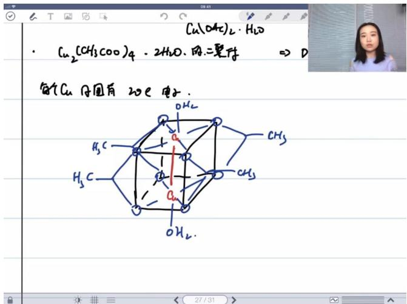

chemical

Chemical reaction diagram showing copper(II) oxide reacting with hydrogen peroxide to form copper, then water, and finally to form copper again.

典型实例：醋酸铜二聚体（ $Cu_{2}(CH_{3}COO)_{4}\cdot 2H_{2}O$ ）具有 $D_{4h}$ 对称性

# ○ 电子构型：

■ 每个铜原子周围有20个电子  
■ 含铜-铜金属键（d轨道特定重叠形成）

# ○ 结构特征：

四棱柱结构，铜原子位于中心  
■ 羧酸根桥连，上下各有一个水分子配位  
■ 金属键形成需要配体全重叠排列（非交叉式）

# ● 银和金的主要氧化价 02:33:07

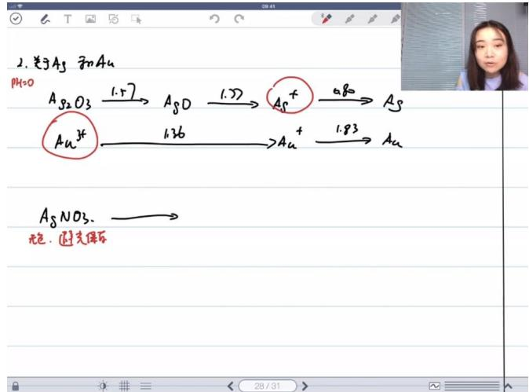

chemical

Chemical reaction diagram showing transformations of silver nitrate and arsenic compounds with rate constants

银的常见氧化态: 主要为正一价 $(Ag^{+})$ ，在酸性条件下稳定存在。

# ○ 金的氧化态特性:

■ 酸性条件下主要为正三价 $(Au^{3+})$   
■ 虽然金通常以单质（ $Au^{0}$ ）形式存在，因其还原性极弱  
■ 被氧化时更倾向于形成+3价而非+1价

# ◦ 实验室常见银化合物:

■ 硝酸银（ $AgNO_{3}$ ）为无色溶液，需避光保存于棕色瓶中   
■ 原因：一价银化合物（包括卤化银和硝酸银）均为光敏材料，遇光易分解

# - 卤化银的颜色与性质 02:37:16

# - 卤化银的显色特性

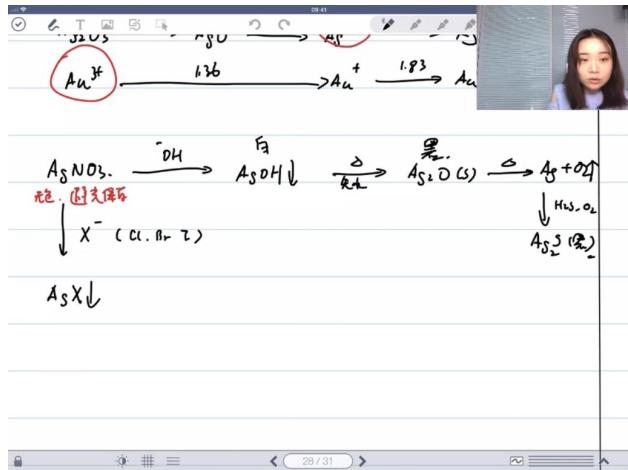

chemical

Chemical reaction diagram showing transformations of arsenic compounds with water and hydrogen under heating conditions

# 颜色梯度:

- 氯化银（AgCl）：白色沉淀  
- 溴化银（AgBr）：浅黄色沉淀  
- 碘化银（AgI）：黄色沉淀

■ 溶解度规律: 随卤素原子序数增大而依次递减 (Cl > Br > I)

# ○ 键长与可极化性

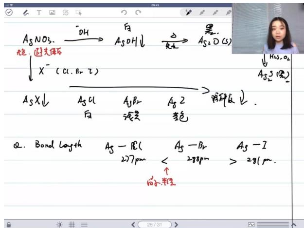

text_image

AsNO3.
无色.固光催化
↓X-(Cl,Br2)
AsX↓
AgCl
白
AgBr2
浅黄
Ag2
灰色>
Ag-Fe(277pm)
Ag-Br
< 288pm
Ag-I > 2g1pm.
↑
向小半量
Q. Bond Logth
Ag-Fe(277pm)
Ag-Br
Ag-I > 2g1pm.
28/31

# 键长数据:

- ${Ag} - {Cl} : {277}\mathrm{{pm}}$   
- $Ag - Br$ : 288pm   
- ${Ag} - I$ : 281pm

# ■ 键长异常现象:

- 溴化银键长 > 碘化银键长  
● 原因：碘负离子（ $I^{-}$ ）具有更强的可极化性，导致Ag-I键共价成分增加

■ 溶解特性：所有卤化银（包括最难溶的碘化银）均可溶于氰离子（ $CN^{-}$ ）溶液，形成 $[Ag(CN)_2]^{-}$ 配合物

● 金的溶解性与王水 02:40:13

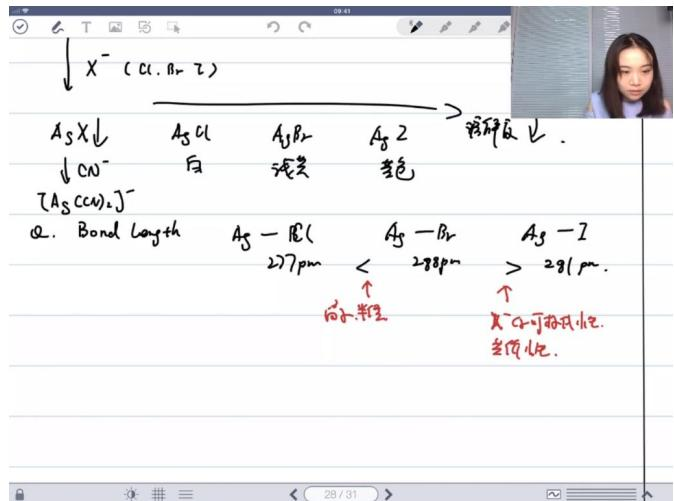

text_image

↓X⁻(Cl,Br)₂
AₛX↓	AgCl	AgBr	Ag2	> 碎碎反↓.
↓CN⁻	白	浅黄	橙色
[(As(CN)₂)]⁻
Q. Bond Length	Ag-Br(
277pm	<	288pm	> 281pm.
↑	↑
向下半径	X⁻-O不可抗化.
当前化.
28/31>

# ○ 溶解性对比:

■ 银可溶于浓硝酸，而金不溶   
■ 金仅溶于王水（浓硝酸+浓盐酸混合液）

# ○ 溶解机理:

■ 王水同时提供：  
● 硝酸的强氧化性（将 $Au^{0}$ 氧化为 $Au^{3+}$ ）  
- 氯离子的配位作用（形成 $[AuCl_4]^-$ 配合物）

○ 化学惰性体现: 金的特殊溶解条件充分证明其极强的化学惰性

● 锌和汞的还原性与氧化态 02:41:02

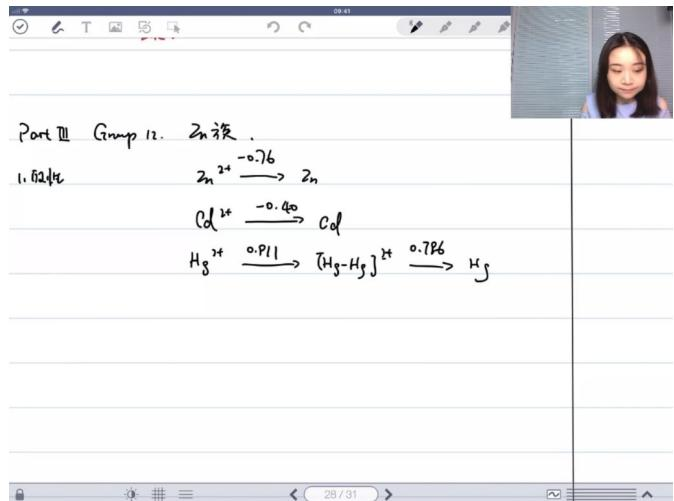

chemical

Chemical reaction equation involving zinc and hydrogen peroxide with rate constants and a photo of a person in a lab setting

还原性比较：锌 $(E^{\circ}=-0.76V)$ 和汞都是还原性较强的金属，汞的二聚体氧化态存在特殊性。

\- 汞的氧化态特性：

二价汞 $(Hg^{2+})$ 标准电极电势为 +0.911V，二聚一价汞 $([Hg-Hg]^{2+})$ 为 +0.786V，说明二价汞比一价汞氧化性强。  
■ 汞能稳定存在 $Hg_{2}^{2+}$ 离子的核心原因是 $6s^{2}$ 惰性电子对效应。

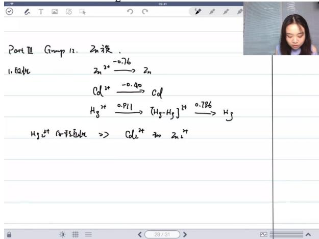

chemical

Chemical reaction equations involving zinc and hydrogen peroxide species, showing transformations with rate constants

○ 特殊存在形式：

锌和锰难以稳定存在二聚一价离子，而汞可以形成 $Hg_{2}^{2+}$ 。  
■ 惰性电子效应使汞能失去一个电子，剩余电子通过金属键保留。

\- 氢氧化物与硫化物的性质

○ 氢氧化物特性

■ 两性表现：锌和汞的氢氧化物均显两性，可溶于过量氢氧根溶液。  
■ 汞的特殊性：

- 汞(II)离子加碱直接生成氧化汞（非氢氧化物）  
- 氧化汞存在多晶型：黄色（受热分解为汞蒸气+氧气）和红色（天然朱砂形态）  
● 颜色差异源于固体形态条件，热分解熵变较小（ $\Delta S$ 小）

\- 硫化物性质

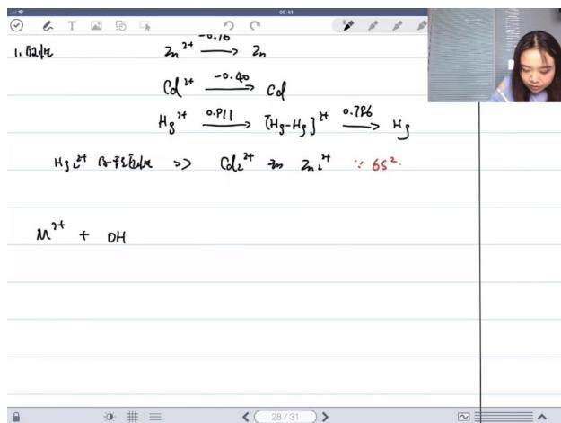

chemical

Chemical reaction equations involving cadmium, hydrogen, and sulfate with their transformations and molecular structures

# 溶解规律：

● 所有 $M^{2+}$ 硫化物均为难溶盐，Ksp从Zn到Hg递减（ZnS白→CdS黄→HgS黑/红）  
● 软碱理论： $S^{2-}$ 作为软碱，与软酸 $Hg^{2+}$ 结合力最强，故HgS溶解度最低

# ■ 特殊溶解行为：

● HgS可微量溶于浓Na₂S溶液（K=3.8）  
● ZnS可溶于过量NaOH，显示锌的亲氧性 > 亲硫性

# - 卤化物性质对比

# ○ 锌的卤化物

■ 溶解特性：所有锌卤化物均易溶于水（类似镁），如ZnCl₂溶解度达330g/100g水

■ 水解行为：加热时易水解（类似 $MgCl_{2}$ ），生成羟基氯化物

# - 汞的卤化物

■ 水解特性： $Hg^{2+}$ 极易水解，不存在水合 $Hg^{2+}$ 离子

# ■ 氟化物特殊性：

● HgF $_{2}$ 为离子型化合物（氟极化能力弱）  
● 遇水立即水解： $HgF_{2} + H_{2}O \rightarrow HgO + 2HF$

# ■ 其他卤化物：

● 溶解度：Cl > Br > I（依次降低）  
● 易升华，HgI $_{2}$ 为分子晶体（直线型SP杂化）

# - 配合物化学

# ○ 四卤合汞配合物

■ 构型转化： $[HgX_{4}]^{2-}$ 为四面体构型（ $Hg^{2+}$ 为 $d^{10}$ 电子构型）

# ■ 特殊性质：

- 钾盐可溶，与 $\mathrm{Ag^{+} / Cu^{+}}$ 形成导电性优异的盐（离子在框架中穿梭）  
- 奈斯勒试剂： $\mathrm{K}_{2}[\mathrm{HgI}_{4}] + \mathrm{KOH}$ 溶液，用于 $\mathrm{NH}_{4}^{+}$ 鉴定（生成红棕色沉淀）

# ○ 氨解反应机理

非氧化还原性：本质是复分解反应（水解+氨解）

$\left[HgI_{4}\right]^{2-} + 2OH^{-} + NH_{3} \rightarrow Hg_{2}NI \cdot H_{2}O + 3I^{-}$   
■ 电子计数：汞中心为14电子（10+2+2）

# - 一价汞化学

制备方法：HgCl₂与Hg搅拌制得Hg₂Cl₂（甘汞）

# ○ 分子构型：

■ 气态 $Hg_{2}Cl_{2}$ 为直线型（SP杂化）  
固态HgCl₂为四面体空隙填充结构（类似ZnCl₂）

# ● 配离子构型判断

# ○ 判断原则：

$[Cu(CN)_{4}]^{2-}$ ：变形四面体（CN $^{-}$ 配位能力强于H $_{2}$ O）  
■ $[Cu(NH_{3})_{4}]^{2+}$ ：平面正方形  
$[Cu(CN)_{3}]^{-}$ ：正四面体（取决于Cu的氧化态）

# ○ EDTA配合物：

■ $[Zn(EDTA)]^{2-}$ 为八面体 (SP $^{3}$ d $^{2}$ 杂化)  
■ 配位原子：EDTA $^{4-}$ 为4O+2N，EDTA $^{2-}$ 为4O

四、知识小结

<table><tr><td>知识点</td><td>核心内容</td><td>考试重点/易混淆点</td><td>难度系数</td></tr><tr><td>配合物基本知识</td><td>复习配合物的电子排布、晶体场理论(CFT)及稳定化能(CFSE)计算</td><td>姜泰勒效应(电子在简并轨道的不对称分布导致对称性降低)</td><td></td></tr><tr><td>晶体场理论(CFT)</td><td>八面体场(Δ0)和四面体场(Δt)的分裂能计算,高自旋(HS)与低自旋(LS)的判断</td><td>稳定化能最大条件( $d^{3}$ 、 $d^{8}$ 在八面体场; $d^{4}$ 在四面体场)</td><td></td></tr><tr><td>姜泰勒效应</td><td>电子在简并轨道的不对称分布导致结构畸变(如 $Cu^{2+}$ 的拉长/压扁八面体)</td><td>常见畸变体系( $d^{9}$ 、 $d^{7}$ 低自旋、 $d^{4}$ 高自旋)</td><td></td></tr><tr><td>水合能与晶格能</td><td>用CFSE解释第四周期二价离子水合能趋势(实际值&gt;预期值, $d^{0}/d^{5}/d^{10}$ 无CFSE贡献)</td><td>峰值对应电子数( $d^{3}$ 、 $d^{8}$ )</td><td></td></tr><tr><td>软硬酸碱理论</td><td>软酸( $Ag^{+}$ 、 $Hg^{2+}$ )偏好软碱( $S^{2-}$ 、 $I^{-}$ ),硬酸( $Fe^{3+}$ )偏好硬碱( $F^{-}$ 、 $O^{2-}$ )</td><td>经典案例:普鲁士蓝( $Fe^{3+}$ 配N, $Fe^{2+}$ 配C)</td><td>★★★</td></tr><tr><td>铜化学</td><td>一价铜(歧化倾向,需难溶盐/配合物稳定)与二价铜(八面体/平面四边形构型)</td><td>颜色变化( $[Cu(H_{2}O)_{6}]^{2+}$ 蓝→ $[CuCl_{4}]^{2-}$ 黄→ $[Cu(NH_{3})_{4}]^{2+}$ 深蓝)</td><td></td></tr><tr><td>银化学</td><td> $Ag^{+}$ 的光敏性( $AgNO_{3}$ 避光保存),卤化银溶解度( $AgI < AgBr < AgCl$ )及颜色</td><td>软硬酸碱应用( $Ag^{+}$ 与 $S^{2-}/I^{-}$ 强结合)</td><td></td></tr><tr><td>汞化学</td><td>二价汞(易水解, $HgX_{2}$ 分子线性构型)与一价汞( $Hg_{2}^{2+}$ 二聚体,惰性电子对效应)</td><td>奈斯勒试剂( $K_{2}[HgI_{4}]$ 鉴定 $NH_{4}^{+}$ )</td><td></td></tr><tr><td>锌化学</td><td> $Zn^{2+}$ ( $d^{10}$ ,四面体构型),卤化物易溶(如 $ZnCl_{2}$ 极溶于水)</td><td>两性氢氧化物( $Zn(OH)_{2}$ 溶于碱)</td><td></td></tr><tr><td>18电子规则</td><td>过渡金属配合物电子计数(如Mn2(CO)10含金属-金属键)</td><td>常见配体电子贡献(CO:2e-, C6H6:6e-)</td><td>★★★★</td></tr></table>