# 一、课程介绍00:10

# 1. 课程安排 00:12

● 学习顺序：质心化学直播课的正确学习顺序是暑秋寒春  
● 相关课程：国初考前专题串讲  
● 资源获取：可通过质心官网(www.eduzhixin.com)或官方微信(forum.eduzhixin.com)了解详情

# 2. 作业讲解 00:55

# 1）银镜反应

● 反应原理：硝酸银溶于氨水后与甲醛反应，甲醛作为还原剂将银离子还原为金属银  
● 实验现象：试管底部形成银亮的金属镜面  
● 产物特点：

○ 氧化产物为乙酸根  
○ 氨以水溶液形式存在，不写气体符号  
- 反应需要加热至沸腾

# 2）锌的两性性质

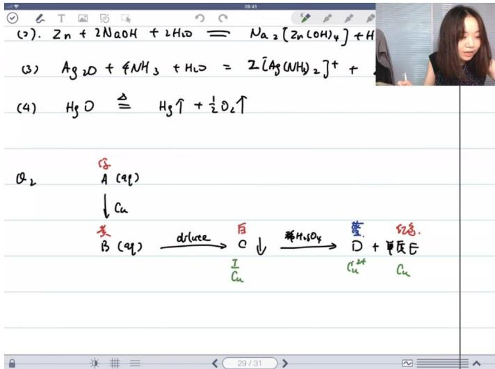

chemical

Chemical reaction equation involving silver and hydrogen peroxide, forming copper(II) oxide and hydrogen peroxide, with photo of a person observing the reaction.

29 / 31   
● 两性本质：阳离子极化能力过强导致氢氧化物/氧化物显示两性

\- 钛：两性偏碱性

○ 钒/铬/锰族：几乎为酸性氧化物

● 配位特点：锌通常形成四配位化合物  
● 固体结构：氢氧化物可视为氧化物水合物，实际为三维氧堆积结构

# 3）氢氧化银特性

● 制备方法：可由氧化银加水制得  
- 溶解性: 溶于氨水形成二氨合银离子 $[Ag(NH_3)_2]^+$   
● 结构特点：银通常形成二配位化合物

# 3. 结课考试说明 03:38

● 考试形式：线上选择题测试  
● 题目特点：

○ 偏重基础知识点  
- 主要考察元素结构特性  
- 难度适中，不设推断题

● 后续支持：结课后仍可在课程群讨论问题

# 二、过渡金属元素特性

# 1. 重点元素范围

● 核心元素：第四周期第一过渡系元素(钛、钒、铬、锰)  
- 次要元素：

- 第五、六周期元素考察较少  
- 铁系元素(铁、钴、镍)出现频率低   
- 稀土元素主要考察性质而非反应

2. 学习建议

● 刷题策略：

- 除真题外，刷题前建议咨询题目质量  
避免盲目刷题，注重学习进度安排

\- 记忆方法:

- 通过多遍阅读加深核心反应印象  
○ 理解反应本质而非死记硬背

# 三、铜化学专题

1. 铜离子颜色变化

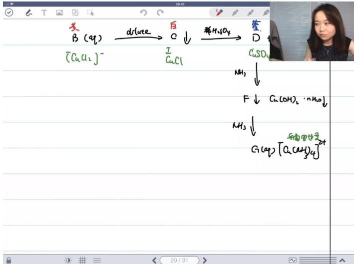

chemical

Chemical reaction pathway diagram showing transformations of B(aq) and [CuCl₂]⁻ with reagents like drilute, C, H₂SO₄, and CuSO₄

● 水合铜离子：蓝色溶液(特征颜色)  
- 氯配合物：

○ 四氯合铜 $[CuCl_{4}]^{2-}$ ：黄色  
○ 部分水合部分氯合：黄绿色

● 氨配合物：深蓝色溶液(平面四边形结构)

2. 铜的化学反应

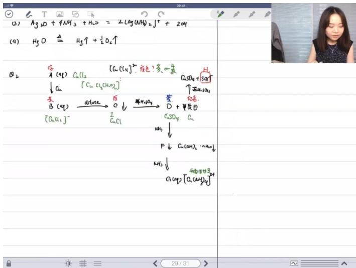

chemical

Chemical reaction equations and diagrams for silver (Ag₂O) and hydrogen (HgO) reactions with sulfuric acid and potassium sulfate, showing transformations and products.

# ● 与浓硫酸反应：

○ 生成硫酸铜和二氧化硫   
○ 反应式： $Cu + 2H_{2}SO_{4} \rightarrow CuSO_{4} + SO_{2} + 2H_{2}O$

# ● 与氨水反应：

○ 先形成蓝色氢氧化铜沉淀  
○ 过量氨水形成深蓝色四氨合铜 $[Cu(NH_{3})_{4}]^{\wedge}\{2+\}$

# 四、过渡金属元素概述 18:19

# 1. d区元素特性 18:27

● 元素范围: 包括Ti、V、Cr等第4-7族元素，位于周期表d区  
● 研究特点: 与主族元素不同，d区元素通常按周期分组研究（如铁钴镍一组）

# 2. 电离能趋势 19:48

- 横向规律：从左到右，d区元素第一、第二电离能（ $IE_{1}$ 和 $IE_{2}$ ）逐渐增大，失去电子能力减弱  
- 纵向对比: 同族元素中, 第四周期元素的金属性强于第五、六周期元素

# 3. 镧系收缩效应 20:55

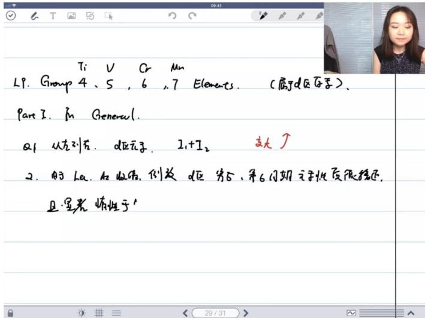

text_image

Ti V Cr Mn
L9. Group 4、5，6，7 Elements. (属于d区原子)
Part I. In General.
Q1 从左列右. d区元子. I₁+I₂ 又↑
2. 对La. As收敛. 倾效d区等5、第6周期元素性质限制描述，
且呈光矫性于'

# ● 核心影响:

○ 导致第五、六周期d区元素性质接近   
- 使后过渡元素单质密度显著增大（原子质量增加但半径增长缓慢）

# ● 具体表现:

○ 同族元素中，第五、六周期元素还原性弱于第四周期  
○ 后过渡金属（如铂系）呈现显著惰性

# 4. 离子半径规律 24:34

# 1）配位数影响

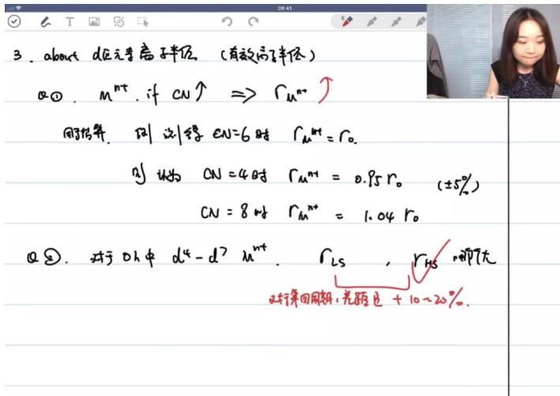

text_image

3. about d值元等高子半位 (有效高子半位)
a①. m^{n+}. if cn↑ ⇒ r_m^{n+}
的估算. 例2. 则得 cn=6 时 r_m^{n+} = r_0.
则认为 cn=4 时 r_m^{n+} = 0.95 r_0 (±5%)
CN=8 时 r_m^{n+} = 1.04 r_0
②③. 对于 OH 中 d^4-d^7 m^{n+}. r_LS, r_HS 哪7元
对行第四周期:光距是 +10~20%。

● 测量基准: 以六配位（CN=6）测得的半径 $r_{0}$ 为基准

○ 四配位半径： $0.95r_{0}$   
○ 八配位半径： $1.04r_{0}$

● 原理: 配位数越大，配体间排斥作用导致测得半径偏大

# 2）自旋状态影响

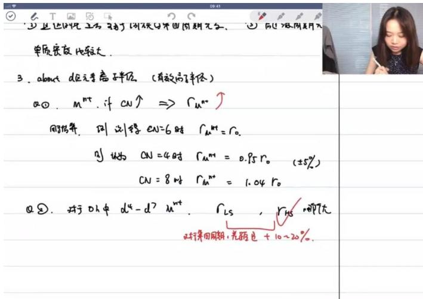

text_image

3. about d值元素离子半径 (有效的半径)
①. m^{n+}. if cN↑ ⇒ r_{M^n+}
的估算. 例: 测得 cN=6 时 r_M^{n+}=r_0.
则 cN=4 时 r_M^{n+}=0.95 r_0 (±5%)
cN=8 时 r_M^{n+}=1.04 r_0
②. 对于 d中 d^4-d^7 m^{n+}. r_LS, r_HS 哪7元
对行集回周期,光临差 +10-20%.

● 影响程度: 高低自旋造成的半径差异（10%-20%）远大于配位数影响（约5%）  
● 规律: 八面体场中, 高自旋态 $d^{4}-d^{7}$ 离子半径大于低自旋态  
● 测量精度: 单晶X射线衍射数据误差<1%，可准确区分自旋状态

# 3）氢氧化物性质

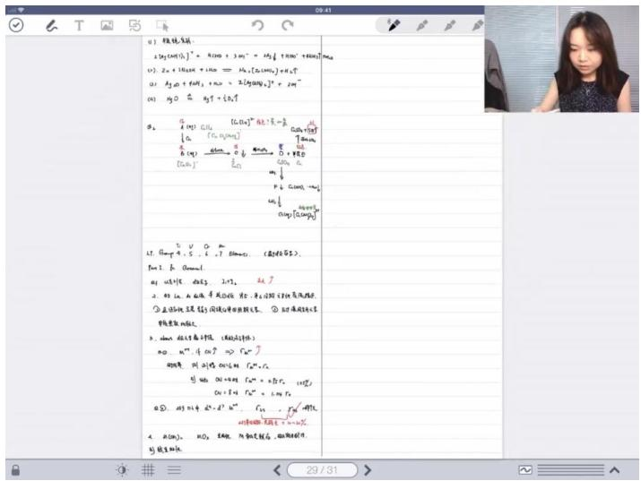

text_image

1) ① 玻璃基酸：
② ①(2HCOOH)₂ + ①(2HCO + 3)m⁻ = ①/2↓ + 4cm⁻ + 60cm⁻/mg
(1). ② + ①(2HCOOH)₂ + 10cm⁻ = ①/2↓ + 4cm⁻ + 60cm⁻↑
③ ② + ①(2HCOOH)₂ + 10cm⁻ = ①/2↓ + 4cm⁻ + 60cm⁻↑
(2). ③ (2HCOOH)₂ + ①/2↓ + 4cm⁻↑
④ ⑤ (2HCOOH)₂ + ①(2HCO + 3)m⁻ = ①/2↓ + 4cm⁻ + 60cm⁻↑
⑤ ⑥ (2HCOOH)₂ + ①(2HCO + 3)m⁻ = ①/2↓ + 4cm⁻ + 60cm⁻↑
⑦ ⑧ (2HCOOH)₂ + ①(2HCO + 3)m⁻ = ①/2↓ + 4cm⁻ + 60cm⁻↑
⑨ ⑩ (2HCOOH)₂ + ①(2HCO + 3)m⁻ = ①/2↓ + 4cm⁻ + 60cm⁻↑
⑪ ⑫ (2HCOOH)₂ + ①(2HCO + 3)m⁻ = ①/2↓ + 4cm⁻ + 60cm⁻↑
⑬ ⑭ (2HCOOH)₂ + ①(2HCO + 3)m⁻ = ①/2↓ + 4cm⁻ + 60cm⁻↑
⑭ ⑮ (2HCOOH)₂ + ①(2HCO + 3)m⁻ = ①/2↓ + 4cm⁻ + 60cm⁻↑
⑮ ⑯ (2HCOOH)₂ + ①(2HCO + 3)m⁻ = ①/2↓ + 4cm⁻ + 60cm⁻↑
⑰ ⑱ (2HCOOH)₂ + ①(2HCO + 3)m⁻ = ①/2↓ + 4cm⁻ + 60cm⁻↑
⑲ ⑳ (2HCOOH)₂ + ①(2HCO + 3)m⁻ = ①/2↓ + 4cm⁻ + 60cm⁻↑
㉟ ㉓ (2HCOOH)₂ + ①(2HCO + 3)m⁻ = ①/2↓ + 4cm⁻ + 60cm⁻↑
㉔ ㉕ (2HCOOH)₂ + ①(2HCO + 3)m⁻ = ①/2↓ + 4cm⁻ + 60cm⁻↑
㉖ ㉗ (2HCOOH)₂ + ①(2HCO + 3)m⁻ = ①/2↓ + 4cm⁻ + 60cm⁻↑
㉘ (2HCOOH)₂ + ①(2HCO + 3)m⁻ = ①/2↓ + 4cm⁻ + 60cm⁻↑
㉙ (2HCOOH)₂ + ①(2HCO + 3)m⁻ = ①/2↓ + 4cm⁻ + 60cm⁻↑
㉚ (2HCOOH)₂ + ①(2HCO + 3)m⁻ = ①/2↓ + 4cm⁻ + 60cm⁻↑
㉛ (2HCOOH)₂ + ①(2HCO + 3)m⁻ = ①/2↓ + 4cm⁻ + 60cm⁻↑
㉜ (2HCOOH)₂ + ①(2HCO + 3)m⁻ = ①/2↓ + 4cm⁻ + 60cm⁻↑
㉝ (2HCOOH)₂ + ①(2HCO + 3)m⁻ = ①/2↓ + 4cm⁻ + 60cm⁻↑
㉞ (2HCOOH)₂ + ①(2HCO + 3)m⁻ = ①/2↓ + 4cm⁻ + 60cm⁻↑
㉟ (2HCOOH)₂ + ①(2HCO + 3)m⁻ = ①/2↓ + 4cm⁻ + 60cm⁻↑
㉓ (2HCOOH)₂ + ①(2HCO + 3)m⁻ = ①/2↓ + 4cm⁻ + 60cm⁻↑
㉓ (2HCOOH)₂ + ①(2HCO + 3)m⁻ = ①/2↓ + 4cm⁻ + 60cm⁻↑
㉓ (2HCOOH)₂ + ①(2HCO - HBr)₂ - HBr₃ → HBr₄⁺ (CH₃)₂ (CH₃)₂ (CH₃)₂ (CH₃)₂ (CH₃)₂ (CH₃)₂ (CH₃)₂ (CH₃)₂ (CH₃)₂ (CH₃)₂ (CH₃)₂ (CH₃)₂ (CH₃)₂ (CH₃)₂ (CH₃)₂ (CH₃)₂ (CH₃)₂ (CH₆OCH₃)₂ → CH₆BrCH₃ (CH₃)₂ (CH₃)₂ (CH₃)₂ (CH₃)₂ (CH₃)₂ (CH₃)₂ (CH₃)₂ (CH₃)₂ (CH₃)₂ (CH₃)₂ (CH₃)₂ (CH₃)₂ (CH₃)₂ (CH₃)₂ (CH₃)₂ (CH₃)₂ (CH₅OCH₃)₂ → CH₅BrCH₃ (CH₃)₂ (CH₃)₂ (CH₃)₂ (CH₃)₂ (CH₃)₂ (CH₃)₂ (CH₃)₂ (CH₃)₂ (CH₃)₂ (CH₃)₂ (CH₅OCH₃)₂ → CH₅BrCH₃ (CH₃)₂ (CH₃)₂ (CH₃)₂ (CH₄OCH₃)₂ → CH₅BrCH₃ (CH₃)₂ (CH₃)₂ (CH₄OCH₃)₂ → CH₅OCH₃ (CH₃)₂ (CH₄OCH₃)(CH₃)-CH(CH₃)-CH(CH₄OCH₃)
1. R(OH), HCl, EtOH, NH, FeSO₄, HBr, CH₃, CH₄O, CH₃, CH₄O, CH₄O, CH₄O, CH₄O, CH₄O, CH₄O, CH₄O, CH₄O, CH₄O, CH₄O, CH₄O, CH₄O, CH₄O, CH₄O, CH₄O, CH₄O, CH₄O, CH₄O, CH₄O, CH₄O, CH₄S, CH₃, EtOH, EtBr, NH, FeSO₄, HBr, CH₃, CH₄O, CH₃, CH₄O, CH₄O, CH₄O, CH₄O, CH₄O, CH₄O, CH₄S, CH₃, EtOH, EtBr, NH, FeSO₄, HBr, CH₃, EtOH, EtBr, NH, FeSO₄, CH₃, EtOH, EtBr, NH, CH₄S, CH₃, EtOH, EtBr, NH, CH₄S, CH₃, EtOH, EtBr, NH

# - 两性特征:

\- 二价及以上氧化物/氢氧化物均显示不同程度两性
- 氧化态越高（≥+4），酸性越显著（如 $Zn(OH)_2$ 可溶于NaOH形成 $[Zn(OH)_4]^{2-}$ ）

\- 对比案例: $Mg(OH)_{2}$ 不溶于 $\mathrm{NaOH}$ , 显示主族与过渡金属差异

# 五、钛元素化学 32:48

# 1. 金红石结构 32:50

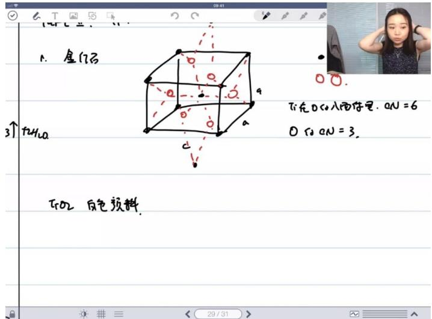

text_image

1. 非化石
3↑ +246a
T:在O<0入西守星，ON=6
O <0 ON=3。
T:O2 白色颜料。

● 晶系特征：属于四方晶系， $a = b \neq c$ ，所有角均为90度

● 堆积方式：钛原子作体心四方堆积（小黑球），氧原子（红球）填充空隙

# ● 配位数关系：

○ 每个钛原子处于氧八面体空隙中， $CN_{Ti}=6$   
○ 每个氧原子连接3个钛原子， $CN_{O}=3$   
○ 符合 $TiO_{2}$ 的1:2化学计量比

● 特殊结构：氧原子未填满所有四面体空隙，存在特殊排布方式

# 2. 二氧化钛性质 34:28

# 1）二氧化钛的晶体结构 34:40

● 矿物形态：天然存在为金红石矿石

结构稳定性：高温下通过碳还原获得 $TiCl_{4}$ 气体：

$\bullet$ $TiO_{2}(s) + C(s) + Cl_{2}(g)\rightarrow TiCl_{4}(g) + CO(g)$

# 2）钛与氧的配位数 37:20

● 配位验证：通过晶体结构分析确认：

○ 每个晶胞含2个钛原子和4个氧原子  
○ 氧原子位置需精确确定，存在特定空间排布

# 3）二氧化钛作为白色颜料的应用 37:56

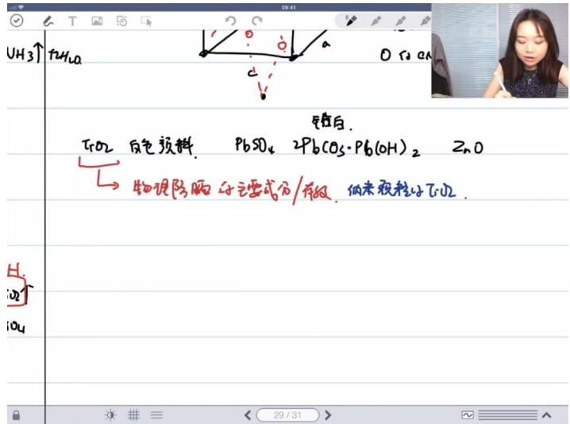

text_image

UH₃↑
t₂H₁₀
铅白.
t₂O₂ 反色颜料. PbSO₄ 2PbCO₃·Pb(OH)₂ ZnO
物膜防晒 少主要成分/有级. 纳来视粒子t₂O₂.
t₂O₂↑
t₂O₄

# - 历史应用：

○ 古埃及使用有毒的硫酸铅 $(PbSO_{4})$ 和铅白 $(2PbCO_{3}\cdot Pb(OH)_{2})$   
- 锌白(ZnO)为传统安全替代品

# - 现代优势：

○ 无毒无害  
○ 化学稳定性高  
- 遮盖力强

# 4）二氧化钛在防晒霜中的应用及工艺进步 39:17

# - 技术演变：

- 传统：微米级颗粒导致明显白色  
○ 现代：纳米级颗粒(<100nm)实现透明性

# ● 作用机理：

◦ 纳米颗粒使光直接透过而非反射  
- 保持紫外线防护效果  
- 提升使用体验

# 3. 纳米二氧化钛 41:07

# ● 特殊性质：粒径减小至纳米级时出现：

○ 透明外观   
- 表面效应增强  
- 可能的光催化活性变化

# 4. 钛的制备方法 41:26

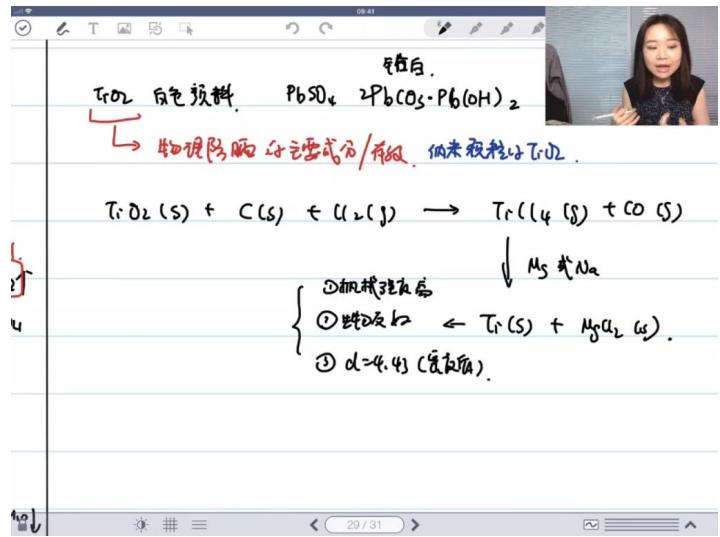

text_image

铅白.
TiO2 反色颜料. PbSO4 2PbCO3·Pb(OH)2
物理防晒子主要成分/有氧. 纳来视粒子TiO2.
Ti:O2(S) + C(S) + C(2)(j) → Tr((4S) + CO(S))
↓ Ms 或 Na
①机械强力离
②蚀碳反应 ← Tr(S) + MgCl2Cs.
③ d=4.43 (蛋白质).

# ● 冶炼步骤：

○ 氯化： $TiO_{2} + C + Cl_{2}$ 高温 $TiCl_{4} + CO$   
○ 还原： $TiCl_{4}(g)+2Mg(l)\rightarrow Ti(s)+2MgCl_{2}(s)$

# ● 工艺选择：

○ 镁还原优于钠还原（操作便利性）  
○ 需使用活泼金属还原（电极电势要求）

# 5. 钛的化学性质 43:44

# 1）钛在酸性条件下的反应 43:47

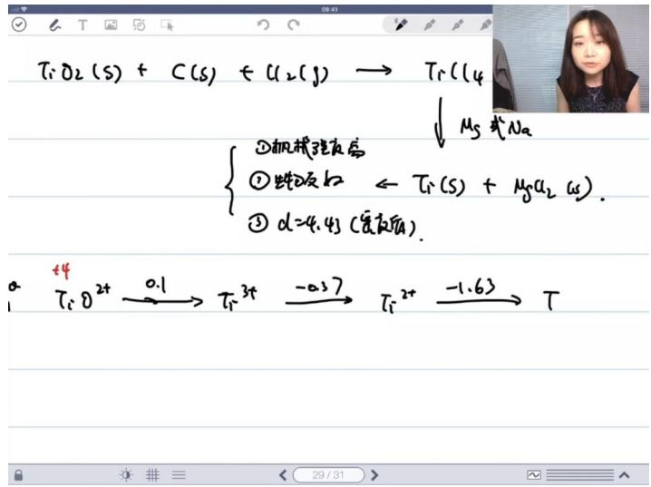

text_image

TiO2(S) + C(S) + Cu2(g) → Tr(I4)
↓ Ms 或 Na
{ ③机械理底高
  ①蜡碳比  ← Ti(S) + MgAl2(Cs).
  ③ d=4.43 (底底高).
# 4
Ti:O2+ → Ti-3+ → Ti-2+ → T
0.1
-0.37

# 电势序列：

- $Ti^{4+} + \theta \Rightarrow 1VTi^{3+} - 0.37VTi^{2+} - 1.63VTi$   
● 还原难度：需使用 $E^{\circ} < -2V$ 的还原剂（考虑超电势）

# 2）钛的氧化还原反应及电极电势 43:58

# - 活泼性矛盾：

- 热力学：钛非常活泼（负电极电势）  
◦ 动力学：表面钝化层阻碍反应

# 3）钛表面二氧化钛保护层的形成 44:40

# ● 保护机制：

- 致密 $TiO_{2}$ 层阻止进一步反应  
○ 常温下稳定

# ● 耐腐蚀性：

○ 不与 $O_{2}$ 、 $Cl_{2}$ 、冷酸反应

\- 可耐稀盐酸（需加热才反应）

# 4）钛与酸、碱的反应 45:30

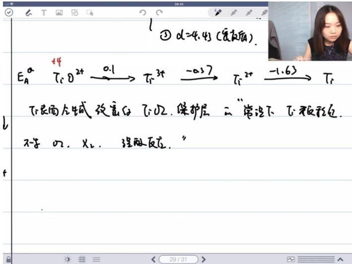

text_image

③ d=4.43 (氢反向)
Eₐ⁰ +4 TiO²⁺ → 0.1 → Ti³⁺ → -0.37 → Ti²⁺ → -1.63 → Ti
Ti↑良而合生成 改富的 Ti:O₂.保护层 的“常治下 Ti↑极反应.
不等 O₂，X₂，理酸反应。”

# 酸反应：

○ 热盐酸： $2Ti + 6HCl \xrightarrow{\Delta} 2TiCl_{3} + 3H_{2}\uparrow$   
○ 不反应：冷盐酸、硝酸（钝化）

# - 两性特征：可与强碱反应

# 5）钛离子的结构与颜色 46:41

# ● 水合离子：

○ $[Ti(H_{2}O)_{6}]^{3+}$ ：浅紫色  
○ 结构：畸变八面体（Jahn-Teller效应）

# ● 显色机理：d-d跃迁导致

# 6）钛离子的光谱性质与颜色解释 48:44

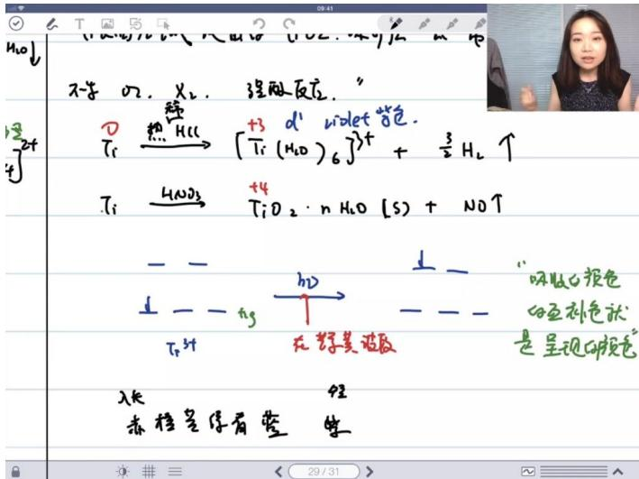

text_image

不等 02. x2. 硬酸反应."
O → [Ti(H2O)6]3+ + 3/2 H2↑
Ti → TiO2·nH2O (s) + NO↑
-- -- h2 -- --
d -- ng 在绿美硅反
“吸收心颜色
相互补色就
是呈现的颜色
水 赤橙呈绿青莹 毛

# 颜色理论：

- 吸收光与呈现色为互补色  
○ $Ti^{3+}$ 吸收黄绿光（\~500-600nm）

# ● 考试要点：

○ 需掌握互补色对应关系   
○ 红移/蓝移判断:

颜色变红→能隙减小   
颜色变蓝→能隙增大

# ● 实际限制：

○ 吸收波段预测困难

○ 实验测定最可靠   
- 考试中需按给定信息逻辑推导

# 6. 配合物颜色理论 53:37

# 1）颜色变化与跃迁能的关系 53:38

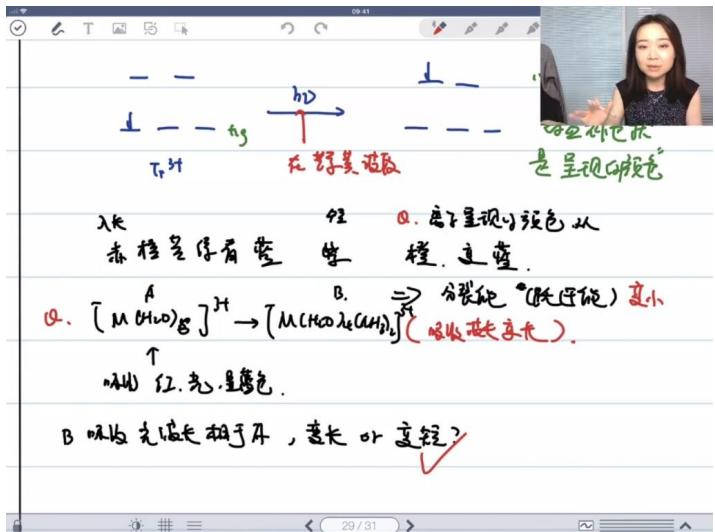

text_image

T₁
在绿美溶液
是呈现的颜色
λk
红
Q.离子呈现的颜色从
赤橙呈深青蓝
橙、迷蓝.
A
B.
⇒分裂能（既守能）变小
Q. [M(H₂O)₆]³⁺ → [M(H₂O)₆(AlH₄)₆]³⁻（吸收液长变化）.
↑
吸收红、光，显黄色.
B吸收光波长相于π，变长或变短？

●

- 跃迁能与颜色关系：当配体改变导致配合物颜色从橙变蓝时（如八面体配位中将水配体替换为其他配体），说明跃迁能减小。跃迁能直接对应光吸收的能量，与分裂能相关但不完全相同。  
- 实例分析：若离子a原为橙色，更换配体后变蓝，表明新配体使 $[M(m)_{4}(a + b)]^{3+}$ 的电子跃迁所需能量降低。

# 2）蓝移与红移的概念 54:47

● 蓝移现象：配合物呈现颜色向蓝色方向移动，对应吸收光波长变短（能量增高），如氨配体替换水配体时分裂能增大。  
- 红移现象：吸收波长变长（能量降低）时称为红移，此时配合物颜色会向红色互补色方向移动。需注意颜色预测具有不确定性，只能确定变动趋势。

# 3）分裂能变化对颜色的影响 55:16

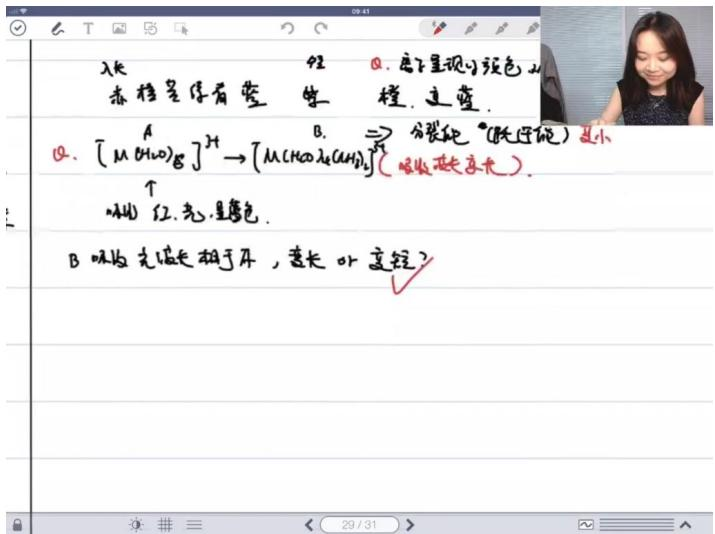

text_image

入水
赤桦呈绿青莹
A
[M (H2O)g]H→[M (HCO)2(OH)2]N(吸收光长)
B. 分裂电 (C氏子能) 小
↑
吸收 光长,是橙色.
B 吸收 光波长相于开,变长 or 变短?

●

● 能量关系：对于 $\left[M\left(H_{2}O\right)_{6}\right]^{3+}$ 这类配合物，当分裂能 $\Delta$ 减小时，吸收光波长变长（红移），呈现颜色会向蓝色变化。若分裂能增大（如 $H_{2}O\rightarrow NH_{3}$ ），则吸收波长变短（蓝移）。  
● 典型例子：六水合钛(III)离子因分裂能使其吸收区在黄绿色范围，导致呈现紫色。

# 4）配体与分裂能的关系 57:32

● 配体场强度：水是弱场配体，氨是中等强度配体。将两个 $H_{2}O$ 替换为两个 $NH_{3}$ 时，八面体场分裂能通常增大，导致吸收光能量增高（波长变短）。  
- 记忆要点：配体场强度顺序直接影响分裂能大小，进而决定颜色变化方向，但具体显色需通过互补色原理反推。

5）颜色预测的不确定性 58:02

\- 互补色原则：吸收光颜色与呈现颜色为互补色关系，例如吸收红光时显蓝色。但具体颜色可能对应多种互补色组合（如绿色互补色可能是紫色或橙色），因此只能确定变化趋势而非精确颜色。

6）经济场理论解释颜色 58:46

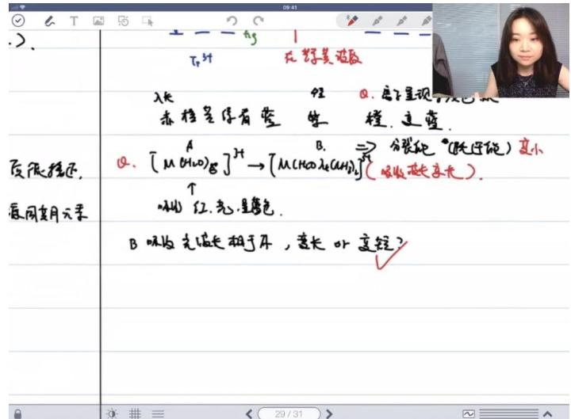

text_image

2、
T₄H⁺ 在绿黄斑段
λk 42 Q. 含子呈现青色斑
赤棕呈绿青蓝 槽. 过蓝.
质很摇还,
①. [MCH₂O]g]H → [MCH₂O]₂(CH₃)₄(吸收起来)
↓
B吸收光波长相于π，遗传或变短？
痕用朝元素
↑
红、光、显黄色.
B吸收光波长相于π，遗传或变短？

- 理论应用：经济场理论可解释六水合钛(III)离子的紫色现象——其分裂能使电子跃迁吸收黄绿色光，根据互补色原理呈现紫色。

7）钛的化学反应与颜色变化 59:15

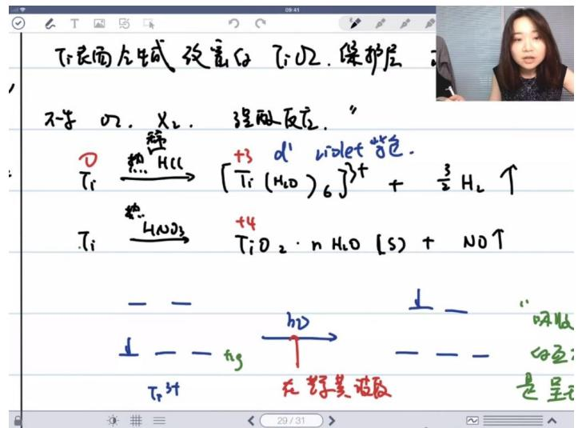

text_image

Ti表面生成式改密的 TiO2.保护层
不等 O2。X2. 程酸反应。
Ti 热 HCl → [Ti(H2O)6]3+ + 3/2H2↑
Ti 热 HNO3 → TiO2·nH2O (S) + NO↑
-- -- -- -- -- -- -- -- -- -- -- -- -- -- -- -- -- -- -- -- -- -- -- -- -- -- -- -- -- -- -- -- -- -- -- -- -- -- -- -- -- -- -- -- -- -- -- -- -- -- -- -- -- -- -- -- -- -- -- -- -- -- -- -- -- -- -- -- -- -- -- -- -- -- -- -- -- -- -- -- -- -- -- -- -- -- -- -- -- -- -- -- -- -- -- -- -- -- -- -- -- --
-- -- -- -- -- -- -- -- -- -- -- -- -- -- -- -- -- -- -- -- -- --
↓ - - - +g → hD → - - - - - - - - - - - - - - - - - - - - - - - - - - - - - - - - - - - - - - - - - - - - - - - - - - - - - - - - - - - - - - - - - - -
Ti3+ 在羟基设反 是呈

反应特性：

- 钛与热盐酸反应生成三价钛水合离子 $[Ti(H_2O)_6]^{3+}$ （紫色）  
- 与热硝酸反应生成 $TiO_{2}\cdot nH_{2}O$ （冷硝酸因钝化不反应）  
与氢氟酸反应生成八面体构型的 $[TiF_{6}]^{2-}$ ，这是四价钛的典型配合物

● 构型记忆：四氯化钛 $(TiCl_{4})$ 是最重要的钛化合物之一，其水解反应需特别注意。

# 六、钒元素化学01:00:50

1. 五氧化二钒 01:01:05

1）三价钛的氧化性 01:01:08

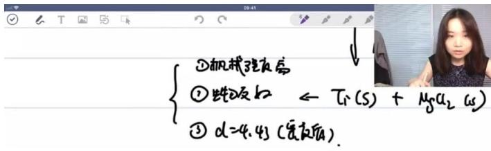

text_image

①机式理皮高
①蚀酸b2 ← Tr(S) + MgCu2Cs
③d=4.43(密度质a)

$$
\tau_{i} \theta^{2+} \xrightarrow{0.1} \tau_{i}^{3+} \xrightarrow{-0.37} \tau_{i}^{2+} \xrightarrow{-1.63} \tau_{i}
$$

良而生成 改密的飞J2.保护层的“常治下飞板移近.

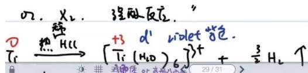

chemical

Chemical reaction diagram showing hydrogenation of trihydroxyethylene to form tetrahydroxyethylene and hydrogen gas

- 氧化倾向：三价钛 $(Ti^{3+})$ 在空气中极易被氧化为四价钛 $(Ti^{4+})$ ，标准电极电位为 $E^{\circ} = +0.1V (Ti^{3+} \rightarrow Ti^{4+})$   
- 稳定性对比：固体三氯化钛 $(TiCl_{3})$ 虽存在但易被氧气氧化，而四氯化钛 $(TiCl_{4})$ 具有重要工业应用价值

2）Ziegler-Natta催化剂 01:01:36

text_image

B吸收克波长相于牙，变长或变短？

\- Ziegler-Natta 催化烯烃聚合. ${T}_{1}{C}_{3} - A{E}_{t3}.$

- 基本组成：由三氯化钛 $(TiCl_{3})$ 和三乙基铝 $(AlEt_{3})$ 复合而成，工业上采用四氯化钛 $(TiCl_{4})$ 被三乙基铝原位还原制备

\- 反应特性：

○ 属于金属有机化合物催化反应，中间体不稳定难以分离  
○ 需通过核磁、红外等原位表征技术确认反应机理  
典型应用：烯烃聚合反应，如丙烯聚合

3）钛的配位化合物反应 01:04:12

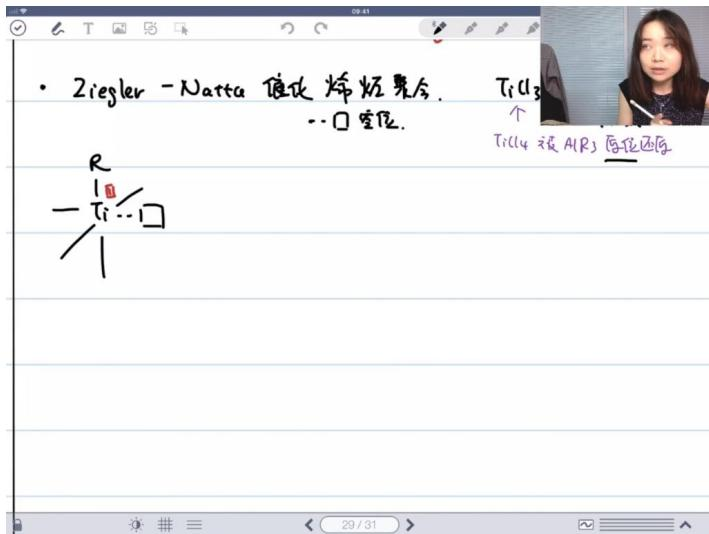

text_image

• Ziegler -Natta 催化 烯烃聚合. TiCl₃
…□ 空化. ↑
TiCl₄ 按 AIRs 每位还原
R
—Ti…□
/1

● 空位效应：三价钛 $(Ti^{3+})$ 保留一个空位作为反应活性位点，形成八面体配位环境

● 键合特征：

○ 形成钛-烷基σ键（活泼键，标记为红色）  
- 其余为配位键（相对稳定）

● 反应类型：主要包括配体吸附、插入反应（烷基迁移）、配体解离等基本反应类型

4）钛的催化机理 01:06:48

text_image

-R
I
II
III
IV
V
IX
Y
Z
VI
VII
VI
VIII
VII
VI
VII
VI
VIII
VI
VII
VI
VIII
VI
VII
VI
VIII
VI
VII
VI
VIII
VI
VII
VI
VIII
VI
VII
VI
VIII
VI
VII
VI
VIII
VI
VII
VI
VIII
VI
VII
VI
VIII
VI
VII
VI
VIII
VI
VII
VI
VII
VI
VIII
VI
VII
VI
VIII
VI
VII
VI
VIII
VI
VII
VI
VIII
VI
VII
VI
VIII
VI
VII
VI
VIII
VI
VII
VI
VIII
VI
VII
VI
VIII
VI
VII
VI
VIII
VI
VII
VIII
VI
VII
VI
VIII
VI
VII
VI
VIII
VI
VII
VI
VIII
VI
VII
VI
VIII
VI
VII
VI
VIII

29/31

\- 反应步骤:

- 吸附阶段：烯烃进入钛的空位活性位点  
插入反应：π键与钛-烷基σ键相互作用，发生烷基迁移  
○ 空位再生：形成新的钛-烷基键并再生空位，实现链增长

● 工业特点：属于异相催化剂（固体催化剂），反应机理研究受限

5）钛的其他常见反应 01:11:17

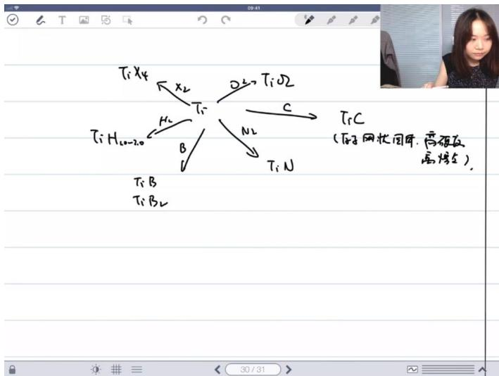

text_image

TiX4
x2
Ti
H2
TiH10-2.0
B
TiB
TiB2
O2→TiO2
C
N2
TiN
TrC
(原子网状团开, 高强反
高熔点)

# ● 与非金属反应：

○ 与氧气：生成二氧化钛 $(TiO_{2})$   
○ 与卤素：生成四卤化钛 $(TiX_{4})$   
○ 与氢气：形成填隙型氢化物（氢原子填入金属晶格空隙）

# ● 特殊化合物：

○ 与硼：生成硼化钛 $(TiB_{2})$ ，具有高硬度、高熔点特性  
○ 与氮：生成三氯化二钛 $(Ti_{2}N_{3})$   
○ 与碳：形成网状结构的碳化钛

# 6）钛离子的存在形式 01:13:06

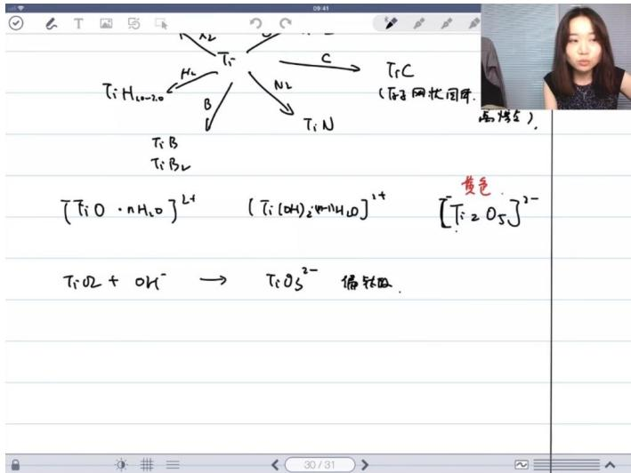

chemical

Chemical reaction diagram showing titanium hydroxide transformations with labeled species and products

# - 溶液状态：

四价钛 $(Ti^{4+})$ 在水溶液中强烈水解，不以自由离子形式存在  
○ 主要存在形式:

钛氧二正离子( $[TiO \cdot nH_{2}O]^{2+}$ )   
■ 五氧化二钛二负离子 $\left(\left[Ti_{2}O_{5}\right]^{2-}\right)$   
■ 偏钛酸( $H_{2}TiO_{3}$ )

# - 酸碱反应：

- 二氧化钛溶于碱： $TiO_{2} + 2OH^{-} \rightarrow TiO_{3}^{2-} + H_{2}O$   
○ 实际为多种水解产物的混合物，具体结构难以精确测定

# 7）五氧化二钒的化合价 01:17:51

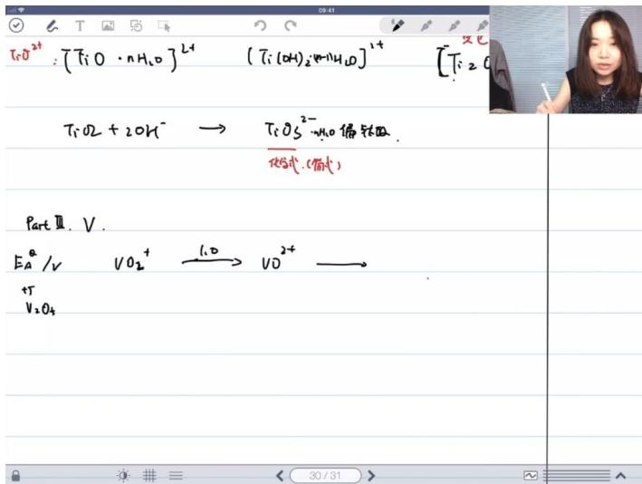

text_image

TiO2+ : [TiO·NH4O]2+ (Ti(OH)2OH-NH4O]2+ [Ti2O
TiO2 + 2OH- → TiOS2- NH4O 偏转器.
程式(简式)
Part II. V.
EA/V VO2+ I.D. VO2+ 
+T
V2O4

● 稳定价态：钒以+3和+5价为最稳定氧化态  
- 化学性质：

○ 五氧化二钒 $(V_{2}O_{5})$ 在酸性条件下具有中等强度氧化性

○ 二价钒 $(V^{2+})$ 还原性强且呈酸性

● 存在形式：酸性溶液中通常以钒氧基离子 $(VO^{2+})$ 形式存在

2. 钒的氧化物 01:19:02

1）钒的氧化物的颜色与性质 01:19:06

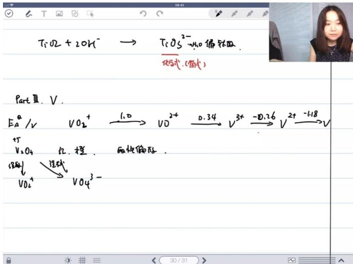

text_image

TiO2 + 2OH⁻ → TiO₃²⁻·H₂O 偏钴酸
化式 (微粒)
Part III. V.
E₀⁺/V VO₂⁺ I₂O → VO²⁺ D.34 V³⁺ -D.26 V²⁺ -1.18
+T
V₂O₄ 红.橙. 酸化偏酸 .
催化剂
VO₂⁺ 模板 VO₄³⁻

● 颜色特征：五氧化二钒 $(V_{2}O_{5})$ 固体呈现红色和橙色两种形态  
- 化学性质：具有两性偏酸性，既可与强酸反应生成 $VO_{2}^{+}$ 离子，又可与强碱反应生成 $VO_{4}^{3-}$ 离子

2）钒的氧化物的溶解性与离子颜色 01:19:20

\- 溶解反应：

- 酸性溶解：溶于强酸生成黄色的 $VO_{2}^{+}$ 离子  
碱性溶解：溶于强碱生成蓝色的 $VO_{2}^{+}$ 离子（但蓝色非特征色，推断题中需优先考虑铜离子）

● 颜色警示：绿色和紫色钒化合物颜色不常见，无需特别记忆

3）钒的还原性与钝化 01:20:25

● 还原特性：虽然标准还原电势显示钒可还原至+2价（ $E^{\circ} = -1.18V$ ），但常温下金属钒较惰性  
- 钝化现象：会形成致密氧化膜，可被浓硝酸、浓硫酸钝化，反应需在高温条件下进行  
4）高温下钒与不同物质的反应 01:21:05

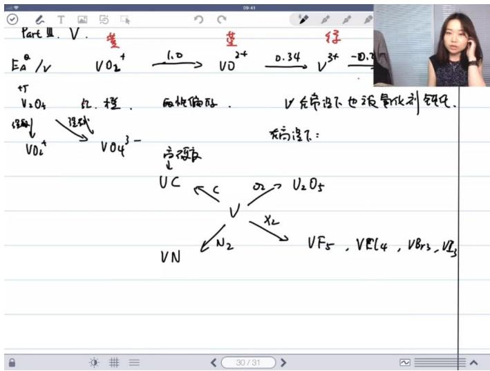

text_image

Part Ⅲ. V.
Ea/V
V2O4
V02+
红、橙、绿的偏酸。
V后常设下也设氧化剂镇化。
有高温下：
V2O4
V02+
V2O4-
V2O5
VN
N2
x2
vF5，VRL4，VBr3，VZ5
30/31>

# - 反应产物：

○ 氧气：生成五氧化二钒 $(V_{2}O_{5})$   
- 卤素：氟生成五氟化钒( $VF_{5}$ )，氯生成四氯化钒( $VCl_{4}$ )，溴/碘生成三价卤化物  
- 氮气/碳：均按1:1比例反应，生成高硬度材料

# 5）钒与碳的化合物特性 01:21:50

● 结构特点：碳原子取代金属晶格位置形成替代固溶体，非填隙模型  
● 材料特性：具有类似原子晶体的高硬度特征

# 3. 五氧化二钒制备 01:22:53

text_image

VC
C
O2
V
x2
VN
VF5 , VEL4

${v}_{1}{05}$ 制分：

① $V + O_{2} \rightarrow V_{2}O_{5}$

② $NH_{4} \stackrel{+5}{\underset{}{\vert}} VO_{3} \stackrel{\Delta}{\rightarrow} V_{2}O_{5} + NH_{3}\uparrow + H_{20}\uparrow$

常规制备： $V + O_{2} \rightarrow V_{2}O_{5}$ （高温下钒与氧气反应）  
● 特殊制备：钒酸铵 $(NH_{4}VO_{3})$ 加热分解： $NH_{4}VO_{3}\rightleftharpoons V_{2}O_{5}+NH_{3}\uparrow+H_{2}O\uparrow$   
- 反应特点：无氧化还原发生，钒保持+5价态  
- 记忆要点：该反应因不生成氮气而具有特殊性  
- 反应特点：无氧化还原发生，钒保持+5价态
- 记忆要点：该反应因不生成氮气而具有特殊性

# 4. 三氯氧钒水解 01:25:03

text_image

VN
N₂

${v}_{1}{05}$ 制分：

① $V + O_{2} \rightarrow V_{2}O_{5}$

③ $NH_{4}$ $\overset{+5}{\vee} O_{3}(s)$ $\xrightarrow{\Delta}$ $V_{2}O_{5} + NH_{3}\uparrow + H_{20}\uparrow$

③ $\ce{V_{2}O_{4}I_{3}} \xrightarrow{H_{2}O} V_{2}O_{5} + HCl.$

30/31   
● 水解产物：生成五氧化二钒和盐酸 $(VOCl_{3}+H_{2}O\rightarrow V_{2}O_{5}+HCl)$   
- 分子结构：三氯氧钒 $(VOCl_{3})$ 为四面体构型的液体化合物  
● 实验注意：需确认三氯氧钒的物理状态（液态）和结构特征

# 七、配合物异构现象 01:25:32

# 1. 八面体配合物 01:25:46

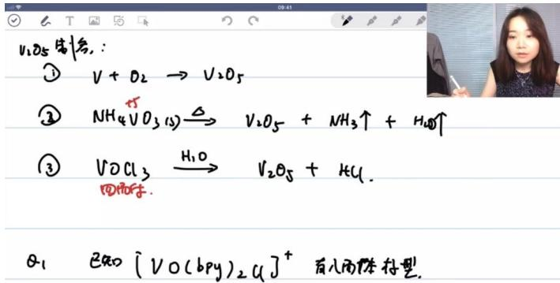

text_image

v₂O₅制备：
① V + O₂ → V₂O₅
② NH₄VO₃(3)→ V₂O₅ + NH₃↑ + H₄↑
③ VOCl₃ → V₂O₅ + HCl.
θ₁ 已知 [VOC(bpy)₂C]⁺ 有八两体转型。

# ● 制备反应:

○ 钒氧化反应: $V + O_{2} \rightarrow V_{2}O_{5}$   
○ 偏钒酸铵分解： $NH_{4}VO_{3}(S)\rightarrow V_{2}O_{5}+NH_{3}\uparrow+H_{2}O\uparrow$   
○ 五氧化二钒与盐酸反应： $V_{2}O_{5} + HCl \rightarrow VOCl_{3} + H_{2}O$

● 构型特征： $\left[VO(bpy)_{2}Cl\right]^{+}$ 配合物具有八面体构型

# 2. 例题: 异构体数量 01:27:51

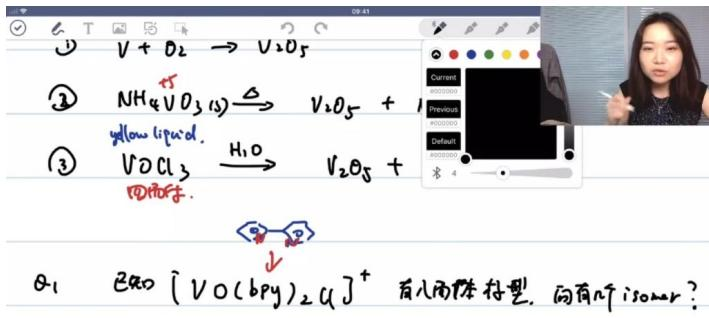

text_image

① V + O₂ → V₂O₅
② NH₄VO₃(3) → V₂O₅ + 1
③ yellow lipod.
VOC l₃ H₂O → V₂O₅ +
四面体.

Q₁ 已知 [VOC(bpy)₂C]⁺ 有八面体型，向有何isomer？

# ● 题目解析：

# 八、羰基配合物 01:28:17

# 1. 18电子规则 01:28:20

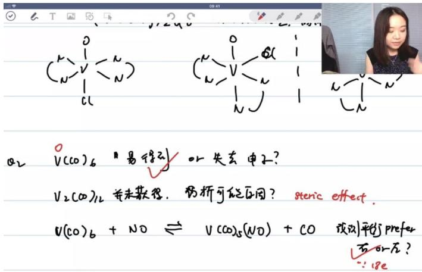

text_image

α₂ V(CO)₆ "易得到" or 失去电子?
V₂(CO)₁₂ 关未获得. 弱析可能应用? steric effect.
V(CO)₆ + NO ⇌ V(CO)₅(NO) + CO 试测平行j prefer
有或左?
":18e

# ●

# - 电子计数：

○ $V(CO)_{6}$ : 5 (V价电子) +12 (6CO) =17电子  
- 反应倾向：易得电子达到18电子稳定结构（被还原为负一价）

● 空间效应： $V_{2}(CO)_{1}$ 2未获制备的主要原因是空间位阻（steric effect）

# 2. 例题:平衡移动 01:30:24

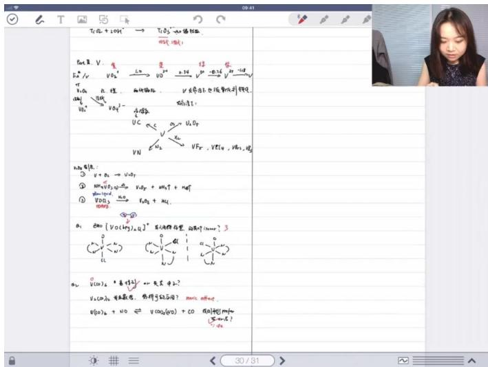

text_image

VCL + 10H → VCl₂ → VCl₂
→ (速度):
VCL = VCO₃⁻
→ VCl₂⁻
→ VCl₂⁺
→ VCl₂⁺
→ VCl₂⁺
→ VCl₂⁺
→ VCl₂⁺
→ VCl₂⁺
→ VCl₂⁺
→ VCl₂⁺
→ VCl₂⁺
→ VCl₂⁺
→ VCl₂⁺
→ VCl₂⁺
→ VCl₂⁺
→ VCl₂⁺
→ VCl₂⁺
→ VCl₂⁺
→ VCl₂⁺
→ VCI₀
→ VCI₀
→ VCI₀
→ VCI₀
→ VCI₀
→ VCI₀
→ VCI₀
→ VCI₀
→ VCI₀
→ VCI₀
→ VCI₀
→ VCI₀
→ VCI₀
→ VCI₀
→ VCI₀
→ VCI₀
→ VCI₀
→ VCI₀
→ VCI₀
→ VCI₀
→ VCI₁
→ VCI₁
→ VCI₁
→ VCI₁
→ VCI₁
→ VCI₁
→ VCI₁
→ VCI₁
→ VCI₁
→ VCI₁
→ VCI₁
→ VCI₁
→ VCI₁
→ VCI₁
→ VCI₁
→ VCI₁
→ VCI₁
→ VCI₁
→ VCI₁
→ VCI₁
→ VCI₂
→ VCI₂
→ VCI₂
→ VCI₂
→ VCI₂
→ VCI₂
→ VCI₂
→ VCI₂
→ VCI₂
→ VCI₂
→ VCI₂
→ VCI₂
→ VCI₂
→ VCI₂
→ VCI₂
→ VCI₂
→ VCI₂
→ VCI₂
→ VCI₂
→ VCI₂
→ VCI₃
→ VCI₃
→ VCI₃
→ VCI₃
→ VCI₃
→ VCI₃
→ VCI₃
→ VCI₃
→ VCI₃
→ VCI₃
→ VCI₃
→ VCI₃
→ VCI₄
→ VCI₄
→ VCI₄
→ VCI₄
→ VCI₄
→ VCI₄
→ VCI₄
→ VCI₄
→ VCI₅
→ VCI₅
→ VCI₅
→ VCI₅
→ VCI₅
→ VCI₅
→ VCI₅
→ VCI₅
→ VCI₆
→ VCI₆
→ VCI₆
→ VCI₆
→ VCI₆
→ VCI₆
→ VCI₇
→ VCI₇
→ VCI₇
→ VCI₇
→ VCI₇
→ VCI₇
→ VCI₈
→ VCI₈
→ VCI₈
→ VCI₈
→ VCI₈
→ VCI₈
→ VCI₈
→ VCI₉
→ VCI₉
→ VCI₉
→ VCI₉
→ VCI₉
→ VCI₉

# ● 题目解析：

平衡方向： $V(CO)_{6} + NO \rightleftharpoons V(CO)_{5}(NO) + CO$ 平衡向右移动

# ○ 配体特性：

■ NO可作为1、2或3电子给体  
■ 在18电子规则下，NO作为3电子给体（NO $^{+}$ 形式）  
■ 净效应：中性NO可提供1-4个电子

# ○ 配位方式：

■ 两电子给体时表现为NO⁺形式  
■ 三电子给体时先形成NO $^{+}$ 再接受反馈π键

# 九、过渡金属化学01:31:56

# 1. 铬的化学性质 01:32:00

# 1）铬的金属单质 01:32:21

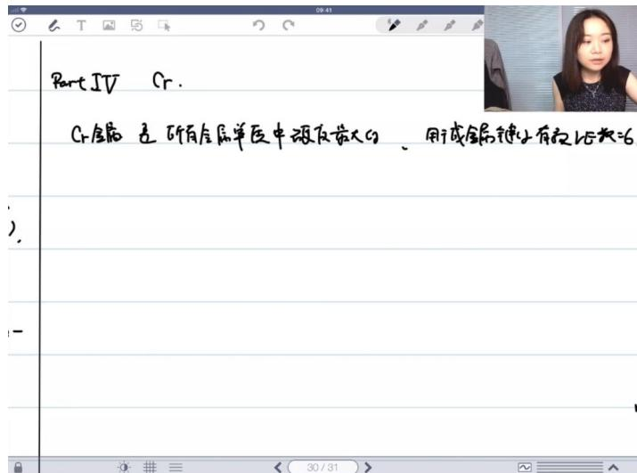

text_image

Part IV Cr.
Cr含量是所有含量单层中混反嵌入的，用成金属键以有效比6.5%=6.

硬度特性：在所有金属单质（不包括合金）中硬度最大  
- 价电子构型：具有 $3d^{5}4s^{1}$ 电子排布，有效价电子数为6个  
● 金属键强度：由于未成对电子多，金属键非常强，这是硬度大的主要原因

# 2）铬的价电子构型 01:32:53

● 电子排布：铬的基态电子构型为 $3d^{5}4s^{1}$ ，而非预期的 $3d^{4}4s^{2}$   
● 半满稳定性：d轨道半满状态 $d^{5}$ 具有特殊稳定性  
● 与锰比较：锰 $(3d^{5}4s^{2})$ 虽然单电子数多，但成对电子导致金属键较弱

# 3）铬的硬度特性 01:34:06

● 微观机制：硬度表现为抵抗表面原子错移的能力

● 堆积密度：原子排列越紧凑（密堆积），硬度越大  
● 晶格能：晶格能越大，破坏原子排列所需能量越高，硬度越大   
● 对比实例：碱金属因堆积疏松而硬度小

4）锰与铬的比较 01:35:01

● 电子数差异：锰有7个价电子（ $3d^{5}4s^{2}$ ），比铬多1个  
● 成对电子：锰的电子构型必然存在成对电子，降低金属键强度  
● 轨道能量：d轨道和s轨道能量接近是形成特殊电子构型的关键

5）铬的酸碱性转化 01:35:51

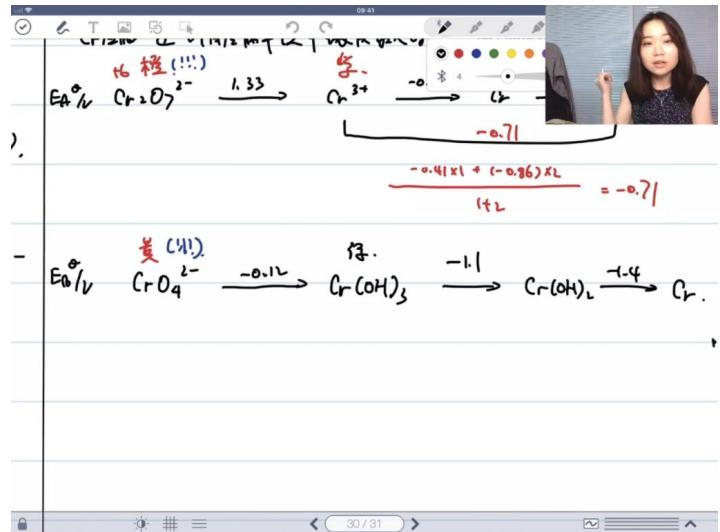

text_image

6橙(……)
Ea0% Cr2O72- 1.33
Cr3+ -0.71
-0.41×1 + (-0.86)×2 = -0.71
-Ea0% CrO42- -0.12
-0.1
Cr(OH)3 -1.1
Cr(OH)2 -1.4
Cr.

● 电位计算：三价铬 $(Cr^{3+})$ 的标准电极电位为 -0.71V （计算过程： $(-0.41\times1+ -0.86\times2)/3=-0.71$ ）

\- 存在形式:

- 酸性条件：主要以 $Cr^{3+}$ 存在  
- 碱性条件：主要以 $CrO_{4}^{2-}$ （铬酸根）存在

6）铬的颜色特征 01:38:03

\- 重要颜色：

○ 重铬酸钾 $(K_{2}Cr_{2}O_{7})$ ：橙色（特征色，必须记忆）  
○ 铬酸根 $(CrO_{4}^{2-})$ ：黄色  
○ 六水合铬离子 $\left(\left[Cr\left(H_{2}O\right)_{6}\right]^{3+}\right)$ ：紫色（实验室少见）

● 实际观察：高浓度硫酸溶液中常呈现深绿色  
● 颜色记忆技巧：高锰酸钾的深紫色可作为颜色强度参照

7）铬的实验室应用 01:39:11

● 常用试剂：

○ 重铬酸钾酸性溶液（由 $K_{2}Cr_{2}O_{7}$ 或 $CrO_{3}$ 加硫酸配制）  
- 选用钾盐原因：钠盐结晶水不确定，不制定量实验

● 颜色变化：溶液变绿表明 $Cr^{6+}$ 被还原为 $Cr^{3+}$ ，需重新配制  
● 注意事项：避免使用盐酸等还原性酸配制

8）铬酸根与重铬酸根 01:41:19

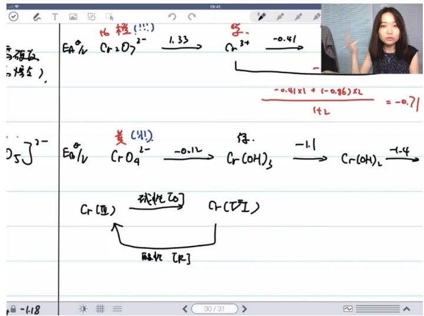

chemical

Chemical reaction equations and diagrams showing Cr(II) transformation with Cr2O7, Cr(OH)3, and Cr(OH)2 groups

# - 转化关系：

○ 碱性条件： $Cr^{3+}$ 氧化为 $CrO_{4}^{2-}$ （铬酸根）  
- 酸性条件: $Cr_{2}O_{7}^{2-}$ （重铬酸根）还原为 $Cr^{3+}$

# ● 电位数据：

○ $CrO_{4}^{2-} / Cr(OH)_{3}$ : -0.12V   
○ $Cr^{3+} / Cr: -1.18V$

# 9）铬的氧化还原反应 01:42:08

# - 典型反应：

○ 碱性氧化： $Cr^{3+}\rightarrow CrO_{4}^{2-}$   
○ 酸性还原： $Cr_{2}O_{7}^{2-}\rightarrow Cr^{3+}$

● 应用实例：检验酒精时利用重铬酸钾的橙色→绿色变化  
● 主要价态：+3和+6是最常用的氧化态

# 10）铬的配合物 01:44:21

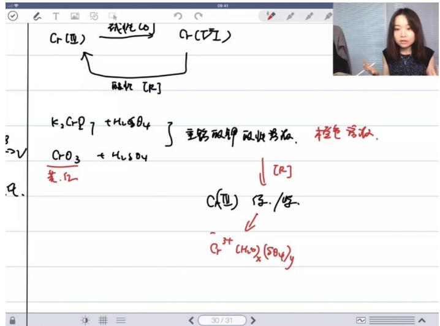

text_image

Cr(Ⅲ) 硫性CO₃ (T+I)
→
K₂CrP 7 + H₂SO₄
CrO₃ + H₂SO₄
差:±
C(Ⅲ) 3. /%
↓ [R]
Cr³⁺ (H₂O)ₓ(SO₄)ᵧ
30/31

- 颜色特征：三价铬离子 $(Cr^{3+})$ 在溶液中通常呈现深绿色，这是铬离子与水分子和硫酸根形成的配合物颜色。实验室中观察到溶液变绿往往标志着铬酸溶液失效。

还原反应: 酸性条件下重铬酸钾 $(K_{2}Cr_{2}O_{7})$ 与乙醇 $(C_{2}H_{5}OH)$ 反应时, 橙红色的 $Cr_{2}O_{7}^{2-}$ 被还原为绿色的 $Cr^{3+}$ , 同时乙醇被氧化为乙酸 $(CH_{3}COOH)$ , 反应方程式为:

$2Cr_{2}O_{7}^{2-} + 6H^{+} + 3CH_{3}CH_{2}OH \rightarrow 4Cr^{3+} + 3CH_{3}COOH + 3H_{2}O$   
● 实际应用：该反应被用于酒驾检测，通过呼气中乙醇使橙红色试剂变绿的现象判断酒精含量。

# 11）铬酸盐的难溶性 01:46:53

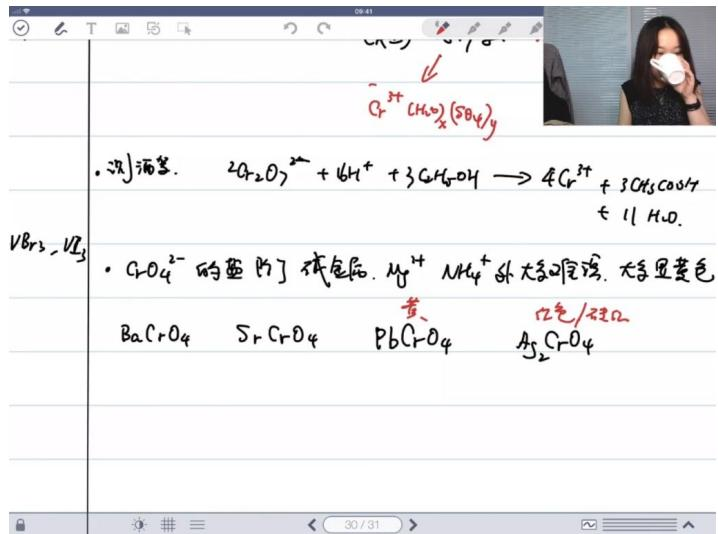

text_image

VBr₃, VBr₃
• 测滴蓝.
2Cr₂O₇²⁻ + 6H⁺ + 3Cr₆H₅OH → 4Cr³⁺ + 3CH₃COOH
+ 11H₂O.
• CrO₄²⁻ 的盐阶] 成金层. Mg²⁺ NH₄⁺ 外大显黄色
BaCrO₄ SrCrO₄ PbCrO₄ As₂CrO₄
红/硅/红
As₂CrO₄

- 溶解特性：除碱金属、镁和铵盐外，大多数铬酸盐难溶于水，且多呈现黄色（铬酸根离子 $CrO_{4}^{2-}$ 的特征色）。  
- 典型难溶盐：

○ 铬酸钡 $(BaCrO_{4})$ ：黄色沉淀（区别于白色 $BaSO_{4}$ 、 $BaCO_{3}$ ）  
○ 铬酸铅 $(PbCrO_{4})$ ：亮黄色沉淀  
○ 铬酸银 $(Ag_{2}CrO_{4})$ ：砖红色沉淀（重要鉴别特征）

\- 颜色原理：这些盐类的颜色主要来自铬酸根离子，当金属离子本身无色时（如 $Ba^{2+}$ ），沉淀即显铬酸根的黄色；若金属离子有色（如 $Ag^{+}$ ），则会产生复合颜色效果。

12）过氧化物配合物 01:47:52

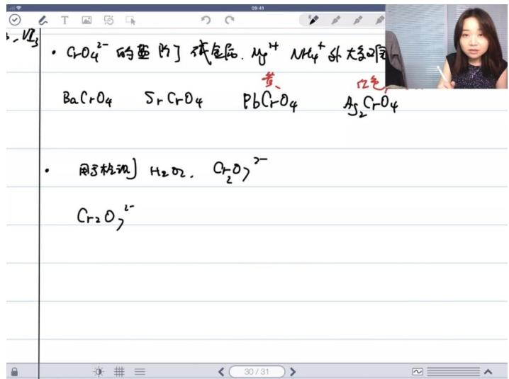

text_image

VII₃
• Cr₂O₄²⁻ 的盐酸] 试食后. Mg³⁺ NH₄⁺ 外大取定
BaCrO₄ SrCrO₄ PbCrO₄ Ag₂CrO₄
• 用于检测] H₂O₂, Cr₂O₇²⁻
Cr₂O₇²⁻

- 检测反应：在酸性重铬酸根 $\left(Cr_{2}O_{7}^{2-}\right)$ 溶液中滴加 $H_{2}O_{2}$ ，加入乙醚等有机溶剂后，在两相界面处会出现深蓝色现象  
- 反应本质：形成正六价铬的过氧化物配合物，铬保持+6价态，配合物中存在过氧根配体 $(O_2^{2-})$   
● 实验现象：该反应对 $H_{2}O_{2}$ 和 $CrO_{4}^{2-}$ 检测非常敏感，是重要的定性分析反应

13）铬的过氧根结构 01:49:59

● 过氧根的基本结构 01:50:03

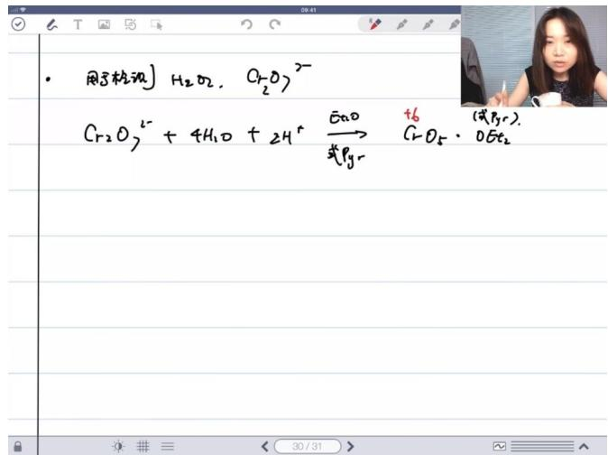

text_image

• 用于检视] H₂O₂, Cr₂O₇²⁻
Cr₂O₇²⁻ + 4H₁O + 2H⁺ → Cr₂O₅ + 6 (试Br₂)
式ρg⁻¹ G₂O₅·OEt₂

○ 组成特征：每个过氧根 $(O_2^{2-})$ 包含两个氧原子，整体带2个负电荷  
○ 电子构型：相当于氧分子 $(O_{2})$ 获得两个电子，填充在反键轨道上  
- 稳定价态：铬的+2和+4价态与过氧根形成的配合物较为稳定

● 过氧根的配位方式 01:50:39

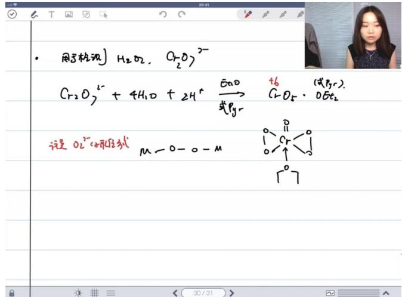

chemical

Chemical reaction equation involving chromium oxide and oxygen, showing stepwise addition of hydrogen peroxide to form a cyclic product with chlorine atoms

常见形式：最常见的是端基配位(M - O - O)，类似于氟的配位方式  
○ 桥联配位：可作为桥联配体连接两个金属中心 $(M-O-O-M)$   
○ 特殊形式：极少数情况下可以单齿形式配位，但非常罕见

● 过氧根在配合物中的多样性 01:51:01

○ 结构验证：吡啶铬过氧配合物已被分离并获得单晶结构  
○ 配位多样性：过氧根可以形成单体(monomer)或多聚体(polymer)结构  
◦ 考试重点：常考察不常见的过氧根配位方式，特别是对称性相关的结构问题

● 过氧根与分子轨道理论的关系 01:51:49

- MO理论应用：过氧根的键级变化可用分子轨道理论解释  
○ 电子效应：增加电子会削弱O-O键(填充反键轨道)，失去电子则增强O-O键  
典型考点：常结合考察过氧桥键长的变化与电子转移的关系

● 过氧根的电性变化对键长的影响 01:52:03

○ 键长规律：过氧根被氧化(失电子)时O-O键变短，还原(得电子)时O-O键变长  
- 理论依据：源于反键轨道上电子数的变化影响键级  
○ 实际应用：这一现象常被用于设计配合物电子转移的研究题目

14）分子轨道理论应用 01:53:13

● 重铬酸根与过氧化氢的反应 01:53:20

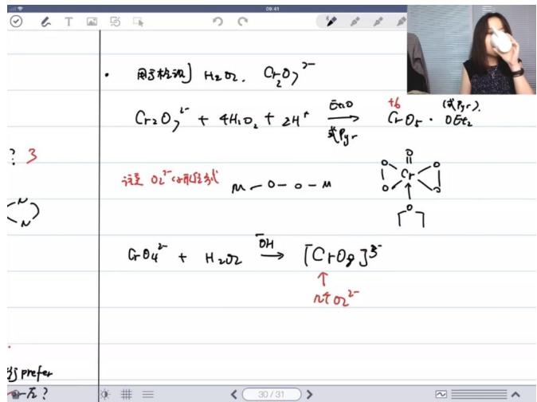

text_image

• 用子检现] H₂O₂, Cr₂O₇²⁻
Cr₂O₇²⁻ + 4H₁O₂ + 2H⁺ → [CrO₅] (试P₃r) 或 P₃t₂
? 3
不是 O₂³⁻的反应式 M - O - O - M
N
Cr
↑
⁰
⁷
CrO₄²⁻ + H₂O₂ → [CrO₉]³⁻
↑
n+O₂²⁻
yj prefer
右?

酸性条件特征：重铬酸根 $(Cr_{2}O_{7}^{2-})$ 在酸性条件下稳定存在，其反应式为：

○ $Cr_{2}O_{7}^{2-} + 4H_{2}O_{2} + 2H^{+} \rightarrow 2CrO_{5} + 5H_{2}O$   
○ 结构判断技巧：当计算得到非整数配位数(如0.5)时，提示可能存在二聚体或多聚体结构  
☐ 价态稳定性：六价铬在酸性条件下以重铬酸根形式存在，碱性条件下则转化为铬酸根 $\left(CrO_{4}^{2-}\right)$

● 碱性条件下的反应特点 01:53:31

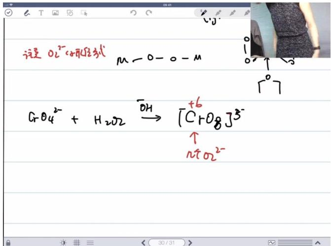

chemical

Handwritten chemical reaction equation involving GrO4²⁻ and H2O2 with reagents and products

典型反应：铬酸根与过氧化氢在碱性条件下生成过氧铬酸根：

$\circ CrO_{4}^{2-} + H_{2}O_{2}\rightarrow [CrO_{8}]^{3-}$   
○ 结构推测原则：

■ 优先考虑有限分子结构而非无限网状结构

■ 离子结构通常为明确的寡聚体(如二聚体)

■ 需结合配位数合理性判断(如3.5个配体可能对应二聚结构)

\- 空间构型提示：过氧桥键是常见连接方式，可形成平面或立体结构

● 推测化学结构的方法 01:59:10

○ 结构推测步骤：

■ 判断反应环境(酸性/碱性)  
■ 确定中心原子价态  
■ 计算配体数量与配位数  
■ 考虑桥连可能性(如过氧桥)

○ 考试技巧：

■ 网状结构必须题干明确提示  
■ 典型描述为"共棱/共角连接的八面体/四面体"

■ 离子结构优先考虑寡聚体而非无限延伸结构

● 锰的价态判断与结构推测 02:00:23

○ 价态规律：

■ 酸性条件稳定价态：+3价   
■ 碱性条件稳定价态：+6价

反应特征：氢氧化铬 $(Cr(OH)_{3})$ 在空气中易被氧化为铬酸根

○ 结构绘制技巧：

■ 配位数非经典时可简化表示空间结构  
■ 过氧桥连接时可用实线/虚线示意立体构型

15）铬的核心反应 02:02:24

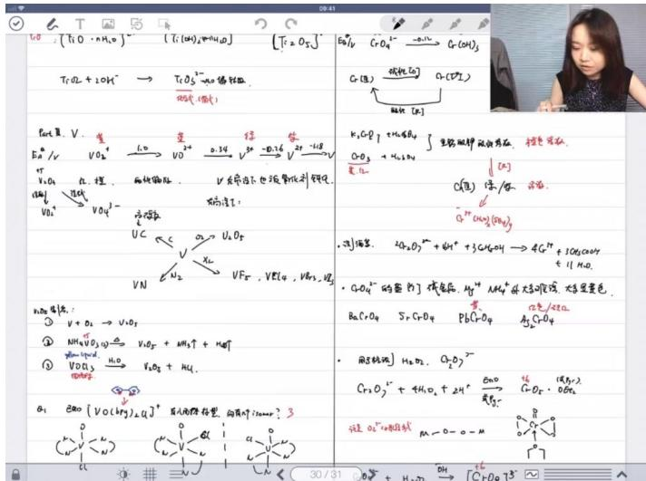

text_image

TO : (TiO₂ + H₂O)₃ → (Ti(OH)₂ + NH₂O) [Ti = O₅]
TiO₂ + 2OH⁻ → TiO₃²⁻ + 2H⁺
Fe³⁺/V VO₃²⁻ → VO³⁺ + 0.14 → V³⁺ + 0.16 → V²⁺ + 0.18
↑↑
V₁O₄ (无量纲)
→ V₂O₄²⁻
→ V₃O₄²⁻
→ V₄O₄²⁻
→ V₅O₄²⁻
→ V₆O₄²⁻
→ V₇O₄²⁻
→ V₈O₄²⁻
→ V₉O₄²⁻
→ V₁₀O₄²⁻
→ V₁₁O₄²⁻
→ V₁₂O₄²⁻
→ V₁₃O₄²⁻
→ V₁₄O₄²⁻
→ V₁₅O₄²⁻
→ V₁₆O₄²⁻
→ V₁₇O₄²⁻
→ V₁₈O₄²⁻
→ V₁₉O₄²⁻
→ V₂₀O₄²⁻
→ V₂₁O₄²⁻
→ V₂₂O₄²⁻
→ V₂₃O₄²⁻
→ V₂₄O₄²⁻
→ V₂₅O₄²⁻
→ V₂₆O₄²⁻
→ V₂₇O₄²⁻
→ V₂₈O₄²⁻
→ V₂₉O₄²⁻
→ V₃₀O₄²⁻
→ V₃₁O₄²⁻
→ V₃₂O₄²⁻
→ V₃₃O₄²⁻
→ V₃₄O₄²⁻
→ V₃₅O₄²⁻
→ V₃₆O₄²⁻
→ V₃₇O₄²⁻
→ V₃₈O₄²⁻
→ V₃₉O₄²⁻
→ V₄₀O₄²⁻
→ V₄₁O₄²⁻
→ V₄₂O₄²⁻
→ V₄₃O₄²⁻
→ V₄₄O₄²⁻
→ V₄₅O₄²⁻
→ V₄₆O₄²⁻
→ V₄₇O₄²⁻
→ V₄₈O₄²⁻
→ V₄₉O₄²⁻
→ V₅₀O₄²⁻
→ V5₁O₄²⁻
→ V5₂O₄²⁻
→ V5₃O₄²⁻
→ V5₄O₄²⁻
→ V5₅O₄²⁻
→ V5₆O₄²⁻
→ V5₇O₄²⁻
→ V5₈O₄²⁻
→ V5_9H₂O₂ + 2H⁺ + 3H₂O₂ + 4H⁺ + 5H₂O₂ + 6H₂O₂ + 7H₂O₂ + 8H₂O₂ + 9H₂O₂ + 10H₂O₂ + 11H₂O₂ + 12H₂O₂ + 13H₂O₂ + 14H₂O₂ + 15H₂O₂ + 16H₂O₂ + 17H₂O₂ + 18H₂O₂ + 19H₂O₂ + 20H₂O₂ + 21H₂O₂ + 22H₂O₂ + 23H₂O₂ + 24H₂O₂ + 25H₂O₂ + 26H₂O₂ + 27H₂O₂ + 28H₂O₂ + 29H₂O₂ + 30H₂O₂ + 31H₂O₂ + 32H₂O₂ + 33H₂O₂ + 34H₂O₂ + 35H₂O₂ + 36H₂O₂ + 37H₂O₂ + 38H₂O₂ + 39H₂O₂ + 40H₂O₂ + 41H₂O₂ + 42H₂O₂ + 43H₂O₂ + 44H₂O₂ + 45H₂O₂ + 46H₂O₂ + 47H₂O₂ + 48H₂O₂ + 49H₂O₂ + 50H₂O₂ + 51H₂O₂ + 52H₂O₂ + 53H₂O₂ + 54H₂O₂ + 55H₂O₂ + 56H₂O₂ + 57H₂O₂ + 58H₂O₂ + 59H₂O₂ + 60H₂O₂ + 61H₂O₂ + 62H₂O₂ + 63H₂O₂ + 64H₂O₂ + 65H₂O₂ + 66H₂O₂ + 67H₂O₂ + 68H₂O₂ + 69H₂O₂ + 70H₂O₂ + 71H₂O₂ + 72H₂O₂ + 73H₂O₂ + 74H₂O₂ + 75H₂O₂ + 76H₂O₂ + 77H₂O₂ + 78H₂O₂ + 79H₂O₂ + 80H₂O₂ + 81H₂O₂ + 82H₂O₂ + 83H₂O₂ + 84H₂O₂ + 85H₂O₂ + 86H₂O₂ + 87H₂O₂ + 88H₂O₂ + 89H₂O₂ + 90H₂O₂ + 91H₂O₂ + 92H₂O₂ + 93H₂O₂ + 94H₂O₂ + 95H₂O₂ + 96H₂O₂ + 97H₂O₂ + 98H₂O₂ + 99HBr

基本转化规律：

○ 碱性条件：三价铬 $(Cr^{3+})$ 氧化为六价铬 $(CrO_{4}^{2-})$   
- 酸性条件：六价铬 $(Cr_{2}O_{7}^{2-})$ 还原为三价铬 $(Cr^{3+})$

● 典型沉淀：黄色铬酸盐 $(BaCrO_{4},SrCrO_{4},PbCrO_{4})$

16）铬的醋酸配合物 02:03:27

- 典型配合物：四醋酸二铬 $(Cr_{2}(OAc)_{4} \cdot 2H_{2}O)$   
● 电子规则：满足18电子规则  
● 结构特征：具有C4旋转轴的二聚结构  
● 键级计算：可通过18电子规则推算Cr-Cr键级

17）铬的金属键 02:05:44

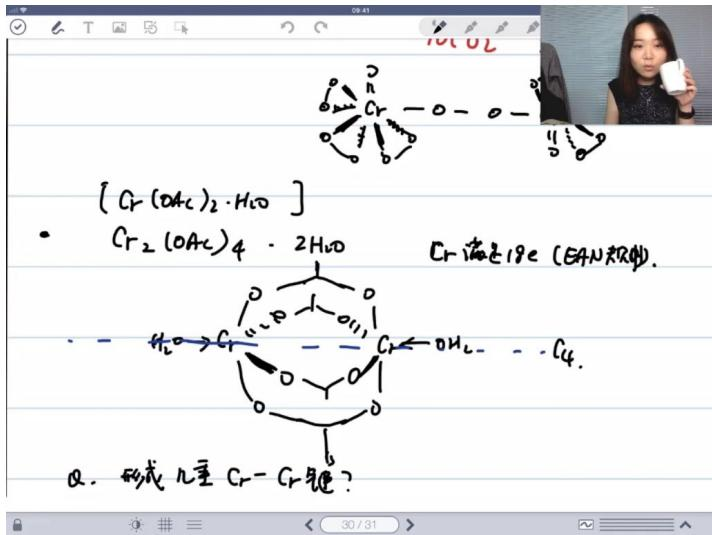

chemical

Chemical reaction diagram showing chromium complex formation with water molecules and hydrogen bonding

18电子规则计算:

- 正二价铬离子 $(Cr^{2+})$ 本身含有4个价电子  
每个氧配体提供2个电子，5个氧配体共提供 $2e \times 5 = 10e$   
总电子数计算： $4e(Cr^{2+}) + 10e$ （配体）=14e  
- 因此需要形成四重键来满足18电子规则

# ● 键型判断:

○ 根据计算结果，该配合物中铬原子间形成四重键

# 18）九氯二铬三负离子 02:07:40

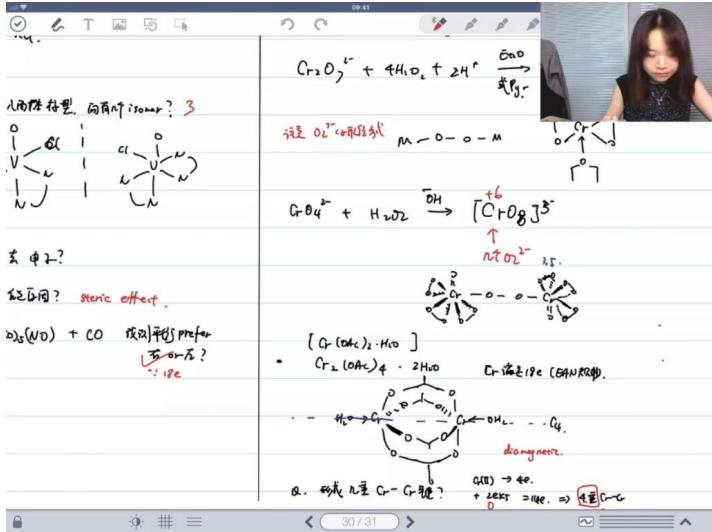

chemical

Chemical reaction equations and diagrams for chromium carbocation formation and hydrogenation reactions

# - 结构特征:

○ 化学式为 $[Cr_{2}Cl_{9}]^{3-}$   
○ 含有两个铬原子和九个氯原子

# ● 配位环境:

- 氯原子呈现1:2的化学环境比  
- 说明存在两种不同配位环境的氯原子

# ● 磁性特征:

○ 该化合物为顺磁性物质  
- 这与电子排布和未成对电子有关

# 19）铬的深红色液体 02:09:15

● 铬化合物的结构特性 02:09:19

金属键形成判断：实验测得铬化合物中Cr-Cr间距比同结构钨化合物中W-W间距更大，这与Cr原子半径显著小于W的预期相反，说明实际未形成Cr-Cr金属键  
○ 配位环境特征：结构中形成三个氯桥键，六个氯原子分布在分子两端

● 例题1：铬化合物中金属键的形成情况 02:09:55

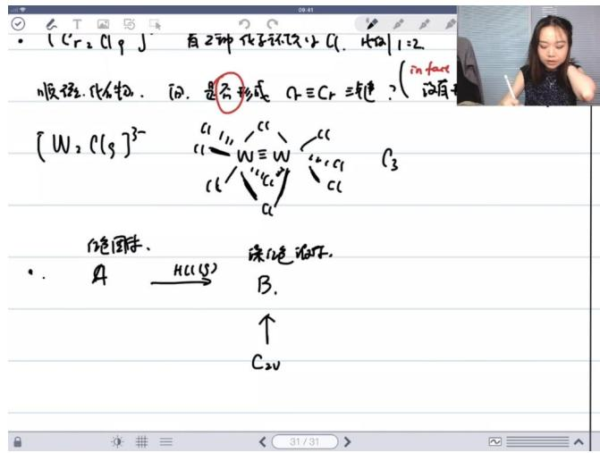

text_image

Cr2Clg
有2种化碳反应式C1. 比例1:2
顺延, 化态物.
问. 是否形成 Cl-≡Cr 三键 ? (in fact)
[W2Clg]3-
C1
W≡W
C3
C1
C2
C3
C4
C5
C6
A HCl(S) 涂几绝溶剂.
B.
↑
C2v

# ○ 题目解析

■ 关键数据：Cr-Cr距离 > W-W距离（Cr原子半径 < W）  
■ 结构异常：第四周期Cr与第五/六周期同族元素结构不可直接类推  
■ 结论：该结构中不存在Cr-Cr金属键  
■ 记忆点：同族元素第四周期与第五/六周期结构性质差异显著

# - 铬与同族元素的相似性 02:10:44

- 周期性规律：第五、六周期同族元素性质相似，但与第四周期差异较大  
○ 结构对比：虽然Cr与W的氯配位排布相似（均为三氯桥+六端基氯），但金属键形成能力不同

# ● 例题2：某红色固体的反应与结构推断 02:11:44

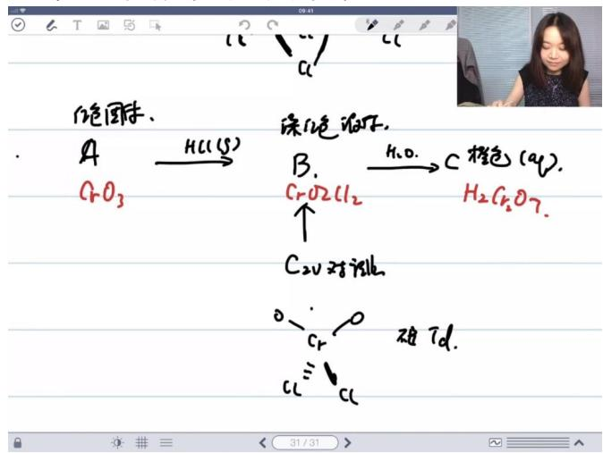

chemical

Chemical reaction diagram showing transformations of a cyclic carbonate with HCl, CrO2, and Cr2v groups, including intermediate steps and reaction conditions.

# ○ ○ 题目解析

# ■ 反应过程:

● 红色固体A + HCl → 深红色液体B（无HCl气体产生）  
● $B + H_{2}O \rightarrow$ 橙色溶液

# 结构特征：

● B分子具有C2v对称性（与水分子对称性相同）  
● 中心原子为六价铬，形成四面体构型（非正四面体，非Td点群）

# ■ 化合物推断：

● B可能为二氯二氧合铬 $(CrO_{2}Cl_{2})$   
● 反应全程无氧化还原发生

# 易错点：

● 不能仅凭四面体构型判断为Td点群  
● 需注意C2v对称性与正四面体的区别

# 2. 锰的化学性质 02:14:56

# 1）锰的价态稳定性 02:15:19

● 锰的化合价在酸碱条件下的稳定性概述

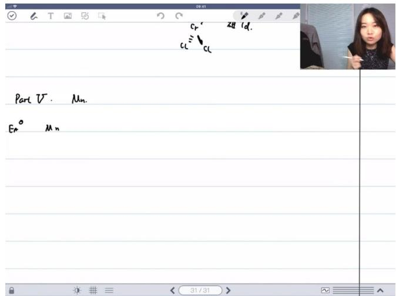

text_image

Cr ZB Id.
Cl Cl
Part V. Mn.
Er° M n

酸碱条件差异：锰在不同pH条件下的稳定价态存在显著差异，需分别掌握酸碱环境中的特征  
☐ 液溴操作注意：实验中使用液溴（深红色液体）时需注意其高密度特性（易滴落）和腐蚀性，需用棕色瓶+塑料袋双重防护

● 酸性条件下锰离子的歧化情况 02:17:33

○ 不稳定价态：酸性条件下 $Mn^{3+}$ 和 $Mn^{6+}$ 容易发生歧化反应  
○ 电极电势依据：通过 $Mn^{2+}\rightarrow Mn^{3+}$ （1.51V）和 $Mn^{3+}\rightarrow Mn^{4+}$ （0.95V）的电势差判断稳定性

● 酸性条件下锰离子的稳定价态 02:18:07

- 主要存在形式： $Mn^{2+}$ 和 $Mn^{4+}$ 是酸性条件下的稳定价态  
○ 电势计算： $Mn^{7+} \rightarrow Mn^{4+}$ (1.69V)， $Mn^{7+} \rightarrow Mn^{2+}$ (1.51V)，说明高锰酸盐具有强氧化性

2）锰的电极电势 02:19:00

● 二价锰与四价锰的氧化性 02:19:05

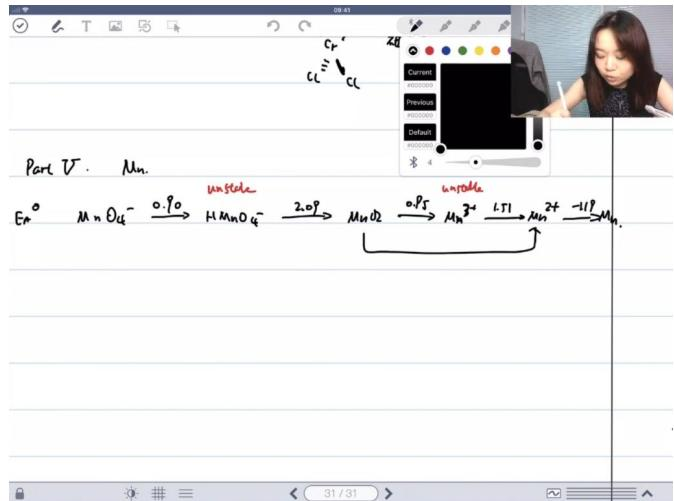

chemical

Chemical reaction pathway diagram showing transformation of vanadium species to Mn and MnO2 via intermediate steps

氧化能力： $Mn^{2+} \rightarrow Mn^{4+}$ 需中等强度氧化剂（1.23V），说明二价锰相对稳定

● 酸性条件下锰的存在形式 02:19:15

○ 还原产物：高锰酸钾 $(MnO_{4}^{-})$ 在酸性条件下可被还原为 $Mn^{4+}$ 或 $Mn^{2+}$

● 高锰酸钾的氧化性 02:20:40

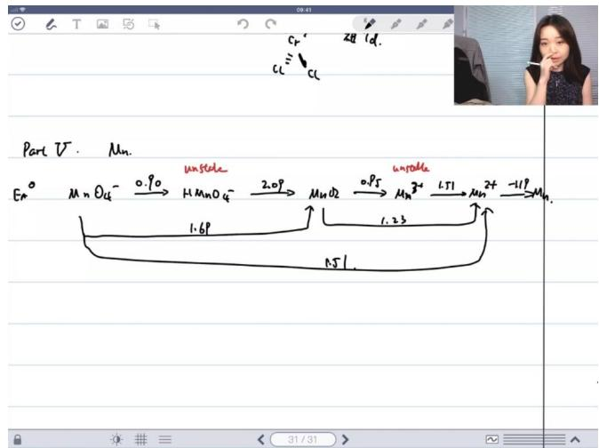

chemical

Chemical reaction pathway diagram showing transformation of MnO4⁻ to Mn2⁺ via intermediate steps with rate constants and conditions labeled

强氧化性：酸性条件下 $MnO_{4}^{-}$ 的标准电极电势达1.51V（还原为 $Mn^{2+}$ ）

● 二氧化锰的氧化性及其反应 02:21:03

○ 实际应用：二氧化锰与浓盐酸制氯气反应中， $MnO_{2}$ 的实际氧化能力（1.23V）低于理论预期  
反应机制：氯离子配位效应和氯气逸出共同推动反应进行，并非单纯因 $MnO_{2}$ 氧化性极强

● 二价锰离子的颜色与状态 02:21:47

○ 水合离子： $[Mn(H_{2}O)_{6}]^{2+}$ 呈极浅粉色（近乎无色）  
配合物变色：与氯离子形成配合物时颜色泛黄，因d-d跃迁导致显色微弱

3）锰的颜色特征 02:22:50

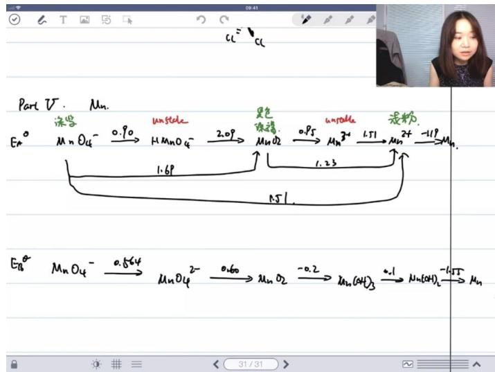

text_image

Part V. Mn.
Ea° MnO4- 0.90 H MnO4- 2.09 MnO2 0.85 μmol/L 1.51 漫粉.
1.69 1.23
0.51
Ea° MnO4- 0.864 MnO4- 0.60 MnO2 -0.2 Mn(OH)3 0.1 Mn(OH)2 -1.55 T Mn
31/31

二氧化锰：新鲜制备时呈深褐色，稳定态为黑色  
● 高锰酸根： $MnO_{4}^{-}$ 具有特征性深紫色  
- 锰酸根： $MnO_{4}^{2-}$ 呈现绿色  
● 碱性条件下的锰化学

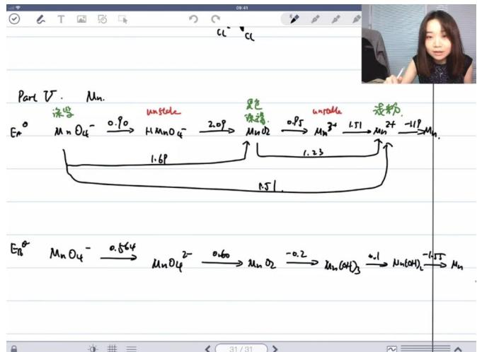

chemical

Chemical reaction pathway diagram showing transformations of MnO4⁻ and MnO4⁻ with rate constants and intermediate steps

稳定性变化：碱性环境中三价和六价锰的歧化趋势减弱（相比酸性条件）  
- 氧化性减弱：含氧锰化合物的氧化性普遍降低，如 $MnO_{4}^{-}$ 电势降至0.844V

● 氢氧化锰的性质 02:25:15

○ 沉淀转化： $Mn^{2+}$ 加碱首先生成白色 $Mn(OH)_{2}$ ，但会迅速被空气氧化为褐色 $MnO(OH)_{2}$   
○ 颜色特征： $Mn(OH)_{3}$ 呈绿色， $MnO_{4}^{2-}$ 保持紫色  
○ 金属活性：锰是活泼金属 ( $E_{acid}^{\circ} = -1.19V$ , $E_{base}^{\circ} = -1.55V$ )

4）锰的活泼性

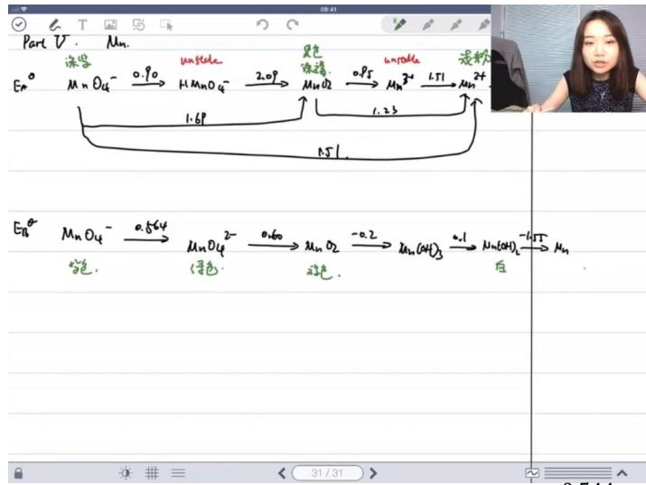

chemical

Chemical reaction pathway diagram showing Mn and MgO4 species transformations with rate constants and intermediate steps

0.544 0.60 -0.2

$\bullet$ 电极电势： $E_0^\circ$ 显示锰的氧化还原序列为 $M_{n}O_{4}^{-}\rightarrow M_{n}O_{4}^{2 - }\rightarrow M_{1n}O_{2}\rightarrow M_{n}O_{2}$

● 金属活性：锰是活泼金属，在酸性溶液中标准电极电势为-1.19V，在碱性溶液中为-1.55V。与钛类似，锰虽然活泼但存在特殊反应特性。

5）锰与水的反应 02:25:58

text_image

Screenshot of a software interface with toolbar icons and a blurred photo of a person in front of her.

$$
\frac {B ^ {\ominus} \quad M _ {n} O _ {4} ^ {-} \xrightarrow {0 . 5 6 4} \quad M _ {n} O _ {4} ^ {2 -} \xrightarrow {0 . 6 0} \quad M _ {n} O _ {2} \xrightarrow {- 0 . 2} \quad M _ {n} (O H) _ {3}}{\mathrm {染 色}. \quad \mathrm {绿 色}. \quad \mathrm {染 色}.}
$$

# 31/31

# - 反应特性：

- 钝化现象：锰不会被钝化，但与水的反应不激烈，常与镁对比（两者均生成+2价离子且元素符号相似）  
- 反应产物：生成 $M(OH)_{2}$ ，反应温和性可能与其水解性较弱有关  
- 氨水反应：可与氨水共存，可能与氨的配位作用有关

# 6）锰的配位性 02:28:29

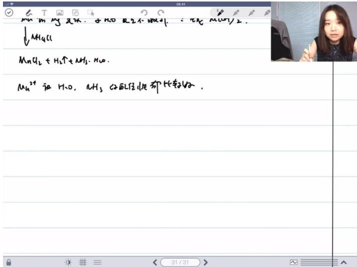

text_image

min mg 气体，加H2O 无氧不饱和，生成MH3/2。
↓MH4Cl
MnH2 + H2↑ + NH3·H2O.
Mn3+ 玉 H2O，NH3CO2配位H2O都比较为0.2。

# ● 配位特性：

○ 配体亲和性： $Mn^{2+}$ 作为较硬的酸，与 $H_{2}O$ 和 $NH_{3}$ 的配位性良好  
○ 典型反应： $Mn + 2NH_{4}Cl \rightarrow MnCl_{2} + H_{2}\uparrow + 2NH_{3}$ ，显示其与氨配位的能力

text_image

09:41
Mnou
→ M
艳.
绿色.
动

$Mn$ in $Mg$ 类似. 于 $H_{2}O$ 反应不激动. ∵ 钱 $M(OH)_{2}$ $\downarrow NH_{4}Cl$

$MnCl_{2} + H_{2}\uparrow + NH_{3}.H_{2}O.$ ( $Mn^{2+}$ 不太易水面平).

$M_u^{2+}$ 珠 H₂O, NH₃ CO₂ 配合H₂SO₄ 比较浓

# ○

● 水解特性：二价锰的水解性不强，可从其与氨水共存的现象得到验证

7）碳酸锰的热分解 02:28:55

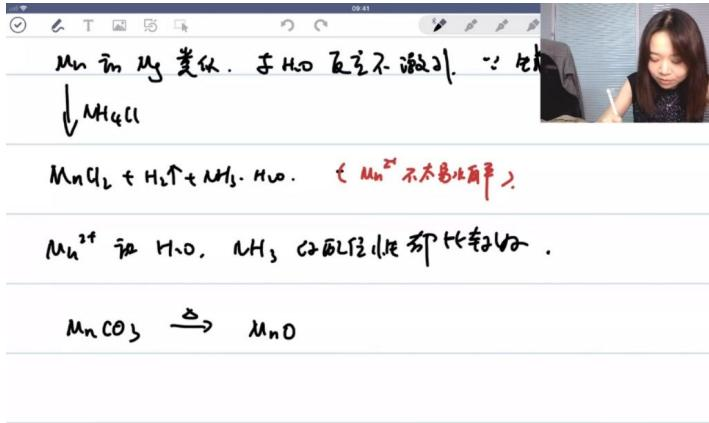

text_image

Mn 在 Mg 类似. 求 H₂O 互立不激动. ∵ 全液
↓ NH₄Cl
MnCu₂ + H₂↑ + NH₃. H₂O. { Mn²⁺ 不太易化愈产 }
Mn²⁺ 研 H₂O, NH₃, CO₂配位H₂O 都比较浓。
MnCO₃ → MnO

反应过程：碳酸锰 $(MnCO_{3})$ 加热分解生成二价氧化锰(MnO)和二氧化碳 $(CO_{2})$ ，但实际产物为混合物。  
- 产物特性：反应会生成四氧化三锰 $(Mn_{3}O_{4})$ 黑色固体，该物质可视为三价 $(Mn_{2}O_{3})$ 和二价(MnO)氧化锰的复合氧化物。  
● 制备条件：若要制备纯净的二价氧化锰，需在还原性气氛中进行，但实际操作中二价锰的稳定性比预期更高。

8) 氢氧化锰的氧化 02:31:21

● 碱性条件下的氧化

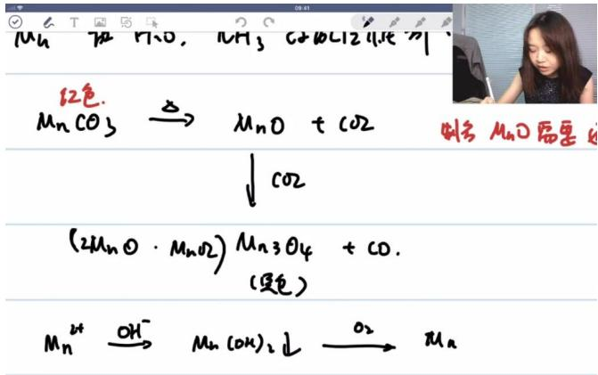

text_image

红色.
MnCO3 → MnO + CO2
↓ CO2
(2MnO·MnO2)Mn3O4 + CO.
(黑色)
Mn2+ OH- Mn(OH)2↓ → O2 → Mn

初始产物：二价锰在碱性条件下首先生成白色氢氧化锰 $(Mn(OH)_{2})$ 沉淀。  
○ 氧化过程：该沉淀会被空气中的氧气氧化为水合二氧化锰 $(MnO(OH)_{2}$ 或 $MnO_{2}\cdot nH_{2}O)$ 。  
颜色变化：新生成的氧化物水合物呈棕色而非黑色，这与常见的二氧化锰颜色不同。

\- 三价锰的稳定性

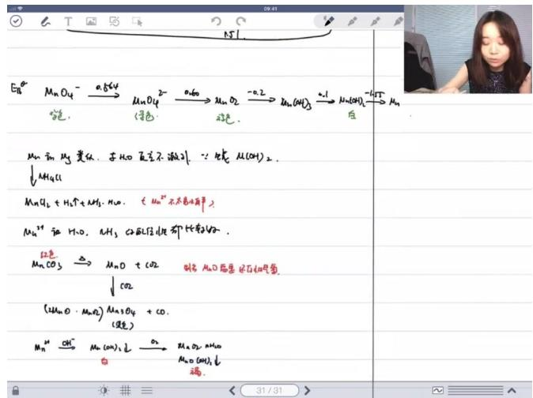

chemical

Handwritten chemical reaction equations involving MnO4, H2O, and CO2 with CO2 as reagents

稳定性分析：三价锰 $(Mn^{3+})$ 在酸性和碱性条件下均不稳定，具有歧化趋势。  
○ 电势数据：从氧化还原电势 $(E^{\circ})$ 数值可以看出，三价锰容易发生歧化反应生成二价和四价锰。  
○ 特殊现象：在酸性条件下，三价和六价锰都可能发生歧化反应，这种趋势在酸性环境中尤为明显。

# 9）三价锰的稳定性 02:32:17

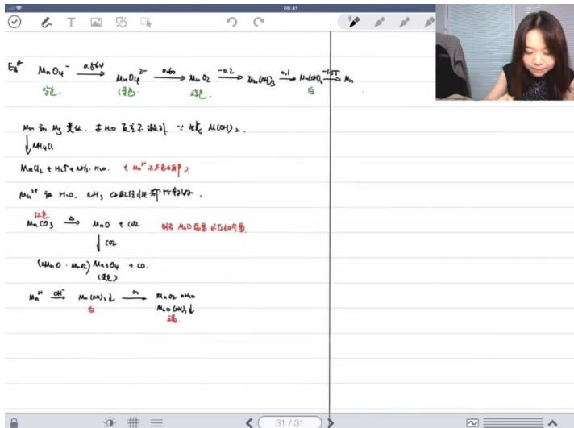

text_image

Ea²⁺ MnO₄⁻ → α-δH
      (绿色)
MnO₄⁻ → NaOH
      (绿色)
Mn(OH)₃ → NaOH
      (绿色)
Mn + H₂SO₄ → H₂SO₄ (白色)
↓ NH₄Cl
MnCl₂ + H₂SO₄ → H₂SO₄ (白色)
Mn²⁺ + H₂O₄ → CH₃COOH (白色)
红色
Mn(CO)₃ → MnO + CO₂
↓ CO₂
(MnO·MnO)₃ → Mn+O₄⁻ + CO.
(蓝色)
Mn²⁺ → Mn(OH)₂↓ → Mn(OH)₃
      (绿色)
Mn(OH)₃↓
      (绿色)
31/31

● 稳定条件：三价锰 $(Mn^{3+})$ 要稳定存在需要满足特殊条件，通常以二价锰 $(Mn^{2+})$ 为前体

\- 存在形式:

○ 生成特殊盐类  
○ 形成特定配合物（当以离子形式存在时）

● 实例分析：

- 氰化物配合物：由于 $CN^{-}$ 配位常数极大，导致游离 $Mn^{3+}$ 浓度极低  
○ 磷酸盐配合物： $[Mn(PO_{4})_{2}]^{2}$   
○ 草酸盐配合物： $[Mn(Ox)_{6}]^{3-}$ （ $Ox^{2-}$ 代表草酸根 $C_{2}O_{4}^{2-}$ ）

# 10）锰的配合物 02:34:00

text_image

白
MnO (OH)2↓
渴.

$M_{n}$ (Ⅲ) 能说它存在于一些配合物. $[M_{n}(CN)_{6}]^{3-}$ , $[M_{n}(PO_{4})_{2}]^{2-}$ , $[M_{n}(OX)_{2}]^{3-}$ $O_{x}=C_{2}O_{4}^{2-}$

31/31

\- 配合物类型:

○ 草酸根配合物： $[Mn(Ox)_{6}]^{3-}$   
○ 磷酸根配合物： $[Mn(PO_{4})_{2}]^{2}$   
○ 草酸根三聚体： $[Mn(Ox)_{3}]^{3-}$

● 稳定性机制：强配体通过高配位常数使 $Mn^{3+}$ 稳定存在

● 制备反应：

○ 浓盐酸与二氧化锰反应： $MnO_{2} + 4HCl \rightarrow MnCl_{2} + Cl_{2} \uparrow + 2H_{2}O$   
- 反应现象：剩余溶液呈黄色（可能与 $Mn^{3+}$ 相关）

11）二氧化锰的反应 02:34:53

\- 锰的配合物形式

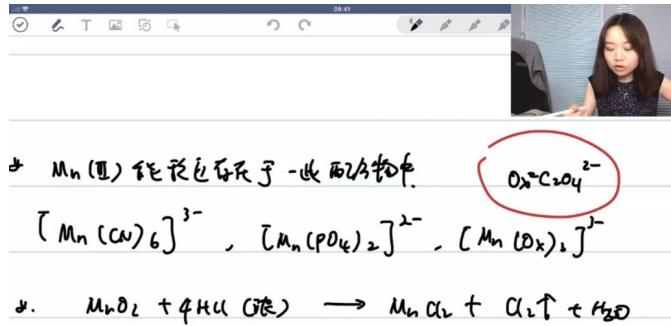

text_image

Mn(Ⅲ)能说它存在于一些配合物
[Mn(CN)6]3-，[Mn(PO4)2]2-，[Mn(Ox)2]2-
MnO2+4HCl(浓)→MnCl2+Cl2↑+H2O

存在形式：Mn能存在于某些配合物中，如 $\left[M_{n}(\alpha)_{6}\right]^{3-}$ 、 $\left[\mu_{n}\left(\rho O_{4}\right)_{2}\right]^{2-}$ 和 $\left[\mu_{n}\left(O_{k}\right)_{2}\right]^{2-}$   
○ 稳定原因：体系中少量 $Mn^{3+}$ 能存在是因为它以氯离子配合物形式存在，更可能是 $MnCl_{3}^{-x}$ ，配位数不确定（可能是4或6）

\- 锰的常见化合物

四价锰：二氧化锰（ $\mathrm{MnO_2}$ ）是最常见的四价锰化合物  
六价锰：用于制备高锰酸根（ $\mathrm{MnO_4^-}$ ）的常见方法是通过加酸反应获得二氧化锰

\- 锰的氢氧化物反应

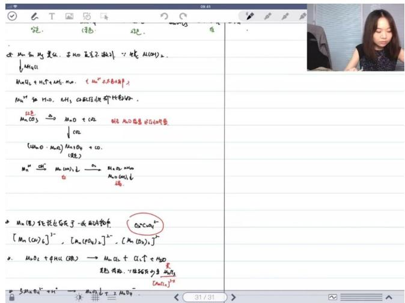

text_image

Mn和Mg类似，若H₂O变为不相似。∵Fe₄Al(OH)₂
↓MH₄↓
MnCl₂ + H₂P + COH₃, Mo, { Mn²⁺ 无量纲第2}
Mn²⁺ 和 H₂O, EtH₃, Cl₂配比其含有性氧的Na⁺.
10%
MnCO₃ → MnO + Ca₂
↓ Ca₂
(WₘO·MnO)₆ + Co.
(Fe₂)
Mn²⁺ → Mn(Ca)₂↓ → [Mn(OH)₃]₂
→
+ Mn(Fe)能长也长关于一段的浑浊中
[Mn(Ca)₆]²⁻, [Mn(PO₄)₂]²⁻, [Mn(Dx)₃]²⁻
+ MnO₂ + FeH₃(Fe) → MnCl₂ + Ca₂↑ + H₂O
→ FeCl₂ + FeBrCl₂↑ + MgCl₂
[CaCl₂]²⁻
31/31

反应式： $M_{n}q_{2}+H_{2}\uparrow+M_{3}\cdot H_{2}$   
其他化合物：包括 $MnCO_{3}$ 、 $Mn(OH)_{2}$ 等，其中 $Mn(OH)_{2}$ 在氧气存在下可被氧化

# 12）高锰酸钾的性质 02:35:59

# - 锰的七价化合物

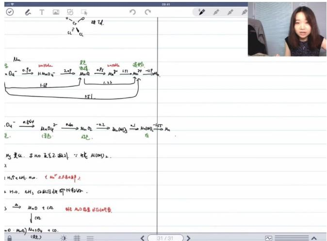

text_image

0
Cr
Cu
Pt
Cu
Mn
O4→ 0.10 → H2NO4→ 2.07 → CuO2→ 0.91 → Na2+ 1.53 → Mg(OH)3→ 0.1 → H2NO4→ 0.1 → Mn
1.67
1.51
1.04 → 0.54 → H2NO4→ 0.60 → H2O2→ -0.2 → H2(OH)3→ 0.1 → H2NO4→ 0.1 → Mn
色.
Mg变化，如H2O变化不相异：生成从(OH)2.
I
H2O + NH3·NO3 (mL-不是酸钾)
2 H2O, NH3COOH溶液都可溶于H2O.
3 → MnO + CO2 则H2O溶液变为H2O量。
↓ CO2
mO: MnO, H2SO4 + CO.
(橙色)

氧化性: 锰的七价化合物是极强的氧化剂, 在有机化学中几乎是最强的氧化剂之  
常见形式: 主要以高锰酸根 $(MnO_{4}^{-})$ 形式存在，如高锰酸钾 $(KMnO_{4})$ 。

# - 锰的其他价态化合物

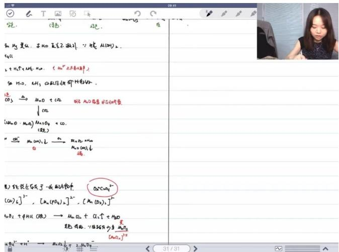

text_image

和 Mg 变化，求 \( {H}_{2}{O}^{2 - } \) 要不激动！？ 错：\( M{\left( OH\right) }_{2} \)。

\( 2 + {H}_{2}{O}^{2 - } + {NH}_{3} \cdot  {H}_{2}{O}^{2 - } \)（\( {OH}^{2 - } \) 不太安静）
如 \( {H}_{2}{O} \)，\( {NH}_{3} \) (若出现挥发性有机碳)

② CO₂ \( \xrightarrow[]{{CO2}}{MnO} + {CO2} \) 则 \( {MnO} \) 的质量对 \( {H}_{2}{O}^{2 - } \) 气

\( {\left( {H}_{{MnO}} \cdot  {M}_{{NH_3}}\right) }^{{Al_2O_4}} + {CO} \)。（②E）

“ OH” \( \xrightarrow[]{{CO_3}}{Mn(OH)_2}\xrightarrow[]{{CO_3}}{Mn_2(OH)_2}\xrightarrow[]{{CO_3}}{Mn_2(OH)_2}\xrightarrow[]{{CO_3}}{Mn_2(OH)_2}\xrightarrow[]{{CO_3}}{Mn_2(OH)_2}\xrightarrow[]{{CO_3}}{Mn_2(OH)_2}\xrightarrow[]{{CO_3}}{Mn_2(OH)_2}\xrightarrow[]{{MO_2}}{C}_6\mathrm{H}_5\mathrm{O} \)

③ 但是长白烧了一致的冷解物。

\( {\left( CH_3\right) }^{3- } \)，\( {\left( M_n(Pd_6)_2\right)}^{3- } \)，\( {\left( M_n(D_5)_2\right)}^{3- } \)

\( {10}{\mathrm{O}}_{2} + 9{\mathrm{H}}_{4}{\mathrm{O}}_{3}\left( {OH}\right) \rightarrow {Mn}_2C_6 + C_6 \uparrow   + {MgO} \) 点B. 对称：“仔细探究多少多 MgO，又有一颗 O₂，再有一颗 N₂，再有一颗 N₂，再有一颗 N₂，再有一颗 N₂，再有一颗 N₂，再有一颗 N₂，再有一颗 N₂，再有一颗 N₂，再有一颗 N₂，再有一颗 N₂，再有一颗 N₂，再有一颗 N₂，再有一颗 N₂，再有一颗 N₂，再有一颗 N₂，再有一颗 N₂，再有一颗 N₂，再一颗 N₂，再一颗 N₂，再一颗 N₂，再一颗 N₂，再一颗 N₂，再一颗 N₂，再一颗 N₂，再一颗 N₂，再一颗 N₂，再一颗 N₂，再一颗 N₂，再一颗 N₂，再一颗 N₂，再一颗 N₂，再一颗 N₂，再一颗 N₂，再一颗 N₂

三价锰化合物: 虽然不常见, 但三价锰化合物确实存在, 如三卤化锰 $(MnX_{3})$ 。  
○ 配位特性: 锰的化合物具有良好的配位性，能形成多种配合物，如：

■ $[Mn(C_{2}O_{4})_{2}]^{2}$

$[Mn(PO_{4})_{2}]^{2}$   
$[Mn(OH)_{2}]^{2}$

\- 反应特性: 锰化合物在反应中常表现出多种氧化还原性质, 如:

■ $MnO_{4}^{-}\rightarrow MnO_{2}$   
■ $MnO_{2}\rightarrow Mn^{2+}$

\- 注意事项

- 稳定性: 高锰酸钾在酸性条件下氧化性更强，但容易分解，需注意保存条件。  
颜色特征：不同价态的锰化合物具有特征颜色，如高锰酸钾为紫色，二氧化锰为黑色，二价锰离子为浅粉色。

3. 铥的化学性质 02:36:35

1）三卤化铼的结构 02:36:54

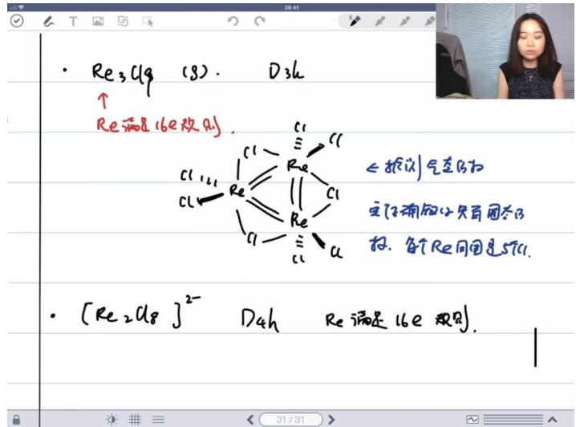

text_image

• Re₃Clg (s) . D₃h
↑
Re满足16e规则.
←拟议气变B为
支持子确定2只百国态B
极.每个Re同值是57c.
• [Re₂Cl₈]²⁻ D₄h Re满足16e规则.

- 固态结构：实际测得 $\left[\mathrm{Re}_{2} \mathrm{Cl}_{8}\right]^{2-}$ 为无限延伸的网状结构，每个铼原子周围配位5个氯原子，其中一个氯原子作为桥联原子连接相邻的三聚体单元。  
- 气态结构：推测为三聚体形式，每个铼原子仅配位4个氯原子，具有 $D_{3h}$ 对称性（含 $C_{3}$ 旋转轴和水平镜面 $\sigma h$ ），通过Re-Re双键满足16电子规则。  
- 键型特征：实验通过Re-Re键长推测存在双键特征，这是满足16电子规则的关键结构特征。

2）16电子规则应用 02:38:30

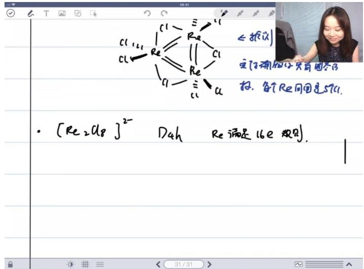

text_image

Cl
|
Cl
|
Re
|
Cl
|
Cl
|
Re
|
Cl
|
Ce
|
Ce
|
Ce
|
Ce
|
Ce
|
Ce
|
Ce
|
Ce
|
Ce
|
Ce
|
Ce
|
Ce
|
Ce
|
Ce
|
Ce
|
Ce
|
Ce
|
Ce
|
Ce
|
Ce
|
Ce
|
Ce
|
Ce
|
Ce
|
Ce
|
Ce
|
Ce
|
Ce
|
Ce
|
Ce
|
Ce
|
Ce
|
Ce
|
Ce

● 适用对象：后过渡金属（如Re）常遵循16电子规则而非18电子规则。  
- 计算方法：以 $\left[\mathrm{Re}_{2} \mathrm{Cl}_{8}\right]^{2-}$ 为例，正三价Re（d4构型）提供4个电子，4个Cl-提供8个电子，需形成Re-Re四重键（4个电子）才能满足16电子规则（ $4 + 8 + 4 = 16$ ）。

● 结构验证：固态结构中通过磁性测量和键长数据验证多重键的存在。

3）铼的双键特性 02:41:07

text_image

主子确定心2只百圆半径
按. 每个Re同面是STC1

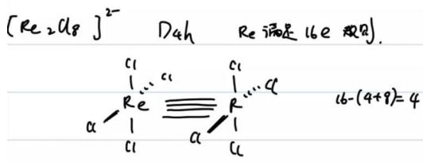

chemical

Chemical reaction equation involving reagent and hydrogenation steps

● 实验证据：气态结构中Re-Re键长显著短于单键理论值，支持双键存在。  
- 对称性关联： $D_{4h}$ 对称性配合物中，配体呈全重叠式排列（非交叉式），中心存在空位是形成多重键的典型

4）铼的配合物对称性 02:43:26

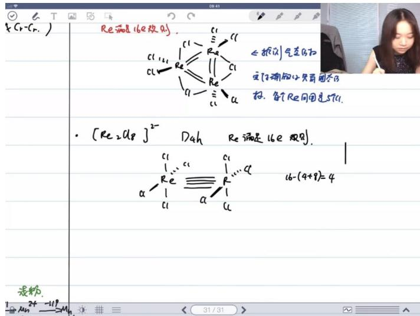

chemical

Chemical reaction diagram showing re-catalyzed rearrangement of a cyclic alkane with labeled angles and conditions

- $D_{4h}$ 特征：具有 $C_4$ 主轴和水平镜面 $\sigma h$ ，所有氯原子化学环境等同。  
- 结构推导：通过对称性要求可排除含桥联配体的结构，直接推导出平面四边形配位构型。

5）九羰基二锰 02:46:35

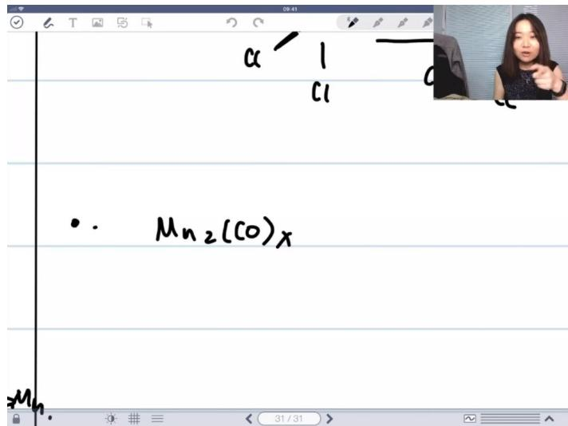

text_image

α
l
Cl
• . Mn₂(CO)ₓ
Mn

● 电子规则： $Mn_{2}(CO)_{x}$ 满足18电子规则时，x=10（每个Mn提供7个电子，9个CO提供18个电子，金属键贡献  
- 反应特性: 与Cl₂反应生成Mn(CO)₅Cl, 在AlCl₃/CO条件下进一步反应生成离子化合物 [Mn(CO)₆]⁺\left[AlCl\_4\right]^-\$。

6）锰的羰基化合物 02:47:46

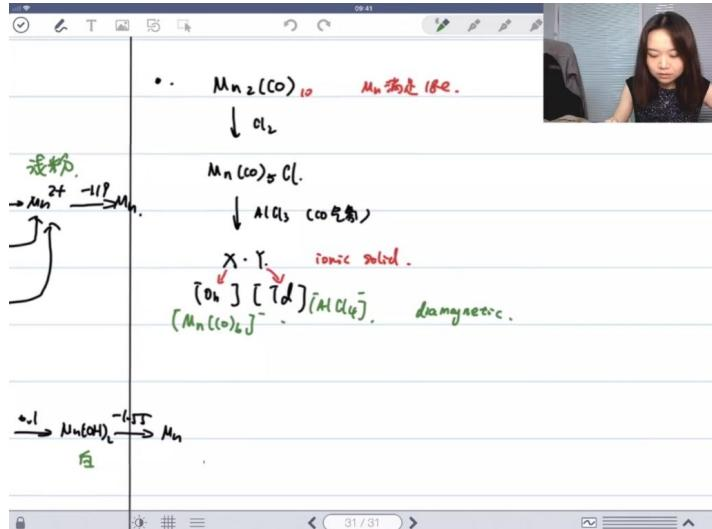

text_image

Mn2(CO)10
Mn滴定18℃.
↓Cl2
Mn(CO)5Cl.
↓AlCl3(CO气氛)
X·Y.
ionic solid.
[OH][Id][AlCl4-]
[Mn(CO)6]-
diamagnetic.
+1 → Mn(OH)2→ Mn
白

- 对称性特征：阳离子 $\left[Mn(CO)_{6}\right]^{+}$ 具有 $O_{h}$ 对称性（强场配体导致低自旋d构型），阴离子 $\left[AlCl_{4}\right]^{-}$ 具有 $T_{d}$ 对称性。  
- 磁性判断： $d^{6}$ 构型在强场下为逆磁性（无Jahn-Teller效应）。

# 4. 真题解析 02:50:34

# 1）重铬酸铵分解 02:50:57

\- 反应现象与产物推断

橙红色固体特征：重铬酸盐（如 $K_{2}Cr_{2}O_{7}$ ）具有特征性橙红色，是解题关键识别点  
- 灰绿色固体推断：三价铬化合物（如 $Cr_{2}O_{3}$ ）呈现灰绿色，与字幕中描述的b物质特征相符   
○ 气体产物判断：无色无味气体能与镁反应生成灰色固体（ $Mg_{3}N_{2}$ ），排除氧气，应为氮气  
☐ 实验现象链：加热重铬酸铵 $\left(\left(NH_{4}\right)_{2}Cr_{2}O_{7}\right)\rightarrow Cr_{2}O_{3}$ （灰绿） $+N_{2}\uparrow+H_{2}O$ ，是典型的热分解反应

\- 颜色变化反应序列

○ 三价铬特征： $Cr(OH)_{3}$ 与过量NaOH生成绿色溶液（ $[Cr(OH)_{4}]^{-}$ ）  
- 氧化过程：过氧化氢将三价铬氧化为六价铬（黄色 $CrO_{4}^{2-}$ ）

○ pH影响：加酸后黄色 $CrO_{4}^{2-}$ 转为橙色 $Cr_{2}O_{7}^{2-}$ ，体现铬酸根与重铬酸根的平衡  
○ 沉淀反应：加入 $Pb(NO_{3})_{2}$ 生成黄色 $PbCrO_{4}$ 沉淀，是铬酸根的特征检验反应

2）反应方程式书写 03:02:03

\- 关键反应式

○ 热分解： $(NH_{4})_{2}Cr_{2}O_{7}\Delta Cr_{2}O_{3}+N_{2}\uparrow+4H_{2}O$   
○ 氮化反应： $3Mg + N_{2} \rightarrow Mg_{3}N_{2}$   
- 两性反应： $Cr_{2}O_{3} + 2NaOH + 3H_{2}O \rightarrow 2Na[Cr(OH)_{4}]$   
○ 氧化过程： $2[Cr(OH)_{4}]^{-} + 3H_{2}O_{2} + 2OH^{-} \rightarrow 2CrO_{4}^{2-} + 8H_{2}O$

● 书写规范要点

○ 状态标注：必须标明气态(↑)、沉淀(↓)等状态符号  
○ 配平检查：特别注意铬元素价态变化导致的电子转移平衡  
- 条件标注：加热(△)、过量试剂等反应条件不可遗漏  
- 离子形式：溶液中的反应优先写成离子方程式形式

3）价电子组态判断 03:03:32

\- 锰的电子构型

○ 基态组态：锰(Mn)原子基态为 $[Ar]3d^{5}4s^{2}$   
○ 四价锰： $Mn^{4+}$ 失去4个电子后组态为 $3d^{3}$   
三价锰： $Mn^{3+}$ 组态为 $3d^{4}$ ，在 $Mn_{2}O_{3}$ 中呈现此状态

\- 答题规范要求

○ 轨道标明：必须写出3d轨道而非简单写"d轨道"   
○ 电子数标注：上标数字表示该轨道电子数，如 $3d^{3}$   
○ 完整表示：需写出从内层到价层的完整电子排布式  
○ 易错警示：忽略4s电子先于3d电子失去的特点会导致错误

4）羰基化合物结构 03:05:29

● 18电子规则应用

○ 计算要点：铬原子提供6个价电子，每个CO提供2个电子  
金属键形成： $Na_{2}[Cr_{2}(CO)_{10}]$ 中需形成Cr-Cr单键满足18电子规则  
○ 结构特征：可能采取交叉式或重叠式构型，实验常观测到两种构型共存

\- 羰基化合物类型

- 终端CO：大多数CO以终端方式配位（每个Cr配5个CO）  
- 桥连CO：某些情况下会存在μ-CO桥连结构  
○ 氧化态判断：配合物中铬的氧化态为-1价 $(Cr^{-1})$   
○ 空间构型：双核羰基化合物常采取八面体配位几何

5）配合物异构体数量 03:08:52

● 八面体配合物异构体分析 03:13:48

○ 双齿配体特征：当配合物中存在双齿配体c时，c可以表示成两个不同的配位点x和y（ $x \neq y$ ），这种情况比单齿配体更复杂  
○ 分析步骤:

■ 首先确定单齿配体a和b的排布方式（顺式或反式）  
■ 在每种a-b排布基础上，再考虑双齿配体c的x和y的排布方式  
■ 需要绘制所有可能的构型，仅靠想象容易遗漏

☐ 关键技巧：对于a和b配体，必须分别考虑它们处于顺位和反位的两种情况，然后在每种情况下再排列双齿配体的x和y位置

\- 立体化学分析方法

○ 构型绘制原则：

■ 先固定a-b的顺反关系  
■ 再依次排列双齿配体的x-y位置关系  
■ 最后检查每种构型是否有旋光性

# ○ 注意事项：

■ 必须绘制所有可能的构型（示例中最终确认有11种异构体）  
■ 实际考试中常假设为正八面体模型（所有配体到中心原子的键长相等）  
■ 更复杂情况（如配体本身具有手性）在考试中较少出现

# - 典型例题分析

○ 题目特征：给定八面体配合物组成，其中包含双齿配体（ $x \neq y$ ），要求计算异构体数量

# ○ 解题流程：

■ 列出a-b配体的顺反两种基本构型  
■ 在每种构型中排列双齿配体的x-y位置（反位和顺位）  
■ 检查ay反位、xy反位等特殊排列   
■ 最终确认所有不重复的构型（示例中为11种）

# ○ 易错点：

容易遗漏某些排列组合  
■ 对双齿配体不同配位点的区分不明确  
忽略构型之间的对称性关系

# 十、知识小结

<table><tr><td>知识点</td><td>核心内容</td><td>考试重点/易混淆点</td><td>难度系数</td></tr><tr><td>过渡金属元素特性</td><td>从左到右IE和ire失去电子能力变大;第五第六周期元素性质接近且显著惰性;离子半径与配位数关系</td><td>蓝系收缩效应导致后过渡元素单质密度大;高低自旋态对离子半径影响(10-20%差异)</td><td>★★★★</td></tr><tr><td>钛元素化学</td><td>二氧化钛晶体结构(金红石型);钛的制备(镁还原四氯化钛);钛的生物相容性和机械性能</td><td>银镜反应方程式配平;钛氧二正离子实际存在形式;三价钛离子颜色(浅紫色)及构型(畸变八面体)</td><td>★★★★</td></tr><tr><td>钒元素化学</td><td>五氧化二钒的两性特性;钒酸铵热分解制备五氧化二钒;不同价态钒离子颜色(黄/蓝/绿/紫)</td><td>三氯氧钒水解反应;过氧钒配合物的深蓝色特征反应</td><td>★★★</td></tr><tr><td>铬元素化学</td><td>酸性条件下 $Cr^{3+}$ 稳定(紫色),碱性条件下 $CrO_{4}^{2-}$ 稳定(黄色);重铬酸钾的氧化性</td><td>酒精检测反应原理;铬酸铅黄色沉淀特征;过氧化铬配合物的结构特点</td><td>★★★★</td></tr><tr><td>锰元素化学</td><td>酸性条件下 $Mn^{2+}$ (浅粉)和 $MnO_{2}$ (黑)稳定;碱性条件下易被氧化为 $MnO_{4}^{2-}$ (绿);高锰酸钾强氧化性</td><td>二氧化锰与浓盐酸反应制氯气;锰的不同价态歧化趋势; $Mn^{3+}$ 稳定存在的特殊条件( $CN^{-}/PO_{4}^{3-}$ 配合)</td><td>★★★★</td></tr><tr><td>配合物化学</td><td>18电子规则应用;配位数与异构现象;配体场理论解释颜色</td><td>Natta催化剂的催化循环; $[Mn_{2}(CO)_{10}]^{2-}$ 的结构推导;八面体配合物异构体数量计算</td><td>★★★★★</td></tr><tr><td>晶体结构分析</td><td>金红石( $TiO_{2}$ )的四方晶系结构;离子半径测量原理;配位数对半径的影响系数( $CN4=0.95\times CN6$ )</td><td>氧在金红石中的三配位特殊构型;晶胞中Ti/O原子数量计算</td><td>★★★★</td></tr><tr><td>颜色理论</td><td>d-d跃迁与互补色原理;配体场强度对吸收波长影响(红移/蓝移); $[Ti(H_{2}O)_{6}]^{3+}$ 的颜色解释</td><td>实验观察颜色与理论预测差异;电荷转移跃迁的强吸收特性</td><td>★★★★</td></tr><tr><td>催化反应机理</td><td>烯烃聚合的插入机理;配体吸附-解离过程;氧化加成/还原消除反应类型</td><td>Ziegler-Natta催化剂活性位点结构;烷基迁移的键重组过程</td><td>★★★★★</td></tr><tr><td>实验现象解析</td><td>铬酸根/重铬酸根互变(pH控制);锰的不同氧化态颜色变化;过氧化物特征反应</td><td>实验室铬酸溶液颜色变化指示失效;三价铬溶液实际呈现深绿色现象</td><td>★★★</td></tr></table>