# 一、有机化学03:20

# 1. 课程说明 05:36

● 加群重要性：必须加入付费课程专属群（非化学知心化学大群），该群包含所有课程资料（课前须知、讲义笔记、课后作业、课程通知等）

● 课前须知内容:

课程难度说明：课前测满分100分，60分合格，80分优秀，建议达到60分以上再报直播课  
课程资料说明：包含讲义、作业、考试、答疑等完整说明

● 授课特点：

○ 双语教学：核心化学概念会同时标注中英文，但以中文讲解为主，英文仅作辅助记忆  
○ 逻辑性：特别强调有机化学学习的逻辑体系

● 课程安排：

- 第一部分：有机化学定义及学习方法  
- 第二部分：成键与结构（分7个知识点讲解）  
○ 课时安排：3小时课程，含两次10分钟休息

2. 什么是有机化学 06:20

1）有机化学的定义 06:44

● 历史上第一个有机化学定义 06:48

来源背景：17-19世纪博物学家通过观察自然现象区分物质，认为无机物来自无生命体（如矿石），有机物来自生命体（如酒精、尿素、酒石酸晶体）。  
☐ 生命力理论：该定义认为有机物与无机物的本质区别在于"生命力"（vitalism），即有机物具有特殊的生命能量。典型例子包括：粮食发酵制酒、动物尿液提取尿素、植物蒸馏获得精油等。  
- 理论名称：该学说被称为vitalist theory（生命力理论），在当时的接受度高于碳化合物定义。

● 历史上第二个有机化学定义 08:26

○ 实验基础：通过燃烧实验发现所有有机物燃烧后都产生二氧化碳，得出有机物均含碳的结论。  
现代定义：有机化学是研究碳化合物的科学（Organic chemistry is the study of carbon compounds）。该定义至今仍被教材采用，而生命力理论已被证伪。  
典型反例：1828年维勒（Wöhler）通过无机物氰酸铵（ $NH_{4}OCN$ ）加热合成尿素（有机化合物）的实验，证明无机物可直接转化为有机物。

2）有机化学的定义发展 09:54

- 理论更替：从生命力理论到碳化合物理论的转变，反映了化学学科通过实验验证、修正理论的发展过程。  
● 关键实验：维勒实验（ $KOCN + NH_{4}Cl \rightarrow [NH_{4}OCN]$ △尿素）彻底否定了"生命力"的必要性。  
● 历史启示：说明化学理论具有可证伪性，新证据出现可能导致旧理论被推翻。

3）学习有机化学 11:46

\- 化学是一门实验科学 11:49

○ 学科本质：化学属于实验科学（experimental science），与数学的理论推导不同，其知识来源于实验观察而非纯逻辑推理。

● 化学是后验科学 12:10

\- 认识论特征：作为后验知识体系（a posteriori knowledge），化学理论必须通过观察事实反推得出，无法先验确定。

● 化学理论的特性 12:56

○ 可证伪性：化学理论只能被证伪（falsifiable）而无法被完全证实，任何反例都可能推翻或修正现有理论。  
- 局限性：所有理论都只在特定范围内适用，不能保证绝对正确性。

● 化学学习的重点：合理性而非正确性 13:52

○ 核心理念：追求合理性（reasonable）比追求绝对正确更重要。例如反应机理的合理性判断（The Art of Writing Reasonable Mechanism）。  
批判思维：需要全面考虑所有可能的解释因素（critical thinking），通过比较确定最合理的解释（deciding factor）。  
学习建议：在有机化学学习中应重点关注各种效应（effects）的综合分析，而非单一正确答案。

4）有机与无机区别 15:11

● 维勒实验的启示

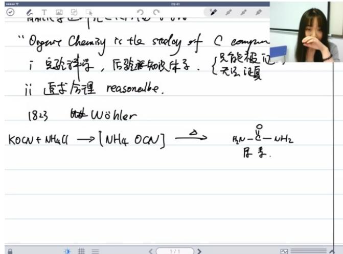

text_image

"Oggw+Chemistry is the stoley of C compun
i 实验步骤，后验通知波体子. {只能被记}
ii 追求方程 reasonelle.
1823 Wöhler
KOCN + NH4Cl → [NH4 OCN] → H2N - C - NH2
尿素.

实验细节：实际使用氰酸钾（KOCN）和氯化铵（ $NH_{4}Cl$ ）反应生成不稳定的氰酸铵中间体，加热后得到尿素。  
○ 同分异构现象：氰酸铵与尿素为同分异构体，这是首次实现无机物向有机物的转化。  
历史意义：该实验（1828年发表论文）彻底打破了有机物必须来自生命体的传统认知，确立了以碳元素为核心的现代有机化学定义。

5）有机与无机区别 20:14

● 有机化学与无机化学的分界线探讨 20:32

text_image

L→ 既存可选择资料、团来都考点到.
↑ ↑
最套理：决定性.

O

历史实验背景: 乌勒或维勒的实验首次挑战了有机物只能由生命体合成的传统观点，引发了对有机无机本质区别的思考  
现代观点演变：随着化学发展，有机与无机的分界线变得模糊，许多化合物同时具有两类特性

● 顺铂作为无机物抗癌药物的例子 20:45

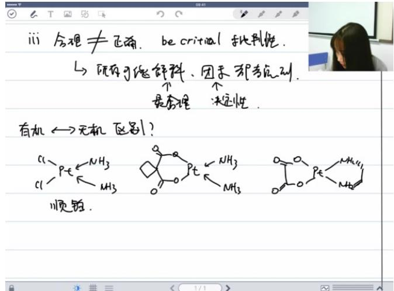

text_image

iii 分理 ≠ 正确. be critical 批比判性.
→ 既存可燃解料、团束 邻为法则.
最套理: 决定性.
有机 ↔ 无机 区别?
Cl-Pt-NH3
Cl-NH3
顺铂.

作用机理: 顺铂 $\left(NH_{3}PtCl_{2}\right)$ 进入血液后, 两个氯被水取代, 通过与DNA碱基对中的氮结合, 破坏癌细胞自我繁殖能力  
- 治疗局限性: 缺乏靶向性，会同时攻击健康细胞DNA，导致化疗副作用显著

● 顺铂药物的改进与有机成分的增加 21:52

○ 结构改良：将氯替换为含氧配体，分子中出现6个碳原子；进一步发展为含六元环结构，有机特征更明显  
- 毒性共性：无论结构如何改良，这类药物都保持抗癌活性，说明药效与有机/无机分类无关

● 金属有机化学作为中间过渡地带 23:03

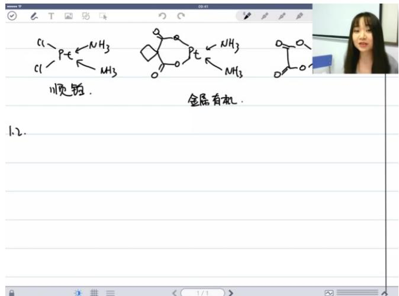

chemical

Chemical reaction diagram showing reduction of aniline to a metal carbonyl compound, with accompanying photo of a person in a classroom.

新兴领域: 金属有机化学已成为主流分支，填补了传统有机与无机化学间的空白
典型特征: 同时含有金属中心和有机配体，兼具两类化合物的性质和反应特点

● 学术界对有机与无机区别的看法 23:42

\- 教材观点: Clayden教材明确指出"不在意有机无机的区别"(We don't care)，反映现代化学界的普遍态度
- 分类意义：传统区分更多基于历史习惯而非本质差异，实际研究中更关注化合物特性而非分类

6）有机化学在意什么 24:03

● 有机化学关注的三大方面 24:19

text_image

顺铂.
金属有机.
1.2. 有机化学在是什么？
i. 反应性. (合成化学)
ii 结构
iii 反应性 → 结构
机理.
考虑

○ 合成化学: 关注分子构建方法，特别是复杂药物分子的设计与合成  
○ 结构研究: 探究原子如何组成分子，包括键型、空间排列等结构特征  
- 反应机理: 研究反应性与结构的关联，解释为什么特定结构会表现出特定反应性

● 有机化学的黄金时代与合成化学的里程碑 26:30

历史成就: 1950-1970年代实现维生素B等天然产物的全合成，证明实验室可复制自然界任何复杂分子  
- 创新突破: 进一步发展到创造自然界尚未发现的新分子，突破"自然创造"的局限

● 当前有机化学的研究热点与趋势 28:23

○ 机理研究: 从单纯合成转向反应机理探索，为靶向药物设计提供理论基础  
表征技术: 核磁共振等结构表征手段日益重要，用于捕捉不稳定反应中间体  
- 生物医学融合: 研究重点向生命科学延伸，关注有机物在生物体系中的功能

● 对有机化学学习的建议 32:49

- 考试趋势: 竞赛试题越来越注重机理考查，反映学科发展动向  
学习策略: 不必死记生物大分子结构，但需理解其与核心概念的联系  
- 知识整合: 通过氢键等关键概念建立有机与生物化学的认知桥梁

7）有机化学学习 34:00

● 有机化学的学习重点 34:05

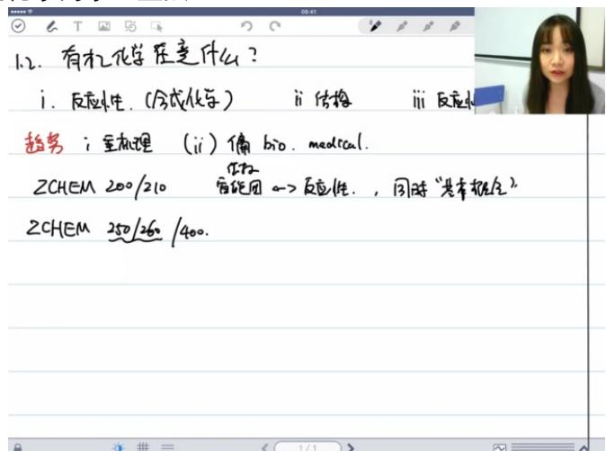

text_image

1.2. 有机化学在是什么？
i. 反应性. (合成化学)    ii. 结构    iii. 反应性
趋势 ; 安必理    (ii) 偏 bio.medical.
ZCHEM 200/210    后能团 → 反应性. ，同时“基本概念”。
ZCHEM 250/260 /400.

知识架构: 分两轮建立完整认知体系，先积累知识点再系统整合  
- 能力培养: 注重逻辑思维训练，避免机械记忆的学习方式

● 第一轮课程特点 34:31

- 内容组织: 按官能团分类学习，重点掌握结构与反应性的对应关系  
- 教材参考: 采用主流教材编写逻辑，确保基础知识完整覆盖  
- 概念串联: 通过核心概念连接不同知识点，初步建立体系框架

# ● 第二轮课程特点与分类 35:57

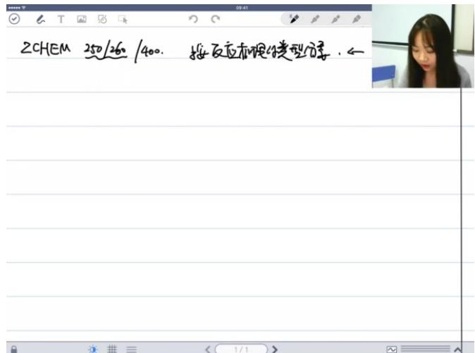

text_image

2CHEM 250/260/400. 按反应和理论类型分类.

逻辑重构: 按反应机理类型重新组织知识，形成更系统的理解  
- 深度分级: 设置250/260(基础)和400(进阶)两个难度层次，适应不同需求

# ● 第二轮与第一轮课程的关系 36:50

- 知识覆盖: 两轮涉及相同考点，但组织逻辑和深度不同  
- 竞赛适用: 国初和国学有机考点已趋同，学习内容基本一致

# ● 不同课程难度的区别 37:34

教学差异: 基础课程包含更多复习环节，进阶课程默认掌握基础知识  
案例深度: 通过不同复杂度的实例演示，满足不同层次学习需求

# 3. 成键与结构 38:26

# 1）成键的本质 38:50

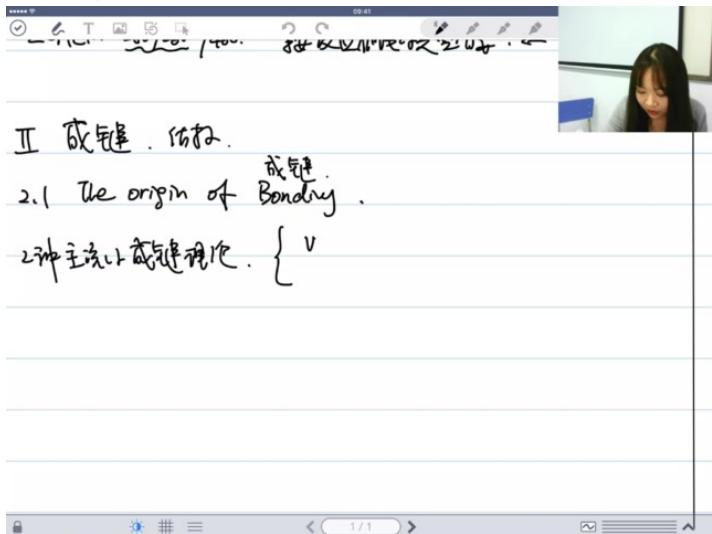

text_image

Ⅱ 成键. 结构.
2.1 The origin of Bondry.
2种主流以成键理论. {v}

● 理论框架：化学键形成存在两种主流解释理论——价键理论（VB理论）和分子轨道理论（MO理论）  
● 理解重点：所有化学定义都应注重理解而非死记硬背，考试主要考察化学思维而非定义本身  
- 价键理论40:10

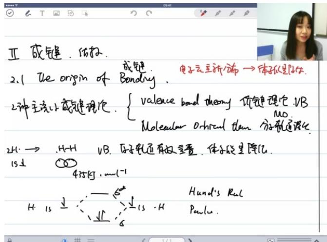

text_image

Ⅱ 成键. 结权.
2.1 The origin of Bonding.
2种主流小成键理论. { valence bond theory 项键理论. VB MO.
Molecular Orbital term 分子轨道理论
2H. → .H-H VB. 压子轨道有效置换. 体子能量降低.
1s↓
435g, ~1-1
H is ↓ :—B* ↓1s · H
Hund's Kul
Paulu.

○ 核心机制：原子轨道通过电子云重叠形成化学键，以 $H_{2}$ 为例：

■ 两个氢原子的1s轨道（各含1电子）相互重叠  
■ 形成H - H键释放约435kJ/mol能量

○ 能量变化：体系通过轨道重叠实现能量降低  
- 理论特点：采用局域化处理方式，适合解释定域键

\- 分子轨道理论 40:23

○ 形成过程:

■ 原子轨道线性组合形成分子轨道  
■ 电子按Hund规则和Pauli原理填入新轨道  
■ 形成σ键和σ\*反键轨道

典型特征：考虑整个分子的电子云分布，适合处理离域体系  
- 能量解释：电子填入低能级分子轨道导致体系能量降低

● 成键的本质小结 42:57

- 统一解释：两种理论共同揭示成键本质是电子云重新分布使体系能量降低  
○ 形象比喻：化学反应本质是"电子云的流动"（北大辩疆教授观点）  
- 理论互补性：VB理论直观但解释力有限，MO理论全面但计算复杂

2）分子轨道理论和价键理论的应用 45:05

● 适用范围对比：

○ VB理论：适合处理局域键（如单键、双键）  
- MO理论：适合处理离域体系（如大π键、周环反应）

- 有机化学应用：通常以VB理论为主，MO理论作为补充解释特殊现象（如 $O_{2}$ 的顺磁性）  
● 计算限制：MO理论对多原子分子计算复杂，实际应用中常采用局部化处理

3）原子轨道杂化 48:03

text_image

2.2. VB 理论.

● 原子轨道基础回顾 48:11

- 碳原子结构：基态电子排布 $1s^{2}2s^{2}2p^{2}$ ，价电子层4个电子  
成键矛盾：根据电子配对理论，碳原子仅含2个未成对电子，与四价事实不符

● 八隅体规则介绍与批判 49:27

基本内容：原子倾向于获得稀有气体电子构型（碳需8电子）  
○ 理论缺陷：

■ 实际存在大量例外（如超价分子）  
■ 西方学界认为"规则"（rule）一词使用不当

\- 更准确表述：原子具有获得稳定电子构型的倾向性

● 杂化轨道理论的提出 52:28

- 解决思路：通过轨道杂化解释碳的四价特性  
- 杂化本质：原子轨道线性组合形成新轨道（hybridized atomic orbital）

● 碳的SP3杂化与甲烷结构 53:10

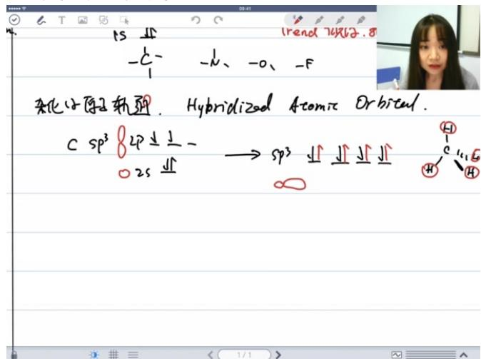

text_image

15 ∥
-∠- -√、-0、-F
钝化原子轨道. Hybridized Atomic Orbited.
C sp³ 84p⊥½-
○2s ∥ → sp³ ∥ ∥ ∥ ∥
∞
Irend 74662.8
④
③
④

○ 杂化过程：

■ 2s轨道与三个2p轨道混合  
■ 形成四个等价的SP³杂化轨道

○ 甲烷形成：每个SP³轨道与氢原子1s轨道重叠形成σ键  
○ 空间构型：正四面体（键角109.5°），由轨道排斥最小化决定

● 杂化轨道的电子云分布与构型关系 54:35

○ 构型决定因素：带负电的电子云相互排斥导致轨道最大程度分离  
- SP3轨道特征:

■ 电子云呈不对称"梨形"分布  
■ 继承s轨道的球形和p轨道的哑铃形特征

● SP2与SP杂化轨道的特点 56:11

○ SP2杂化:

■ 形成三个共平面轨道（键角 $120^{\circ}$ ）  
■ 剩余p轨道垂直于分子平面

○ SP杂化：

■ 形成两个线性排列轨道（键角180°）  
■ 剩余两个相互垂直的p轨道

○ 构型规律：杂化轨道数越多，键角越小（SP3<SP2<SP）

4）杂化轨道理论的VSEPR模型 58:19

● VSEPR模型的基本概念 58:40

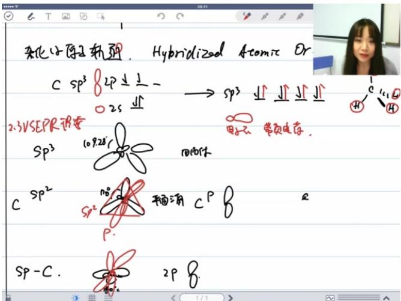

text_image

氧化碳原子轨道. Hybridized Atomic Or
C SP³ 82p⊥⊥ - → SP³ ↓↓ ↓↓ ↓↓
      0.2s ↓↓
2.3VSEPR设置
SP³ 109.28° C     田内体
C SP² 60° C     平面谱 CP B
      SP² P.
SP-C. 2P G.

全称解析：VSEPR是Valence Shell Electron Pair Repulsion（价层电子对互斥理论）的缩写

- 核心原理：电子云之间的静电排斥力导致电子对相互远离，形成特定空间构型  
- 与杂化关系：杂化轨道理论可直接推导出VSEPR模型，两者本质相通  
○ 应用示例： $SP^{3}$ 杂化解释甲烷的四面体结构（键角109.5°）

● SP2杂化轨道与乙烯的平面结构 59:16

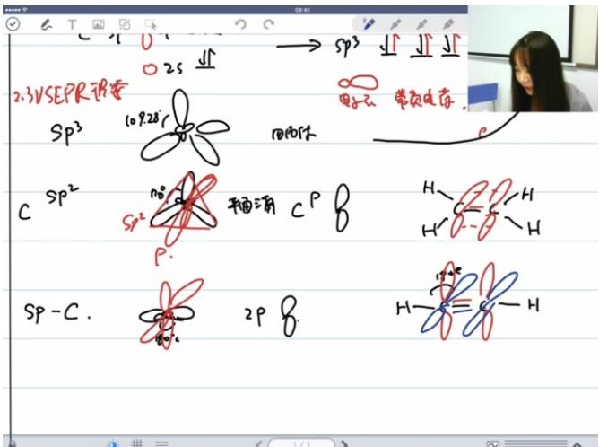

text_image

2.3VSEPR识别
SP³ (10.928)
C SP²
SP-C.
→ sp³ ↓↓ ↓↓ ↓↓
电子云 常质化学
平面源 CP B
H-H
H-H
H-H
H-H
2P B

○ 轨道组成：由1个2s轨道和2个2p轨道杂化形成3个 $SP^{2}$ 杂化轨道  
○ 键角特征：理论键角 $120^{\circ}$ ，实际因位阻效应略有偏差  
○ 成键方式：

■ $\sigma$ 键： $SP^{2}$ 杂化轨道"头碰头"重叠形成  
■ $\pi$ 键：未杂化的p轨道"肩并肩"重叠形成

\- 空间构型：乙烯分子中所有原子共平面， $p$ 轨道垂直于分子平面

● 乙炔的SP杂化轨道与结构 01:00:17

○ 轨道特征：1个2s与1个2p轨道杂化形成2个SP杂化轨道  
- 几何构型：直线型分子（H-C≡C-H），键角180°  
○ 多重键构成：

■ 1个 $\sigma$ 键由SP杂化轨道形成  
■ 2个相互垂直的 $\pi$ 键由剩余p轨道形成

○ 空间关系：两个 $\pi$ 键分别位于纸面内（与直线垂直）和垂直于纸面

# 5）应用案例 01:09:31

● 例题:分子杂化类型判断 01:09:41

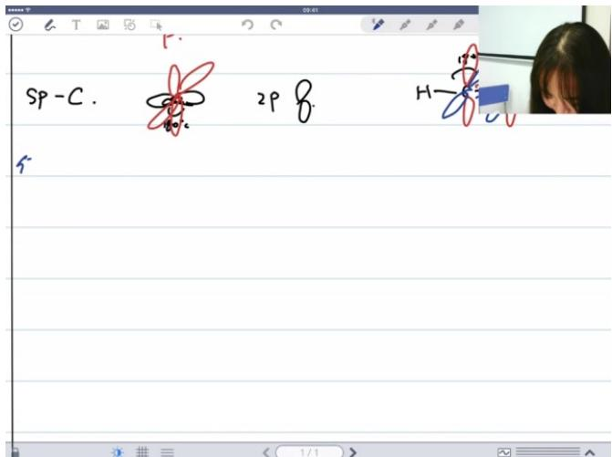

text_image

sp-c.
2p 8.
H-

○
○ 题目解析

■ 解题要点：根据碳原子成键方式判断杂化类型

- SP: 三键碳（如-C≡C-）  
- $SP^{2}$ : 双键碳（如 $= \mathbf{C} =$ ）  
- $SP^{3}$ : 单键碳（如- $\mathrm{CH}_{3}$ ）

■ 典型答案：2个SP，2个 $SP^{2}$ ，4个 $SP^{3}$ （具体数值依题目而定）

■ 记忆技巧：杂化轨道数= $\sigma$ 键数+孤电子对数

● 例题:键角和共面问题 01:12:47

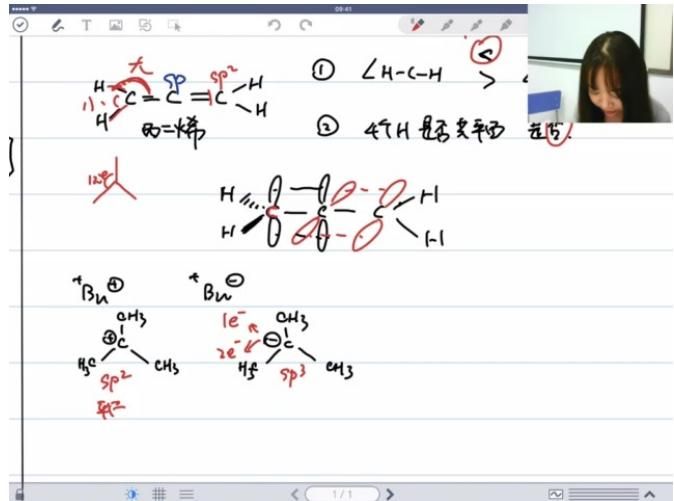

chemical

Handwritten chemical reaction equations involving thiophene and alkene, with molecular structures shown below

○
○ 题目解析

■ 键角比较： $\angle H-C-H<\angle H-C=C$ （因双键位阻效应更大）  
■ 共面分析：四个氢原子不共面，分属两个垂直平面  
结构解释：

- 中心SP碳的两个π键互相垂直  
- 末端 $SP^{2}$ 碳的 $\sigma$ 键需与 $\pi$ 键垂直

■ 常见错误：误认为所有原子共面或键角相等

● 例题:舒丁基正负离子几何结构 01:17:27

○ 题目解析

■ 杂化类型:

- 正离子： $SP^{2}$ 杂化（平面三角形）  
● 负离子： $SP^{3}$ 杂化（三角锥形）

电荷表示：

● 负号代表两个电子（孤对电子）  
● 有机化学中负电荷标注强调反应位点

■ 构型差异：正离子平面结构与负离子立体结构的对比

■ 易错点：误认为负电荷对应单个电子（无机化学常见误解）

6）如何画或表示有机结构 01:21:39

● 三种有机结构表示方法 01:22:47

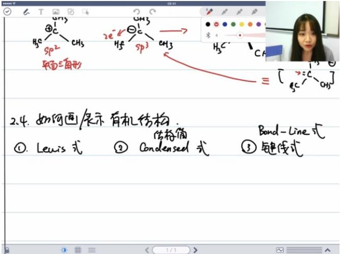

text_image

平面三角形
2.4. 如何画/展示有机结构.
①. Lewis 式
②. Condensed 式
③. 链线式
Bond-Line 式

O

○ Lewis式:

■ 特点：需写出所有原子和价电子，能清楚看到电子分布  
■ 用途：主要用于教学过渡，实际有机化学中几乎不考  
■ 示例：异丙醇的Lewis式需写出所有C、H、O原子及价电子  
■ 局限：绘制速度慢，仅适用于第二周期元素（B、C、N、O、F）的八隅体判断

○ 结构简式(Condensed式):

■ 规则：缩写碳链结构，只画出碳与杂原子间的键  
■ 适用：小分子表示（如乙醇 $CH_{3}CH_{2}OH$ ）  
■ 优势：书写快捷，常用于命名和文字描述

○ 键线式(Bond-Line式):

绘制步骤：

● 用折线表示碳骨架（每个折点代表一个碳原子）  
● 杂原子需标元素符号，杂原子上氢需写出  
● 选择性标注重要孤对电子和立体结构

■ 优势：最适合复杂分子（如药物分子）的快速绘制  
■ 示例：异丙醇键线式为折线加-OH标注

● 键线式绘制规范详解

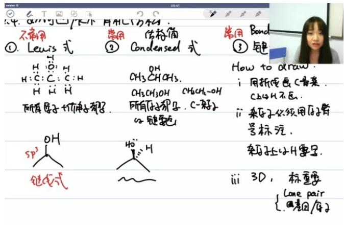

text_image

不使用
①. Lewis 式
H: O: H
H: C: C: C: H
H: H: H
所有原子+价离子离子.
常用  结构简
② Condensed 式
OH
CH₃CH(OH)₃.
CH₃CH(OH)₃OH CH₆CH₄-OH
所有原子离子 C-离子
C-键氢包
How to draw.
i 用折线色 C-香菜.
CH₄H不屈.
ii 来子必须用原子臂号标注.
sp³
链线式
HO:H
~~
轭子H要呈.
iii 3D，标重要
Lone pair
{a带目/原子}

# ○ ○ 碳骨架表示：

■ 折线每个转折点默认为一个 $sp^{3}$ 杂化碳   
■ 直线连接表示碳链，无需标注碳原子符号

# ○ 杂原子处理：

■ 必须明确写出O、N、S等杂原子符号  
■ 杂原子连接的氢需标出（如-OH、 $-NH_{2}$ ）

# ○ 立体结构表示:

■ 重要氢原子可选择性标出（如手性中心）  
■ 可用楔形线表示三维构型  
■ 反应机理中需标出参与反应的孤对电子

# ● 例题：异丙醇的结构式

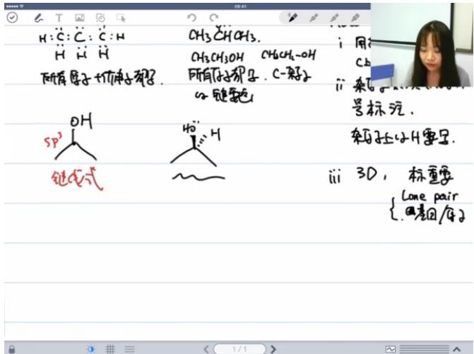

text_image

H:C:C:C:H
H H H
所有原子+价离子原子.
CH₃CH(OH)₂
CH₃CH₃OH CH₆CH₄-OH
所有原子原子.C-原子
α键氢色
号标注.
苯子H₂=H装置.
SP³
链式
HO
H
iii 3D，标重要
{Lone pair
{苯因/原子}

# ○ ○ 题目解析

■ Lewis式：完整展示所有原子和电子对  
■ 结构简式： $CH_{3}CH(OH)CH_{3}$ 的缩写法  
■ 键线式：最简洁的折线加官能团表示  
■ 关键点：比较三种方法的书写效率和适用场景

# ● 例题：阿莫西林的结构 01:33:53

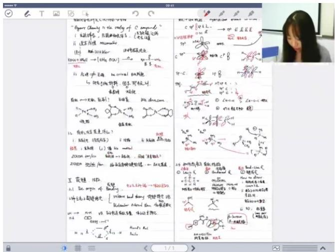

text_image

"Organ Chemistry is the reaction of C compound."
i. 玻璃体: 原质酸的洗液: 无碱性过热
ii. 过方处理: monoxide
(1) 玻璃: WuHomer → 2H₃OCH₂OH
Koals: WuHI → [CH₃COOH] → 2H₃OCH₂OH
iii. 合理: 无碱性过热
4. 钠离子: HBr control 纳氧键
5. 氨离子: 硫化
固体 → 无碱性过热:
① 碱键 (结构式)
② 碱键 (结构式)
③ 碱键 (结构式)
④ 碱键 (结构式)
⑤ 碱键 (结构式)
⑥ 碱键 (结构式)
⑦ 碱键 (结构式)
⑧ 碱键 (结构式)
⑨ 碱键 (结构式)
⑩ 碱键 (结构式)
⑪ 碱键 (结构式)
⑫ 碱键 (结构式)
⑬ 碱键 (结构式)
⑭ 碱键 (结构式)
⑮ 碱键 (结构式)
⑯ 碱键 (结构式)
⑰ 碱键 (结构式)
⑱ 碱键 (结构式)
⑲ 碱键 (结构式)
⑳ 碱键 (结构式)
㉑ 碱键 (结构式)
㉒ 碱键 (结构式)
㉓ 碱键 (结构式)
㉔ 碱键 (结构式)
㉕ 碱键 (结构式)
㉖ 碱键 (结构式)
㉗ 碱键 (结构式)
㉘ 碱键 (结构式)
㉙ 碱键 (结构式)
㉚ 碱键 (结构式)
㉛ 碱键 (结构式)
㉜ 碱键 (结构式)
㉝ 碱键 (结构式)
㉞ 碱键 (结构式)
㉟ 碱键 (结构式)
㉳ 碱键 (结构式)
㉴ 碱键 (结构式)
㉵ 碱键 (结构式)
㉓ 碱键 (结构式)
㉔ 碱键 (结构式)
㉕ 碱键 (结构式)
㉖ 碱键 (结构式)
㉗ 碱键 (结构式)
㉘ 碱键 (结构式)
㉙ 碱键 (结构式)
㉚ 碱键 (结构式)
㉛ 碱键 (结构式)
㉐ 碱键 (结构式)
㉔ 碱键 (结构式)
㉕ 碱键 (结构式)
㉖ 碱键 (结构式)
㉗ 碱键 (结构式)

# ○ ○ 题目解析

■ 结构特点：含β-内酰胺环的抗生素  
■ 键线式优势：清晰展示复杂分子骨架和官能团

■ 杂原子分析：

● 氮原子孤对电子数（1对）  
● 氧原子孤对电子数（2对）  
● 硫原子孤对电子数（2对）

■ 立体化学：SP²杂化氮的平面结构

■ 生物活性：β-内酰胺环与酶活性位点的共价结合机制

# - 键长与键能关系

<table><tr><td colspan="5">Trend: 链长↑ ⇒ 键能↓.</td></tr><tr><td colspan="5">侧：键长的单位. nm 10-9m. A 埃 10-10m.</td></tr><tr><td>c-x/A&#x27;</td><td>x=F</td><td>x=C1</td><td>x=Br</td><td>x=I.</td></tr><tr><td>+x</td><td>1.40</td><td>1.78</td><td>1.97</td><td>2.16</td></tr><tr><td>=x</td><td>1.34</td><td>x</td><td>1.88</td><td>2.10</td></tr><tr><td>≡-x</td><td>1.27</td><td>1.63</td><td>1.79</td><td>y</td></tr></table>

# 基本规律：

■ 键长越长，键能越小（电子云重叠程度降低）  
■ 单位换算： $1\mathring{A}=0.1nm=10^{-10}m$

# ○ 实例分析：

■ C-F键：1.40Å（最短，键能最大）  
C-Cl键：1.78Å  
C-Br键：1.88Å  
■ C-I键：2.10Å（最长，键能最小）

\- 理论解释：基于VB理论，键长增加导致原子轨道重叠效果变差，键能下降

# 4. 键长与键能趋势 01:37:27

# 1）碳碳键趋势分析 01:41:40

# - 碳氟键键长变化趋势

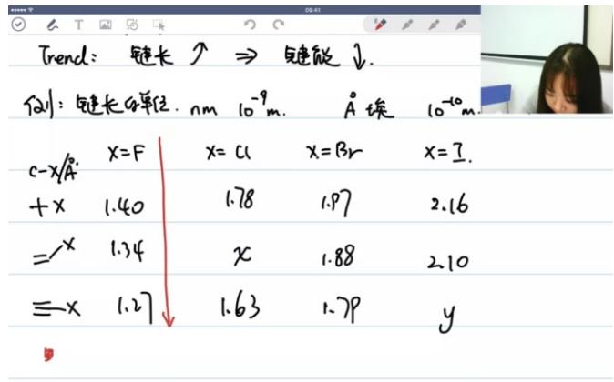

text_image

Trend: 链长 ↑ ⇒ 键能 ↓.
例: 键长单位. nm 10⁻⁹ m. A 埃 10⁻¹⁰ m.
c-x/A' x=F x=C1 x=Br x=I.
+x 1.40 1.78 1.97 2.16
=/x 1.34 x 1.88 2.10
≡-x 1.27 1.63 1.79 y

纵向趋势：从烷基氟化物（ $SP^{3}-C$ ）到乙烯基氟化物（ $SP^{2}-C$ ）再到乙炔基氟化物（ $SP-C$ ），碳氟单键键长逐渐缩短（1.40Å→1.34Å→1.27Å）  
○ 单位说明：键长常用埃（Å）为单位， $1\mathring{A}=10^{-10}m$ ，皮米（pm）也可用但教材多用埃

# ● 杂化效应的概念 01:43:27

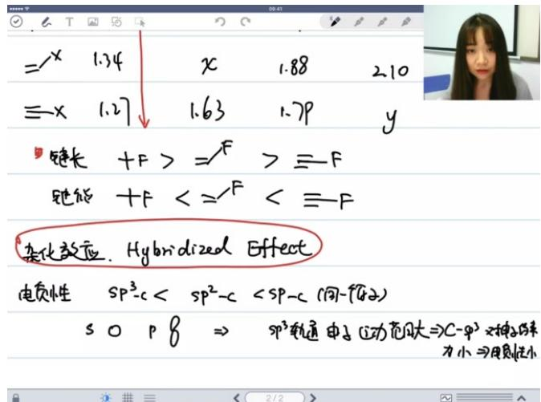

text_image

=/x 1.34 x 1.88 2.10
≡-x 1.27 1.63 1.79 y
链长 +F > =/F > =-F
链能 +F <=/F < =-F
杂化效应. Hybridized Effect
电负性 SP³-c < SP²-c < SP-c (同-Fe₂)
s o p f ⇒ sp³轨道电子(运动范围大⇒C-φ³)这种子体素为小⇒月负性小

2/2   
本质：描述杂化轨道中s成分比例对电子约束力的影响  
- 英文术语：Hybridization Effect (Hybn·d·Effect)  
○ 轨道特性：

■ s轨道：球状，电子运动范围小  
■ p轨道：八字形，电子运动范围大

● 杂化效应对电负性的影响 01:44:03

○ 电负性排序： $SP^{3}-C<SP^{2}-C<SP-C$ (13-18)  
○ 机制解释：

■ s成分比例：SP轨道s成分最高（50%），SP3最低（25%）  
■ 电子约束力：s成分越高，电子运动范围越小，对电子约束力越强  
■ 电负性结果：SP碳电负性最大（约3.29），SP3碳最小（约2.48）

● 杂化效应对碳氟键键长的影响 01:46:19

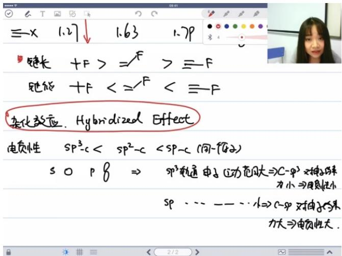

text_image

≡× 1.27 ↓ 1.63 1.7P
链长 +F > =F > =F
键能 +F <=F < =F
杂化效应. Hybridized Effect
电负性 SP³-c < SP²-c < SP-c (同一原子)
s o p f ⇒ SP³轨道电子(动范围大⇒C-φ)对称子约束为小⇒电负性小
SP … —— ... 小⇒C-φ 对称子约束力大⇒电负性大.

○ 作用机制：

■ SP3碳对σ键电子约束弱→键长较长（1.40Å）  
■ SP碳对σ键电子约束强→键长较短（1.27Å）

○ 键能推论： $SP^{3}-CF$ 键能 $<SP-CF$ 键能（键长与键能成反比）

2）卤素原子趋势分析 01:47:15

● 链长键能的变化趋势 01:47:18

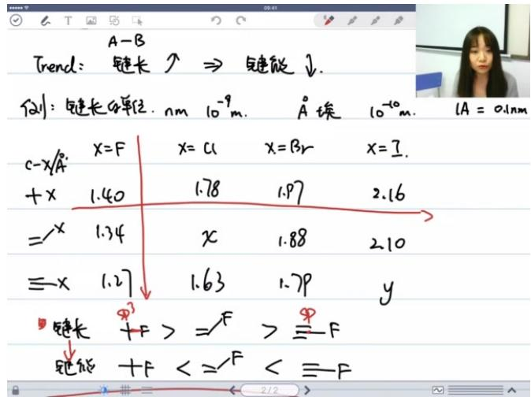

text_image

A-B
Trend: 链长 ↑ ⇒ 键能 ↓.
例: 键长的单位. nm 10^-9 m. A 埃 10^-10 m. IA = 0.1nm
c-x/a^2 x=F x=c1 x=Br x=7.
+x 1.40 1.78 1.97 2.16
=^x 1.34 x 1.88 2.10
≡-x 1.27 1.63 1.79 y
链长 +F > =^F > =^F
链能 +F <=^F < =^F

横向趋势：同种杂化碳（如SP3）与卤素成键时，键长F（1.40Å）<Cl（1.78Å）<Br（1.97Å）<I（2.16Å）

\- 原因：卤素原子半径显著增大（F→I原子轨道主量子数增加）

● SP2与SP3碳的电子约束力比较 01:48:26

\- 约束力对比： $SP^{2}$ 碳对电子约束力介于 $SP^{3}$ 与 $SP$ 之间

○ 典型数据：

\- 约束力对比： $SP^{2}$ 碳对电子约束力介于 $SP^{3}$ 与SP之间
- 典型数据：

■ $SP^{2}-C-Cl$ : 1.78Å

■ SP - C - I: 1.79Å

■ $SP^{2}-C-Cl:1.78\mathring{A}$ ■ $SP-C-I:1.79\mathring{A}$

● 例题1: 判断x与y的大小 01:48:53

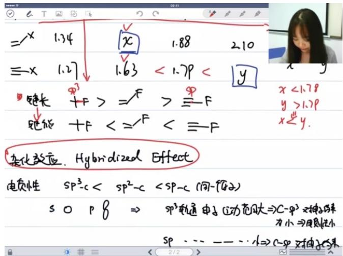

text_image

=x 1.34 x 1.88 2.10
≡-x 1.27 1.63 <1.79 < y
链长 φ³ +F > =F > =F
矩能 +F <=F < =F
x <1.78
y >1.79
x ≤ y.
杂化效应. Hybridized Effect
电负性 SP³-c < SP²-c < SP-c (同一符号)
S O P Q ⇒ SP³轨道电子(功范围大⇒C-Q³对称子体为小⇒电负性小
SP … —— 小⇒C-Q³对称子体

○
○ 题目要素：

x=SP $^{2}$ - C - Cl键长  
■ y=SP - C - I键长

\- 矛盾趋势：

■ 杂化效应预测： $x>y\ (SP^{2}$ 约束力弱于SP）  
■ 原子半径预测：x<y（Cl半径<<l半径）

○ 实际判断：x (<1.78Å) < y (>1.79Å)   
- 结论：原子半径效应占主导地位

● 杂化效应与原子半径效应的对比 01:50:16

○ 效应强度：原子半径影响（约0.4Å差异）>杂化效应影响（约0.1Å差异）  
- 记忆要点：当两种效应冲突时，优先考虑原子半径因素

3）键能趋势分析 01:50:30

● 键能与结构的关系 01:50:36

- 研究意义：预测反应位点（通常优先断裂最弱键）  
○ 结构关联：键长↑→键能↓（反比关系）

● 键能的定义 01:51:19

○ 标准定义：标准状态下使1mol气态分子AB均裂为气态原子A和B所需的能量  
○ 等价表述：气态原子A和B形成1molAB键释放的能量

● 键能的两种断裂方式 01:51:49

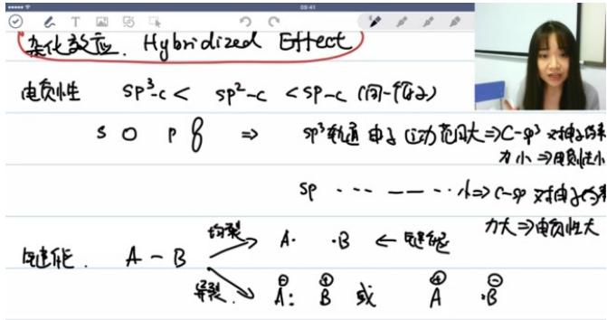

text_image

杂化效应. Hybridized Effect
电负性 SP³-c < SP²-c < SP-c (同-原子)
s o p f ⇒ SP³轨道 由子①功范围大⇒C-sp³叉掉子体来
力小⇒电负性小
sp ··· ···↓⇒C-sp 对由子(与
电键能. A-B → A·B ← 跟理
导裂: A: B 或 A: B

均裂：键电子对均分（A·+B·），键能测定基准  
○ 异裂：键电子对转移（A: $^{-}$ +B $^{+}$ 或A $^{+}$ +B: $^{-}$ ），与键能无关

● 实例分析：三根键的键能排序 01:52:49

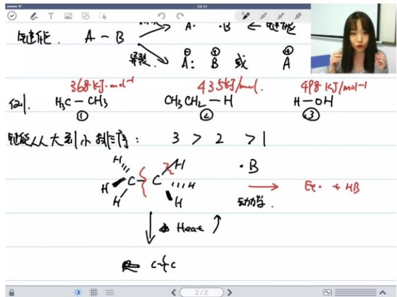

text_image

能. A - B
368 kJ/mol-1
例. H₃C - CH₃
①
435kJ/mol.
CH₃CH₂ - H
②
998 kJ/mol-1
H-OH
③
能从人大到小排序: 3 > 2 > 1
H C{C} H
H
B
→
Ee + HB
↓ HeaE ↑
C-fc

# ○ 测试键:

$CH_{3}-CH_{3}$ (C-C) : \~368kJ/mol   
$CH_{3}CH_{2}-H(C-H): \sim 435kJ/mol$   
■ $H_{3}C-OH(O-H)$ : \~498kJ/mol

○ 正确排序：3 > 2 > 1  
- 认知误区：O-H易异裂（酸碱反应）≠均裂能低

● 键能与反应性的关系 01:56:46

○ 乙烷断裂实例：

■ 热力学：C-C键（368）< C-H键（435），应优先断裂  
■ 动力学：自由基易碰撞H原子，实际多断C-H键

○ 控制因素：

■ 高温热解：热力学控制（得C-C断裂产物）  
常规反应：动力学控制（得C-H断裂产物）

● 综合分析的重要性 01:58:56

○ 关键原则：不能仅凭键能预测反应，需结合：

空间位阻  
■ 进攻试剂特性  
■ 反应条件（T/P/溶剂）

学习方法：建立多因素分析框架，识别主导因素

5. 复习 02:09:07

1）例题1: 碳碳键键长排序 02:09:45

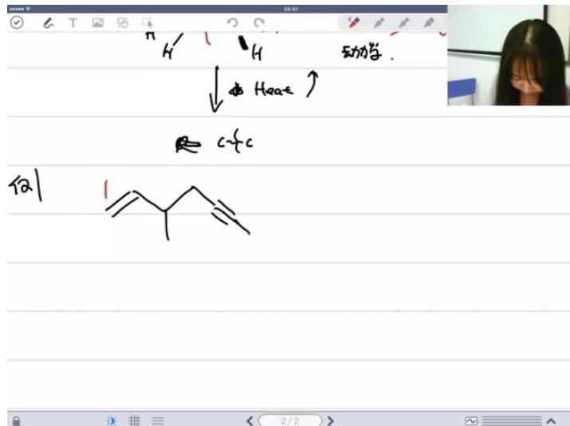

text_image

动学
H H
↓ Hea↑
→ CFC
例 1

● 题目解析

○ 题目要求对5根碳碳键（包含单键、双键、三键）按键长从长到短排序  
○ 常见错误答案：53214（不合理）和32514（部分正确）  
○ 正确答案: $3 > 2 > 5 > 1 > 4$   
○ 易错点：容易混淆键长与键能的关系（键能需要反过来排序）

2）知识点：杂化效应与键长关系 02:13:21

text_image

列短排序：
3 > 2 > 5 > 1 > 4 考知识效应.

$$
\mathrm {电 负 性} / \mathrm {对 由 子 的 策 能 力} \quad \begin{array}{l l l} {{s p}} & {{> s p ^ {2}}} & {{> s p ^ {3}}} \\ {{⑤}} & {{<   ②}} & {{<   ③}} \end{array}
$$

2.6.

- 电子约束能力： $SP > SP^2 > SP^3$ 杂化轨道对电子的约束能力依次减弱  
● 键长影响机制：电子约束能力越强，键长越短（电子云被拉得更紧）  
- 具体关系：

- SP杂化（如三键）：键长最短（）  
- $SP^{2}$ 杂化（如双键）：键长中等（）  
- $SP^{3}$ 杂化（如单键）：键长最长（）

● 记忆要点：杂化轨道s成分越多（SP>SP2>SP3），键长越短

6. 偶极矩 02:15:41

1）键的极性电负性 02:16:37

● 键的极性概念及衡量标准

text_image

电质性/对电子的素能力 sp > sp² > sp³
⑤ < ② < ③

2.6. Dipole moment 偶极矩.

①.键.极性 $\leftrightarrow$ 电负性

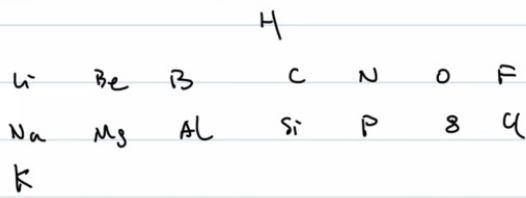

text_image

Li Be B C N O F
Na Mg Al Si P 8 C
K

- 衡量标准：键的极性用电负性差异来衡量，电负性差值越大键极性越强  
- 杂化影响：电负性/电子吸引能力遵循 $SP > SP2 > SP3$ 的规律  
○ 符号表示：偶极矩用 $\mu$ 表示，计算公式为 $\mu=q\times d$ （q为电荷量，d为距离）

● 电负性表及常见元素电负性值 02:16:55

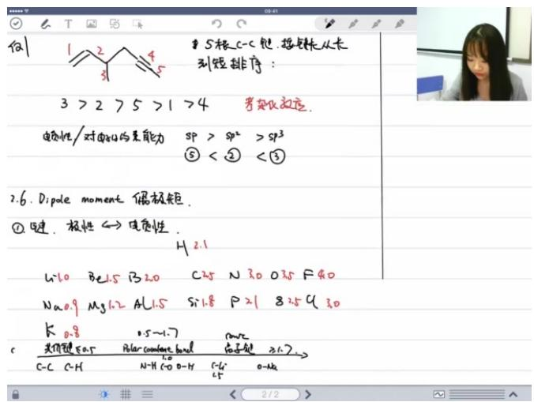

text_image

例
1 2 3 4 5
#5根C-C矩，按针从长
列矩排序：
3 > 2 > 5 > 1 > 4 考氧化效应。
韧性/对由84的束能力 sp > sp² > sp³
⑤ < ② < ③
2.6. Dipole moment 偶极矩.
①键. 极性←使其性.
H 2.1
Li 10 Be 1.5 B 2.0 C 2.5 N 3.0 O 3.5 F 4.0
Na 0.9 Mg 1.2 Al 1.5 Si 1.8 P 2.1 8.25 g 3.0
K 0.8 0.5~1.7 m/z
共价键Ea5 Polar conductance bowl 南子键 3.2.
C-C C-H N-H CO O-H C-6 0-N+

# 重要数值：

■ H:2.1 Li:1.0 Be:1.5 B:2.0   
C:2.5 N:3.0 O:3.5 F:4.0   
Na:0.9 Mg:1.2 Al:1.5 Si:1.8 P:2.1 S:2.5 Cl:3.0

\- 记忆要点：碳氢氧（C:2.5 H:2.1 O:3.5）是必须掌握的基础数值

● 键的极性分类与定义 02:18:08

○ 分类标准：

■ 非极性共价键：电负性差 ≤ 0.5（如C-C键差值为0）  
■ 极性共价键：电负性差0.5-1.7（如C-H差0.4）  
■ 离子键：电负性差≥1.7（如O-Na差2.6）

● 典型化学键的极性分析 02:18:46

○ 常见键型：

C-H: 0.4 (弱极性)   
N-H: 0.9 (中等极性)   
■ O-H: 1.4 (强极性)   
C-O: 1.0（中强极性）

边界案例：

C-Li: 1.5（接近离子键，常按离子键处理）  
■ O-Na: 2.6（典型离子键，如苯酚钠）

● 键的极性与离子键、共价键的关系 02:19:54

☐ 过渡特征：某些键（如C-Li）处于离子键与共价键的边界，实际处理时需根据化学环境决定  
有机化学特点：多数有机物以共价键为主，但醇钠（如CH3ONa）等含O-Na键的化合物明确属于离子型

● 键的极性大小判断 02:20:21

○ 核心规律：两原子电负性差值越大，键极性越强   
○ 实例比较:

■ O-H (1.4) > N-H (0.9) > C-H (0.4)   
■ C-O（1.0）介于N-H和O-H之间

2）键的偶极矩 02:20:39

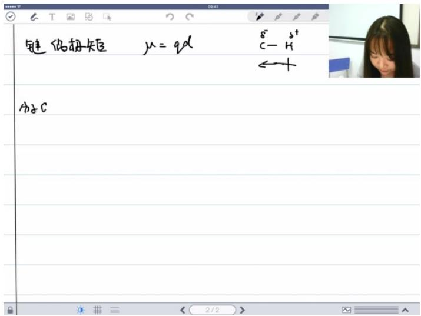

text_image

链偶极矩 μ=qd
δ⁻ s⁺
C-H
←+
A₂c

● 表示方法：用→符号表示，箭头从 $\delta+$ 指向 $\delta-$   
- 方向判定：

○ C-H键： $H(\delta + ) \rightarrow C(\delta - )$   
○ C-Cl键： $C(\delta + ) \rightarrow Cl(\delta - )$

\- 矢量特性：偶极矩是矢量，具有方向性，起始端用短横线标记

3）分子的极性和偶极矩 02:21:54

- 分子偶极矩：所有键偶极矩的矢量叠加结果  
● 判定方法：

○ 绘制各键偶极矩矢量  
- 进行矢量合成计算

● 实例分析（一氯甲烷）：

○ 三个C-H键偶极矩在空间相互抵消  
○ C-Cl键偶极矩主导分子极性方向  
- 最终偶极矩为各矢量合成结果

● 极性判断：只要合成偶极矩不为零即为极性分子  
● 实验测定：可通过折光率等实验手段测量偶极矩数值d

4）应用案例 02:24:16

● 极性分子的判断 02:24:17

○ 判断依据

■ 电负性差异：主要考虑强极性键（如 $C = O$ 键），弱极性键（如 $C - H$ 键，电负性差仅0.4）通常忽略  
■ 偶极矩方向：负端指向电负性大的原子（如氧原子电负性3.5），正端指向电负性小的原子

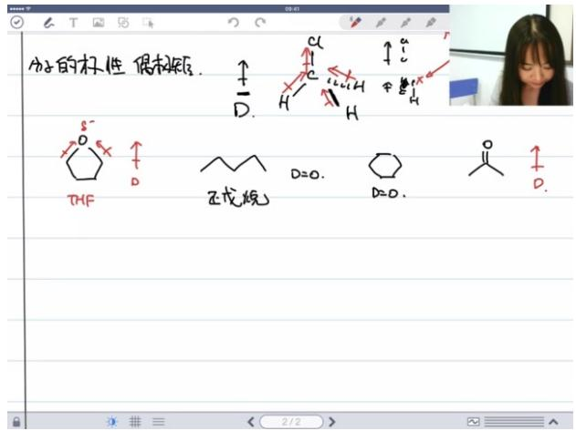

chemical

Handwritten chemical reaction diagram showing radical intermediates and products THF, 正戊烷, and ketone with labeled arrows and conditions

○ 典型分子分析 02:25:36

四氢呋喃(THF):

● 结构特征：含两根强极性C-O键   
● 偶极矩方向：从碳指向氧  
● 简写：THF（Tetrahydrofuran）

正戊烷：

● 键型：仅含C-C和C-H非极性共价键   
● 偶极矩：d = 0，典型非极性溶剂

丙酮：

● 强极性键：C = O 键   
● 偶极矩方向：明确朝向氧原子

● 常见有机溶剂的极性

○ 非极性溶剂

■ 代表物质：正戊烷、环己烷  
■ 共同特征：仅含C-C和C-H键，偶极矩d=0

\- 极性溶剂

二氯甲烷：

● 分析方法：先分析各键偶极矩方向（C - Cl键朝向Cl，C - H键朝向C）  
● 合成偶极矩：位于两个C - Cl键夹角中间方向

■ 三氯甲烷：

● 偶极矩方向：明确朝向z轴（三个氯原子的合成方向）

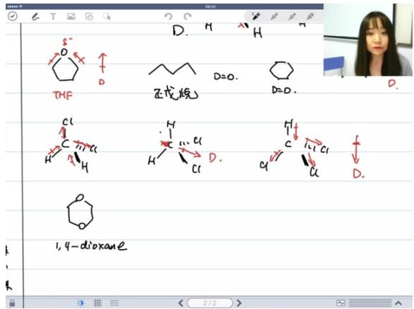

chemical

Hand-drawn chemical structures of THF, 正戊烷, and 1,4-dioxane with labeled atoms and bonds

○ 特殊案例：1,4-二氧六环

■ 构象影响：

● 椅式构象：两对C-O键偶极矩相互抵消，d=0   
● 船式构象：偶极矩不为零

■ 实际性质：

● 理论分析：椅式更稳定（位阻和孤电子对排斥更小）  
● 实验测量：实际偶极矩约0.4（因船式构象存在）  
● 应用特性：沸点高于THF（约100℃），极性较弱

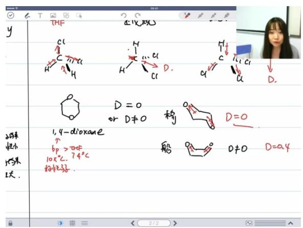

text_image

y
THF
正化脱
Cl
H C H
H H C H
H H C H
D.
α α
α
D.
D = 0
or D ≠ 0
椅
D = 0
小球
性小
比来
大.
1,4-dioxane
↑
6p > 0HF
10℃, 7℃
好性好。
船
D ≠ 0 D = 0.4

● 分子间相互作用力 02:34:47

基本分类

■ 作用机理分类：

● 轨道相互作用：包括轨道重叠等  
● 静电作用力：包括范德华力等

■ 有机化学重点：

● 范德华力（van der Waals forces）  
- 氢键（Hydrogen bonding）

○ 术语区分

■ 分子间作用力：intermolecular forces（IMF）  
■ 分子内作用力：intramolecular forces  
■ 记忆要点：前缀"inter-"表示分子间，"intra-"表示分子内

● 范德华力 02:37:50

\- 本质与分类

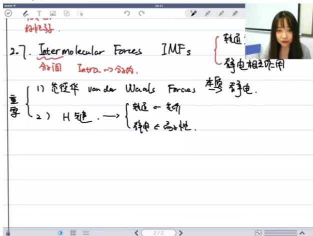

text_image

2.7. Intermolecular Forces IMFs
表面 Intra → 分离。
主要
1) 范徒华 Von der Waals Forces
2) H键. → {轨道 ← 光钟
静电 ← 高性.
轨道：
静电相互作用
本质 矩电.

■ 静电本质: 范德华力本质上是静电相互作用，包含多种力的复数形式 (forces)  
■ 三种类型:

● 偶极-偶极作用力（取向力）  
● 偶极-诱导偶极相互作用（诱导力）  
- 伦敦色散力（色散力）

○ 作用机制详解

■ 偶极-偶极作用

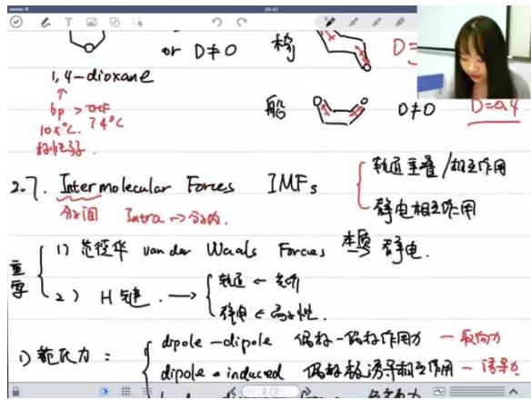

text_image

1,4-dioxane
6p >0.5
10.5°C, 7.4°C
相位3分.
Intermolecular Forces
和间 Interc → 分动.
IMFs
{轨道重量/相互作用
静电相互作用
}
1) 花径华 van der Waals Forces
2) H键. → {轨道→离心
静电→离心性.
dipole - dipole 偶标-偏权作用力 一般向力
dipole - induced 伪极板诱导相互作用 - 诱导力}

● 机制: 极性分子（如丙酮）的正负端相互吸引  
- 特点:

- 本质是静电相互作用  
○ 偶极矩越大作用越强  
例：丙酮分子氧端（ $\delta^{-}$ ）与碳端（ $\delta^{+}$ ）相互吸引

■ 偶极-诱导偶极作用

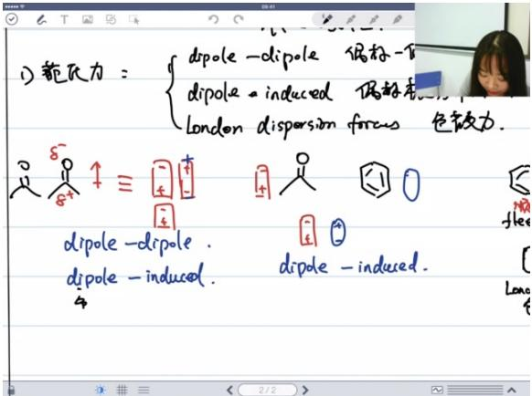

text_image

1) 范氏力：{dipole -dipole 偶松一
dipole -induced 偶松左
London dispersion force 色敏力.
}
dipole -dipole.
dipole -induced.
}
dipole -induced.
}

● 机制:

- 极性分子诱导非极性分子产生瞬时偶极   
○ 电子云被极化：靠近 $\delta^{-}$ 处显 $\delta^{+}$ ，靠近 $\delta^{+}$ 处显 $\delta^{-}$

● 实例: 丙酮（极性）与苯（非极性）的相互作用

■ 伦敦色散力

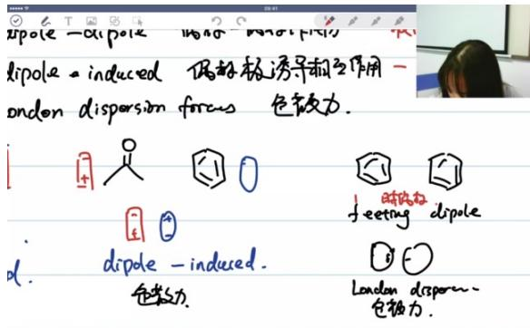

text_image

lipole - induced  伪好极诱导相互作用 -
London dispersion force 色被力.

dipole - induced.
色被力.

f eeting dipole
London dispersion
色被力.

● 机制:

○ 非极性分子间瞬时电子云偏移产生fleeting dipole（瞬时偶极）  
○ 动态相互作用，转瞬即逝

\- 特点:

○ 所有分子间都存在

- 分子质量越大色散力越强  
○ 三种力中最强的作用力

# - 作用力分布规律

■ 极性-极性分子: 三种力同时存在  
■ 极性-非极性分子: 诱导力+色散力  
■ 非极性-非极性分子: 仅色散力

# - 沸点比较实例

非极性分子比较

● 实例: C7H16 vs C5H12   
● 规律: 分子量越大色散力越强，沸点越高（BP: C7H16 > C5H12）

极性分子比较

● 实例: 丙酮 vs DMSO   
规律:

○ 偶极矩越大取向力越强（DMSO > 丙酮）  
○ 含硫原子可极化性更强   
○ 综合结果：BP(DMSO) > BP(丙酮)

同分异构体比较

● 实例: 乙醚 vs 正丁醇  
● 关键因素: 氢键存在显著提高沸点（BP: 正丁醇 > 乙醚）

# - 氢键

# ○ 双重本质

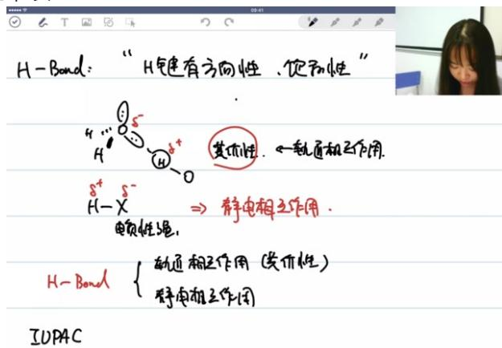

text_image

H-Bond: “H键有方向性、惯性”
H⁺ ⇌ H⁻ ⇌ H⁺ ⇌ H⁻ ⇌ H⁺ ⇌ H⁺ ⇌ H⁺ ⇌ H⁺ ⇌ H⁺ ⇌ H⁺ ⇌ H⁺ ⇌ H⁺ ⇌ H⁺ ⇌ H⁺ ⇌ H⁺ ⇌ H⁺ ⇌ H⁺ ⇌ H⁺ ⇌ H⁺ ⇌ H⁺ ⇌ H⁺ ⇌ H⁺ ⇌ H⁺ ⇌ H⁺ ⇌ H⁺ ⇌ H⁺ ⇌ H⁺ ⇌ H⁺ ⇌ H⁺ ⇌ H + X⁻ ⇌ H⁺ ⇌ H⁺ ⇌ H⁺ ⇌ H⁺ ⇌ H⁺ ⇌ H⁺ ⇌ H⁺ ⇌ H⁺ ⇌ H⁺ ⇌ H⁺ ⇌ H⁺ ⇌ H⁺ ⇌ H⁺ ⇌ H⁺ ⇌ H⁺ ⇌ H⁺ ⇌ H⁺ ⇌ H⁺ ⇌ H⁺ ⇌ H⁺ ⇌ H⁺ ⇌ H⁺ ⇌ H⁺ ⇌ H⁺ ⇌ N
H⁺ ⇌ N
H⁺ ⇌ N
H⁺ ⇌ N
H⁺ ⇌ N
H⁺ ⇌ N
H⁺ ⇌ N
H⁺ ⇌ N
H⁺ ⇌ N
H⁺ ⇌ N
H⁺ ⇌ N
H⁺ ⇌ N
H⁺ ⇌ N
H⁺ ⇌ N
H⁺ ⇌ N
H⁺ ⇌ N
H⁺ ⇌ N
H⁺ ⇌ M
H⁺ ⇌ M
H⁺ ⇌ M
H⁺ ⇌ M
H⁺ ⇌ M
H⁺ ⇌ M
H⁺ ⇌ M
H⁺ ⇌ M
H⁺ ⇌ M
H⁺ ⇌ M
H⁺ ⇌ M
H⁺ ⇌ M
H⁺ ⇌ M
H⁺ ⇌ M
H⁺ ⇌ M
H⁺ ⇌ M
H⁺ ⇌ M
H⁺ → N
H⁺ → N
H⁺ → N
H⁺ → N
H⁺ → N
H⁺ → N
H⁺ → N
H⁺ → N
H⁺ → N
H⁺ → N
H⁺ → N
H⁺ → N
H⁺ → N
H⁺ → N
H⁺ → N
H⁺ → N
H⁺ → N
H⁺ → N
H⁺ → N
H⁺ → N
H⁺ → M
H⁺ → M
H⁺ → M
H⁺ → M
H⁺ → M
H⁺ → M
H⁺ → M
H⁺ → M
H⁺ → M
H⁺ → M
H⁺ → M
H⁺ → M
H⁺ → M
H⁺ → M
H⁺ → M
H⁺ → M
H⁺ → M
H⁺ → M
H⁺ → M
H⁺ → M
H⁺ → N
H⁺ → N
H⁺ → N
H⁺ → N
H⁺ → N
H⁺ → N
H⁺ → N
H⁺ → N
H⁺ → N
H⁺ → N
H⁺ → N
H⁺ → N
H⁺ → N
H⁺ → N
H⁺ → N
H⁺ → N
H⁺ → N
H⁺ → N
H⁺ → N
H⁺ ←→ (变价性)
→ 静电相互作用

# 轨道作用:

- 氢原子与电负性原子孤对电子轨道重叠  
● 体现共价性（方向性、饱和性）

# ■ 静电作用:

● 电负性原子（X）带 $\delta^{-}$ ，氢带 $\delta^{+}$   
- 类似离子相互作用

# - IUPAC新定义

text_image

IUPAC : 有H表示 - - 分子间的相互作用
A-
H-ε

3/3   
■ 广义氢键: 任何有氢参与的分子间相互作用  
■ 特殊形式:

- 传统氢键（如O-H...O）  
- 氢-氢键（ $\delta^{+}\mathrm{H}$ 与 $\delta^{-}\mathrm{H}$ 相互作用）

■ 考试注意: 2017年国初/国决考查过广义氢键概念

● 例题2：氢键的复杂性 02:59:07

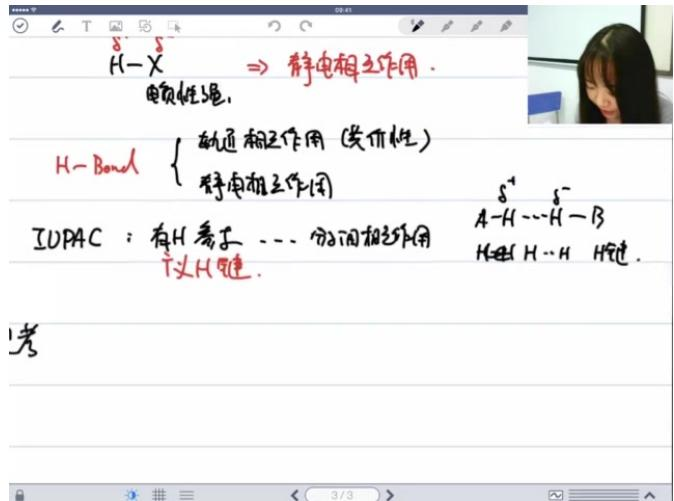

text_image

H-X ⇒ 静电相互作用.
电荷性强。
H-Bond { 航通相互作用 (发价性)
    静电相互作用
IUPAC : 有H象素 ... 分子间相互作用
    义H键.
考
A-H…H-B
H-H…H键.

强度范围：氢键的强度存在很大差异，最强的氢键可以达到共价键的强度，而最弱的氢键几乎不存在。  
○ 最强氢键实例：目前已知最强的氢键是特定分子间的相互作用（具体分子未明确说明）。  
☐ IUPAC定义：氢键是指有氢原子参与的分子间相互作用，形成H...X的键合模式（X为电负性较强的原子）。

● 碳成为有机化合物核心元素的原因 03:00:05

○ 元素丰度对比

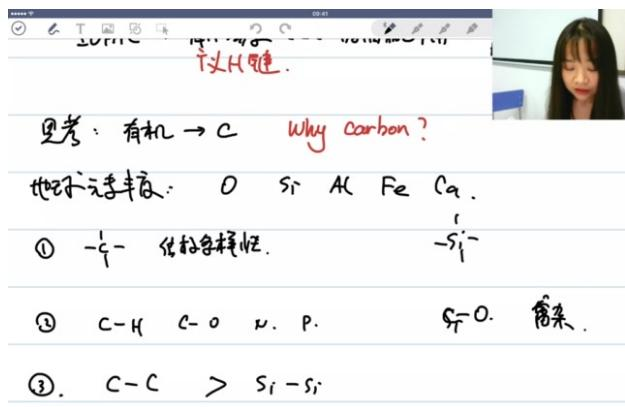

text_image

定义H键.
思考：有机→C why carbon?
地球元子丰度：O Si Al Fe Ca.
① -½- 估价象样性. -Si-
③ C-H C-O N.P. Si-O. 假杂.
③. C-C > Si-Si

地球丰度前五：氧(O)、硅(Si)、铝(Al)、铁(Fe)、钙(Ca)，碳和氢均不在前五。  
■ 核心问题：为什么生命选择碳而非更丰富的硅作为基础元素？

# ○ 碳的化学特性优势

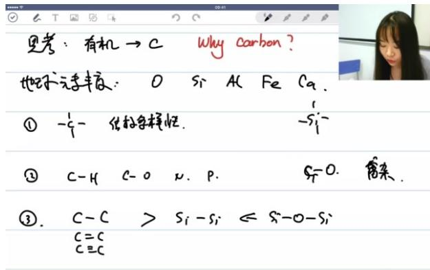

text_image

思考：有机→C why carbon？
地环元素丰叔：O Si Al Fe Ca.
① -i- 结构多样性. -Si-
③ C-H C-O N.P. Si-O. 雷杂.
③. C-C > Si-Si < Si-O-Si
C=C
C≡C

3/3

■ 结构多样性：

● 成键能力：碳倾向于形成四根共价键，可构建复杂分子结构  
● 多重键形成：能形成稳定的C=C双键和C≡C三键

■ 键强度优势：

● C-C键：比Si-Si键更强 $(C - C > Si - Si)$   
● C-H键：比Si-H键更稳定

■ 对比硅氧体系：

● 虽然Si-O键很强，但硅难以形成类似碳的复杂链状结构  
● 硅的双键/三键体系不稳定，限制了结构多样性

# - 碳基与硅基的本质区别

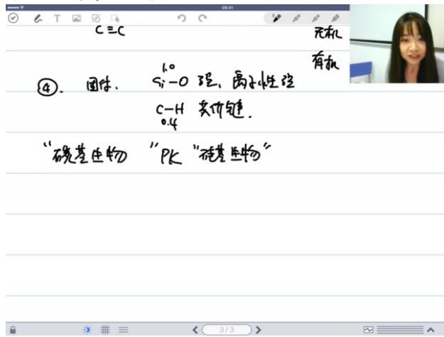

text_image

C≡C
④ 固体、Si-O₃ 碳、离子性烷
c-H 0.4 现价键。
“碳基生物”PK “硅基生物”
无机
有机

# ■ 键极性差异：

● Si-O键：强极性（电负性差1.0），离子性强  
● C-H键：弱极性（电负性差0.4），典型共价键

# 生命系统影响：

● 碳基化合物的电子分布更均匀，适合构建生命所需的精确分子识别  
● 硅氧体系多形成固态无机物，缺乏生物分子所需的动态灵活性

■ 未解问题：目前尚无系统理论能完全解释为何生命选择碳基而非硅基，这是值得继续探讨的科学问题

二、知识小结

<table><tr><td>知识点</td><td>核心内容</td><td>考试重点/易混淆点</td><td>难度系数</td></tr><tr><td>有机化学定义</td><td>历史上两种定义:生命力理论(已证伪)和碳化合物理论(当前主流)</td><td>乌勒实验(1828年)推翻生命力理论</td><td>★★</td></tr><tr><td>成键本质</td><td>电子云重新分布使体系能量降低;VB理论(价键理论)与MO理论(分子轨道理论)对比</td><td>杂化轨道理论( $SP^3/SP^2/SP$ )与键角关系</td><td>★★★</td></tr><tr><td>分子结构与极性</td><td>键极性(电负性差)、偶极矩方向判断(如 $CH_3Cl$ 、THF)、分子极性综合判断</td><td>二氧六环构象(椅式/船式)对偶极矩的影响</td><td>★★★★</td></tr><tr><td>键能与反应性</td><td>键能反映均裂能(非异裂);碳碳键(弱但动力学难断)vs.碳氢键(强但易断)</td><td>自由基反应中热力学与动力学控制差异</td><td>★★★</td></tr><tr><td>分子间作用力</td><td>范德华力(取向力/诱导力/色散力)和氢键(共价性+静电性)</td><td>广义氢键(如N形成多氢键)与沸点关系</td><td>★★★★</td></tr><tr><td>学习有机化学方法论</td><td>第一轮按官能团学反应性,第二轮按机理分类;合理性&gt;正确性</td><td>机理分析中考虑所有效应(如杂化/位阻)</td><td>★★★★</td></tr><tr><td>碳基生命与硅基对比</td><td>碳的键多样性(链状/双键/三键)和键强度(C-C &gt; Si-Si)</td><td>硅氧键强极性限制结构复杂性</td><td>★★</td></tr></table>