# 一、上节内容回顾02:49

# 1. 成键与结构 03:14

# 1）原子杂化态 03:54

<table><tr><td>①</td><td>C-H C-O μ.P. Sf-O 像素</td></tr><tr><td>①.</td><td>C-C &gt; Si-Si ⇔ Si-O-Si;</td></tr><tr><td></td><td>C=C 元和 Si-O</td></tr><tr><td>④.</td><td>固体: Si-O 硫,离子性烃 有氧 C-H</td></tr><tr><td></td><td>C-H 夹价键。</td></tr><tr><td colspan="2">“碳基生物”PK“硅基生物”</td></tr><tr><td></td><td></td></tr><tr><td></td><td></td></tr><tr><td></td><td></td></tr><tr><td></td><td></td></tr><tr><td></td><td></td></tr><tr><td></td><td></td></tr><tr><td></td><td></td></tr><tr><td></td><td></td></tr><tr><td></td><td></td></tr><tr><td></td><td></td></tr><tr><td></td><td></td></tr><tr><td></td><td></td></tr><tr><td></td><td></td></tr><tr><td></td><td></td></tr><tr><td></td><td></td></tr><tr><td></td><td></td></tr><tr><td></td><td></td></tr><tr><td></td><td></td></tr><tr><td></td><td></td></tr><tr><td></td><td></td></tr><tr><td></td><td></td></tr><tr><td></td><td></td></tr><tr><td></td><td></td></tr><tr><td></td><td></td></tr><tr><td></td><td></td></tr><tr><td></td><td></td></tr><tr><td></td><td></td></tr><tr><td></td><td></td></tr><tr><td></td><td></td></tr><tr><td></td><td></td></tr><tr><td></td><td></td></tr><tr><td></td><td></td></tr><tr><td></td><td></td></tr><tr><td></td><td></td></tr></table>

基本类型: 包括 $SP^{1}$ 、 $SP^{2}$ 、 $SP^{3}$ 三种杂化态，是处理分子构型的基础  
● 重要性: 属于必须掌握的基本功，作业题中重点涉及杂化态判断  
● 应用场景: 用于解释简单分子的立体构型，如水分子中氧的 $SP^{3}$ 杂化

# 2）VS+EP2理论 04:21

● 本质: 基于杂化轨道的静电斥力理论  
- 斥力排序: 孤对电子间斥力 > 孤对-成键电子对斥力 > 成键电子对间斥力

# ● 实例分析:

○ 水分子键角小于109.28°的原因：两个孤对电子压缩键角  
○ 电子云特征: 孤对电子云较"胖"（松散），成键电子云较"紧实"

# 3）有机分子的书写 06:11

# ● 表达方式:

- 路易斯结构式：完整显示电子排布，特别是孤对电子  
○ 结构简式  
○ 键线式（主要考察形式）

# - 补充表达:

- 重要孤对电子的标注（如杂原子、活性中心）  
○ 立体表达：实线表示向纸面外，虚线表示向纸面内

# 4）键能和键长 07:23

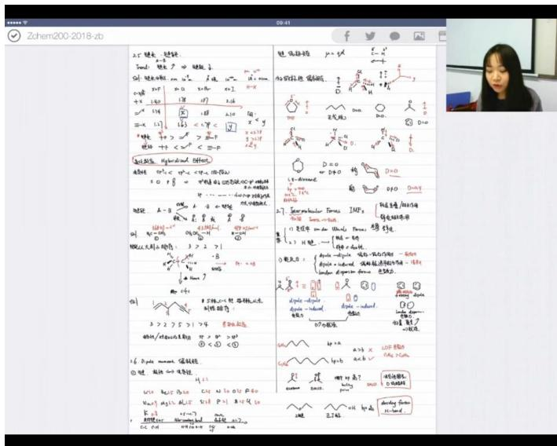

text_image

Zchem200-2018-zb
2.5 键本：键槽。
Snol: 6.3g/10cm
Si: 锥本物：m = 0.7 g / 10cm
C: 4.5 g / 10cm
+ x : 1.0 g / 10cm
= 0.7 g / 10cm
= - 1.4 g / 10cm
*键本：+ > 0.7 g / 10cm
+ 0.7 g / 10cm
Hybridical (HbO)
溶解度：0.7g / 10cm
溶解率：0.7% / 10cm
溶解度：0.7% / 10cm
溶解度：0.7% / 10cm
溶解度：0.7% / 10cm
溶解度：0.7% / 10cm
溶解度：0.7% / 10cm
溶解度：0.7% / 10cm
溶解度：0.7% / 10cm
溶解度：0.7% / 1
溶解度：0.7% / 10cm
溶解度：0.7% / 10cm
溶解度：0.7% / 10cm
溶解度：0.7% / 10cm
溶解度：0.7% / 10cm
溶解度：0.7% / 10cm
溶解度：0.7% / 10cm
溶解度：0.7% /
溶解度：0.7% /
溶解度：0.7% /
溶解度：0.7% /
溶解度：0.7% /
溶解度：0.7% /
溶解度：0.7% /
溶解度：0.7% /
溶解度：0.7% /
溶解度：0.7% /
溶解度：0.7% /
溶解度：0.7% /
溶解度：0.7% /
溶解度：D = 0
D = 0
D = 0
D = 0
D = 0
D = 0
D = 0
D = 0
D = 0
D = 0
D = 0
D = 0
D = 0
D = 0
D = 0
D = 0
D = 0
D = 0
D = 0
D = 0
D = 0

● 键能定义: 均裂A - B键生成两个自由基所需能量

● 键长关系:

○ 键长越长，键能越弱   
- 原因：原子振动时距离远更易断裂

● 记忆要点: 需区分均裂（生成自由基）与异裂（生成离子）过程

5）键的极性及分子的偶极矩 08:35

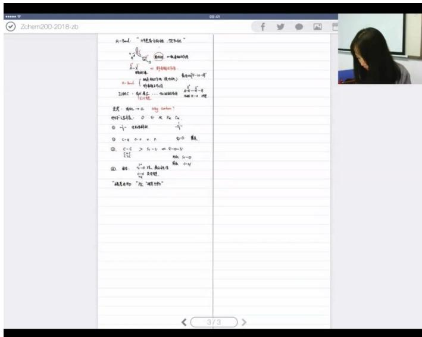

text_image

Zchem200-2018-zb
H=bal: "不等关系的性质，完全性质"
#  #  #  #  #  #  #  #  #  #  #  #  #  #  #  #  #  #  #  #  #  #  #  #  #  #  #  #  #  #  #  #  #  #  #  #  #  #  #  #  #  #  #  #  #  #  #  #
# 线性：# 线性：# 线性：# 线性：# 线性：# 线性：# 线性：# 线性：# 线性：# 线性：# 线性：# 线性：# 线性：# 线性：# 线性：# 线性：# 线性：# 纾性：# 纾性：# 纾性：# 纾性：# 纾性：# 纾性：# 纾性：# 纾性：# 纾性：# 纾性：# 纾性：# 纾性：# 纾性：# 纾性：# 纾性：# 纾性：# 纾性：#

电负性关键值:

○ C:2.5, H:2.1, O:3.5, N:3.0

○ Li:1.0, Na:0.9, K:0.8, F:4.0

○ C:2.5, H:2.1, O:3.5, N:3.0
○ Li:1.0, Na:0.9, K:0.8, F:4.0

● 键型判断标准:

○ $\Delta EN < 0.5$ ：非极性共价键（如C-C, C-H）

○ $0.5 < \Delta EN < 1.7$ ：极性共价键（如C-N, C-O）

○ $\Delta EN > 1.7$ : 离子键（如O-Na）

\- $\Delta EN < 0.5$ ：非极性共价键（如C-C, C-H）
- $0.5 < \Delta EN < 1.7$ ：极性共价键（如C-N, C-O）
- $\Delta EN > 1.7$ ：离子键（如O-Na）

● 边界情况: C-Li键（1.5）可两可处理

6）分子的偶极矩方向 11:57

● 符号表示: 箭头从 $\delta^{+}$ 指向 $\delta^{-}$ ，起始端带垂直短杠

● 计算方法: 向量合成所有键的偶极矩

● 应用要点: 需掌握分子整体偶极矩方向的判断

7）例题：分子几何构型判断

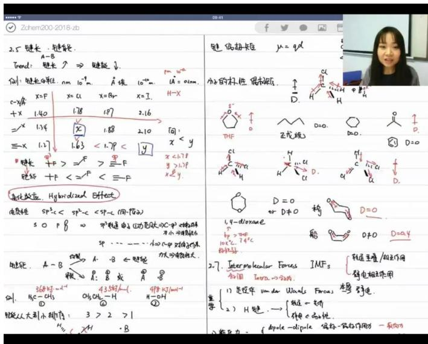

text_image

Zchem200-2018-zb
2.5 键长 · 键能
A→B
Trend: 键长 ↑ ⇒ 键能 ↓
侧: 键长(单性) nm 10^-9 m A 垃 10^-10 m H = 0.0000
x=F x=Cl x=Br x=3 H-X
+ x 1.40 1.88 1.97 2.16
=x 1.34 1.63 < 1.79 < 2.10 回:
≡ x 1.37 y x < y
* 键长 +F > =F > =F y
键能 +F <=F < =F x ≥y.
氧化物：Hybridized Effect
电极性 SP^2/C < SP^-C < SP^-C (同-偶先)
S O P B → 强通电子(为超级的C+O+固体)
由小分子键能成
SP ... —— → C-O + 强通电子
键能，A→B ⇌ A·B ← 键能 ← 键能 ← 键能 ← 键能 ← 键能 ← 键能 ← 键能 ← 键能 ← 键能 ← 键能 ← 键能 ← 键能 ← 键能 ← 键能 ← 键能 ← 键能 ← 键能 ← 键能 ← 键能 ← 键能 ← 键能 ← 键能 ← 键能 ← 键能 ← 键能 ← 键能量
368时·min⁻¹ 43.58g/cm³ 99pH×1/min⁻¹
例: H₂C=CH₃ O₃CH₂-H H-OH ②
键能从大到小排列: 3 > 2 > 1
↑↓
键位越短: μ = q/d
分子的杯性 氨水解密.
D H H H H D
DF D=0 DAD D=0
Cl Cl Cl Cl Cl Cl Cl Cl Cl Cl Cl Cl Cl Cl Cl Cl Cl Cl Cl Cl Cl Cl Cl Cl Cl Cl Cl Cl Cl Cl Cl Cl Cl Cl Cl Cl Cl Cl Cl Cl Cl Cl Cl Cl Cl Cl Cl Cl Cl Cl Cl Cl Cl Cl Cl Cl Cl Cl Cl Cl Cl Cl Cl Cl Cl Cl Cl Cl Cl Cl Cl Cl Cl Cl Cl Cl Cl Cl Cl Cl Cl Cl Cl Cl Cl Cl Cl Cl Cl Cl Cl Cl Cl Cl Cl Cl Cl Cl Cl Cl Cl Al
D=0 or D≠0 构 D=0
1.4-dioxane
DP > 3.4°C
10°C 7.4°C
铅酸 D=0 D=0
2.7 Intermolecular Forces INFs { 钼道重量/千克作用
自由加入加入加入内。}
重要{ }是控华 um dan Wand's Forces 李强 引速.
2) H键 → { 钼道→闪闪
特写C色性.
入新压力：f dipole-dipole 纸标-低功作用 -有功

# 题目解析

○ BH3: SP2杂化，平面三角形（3对电子）  
○ H3O+: SP3杂化，三角锥形（4对电子含1孤对）  
○ 碳负离子: 同H3O+, SP3杂化三角锥形  
○ 易错点: 正离子需注意价电子数变化（如0+少1个电子）

# 2. 孤对电子 16:21

# 1）箭线式的书写与理解 16:33

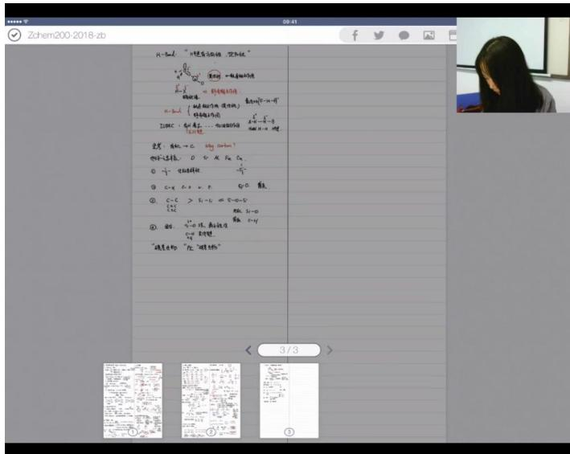

text_image

H-Bond "H₂O₂"的性质：氢氧化物

$\frac{1}{2} \cdot \frac{1}{2} \cdot \frac{1}{2} \cdot \frac{1}{2} \cdot \frac{1}{2} \cdot \frac{1}{2} \cdot \frac{1}{2} \cdot \frac{1}{2} $ 

反应式：
①：氢氧化物
②：C-C > H₂O₂ (H₂O₂) = C-O-H
③：C-O + H₂O₂ (H₂O₂) = C-O-H
④：C-O + H₂O₂ (H₂O₂) = C-O-H

“离子化合物”为“Fe³⁺”的性质

3/3

- 孤对电子特征：氮原子有1对孤对电子，氧原子有2对孤对电子（需特别注意氧的孤对电子容易被漏写）  
- 箭线式要点：碳骨架需用折线表示以模拟碳碳键角，但SP杂化碳例外

# 2）碳碳三键的表示与SP杂化碳的识别 16:43

<table><tr><td></td><td></td></tr><tr><td></td><td></td></tr><tr><td></td><td></td></tr><tr><td></td><td></td></tr><tr><td></td><td></td></tr><tr><td></td><td></td></tr><tr><td></td><td></td></tr><tr><td></td><td></td></tr><tr><td></td><td></td></tr><tr><td></td><td></td></tr><tr><td></td><td></td></tr><tr><td></td><td></td></tr><tr><td></td><td></td></tr><tr><td></td><td></td></tr><tr><td></td><td></td></tr><tr><td></td><td></td></tr><tr><td></td><td></td></tr><tr><td></td><td></td></tr><tr><td></td><td></td></tr><tr><td></td><td></td></tr><tr><td></td><td></td></tr><tr><td></td><td></td></tr><tr><td></td><td></td></tr><tr><td></td><td></td></tr><tr><td></td><td></td></tr><tr><td></td><td></td></tr></table>

● SP杂化特征：碳碳三键处为直线型结构（键角180°），需用直线表示而非折线  
● 常见错误：易漏标SP杂化碳上的氢原子（如 $CH_{2}$ 与无氢碳的交替结构）

3）例题1: 氮的杂化类型判断 18:29

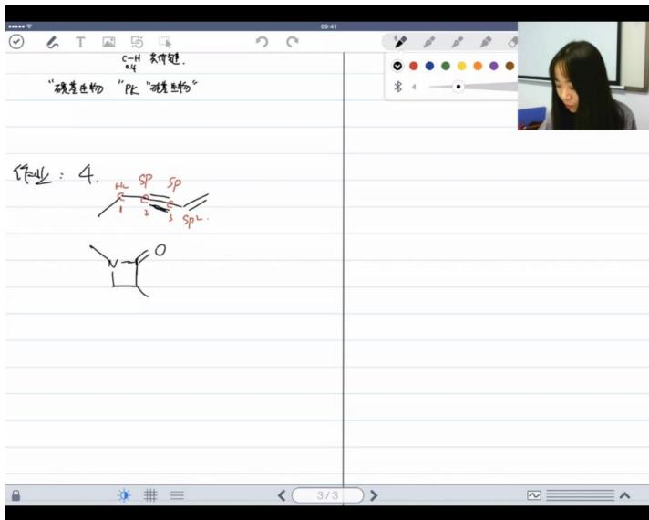

text_image

C-H 共中键.
“碳基生物”PK“核基生物”
作业：4.
1 2 3 Sp
SpL
3/3

题目解析

○ 基础判断：类比 $NH_{3}$ 可得出SP3杂化（键角109°接近四元环实际键角90°）  
- 进阶分析：存在SP2杂化可能（通过p-π共轭与相邻双键相互作用）  
- 评分标准：两种杂化方式均可得分，关键需合理解释（实际杂化状态可能介于两者之间）

4）杂化类型的深入分析与批判共恶现象 19:30

- p-π共轭机制：当氮与双键相隔一个σ键时，氮的p轨道可与π键形成共轭（需满足轨道平行条件）  
● 键角影响：四元环空间限制使实际更倾向SP3杂化（理想SP2键角120°与环张力冲突）

5）路易斯结构式的绘制要点 21:01

\- 绘制规范：

- 可用直线表示化学键  
○ 孤对电子必须用点表示  
○ 所有碳氢原子均需明确画出

● 常见错误：忽略SP杂化碳的直线特性或漏画氢原子

3. 应用案例 21:17

1）例题:渐能和渐长关系

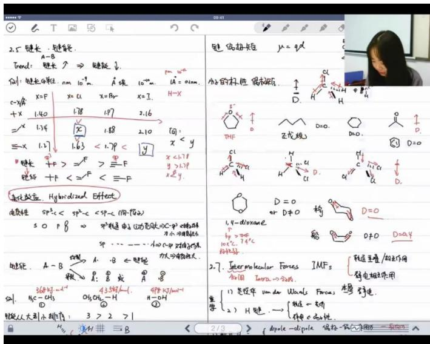

text_image

2.5 键长 · 键能
Trend: 键长 ↑ ⇒ 键能 ↓
侧: 键长(单体) nm 10^-9 m A 垃 10^-10 m H = 0.0000
x-F x= C x=Bx x= I.
+ x 1.40 1.8 1.97 2.16
=x 1.34 1.63 < 1.79 < 2.10 回:
≡ x 1.37 y
* 键长 +F > =F > ≡F
键能 +F <=F < ≡F
氧化物: Hydroxylized Effect
电荷性 sp²C < sp²C < sp²C (用↑键)
S O P B → 水相通电子(①为负极大的C-矿对称体
sp ... ——→→→→→→→→→→→→→→→→→→→→→→→→→→→→→→→→→→→→→→→→→→→→→→→→→→→→→→→→→→→→→→→→→→→→→→→→→→→→
键能 A - B 环 → H - B ← 键能
36H₄⁻¹m⁻⁴ 43.5g/m⁻¹ 9pH⁺/m⁻¹
例: H₂C - CH₃ O₃CH₂ - H H-OH
键能从大约大小排序: 3 > 2 > 1
键低超长短 μ = g/d
加子的杯性偶制矩。
D H H H H H H H H H H H H H H H H H H H H H H H H H H H H H H H H H H H H H H H H H H H H H H H H H H H H H H H H H H H H H H H H H H H H H H H H H H H H H H H H H H H H H H H H H H H H H H H H H H H H
IMF 正戊烷 D=O. DAD O D D
Cl C C C C C C C C C C C C C C C C C C C C C C C C C C C C C C C C C C C C C C C C C C C C C C
D = O or D ≠ O 构 D = O
1,4-dioxane Fp > =Pf 10°C 7°C 船 D≠O D=△y
力大功率较大。
Intermolecular Forces IMFs 取通重量/质量作用
背电相互作用
重 1) 急恒华 van der Waals Forces 电路引电.
2) 气、H 链 → 链 → 动作 体积 e动性.
2/3 > dipole-mipole 纸格-偏心作用

● 核心规律：键长（单位nm或Å）与键能呈反比关系（如C - C > Si - Si）  
● 电负性影响：C-O键的离子性特征比C-H更显著（电负性差决定）

# 2）例题:偶极矩方向判断 21:57

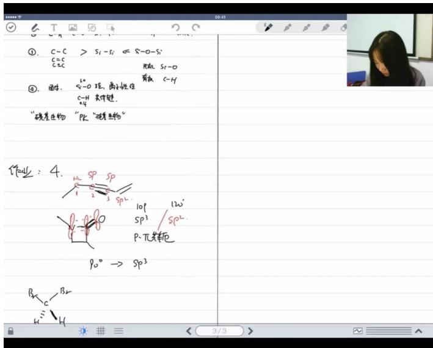

text_image

①. C-C > Si-Si ⇌ S-O-Si
C=C
②. 气体. S-O 玻, 高小性生
C-H 合体键.
“磷基生物”PK“磷基生物”
作业：4.
P2-P1 SP3
SP2
10P 12W
SP3 / SP2
P-π共轭
90° → SP3
Bc Bb
K H
3/3

题目解析

○ 方向判定：

■ C - H键： $\delta^{+}$ 在H， $\delta^{-}$ 在C  
■ C-X键： $\delta^{-}$ 在卤素（电负性顺序：Cl>Br）

净效应：

■ 二卤甲烷的净偶极矩方向取决于卤素电负性差  
■ 特殊案例： $CH_{2}Cl_{2}$ 偶极矩必然大于 $CH_{2}Br_{2}$

易错点：单纯定性分析可能得出错误结论，需具体计算电负性差值

# 4. 分子间相互作用 24:49

1）分子间作用力类型

- 氢键: 特定存在于含氢原子与电负性大的原子（如O、N、F）之间的强相互作用力。  
● 范德华力: 分为三种类型:

○ 偶极-偶极相互作用: 存在于极性分子之间  
○ 偶极-诱导偶极作用: 存在于极性分子与非极性分子之间  
○ 色散力（瞬时偶极）：存在于所有分子间，是非极性分子间唯一的作用力

2）作用力组合规律

● 非极性分子间: 仅存在色散力

● 非极性与极性分子间: 同时存在色散力和诱导力  
● 极性分子间: 同时存在色散力、诱导力和偶极-偶极作用

# 3）答题技巧

● 关键词识别：判卷时主要看是否出现"范德华力"、"色散力"、"偶极矩"、"氢键"等核心术语

# - 解释题要点:

○ 丙烷与正戊烷比较：必须提到"色散力"   
- 丙烷与丙酮比较：需指出丙酮是极性分子（偶极矩不为零），丙烷是非极性分子  
○ 含氢键体系：必须明确写出"氢键"才能得分

# 5. 酸碱理论

# 1）质子酸碱理论 33:25

text_image

I 质子酸生成 Brønsted-Lowny I leurs as a 205
view of acid and base
1.1.

质子酸: 能够给出质子 ( $H^{+}$ ) 的物质, 称为质子给体 (proton donor)  
● 质子碱: 能够接受质子的物质，称为质子受体（proton acceptor）  
- 英文术语: 在英文教材中称为Bronsted-Lowry酸碱理论

# 2）反应机理表示法

\- 弯曲箭头规则

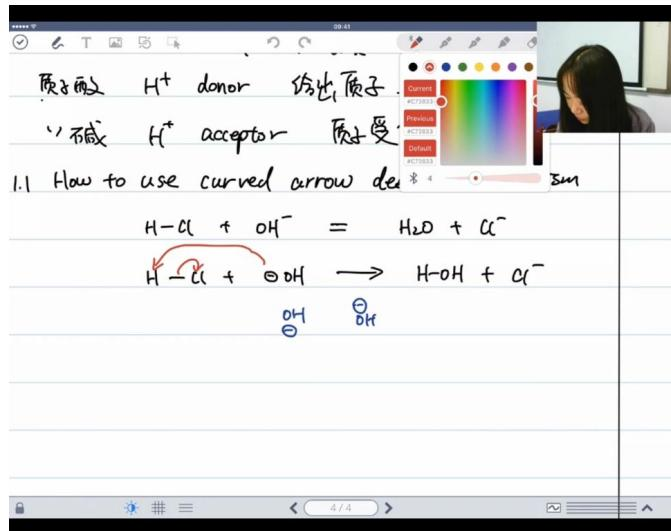

text_image

质子酸 H+ donor 给出质子
“碱 H+ acceptor 质受
1.1 How to use curved arrow de
H-Cl + OH- = H2O + Cl-
H-Cl + ⊙OH → H-OH + Cl-
OH OH

○
○ 完整箭头: 表示一对电子的转移  
- 鱼钩箭头: 表示单电子的转移（自由基反应中使用）  
○ 起点位置: 可以是孤对电子（Ip）、化学键（σ键或π键）或负电荷  
- 终点位置:

■ 分子间: 无特殊限制

■ 分子内: 必须指向相邻原子或相邻键

○ 电子流向: 通常从富电子区 ( $\delta-$ ) 流向缺电子区 ( $\delta+$ )

\- 质子转移反应

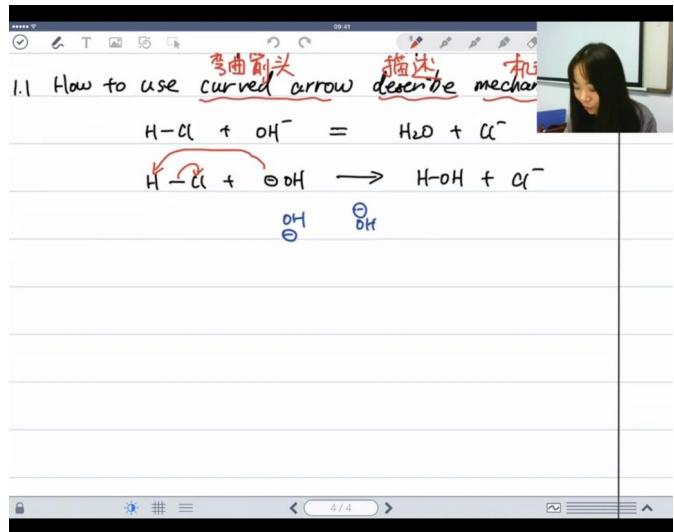

text_image

1.1 How to use curved arrow 描述 mechanical
H-Cl + OH⁻ = H₂O + C⁻
H-Cl + ⊙OH → H-OH + Cl⁻
OH
OH

基本形式: $H - X + B \rightarrow X^{-} + H - B^{+}$   
○ 机理特征: 使用弯曲箭头表示质子从X转移到B的过程  
- 重要性: 是后续学习取代反应的基础，在有机反应中极为常见

3）反应机理绘制要点

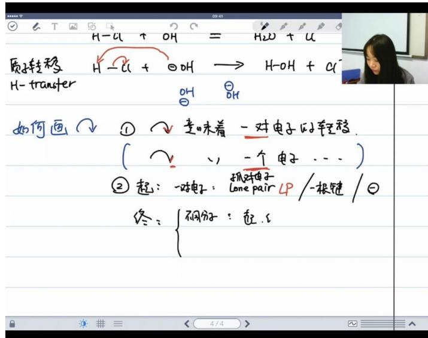

text_image

H-U + OH = H2O + C
质子转移 H-C(+) + OOH → H-OH + C
H-transfer
如何画 ↘ ① ↙ 意味着 一对电子的转移.
( ↙ ↘ 一个电子...)
② 起: 一对电子: 狐对电子
lone pair LP / 根键 /
终: { 不同分子: 起.ε

电子表示:

○ 孤对电子需明确画出  
- 负电荷可写在原子旁边

\- 箭头规范:

- 必须清晰显示电子转移路径  
避免箭头交叉混淆

● 电荷平衡: 反应前后总电荷数需保持一致

# 二、讲新课26:56

1. 酸碱质量 31:49

1）质子酸碱

● 质子给出质子转移 34:04

例题:醇和氨基负离子反应机理 45:33

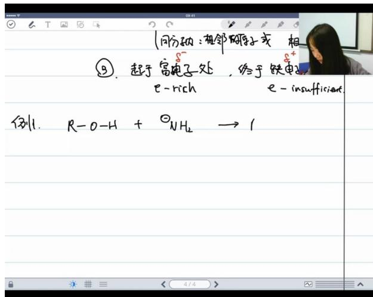

text_image

问分动：相邻的原子或 相
⑨. 起于富电子处，终于铁电子
e-rich e-insufficient.
例1. R-O-H + ②NH2 → 1

反应产物: R-O-H + NH₂⁻ → R-O⁻ + NH₃

■ 电子转移规则:

● 起始位置: 电子富集处（通常为负电荷、孤对电子或 $\sigma$ 键）  
- 终止位置: 电子缺乏处  
● 本例起始点: 氨基负离子上的负电荷（最富电子）

■ 箭头绘制规则:

- 第一箭头: 从 $NH_{2}^{-}$ 的负电荷指向H原子  
- 第二箭头（Arrow pushing）：

- 必须存在两个箭头完成质子转移  
○ 起始于H原子唯一的σ键（O-H键）  
- 终止于相邻原子（0）或键   
- 本例选择终止于O原子（电负性强，可吸收电子）

■ 成键过程:

- 第一箭头形成N-H键  
- 第二箭头使0获得负电荷

■ 电子流动本质: 箭头始终表示一对电子的转移，而非质子转移

例题:氢氧化钠和乙酸反应机理 50:18

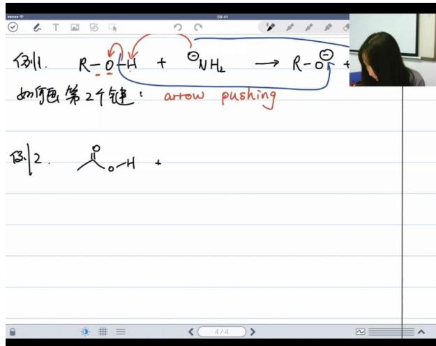

text_image

例1. R-O-H + NH4 → R-O- + 
如何画第2个键：arrow pushing
例2. H-O-H +

反应产物: NaOH + CH₃COOH → CH₃COO⁻ + H₂O

■ 机理分析:

- 第一箭头: $\mathrm{OH}^{-}$ 的负电荷指向羧基H  
- 第二箭头选择:

- 推给0原子：形成羧酸根负离子  
- 推给C=O键：形成烯醇式结构

# ■ 三箭头特殊情况:

● 当选择推给C=O键时：

○ 形成新的C-O单键  
○ 碳需推出原有电子（避免五键）  
◦ 优先推出π电子到0，形成负电荷

# 共振结构:

- 羧酸根与烯醇式为共振结构  
● 电子推演规律:

\- 推给原子：产生负电荷

\- 推给键：单键变双键/双键变三键

○ 键作为起点：双键变单键

■ 核心原则: 箭头永远表示电子对的流动，遵循"喜新厌旧"原则（总是推出原有电子）

pKa 57:26

o pKa的定义 58:06

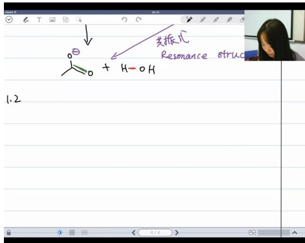

text_image

共振式
Resonance structure
1.2

电离平衡式: $H_{2}O + HB \rightleftharpoons H_{3}O^{+} + B^{-}$   
■ 酸解离常数: $k_{a}=\frac{[H_{3}O^{+}][B^{-}]}{[HB]}$   
■ pKa计算: $pK_{a} = -logk_{a}$ ，这是高中和普化都会讲的基础定义

\- 有机物中pKa的特殊性 58:25

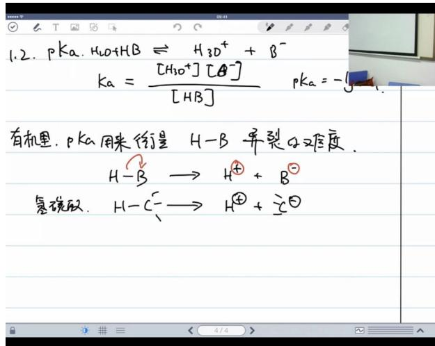

text_image

1.2. PKa. H₂O+HB ⇌ H₃D⁺ + B⁻
Ka = [H₃O⁺][OH⁻] [HB] PKa = -½
有机里，PKa用来衡量 H-B 异裂α难度。
H-B → H⁺ + B⁻
氢碳致 H-C⁻ → H⁺ + C⁻

测量限制：多数有机物电离后生成的离子不溶于水，传统水溶液测量方法受限

本质意义: 在有机化学中，pKa主要衡量H-B键异裂的难易程度，即 $H-B\rightarrow H^{+}+B^{-}$ 的过程  
■ 氢碳酸概念: 当B为碳原子时, 衡量生成质子和碳负离子的难易程度, 这类物质称为氢碳酸

o pKa值的相对意义与实验误差 01:00:51

■ 相对性强调: 有机弱酸的pKa绝对值意义不大，不同测量方法误差可达几个数量级  
■ 应用重点: 需要重点关注pKa的相对大小关系，这是判断质子转移方向的关键  
■ 典型误差: 例如烷烃C-H的pKa(50-60)在不同文献中差异显著

o pKa与酸性强弱的关系 01:09:06

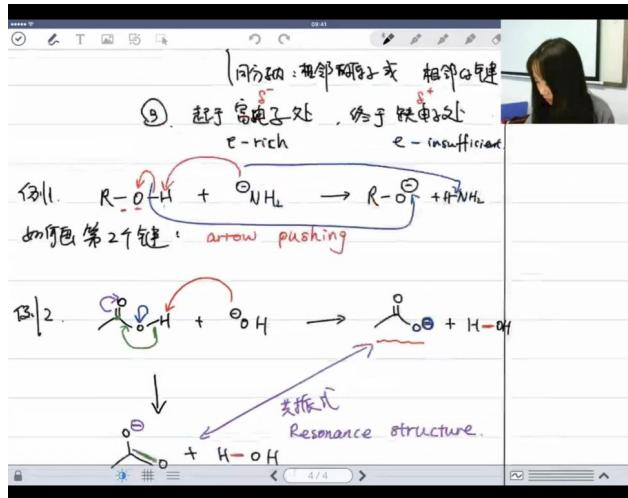

text_image

同分钠：相邻的原子或相邻的气键
⑨. 起于富电子处，终于铁电子处
e-rich e-insufficient
例1. R-O-H + NH2 → R-O+H2NH2
如何画第2个键：arrow pushing
例2. H + O-H → C=O+H-OH
共振式
Resonance structure.

数值规律: pKa越小，酸性越强；pKa越大，酸性越弱   
■ 记忆技巧: 可以类比pH值，数值越小酸性越强

○ 常见有机物的pKa值 01:09:19

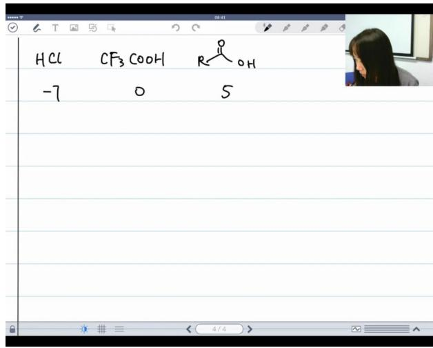

text_image

HCl CF₃COOH R₂CHOH
-7 0 5

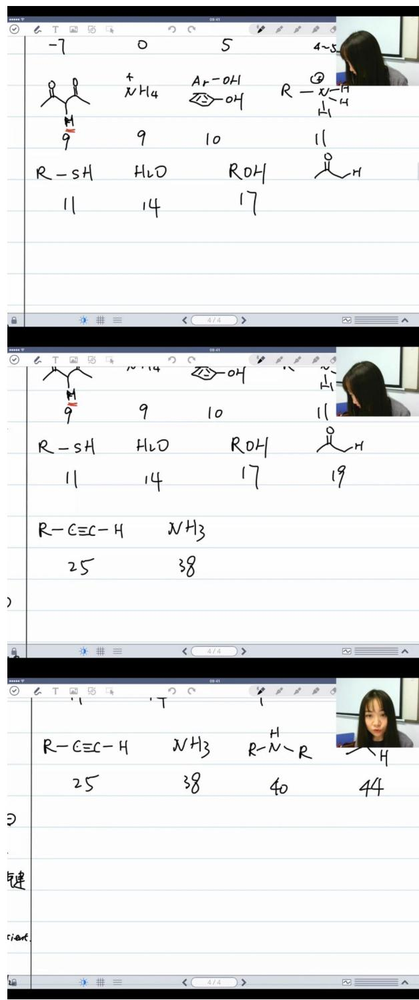

chemical

Three chemical reaction diagrams showing different R groups and their corresponding molecular structures, with numerical values displayed below each diagram.

# 强酸范围:

- 盐酸(HCl): -7   
- 三氟乙酸(CF3COOH): ≈0

# ■ 中等酸性:

- 羧酸(RCOOH): ≈5   
- 铵离子(NH4+): ≈9   
- β-二酮类(夹在两个羰基间的CH2): ≈9

# ■ 弱酸性:

- 苯酚(Ar-OH): ≈ 10   
● 硫醇(RSH): ≈11  
水(H2O): 14

● 醇(ROH): ≈ 17

# 极弱酸性:

- 炔氢(RC≡CH): ≈25  
● 氨(NH3): ≈38   
● 烯烃(C=C-H): ≈44   
● 烷烃(C-H): 50-60

# ■ 学习建议:

- 不需要死记硬背具体数值  
● 通过反复使用建立常见物质的酸性强弱常识  
● 重点关注相对大小关系而非绝对值

● 影响有机物酸性的因素 01:15:01

例题:电负性影响 01:15:37

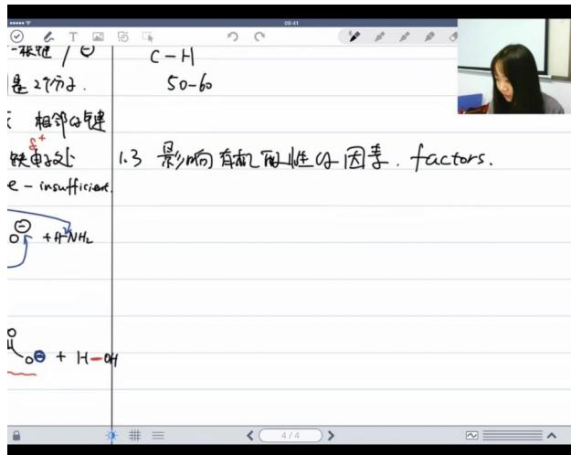

text_image

一张链 / ②
是 2 个分子.
相邻的链
铁电子处
e - insufficient.
⑤ + H-NH₂
⑥ + H-OH
C - H
50-60
1.3 影响有机阻性的因素，factors.

电负性决定酸性强弱: 与氢相连原子的电负性越强, 吸电子能力越强, 使C-H键更容易发生异裂, 酸性越强。例如 $R-O-H>R-N-H>R-C-H$ 的酸性顺序。  
■ pKa与酸性关系: pKa值越大表示酸性越弱，与酸性强弱呈反比关系。  
■ 电子云偏移原理：电负性强的原子（如O）会吸引σ键电子云，使氢更容易以质子形式解离。

例题:诱导效应 01:19:14

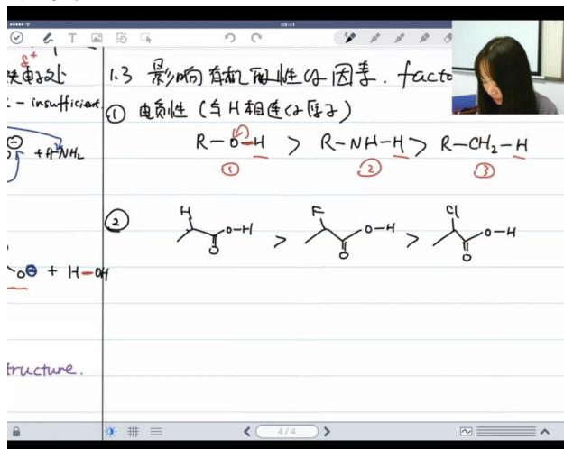

text_image

失电子处
- insufficient
① 电荷性（与H相连C原子）
R-O-H > R-NH-H > R-CH₂-H
②
③
④
structure.
4/4

- # =   
■ 定义: 通过σ键传递的电子效应，由电负性差异引起。  
■ 与电负性区别:

● 电负性是原子固有属性  
● 诱导效应强调通过化学键的远程传递

■ 距离衰减特性：诱导效应随距离增加而显著减弱（与距离的三次方或六次方成反比）。  
■ 实例分析: 氟代醇中, 距离较远的F原子对-OH酸性影响很小。

例题:正电荷影响 01:23:38

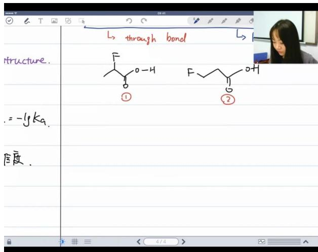

chemical

Chemical structure diagram showing two fluorinated organic molecules with labeled positions and a 4/4 ratio annotation

作用机制: 正电荷增强相连原子的吸电子能力, 如 $NH_{4}^{+}$ 比 $NH_{3}$ 酸性更强。  
■ 电子效应: 带正电的氮原子更强烈吸引C-H键电子，促进质子解离。

例题:杂化效应 01:26:46

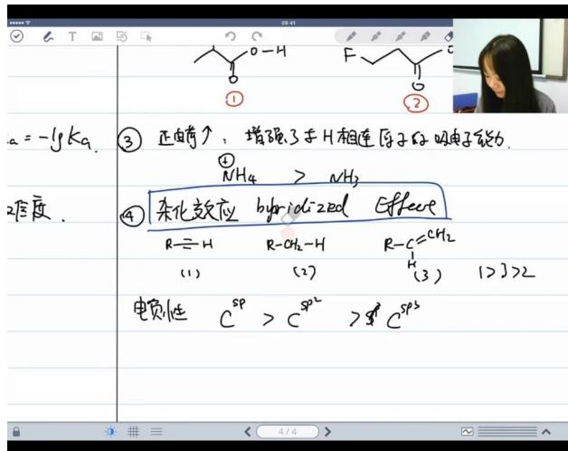

text_image

a=-lgkq.
③ 正由↑：增强了±H相连原子的电子能力。
① NH4 > NH3
④ 杂化效应  byr-ol-2ed  Effecu
R-H     R-CH2-H     R-C=CH2
(1)      (2)      H
电负性  CSP > CSP2 > SP CSP3
4/4>

杂化轨道电负性: $sp > sp^{2} > sp^{3}$ 杂化的碳原子电负性依次降低。

■ 酸性排序原理：与氢相连的碳杂化轨道s成分越多，吸电子能力越强，对应化合物酸性越强。

■ 实例排序: $R - C \equiv C - H$ (sp) >R - CH = $CH_{2}$ (sp2) >R - $CH_{3}$ (sp3)。

○ 共轭 01:30:49

基本概念

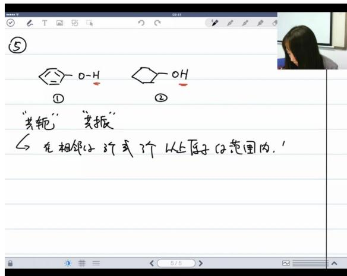

text_image

⑤
① O-H
② OH
“共轭” 共振
→ 在相邻子径或3个以上原子范围内，

\- 定义范围: 在相邻三个或三个以上原子范围内, $p$ 轨道（第一轮有机学习中特指 $p$ 轨道）以轴向平行（"肩并肩"）方式有效重叠，体系能量降低形成的体系。

# - 术语对照:

\- 英文：conjugated system

○ 同义术语：离域体系（delocalized system）

● 轨道特征:p轨道轴向指轨道对称轴方向，轴向平行即轨道肩并肩排列。

# ■ 杂化方式与共轭

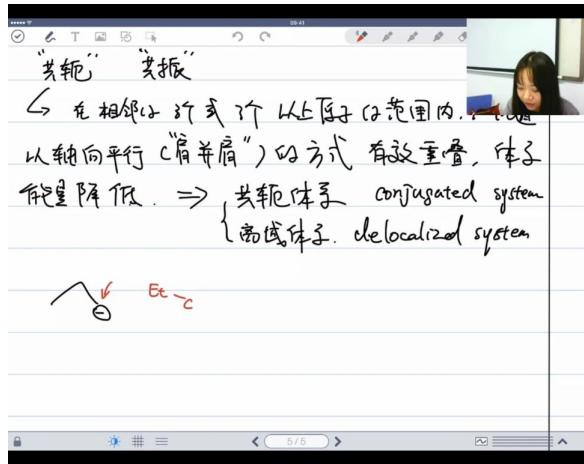

text_image

“共轭” “共振”
→ 在相邻式 3个以上原子 2范围内, 通过以轴向平行(“肩并肩”)的方式 有效重叠, 体子能量降低. ⇒ 共轭体系 conjugated system
离域体子: de localized system
Ec-c

# SP³杂化示例:

以丙烷末端碳负离子为例，采用VSERP理论分析：

■ 连接1个乙基、2个氢和1个负电荷  
■ 外层8电子形成4对电子  
■ 立体构型为四面体

# - SP²杂化转变:

○ 丙烯负离子中:

■ 若保持SP³杂化，孤电子与π键轨道正交无相互作用  
■ 转变为SP²杂化后，剩余p轨道可与相邻π键平行重叠

# ■ 共轭效应验证

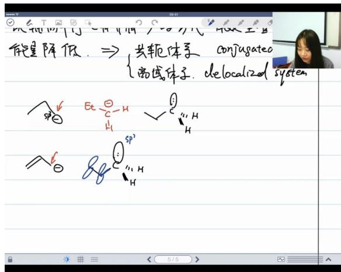

text_image

能量降低. ⇒ 共轭体系 conjugated
离线体系. de localized system

# 轨道重叠机制:

○ 通过σ键连接的p轨道仍可发生有效重叠（距离条件满足）  
○ 重叠顺序：相邻p轨道→间隔σ键的p轨道

# ● 能量效应:

- 共轭体系能量降低更显著  
○ 实例证明：SP²杂化的丙烯负离子比SP³构型更稳定

# 共振结构理论

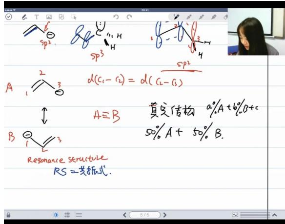

text_image

A
B
d(C₁-C₂) = d(C₂-C₃)
A≡B
50%A + 50%B.
a%A + b% B+c
50%A + 50%B.
Resonance structure
RS = 共振式.

# 结构表达困境:

○ 传统结构式无法解释实测的键长均等现象（如 $d(C_{1}-C_{2})=d(C_{2}-C_{3})$ ）

# ● 共振式(RS)定义:

○ 用双向箭头↔连接的等价结构式  
○ 表示电子离域而非电子移动  
- 英文：resonance structure

# ● 真实结构构成:

○ 各共振式按稳定性加权叠加  
○ 示例：50%结构A + 50%结构B → 键级1.5的均等键

# 共振式规则

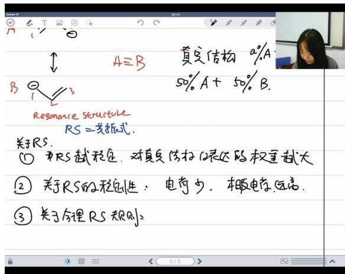

text_image

A≡B
B
50%A + 50%B.
Resonance structure
RS = 共振式.
关于RS.
①为RS越稳定，对真正伪权表达的权重越大
②关于RS的稳定性：电荷少，本版电荷气泡。
③关于合理RS规则。

# 权重原则:

○ 共振式越稳定，对真实结构的贡献权重越大

# ● 稳定性判据:

○ 电荷数量少者更稳定  
○ 相反电荷远离者更稳定

# ● 书写规范:

○ 原子位置保持不变  
◦ 仅允许π键和电荷位置变化  
○ 所有σ键必须保持完整

# ○ 应用案例 01:44:30

■ 合理RS规则与电荷位置变化 01:44:36

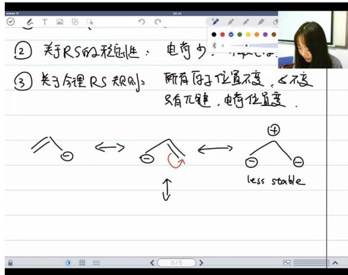

text_image

② 关于RS的稳定性：电荷少
③ 关于合理RS规则：所有原子位置不变，<不变
只有π键，电荷位置变
less stable

电荷分布原则：共振结构中电荷越少越稳定，负电荷应远离其他电荷中心（如 $C^{-}$ 与 $C^{+}$ 相互排斥）

# - 结构变化规则：

○ 所有原子位置保持不变  
○ 只有 $\pi$ 键和电荷位置可以改变  
○ 电荷位置变化会导致稳定性降低（如将双键电子转移到 $C_{3}$ 形成 $C_{3}^{-}$ ）

共振结构的稳定性比较 01:46:06

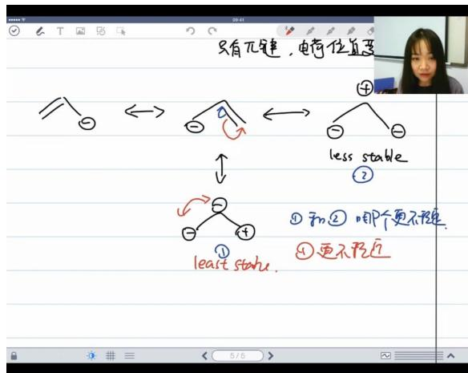

text_image

只有π键，电荷位直变
④
←→ ←→
less stable
②
①和②哪个更不随
③更不近
least stable.

● 判断标准：

○ 负电荷与正电荷应分布在结构两端（如 $C_{1}^{-}$ 和 $C_{3}^{-}$ 比 $C_{2}^{-}$ 更稳定）  
○ 等价位置电荷分布更稳定（ $C_{1}$ 和 $C_{3}$ 等价， $C_{2}$ 不等价）

● 电子转移规律：已有负电荷的位置会排斥新负电荷（电子优先转移到远离已有负电荷的位置）

共振结构式的推导 01:48:13

● 推导步骤:

- 保持所有σ键不变  
○ 移动 $\pi$ 键电子形成新的双键  
○ 电荷随电子转移而移动（如C = O键电子推到 $C - O^{-}$ ）

● 注意事项：共振式不是真实反应过程，仅是帮助理解电子分布的理论模型

■ 共轭与共振对酸性强弱的影响 01:49:18

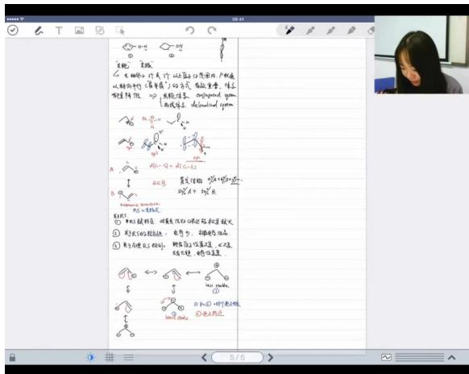

text_image

Handwritten Chinese notes with diagrams and annotations, likely illustrating a scientific or educational concept.

● 共轭条件：相邻原子需有平行p轨道（如苯环 $sp^{2}$ 杂化碳的p轨道）

● 酸性增强机制：

◦ 动力学：O - H键更易断裂（活化能降低）  
- 热力学：共轭碱（如苯酚负离子）更稳定

● 具体案例：苯酚酸性强于环己醇，因苯环p轨道与氧负离子p轨道形成共轭体系

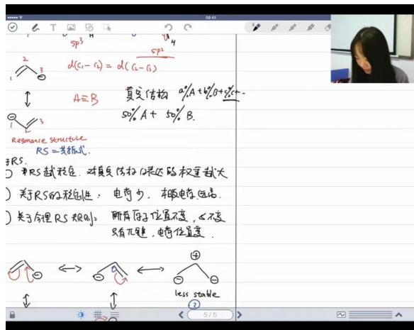

text_image

sp³
d(c₁-r₂) = d(c₂-r₃)
A≡B
真实结构 0%A=6%+0%
50%A+50%B.
Resonance Structural
RS=共振式.
RS. D RS越稳定，对真实结构(长边的权定越大)
) 关于RS的稳定性：电荷少，本取电荷距离。
) 关于合理RS规则。所有原子位置不变，不变
只有几键，电荷位置变。

# 共振式权重原则：

- 越稳定的共振式对真实结构贡献越大  
- 无电荷分离的结构权重最大（如苯环凯库勒式）

# ■ 共振式的推导与稳定性排序 01:54:09

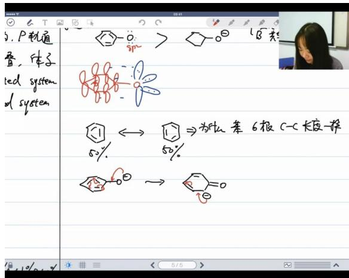

text_image

5. P轨道
叠，体子
ted system
d system

$\text{C}_6\text{H}_4\text{O}^2$ → $\text{C}_6\text{H}_4\text{O}^2$

$\text{C}_6\text{H}_4\text{O}^2$ → $\text{C}_6\text{H}_4\text{O}^2$

$\text{C}_6\text{H}_4\text{O}^2$ → $\text{C}_6\text{H}_4\text{O}^2$

$\text{C}_6\text{H}_4\text{O} \rightarrow \text{C}_6\text{H}_4\text{O}^2$

$\text{C}_6\text{H}_4\text{O} \leftrightarrow \text{C}_6\text{H}_4\text{O} \Rightarrow \text{C}_6\text{H}_4\text{O} \rightarrow \text{C}_6\text{H}_4\text{O}$ 为长苯 6板 C-C 长度一样

# 推导过程：

○ 氧负电子推入苯环 $\pi$ 体系  
○ 电荷在苯环上离域（形成 $C^{-}$ ）  
○ 通过连续 $\pi$ 电子转移生成不同共振式

# - 稳定性排序：

- 电荷分布在电负性大的氧原子上  
○ 电荷分布在苯环邻/对位  
避免正负电荷相邻的结构

# ○ 离域效应与酸碱强度影响因素 01:56:28

# ■ 离域效应原理

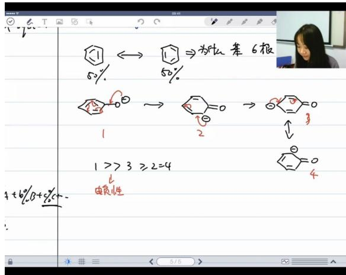

chemical

Chemical reaction diagram showing cyclohexene ring transformation with 50% yield and subsequent ring rearrangement to form a ketone, followed by hydrogenation to form a hydroxyl group.

- 本质特征：离域体系要求存在p轨道在≥3个原子范围内以"肩并肩"方式重叠，电子在整个体系内自由移动  
- 稳定机制：负电荷被分散到苯环的三个碳原子上（非均匀分布），形成 $1 > > 3 \geq 2 = 4$ 的稳定性顺序  
● 实例分析：酚氧负离子的负电荷通过共轭效应分散到苯环上，其中对位（1位）最稳定，其次是3位，2/4位等价

# 共振式规则

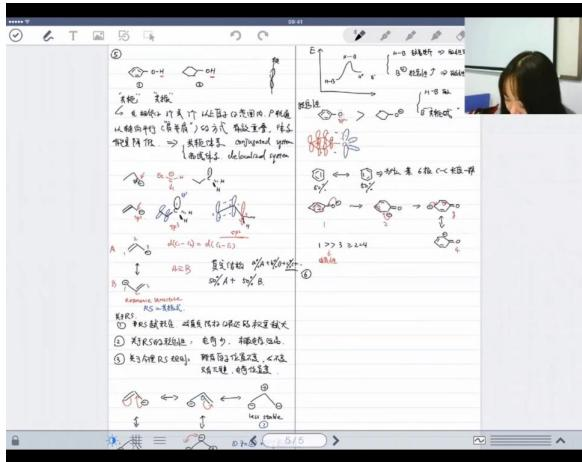

text_image

⑤
⑥
⑦
⑧
⑨
⑩
⑪
⑫
⑬
⑭
⑮
⑯
⑰
⑱
⑲
⑳
㉑
㉒
㉓
㉔
㉕
㉖
㉗
㉘
㉙
㉚
㉛
㉜
㉝
㉞
㉟
㉳
㉟
㉟a
㉟b
㉟c
㉟d
㉟e
㉟f
㉟g
㉟h
㉟i
㉟j
㉟k
㉟l
㉟m
㉟n
㉟o
㉟p
㉟q
㉟r
㉟s
㉟t
㉟u
㉟v
㉟w
㉟x
㉟y
㉟z
㉟c
㉟d
㉟e
㉟f
㉟g
㉟h
㉟i
㉟j
㉟k
㉟l
㉟m
㉟n
㉟o
㉟p
㉟q
㉟r
㉟s
㉟t
㉟u
㉟v
㉟w
㉟x
㉟y
㉟z
㉟e
㉟d
㉟e1: 17H2O3(2)溶液内，气体通过稀释的物（稀释）的方式，生成重量，体积为质量的阳极，反应速率：0.02mg/dL/min。
①：反应式：SO₄⁺（2H₂O₃）-4H₂O₃（2H₂O₃）-4H₂O₃（2H₂O₃）-4H₂O₃（2H₂O₃）-4H₂O₃（2H₂O₃）
②：反应式：SO₄⁺（2H₂O₃）-4H₂O₃（2H₂O₃）-4H₂O₃（2H₂O₃）-4H₂O₃（2H₂O₃）
③：反应式：SO₄⁺（2H₂O₃）-4H₂O₃（2H₂O₃）-4H₂O₃（2H₂O₃）-4H₂O₃（2H₂O₃）
④：
⑤：反应式：SO₄⁺（2H₂O₃）-4H₂O₃（2H₂O₃）-4H₂O₃（2H₂O₃）-4H₂O₃（2H₂O₃）
⑥：反应式：SO₄⁺（2H₂O₃）-4H₂O₃（2H₂O₃）-4H₂O₃（2H₂O₃）
⑦：反应式：SO₄⁺（2H₂O₃）-4H₂O₃（2H₂O₃）-4H₂O₃（2H₂O₃）
⑧：反应式：SO₄⁺（2H₂O₃）-4H₂O₃（2H₂O₃）-4H₂O₃（2H₂O₃）
⑨：反应式：SO₄⁺（2H₂O₃）-4H₂O₃（2H₂O₃）-4H₂O₃（2H₂O₃）
⑩：反应式：SO₄⁺（2H₂O₃）-4H₂O₃（2H₂O₃）-4H₂O₃（2H₂O₃）
⑪：反应式：SO₄⁺（2H₂O₃）-4H₂O₃（2H₂O₃）-4H₂O₃（2H₂O₃）
⑫：反应式：SO₄⁺（2H₂O₃）-4H₂O₃（2H₂O₃）-4H₂O₃（2H₂O₃）
⑬：反应式：SO₄⁺（2H₂O₃）-4H₂O₃（2H₂O₃）-4H₂O₃（2H₂O₃）
⑭：反应式：SO₄⁺（2H₂O₃）-4H₂O₃（2H₂O₃）-4H₂O₃（2H₂O₃）
⑮：反应式：SO₄⁺（2H₂O₃）-4H₂O₃（2H₂O₃）-4H₂O₃（2H₂O₃）
⑯：反应式：SO₄⁺（2H₂O₃）-4H₂O₃（2H₂O₃）-4H₂O₃（2H₂O₃）
⑰：反应式：SO₄⁺（2H₂O₃）-4H₂O₃（2H₂O₃）-4H₂O₃（2H₂O₃）
⑱：反应式：SO₄⁺（2H₂O₃）-4H₂O₃（2H₂O₃）-4H₂O₃（2H₂O₃）
⑲：反应式：SO₄⁺（2H₂O₃）-4H₂O₃（2H₂O₃）-4H₂O₃（2H₂O₃）
⑳：反应式：SO₄⁺（2H₂O₃）-4H₂O₃（2H₂O₃）-4H₂O₃（2H₂O₃）
⑴：反应式：SO₄⁺（2H₂O₃）-4H₂O₃（2H₂O₃）-4H₂O₃（2H₂O₃）
⑵：反应式：SO₄⁺（2H₂O₃）-4H₂O₃（2H₂O₃）-4H₂O₃（2H₂O₃）
⑶：反应式：SO₄⁺（2H₂O₃）-4H₂O₃（2H₂O₃）-4H₂O₃（2H₂O₃）
⑷：反应式：SO₄⁺（2H₂O₃）-4H₂O₃（2H₂O₃）-4H₂O₃（2H₂O₃）
⑧：反应式：SO₄⁺（2H₂O₃）-4H₂O₃（2H₂O₃）-4H₂O₃（2H₂O₃）
⑨：反应式：
⑩：反应式：
⑪：反应式：
⑫：反应式：
⑬：反应式：
⑭：反应式：
⑮：反应式：
⑯：反应式：
⑰：反应式：
⑱：反应式：
⑲：反应式：
⑳：反应式：
㉑：反应式：
㉒：反应式：
㉓：反应式：
㉔：反应式：
㉕：反应式：
㉖：反应式：
㉗：反应式：
㉘：反应式：
㉙：反应式：
㉚：反应式：
㉛：反应式：
㉜：反应式：
㉝：反应式：
㉞：反应式：
㉟：反应式：
㉌：反应式：
㊱：反应式：
㊲：反应式：
㊳：反应式：
㊴：反应式：
㊵：反应式：
㊶：反应式：
㊷：反应式：
㊸：反应式：
㊹：反应式：
㊺：反应式：
㊻：反应式：
㊼：反应式：
㊽：反应式：
㊾：反应式：
㊿：反应式：
㊾a：反应式：
㊾b：反应式：
㊾c：反应式：
㊾d：反应式：
㊾e：反应式：
㊾f：反应式：
㊾g：反应式：
㊾h：反应式：
㊾i：反应式：
㊶、鈇、鈇、鈇、鈇、鈇、鈇、鈇、鈇、鈇、鈇、鈇、鈇、鈇、鈇、鈇、鈇、鈇、鈇、鈇、鈇、鈇、鈇、鈇、鈇、鈇、鈏、鈇、鈇、鈇、鈇、鈇、鈇、鈇、鈇、鈇、鈇、鈇、鈇、鈇、鈇、鈇、鈇、鈇、鈇、鈇、鈇、鈇、鈇、鈇、鈇、鈆、鈇、鈇、鈇、鈇、鈇、鈇、鈇、鈇、鈇、鈇、鈇、鈇、鈇、鈇、鈇、鈇、鈇、鈇、鈇、鈇、鈇、鈇、鈇、鈇、鈍、鈇、鈇、鈇、鈇、鈇、鈇、鈇、鈇、鈇、鈇、鈇、鈇、鈇、鈇、鈇、鈇、鈇、鈇、鈇、鈇、鈇、鈇、鈇、鈇、鈁、鈇、鈇、鈇、鈇、鈇、鈇、鈇、鈇、鈇、鈇、鈇、鈇、鈇、鈇、鈇、鈇、鈇、鈇、鈇、鈇、鈇、鈀、鈀、鈀、鈀、鈀、鈀、鈀、鈀、鈀、鈀、鈀、鈀、鈀、鈀、鈀、鈀、鈀、鈀、鈀、鈀、鈀、鈀、鈀、鈀、鈀、鈰、鈀、鈀、鈀、鈀、鈀、鈀、鈀、鈀、鈀、鈀、鈀、鈀、鈀、鈀、鈀、鈀

# ● 稳定性标准：

- 电荷分布：电荷越少、电负性原子带负电荷时越稳定  
○ 结构规则：所有原子位置不变，仅π键和电荷位置变化

● 权重影响：越稳定的共振式对真实结构贡献越大（权重越大）

# ■ 酸碱强度六大影响因素

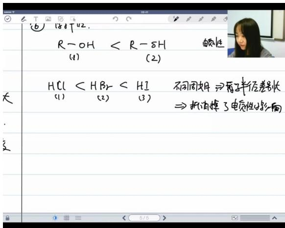

text_image

(6) 188T42.
R-OH < R-SH
(1) (2)
HCl < HBr < HI
(1) (2) (3)
不可用大写 ⇒ 简子半径差别长 ⇒ 拓消掉了电负性的影响
5/5

# 作用机制排序：

- 原子半径（不同周期元素显著差异）  
○ 离域/共轭效应  
○ 诱导效应（通过σ键传递）  
- 杂化效应（本质仍是电负性差异）  
- 直接电荷效应（B原子上加正电荷）  
○ 电负性（与H直接相连的原子）

# - 典型实例：

○ 硫醇酸性>醇 $(R - SH > R - OH)$   
○ 氢卤酸酸性：HI > HBr > HCl

# ■ 综合应用例题

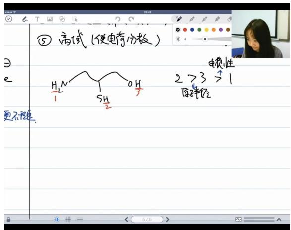

chemical

Hand-drawn chemical structure of ethylene (methanol) with labeled hydrogen and oxygen atoms and a ionic ratio annotation

# ● 题目解析：

○ 比较HN、OH、SH的酸性  
○ 解题思路：综合电负性和原子半径效应  
○ 答案: SH > HN > OH (2 > 3 > 1)   
- 关键点：硫原子半径优势抵消电负性劣势

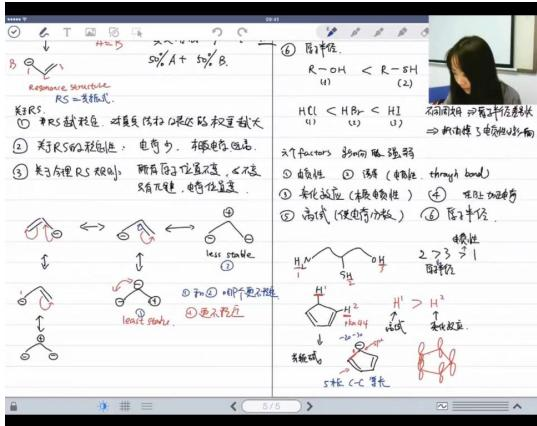

text_image

B
S/% A + 5% B
RS = 共格式.
① 重RS敲衬底，对真空伪粒子描述RS权重最大
② 关于RS的裂径越大，电荷少，有极电荷递增。
③ 关于物理RS规则，所有原子位置不变，C不变只有无键，电荷传递度。
④ ⑤ ⑥ ⑦ ⑧ ⑨ ⑩ ⑪ ⑫ ⑬ ⑭ ⑮ ⑯ ⑰ ⑱ ⑲ ⑳ ㉑ ㉒ ㉓ ㉔ ㉕ ㉖ ㉗ ㉙ ㉚ ㉛ ㉜ ㉝ ㉟ ㉳ ㉻ ㉼ ㉖
R-OH < R-SH
(1) (2)
HCl < HBr < HCl
(1) (2)
七个factors 强向碳、强弱
① 原因性 ② 流速（非固体）
③ 奇性反应（卤素性质）
④ 高速（便电荷分数）
⑤ 原子路径
H₁
↑
S₂H
H₂
↓
H₃
H₄
H₅
H₆
H₇
H₈
H₉
H₁₀
H₁₁
H₁₂
H₁₃
H₁₄
H₁₅
H₁₆
H₁₇
H₁₈
H₁₉
H₂₀
H₂₁
H₂₂
H₂₃
H₂₄
H₂₅
H₂₆
H₂₇
H₂₈
H₂₉
H₃₀
H₃₁
H₃₂
H₃₃
H₃₄
H₃₅
H₃₆
H₃₇
H₃₈
H₃₉
H₄₀
H₄₁
H₄₂
H₄₃
H₄₄
H₄₅
H₄₆
H₄₇
H₄₈
H₄₉
H₅₀
H5₁
H5₂
H5₃
H5₄
H5₅
H5₆
H5₇
H5₈
H5₉
H6₀
H6₁
H6₂
H6₃
H6₄
H6₅
H6₆
H6₇
H6₈
H6₉
H7₀
H7₁
H7₂
H7₃
H7₄
H7₅
H7₆
H7₇
H7₈
H7₉
H8₀

# ● 题目解析：

○ 比较环戊二烯中两种氢的酸性  
○ 解题思路：离域效应（形成芳香体系）>杂化效应  
○ 关键数据： $sp^{3}$ 氢pKa≈44，共轭体系氢pKa≈20-30  
○ 结构特征：五元环中5根C-C键等长

# 酸碱平衡应用

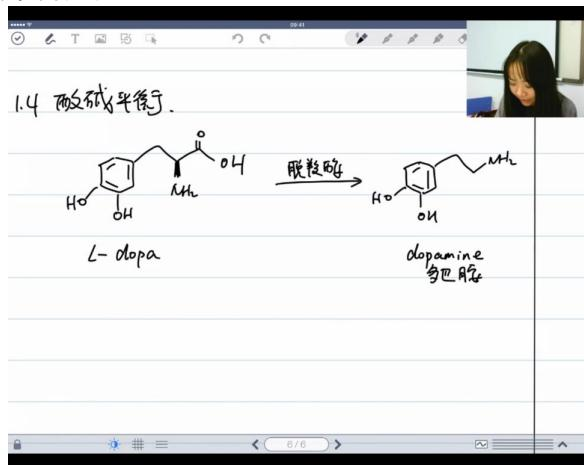

chemical

Chemical reaction diagram showing deprotonation of L-dopa to dopamine, with enzyme labeling and reaction conditions

# - 平衡判断方法：

○ 比较相关基团pKa值：羧基≈5，氨基≈9，酚羟基≈10  
- 质子从低pKa基团（羧基）向高pKa基团（氨基）转移

● 结论：平衡偏向氨基质子化形式（结构2）

# 2）继续之前的内容 02:08:55

● 路易斯酸碱的定义 02:31:10

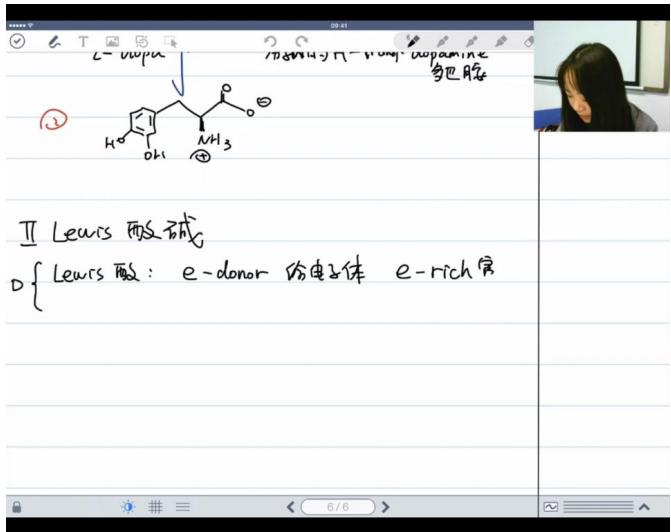

chemical

Chemical structure of Lewis acid with labeled amino acid residues and electron transfer notation

○ 电子给体（碱）：路易斯碱定义为electron donor（给电子体）或electron rich（富电子体系）  
○ 电子受体（酸）：路易斯酸定义为electron acceptor（电子受体）或electron insufficient（缺电子体系）  
- 记忆要点：注意区分"电子给体=碱"和"电子受体=酸"的对应关系，老师特别强调有同学容易混淆这两者

● 路易斯酸碱与质子酸碱的区别 02:32:14

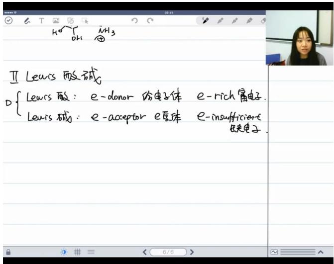

text_image

II. Lewis 酸碱
D{Lewis 酸: e-donor 纷电子体 e-rich 富电子.
Lewis 碱: e-acceptor e受体 e-insufficient ε
缺电子

○ 关注点差异：

■ 质子酸碱理论关注质子 $(H^{+})$ 的转移  
■ 路易斯酸碱理论关注电子对的转移

\- 兼容性：两者并不矛盾，如 $H^{+}$ 是路易斯酸， $OH^{-}$ 是路易斯碱

○ 典型实例：

■ 质子 $(H^{+})$ 既是质子酸也是路易斯酸  
■ 氢氧根 $(OH^{-})$ 既是质子碱也是路易斯碱

● 例题1:判断物质是路易斯酸还是路易斯碱 02:33:00

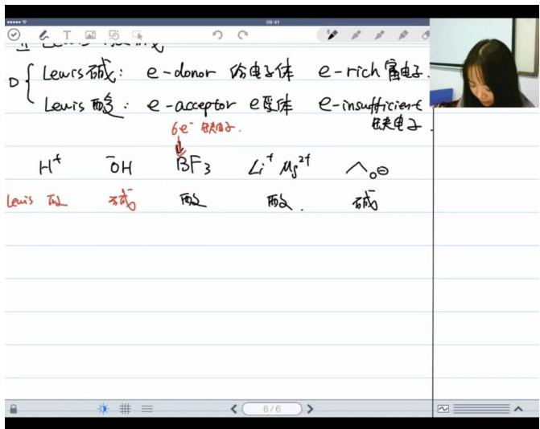

text_image

D{Lewis 碱: e-donor 的电子体 e-rich 静电子.
Lewis 酸: e-acceptor e 蛋体 e-insufficient e
6e⁻ 酸电子. 缺电子.

H⁺  OH  BF₃  Li⁺ mg²↑  ↑∞

Lewis 响  氨 酸 酸. 碱

○
○ 三氟化硼 $(BF_{3})$ :

■ 分类：路易斯酸  
■ 原因：硼原子最外层只有6个电子，属于缺电子体系

○ 金属阳离子 $(Li^{+},Mg^{2+}$ 等):

■ 分类：路易斯酸  
■ 原因：正电荷导致电子不足

○ 乙醇负离子 $(CH_{3}CH_{2}O^{-})$ :

■ 分类：路易斯碱  
■ 原因：氧原子上有丰富的孤对电子

○ 乙烯 $(C_{2}H_{4})$ :

■ 分类：路易斯碱  
■ 原因：π键电子可以作为电子给体

● 一个分子是否可能同时是酸或碱 02:35:21

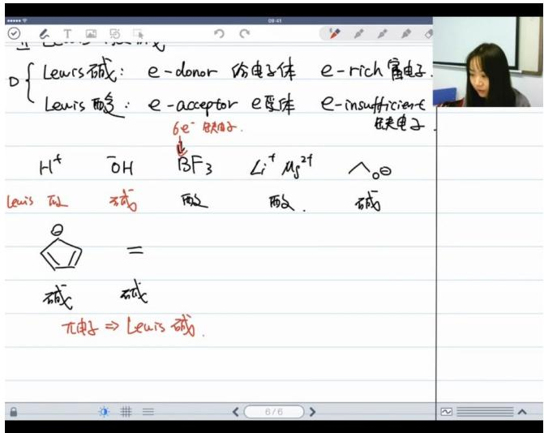

text_image

D{Lewis 碱: e-donor 给电子体 e-rich 露电子.
Lewis 酸: e-acceptor e变体 e-insufficient-e
6e⁻缺电子. 缺电子.

H⁺  OH  BF₃  Li⁺  μg²⁺  ↑∞

Lewis 酸  弱  酸  酸. 碱⁻

= 

碱  碱

π电子 ⇒ Lewis 碱.

\- 两性可能性：

■ 质子理论：某些物质（如水）既可给出 $H^{+}$ （酸）又可接受 $H^{+}$ （碱）  
■ 路易斯理论：分子可能同时具备接受和给出电子的能力

○ 判断关键：

■ 需要根据具体反应环境分析  
■ 电子分布情况决定其在不同反应中的角色

2. 例题: 路易斯酸碱定义应用 02:35:53

1）路易斯酸碱的双重性

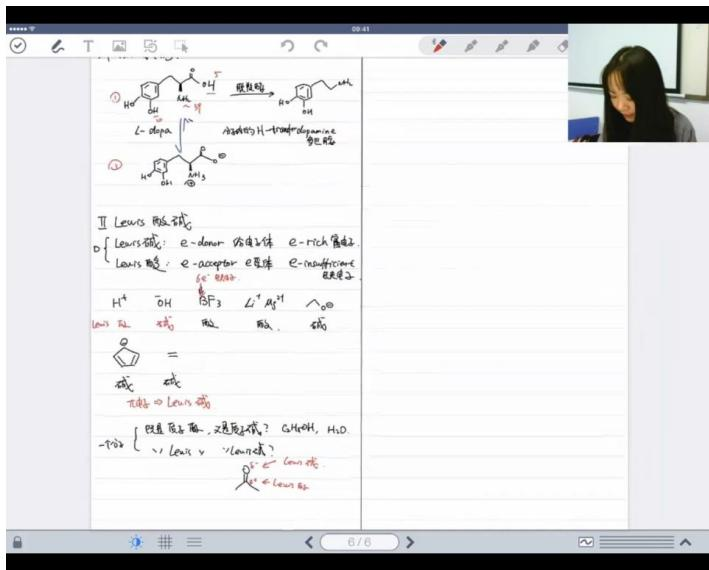

chemical

Chemical reaction equations and molecular structures of leuene derivatives, including esterification and deprotection steps

- 双重性物质：丙酮( $CH_{3}COCH_{3}$ )既是路易斯酸又是路易斯碱，其碳氧双键具有强极性（氧带 $\delta^{-}$ ，碳带 $\delta^{+}$ ）  
作为路易斯碱：氧原子上的孤对电子可作为电子给体，如与 $Li^{+}$ 形成配位键  
作为路易斯酸：羰基碳可接受电子对，如与 $OH^{-}$ 反应时接受氧的孤对电子

2）反应机理分析

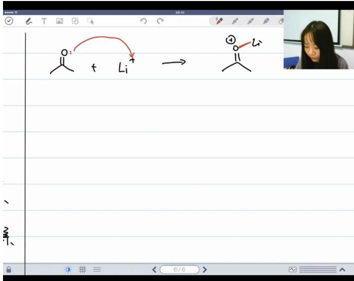

text_image

Li
f → ④ Li

- 电子流向：箭头始终起始于电子密度高的区域（孤对电子或 $\pi$ 键），终止于电子缺乏区域  
- 丙酮与锂离子：氧的孤对电子 $\rightarrow Li^{+}$ 形成配位键，此时丙酮为路易斯碱  
- 丙酮与氢氧根： $OH^{-}$ 的孤对电子 $\rightarrow$ 羰基碳，同时 $\pi$ 电子移向氧，此时丙酮为路易斯酸  
3）亲核/亲电试剂术语

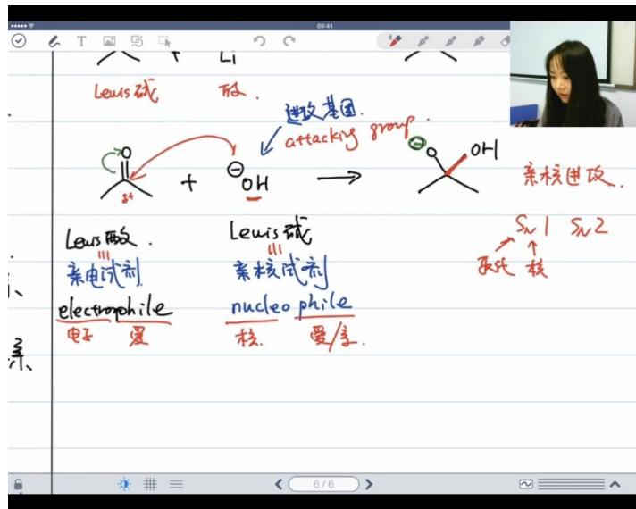

text_image

Lewis碱
放.
进攻基因.
attacking group
亲核进攻.
Lewis碱
亲电试剂
亲核试剂
electrophile
电子
复
nucleo phile
核.
蛋/鱼.
Sv1 Sv2
亲氏核

# - 术语对应关系：

- 亲核试剂(nucleophile) = 路易斯碱 = 电子给体  
- 亲电试剂(electrophile) = 路易斯酸 = 电子受体

# - 词源记忆：

○ nucleo-(核)+phile(爱)=爱原子核（正电中心）  
○ electro-(电子)+phile(爱)=爱电子

# 4）共振结构稳定性分析

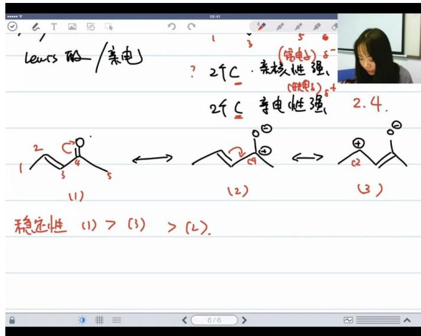

text_image

lews 的 / 杂电
? 2个 C . 杂核性强
(缺电) δ +
2个 C 杂电性强 2.4.
1 2 3 4 5
(1) ← (2) ← (3)
稳定性 (1) > (3) > (2).

● 稳定性规律：(1)中性分子 > (3)电荷分离结构 > (2)相邻正负电荷结构  
● 实际电荷分布：通过共振贡献，2号碳的 $\delta^{+}$ 大于4号碳  
● 反应活性：2号碳更易受亲核试剂进攻（在后续羰基化合物学习中会重点强调）

# 5）分子内氢键影响

text_image

5. 高坡

语体释：

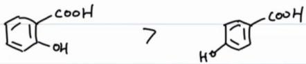

chemical

Handwritten chemical reaction showing conversion of a phenol with carboxylate to form a hydroxyphenol

● 关键因素：水杨酸(C6H4(OH)COOH)通过分子内氢键稳定共轭碱  
● 作用机理：羧酸根氧( $\delta^{-}$ )与邻位羟基氢( $\delta^{+}$ )形成六元环氢键  
● 对比案例：对羟基苯甲酸因位阻无法形成分子内氢键，酸性较弱

6）酸性比较原则总结   
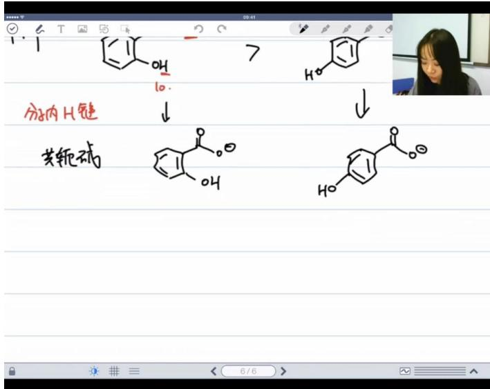

chemical

Hand-drawn chemical reaction diagram showing conversion of formaldehyde to ketone and then to phenyl group

● 两大核心机理：

○ 降低过渡态能量（活化能）  
- 稳定产物（共轭碱）

● 特殊案例：分子内氢键虽非常见因素，但可通过稳定共轭碱显著增强酸性  
● 学习方法：具体问题具体分析，掌握原理比记忆分类更重要

# 三、结束

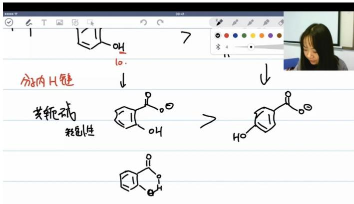

chemical

Chemical reaction diagram showing conversion of H-catalyzed to ketone via intermediate, with molecular structures and reaction conditions labeled

- 分子内氢键特征：当分子内部存在H原子与电负性较强的原子（如O、N等）时，可能形成分子内氢键  
● 共轭效应影响：共轭体系中的氢键会通过电子离域作用增强稳定性，表现为：

○ 键长变化：共轭会使氢键的X-H...Y距离缩短   
- 能量降低：共轭体系中的氢键键能通常比孤立氢键高10-20%

● 结构识别要点：

○ 需满足三原子共线/近共线 $(X - H...Y)$

共轭体系中的p轨道需与氢键方向形成适当夹角

☐ 注：由于提供的课程记录中实质性教学内容较少，且字幕内容主要为课程结束语（"评分建议"、"明天再见"等），未包含具体知识点的详细讲解，因此笔记内容主要基于PPT文字内容进行专业补充。实际教学中建议补充以下内容：

● 具体分子实例（如水杨酸、邻硝基苯酚等）   
● 共轭效应对氢键强度的量化数据  
● 相关光谱特征（如IR中O-H伸缩振动频率的变化）

# 四、知识小结

<table><tr><td>知识点</td><td>核心内容</td><td>考试重点/易混淆点</td><td>难度系数</td></tr><tr><td>质子酸碱理论</td><td>质子酸是质子给体(proton donor),质子碱是质子受体(proton acceptor)</td><td>酸碱反应机理的箭头表示法(电子转移方向)</td><td></td></tr><tr><td>酸碱反应机理</td><td>使用弯曲箭头表示电子对转移,完整箭头表示一对电子转移,半箭头表示单电子转移</td><td>箭头起点必须是电子富集处(孤对电子/σ键/π键/负电荷),终点必须是缺电子处</td><td></td></tr><tr><td>杂化轨道理论</td><td>SP3(四面体109.5°)、SP2(平面120°)、SP(直线180°)杂化方式</td><td>判断中心原子杂化方式(VSERP理论应用)</td><td>★★★</td></tr><tr><td>键能与键长</td><td>键长越长键能越弱,振动易断裂</td><td>双键=1σ+1π,三键=1σ+2π</td><td>★★</td></tr><tr><td>偶极矩</td><td>μ=qd,方向从δ+指向δ-</td><td>分子偶极矩是各键偶极矩的向量和</td><td>★★★</td></tr><tr><td>pKa与酸性强弱</td><td>pKa越小酸性越强,影响因素:电负性&gt;诱导效应&gt;杂化效应</td><td>特殊案例:硫醇酸性&gt;醇(原子半径效应)</td><td>★★★★</td></tr><tr><td>共轭体系</td><td>三个以上原子p轨道肩并肩重叠形成离域体系</td><td>丙烯负离子的SP2杂化比SP3更稳定</td><td>★★★★</td></tr><tr><td>共振结构式</td><td>原子位置不变,只移动π键和电荷,最稳定共振式贡献最大</td><td>苯酚负离子的四种共振式稳定性比较</td><td>★★★★</td></tr><tr><td>路易斯酸碱</td><td>电子受体为酸,电子给体为碱(比质子理论更广泛)</td><td>丙酮既是路易斯酸(羰基碳)又是路易斯碱(氧孤对电子)</td><td>★★★</td></tr><tr><td>亲核/亲电试剂</td><td>亲核试剂=电子富集=路易斯碱,亲电试剂=电子缺乏=路易斯酸</td><td>判断羰基化合物中亲电位点(共振分析)</td><td>★★★★</td></tr><tr><td>分子内氢键</td><td>水杨酸比对羟基苯甲酸酸性更强(六元环氢键稳定共轭碱)</td><td>非常规影响因素案例</td><td>★★★</td></tr></table>