# 一、上节内容回顾02:16

# 1. 质子酸碱 02:20

# 1）质子迁移反应机理 02:28

● 定义：质子酸是能给出质子的物质，质子碱是能接受质子的物质  
- 表示方法：在有机化学中用箭头表示质子迁移反应机理（proton transfer reaction），这是有机反应机理的基础  
● 重要性：几乎所有有机反应机理都涉及质子迁移过程，掌握箭头表示法是学习重点

# 2）pk值大小比较 03:07

# - 核心记忆点：

○ 氨基：pKa≈38（被烷基取代后可能升至40+）  
○ 端炔：pKa≈25   
○ 羰基α-H: pKa≈20 (如丙酮)   
○ 双羰基α-H: pKa≈9（如1,3-二酮类化合物）

● 相对强弱：端炔酸性强于氨基（25 vs 38）

● 应用实例：氨基钠与端炔反应倾向右边，证明端炔酸性强于氨

# 3）影响酸性强弱的因素 06:46

# - 六大影响因素：

- 电负性：与氢直接相连原子的电负性  
○ 诱导效应：通过σ键传递的电子效应（吸电子或给电子）  
- 杂化效应：与氢相连碳的杂化状态（sp>sp²>sp³）  
○ 电荷效应：增加正电荷增强酸性  
○ 离域效应：共轭体系使电荷分散（涉及p轨道与π体系相互作用）  
- 原子半径效应：通过增大原子半径稳定负电荷

# - 离域效应详解：

○ 共轭体系间隔一个σ键即可发生（如苯环与相邻双键）  
- 电荷离域范围越大越稳定（有机体系中电荷倾向于中性）

\- 无机vs有机：无机化合物中离子稳定存在（如NaCl晶体），而有机体系中电荷需通过离域达到稳定

# 4）路易斯酸碱 12:01

# 定义:

- 路易斯酸：电子接受体（缺电子，亲电性）  
- 路易斯碱：电子给予体（富电子，亲核性）

● 关联性：将在后续碳正离子稳定性等内容中深入讨论

# 2. 例题:质子竞争题 12:42

# 1）烷基诱导效应题

# ● 题目解析

- 关键知识点：烷基具有给电子诱导效应  
○ 具体分析：

■ 叔丁醇氧负离子（3个甲基）比乙醇氧负离子电荷更集中   
■ 叔丁醇pKa≈18，乙醇pKa≈16-17，酸性减弱对应共轭碱增强

\- 注意事项：该知识点将在第六节课碳正离子稳定性中系统讲解

# 3. 例题:质子竞争题 14:24

# 1）羧酸负离子稳定性分析 15:31

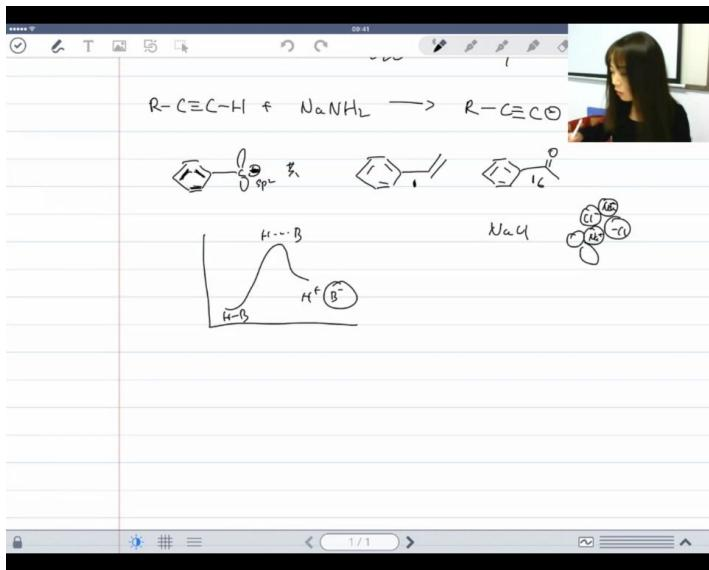

chemical

Hand-drawn chemical reaction equations showing R-C≡C-H reacting with NaNH₂ to form R-C≡C and then to form NaCl, with a corresponding graph of H-B and H+Br groups.

- 离域效应：羧酸负离子的稳定性源于氧原子的孤对电子可以通过 $sp^{2}$ 杂化轨道与相邻的 $\pi$ 体系形成共轭，使负电荷得以离域  
● 共振结构：负电荷可以平均分配在两个氧原子上，实验证明两个碳氧键长度完全相同  
● 对比分析：过氧酸负离子不具备这种离域效应，因此稳定性较差

# 4. 例题:质子竞争题 15:46

1）反应机理分析 16:00

- 箭头表示：反应机理中箭头的画法需要特别注意，这是考试易错点  
● 解题技巧：通过观察答案可以理解正确画法，后续课程会反复练习

# 5. 例题: 烷基化合物判断

1） $\alpha, \beta$ -不饱和羰基化合物

● 亲电位点：在羰基氧相连的碳和双键远端碳上存在两个主要亲电位点  
● 路易斯碱识别：所有亲电位点都是路易斯碱位点，可以用外框标记出路易斯碱

2）解题要点

● 送分题识别：第四题和第五题属于基础题型，应确保得分

易错提醒：第三题容易丢分，需要特别注意反应机理的表达方式

\- 注：笔记中保留了所有关键知识点，包括离域效应的详细解释、共振结构的描述、亲电位点的定位方法等。幻灯片内容与相关知识点进行了准确匹配，公式和结构描述使用了专业术语。衔接性内容已按要

# 6. 例题: 氮碱性强弱排序 16:26

1）氮碱性来源与判断依据

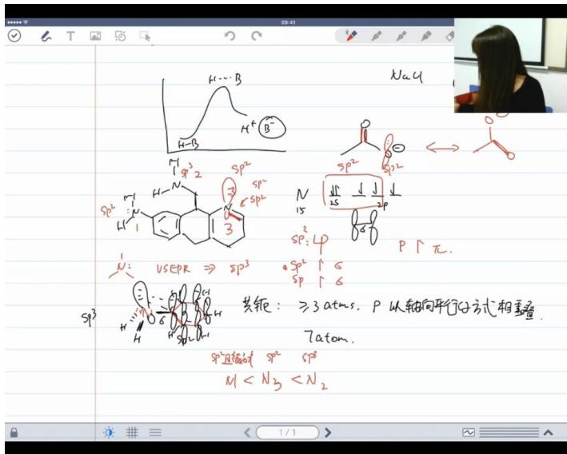

text_image

NaCl
H…B
H-B
SP²
SP²
N
15
SP²: 4
P ↑ π.
VSEPR ⇒ SP³
• SP² ↑ ↓
SP ↑ ↓
共轭：≥3atms，P以轴向平行子方式相重叠。
7atom.
SP²近端的 SP² SP³
M < N₃ < N₂

● 碱性来源: 氮原子上的孤对电子是氨基化合物碱性的来源。  
● 判断依据: 氮原子的杂化方式和孤对电子是否参与共轭是影响碱性强弱的关键因素。

# 2）三种氮的杂化方式分析

# - 氮一( $SP^{2}$ 杂化)

○ 结构特征: 与两个氢和一个碳相连，孤对电子参与苯环共轭  
杂化方式: 由于与苯环相连，苯环碳为 $SP^{2}$ 杂化，氮采取 $SP^{2}$ 杂化更稳定  
○ 共轭效应: 7个原子(p轨道)形成共轭体系( $\geqslant$ 3atoms)，孤对电子被离域  
- 碱性影响: 孤对电子给电子能力减弱，碱性降低

# - 氮二( $SP^{3}$ 杂化)

○ 结构特征: 与 $CH_{2}$ 相连，无共轭体系  
- 杂化方式: 典型SP³杂化，孤对电子未被离域  
- 碱性特点: 孤对电子完全可用，碱性较强

# - 氮三( $SP^{2}$ 杂化)

○ 结构特征: 键角 $120^{\circ}$ ，参与 $\pi$ 键形成  
○ 电子排布: 氮15电子构型 $(2s^{2}2p^{3})$ ，SP $^{2}$ 杂化后:

■ 1个SP²轨道填孤对电子  
■ 2个SP²轨道各1个电子形成σ键  
■ 1个p轨道单电子形成π键

\- 碱性特点: 虽为SP²杂化但孤对电子未参与共轭，碱性介于氮一和氮二之间

# 3）碱性排序原理

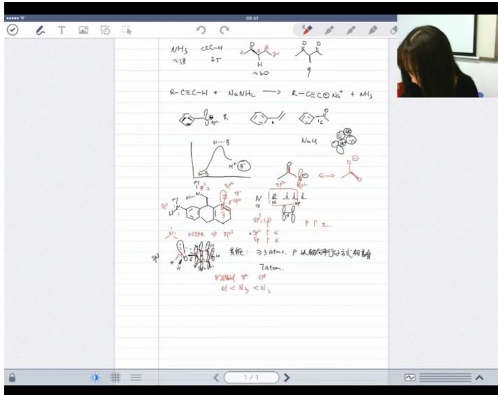

chemical

Hand-drawn chemical reaction equations and molecular structures for a trihydroxyalkane compound

# 影响因素比较:

○ 杂化方式: $SP^{3}$ (氮二) > $SP^{2}$ (氮三)  
○ 孤对电子状态: 未离域(氮二、氮三) > 离域(氮一)

\- 最终排序: 氮二 > 氮三 > 氮一 ( $N_{2} > N_{3} > N_{1}$ )

# ● 记忆要点:

- SP³杂化保留完整孤对电子碱性最强  
- SP²杂化中，孤对电子是否参与共轭是决定性因素

# 二、构象和命名 26:10

# 1. 命名 26:15

# 1）烷烃命名 27:42

# - 母链最长 29:11

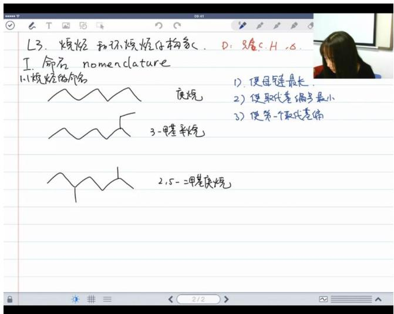

text_image

L3. 烷烃和环烷烃分子构家. D: 赚C.H.O.
I. 命石 nomenclature
1.1 烷烃的命名
庚烷
3-甲基庚烷
2.5-二甲基庚烷
1) 使母链最长.
2) 使取代基编号最小
3) 使第一个取代基编

基本原则：选择碳原子数最多的链作为母链。例如庚烷（7个碳）比甲基辛烷（8个碳）优先级低。  
○ 实例分析：当存在更长的潜在主链时（如包含取代基的链），需重新评估主链选择。如甲基作为取代基时可能使主链延长。

# ● 取代基编号最小 29:49

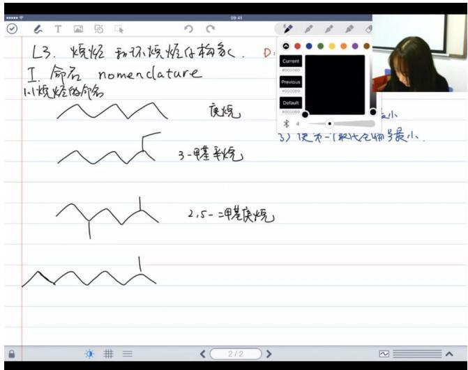

text_image

L3. 烷烃和环烷烃子构olecular
I. 命名 nomenclature
1.1 烷烃的命名
庚烷
3-甲基丙烷
2,5-二甲基庚烷
3) 使为一个取代全4号最小

编号原则：从使取代基位次和最小的方向开始编号。如2,5-二甲基庚烷优于3,6-二甲基庚烷。  
○ 特例说明: 当存在多个取代基时，优先保证编号较小的取代基位次最小。

# ● 第一个取代基编号最小 31:04

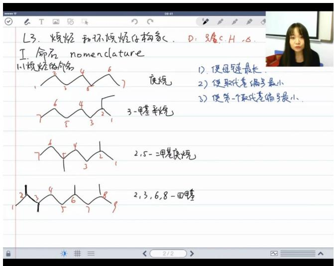

text_image

L3. 烷烃和环烷烃分子构家. D: 赞c.H.D.
I. 命石 nomenclature
1.1烷烃的命名
庚烷
1) 使母链最长.
2) 使取代基编号最小
3) 使第一个取代基编号最小.
庚烷
3-甲基亲烷
2.5-二甲基庚烷
2.3,6,8-四甲基

优先级规则：当第一个取代基位次相同时，比较后续取代基位次。如2,3,6,8-四甲基壬烷优于2,4,6,7-四甲基壬烷。  
实例演示: 对于壬烷衍生物, 从左向右编号 (2,3,6,8) 比从右向左 (2,4,6,7) 更符合规则。

● 编号一样则依次向后比 34:03

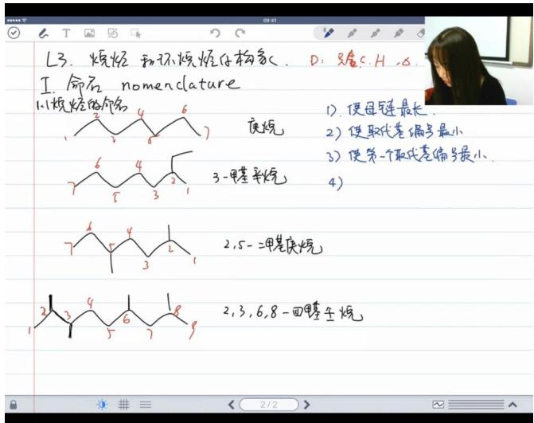

text_image

L3. 烷烃和环烷烃子构家.
D: 蚤C.H.D.
I. 命名 nomenclature
1.1烷烃的命名
2 3 4 6 7 庚烷
3 6 4 3 2 1 3-甲基辛烷
7 5 4 3 2 1
2,5-二甲基庚烷
2,3,6,8-四甲基壬烷

○ 延伸比较: 当第一个取代基位次相同时，依次比较后续取代基位次。  
取代基差异: 若取代基不同（如氯和溴），中文命名按原子序数排序（Cl > Br），英文按首字母排序（Bromo < Chloro）。

2）应用案例 40:47

例题:命名练习

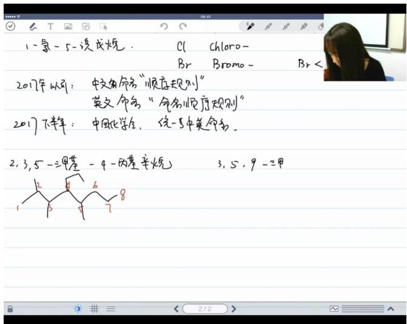

text_image

1-氯-5-溴戊烷. Cl Chloro-
Br Bromo- Br<
2017年以“: 中文角命名“顺序规则”
英文命名“命名顺序规则”
2017下半年: 中国化学, 统-5中英命名.
2,3,5-三甲基-4-的基辛烷 3,5,9-二甲

# ○ ○ 题目解析

■ 结构分析: 13碳主链，含3,5,9-三甲基、11-乙基、7-(2,4-二甲基己基)等复杂取代基  
■ 编号技巧: 先确定主链编号（1-13），再处理取代基内部编号  
■ 命名要点: 复杂取代基需用括号标明其结构, 如7-(2,4-二甲基己基)

# ● 例题:命名练习 45:49

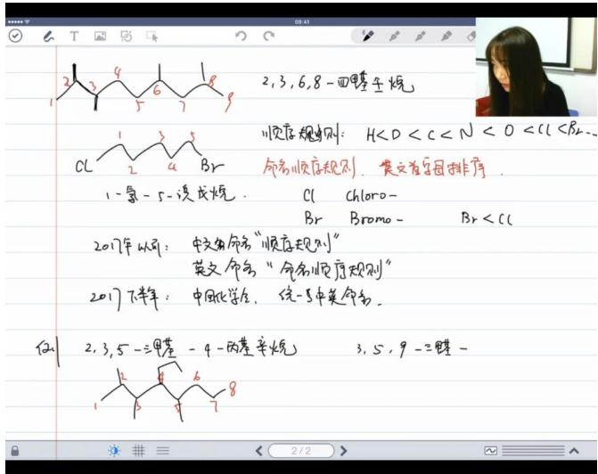

text_image

2,3,6,8-四重壬烷
顺序规则: H<D<C<N<0<CL<Br...
命名顺序规则. 黄文为安国排序
1-氯-5-溴戊烷
Cl Chloro-
Br Bromo- Br
2017年以前: 中文为命名“顺序规则”
英文命名“命名顺序规则”
2017下半年: 中北化学, 统一与中英命名.
例 2,3,5-三重 - 4-丙基辛烷 3,5,9-二重 -

# ○ ○ 题目解析

■ 中英文差异: 1-氯-5-溴戊烷（中文按原子序数）vs 5-溴-1-氯戊烷（英文按字母顺序）  
■ 规则演变: 2017年后中国化学会统一中英文命名规则  
■ 实际应用: 考试多考察"名称→结构"的推导，规避排序规则争议

# 3）常见烷基 48:22

● 中英命名对照与顺序规则 48:41

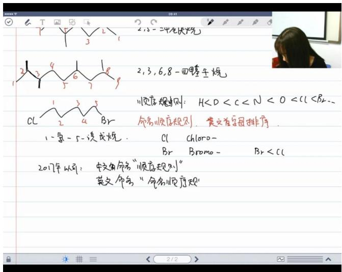

text_image

2.5-二甲苯炔烷
2,3,6,8-四醛壬烷
顺序规则: H<0<c<N<0<cl<Br...
命名顺序规则. 黄文为字团排序.
1-氯-5-溴戊烷. Cl Chloro-
Br Bromo- Br<CL
2017年以可: 中文命名“顺序规则”
英文命名“命名顺序规”

历史沿革：2017年前中文用顺序规则（原子序数），英文用命名顺序规则（字母顺序）  
○ 现行标准: 2017年后统一采用英文命名顺序规则  
- 记忆技巧: 英文缩写B（Bromo）<C（Chloro）对应字母表顺序

● 甲烷与甲基 48:59

- 英文对应: Methane（甲烷）→Methyl（甲基）  
○ 词尾规律: -ane（烷烃）对应 -yl（基团）

● 乙烷与乙基 49:35

\- 英文对应: Ethane (乙烷) → Ethyl (乙基)

● 丙烷、丙基与异丙基 49:45

○ 命名对比: Propane（丙烷）→ Propyl（正丙基） vs Isopropyl（异丙基）  
○ 结构差异: 正丙基为直链, 异丙基有分支

\- 丁烷与各类丁基 50:45

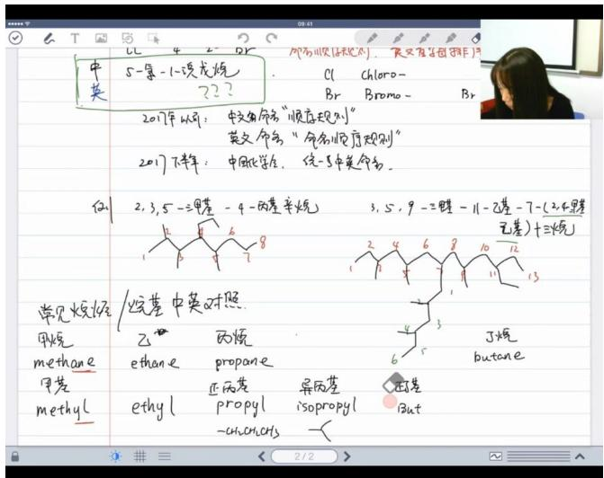

text_image

中英
5-景-1-淡龙烷
????
2017年以内： 中英命名“顺序规则”
英文命名“命名顺序规则”
2017下半年： 中英化学，统一5-中英命名。
例
2,3,5-三甲基-9-丙基辛烷
3,5,9-二醇-11-乙基-7-(2,4-甲基)
己基+十三烷
常见烷烃/烷基 中英对照.
甲烷
methane
甲基
methyl
乙 烷
ethane
丙烷
propane
正丙基
异丙基
ethyl
propyl
isopropyl
-but
-chlorohydrin
丁烷
butane
丙烯

○ 四种变体:

n-Butyl（正丁基）  
Isobutyl（异丁基）   
■ sec-Butyl（仲丁基）  
■ tert-Butyl（叔丁基）

命名特点: 前缀n-可省略，其他需标明

● 俗名与系统命名法 52:05

○ 使用规范: IUPAC允许使用常见基团的俗名（如isopropyl）  
○ 限制条件: 复杂取代基仍需系统命名

● 例题1：IUPAC命名法应用 52:41

○ 题目解析

■ 系统命名: 2-甲基-3-乙基庚烷（严格IUPAC）  
■ 俗名应用: 四异丙基庚烷（可接受但不推荐）  
■ 编号原则: 保证取代基位次和最小

4）环烷烃的命名 54:36

环是主体 55:07

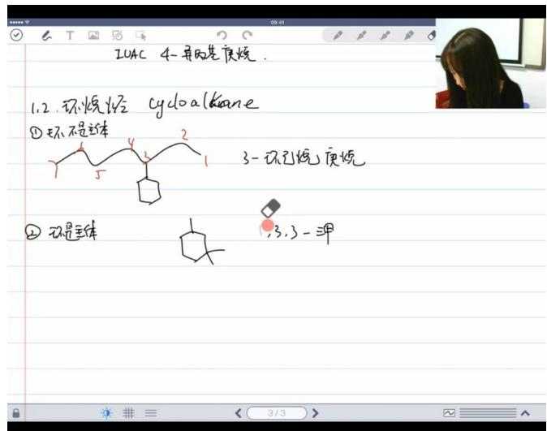

text_image

IOAC 4-并两基底烧
1.2. 环烷烃 cycloalkane
①环不是主体
3-环己烷底烧
②环是主体
3,3-三钾

○
○ 主体判断原则：

当环不是主体时：命名以链为主体，环作为取代基。例如"3-环己基庚烷"表示7个碳的主链上第3  
■ 当环是主体时：命名以环为主体，链作为取代基。例如"1,1,3-三甲基环己烷"表示环己烷上1,1,3位

○ 编号规则：

■ 环作为主体时，要使取代基编号尽可能小  
■ 当多个取代基时，采用"最多最小系列"原则，即优先使第一个取代基编号最小

\- 桥环 56:42

○ 桥环的定义 56:47

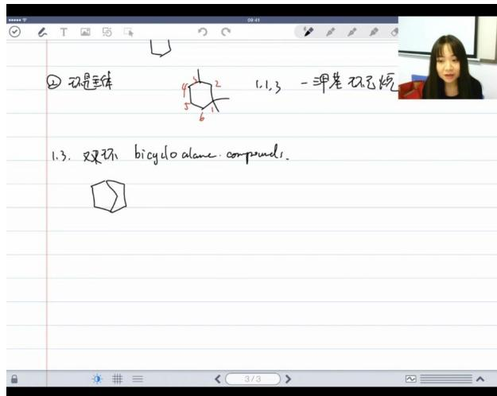

text_image

② 环是主体
1.1.3 一潭巷双环烷
1.3. 双环 bicyclo alane compound.

结构特征：由一个环通过"桥"连接形成两个环的结构，英文称为"bicycloalkane"  
■ 平面表示法：用平面图形表示时，桥通常画在环中间  
■ 立体表示法：等价于三维立体结构，桥连接环的两个不同位置

\- 双环的平面与立体画法 57:25

■ 双环定义：在原有环基础上加一个桥，形成两个环的体系

■ 画法特点：平面画法中桥将环分割为两部分，立体画法中桥连接环的不同位置

○ 双环的编号规则 57:50

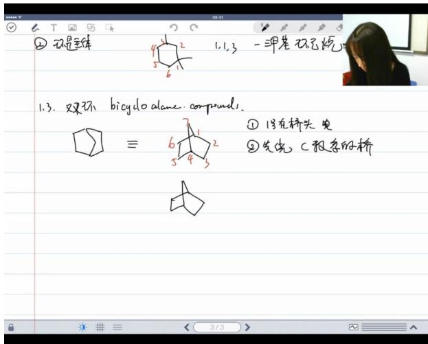

text_image

① 巩星主体
1.3 一冲星双环
1.3. 双环 bicylo alane compounds.
① 学在桥头兔
② 先绕 C 报条的桥

■ 编号起点：从桥头碳开始编号（1号位）  
■ 编号顺序:

- 先绕碳原子数多的桥进行编号  
- 再绕碳原子数少的桥继续编号

■ 记忆口诀："一号在桥头，先绕大环走"

○ 含有取代基的双环命名 58:40

■ 命名步骤:

● 确定母体名称：根据总碳数确定烷烃名称  
● 标明双环结构：使用"双环"前缀  
● 方括号内注明桥碳数：从大到小列出各桥的碳原子数（不包括桥头碳）  
- 标明取代基位置和名称

■ 示例：双环[2.2.1]庚烷表示：

总碳数7个（庚烷）  
● 最大桥2个碳，次大桥2个碳，最小桥1个碳

例题1：双环的命名 01:00:21

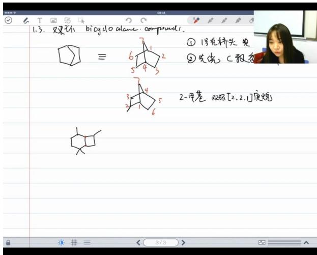

text_image

1.3. 双环 bicyclo alane compound
① 1号在桥头 兔
② 先烷 C 股态
2-甲基 双环[2.2.1]庚烷

解题要点：

- 确认桥头位置  
- 按"最多最小系列"原则确定编号顺序  
● 统计各桥碳原子数  
- 按规则写出完整名称

■ 示例解析：2,2,5,7-四甲基双环[4.2.0]辛烷

● 母体：8个碳（辛烷）  
- 桥碳数：4,2,0  
● 取代基：2,5,7位甲基

○ 桥环的俗名 01:01:33

■ 金刚烷：adamantane，常见于竞赛题  
■ 立方烷：cubane，结构呈立方体形状  
■ 记忆点：这两种特殊桥环结构需要记住其俗名和对应结构

● 螺环 01:02:32

◦ 螺环的定义与特点 01:02:36

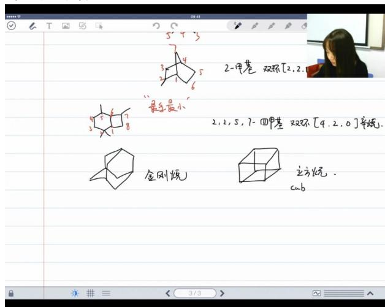

text_image

2-甲基 双环[2.2.1]
“最半最小”
2,2,5,7-四甲基 双环[4.2.0]辛烷.
金刚烷
立方烷
cmb

结构特征：两个环共用一个碳原子（螺原子），形似"鱼"的结构  
■ 英文名称：spiro compound（spiro表示"螺"的意思）  
■ 与桥环区别：桥环共用两个碳原子，螺环只共用一个碳原子

○ 螺环的编号规则 01:03:11

■ 编号起点：从螺原子开始编号（1号位）  
■ 编号顺序:

- 先绕小的环编号  
- 再绕大的环继续编号

■ 记忆口诀："螺环编号反桥环，先小后大顺序编"

◦ 螺环的命名方法 01:04:00

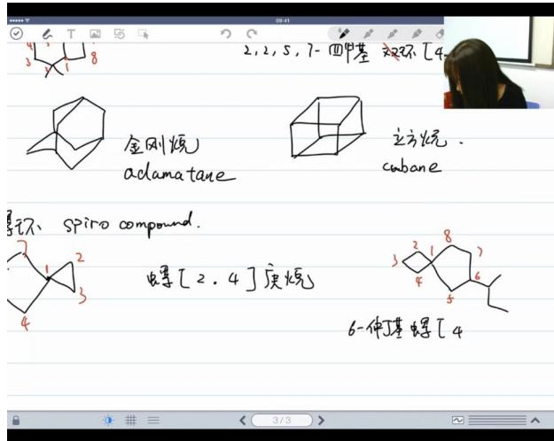

text_image

2,2,5,7-四甲基效环[4]
金刚烷
adama tane
立方烷.
cubane
环: spiro compound.
蝶[2.4]庚烷
6-仲丁基蝶[4]

■ 命名步骤:

- 使用"螺"前缀  
● 方括号内注明各环碳数（不包括螺原子）

● 根据总碳数确定母体名称  
- 标明取代基位置和名称

■ 示例：螺[2.4]庚烷表示：

总碳数7个（庚烷）  
● 小环2个碳，大环4个碳

○ 螺环命名中的特殊规则与俗名 01:05:13

■ 取代基处理：与烷烃相同，遵循"取代基编号尽可能小"原则  
■ 俗名示例：

● 仲丁基（sec-butyl）：特定结构的丁基取代基

\- 示例：6-仲丁基螺[3.4]辛烷

○ 螺环命名的存疑与确认 01:15:17

■ 编号争议：当不同取代基位于编号起点两端时，编号顺序需确认  
■ 确认原则：最终需按IUPAC规则确认，通常优先使优先基团编号较小  
■ 考试注意：螺环命名考察概率较低，但基本规则仍需掌握

# 2. 构象 01:15:48

# 1）伞形和锯架式相互转化 01:22:18

● 乙烷构象的表示方法

\- 伞式与锯架式的转换

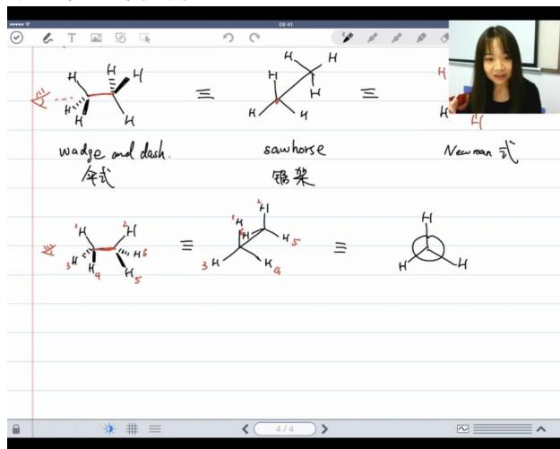

chemical

Hand-drawn chemical structures of wedge and dish, sawhorse, and new man forms with Chinese labels

等价关系：伞式与锯架式是等价的构象表示方法，可以相互转换  
■ 编号对应：碳原子编号为碳1（ $C_{1}$ ）和碳2（ $C_{2}$ ），氢原子编号为氢1-氢6（ $H_{1}-H_{6}$ ），在转换时需要保持一一对应关系  
空间想象：转换时需要沿着红色碳碳键方向观察，理解原子在三维空间中的位置关系

\- 纽曼投影式的绘制技巧 01:24:35

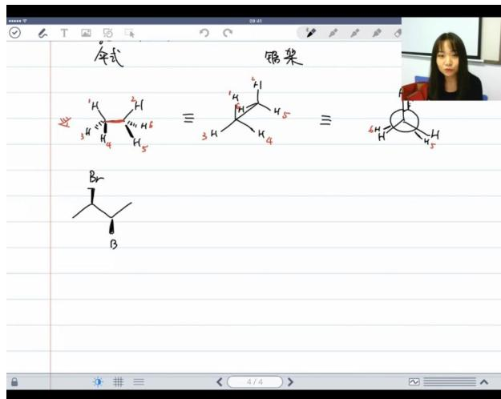

chemical

Chemical structures of pentane and bismuthene shown in a chemistry textbook, with accompanying photo of a person in the background.

■ 观察方向：必须沿着碳碳键轴线方向观察，将两个碳原子重叠表示  
■ 原子遮挡：后方碳原子被遮挡可不画，但氢原子需要稍微错开表示  
■ 旋转规律：氢原子按顺时针方向依次错开排列，保持空间关系  
■ 练习建议：初次学习时建议先观察老师绘制过程，理解后再自行练习

○ 基团缩写规则 01:26:40

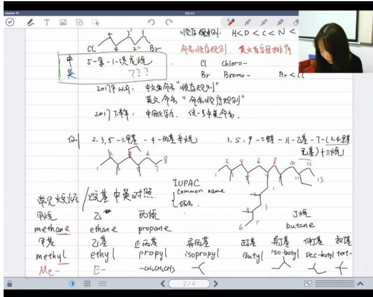

text_image

中英
5-苯-1-溴戊烷
????
2017年以碳： 中英命名“顺序规则”
英文命名“命名顺序规则”
2017年降： 中低化学法，统一与中英命名。
2,3,5-三甲基-9-四苯类烷
3,5,9-三醇-11-乙基-7-(二氢甲基)-十三烷
IUPAC
common name
乙基
propane
butane
methane
甲基
ethyl
propyl
isopropyl
Butyl
iso-butyl sec-butyl tort-
Me-
E-
chlorohydrin
丁烷

甲基：Me（methyle）  
■ 乙基：Et (ethyle)   
■ 丙基: Pr (propyle)   
■ 异丙基：iPr（isopropyle）  
■ 丁基：Bu (butyle)   
■ 叔丁基：tBu (tert-butyle)   
书写规范：首字母大写，后续字母小写，特殊前缀用小写（如iso-, sec-, tert-）

○ 构象转换实例分析

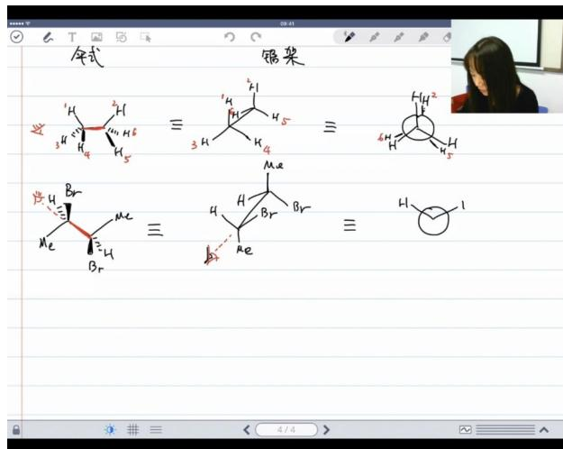

chemical

Hand-drawn chemical structures of pentane and bromine derivatives with labeled atoms and bonds

■ 视角转换：从45度角观察转换为正前方观察时，基团位置会发生变化  
■ 空间对应：甲基从向下变为向上，溴原子从向右变为在后方  
■ 等价验证：通过旋转可以验证不同表示方法之间的等价性

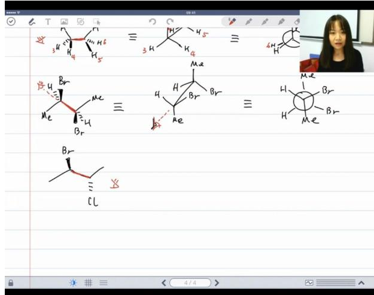

chemical

Hand-drawn chemical structures of brominated alkene with labeled atoms and a photo of a person in the background

■ 复杂分子处理：对于含多个取代基的分子，需要先补齐所有氢原子  
■ 立体关系：明确哪些基团在纸面内，哪些在纸面外

■ 转换步骤:

● 确定观察的碳碳键   
- 补齐所有相连的原子  
- 按视角绘制锯架式  
- 转换为纽曼投影式

# - 环烷烃构象的特殊处理

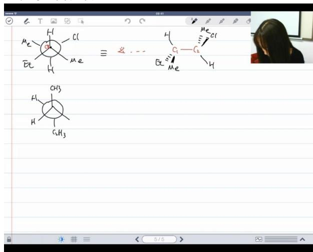

chemical

Hand-drawn chemical structures of methyl groups and chlorine, including a cyclopentadiene ring with methyl substituents

■ 信封型构象：五元环的稳定构象，一个边翘起类似信封形状  
■ 取代基定位：需要明确各取代基在环平面上下的位置关系  
■ 表示转换：

● 实线表示向上或向外的基团  
● 虚线表示向下或向内的基团  
● 同位素标记（如D）需要特别注意空间定位

○ 构象分析要点总结

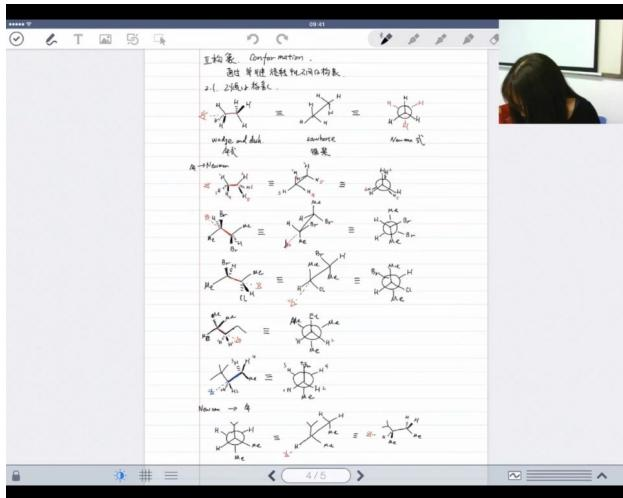

chemical

Chemical reaction equations showing structural transformations of a molecule with labeled structures and reaction conditions

■ 核心能力：掌握伞式、锯架式和纽曼式之间的相互转换   
■ 练习方法：从简单分子开始，逐步过渡到复杂分子  
■ 空间想象：培养三维空间思维能力是关键  
■ 常见错误：基团编号对应错误、空间定位不准确、忽略立体关系

2）构象分析的势能图 01:44:29

● 纽曼式在构象分析中的应用 01:44:59

优势分析：纽曼式能最清晰地展示基团间的位阻效应，相比线式和散式更适合构象分析。线式和散式虽然直观，但无法准确表现立体化学中的空间位阻。  
应用场景：特别适用于分析乙烷等简单分子的构象变化，通过旋转 $\sigma$ 键产生不同构象。

● 乙烷构象的二面角变化 01:46:06

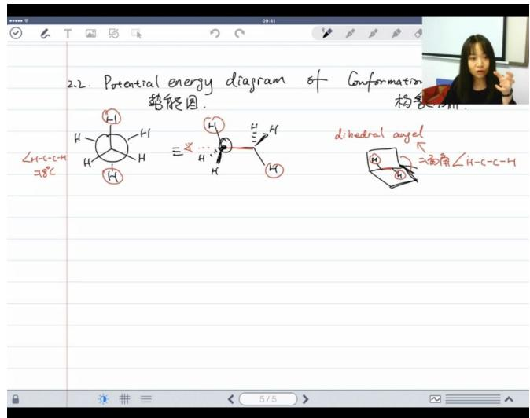

text_image

2.2. Potential energy diagram of Conformation
势能因.
∠H-C-C-H =8°C
dihedral angel
=两角∠H-C-C-H

定义：二面角指两个平面（氢-碳-碳和碳-碳-氢平面）的夹角，记为 $\angle H - C - C - H$ 。  
○ 测量方法：

■ 初始状态（重叠式）二面角为 $180^{\circ}$

■ 每顺时针旋转 $60^{\circ}$ ，二面角依次变为 $120^{\circ}\rightarrow60^{\circ}\rightarrow0^{\circ}\rightarrow60^{\circ}\rightarrow120^{\circ}\rightarrow180^{\circ}$ （完成 $360^{\circ}$ 旋转）

○ 关键数值：旋转过程中会形成6个特征构象，对应二面角分别为 $180^{\circ}$ 、 $120^{\circ}$ 、 $60^{\circ}$ 、 $0^{\circ}$ 、 $60^{\circ}$ 、 $120^{\circ}$ 。

● 乙烷六种构象的稳定性排序 01:51:16

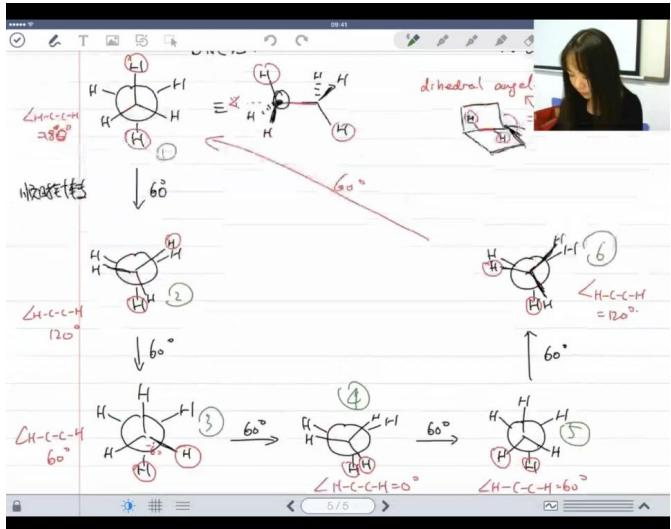

text_image

∠H-C-C-H
=30°
顺式转角
∠H-C-C-H
120°
∠H-C-C-H
60°
∠H-C-C-H=0°
dihedral angel
∠H-C-C-H
=120°
∠H-C-C-H=60°
∠H-C-C-H=0°
∠H-C-C-H=60°

编号规则：将6种构象编号为1-6，其中1、3、5对应二面角 $180^{\circ}$ 、 $60^{\circ}$ 、 $120^{\circ}$ ；2、4、6对应 $0^{\circ}$ 、 $60^{\circ}$ 、 $120^{\circ}$ 。  
- 稳定性排序：135构象（交叉式）比246构象（重叠式）更稳定，能量更低。

● 构象分析的势能关系图 01:52:38

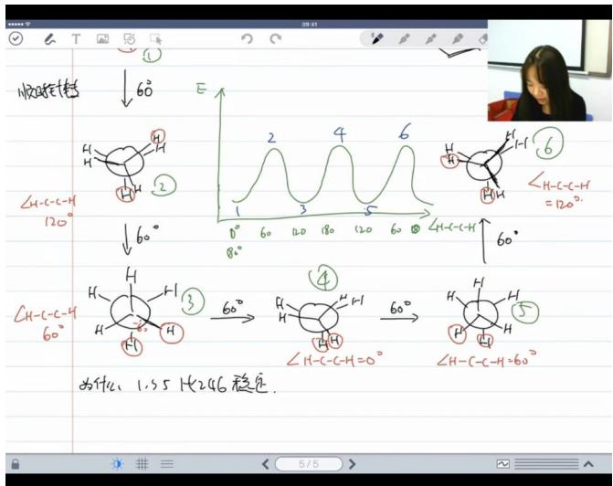

text_image

顺络热图
↓60°
E
2 4 6
H-C-C-H = 120°.
↓60°
80°
H-C-C-H
60°
③
→
④
∠H-C-C-H=0°
→
∠H-C-C-H=60°
为什么：1.55 H246稳定。

图形特征：横轴为二面角（0°-180°），纵轴为相对能量  
○ 关键点：

■ 能量最低点：135构象（交叉式）  
■ 能量最高点：246构象（重叠式）  
■ 能垒高度：约12.5kJ/mol（乙烷的旋转能垒）

● 构象稳定性的解释：位阻效应与超共轭效应 01:53:30

○ 位阻效应：

■ 重叠式构象中氢原子空间排斥导致能量升高  
■ 交叉式构象氢原子间距最大，位阻最小

○ 超共轭效应：

■ 特殊现象： $\sigma$ 键轨道重叠使体系稳定  
■ 作用机制：C-H键的σ电子与相邻C-C键的反键轨道相互作用  
■ 仅在乙烷构象分析中需要考虑，更复杂分子主要考虑位阻效应

# 三、超共轭效应01:55:36

1. sigma键的形成与分子轨道理论 01:55:45

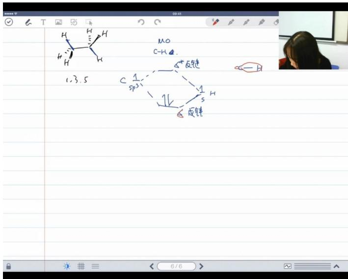

chemical

Hand-drawn chemical structure diagram showing carbon chain with ester and alkyl groups, labeled with partial charges and bond length 1.3.5

- 形成过程：碳氢sigma键由碳的 $SP^{3}$ 杂化轨道和氢的s轨道电子组合形成，两个原子轨道组合成两个分子轨道（成键轨道 $\sigma$ 和反键轨道 $\sigma^{*}$ ）。  
● 轨道特征：成键轨道电子云密度集中在两原子核之间，反键轨道电子云分布在两原子外侧。成键轨道用红色表示，反键轨道用蓝色表示。  
- 理论应用：有机化学中通常只在研究大共轭体系时使用前线轨道理论，而单键形成主要采用分子轨道理论解释。

2. 超共轭效应的定义与原理 01:58:50

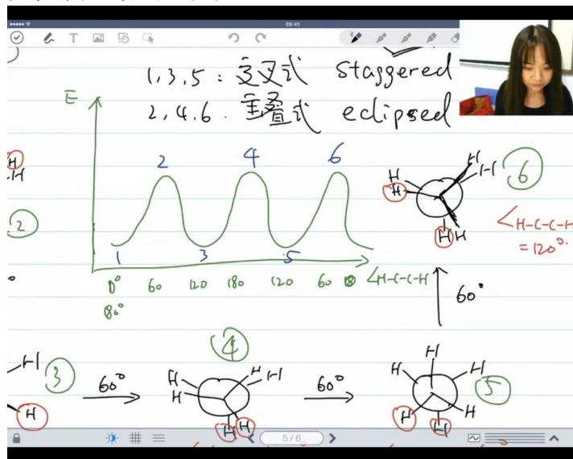

text_image

1,3,5:交叉式 staggered
2,4,6.重叠式 eclipseel
E
H
H
②
2
4
6
H-C-C-H
=120°
60°
80°
H
③ 60°
④
60°
H
⑤
5/6

- 作用机制：当两个碳氢键的σ轨道轴向平行时，可以发生类似π键的"肩并肩"重叠，这种σ键之间的轨道有效重叠称为超共轭效应。  
- 稳定作用：超共轭效应能降低体系能量，是解释乙烷构象稳定性的重要因素之一。如1,3,5位交叉式构象中，相邻碳氢键的σ轨道可形成超共轭。

3. 乙烷构象稳定性的解释变迁 01:59:16

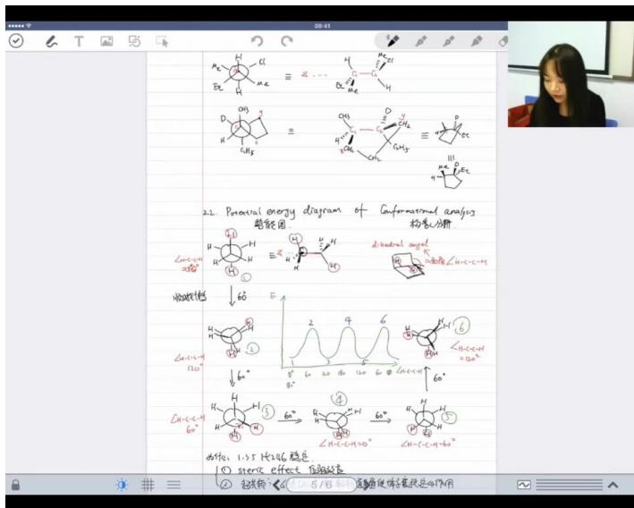

chemical

Chemical reaction equations and diagrams for prostatic energy analysis, including isomerization and isohydring reactions

- 传统观点：认为位阻效应是乙烷交叉式构象（1,3,5位）更稳定的主要原因，可解释氢原子间的空间排斥。  
● 新观点争议：2000年代Nature文章提出超共轭效应才是决定性因素，引发学术争议。部分教材已修改，但后续研究仍有质疑。  
- 当前共识：两种效应共同作用，但主导因素尚无定论。教学中通常同时列出位阻效应和超共轭效应两种解释。

# 四、位阻效应01:59:55

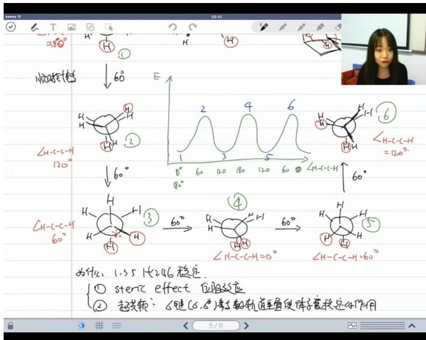

text_image

顺转后
↓60°
△H-C-C-H
120°
↓60°
CH-C-C-H
60°
E
2 4 6
1 3 5
∠H-C-C-H=0°
∠H-C-C-H=60°
∠H-C-C-H=120°
∠H-C-C-H=60°
→
④
⑤
为什么：1.55 Hz/246 稳定。
① steric effect 位阻效应
② 超先转：∠键(6.0°)滑过鞍轨道重叠使体子要稳定的作用

- 空间排斥：在重叠式构象（2,4,6位）中，氢原子间距更近，产生更强的空间位阻，导致体系能量升高约12.6kJ/mol。  
● 角度关系：二面角为 $0^{\circ}$ 、 $120^{\circ}$ 、 $240^{\circ}$ 时为重叠式， $60^{\circ}$ 、 $180^{\circ}$ 、 $300^{\circ}$ 时为交叉式，位阻最小化使交叉式更稳定。

# 五、构象和重叠式交叉式命名 02:00:58

# 1. 分子轨道理论与sigma键 02:02:32

- 轨道组合：分子轨道数量等于参与组合的原子轨道数量，如碳氢σ键由1个 $SP^{3}$ 和1个s轨道组合成1个成键轨道和1个反键轨道。  
● 能量关系：成键轨道能量低于原子轨道，反键轨道能量高于原子轨道，电子优先填充成键轨道使体系稳定。

# 2. 乙烷的构象与命名 02:04:13

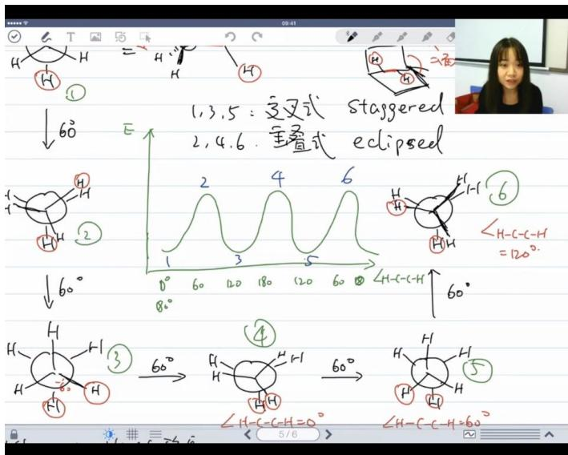

text_image

1,3,5:交叉式 staggered
2,4,6.宝叠式 eclipseel
H-C-C-H
=120°
H-C-C-H=0°
H-C-C-H=60°

- 交叉式(staggered): 对应1,3,5位构象, 二面角 $60^{\circ}$ 、 $180^{\circ}$ 、 $300^{\circ}$ , 氢原子空间排列呈交叉状, 能量较低。  
- 重叠式(eclipsed): 对应2,4,6位构象, 二面角 $0^{\circ}$ 、 $120^{\circ}$ 、 $240^{\circ}$ , 氢原子空间排列重叠, 能量较高。

# 3. 构象稳定性的因素 02:04:46

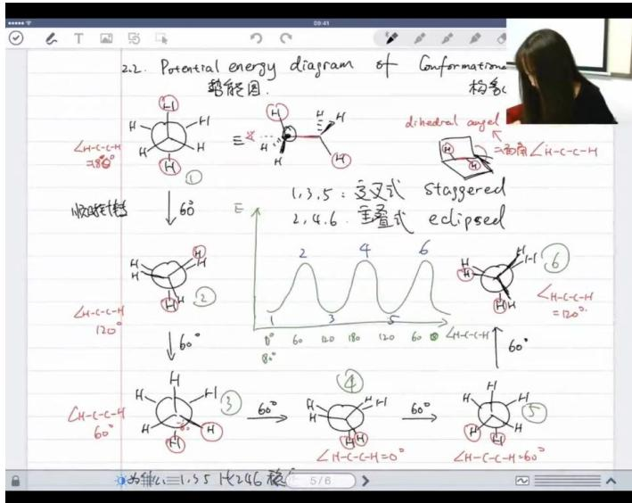

text_image

2.2. Potential energy diagram of Ca(+)-formations
势能图.
构氢
∠H-C-C-H
=80°
顺式转档
↓60°
1,3,5:交叉式 staggered
2,4,6. 金叠式 eclipsed
∠H-C-C-H
=120°
↓60°
60°
∠H-C-C-H=0°
∠H-C-C-H=60°
①为什么=1,3,5 H246核 5/6 >

- 双重因素：既包含位阻效应（空间排斥），也包含超共轭效应（轨道重叠稳定化），两者共同决定构象稳定性。  
● 能量变化：势能图中显示每60°一个能垒，交叉式与重叠式交替出现，能垒高度约12.6kJ/mol。

# 4. 丙烷与正丁烷的构象概述 02:07:38

- 丙烷特点：构象能垒图与乙烷相似，但因甲基体积大于氢原子，能垒高度增加至约14kJ/mol。  
- 正丁烷差异：存在更多构象异构体（全重叠、邻位交叉、对位交叉等），势能图更为复杂，需单独分析。

# 六、正丁烷构象分析图 02:08:34

# 1. 丁烷的绘制与散式表示 02:08:44

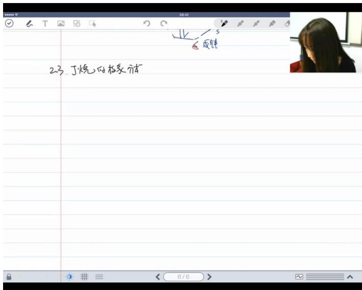

text_image

2-3.丁烷的极象分布

- 基本结构：丁烷分子由4个碳原子组成直链结构，化学式为 $C_4H_{10}$   
● 散式表示：将丁烷分子从箭线式转换为散式表示，便于后续构象分析

# 2. 纽曼式的绘制与二面角分析 02:09:22

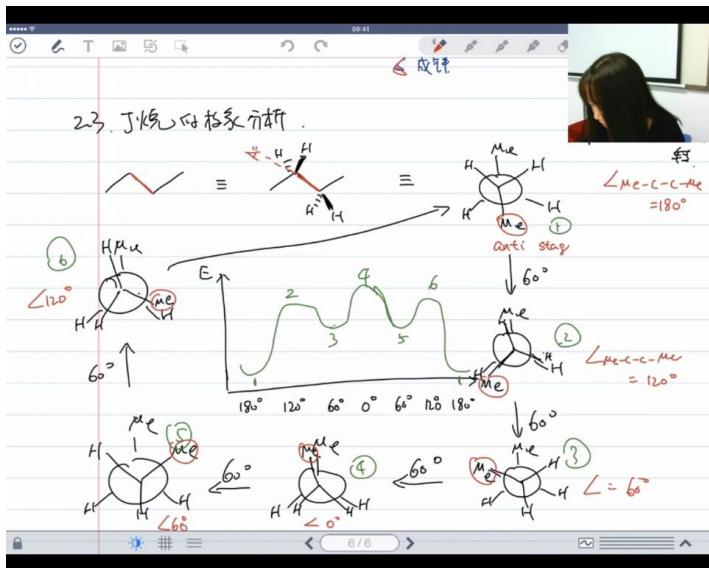

text_image

23. 丁烷时松家分析.
6
∠120°
60°
E
2
3
4
5
6
180° 120° 60° 0° 60° 10° 180°
H
H
H
H
H
H
H
H
H
H
H
H
H
H
H
H
H
H
H
H
H
H
H
H
H
H
H
H
H
H
H
H
H
H
H
H
H
H
H
H
H
H
H
H
H
H
H
H
H
H
LME-C-C-Me =180°
LME-C-C-Me =120°
LME-C-C-Me =60°

- 旋转轴选择：沿中间碳碳键（ $C_2 - C_3$ 键）旋转进行构象分析  
● 二面角标注：关键二面角包括0°、60°、120°、180°等位置  
● 构象变化：前甲基顺时针旋转60°为一个变化单位，后面甲基保持不动

# 3. 正丁烷的六种构象展示 02:10:55

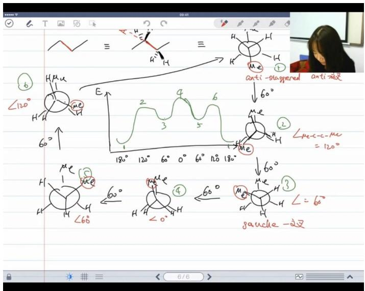

text_image

6
H
H
H
H
H
H
H
H
H
H
H
H
H
H
H
H
H
H
H
H
H
H
H
H
H
H
H
H
H
H
H
H
H
H
H
H
H
H
H
H
H
H
H
H
H
H
H
H
H
H
120°
60°
E
2 4 6
1 3 5
180° 120° 60° 0° 60° 0.0 180°
60°
LME-C-C-Me = 120°
60°
L=60°
60°
L=60°
60°
L=60°
60°
L=60°
60°

构象编号：1-6号构象分别对应不同旋转角度  
● 能量关系：从高到低依次为4>3=5>2=6>1   
● 位阻效应：甲基与甲基/氢的相互作用是能量差异的主要原因

4. 正丁烷构象的相对能量大小关系 02:12:41

- 稳定顺序：最稳定为1号（反式交叉），其次3和5号（邻位交叉），然后是2和6号，最不稳定是4号  
● 影响因素：位阻效应主导能量差异，超共轭效应在丁烷中不显著

5. 构象分析中的位阻效应 02:15:00

● 主要表现：甲基与甲基/氢的空间排斥作用  
● 与乙烷区别：乙烷仅考虑H-H相互作用，丁烷需考虑更大基团的位阻

6. 构象的命名：交叉式与重叠式 02:16:55

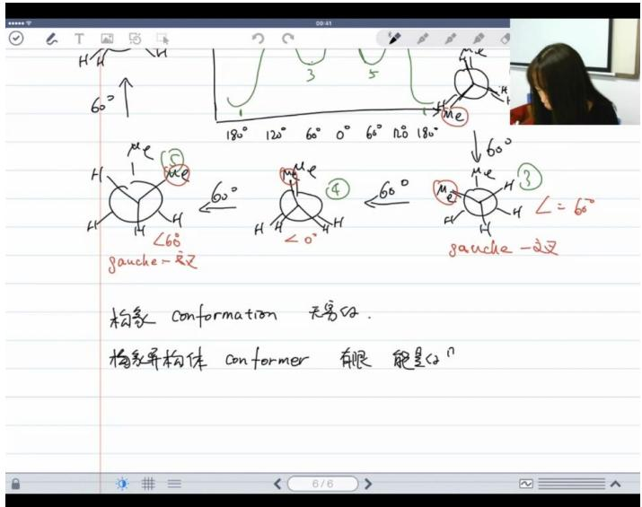

text_image

60°
180° 120° 60° 0° 60° 180°
60°
60°
60°
60°
L=60°
gauche-交叉
60°
gauche-交叉
构象 conformation 无穷的。
构象异构体 conformer 有根 能量过

- 反式交叉(anti-staggered): 二面角180°的最稳定构象  
● 邻位交叉(gauche): 二面角60°的次稳定构象  
- 重叠式(eclipsed): 二面角0°的高能构象

7. 构象与构象异构体的概念 02:17:46

● 构象(conformation): 分子通过单键旋转产生的无穷多种空间排列  
● 构象异构体(conformer): 势能图上的能量极小值点（1,3,5号构象）  
● 非异构体：2,4,6号构象不是构象异构体，因为旋转会升高能量

# 七、构象和异构体有限能量估值问题02:18:55

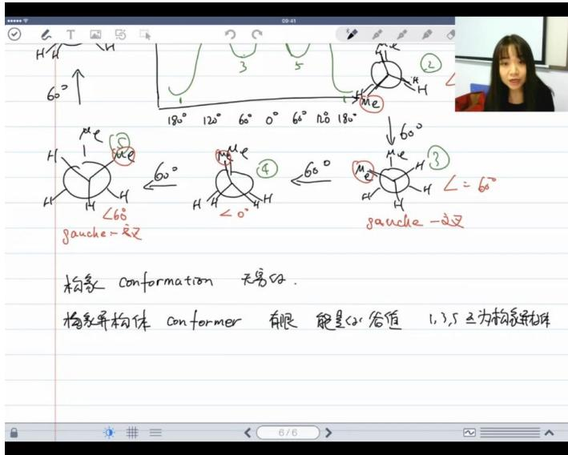

text_image

60°
180° 120° 60° 0° 60° 180°
60°
60°
60°
60°
60°
60°
60°
60°
60°
60°
60°
60°
60°
60°
60°
60°
60°
60°
60°
60°
60°
60°
60°
60°
60°
结构 conformation 无穷的。
构象异构体 conformer 有氧 能量(水)谷值 1,3,5 三为构象异构体

● 能量谷值：1,3,5号构象是能量极小值点，互为构象异构体  
● 考试重点：构象异构体指稳定的构象，而非所有可能的构象

# 八、环张力02:19:59

# 1. 三元环（环丙烷）的特点与不稳定性 02:20:15

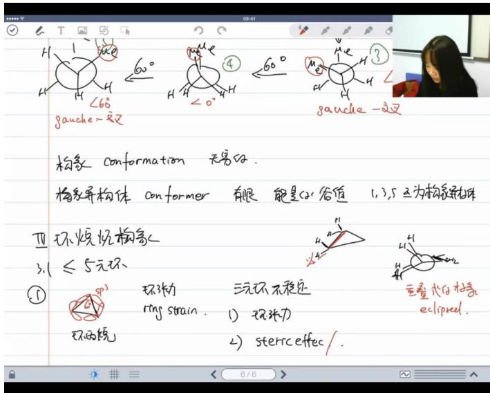

text_image

gauche一定
构象 conformation 无穷。
构象异构体 conformer 有氧 能量(2)谷值 1,3,5 三为构象异构体
环烷烃构象
3.1 ≤ 5元环
①
环丙烷
环铷 环三环不稳定
ring strain.
1) 现弧力
2) steric effect /
重量小的构象
eclipped.

- 平面结构：三个碳原子必然共平面，形成正三角形  
● 键角张力： $SP^{3}$ 杂化理想键角109.5°，实际60°，产生巨大环张力  
● 重叠构象：纽曼投影显示为全重叠式，位阻效应显著  
● 开环倾向：极易开环反应，是三元环的特征性质

# 2. 四元环（环丁烷）的特点与稳定性 02:23:47

● 非平面结构：通过折叠减小位阻，实际键角约88°  
● 环张力：比三元环小但仍存在，键角偏离理想值约21.5°  
● 构象优势：折叠后接近交叉式构象，位阻显著降低

# 3. 五元环（环戊烷）的特点与稳定性 02:25:47

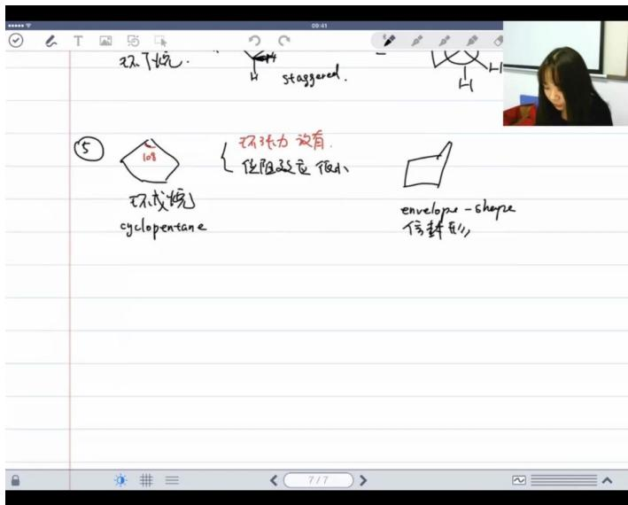

text_image

环戊烷
staggered.
环戊烷
cyclopentane
环张力 放有.
使阻效应 倾小
enveloppe-shape
信针形

● 信封构象：一个碳原子翘起形成信封状结构  
● 键角匹配：正五边形内角 $108^{\circ}$ ，接近 $SP^{3}$ 理想键角  
● 稳定性：环张力和位阻都很小，化学性质较稳定

# 4. 环己烷与取代环己烷的优势构想 02:28:01

● 构象分析：环己烷存在椅式、船式等多种构象  
● 稳定性趋势：从三元环到六元环，稳定性逐渐增加  
● 取代影响：取代基位置会影响环己烷构象的稳定性

# 九、环己烷和取代环己烷的优势构象 02:28:47

# 1. 环己烷的构象 02:28:54

# 1）基本构象类型

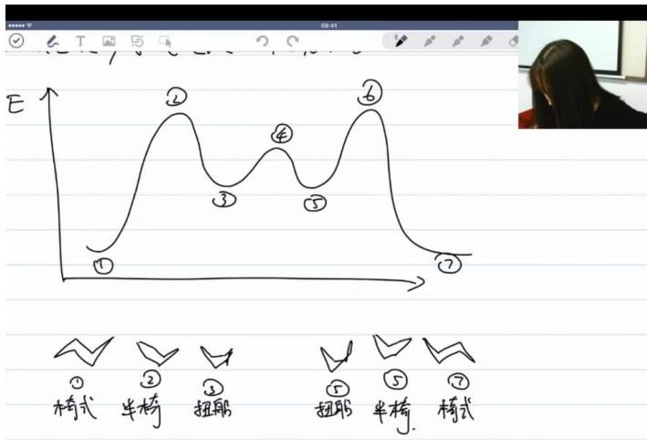

text_image

E
①
②
③
④
⑤
⑥
⑦
①
椅式
②
半椅
③
扭肩
⑤
扭肩
⑤
半椅
⑦
椅式

● 椅式构象：能量最低的稳定构象，形似躺倒的椅子，1号和7号位对称  
● 半椅式构象：将椅式构象的"椅子腿"翘起形成，2号和5号位对称  
● 扭船式构象：在半椅式基础上进一步扭曲形成，3号和5号位对称  
● 船式构象：相对容易绘制的构象，4号位单独存在

# 2）构象能量关系

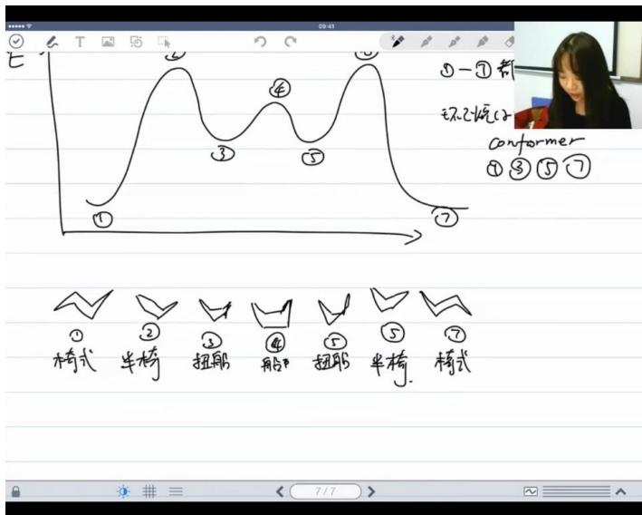

text_image

①-⑦都
环之境(2)
Conformer
①③⑤⑦
①
椅式 ②
半椅 扭船 船 扭耶 半椅 樂式

● 能量排序：椅式(1,7) < 船式(4) < 扭船式(3,5) < 半椅式(2,6)   
● 对称关系：1与7对称，2与6对称，3与5对称  
● 实际应用：通常只需掌握椅式和船式的绘制，其他构象较少使用

# 2. 构象异构体 02:32:07

# 1）构象异构体定义

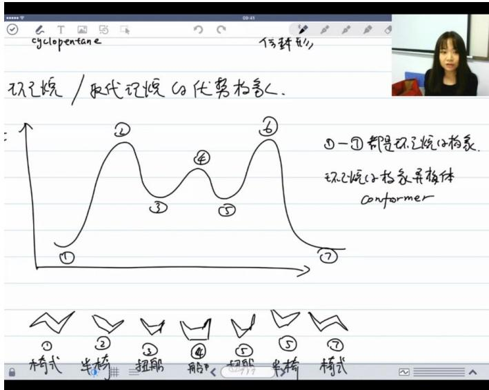

text_image

cyclopentane
仿封
①—⑦都是环己烷的构体
环己烷的构体异构体
Conformer
①
②
③
④
⑤
⑥
⑦
椅式
牛椅
扭船
船
切割
夹椅
椅式

关键特征：必须是能量极值点（能量谷值）的构象   
● 具体构象：1(椅式)、3(扭船式)、5(扭船式)、7(椅式)  
● 排除构象：2(半椅式)、4(船式)、6(半椅式)属于过渡态构象

# 2）构象应用原理

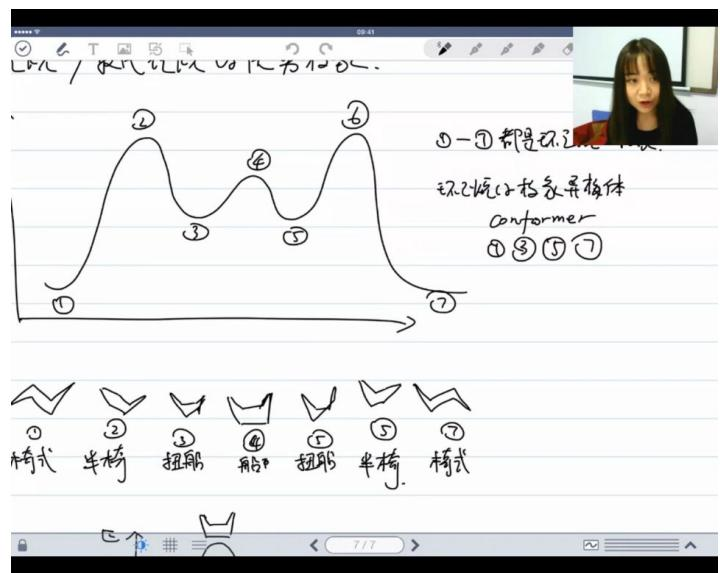

text_image

①—⑦都是环己烷一株式。
环己烷二枚系异构体
onformer
①③⑤⑦
①
椅式 ②
半椅 扭船 ③
扭船 船甲 扭船 ④
扭船 半椅 横式
⑤
⑦

● 基态构象：椅式构象代表最稳定的基态  
● 过渡态构象：船式构象常用于模拟反应过渡态  
● 能量关系：246都是过渡态，其中船式(4)是相对最稳定的过渡态

# 3. 取代环己烷的稳定构象 02:35:17

# 1）绘制方法

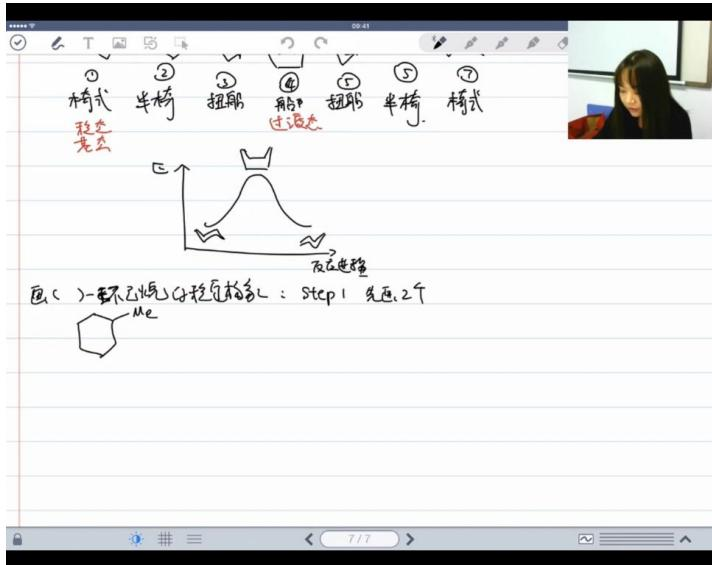

text_image

①
椅式
轮椅
②
半椅
扭船
③
船舶
④
过浪态
⑤
半椅
⑥
椅式
⑦
轮椅
轮椅
反式速度
画（）一环已绕小轮椅台象L：Step 1 先画，2个
Me

- 步骤1：绘制两个椅式构象（编号保持一致）  
● 步骤2：确定取代基位置（直立键或平伏键）  
- 坐标关系：两个椅式构象的xy坐标不变，z坐标相反  
● 键型区分：直立键(a键)竖直方向，平伏键(e键)斜向伸展

# 2）稳定性规则

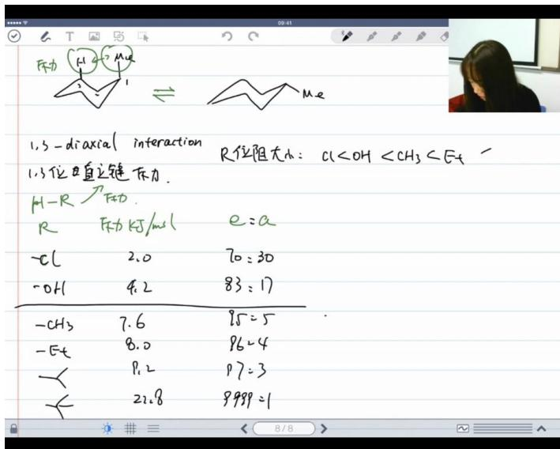

text_image

1.3-diaxial interaction
R位阻大小: Cl<0H<CH₃<Et
1.3位直立链斥力.
H-R Fdd
R Fdd kJ/mol e=a
-Cl 2.0 70:30
-OH 4.2 83:17
-CH₃ 7.6 95=5
-Et 8.0 96=4
X P12 97=3
X 21.8 9999=1

核心原则：大位阻基团优先放在平伏键  
● 1,3-直立键相互作用：直立键取代基与相隔两个碳的直立氢产生斥力  
● 位阻排序：Cl(2.0kJ/mol) < OH(4.2) < CH₃(7.6) < Et(8.0) < i-Pr(9.2) < t-Bu(22.8)  
● 平衡比例：甲基在平伏键占比95%，叔丁基占比>99.99%

3）多取代构象分析

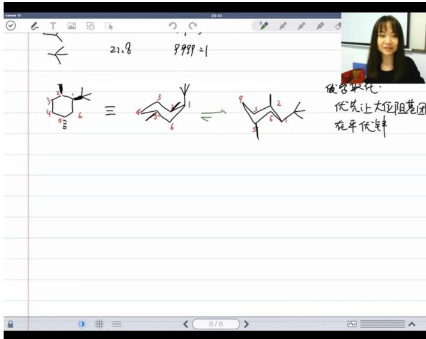

chemical

Chemical reaction diagram showing cycloaddition and rearrangement of a substituted cyclohexane with numerical values and Chinese text notes

分析方法：

- 分别绘制两个椅式构象  
- 将大位阻基团尽量放在平伏键   
○ 比较两种构象的相对稳定性

● 实例说明：当存在叔丁基时，即使需要让两个小基团处于直立键，也要保证叔丁基在平伏键

4）构象比较题型

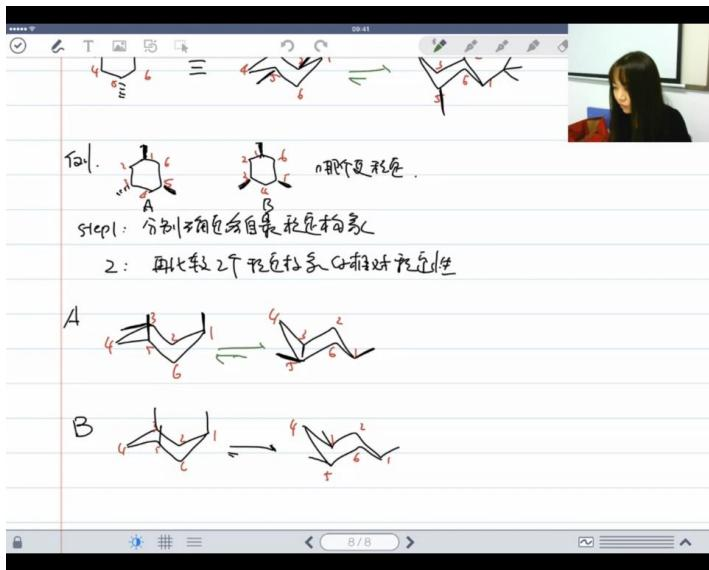

text_image

例1.
A
B
n那个足形角.
Step1: 分别于角度的自旋和定构象
2: 再比较2个矩形角夹相交所定性
A
B

# 题目解析

# ○ 解题步骤：

■ 对每个化合物绘制两个椅式构象   
■ 确定各自最稳定构象  
■ 比较两个稳定构象的能量

○ 关键技巧：使用纽曼投影分析1,3-直立键相互作用

○ 常见错误：忽略编号一致性导致取代基位置错误

# 十、知识小结

<table><tr><td>知识点</td><td>核心内容</td><td>重点/难点</td><td>应用示例</td></tr><tr><td>酸碱理论复习</td><td>质子酸碱定义、质子迁移反应机理、pKa值比较</td><td>共轭酸碱概念、酸性强弱判断六大因素</td><td>端炔与氨基酸性比较、丙酮α-H酸性</td></tr><tr><td>构象分析</td><td>乙烷/丁烷构象、环己烷椅式构象、取代基效应</td><td>一三直立键相互作用、平伏键优势</td><td>甲基环己烷稳定构象、多取代环己烷构象选择</td></tr><tr><td>命名规则</td><td>IUPAC系统命名法、环烷烃/桥环/螺环命名</td><td>取代基编号优先级、中英文命名差异</td><td>金刚烷/立方烷俗名、双环[2.2.1]庚烷</td></tr><tr><td>环张力理论</td><td>三元环SP3杂化角张力、四元环折叠构象</td><td>环丙烷不稳定性、五元环信封式构象</td><td>环丁烷88°键角、环戊烷108°近理想角</td></tr><tr><td>立体化学基础</td><td>纽曼投影式与锯架式转换、构象异构体</td><td>交叉式与重叠式能量差、超共轭效应</td><td>乙烷12kJ/mol能垒、丁烷gauche构象</td></tr><tr><td>取代基效应</td><td>位阻排序(叔丁基&gt;异丙基&gt;乙基&gt;甲基)</td><td>平伏键优先规则、A值(axial penalty)</td><td>叔丁基环己烷99%平伏键构象</td></tr><tr><td>共振式应用</td><td>负电荷离域(如羧酸根)、p轨道共轭体系</td><td>共轭体系识别、共振贡献度判断</td><td>烯醇负离子稳定性、苯环正离子离域</td></tr></table>