# 一、课程介绍00:00

# 1. 课程准备 00:02

● 回放提醒：课程群提供作业答案和讨论平台，未加群的同学需及时加入  
● 作业讲解方式：通过弹幕收集重点题目，选择性讲解典型题目

# 2. 课程安排 00:25

● 复习阶段：前半小时复习上节课内容（命名规则、构象分析）  
● 作业讲评：根据学生反馈重点讲解作业题目

# 二、复习内容01:32

# 1. 命名规则 01:34

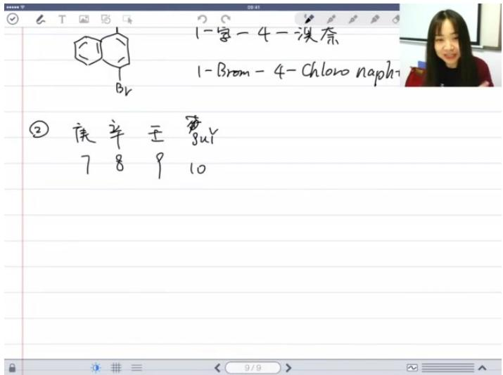

text_image

1-苯-4-溴奈
1-Brom-4-Chloro naphi
② 庚辛壬庚y
7 8 9 10

中英文差异：

\- 中文命名按顺序规则较小基团优先编号（如1-溴-3-氯丙烷）
- 英文命名按字母顺序排列基团（1-bromo-3-chloropropane）

\- 碳数命名：甲乙丙丁戊己庚辛壬癸（1-10个碳原子）
- 复杂结构处理：实际应用中优先使用结构式而非复杂命名
- 特殊案例：萘环编号规则（1,4位取代示例：1-溴-4-氯萘）

# 1）命名注意事项

● 取代基排序：支链越多位阻效应越大（正丁基<异丁基<仲丁基<叔丁基）  
● 书写格式：中文用横杠连接数字与基团，英文用空格分隔

# 2. 构象分析 03:25

# - 纽曼投影：

○ 交叉式（staggered）：能量较低构象  
○ 重叠式（eclipsed）：能量较高构象

● 乙烷构象：三种等效交叉式和三种等效重叠式构象

# - 丁烷构象：

- 反式交叉（anti staggered）：最稳定构象  
邻位交叉（gauche）：存在位阻效应（gauche effect）

# - 势能图要点:

○ 需完整绘制坐标轴和能量变化曲线  
◦ 标注关键构象的纽曼投影式  
○ 构象异构体需对应能量极值点

# 3. 环烷烃构象 07:10

# 1）小环稳定性

# 三元环：

\- 不稳定性双因素：环张力（键角 $60^{\circ}$ ）和重叠式位阻
- $\mathrm{SP}^{3}$ 杂化理想键角应为 $109^{\circ}$

四元环：主要不稳定因素为环张力（非平面结构）  
● 五元环：稳定结构（交叉式构象+最小环张力）

# 2）环己烷构象

# ● 构象类型:

○ 椅式：稳定构象（能量最低）  
- 船式：过渡态构象（能量较高）  
- 扭船式：亚稳态构象

# - 键向规则：

- 直立键（axial）垂直环平面方向  
- 平伏键（equatorial）平行环平面方向  
○ 左侧碳平伏键向左延伸，右侧向右延伸

# ● 取代基效应：

○ 一取代环己烷优先占据平伏键（避免1,3-双直立键相互作用）  
○ 取代基位阻排序：Cl<OH<CH₃<C₂H₅<i-Pr<t-Bu   
○ 多取代原则：优先让最大基团处于平伏位

# 3）构象分析要点

# ● 核心考点：

- 纽曼式展示位阻效应  
- 环己烷椅式构象的能量比较   
○ 取代基空间取向的合理性判断

● 绘图规范：需符合标准键角规定，否则可能影响阅卷理解

# 三、作业讲解 17:50

# 1. 作业4C更正 18:01

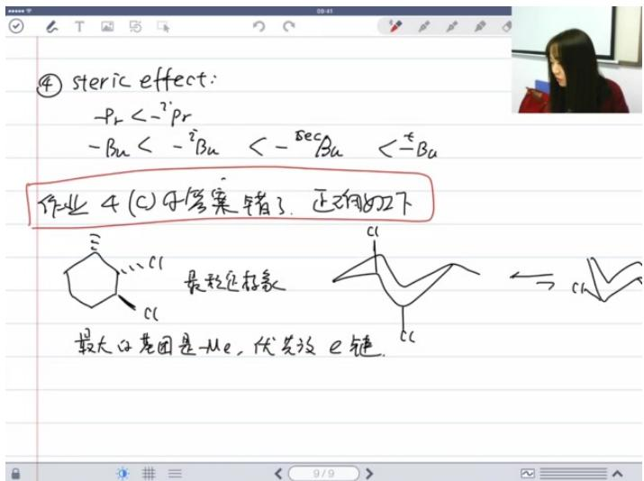

text_image

④ steric effect:
-Pr<-i'Pr
-Bu<-iBu<-δecBu<-δBu
作业 4 (C)子答案错了. 正为剪切下
最大子基团是-Me，优先放 e 链

● 最大基团原则：甲基是最大基团，应优先放在平伏键(e键)上，避免直立键上的位阻效应  
● 能量计算：甲基与氢的相互作用能为76 kJ/mol，氯与氢为20 kJ/mol。虽然氯在直立键会增加20 kJ/mol能量，但避免了76 kJ/mol的甲基直立键位阻  
- 错误说明：原答案将甲基放在直立键是错误的构象，正确构象应使甲基在平伏键，两个氯分别在上下直立键

# 2. 构象分析题 22:04

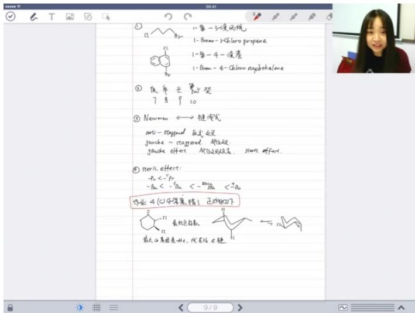

text_image

①
1-蛋-3-异丙烷
1-Brono-5-Chloro propene
1-蛋-4-溴素
1-Brono-4-Chloro naphthalone

② 低半 玉季癸
7 8 9 10

③ Newman ←→ 链液式
anti-stippsal 反式,处足
jauche - triggered, 非浓积,
jauche effect, 非反应态态, store effect.

④ Heric effect:
-fu <- Pr
-Bu <- Pb <- BaBn <- Ba

作业 4(2)孕婴童情! 正考122下

最低乙基团重+Fe, 就系统键

● 纽曼式优势：能清晰展示位阻效应，是分析构象稳定性的专业工具  
- 顺反式比较：

\- 顺式构象：存在三对gauche effect(邻位交叉效应)

\- 反式构象：只有两对gauche effect

\- 替代表述：也可描述为反式中两个六元环的碳都在平伏键，而顺式有一个在直立键一个在平伏键

# 3. 立体位阻效应 25:08

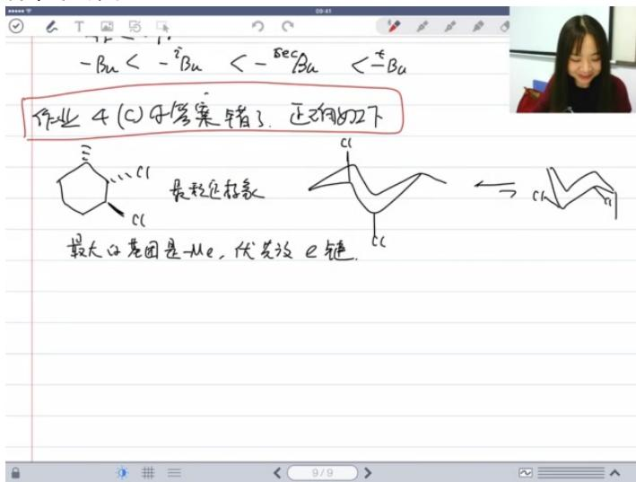

text_image

-Bu <- iBu <- secBu <- tBu
作业 4 (C)子答案错了. 正匀的以下
最长定位数
最大子老团是-Me, 代英放 e 链.

\- 异丙基特性：

- 支链结构导致无论怎样旋转都会产生显著位阻  
- 直链取代基(如乙基)可通过旋转调整位阻分布

● 构象竞争：

- 全平伏键构象：存在gauche effect(邻位交叉效应)  
○ 全直立键构象：存在1,3-直立键相互作用

● 判定标准：异丙基的位阻使gauche effect胜出，导致全直立键构象更稳定  
● 专业分析：使用纽曼式可清晰展示甲基-甲基相互作用(gauche effect)与1,3-直立键相互作用的能量差异

# 四、立体化学32:02

# 1. 异构体分类

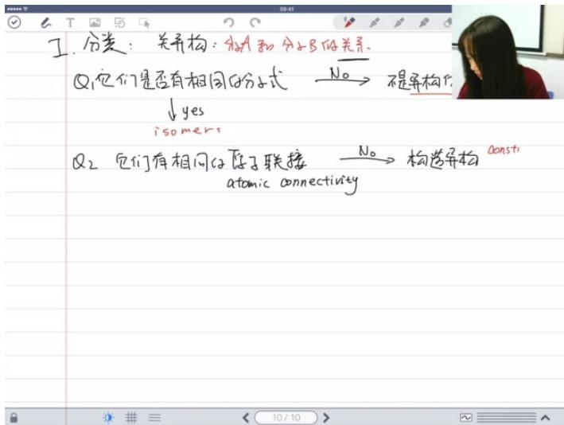

text_image

I. 分类：关并构：spin和分子B的关系
Q₁它们是否有相同分子式 → No → 不是异构性
↓yes
isomeri
Q₂ 它们有相同子原子联接 → No → 构造异构 const
atomic connectivity

\- 基本概念：异构体描述的是分子a和分子b之间的关系，而非单个分子自身的性质。当我们讨论异构体时，始终是在讨论两个分子之间的结构关系。

# ● 判断流程：

\- 第一步：判断两个分子是否具有相同的分子式(molecular formula)

■ 如果否(No)，则它们不是异构体  
■ 如果是(Yes)，则它们是异构体(isomers)

\- 第二步：判断它们是否有相同的原子连接方式(atomic connectivity)

■ 如果否(No)，则属于构造异构(constitutional isomer)  
■ 如果是(Yes)，则进入立体异构判断

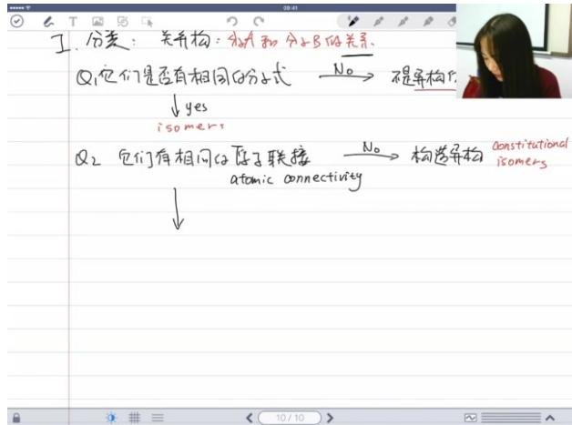

text_image

I. 分类：关并构：有A和分子B的关系
Q₁它们是否有相同C分子式 → No → 不是异构；
↓yes
isomers
Q₂ 它们有相同的原子联接 → No → 构造异构
atomic connectivity
↓
Constitutional
isomers
10/10

\- 立体异构体(stereoisomer): 当两个分子具有相同分子式和相同原子连接方式时，进入立体化学判断。

\- 第三步：判断它们是否是不可重叠的镜像(non - superimposable mirror image)

■ 如果否(No)，则属于非对应异构体(diastereomer)  
■ 如果是(Yes)，则属于对应异构体(enantiomer)

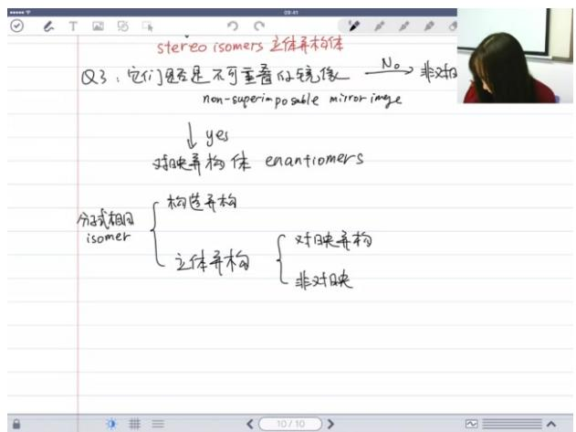

text_image

stereo isomers 立体并构体
Q3: 它们更是不可重叠的镜像 → No 非对称
non-superimposable mirror image
↓ yes
对映异构体 enantiomers
分式相归
isomer { 构造并构
立体并构 { 对映并构
非对映

# - 分类体系：

○ 异构体首先要求分子式相同  
○ 可分为构造异构和立体异构两大类  
○ 立体异构又可细分为对应异构和非对应异构

# ● 特殊类型讨论：

顺反异构：属于立体异构，因为原子连接方式未改变，仅基团空间排列不同。在部分分类体系中归入非对应异构。  
○ 构象异构：由单键旋转造成，理论上属于立体异构中的非对应异构，但由于室温下单键自由旋转，通常观测不到分离的构象异构体。  
○ 分类说明：不同教材对顺反异构和构象异构的分类存在差异，有些将其单独列出，有些归入非对应异构。关键在于理解它们都属于立体化学问题。

# ● 记忆要点：

- 异构体判断是"关系判断"，必须涉及两个分子  
○ 判断流程遵循"分子式→原子连接→镜像关系"三级步骤  
- 英文术语：isomer(异构体)、constitutional isomer(构造异构)、stereoisomer(立体异构)、diastereomer(非对应异构)、enantiomer(对应异构)

# 2. 构造异构体 44:29

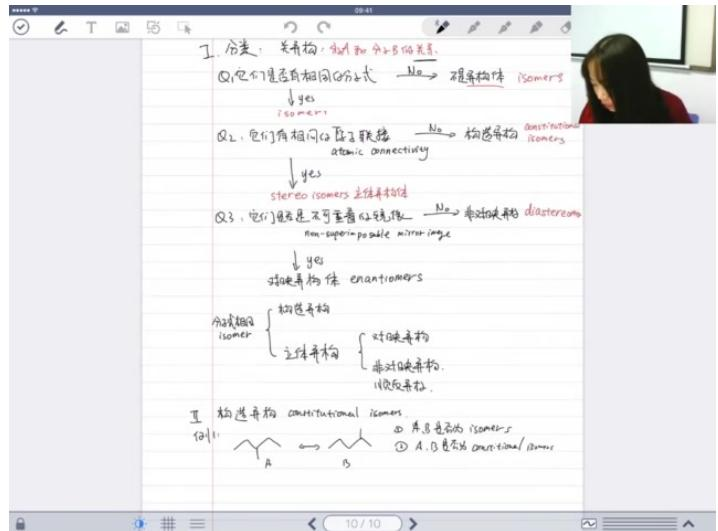

text_image

分类：夹井构：斜面和分子B的关系。
①它们是否有相同分子式 → 程弄构体 isomers
↓yes
isomers
②、它们有相同的原子联接 → 构造弄构 australiational
atomic connectivity
↓yes
stereo isomers 总体并构体
③、它们是否是不可查看的光像 → Na → 非对夹井构 diastereom
non-superim possible mirror image
↓yes
对夹井构体 enantiomers
分段相位
isomer { 构造并构
立体并构 { 对夹井构
非对夹井构.
顺反并构.
构造并构 constitutational isomers.
例：
A B ① A、B是否为 isomers
① A、B是否为 australiational isomers

● 基本概念：分子式相同但结构不同的化合物称为异构体(isomers)

# - 分类标准：

- 第一判断：分子式是否相同 → 决定是否为异构体  
○ 第二判断：原子连接顺序是否相同 → 区分构造异构和立体异构  
○ 第三判断：是否为不可重叠的镜像 → 区分对映异构和非对映异构

# 1）构造异构体(Constitutional Isomers)

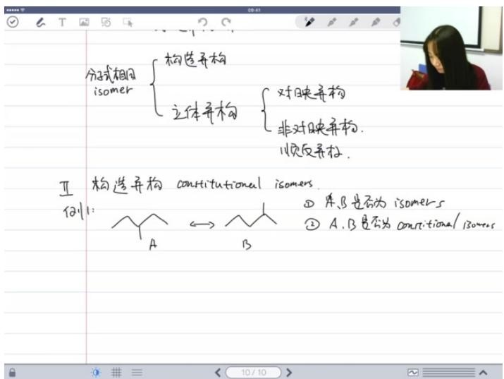

text_image

分子式相同
isomer
构造并构
立体并构
{对映并构
非对映并构.
顺反并构.

Ⅱ
例1:
构造并构 constitutional isomers.
① A,B 是否为 isomers
② A,B 是否为 conditional isomers

- 定义：分子式相同但原子连接顺序不同的化合物（大陆称为构造异构体，台湾称为结构异构体）  
● 判断标准：

○ 分子式相同：如 $C_{6}H_{14}$ 与 $C_{6}H_{14}$

\- 原子连接不同：如甲基在2号位和3号位的区别

2）立体异构体(Stereoisomers)

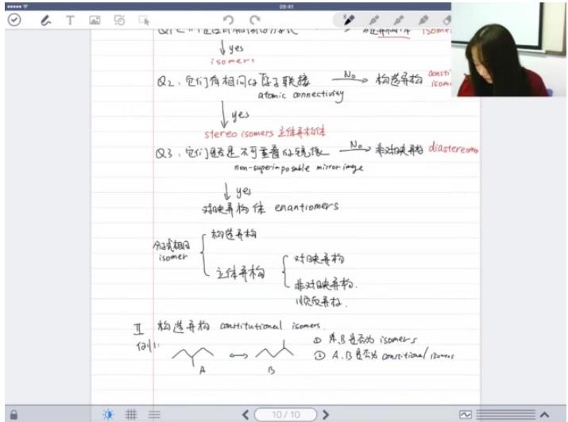

text_image

Q2:它们有相同的原子联接
atonic connectivity
Q3:它们是否是不可查看的光像
non-superimposable mirror image
Q2:它们有相同的原子联接
atonic connectivity
Q2:它们有相同的原子联接
atonic connectivity
Q2:它们有相同的原子联接
atonic connectivity
Q2:它们有相同的原子联接
atonic connectivity
Q2:它们有相同的原子联接
atonic connectivity
Q2:它们有相同的原子联接
atonic connectivity
Q2:它们有相同的原子联接
atonic connectivity
Q2:它们有相同的原子连接
atonic connectivity
Q2:它们有相同的原子连接
atonic connectivity
Q2:它们有相同的原子连接
atonic connectivity
Q2:它们有相同的原子连接
atonic connectivity
Q2:它们有相同的原子连接
atonic connectivity
Q2:它们有相同的原子连接
atonic connectivity
Q2:它们有相同的原子连接
atonic connectivity
Q2:它们有相同的原子连接
anterior view of diastereom
non-epoxyposable mirror image
onterior view of diastereom
onterior view of diastereom
onterior view of diastereom
onterior view of diastereom
onterior view of diastereom
onterior view of diastereom
onterior view of diastereom
onterior view of diastereom
onterior view of diastereom
onterior view of diastereom
onterior view of diastereom
onterior view of diastereom

10 / 10   
● 特点：分子式相同、原子连接顺序相同，但空间排列不同  
- 子分类：

\- 对映异构体(Enantiomers): 互为镜像且不可重叠

○ 非对映异构体(Diastereomers): 不互为镜像的立体异构体

3）例题解析

例1：判断异构关系

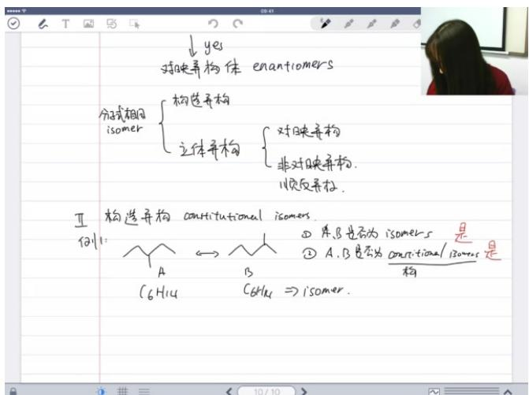

text_image

yes
对映并构体 enantiomers
分式相同
isomer
构造并构
立体并构
{对映并构
非对映并构.
顺反并构.
Ⅱ
构造并构 constitutional isomers
例1:
A B ① A,B是否为isomers 是
C6H14 C6H14 ⇒ isomer.
② A,B是否为constitutional/isomers 是
构

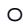

# ○ 解析：

■ Q1: 是否为异构体 $\rightarrow$ 是（分子式相同 $C_6H_{14}$ ）  
■ Q2：是否为构造异构→是（甲基位置不同导致原子连接顺序不同）

\- 易错点：容易忽略构造异构的判断标准是原子连接顺序

例2：纽曼式判断

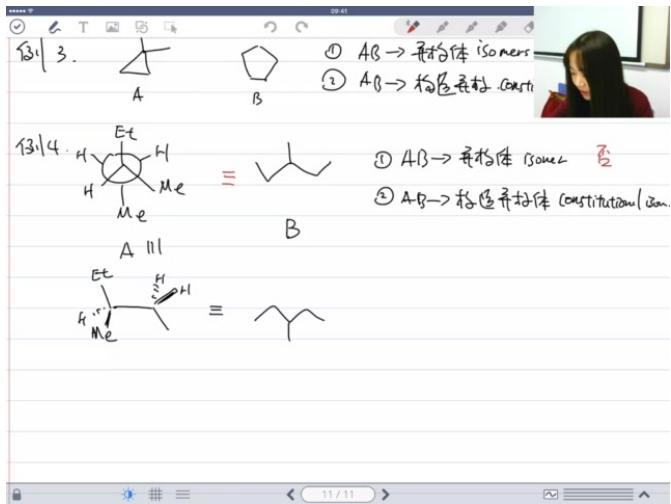

chemical

Hand-drawn chemical structures of isomers with labeled atoms and reaction conditions

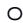

# ○ 解析：

■ 关键步骤：必须将纽曼式转换为键线式确认结构  
■ Q1: 是否为异构体 → 否（实为同一物质）  
■ Q2: 是否为构造异构 → 否

○ 解题技巧：复杂结构式必须转换为标准形式再判断

● 例3：环状化合物判断

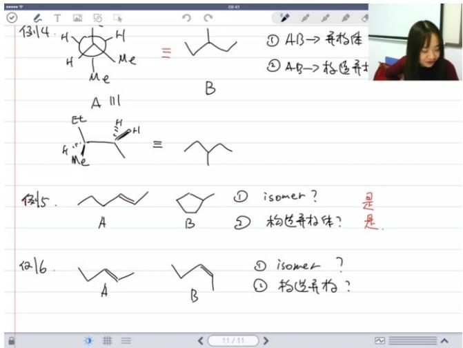

chemical

Chemical reaction equations and diagrams showing isomer formation and structural changes in a cyclohexane derivative

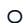

# 解析：

■ Q1: 是否为异构体 → 是（分子式 $C_{5}H_{10}$ 相同）  
■ Q2：是否为构造异构→否（原子连接顺序相同，属于立体异构）

\- 记忆点：环状化合物可能存在立体异构现象

● 例4：复杂结构判断

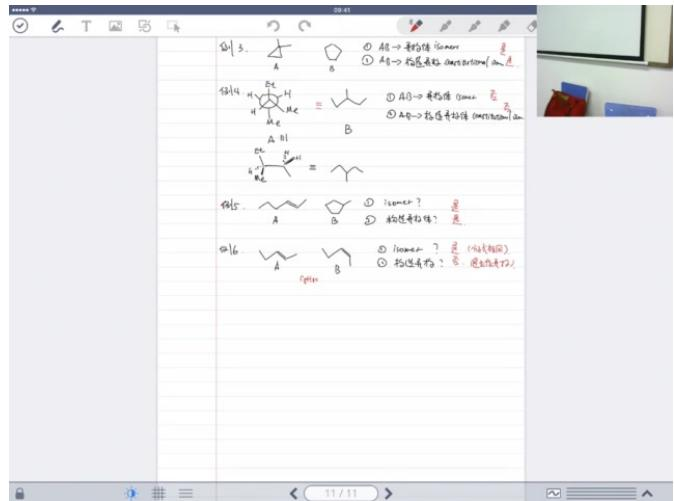

text_image

例3.
A
B
① A→单构体 Isomer
① A→构造条件：(a)是(a)是(a)
例14.
H
H
H
= B
① A→单构体 (a)是
② A→构造条件：(a)是(a)
A B
A B
A B
例5.
A
B
① Isomer？
② 构造条件？是
③ 构造条件？是（b为相同）
例6.
A
B
(a)是
① Isomer？
② 构造条件？是（a为相同）
③ 构造条件？是（b为相同）

# ○ 解析：

■ Q1: 是否为异构体 → 否（实为同一物质的不同表示方式）  
■ Q2：是否为构造异构 $\rightarrow$ 否

重要提醒：考试时必须完整绘制结构式，避免因简化导致误判

# 4）常见误区

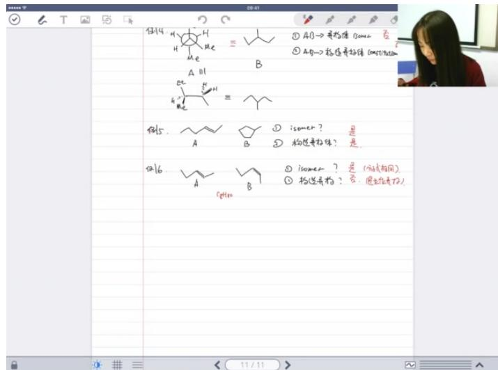

text_image

例14
① A,B→异构体 (isomer)
② A,B→构造异构体 (constituted)

例5.
A
B
① isomer?
② 构造异构体?
③ 是

例6.
A
B
① isomer?
② 构造异构体?
③ 是 (形式相同)

- 术语混淆：构造异构体/结构异构体/碳链异构体实质相同   
● 判断顺序：必须严格按分子式→连接顺序→空间构型三步判断   
● 结构转换：纽曼式、费歇尔投影式等必须转换为标准键线式再判断  
● 考试建议：即使熟练也要完整绘制结构，避免无谓失分

# 3. 立体异构体 01:09:18

# 1）对映异构体 01:11:00

● 对映异构体的定义 01:11:15

基本特征：分子式相同、原子连接顺序相同，但彼此是不可重叠的镜像关系（nonsuperimposable mirror image）  
数量关系：当分子含1个手性中心时，必然存在1对对映异构体（互为镜像且不可重叠）

○ 特殊说明：对映异构体不一定需要手性中心（存在无手性中心的特殊对映异构体）

● 手性中心的定义 01:12:48

○ 结构特征：一个原子（通常是碳）连接四个不同的基团（chiral center）  
○ 符号表示：常用星号(\*)标记手性中心  
○ 示例基团：如氢(H)、甲基 $(CH_{3})$ 、溴(Br)等不同基团的组合

● 举例解释对映异构体 01:13:53

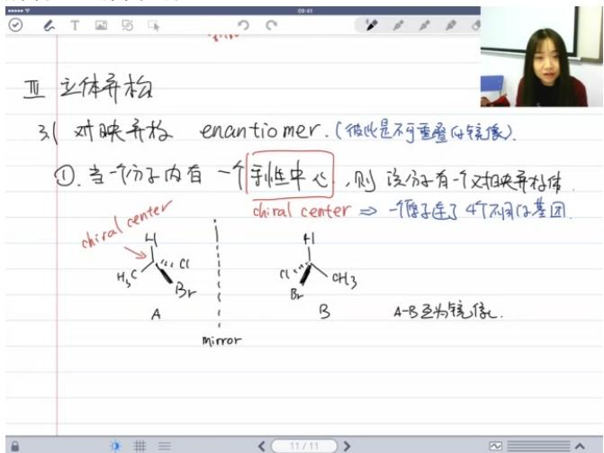

text_image

Ⅲ 立体并构
3. 对映并构 enantiomer. (彼此是不可重叠的镜像).
①. 当一个分子内有一个手性中心, 则该分子有一个对称并构体.
chiral center ⇒ 一个原子连了 4个不同的基团.
A-B互为镜像.

具体实例：中心碳连接H、 $CH_{3}$ 、Cl、Br的分子

○ 镜像验证：

■ 分子A与其镜像B通过虚线表示镜面  
■ 绕C - H键旋转180°得到A'（与A等价）  
■ A'与B仍为镜像关系，证明A与B不可重叠

○ 空间关系：横向基团朝纸面上方，纵向基团朝纸面下方

● Fisher投影式的介绍与转化 01:17:35

基本结构：十字形表示，中心碳不标出，横线表示朝前的键，竖线表示朝后的键  
○ 转化规则：

■ 横向键对应楔形式中朝上的基团  
■ 纵向键对应楔形式中朝下的基团

\- 记忆要点：Fisher投影式可等价转换为楔形式（粗线/虚线表示）

2）手性中心构型 01:20:41

● 核心概念：绝对构型（absolute configuration）的R/S标记法  
● 判断前提：需先掌握顺序规则（见第三章）

3）顺序规则 01:21:55

● 原子大小比较规则 01:22:02

基本规则：按原子序数排列，大者优先  
○ 常见顺序: H < C < N < O < F < P < Cl < Br  
○ 特殊处理：同位素中较轻者优先（如H<D）

● 同位素与孤对电子的顺序 01:22:24

○ 孤对电子：优先级最低（因不连接任何原子）  
○ 完整顺序：孤对电子 < H < D < 其他原子

● 基团大小比较：R构型与S构型 01:22:48

○ 延伸规则：当基团相同时，R构型优先于S构型  
○ 比较方法：从连接原子开始逐级比较

● 例题1：氢与甲基的比较 01:23:10

○ 比较结果： $CH_{3}>H$

○ 判断依据：碳原子序数(6)＞氢原子序数(1)

● 例题2：甲基与CH2D的比较 01:23:47

○ 比较结果： $CH_{2}D > CH_{3}$

○ 判断过程：

第一原子均为碳  
■ 第二原子： $CH_{3}$ 为(H,H,H)， $CH_{2}D$ 为(H,H,D)  
因 $D > H$ ，故 $CH_{2}D$ 优先

● 例题3：甲基与乙基的比较 01:24:32

○ 比较结果： $CH_{2}CH_{3}$ （乙基） $>CH_{3}$ （甲基）

○ 判断过程：

第一原子均为碳  
■ 第二原子：甲基为(H,H,H)，乙基为(H,H,C)  
因 $C > H$ ，故乙基优先

● 例题4：乙基与CH(CH2)2的比较 01:25:45

○ 比较结果: $CH(CH_{2})_{2} > CH_{2}CH_{3}$

○ 判断过程：

第一原子均为碳  
■ 第二原子：乙基为(H,H,C)， $CH(CH_{2})_{2}$ 为(H,C,C)  
■ 因C>H，后者优先

● 例题5：复杂基团的大小比较 01:26:44

○ 比较结果：右侧基团 > 左侧基团

○ 判断要点：

■ 需比较到第四级原子  
■ 右侧基团在第四级含更多碳原子

\- 注意事项：复杂基团需逐级比较直至分出优先级

# 五、绝对构型判定 01:30:01

1. 构型判定步骤 01:30:06

- 顺序规则：将手性中心连接的四个取代基按照Cahn-Ingold-Prelog顺序规则由小到大排序，标记为1-4号基团  
● 基团定位：将优先级最低的1号基团置于远离观察者的位置（通常指向纸面后方）  
● 视线方向：观察者视线需沿着手性中心与1号基团键的延长线方向观察分子  
● 绕圈判定：按4→3→2的优先级顺序观察剩余三个基团的排列方向，顺时针为R构型，逆时针为S构型

2. RS构型判断 01:32:15

● 记忆口诀："432绕圈法": 从4号基团开始，经3号到2号基团画圈判断旋转方向

\- 方向判定：

○ 顺时针旋转：R构型（Rectus，拉丁文"右")   
- 逆时针旋转：S构型（Sinister，拉丁文"左")

\- 注意事项：若1号基团不在远离位置，需先进行基团交换（每交换两个基团构型取反）

# 六、绝对构型判定01:32:27

1. 绝对构型定义

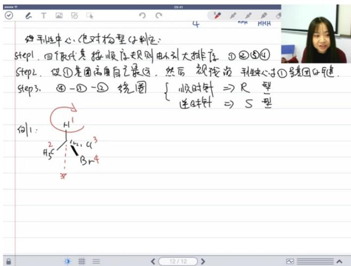

text_image

判定中心,绝对构型是判定:
Step1. 四个取代其按顺序规则由小引大排度 ①②⑤④
Step2. 使①集团高度自己最远,然后 视线沿 判断心于①号基团的键.
Step3. ④-③-② 绕圈 { 顺时针 ⇒ R 型
逆时针 ⇒ S 型
例1:

● 概念：绝对构型用于描述手性中心的空间排列方式，分为R型和S型两种。  
● 判定基础：基于Cahn-Ingold-Prelog顺序规则，通过基团排序和空间观察确定构型。

# 2. 顺序规则步骤 01:32:40

# 1）基团排序 01:33:00

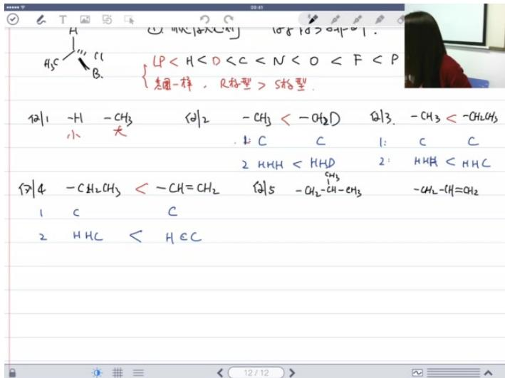

text_image

例1 -H -CH3
小 大
例2 -CH3 < -OH2D
C C 1: C C
2 HHH < HHD
CH3
例4 -CH2CH3 < -CH=CH2
例5 -CH2-CH-CH3
-CH2-CH=CH2
1 C C
2 HHC < HCC

- 规则核心：按原子序数由小到大排序，同位素中质量数小的优先（如 $H < D < T$ ）。  
● 常见顺序：孤对电子<氢<甲基<乙基<氟<氯<溴<碘。  
- 延伸比较：当第一个原子相同时，比较后续原子（如 $-CH_{2}CH_{3}< -CH=CH_{2}$ ）。

# 2）最小基团远离 01:33:15

● 操作要点：将排序最小的基团（通常是氢）置于观察者最远的位置。  
● 视线定位：沿手性中心与最小基团的键轴方向观察（如碳氢键方向）。

# 3）绕圈方向判定 01:33:27

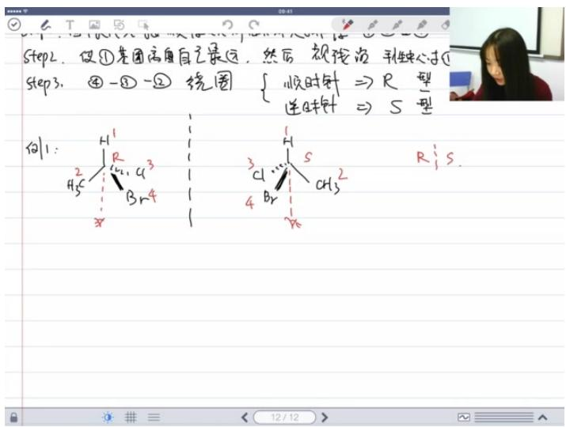

text_image

Step2. 使①集团高值自由景远, 然后 视残次 判缺少于①
step3. ④-⑤-② 绕圈 { 顺时针 ⇒ R 型
逆时针 ⇒ S 型
例1: H¹ R C₃
H₃C 2 Br 4
3 Cl CH₃S
4 Br
R; S.
12/12>

● 步骤：剩余三个基团按序号4→3→2方向绕圈。  
- 方向判断：

○ 顺时针为R型（Rectus）  
- 逆时针为S型（Sinister）

● 空间想象技巧：若最小基团朝前，需在脑中翻转分子或绕到纸面背面观察。

3. 镜像关系 01:35:24

● 本质特性：R构型与S构型互为镜像关系，如同左右手关系。  
● 验证方法：通过实际案例演示（如例1中R型分子镜像必为S型）。

4. 例题: 基团排序 01:35:35

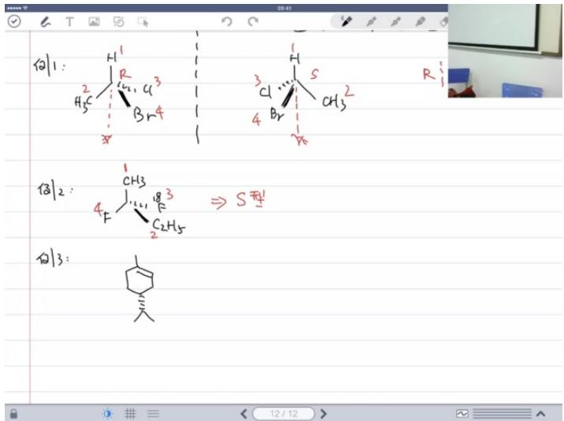

chemical

Handwritten chemical structures of three organic compounds labeled 1, 2, and 3 with substituents R, Cl, Br, S, CH₃, CH₂H₅, and a cyclohexene ring.

例1解析：

○ 基团顺序: $H(1) < CH_{3}(2) < Cl(3) < Br(4)$   
○ 观察方法：氢朝下时4→3→2顺时针旋转→R型

● 易错提醒：实际观察方向与图示方向可能相反，需注意空间对应关系。

5. 例题: 同位素影响 01:39:16

例2特殊点：

○ 含同位素 $F^{18}$ 与常规 $F^{19}$   
○ 正确排序： $CH_{3}(1) < C_{2}H_{5}(2) < F^{18}(3) < F^{19}(4)$

● 考点：同位素质量数不影响化学性质但影响顺序规则。

6. 例题: 复杂基团排序 01:43:48

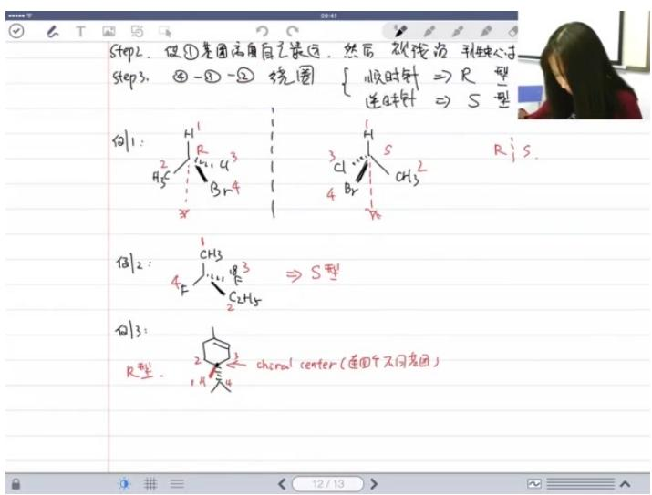

text_image

Step2. 做①老团离角自己装运, 然后 视钱浴 私轴中心
step3. ④-⑧-② 绕圈 { 顺时针 ⇒ R 型
逆时针 ⇒ S 型
例1: H¹ R 2 C³ H₅ CBr 4
H 3 S 4 Br CH₃ 2
R;S.
例2: CH₃ 4 F C₂H₅ ⇒ S型
例3:
R型. chiral center (连四个不同老团)

# 例3解析：

- 手性中心确认：碳连H、 $CH_{2}CH_{2}-$ 、 $CH(CH_{3})_{2}$ 、 $CH_{2}OH$   
○ 排序依据： $H(1) < CH_{2}CH_{2} - (2) < CH_{2}OH(3) < CH(CH_{3})_{2}(4)$   
○ 构型判定：逆时针→经空间翻转后实际为R型

# 例4进阶：

三级比较：需比较到第三个连接原子  
- 关键对比: $CH_{2}$ - 连接的后续原子含氢数量影响排序

# 例5陷阱：

○ 含孤对电子的特殊情况  
○ 正确排序：孤对电子(1) $<  CH_{2} - (2) <   CH_{2}CH_{3}(3) <   CH(CH_{3})_{2}(4)$   
○ 构型结果：S型（注意与常见误判R型的区别）

# 七、多手性中心分子01:53:14

# 1. 立体异构体数量 01:53:19

\- 结论：一个分子有n个手性中心，则它最多有 $2^{n}$ 个立体异构体。因为一个手性中心有R或S两种可能构型，所以这是个排列组合问题。

# 2. 例题:二甲基环己烷 01:54:17

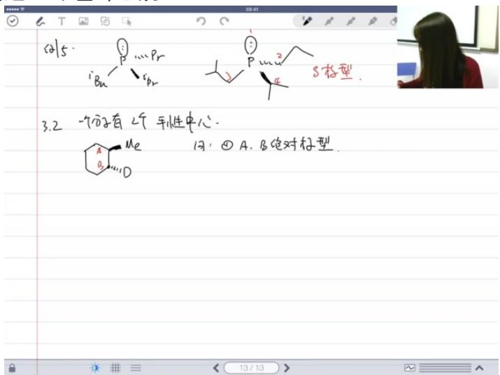

text_image

例5
iBn
Pr
Pr
s构型
3.2 一个分子有2个年性中心.
A.
B.
Me
D
问：①A.B绝对构型.

# ● 题目解析

- 手性中心判断：图中两个碳原子都连接了四个不同的取代基，因此它们都是手性中心。  
- 绝对构型判断:

对于手性中心a：氢在纸面后面，甲基最小，接着是 $CH_{2}$ ，最大的是CHD，按大小顺序排列后，绕圈是顺时针，所以构型为R。  
对于手性中心b：氢在纸面上，上面的取代基最大，其次是左边的取代基，刀（即另一个取代基）排第二，绕圈是S型，但因其在纸面前面，所以反过来看是R构型。

\- 答案: a和b的绝对构型均为R。

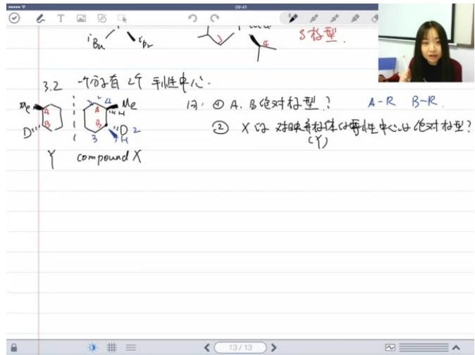

text_image

3.2 一个分子有4个阳性中心.
D
compound X
问：① A, B 绝对松型？
② X 设 对映并相体的塑性中心的绝对松型？ (Y)

● 题目解析（第二问）

○ 对应异构体: 图中所示为原物质的对应异构体, 需要判断其手性中心的绝对构型。  
- 绝对构型判断:

■ 任何一个手性中心做了镜面反射，R变S，S变R。因此，对于对应异构体，手性中心a的构型不变，仍为R；手性中心b因做了镜面反射，构型变为S。

\- 答案: 对应异构体中, 手性中心a的绝对构型为R, b的绝对构型为S。

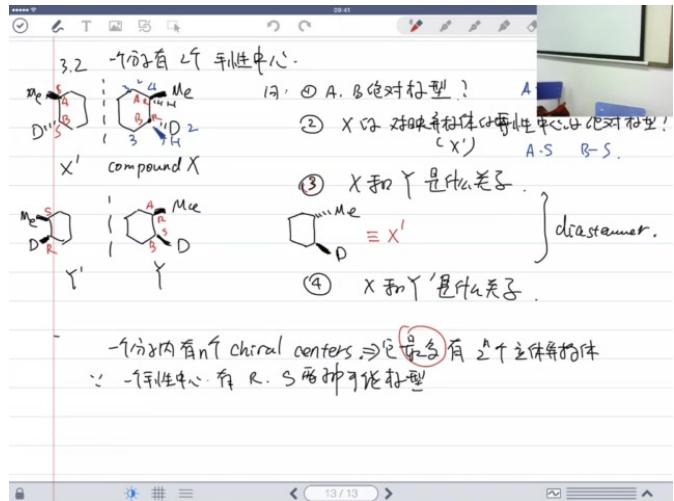

text_image

3.2 一个分子有2个平行中心.
问: ① A, B绝对标型?
② X对称并称体的平行中心的绝对标型?
A-S B-S.
X' compound X
③ X和Y是什么关系.
Me Me
D D
Y' 
④ X和Y'是什么关系.
一个分子内有n个chiral centers, 定它最多有2个立体异构体
∵ 一个性中心, 有R、S两种可能标型

● 题目解析（第三、四问）

\- 物质关系判断:

■ x与y的关系：非对应异构体。  
■ x与x'的关系：对应异构体。  
■ x与y'的关系：非对应异构体，但y'与x'是等价的，即它们可以通过旋转或翻转重合。

答案: x与y是非对应异构体；x与x'是对应异构体；x与y'是非对应异构体，但y'等价于x'。

3. 内消旋体定义 01:57:39

\- 内消旋体：（此部分内容在提供的课程记录中未详细展开，故根据常规理解补充）内消旋体是指分子内含有两个或两个以上手性中心，但由于特定空间排列方式，使得整个分子不具有旋光性，且不能与其镜像重合的化合物。

4. 外消旋体定义 01:59:25

\- 外消旋体：（此部分内容在提供的课程记录中未详细展开，故根据常规理解补充）外消旋体是指由两种互为镜像的对映体以等比例混合而成的混合物，整体不具有旋光性。

1）手性中心的绝对构型判断 01:59:35

\- 判断方法: 如前所述, 通过比较手性中心连接的取代基大小, 确定其绝对构型 (R或S)。

2）对应异构体的手性中心绝对构型 02:00:05

\- 判断方法：对应异构体的手性中心绝对构型与原物质相反，即原物质为R的，对应异构体为S；原物质为S的，对应异构体为R。

# 八、旋光性02:13:31

# 1. 偏振光原理 02:14:19

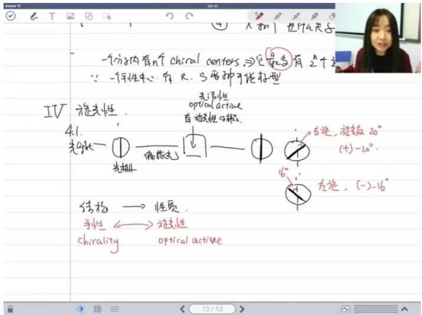

text_image

一个分子内有n个chiral centers，又它取含有2个立
∵ 一个性中心，有R、S两种可能的类型
光活性
optical active
光相距
自始先性口稍长.
41.
光比比——①——偏振先——②——③——④——⑤——⑥——⑦——⑧——⑨——⑩——⑪——⑫——⑬——⑭——⑮——⑯——⑰——⑱——⑲——⑳——⑴——⑵——⑶——⑷——⑸——⑹——⑺——⑻——⑯——⑰——⑱——⑲——⑳——㉑——㉒——㉓——㉔——㉕——㉖——㉗——㉙——㉚——㉛——㉜——㉝——㉟——㉟——㉟——㉟——㉟——㉟——㉟——㉟——㉟——㉟——㉟——㉟——㉟——㉟——㉟——㉟——㉟——㉟——㉟——㉟——㉟——㉟——㉟——㉟——㉟——㉟——㉟——㉟——㉟——㉟——㉟——㉟——㉟——㉟
结构 → 性质.
手性 ←→ 施洁性
chirality    optical active

●

● 偏振光: 光通过光栅后变成偏振光。  
- 旋光性：当偏振光通过具有旋光性的样品（通常是溶液）时，偏振光的方向会发生改变，这种性质称为旋光性。  
- 右旋与左旋: 如果偏振光通过样品后向右偏转, 称为右旋; 如果向左偏转, 称为左旋。旋光度用度数表示, 右旋为正, 左旋为负。

2. 结构与性质关系 02:19:19

● 结构决定性质: 有机化合物的结构决定其性质，旋光性是由分子的手性结构决定的。  
- 手性分子：一个分子如果无法与自己的镜像重叠，则该分子具有手性，或称该分子为手性分子。  
- 手性与旋光性：手性分子具有旋光性，即能使偏振光旋转。旋光性是手性分子的一种性质表现。

# 3. 旋光度计算 02:22:30

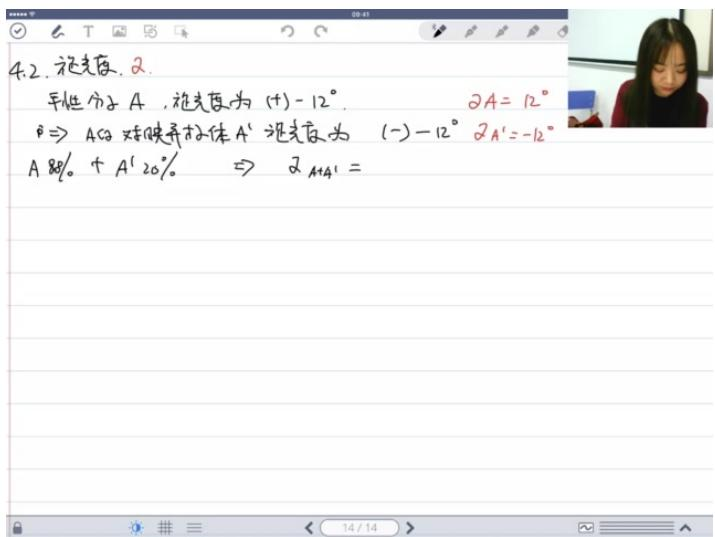

text_image

4.2. 赖先度, 又
异性分子 A , 赖先度为 (+) - 12°.
⇒ AOA 对映异权体 A' 赖先度为 (-) - 12°
A 80% + A' 20% ⇒ 又 OA' =

- 旋光度计算: 旋光度通常用阿尔法（ $\alpha$ ）表示。对于手性分子A，如果其旋光度为 $+\alpha$ ，则其对应异构体A'的旋光度为 $-\alpha$ 。  
- 混合样品的旋光度：如果样品是手性分子A和其对应异构体A'的混合物，则样品的旋光度是各组分旋光度的加权和。例如，80%的A和20%的A'混合，旋光度为 $0.8\alpha + 0.2(-\alpha) = 0.6\alpha$ 。

# 4. 光学纯度测定 02:28:14

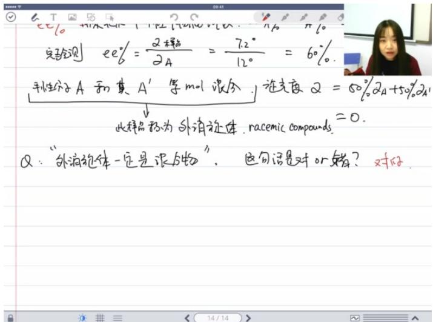

text_image

实验测 ee% = \frac{2样}{2A} = \frac{7.2°}{12°} = 60\%
手性分子A和A'等mol混合，在光度Q = 50% 2A + 50% 2A'
此样品称为外消旋体，racemic compounds = 0.
Q：“外消旋体一定是很万物”，这句话是对or错？对好。

- 光学纯度: 光学纯度（ee值）用来描述手性分子的纯度，定义为手性分子A的百分比减去其对应异构体A'的百分比。  
- 外消旋体：如果手性分子A和其对应异构体A'等摩尔混合，则旋光度为零，此样品称为外消旋体。外消旋体是混合物，且没有旋光性。  
- ee值计算：通过测量样品的旋光度和纯手性分子的旋光度，可以计算出样品的光学纯度（ee值）。例如，如果样品的旋光度是72度，纯手性分子的旋光度是12度，则ee值为 $72 / 12 = 60\%$ 。

# 5. 例题：旋光度与光学纯度

# ● 题目解析

题目：一个样品包含80%的手性分子A和20%的对应异构体A'，已知纯A的旋光度为+12°，求样品的旋光度和光学纯度。  
- 旋光度计算: $0.8 \times 12^{\circ} + 0.2 \times (-12^{\circ}) = 7.2^{\circ}$   
○ 光学纯度计算:80% - 20% = 60%   
- 答案: 样品的旋光度为 $7.2^{\circ}$ , 光学纯度为 $60\%$ 。

# 九、手性判定02:31:15

# 1. 对称元素判定 02:31:27

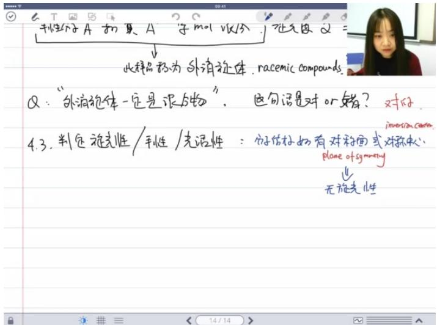

text_image

毒性分子 A 扣复 A 子mol mol/L 分子元素 Q =
此移位称为外消旋体. racemic compounds.
Q: “外消旋体一定是很生物”, 这句话是对 or 错? 对子
4.3. 判定旋次性 / 手性 / 充活性 : 分子结构如有对称面或对称中心
plane of symmetry
无旋次性

● 外消旋体定义: 由等量对映异构体组成的混合物称为外消旋体(racemic compounds)   
- 判定标准: 分子若存在对称面(plane of symmetry)或对称中心(inversion center), 则无旋光性/无手性/无光活性  
- 结构决定性质: 光活性(旋光性)是性质(property)，手性是分子结构特征，二者可通过分子结构相互判定

# 2. 例题: 分子对称性 02:32:46

# 1）二甲基环己烷异构体

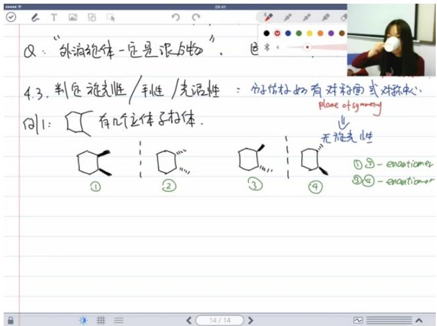

text_image

Q: “外消旋体一定是很万物”。
4.3. 判定旋光性/利性/充语性：分子结构如有对称面或对称中心。
同1: 有几个立体子粒子体。
无旋光性
① ② ③ ④
①③-encounter
③④-encounter

● 理论最大值: 两个手性中心最多有 $2^{2} = 4$ 个立体异构体  
● 实际数量: 3个（1=2等价，3和4为对映异构体）  
- 内消旋体特征:  
○ 分子有≥2个手性中心但无光活性  
- 英文称为meso compound  
○ 例：结构1因存在对称面而无旋光性

# 2）三甲基环己烷异构体

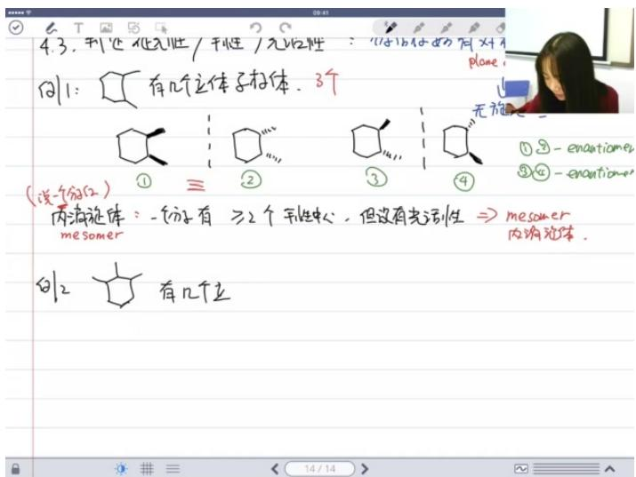

text_image

4.3. 判断不匀性 / 判断 / 无匀性 : (子) 有光活性相对强
例1: 有几个立体子极体。3个
① ② ③ ④
(说一个分位)
内海凝体: 一个子有 ≥2个半性中心, 但没有光活性 ⇒ mesomer
mesomer 内海凝体。
例2 有几个立

● 理论最大值: 三个手性中心最多 $2^{3} = 8$ 个立体异构体  
● 实际数量: 4个（存在等价关系：1=2，3=5，4=6，7=8）  
- 绝对构型判定:

○ 使用R/S命名法时注意r>s的优先级规则  
伪手性中心处理：当两侧基团连接相同但构型不同时（如R-S组合），中间碳仍为手性中心

\- 异构体关系:

- 3和6为对映异构体(enantiomers)   
○ 1和7为非对映异构体(diastereomers)

3. 例题: 螺旋分子判定 02:49:28

1）旋光性快速判断

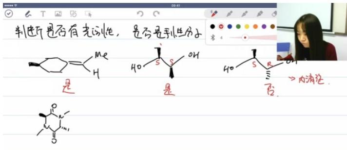

text_image

制断是否有先动性，是否是手性分子
是
是
否. →内消注

● 判断要点:

◦ 检查对称元素（对称面/对称中心）  
- 注意空间位阻导致的非平面结构  
○ 螺旋分子必定有旋光性（如五/六苯环体系）

\- 易错点:

- 二维图示可能误导共平面判断  
- 中间SP3杂化碳的实际三维构型  
- 内消旋体的特殊对称性

2）分子构型与活性关系

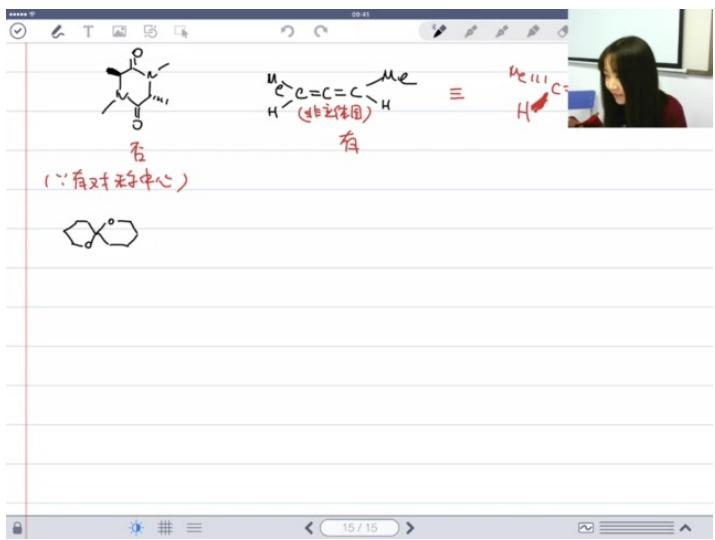

chemical

Handwritten chemical reaction diagram showing cyclohexene derivative with electron transfer and equilibrium, labeled with Chinese text '有' (Yes) and '(非正体固)' (Non-Positive Hybrid)

# ● 典型反例:

○ 含对称中心的分子无旋光性  
○ 例：特定构型的烯烃化合物

# ● 记忆技巧:

- "有面对称无旋光"（对称面或对称中心）  
○ "螺旋扭曲必旋光" (位阻导致的非平面结构)

# 十、顺反异构03:03:47

# 1. 顺反定义 03:04:01

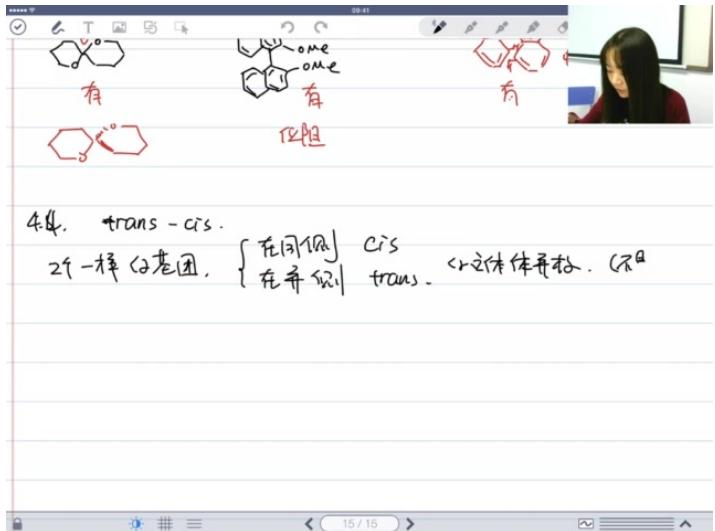

text_image

有
有
有
4.4. trans - cis.
2个一样 <的基团，{在同侧} cis
在并侧 trans. <r-体体异构. (不

基本概念：顺反异构属于立体异构现象，不是构造异构（原子连接方式相同）

\- cis定义：两个相同基团位于同侧时称为cis（顺式）

● trans定义：两个相同基团位于异侧时称为trans（反式）

\- 命名限制：仅适用于双键两端各有一个相同基团的情况（如甲基/甲基，乙基/乙基）

# ● 实例说明：

○ 甲基在同侧：cis  
○ 甲基在异侧：trans  
○ 甲基与乙基不同：不能使用cis/trans命名

# 2. ZE命名规则 03:06:35

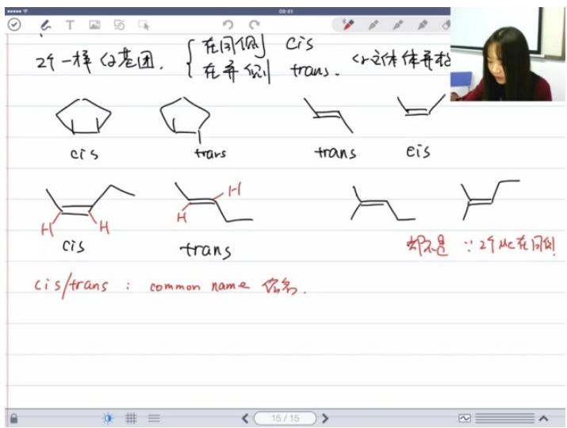

text_image

2个一样(仅基团，{在同侧} cis
在并侧 trans. <2立体体并起
cis trans trans eis
cis trans 蚂不是 ∵ 2个MC在同侧!
cis/trans : common name 姓名.

# - 命名体系区别：

- cis/trans: 俗名（common name）体系  
○ Z/E: IUPAC官方命名体系

● Z规则：双键每个碳上的较大基团在同侧时记为Z（德文zusammen，同侧）

● E规则：双键每个基团上的较大基团在异侧时记为E（德文entgegen，相反）

● 基团大小判定：按顺序规则比较（如甲基<乙基）

# - 中文对应：

○ Z/cis → 顺式  
○ E/trans → 反式

# - 矛盾案例：

○ 当两个甲基在异侧时：trans命名  
- 但按顺序规则（甲基vs乙基）：可能为Z命名  
- 说明两种命名体系可能产生矛盾结果

# 3. 命名法比较 03:08:42

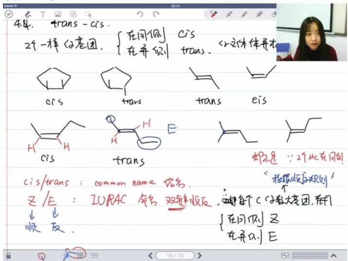

text_image

4.4. trans - cis.
2个一样(2)基团, {在同侧} cis
{在异侧} trans. <2-立体体并表
cis trans trans eis
cis trans 货是 ∵ 2个此在同一同侧
cis/trans : common name 名多.
z/E : IUPAC 命名 双链顺反, 都每个C(2)最大基团, 在同
↓ ↓
顺反. {在同侧} z
{在异侧} E

# ● 适用范围对比：

- cis/trans：仅适用于双键两端有相同基团的情况  
○ Z/E：适用于所有双键构型命名

● 环状化合物：五元环等环状化合物用绝对构型（R/S）命名

# - 重点强调：

- 不是所有化合物都能用cis/trans命名  
○ 当基团不同时必须使用Z/E体系  
- IUPAC优先推荐Z/E命名法

# - 记忆要点:

- cis/trans看相同基团位置  
○ Z/E看优先基团位置  
○ 环状化合物用R/S绝对构型

十一、知识小结

<table><tr><td>知识点</td><td>核心内容</td><td>考试重点/易混淆点</td><td>难度系数</td></tr><tr><td>异构体分类</td><td>构造异构体与立体异构体的区分标准</td><td>分子式相同但原子连接不同为构造异构</td><td>★★☆☆☆</td></tr><tr><td>立体化学基础</td><td>对应异构体(互为镜像不可重叠)与非对应异构体</td><td>镜像重叠性判断方法</td><td>★★★☆☆</td></tr><tr><td>手性中心判定</td><td>连有四个不同基团的碳原子</td><td>同位素取代(如H/D)也构成不同基团</td><td>★★★★☆</td></tr><tr><td>绝对构型标记</td><td>R/S命名规则(顺序规则+空间取向)</td><td>基团大小比较时的支链优先级</td><td>★★★★☆</td></tr><tr><td>环己烷构象</td><td>椅式构象的平伏键与直立键</td><td>取代基位阻效应排序:叔丁基&gt;异丙基&gt;乙基</td><td>★★★★☆</td></tr><tr><td>旋光性原理</td><td>偏振光旋转方向与分子结构关系</td><td>内消旋体(有手性中心但无旋光性)</td><td>★★★☆☆</td></tr><tr><td>顺反异构命名</td><td>cis/trans与Z/E命名规则差异</td><td>相同基团用cis/trans,不同基团用Z/E</td><td>★★★☆☆</td></tr><tr><td>构象能垒分析</td><td>乙烷/丁烷的交叉式与重叠式构象</td><td>邻位交叉构象的gauche效应</td><td>★★★★☆</td></tr><tr><td>环张力理论</td><td>小环不稳定性原因(角张力+扭转张力)</td><td>环丙烷的特殊平面构型</td><td>★★★☆☆</td></tr><tr><td>取代环己烷</td><td>一取代必在平伏键,多取代需计算位阻</td><td>叔丁基的构象锁定效应</td><td>★★★★☆</td></tr></table>