# 一、自由基反应 30:33

# 1. 烷烃的自由基反应 31:05

# 1）异构体分类与立体化学

# - 异构体基本分类

○ 分子式相同: 称为异构体(isomer)  
- 原子连接相同: 称为立体异构体(stereoisomer)  
- 原子连接不同: 称为构造异构体(constitutional isomer)

# - 立体异构体细分

○ 对应异构体(enantiomer): 彼此是不可重叠的镜像  
○ 非对应异构体(diastereomer): 不是对应异构体的立体异构体  
- 特殊情况: 可以重叠的镜像实际上是同一分子

# - 手性中心

○ 定义: 一个原子连接四个不同基团(可以是碳原子)  
○ 磷的例子: 磷连三个不同基团加一对孤对电子时具有手性  
- 氮的特殊性：室温下即使连三个不同基团也通常无手性，因其三角双锥结构可快速翻转

# 2）手性与旋光性

# - 基本概念

- 手性: 分子结构上无对称面和对称中心  
- 旋光性: 手性分子表现出的光学性质  
○ 互推关系: 手性⇌旋光性(纯样品条件下)

# ● 重要命题

命题1: 有且仅有一个手性中心的分子必有手性(正确)  
命题2: 有手性中心的分子必有手性(错误)  
命题3: 无手性中心的分子必无手性(错误)

# - 多手性中心情况

○ 最大异构体数: $2^{n}$ (n为手性中心数)  
- 内消旋体: 有≥2手性中心但无旋光性(因存在对称面)  
○ 外消旋体: 对应异构体1:1混合物(旋光性抵消)

# 3）构型判断与例题分析

# ● R/S构型判断方法

- 步骤1: 确定最小基团(通常为H)的朝向  
- 步骤2: 按CIP规则排列其他基团优先级  
步骤3: 观察旋转方向(顺时针为R，逆时针为S)   
○ 注意点: 若最小基团朝前，最终结果需取反

# 典型例题解析

●

# 解析要点:

■ 逐层比较基团优先级(第一个原子→第二个原子...)  
■ 注意桥环化合物的空间构象  
■ 含杂原子(如N、S)的基团优先级判断  
■ 氢原子朝向对最终结果的影响

# 4）异构体数目判断

# - 基本原则

- 对称性影响: 对称面会减少异构体数目  
- 内消旋体识别: 分子内部对称导致旋光性抵消

○ 构象异构: 通常不考虑, 除非题目特别说明

# 典型例题

# 解析要点:

■ 1,4-二甲基环己烷: 顺反异构(2种)  
■ 多手性中心化合物: 检查是否存在内消旋体  
■ 取代环丙烷: 考虑构型保持与翻转

# 5）旋光性判断

# - 判断标准

○ 关键因素: 缺乏对称面和对称中心  
- 无关因素: 旋转轴不影响旋光性判断  
- 特殊情况: 丙二烯型、联苯型等无手性中心但有手性的分子

# 例题分析

# 解析方法:

绘制对称元素示意图   
■ 检查是否存在对称面/中心  
■ 复杂分子可尝试构建模型

# 6）对映体过量值(ee值)计算

● 计算公式: ee值 = |主要对映体百分比 - 次要对映体百分比|  
● 示例: 80%R和20%S混合物的ee值为60%   
● 外消旋体: ee值为0%(1:1混合物)  
● 意义: 衡量样品中光学纯物质的含量

# 7）物理性质 32:51

# ● 烷烃的用途与清洁能源 32:57

\- 主要用途: 超过80%-90%的烷烃被直接燃烧用作能源，如汽车燃料和取暖

# ○ 可燃冰性质:

■ 属于清洁能源（燃烧产物为 $CO_{2}$ 和水）  
■ 不属于化石能源  
■ 不可再生能源

研究热点: 碳氢键活化/官能团化 (C-H functionalization)

■ 目标: 将烷烃从燃料转变为化工原料  
■ 意义: 解决石油危机，提高资源利用率  
■ 领域关联: 金属有机化学（获诺贝尔奖），涉及无机和有机化学交叉

# ● 碳氢键活化与官能团化 33:32

\- 技术原理: 通过过渡金属催化直接转化C-H键为其他官能团

# ○ 当前现状:

80%-90%烷烃被燃烧   
■ 理想目标：89%用于化工生产

# 研究难点:

■ 涉及氧化加成/还原消除机制  
■ 需解决选择性活化问题

\- 考试注意: 虽为热门领域但近年考题较少，可能作为题干背景出现

# ● 结构决定物理性质：沸点比较 36:17

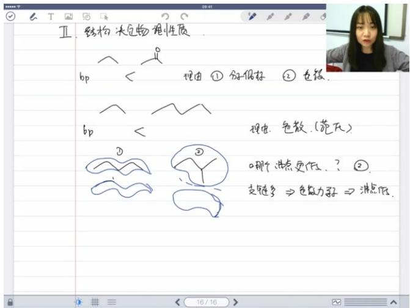

text_image

Ⅱ.结构决定物理性质
bp < 理由①分子假子 ②色簇.
bp < 理由.色簇.(范氏)
③
哪个点更低.?
②
支链多 ⇒ 色黏力弱 ⇒ 消点低.

# ○ 比较原则:

■ 丙酮(极性) > 丙烷(非极性)   
● 原因: 偶极矩差异( $\mu$ 丙酮 > 0, $\mu$ 丙烷 ≈ 0)和分子质量  
正戊烷 > 正丙烷  
● 原因: 均为非极性分子，仅比较色散力（范德华力）

# ○ 支链影响:

■ 现象: 支链多则沸点低（如异戊烷<正戊烷）

本质原因:

- 分子接触面积减小  
● 色散力（瞬时偶极）作用减弱

■ 形象比喻: "张开双臂易拥抱，蜷缩身体难接触"

● 结构决定物理性质：熔点比较 41:07

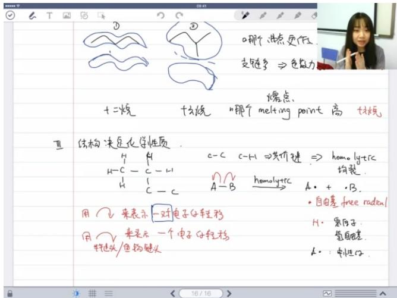

text_image

0.那个进点更优.
支链多 ⇒ 色黏力
十二烷
十六烷
哪个 melting point 高
熔点
结构决定化学性质
H H C-C C-H1 ⇒ 共价键 ⇒ homoly+trC
H-C-C-H1
H C-C A-B homoly+trC A· + ·B.
用 2 来表示一对电子过程移
用 来表示一个电子过程移
将链头/鱼钩链头
H· 寒原子
氢自由基
A· : 中性子

# ○ 常规规律:

■ 正十六烷 > 正十二烷（分子间作用力主导）  
■ 适用于直链烷烃比较

# ○ 特殊注意:

■ 晶格能影响：短链烷烃（如甲烷、丙烷）可能出现异常  
■ 考试提示：合理题目会提供必要信息提示

# ○ 判断方法:

■ 首先考虑分子间作用力  
■ 结构相似时直接比较分子量  
■ 注意支链化程度的影响

# 8）结构决定化学性质 42:55

# ● 自由基的稳定性 49:45

例题:丙烷自由基稳定性判断 55:17

■ 丙烷的氢原子类型

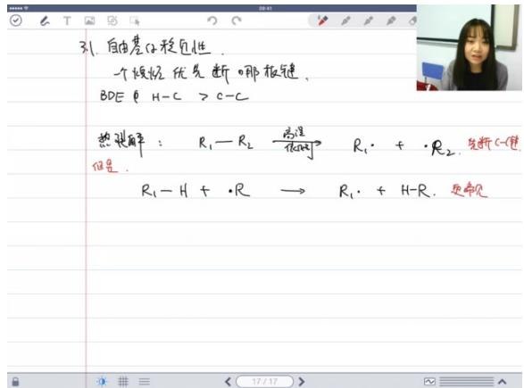

text_image

31. 自由基体稳定性.
一个极轻 优先断哪按键。
BDE • H-C > C-C
热裂解: R₁-R₂ → R₁• + •R₂,先断C-使
但是.
R₁-H+•R → R₁•+H-R.更常见

氢原子分类：丙烷分子中存在两种不同类型的氢原子，分别标记为黑色和红色（或蓝色）  
- 键断裂方式: 碳氢键断裂时, 使用鱼钩箭头表示断键过程, 箭头起点在 $\sigma$ 键上, 一个电子转移到氢原子上, 另一个电子留在碳原子上, 形成自由基

■ 自由基生成路径比较

\- 反应路径选择:

○ 路径A: 断裂红色标记的碳氢键

○ 路径B: 断裂蓝色标记的碳氢键

● 判断依据: 两种路径的合理性取决于生成的自由基(A)和(B)的稳定性  
● 核心问题: 需要比较两种自由基的相对稳定性来确定优势反应路径

■ 自由基稳定性判断方法

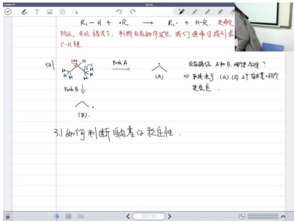

text_image

R₁-H + R → R₁ + H-R. 更常
似, 在此情况下, 判断反应的可变色, 我们通常要指引最
C-H链.

121

RₐₕA
(A)
反应结论 A和B.哪使合理?
⇒ 非线决定 (A)(D) 2个自由量, 那个
更易值.

BₐₕB↓

(B).

3.1 如何判断自由基子稳定性.

关键概念:

○ 超共轭效应：自由基稳定性与超共轭程度相关（后续会详细讲解共轭概念）

○ 键解离能(BDE): H - C键的解离能通常大于C - C键

● 热解反应: $R_{1}-R_{2}\triangle R_{1}\cdot+\cdot R_{2}$   
- 氢提取反应: $R_{1} - H + \cdot R \rightarrow R_{1} \cdot + H - R$   
● 判断原则: 优先断裂较弱的 C-H 键，生成更稳定的自由基

例题解析

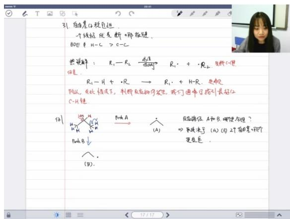

text_image

31. 自由差C子核包性
一个线性优先断哪板键。
BOE & H-C > C-C
热键解: R₁-R₂ → R₁· + ·R₂, 失断C使
但是.
R₁-H + ·R → R₁· + H-R, 变必见
B从，在线性情况下, 判断反应物可发生, 我们通常可指引最好似
C-H键.
例1
→
Poh A
(A)
反应器位 A和 B, 哪便合理?
40. 和决于 (A)(B) 2个的差, 两个
更长值 .
Poh B ↓
(B).

# ● 解题思路:

- 识别分子中不同位置的氢原子类型  
- 分析各路径生成的自由基结构  
○ 比较自由基的稳定性  
○ 根据稳定性差异判断优势反应路径

# ● 关键点:

○ 仲碳自由基(二级碳自由基)通常比伯碳自由基(一级碳自由基)更稳定  
- 超共轭效应是影响自由基稳定性的重要因素

○ 自由基稳定性判断因素 01:08:01

■ 超共轭效应 01:08:16

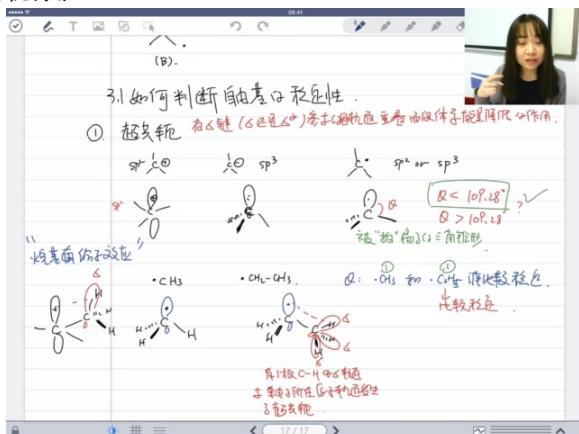

text_image

3.1 如何判断自由电子稳定性.
① 超短轭
sp² ② ③ sp³ ④ ⑤ sp² or sp³
Q < 10P.28
Q > 10P.28
??
破"拍"后S(2)三角形
烃基面 sin 应应
CH₃ CH₂-CH₃ Q: CH₃ 和 CH₂-CH₃ 消比较稳定.
比较不稳定.
异士极C-H和O-恒值
主要因子所在压长和动量发生
矛盾平衡

\- 定义: 有σ键（无论是成键还是反键）参与的轨道重叠，使体系能量降低或稳定的作用。

# ● 作用机制:

○ 碳氢键的σ轨道与缺电子中心（自由基或碳正离子）的p轨道发生有效重叠  
○ 单键可旋转使多个σ键都能参与稳定作用

# ● 能量匹配原则:

○ 碳氢σ键轨道能量匹配效果最好  
○ 碳碳σ键也能参与但稳定效果较弱

# - 参与条件:

必须隔一根σ键（直接相连的σ键不参与）  
○ 甲基自由基有3个C-H键参与  
- 乙基自由基有3个C-H和3个C-C键共6个参与

■ 碳自由基的杂化状态 01:08:49

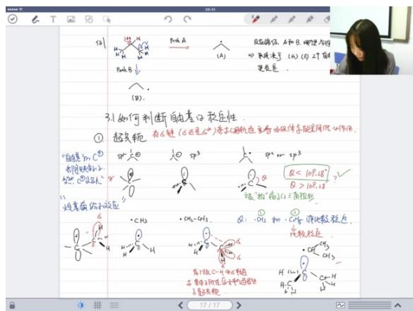

text_image

①
超负轭
"自氧和C③
共同构成水
②③④碳原子"
烃表面的示意图
⑤
⑥
⑦
⑧
⑨
⑩
⑪
⑫
⑬
⑭
⑮
⑯
⑰
⑱
⑲
⑳
㉑
㉒
㉓
㉔
㉕
㉖
㉗
㉘
㉙
㉚
㉛
㉜
㉝
㉞
㉟
㉳
㉴
㉵
㉜
㉝
㉞
㉟
㉟
㉟
㉟
㉟
㉟
㉟
㉟
㉟
㉟
㉟
㉟
㉟
㉟
㉟
㉟
㉟
㉟
㉟
㉟
㉟
㉟
㉟
㉟
㉟
㉟
㉟
㉟
㉟
㉟
㉟
㉟
㉟
㉟

# ● 杂化类型:

- 介于SP2和SP3之间，更接近SP3   
○ 键角θ<109.28°（被"压扁"的三角锥形）

# ● 电子排布:

○ 单电子占据SP3杂化轨道  
- 斥力顺序：孤对-孤对 > 孤对-成键 > 成键-成键 > 单电子

# - 结构特征:

○ 甲基自由基：单电子占据向上伸展的SP3轨道  
○ 乙基自由基：CH3-CH2·结构，6个σ键参与超共轭

# 自由基稳定性的比较 01:12:52

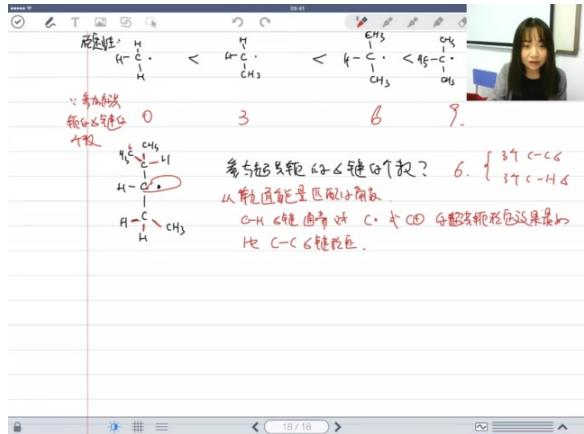

text_image

碳性: H
4-C
H
0
3
6
9.
参与超光轭的C键这个数?
6. {3个C-C}
3个C-H
从单孔面能量匹配的小角质
G-H C键由带好 C 个 C① 与超光轭相位连接起来的
比 C-C C键相位。

# ● 稳定性序列:

○ 甲基＜乙基＜异丙基＜叔丁基

# ● 稳定性原因:

参与超共轭的σ键数量递增（0→3→6→9）  
- 超共轭效应使体系能量降低

# - 烷基电子效应:

本质是σ键与缺电子中心的超共轭作用  
- 不是通常认为的电负性差异导致  
○ 既能稳定自由基也能稳定碳正离子

# 共轭效应

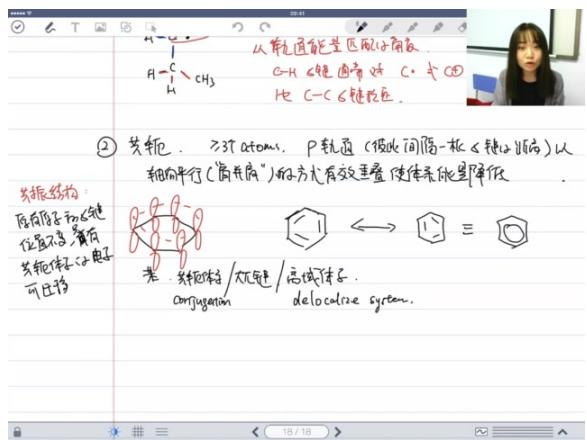

text_image

② 共轭. ≥37 atoms, P 轨通 (彼此间隔一束 < 锚心偏角) 以轴向平行(简共轭")做方尤有效叠加使体系能量降低
共轭结构
原有原子和 < 锚位度不变, 首有
充轭体系 < 电子可迁移
从单轨道能量区做子角交
C-H < 锚面角对 C- 式 C@
比 C-C < 锚线距, 
光轭: 共轭体与/无轭/高域体与.
contjugation delocalize system.

# 定义:

\- 在≥3原子范围内，p轨道以"肩并肩"方式间隔一根σ键有效重叠
- 使体系能量降低的作用（又称离域效应）

# ● 共振结构:

\- 原子核和σ键位置不变
- 只有共轭体系的p轨道电子可迁移
- 例：苯环的两种共振式叠加形成离域π电子云

# - 自由基稳定:

\- SP2杂化自由基能与相邻π键形成p-π共轭
- 例：丙烯自由基中单电子p轨道与π键共轭
- SP3杂化时轨道重叠效果较差

# ■ 共轭效应与超共轭效应的比较 01:40:23

# 基本概念

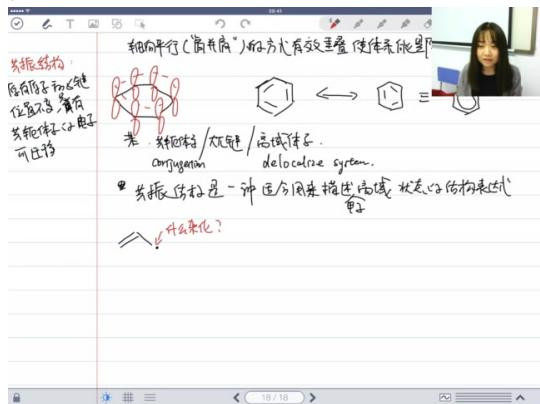

text_image

共振结构
具有原子初始位移
位置不变，含有
共振体系电子
可迁移

轴向平行(“离开扇”)的方式有效垂直使体系能显
素：共振结构/光子链/高域体系.
configuation: delocalize green.

共振结构是一种适合用来指出高域状态的结构表达式
$\text{重}$
什么来化？

○ 轴向平行重叠：p轨道以"肩并肩"方式平行排列，形成有效重叠使体系能量降低  
○ 电子迁移特性：原有原子键位不变，但共轭体系中的电子可迁移，形成大 $\pi$ 键或高域体系  
- 杂化方式：参与共轭的原子通常采用 $sp^{2}$ 杂化

# - 共振结构描述

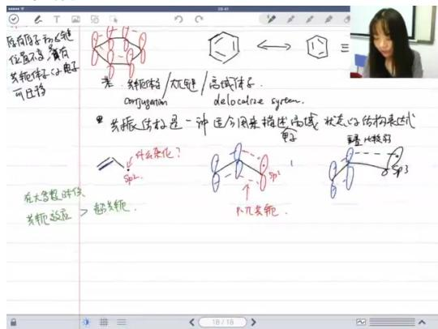

text_image

原有原子和光子链位置不变，含有共轭体系的电子可迁移

若：共轭体系/光子链/高域体系.
configuration
delocalorie green.

共振结构是一种包含同类描述流域状态的结构表达式。
是什么来化？

sp²⁻

½英轭.

10/10

○ 结构表达：共振结构是描述离域状态的合适表达方式  
- 稳定性比较：在大多数情况下共轭效应 > 超共轭效应  
体系特征：需要至少3个原子，p轨道间隔一个键距（σ键）形成共轭

供热效应解释

○ 能量降低机制：供热效应指共轭提供的体系能量降低作用强于超共轭  
- 反例说明：存在特殊情况（详见质心教育官网相关视频）

\- 学习资源指引

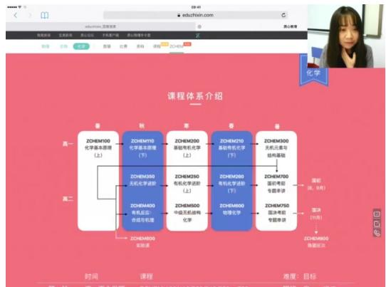

flowchart

○
○ 视频资源：

■ 官网路径：化学→ZCHEM课程→底部"共轭VS超共轭"专题  
■ 内容结构：50分钟视频分为国初水平(前32分钟)和国决水平(后27分钟)两部分  
■ 难度说明：从基础概念到本质分析，涵盖实验现象解释

\- 重要性比较

◦ 教学重点：共轭和共振概念会反复讲解，超共轭涉及较少  
- 应用频率：共轭效应在有机化学中的应用远多于超共轭效应  
- 后续联系：将在芳香化合物章节深入讲解相关概念

\- 自由基稳定性

- 稳定机制：共轭效应能显著稳定自由基  
○ 结构要求：需要满足p轨道平行排列和电子离域条件

例题:自由基稳定性排序判断 01:42:08

■ 自由基稳定性影响因素

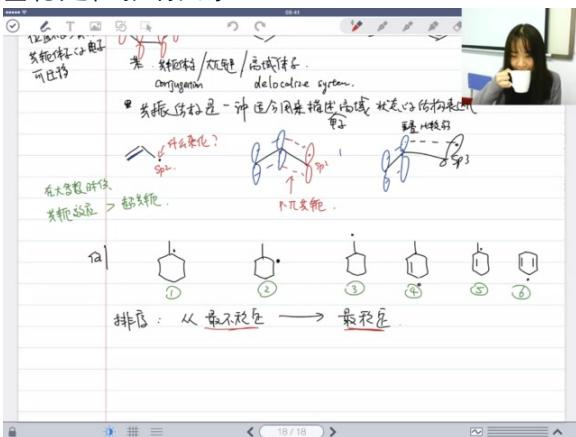

text_image

苯胺结构/次聚酯/高域体系.
ampergasm
delocalize system.

*共轭结构是一种适合用来描述高域状态心结构来逼近
?
什么来化？
第1

在大类数时使
共轭状态：→超共轭.
↑几类轭.

排序：从最不稳定 → 最稳定

共轭效应：π-π共轭体系能显著稳定自由基，共轭范围越大越稳定  
● 超共轭效应： $\sigma-\pi$ 超共轭作用也能稳定自由基，参与超共轭的 $\sigma$ 键数量越多越稳定

○ 3号自由基：3个σ键参与超共轭（1个C-H，2个C-C）  
○ 2号自由基：6个σ键参与超共轭（3个C-H）

○ 1号自由基：9个σ键参与超共轭（7个C-H）

● 稳定性排序：3 < 2 < 1 < 4 < 5 < 6（从最不稳定到最稳定）

共振结构存在条件

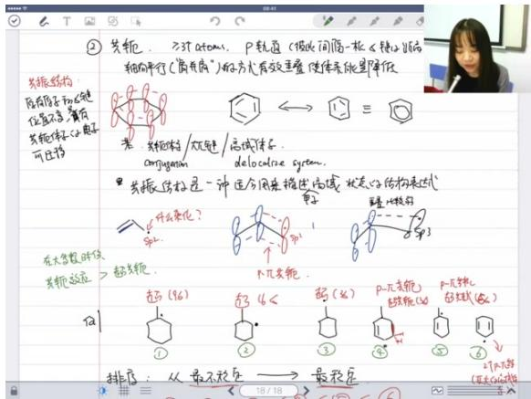

text_image

共振结构
原有原子和光能
位置不变，含有
共振核心电子
可迁移

在大学数时代
共振效应 → 超离键。

排序：从最不稳定 → 最稳定

2 花轭. ≥3t atoms. P轨道（物体间偏一极、钝心端的
轴平行（扁质商）的人方有效垂直使体系能量降低

α 花轭结构/夹角键/高域体系.
amjygmn delocalize system.

* 兼振结构是一种适合用来描述“高域”状态心结构表达式
子

什么杂化？

# 个子

# 个子

# 个子

# 个子

# 个子

# 个子

# 个子

# 个子

# 个子

# 个子

# 个子

# 个子

# 个子

# 个子

# 个子

# 个子

# 个子

# 个子

# 个子

# 个子

# 个子

●

● 必要条件：必须存在离域体系（π共轭体系）  
● 结构特征：所有原子和σ键位置不变，只有共轭体系的电子可迁移  
● 实例分析：

○ 1/2/3号自由基：无共振结构（缺乏离域体系）

\- 4/5/6号自由基：存在共振结构（具有π共轭体系）

共振结构绘制方法

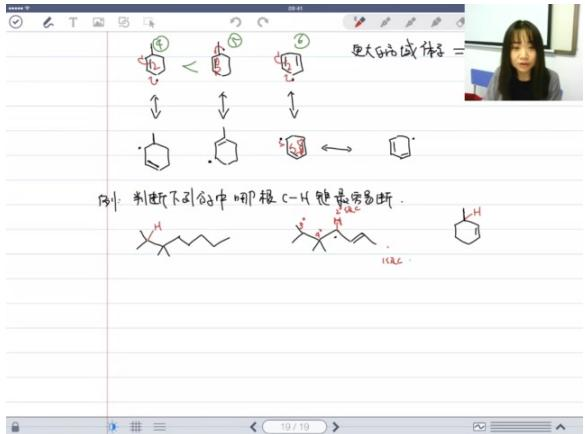

chemical

Hand-drawn chemical reaction diagram showing cyclohexene ring opening under different conditions, with Chinese explanatory text below.

●

● 电子迁移规则：使用鱼钩箭头表示单电子转移

○ 电子从π键迁移到相邻碳原子  
- 碳自由基的电子迁移到π键位置

● 稳定性原理：离域范围越大，可能的共振结构越多，体系越稳定

■ 碳氢键断裂难易判断

● 判断标准：优先断裂能生成最稳定自由基的C-H键  
● 影响因素：

○ 生成的自由基是否具有共轭效应  
○ 生成的自由基是否具有超共轭效应  
○ 碳原子级数（一级/二级/三级碳）

● 实例分析：

- 优先断裂与双键共轭位置的C-H键  
- 在相同共轭条件下，选择能产生更多超共轭效应的位置

\- 卤化反应机理

■ 自由基反应基本机理

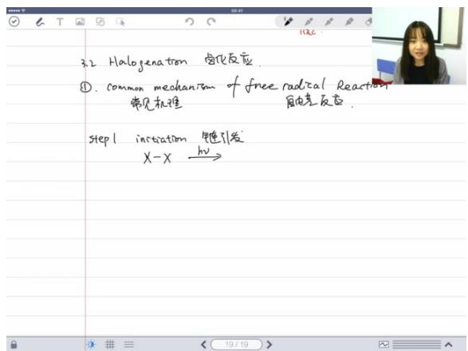

text_image

3.2 Halogenation 奧化反应
① common mechanism of free radical Reaction
常见机制 自由差反应.
Step1 instation 链引发
X-X →

# - 链引发(Initiation):

○ 条件：通常需要光照 $(X_{2}hv2X\cdot)$   
○ 特征：共价键均裂产生自由基

# - 链转移(Propagation):

◦ 步骤A: $R - H + X \cdot \rightarrow R \cdot + H - X$   
- 步骤B: $R \cdot + X - X \rightarrow R - X + X \cdot$

# - 链终止(Termination):

○ $X \cdot +X \cdot \rightarrow X - X$   
○ $X \cdot + R \cdot \rightarrow R - X$   
○ $R \cdot +R \cdot \rightarrow R - R$

# 链反应特性

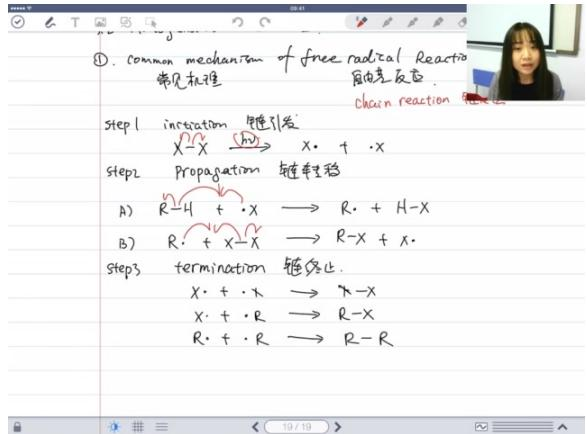

text_image

①. common mechanism of free radical Reaction
常见机理
自由差反应
chain reaction
step1 intration 链引发
x-x (hv) → x· + ·x
step2 Propagation 链转移
A) R-4 + ·x → R· + H-x
B) R· + x-x → R-x + x.
step3 termination 链终止.
x· + ·x → x-x
x· + ·R → R-x
R· + ·R → R-R

● 自持性：少量引发剂可引发大量反应（X·在步骤B中再生）  
- 快速性：反应速度通常比离子型反应快  
● 副产物：多种终止方式导致产物复杂性  
● 净反应： $R - H + X_{2} \rightarrow R - X + H - X$ （取代反应）

\- 卤化反应 01:54:36

○ 自由基反应的一般性机理 01:55:06

■ 卤素自由基反应机理 02:08:53

\- 链式反应基本步骤

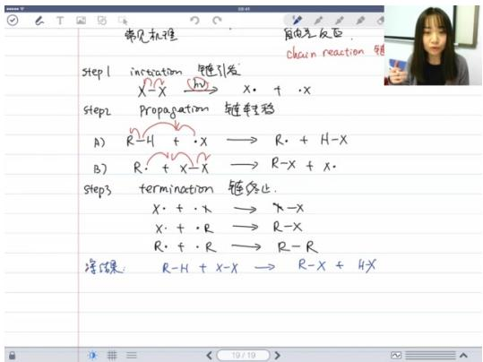

text_image

常见机理
触电反应
chain reaction 链
step1 intration 链引发
x-x → x· + ·x
step2 Propagation 链车移
A) R-H + ·x → R· + H-X
B) R· + x-X → R-X + x·
step3 termination 链终止.
x· + ·x → X-X
x· + ·R → R-X
R· + ·R → R-R
浮结案: R-H + x-X → R-X + H-X

○ 链引发(Initiation): X - Xhν2X·卤素分子在光照下均裂生成自由基   
○ 链转移(Propagation):

A) $R-H+X\cdot\rightarrow R\cdot+H-X$ 自由基夺取氢原子  
B) $R\cdot+X-X\rightarrow R-X+X\cdot$ 生成产物并再生自由基

○ 链终止(Termination):

$X \cdot + X \cdot \rightarrow X - X$   
$X \cdot + R \cdot \rightarrow R - X$   
$R \cdot + R \cdot \rightarrow R - R$

\- 卤素反应特性比较

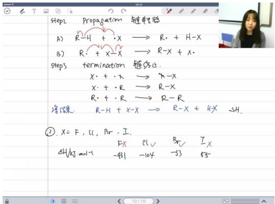

text_image

Step2 Propagation 链程稳
A) R-H + X → R. + H-X
B) R. + X-X → R-X + X.
Step3 termination 错终止.
X. + X → X-X
X. + R → R-X
R. + R → R-R
等碳 R-H + X-X → R-X + H-X 5H.
② X = F, Cl, Br, I.
FX Cl √ Br √ I
SH/kJ mol-1 -431 -104 -33 65

反应焓变差异：

■ 氟(F): $\Delta H = -431 \, kJ/mol$ （剧烈放热易爆炸）  
■ 氯(Cl): $\Delta H = -104kJ/mol$   
溴(Br): $\Delta H = -53\mathrm{kJ / mol}$   
■ 碘(I): $\Delta H = +53kJ/mol$ （几乎不发生）

○ 实际应用选择:

■ 氟：因剧烈放热不可控，实际不使用  
■ 碘：反应吸热难以进行，不适用  
■ 常用氯和溴：反应可控性较好

\- 氯溴反应机理对比

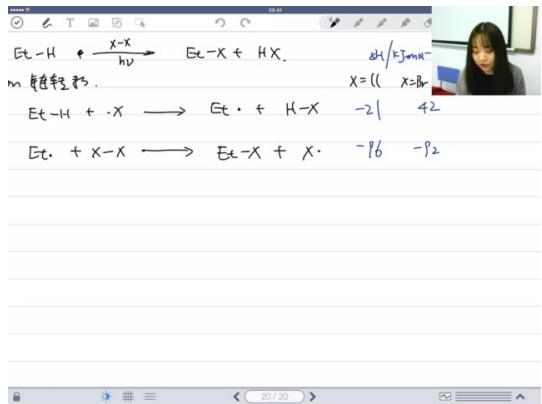

text_image

Et-H + x-x → Et-x + Hx.
m 角度轻分布.
Et-H + x → Et· + H-x
Et· + x-x → Et-x + x·
X=11 X=Bn
-21 42
-96 -92

# ○ ○ 速率比较：

■ 氯化反应活化能较低 ( $\Delta H_{a} = -21kJ/mol$ )   
■ 溴化反应活化能较高 ( $\Delta H_{a}=+42kJ/mol$ )  
■ 结论：氯化速率 > 溴化速率

# ○ 选择性原理：

■ 高活化能反应（溴化）具有更好的选择性  
■ 类似"撑杆跳"模型：反应能垒越高，只有最优路径可通过

# ○ 键能数据：

■ H-Cl键能：431 kJ/mol  
■ H-Br键能：365 kJ/mol（键长更长，键能更弱）

# - 反应机理书写要点

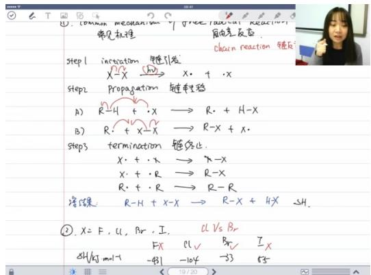

text_image

常见机推
step1 in reaction 链引发
X - X → X + X
step2 propagation 链链性铬
A) R-H + X → R + H-X
B) R + X - X → R-X + X.
step3 termination 镉终止
X + ·X → X-X
X + ·R → R-X
R + ·R → R-R
冷媒 R-H + X-X → R-X + 4X SH.
②. X = F, Cl, Br, I, Cl Vs Br
SH/Ag mol-1 → FX → IL → Br, I, X
→ -P1 → -10F → -33 → 53

# ○ 完整机理要求：必须包含引发、转移、终止三步骤

# - 简化书写现象：

■ 参考书常省略终止步骤（因主要关注原料→产物路径）  
■ 终止步骤主要影响副产物生成

# ○ 浓度影响：

■ 自由基浓度极低时（气相/稀溶液），链转移占主导  
■ 自由基碰撞概率低，更易发生链转移而非终止

# - 反应选择性与速率关系

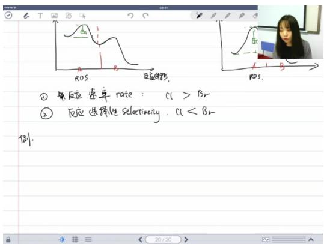

text_image

① 第反应 速率 rate: Cl > Br
② 反应选择性 Selartineity. Cl < Br
例.

# ○ ○ 普遍规律：

■ 易发生反应（如氯化）通常选择性较差  
■ 难发生反应（如溴化）通常选择性较好

# 现代研究进展：

■ 新型自由基反应可兼顾速率和选择性  
■ 传统自由基反应研究较少因其选择性控制困难

# ○ 应用案例 02:24:38

# ■ 例题:丙烷氯化反应机理

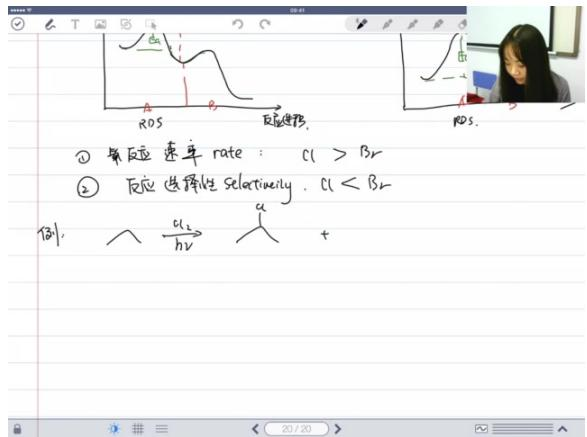

text_image

① 第反应速率 rate: Cl > Br
② 反应选择性 selectinely. Cl < Br
例:  c1/ hν  +

反应速率比较: $Cl_{2}>Br_{2}$ ，氯气反应速率更快  
- 反应选择性比较: $Cl_{2} < Br_{2}$ ，溴的选择性更好  
● 产物比例: 氯化反应生成两种产物比例为60%和40%  
- 第一步为链引发（省略书写）  
- 碳氢键断裂生成自由基和HCl  
○ 自由基与氯气反应生成产物和新的氯自由基  
- 两种可能的断裂方式导致两种产物

# ● 机理特点:

# ■ 例题:丁烷氯化/溴化反应机理 02:27:27

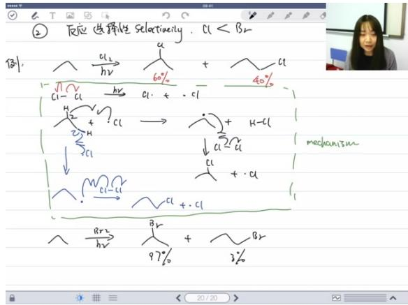

text_image

② 反应选择性selectivity. Cl < Br
例:
√ Cl →
hν
60%
+ 40%
Cl - Cl →
h×
Cl + Cl
- 
H + Cl →
H-Cl
↓ Cl + Cl
M Cl - Cl →
Cl + Cl
- 
Rr2
h×
Br
97% + 3%
mechanism

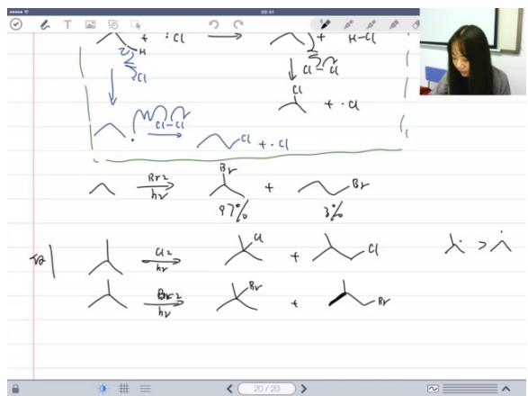

chemical

Handwritten chemical reaction equations involving bromination and hydrogenation steps

\- 溴化选择性: 溴化产物比例为 $97 \%$ 和 $3 \%$ ，选择性显著优于氯化

\- 氯化产物比例: 35%和65%，与预期稳定性相反

# - 稳定性解释:

◦ 左边自由基稳定性理论上应大于右边  
○ 实际产物比例由氢原子数量决定

# ● 概率计算:

- 中间氢有2个，旁边氢有6个   
○ 断键概率比约为30:6.6≈5:1   
○ 氢原子数量比为1:9   
○ 最终产物比例应为 $5 \times 1:1 \times 9 \approx 5:9$   
○ 实际35%:65%符合该比例

# ● 关键结论:

○ 产物分布由氢原子数量和断键概率共同决定  
即使稳定性较差的位置，氢原子多也可能成为主产物  
- 溴的选择性优势在于能更好区分不同位置的活性差异

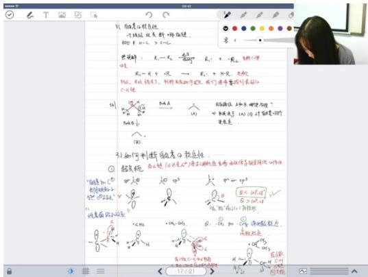

text_image

图1: 图象关系包含:
个体线: 视星-圆锥体
椭圆: 30° + 5° + 3°

经证明: R₁ = -R₂ = -A/√(a) R₂' + -R₃ = -A/√(a)

R₁' = -R₂' + R₂' → R₃' + 10°, 变形

拟合, 取得平方根.

图形元素的性质为:

图2: 图1: 图2

图3: 图4

图5: 图6

图7: 图8

图9: 图10

图11: 图12

图13: 图14

图15: 图16

图17: 图18

图19: 图20

图21: 图22

图23: 图24

图25: 图25

图27: 图26

图28: 图27

图29: 图28

图30: 图30

图31: 图31

图32: 图32

图33: 图33

图34: 图34

图35: 图35

图36: 图36

图37: 图37

图38: 图38

图39: 图39

图40: 图40

图41: 图41

图42: 图42

图43: 图43

图44: 图44

图45: 图45

图46: 图46

图47: 图47

图48: 图48

图49: 图49

图50: 图50

图51: 图51

图52: 图52

图53: 图53

图54: 图54

图55: 图55

图56: 图56

图57: 图57

图58: 图58

图59: 图59

图60: 图60

图61: 图61

图62: 图62

图63: 图63

图64: 图64

图65: 图65

图66: 图66

图67: 图67

图68: 图68

图69: 图69

图70: 图70

图71: 图71

图72: 图72

图73: 图73

图74: 图74

图75: 图75

图76: 图76

图77: 图77

图78: 图78

图79: 图79

图80: 图80

图81: 图81

图82: 图82

图83: 图83

图84: 图84

图85: 图85

图86: 图86

图87: 图87

图88: 图88

图89: 图89

图90: 图90

图91: 图91

图92: 图92

图93: 图93

图94: 图94

图95: 图95

图96: 图96

图97: 图97

图98: 图98

图99: 图99

图100: 图100

# - 自由基稳定性判断:

- 超共轭效应是主要影响因素  
○ 碳氢键断裂难易与键解离能(BDE)相关   
- 稳定性顺序：叔碳>仲碳>伯碳>甲基

# - 应用实例:

- 植物油自氧化反应（油"哈了"现象）  
○ 乙醚储存危险性（易形成过氧化物爆炸）  
○ 自由基抑制剂的作用（如添加醇类物质）

# 2. 过氧链反应 02:33:56

1）例题：BHT作自由基抑制剂 02:41:02

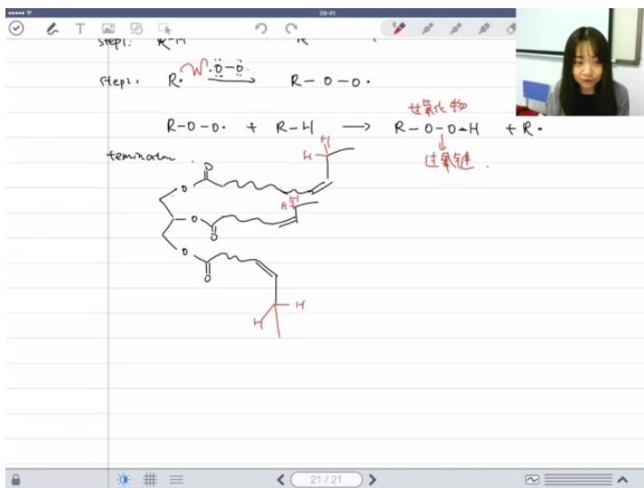

chemical

Chemical reaction diagram showing nucleophilic addition of malonate to form a secondary amine, with labeled steps and reaction conditions

- 定义与用途：BHT（Butylated Hydroxy Toluene）是食品添加剂中的自由基阻碍剂，化学名称为叔丁基羟基甲苯。  
● 作用机理：

当自由基与BHT相遇时，BHT会提供氢原子使自由基淬灭，自身形成稳定的酚氧自由基。  
○ 生成的酚氧自由基由于以下两个原因特别稳定：

位阻效应：分子两侧的叔丁基（t-Bu）体积庞大，阻碍其他分子接近氧自由基中心。  
■ 共轭效应：氧自由基的未成对电子可通过共振离域到苯环上，形成更稳定的结构。

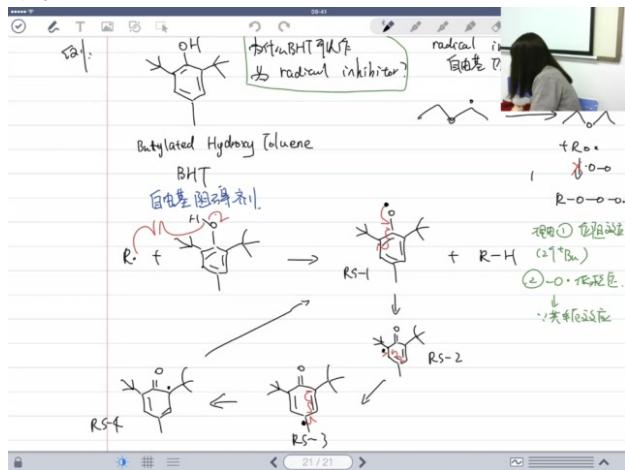

chemical

Chemical reaction scheme showing radical inhibition and hydroxyl hydrolase steps with labeled intermediates R-1, R-H, and R-S-2

● 共振结构分析：

酚氧自由基可通过共振形成四种结构（RS1-RS4），其中RS1最稳定，因其未成对电子直接与苯环共轭，获得额外的芳香稳定化能。  
- 共振时需注意：σ键和原子位置保持不变，仅移动π电子和未成对电子。

2）例题：NBS反应机理 02:50:16

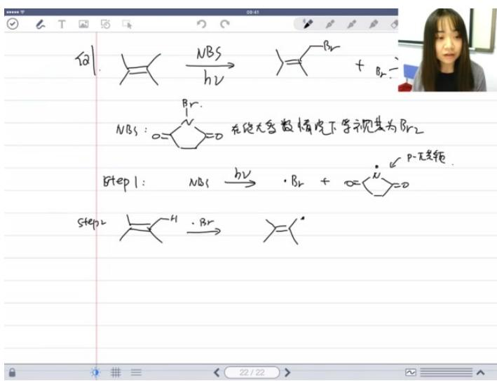

chemical

Chemical reaction equations and diagrams showing bromination and hydrogenation steps in a chemical reaction context

# NBS性质：

- N-溴代琥珀酰亚胺（NBS）在大多数反应中可视为溴（ $Br_{2}$ ）的替代品。  
优势：固体形态便于操作，避免使用剧毒、易挥发的液溴。

# - 反应机理：

◦ 引发阶段：NBS在引发剂作用下生成溴自由基（Br·）和稳定的氮中心自由基。  
○ 链传递：

■ 溴自由基夺取底物氢原子，生成碳中心自由基。  
■ 碳自由基与NBS反应，得到溴代产物并再生溴自由基。

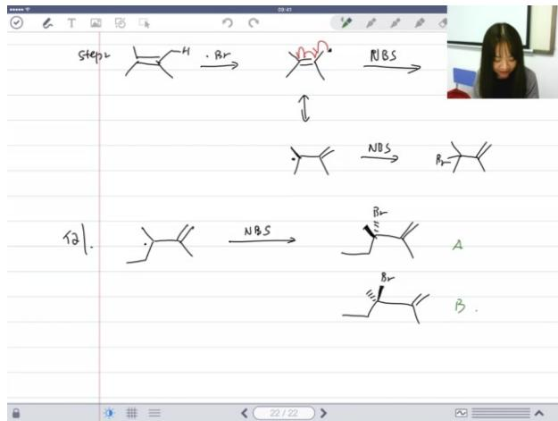

chemical

Reaction pathway diagram showing bromination and NBS formation steps for compound A, B, and Br

# - 立体化学：

☐ 当底物为平面型自由基（如烯丙位自由基）时，溴可从平面上方或下方进攻，位阻环境相同，生成外消旋产物（1:1比例）。  
- 原因：SP²杂化的自由基中心具有平面结构，且p-π共轭使两侧进攻概率均等。

# 3）其他自由基反应（补充）

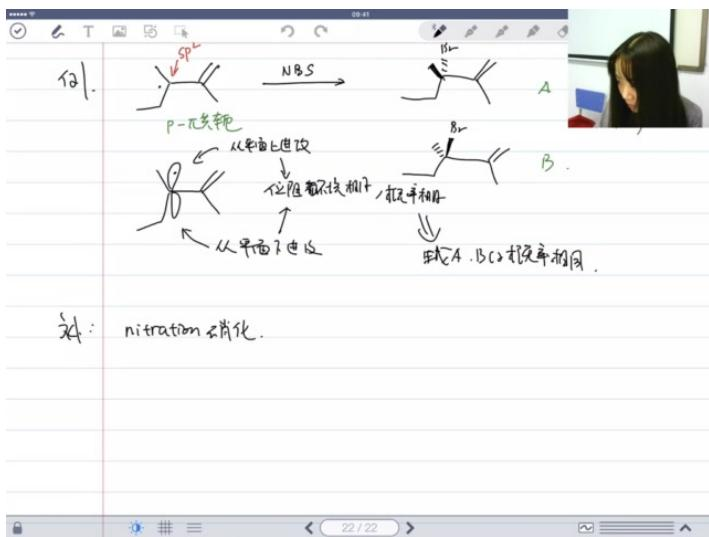

text_image

代1.
P-π共轭
从单面上进改
↓
位阻都不找相平
从单面下进改
NBS
B
A
B
←
→
→
→
→
← A : B C 2 按速率相同.
对:
nitration 硝化.

# - 硝化反应:

- 条件：烷烃与硝酸在气相高温下反应。  
○ 机理：自由基历程，最终生成硝基化合物（ $R - NO_{2}$ ）和水。

# - 磺化反应:

○ 类似硝化反应，但使用磺酸基（ $SO_{3}H$ ）替代硝基，同样需高温条件。  
- 应用限制：两类反应实际应用较少，因需苛刻条件且副产物多。

# 二、知识小结

<table><tr><td>知识点</td><td>核心内容</td><td>考试重点/易混淆点</td><td>难度系数</td></tr><tr><td>立体化学基础</td><td>异构体分类(构造异构体/立体异构体/对应异构体/非对应异构体)</td><td>分子式相同但原子连接不同=构造异构体;原子连接相同但空间排列不同=立体异构体</td><td>★★☆☆☆</td></tr><tr><td>手性中心判定</td><td>手性碳定义(连4个不同基团);氮原子通常不形成稳定手性中心(室温下快速翻转)</td><td>磷化合物可形成稳定手性中心(孤对电子算作一个基团)</td><td>★★★☆☆</td></tr><tr><td>旋光性与手性</td><td>手性分子必有旋光性(无对称面/对称中心);旋光性检测可反向证明手性</td><td>内消旋体(&gt;2手性中心但整体无旋光性);外消旋体(1:1对应异构体混合物)</td><td>★★★★☆</td></tr><tr><td>自由基稳定性</td><td>超共轭效应(σ键稳定自由基);共轭效应(p轨道离域更稳定)</td><td>稳定性顺序:苄基&gt;烯丙基&gt;3°&gt;2°&gt;1°&gt;甲基;判断关键:参与超共轭的σ键数量+共轭体系大小</td><td>★★★★☆</td></tr><tr><td>卤化反应机理</td><td>链引发(光照产生自由基);链转移(自由基夺取H);链终止(自由基结合)</td><td>氯反应快但选择性差;溴反应慢但选择性好(过渡态能量高)</td><td>★★★★☆</td></tr><tr><td>自氧化反应</td><td>碳氢键被氧气氧化形成过氧化物(油变质原理);自由基抑制剂(BHT)作用机制</td><td>抑制剂通过位阻效应+共振稳定自由基</td><td>★★★☆☆</td></tr><tr><td>NBS溴化反应</td><td>固体溴源替代危险液溴;通过自由基机理进行选择性溴代</td><td>平面型自由基产生外消旋产物(两面进攻概率相等)</td><td>★★★☆☆</td></tr><tr><td>构型标记法</td><td>R/S标记规则(顺序规则+空间取向);费歇尔投影式转换技巧</td><td>氢在前时需反转构型;桥环化合物标记的特殊性</td><td>★★★★★</td></tr></table>