# 一、上节内容复习00:17

- 自由基反应回顾：上节课主要讲解自由基相关内容，课程按照官能团分类展开，将概念穿插在官能团讲解中。烷烃作为最简单的无官能团化合物，其化学性质主要涉及碳氢键和碳碳键的断裂。  
- 自由基生成特点：烷烃中碳氢键和碳碳键都是极性很弱的共价键，倾向于发生均裂反应，生成中性的自由基。

# 二、结构与物理性质01:46

# - 熔沸点判断依据：

- 主要取决于分子间作用力类型，烷烃作为非极性分子，主要存在色散力  
- 分子质量越大，色散力越强，熔沸点越高  
- 分子质量相同时，支链越多相互作用力越弱

● 支链影响机制：支链增多导致分子间接触面积减小，色散力（瞬时偶极作用）减弱

# 三、结构与化学性质 02:48

# 1. 影响自由基稳定性的因素 02:57

● 共轭效应：在≥3原子范围内，p轨道以肩并肩、轴向平行方式重叠，使体系能量降低  
● 超共轭效应： $\sigma$ 键参与与其他轨道重叠使体系能量降低的过程  
- 适合表达电荷分布，是对经典结构式的补充  
○ 实例：1,3-丁二烯中间单键比正常单键短，双键比正常双键长  
- 苯环六根C-C键等长，需用两个共振结构式叠加表达

# ● 共振结构式应用：

# 2. 自由基反应 05:10

# - 反应机理特点：

○ 使用鱼钩箭头表示单电子转移（传统箭头表示双电子转移）  
○ 标准三步：链引发→链转移→链终止

# - 卤化反应差异:

- 氯化：活化能低，速率快但选择性差   
- 溴化：活化能高，速率慢但选择性好  
- 氟化剧烈放热不可控，碘化热力学不利

# - 自氧化反应：

○ 实例：植物油中不饱和脂肪酸的α-H易被氧化  
- 过程：生成自由基 $\rightarrow$ 与 $O_{2}$ 形成过氧键 $\rightarrow$ 生成过氧自由基 $\rightarrow$ 夺取H

# 3. 自由基的抑制 11:50

# ● 抑制剂特征：

○ 常见含酚羟基结构（如BHT、维生素E）  
○ 能与自由基形成稳定的共轭体系  
- 作用原理：生成稳定自由基终止链反应

# - 反应条件提示:

- 光照、过氧化物存在常暗示自由基机理  
○ 氧氧键易断裂生成活性氧自由基

# 4. 应用案例 13:29

# 1）例题:自由基稳定性顺序 13:36

# ● 解析要点:

\- 稳定性顺序： $1^{\circ} < 2^{\circ} < 3^{\circ}$ 自由基

\- 原因：超共轭效应增强稳定性

2）例题:共振结构应用 14:07

● 解析要点：

○ 自由基在共轭体系中分布遵循"隔一跳一"原则  
- 五元环特殊性能使自由基在每个位置离域

3）例题:产物生成步骤 14:30

● 解析要点:

○ 主产物必须在链转移第二步生成  
○ 常见错误：将产物生成写在链终止步骤  
○ 实例：氯乙烷生成需通过乙基自由基与 $Cl_{2}$ 反应

4）例题:副产物生成机理 16:49

● 解析要点:

副产物（如乙烷）可在链终止步骤生成  
- 但主产物生成机理必须正确

5）例题:立体异构体应用 17:05

● 解析要点:

- 注意自由基反应不保持手性中心构型  
○ 需考虑所有可能的立体异构体（左侧12种，右侧6种）

6）例题:双键反应判断 17:35

● 解析要点:

○ 自由基缺电子特性易与双键π电子作用  
○ 通过产物结构反推反应位点  
- 注意鱼钩箭头的正确使用

# 四、卤代烃的亲核取代反应 18:55

1. 命名 19:56

1）卤代烃的命名规则 22:06

● 基本方法: 在烃类名称前加上卤素作为取代基，如"溴"对应"溴代"，"氯"对应"氯代"

\- 命名要点:

- 卤素作为取代基处理  
○ 主链选择和编号规则与普通烃类相同  
○ 立体构型需用R/S标记法标明

2）例题1：命名(R)-2.3.3-三甲基-5-溴烷 22:43

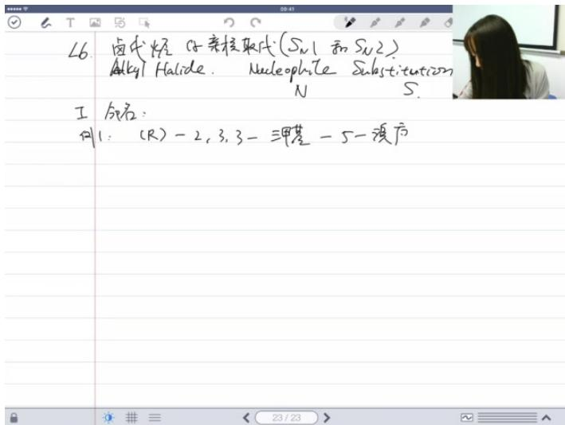

text_image

∠6
卤代烃 0-亲接取代(Sw1 和 Su2)
Alkyl Halide. Nucleophile Substitution
N S.
工名:
例1: (R)-2,3,3- 三甲基-5-溴仿

# ● 题目解析

○ 母体结构: 7个碳的烷烃（庚烷）

# ○ 取代基位置:

2号位：甲基  
■ 3号位：两个甲基  
5号位：溴原子

# ○ 立体构型判断:

5号碳为手性中心  
取代基优先级：Br > 左侧取代基 > 乙基 > H  
■ R构型表示顺时针排列，Br在纸面前方（楔形线表示）

# 3）例题2：命名2R,3R-三甲基-二溴戊烷 24:00

# ● 题目解析

○ 母体结构: 5个碳的烷烃（戊烷）

# ○ 取代基位置:

■ 2号位：溴原子  
■ 3号位：溴原子和甲基

# ○ 立体构型判断:

■ 2号碳：Br（最大）>右侧取代基>甲基>H→R构型  
■ 3号碳：Br相连碳（最大）>乙基>甲基>H→R构型  
■ 两个溴原子均朝外（楔形线表示）

# 2. 碳正离子的稳定性 25:01

# 1）碳正离子稳定性影响因素

# ● 主要稳定机制

- 电荷分散原理：正电荷被分散程度越高，碳正离子越稳定  
○ 共轭效应：通过 $\pi$ 电子离域稳定正电荷，p轨道肩并肩重叠方式使电子云有效分散  
○ 超共轭效应：σ键电子与空p轨道部分重叠，但效果弱于共轭（典型例子：叔碳正离子稳定性>仲碳>伯  
○ 轨道重叠效率：共轭效应中轨道平行重叠效率（约70-80%）显著高于超共轭的斜向重叠（约20-30%）

# ● 特殊稳定因素

# ○ 诱导效应：

■ 吸电子基团（如 $-NO_{2}$ ）增加正电荷密度，降低稳定性  
■ 给电子基团（如 $-OCH_{3}$ ）通过σ键传递电子，分散正电荷

位阻效应：大体积基团（如叔丁基）空间阻碍使反应物难以接近，动力学稳定

场效应：空间电荷相互作用（如 $\delta^{+}$ 与 $\delta^{-}$ 的静电吸引），作用距离比诱导效应更远

○ 键角张力：桥头碳无法达到 $sp^{2}$ 杂化的理想120°键角，导致稳定性显著下降（如降冰片基碳正离子）

\- 共振与杂化效应

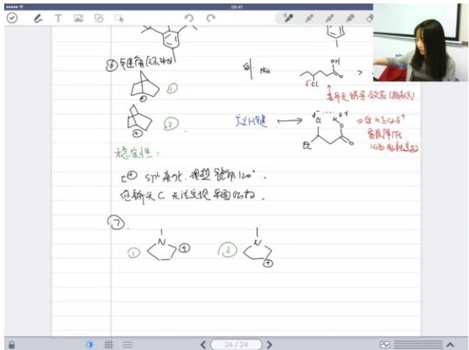

text_image

①
②
③
④
⑤
⑥
⑦
⑧ 气键角(反水)
⑨ ⑩
⑪
⑫
⑬
⑭
⑮
⑯
⑰
⑱
⑲
⑳
㉑
㉒
㉓
㉔
㉕
㉖
㉗
㉘
㉙
㉚
㉛
㉜
㉝
㉞
㉟
㉳
㉴
㉵
㉜
㉝
㉞
㉟
㉞
㉟
㉞
㉟
㉞
㉞
㉟
㉞
㉟
㉞
㉟
㉞
㉟
㉞
㉟
㉞
㉟
㉞
㉟
㉞
㉟
㉞
㉟
㉞
㉟
㉞
㉟
㉞
㉟
㉞
㉟
㉞
㉟
㉞
㉟
㉞
㉟
㉞
㉟
㉞

杂化匹配：当N/O的孤对电子与空p轨道能形成有效重叠时（如烯丙胺型体系），可产生显著稳定作用  
○ 共振离域：正电荷在多个原子间离域（典型例子：苄基型>烯丙基型碳正离子）  
广义氢键：符合IUPAC定义的 $\delta^{+}\mathrm{H}$ 与杂原子间相互作用，属于场效应特例

# 2）稳定性比较例题解析 29:32

● 共轭vs超共轭 34:39

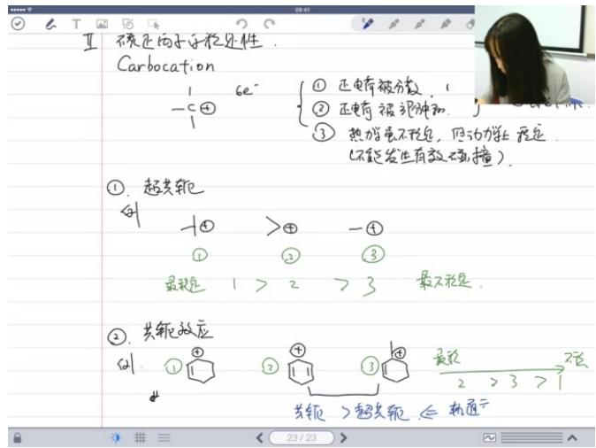

text_image

Ⅱ 不满足的子反应特性.
Carbocation
1 6e⁻
- c⊕
① 正电荷被分散，（
② 正电荷被饱和和。
③ 热发展不稳定，但动力学反应
（不能发生有效振动量）.
①. 超共轭
侧
- ① >⊕ - ④
① ② ③
最短 1 > 2 > 3 最大短足.
②. 共轭效应
侧
① ② ③
2 > 3 > 1
共轭 >超共轭 ⇌ 轨直二

○
○ 题目解析

■ 关键识别：共轭体系（双键连接）与超共轭体系（单键连接）的稳定性差异  
■ 分析要点：共轭效应使正电荷在3个碳上离域 vs 超共轭仅在2个碳间作用  
■ 答案：共轭体系（结构1）>超共轭体系（结构2）>孤立碳正离子（结构3）  
■ 易错点：忽略共轭体系扩展范围，仅比较取代基数量

● 诱导效应题 37:38

○ 题目解析

■ 关键词识别：吸电子基团（如 -Cl）的诱导效应  
■ 分析要点：吸电子基使正电荷更集中，稳定性顺序与诱导效应强度相反  
■ 答案：无吸电子基（结构3）>间位吸电子基（结构1）>邻位吸电子基（结构2）  
■ 记忆口诀："吸电子加剧缺电子，给电子缓解正电荷"

\- 桥头碳稳定性 40:47

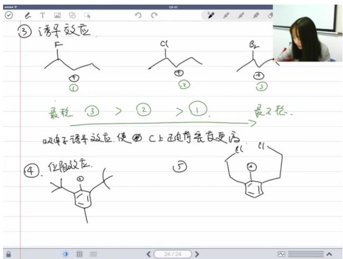

text_image

③ 诱导效应
F
①
②
③
最稳 ③ > ② > ①. 最不稳.
吸电子诱导效应,使④C上连续密度更高.
④ 位阻效应.
⑤

# ○ ○ 题目解析

■ 结构特征识别：刚性环系限制键角调整能力  
■ 分析要点：桥头碳无法实现平面 $sp^{2}$ 构型，空p轨道不能有效重叠  
■ 答案：非桥头碳正离子（结构2）>桥头碳正离子（结构1）  
考点延伸：双环[2.2.1]庚烷体系桥头碳反应活性极低

# - 离域范围比较 52:17

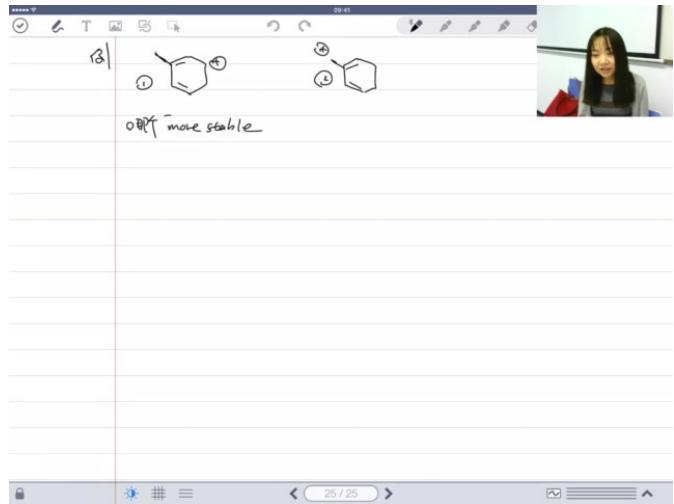

text_image

例
①
②
③
哪个 move stable
25/25

# ○ ○ 题目解析

■ 离域路径分析：正电荷可通过共振在3个或2个碳原子间移动   
■ 画共振式技巧：用箭头表示电子对移动，标注所有可能共振结构  
■ 答案：五元环体系（结构1）>线性共轭体系（结构2）  
■ 注意事项：离域碳原子数相同不代表稳定程度相同，需具体分析离域路径

# 3. 休息 56:57

# 1）太阳粒子重排介绍 57:02

● 杂化类型影响: 在一环结构中, 5个 $SP^{2}$ 杂化碳和1个 $SP^{3}$ 杂化碳理论上应共平面, 但 $SP^{3}$ 杂化碳因键角限制会产生空间张力

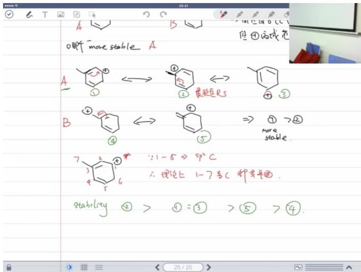

text_image

A
B
① ② ③
④ 更矩 R5
⑤ ⑥ ⑦ >⑧ more stable.
7 2 3 4 5
6
? 1-5 ⇒ Sp²C
六 理论上 1-7号C 邵共平硒。
stability ② > ① = ③ > ⑤ > ④.

2）碳正离子稳定性讨论 58:03  
● 共振效应：成环共轭体系的稳定性优于支链共轭体系，判断稳定性需同时考虑共振结构数量和单个结构的稳定性  
● 权重因素：越稳定的共振结构在整体体系中贡献权重越大，有时少量但更稳定的共振结构可能比大量较不稳定的结构更重要  
3）共振结构对稳定性的影响 59:01  
- 分析方法：通过绘制所有可能的共振结构来评估稳定性，需比较：①电荷分布范围 ②各共振结构的固有稳定性

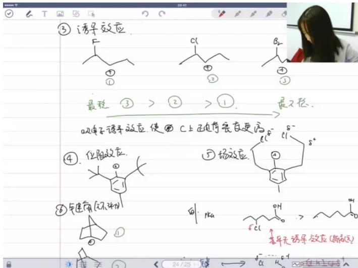

text_image

③ 诱导效应
最稳 ③ > ② > ① 最不稳.
双离子诱导效应.使④ C上迅速衰变更剧烈
④ 化阳效应.
⑤ 场效应.
⑥ 键角(不等) ①
⑦ 诱导无诱导效应(渐减)

4）碳正离子稳定性排序 01:00:03

● 稳定性序列: 2号碳正离子 > 1号 = 3号 > 5号 > 4号，其中1号和3号稳定性相同

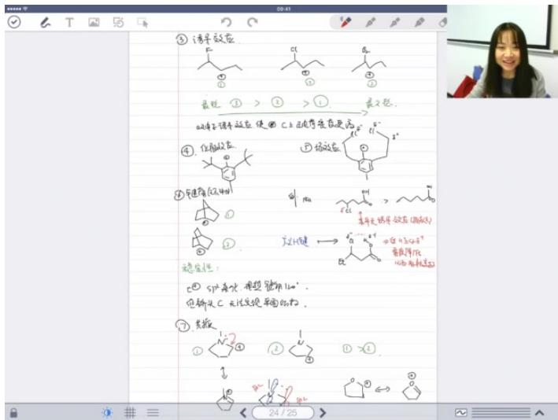

text_image

③ 诱导效应
①
② > ③ > ①
最终 ③ > ④ > ①
②对子键来效应:使③C上出现变质更亮。
④.作用效应
⑤场效应
⑥变速角(从x轴)
⑦
⑧
⑨
⑩
⑪
⑫
稳定性:
⑬ SP↑突起,理想开始100°.
⑭ 解决C无位发现平面结构.
⑦ 共振
①
②
③
④ > ⑤
⑤
24/25

5）桥头碳原子平面结构讨论 01:04:31  
- 结构限制：桥头碳无法形成平面结构（ $SP^{2}$ 杂化要求的120°键角），因为环张力会迫使桥上键角接近90°，导致严重空间位阻  
● 刚性原因: 双环结构的几何约束使桥头碳保持 $SP^{3}$ 杂化状态，无法实现平面构型

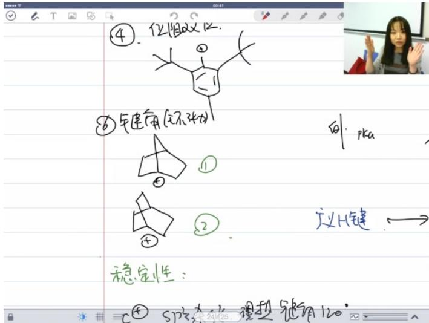

text_image

④. 位图双x12.
⑥键角(不平移)
①
②
稳定性：
④ SP35+4 理势 锐A 120°

4. 碳正离子的重排 01:06:48

1）碳正离子稳定性的回顾 01:06:59   
● 稳定性规律: 三级碳正离子 > 二级 > 一级，主要由超共轭效应决定

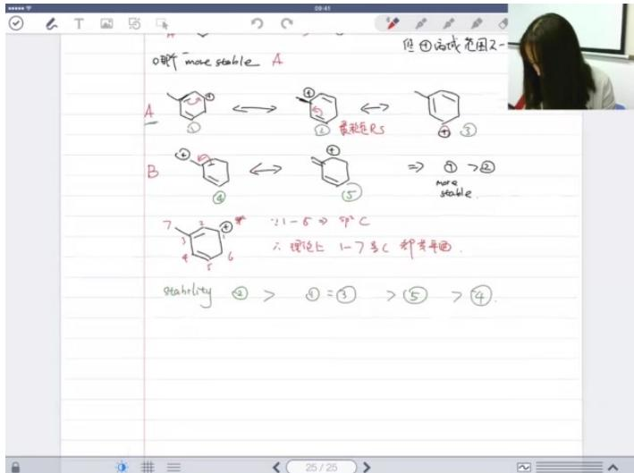

text_image

① ④ 西域范围又
A
B
3 4 5 6 7 8 9 10 11 12 13 14 15 16 17 18 19 20 21 22 23 24 25 26 27 28 29 30 31 32 33 34 35 36 37 38 39 40 41 42 43 44 45 46 47 48 49 50 51 52 53 54 55 56 57 58 59 60
?1-5→90°C
△理论比1-7%C却共半②.
Stahlity ②＞④=③＞⑤＞④
25/25

2）碳正离子重排的定义 01:07:36

● 本质: 从不稳定的碳正离子通过结构重组形成更稳定的碳正离子, 类似于"强酸制弱酸"的能量驱动过程  
3）碳正离子重排的原理 01:08:17  
● 电子迁移: σ键电子对向空p轨道迁移, 形成新的碳正离子中心

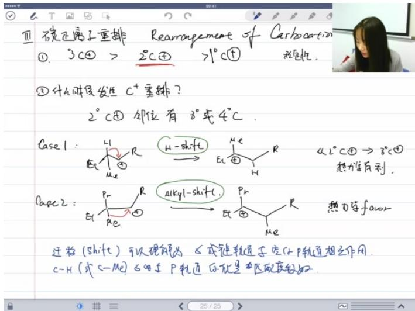

text_image

碳正离子重排 Rearrangement of Carbocation
①. 3C④ > 2°C④ >10°C① 气包性.
③什么时候发出 C+ 塞排？
2°C⑤ 邻位有 3°C或4°C.
Case 1: 
Et
Me
H-shift
→
Et
Me
H
Alkyl-shift
→
Et
Me
Pr
热力等 favor
csc2: 
Et
Me
Alkyl-shift.
Pr
Me
热力等 favor
迁移 (Shift) 可以理能为 < 成键轨道子空化 P 轨道相互作用。
C-H (式 C-Me) < 时 P 轨道 优化是 匹配度数为 2.

4）碳正离子重排的发生条件 01:09:12

● 典型情况: 当二级碳正离子相邻位置存在三级或四级碳时易发生重排  
● 结构特征: 迁移基团与碳正离子中心必须处于适当空间位置（通常为邻位）

5）碳正离子重排的案例解析 01:09:45

Case 1: 二级碳正离子邻位为三级碳（连有H、甲基、乙基）时发生H迁移  
Case 2: 当邻位三级碳连接甲基、乙基、丙基等较大基团时发生甲基迁移

6）迁移原理：sigma键与p轨道的相互作用 01:13:08

● 轨道作用: 迁移本质是σ成键轨道与碳正离子空p轨道的相互作用  
● 类比关系: 类似超共轭效应，轨道能量匹配度决定迁移难易程度

7）迁移优先级：小基团优先迁移 01:15:31

● 选择规律:优先迁移H或小基团（如甲基），因为其σ键轨道与p轨道能量匹配更好  
● 能量因素: C-H键的σ轨道能量最适合与空p轨道相互作用，因此H迁移最常见

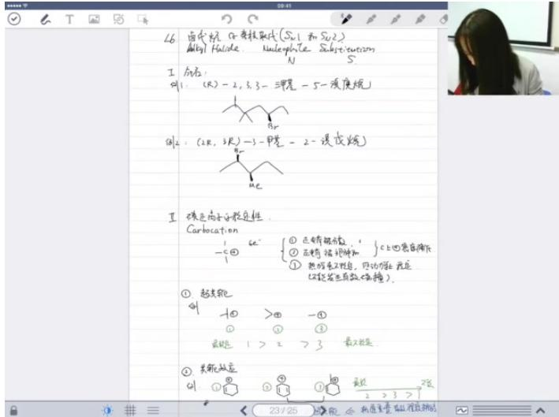

text_image

46 酶烷 (2-苯基双烷) (Si 2 和 Si 2)
Alkyl Halide: Nucleophite Substituism
I 后右:
则1: (R)-2,3,3-三溴-5-溴庚烷
则2: (2R,3R)-3-甲烷-2-溴戊烷
Ⅱ 碳定向子小粒定性
Carlocat ion
-1① 6e⁻ {① 在磷酸含量，② 正有碳键增加} <上④氢后磷化
① 热时未见反应，但功能为反应
(2起发生后数减量)
① 超氧化
例 -1① >④ -①
① ① ③
氢键 1 > 2 > 3 最不反应
② 关联化反应
例 ① ③ ⑤ ⑥ 最近 2 > 3 > 1
Z3/25 气泡 ⇌ 制液重叠 出泡反应酶

5. 卤代烃的亲核取代反应 01:16:36

1）亲核取代反应(SN1与SN2)  
SN2反应机理

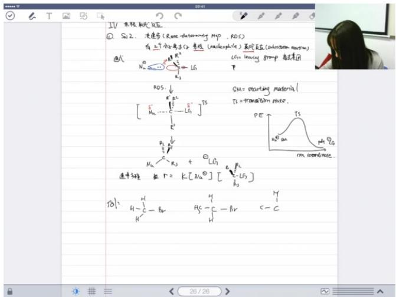

text_image

IV 系列:氧化还原
① Si2. 水速率(Rose-determining MPa, RDS)
有 2个离子基态 Cp 基因(Leadolephile)基线反应(adsorption reaction)
程式
N=O
R2
L5v
P
lys
P
lys
R2
L5v
P
RO5
↓
E
R2
[ Nm —— C —— LG ]
TS
PE
Ts
H2O μm
ρM ΘG
cm coordinates.
QM = accelerating material
TS = transition state.
PE
Mn —— C —— R2 + ΘLG
H2O μm
速率稳定：R = K [ Nm® ] [ C —— LG ]
TRI:
H-C-Rr
H2S-C-Rr
c-C
20/26

# 基本特征：

■ 双分子反应，有2个分子参与（亲核试剂Nu和底物）  
■ 反应速率方程： $r = k[Nu][SM]$   
■ 反应活性顺序:

# ○ 决定因素：

■ 空间位阻效应是主要影响因素  
■ 碳原子周围取代基(R1,R2,R3)越大，反应越难进行  
■ 活化能越高，反应速率越慢

# ○ 立体化学:

■ 亲核试剂从离去基团背面进攻   
■ 产物构型发生翻转（Walden反转）  
■ 过渡态为五配位结构

# SN1反应机理

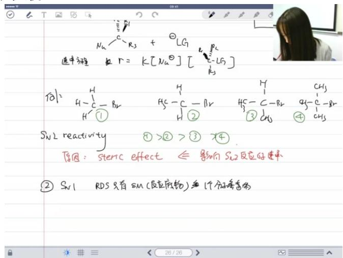

text_image

Nₐ + ②LG
速中方程 k r = K [Nₐ] [E-LG]
H H H CH₃
H-C-Br Hc-C-Br Hc-C-Br g-C-Br
H ① H ② d₀ ④ CH₃
SNI reactivity ① >② >③ >④
原因：steric effect ≤ 影响 SNI 反应好速率
② SNI RDS 只有 SM（反应底物）为 1个分子条件的

# 基本特征：

■ 单分子反应，仅底物参与决速步  
■ 反应速率方程： $r = k[SM]$   
■ 两步反应机理：  
- 离去基团解离形成碳正离子   
● 亲核试剂快速进攻碳正离子

# ○ 立体化学:

■ 生成平面型碳正离子中间体  
■ 理论上得到外消旋混合物  
■ 实际存在离子对效应，构型翻转产物略多

# ○ 决定因素：

■ 碳正离子稳定性是关键   
■ 溶剂效应显著影响反应速率

# - 反应对比

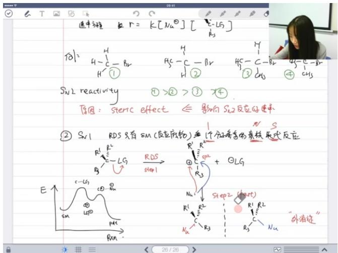

text_image

速申过程
R = k [Na⁺] [C-LG]
H
H
H
H
①
H
H
②
H
③
CH3
Sn2 reactivity
④ >② >③ >④
原因：sterc effect ≤ 影响 Sn2 反应的速率
② Sn1 RDS 只有 Sm（反应底物）和 个子等离子素核取代反应
RDS
step1
R1
R2
R3
Sg2
+ OLG
N4
Step2 (start)
R1
R2
R3
N4
“外滴定”

# ○ 机理差异：

■ SN2：协同一步反应，过渡态能量高  
■ SN1：分步反应，碳正离子中间体稳定

# ○ 立体化学差异:

■ SN2：构型必然翻转  
■ SN1：主要得外消旋体，可能有少量构型保持

# 影响因素对比表:

| 因素 | SN2反应影响 | SN1反应影响 |

|----|----|----|

| 底物结构 | 位阻抑制 | 碳正稳定性促进 |

| 亲核试剂浓度 | 直接影响速率 | 不影响决速步 |

| 离去基团性质 | 两者均重要 | 两者均重要 |

○ | 溶剂极性 | 低极性有利 | 高极性有利 |

# ● 例题：反应机理判断

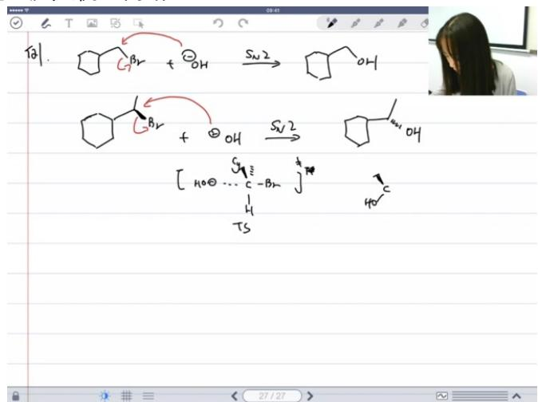

chemical

Hand-drawn chemical reaction scheme showing transformation of cyclohexane derivatives with reagents and products

# ○ ○ 题目解析

■ 关键点：识别亲核试剂和离去基团   
■ 立体化学分析：必须考虑构型翻转  
■ 反应条件判断：强亲核试剂利于SN2  
■ 答案：明确写出产物立体构型

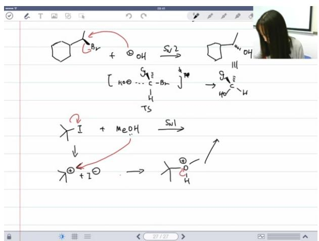

chemical

Hand-drawn chemical reaction scheme showing transformation of cyclohexane with bromine and hydroxyl groups, followed by radical addition to form a radical intermediate.

# ○ 题目解析

■ 关键点：识别碳正离子形成步骤   
■ 溶剂效应：极性溶剂促进SN1   
■ 产物分析：考虑外消旋化可能性  
■ 答案：包含可能的离子对效应产物

# 6. 什么时候发生SN1或SN2反应 01:42:19

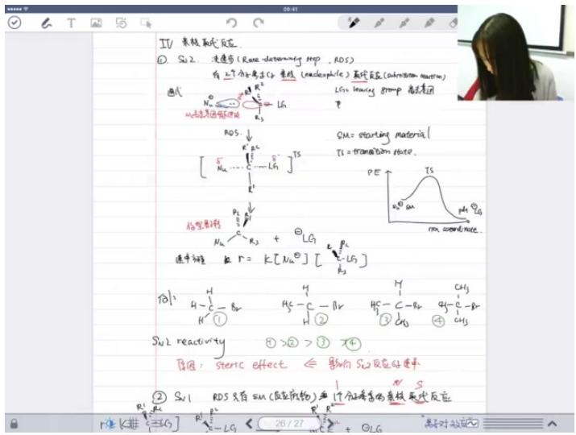

text_image

Ⅱ 素核反应
① Si2. 快速变(Rose-determining HMP, RDS)
有上个分体离子/氮(weak/nucleophile)基态反应(adsorption mechanism)
图式
LGS: lowlyg group 气去团团
从水表生成液体
RDS↓
QM=starting material
[Fe(Cu₂O₃)₃]T₅=transformational mode.
PE
TS
H₂O₃Cu
m-oxide/mole
物理量程
μ₀C-R₃+ LG
速率/饱和 H r = K [Na⁺][C-LG]
H
H
H
CH₃
4
H₅-C-Br
H ②
4S-C-R₂
4S-C-R₃
③ b₁
④ CH₃
SW2 reactivity ① >② >③ >④
原因: steric effect ≤ 影响 Si₂ 反应的速率
② SW1 RDS与SiM(反应产物)键 1个分体离子的量被取代反应
R' R' R'
F值: (±LG) R' R' C-LG < 26/27 m⁻² + LG 离子对反应

# SN2反应特征:

- 决速步参与分子数: 2个分子参与（亲核试剂和底物）  
- 速率方程: $r = k[Nu][R - LG]$ ，表现为二级反应动力学  
○ 立体化学: 发生构型翻转（Walden反转）  
○ 空间效应影响: 位阻会显著降低反应速率（如 $CH_{3}>1^{\circ}>2^{\circ}>3^{\circ}$ 的活性顺序）

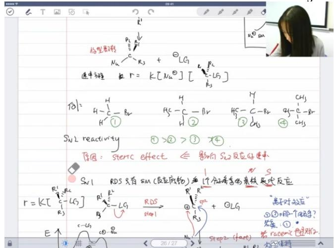

text_image

R1
P2
↓
Cu
N2
C-R3 + LG
速中方程 R = K [Na] [C-LG]
TO1: H-H-C-Br
H ①
H3-C-Br
H ②
H3-C-Br
③ CH3
CH3
SN2 reactivity ① >② >③ >④
原因：sterc effect ≤ 影响 Si2 反应的速率
Sv1 RDS 只有 SM (反应底物) 每个分子等离子的氧原子反应
r = K [C-LG]
R1 R2
C-LG
RDS
Step1
④ C-R3 + LG
“离子对效应”
①②哪一个反应？
答案：①●
E ↑
C-LG C-O4
Step2 (face)
若 racemic 也是对子
26/27

# SN1反应特征:

- 决速步参与分子数: 仅底物1个分子参与   
- 速率方程: $r = k[R - LG]$ ，表现为一级反应动力学  
- 离子对效应: 反应过程中会形成离子对中间体  
○ 立体化学: 可能产生外消旋化（但受离子对效应影响）

# 1）影响反应机理的因素

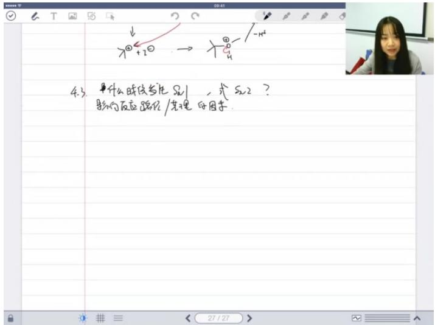

text_image

4.3. 什么是居住变化、一式S22？
影响反应路径/原理的因素。

# 四大影响因素:

- 底物结构: 叔碳底物倾向SN1，伯碳倾向SN2  
○ 离去基团: 好的离去基团（如 $I^{-}, Br^{-}$ ）促进两种机理  
- 亲核试剂: 强亲核试剂促进SN2，弱亲核试剂倾向SN1   
- 溶剂效应: 极性溶剂促进SN1，非极性溶剂有利SN2

# - 反应本质分析

○ 反应通式:  
无论SN1还是SN2，核心都是离去基团(LG)被亲核试剂(Nu)取代  
○ 机理判断需要综合分析底物、试剂、溶剂等条件

# 研究方法

○ 物理有机化学方法:

■ 通过实验数据（如动力学测定）和理论计算  
■ 分析反应物结构到产物的可能路径  
■ 比较不同路径的能量变化和过渡态稳定性

# 7. 影响反应路径或机理的因素 01:45:04

# 1）烷基部分的影响 01:45:52

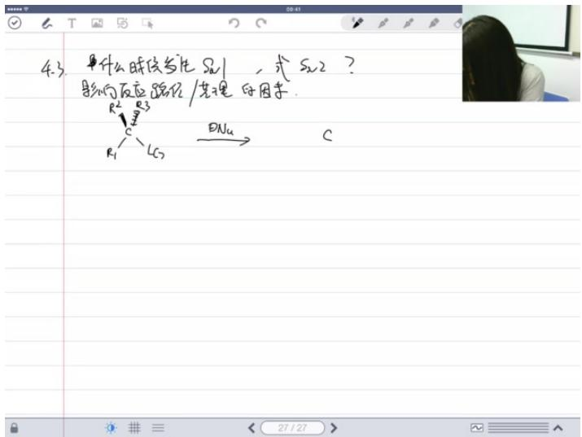

text_image

4.3 什么是时候与生S21，式S22？
影响反应路径/原理的因果.
R² R³
C L₃ DNu C

● SN2反应速率规律： $3^{\circ}C < 2^{\circ}C < 1^{\circ}C$ ，三级碳反应速率最慢，一级碳最快  
● 位阻效应解释：空间位阻越大，反应活化能越高，导致反应速度越慢  
● SN1反应决定因素：反应经历碳正离子中间体，其稳定性决定反应速率  
● SN1反应速率规律： $3^{\circ}C > 2^{\circ}C > 1^{\circ}C$ ，三级碳正离子最稳定，反应最快  
- 反应类型判断：

三级碳连接离去基团通常发生SN1反应  
- 一级碳连接离去基团通常发生SN2反应  
- 二级碳需结合其他影响因素综合判断

# 2）离去集团的影响 01:48:40

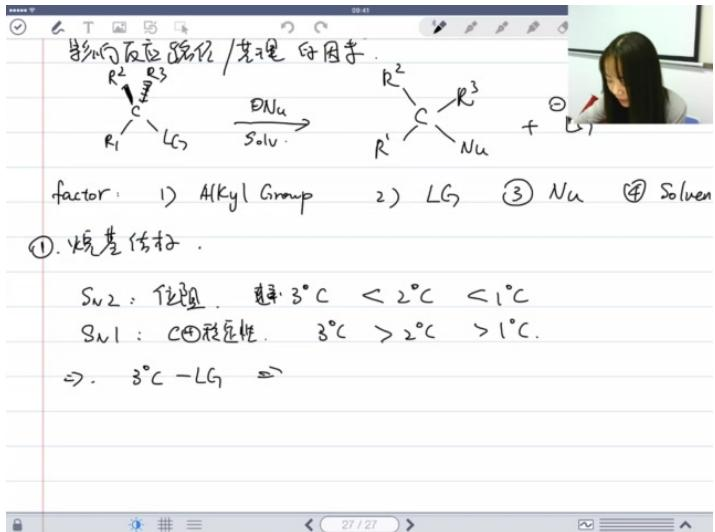

text_image

影响反应路径 / 某理 的因素
R² R³
C Ls
DNu
Solv
R² R³
C Nu
②
factor: 1) Al(Kyl Group 2) LG ③ Nu ④ Soluen
①. 烷基传标
Sv2: 位阻. 静3℃ <2℃ <1℃
Sn1: C④稳定性. 3℃ >2℃ >1℃.
⇒. 3℃ - LG ≈
21/27

● 影响程度比较：对SN1反应影响更大（SN1速率方程仅包含底物项）  
● 好的离去基团特征：能稳定分散负电荷  
- 典型例子：

\- 优秀离去基团： $I^{-}$ 、 $Br^{-}$ 、 $Cl^{-}$ 、 $OTs^{-}$ 、 $H_{2}O$

○ 差离去基团： $NH_{2}^{-}$ 、 $OH^{-}$ （碱性太强）

● SN1反应要求：需要"非常好"的离去基团  
● SN2反应要求：只需"好"的离去基团  
● 特殊案例：碘离子既是好的离去基团又是好的亲核试剂

# 3）亲核试剂的影响 01:54:33

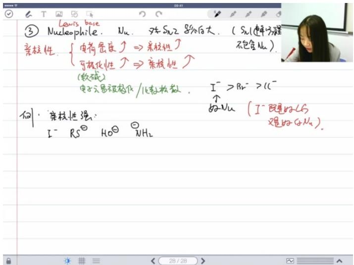

text_image

Lewis base
③ Nucleophile. Nu. 对Sn28%后大. (Sn(速率方程
亲核性. { 电荷密度↑ ⇒ 亲核性↑ 不包含Nu.)
可极化性 ↑ ⇒ 亲核性 ↑
(软碱)
电子元素极极化/位数极数. I⁻ > Br⁻ > Cl⁻
↑
侧: 柒枝性强:
I⁻ Rs²⁺ HO²⁺ NH₂
好Nu (I⁻既是的LS
又是好(子Nu).

● 影响范围：主要影响SN2反应（SN1速率方程不含亲核试剂项）  
● 亲核性决定因素：

○ 电荷密度：密度越大亲核性越强  
- 可极化性：电子云越松散越易极化，亲核性越强

# ● 典型亲核试剂：

○ 强亲核试剂： $I^{-}$ 、 $RS^{-}$ 、 $OH^{-}$ 、 $NH_{2}^{-}$   
- 弱亲核试剂：H₂O等中性分子

# ● 特殊现象：

- 碘离子虽碱性弱但亲核性强（因可极化性高）  
- 硫醇类（如RS $^{-}$ ）因硫原子半径大而亲核性强

# 4）溶剂效应 02:02:17

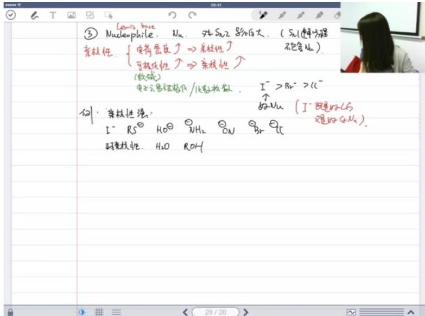

text_image

③ Nucleophile. Na 65Sn2 80%后大. (Sn(速率为稀
亲枝性. {电荷密度} ⇒亲枝性 ⇒ 不包含Na.
可极化性 ⇒亲枝性 ↑
(数减)
电子元素被替代/比数和数. I⁻ >Br⁻ >1C⁻
↑
如-Na (I⁻既是好∠S
侧:亲枝性强:
I⁻ Rs⁺ HO⁻ NH₂ ON Br⁻ Cl 又好的Na).
对亲枝性. H₂O ROH

# - 极性溶剂影响：

- 促进SN1反应：能稳定碳正离子中间体  
○ 抑制SN2反应：溶剂化效应会阻碍亲核试剂接近

# ● 非极性溶剂影响：

- 不利于SN1反应  
- 有利于SN2反应

# ● 质子性溶剂影响：

- 可通过氢键稳定离去基团  
- 但可能使亲核试剂溶剂化

# ● 偶极非质子溶剂：

○ 如DMSO、DMF   
○ 能溶解离子但不形成强氢键  
- 特别有利于SN2反应

# 8. 容积效应 02:09:39

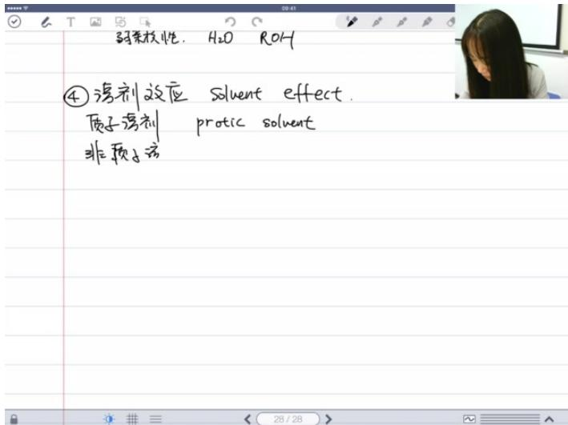

text_image

弱亲极性. H₂O ROH
④溶剂效应 solvent effect.
质子溶剂 protic solvent
非质子溶

# 1）溶剂分类

● 基本分类：溶剂分为质子溶剂(protic solvent)和非质子溶剂(aprotic solvent)两大类   
● 质子溶剂特征：可以形成氢键的溶剂，分子式为 $H_{2}O$ 、ROH、 $NH_{3}$ 等

○ 常见例子：水、氨、醇类

● 非质子溶剂特征：不能形成氢键的溶剂

极性非质子溶剂例子：DMSO( $(CH_{3})_{2}SO$ )、DMF( $(CH_{3})_{2}NCHO$ )、HMPA、丙酮( $CH_{3}COCH_{3}$ )、乙腈( $CH_{3}CN$ )、二氯甲烷( $CH_{2}Cl_{2}$ )  
- 特点：都具有强极性，含有吸电子基团如双键氧

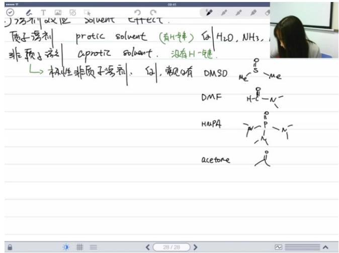

text_image

质子溶剂 | protic solvent (有H⁻键) 仅 | H₂O, NH₃,
非质子溶剂 | aprotic solvent. 没有H⁻键.
→ 杆性非质子溶剂，仅，常见的 DMSO Me⁻¹⁻ me
DMF H-C-N-
HHPA P-M-N-
acetone

2）溶剂稳定作用机制

● 质子溶剂稳定特点：

○ 既能稳定带正电荷的物种 $(\delta^{+})$ ，也能稳定带负电荷的物种 $(\delta^{-})$   
○ 通过氢键作用实现稳定

● 极性非质子溶剂稳定特点：

○ 主要稳定带正电荷的物种( $\delta^{+}$ )  
○ 通过偶极-偶极相互作用实现稳定

3）溶剂效应对SN反应的影响

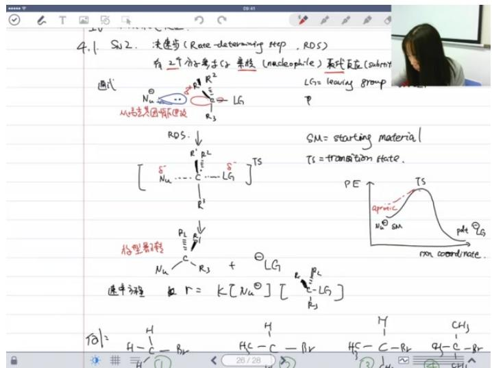

text_image

4.1. Si2. 决速步 (Rate-determining step, RDS)
有 2 个分子表示 G 集核 (nucleophile) 系列反应 (substrate)
从光束集团最后建设
LG = leaving group
P
RDS. ↓
SM = starting material
R' RL
[ S'
Na ... C ... LG ]
R' TS
PE TS
apATIC
Nₐ Θ SM
pH LG
no coordinate.
格型素转移
PL
Nu c R3 + Θ LG
Rc
速率方程 k r = k [ Na° ] [ E-LG ]
Rj
H H CH3
H-C-Br HC-C-Br HC-C-Br CH3
2 Jm ① 26/28

\- 对SN2反应的影响：

- 极性非质子溶剂会推高SN2反应起始物的能量  
○ 使活化能 $(E_{a})$ 降低，反应速率加快  
- 原因：对负离子的溶剂化作用弱

\- 对SN1反应的影响：

- 质子溶剂能同时稳定碳正离子和离去基团  
○ 通过降低过渡态能量使活化能 $(E_{a})$ 降低

# - 原因：对正负离子都有良好的溶剂化作用

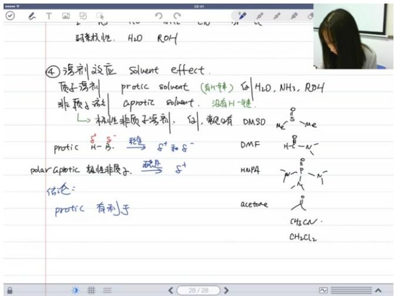

text_image

弱素特性. H₂O ROH
④溶剂效应 Solvent effect.
质子溶剂 protic solvent (有H⁻等) 向H₂O, NH₃, ROH
非酸子溶剂 aprotic solvent. 没有H⁻键.
→ 板性非质子溶剂. 仅, 观见OH DMSD ME S Me
protic H-或 稳 → δ⁺和δ⁻ DMF H-C-N-
polar aprotic 粗性非质子. 酸是 δ⁺ HNPA P-M-
结论:
protic 有利于 acetone CH₃CAV.
CH₂Cl₂

# 4）重要结论

● 质子溶剂：有利于SN1反应  
● 极性非质子溶剂：有利于SN2反应  
● 特殊现象：

\- 氟离子 $(F^{-})$ 在质子溶剂中是弱亲核试剂，在极性非质子溶剂中是强亲核试剂

\- 中性亲核试剂受溶剂效应影响较小

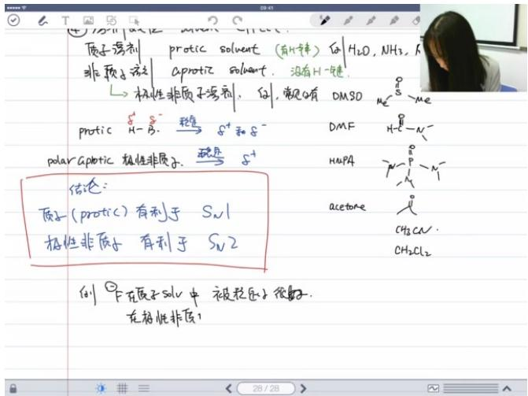

text_image

质子溶剂 | protic solvent (有H⁻定律) 向H₂O, NH₃, H⁺
非预离子法 | aprotic solvent. 没有H⁻定律.
→ 杂性非质子溶剂, 向H⁺, 额度只有 DMSO Me⁻-Me
protic H-B⁻ 稳定 δ⁺和δ⁻ DMF H-E-N⁻
polar aprotic 极性非质子. 稳定 δ⁺ HMPA P-H-N⁻
结论:
质子 (protic) 有利于 S₂1 acetone CH₃CN.
极性非质子 有利于 S₂2 CH₂Cl₂
例 F 在质子Solv中 被极性非质子.
在极性非质子!

# 5）记忆要点

● 核心记忆：质子溶剂→SN1；极性非质子溶剂→SN2   
● 理解关键：溶剂对不同电荷的稳定能力差异  
● 应用技巧：通过溶剂类型可辅助判断反应机理

# 9. 应用案例 02:21:18

# 1）例题:SN1和SN2判断

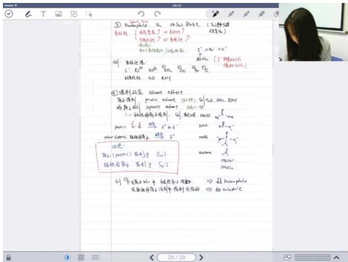

text_image

③ Nucleophore: H₂ → H₂SO₄ (Si(碳中硼)
重铬: 有高重量J → 高重量J
→ 碳化铁 J → 高镍铁 J
(氧化铁)
H₂O 与碳中硼结合/比碳相键，J" > H₂" > H₂"
①. 高镍铁现象:
5. H₂O  H₂O  NH₃  O₂  H₂O  H₂O
的硫化铁：H₂O 碳化铁

④ 溶制反应: Solvent effect
废水溶剂: pratic solvent (碳中钙) G | H₂O, NH₃, R2H
酸钾生成物: apenta hydroxide, 气相比氢
→ 钠铬释放离子溶剂, G₁, 酸化碳 CO₃SO₄
protic H₂O → H₂O + H₂O
near protonic 轴格排放量：200 g S¹
结论:
原子 (proton C) 奇形子 Sᵥ1
核性核原子 奇形子 Sᵥ2
例: H₂O 在原子上加入核燃料子吸收。
在核性排放下, 浓解中, 溶制并保持好 ⇒ √δ Nucleophore
在核性排放下, 浓解中, 溶制并保持好 ⇒ √δ nucleophole

# - 溶剂效应关键点：

○ 质子溶剂：有利于 $S_{N}$ 1反应（如甲醇）  
- 极性非质子溶剂：有利于 $S_{N}2$ 反应（如DMSO）  
○ 非质子溶剂特点：无酸性氢（如DMF）

# 2）例题:SN1和SN2判断 02:23:12

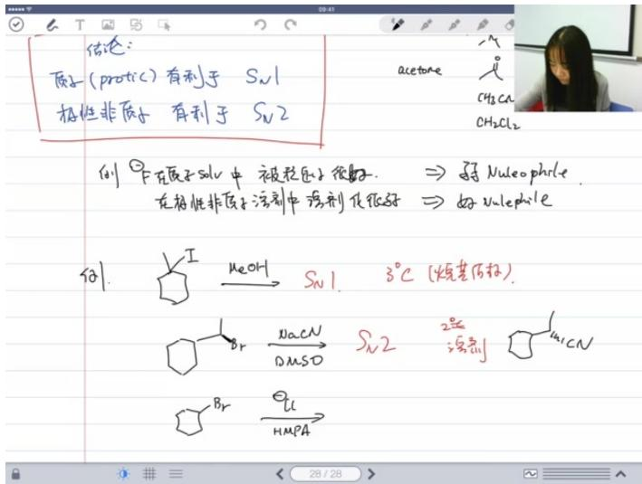

text_image

结论：
原子（protic）有利于 Sn1
极性非质子 有利于 Sn2
倒① 在质子solv中 被积压小很好. ⇒ 防 Nuleophile
在极性非质子溶剂中 浑剂化很好 ⇒ 防 vulephile
倒②. → MeOH Sn1 3℃（烷基仿标）
→ NaCN → Sn2 2℃ 溶剂 → HMPA

# - 烷基结构判断原则：

三级碳：优先考虑 $S_{N}1$ （生成稳定碳正离子）  
○ 验证要素：

■ 离去基团质量（碘离子 $I^{-}$ 是优良离去基团）  
■ 溶剂性质（甲醇是质子溶剂）

○ 典型案例：三级碳溴化物在甲醇中发生 $S_{N}1$

# 3）例题:SN1和SN2判断 02:25:22

# - 二级碳反应特点：

○ 判断流程：

■ 烷基结构（二级碳不确定）  
■ 离去基团（溴离子 $Br^{-}$ 良好）  
■ 亲核试剂（氰基CN $^{-}$ 优良）  
■ 决定性因素：DMSO溶剂（强极性非质子）

○ 产物特征： $S_{N}2$ 反应必然伴随构型翻转（configuration inversion）

# 4）例题:SN1和SN2判断 02:27:03

# HMPA溶剂反应：

○ 关键识别：HMPA属于极性非质子溶剂  
○ 反应特征：

■ 二级碳结构  
■ 优良亲核试剂 ( $Cl^{-}$ )  
■ 极性非质子溶剂条件

○ 结论： $S_{N}2$ 反应为主

5）例题:反应类型判断 02:29:31

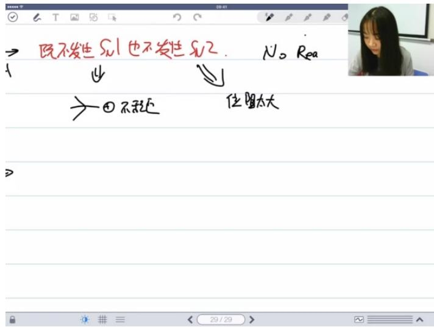

text_image

既不发生Sul也不发生Sul2. No Rea
④不犯住图太大

\- 异常情况分析：

○ 一级碳不反应原因：

■ $S_{N}$ 1受阻：碳正离子不稳定  
■ $S_{N}2$ 受阻：空间位阻过大

○ 典型案例：2-甲基-1-溴丙烷在质子溶剂中不反应

6）例题:反应类型判断 02:32:08

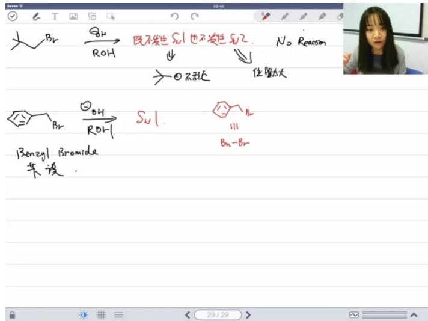

text_image

Br
→
OH
ROH
既不发生Sv1也不发生Sv2.
↓
NO Reaction
→①不成立
位置太大
Br
→
OH
ROH
Sv1.
Bn-Br
Benzyl Bromide
苯设.

● 芋基结构特殊性：

○ 结构特征： $Ph-CH_{2}$ - （一级碳但共轭稳定）  
○ 反应特点：

■ 质子溶剂条件下发生 $S_{N}1$   
■ 碳正离子通过苯环共轭稳定

\- 对比实验：在DMF中会转为 $S_{N}2$

7）例题:反应类型判断 02:34:30

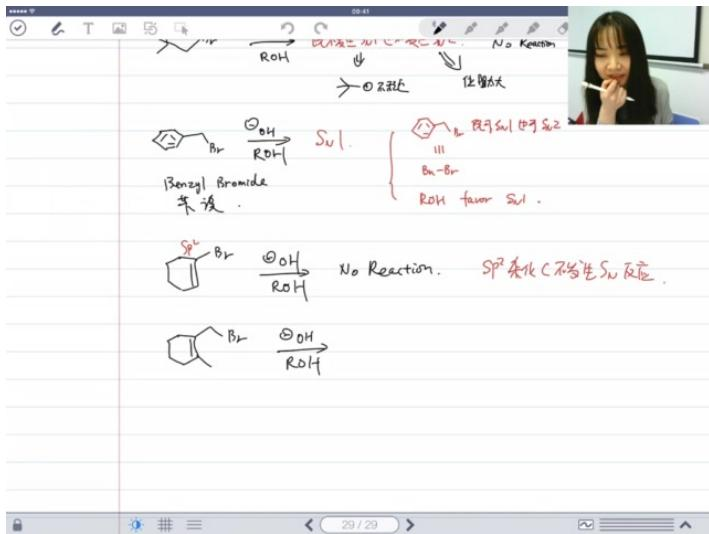

chemical

Handwritten chemical reaction equations showing bromination and hydrolysis of benzyl bromide with SO2 reduction

# ● 杂化状态限制：

○ 关键规则： $sp^{2}$ 杂化碳不发生亲核取代  
- 反应类型：只能发生加成反应  
○ 典型案例：烯丙基卤化物在 $S_{N}$ 反应中的限制

# - 记忆要点：

○ 三级碳→ $S_{N}1$   
○ 一级碳+非质子溶剂→ $S_{N}2$   
○ 苄基/烯丙基→特殊稳定性  
○ $sp^{2}$ 碳→不适用 $S_{N}$ 机制

# 10. 例题: SN1 和 SN2 反应判断 02:36:31

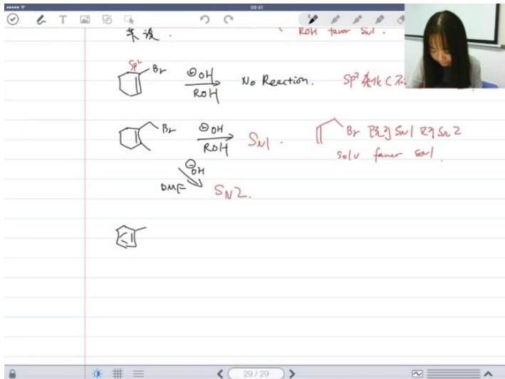

chemical

Handwritten chemical reaction equations involving bromoalkane and hydroxyl radical intermediates

- 三级碳判断：三级碳（ $S_0$ ）优先发生SN1反应，因为其形成的碳正离子中间体更稳定。  
- 离去基团特性：DMC（对甲苯磺酸酯）是优良的离去基团，有利于SN1反应进行。  
● 水溶液环境：水作为弱亲核试剂不会参与反应，进一步确认SN1反应路径。

# 11. 例题: SN2 反应位点识别

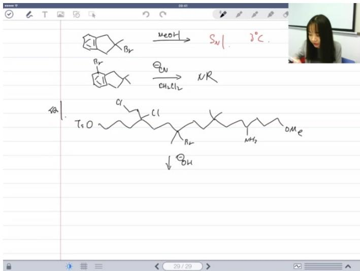

chemical

Chemical reaction scheme showing conversion of bromoalkane to enone and then to an alkene with a diethylamine side chain, followed by dehydration to alcohol.

# SN2位点判断标准：

优良离去基团：OTs（对甲苯磺酸根）>Cl>弱离去基团（如OCH3-、NH2-)  
○ 空间位阻：一级碳（1,2位）>二级碳（3,4位）

# ● 常见误区：

○ 甲氧基（6位）是差离去基团，需剧烈条件才能水解  
○ 氨基是极差离去基团，不参与任何亲核取代

# SN1位点补充：

- 3,4位二级碳可形成较稳定碳正离子  
- 水作为弱亲核试剂时优先发生SN1反应

# 12. 例题: SN2 反应速率比较 02:42:49

# - 速率决定因素：

○ 空间位阻效应：位阻越小反应越快（如2>1）  
○ 离去基团能力：I->Br->Cl-（原子半径越大，负电荷越分散）

# ● 记忆技巧:

○ 氢卤酸酸性顺序：HI>HBr>HCl（对应负离子稳定性）  
○ 原子半径效应>诱导效应

# - 典型错误：

○ 误认为电负性决定离去能力（实际是负离子稳定性）  
○ 忽略一级碳的位阻影响（即使有良好离去基团）

# 13. 例题: SN2 反应立体效应 02:46:13

# ● 关键比较：

○ 1号（一级碳但位阻大）vs 2号（位阻小）

# 核心结论：

○ 立体阻碍是主要影响因素 (2>1)  
- 一级碳若位阻过大可能完全不反应

# - 延伸思考：

- 反应能垒与过渡态稳定性直接相关  
- 可通过势能图理解活化能差异

# 五、亲核取代反应机理分析

# 1. SN1反应速率影响因素

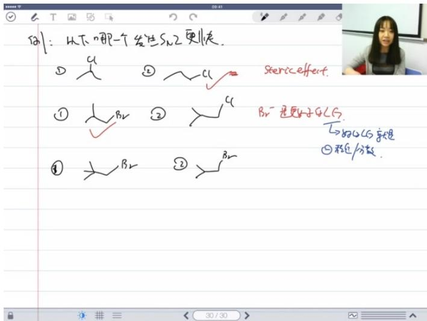

text_image

例：以下哪一个发生Sn2更快.
① C₁ ② C₂ Stericeffect.
① C₆ Br₂ ② C₇ Br₃
① C₈ Br₂ ② C₉ Br₄
② C₁6 Br₄是更好GLG.
③转化分数.

- 碳正离子稳定性：SN1反应速率主要取决于碳正离子中间体的稳定性，三级碳正离子 $>$ 二级碳正离子 $>$ 一级碳正离子  
- 离去基团影响：当碳正离子稳定性相近时，更好的离去基团（如Br $^{-}$ ）会加快SN1反应速率  
● 特殊限制：一级碳正离子极不稳定，通常不会发生SN1反应

# 2. SN1与SN2反应判断

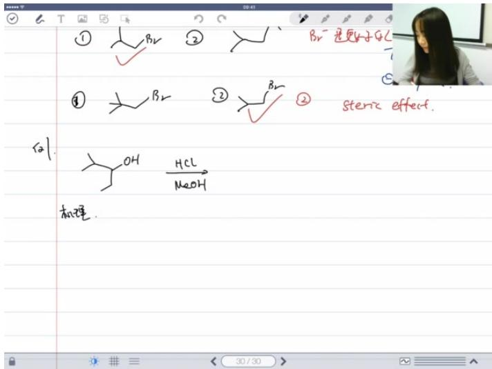

text_image

① Br ② Br-是更好的
③ Br ② Br ② steric effect.
①
HCL
MeOH
机理.

● 判断依据：

- 底物结构：三级碳倾向于SN1，一级碳倾向于SN2  
- 离去基团性质：在酸性条件下，-OH会质子化转变为更好的离去基团 $H_{2}O$   
○ 溶剂效应：极性溶剂有利于SN1反应

● 机理特点：SN1反应是两步过程，首先生成碳正离子中间体（决速步）

# 3. SN1反应机理详解

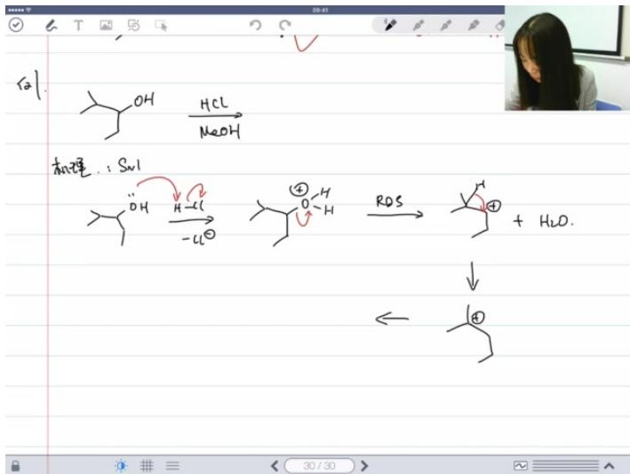

chemical

Hand-drawn chemical reaction diagram showing hydrolysis of ethylene oxide with HCl and NaOH, followed by RDS formation and hydrogenation to form a radical product.

# - 第一步：质子迁移：

在酸性条件下，羟基氧的孤对电子接受质子形成 $H_{2}O$ 离去基团  
○ 生成碳正离子中间体（决速步）

# - 碳正离子重排：

- 二级碳正离子邻位有三级碳时易发生重排  
○ 优先发生氢迁移（因C-H σ键轨道匹配度高）

# ● 亲核试剂捕获：

- 溶剂甲醇比Cl $^{-}$ 更易捕获碳正离子（浓度效应）  
- 最终通过质子迁移得到醚类产物

# 4. 溶剂效应与产物控制

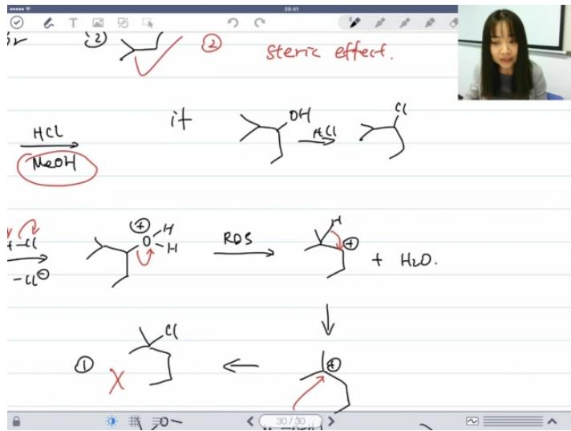

chemical

Chemical reaction diagram showing stereoselective addition of HCl to maleic acid, followed by hydrolysis and hydrogenation steps

# ● 关键因素：

- 溶剂未指定时：Cl $^{-}$ 为主要亲核试剂  
○ 甲醇作溶剂时： $CH_{3}OH$ 成为主要亲核试剂

# - 反应特点：

- SN1第二步反应极快，溶剂分子优先参与  
这是国初考试的经典考点，需特别注意反应条件

# 5. 立体化学特征

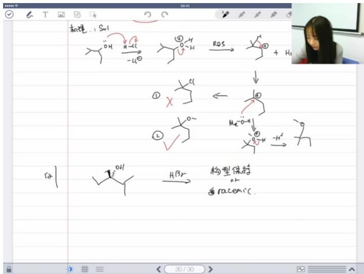

chemical

Handwritten chemical reaction equations involving hydroxyl, ketone, ROs, and hydrogenation steps

# ● 构型结果：

- SN1反应通过平面型 $sp^{2}$ 杂化碳正离子中间体  
- 亲核试剂可从两面进攻，得到外消旋混合物

# ● 判断标准：

○ 外消旋产物 $\Rightarrow$ SN1 反应  
○ 构型翻转 $\Rightarrow$ SN2 反应  
◦ 亲核取代反应中不存在单纯构型保持的情况

# 6. 反应条件综合分析

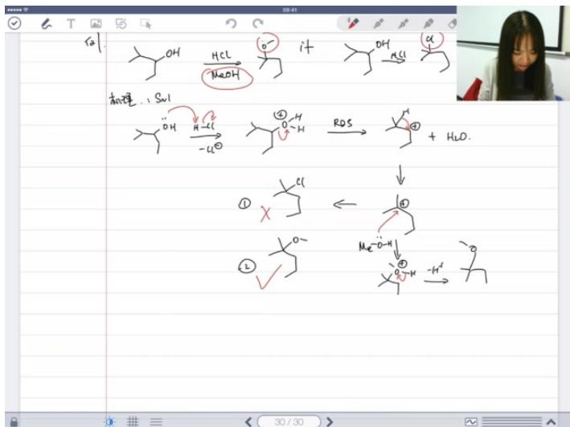

chemical

Hand-drawn chemical reaction diagram showing hydrolysis of a diol compound with HCl and NaOH, followed by RDS addition and hydrogenation to form a radical intermediate.

# 四要素判断法：

- 底物结构（碳正离子稳定性）  
○ 离去基团性质（需考虑质子化效应）  
◦ 亲核试剂强度  
○ 溶剂极性

# - 经典考点：

- 酸性条件下羟基化合物的反应总是先质子化  
- 溶剂参与反应时需考虑其亲核性  
○ 碳正离子重排是常见副反应

# 六、知识小结

<table><tr><td>知识点</td><td>核心内容</td><td>考试重点/易混淆点</td><td>难度系数</td></tr><tr><td>自由基反应</td><td>自由基稳定性影响因素(共轭效应、超共轭效应)</td><td>三级自由基&gt;二级&gt;一级;判断碳氢键断裂优先顺序</td><td></td></tr><tr><td>自由基反应机理</td><td>三步走:链引发→链转移→链终止</td><td>鱼钩箭头表示单电子转移;主产物在链转移第二步生成</td><td></td></tr><tr><td>卤化反应选择性</td><td>氯化反应速率快但选择性差,溴化反应速率慢但选择性好</td><td>活化能差异导致选择性差异</td><td></td></tr><tr><td>碳正离子稳定性</td><td>影响因素:电荷分散(共轭/超共轭)、空间位阻、场效应</td><td>三级&gt;二级&gt;一级;特殊结构稳定性(苄基/烯丙基)</td><td></td></tr><tr><td>碳正离子重排</td><td>二级碳正离子向三级碳正离子重排</td><td>优先迁移小基团(H&gt;CH3);轨道匹配原理</td><td></td></tr><tr><td>SN1反应机理</td><td>两步反应:离去基团解离→亲核试剂进攻</td><td>生成外消旋产物;溶剂化效应显著</td><td></td></tr><tr><td>SN2反应机理</td><td>协同反应:背面进攻构型翻转</td><td>位阻效应是关键;过渡态空间要求</td><td></td></tr><tr><td>反应类型判断</td><td>一级碳倾向SN2,三级碳倾向SN1</td><td>溶剂效应:质子溶剂促SN1,非质子极性溶剂促SN2</td><td></td></tr><tr><td>离去基团活性</td><td> $I^{-}>Br^{-}>Cl^{-}>>OH^{-}/OR^{-}$ </td><td>好的离去基团=稳定负电荷;TsO-特别优秀</td><td></td></tr><tr><td>亲核试剂强度</td><td>可极化性&gt;碱性强弱( $I^{-}>Br^{-}>Cl^{-}$ )</td><td>在非质子溶剂中亲核性增强</td><td></td></tr><tr><td>立体化学特征</td><td>SN1外消旋化(±离子对效应),SN2构型翻转</td><td>桥头碳不能发生SN1/SN2(空间限制)</td><td></td></tr></table>