# 一、复习课01:04

# 1. 成键与结构 01:27

# 1）化学的定义与历史 01:40

- 历史背景：有机化学定义为研究碳化合物的学问，这个定义源于启蒙运动时期强调理性推导知识的科学传统  
● 核心观点：化学知识体系是通过观察现实总结而来，属于后验知识体系，不追求绝对对错而是追求合理性

# 2）化学的理性与逻辑 02:01

● 学科本质: 化学强调逻辑推导而非死记硬背，与生物学科一样都建立在理性基础上  
● 学习要点: 理解化学反应的机理比记忆反应现象更重要，需要建立逻辑思维框架

# 3）化学的后验知识体系 02:18

● 知识特征: 化学理论是通过实验观察归纳得出，具有可证伪性  
● 应用原则: 在解释反应机理时，更注重解释的合理性而非绝对正确性

# 4）价键理论与分子轨道理论 03:13

● 成键本质: 原子通过轨道有效重叠形成化学键，使体系能量降低  
● VB理论: 价键理论适合处理复杂有机分子，是有机化学主要理论工具  
● MO理论局限: 分子轨道理论仅适用于电子数少的体系，在有机化学中主要用于：

○ 局部基团处理（如超共轭效应）  
- 前线轨道理论（仅关注HOMO和LUMO）  
○ 派电子体系分析

# 5）原子轨道杂化与VSEPR理论 05:15

● 杂化原理: 轨道杂化形式 ( $SP^{3}$ 、 $SP^{2}$ 、SP) 决定分子几何构型  
● VSEPR本质: 价层电子对互斥理论基于电子云斥力最小化原则  
- $SP^{3}$ 杂化：正四面体（4对电子）  
- $SP^{2}$ 杂化: 平面三角形 (3对电子)

# ● 特殊案例:

○ 碳自由基：介于 $SP^{2}$ 和 $SP^{3}$ 之间的扁三角锥构型  
- 斥力排序：孤对电子-孤对电子 > 孤对电子-成键电子 > 成键电子-成键电子

# 6）分子结构的表达方式 07:44

● 结构简式: 快速绘制分子骨架  
● 路易斯式: 展示价电子排布和成键方式  
● 键线式: 最常用的有机分子表示法

# ● 特殊表达:

- 纽曼投影式：分析位阻效应  
○ 楔形式：展示立体构型  
○ 共振式：描述电子分布（特别是派电子和电荷）

# 7）键长与键能 09:59

● 基本关系: 相同原子间键长越长，键能越弱  
● 影响因素: 原子半径、杂化方式、键级等都会影响键参数

# 8）键的极性与分子的偶极矩 10:19

# ● 电负性判据:

○：非极性共价键（如C-C、C-H）  
○：极性共价键（如C-O、C-N）  
○：离子键（如O-Na）

# ● 偶极矩计算: 通过矢量叠加各键偶极矩得到分子偶极矩

# 9）分子间作用力 11:34

# ● 范德华力类型:

○ 取向力（偶极-偶极）：仅存在于极性分子间  
- 诱导力：极性-非极性分子间  
○ 色散力（瞬时偶极）：所有分子间都存在

# - 应用实例:

- 直链烷烃沸点高于支链烷烃：因分子接触面积大，色散力强  
- 极性溶剂选择：DMF、DMSO等强极性非质子溶剂有利于 $S_{N}2$ 反应

# 2. 酸碱 15:17

# 1）质子酸碱定义 15:23

● 基本定义: 能给出质子 $(H^{+})$ 的物质是质子酸，能接受质子的物质是质子碱。  
● 举例说明: 如HCl给出 $H^{+}$ 是酸, $NH_{3}$ 接受 $H^{+}$ 形成 $NH_{4}^{+}$ 是碱。

# 2）PK值的意义与常见有机化合物的PK值 15:33

● 相对重要性: 对有机化合物主要关注PK值的相对大小，特别是弱酸（PK值20-40范围）。  
● 测量限制: 绝对值误差较大，因此比较时更注重相对强弱。

# 3) 乙酸、苯酚、水、乙醇、叔丁醇的PK值 16:01

text_image

Screenshot of a mobile phone interface with blank status bar and a photo editing panel showing a person in the background.

● 乙酸: PK≈5 (酸性较强)  
● 苯酚: PK≈9-10   
● 水: PK=14（若按55.5M浓度计算则为15.7）  
● 乙醇: PK=15  
● 叔丁醇: PK=17（与乙醇酸性对比见作业题）

# 4）碳氧双键间碳氢的酸性与丙酮的酸性 16:43

● 强酸性实例: 两个羰基间的CH酸性极强 (PK≈9)   
● 丙酮酸性: PK=19 (因C = O键强极性导致)   
● 诱导效应: 碳氧双键极性远强于单键（如C-O-C）

# 5）端缺氢与NH3的PK值对比 17:41

● 关键反应: 端炔氢（PK=25）可与氨基钠反应生成炔钠和氨（PK=38）  
● 记忆重点: 只需记住这两个PK值即可判断反应方向

# 6）影响酸碱强弱的因素 23:49

● 电负性: 与质子直接相连原子的吸电子能力  
● 诱导效应: 通过化学键传递的电子效应  
● 杂化效应:sp杂化碳 $>sp^{2}>sp^{3}$ （吸电子能力）  
● 共轭效应: 电荷分散使共轭酸酸性增强  
● 原子半径: 半径越大酸性越强（如HI > HBr > HCl）

● 优先级: 原子半径 > 共轭效应 > 诱导效应 > 杂化效应

7）路易斯酸碱定义与特点 26:03

● 路易斯酸: 电子对受体（如 $BF_{3}$ ）

● 路易斯碱: 电子对供体（如 $NH_{3}$ ）

● 碱性强度: 取决于电子云密度和可极化性（如 $I^{-}$ 虽电荷密度低但极化性强）

3. 构象 26:46

1）烷烃构象分析

● 乙烷构象: 交叉式（稳定）vs 重叠式（不稳定）  
● 稳定因素: 位阻效应和超共轭效应（反位C-H键轨道相互作用）  
- 正丁烷构象: 反式交叉（180°）最稳定，邻位交叉（60°）次之

2）环烷烃构象

- 三元环: 高度不稳定（环张力+取代基重叠式排列）  
● 四元环: 主要不稳定来源是环张力（已呈非平面结构）  
● 五元环: 非常稳定（取代基交叉式+最小环张力）

3）六元环构象

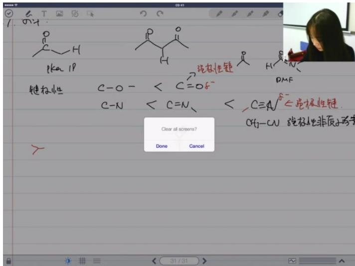

text_image

PKa 18
强极性链
DMF
键极性
C-O- < C=O-S-
C-N < C=N、 < C≡A-S←强极性链.
CH₃-CN 强极性非质子溶剂
Clear all screens?
Done Cancel
31/31

●

● 稳定构型: 椅式（最稳定）和扭船式（亚稳定）  
● 键型区分:

\- 直立键（axial）：垂直于环平面

\- 平伏键（equatorial）：平行于环平面

● 取代基规则:

- 叔丁基必须处于平伏键（否则构象比例达9994:1）  
○ 多取代时优先大基团平伏，其次尽可能多基团平伏

4）取代基位阻比较

● 基团大小: F > H; OH > Cl (虽 O < Cl 但 OH 为双原子)  
● 烷基序列: 甲基 < 乙基 < 异丙基 < 叔丁基  
● 特殊比较: 新戊基 > 异丁基（支链靠近连接位时位阻更大）

4. 立体化学 38:50

1）异构体分类 39:00

● 基本前提：必须是一对物质且分子式相同才构成异构体关系  
● 构造异构体：分子式相同但原子连接方式不同（如正丁烷与异丁烷）  
● 立体异构体：分子式相同且原子连接方式相同

2）立体异构体 39:38

● 对应异构体 39:47

○ 定义：互为不可重叠镜像的立体异构体  
○ 特征：必须满足三个条件：①分子式相同 ②原子连接相同 ③不可重叠镜像

举例：乳酸R型和S型互为对应异构体

● 非对应异构体 40:20

狭义定义：有多个手性中心但不是对应异构体的立体异构体  
- 注意：不同教材分类可能不同，常排除构象异构体和顺反异构体

3）手性中心 41:48

\- 定义

基本标准：连接四个不同基团的原子（不限于碳）  
○ 特殊元素：

■ 磷(P): 连三个不同基团时通常视为手性中心（室温构型翻转慢）  
■ 氮(N): 连三个不同基团时通常不视为手性中心（室温构型翻转快）  
■ 例外：桥头氮因空间位阻不能翻转时视为手性中心

● 绝对构型判断 43:55

○ 步骤：

■ 将最小基团远离观察者  
■ 按顺序规则排列剩余三个基团  
■ 顺时针为R，逆时针为S

○ 顺序规则要点：

■ 孤对电子 < 氢 < 氘(D)  
同位素： $^{18}F<^{19}F$   
■ 构型比较：S构型基团 < R构型基团

4）内消旋体 44:48

● 定义：分子有手性中心但无旋光性  
● 原因：分子内存在对称面或对称中心  
● 特征：虽有手性中心但整体无手性

5）旋光性 45:10

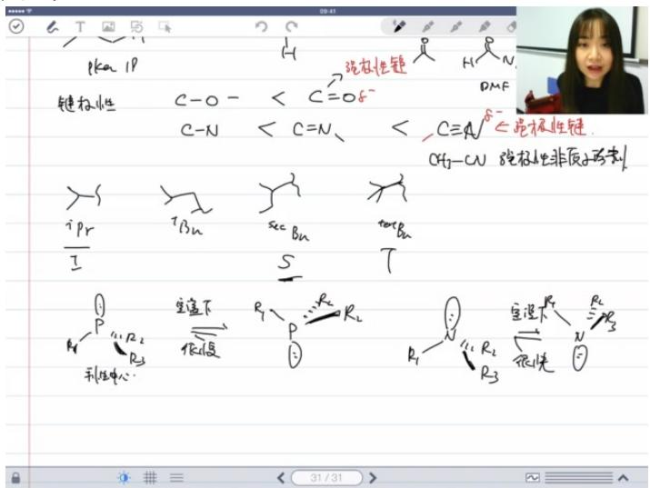

text_image

PKα 1P
键极性
C-O-
C-N
C=N
C≡N
iPr
I
Tβn
secβn
tscβn
空虚下
R1
R2
R3
↑
↓
↑
↑
↑
↑
↑
↑
↑
↑
↑
↑
↑
↑
↑
↑
↑
↑
↑
↑
↑
↑
↑
↑
↑
↑
↑
↑
↑
↑
↑
↑
↑
↑
↑
↑
↑
↑
↑
↑
↑
↑
↑
↑
↑
↑
↑
↑
↑
↑
↑
↑
R1 R2 R3 R3

结构基础：

○ 无对称面且无对称中心→有手性→有旋光性  
○ 有对称面或对称中心 → 无手性 → 无旋光性

● 物理表现：旋转平面偏振光的能力

- ee值计算：ee% = (实测旋光度/纯物质旋光度)×100%   
● 外消旋体：等量对应异构体混合物，旋光度为零

6）顺反异构体 49:13

\- cis/trans命名法

- 适用：环状化合物或双键两侧有相同基团  
○ 规则：相同基团在同侧为cis，异侧为trans

# E/Z命名法

○ 规则：按顺序规则，大基团在同侧为Z，异侧为E

# 7）构象与对称性 50:01

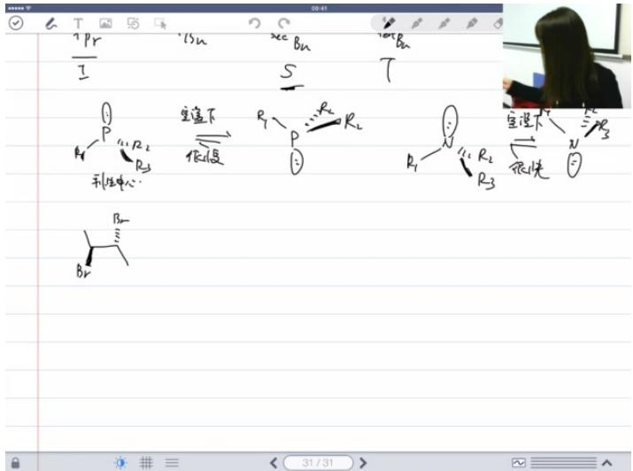

text_image

I
Pr
I5n
Xe
Bn
T
S
P
R1
R2
R3
P
R1
R2
R3
P
R1
R2
R3
P
R1
P
P
P
P
P
P
P
P
P
P
P
P
P
P
P
P
P
P
P
P
P
P
P
P
P
P
P
P
P
P
P
P
P
P
P
P
P
P
P
P
P
P
P
P
P
P
P
P
P
P
T
T
T
T
T
T
T
T
T
T
T
T
T
T
T
T
T
T
T
T
T
T
T
T
T
T
T
T
T
T
T
T
T
T
T
T
T
T
T
T
T
T
T
T
T
T
T
T
T
T
31/31

# ● 关键概念：构象改变可影响分子对称性

# - 动态平衡：

○ 室温下构象快速互变  
○ 能量相等的对映构象形成外消旋混合物

# - 分析方法：

环状化合物常采用平面投影分析对称性  
○ 实际构象对称性可能不同于平面投影

# ● 例题：构象对称性分析

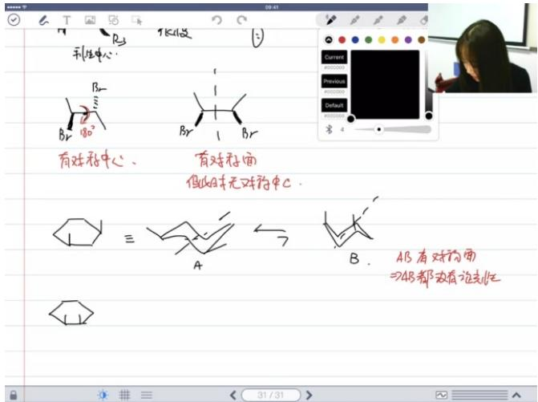

text_image

利生中心
有对称中心、 有对称面
假的并无对称中心。
A B AB 有对称面
⇒AB 都没有论光化

# ○ ○ 题目解析

■ 关键点：区分静态对称性和动态平衡   
■ 易错点：忽略构象互变速度对旋光性的影响  
■ 答案：室温下快速互变的构象表现为无旋光性

# 5. 自由基 01:06:45

# 1）烷烃与自由基反应 01:06:49

● 反应对象: 主要讨论烷烃 $(C_{n}H_{2n+2})$ 的自由基反应特性  
● 反应特点: 通过均裂方式生成自由基，涉及碳氢键和碳碳键的断裂

# 2）烷烃的制备与来源 01:07:20

● 天然存在: 烷烃在自然界中天然存在，无需特殊制备  
● 主要来源: 通过石油分馏获取，该知识点为非考试重点内容

3）烷烃的结构与物理性质 01:07:32

● 极性特征: 烷烃分子大多为非极性分子  
● 作用力类型: 分子间主要存在色散力（范德华力的一种）  
- 沸点规律:

○ 质量影响: 分子质量越大, 色散力越强, 沸点越高  
- 支链影响: 相同分子质量时，支链越多沸点越低

4）烷烃的结构与化学性质 01:07:54

● 键型特点: 仅含碳氢键（C - H）和碳碳键（C - C），均为弱极性共价键  
● 反应倾向: 易发生均裂生成自由基  
- 断裂规律:

◦ 加热条件下优先断裂碳碳键  
○ 自由基反应中优先断裂碳氢键（动力学优势）

5）自由基的生成与断裂 01:08:04

● 断裂机制:

◦ 动力学解释: 氢原子位于分子外围, 自由基更容易进攻C-H键  
○ 能量因素: 键能（Bond Dissociation Energy）决定断裂难易程度

● 稳定性关系: 生成的自由基越稳定，对应键越容易断裂  
6）自由基的稳定性判断 01:08:48  
- 两大因素:

- 超共轭效应: 通过σ键与自由基中心的相互作用  
○ 共轭效应: 通过π电子离域稳定自由基

● 判断方法:

- 共振结构数目越多越稳定  
○ 离域范围越大越稳定  
- 特殊稳定结构（如芳香性）可显著提高稳定性

7）卤化反应的特点与选择性 01:10:09

\- 卤素活性:

- 氟：剧烈放热不可控（危险）  
○ 碘：反应不发生  
○ 氯 vs 溴:

■ 反应速率: 氯 > 溴  
■ 选择性: 溴 > 氯

● 典型示例:

- 正丙烷氯化：端位取代40%，CH2位取代60%（实际概率比为30:8.5）  
- 异丁烷溴化：几乎只在三级碳上发生取代

● 产量悖论:

虽然三级碳氢键更易断裂，但一级碳氢数量优势可能导致一级取代产物为主

8）自氧化反应与自由基阻碍剂 01:11:56

\- 反应过程:

○ 首先生成自由基  
○ 与空气中的氧结合形成过氧键 $(R-O-O\cdot)$

● 阻碍剂机制:

- 与活性自由基反应生成稳定自由基  
- 终止自由基链式反应

9）自由基的经典反应模式 01:12:38

\- 三阶段模型:

◦ 链引发（Initiation）：产生初始自由基  
- 链传递（Propagation）：自由基持续反应

◦ 链终止（Termination）：自由基相互结合

# 10）自由基反应中的产物生成 01:12:47

# ● 关键注意:

○ 产物主要在链传递阶段生成（第二步）  
避免错误写法：两个自由基直接结合生成产物

# - 反应特点:

- 体系内自由基浓度通常很低  
- 链终止会停止整个反应过程

# 11）自由基反应的表达方式 01:13:47

# ● 电子表示:

- 使用鱼钩箭头（）表示单电子转移  
- 区别于双电子转移的弯曲箭头

# - 反应类型:

○ 单电子转移反应（Single Electron Transfer Process）

# 6. 应用案例 01:14:23

# 1）亲核取代反应：SN1与SN2反应

# - 反应机理基础

O

# ○ 定义区分:

■ SN表示亲核取代（S=取代首字母，N=亲核首字母）  
■ 数字1/2表示决速步涉及的分子数：SN1为单分子决速，SN2为双分子决速

# ○ SN2特征：

■ 一步协同反应：亲核试剂从离去基团反方向进攻中心碳原子  
■ 构型翻转：过渡态中碳原子与三个取代基共平面，形成五配位过渡态  
■ 速率方程： $r = k$ [底物][亲核试剂]

# ○ SN1特征：

■ 两步反应：先解离生成碳正离子中间体，再与亲核试剂结合   
■ 外消旋化：理论上得到等量构型保持和翻转产物（实际可能因离子对效应略有偏差）  
■ 速率方程： $r = k$ [底物]

# - 影响因素对比

# - 底物结构影响

# ■ 烷基类型：

- 三级碳：优先SN1（因稳定碳正离子形成）  
● 一级碳：优先SN2（位阻小且难形成碳正离子）  
● 二级碳：需综合其他因素判断

# ■ 离去基团：

● SN1要求更优离去基团（如质子化羟基生成的水分子）  
● SN2只需良好离去基团即可

# ○ 环境因素

# ■ 亲核试剂：

● SN1: 几乎无影响   
● SN2：亲核性越强反应越快（电子密度高/可极化性强）

# ■ 溶剂效应：

● 质子溶剂（水/醇）：促进SN1（通过稳定过渡态正电荷）  
- 极性非质子溶剂（DMSO/DMF）：促进SN2（暴露δ-部分活化亲核试剂）

# - 碳正离子特性

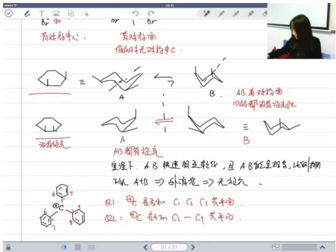

text_image

有对称中心、
有对称面
但山并无对称中C。
AB有对称面
⇒AB都没有对称化
为有填充
A
B
A3都有掺光
室温下，AB快速相互转化，且AB能呈报告，比例如
从AB⇒外填花⇒无结论。
Q1：④c是否和C₁C₂C₃共平面。
Q2：⑤c是和C₁-C₃共平面。

# ○ 稳定性因素：

■ 共轭效应： $p-\pi$ 共轭显著降低正电荷密度  
■ 超共轭效应：相邻σ键电子离域  
■ 空间构型：螺旋桨型结构可平衡位阻与轨道重叠

# ○ 重排规律：

■ 驱动力：总是从较不稳定碳正离子向更稳定形式转化  
■ 判断标准：正电荷密度降低即稳定（通过诱导/场/位阻效应）

例题：反应类型判断

●

# ○ 题目解析

■ 关键判断维度：底物结构/离去基团/溶剂类型/亲核试剂强度  
典型标志：  
● 酸性条件+二级醇→可能质子化羟基形成优质离去基团  
● 非质子溶剂+强亲核试剂→SN2特征明显  
■ 答案：需具体分析各因素权重  
■ 易错点：忽略溶剂极性对反应路径的定向影响

# 2）例题:顺式和反式沸点比较 01:33:16

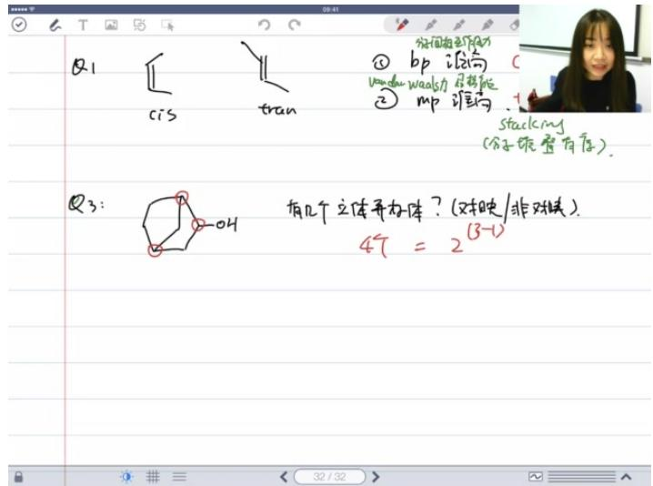

text_image

Q1
cis
tran
① bp 设构
Vandau Weals力 启动能
② mp 谁构
stacking
(分子观察有存).
Q3:
OH
有几个立体并加体？(对称/非对称)
4个 = 2^(3-1)

# 沸点比较：顺式丁烯沸点高于反式

○ 原因：顺式分子偶极矩不为零（ $\mu \neq 0$ ），反式偶极矩为零（ $\mu = 0$ ）  
○ 影响因素：分子间作用力（色散力和偶极-偶极作用）

# ● 熔点比较：反式丁烯熔点高于顺式

- 原因：反式分子可更有效进行规整排列  
○ 影响因素：晶格能（分子堆叠紧密程度）

# - 记忆要点:

- "沸顺熔反": 沸点顺式高, 熔点反式高   
○ 偶极矩差异是沸点差异的关键因素

# 3）例题:结构异构体判定 01:40:02

# - 结构异构体判断：

○ 定义：分子式相同但原子连接方式不同  
○ 示例：A和B为结构异构体（不饱和度一致）

# ● 杂化状态判断：

\- 三角锥几何形状对应 $sp^{3}$ 杂化氮原子

# ● 键型分析：

○ σ键数量：B最多，C最少  
○ $\pi$ 键数量：A有1个，B有0个，C有2个

# - 沸点预测：

○ C沸点最高（碳氮三键 $C \equiv N$ 极性最强）

# 4）例题:立体异构体判断 01:42:07

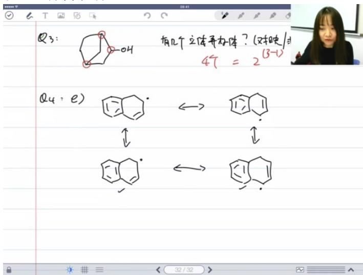

chemical

Hand-drawn chemical reaction diagram showing transformation of compound Q3 to Q4 using naphthalene and alkene structures

# ● 非对映异构体判断：

- 分子含三个手性中心（包括两个桥头碳）  
○ 理论最大异构体数： $2^{3}=8$ 个

# ● 实际异构体数：

○ 桥头碳锁定导致减少： $2^{(3-1)}=4$ 个  
- 包括题目中两个结构及其对应异构体

# ● 关键点：

- 桥环化合物会减少立体异构体数量  
○ 每个桥头碳相当于"锁定"一个手性中心

# 5）例题:画出共振结构 01:45:15

# ● 共振结构绘制要点：

必须包含所有稳定结构（包括苯环异构体）  
○ 自由基位置变化产生的不同结构

# - 各小题答案:

○ a: 2个共振结构（含题干原始结构）  
o b: 3个   
○ c: 3个   
o d: 5个   
o e: 7个（易漏苯环异构产生的2个结构）

# ● 常见错误：

- 忽略苯环异构产生的共振结构  
- 低估自由基位置变化带来的结构多样性

# 6）例题:自由基稳定性判断 01:49:06

# - 解题方法

共振结构分析：通过比较断裂不同化学键生成的自由基的共振结构稳定性来判断键的强弱。断裂后生成的自由基越稳定，对应的化学键越容易断裂。  
○ 自由基等级比较：一级碳自由基稳定性 < 二级碳自由基稳定性 < 三级碳自由基稳定性。三级碳自由基由于超共轭效应更稳定。

# - 具体分析

○ 断裂a键：生成1个一级碳自由基和2个二级碳自由基  
○ 断裂b键：生成1个一级碳自由基、1个二级碳自由基和1个三级碳自由基  
○ 结论：b键断裂生成的自由基整体更稳定（含三级碳自由基），因此b键更弱

# 7）例题:自由基取代反应主要产物 01:52:03

# - 卤素反应特性

- 溴取代：选择性高，优先取代三级碳上的氢  
○ 碘取代：不发生卤代反应（no reaction）  
- 氯取代：选择性差，可生成多种产物

# - 产物分析

○ a题（溴）：主要产物为三级碳上的溴取代物  
○ b题（碘）：不发生反应  
○ c题（氯）：生成三种产物，最后一种为外消旋体（需标注rese mic）  
○ d题（溴）：取代甲基上的氢（苄基自由基稳定）  
e题（溴）：取代三级碳上的氢  
○ f题（溴）：取代三级碳上的氢

# - 注意事项

○ 题目限制：应明确是单取代产物（避免多取代歧义）

# 自由基稳定性：苄基自由基和三级碳自由基特别稳定，是主要取代位点

☐ 注：由于提供的PPT内容为乱码/非文字内容，未插入具体图片。实际笔记中应根据匹配的PPT内容插入相应的反应结构式图示。

# 8）例题：碳正离子重排倾向 01:53:52

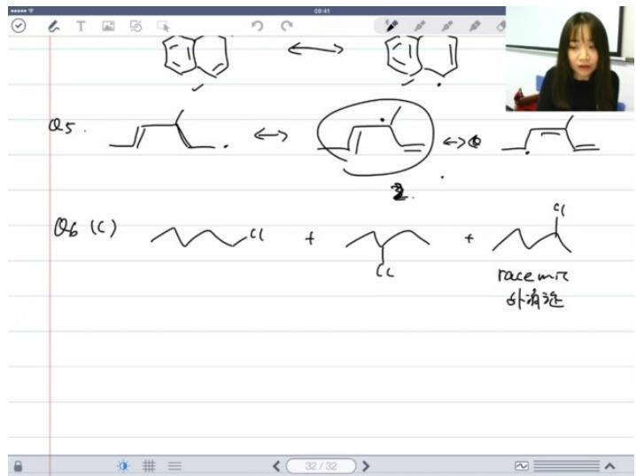

chemical

Hand-drawn chemical reaction diagram showing transformation of cyclohexane to alkene and then to racemite, with Chinese annotations

# - 重排条件：

- 二级碳正离子相邻有三级/四级碳时会发生重排  
○ 氢迁移优先于烷基迁移（有氢先迁氢）  
- 无氢时迁移最小烷基（甲基优先）

# - 选项分析:

○ A: 生成二级碳正但无迁移位点  
○ B: 生成稳定三级碳正无需重排  
○ C: 二级碳正+三级碳→氢迁移   
○ D: 同A无迁移位点  
○ E: 二级碳正+四级碳→甲基迁移

# - 迁移规则：

◦ 优先顺序：氢 > 最小烷基  
- 原理：轨道匹配性（初学者只需记忆规则）

# 9）例题：溴代烷烃命名 01:58:00

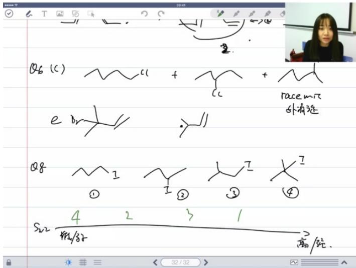

text_image

Q6 (C) + Racc m/z
e Dr.
Q8 I I I X
① ② ③ ④
S22 4 2 3 1
高/短.
32 / 32 >

# 反应活性规律：

○ $S_{N}$ 2反应活性：1°碳 > 2°碳 > 3°碳  
○ 位阻效应：位阻越大活性越低

# ● 典型排序：

○ 活性从低到高： $4(3^{\circ} \text{碳}) < 2(2^{\circ} \text{碳}) < 3(1^{\circ} \text{碳大位阻}) < 1(1^{\circ} \text{碳小位阻})$   
○ 关键因素：碳级类型 > 位阻大小

# 10）例题：反应类型判断 01:59:04

# ● 判断依据：

\- 四大影响因素:

■ 烷基结构（1/2/3°碳）  
■ 亲核试剂性质   
■ 离去基团能力  
溶剂类型

○ 关键证据:

■ 构型翻转 $\rightarrow S_{N}2$   
■ 二级碳底物  
■ DMSO（极性非质子溶剂）促进 $S_{N}2$

# - 速率影响：

○ 底物浓度×2→速率×2   
○ CN $^{-}$ 浓度×3→速率×3   
○ 换乙醇（质子溶剂）→速率↓

# 11）例题：过渡态位置判断 02:02:59

# ● 过渡态特征：

○ 中心碳与三个基团共平面  
- 亲核试剂与离去基团分居两侧   
- 必须考虑立体化学（上下位置）

# - 绘制要点：

○ Br在上方（根据底物构型）  
- CN从背面进攻   
○ 甲基空间排布需明确

12）例题：三级碳SN1或SN2判断 02:03:36

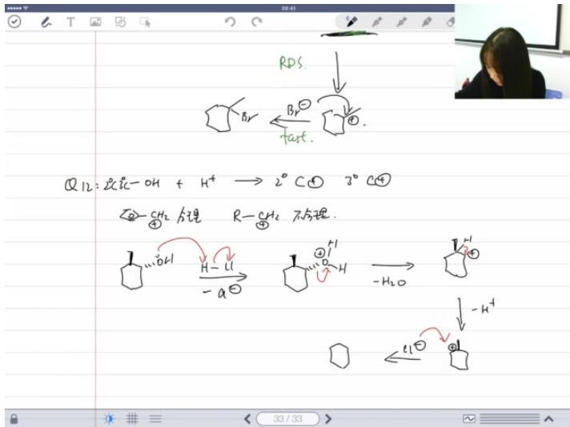

chemical

Hand-drawn chemical reaction equations involving alcohol, bromide, and hydrogenation steps

# - 反应特征：

○ 三级醇+酸→典型 $S_{N}1$   
○ 关键步骤:

质子化羟基  
■ 生成碳正离子（决速步）  
■ 亲核试剂进攻

# - 二级醇特殊性：

- 可能发生碳正离子重排  
例：产物中Cl出现在相邻碳位

# - 速率影响：

○ 醇浓度×2→速率≈×2   
○ HBr浓度减半→速率不变   
○ 机理重点：碳正离子生成步骤

13）例题:画出反应机理 02:09:31

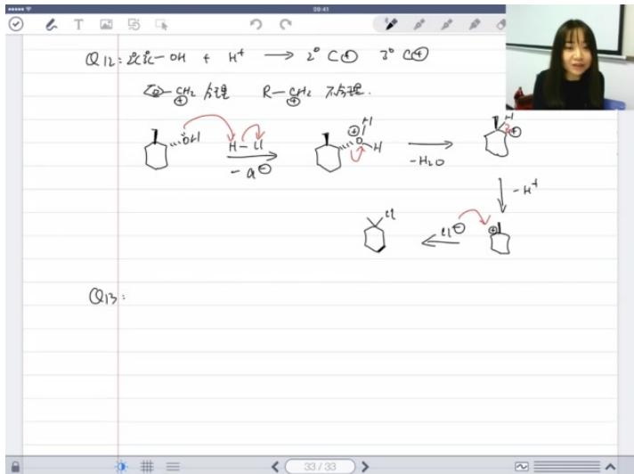

chemical

Chemical reaction diagram showing cyclohexane ring opening with hydroxyl and hydrogen transfer steps, including thermal decomposition and radical formation

# ● 机理判断步骤:

○ 首先判断反应大类型（亲电/亲核/周环/自由基）  
- 再确定具体反应路径中的小步骤

# ● 驱动力分析:

- 关键要判断每一步的driving force（驱动力）是否合理存在  
- 不合理机理：仅为迁移而迁移，没有稳定性提升  
○ 合理机理示例：三级碳正离子重排时，需证明新生成的碳正离子更稳定（通过共轭效应或超共轭效应增强）

# ● 稳定性比较:

○ 碳正离子稳定性比较标准：

■ 三级 > 二级 > 一级  
■ 有共轭效应 > 无共轭效应  
■ 超共轭效应多的 > 超共轭效应少的

# ● 实际应用:

- 初级：能根据原料和产物合理推导中间步骤  
- 高级：在多个合理路径中选择最合理的（需对每一步驱动力深入分析）

# 14）例题:反应底物结构式写出 02:16:47

# - 反应特点:

- 分子内 $S_{N}2$ 反应制备环氧  
必须满足羟基与离去基团（如溴）处于反式位置

# ● 机理要点:

○ 强碱作用：拔除羟基氢生成氧负离子（而非直接进攻溴）  
○ 氧负离子从背面进攻碳原子，同时溴离去  
○ 错误机理：强碱直接进攻溴会导致产物立体化学错误

# - 立体化学要求:

\- 最终环氧基团的形成要求亲核试剂和离去基团必须处于反式共平面

# 15）例题:路易斯碱性最强原子判断 02:20:30

text_image

直播尚未开始
请同学们稍等
并进行相关预习
质心论坛
forum.eduzhixin.com
官方微信
物理竞赛
质心官网
www.eduzhixin.com
北京质心教育科技有限公司
Center of Mass Educational Tech, Co. Ltd

# ● 判断标准:

○ 电负性：氮（3.04）＜氧（3.44），氮更易给出电子对  
- 杂化方式： $SP^{3}$ 杂化氮 $>SP^{2}$ 杂化氮（比啶氮）  
- 空间效应：桥头氮因环张力使孤对电子更突出

# ● 关键结论:

○ 碱性顺序：桥头氮 $(SP^{3})$ >普通三级胺氮>比啶氮 $(SP^{2})$ >氧   
- 杂化方式不是唯一决定因素，需结合空间效应综合分析

# - 竞赛考点:

- 可能给出具体碱性顺序要求解释原因  
○ 需注意题目是否提供额外信息（如特殊结构提示）

# 16）例题:手性中心计算 02:28:39

● 定义回顾：手性中心是指一个原子连接四个不同取代基团的立体中心  
● 常见误区：

- 氮原子通常不被视为手性中心（因其构型翻转在室温下很快）  
- 但桥头氮因构型固定不能翻转，应视为手性中心

\- 奎宁分子分析：

○ 共5个手性中心（学生常漏桥头碳和桥头氮）  
- 其中2个是桥头原子（特殊结构限制构型）

● 判断要点：

- 磷原子（P）在室温下构型翻转很慢，应视为手性中心  
○ 需具体分析每个原子的空间限制情况，不可机械记忆

17）例题:有n个手性中心的立体异构体数计算 02:34:48

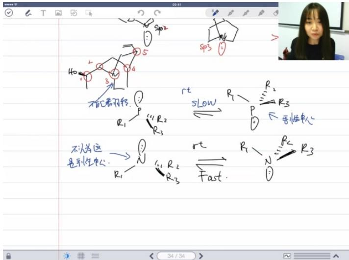

text_image

sp2
40
r
R1
P
R2
R3
r
R1
P
R2
R3
r
R1
N
Fast.
r
R2
R3
r
R3
r
R2
R3
r
R1
P
R2
R3
r
R2
R3
r
R1
P
R2
R3

34 / 34   
● 基本公式： $2^{n}$ （n为手性中心数）  
- 桥头修正：

○ 每对桥头原子使公式修正为 $2^{n-1}$   
○ 不同于内消旋体情况（需单独考虑）

\- 奎宁分子计算：

- 5个手性中心（含2个桥头原子）  
○ 立体异构体数= $2^{5-1}=16$ 个

\- 注意事项：

- 必须确认不存在内消旋体才能直接应用公式  
- 同时存在桥头和内消旋体的情况需特殊处理

18）例题:共振结构判断 02:36:29

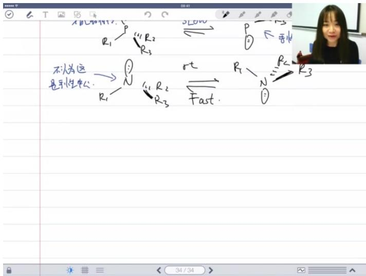

text_image

不认为这
是示性中心.
R₁ → N
← R₂
R₃
r.t
Fast.
R₁ → R₂
R₃
R₃
①
②
③
④
⑤
⑥
⑦
⑧
⑨
⑩
⑪
⑫
⑬
⑭
⑮
⑯
⑰
⑱
⑲
⑳
㉑
㉒
㉓
㉔
㉕
㉖
㉗
㉘
㉙
㉚
㉛
㉜
㉝
㉟
㉳
㉟
㉟
㉟
㉟
㉟
㉟
㉟
㉟
㉟
㉟
㉟
㉟
㉟
㉟
㉟
㉟
㉟
㉟
㉟
㉟
㉟
㉟
㉟
㉟
㉟
㉟
㉟
㉟
㉟
㉟
㉟
㉟
㉟
㉟

# - 分析方法：

○ 画出共轭碱结构  
- 分析所有可能的共振式  
- 统计负电荷分布情况

# - 稳定性判断

- 负电荷在电负性大的原子（如N）上更稳定  
○ 共振式越多越稳定

# ● 实例解析：

○ 化合物1：5个共振式（3个负电荷在N，2个在C）  
○ 化合物2：5个共振式（2个负电荷在N，3个在C）  
○ 结论：化合物1的共轭碱更稳定→酸性更强

# - 易错提醒：

- 必须准确画出所有共振式  
○ 注意结构细节（如修正案例中从4个到5个共振式的过程）

# 19）例题:实心环代顺式或反式 02:41:06

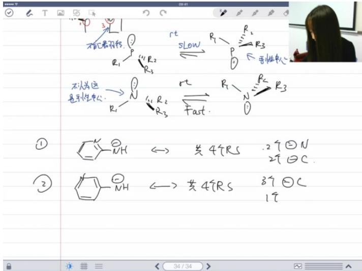

text_image

不认为这是手性中心.
R1
R2
R3
r
Slow
R1
R2
R3
r
Fast.
R1
R2
R3
①
②
共4个RS
.2个②N
2个②C.
共4个RS
3个②C
1个

# 定义标准：

- 以桥头氢/取代基的相对位置判断  
○ 同侧为顺式（cis），异侧为反式（trans）

# ● 稳定性规律

- 反式构象更稳定（空间位阻更小）  
○ 典型反式构象中环呈"椅式"排列

# - 绘图要点:

○ 需避免原子间过度碰撞   
- 可适当倾斜环结构优化空间排布

# 应用提示：

- 该规律适用于多数双环[4.4.0]癸烷体系  
◦ 实际解题时应先确认桥头取代基位置关系

# 20）例题:实心环代顺式或反式判断 02:43:37

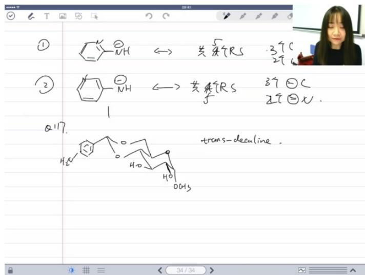

chemical

Handwritten chemical reaction equations showing transformation of a cyclic amide to trans-decaline using thiophene and thiophene groups

- 顺反式判断方法：通过观察分子结构中氢原子的相对位置进行判断，两个氢原子位于同侧为顺式，异侧为反式。  
● 绝对构型标注：需要标注R/S构型时，需注意氧原子的处理方法，编号顺序为1-6。  
● 常见错误点：绝对构型判断容易出错，特别是涉及多个手性中心时，需要反复检查确认。

21）例题:六圆环构象稳定 02:51:36

● 构象稳定性判断

- 稳定构象特征：六元环以椅式构象最稳定，反式十氢化萘结构比顺式更稳定。  
○ 构象转换方法：将竖立的六元环横置后观察取代基方向，向上为直立键，向下为平伏键。  
○ 二面角计算：两个甲基间的二面角可通过纽曼投影判断，典型值为 $60^{\circ}$ 。

● 构象分析实例

☐ 甲基位置分析：桥头碳连接的甲基对左侧六元环是直立键，对右侧六元环是平伏键。  
稳定性比较：含有两个椅式构象六元环的结构比需要船式或扭船式构象的结构更稳定。

\- 解题技巧

纽曼投影应用：将观察点放在关键键轴上，可以清晰判断取代基的空间关系。  
易错点提醒：构象分析时要注意取代基的实际空间取向，避免平面投影造成的误解。

22）例题:共振式判断 02:53:14

● 酸性比较的解题步骤

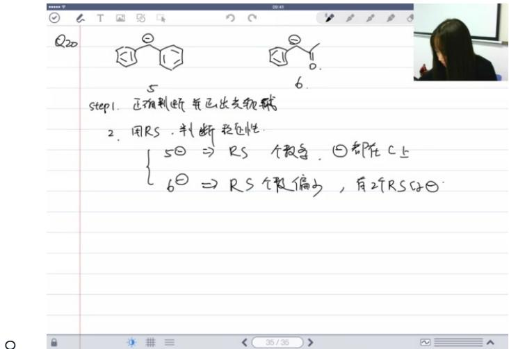

text_image

Q20
5
step1. 正有判断并正出支轨迹
2. 用RS，判断轻性.
{ 5⊖ ⇒ RS 个数等，②都在C上
    6⊖ ⇒ RS 个数偏少，有2个RSC的⊖

# - 步骤一：正确判断共轭碱

■ 比较化合物5和6的酸性时，需要先找到各自酸性最强的氢，并画出对应的共轭碱结构  
■ 化合物5的共轭碱负电荷在碳上，化合物6的共轭碱负电荷可能在氧上（需判断左右位置）

# - 步骤二：用共振式判断稳定性

■ 化合物5的共轭碱有多个共振式（ $\left\{\begin{aligned}50&\Rightarrow Rs\\ 60&\Rightarrow Rs\end{aligned}\right.$ ），但负电荷都在碳上  
■ 化合物6的共轭碱共振式数量较少，但有2个共振式的负电荷在电负性更强的氧上

# - 步骤三：判断标准冲突时的处理

当共振式数量多（稳定性高）和负电荷在电负性强的原子上（稳定性高）两个标准冲突时，需要参考题干给出的pKa值信息  
■ 物质1和3的pKa值表明：负电荷在氧上更有利于稳定性，因此6的共轭碱更稳定，6的酸性更强

# ● 超共轭效应与位阻效应

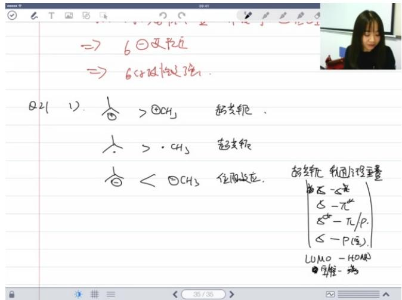

text_image

→ 6②反位
→ 6#酸碱酯

Q2(1). ♂ >①CH₃ 超去轭.
♀ >·CH₃ 超去轭
♂ < ②CH₃ 位质反应. 超去轭 轻固方程量
{ξ - ξ}
{ξ - π}
{ξ - π/ρ}
{ξ - P(空)}.

LUMO - HOAN
● 字节-病

# ○ ○ 超共轭效应原理

■ 需要HOMO（最高占据轨道）与LUMO（最低未占轨道）的相互作用  
■ 有效轨道重叠类型：σ键与σ反键轨道、σ键与π反键轨道、p轨道与σ键等  
■ 可稳定碳正离子和自由基，但不能稳定碳负离子（因碳负离子的p轨道已填满）

# ○ 位阻效应表现

■ 甲基负离子比叔丁基负离子更稳定，因为：  
● 甲基负电荷暴露，可通过溶剂化或正离子静电作用稳定  
● 叔丁基负离子位阻大，不易发生有效溶剂化作用  
■ 经典解释：烷基给电子效应使缺电子体系（碳正离子）稳定，但使富电子体系（碳负离子）不稳定

# ○ 轨道相互作用本质

■ 超共轭是σ成键轨道与空/半满轨道的有效重叠  
■ 碳负离子不稳定是因为其满轨道无法与 $\sigma^{*}$ 反键轨道有效作用（能量匹配差）  
■ 需区分现象（烷基给电子效应）与本质（轨道相互作用方式不同）

# 二、有机化学概念解析

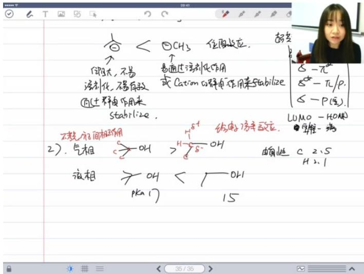

text_image

↑ < ②CH₃ 位置效应. 超变
↑ 易通过法催化剂作用
法催化剂,不易有致 或 Ca(OH)₄分解作用来Stabilize
(通过释放作用来
Stahl:ize.
不燃分子相作用
2). 气相 >OH >H-8-OH
液相 >OH < OH
PKa:17 15
S-π
S-π/P.
≤-P(空).
LUMO-HOMO
宇维-烯
C 2.S
H 2.1

# 1. 气相与液相酸性差异

\- 气象酸性本质：在气相条件下，不考虑分子间相互作用，仅由分子内部结构决定酸性强弱。此时叔丁醇酸性强于乙醇，因为：

○ 甲基的给电子诱导效应比乙基更强（甲基含更多氢原子）  
○ 碳氢键中碳带 $\delta^{-}$ ，氢带 $\delta^{+}$ ，导致烷基呈现给电子效应

# - 液相酸性反转原因：

- 溶剂化效应：乙醇负离子更易被溶剂化稳定  
位阻效应：叔丁基负离子因空间位阻难以被溶剂化稳定，导致其碱性更强，对应酸性更弱

# ● 关键数据对比：

○ 液相pKa值：乙醇15 vs 叔丁醇17   
○ 电负性值：碳2.5 vs 氢2.1

# 2. 亲核试剂特性

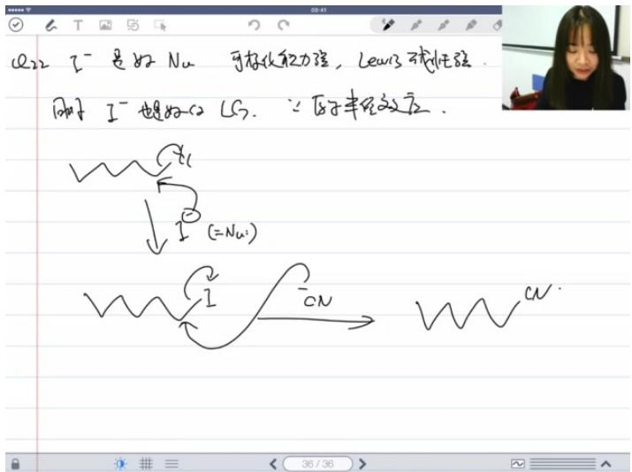

text_image

C22 I⁻ 是好 Nu 可存放能力强，Lewis 球性强.
同子 I⁻ 超好 C₂ LS. ∵原子丰纹效应.
I (=Nu)
I CN
CN

# - 碘离子(I⁻)的双重特性:

○ 优秀亲核性：

■ 可极化能力强  
■ 路易斯碱性强（弱质子碱但强路易斯碱）

# ○ 良好离去能力：

■ 原子半径效应（大原子半径使键易断裂）

● 催化机制：在SN2反应中可作为亲核试剂参与反应，又作为离去基团完成催化循环

# 三、寒假作业安排

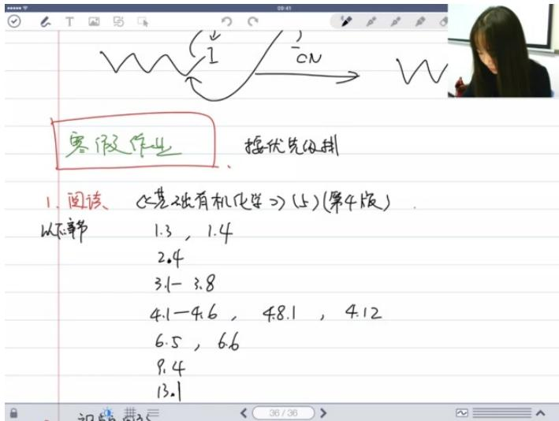

text_image

寒假作业
按优先级排
1. 阅读 《基础有机化学》(5)(第4版)
以太事节 1.3, 1.4
2.4
3.1-3.8
4.1-4.6, 4.8.1, 4.12
6.5, 6.6
9.4
13.1

# 1. 核心阅读材料

● 指定教材：《基础有机化学》(第4版)上册  
- 重点章节:

基础概念：1.3, 1.4  
- 反应机理：2.4, 3.1-3.8  
专题部分：4.1-4.6, 4.8.1, 4.12  
- 进阶内容：6.5, 6.6, 9.4B

# 2. 复习策略

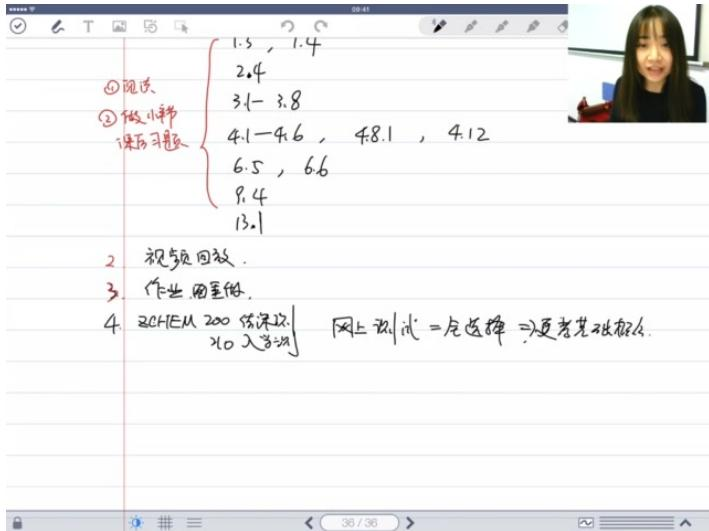

text_image

① 视读
② 做小节课复习习题
1.3, 1.4
2.4
3.1 - 3.8
4.1 - 4.6, 4.8.1, 4.12
6.5, 6.6
9.4
13.1
2 视频回放.
3 作业、教室做.
4 BCHEM 200 练深改
x10 入学法
网上训练=全选择=更考基础概念.

\- 三阶段复习法：

基础巩固：

完成指定章节阅读  
■ 做对应小节课后习题（注意答案可能存在错误需讨论）

\- 深度理解：

■ 观看课程视频回放   
■ 重组作业题目进行针对性练习

○ 效果检验：

■ 参加3月16日前的基础概念测试（全选择题形式）

\- 注意事项：

习题解答需批判性使用，存疑处应在课程群讨论  
- 保持课程群联系以接收测试通知  
- 可选择性回看特定知识点课程录像

四、知识小结

<table><tr><td>知识点</td><td>核心内容</td><td>考试重点/易混淆点</td><td>难度系数</td></tr><tr><td>有机化学定义</td><td>研究碳化合物的学问,强调理性推导和实验科学特性</td><td>化学注重逻辑性和合理性而非绝对正确性</td><td>★★</td></tr><tr><td>成键理论</td><td>价键理论(VB)和分子轨道理论(MO),有机化学主要使用VB理论</td><td>MO理论仅适用于局部基团处理</td><td>★★★</td></tr><tr><td>杂化轨道</td><td>SP3(四面体)、SP2(平面)、SP(线性)杂化</td><td>判断常见原子的杂化方式</td><td>★★</td></tr><tr><td>分子极性</td><td>键极性判断和分子偶极矩计算</td><td>极性分子间作用力类型区分</td><td>★★★</td></tr><tr><td>质子酸碱</td><td>定义、pKa值记忆和影响因素(电负性、共轭效应等)</td><td>常见有机物的pKa值比较</td><td>★★★</td></tr><tr><td>路易斯酸碱</td><td>电子对接受体(酸)和给予体(碱)</td><td>可极化性对碱性的影响</td><td>★★</td></tr><tr><td>构象分析</td><td>乙烷/丁烷构象,环己烷椅式/船式构象</td><td>取代基在直立键/平伏键的位置判断</td><td>★★★★</td></tr><tr><td>立体化学</td><td>手性中心判断、R/S命名、对映体/非对映体区分</td><td>桥头原子的手性判断</td><td>★★★★</td></tr><tr><td>自由基反应</td><td>卤化反应选择性和机理(链引发/传递/终止)</td><td>氯化和溴化的速率/选择性差异</td><td>★★★</td></tr><tr><td>亲核取代</td><td>SN1(两步)和SN2(一步)机理及影响因素</td><td>溶剂效应(质子/非质子)对反应的影响</td><td>★★★★</td></tr><tr><td>碳正离子</td><td>稳定性和重排规律</td><td>重排的驱动力分析</td><td>★★★★</td></tr><tr><td>共振结构</td><td>画稳定共振式和判断电荷分布</td><td>苯环异构体容易被忽略</td><td>★★★</td></tr><tr><td>反应机理</td><td>判断反应类型和写出合理机理步骤</td><td>驱动力(driving force)分析</td><td>★★★★</td></tr></table>