# 一、消除反应02:18

# 1. 消除反应概述 11:13

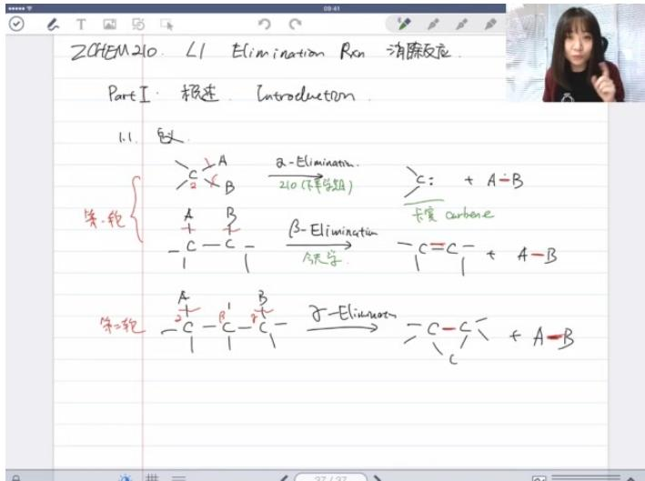

text_image

ZCHEM 210. ∠1 Elimination Rxn 消除反应.
Part I: 极连. Introduction
1.1. 致
矢. 轮
{
    A + B
    -C -C - C
}
A - Elimination
210 (下半学期)
B - Elimination
C = C - C
}
C = + A - B
长宽 carbene
- C = C - C + A - B
A - Elimination
C - C - C + A - B

● 基本定义：消除反应是指一个分子消除小分子生成新化合物的反应，根据消除基团位置不同分为三类：

○ α消除：相邻碳上两个基团消除，生成卡宾（:C = ）结构

\- $\beta$ 消除：相隔一个碳的两个基团消除，生成碳碳双键（ $C = C$ ）

\- γ消除：相隔两个碳的两个基团消除，生成三元环结构

\- $\alpha$ 消除：相邻碳上两个基团消除，生成卡宾（: $C =$ ）结构
- $\beta$ 消除：相隔一个碳的两个基团消除，生成碳碳双键（ $C = C$ ）
- $\gamma$ 消除：相隔两个碳的两个基团消除，生成三元环结构

● 课程重点：本课程主要学习 $\beta$ 消除反应， $\alpha$ 消除将在下学期学习卡宾化学时涉及

● 反应底物：主要研究卤代烃和醇类化合物的消除反应，与上学期亲核取代反应有衔接关系

\- 课程重点：本课程主要学习 $\beta$ 消除反应， $\alpha$ 消除将在下学期学习卡宾化学时涉及
- 反应底物：主要研究卤代烃和醇类化合物的消除反应，与上学期亲核取代反应有衔接关系

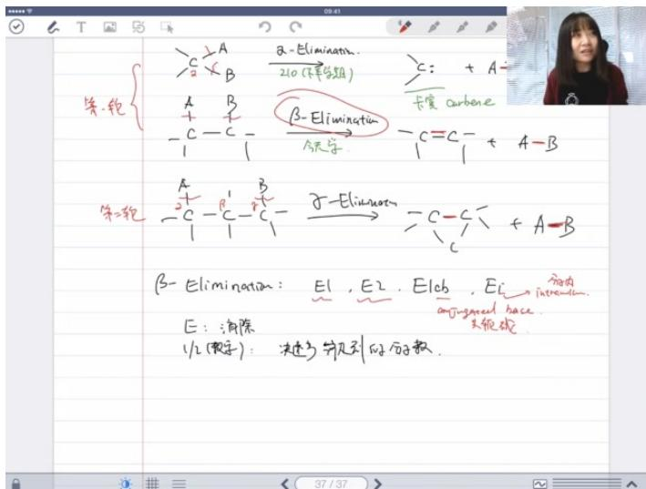

text_image

夹-轮
=>C ⊆ A
=>B × B
β-Elimination.
210(下半学期)
=>C: + A-
长度 carbene
A B
+ -
- C - C - 
A.先学
β-Elimination
→
-C=C-
+ A-B
第二轮
=>C + β' - β'
+ -
- C - C - C'
→
β-Elimination
→
-C-C'
+ A-B
β-Elimination: E1, E2, E1cb, Ei
E: 消除
E: 消除
E: 消除
E: 消除
E: 消除
E: 消除
E: 消除
E: 消除
E: 消除
E: 消除
E: 消除
E: 消除
E: 消除
E: 消除
E: 消除
E: 消除
E: 消除
E: S
E: S
E: S
E: S
E: S
E: S
E: S
E: S
E: S
E: S
E: S
E: S
E: S
E: S
E: S
E: S
E: S
E: S
E: S
E: S
E: S
E: S
E: S
E: S
E: S
E: 37/37

\- β消除分类：

E1: 单分子消除（决速步仅涉及一个分子）

○ E2：双分子消除（决速步涉及两个分子）

○ E1cb：通过共轭碱中间体进行的单分子消除

○ Ei: 分子内消除反应

\- E1：单分子消除（决速步仅涉及一个分子）
- E2：双分子消除（决速步涉及两个分子）
- E1cb：通过共轭碱中间体进行的单分子消除
- Ei：分子内消除反应

● 教学安排：本章重点学习E1和E2机理，E1cb将在羰基化合物章节学习

# 2. 双键的构型 21:17

# 1）构型判断方法

● 顺序规则：比较双键两端取代基的优先级（原子序数大的优先）

○ E构型：优先基团在双键异侧   
○ Z构型：优先基团在双键同侧

\- cis/trans规则：比较相同基团的位置关系

- cis: 相同基团在同侧  
○ trans: 相同基团在异侧

2）例题:e与z/cis与trans判断 22:02

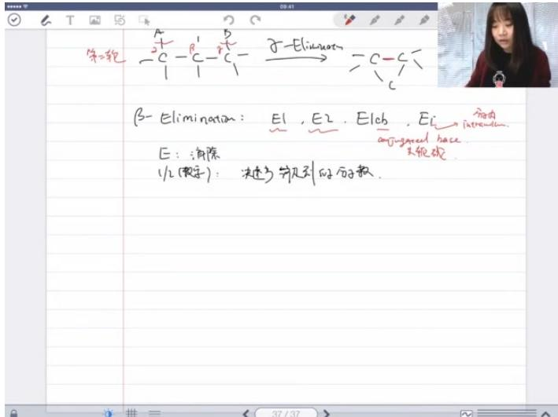

text_image

第二轮
β-Elimination: E1, E2, E1cb, Ec → 分由
a-jugated hace.
E: 消除
1/2(数字): 决步分贝列的分子数.

题目解析

○ 甲基和乙基比较：乙基优先级更高  
- 氢和乙基比较：乙基优先级更高   
- 两个优先基团（乙基）在异侧 $\rightarrow$ E构型  
○ 两个相同乙基在异侧 → trans 构型  
○ 答案：E, trans

3）例题:双键构型判断 24:12

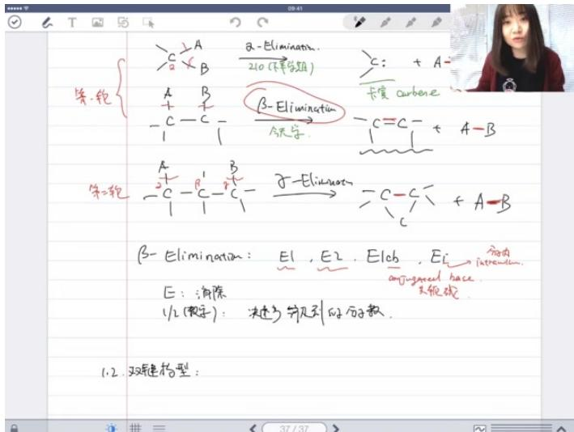

text_image

等-轮
$\frac{2}{a}A$ $\frac{\alpha-Elimination.}{210(平行周期)}$
$\frac{1}{b}A$ $\frac{B}{c}$
-$\frac{1}{1}-C$ $\frac{\beta-Elimination}{今天学.}$ 
$\frac{1}{2}-C$ $\frac{1}{1}+A-B$
$\frac{1}{3}-C$ $\frac{1}{1}+A-B$
$\beta-Elimination: E1, E2, E1cb, Ei$
E: 消除
//2(数字): 决速与等引起的分子数.
1.2. 双链构型:

题目解析

- 氯原子和乙基比较：氯原子优先级更高  
- 氢和乙基比较：乙基优先级更高   
- 两个优先基团（氯和乙基）在同侧 $\rightarrow$ Z构型  
○ 两个相同乙基在异侧 → trans 构型  
○ 易错点：注意氯原子比碳基团优先级高  
○ 答案：Z, trans

3. 双键的稳定性 26:16

1）环因素 27:54

- 八元环规则：八元环以下的环内无法稳定存在反式双键，必须为顺式结构。例如六元环内反式双键极不稳定。  
- 环张力本质：SP2杂化碳的标准键角为 $120^{\circ}$ ，而四元环实际键角约 $90^{\circ}$ ，导致巨大环张力。例如环丁烯的双键极易打开。  
● 例题:环对双键稳定性影响 29:14

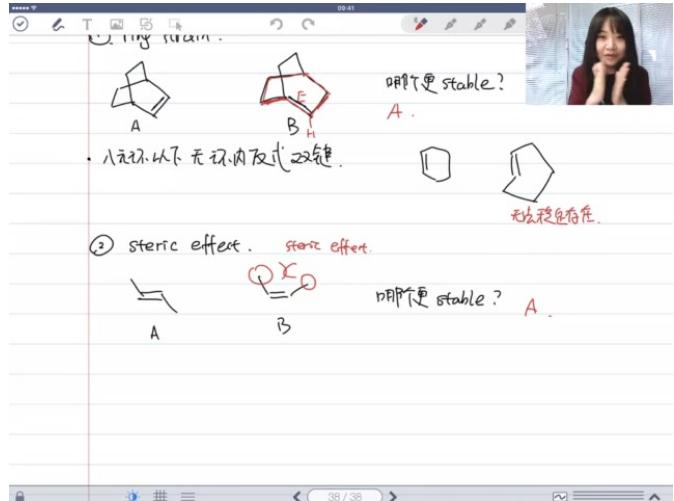

text_image

A
B
F
H
八元环以下 无环内反式双键.
哪个更 stable?
A.
② steric effect. steric effect.
A B
①
B
哪个更 stable? A.
无法稳定存在.

O

○ 题目解析

■ 结构A含顺式双键，结构B含六元环内反式双键  
■ 根据八元环规则，B因含不稳定反式双键而更不稳定  
■ 答案：A比B稳定

2）位阻效应 31:10

- 空间排斥：大基团在双键同侧时产生空间位阻，降低稳定性。例如顺-2-丁烯比反式稳定性差。  
- 物性关联：位阻影响沸点（偶极作用主导）和熔点（分子排列主导），但稳定性判断需单独考虑空间排斥。  
● 例题:位阻效应影响 31:51

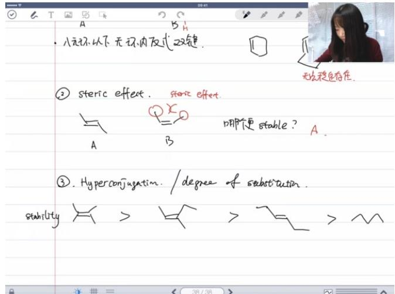

text_image

八元环以下 无环内反式双键.
无处稳是否存在
② steric effect. steric effect
A B 哪个更 stable? A
③. Hyperconjugation / degree of substitution.
stability > > > >

O

○ 题目解析

■ 反式结构避免甲基空间碰撞  
■ 顺式结构存在1.8Å的范德华半径冲突  
■ 答案：反式更稳定

3）超共轭效应 32:47

● 取代度规则：双键碳上取代基越多越稳定，最大取代度为4。例如四取代>三取代>二取代>一取代。

- 本质机理： $\pi$ 电子离域到取代基的 $\sigma^{*}$ 反键轨道（超共轭），体系能量降低。甲基因含更多 $C - H$ 键，超共轭效应显著。  
● 例题:双键稳定性排序 38:16

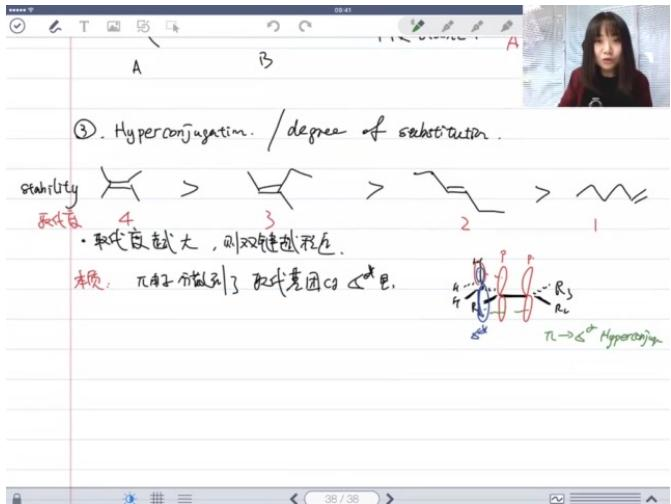

text_image

A
B
③. Hyperconjugation. / degree of substitutin.
stability
4
3
2
1
• 取伦皮越大，则双键越程近.
本质：π粒子分做到了取代衰团的∠*是。
π→∠* Hyperconjugation

O

○ 题目解析

■ 仅考虑取代度因素  
■ 稳定性顺序：四取代(3)>三取代(1)>二取代(2)  
■ 答案：2 < 1 < 3

● 例题:双键稳定性排序 40:21

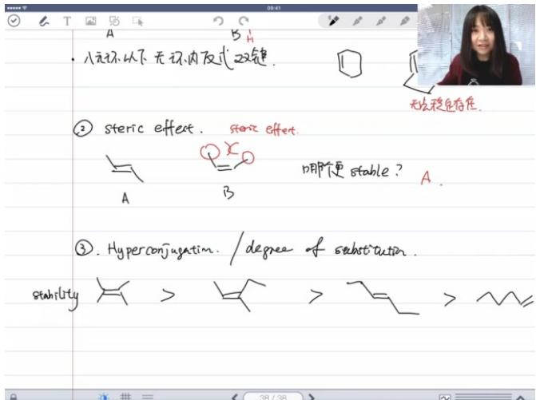

text_image

八元环以下 无环内双式双键.
无光稳自有度.
② steric effect. steric effect.
A B 哪个更 stable? A.
③. Hyperconjugation. / degree of substitution.
stability > > > >

O

○ 题目解析

■ 1和3比较：位阻效应（反式更稳定）  
■ 2和3比较：环张力（四元环极不稳定）  
答案： $2 <   3 <   1$

● 例题:双键稳定性排序 43:17

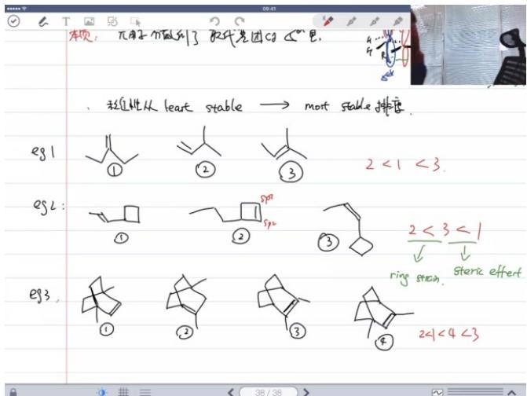

text_image

本页：π粒子分做到了取代基团的C5"里。
、相互比从heart stable → most stable排度。
eg1
①
②
③
2 < 1 < 3.
eg2:
①
②
③
2 < 3 < 1
√ ↓
e93
①
②
③
2 < 1 < 4 < 3
ring stain, steric effect

O

# ○ 题目解析

■ 2含不稳定六元环反式双键   
■ 1/3/4按取代度排序：3(四取代)>4(三取代)>1(二取代)  
■ 答案：2 < 1 < 4 < 3

# 4. 休息 45:47

# 1）课间休息的讨论 48:40

● 直播特点：2.5小时连续授课，允许灵活休息  
● 技术问题：接口异常可能导致屏幕变色，需重新连接

# 2）直播课的问题与反馈 50:02

# ● 教学调整：

- 基础内容全面覆盖，思考题增加难度  
- 通过回放和群投票收集节奏反馈

● 水平差异：后台数据显示学生基础差异显著，需平衡讲解深度

# 5. 一二反应 51:35

# 1）速率方程 52:17

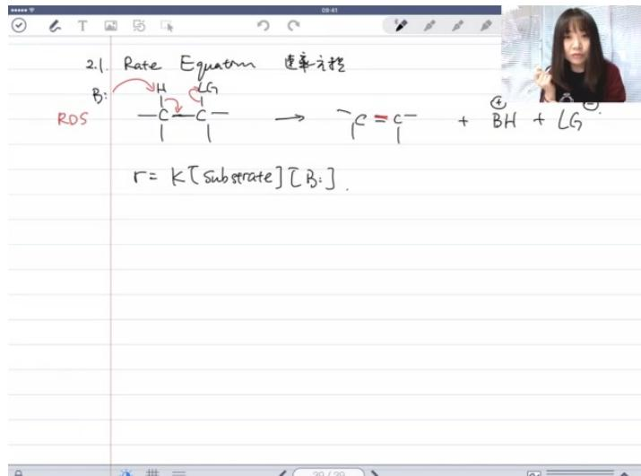

text_image

2.1. Rate Equation 速率方程
B:
RD5
H
C
G
→
C = C-
+ ④ BH + LG
r = K[substrate][B:].
39/39

基本形式： $r = k[\text{substrate}][\text{base}]$ ，反应速率与底物浓度和碱浓度成正比  
● 机理特征：双分子反应（涉及底物和碱两个分子），速率决定步骤是碱夺取β-H和离去基团同时离去  
● 实验意义：通过测定速率方程可区分E2和E1反应机理（E1反应速率仅与底物浓度有关）  
● 例题:卤代氢反应速率排序 56:01

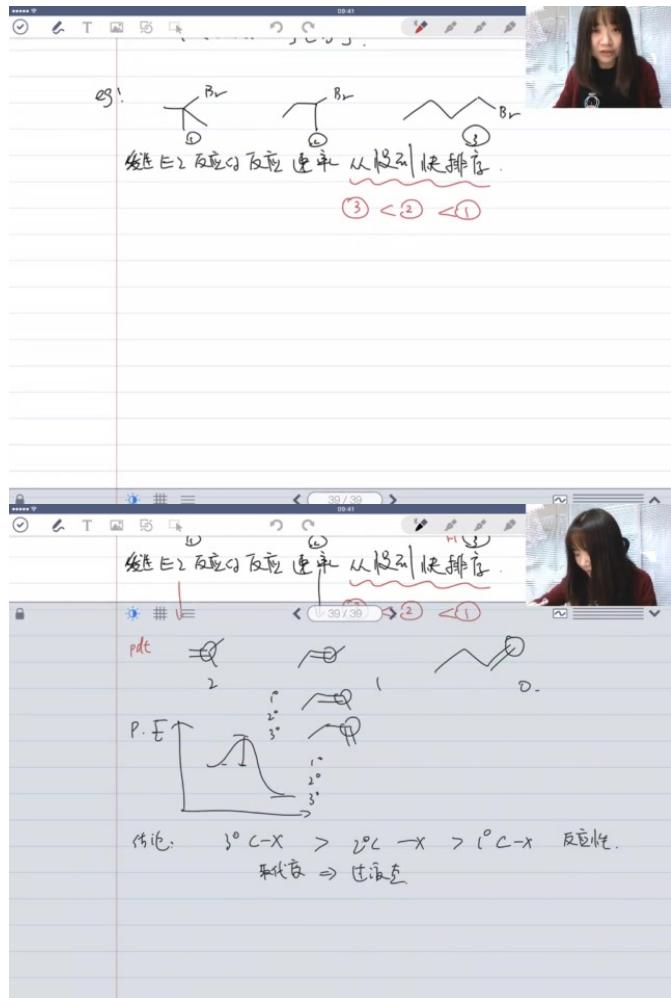

text_image

69!
①
Br
②
Br
③
④
发生E2反应分反应速率 从慢到快排序.
③ < ② < ①
30/39
发性E2反应分反应速率 从慢到快排序.
pdt = 2
P.E.
结论: 3°C - x > 2°C - x > 1°C - x 反定性.
来代替 ⇒ 过液态

○ 题目解析

■ 反应类型：β-消除反应（E2机理）  
■ 关键因素：碳的取代度 $(3^{\circ} > 2^{\circ} > 1^{\circ})$   
■ 原因分析：

● 过渡态能量：取代度越高，过渡态能量越低   
● 产物稳定性：取代度越高，烯烃产物越稳定

■ 答案：反应速率排序为 $3^{\circ}>2^{\circ}>1^{\circ}$   
■ 记忆点：与SN2反应不同，E2反应速率随碳取代度增加而加快

2）区域选择性 01:02:00

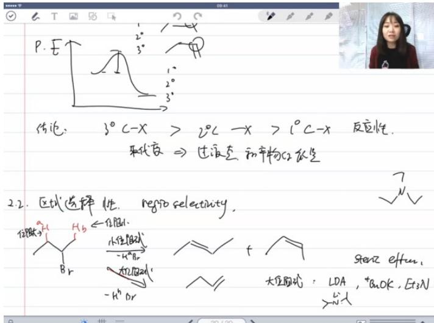

text_image

P.E
结论: 3°C -x > 2°C -x > 1°C -x 反应性.
取代度 ⇒ 过液态和产物的低量
2.2. 区域选择性. regio selectivity.
位图式: Hb ←位图1.
小位图式
-H*Br
大位图式:
-H*Or
= f
stenz effus.
大位图式: LDA, *aOK, Et3N
=N-1

● 基本概念：消除反应中不同β-H被消除导致生成不同构造异构体

# ● 控制因素：

○ 碱的位阻：大位阻碱倾向于消除位阻小的β-H  
○ 产物类型：

■ 霍夫曼产物（动力学控制）：取代度低的烯烃  
■ 扎伊采夫产物（热力学控制）：取代度高的烯烃

# ● 常见碱分类：

○ 大位阻碱：LDA、t-BuOK、Et3N  
○ 小位阻碱：NaOH、NaOMe、醇钠

● 例题:二级碳卤代烃消除反应 01:02:24

○ 题目解析

■ 反应特点：二级碳卤代烃可能生成两种烯烃产物  
选择控制：

● 使用大位阻碱（如t-BuOK）→霍夫曼产物为主  
● 使用小位阻碱（如NaOH）→扎伊采夫产物为主

■ 记忆点：碱的位阻大小决定产物区域选择性

● 例题:氢氧化钾与舒丁醇钾消除反应 01:08:46

○ 题目解析

■ 试剂选择：

● 需要扎伊采夫产物 → 选择NaOH（小位阻碱）  
● 需要霍夫曼产物 → 选择t-BuOK（大位阻碱）

■ 合成策略：选择适当卤代烃结构可减少副产物  
■ 易错点：混淆碱的位阻效应与碱性强弱（二者无必然联系）

# 3）立体选择性 01:14:38

● 例题:二级碳卤代烃消除反应产物构型 01:15:11

\- 消除反应的立体化学

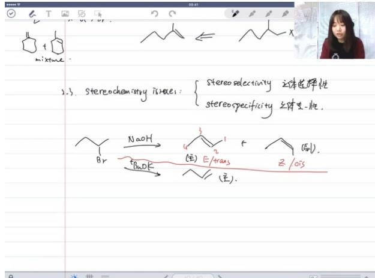

chemical

Hand-drawn chemical reaction scheme showing stereochemistry and stereoselectivity for bromoalkane derivatives

立体选择性：使用氢氧化钠（小位阻碱）时，主要生成E型（反式）产物和少量Z型（顺式）产物的混合物。E型与trans表示相同构型，Z型与cis表示相同构型。  
■ 主产物判断：E型产物由于位阻效应更稳定，是主产物（major product），应标注在反应式主要位置。  
■ 反应条件影响：大位阻碱主要生成霍夫曼产物（取代度少的烯烃），小位阻碱主要生成扎伊采夫产物（热力学稳定产物）。

○ 过渡态分析

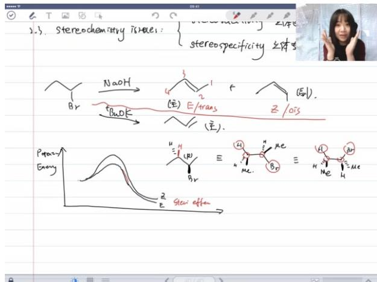

chemical

Hand-drawn chemical reaction scheme showing stereochemistry and stereospecificity of a brominated alkane with NaOH, E/trans, Z/ois, and stereochemical outcomes

■ 反应势能图：原料和产物的能量位置不同，E型产物能量低于Z型产物。  
■ 过渡态稳定性：E型过渡态能量更低，这是由于其构象更稳定（反式交叉构象）。  
■ 纽曼投影式应用：通过纽曼式可以清晰观察位阻效应，解释为什么E型过渡态更稳定。

# ○ 共平面要求

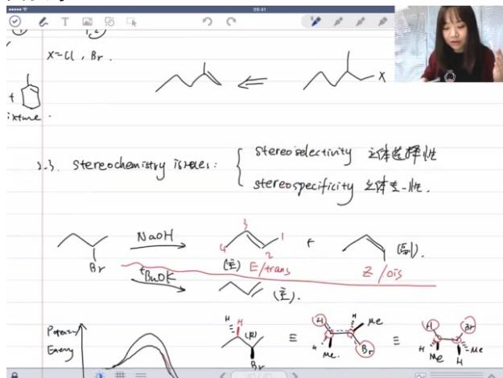

text_image

X=Cl,Br.
+ 
time
2).3. Stereochemistry is/less: { stereoselectivity 立体选择性
stereospecificity 立体是-性.
CH₂ Br NaOH → (电) E/trans + Z /ois
→ BuOK (电).
Potassium Energy
≡ H H Me H H Me H H Me

■ 共平面条件：消除反应要求断开的C-H键和C-X键必须共平面（二面角 $180^{\circ}$ ），因为要形成 $\pi$ 键。

■ 两种共平面方式：

- 反式共平面（anti-coplanar）：H和X在相反侧  
- 顺式共平面（syn-coplanar）：H和X在同侧

■ 优势过渡态：反式共平面对应的过渡态是交叉式构象，比重叠式构象（顺式共平面）更稳定。

# ○ 立体专一性

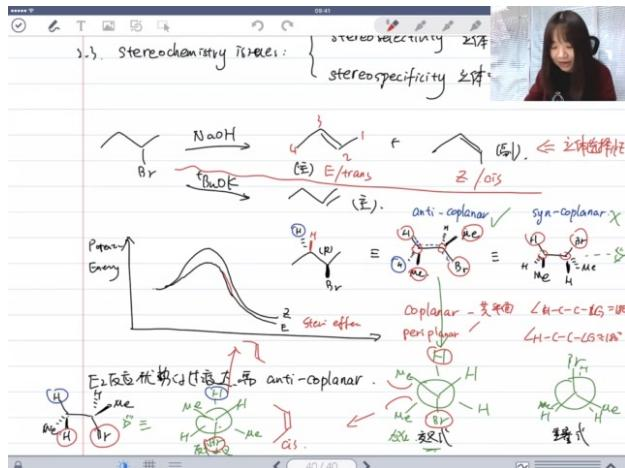

text_image

2.3. Stereochemistry is visible:
stereospecificity 2/3
stereospecificity 立体

Br
NaOH
(E)
E/trans
(Z)
(bu)
Z/OIS

Purity
Energy
(E)
(E)
(E)
(E)
(E)
(E)
(E)
(E)
(E)
(E)
(E)
(E)
(E)
(E)
(E)
(E)
(E)
(E)
(E)
(E)
(E)
(E)
(E)
(E)
(E)
(E)
(E)
(E)
(E)
(E)
(E)
(E)
(E)
(E)
(E)
(E)
(E)
(E)
(E)
(E)
(E)
(E)
(E)
(E)
(E)
(E)
(E)
(E)
(E)
(E)
(E)

E₂反应优势过快为:带 anti-coplanar.

As:

40/40

40/40

40/40

40/40

40/40

40/40

40/40

40/40

40/40

40/40

40/40

40/40

40/40

40/40

40/40

40/40

40/40

40/16

40/16

40/16

40/16

40/16

40/16

40/16

40/16

40/16

40/16

40/16

40/16

40/16

40/16

40/16

40/16

40/16

40
E
H
H
H
H
H
H
H
H
H
H
H
H
H
H
H
H
H
H
H
H
H
H
H
H
H
H
H
H
H
H
H
H
H
H
H
H
H
H
H
H
H
H
H
H
H
H
H
H
H
H
E

定义：当底物特定构型只能得到一种产物构型时，称为立体专一性反应。

■ 示例分析：当β位只有特定氢可被消除时，反应将唯一生成E型或Z型产物，不会得到混合物。

■ 与立体选择性区别：立体选择性得到产物混合物但有主次之分，立体专一性只得到单一产物。

# - 反应机理深入

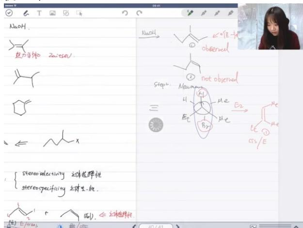

text_image

NaOH.
鱼方生物 Zuiseal.
← x
stereo selectivity 立体选择性
stereo specificity 立体选择性.
(例). ← 立体选择性.
NaOH
①
②
③
Step1. Neumann
H
Et
Me
Bt
Me
→
E2
①
②
③
GS/E
40/41

E2反应特点：协同过程，碱进攻β-H与离去基团离去同时发生。   
■ 速率方程： $r = k[\text{substrate}][\text{base}]$ ，表明反应对底物和碱都是一级。  
■ 反应活性顺序： $3^{\circ}C-X>2^{\circ}C-X>1^{\circ}C-X$ ，与碳正离子稳定性一致。

# - 特殊案例分析

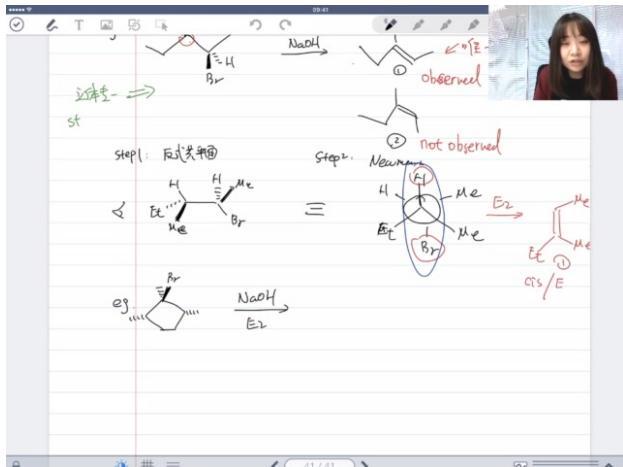

chemical

Reaction mechanism diagram showing step 1 of bromination and subsequent steps with labeled products like Br, NaOH, and E2

环状化合物消除：当无法满足反式共平面时，可能发生顺式消除或反应不发生。

■ 位阻效应：大位阻基团可能迫使反应选择非优势路径，生成非预期产物。

■ 过渡态能量权衡：当最优过渡态无法实现时，系统会选择次优但可行的路径。

○ E1与E2反应比较

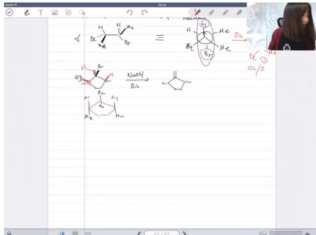

chemical

Chemical reaction diagram showing conversion of bromoalkene to ethyl acetone using NaOH and E2

E1反应特点：分步进行，先离去基团离去生成碳正离子，再失去质子形成双键。  
■ 速率方程差异：E1为r=k[substrate]，只与底物浓度有关。  
■ 伴随反应：E1常伴随碳正离子重排等副反应，而E2通常更干净。

# 6. 万反应 01:46:36

# 1）速率方程 01:48:49

● 例题:万反应底物反应性排序 01:50:35

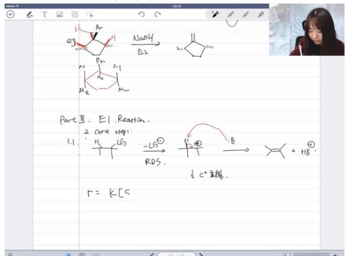

chemical

Chemical reaction diagram showing transformation of a cyclic ketone with NaOH and E2 to form a cyclic product, with reaction conditions and structural formulas.

SN1反应特征：速率方程仅与底物浓度相关，碱的浓度不影响反应速率  
○ 核心步骤：

■ 离去基团离去（必然发生）  
■ 在碱帮助下失质子生成双键（必然发生）

\- 过程特点：称为stepwise process（分步过程），非concerted process（协同过程）

\- 反应性排序： $3^{\circ}$ 碳 $>2^{\circ}$ 碳 $>1^{\circ}$ 碳

■ 原因：碳正离子中间体稳定性随取代基增多而提高（超共轭效应）  
■ 与SN2反应性相反，但与E2反应性相同

# 2）区域选择性 01:53:22

● 例题:万反应主产物判断 01:59:27

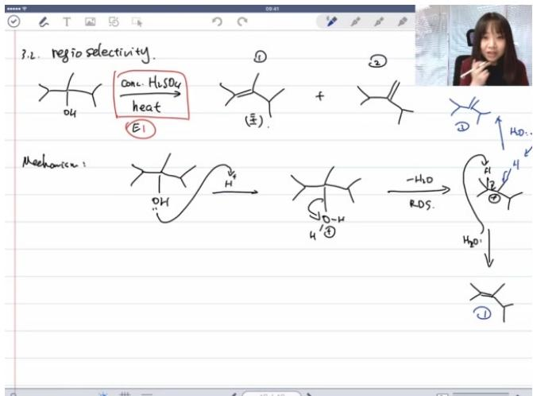

chemical

Reaction mechanism diagram showing hydrolysis of ethyl alcohol with H₂SO₄ under heat, followed by reduction to aldehydes and final products

典型条件：浓硫酸（conc. $\mathrm{H}_2\mathrm{SO}_4$ ）加热，对醇类几乎必然发生E1反应

○ 反应机理：

■ 质子转移（伴随步骤）  
■ 离去基团离去（决速步RDS，生成碳正离子）  
■ 弱碱（如水）进攻β-H，σ键电子转移生成双键

○ 产物判断：

■ 主产物：Zaitsev产物（取代度更高的烯烃，热力学稳定）  
■ 副产物：Hofmann产物（取代度较低的烯烃）

\- 实验依据：通过燃烧热（heat of combustion）测定烯烃稳定性

■ 燃烧热越小表示产物越稳定  
■ 取代度是主要判断因素（超共轭效应）

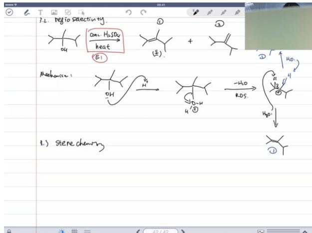

chemical

Chemical reaction scheme showing stereochemistry and hydrolysis steps with labeled reactants and products

○ 与E2区别：E1不存在反式共平面要求（碳正离子为空的p轨道）  
○ 产物分布：主产物约占75%（热力学控制），副产物约占25%

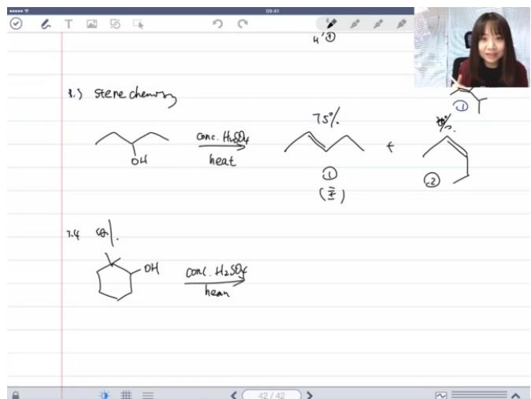

chemical

Chemical reaction scheme showing sterechemistry and condensation steps with catalysts and yields

# ○ 重排规则：

■ 优先迁移最小基团（轨道匹配性）  
■ 当β位有三级/四级碳时必然发生重排

☐ 多产物情况：主产物仍为取代度最高的烯烃（热力学控制），但所有可能的β-H消除产物都会出现

# 二、消除与取代反应的比较 02:09:46

# 1. 判定试剂 02:13:09

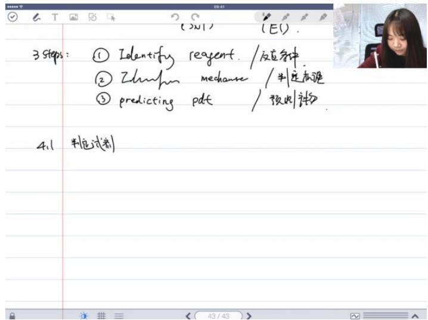

text_image

3 steps: ① Identify reagent. / 反应条件
② Zhunfum mechaure / 判定困难
③ predicting pdt / 预此补物
4.1 判定试剂

# 1）基本概念

- 反应类型判断：首先需要判断反应是亲核取代反应(SN)还是消除反应(E)，本质上是判断试剂是更好的亲核试剂(nucleophile)还是更好的碱(base)  
● 亲核试剂特征：在亲核取代反应中，进攻底物的是亲核试剂(nucleophile)  
● 碱的特征：在消除反应中，进攻试剂是碱(base)

# 2）亲核性与碱性关系

● SN1反应特点：亲核试剂对SN1机理不重要，因为SN1反应首先生成碳正离子  
● SN2反应特点：亲核试剂对SN2机理至关重要  
- 亲核性决定因素：

○ 电荷：电荷越强，亲核性越好  
- 极化性(polarity): 极化性越强, 亲核性越好

● 碱性决定因素：主要取决于电荷密度(在第二章酸碱章节已详细讨论)

# 3）试剂分类

\- 第一类：强亲核试剂/弱碱

○ 特征：strong nucleophile / weak base

# ○ 常见例子:

■ 卤素负离子(特别是碘离子 $I^{-}$ ): 极化能力强  
■ 硫醇(RSH)和硫醇负离子( $RS^{-}$ ): 原子半径大, 极化性好  
■ 硫化氢 $(H_{2}S)$

\- 原因：原子半径效应导致极化性强，但作为共轭碱时碱性弱

# ● 第二类：弱亲核试剂/强碱

○ 特征：weak nucleophile / strong base

# ○ 常见例子：

■ 氢化钠(NaH)/氢化钾(KH): 氢负离子( $H^{-}$ )半径小, 极化性差   
■ DBU(1,8-二氮杂双环[5.4.0]十一碳-7-烯): 位阻效应导致亲核性弱   
■ DBN(1,5-二氮杂双环[4.3.0]壬-5-烯)

○ 特点：几乎不表现亲核性，主要用于拔氢反应

# - 第三类：强亲核试剂/强碱

○ 特征：strong nucleophile / strong base

# ○ 常见例子:

■ 氢氧根 $(OH^{-})$   
■ 醇盐 $(RO^{-}$ ，如甲氧基 $CH_{3}O^{-}$ 、乙氧基 $C_{2}H_{5}O^{-}$ )

特殊情况：叔丁醇钾(t - BuOK)是强碱但中等强度亲核试剂，因位阻效应

# ● 第四类：弱亲核试剂/弱碱

○ 特征：weak nucleophile / weak base

# ○ 常见例子:

水 $(H_{2}O)$   
■ 醇(ROH)

\- 原因：氧原子对电子束缚能力强，极化性弱

# 4）特殊试剂说明

# - 氢化锂铝 $(LiAlH_{4})$

○ 形式上提供氢负离子 $(H^{-})$   
○ 实际是四氢铝负离子 $(AlH_{4}^{-})$ 作为亲核试剂  
○ 因离子半径大而具有良好极化性  
○ 与氢化钠(NaH)不同，具有亲核性

# ● 应用场景：主要在羰基化合物的还原反应中使用

# 2. 判定机理 02:27:38

# 1）四大类试剂的反应特性 02:27:59

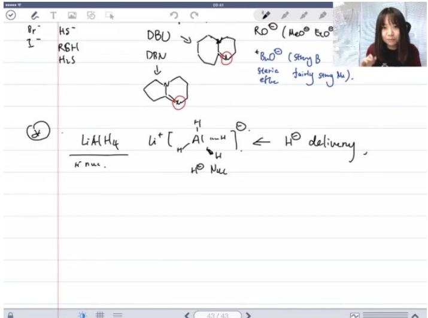

text_image

Br-
I-
HS-
RSH
H2S
DBU
DRN
↓
RO⁻ (Neo² Eco)
+BnO⁻ (Stegy B
steric
efuc fairly seng Nc).
LiAl H4
N- nuc.
Li⁺ [H
A( m-H)⁻]
H⁰ Nuc
← H⁻ delivery,

# - 第一类试剂（强亲核/弱碱）：

○ 特征: strong nucleophile+weak base

\- 反应规律：必然发生亲核取代反应（SN）

■ 1°碳：SN2  
■ 2°碳：SN1或SN2（需考虑溶剂效应）  
■ 3°碳：SN1

○ 典型例子：RSH（硫醇）、HS $^{-}$ （硫氢根）

# - 第二类试剂（弱亲核/强碱）：

○ 特征: weak nucleophile+strong base   
- 反应规律：优先发生消除反应（E）

1°碳：主要E2  
2°碳：主要E2  
■ 3°碳：主要E2

位阻效应：大位阻试剂（如tBuOK）更倾向消除反应

# - 第三类试剂（强亲核/强碱）：

○ 特征: strong nucleophile+strong base   
- 竞争反应：SN2与E2同时发生

■ 1°碳：SN2稍占优势  
■ 2°碳：溶剂决定（极性非质子溶剂有利SN2）  
■ 3°碳：几乎只发生E2

○ 典型例子: $OH^{-}$ (氢氧根)

# ● 第四类试剂（弱亲核/弱碱）：

○ 特征: weak nucleophile+weak base   
○ 反应规律:

■ 1°碳：几乎不反应 (NR)  
■ 2°碳：混合产物或NR  
■ 3°碳：SN1与E1竞争（低温有利SN1，高温有利E1）

○ 典型例子： $H_{2}O$ （水）、ROH（醇）

# 2）反应机理的判定总结 02:36:40

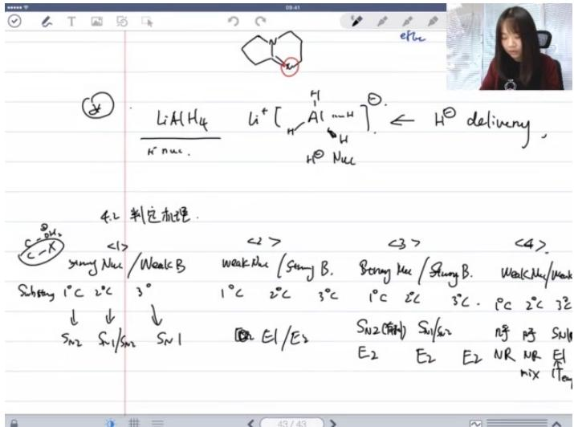

text_image

LiAH₄
H Nuc.
Li⁺ [H-A]⁻
H⁺ Nuc
H⁺ delivery,
4.2 判定机理.
<1>
sung Nuc / Weak B
3°
↓ ↓
Sn2 Sn1/Sn2 Sn1
<< 3>
weak Rhe / Seng B.
1°C 2°C 3°C
E1/E2
Sn2(有H)
E2 E2 E2
≤3>
Bong Nuc / Shang B.
1°C 2°C 3°C
≤3>
Sn2(有H)
E2 E2 E2
≤3>
Wak Nuc/Weak
Wak Nuc/Weak
Wak Nuc/Weak
Wak Nuc/Weak
Wak Nuc/Weak
Wak Nuc/Weak
Wak Nuc/Weak
Wak Nuc/Weak
Wak Nuc/Weak
Wak Nuc/Weak
Wak Nuc/Weak
Wak Nuc/Weak
Wak Nuc/Weak
Wak Nuc/Weak
Wak Nuc/Weak
Wok Nuc/Weak
Wok Nuc/Weak
Wok Nuc/Weak
Wok Nuc/Weak
Wok Nuc/Weak
Wok Nuc/Weak
Wok Nuc/Weak
Wok Nuc/Weak
Wok Nuc/Weak
Wok Nuc/Weak
Wok Nuc/Weak
Wok Nuc/Weak
Wok Nuc/Weak
Wok Nuc/Weak
Wok Nus / Wok Nus / Wok Nus / Wok Nus / Wok Nus / Wok Nus / Wok Nus / Wok Nus / Wok Nus / Wok Nus / Wok Nus / Wok Nus / Wok Nus / Wok Nus / Wok Nus / Wok Nus / Wok Nus / Wok Nus / Wok Nus / Wok Nus / Wok Nus / Sml
SN1/Sml

# 核心原则：

- 亲核性/碱性强度决定反应类型  
○ 碳正离子稳定性决定SN1 / E1可行性  
○ 位阻效应显著影响反应路径选择

# - 温度影响：

- SN1与E1的竞争：低温有利SN1，高温有利E1   
- 原因：E1第二步能垒较高，升温更易克服

# ● 特殊情形：

○ 大位阻底物+大位阻碱：几乎只发生E2  
- 极好离去基团：可能促进E1反应

# 3. 应用案例 02:37:00

# 1）例题：一级碳消除/取代反应判断 02:38:10

# ● 题目解析

- 试剂分析： $OH^{-}$ 属于第三类（强亲核/强碱）  
○ 反应预测：

■ 主反应：SN2（1°碳亲核取代优势）  
■ 副反应：E2（消除反应伴随发生）

○ 位阻考量：无大位阻干扰，SN2过渡态稳定  
- 答案：主产物为SN2取代产物

# 2）例题：三级碳亲和/消除反应判断 02:40:15

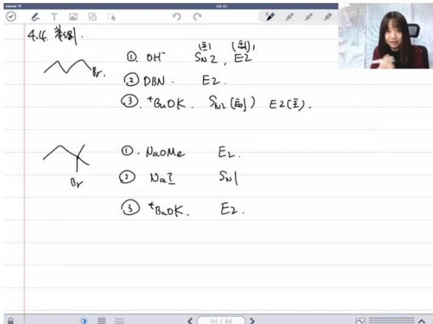

text_image

4.4. 举例.
① OH⁻ (副) (副)
② DBN. E2.
③ +BuOK. Sn2 (副) E2(主).
① NaOMe E2.
② NaI Sn1
③ +BuOK. E2.

# ● 题目解析

- 试剂分析：tBuOK属于第二类（大位阻强碱）  
○ 反应预测：

■ 排除SN反应（3°碳无法SN2，强碱不利SN1）  
■ 专一性E2消除

○ 区域选择性：遵循Zaitsev规则   
- 答案：唯一产物为E2消除产物

# 三、知识小结

<table><tr><td>知识点</td><td>核心内容</td><td>考试重点/易混淆点</td><td>难度系数</td></tr><tr><td>消除反应概述</td><td>分为α、β、γ消除反应;β消除是核心(生成碳碳双键)</td><td>α消除生成卡宾(后期内容) vs β消除的常见性</td><td></td></tr><tr><td>双键稳定性因素</td><td>1. 环张力(八元环以下无稳定反式双键);2. 位阻效应(反式&gt;顺式);3.取代度(超共轭效应主导)</td><td>取代度&gt;位阻的优先级判断</td><td></td></tr><tr><td>E2反应机理</td><td>双分子协同过程:碱拔β-H + 离去基团同步离去(反式共平面过渡态)</td><td>区域选择性:扎伊采夫产物(热力学) vs 霍夫曼产物(动力学)</td><td></td></tr><tr><td>E1反应机理</td><td>分步进行:先离去基团生成碳正离子,再碱拔β-H(无立体专一性)</td><td>碳正离子重排的影响(如甲基迁移)</td><td></td></tr><tr><td>消除 vs 取代判定</td><td>1. 试剂性质(强碱/强亲核性);2. 底物碳级(1°、2°、3°);3. 条件(温度/溶剂)</td><td>强碱+大位阻→E2;弱碱+质子溶剂→SN1/E1</td><td></td></tr><tr><td>立体选择性</td><td>E2需反式共平面过渡态(纽曼式分析);E1无此限制</td><td>环状底物中反式共平面的可行性(如六元环反式双键不稳定)</td><td></td></tr><tr><td>典型反应条件</td><td>- E2:NaOEt/EtOH(小位阻碱)、t-BuOK(大位阻碱);-E1:H2SO4/加热(醇脱水)</td><td>浓硫酸加热专属于醇的E1消除</td><td></td></tr></table>