# 一、缩合反应 13:42

# 1. 课前回顾 14:21

\- 醇的氧化过程: 醇可以氧化成醛, 再进一步氧化成羧酸, 中心碳原子的氧化数逐渐增高。

# 2. 醛的歧化反应 15:23

# 1）歧化反应概述与名称 15:27

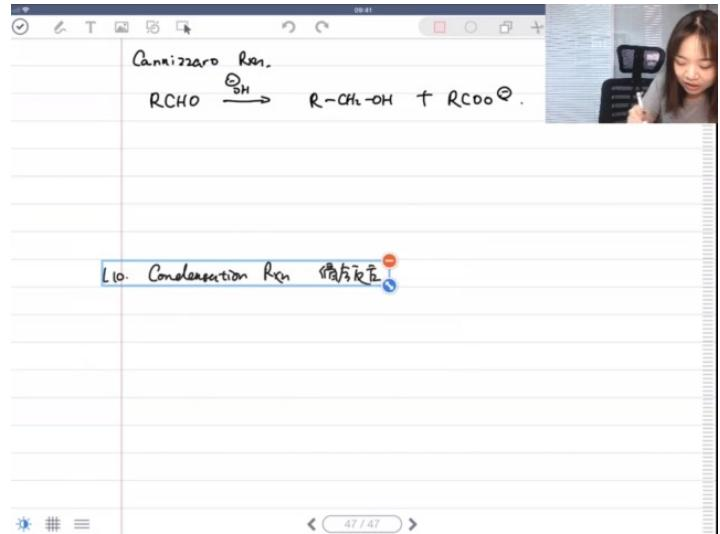

text_image

Cannizzaro Rn
RCHO → R-CH2-OH + RCOO
L10. Conformation Rn  馏方反应

- 反应名称: 该反应称为康尼查罗反应(Cannizzaro Reaction)，是醛在碱性条件下的歧化反应。  
● 反应本质: 本质上属于羰基的加成反应类型。

# 2）歧化反应的条件与产物 15:40

● 反应条件: 必须在碱性水溶液中进行。  
● 反应产物: 醛分子歧化生成对应的醇和羧酸根离子。

\- 反应特点：是醛分子自身的氧化还原反应，一部分被氧化为羧酸，另一部分被还原为醇。

# 3）歧化反应的反应机理 16:07

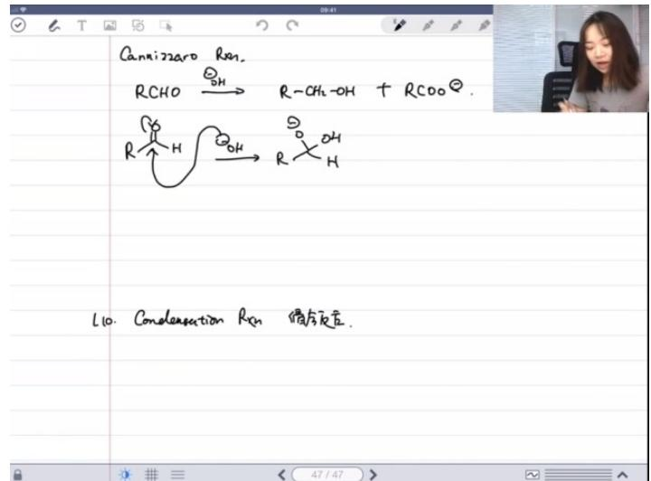

chemical

Hand-drawn chemical reaction diagram showing conversion of RCHO to R-CH2-OH and then to RCOO, with L10 as the step

- 第一步: 亲核加成反应，氢氧根负离子进攻羰基碳。  
- 中间体: 形成带有氧负离子的中间体, 已有羧酸的结构特征。  
- 氢负转移: 氢负离子 $(\mathsf{H}^{-})$ 作为离去基团转移至另一分子醛。  
● 质子转移: 最终通过质子转移得到醇和羧酸根离子。

● 机理特点：反应中醛分子既作为氢负受体又作为氢负供体，类似于氢化铝锂的四氢铝负离子作用。

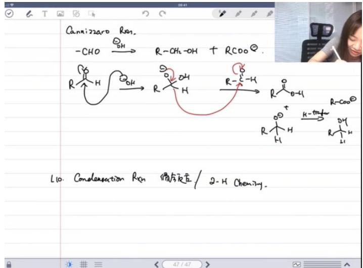

chemical

Hand-drawn chemical reaction equations involving R-CH2-OH and R-COO groups, showing intermediates and products like L10 and 2-H Chemistry.

● 反应限制: 无α-氢的醛(如苯甲醛或三氯乙醛)才能发生此反应。

● 考点提示: 该反应是核心考点之一，需要掌握完整机理和适用条件。

# 3. 缩合反应 18:53

# 1） 枪醛缩合 19:31

\- 烯醇负离子 20:14

例题：烯醇互变异构 20:41

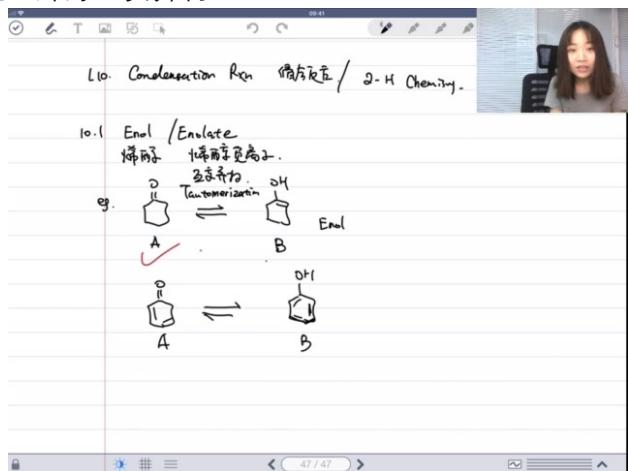

chemical

Chemical reaction diagram showing enol formation from a cyclopentene derivative using Tannoseveriacin and hydroxyl groups

基本概念：

- 烯醇（Enol）由"烯"（ene）和"醇"（ol）组成，指含有碳碳双键和羟基的化合物  
- 烯醇负离子（Enolate）是烯醇的共轭碱形式

■ 互变异构现象：

- 酮（a）与其烯醇形式（b）存在动态平衡，称为互变异构（Tautomerization）  
● 对于简单酮类（如丙酮），平衡显著偏向酮式（a）一方

影响因素：

- 孤立酮的烯醇化比例通常很低（<1%）  
- 分子内氢键可稳定烯醇式，如形成六元环结构时平衡显著右移（实验测得约70%烯醇式）

例题：酮的互变异构 22:11

典型特征：

● 普通酮类（如丙酮）的互变异构平衡常数 $K_{eq} \ll 1$

● 原因：酮式 $(C = O)$ 比烯醇式 $(C = C - OH)$ 更稳定

# ■ 记忆要点：

● 这是基础有机化学中的重要常识性知识  
● 核磁共振实验可定量测定平衡比例（如乙酰乙酸乙酯体系）

例题：苯酚互变异构 23:15

# ■ 特殊案例：

● 当烯醇式具有芳香性时（如苯酚），平衡完全偏向烯醇式  
- 此时不称为"烯醇"而称为"酚"

# ■ 稳定机制：

● 芳香环的共轭效应极大增强稳定性  
● 这是酮-烯醇平衡完全偏向一方的极端案例

# - 复习烯醇负离子 26:37

# 例题：负电荷直接画法 29:00

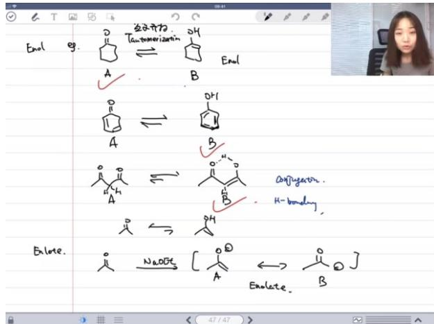

chemical

Chemical reaction diagram showing enol formation and hydrogen bonding, including radical intermediates and electron transfer steps

# ■

# 共振结构：

\- 烯醇负离子存在两种主要共振式：

○ 氧负离子形式（a）： $-O-C=C$ ，更稳定，是主要贡献者  
○ 碳负离子形式（b）： $O = C - C^{-}$ ，虽稳定性较低但机理常用

# ■ 反应应用：

● 碳负离子形式便于描述亲核进攻过程（如构建C-C键）  
● 实际反应中常用弱碱（如 $EtO^{-}$ ）制备强碱性的烯醇负离子

# 平衡特点：

● 制备反应本质是可逆平衡： $R_{2}CH - CO - R' + B^{-} \rightleftharpoons R_{2}C^{-} - CO - R' + HB$   
● 平衡常数 $K_{eq}<1$ ，但后续反应消耗产物可使平衡右移

# ○ 醛的pKa值 30:06

# ■ 关键数据：

- 丙酮 $\alpha$ -H的 $pK_{a} \approx 20 - 21$   
- 乙醇 $p{K}_{a} = {17}$

# ■ 反应矛盾解析：

- 表面看是用弱碱（ $EtO^{-}$ ，共轭酸 $pK_{a}=17$ ）制备强碱（烯醇负离子，共轭酸 $pK_{a}=20$ ）  
● 实际可行原因：后续C-C键形成反应提供热力学驱动力

# ■ 教学提示:

● 这是有机合成中"表观热力学矛盾"的典型案例  
● 需结合整体反应进程理解表观平衡移动

# - 羌醛反应 32:05

# 例题:羌醛反应留级产品分析 33:37

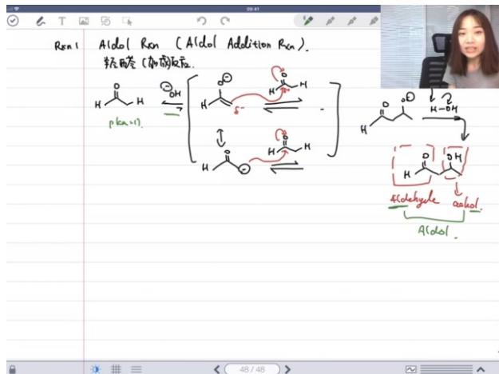

chemical

Chemical reaction diagram showing aldol addition with aldehyde to form alcohols, including intermediate structures and reaction conditions.

# ■ 反应机理:

● 醛在碱性条件下先形成烯醇负离子（enolate）  
- 烯醇负离子中的碳负离子（ $C^{\delta}$ -）进攻另一分子醛的羰基碳（ $C^{\delta}+$ ）  
● 形成新的碳碳键，得到β-羟基醛（aldol）产物

# 平衡特点:

● 使用弱碱（如 $OH^{-}$ ）时，体系中同时存在醛和烯醇负离子  
● 醛的pKa≈17，水的pKa=14，平衡偏向醛自身存在

# 命名来源:

● "aldol"来自醛（aldehyde）和醇（alcohol）的词头组合  
● 产物同时含有醛基和羟基官能团

例题:醛的烯醇负离子反应产物分析 44:45

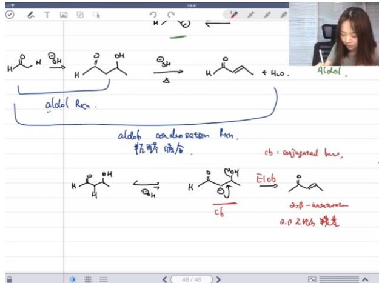

chemical

Chemical reaction scheme showing aldehyde formation and subsequent reduction with hydrogenation, including molecular structures and reaction conditions.

# ■ 反应分类:

- aldol addition（加成反应）：仅形成新的C-C键，得到β-羟基醛  
- aldol condensation（缩合反应）：进一步脱水形成α,β-不饱和羰基化合物

# ■ 消除机理:

● 通过E1cb机理（单分子共轭碱消除）  
● 先形成共轭碱（conjugate base），再发生单分子消除

# ■ 产物稳定性:

● 主要生成热力学更稳定的反式（E式）产物  
● 副产物为顺式（Z式）异构体

# ■ 反应条件影响:

● 加热促进缩合反应（熵增有利）  
● 强共轭效应存在时，不加热也可能发生缩合

例题:交叉羌醛反应产物分析 53:21

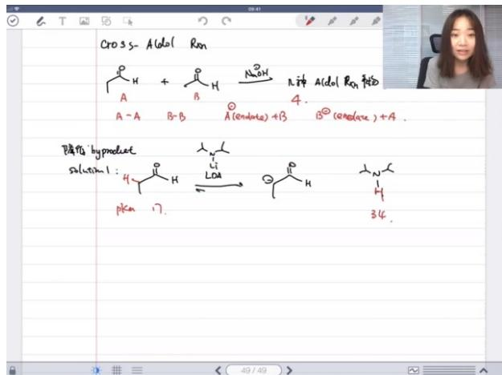

chemical

Chemical reaction scheme showing cross-alcohol conversion with aldehyde and amide groups, yielding products like pentamethylhydrazine and dihydroxybenzene derivatives.

# 混合反应产物:

\- 两种醛混合时可能产生4种产物：

○ A醛自身缩合  
○ B醛自身缩合  
○ A的烯醇负离子进攻B醛  
○ B的烯醇负离子进攻A醛

# 选择性控制:

● 使用强碱（如LDA）定量生成特定烯醇负离子  
● 低温条件下缓慢加入第二种醛

# ■ 副反应控制:

● 避免烯醇负离子交换平衡   
● 温度控制防止逆向反应发生

# ■ 合成应用:

● 通过控制条件可选择性构建特定C-C键  
● 适用于复杂分子的定向合成

# ● 副产物分析 59:59

副产物产生的原因与影响 01:00:23

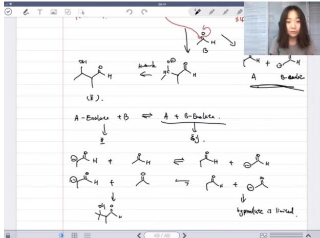

chemical

Hand-drawn chemical reaction equations showing enol formation and subsequent products with structural formulas

交叉偶联的本质：实际并非真正的交叉偶联反应，而是强权反应（aldol reaction）的变种  
■ 副产物检测标准：实验时需观察混合物中白色副产物的量，若量小则可接受  
■ 不可避免性：副反应路径几乎无法完全避免，特别是当反应物B为醛类时（醛的α-H酸性pKa≈17）  
平衡问题：醛的烯醇负离子（enolate）夺取酮的α-H（pKa≈20）时，平衡较均匀导致副产物难以抑制

# 副产物抑制的方法一：选择合适的反应顺序与强碱 01:03:51

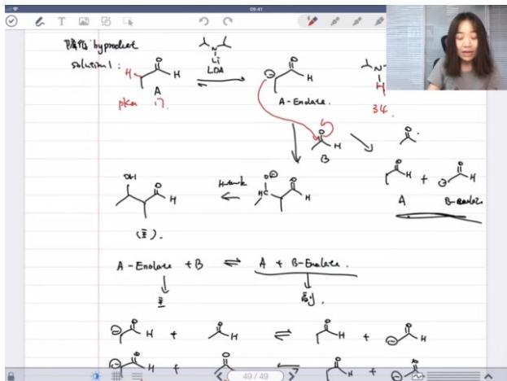

chemical

Chemical reaction scheme showing enol formation and rearrangement of a ketone with PKa, including intermediates A- and B- and products A and B.

■ 反应顺序选择：优先制备特定烯醇负离子（如酮的enolate）再与另一羰基化合物反应

■ 强碱作用：

● 使用LDA等强碱可完全生成enolate  
● 有效抑制自身aldol缩合（self aldol reaction）

■ 酸碱平衡原理：强酸（酮enolate）+弱碱（醛enolate）→弱酸+强碱，使平衡显著左移

副产物抑制的方法二：选择无阿尔法氢的羰基化合物 01:04:21

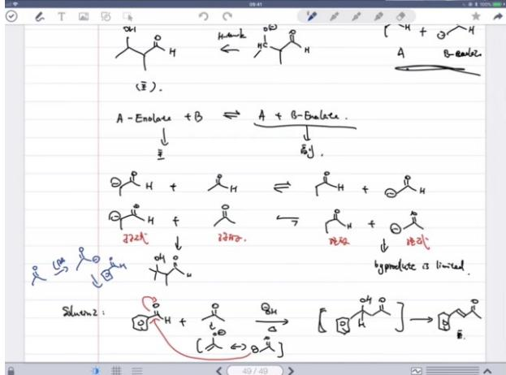

chemical

Chemical reaction scheme showing enolase and β-enolate intermediates with electron transfer steps and a hypothetical product diagram

典型实例：苯甲醛（无α-H）与丙酮在NaOH水溶液中加热

● 只有丙酮能生成enolate  
● 醛的羰基正电性更强（δ+）、位阻更小，优先被亲核进攻

■ 反应特点：

● 中间产物迅速脱水生成反式 $\alpha,\beta-$ 不饱和羰基化合物  
● 自缩合产物几乎不可见

■ 进阶方案：先用LDA完全制备enolate，再加入无α-H的羰基化合物

◦ 实验室操作中的成本考虑 01:08:18

■ 碱的选择权衡：

● 理想情况：使用LDA确保完全转化  
● 实际选择：优先使用NaOH等弱碱（成本仅为LDA的1/50）

■ 反应性判断：当两种羰基化合物反应活性差异明显时，弱碱方案仍可行

● 应用案例 01:13:21

例题:醛的烯醇负离子反应新构建碳碳键分析

■ 题目解析

● 键位识别：在 $\alpha,\beta-$ 不饱和羰基结构中定位新形成的C-C键（共轭双键与羰基之间的单键）

# - 逆向分析:

- 烯醇负离子部分：提供亲核中心的酮/醛  
- 羰基部分：接受亲核进攻的醛（特别是苯甲醛等芳香醛）

● 典型错误：混淆亲核试剂与亲电试剂的角色

例题:分子内aldol缩合分析 01:17:04

# ■ 题目解析

● 环化特征：识别分子内形成的5/6元环结构

# - 断键策略：

- 断开α,β-不饱和键中与羰基相邻的C-C键   
○ 烯醇负离子碳始终连接在双键的α位

● 空间构型：加热条件下产物以反式构型为主

# 2）纸之间的缩合反应 01:18:55

# - 克莱森缩合反应 01:19:24

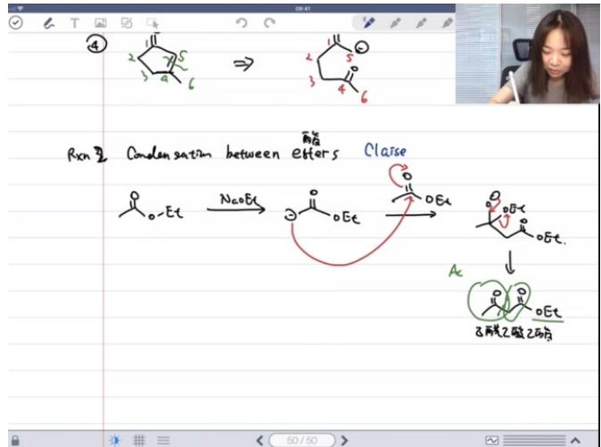

chemical

Chemical reaction scheme showing condensation between enantiomers and esters, forming a para-ester with 8-butene and 2-butene derivatives

反应机理：酯类在碱性条件下（如乙醇钠）发生缩合反应，乙酸乙酯的α-氢被拔除形成碳负离子，进攻另一分子酯的羰基碳，最终生成β-酮酯（乙酰乙酸乙酯）。  
○ 关键中间体：反应会生成烯醇负离子中间体，乙醇钠碱性不足以完全拔氢，体系中存在平衡。  
☐ 产物处理：需加酸淬灭才能得到最终产物，因为乙醇钠条件下会停留在中间体阶段（pKa=9的酸性强于水pKa=14）。  
■ 不能使用氢氧化钠（会导致酯水解生成羧酸盐）  
■ 最好不用甲醇钠（可能发生酯交换副反应）  
- 交叉缩合：使用更强碱（如LDA）可抑制自身缩合，实现不同酯间的交叉缩合。

# ○ 注意事项：

# 3）烷基化反应 01:24:59

● 动力学与热力学控制 01:28:35

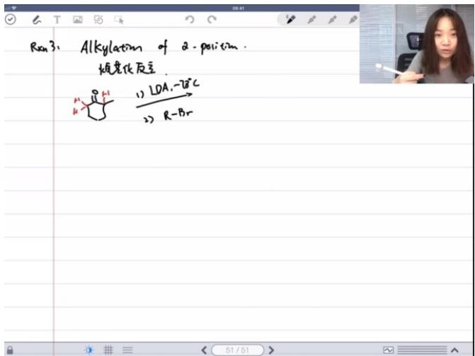

text_image

Rm3: Alkylation of 2-position.
烷老化反应
1) LDA, -7°C
2) R-Br

O   
- 反应类型：α-碳负离子对卤代烃的SN2取代反应。  
○ 控制因素：

■ 动力学控制：低温 $(-78^{\circ}\mathrm{C})+$ 大位阻碱(LDA)→进攻位阻小的 $\alpha$ 位  
■ 热力学控制：室温+小位阻碱(NaH)→生成更稳定的多取代烯醇负离子

碱的选择：必须使用强碱（如NaH、LDA），弱碱（如OH-）会引发醛醇缩合副反应。  
- 应用示例：不对称酮的烷基化，通过条件选择可控制产物结构。

# 4）卤仿反应 01:40:51

● 反应机理 01:41:05

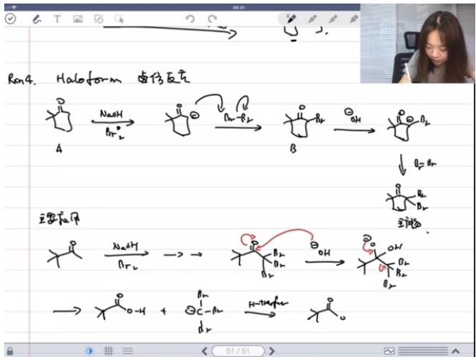

chemical

Reaction mechanism diagram for halogenation of a cyclic anhydride, showing intermediates A and B with reagents NaOH, Br₂, and OH.

O   
反应过程：甲基酮在碱性条件下连续卤化，最终碳碳键断裂生成羧酸盐和三卤甲烷（卤仿）。  
○ 关键步骤：

■ 多次卤化使α-C上积累卤素  
■ OH-进攻羰基引发碳碳键断裂   
■ 三卤甲基成为良好离去基团

○ 应用：将甲基酮转化为少一个碳的羧酸（降解反应）。  
○ 命名来源：当卤素为氯时产物为氯仿（CHCl₃），故称卤仿反应。

● 单卤化酸催化 01:45:17

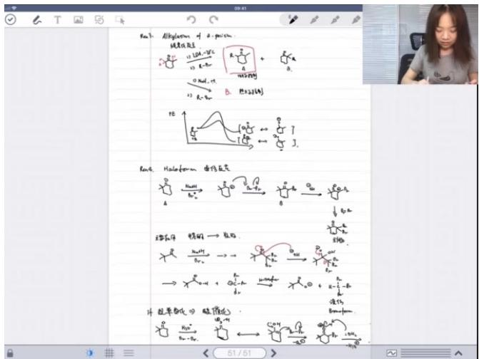

chemical

Chemical reaction equations and diagrams for alkyl halide formation, including electron transfer and radical addition steps

○ 控制方法：酸性条件下可实现α位单卤化，避免碱性条件下的多卤化。  
☐ 原因：酸催化下烯醇式浓度低，且单卤化产物酸性弱于原料，反应可停止在单取代阶段。  
- 自催化现象：反应生成的HX可加速互变异构，形成自催化循环。  
○ 互变异构：酸/碱催化可加速酮-烯醇互变，中性条件下互变速率较慢。

# 二、麦克尔加成 01:54:00

1. 麦克尔加成反应的定义 01:55:54

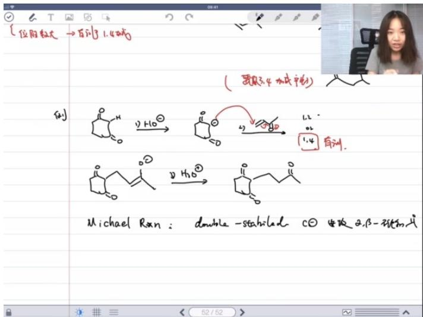

chemical

Hand-drawn chemical reaction scheme showing Michael Rxn transformation with dihydrogenation and stability conditions

● 核心特征：由双重稳定的碳负离子进攻α,β-不饱和羰基化合物的反应  
● 反应本质：构建碳碳键的重要方法，属于1,4-共轭加成  
● 稳定条件：碳负离子需被两个吸电子基团稳定（如烯醇负离子）

2. 麦克尔加成反应的特点 01:56:32

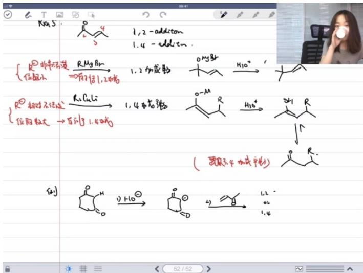

chemical

Chemical reaction equations for carbocation rearrangement using R-MgBr and R-CuLi, showing radical intermediates and products

● 位阻影响：当 $\alpha$ 位取代基（R）较大时，更倾向于1,4-加成产物  
● 碳负活性：不活泼的碳负离子优先进行1,4-加成  
● 电子效应：推电子作用通过共轭体系传递（如1234编号体系所示）

# 3. 麦克尔加成反应的变种 01:57:20

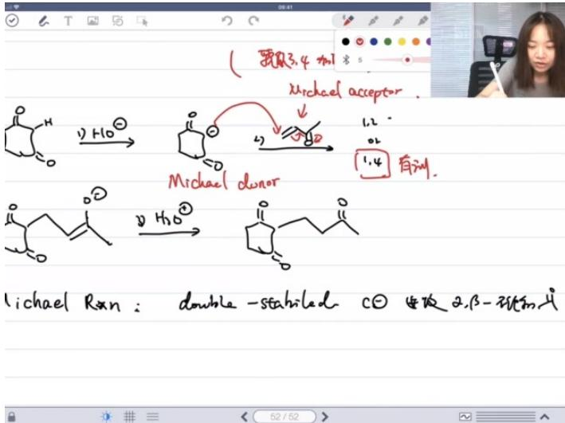

chemical

Reaction mechanism diagram showing Michael acceptor and Michael donor forming a double-stabilized ketone with β-unsaturated form

组分分类：

○ Michael donor: 给电子组分（如烯醇负离子）  
○ Michael acceptor: 受电子组分 ( $\alpha,\beta$ -不饱和羰基化合物)

● 特殊形式：硝基稳定的碳负离子虽非双重稳定，但因强吸电子效应仍可发生类似反应

# 4. 麦克尔加成反应的特例 01:58:00

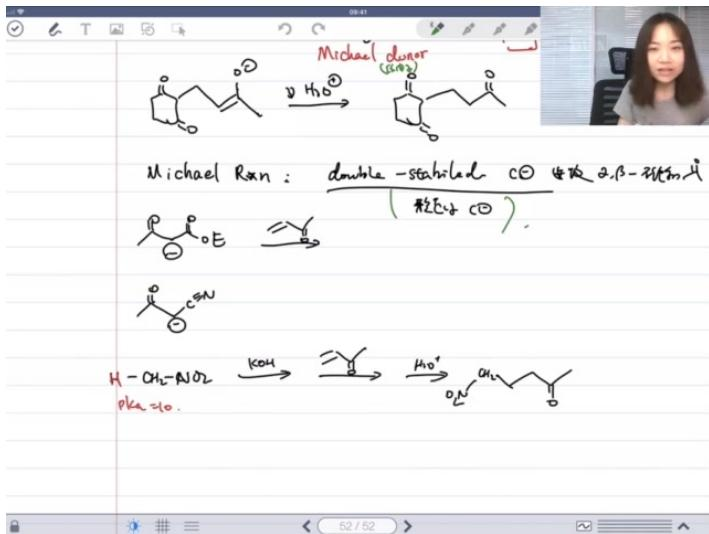

chemical

Chemical reaction scheme showing Michael Rxn reacting with dihydroxyethanol to form double-stabilized carbon and β-phenyl ester, followed by hydrogenation and subsequent reduction to aldehyde.

- 硝基化合物：pKa=10时，虽只有一个吸电子基团（-NO₂），但因形成稳定碳负离子仍可发生反应  
● 反应界限：严格定义下不属于缩合反应（未失去小分子）

# 三、应用案例 01:59:46

# 1. 分步烷基化反应

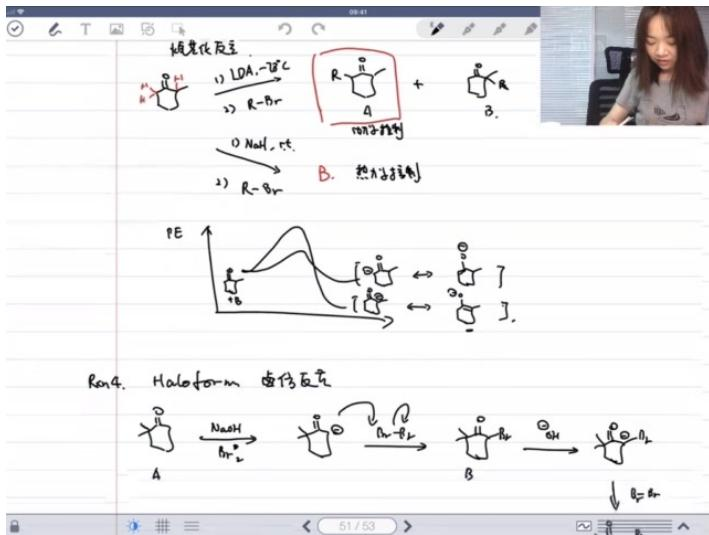

chemical

Chemical reaction scheme showing stereoselective and halogenetic formation of a substituted cyclohexene derivative with R groups and electron transfer pathways

反应步骤：

○ 乙基铜锂试剂进行1,4-加成  
- 碘甲烷进行氧烷基化（O-attack）

● 区域选择性：烯醇负离子主要发生碳进攻（C-attack），仅在强热力学驱动（如Si-O键形成）时发生氧进攻

# 2. 烯醇负离子捕获

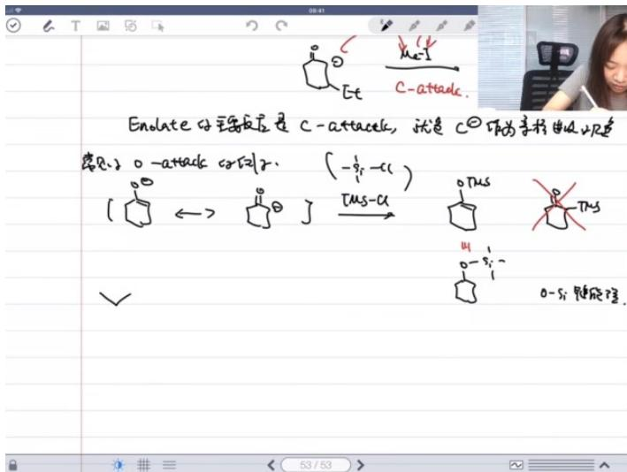

chemical

Chemical reaction diagram showing enolate formation and electron transfer steps with cyclopentadienyl and triethylsilyl groups

● 捕获方法：使用TMSCI（三甲基氯硅烷）捕获烯醇氧负离子  
● 驱动力：强Si-O键形成（键能498 kJ/mol）  
- 分离应用：不同烯醇硅醚沸点差异可用于分离异构体

# 3. 例题：双烷基化反应

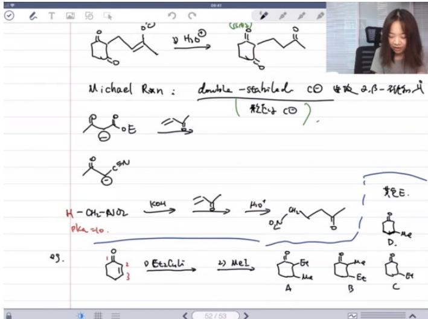

chemical

Chemical reaction scheme showing Michael Rxn-catalyzed cyclization of a ketone to form cyclic products with stereochemistry and reagents

# ● 题目解析

○ 关键机理:

■ 乙基铜锂的1,4-共轭加成  
■ 碘甲烷的O-烷基化

典型错误：误认为会发生C-烷基化（实际主要产物为O-烷基化）

○ 答案：B选项（2位甲基化，3位乙基化产物）

# 四、例题:希夫碱的制备与应用 02:15:35

# 1. Michael加成反应机理

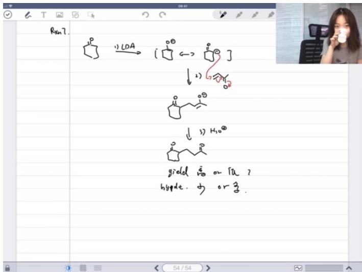

chemical

Reaction scheme showing LDA and H2O steps with cyclopentadienyl and diethylcyclopropane structures, including yield and hypotension conditions

- 反应条件限制：需要相对稳定的碳负离子才能有效发生1,4-加成，碱性过强的烯醇负离子（如酮衍生的enolate）会导致副反应增多  
- 副反应来源：

○ 1,2-加成产物（直接亲核加成）  
○ 质子迁移反应（碱性过强导致质子交换）

\- 关键对比：酮衍生的enolate碱性 $(pK_{a} \sim 20)$ 比 $\alpha, \beta$ -不饱和酮的 $\alpha$ -H酸性 $(pK_{a} \sim 25)$ 更强，导致平衡不利

# 2. Stork烯胺合成法

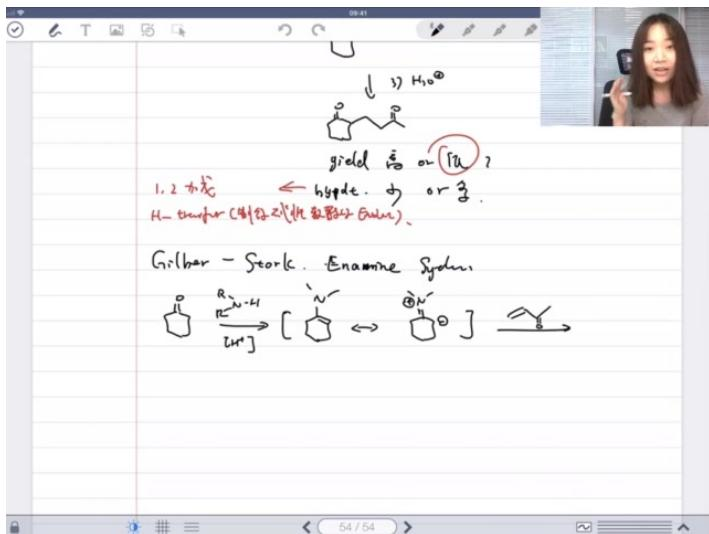

chemical

Chemical reaction diagram showing hydrogenation of alkenes with yield and enamine to form a hydrocarbon product

\- 反应步骤：

○ 将酮转化为烯胺（二级胺反应）  
- 酸性条件下与 $\alpha, \beta$ -不饱和羰基化合物发生Michael加成  
○ 水解得到双羰基化合物

● 优势机理：

- 烯胺中间体的碳负离子稳定性高于直接enolate   
- 氮原子的给电子效应使亲核性更温和  
○ 大位阻氮取代基促进1,4-加成而非1,2-加成

\- 命名反应：由哥伦比亚大学Hilbert/Stork教授发展，属于"烯胺合成法"(Enamine Synthesis)

# 五、例题:卤代醇的烷基化反应02:24:37

# 1. 三乙试剂的应用

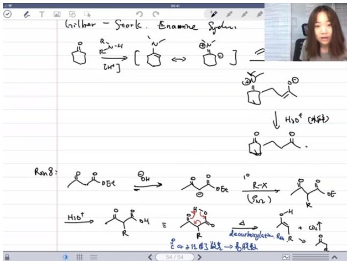

chemical

Chemical reaction equations for enamine synthesis using Ran8 catalyst and decarboxylation, showing intermediates and products like [CH2] and [CH2O]

# - 反应特点：

○ 使用三乙(丙二酸二乙酯)作为酸性底物 $(pK_{a}\sim10)$   
- 与氢氧化钠形成平衡，但主要生成enolate形式  
○ 与一级卤代烃发生 $S_{N}$ 2烷基化反应

# - 后续转化：

- 酸性条件下酯水解生成二酸   
◦ 加热脱羧（通过六元环过渡态）  
- 净效果：在酮的α位引入烷基

# 2. 脱羧反应机理

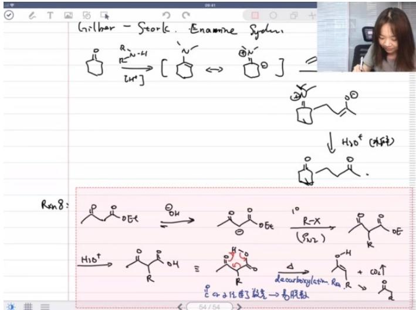

chemical

Chemical reaction scheme showing Grilbar-Storecic-Alkene (Sydmin) reacting with a diethyl radical to form a ketone and then deacryloyl radical, with hydrogenation steps indicated.

# 反应条件：需要羰基α位连接羧基

# ● 机理特点：

○ 周环反应机理（六元环过渡态）  
- 驱动力：生成二氧化碳气体  
○ 电子迁移导致羧基脱除

# - 合成应用：

○ 增长碳链的方法（制备甲基酮）  
○ 丙二酸酯衍生物的类似反应可构建更复杂骨架

# 六、三乙酯的脱羧反应 02:29:46

# 1. 反应过程概述 02:30:35

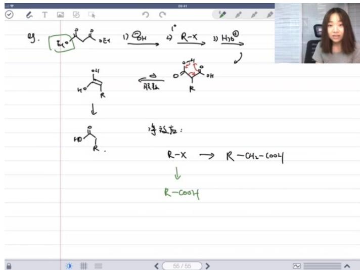

chemical

Chemical reaction pathway showing epoxide ring opening and subsequent hydrolysis to form ketone and alcohol, with equilibrium point R-CH2-COOH

- 碳负离子形成: 第一步在碱性条件下生成碳负离子, $R - x \rightarrow R - CH_{2} - (OOL)$   
● 亲核取代: 第二步碳负离子与卤代烃发生 $S_{N}$ 2反应，将烷基引入中间碳位  
● 水解过程: 水解使酯基转化为羧基, 最终产物为R-COOH

# 2. 脱羧反应的净效应 02:31:41

● 净效应: 该系列反应的最终效果是将卤代烃转化为多两个碳的羧酸  
- 单碳延伸法：若需制备多一个碳的羧酸，可通过格式试剂途径：卤代烃 $\rightarrow$ 格氏试剂 $\rightarrow$ 通 $CO_{2} \rightarrow$ 水解

# 3. 合成方法的应用与拓展 02:32:04

● 反应本质：通过构建带负电荷的碳（碳负离子）进攻带部分正电荷的碳，形成新的碳碳键  
- 应用特点:

- 此类构建碳碳键的反应种类繁多  
- 关键在于理解反应机理而非死记硬背  
◦ 作业将以多种变式进行强化训练

# 4. 反应机理与电子流向 02:32:50

● 电子规律: 电子永远从电荷密度高 ( $\delta^{-}$ ) 区域流向电荷密度低 ( $\delta^{+}$ ) 区域  
● 判断要点:

- 正确绘制电子流向箭头  
- 不涉及立体化学问题（针对国初考试）  
○ 机理分析重于产物记忆

# 5. 康尼查罗反应条件 02:33:26

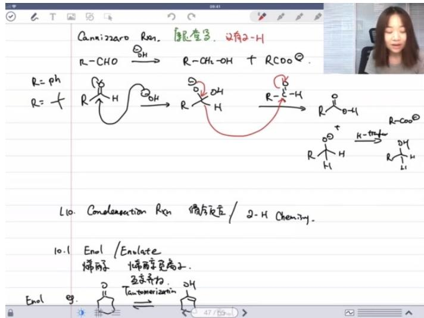

chemical

Handwritten chemical reaction equations and molecular structures for enol formation

● 关键区别: 与醛的碱催化反应不同, 康尼查罗反应要求醛分子不含α-氢  
● 反应式: $2R-CHO\rightarrow R-CH_{2}OH+RCOO^{-}$ （当R=Ph时典型）  
- 互变异构: 产物会通过烯醇式-酮式互变异构（Enol-Keto tautomerization）达到稳定

# 七、课后总结 02:33:49

● 重要性: 本讲内容是有机化学最核心的反应类型之一  
- 学习建议:

- 必须完成配套作业（含多种合成应用）  
- 未完全掌握属正常现象（大学需2-3课时）  
○ 通过机理推导练习弥补记忆不足

● 复习重点: 碳负离子形成、亲核取代、电子流向判断三要素

八、知识小结 

<table><tr><td>知识点</td><td>核心内容</td><td>考试重点/易混淆点</td><td>难度系数</td></tr><tr><td>醛酮缩合反应</td><td>醛/酮在碱性条件下通过烯醇负离子中间体构建碳碳键</td><td>区分醛酮自缩合与交叉缩合</td><td></td></tr><tr><td>烯醇-酮互变异构</td><td>酮与烯醇的平衡关系及影响因素</td><td>苯酚类化合物更稳定于烯醇式</td><td></td></tr><tr><td>克莱森缩合反应</td><td>酯类在碱性条件下的缩合反应(如乙酰乙酸乙酯合成)</td><td>需酸淬灭才能得到最终产物</td><td></td></tr><tr><td>卤仿反应</td><td>甲基酮通过多卤代生成羧酸(减少一个碳)</td><td>反应不可停留在单卤代阶段</td><td>★★★</td></tr><tr><td>迈克尔加成</td><td>稳定碳负离子与α,β-不饱和羰基化合物的1,4-加成</td><td>区分给体与受体角色</td><td></td></tr><tr><td>烷基化反应</td><td>烯醇负离子的碳/氧烷基化选择性问题</td><td>大位阻碱倾向于动力学产物</td><td></td></tr><tr><td>脱羧反应</td><td>β-酮酸加热脱羧生成酮类</td><td>六元环过渡态机理</td><td></td></tr><tr><td>烯胺反应</td><td>通过烯胺中间体实现温和的烷基化</td><td>避免强碱性条件导致副反应</td><td></td></tr><tr><td>羟醛缩合vs歧化</td><td>有α-H的醛发生缩合,无α-H的醛发生歧化(Cannizzaro)</td><td>反应条件相同但底物结构决定路径</td><td></td></tr><tr><td>合成策略</td><td>三乙法/丙二酸酯法构建碳骨架</td><td>脱羧反应在碳链缩短中的应用</td><td></td></tr></table>