# 一、作业讲解01:56

# 1. 例题1: 醇和烯醇的互变异构 02:04

# 1）互变异构机理

- 碱催化机理：更直观简单，通过碱夺取醇的 $\alpha$ -H形成烯醇负离子，再质子化得到烯醇。  
- 酸催化机理：需注意氧质子化后脱质子的方式，应通过水分子（提供孤对电子）拔除质子，而非质子单独脱落。  
● 关键区别：碱催化直接形成碳负离子中间体，酸催化则通过氧质子化改变离去能力。

# 2）区域选择性控制

- 烯醇稳定性：酸性条件下，烯醇双键取代度越高越稳定（如二取代>一取代），主导反应方向。  
- 误区澄清：虽然 $\alpha$ -H酸性强弱影响C-H键断裂难易，但实际选择性由烯醇中间体稳定性决定，而非直接比较C-H键酸性。

# 2. 例题2: 酸催化下的阿尔法碳的活化 03:22

# 1）反应机理

- 烯醇中间体：通过酸催化形成烯醇后，其双键进攻溴分子（类似卤代反应）。  
● 平衡控制：两种可能的烯醇中间体可相互转化，热力学更稳定的多取代烯醇占主导。

# 2）典型错误分析

● 常见误区：误将 $\alpha$ -H酸性直接等同于产物选择性，忽略实际反应是通过烯醇中间体进行。  
- 记忆要点：酸性条件下区域选择性由烯醇稳定性决定，碱性条件下才由 $\alpha$ -H酸性主导。

# 3. 例题3: 人民法院反应 07:36

# 1）反应本质理解

- 命名习惯：西方化学界常用人名命名反应（如Claisen重排），但实际讨论中更关注机理本质（如"3,3-σ迁移"）。  
● 学习建议：重点掌握反应类型和机理特征，不必强记所有人名反应。

# 4. 例题4: 缩酸制备显绿及阿尔法位锈化 09:24

# 1）两步反应过程

- 第一步：制备酰溴：类似醇的卤代反应， $OH$ 被 $PBr_{3}$ 转化为更好的离去基团 $OPBr_{2}$ ，再置换为溴。  
- 第二步： $\alpha$ -溴化：酸性条件下通过烯醇中间体进行溴化，需注意烯醇双键进攻溴分子的机理细节。

# 2）关键步骤

● 水解特性：酰卤遇水易水解回羧酸，因卤素离子是优良离去基团。  
● 记忆点：整个转化过程体现"活化-取代-水解"的典型模式。

# 5. 例题5: 氧化为醛的反应 11:32

# 1）结构推导

● 醛的特征：必须含有 -CHO 基团，且题目要求产物有 3 种不同化学环境的氢。  
● 正确答案：异丁醛 $\left(\left(CH_{3}\right)_{2}CHCHO\right)$ ，甲基氢等效，亚甲基和醛基氢各一种。

# 2）羟醛缩合反应

● 典型机理：碱催化下醛的 $\alpha-H$ 被夺取形成烯醇负离子，进攻另一分子醛的羰基碳。  
● 立体化学：实际会得到E/Z构型混合物，位阻较小的反式产物为主。

# 6. 例题6: 枪权缩合及逆过程 13:47

# 1）缩合反应逆过程

● 核心概念：与第四题考察的缩合反应相反，本题要求根据产物逆向推导反应物  
● 操作要点：需要准确识别缩合产物的结构特征，找到合适的切断位点  
● 关联知识：该过程是酯缩合反应（Claisen缩合）的逆向分析

# 7. 例题7: 强碱条件下的酯交换反应 14:00

# 1）反应条件要求

● 碱性强弱：必须使用强碱条件才能发生酯交换  
● 碱的选择：烷氧负离子必须与酯中的离去基团相同（如甲醇钠/甲醇体系）

# 2）反应机理特点

● 关键特征：碱性条件下可能发生酯交换副反应  
● 避免方法：确保反应体系中烷氧负离子与酯的离去基团一致

# ● 实例说明：

- 甲醇钠/甲醇体系适用于甲酯  
- 叔丁醇钾/叔丁醇体系适用于叔丁酯

# 3）注意事项

● 常见错误：使用不匹配的碱/醇组合会导致产物纯度问题  
记忆要点：“碱醇匹配”原则：烷氧负离子必须与酯的OR'基团相同

\- 注：由于提供的课程记录中未包含具体例题的题干内容和对应图片，故未在笔记中插入例题部分。若需补充例题内容，请提供相应的题干信息和时间戳。

# 8. 例题8: LDA负78度条件下的反应 15:01

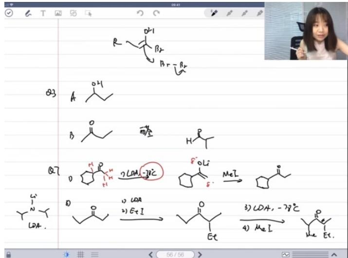

chemical

Chemical reaction scheme showing transformation of compound O3 to various ester products including LDA, Li, and Et

# 1）LDA反应条件解析

● LDA的作用：LDA（二异丙基氨基锂）是一种大位阻强碱，主要作用是夺取位阻较小的α-氢原子。

# - 温度控制的意义：

- 负78°C的低温条件显著提高了反应的选择性  
高温会增加分子热运动，使LDA进攻位阻较大氢原子的概率上升  
低温条件下LDA几乎只进攻甲基上的位阻较小氢原子（选择性接近100%）

# ● 产物形成机制：

- 第一步：LDA在-78℃下选择性夺取甲基氢形成烯醇负离子  
- 第二步：碘甲烷与烯醇负离子发生亲核取代反应  
○ 立体化学：产物为外消旋混合物，无立体选择性

# 2）反应条件对比

# ● 强碱选择原则：

- 使用LDA/氢化钠等强碱可完全转化底物为烯醇负离子  
避免使用弱碱（如NaOH）导致的自缩合副反应

# - 温度条件差异：

- 需要高选择性时：必须使用-78℃低温  
- 无需高选择性时：温度条件可不作严格要求

# ● 位阻效应应用：

- 夺取位阻小氢：使用氢化钠等强碱  
- 夺取位阻大氢：需结合低温条件控制选择性

# 3）典型反应示例

# ● 案例1（甲基取代）：

○ 条件：1) LDA, -78℃ 2) CH₃I   
- 特点：高选择性甲基化

# ● 案例2（溴代反应）：

○ 条件：1) NaH 2) Br₂   
○ 特点：夺取位阻较小氢原子后溴代

# - 反应通式:

# 9. 例题9: 酯缩合反应及脱缩过程 19:59

# 1）酯缩合反应机理

● 初始步骤: 使用乙氧负离子作为碱，引发酯缩合反应，生成稳定的负离子中间体  
- 淬灭条件: 需要加酸而非加水淬灭，因为两个羰基之间的氢pKa≈9，酸性强于水  
● 中间体稳定性: 反应首先生成的是非常稳定的负离子结构

# 2）后续反应步骤

● 强碱处理: 使用非大位阻的强碱处理，100%重新生成烯醇负离子  
- 烷基化反应: 与RX发生烷基化反应，类似烷基化反应机理  
● 酸性水解: 在酸性条件下加热实现酯的水解, 生成羧酸  
● 脱羧反应: 加热条件下通过六元环过渡态实现α位羧基的脱羧

# 3）关键注意事项

● 反应顺序: 必须注意先酸性水解再加热脱羧的两步过程  
● 条件控制: 单纯酸性条件不足以快速水解酯基，通常需要加热辅助  
● 常见错误: 易忽略最后的脱羧步骤，仅停留在羧酸阶段

# 10. 例题10: 双烷基化反应 22:53

# 1）反应步骤解析

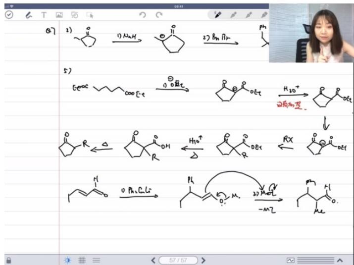

chemical

Chemical reaction scheme showing transformation of cyclohexane derivatives with reagents and conditions

初始转化: 使用PCC氧化醇得到醛  
● 烷基铜试剂: 第一步加入烷基铜试剂实现单烷基化  
- 二次烷基化: 第二步加入碘甲烷，实现 $\alpha, \beta$ -不饱和酮的双烷基化  
● 还原步骤: 最后用氢化铝锂还原羰基为醇

# 2）反应机理细节

● 区域选择性: 碳进攻(C-attack)比氧进攻(O-attack)更易发生

● 电子转移: 反应涉及电子回推, $\pi$ 电子进攻碘甲烷的碳, 碘负离子离去  
● 定位效应: 在 $\alpha,\beta-$ 不饱和酮的 $\alpha$ 和 $\beta$ 位各引入一个烷基

# 3）合成应用

● 成环反应: 该方法是经典且应用广泛的成环策略  
● 考试重点: 机理理解比人名记忆更重要  
● 反应特点: 通过离子化中间体实现的成环反应，比周环反应更常见

# 11. 例题11: Michael加成及成环反应 25:46

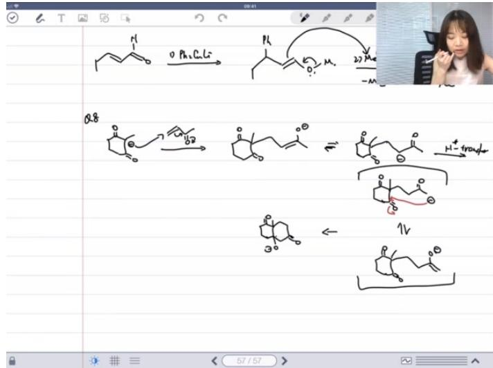

chemical

Chemical reaction scheme showing transformation of a ketone to an enone via intermediate, with molecular structures and reaction conditions labeled

# 1）反应机理关键步骤

● 碳负离子进攻：反应起始于碳负离子对Michael受体的进攻，该步骤通常不会出错。  
- 分子内Aldol加成：生成的碳负离子若进攻羰基会形成四元环，但由于环张力过大（参考环己烷构象知识），实际更倾向于通过质子转移将碳负离子迁移至另一个α碳上（而非β碳）。  
- 六元环优势：迁移后的碳负离子进攻任一等价羰基时，会生成热力学更稳定的六元环结构。

# 2）质子转移与中间体形成

- 质子转移机制：完整的质子转移过程（proton transfer）使碳负离子重新定位，具体细节需参考解析图示。  
- 中间体质子化：形成的烯醇负离子中间体经质子化后生成水，为后续反应做准备。

# 3）E1cb机理关键点

\- 消除步骤机理：从Aldol加成产物到 $\alpha, \beta$ -不饱和羰基化合物的转化需通过E1cb机理完成，该过程易错点包括：

○ 错误类型：避免误认为氢氧根直接进攻导致1,2-消除（错误机理）  
○ 正确路径：先拔除α-H生成共轭碱（conjugated base），随后羟基作为离去基团离去  
- 稳定性驱动：尽管羟基是差离去基团，但产物的共轭稳定性驱动反应进行

# ● 共振结构表达：

- 推荐优先绘制烯醇负离子（更稳定的共振式）  
- 碳负离子写法虽简化可行，但可能掩盖电子离域本质

# 4）E1cb机理特点总结

● 反应局限性：E1cb机理较E1/E2更少见，主要受限于需要差离去基团（如OH $^{-}$ ）的脱除  
● 识别特征：反应中存在明显稳定的共轭碱中间体生成阶段  
● 记忆要点：从Aldol产物到不饱和羰基的转化必须遵循"先拔氢后离去"的E1cb顺序

# 12. 例题12: 酯缩合反应的驱动力 31:40

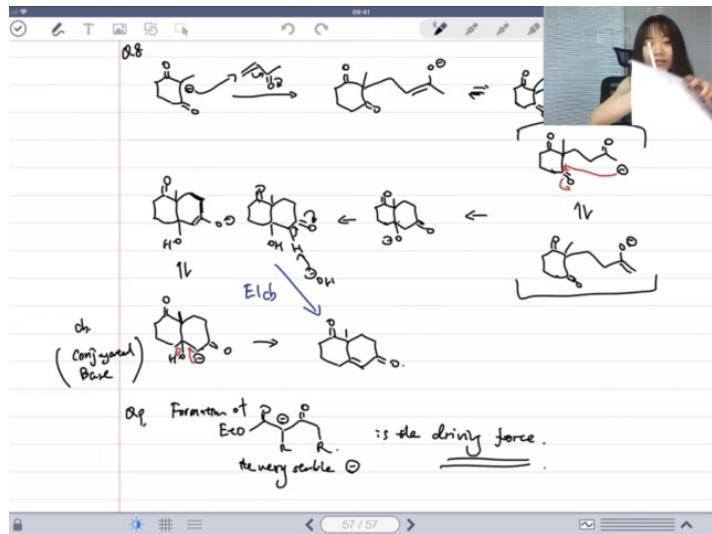

chemical

Hand-drawn chemical reaction scheme showing transformation of ketone derivatives to cyclohexene and then to a hydroxy radical, with molecular structures and reaction conditions noted.

# 1）反应驱动力分析

● 关键中间体稳定性：酯缩合反应的驱动力在于生成了非常稳定的碳负离子中间体，该中间体由强碱（如醇氧负离子）制备得到

# - 反应机理：

- 第一步：α-氢被夺取生成烯醇负离子  
- 第二步：烯醇负离子进攻羰基碳进行aldol加成（即酯缩合反应）  
- 第三步：第二个α-氢被消除，形成异常稳定的碳负离子

# - 反应条件限制：

- 底物必须含有两个α-氢原子  
○ 第一个α-氢用于生成烯醇负离子  
○ 第二个α-氢的消除提供反应驱动力

# 2）过渡态分析

# 六元环过渡态：

○ 在相关反应中，六元环过渡态通常优先考虑椅式构象  
这是国初考试的重要考点，需要掌握正确绘制方法

# ● 实际反应情况：

- 并非所有六元环过渡态都严格遵循椅式构象  
○ 计算化学显示可能存在多种过渡态构型  
- 考试中通常会明确提示"假设经过椅式六元环过渡态"

# 13. 周环反应概述

# 1）反应机理分类

# - 离子型反应：

○ 出现概率最高（约70-80%）  
○ 特征：涉及碳正离子、碳负离子或部分电荷  
○ 例子：Aldol反应等大多数有机反应

# - 自由基反应：

○ 出现概率中等（约15-20%）  
通常在光照或自由基引发剂条件下发生  
○ 例子：烷烃卤代反应

# ● 协同反应：

○ 出现概率最低（<10%）  
○ 周环反应属于此类  
○ 特征：无中间体，一步完成

# 2）周环反应特点

# ● 基本概念：

- 英文名：Pericyclic reaction  
- 特点：通过环状过渡态一步完成的协同反应

# ● 考试重要性：

- 国初考试出现概率极低  
- 但成环反应考察频率较高  
◦ 与前沿轨道理论（诺贝尔奖成果）密切相关

# - 典型反应：

Diels-Alder反应（基础有机化学主要介绍的周环反应类型）  
○ 其他类型在大学阶段才会深入学习

# 二、周环反应 36:32

# 1. 周环反应的四个特点 41:15

# 1）周环反应的四个特点概述 41:26

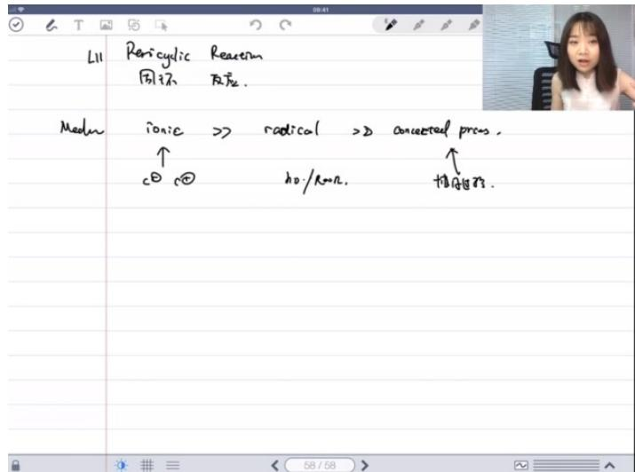

text_image

LII
Pericyclic Reacem
同环 反应.
Medim
ionic >> radical >> concerted process.
↑
c ⊕ c ⊕
do / R+n.
↑
增益形.

● 定义：周环反应是同时满足四个特点的协同反应过程  
● 判断标准：必须同时满足四个特点才能称为周环反应，不能仅满足其中部分特点

# 2）特点一：协同过程 41:38

● 协同性：反应中电子转移是一步发生的  
● 中间体特征：反应过程中不产生自由基或离子化的中间体  
● 机理特点：所有键的形成和断裂同时进行

# 3）特点二：电子转移形成闭环路径 42:24

● 电子运动：电子转移路径形成闭环结构  
● 反应结果：最终产物会形成环状结构  
● 判断依据：这是研究反应机理时的重要线索

# 4）特点三：过渡态是环状的 42:51

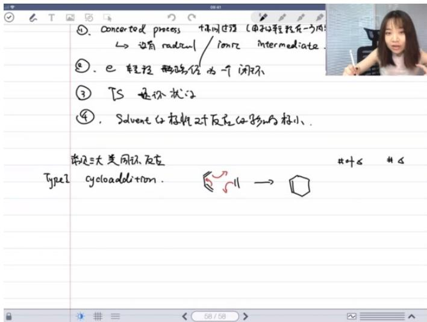

text_image

①. Concerted process  某间过程 (电子标签在一步内)
→ 边有 radial / ionz intermediate.
②. e 轻型 静路位 为一个闭环
③ TS 滤环扰动
④. Solvent 气板对反应(仅影)的标小.
常规三大类同环反应
Type1 cycloaddition.
共叶6 #4

● 过渡态特征：反应过渡态呈现环状结构  
● 研究难点：过渡态无法直接观测，只能通过计算化学或间接方法推测  
● 实际应用：不能单独作为判断周环反应的依据

5）特点四：溶剂的极性对反应影响很小 43:06

\- 溶剂效应：反应对溶剂极性不敏感

● 原因：过渡态是中性的(neutral)，没有部分电荷

● 研究意义：当发现反应不受溶剂极性影响时，可推测可能是周环反应

● 对比：与SN2反应等对溶剂极性敏感的反应形成鲜明对比

# 2. 周环反应的三大类型

1）环加成反应(Cycloaddition)

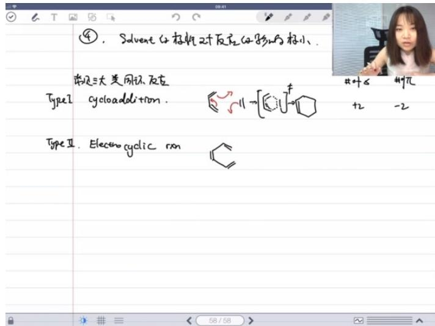

text_image

④. Solvent 4a 极性对反应的影响为标小.
常规三大类同环反应
Type I cycloaddition.
Type II. Electrocyclic iron
#叶6 #9π
+2 -2

● 反应特征：断掉两个π键，形成两个σ键  
● 键能变化： $\sigma$ 键数目+2， $\pi$ 键数目-2  
● 热力学特点： $\Delta H<0$ （放热）， $\Delta S<0$ （熵减）  
● 温度影响：通常在室温或适度加热(100-200℃)下进行

2）电环化反应(Electrocyclic Reaction)

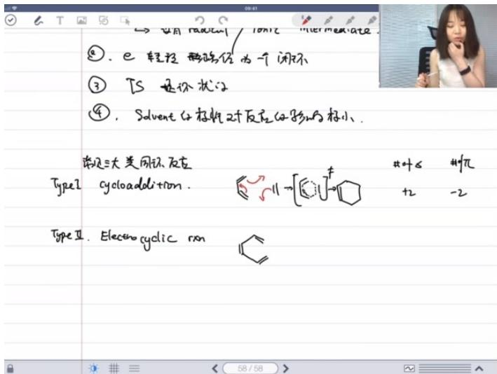

text_image

②. e 轻松 形绕位 为一个闭环
③ IS 运动状态
④. Solvent 气板对反应的影响的标小.
常规三大类同环反应
Type I cycloaddition.
Type II. Electrocydic rion
#045 #9/π
+2 -2

●   
● 名称来源：electron(电)+cyclic(环)的组合  
● 反应特征：形成一个新的σ键，减少一个π键  
● 过渡态：环状过渡态，可用虚线表示未完全形成的键  
● 电子运动：电子可以顺时针或逆时针方向转移

3) $\sigma$ 迁移反应(Sigmatropic Rearrangement)   
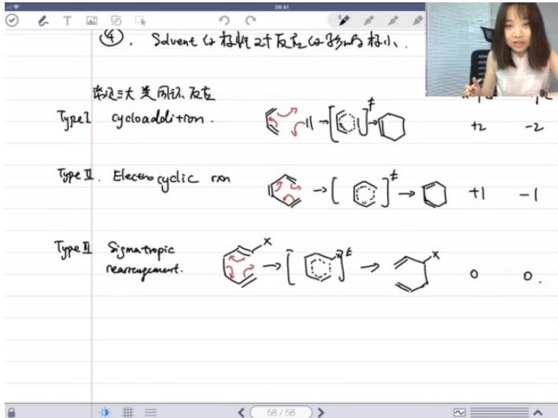

text_image

④. Solvent ②极化对反应的形与标小.
常规三大类同环反应
Type I cycloaddition.
Type II. Electrocyclic reaction
Type III. Sigma-tropic rearrangement.

●   
● 反应特征： $\sigma$ 键和 $\pi$ 键数目保持不变  
- 迁移特点：σ键位置发生迁移  
● 研究难点：反应驱动力不明显  
● 考试重点：在竞赛中考查频率相对较低

3. 周环反应的三大类 45:43

1）环加成反应 46:06

● 环加成反应的定义 01:07:17

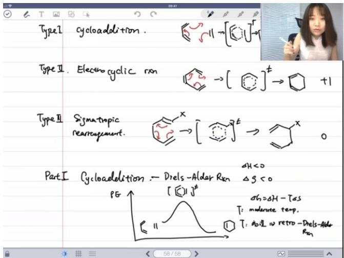

text_image

Type I cycloaddition.
Type II. Electrocyclic rxn
Type III. Symatropic
nearcapement.
Part I Cycloaddition → Diels-Alder Rxn
ΔH < 0
ΔS < 0
ΔG = ΔH - Tcs
T: moderate temp.
T: 2nd ≈ retro-Diels-Alder
Rxn

经典反应：Diels-Alder反应（迪尔斯-阿尔德反应）是最经典的环加成反应，由迪尔斯和阿尔德两位化学家发现。

\- 反应本质：双烯体（diene）和亲双烯体（dienophile）发生的环加成反应。

\- 热力学特征：反应自由能变化公式为 $\Delta G = \Delta H - T\Delta S$ ，其中T为绝对温度。

○ Diels-Alder反应机理

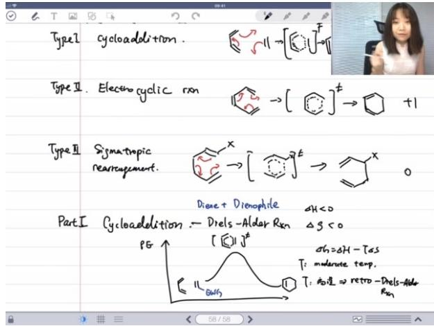

text_image

Type I cycloaddition.
Type II. Electro cyclic ron
Type III. Symatropic rearrangement.
Part I Cycloaddition → Driels-Alder Rcn
PG [C]B
Dion + Dienophile
ΔH < 0
ΔS < 0
Δh = ΔH - Tcs
T: moderate temp.
T: soil ⇒ retro-Driels-Alder Rcn

反应物特征：

● 双烯体：共轭二烯烃，四个碳原子在同一平面  
● 亲双烯体：通常含有双键且带有吸电子基团（EWG），但不是必须条件

■ 温度影响：高温会导致逆向反应（retro-Diels-Alder反应），因为熵增效应占主导  
■ 电子流向：双烯体的HOMO电子流向亲双烯体的LUMO轨道  
■ 前线轨道理论解释

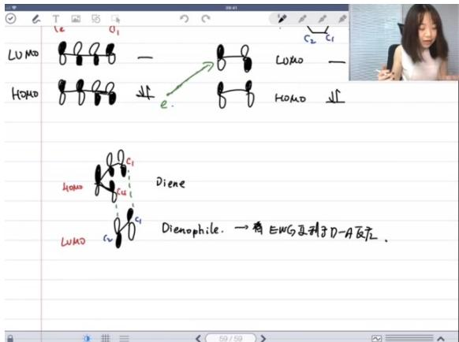

text_image

LU MO
HOMO
e
Q1
-
e
LUMO
HOMO
e
Diene
LUMO
Cv
C1
C2 C1
Dienophile. → 有 EWG 及离子 D-A 反子.

\- 轨道定义：

- HOMO: 最高占据分子轨道（Highest Occupied Molecular Orbital）  
o LUMO: 最低未占据分子轨道（Lowest Unoccupied Molecular Orbital）

# - 轨道相互作用：

- 双烯体提供HOMO电子  
◦ 亲双烯体提供空的LUMO轨道  
- 有效重叠形成新的σ键

● 空间取向：亲双烯体可从双烯体平面上方或下方进攻，产物构型相同

● 吸电子基团作用：EWG增强亲双烯体接受电子能力，促进反应进行

# - 反应特点总结

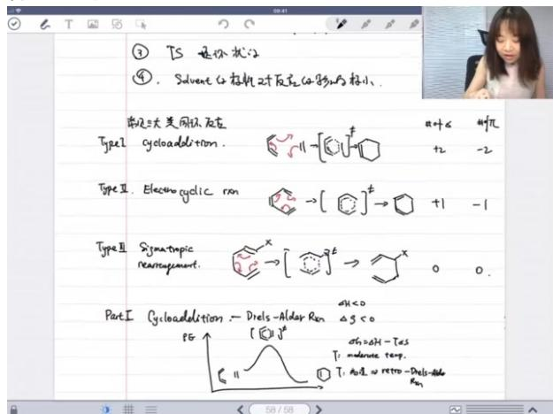

text_image

① TS 延环松子
④ Solvent + 标机 2+反应的物态标小.
常规三大是用环反应
Type I cycloaddition.
Type II. Electrocyclic rsm
Type III Symptotic
nearroweugment.
Part I Cycloaddition → Driels-Aldar Rsm
aH < 0
△ g < 0
P& [C] = H - Tss
T: melodic temp.
T: Ade ω retro-Driels-dialo
Rm

立体专一性：反应保持原有构型

■ 区域选择性：受取代基电子效应影响

■ 溶剂效应：溶剂极性对反应速率影响较小

■ 温度控制：低温有利于正向反应，高温促进逆向反应

# ● 双烯和双亲双烯体分子轨道理论 01:08:53

○ Diels-Alder反应产物判断 01:17:03

■ 反应机理与产物构型

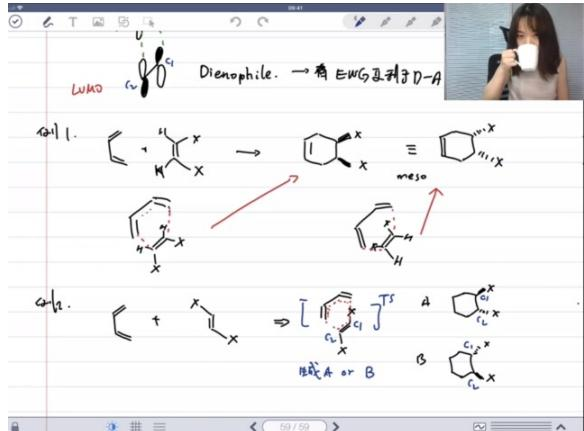

chemical

Chemical reaction diagram showing dienophile formation with EWG and D-A, including electron transfer and ring expansion steps

● 过渡态构型：当双烯体从下方进攻亲双烯体时，产物中取代基(X)会向上翻转，形成特定空间构型。

\- 内消旋体形成：对称结构的双烯体与亲双烯体反应会生成内消旋体(meso)，如示例中产物具有对称平面。

\- 对映体产生：若改变进攻方向（从上方进攻）或调整双烯体构象，会得到一对对映体(enantiomers)。

■ 立体选择性控制 01:22:26

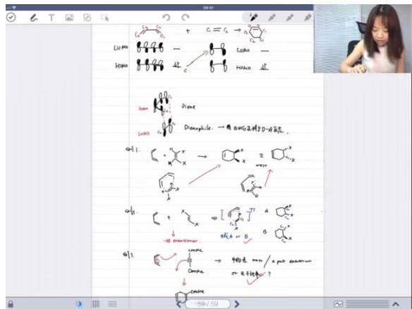

chemical

Hand-drawn chemical reaction equations involving Llu, leu, and oxalate with electron transfer and resonance structures

- endo规则：吸电子基团(如-CN)倾向于位于产物环系内侧，这是由于过渡态中次级轨道相互作用稳定了endo构型。  
- 热力学控制：虽然exo产物通常位阻更小更稳定，但反应受动力学控制，主要生成endo产物。  
● 取代基影响：强吸电子基团(EWG)能显著提高反应速率，如-CN、-COOR等。

# ○ 双烯体构象要求 01:27:32

# ■ 顺反构象反应性差异

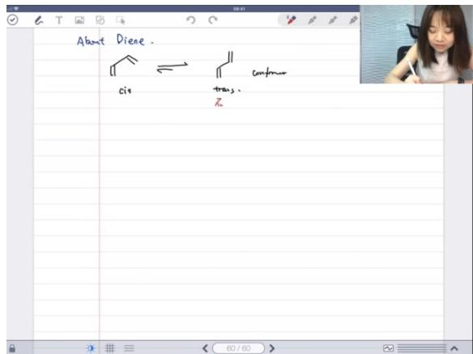

text_image

About Diene .
cis ⇌ trans.
confusion
π

● s-cis构象必需：只有采取s-cis构象的双烯体 $C_{1}$ 和 $C_{4}p$ 轨道能有效重叠)才能发生反应。  
● trans构象限制：固定trans构型的双烯体(如环状结构)由于p轨道无法对齐，不能发生D-A反应。  
- 动态平衡：链状双烯体可通过单键旋转达到s-cis构象，如1,3-丁二烯约98%为s-trans但可通过平衡移动。

# 位阻效应影响 01:32:30

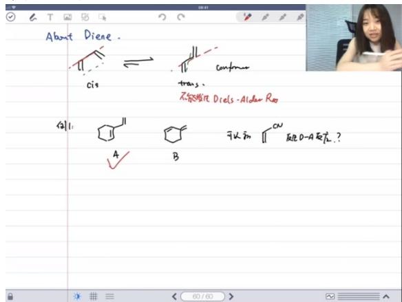

text_image

Abont Diene.
cis
trans.
不能烧成 Diels-Alder R20
A
B
反应式
CN
反应D-A反应?
60/60>

● 取代基排斥：大位阻取代基(如甲基)会阻碍双烯体采取平面构型，显著降低反应活性。  
- 环张力限制：刚性环状结构可能完全阻止构象转换，如示例中trans构型被六元环固定无法反应。  
● 构象分析：需要实际绘制过渡态空间构型判断位阻，不能仅凭二维结构推测。

# - 内消旋体与立体化学 01:32:04

# ■ 内消旋体识别

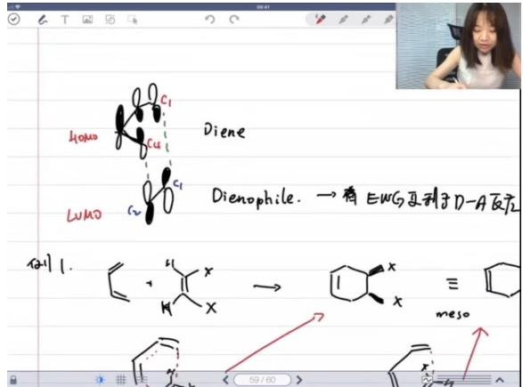

chemical

Chemical reaction diagram showing diene formation from LUMO and diene with EWG protection, followed by dienophile formation

- 对称性判定：分子存在对称面/对称中心时即为内消旋体，不表现旋光性。  
● 取代基关系：相同取代基在产物环系两侧对称分布是典型特征。  
● 特殊案例：某些看似不对称的环状产物可能因快速构象转换成为内消旋体。

# ■ 立体化学控制因素

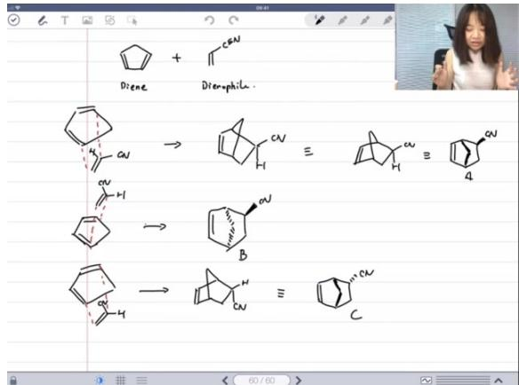

chemical

Reaction scheme showing diene formation and dienophile formation with cyclopentadienyl groups

- 次级轨道作用：endo过渡态中亲双烯体取代基的 $\pi^{*}$ 轨道与双烯体 $\pi$ 轨道产生稳定化作用。  
● 实验现象：约70%经典D-A反应显示endo选择性，但受温度、溶剂等条件影响。  
● 预测方法：需同时考虑轨道相互作用(动力学)和产物稳定性(热力学)两个因素。

# 2）应用案例 01:51:26

● 例题#Diels-Alder反应主产物判断

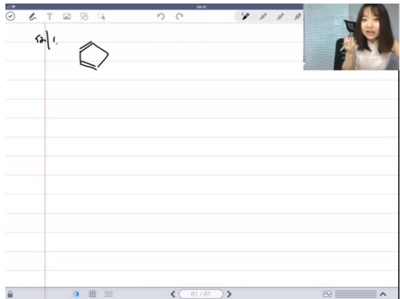

text_image

例1.

二聚控制：环戊二烯在室温下极易二聚，需先加热解聚才能用于反应  
- 产物构型：五元环结构完全控制双键位置，不可能生成trans构型产物  
- endo规则：主产物由endo过渡态决定，需分析取代基空间相互作用

● 例题#顺反构象判断 01:55:17

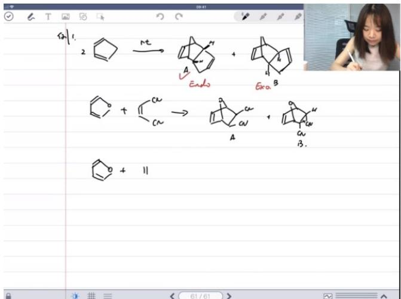

chemical

Reaction scheme showing cyclopentene ring opening with end groups and cyclohexane ring formation, including stereochemistry and reaction conditions

○ endo判定：CN基团在过渡态时与双键部分存在次级相互作用（如π-π堆积）  
- exo特征：当取代基无差异化相互作用时，产物为一对对映异构体（如c+d）  
- 进攻方向：区别仅在于烯烃从双键上方或下方进攻的立体选择性

3）环加成反应与狄尔斯-阿尔德反应的区别 01:57:03

● 环加成反应的其他类型与实例 01:57:26

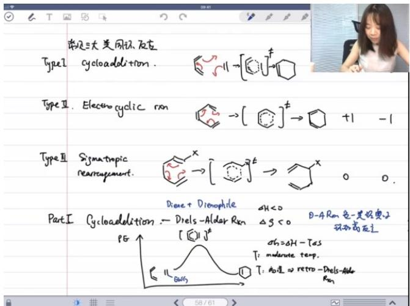

text_image

将定三大类同环反应
Type I cycloaddition.
Type II. Electrocyclic rxn
Type III Sigmotropic
nearrowement.
Part I Cycloaddition - Diels-Alder Rxn
δH = δH - Tas
T: moderate temp.
T: Ade, ω retro-Diels-Alder
Rxn

○ 包含关系：DA反应是环加成反应（cycloaddition）的经典类型

○ 其他类型：如[2+2]环加成（两分子乙烯→环丁烷）

\- 反应条件：典型DA反应只需温和加热，而[2+2]环加成需要光照

● 环加成反应（非狄尔斯-阿尔德）与狄尔斯-阿尔德反应的条件差异 01:58:06

○ 轨道匹配：

■ DA反应：二烯体HOMO与亲二烯体LUMO能级匹配 $\left(\psi_{2}+\psi_{3}^{*}\right)$   
■ [2+2]反应：基态乙烯HOMO-LUMO对称性不匹配，需激发态参与

○ 激发机制：体系中需同时存在激发态（ $\psi_{2} \rightarrow \psi_{3}^{*}$ ）和基态乙烯分子

● 环加成反应中的轨道匹配与光照需求 01:58:33

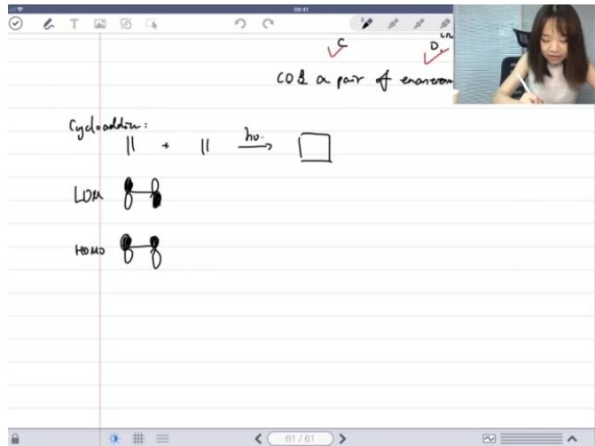

text_image

cycloaddin:
|| + || ho
LOU
HOMO

HOMO定义：最高占据分子轨道（Highest Occupied Molecular Orbital）  
○ LUMO限制：激发态体系可能不存在传统LUMO，只有HOMO

动态平衡：光照时体系大部分仍保持基态，仅少量激发态分子参与反应

\- 注：所有反应实例和轨道分析均来自课程中具体演示的分子结构和图示。

4. 电环化反应 02:01:51

1）电环化反应的定义 02:02:40

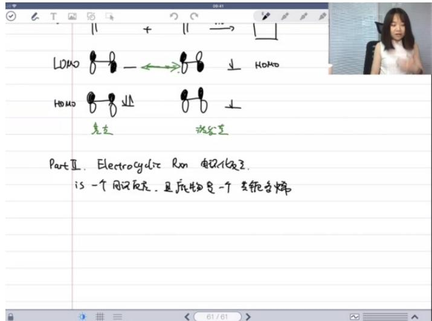

text_image

LOMO
HOMO
光互补
族红蓝
Part II. Electrocyclic Rn 现氧化氢
is 一个质闪反应，且底物是一个去能多烯

基本概念：电环化反应是共轭多烯通过周环过程发生的环化反应，属于周环反应的一种。

\- 反应特征：

- 必须发生在共轭多烯体系中   
- 反应过程涉及π电子体系的重新组合  
- 反应可逆，平衡位置取决于环状产物的稳定性

● 轨道要求：反应中前线轨道（HOMO）的对称性决定旋转方式（对旋或顺旋）

2）电环化反应的应用案例 02:05:21

● 例题#电环化反应产物判断

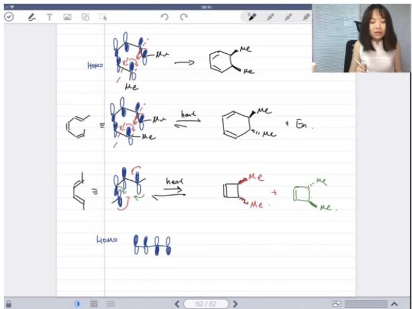

chemical

Hand-drawn chemical reaction diagrams showing transformation of a molecule into a cyclohexene derivative and then to a hydroxyl group, with intermediate structures labeled.

反应条件：加热条件下（基态反应）

○ 轨道分析：

六π电子体系HOMO为第三个轨道，具有两个节点  
■ LUMO为三个节点的空轨道

○ 旋转方式：

■ 加热条件下使用HOMO轨道  
■ 两端p轨道同向旋转（顺旋）形成新σ键

○ 产物构型：

■ 甲基取向由旋转方向决定  
■ 同向旋转得到特定立体构型产物

平衡倾向：六元环产物更稳定，平衡显著偏向环化产物

● 例题#电环化反应产物判断 02:09:15

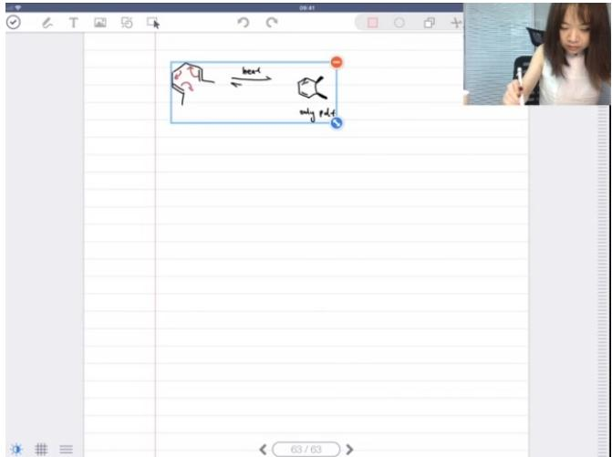

text_image

kert
my rdt
63 / 63

反应条件：光照条件下（激发态反应）

○ 轨道变化：

■ 光照使电子跃迁，HOMO变为原来的LUMO  
■ 轨道对称性改变导致旋转方式变化

○ 旋转方式：

■ 两端p轨道反向旋转（对旋）  
■ 一个顺时针，一个逆时针旋转

○ 产物特征：

■ 产生对映异构体  
■ 甲基取向取决于具体旋转组合

\- 可逆性：反应可逆，但四元环不稳定，平衡偏向开环产物

# ● 例题#电环化反应产物判断 02:10:39

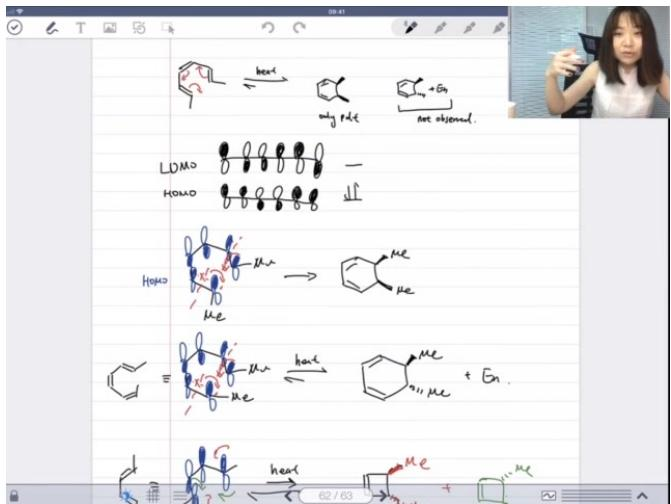

chemical

Chemical reaction scheme showing heat transfer and enol formation with labeled structures and conditions

# ○ 关键区别：

■ 加热与光照条件产生不同产物  
■ 取决于使用基态HOMO还是激发态HOMO

# ○ 分析方法：

先确定π电子数量  
■ 根据条件画出前线轨道  
■ 分析两端p轨道相位关系  
■ 决定旋转方式（同向或反向）

# ○ 记忆技巧:

■ 4n电子体系：加热顺旋，光照对旋  
■ 4n+2电子体系：加热对旋，光照顺旋

# 实用建议：通过轨道相位分析现场推导比死记硬背更可靠

# 5. sigma迁移反应 02:16:54

# 1）周环反应的四个特点 02:18:36

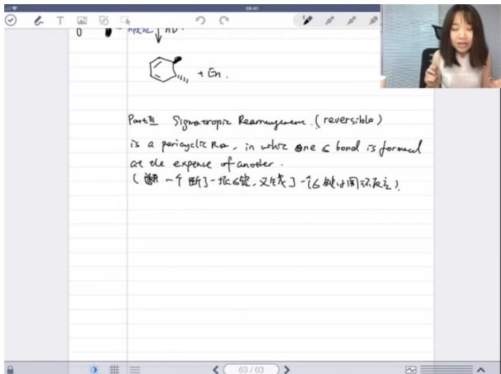

text_image

Porte Ⅱ Signatropic Rearrangement . (reversible)
is a paricyclic Rar , in withz one & bond is formed
at the expense of another .
(断一个断了一块&键,又绕了一个&键之间反应)

● 协同过程: 所有电子迁移在一步内完成（concerted process）  
● 电荷中性: 反应过程中无明显电荷或自由基生成, 溶剂效应不明显  
● 电子闭环: 电子迁移必须形成闭合环路 (closed loop)  
● 环状过渡态: 反应需经过环状过渡态（cyclic transition state）  
● 键变化本质: 反应本质是断裂一个σ键同时形成一个新的σ键

# 2）sigma迁移反应的分类 02:19:46

# ● 一五sigma迁移 02:23:14

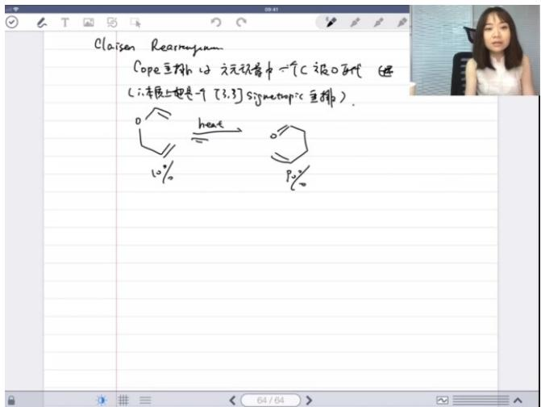

chemical

Chemical reaction diagram showing heat decomposition into a cyclic structure with 10% yield and 90% product

○ 命名规则: 根据断键位置与成键位置的原子编号命名（如1,5-迁移）  
- 过渡态特征: 六元环过渡态（共轭体系）  
- 电子流向: 电子迁移方向可顺时针或逆时针  
○ 典型反应: Cope重排（骨架全为碳的三三sigma迁移）  
例题#COP重排反应产物 02:24:17

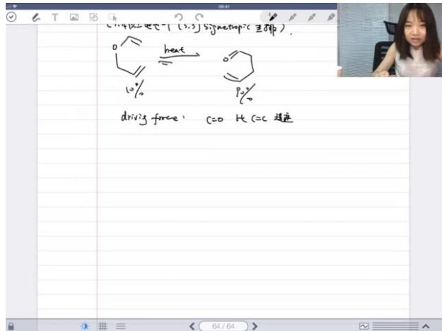

chemical

Handwritten chemical reaction diagram showing heating and heating of a cyclohexane derivative with yield percentages

■ 反应特点:  
● 可逆反应，平衡位置取决于产物稳定性  
● 驱动力：产物双键取代度更高（热力学原因）  
■ 判断方法: 通过分析σ键断裂/形成位置确定迁移类型

# - 三三sigma迁移 02:26:55

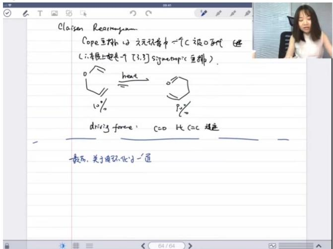

text_image

Claison Rearmoyenne
Cope互排 12 元环管中一个C波口取代
(2.本质上起是-9 [3.3] Siometropic 直排).
10%
heat
P0%
driving force: C=O H C=C 超速
最后,关于由环化"一道

命名规则: 新旧σ键两端均为第三个碳原子 (3,3-迁移)

○ 典型反应:

■ Claisen重排（骨架中一个碳被氧取代的三三sigma迁移）  
■ 驱动力：生成更稳定的C=O双键（相比C=C）

# ○ 反应机理:

非共轭三烯体系  
■ 通过六元环过渡态实现

# 3）反应机理判断流程

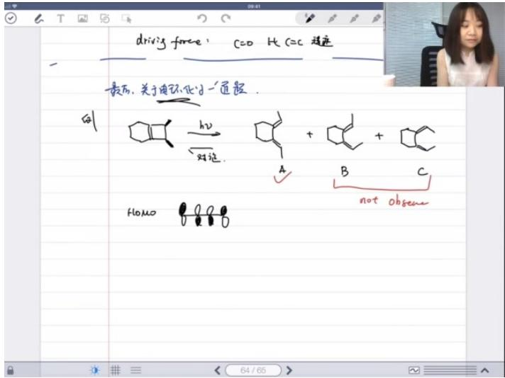

text_image

driving force: C=O H C=C 越速
最后，关于电环化二度酸。
例
Homo
hv
对证
A
B
C
not Obseu

# ● 判断层级:

◦ 优先排除离子型机理  
- 其次排除自由基机理  
- 最后考虑周环反应

# ● 周环反应优先级:

Diels-Alder反应 > 电环化反应 > sigma迁移反应

# - 分析方法:

- 通过电子流向逆向推导过渡态结构  
◦ 验证是否符合周环反应四大特征

# 4）电环化反应例题解析

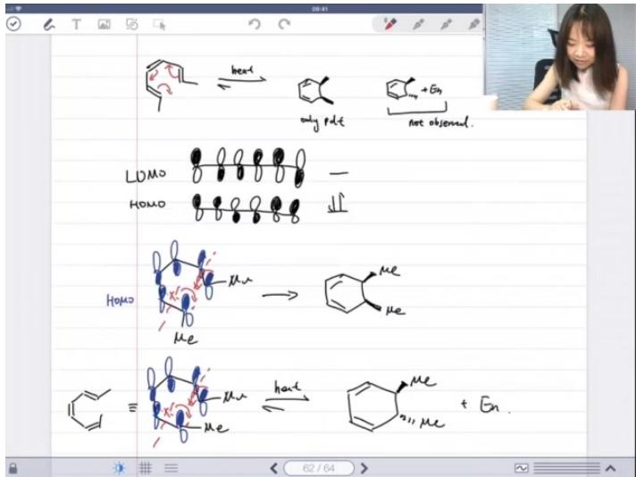

chemical

Hand-drawn chemical reaction equations showing transformations of LOMO and HOMO to form enol intermediate structures

# 解题关键:

○ 确定光照条件下的HOMO轨道对称性  
- 分析对旋/顺旋方式的可逆性

# 位阻效应:

- 双键共平面性决定反应可行性  
- 空间位阻可能导致反应完全不能发生

# - 答案分析:

○ 仅A产物符合电环化反应条件  
○ B旋转方式错误，C存在位阻无法共平面

三、知识小结

<table><tr><td>知识点</td><td>核心内容</td><td>考试重点/易混淆点</td><td>难度系数</td></tr><tr><td>枪醛缩合反应</td><td>碱性条件下的阿尔法氢活化机理,酸性条件下的烯醇稳定性决定区域选择性</td><td>酸性/碱性条件选择差异,互变异构平衡</td><td>★★★★</td></tr><tr><td>酯缩合反应</td><td>克莱森缩合机理,需两个α-H参与反应</td><td>驱动力来自稳定碳负离子生成</td><td>★★★</td></tr><tr><td>周环反应特点</td><td>协同过程/闭环电子转移/环状过渡态/溶剂影响小</td><td>与离子化反应机理区分</td><td>★★★★</td></tr><tr><td>Diels-Alder反应</td><td>双烯体+亲双烯体环加成,endo产物优先规则</td><td>立体选择性判断,过渡态轨道相互作用</td><td>★★★★★</td></tr><tr><td>电环化反应</td><td>共轭多烯成环,加热/光照条件决定顺旋/对旋</td><td>前线轨道对称性匹配</td><td>★★★★</td></tr><tr><td>σ迁移反应</td><td>[1,5]和[3,3]迁移类型,Cope/Claisen重排</td><td>六元环过渡态特征</td><td>★★★</td></tr><tr><td>反应机理优先级</td><td>离子化&gt;自由基&gt;周环反应分析路径</td><td>DA反应为国初最可能考点</td><td>★★★★</td></tr><tr><td>作业典型错误</td><td>α-卤化区域选择性判断,烯醇负离子进攻位点混淆</td><td>位阻效应与电子效应平衡</td><td>★★★★</td></tr></table>