# 一、重排反应26:17

# 1. 重排反应概述 26:41

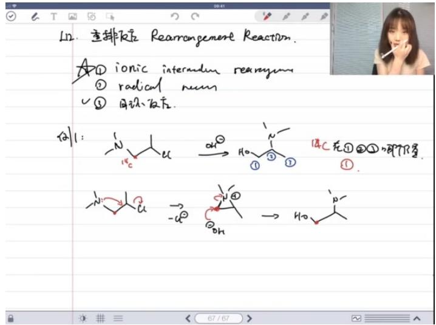

text_image

L2. 查排反应 Rearrangement Reaction.
① ionic intercalcd rearregum
② radical numm
③ 目认反应.
例1:
NCH₂CH₂C → HOCH₂CH₂C (①)
② C在①②③④两个原子.
NCH₂CH₂C → HOCH₂CH₂C (①)
③
④
⑤
⑥
⑦
⑧
⑨
⑩
⑪
⑫
⑬
⑭
⑮
⑯
⑰
⑱
⑲
⑳
㉑
㉒
㉓
㉔
㉕
㉖
㉗
㉘
㉙
㉚
㉛
㉜
㉝
㉟
㉳
㉟
㉟a
㉟b
㉟c
㉟d
㉟e
㉟f
㉟g
㉟h
㉟i
㉟j
㉟k
㉟l
㉟m
㉟n
㉟o
㉟p
㉟q
㉟r
㉟s
㉟t
㉟u
㉟v
㉟w
㉟x
㉟y
㉟z
㉟a
㉟b
㉟c
㉟d
㉟e
㉟f
㉟g
㉟h
㉟i
㉟j
㉟k
㉟l
㉟m
㉟n
㉟o
㉟u
㉟v
㉟w
㉟x
㉟y
㉟z

● 基本定义：分子内骨架结构的重新组合过程，通常指分子内(intramolecular)的重排

\- 分类依据：

○ 离子化中间体：最常见类型，考试重点  
○ 自由基机理：案例较少且考察频率低  
○ 周环反应：属于特殊重排类型，考察相对较多

\- 反应特征：

- 分子内反应优先于分子间反应  
○ 常形成三元环/五元环/六元环中间体

# 2. 例题:重排反应机理判断 29:40

# 1）碱性条件下的重排

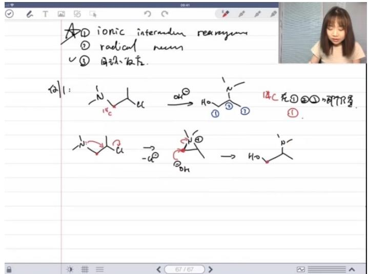

chemical

Hand-drawn chemical reaction diagram showing radical intermediates and radical reactions with labeled structures and reaction conditions

●

\- 反应机理：

- 氮孤对电子进攻 $^{14}$ C形成三元环中间体（类似环氧结构）  
○ $OH^{-}$ 亲核进攻位阻小的碳（碳1）  
- 开环后 $^{14}$ C保留在碳1位置

● 关键特征：

邻基参与效应：分子内亲核取代比分子间更快   
◦ 动力学优势：形成三元环中间体是反应驱动力

# 2）弱碱条件下的变体反应

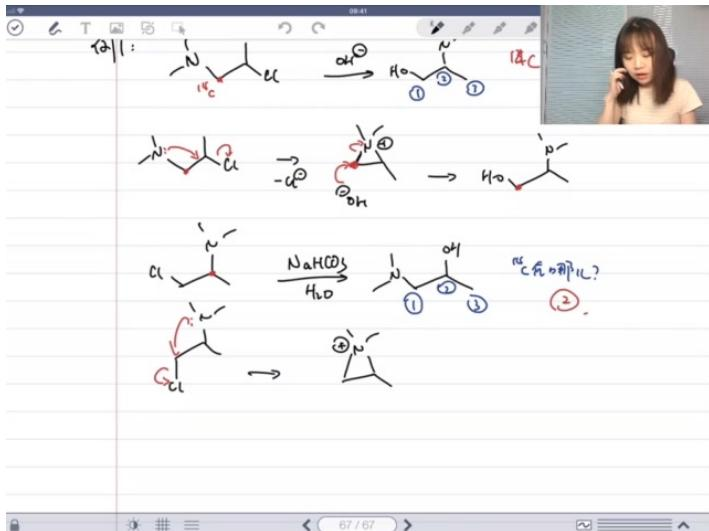

chemical

Hand-drawn chemical reaction equations showing transformation of a cyclic amide to hydroxyl radical, followed by hydrogenation and rearrangement steps

# 机理差异：

- 弱碱条件下水作为亲核试剂  
○ 形成碳正离子中间体 ( $S_{N}$ 1机理)  
○ 优先进攻取代度高的碳（碳3）以稳定正电荷

# - 对比分析：

○ 条件影响：强碱→ $S_{N}2$ ；弱碱→ $S_{N}1$   
○ 离去基团： $N^{+}$ 相当于中性 $OH_{2}$ ，是优良离去基

# 3）反应驱动力总结

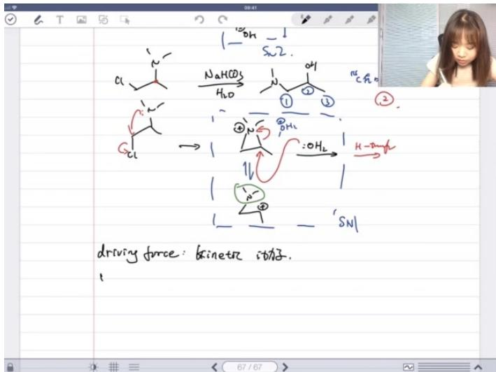

chemical

Hand-drawn chemical reaction diagram showing hydrogenation and radical intermediates with labeled steps and a note on driving force in kinetic process.

# 动力学规律：

- 分子内形成3/5/6元环中间体的反应速率显著快于分子间反应  
- 这是邻基参与重排的主要驱动力

# ● 电子效应：

○ 需同时考虑位阻效应和电荷效应（electronic effect）  
○ 碳正离子稳定性遵循 $3^{\circ}>2^{\circ}>1^{\circ}$ 原则

# 3. 例题:重排反应机理判断 42:04

# 1）邻基参与的重排反应

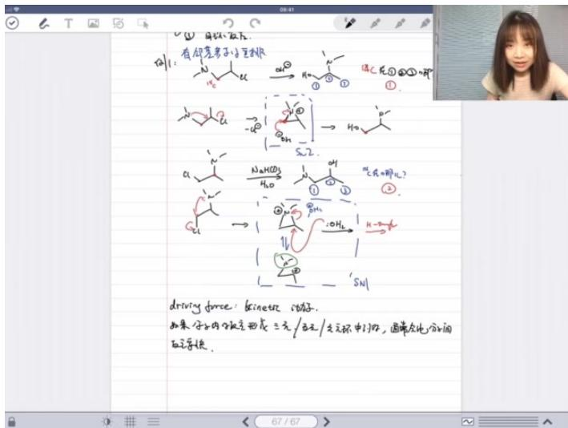

text_image

例1：
有的氢原子相互排
→ H₂O
①
②
③
④
⑤
driving force: kinetic 水原子.
如果子内水原子形成三元/五元/无元素中分子，通常在水分子间
后子系统。

● 动力学驱动: 当邻基参与形成三元环、五元环或七元环中间体时，反应通常较快进行  
● 典型特征: 反应过程中涉及环状过渡态的形成，这是判断邻基参与的重要标志

# 2）热力学驱动的重排反应

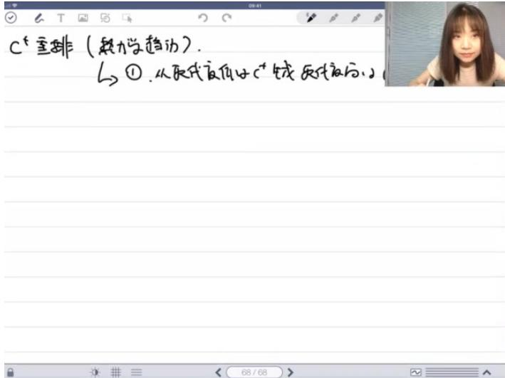

text_image

C'重排（考力学指功）.
L→①.从现代官僚主义(城)现代官僚主义

# 两种热力学驱动情形:

○ 取代度变化: 从取代度低的碳正离子生成取代度高的碳正离子

■ 稳定性顺序: $3^{\circ}$ 碳 > $2^{\circ}$ 碳 > $1^{\circ}$ 碳（超共轭效应）

环张力释放: 即使取代度降低, 只要能显著释放环张力仍可发生

● 迁移顺序: 越小基团迁移越快 (H > 甲基 > 乙基等)

# 3）Wagner-Meerwein重排

● 定义: 1,2-烷基或氢迁移的碳正离子重排反应  
● 本质: 热力学驱动的碳正离子稳定性提升  
● 记忆点: 所有人名反应中，只需记住这是碳正离子重排即可

# 4）例题解析

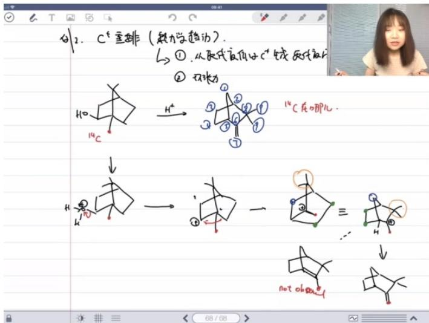

chemical

Hand-drawn chemical reaction diagram showing cycloaddition of C⁶ isocyanate with labeled structures and reaction steps

# - 反应机理:

- 酸性条件下羟基质子化形成氧鎓离子  
- 水分子离去生成二级碳正离子  
○ 相邻四级碳上的甲基发生1,2-迁移  
○ 形成更稳定的三级碳正离子  
- 最后脱去β-H生成烯烃

# ● 关键点:

○ 迁移基团必须与碳正中心相邻（1,2-迁移）  
- 可能的分步（E1）或协同（concerted）机理  
○ 产物烯烃稳定性决定脱氢位置（避免桥头烯烃）

# ● 答案: 标记的 $^{14}C$ 最终位于产物结构中的7号位

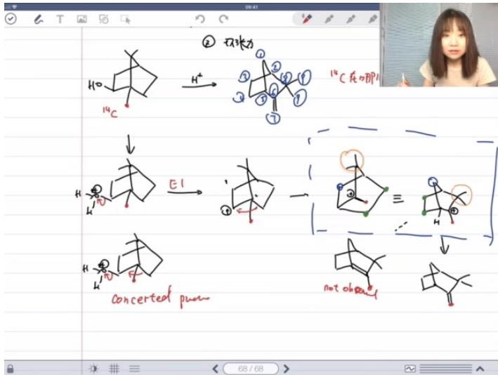

chemical

Hand-drawn chemical reaction scheme showing transformation of cyclohexane derivatives with labeled structures and conditions

# ● 协同过程特征:

○ 离去基团与迁移基团处于反式位置  
- 一步完成质子化、离去和迁移  
○ 比分布机理更具立体选择性

# 4. 例题：平嘛醇重排 58:02

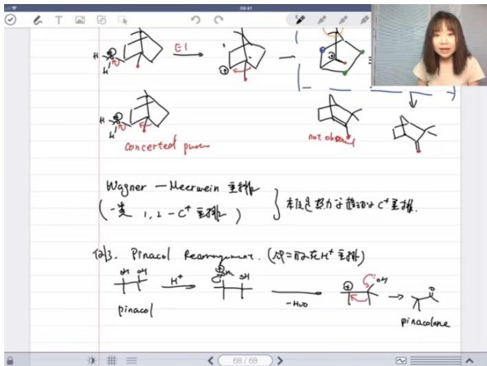

chemical

Chemical reaction diagram showing pentane ring-opening with concerted proton, forming a new polystyrene derivative and then reacting with pinacol

1）反应本质与经典案例

- 反应定义：Pinacol重排是邻二醇在酸性条件下的重排反应，本质是1,2-碳正离子迁移。  
- 经典底物：以Pinacol（频哪醇）为典型底物，在酸性条件下通过质子转移脱水生成碳正离子中间体。  
● 关键步骤：孤对电子回推形成碳氧双键，最终生成Pinacolone（频哪酮）。

2）迁移顺序规律

● 与Wagner-Meerwein重排对比：

- 经典碳正离子重排：基团越小迁移越快（轨道匹配性决定）  
- 频哪醇重排：给电子能力越强迁移越快

● 实例说明：苯环上给电子取代基（如- $CH_{3}$ ）比苯基本身迁移快，而吸电子取代基（如 $-NO_{2}$ ）迁移最慢。

3）反应机理争议

● 协同性讨论：

- 可能通过一步协同过程完成  
- 也可能分步形成碳正中间体

● 机理研究特点：

- 过渡态不可观测（能量峰值）  
- 中间体难捕捉（能量局部极小值）  
○ 不同底物可能表现不同机理路径

4）热力学驱动力

\- 稳定化因素：

○ 生成稳定的三级碳正离子  
- 孤对电子稳定正电荷（Lone pair stabilized positive charge）  
○ 形成更稳定的碳氧双键

\- 替代路径分析：

- 可能生成环氧中间体但会可逆开环  
- 最终产物热力学更稳定

5）中间体类型辨析

\- 两种可能中间体：

○ 碳正离子形式（正电荷在碳上）  
○ 环氧正离子形式（正电荷在氧上）

● 非共振结构：

○ 不符合共振结构定义（需保持σ键不变）  
- 两者是不同中间体而非共振式

# 6）扩展反应实例

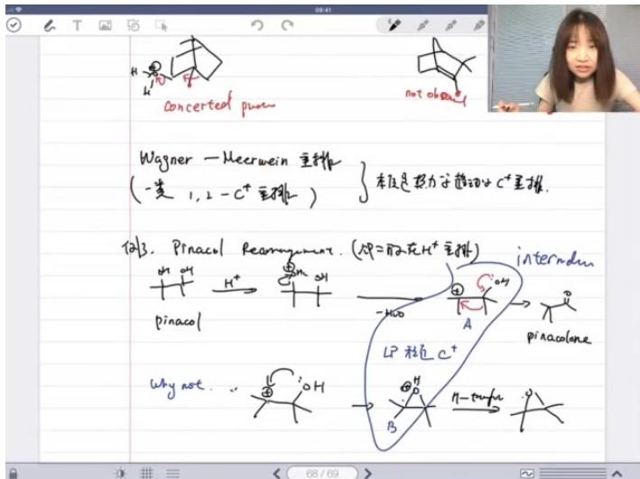

text_image

concerted puw
Wagner - Meerwein 垂排
(一支 1,2- c+ 垂排-) } 本段是聚力子移动心C+星排.
例3. Pinacol Rearmycrom. (sp=π/2在H+星排) intermodin
pinacol
HP 棱色 c+
Why not. .. oH
B
n-mu Fa

● 路易斯酸催化：如溴化镁催化环氧与氯乙酸反应  
● 机理类比：

○ 首先生成环氧正离子  
○ 转化为碳正离子后发生1,2-迁移   
- 最终形成五元环产物

● 电荷守恒验证：各步反应需保持电荷平衡

5. 例题: 反向平嘛醇重排 01:13:11

# 1）反应机理分析

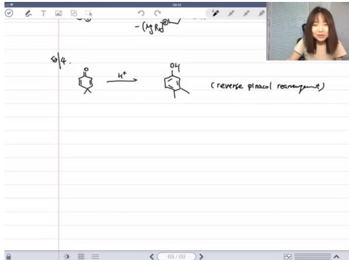

chemical

Chemical reaction diagram showing cyclohexene ring transformation with H+ and O4 groups, labeled as reverse pinacal reagent

● 反应类型: 该反应属于碳正离子中间体重排机理，是考试高频考点  
● 结构特征: 六元环骨架保持不变，发生甲基迁移（7号和8号位甲基）  
- 迁移特点: 1,2-碳迁移，属于广义的Wagner-Meerwein重排   
● 关键步骤:

- 质子化：氧原子孤对电子进攻氢离子  
- 碳正离子生成：在5号位产生碳正中心  
○ 甲基迁移：4号位甲基迁移至5号位碳正中心  
- 消除反应：通过β-氢消除形成双键

2）与平嘛醇重排的关系

● 反向机制: 与平啉醇重排相反，这里是π电子移回氧原子生成碳正离子  
● 命名反应: 该反应称为双烯酮苯酚重排(Dienone-Phenol rearrangement)  
● 驱动力: 碳正离子的稳定化是主要驱动力

6. 例题:二苯乙醇酸酮的重排 01:20:12

# 1）反应概述

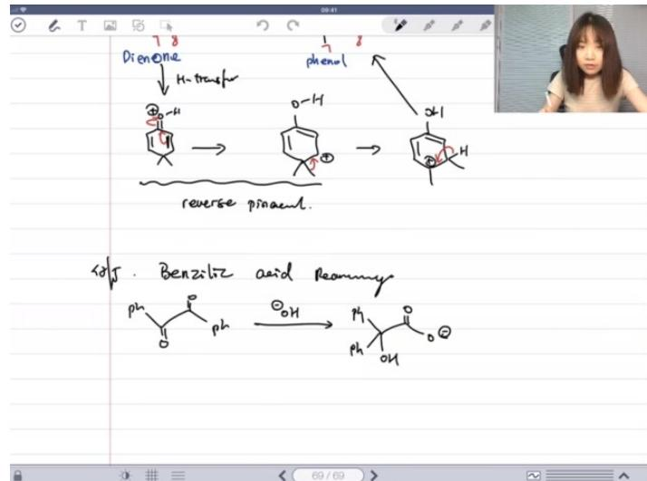

chemical

Chemical reaction diagram showing conversion of dienone to phenol via reverse pinacil, with benzyl ether acid reocean and phenol carboxylic acid formation

●   
● 反应名称: 二苯乙醇酸重排(Benzilic acid rearrangement)  
● 反应条件: 在氢氧根离子存在下进行  
● 产物特征: 生成二苯乙醇酸(俗名)

# 2）反应机理

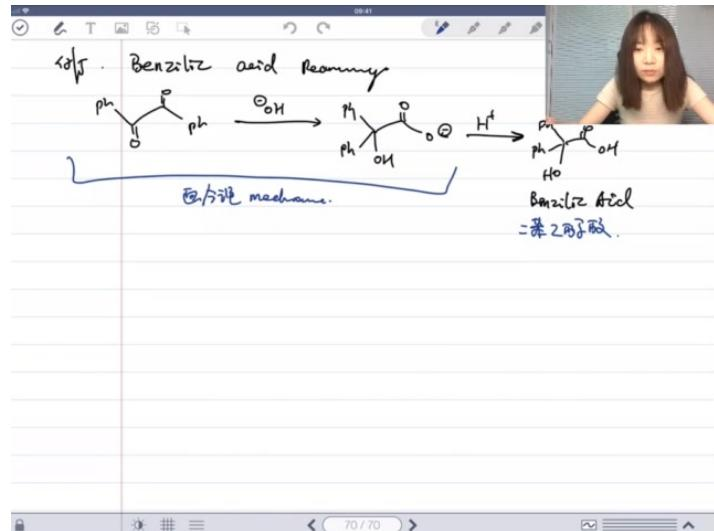

chemical

Chemical reaction diagram showing conversion of benzylacetic acid to phenolic acid via methanol and water, with a photo of a person observing.

●   
● 亲核进攻: 氢氧根作为亲核试剂进攻羰基碳  
● 迁移过程: 苯基从碳正中心迁移至相邻碳原子  
● 驱动力分析:

○ 形成更稳定的羧酸根离子  
○ 强碱转化为弱碱的热力学优势

# ● 关键步骤:

○ 亲核加成  
○ 苯基迁移   
○ 质子转移(分子内或分子间)

# 7. 例题: 路易斯酸重排 01:27:26

# 1）反应体系特征

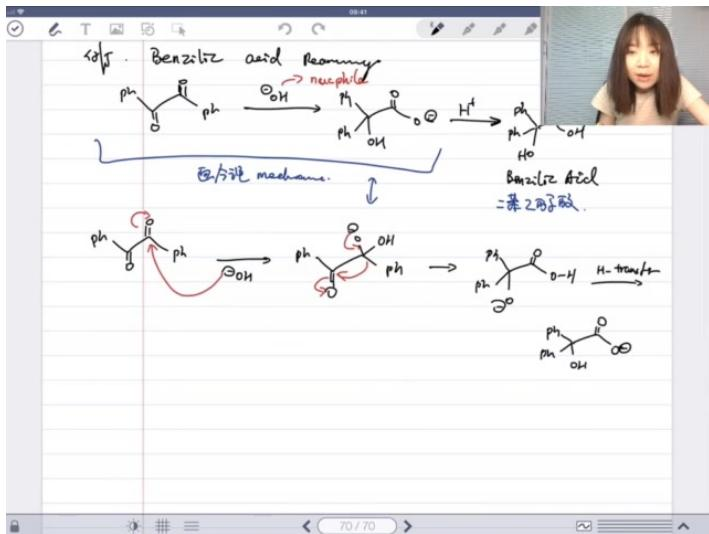

chemical

Chemical reaction pathway showing benzilizic acid conversion to benzoic acid via nucleophilic substitution, with phenyl and hydroxyl groups indicated.

催化剂作用: 氯化镁/溴化镁作为路易斯酸参与反应

● 电子转移:

○ 作为电子受体时为路易斯酸  
- 作为电子给体时为路易斯碱

● 判断标准: 根据镁是接受还是提供电子对来确定其角色

# 2）法沃斯基重排

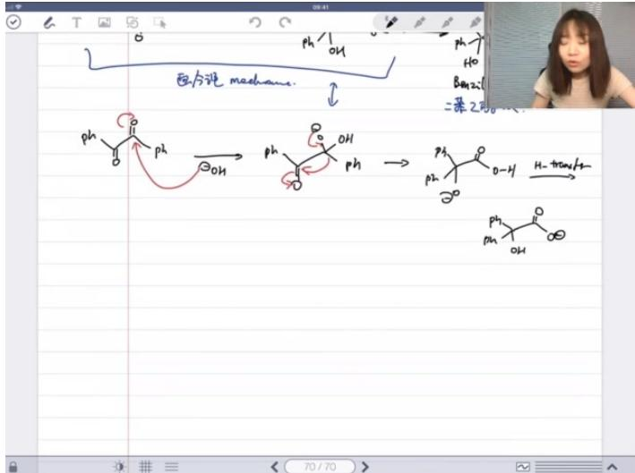

chemical

Chemical reaction diagram showing the formation of a hydroxy acid from a phosphorus-containing compound via an isomeric intermediate, with water and hydrogen transfer steps.

● 反应重要性: 合成上有广泛应用的人名反应  
● 反应特点: 在镁试剂作用下发生的骨架重排  
● 记忆要点: 需要特别记忆该人名反应及其应用

# 8. 例题：法沃斯基重排 01:29:54

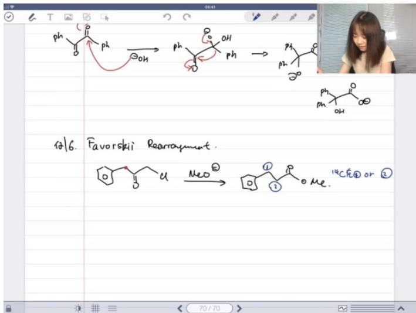

chemical

Chemical reaction diagram showing conversion of a ketone to an enone via hydrolysis, followed by rearrangement with stereochemistry indicated

# 1）反应机理分析

- 碱的作用机理：甲氧负离子 $(CH_{3}O^{-})$ 作为强碱，首先拔除 $\alpha$ -氢生成负离子。此处 $\alpha$ -氢具有高酸性，因左边有 $\mathsf{p}-\pi$ 共轭效应，右边有氯的诱导效应。  
● 中间体形成：生成的负离子可通过两种途径：

○ 形成烯醇负离子（更稳定，负电荷在氧上）

\- 直接形成碳负离子（简化表示）

\- 离去基团：氯作为离去基团脱去，形成三元环丙酮中间体（经典法沃斯基重排特征）

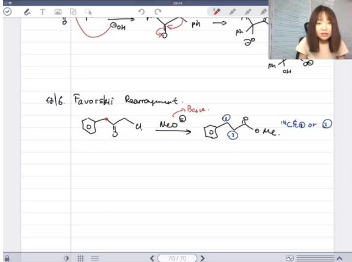

chemical

Chemical reaction diagram showing favorable rearrangement of a cyclohexene derivative with stereochemistry and phenyl groups

# 2）两种合理反应路径

Pathway One

- 步骤1：拔氢形成负离子  
- 步骤2：脱氯形成三元环中间体  
- 步骤3：甲氧负离子亲核进攻羰基  
- 步骤4：开环后质子转移得产物

Pathway Two

○ 卡宾中间体：直接拔除带卤素的碳上的氢，形成卡宾中间体（六电子碳）  
- 重排过程：卡宾插入C=O键，同样形成三元环中间体  
- 最终产物：通过相同后续步骤得到相同产物

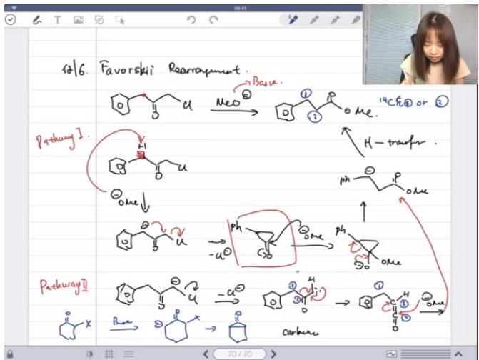

chemical

Reaction mechanism diagram showing favorable rearrangement and dehydration steps for a cyclic ketone compound

# 3）法沃斯基重排的应用

● 缩环反应：经典应用是将六元环缩为五元环

- 反应条件：卤代酮在碱作用下  
○ 关键中间体：三元环丙酮结构  
○ 示例：→

● 扩环反应：另一类重要应用（具体机理类似但方向相反）

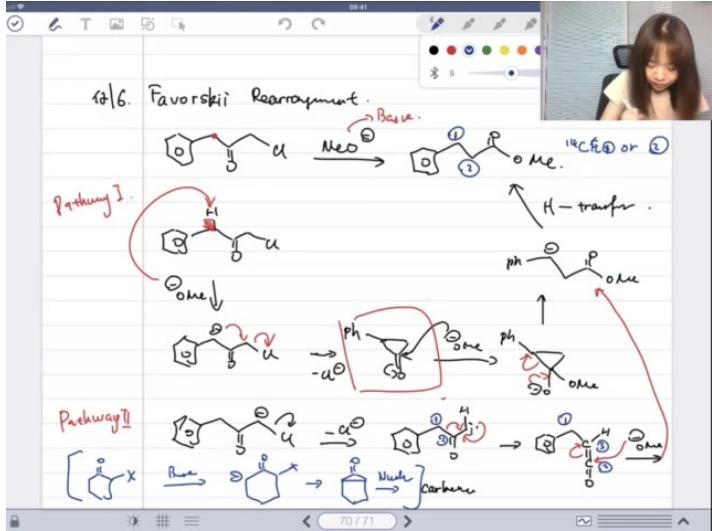

text_image

6. Favorskii Rearrayment.
Pathway I.
Pathway II
Base.
Neo
H-transfer
ph
-α
Nucleus
carbene

4）关键记忆点

● 反应特征： $\alpha$ -卤代酮在强碱条件下的重排反应  
● 核心中间体：三元环丙酮结构  
● 电子效应：p- $\pi$ 共轭与诱导效应共同影响 $\alpha$ -氢酸性  
● 应用价值：重要的环骨架改造方法（缩环/扩环）  
● 机理特点：存在多种合理反应路径（需考虑所有可能性）

9. 例题: 扩环重排 01:40:55

1）Baeyer-Villiger重排

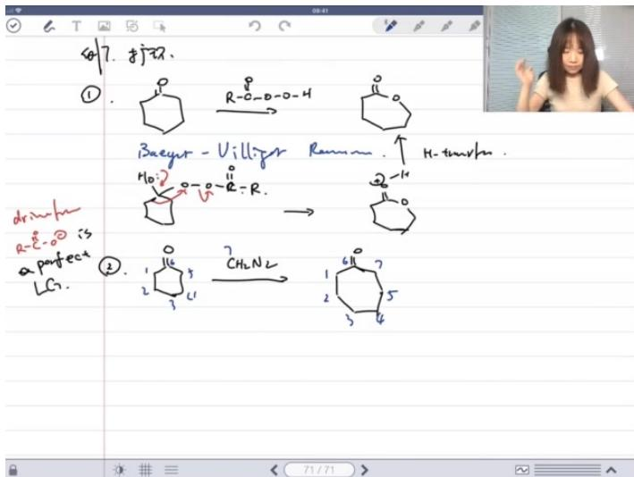

chemical

Chemical reaction scheme showing transformation of cyclopentadiene with alkyl ether to form cyclic products, including stereochemistry and substituent variations.

●   
● 反应本质: 通过生成内酯实现环扩大的重排反应  
● 驱动力: 羧酸根负离子 $(RCOO^{-})$ 作为极好的离去基团  
● 机理关键步骤:

○ 氧原子上的孤对电子迁移到羰基碳

\- 烷基迁移同时羧酸根离去

\- 最后通过质子转移得到产物

● 特点: 属于人名反应(Baeyer-Villiger重排)

2）重氮甲烷相关重排

\- 重氮甲烷的结构

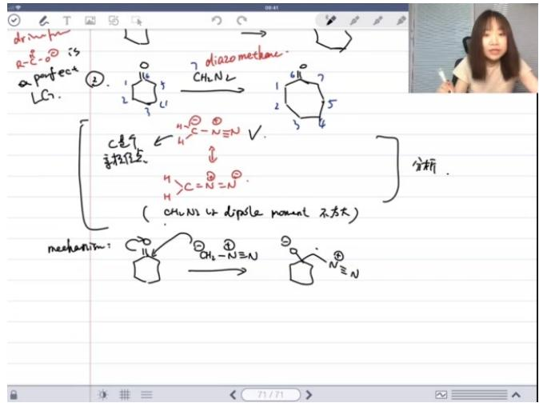

chemical

Chemical reaction scheme showing diazomethane formation from a pentane ring, forming a cyclohexene derivative with dipole moment calculation

O   
○ 结构特点:

共振式可表示为 $CH_{2}=N^{+}=N^{-}$ 或 $CH_{2}^{-}=N^{+}=N$   
■ 偶极矩不大，电子在三原子 $(C,N,N)$ 上分布均匀  
通常表示为 $CH_{2}=N=N$ ，显示碳上带部分负电荷

\- 反应特性: 碳是亲核位点，具有亲核性

\- 重氮甲烷扩环机理

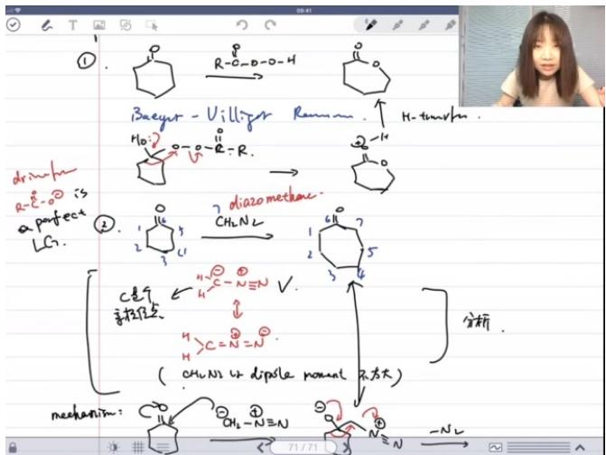

chemical

Chemical reaction scheme showing conversion of cyclohexane to diazomethane via epoxide and alcohol, with molecular structures and reaction equations.

# ○ 反应过程:

■ 亲核进攻羰基碳   
■ 氧上孤对电子回打，引发烷基迁移  
■ 氮气 $(N_{2})$ 作为极好离去基团离去

○ 与Baeyer-Villiger比较: 两者机理相似，都是氧上电子回打引发烷基迁移

# - Tiffeneau-Demjanov重排

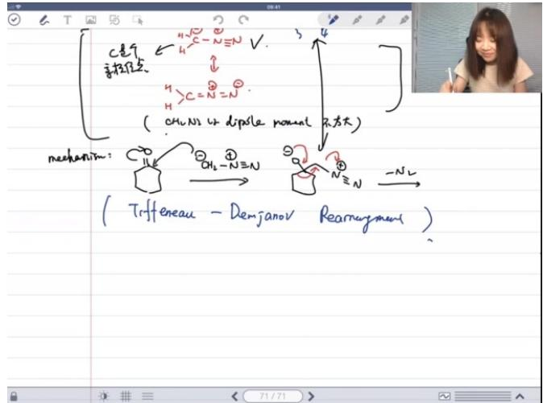

text_image

chg
主控区点
H C-N≡N V.
H >C=N=N
CH₄N (4 dipole manuel R.方夫)
mechanism:
C H ② CH₄-N≡N
CH₄-N≡N
- NL
( Trffeneau - Demjanov Rearrangement )
71/71

○ 特点: 另一类人名反应(Tiffeneau-Demjanov重排)  
本质: 与Baeyer-Villiger重排非常相似的反应类型

# 10. 例题:重氮甲烷重排 01:48:56

# 1）重氮甲烷的碱性反应

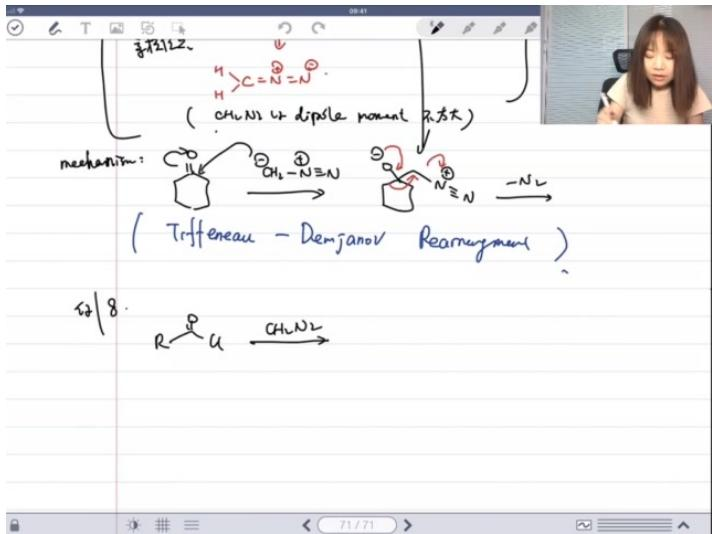

chemical

Chemical reaction mechanism diagram showing trifluene and demjanov rearment steps with labeled reactants and products

# - 反应特性:

○ 重氮甲烷是强碱  
- 碳是亲核位点，氯是强吸电子基

# - 反应机理:

- 失去氯负离子形成正电荷中间体  
- 氮气作为离去基团离去  
○ 形成卡宾中间体 $(CH_{2})$

\- 卡宾特性: 六电子体系，缺电子性质

# 2）卡宾后续反应

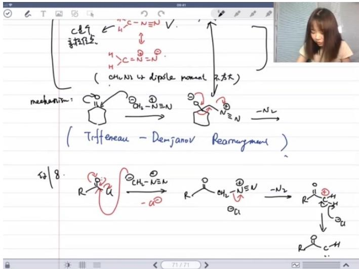

chemical

Handwritten chemical reaction mechanism diagram showing epoxide formation and rearrangement steps with labeled intermediates and products

# 与水反应:

◦ 亲核进攻卡宾碳   
○ 得到醇类产物

○ 若与醇反应则得到酯类

● 反应特点: 与之前重排反应类似，都是在羰基邻位稳定六隅体

# 3）含氮化合物反应分类

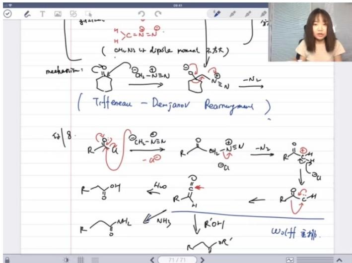

chemical

Chemical reaction mechanism diagram showing hydrogenation and rearrangement steps with reagents like Triffeneau and Demjanov

# 主要反应类型:

○ 碱性反应(已学)  
- 消除反应(霍夫曼消除、Cope消除)  
○ 重排反应(本节重点)

● 重排反应特点: 各类含氮化合物的重排反应机理非常相似

# 11. 例题:叠氮化钠重排 01:55:35

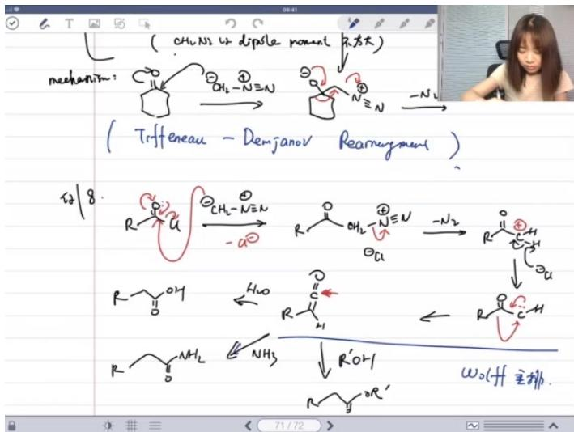

chemical

Chemical reaction mechanism diagram showing trifeneau and Demjanov reamaging with radical intermediates and water formation steps

●

● 反应本质: 叠氮化钠 $(NaN_{3})$ 带负电荷，反应中会失去一个氯化钠 $(NaCl)$   
● 路易斯结构: 关键是要正确画出三个氮原子的结构，等价于将碳原子替换为氮原子  
● 中间体: 加热后生成异氰酸酯(R - N = C = O)，反应机理与之前类似  
- 六电子氮: 反应中会形成六电子的中性氮中间体，称为"氮宾"(nitrene)，与卡宾(carbene)对应  
- 分子构型: 氮原子始终是弯曲构型( $sp^{2}$ 杂化), 不是直线型  
● 重排类型: 属于Curtis重排反应，本质上是1,2-迁移(烷基迁移到相邻氮原子上)

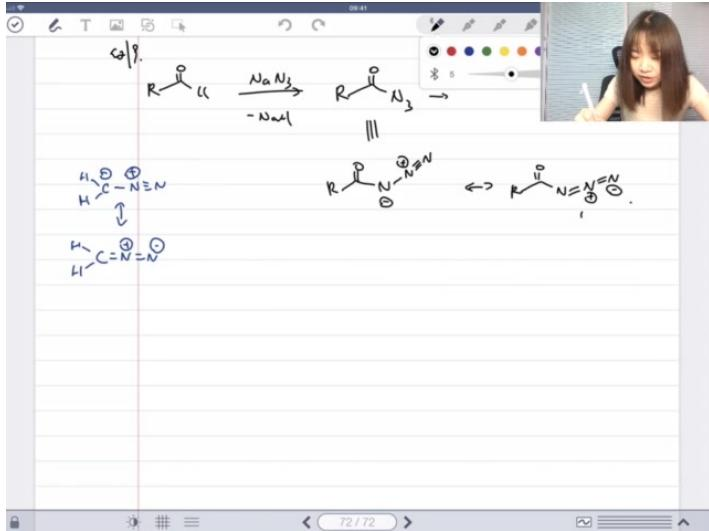

chemical

Chemical reaction diagram showing transformation of amine groups to carbonyl groups via nucleophilic substitution, with a photo of a person observing.

●

● 与Wagner-Meerwein重排对比:

前者是烷基往氮上迁移  
- 后者是烷基往碳上迁移(碳正离子重排)

12. 例题:重氮盐应用 02:09:45

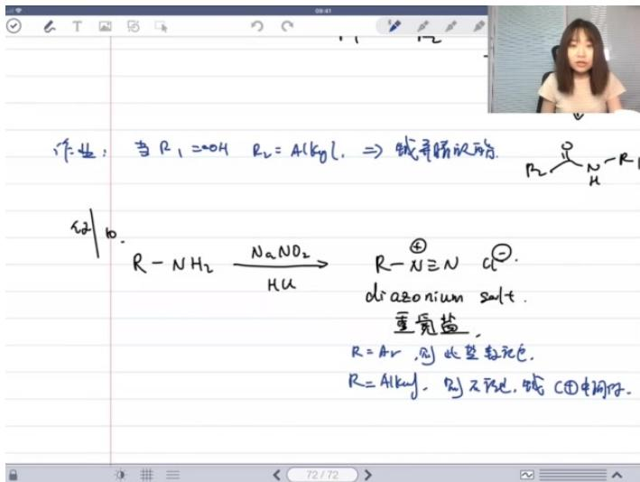

text_image

作业：当R₁=OH R₂=A(kg/L.⇒钱并晴沉落.
R-N-H
R-NH₂ NaNO₂ → R-N≡N d⁻
diazonium salt.
重氮盐，
R=Ar，则此垫取色.
R=Al(kg)，则不配，钱C中问时。

- 经典制法: 胺 $(R - NH_{2})$ 与亚硝酸钠 $(NaNO_{2})$ 在盐酸中反应制备重氮盐 $(R - N_{2}^{+})$

● 稳定性差异:

- 芳香基: 重氮盐较稳定(正电荷被芳环离域稳定)  
- 烷基: 不稳定，易生成碳正离子中间体

\- 反应驱动力: 氮气 $(N_{2})$ 的逸出提供强大驱动力

● 双刃剑效应: 碳正离子既促进反应进行，又可能导致副反应和重排

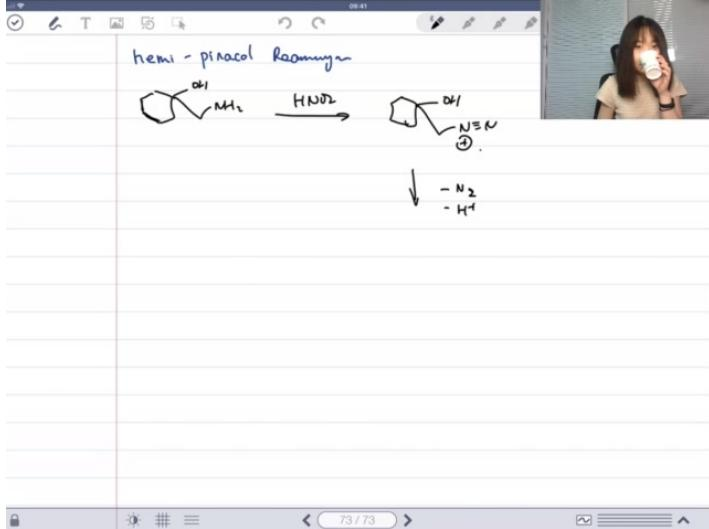

chemical

Chemical reaction diagram showing conversion of hemi-pinacol to Riemugan with HNO2 and N≡N groups, followed by reduction to -N2 and -H4

反应特点: 比频哪醇重排更干净，适用于不对称底物

\- 反应机理:

- 失去氮气形成碳正离子   
○ 氧孤对电子稳定正电荷  
○ 烷基迁移形成七元环产物(环庚酮)

● 应用: 通过重氮盐中间体实现扩环反应

13. 例题：霍夫曼重排 02:13:12

1）反应机理

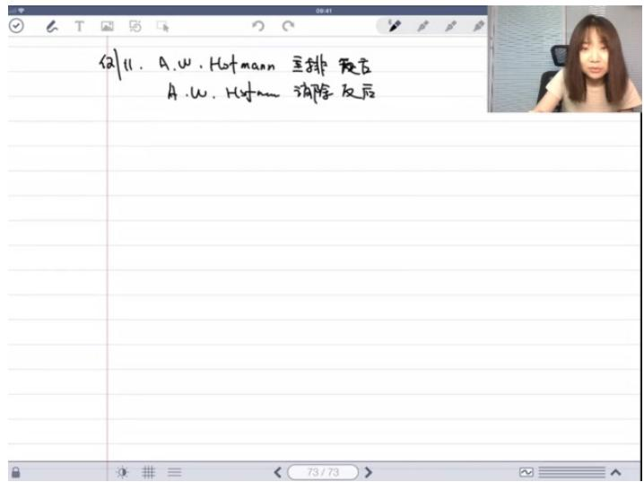

text_image

例11. A.W. Hofmann 主排 反古
A.W. Hofmann 消除 反后

- 别名：霍夫曼降解反应（Hofmann degradation）  
● 反应条件：酰胺在卤素（Br₂或Cl₂）和碱（NaOH）环境下反应

● 关键步骤:

- 去质子化：酰胺在碱作用下失去活泼氢形成负离子  
- 亲核进攻：负离子进攻卤素生成N-卤代酰胺中间体   
○ 重排过程：通过异氰酸酯中间体（R-N=C=O）发生烷基迁移  
- 最终产物：少一个碳的伯胺（R-NH₂）和CO₂

● 机理特点：与其它人名反应机理相似，都是1,2-迁移反应类型

2）反应特征

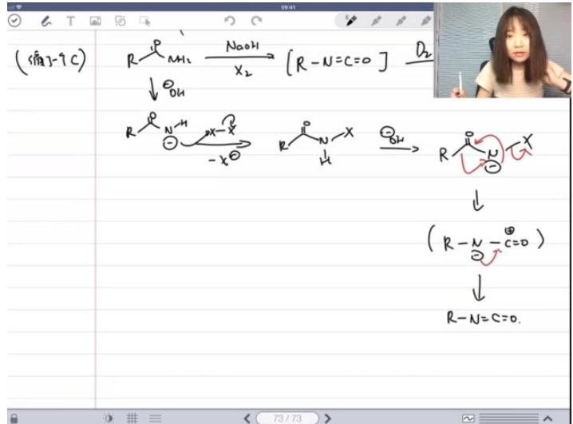

chemical

Handwritten chemical reaction equations involving naphthylamine and sodium hydroxide, with reaction conditions and structural formulas

- 中间体确认：反应过程中会生成异氰酸酯（R-N=C=O）

● 同位素标记：若使用 $D_{2}O$ ，最终产物氮上氢会被氘取代

\- 合成意义：

- 提供碳链缩短的有效方法  
○ 增碳反应较常见，缩碳反应相对稀缺

● 记忆要点：反应经过"负离子形成→卤代→重排→水解"四步过程

14. 例题：贝克曼重排 02:27:58

1）反应过程

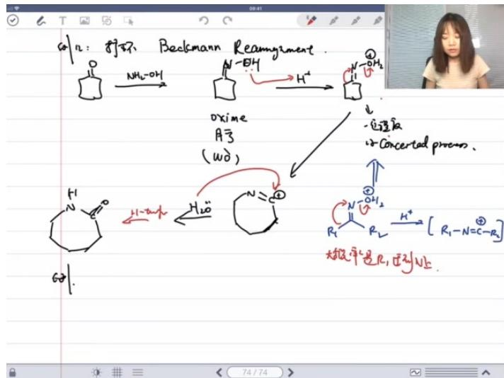

chemical

Chemical reaction scheme showing transformation of a ketone to an enone using N-H2OH and NH-BH, with stereochemistry and reaction conditions.

●   
● 底物类型：酮肟（oxime）在酸性条件下反应  
● 关键步骤：

○ 质子化：羟基首先被质子化

\- 脱水：形成不稳定的六电子中间体

○ 迁移选择性：反式基团优先迁移（立体专一性）

○ 扩环结果：六元环→七元环（增加一个 $CH_{2}$ ）

● 产物特征：最终生成内酰胺结构

2）反应特点

● 协同过程：水的离去与烷基迁移同步进行（concerted process）

● 立体化学：迁移基团必须与离去基团（OH）呈反式构型

● 应用价值：工业上制备ε-己内酰胺（尼龙6原料）

● 鉴别方法：通过产物结构可反推原始酮肟的构型

3）比较记忆

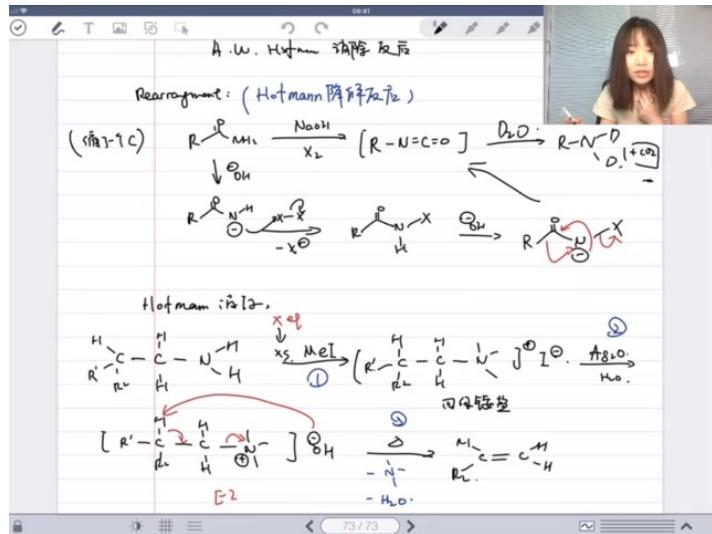

text_image

A.W. Hotmann 消除反应
Rearrograft: (Hotmann降解反应)
(消-↑C) R-NH2 → [R-N=C=O] O2O: R-N-D
↓ O4H ←
R-N-H → R-N-X → R-N-C-O
→ -X→
R-N-H → R-N-C-O
→ -X→
Hofmann: H2O-
↓ X→
H-C-H → H-C-H → H-C-H
↓ X→
R'-C-H → R'-C-H → R'-C-H
① 田氏锰量
[R'-C-H] → [R'-C-H] → [R'-C-H] → [R'-C-H]
② M+I⁻ → M+I⁻
→ -N- → N- → N- → N- → N-<nl>E2 → E2
→ -H2O.
③ M-C=C-H
④ A8H2O
H2O.

●   
● 共同点：均为人名反应，涉及1,2-迁移机理  
- 差异点:

○ 霍夫曼：酰胺→伯胺（减碳）

\- 贝克曼：酮肟→酰胺（环扩大）

● 记忆技巧：霍夫曼"降解"（碳数减少），贝克曼"扩环"（环系扩大）

二、知识小结

<table><tr><td>知识点</td><td>核心内容</td><td>考试重点/易混淆点</td><td>难度系数</td></tr><tr><td>周环反应</td><td>双烯和亲双烯体的环加成反应(Diels-Alder反应)</td><td>顺式双烯体要求、endo取向性、电子效应(给电子/吸电子基团)</td><td>★★★</td></tr><tr><td>碳正离子重排</td><td>Wagner-Meerwein重排(1,2-迁移)、驱动力(取代度/环张力)</td><td>迁移顺序:H&gt;小基团&gt;大基团、立体化学变化</td><td>★★★★</td></tr><tr><td>频哪醇重排</td><td>邻二醇在酸性条件下的重排反应</td><td>迁移基团顺序:给电子基团&gt;苯基&gt;吸电子基团</td><td>★★★★</td></tr><tr><td>贝克曼重排</td><td>肟在酸性条件下重排生成酰胺</td><td>反式迁移规则、扩环反应特点</td><td>★★★★</td></tr><tr><td>霍夫曼降解</td><td>酰胺在卤素/碱条件下减少一个碳生成胺</td><td>中间体异氰酸酯的形成、氮气释放特征</td><td>★★★</td></tr><tr><td>霍夫曼消除</td><td>四级铵碱的热分解反应</td><td>反式共平面消除、生成取代度低的烯烃(动力学控制)</td><td>★★★</td></tr><tr><td>重氮化合物反应</td><td>重氮甲烷/重氮盐的反应特性</td><td>卡宾中间体形成、氮气作为离去基</td><td>★★★★</td></tr><tr><td>含氮化合物重排</td><td>Curtius重排(叠氮化物热分解)、Lossen重排</td><td>异氰酸酯中间体、1,2-迁移共性</td><td>★★★★</td></tr><tr><td>法沃尔斯基重排</td><td>α-卤代酮在碱作用下重排</td><td>环丙酮中间体或卡宾中间体路径</td><td>★★★★</td></tr><tr><td>拜尔-维立格氧化</td><td>酮被过氧酸氧化成酯</td><td>氧插入机制、迁移基团选择性</td><td>★★★</td></tr></table>