# 一、课前说明04:11

# 1. 作业讲解与反馈 04:13

● 作业情况：第一题和第三题正确率100%，第二题因题干少画一个氢原子，但补上后多数同学能做对  
● 难点解析：第四题涉及叠氮化合物（ $N_{3}$ ）的共振结构和氮冰生成路径，需注意：

- 不能直接使用 $N_{3}$ 结构  
○ 需通过合理箭头推演氮气释放过程  
◦ 重点考察反应机理的严谨性

● 教学目的：本次作业包含积累性练习题和拓展阅读材料，特别是关于重排反应的内容

# 2. 课程内容与重要性说明 07:28

● 课程调整：采用更密集的手写笔记形式  
● 教学创新：首次采用手写方式讲解波谱内容  
● 教师背景：主讲人具有核磁共振专业研究背景，曾为研究生讲授核磁课程

# 3. 波普在化学研究中的重要性 08:10

● 核心价值：波谱是表征和分析化学反应产物的关键手段

- 对理解"结构-反应性"关系至关重要  
- 核磁谱图可提供最有效的有机结构判断依据

# ● 教学现状：

- 国内本科波谱教育相对薄弱  
- 北大虽开设相关课程但非教学重点

# ● 考试关联：

- 国考有机题可能涉及核磁知识  
- 目前题目设计可不依赖波谱知识作答  
- 未来可能增加对核心常识的考察

# ● 课程安排：

- 今日概述四大谱：红外、质谱、核磁共振、紫外可见光谱  
- 按此顺序系统讲解（核磁为重点）  
- 术语采用英文为主，部分专业词汇可能无对应中文翻译

# 二、有机波谱分析10:17

# 1. 概述 12:04

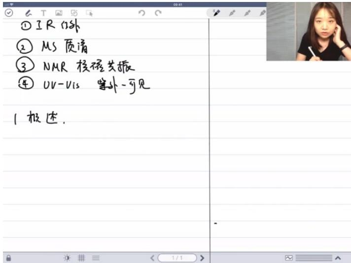

text_image

① IR 外
② MS 质谱
③ NMR 校核共振
④ UV-Vis 等外一可见
1 极述.

● 基本原理：所有波谱分析方法的核心原理是将样品置于仪器中，用特定能量的波（具有波粒二象性）作用于样品，通过观测样品的变化来间接获取物质结构信息。

\- 四种主要方法:

○ ① IR红外光谱   
○ ② MS质谱   
○ ③ NMR核磁共振   
- ④ UV-Vis紫外-可见光谱

1）波谱分析的能量基础

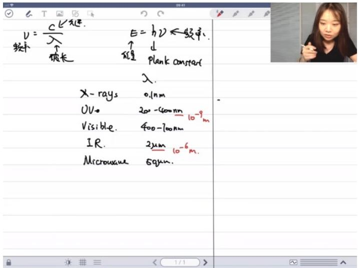

text_image

v = c k 克
反补 ↑
玻卡
E = b v ← 反补.
↑ ↓
能量 plank constant
λ.
x-rays 0.1nm
UV0 200 -400 nm 10-9m
Visible 400 -700 nm
IR 2μm 10-6m.
Microwave 50μm.

基本公式:

○ 波动性： $v=\frac{c}{\lambda}$ （频率=光速/波长）  
○ 粒子性： $E = h\nu$ （能量=普朗克常数×频率）

● 单位换算:

○ 纳米(nm)=10 $^{-9}$ 米  
○ 微米( $\mu m$ ) = 10 $^{-6}$ 米  
○ 皮米 $(pm) = 10^{-12}$ 米

2）不同波谱方法的能量比较

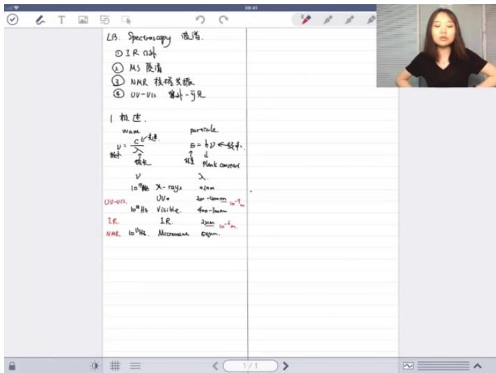

text_image

LB. Spectroscopy 波谱.
① IR 外
② MS 质谱
③ NMR 核码共振
④ UV-VIS 催扑-可见
1 极速.
wave particle.
V = C/2 钻 0 = b/2 < 0.5
峰 ↑ d
峰 ↑ d
Plank control
V λ
10 Hz X-ray 0 nm
UV-Vis V/Hz 20 nm/10⁻⁷ m
b/4 Hz VIS/Hz 400-100 m
IR I.R. 200 m/10⁻⁷ m
NMR 10 MHz Nucleon 60 nm

● 能量从高到低排序:

○ X射线（约0.1nm， $10^{19}$ Hz）  
- UV紫外 (200-400nm)   
- 可见光（400-700nm）  
- IR红外（约2μm）

○ 微波（约50μm，10 $^{13}$ Hz）

# - 对应分析方法:

- 紫外-可见光谱（UV-Vis）：200-700nm  
- 红外光谱（IR）：约2μm  
○ 核磁共振（NMR）：微波区域  
○ 质谱（MS）：基于粒子性，使用高能电子

# 3）不同波谱对分子的影响

# ● NMR核磁共振:

◦ 能量最低，仅改变原子核自旋方向  
- 不影响分子结构，可用于实时监测反应

# - IR红外光谱:

◦ 能量中等，引起化学键的伸缩或摇摆振动  
- 对反应干扰较小

# - UV-Vis紫外可见光谱:

◦ 能量较高，引起电子跃迁（HOMO→LUMO）  
- 可触发光化学反应

# MS质谱:

◦ 能量最高，直接使分子失去电子形成正电荷自由基  
○ 会破坏分子结构

# 2. 红外光谱(IR)基础

# 1）红外谱图的三要素

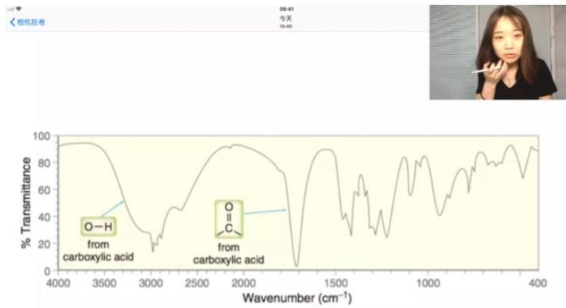

line

| Wavenumber (cm⁻¹) | % Transmittance |
| ----------------- | --------------- |
| 4000              | ~95             |
| 3500              | ~85             |
| 3000              | ~20             |
| 2500              | ~90             |
| 2000              | ~95             |
| 1500              | ~85             |
| 1000              | ~70             |
| 400               | ~90             |

# - 波数(wavenumber):

○ 单位: $cm^{-1}$   
○ 数值越大表示能量越高（左侧高能，右侧低能）

# - 强度(intensity):

- 吸收峰向下延伸程度表示强度  
- 完全到底部的峰强度最大

# - 形状(shape):

○ 峰宽窄表示不同信息（如OH峰通常较宽）

# 2）红外谱图解读要点

# ● 典型特征峰:

○ O-H键：约3500cm $^{-1}$ （宽峰）  
○ C=O键：约1700cm $^{-1}$ （强峰）

# - 杂峰识别:

○ 右侧低波数区域（<1000cm $^{-1}$ ）多为指纹区

这些峰的强度通常只有主峰的一半左右

# 3. 红外光谱 23:15

# 1）波数 27:04

● 波数的定义 27:20

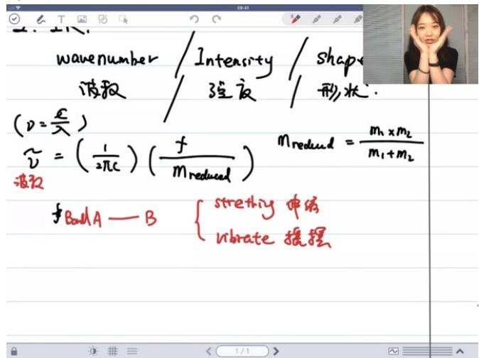

text_image

wavenumber / Intensity / shape
波数 / 强度 / 形状.
(P=ε/λ)
ṽ=(1/2πc)(f/m_reduced) m_reduced = (m₁×m₂)/m₁+m₂
波数
β_BadA—B {stretched 伸缩
vibrate 携摆

物理意义：波数表示单位长度内包含的完整波长的数量，计算公式为 $D=\frac{E}{\lambda}$ ，其中 $\lambda$ 为波长  
○ 与频率的关系：波数与频率具有相似物理意义，频率 $v=c/\lambda$ （c为光速），而波数 $\sim v=1/\lambda$

● 波数与频率的关系 27:37

○ 计算公式： $\sim v = \left(\frac{1}{2\pi c}\right)\left(\frac{f}{m_{red}}\right)$   
○ 关键参数：

■ 化简质量： $m_{red}=\frac{m_{1}\times m_{2}}{m_{1}+m_{2}}$ （m1、m2为成键原子质量）  
■ 键能因子：f与键能正相关，反映化学键强度

○ 分子振动类型:

■ 伸缩振动(stretching): 键长周期性变化（如C-H键伸缩）  
■ 摇摆振动(vibrate): 键角周期性变化（如CH4中H-C-H角振动）

● 例题1：氢碳键与碳碳键的化简质量比较 33:15

○ 题目解析：

■ 比较C-H键与C-C键的 $m_{red}$ 大小  
计算过程:

● C-H键: $m_{red}=\frac{12\times1}{12+1}\approx0.92$   
C-C键： $m_{red}=\frac{12\times12}{12+12}=6$

■ 结论：C-H键的化简质量更小（答案A）

● 例题2：碳氢键与碳氘键的波数比较 35:09

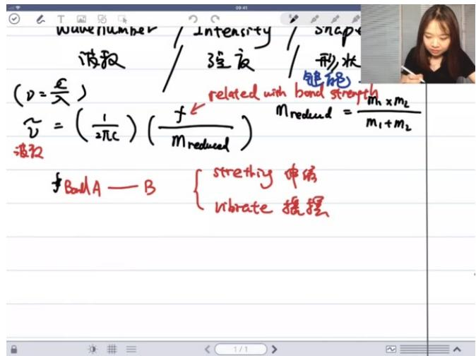

text_image

Wave number / Intensity / snap
波数 / 强度 / 形状
(ρ = ε/λ) related with bond strength
ṽ = (1/2πc) (f/ m_reduced) m_reduced = (m₁ + m₂)
波数
β_BodA — B { stretchy 伸缩
vibrate 携摆

# ○ ○ 题目解析：

■ 条件：C-H与C-D键能近似相等（f值相同）  
■ 关键因素：比较 $m_{red}$ 大小

$$
\begin{array}{l l} \bullet & \text {C - H :} \frac {1 2 \times 1}{1 3} \approx 0. 9 2 \\ \bullet & \text {C - D :} \frac {1 2 \times 2}{1 4} \approx 1. 7 1 \end{array}
$$

■ 规律： $m_{red}$ 越小波数越大  
■ 实测值：C-H约3000cm $^{-1}$ ，C-D约2200cm $^{-1}$ （答案A）

● 例题3：碳氮单键、双键与三键的波数排序 37:48

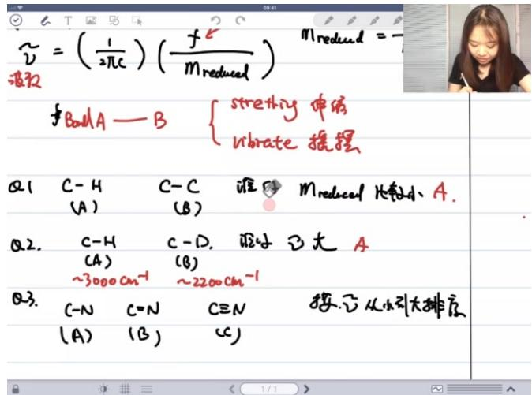

text_image

ṽ = (1/2πc) (f/c/m_reduced) m_reduced = -
波纹
f_BouA — B { strethiy 申结
          nibrate 援摆
Q1 C-H C-C 潮 m_reduced 比较小 A.
(A) (B)
Q2. C-H C-D. 潮以 D 大 A
(A) (B)
~3000 cm⁻¹ ~2200 cm⁻¹
Q3. C-N C=N C≡N 按它从小引大排底
(A) (B) (C)

# ○ ○ 题目解析：

■ 固定原子对（C-N）时 $m_{red}$ 相同  
■ 决定因素：键能因子f（三键>双键>单键）  
■ 计算公式： $\sim v \propto \sqrt{f / m_{red}}$   
实测值：

● C-N单键：约1100cm $^{-1}$   
● C=N双键：约1600cm $^{-1}$   
● C≡N三键：约2200cm $^{-1}$

■ 排序规则：波数与键级正相关（答案A<B<C）

● 波数的范围与区域 39:40

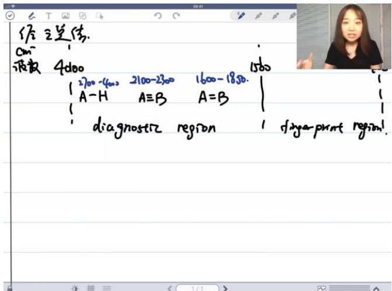

text_image

经三总结.
cm⁻¹
函数 4doo
2700 - 4800 2100 - 2300 1600 - 1850.
A-H A≡B A=B
diagnostiz region ; diagram print region!

○ 波数范围: 红外光谱的波数范围是 $4000 - 400 \mathrm{~cm}^{-1}$ , 其中 $1500 \mathrm{~cm}^{-1}$ 是一个重要分界点。

○ 诊断区:

■ 范围: 4000-1500 cm $^{-1}$   
■ 特点：能量较高，吸收峰明显，是分析的重点区域。相当于分子受到较大能量刺激时产生的显著振动。

○ 指纹区:

■ 范围: 1500-400 cm $^{-1}$   
■ 特点: 能量较低，行为更精细微小，现阶段学习不涉及此区域的分析。

○ 特征吸收峰

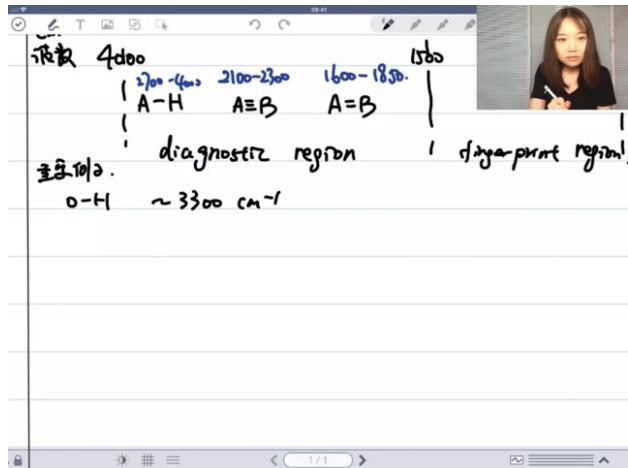

text_image

函数 4doo
2700 - 4000 2100 - 2300 1600 - 1850.
A-H A≡B A=B
diagnostiz region ; fiaga-punt region!
主象例2.
0 - H ~ 3300 cm-1

A-H单键:

● 范围: 2700-4000 cm $^{-1}$   
● 原理：由于氢原子质量小，导致约化质量(reduced mass)值小，波数较高。

■ 三键:

● 范围: 2100-2300 cm $^{-1}$ （约2200 cm $^{-1}$ 附近）

■ 双键:

● 范围: 1600-1850 cm $^{-1}$ （约1700 cm $^{-1}$ 附近）

■ 重点记忆:

● O-H键: 约3300 cm $^{-1}$   
● C=O键: 约1700 cm $^{-1}$   
- 应用：在红外谱图中看到 $3300 \mathrm{~cm}^{-1}$ 附近的强吸收峰表明有羟基存在； $1700 \mathrm{~cm}^{-1}$ 附近的强吸收峰表明有羰基存在。

● 例题4：不同杂化碳氢键的波数排序 46:50

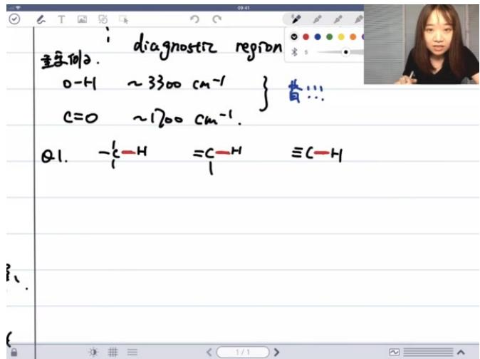

text_image

diagnostic region
空余例2.
0-H ~3300 cm⁻¹
c=0 ~1700 cm⁻¹.
Q1. -{c-H} ={c-H} ≡{c-H}

# 题目解析:

■ 原理: 波数公式为 $\sim\nu\propto\sqrt{\frac{f}{\mu}}$ ，其中 f 为力常数， $\mu$ 为约化质量。对于 C-H 键， $\mu$ 恒定，波数排序等价于键能排序。  
■ 杂化效应:

- SP $^{3}$ 杂化C-H键：约2900 cm $^{-1}$   
- SP²杂化C-H键：约3100 cm⁻¹   
- SP杂化C-H键：约3300 cm $^{-1}$

■ 键长关系：SP杂化C-H键最短（s轨道成分多，电子更靠近碳原子），SP $^{3}$ 杂化C-H键最长。  
■ 结论: 键长越短, 键能越大, 波数越高。因此波数排序为 $SP^{3}<SP^{2}<SP$ 。  
■ 答案: ① < ② < ③

● 例题5：氮氢键与氧氢键的波数比较 51:03

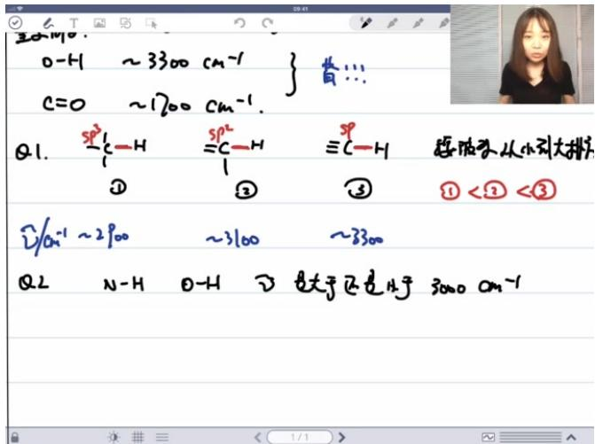

text_image

0-H ~3300 cm-1
c=0 ~1700 cm-1.
Q1. ① SP²⁻ = SP²⁻ C-H ② SP = SP - H ③ = SP + C-H 要滴头从小到大排
① < ② < ③
①/Al²⁻ ~2900 ~3100 ~3300
Q2 N-H O-H D 大于还是大于 3000 cm⁻¹

# 题目解析:

■ 比较对象: N-H键和O-H键与 $3000\ cm^{-1}$ 的关系  
■ 原理: 虽然约化质量不同，但键能起决定性作用。键能关系为O-H > N-H > C-H。  
■ 原子半径效应: 氧原子半径小于氮原子，导致O-H键键能更大。  
■ 结论: N-H和O-H键的波数都大于 $3000\ cm^{-1}$ ，且O-H > N-H > C-H。  
■ 答案: 大于 $3000 \mathrm{~cm}^{-1}$

● 例题6：分子中不同键的波数排序53:17

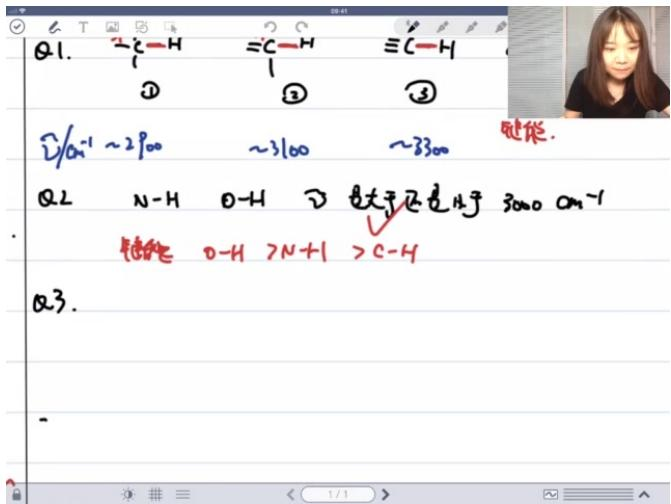

text_image

Q1. 2C-H =C-H ≡C-H
① ③ ③
2/σ⁻¹ ~2900 ~3100 ~3300
Q2 N-H O-H D 大于还是大于 3000 cm⁻¹
性能 O-H >N+1 >C-H
Q3.

# ○ 键的波数范围：

■ 碳氢键（C-H）：约 $2900 \mathrm{~cm}^{-1}$   
■ 氮氢键（N-H）：3100 - 3300cm $^{-1}$   
■ 氧氢键（O-H）：大于 $3000cm^{-1}$ ，范围较宽（2700-3500cm $^{-1}$ ）  
■ 三键（如C≡C）：约2200cm $^{-1}$   
■ 双键（如C=O）：约 $1700cm^{-1}$

# ○ 排序规则：

■ 经验总结：带氢的键波数通常较高（2400 - 4000cm $^{-1}$ ）  
■ 具体排序：双键 < 三键 < 碳氢键 < 氮氢键 < 氧氢键  
■ 碳氢键的差异：SP杂化的碳氢键波数大于SP2杂化的碳氢键

# ○ 典型排序示例：

■ 最小：双键（如C=O，约1700）  
■ 次小：三键（如C≡C，约2200）  
■ 中间：碳氢键（约2900）  
■ 较大：氮氢键（3100-3300）  
■ 最大：氧氢键（>3000）

● 例题7：不同分子中羰基波数的比较 01:01:41

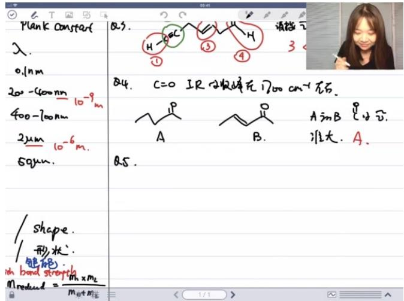

text_image

Plank constant
2.
0.1nm
200 -400nm 10-9m
400 -700nm
2μm 10-6m.
50μm.
shape.
形状.
键配.
in band strength
m reduced = m_0 + m_1
Q3.
①
②
③
④
C=O IR 反吸收在1300cm⁻¹左右.
A
B.
A in B ① √2.
准无. A.
Q4.
Q5.

# ○ 比较原理：

■ 波数与键能正相关，键能与键级正相关  
■ 比较的是羰基（C=O）的键级差异

# - 具体分析：

标准双键（如分子a）：键级为2，波数较高（ $1720cm^{-1}$ ）

■ 共轭体系（如分子b）：电子离域导致键级略小于2，波数较低（ $1680cm^{-1}$ ）

# ○ 结论：

■ 标准双键的羰基波数 > 共轭体系的羰基波数  
■ 具体数值：a（1720）>b（1680）

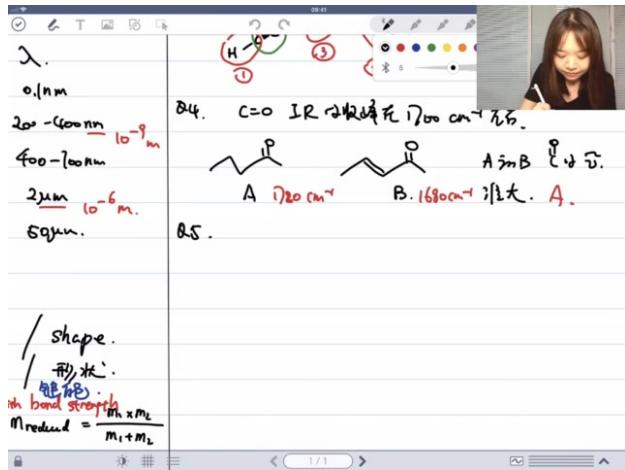

text_image

2.
0.1nm
200 -400nm 10-9m
400 -700nm
2um 10-6m.
5qmm.
shape.
形状.
键泡.
th bond strength
mredund = (m₁×m₂/m₁+m₂)
Q4. C=O IR 角峰花 1700 cm⁻¹ 元石.
A 1720 cm⁻¹ B 1680cm⁻¹ 泥大. A.
Q5.
H
①
③
④
A3mB ⑤ 小二.
⑥
1/1

# ○ 实际数据参考：

■ 标准羰基： $1720cm^{-1}$   
■ 共轭羰基： $1680cm^{-1}$   
差值：约 $40cm^{-1}$

● 例题8：红外谱图大于3000波数的信号判断 01:04:41

\- 红外光谱特征区域

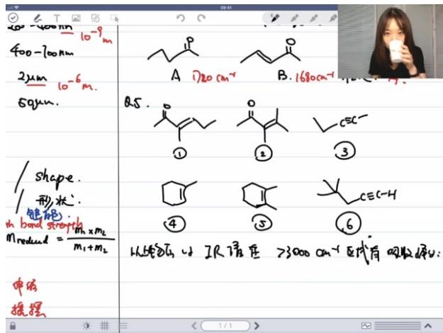

chemical

Handwritten chemical reaction equations and molecular structures for organic compounds A, B, C, and C=C- with accompanying photo of a person using a smartphone.

诊断区域：红外光谱中>3000 cm $^{-1}$ 区域为特征吸收区，主要用于判断特定化学键  
■ 吸收条件：

● 必须是A-H单键（A代表原子）  
- 不能是SP $^{3}$ 杂化的C-H键  
- 允许SP²和SP杂化的C-H键   
- 允许O-H、N-H键

○ 波数排序规律

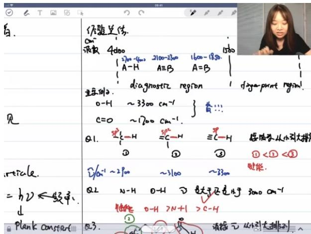

text_image

自.
问题总结.
cm
函数 4doco
2700-4900 2100-2300 1600-1850
A-H A≡B A=B
diagnostiz region diagram-print region!
见
直实侧2.
0-H ~3300 cm⁻¹ } 曾...
c=0 ~1700 cm⁻¹.
Q1. =C-H =C-H ≡C-H 按底张从小到大排
① ③ ④ ⑤ <① <③
article.
=h2←题中.
d
Plank constn# (#
Q2 N-H O-H D 大于还是用于 3000 cm⁻¹
① ② ③ ④ ⑤ <① <③
② ③ ④ ⑤ <① <③
消波=从小到大排

■ 键伸缩振动波数排序：C-H < N-H < O-H

\- 具体范围：

○ C-H: 2900-3100 cm $^{-1}$   
○ N-H: 3300 cm $^{-1}$   
○ O-H: >3300 cm $^{-1}$

■ 记忆技巧：电负性越大，波数越高（O>N>C）

○ 典型吸收峰

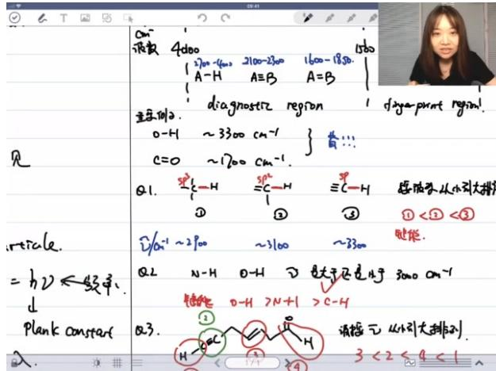

text_image

CO₃
溶液 4000
A-H 2100-2300 1600-1850.
A≡B A=B
diagnostic region diagram-print region!
主实例2.
0-H ~3300 cm⁻¹
c=0 ~1700 cm⁻¹
Q1. =C-H =C-H ≡C-H 氨物质从小到大排
① ② ③ ④ <① <③
H/Ca²⁻ ~2900 ~3100 ~3300 能。
=hν ≤额中.
d
plank constant
Q2 N-H O-H D 大于区是由于 3000 cm⁻¹
性能 0-H >N+1 >C-H
Q3. 请按元从小到大排列。
3 < 2 < 4 < 1

■ 特征吸收峰：

● O-H: \~3300 cm $^{-1}$   
● C=O: \~1700 cm $^{-1}$   
- SP $^{3}$ C-H: <3000 cm $^{-1}$

■ 杂化影响：

- SP $^{2}$ C-H（烯烃、芳烃）：>3000 cm $^{-1}$   
SP C-H（炔烃）：\~3300 cm $^{-1}$

○ 解题应用

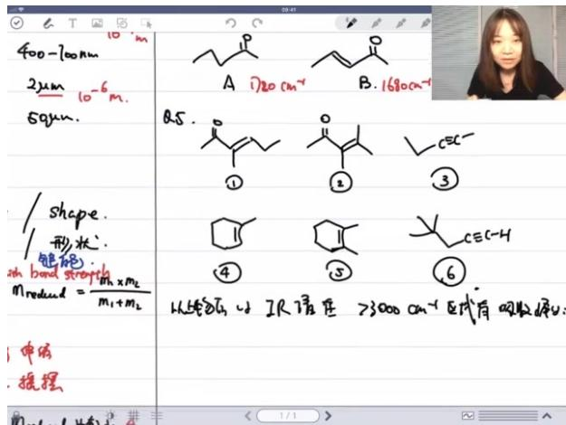

text_image

400-100nm
2μm 10^-6 m.
50μm.
shape.
形状.
键性
with band strength
m_redund = (m₁+m₂)
申请
提醒
A 1)20 cm⁻¹ B. 1680cm⁻¹
①
②
③
④
⑤
⑥
以560℃，以 IR倍度 ≥3000 cm⁻¹ 区内有双碳碳：
1/1>

# ■ 判断方法：

● 排除所有非A-H键  
- 排除SP³C-H键   
● 确认剩余结构中符合 $SP^{2}/SP C-H$ 、O-H、N-H的键

# 典型错误：

- 混淆不同杂化状态的C-H键  
- 忽略O-H/N-H的贡献   
- 误判双键/三键的吸收位置

# - 红外光谱三要素

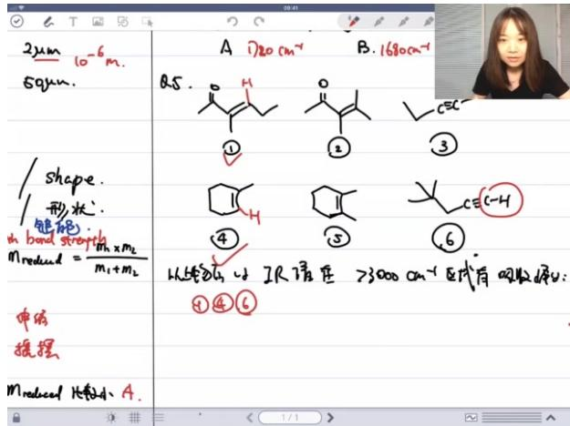

text_image

2μm
10⁻⁶ m.
50μm.
shape.
形状.
with bond strength
m_redund = m₁ + m₂
申请
梳理
m_reduced 16±4 A.
A 1720 cm⁻¹ B. 1680 cm⁻¹
①
②
③
④
⑤
⑥
以5‰CrCl₃Ir溶液 >3000 cm⁻¹ 区域有吸收液：
①④⑥
1/1>

# 分析要点：

- 波数（位置）  
强度  
- 峰形（伸缩、弯曲等）

# ■ 强度影响因素：

● 偶极矩变化大小   
- 键的极性  
- 分子对称性

# 综合应用

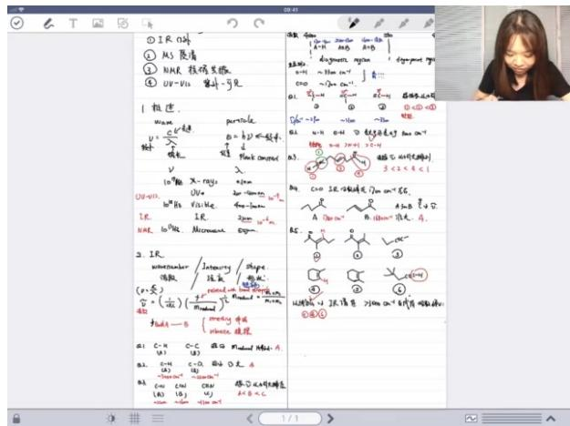

text_image

① IR (2)
② M3 气清
③ NMR 检码共轭
④ UV-Vis 替补一见

1. 极速.
warm particle
v C r 明
树
核光
↑
↓
Plant contact
v λ
10^6 kx x-rays nlon
UV-Vis 20 cm⁻¹
IR I.R. 200 cm⁻¹
NMR 10^6 kx Micromolecular 40cm⁻¹

2. IR
micromolecular / Jeterojing / shape
现象 / 法光 / 粉体:
（+）（或）（故）（R）
(负) (负)
fudA—B {methyl 水相}
          [methyl 水相]
a1 C—H C—C 点 D Pnol Medi A
(a1) (b) (c) (d) (e) (f)
a2 C—H C—O O O 4
(b) (c) (d) (e) (f)
(b) (c) (d) (e) (f)

# 学习建议：

- 第一轮学习：建立正确的基本概念  
- 第二轮学习：建立概念间的联系  
● 第三轮学习：通过反复调用强化逻辑关系

# ■ 考试策略：

● 基础题：调用少量知识点  
● 难题：需要组合调用多个知识点  
● 关键：准确且熟练地调用正确知识点

# 2）强度和形状 01:08:58

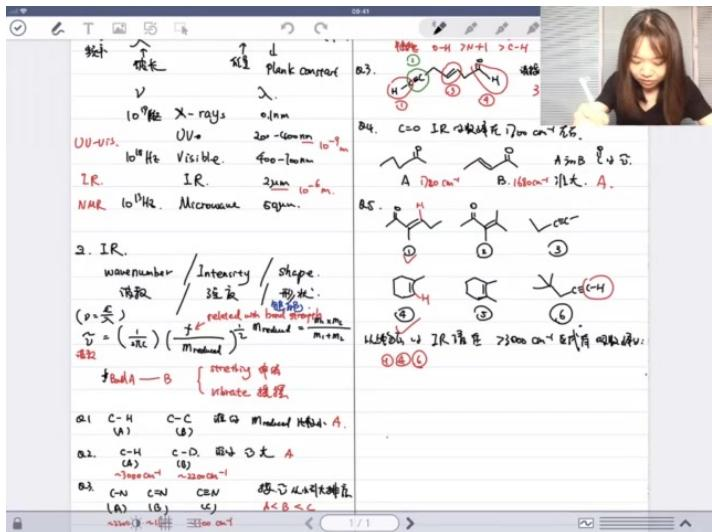

text_image

紫外
↑
碳长
↑
键
↓
Plank catalyst
ν
λ
10⁹ Hz
X-rays
0.1nm
OU-VIS.
UV+
2σ-6cm⁻¹
10⁻⁹ m
10⁸ Hz
Visible.
φ50-7cm⁻¹
IR.
IR.
2μm
10⁻⁶ m
NMR
10³ Hz
Microwave
50 μm
B4. C=O IR溶液在10cm⁻¹内有。
A 3mB ① ②
A 70cm⁻¹ B 160cm⁻¹ 准大，A.
B5.
① ② ③
④ ⑤ ⑥
⑦ ⑧ ⑨ ⑩
以纯度 ω 红谱在 >3000 cm⁻¹ 反式有双极峰：
①②③
#A+B
### intensity 申请
### repress
Q1 C-H C-C 纸型 M-induced H⁺δH、A.
(A) (B)
Q2 C-H C-D 四子 D 大 A
(A) (B)
~3000 cm⁻¹ ~220 cm⁻¹
Q3 C-N C=N C≡N 气-乙炔对大排度
(A) (B) (C) A<B<C
(1/1)

- 波束与强度关系：红外吸收峰的波束（波数）与强度是两个独立参数，波束由化学键类型决定，强度则与键偶极矩相关  
- 形状影响因素：氢键作用会导致吸收峰变宽，特别是O-H键在 $3300\mathrm{cm}^{-1}$ 附近的吸收峰常呈现宽峰特征

# ● 典型吸收区：

\- $2200\mathrm{cm}^{-1}$ 附近：三键（如 $\mathbf{C} \equiv \mathbf{N}$ ）
- $1700\mathrm{cm}^{-1}$ 附近：双键（如 $\mathbf{C} = \mathbf{O}$ ）

# 3）经验规律 01:09:51

● 吸收峰强度与键偶极矩的关系 01:10:03

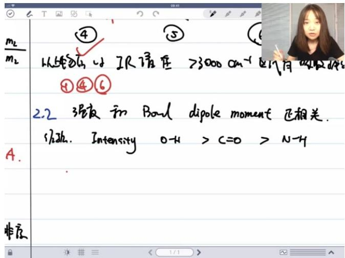

text_image

m₂
/m₂
④ ⑤ ⑥
以上物质以 IR 浓在 >3000 cm⁻¹ 区间内吸收液
④⑥
2.2 强度和 Bond dipole moment 正相关.
s/2h. Intensity 0 - H > C = O > N - H
A.
非底

强度排序：O-H > C = O > N - H，该顺序与键的偶极矩大小正相关   
- 记忆口诀："枪基（羟基）大于汤基（羰基）大于蛋清（氮氢）"  
☐ 浓度影响：实际谱图中峰强度还受样品浓度影响，含水样品中O-H峰可能达到100%强度

● 吸收峰形状与氢键的关系 01:10:25

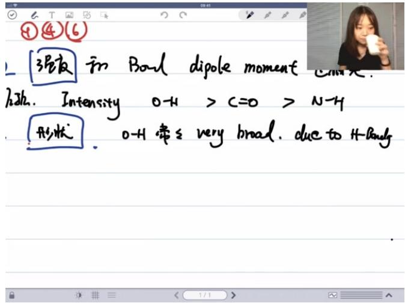

text_image

①④⑥
强友和Boul dipole moment
h2h. Intensity 0-H > C=O > N-H
形状 0-H 带是 very broad. due to H-Brady

自由OH峰：未形成氢键的O-H吸收峰尖锐，出现在\~3700cm $^{-1}$   
○ 氢键OH峰：形成氢键的O-H吸收峰变宽，范围在3300cm $^{-1}$ 附近  
极端情况：羧酸的O-H峰异常宽（2800-3300cm $^{-1}$ ），因其形成强氢键网络结构

● 例题1: 分析氢氧键在红外吸收中的表现 01:13:11

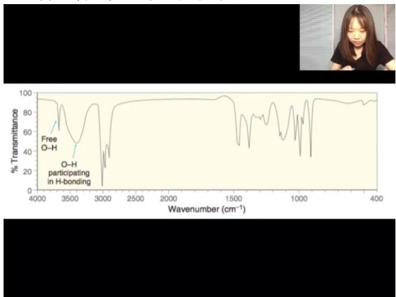

line

| Wavenumber (cm⁻¹) | % Transmittance |
| ----------------- | --------------- |
| 4000              | ~95             |
| 3500              | ~60             |
| 3000              | ~10             |
| 2500              | ~95             |
| 2000              | ~95             |
| 1500              | ~95             |
| 1000              | ~95             |
| 400               | ~95             |

○ 题目解析

■ 典型特征：脂肪醇在3000-3400cm $^{-1}$ 有宽而强的O-H吸收峰，2900cm $^{-1}$ 附近为C-H吸收  
■ 形成原因：样品中水分或分子间氢键导致多个微扰的O-H振动峰叠加  
■ 实验验证：稀释干燥样品可观察到3700cm $^{-1}$ 处的游离O-H尖峰  
考点提示：氢键作用是解释O-H峰宽化的关键

# 4）应用案例 01:14:22

# ● 例题:脂肪醇红外图

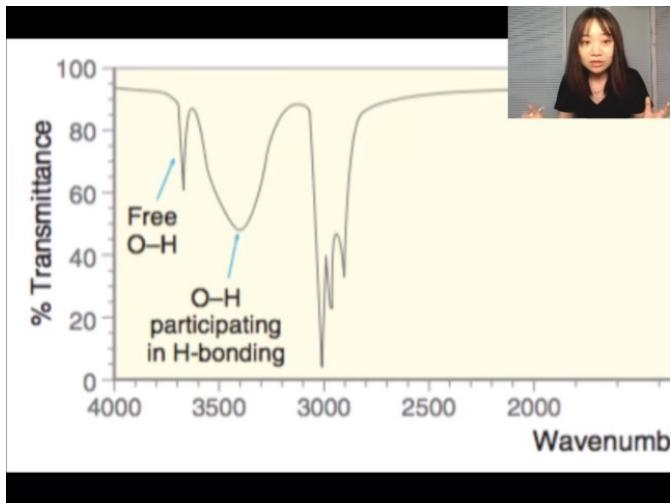

line

| Wavenumb | % Transmittance |
| -------- | --------------- |
| ~4000    | ~95             |
| ~3500    | ~50             |
| ~3000    | ~10             |
| ~2500    | ~95             |
| ~2000    | ~95             |

# ○ ○ 题目解析

■ 谱图对比：浓溶液显示宽O-H峰（氢键作用），稀溶液额外出现3700cm $^{-1}$ 尖峰（单体分子）  
■ 实验意义：通过稀释实验可区分分子间/分子内氢键  
■ 记忆要点："浓溶液宽，稀溶液尖"

# ● 例题:硝酸的红外图 01:17:30

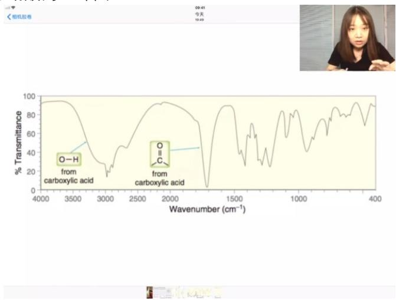

line

| Wavenumber (cm⁻¹) | % Transmittance |
| ----------------- | --------------- |
| ~3500             | ~90             |
| ~2000             | ~95             |
| ~1500             | ~85             |
| ~1000             | ~70             |
| ~400              | ~90             |

# ○ ○ 题目解析

■ 特征表现：羧酸O-H峰异常宽（2800-3300cm $^{-1}$ ），常与C-H峰重叠  
■ 结构原因：羧酸二聚体形成强六元环氢键，在溶液中呈网状结构  
■ 鉴别要点：宽O-H峰+1700cm $^{-1}$ 强C=O峰是羧酸的特征

# ● 例题:一级二级胺红外图 01:20:42

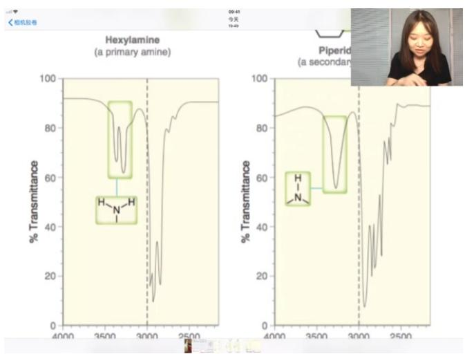

text_image

Hexylamine
(a primary amine)
Piperidone
(a second anion)
% Transmittance
100
90
80
70
60
50
40
30
20
10
0
4000 3500 3000 2500
Hexylamine
(a primary amine)
Piperidone
(a second anion)

# ○ ○ 题目解析

■ 一级胺特征：3300-3400cm $^{-1}$ 双峰（对称和不对称N-H伸缩振动）  
■ 二级胺特征：单峰（仅一个N-H键伸缩振动）  
■ 记忆技巧: "NH $_{2}$ 双峰, NH单峰" (虽不完全准确但方便记忆)  
■ 理论解释：双峰源于两个等价N-H键的对称/不对称振动模式

# 4. 质谱 01:24:35

# 1）质谱原理 01:30:53

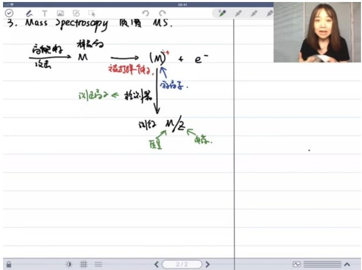

text_image

3. Mass Spectrospray 质量 MS.
→ 气泡物 M → (M)+ + e-
攻击
被打掉一转子.
测正离子 ← 检动器 ↓
测正 M/2
质差 ↑ 有氧.
质差 ↑ 有氧.

- 分子离子形成: 样品分子 $M$ 失去一个电子形成 $M^{+} \cdot$ （正离子自由基），这是质谱分析的基础。

# ● 检测原理:

☐ 质荷比测定: 检测器通过测量带电粒子在电场中的迁移速率来确定m/z值（质量/电荷比），其中m为质量，z为电荷数。  
- 电荷特性: 绝大多数商业质谱仪检测正离子，但通过调整也可检测负离子。

# - 分子离子峰:

○ 特征: 对应z=1的 $M^{+}\cdot$ 峰（最稳定状态），谱图中表现为最高质量端的峰。

○ 应用: 直接反映分子质量（如测得 $m/z=142$ 即分子量为142）。

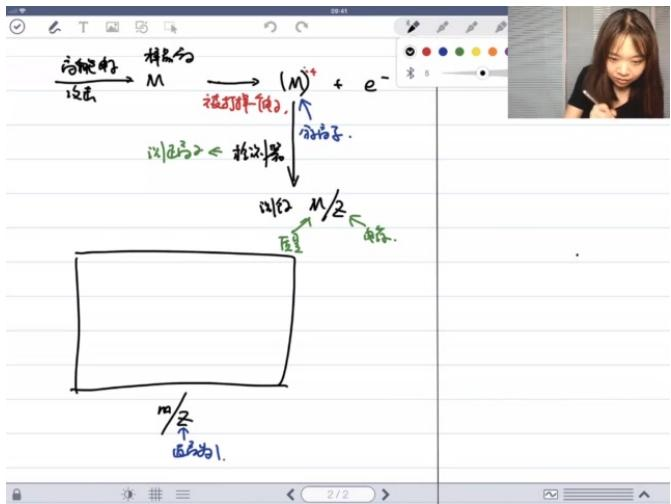

text_image

向饱和
攻击
标点分
M
→ (M)+ + e-
被打掉一转子.
测量号2←检测器
测红 M/2
质量
自由
m/2
值为1.

○ 谱图解读: 横轴为 $m / z$ ，纵轴为相对丰度；分子离子峰标注为 $M^{+} \cdot$ ，可能伴随 $M + 1$ 峰（同位素效应）。

# 2）高分辨质谱

text_image

1个
逗号为1.

高分辨质谱. High-resolution Mass Spectrometry.
做出 $M^{+}$ m/z 到小双全后四位.

text_image

1

\- 精确质量测定: 可测量 $m / z$ 至小数点后四位（如84.0573 vs 84.0936），区分不同元素组成的同标称质量分子。
- 示例: 环己烷 $(C_{6}H_{12})$ 与另一化合物（如 $C_{5}H_{8}O_{2}$ ）标称质量均为84，但精确质量不同。

\- 分子式确定: 结合元素可能性和精确质量计算, 可推导分子式 (如题干中给出 $C_{5}H_{10}O_{2}$ 的来源)。

3）同位素效应 01:40:29

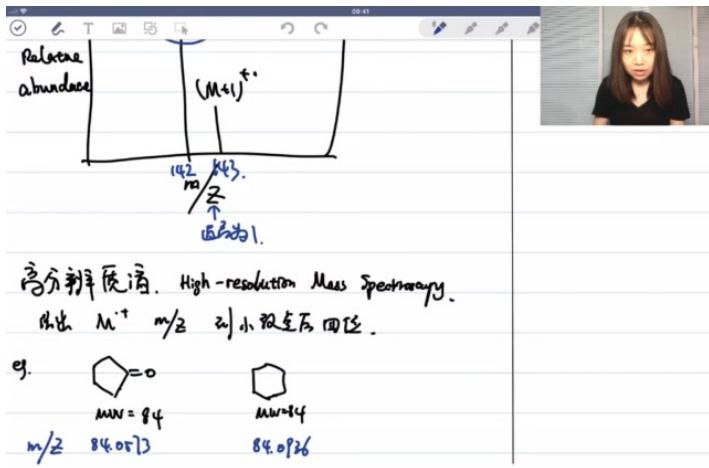

text_image

Relative abundance
(M+1)⁴⁺
142 843.
m/z
西离子为1.
高分辨率质谱. High-resolution Mass Spectrometry.
放出 M⁻¹ m/z 列小板全层四位.
eJ.
=0
MN=84
m/z 84.0573
MN=84
84.0926

- 氯原子识别: $M:M+2$ 峰强度比 $\approx 3:1$ ( $^{35}Cl:^{37}Cl$ 天然丰度比)。  
- 溴原子识别: $M:M+2$ 峰强度比 $\approx 1:1$ ( $^{79}Br:^{81}Br$ 天然丰度比)。  
● 应用: 通过分子离子峰与同位素峰的强度比，判断分子中是否含Cl/Br及其数量。

# 4）应用案例 01:42:29

● 例题:同位素效应计算

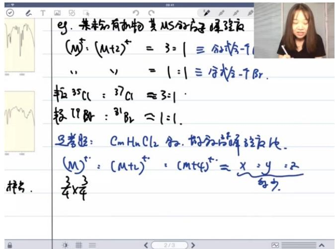

text_image

g. 某粉有机物 其MS分子应干燥状态
(M)⁺: (M+2)⁺ = 3:1 ≡ 分式含一个
“” = 1:1 ≡ 分式含一个Br.
Fe₂ ³S Cl : 37Cl ≈ 3:1
Fe 19Br : 31Br ≈ 1:1.
足考照: CmHnCl₂ 分子 故分式溶解度比
(M)⁺: (M+2)⁺: (M+4)⁺ = x : y : 2
½×¾
碎片.

○ 单氯化合物峰型：

■ 含 $^{35}$ Cl的分子产生一个峰，含 $^{37}$ Cl的分子产生另一个峰，两峰质量数相差2  
■ 天然丰度比为 $^{35}Cl:^{37}Cl=3:1$ ，对应质谱峰强度比 $(M)^{+}:(M+2)^{+}=3:1$

# ○ 双氯化合物峰型：

■ 存在三种组合方式： $^{35}Cl-^{35}Cl$ （M）、 $^{35}Cl-^{37}Cl$ （M+2）、 $^{37}Cl-^{37}Cl$ （M+4）  
■ 强度比计算原理：概率乘积（类似遗传学分离定律）

● M峰概率： $\frac{3}{4} \times \frac{3}{4} = \frac{9}{16}$   
● $M + 2$ 峰概率： $\frac{3}{4} \times \frac{1}{4} \times 2 = \frac{6}{16}$ （两种排列组合）  
● $M + 4$ 峰概率： $\frac{1}{4} \times \frac{1}{4} = \frac{1}{16}$

■ 最终峰强度比为9:6:1

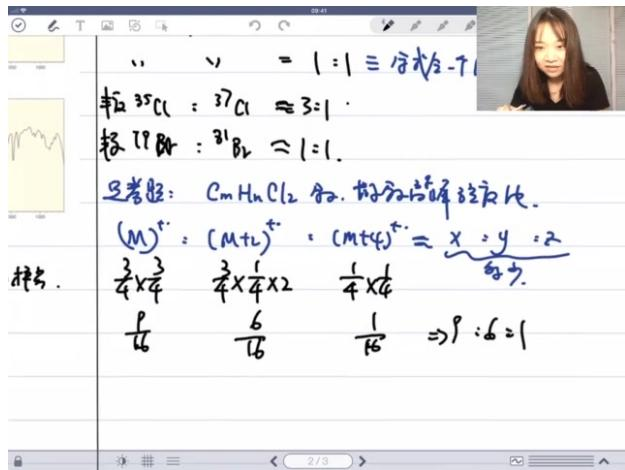

text_image

1:1 = 1:1 三分式为一个
假设35Cl : 37Cl ≈ 3:1
假设19Br : 31Br ≈ 1:1.
定考题: CmHnCl2 分子, 故分子的解体成比.
(M)⁺ : (M+2)⁺ · (M+4)⁺ = x : y : 2
(3/4) × (3/4) × (3/4) × (3/4) × (3/4)
(6/16) × (6/16) × (6/16) ⇒ 9 : 6 : 1

# ○ 计算验证：

■ 以 $C_{m}H_{n}Cl_{2}$ 为例，实际计算过程展示分数转换  
■ 强调 $\frac{0}{16}$ 中的系数2来源于两种同位素排列方式 $(^{35}Cl - ^{37}Cl$ 和 $^{37}Cl - ^{35}Cl)$

# 核磁共振基础

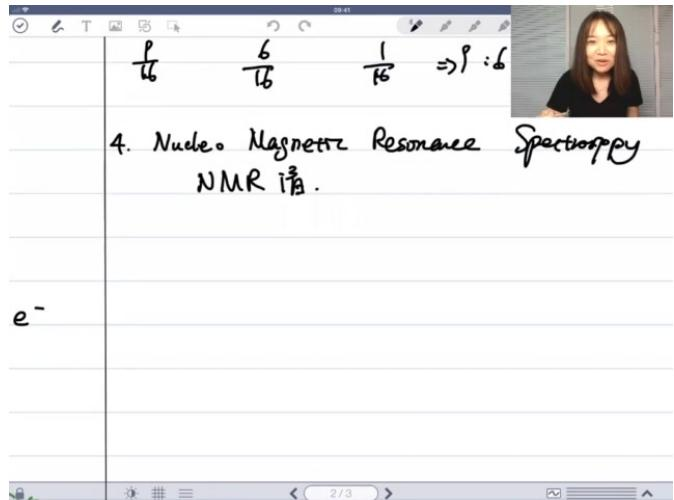

text_image

4. Nucleo Magnetron Resonance Spectroscopy
NMR 清.
e-

# ○ NMR活性核判定：

■ 活性核条件：质子数和中子数不同时为偶数（如 $^{1}H$ 、 $^{13}C$ 、 $^{15}N$ ）

■ 非活性核示例： $^{16}O(8p+8n)$ 、 $^{32}S(16p+16n)$ 、 $^{12}C(6p+6n)$

# ○ 信号质量影响因素：

■ 自旋量子数(I): $I = 1 / 2$ 的核（如 ${}^{1}H$ ）电子云呈球状分布，信号窄而清晰

■ I>1/2的核（如 $^{2}H(I=1)$ 、 $^{14}N(I=1)$ ）信号宽且复杂

■ 连带效应：与宽信号核相连的 $^{1}$ H信号也会变宽（如-NH、-OH）

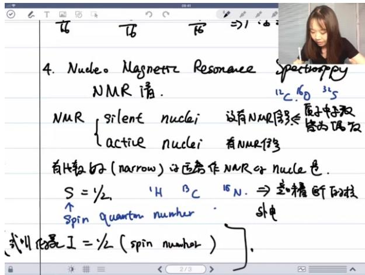

text_image

4. Nucleo Magnetic Resonance Spectroscopy
NMR 请.
NMR { silent nuclei   设有NMR信号≤原子电子取
            active nuclei   有NMR信号
有H数的(narrow)的运算作NMR或nucle是.
S = ½    'H B C 15 N. ⇒ 高精度的核
↑ spin quantum number    外电
式叫P(强)I = ½ (spin number ) }.

# 最佳NMR核特征：

■ 自旋量子数 $I = 1 / 2$   
■ 电子云球对称分布（保证信号分辨率）  
典型代表： $^{1}H$ 、 $^{13}C$ 、 $^{19}F$ 、 $^{31}P$

# ○ 实际应用提示:

■ 氢谱( $^{1}$ HNMR)是有机结构解析最常用工具  
■ 碳谱( $^{13}$ CNMR)需注意天然丰度仅1.1%  
■ 氮谱 $^{(14)}$ NNMR)因I=1信号宽，实际应用受限

# 三、核磁共振氢谱01:45:22

# 1. 判断信号数 01:54:28

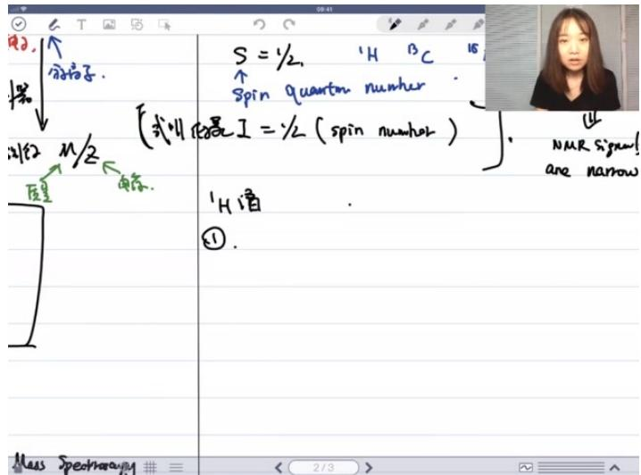

text_image

S = ½, 'H B C'
↑
spin quantum number
式叫但是 I = ½ ( spin number )
'H语
①.
Mass Spectraeqing # < 2/3 >

● 核心问题：判断分子在核磁共振氢谱( $^{1}$ HNMR)中会产生几个信号  
● 关键概念：需先理解"化学等价"概念才能准确判断信号数

# 2. 化学等价 01:54:51

# 1）替换实验的概念 01:55:01

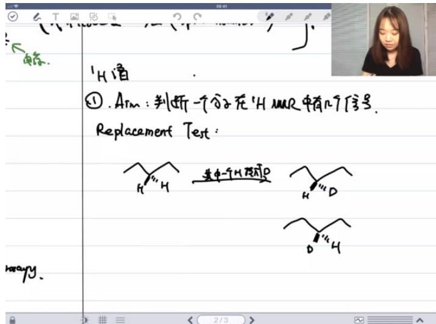

text_image

H酒
①.Arm:判断一个分子在'HMR中有几个信号.
Replacement Test:
H H 中一个H离子D
H D
H D
hanyy.

● 实验原理：通过同位素替换（如H→D）判断氢原子的化学等价性   
● 操作步骤：将分子中某个氢替换为氘，观察生成分子的性质

# 2）同位素替换与分子等价性 01:55:49

- homotopic protons: 当替换后生成的两种分子完全等价时，被替换的氢原子称为同拓扑质子  
● 判断标准：若分子1≡分子2（结构完全相同），则氢a和氢b为homotopic

# 3）化学等价与对应异构体 01:56:38

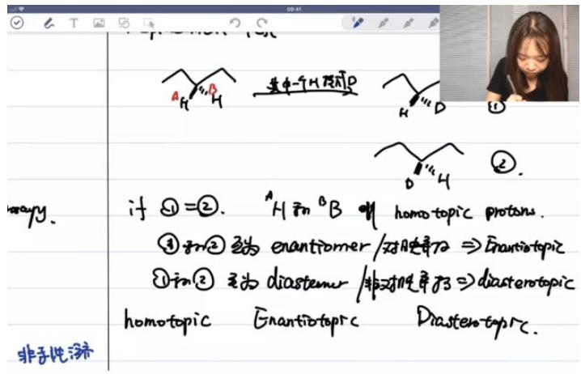

text_image

if ①=②. H和B ⇌ homo-topic proton.
③和②变为 enantiomer/对脱子→ Gaustriotopic
④和②变为 diastemur/非对脱子→ diasternotopic
homotopic Gaustriotopic Diasternotopic.
非亲性溶解

● enantiotopic protons: 当替换生成的分子互为对映异构体时  
● 溶剂影响：在非手性溶剂中，这类质子表现为化学等价

4）化学等价与非对应异构体 01:57:08

- diastereotopic protons: 当替换生成的分子互为非对映异构体时   
● 关键特征：这类质子总是化学不等价，即使在非手性溶剂中

5）化学等价的意义 01:57:36

● NMR表现：化学等价的质子产生相同化学位移（一个信号峰）  
● 不等价表现：化学不等价的质子产生不同信号峰

6）化学等价与核磁信号 01:58:31

- homotopic: 在NMR中显示为一个信号（无论溶剂类型）  
● enantiotopic：在非手性溶剂中显示为一个信号，手性溶剂中为两个   
- diastereotopic: 总是显示为两个不同信号

7）手性溶剂与非手性溶剂中的化学等价 01:59:47

● 常见非手性溶剂：氘代氯仿 $(CDCl_{3})$ 、氘代苯 $(C_{6}D_{6})$ 、氘代二甲亚砜 $(DMSO-d_{6})$   
● 特殊情形：仅在homotopic情况下，手性溶剂中仍保持化学等价  
● 实际应用：本科阶段多数情况只需考虑非手性溶剂环境

3. 应用案例 02:00:17

1）例题:置换试验判断信号数

\- 氢核磁共振信号数判断

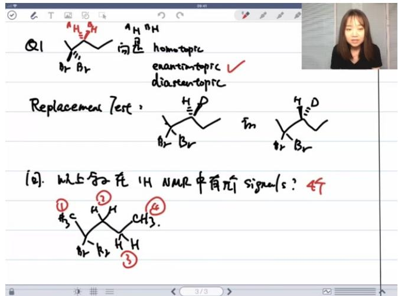

chemical

Chemical reaction diagram showing transformation of bromoalkane to diasterephthalene using homotopic and enantitrophic topics, with replacement test results.

○ 置换试验分类:

■ Homotopic(等位氢): 置换后生成相同分子，在NMR中显示一个信号

■ Enantiotopic(对映异位氢): 置换后生成对映异构体，在非手性环境中显示一个信号  
Diastereotopic(非对映异位氢): 置换后生成非对映异构体，显示不同信号

# ○ 信号数判断步骤:

■ 首先区分明显不同化学环境的氢(如甲基与乙基)  
■ 对 $CH_{2}$ 等可能等价氢进行置换试验判断  
■ $CH_{3}$ 由于自由旋转总是等价，不需置换试验

# 例题解析:

■ 分子结构包含 $CF_{3}$ 、两个 $CH_{2}$ 和一个 $CH_{3}$   
■ 四种不同化学环境氢： $CF_{3}$ 附近(1)、中间两个 $CH_{2}(2,3)$ 、末端 $CH_{3}(4)$   
■ 答案：4个信号

# - 置换试验应用细节

text_image

X
B
B

(2). 以上分子在 $^{1}$ H NMR 中有 $\pi$ 指号 / s ? 4个

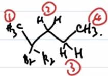

if Replacement Test applied on Ⓐ.

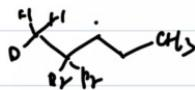

被动双连折扣 手机中心.

# 关键注意点:

■ 在非手性溶剂中，对映异位氢显示相同信号  
■ 只有 $CH_{2}$ 需要考虑氢的等价性问题  
■ $CH_{3}$ 由于单键自由旋转，三个氢总是等价

# ○ 记忆技巧:

■ "甲基不用想，亚甲基要细想"  
■ 置换后是否产生新手性中心是判断关键

# 2）例题:对二甲苯信号数 02:08:05

# ● 二甲苯异构体信号数比较

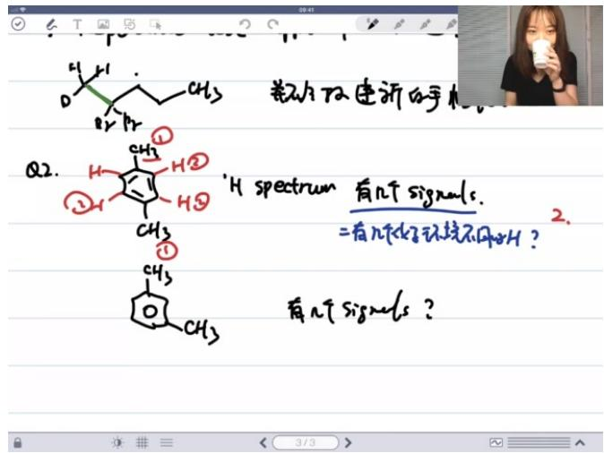

chemical

Handwritten chemical reaction diagram showing cyclohexane derivative with H and CH3 groups, accompanied by a speech bubble discussing hydrogen evolution.

# ○ 对二甲苯:

■ 甲基氢(1)

■ 苯环氢(2)   
■ 信号数：2个

# ○ 邻二甲苯:

■ 甲基氢(1)  
■ 苯环不同位置氢(2,3,4)  
■ 信号数：4个

# ○ 间二甲苯:

■ 甲基氢(1)  
■ 苯环不同位置氢(2,3)  
■ 信号数：3个

# - 区分应用:

■ 通过氢谱信号数可区分三种二甲苯异构体  
■ 对位(2)、间位(3)、邻位(4)信号数不同

# - 信号数判断技巧

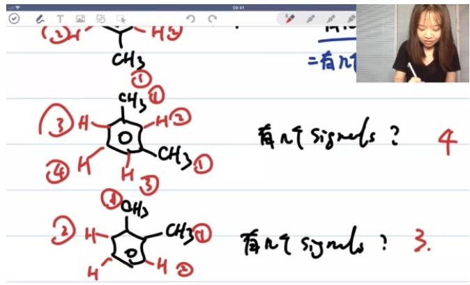

chemical

Handwritten chemical structures with numbered carbon atoms and accompanying Chinese text asking for number of signals.

# - 快速判断方法:

■ 先标记明显不同的氢(如甲基与苯环氢)  
■ 对苯环氢，观察取代基对称性  
■ 对称位置氢等价，不对称位置氢不等价

# ○ 常见错误:

■ 忽略分子对称性导致多计信号数  
■ 将快速旋转的甲基误判为不等价

# 3）例题：二乙基苯甲醚信号数 02:11:28

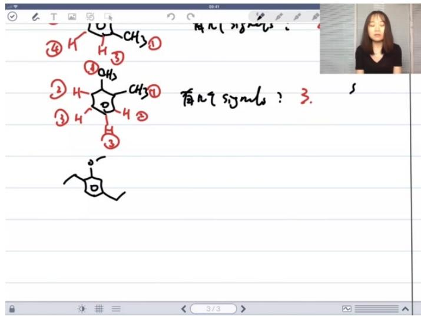

chemical

Hand-drawn chemical structure of a substituted cyclohexane with numbered carbon atoms and a reaction equation in Chinese

- 信号数判断：二乙基苯甲醚分子中存在8个不同的氢原子信号  
● 解题技巧：

- 对称性分析是判断信号数的关键，无需立即标注所有氢原子位置  
◦ 复习时建议自行练习标氢，强化对称环境判断能力

● 注意事项：该题型考察的是不同化学环境氢原子的区分，而非氢原子总数

4）例题：五氯化磷信号数 02:14:17

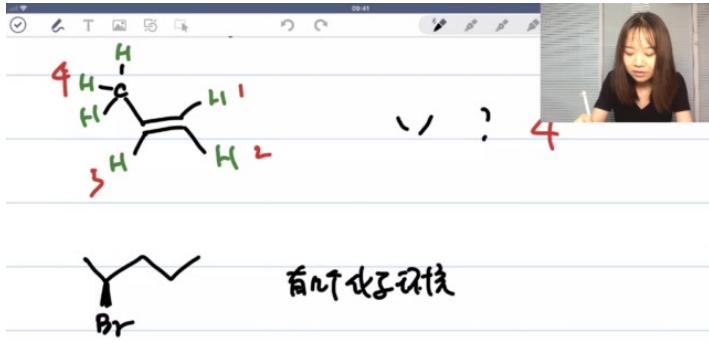

chemical

Hand-drawn chemical structure of bromoethane with accompanying Chinese text describing its concept and properties.

3/3   
● 信号数判断：分子中存在7个不同化学环境的氢原子  
● 解题步骤：

○ 识别所有氢原子位置（包括 $CH_{3}$ 和 $CH_{2}$ ）  
○ 标记不同环境氢：1号位、2号位、3号位、4号位、5号位、6号位（两个 $CH_{2}$ ）  
○ 确认 $CH_{2}$ 的氢化学不等价

高阶分析：

○ 使用homotopic/heterotopic/diastereotopic理论解释 $CH_{2}$ 氢的不等价性  
- 该知识点在考察 $CH_{2}$ 基团时需要特别注意

● 常见错误：

- 容易忽略 $CH_{2}$ 氢的不等价性（常见错误答案为5或6）  
○ 需注意"不同化学环境"的准确理解

● 掌握标准：能快速准确判断7个信号说明掌握程度达90%

5）化学环境等价氢的判断

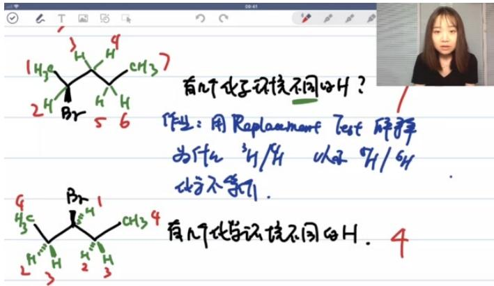

text_image

有几个化学环境不同的H？
作业：用 Replacement Test 解解
为什么 3H/H 以及 6H/6H
比方不等。
有几个化学环境不同的H．4

● 🔍 ⚙ # ≡   
● 等价氢判断方法

○ Replacement Test原理：通过将氢原子替换为氘原子(D)来判断氢原子是否等价。若替换后生成非对映异构体对(diastereomers)，则原氢原子不等价。  
☐ 对称性影响：分子具有中心对称性时，对称位置的氢原子等价（如左右两边的氢2和氢3等价）。  
☐ 手性中心关联：分子内存在手性中心时，相邻的 $CH_{2}$ 基团中的氢原子通常不等价，但不等价现象并非仅与手性中心相关。

# - 典型例题解析

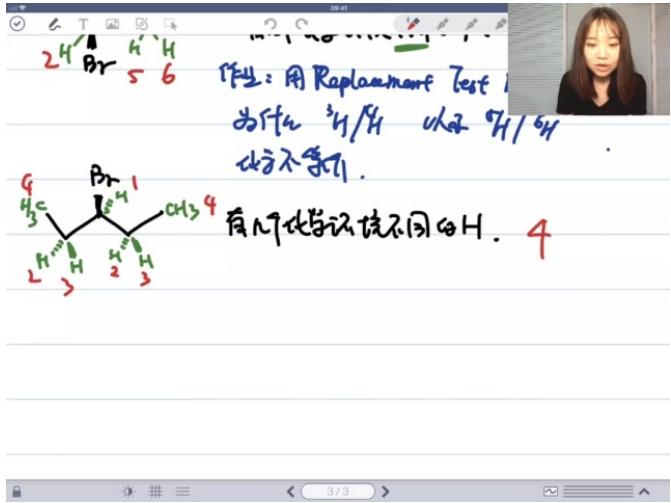

chemical

Handwritten chemical reaction diagram showing bromine substitution with hydrogen and carbon chain, accompanied by Chinese instructional text.

# ○ ○ 题目分析：

■ 分子结构：含两个乙基 $(CH_{3}CH_{2})$ 连接的中心碳原子  
■ 关键特征：中心碳非手性中心（因两侧连接相同基团）

# ○ 解题步骤：

■ $CH_{3}$ 上的3个氢必然等价  
■ 通过Replacement Test验证 $CH_{2}$ 上的氢：氢2和氢3替换后生成非对映异构体对，故不等价  
因分子对称，左右两侧的氢2/氢3分别等价

# - 答案：共4种化学环境不同的氢（甲基氢1种，亚甲基氢3种）

# ● 核磁共振信号判断

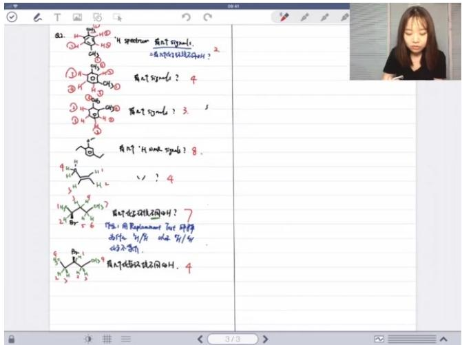

chemical

Handwritten chemical reaction equations and molecular structures on organic molecules, including reaction conditions and structural formulas

# 基本流程：

■ 判断分子中有多少种化学环境不同的氢  
■ 确定各信号对应的氢原子数量比

# ○ 注意事项：

■ 等价氢产生单一NMR信号  
■ 化学位移相同的氢即使不等价也可能信号重叠

■ 需结合耦合常数进一步分析复杂谱图

# - 高级应用技巧

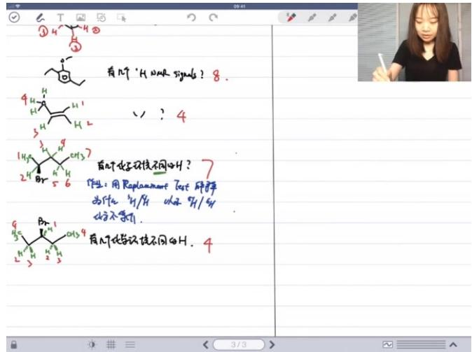

text_image

有几个'H'MR signals? 8.
✓ : 4
有的化学环境不同的H?
作业: 用 Replacement Test 的样
为什么 3/4 or 9/4
就不要有.
有几个化学环境不同的H. 4

# 技术联用：

■ 高分辨质谱：精确到小数点后四位，用于确定分子式  
■ NMR沉默核：某些核素（如 $^{12}C$ ）不产生NMR信号  
■ 活性核检测：需选择适当核素（如 $^{1}H,^{13}C$ ）进行分析

# ○ 电子分布影响：

■ 化学环境差异源于电子云分布不同  
■ 自旋量子数(I)决定核的NMR活性  
■ 窄峰对应化学环境明确的氢原子

# 4. 化学位移 02:20:33

# 1）化学位移的定义 02:20:36

text_image

Chemical Shift

- 术语解释：化学位移（chemical shift）是核磁共振谱中表示原子核所处化学环境的参数  
● 单位演变：早期文献使用频率单位，后统一采用ppm（百万分之一）单位

# 2）氢谱化学位移的范围 02:20:50

● 整体范围：氢谱化学位移值在-1到12 ppm之间

# - 分区特征：

- 脂肪链氢（烷基氢）：0-5 ppm  
- 芳香氢：7-12 ppm  
- 中间区域（5-7 ppm）通常无信号

# 3）碳谱化学位移的范围 02:21:22

● 整体范围：碳谱化学位移值在0-240 ppm之间，范围远大于氢谱  
- 分区特征：

- 脂肪碳：0-50 ppm  
- 芳香碳/双键碳：100-150 ppm  
- 羰基碳：180-200 ppm（特征区域）

■ 醛类：约210 ppm

■ 酯类：约190 ppm

5. 积分 02:24:08

1）积分的概念与称呼 02:24:10

● 基本定义：积分（integration）指核磁谱图中信号峰的面积  
● 物理意义：每个信号对应的氢原子数量  
● 测量方式：现代核磁仪器可自动计算峰面积

2）积分与信号的关系 02:24:24

● 比例关系：重点关注各峰面积的相对比例而非绝对值  
● 实际应用：

结合分子式中的总氢数，可推算各信号对应的具体氢数  
☐ 示例：苯乙烷（C8H10）中三个信号面积比为5:2:3，对应苯环5H、CH2 2H、CH3 3H

\- 信号重叠：

○ 化学位移接近的信号可能重叠显示为一个宽峰  
- 文献中可能报告为范围值（如7.2-7.6 ppm）

6. 应用案例 02:32:50

1）例题:苯乙烷核磁图解析

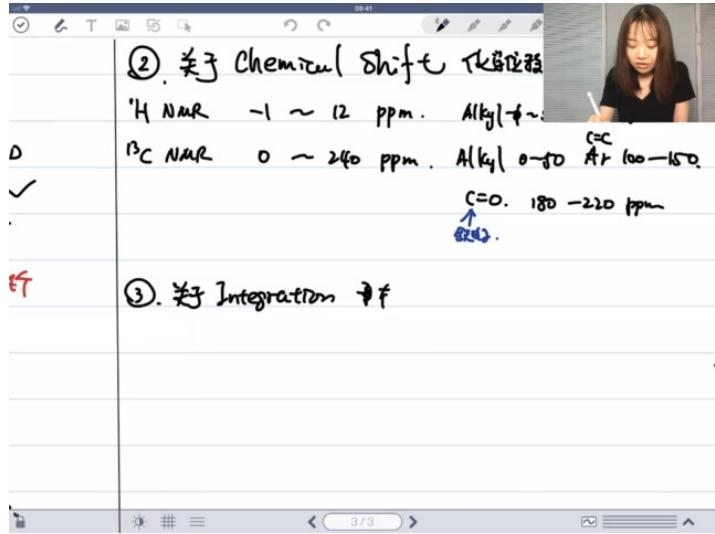

text_image

② 关于 Chemical Shift 化学反应
'H NMR -1 ~ 12 ppm. Alkyl-φ ~ 500
BC NMR 0 ~ 240 ppm. Alkyl 0-50 Ar 100-150.
C=C
C=O. 180 -220 ppm
③ 关于 Integration ≠
3/3

● 谱图特征：

○ 高场区：2.6 ppm（CH2）、1.3 ppm（CH3）  
○ 低场区：7.2-7.6 ppm（苯环5H）

● 解析要点：

○ 电子效应：连接氧原子的CH2会出现在更低场（约4 ppm）  
- 纯度影响：实际谱图中杂质可能导致信号展宽

2）例题:C4H6O2结构推导

● 关键信息：

- 分子式：C4H6O2  
- 不饱和度: 2 (可能含2个π键或1个π键+1个环)  
○ 核磁特征：三个信号，积分比1:1:1

\- 结构排除：

○ 排除两个CH2都连接氧原子的结构（预期应在4 ppm附近出现信号）

● 正确答案：丁内酯结构（一个CH2连接氧原子）

# 四、紫外可见光谱02:41:57

# 1. 应用案例 02:46:22

# 1）例题:共轭体系问题

# - 波长范围：

- UV区：200-400 nm（需牢记）  
- VS区：400-700 nm  
- 联合检测范围：200-700 nm

# ● 光谱特征：

○ 横轴为波长（wavelength），典型标度200-700 nm  
- 吸收峰最高值为最大吸收强度（absorption intensity）  
○ 最大吸收峰对应波长记作 $\lambda_{max}$ （如217 nm）

# ● 能量关系：

○ 吸收能量计算公式： $E = h\nu = \frac{hc}{\lambda_{max}}$   
- 反映电子从基态到最低激发态的跃迁能

# ● 共轭体系规律：

○ 共轭体系扩大导致 $\lambda_{max}$ 红移（增大）  
例：1,3-丁二烯 $\lambda_{max}=217$ nm，扩展共轭后 $\lambda_{max}$ 增大至258 nm (x)、290 nm (y)  
○ 典型排序： $y(290) > x(258) > 217 \, \text{nm}$

# ● 实际应用：

- 染料分子因大共轭体系使吸收进入可见光区（400-700 nm）  
○ 显示颜色为吸收光的互补色（如吸收蓝光显橙红色）

# ● 核心结论：

- UV-VS吸收峰存在 $\Rightarrow$ 分子具有共轭体系  
- 专门用于检测离域π电子体系

# 五、课程总结02:52:58

# 1. 红外光谱要点

# ● 特征峰位：

○ 羰基(C=O): \~1700 cm $^{-1}$ (强吸收)   
○ 羟基(O-H): \~3300 cm $^{-1}$ (强吸收)

# - 峰形特征：

◦ 羟基需注意氢键引起的峰形变化

# 2. 质谱要点

# ● 基础应用：

\- 分子离子峰对应分子质量

# 高分辨质谱

○ 获得精确分子质量 $\Rightarrow$ 推导分子式

# 3. 核磁共振要点

# - 信号分析：

○ 信号数量判断（需掌握replacement test方法）  
○ 化学位移分段:

■ 高场区（0-5 ppm右侧）：烷烃  
■ 低场区（左侧）：芳烃

# ● 特征位移：

○ 氧邻位氢：3-4 ppm  
○ $CH_{3}$ : \~1 ppm   
○ $CH_{2}$ : \~2 ppm

# - 积分应用：

○ 确定各信号对应氢原子数量

# 4. UV-VS核心要点

● 检测对象：专用于共轭体系分析  
● 红移规律：共轭体系扩大 $\Rightarrow$ 吸收波长增大  
● 定量关系： $\lambda_{max}$ 反映电子跃迁能级差

# 六、知识小结

<table><tr><td>知识点</td><td>核心内容</td><td>考试重点/易混淆点</td><td>难度系数</td></tr><tr><td>红外光谱</td><td>汤基吸收峰 $1700cm^{-1}$ ,枪基吸收峰 $3300cm^{-1}$ </td><td>强度大,形状上枪基峰宽(氢键影响)</td><td></td></tr><tr><td>质谱分析</td><td>分子离子峰确定分子量,高分辨质谱精确到小数点后四位</td><td>同位素峰比例判断Cl/Br存在(Cl3:1,Br 1:1)</td><td></td></tr><tr><td>核磁共振氢谱</td><td>化学等价判断(替换实验),化学位移范围(脂肪族0-5ppm,芳香族7-12ppm)</td><td> $CH_2$ 不等价情况(手性环境影响),积分比例换算氢原子数</td><td></td></tr><tr><td>核磁共振碳谱</td><td>化学位移范围0-240ppm,特征基团区间(羰基180-200ppm)</td><td>与氢谱位移趋势一致,不饱和度计算</td><td></td></tr><tr><td>紫外可见光谱</td><td>共轭体系检测(200-400nm),共轭程度与吸收波长正相关</td><td>最大吸收波长 $\lambda$ max反映能级差</td><td></td></tr><tr><td>波谱能量层级</td><td>质谱&gt;UV&gt;IR&gt;NMR</td><td>核磁不破坏分子结构,红外影响键振动</td><td>★</td></tr><tr><td>化学位移影响因素</td><td>电子云密度(缺电子向低场位移)、杂化方式( $SP^3 > SP^2 > SP$ )</td><td>氧邻位氢显著低场(3-4ppm)</td><td></td></tr><tr><td>不饱和度计算</td><td>(2C+2-H)/2,环/π键各计1</td><td>结合分子式排除不可能结构</td><td></td></tr></table>