# 一、查漏补缺01:45

# 1. 作业讲解

1）例题1：波束从小到大排序02:34

● 波数规律：从右往左看谱图时，波数最小的对应键能最弱且reduced mass最大的键

\- 典型值域：

○ 碳氧单键：\~1100 cm $^{-1}$   
○ 碳氧双键：1700+ cm $^{-1}$   
○ 三键：2200+ cm $^{-1}$   
○ 碳氮三键：\~2200 cm $^{-1}$   
○ 碳氢/氮氢/氧氢键：因reduced mass小出现在高波数区（如4610 cm $^{-1}$ ）

2）例题2：不饱和度计算 04:14

● 计算公式： $U=\frac{C\times2+2-H}{2}$ （仅含C,H,O,S）  
- 含氮处理:

- 将N-H视为一个整体（类似氧原子）  
○ 含氮时氢数必为奇数，纯C,H,O时氢数必为偶数

● 应用示例： $C_{12}H_{24}$ 的U=1，说明含1个π键或1个环

3）例题3：合成知识综合应用 06:03

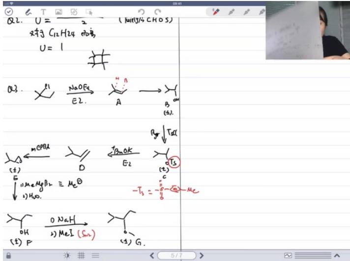

chemical

Handwritten chemical reaction equations involving carbonation, esterification, and hydrogenation steps

\- 消除反应：

三级卤代烃在强碱小位阻条件下发生E2消除  
○ 生成热力学稳定产物（取代度高的烯烃）

● 硼氢化反应：

○ 硼加在位阻小侧，氢加在位阻大侧   
- 过氧化氢使OH取代硼，保持顺式加成

\- 环氧开环：

- 碱性条件进攻位阻小的碳   
- 酸性条件考虑碳正离子稳定性

霍夫曼消除：

○ 生成动力学产物（消除位阻小的氢）  
- 与热力学消除产物相反

4）例题4：区分a和d 11:18

核磁区分：

○ 氢谱：a有4个信号，d有5个信号  
○ 碳谱：a有5个信号，d有4个信号（两个甲基等价）

# ● 其他方法局限：

- 质谱（包括高分辨）无法区分  
- 红外均有SP²杂化碳氢键特征峰

# 5）例题5：区分f和g 12:12

# - 红外特征：

○ f含显著OH特征吸收峰（3400 cm $^{-1}$ 左右）  
○ g无OH峰

# 6）例题6：紫外吸收与共振体系 12:26

# ● 判断标准：

- 200-700 nm范围内吸收（200-400为UV，400-700为可见光）  
○ 共轭体系（如共轭双烯）会产生显著吸收

# ● 实际应用：

○ 题干提示"强紫外吸收"通常暗示存在共轭体系  
○ 注意实际仪器可能检测范围更宽（150-700 nm）

# 7）思考题1：IR谱与三键关系 14:26

# ● 关键结论：

○ 2100-2300 cm $^{-1}$ 无信号⇒无三键（C≡C/C≡N）

# ● 共振结构限制：

○ 环状结构无法画出三键共振式  
○ 共振式必须保持σ键框架不变

# 8）思考题2：甲基等价性判断 15:33

# - 理论分析：

- 用手性中心邻位 $\mathrm{CH}_{2}$ 的氢不等价  
- 甲基氢需通过同位素取代实验验证：

■ 一个甲基全氘代（ $\mathrm{CD}_{3}$ ），另一个保持 $\mathrm{CH}_{3}$   
■ 若生成非对映体则化学不等价

# ● 实际谱图：

○ 化学位移差异小（因远离手性中心）  
○ 易误判为等价

# 2. 查漏补缺 17:26

# 1）含氮化合物 18:07

# ● 结构和性质 18:18

○ 三级胺的绝对构型 18:22

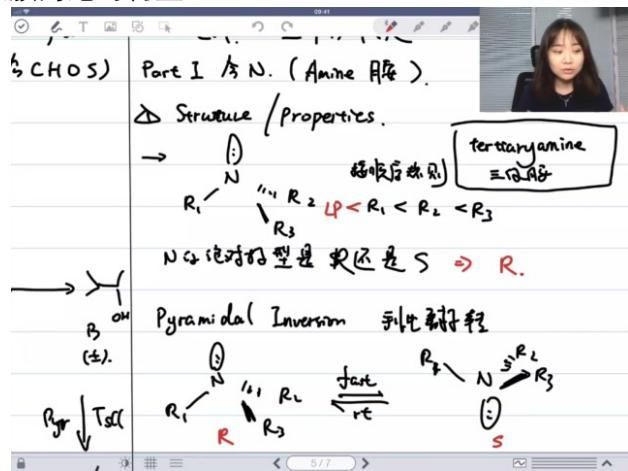

text_image

SCHOS)
Part I 令N. (Amine 膨).
Structure / Properties.
→
R1
N
R2
R3
越吸收法则
陽陽反应
陽陽反应
陽陽反应
陽陽反应
陽陽反应
陽陽反应
陽陽反应
陽陽反应
陽陽反应
陽陽反应
陽陽反应
陽陽反应
陽陽反应
陽陽反应
陽陽反应
陽陽反应
陽陽反应
陽陽反应
陽陽反应
陽陽反应
陽陽反应
陽陽反应
陽陽反应
陽陽反应
陽陽反应
陽陽 reaction
Pyramidal Inversion 别性磷酸程
(±).
R1
N
R2
R3
R3
R3
R3
R3
R3
R3
R3
R3
R3
R3
R3
R3
R3
R3
R3
R3
R3
R3
R3
R3
R3
R3
R3
R3
R3
R3
R3
R3
R3
R3
R3
R3
R3

■ 顺序规则应用：当氮原子连接三个不同基团时，按照顺序规则（孤对电子<R1<R2<R3）判断绝对构型  
■ 孤对电子优先级：在构型判断中，孤对电子被视为最小的取代基  
■ 典型构型：示例中氮的绝对构型为R型，因为孤对电子是最小的"取代基"

◦ 手性翻转的概念 20:54

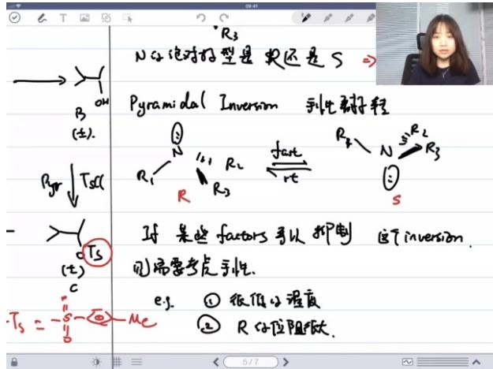

text_image

N子绝对的型母史还是S
Pyramidal Inversion 利化对子程
R3
N子绝对的型母史还是S
R1
N子绝对的型母
R2
N子绝对的型母
R3
R1
N子绝对的型母
R2
N子绝对的型母
R3
R1
N子绝对的型母
R2
N子绝对的型母
R3
R1
N子绝对的型母
R2
N子绝对的型母
R3
R1
N子绝对的型母
R2
N子绝对的型母
R3
R1
N子绝对地
R2
N子绝对地
R3
R1
N子绝对地
R2
N子绝对地
R3
R1
N子绝对地
R2
N子绝对地
R3
R1
N子绝对地
R2
N子绝对地
R3
R1
N子绝对地
R2
N子绝对地
R3
R1
N子绝对地
R2
N子绝对地
R3
- Ts (t)
- Ts (t)
- Ts = -s - Me e.g. ①很低的温度 ②R子位阻抗.
5/7

■ 动态过程：三级胺在室温下可快速完成构型翻转（Pyramidal Inversion），如同雨伞翻转  
■ 旋光性影响：由于快速翻转，R和S构型共存且相互转换，导致无法测出旋光性  
■ 构型变化：翻转过程中R构型会转变为S构型，反之亦然

○ 影响手性翻转的因素 21:52

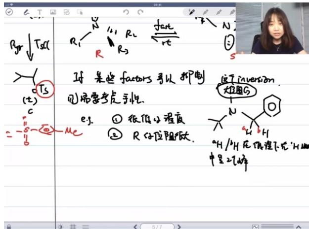

text_image

Pgr \downarrow TsCl
R1 N R2 fast N
R R3 rt ③ S
Ts
(t)
c
= -S -Me e.g. ① 很低分温度
② R 位阻放大.
If 某些 factors 异以 抑制 定下 inversion.
见需要考虑手性.
H /2H 在低温下在 'H' 都
中呈二次峰

低温抑制：在很低的温度下可减缓或阻止翻转   
■ 位阻效应：当取代基位阻很大时（如叔丁基），可能阻碍翻转  
■ 桥环结构：桥环体系中的氮原子因结构限制难以翻转  
■ 配位作用：孤对电子与路易斯酸形成强配位键时可能固定构型  
■ 核磁表现：在翻转被抑制时，原本等价的氢（如 $aH/bH$ ）在低温NMR中会显示为两个峰

○ 氢键与沸点 27:12

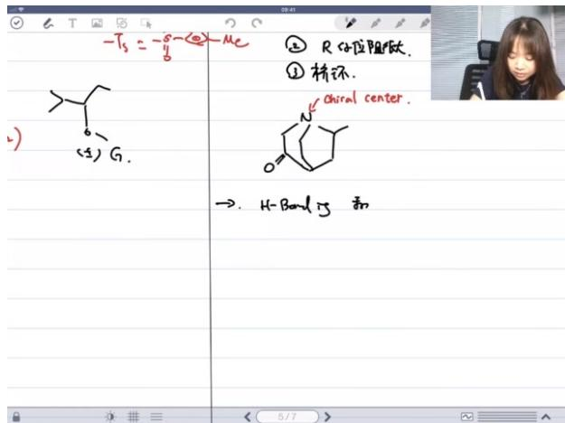

text_image

-T₃ = -δ-ε-Me
② R 位阻肽.
① 桥环.
Chiral center.
→. H-Bond 和

沸点规律：同碳数化合物的沸点顺序为 $R - H < R - NH_{2} < R - OH$   
■ 氢键强度：虽然氮的孤对电子密度高于氧，但N-H的酸性弱于O-H，导致胺的氢键较弱  
■ 位阻影响：分子内氢键的形成能力和位阻效应共同决定沸点高低

○ 氨与醇的亲和性比较 28:06

■ 碱性比较：氨的碱性显著强于醇，因其孤对电子更易极化且受核束缚较弱  
■ 电子效应：氮的电负性小于氧，原子半径更大，孤对电子更易参与反应  
■ 矛盾现象：尽管氨是更好的亲核试剂，但其沸点却低于醇，源于氢键强度的差异

○ 碱性排序 34:48

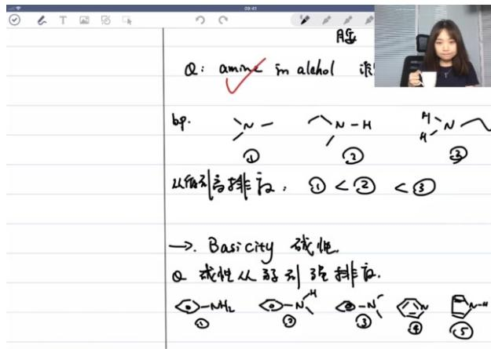

text_image

Q: ammc in alcohol 浓
bp. >N-  ↘N-H  4-N
①  ②  ③
从低到高排度： ①＜②＜③
→. Basic city 碱化
① 成性从弱到强排度.
②-N  ③-N  ④-N  ⑤

排序规则：碱性强度：芳香胺<一级胺<二级胺<三级胺<吡啶  
■ 共轭效应：苯胺（5）碱性最弱，因其孤对电子参与芳香共轭体系  
■ 诱导效应：烷基取代越多，碱性越强（3>2>1）  
■ 杂化影响：SP2杂化氮（如吡啶）的碱性弱于SP3杂化氮（如三乙胺）  
■ 典型数值：三乙胺pKb约3，吡啶pKb约8，显示碱性差异显著

● 制备 40:11

○ 消去反应 40:39

■ 消去反应在芳香化合物中的应用

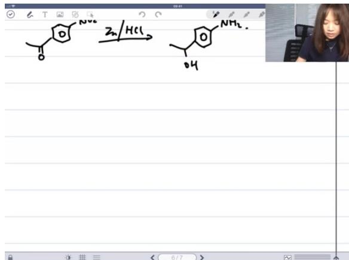

chemical

Chemical reaction diagram showing nucleophilic substitution of a ketone to form amine and water, with reaction conditions Zn/HCl and NH2

●

- 硝基还原为氨基: 在芳香化合物中, 锌/铁与盐酸(Zn / HCl或Fe / HCl)可将硝基( $NO_{2}$ )还原为氨基( $NH_{2}$ ), 这是芳香胺的重要制备方法  
● 金属选择：实际反应中金属M可以是锌(Zn)、铁(Fe)或锡(Sn)，但考试中通常不考查具体金属种类

■ 使用锌或铁与盐酸进行消去反应 41:08

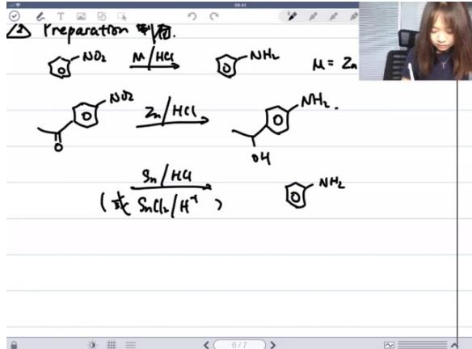

chemical

Chemical reaction equations showing nitration and oxidation steps of a cyclic amide compound

●

- 选择性还原：为避免羰基被同时还原，需使用二氯亚锌(ZnCl₂)在酸性条件下选择性还原硝基  
● 反应条件: 体系可以是 $SnCl_{2}/H^{+}$ 或 $ZnCl_{2}/H^{+}$ ，两者效果等效

■ 卤代烃与迭氮化钠的反应 41:57

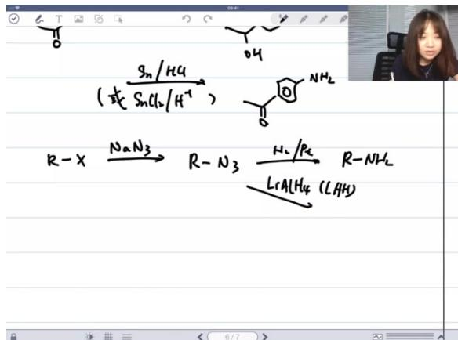

chemical

Chemical reaction scheme showing amine and alkene transformations with reagents and conditions

●

- 脂肪链胺化：对于非芳香族的脂肪链，可通过卤代烃 $(R - X)$ 与迭氮化钠( $NaN_{3}$ )反应生成迭氮化物 $(R - N_{3})$   
● 还原方法:

○ 硼氢化钠 $(NaBH_{4})$ 还原得伯胺 $(R-NH_{2})$

四氢铝锂 $(LiAlH_{4}$ ，简称LAH)还原，需注意第二步必须加水淬灭

● 实际应用: 迭氮化法在合成中不常用，因操作危险性较高

# ■ Gabriel合成法制备伯胺 42:53

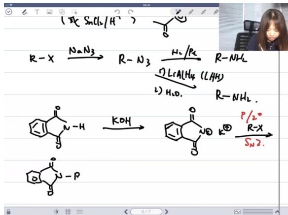

chemical

Chemical reaction scheme showing transformations of nitrile and amino acids with reagents and conditions

# - 反应步骤:

邻苯二甲酰亚胺与氢氧化钾(KOH)反应生成钾盐  
与卤代烃发生 $S_{N}2$ 反应(仅限伯/仲卤代烃，叔卤代烃易发生消除反应)  
○ 水解得伯胺

# - 特点:

- 该方法是实验室制备伯胺最常用的方法  
- 反应中的邻苯二甲酰亚胺单元最终被 $NH_{2}$ 取代

\- 替代方法: 也可用肼 $(NH_{2}NH_{2})$ 直接取代羰基氧

# ○ 还原氨基化 45:22

# ■ 基本原理与条件

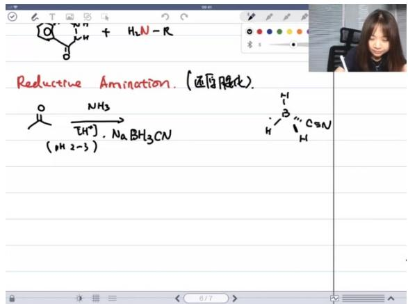

chemical

Hand-drawn chemical reaction diagram showing reduction of ammonia to benzenes under acidic conditions, with molecular structures labeled

● 反应优势: 一锅法(one-pot)反应，操作简便且收率高

# - 反应条件:

- 弱酸性环境(pH 2-3)  
○ 使用氰基硼氢化钠 $(NaBH_{3}CN)$ 作为选择性还原剂

# ● 机理特点:

- 氰基的强吸电子效应减弱了 $BH_{3}$ 的还原能力  
○ 可在酸性条件下稳定存在(普通 $NaBH_{4}$ 在酸性中会分解)

# ■ 反应机理详解

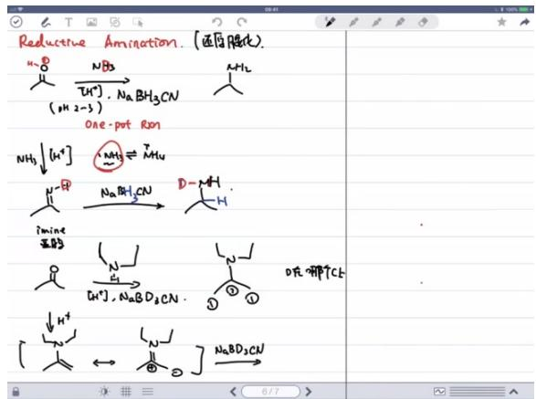

chemical

Hand-drawn chemical reaction equations involving reduction amine and imine intermediates with reagents and conditions

# - 两步过程:

- 羰基化合物与胺在弱酸催化下生成亚胺 $(R_{2}C=NR')$   
○ 亚胺被 $NaBH_{3}CN$ 还原为胺

# ● 质子源作用:

- 少量质子活化羰基促进亚胺形成  
- pH过低会导致胺过度质子化( $NH_{4}^{+}$ )而失活   
- pH过高则羰基活化不足

# - 氘代实验:

- 使用 $BD_{3}CN$ 时，D原子会选择性加成到亚胺的正电碳上  
○ 另一个H来自反应后的溶剂质子化

# 应用范围

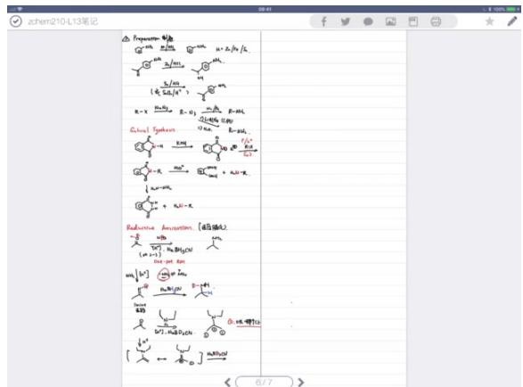

chemical

Chemical reaction equations and molecular structures for a phosphorus-containing compound, including nucleophilic addition and radical formation

● 通用性: 可制备一级、二级、三级胺，适用范围广  
● 合成价值: 是实验室最常用的胺类制备方法之一  
● 反应变体: 使用不同胺源(如仲胺)可得到不同取代程度的胺产物

# ○ 应用案例 01:01:34

# 例题:霍夫曼消除

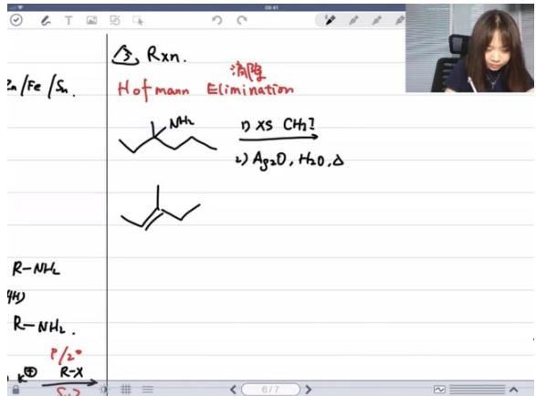

chemical

Chemical reaction diagram showing hydrogenation of phenylalanine to form a ketone using Ag2O and H2O, with R-NH2 and R-X substituents

# - 反应机理:

☐ 第一步：过量的碘甲烷与胺发生 $S_{N}2$ 反应，经过质子转移生成四级铵盐。由于产物亲核性比原料更强，反应会持续进行直到完全生成四级铵盐（氮上连四个取代基带正电荷）  
- 第二步：湿润的氧化银（等价于氢氧化银）进行负离子交换，生成氢氧根离子。这是因为碘化银的 $K_{sp}$ 远小于氢氧化银，反应倾向于生成更难溶的碘化银

# - 消除特点:

E2消除：氢氧根进攻β氢，由于四级铵盐位阻极大，会优先进攻位阻最小的β氢（动力学控制）  
○ 产物判断：通过纽曼投影分析过渡态构型，反式共平面的β氢中位阻最小者被进攻，生成霍夫曼产物（取代基最少的烯烃）

\- 环状化合物应用：在环状体系中，消除需要满足反式共平面要求，通常需要在直立键位置进行。三取代氮的大位阻会使环上消除较困难，需要加热促进

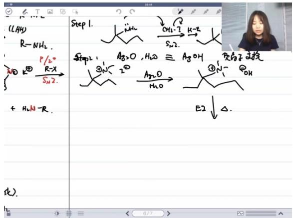

chemical

Chemical reaction scheme showing step 1 of hydrolysis of alkynes to form ketones, with reagents and conditions labeled

■ 例题:重氮盐的反应 01:10:42

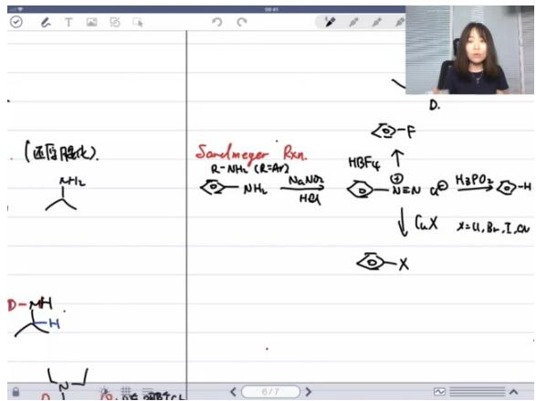

text_image

(还原酸化)
Sandmeyer Rxn
R-NH4 (R=Ar)
NH4 NaNO3
HCl
HBF4 ↑
- NH4 α H2PO4 H-H
↓ Gx X=U, Bn,I,Cu
D-NH
H
D-X

# ● 制备条件：

○ 芳香胺（ $R = Ar$ ）在亚硝酸钠和盐酸作用下生成重氮盐（ $Ar - N_{2}^{+}$ ）  
- 烷基重氮盐极不稳定，会立即分解为正碳离子并发生重排

# ● 主要反应类型:

Sandmeyer反应：与铜盐（CuX， $X = Cl / Br / I / CN$ ）反应，在芳环上引入相应取代基。注意氟化亚铜不存在，因此不能直接引入氟  
○ Schiemann反应：与 $HBF_{4}$ 反应可引入氟原子（Balz-Schiemann反应）

○ 还原反应：与次磷酸（ $H_{3}PO_{2}$ ）反应可将 $NH_{2}$ 完全去除（通过硝化-还原-重氮化-还原的序列实现去氨基）  
○ 水解反应：与水反应生成酚（Ar-OH），属于亲核取代反应

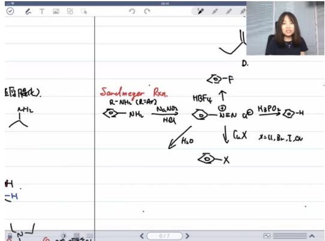

chemical

Hand-drawn chemical reaction diagram showing hydrogenation of a dihydrous compound with labeled steps and conditions

# ● 定位基应用案例：

○ 通过硝化-还原获得苯胺后，经重氮化-Sandmeyer反应可制备间位三溴苯（直接溴化无法得到，因为溴是邻对位定位基且会使芳环钝化）  
- 苯胺/苯酚直接溴化会得到三溴代产物（强活化作用），而通过重氮化路线可精确控制取代位置

# 2）糖类 01:17:31

● 糖类介绍 01:18:54

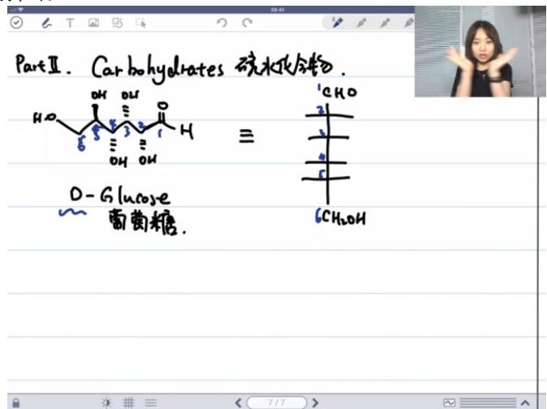

chemical

Chemical structure of ethanol with glucose and hydroxyl groups, labeled as Part II

定义：碳水化合物即糖类，主要包括葡萄糖及其多糖形式（淀粉和纤维素）  
- 考试特点：这部分在高考中通常作为送分题出现，因为：

■ 知识体系较为专业化，基础有机化学课程较少深入讲解  
■ 考试重点在于常识性知识而非深度理解

学习建议：参考人教版选修五教材内容

葡萄糖 01:19:11

○ 结构表示法

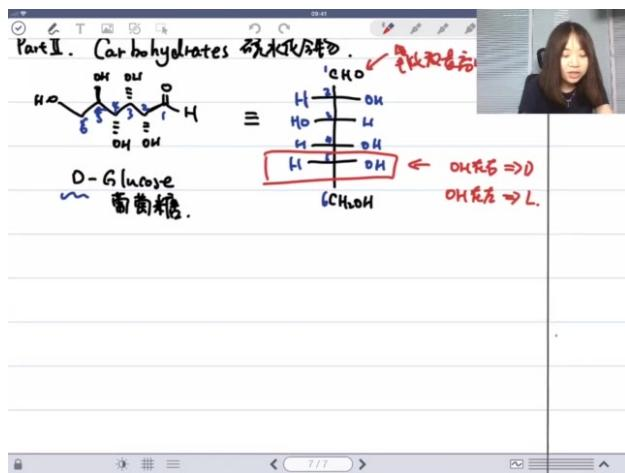

chemical

Chemical reaction diagram showing glucose conversion to glucose with hydroxyl groups and water molecules

# Fischer投影式：

● 氧化数最高的碳（CHO）置于最上方  
● 编号规则：从上至下依次为碳1至碳6   
● 立体构型：横线表示向纸面前方伸出，竖线表示向纸面后方延伸

# D/L构型判定：

● 取最下端手性碳（碳5）的羟基位置  
- OH在右侧为D型，左侧为L型  
● 葡萄糖的构型为：右-左-左-右（碳2至碳5）

# ○ 环状结构

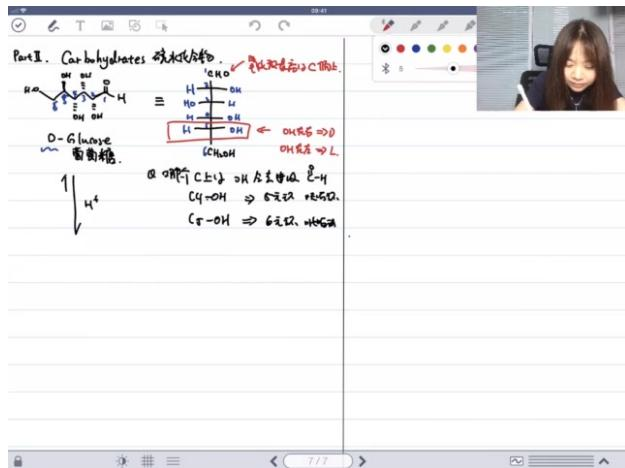

text_image

Part II. Carbohydrates 硫水化合物.
O-Glucose
重血糖.
H⁺
≡
H
OH
H₂
OH
CH₃OH
← OH无水 ⇒ O
OH无水 ⇒ L.
@ OH#C上 2 OH 分去电极 8-H
C4-OH ⇒ 6元/Ω RE50Ω
C5-OH ⇒ 6元/Ω H2SO₄

# 成环机制：

- 分子内半缩醛反应：羟基进攻醛基（碳1）  
● 主要形成六元环（吡喃糖）：碳5羟基进攻  
● 次要形成五元环（呋喃糖）：碳4羟基进攻

# 环状异构体：

- $\alpha$ -D-吡喃葡萄糖：半缩醛羟基与碳6羟基反向   
- $\beta$ -D-吡喃葡萄糖：半缩醛羟基与碳6羟基同向   
● 平衡状态下比例： $\alpha$ 型36%， $\beta$ 型64%

# - 旋光性实验

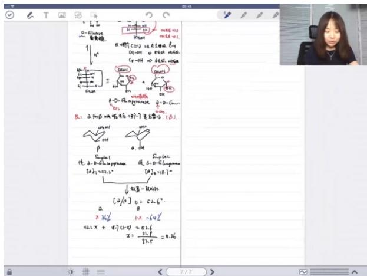

text_image

D-Cla###
### 10.5
### ### 10.5
a-### (2x) ### ### ### 10.5
(4-###) ### ### 10.5
f-r### ### ### 10.5
### ### ### 10.5
P-D-Cla### ### ### 10.5
### ### 10.5
0.3 2 ### ### ### ### ### 10.5 (8.
### ### 10.5
P a ## 10.5
### ### 10.5
(4-###) ### ### 10.5
[2]#=10.5 [2]#=10.5
### -### 10.5
[2/4] b = 62.6°
a 3/4' + x -64%
(4-7)(+ x) = 62.6
x = 31.7 / 31.7 = 9.76

# 实验现象：

- 纯 $\alpha$ 型比旋光度: $[\alpha]_D = +112.2^\circ$   
● 纯 $\beta$ 型比旋光度： $[\alpha]_{D}=+18.7^{\circ}$   
- 平衡混合液比旋光度： $[\alpha]_D = +52.6^\circ$

# 计算方法：

● 设 $\alpha$ 型比例为x，建立方程： $112.2x + 18.7(1 - x) = 52.6$   
● 解得：x = 0.36 （即36%）

# ○ 多糖差异

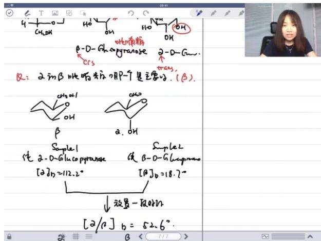

text_image

Q: 2mβHClOCH2OH
β-O-Glu-cyano-2-phosphate (β)
α-O-Glu-CrS
α-O-H
Simple1
纯 2-O-Glu-cyano-2-phosphate
[2]/b=112.2°
Simple2
纯 B-O-Glu-cyano-2-phosphate
[β]/b=18.7°
放置一项OH
[2]/a] b=52.6°.

# ■ 代谢差异：

- 淀粉和纤维素均为葡萄糖聚合物  
● 人体只能代谢淀粉，不能消化纤维素

# 原因：

● 葡萄糖单元连接方式不同（ $\alpha$ 型与 $\beta$ 型糖苷键）  
● 消化酶具有特异性，只能识别特定连接方式

■ 记忆要点：参考选修五教材中关于多糖结构的详细说明

# 3）氨基酸和蛋白质 01:35:36

# - 氨基酸 01:36:41

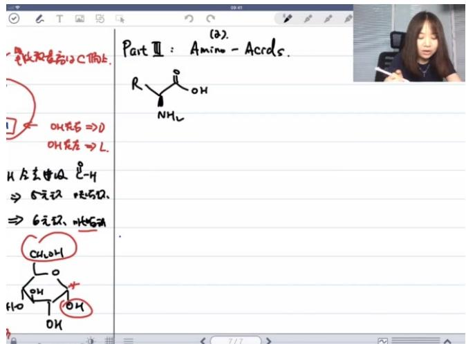

text_image

一氧化氢基:2C偏点.
OH反应⇒0
OH反应⇒L.
H去CH4-C-H
⇒5元环 吨CH3.
⇒6元环 吨CH3.
CH4OH
F1O
OH
OH
PartⅢ:Amino-Acrds.
R
NH2
(2).

天然氨基酸构型：大多数天然氨基酸为L-构型，氨基位于羧基的α位（α-氨基酸）

○ 侧链定义：R基团被称为侧链，不同氨基酸侧链结构各异

○ 构型判断方法：

■ Fisher投影式：将氧化态最高的基团（COOH）置于上方  
■ L/D命名：氨基在右侧为D型，左侧为L型（与糖类命名规则相反）  
■ 实例分析：当侧链为碳链时，绝对构型为S型但仍称为L-氨基酸

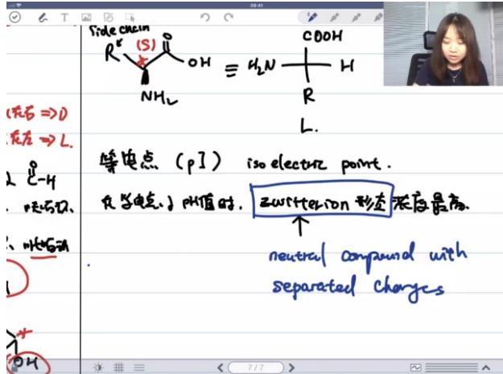

text_image

Side chain
R (S) OH = H₂N + H
NH₂
L.
反应 => 0
反应 => L.
等电点 (pI) iso electur point.
在当电点JpH值时，zwitterion形态浓度最高.
↑
neutral compound with
separated charges

○ 等电点(pl):

■ 定义：氨基酸以两性离子(zwitterion)形态浓度最高时的pH值  
■ 特征：分子整体电中性但内部存在分离电荷（ $NH_{3}^{+}$ 和 $COO^{-}$ ）  
■ 计算原理：pKa1(羧基)和pKa2(氨基)的平均值  
■ 示例计算：当pKa1=2.34，pKa2=9.69时，

$$
\mathrm{pl} = (2. 3 4 + 9. 6 9) / 2 = 6. 0 1
$$

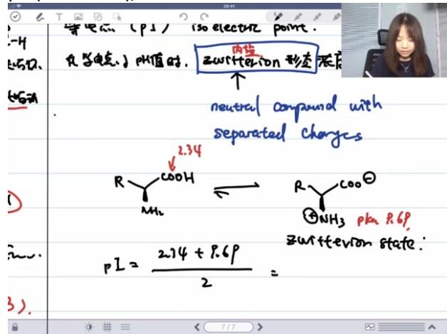

chemical

Handwritten chemical reaction diagram showing zwitterion formation with R groups and NH3, COOH, COO2, and PkR6P residues

# ○ pH影响：

■ pH>pl时：带负电（羧基去质子化）  
■ pH<pI时：带正电（氨基质子化）  
■ 电泳应用：通过调节缓冲液pH实现氨基酸混合物的分离

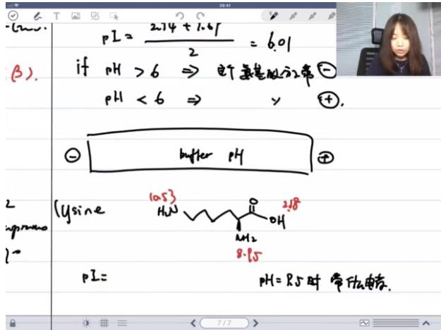

chemical

Handwritten chemical reaction equations and molecular structure of a dihydropyran derivative with pH and H2O groups

# ○ 多官能团处理：

■ 原则：将同类基团的pKa值相加取平均  
■ 赖氨酸案例：pKa1=2.18，pKa2=8.5，pKa3=10.53 → pI=(8.5+10.53)/2=9.52   
■ 电荷判断：当pH=9.5时，因pH<pl(9.52)故带正电

# - 蛋白质 01:50:12

\- 蛋白质的一级结构：肽链 01:50:27

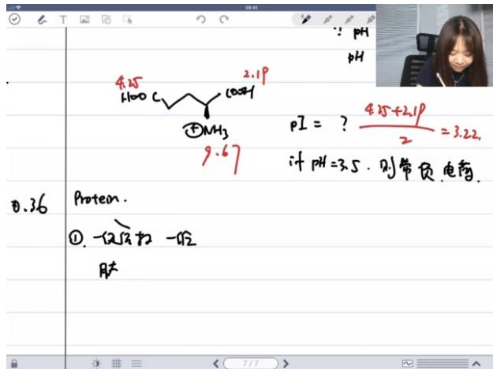

text_image

pH
pH
4.25
H100 C
COOH
2.19
④NH3
9.67
PI = ? \frac{4.25 + 2.19}{2} = 3.22.
if PH=3.5. 则带负、电荷.
0.36
Protein.
① 一氧化碳 一氧化
肽

# 组成要素：

● 基本单元：氨基酸通过肽键(-CO-NH-)连接形成多肽链  
- 末端特征：保留N端 $(NH_{2})$ 和C端(COOH)  
● 构型保持：形成肽键后仍保持L-构型特征

\- 肽链的形成与半胱氨酸的作用 01:52:33

text_image

Screenshot of a mobile phone interface with toolbar icons and a photo of a person in foreground

# 2 -√2

．＋月太链之间 S-S. 子联的．

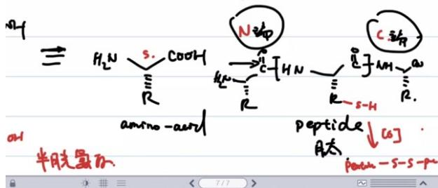

chemical

Chemical reaction diagram showing amino acid conversion to peptide with labeled steps and molecular structures

# 半胱氨酸作用：

● 特殊侧链：含-SH巯基  
● 交联机制：氧化条件下形成二硫键(-S-S-)  
● 结构意义：稳定蛋白质空间结构的重要共价键

\- 蛋白质的二级结构：氢键与肽链折叠 01:53:36

# ■ 形成基础：

● 主要作用力：氢键主导肽链的局部折叠  
● 常见构象：α-螺旋、β-折叠等规则结构

\- 蛋白质的三级结构：立体结构与功能关系 01:54:07

# 结构特征：

● 作用力类型：包含氢键、范德华力、疏水作用等  
● 功能关联：特定三维结构决定蛋白质生物学功能

\- 蛋白质变性的原因与影响 01:54:23

# ■ 变性机制：

● 一级结构：破坏不可逆（如肽键断裂）  
● 二级结构：氢键破坏可导致可逆/不可逆变性  
- 三级结构：分子间作用力改变影响空间构象

\- 破坏蛋白质结构的具体案例 01:55:11

# 典型实例：

● 重金属盐：与-SH、-NH2等基团结合破坏氢键网络  
● 一氧化碳：竞争性结合血红素铁导致携氧功能障碍  
● 盐析现象：通过改变表面电荷影响蛋白质溶解度（可能可逆）

# ■ 变性特点：

● 结构特异性：不同蛋白质对变性因素的敏感性差异显著  
● 功能丧失：任何级别的结构破坏都可能导致功能丧失

4）聚合物合成 01:57:44

● 高频考点：聚合物合成是连续几年都考的考点，预计未来仍会继续考查  
● 重要性：该知识点必须重点掌握，避免拖延学习

5）聚合反应 01:58:19

● 聚合反应的分类 01:58:33

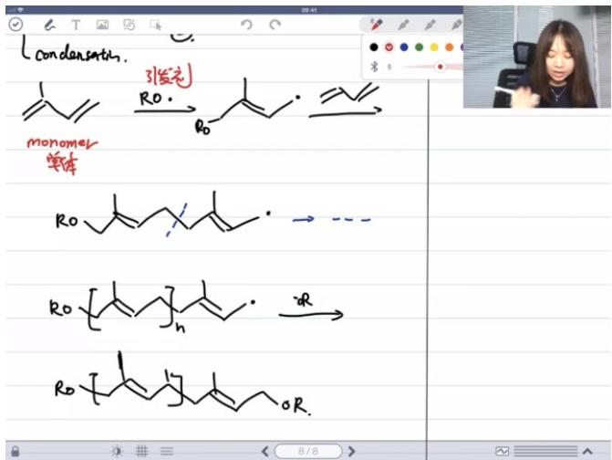

chemical

Chemical reaction scheme showing condensation of monomer to ester with RO groups and a photo of the resulting product

加成聚合反应 01:59:16

■ 定义：直接通过单体加成形成聚合物，不释放小分子  
■ 机理分类：

● 自由基引发：如橡胶（1,3-二烯）的聚合

○ 引发过程：光照产生自由基（R·），进攻单体（monomer）  
◦ 链增长：自由基不断进攻新单体  
- 链终止：遇到另一个自由基或捕获剂时停止

● 碳正离子引发：

- 适用条件：烯烃带有给电子基团（electron donating group）  
○ 引发剂：路易斯酸或质子酸  
○ 机理：生成碳正离子中间体，不断加成单体

\- 碳负离子引发：

- 适用条件：烯烃带有吸电子基团（electron withdrawing group）  
○ 引发剂：如叔丁基锂（BuLi）  
○ 机理：生成碳负离子中间体，不断加成单体

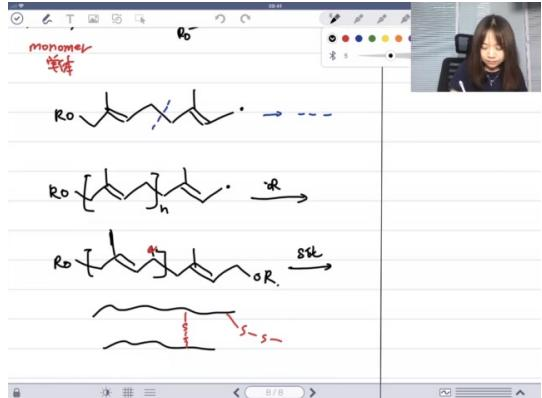

chemical

Polymerization reaction diagram showing monomerization steps with R groups and alkene structures

O

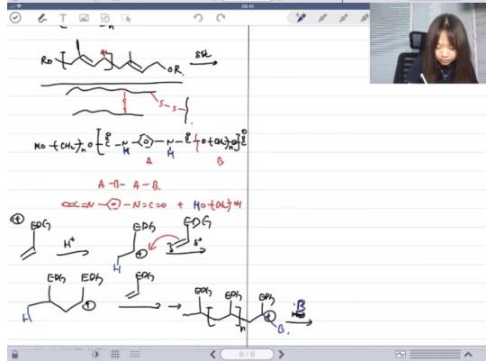

chemical

Chemical reaction scheme showing epoxidation and subsequent rearrangement of a polymer with labeled reactants and products

O

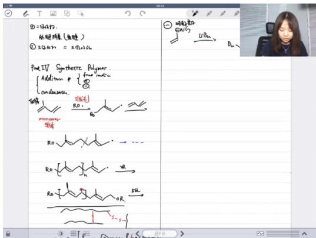

chemical

Chemical reaction equations and molecular structures for polymer synthesis, including radical addition and esterification steps

# 二硫键形成：

● 氧化还原反应：两个-SH基团在弱氧化剂作用下形成-S-S-键  
● 还原反应：在还原剂作用下可重新断裂为-SH  
● 应用：通过控制硫化程度改变橡胶性能

# ○ 缩合聚合反应 02:10:30

■ 定义：单体反应时释放小分子（如水）的聚合反应  
■ 经典例子：尼龙66的合成

● 单体：6个碳的二胺和6个碳的二羧酸

● 反应条件：酸性催化加热

● 产物特征：生成酰胺键并释放水分子

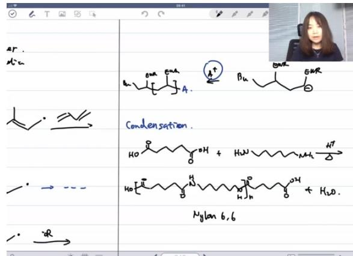

chemical

Chemical reaction scheme showing condensation of a diene to an amine and then to a nylon product, with structural formulas and reaction conditions.

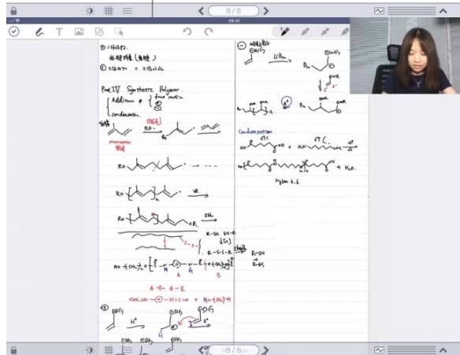

chemical

Chemical reaction equations and molecular structures for a polymer, including hydrolysis, condensation, and esterification steps

# 性能调控：

- 链状结构：弹性好但韧性差  
● 网状结构：坚固度高但弹性减弱  
● 硫含量影响：硫含量越高，交联程度越大，材料越硬

# 3. 有机化学高频考点分析 02:12:38

# 1）有机的立体化学 02:14:18

- 绝对构型判断: 核心考察 $R / S$ 构型标记法, 需掌握手性中心的确定方法  
- 六元环构象: 重点分析环己烷的椅式构象及其稳定性比较  
- 手性判断标准:

- 对称面( $\sigma$ )存在则无手性  
- 对称中心存在则无手性

\- 旋光性: 与分子手性直接相关，无对称面/中心的分子才可能具有旋光性

● 考试特点:

○ 属于基础送分题范畴  
◦ 知识点明确，出题意图容易揣测   
- 主要考察学习扎实程度

2）自由基的反应机理 02:15:24

● 重要性分级:

○ 机理理解：★★★★★(必须掌握)  
○ 考试难度：★★★(通常考法简单)

\- 反应三阶段:

- 链引发(Initiation): 产生自由基的起始步骤   
◦ 链增长(Propagation): 自由基持续反应的阶段  
- 链终止(Termination): 自由基结合的结束步骤

\- 学习建议:

- 第一轮学习重点在知识广度覆盖  
- 第二轮需提升知识点应用能力  
○ 需注意出题意图的识别训练

● 考试趋势:

◦ 近年有机化学考题难度提升  
- 基础题多集中在立体化学部分  
- 难题特征为考点指向性不明确

# 二、化学竞赛备考策略02:17:56

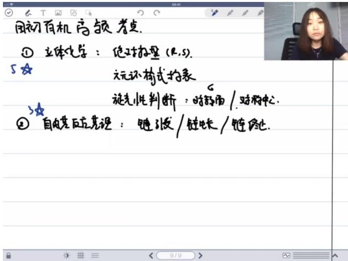

text_image

自初有机高频考点.
① 立体化学：绝对构型(R,S).
5★
元元素式构表
旋光性判断：对舒面/对称中心.
② 自定义方法论：链激发/链张/链终止.

\- 备考目标分级：

- 冲省一（首次考生）：要求基本功得分率>80%  
○ 冲省队（已有省一）：要求基本功不丢分，元素/晶体少丢分，有机70-80%得分率

得分策略：

○ 化学基本原理（40分）：最多扣8分  
○ 元素化学+晶体结构（30分）：允许扣6分

○ 有机化学（30分）：首轮目标50%，二轮70%  
总分控制：最多扣35分（65分可冲省一）

# 1. 基本概念与计算题 02:19:08

text_image

次考同初1.

>80% (10%). : 化过基本原理. 电子方程式: $\frac{分子结构}{计算题}$

# 9/9

# - 核心内容:

- 方程式配平：每年约10分，通过原子守恒/电子守恒法  
- 分子结构：包括原子结构、分子构型等基础理论  
○ 计算题型：热力学、化学平衡、电化学等基础计算

# - 备考要点:

这些部分在国初考试中难度较低，属于必得分模块  
○ 需特别注意避免粗心错误，尤其是配平类"数学题"

# 2. 元素化学与晶体结构 02:20:03

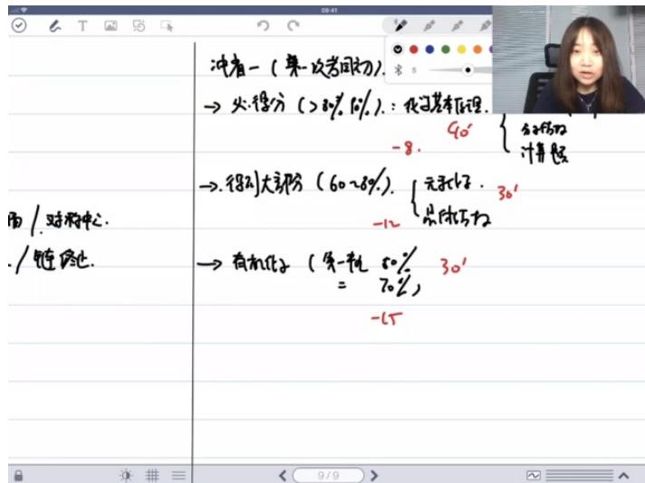

text_image

冲着一（第一次考用切）.
→ 必得分（>80% 10%）：化于基本原理.
-8.
→ 得列大部分（60~8%）.
-12
→ 有机化子（第一根 50%
= 70%）
-15
9/9

# 备考特点：

○ 目标得分率60-80%，不建议追求满分  
- 通过多轮复习（如三零课程）可提升至80%得分率

# - 注意事项：

避免过度钻研格林伍德等进阶内容，性价比低  
- 晶体结构考点固定，后期可追求不丢分

# 3. 有机化学备考策略 02:21:37

# ● 阶段目标：

- 第一轮：掌握50%基础分  
- 第二轮：通过重点反应记忆提升至70%

# - 得分要点：

\- 前两道有机大题通常较简单，重点掌握：

■ 常考反应条件与产物（占1/3分）  
■ 基础反应机理（配合课程可拿一半分）

# 三、有机化学高频考点 02:26:55

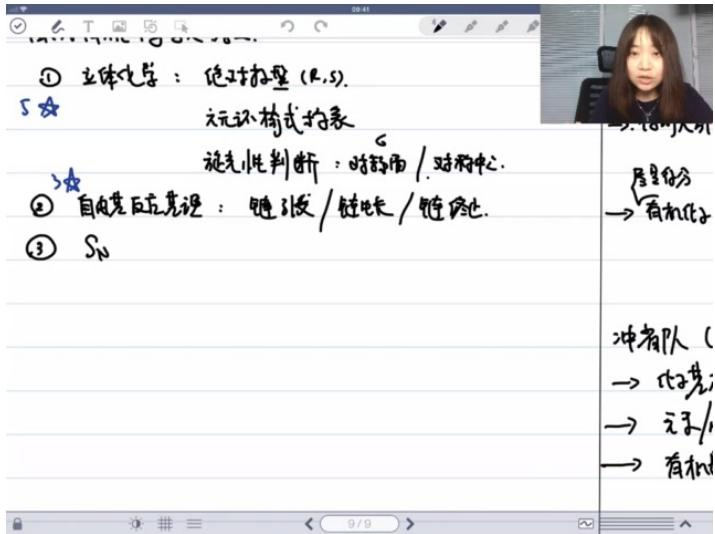

text_image

① 立体化学：绝对构型(R,S).
5☆
元环构式约束
旋光性判断：对舒面/对构中心.
② 自由基反应原理：锤引发/链电长/链终止.
③ S₀
冲都队(
→ 化子基
→ 元素/
→ 有机

1. 立体化学 02:33:43  
● 核心考点：

- 绝对构型：R / S标记法  
○ 环状构象：椅式构象分析  
- 旋光性判断：时面/对称中心判定法

● 考试特点：虽为五星考点，但单独命题频率不高，多结合机理题考查  
2. 自由基反应  
- 反应阶段:

- 链引发：自由基生成  
- 链增长：自由基传递  
- 链终止：自由基结合

● 考试现状：三星考点，因机理研究不完善，难题命制受限

3. 亲和取代与消除反应

● 关联性：取代反应与消除反应常成对出现  
● 重点场景：

- 涉及Lv（离去基团）的反应  
- 醇类化合物的转化  
- 碳正离子稳定性判断

4. 烯烃加成反应 02:29:53

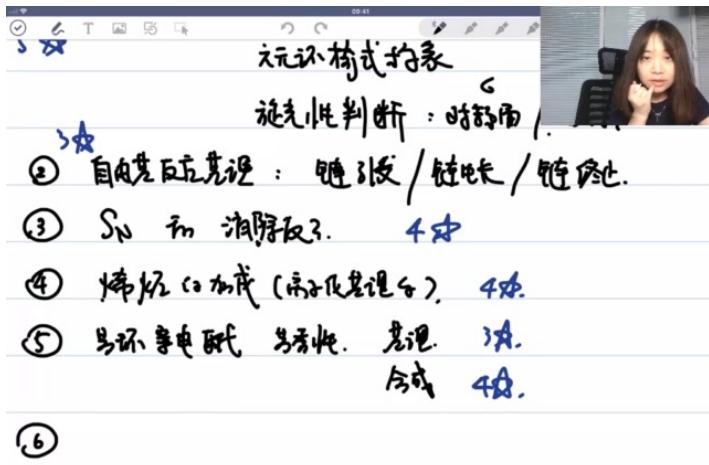

text_image

元环椅式拍表
旋气性判断：对静面
② 自由基反应基理：锤引发/链电长/链终止.
③ S₀ 和 消除反3. 4#
④ 烯烃（加热）（离子化基理5）. 4#
⑤ 后环、导电酰、异辛烷、基理 3#
合成 4#
6

# ● 考查重点：

○ 离子型机理（四星考点）  
- 碳正电荷进攻双键的定位规则   
○ 马氏规则与反马氏规则的应用

# 5. 芳香性反应

# ● 考查维度：

○ 定位效应（邻对位/间位）  
○ 取代基活化/钝化作用  
- 芳香性判据（Hückel规则）

● 考试定位：机理题三星，合成题四星

# 6. 羰基化学 02:31:30

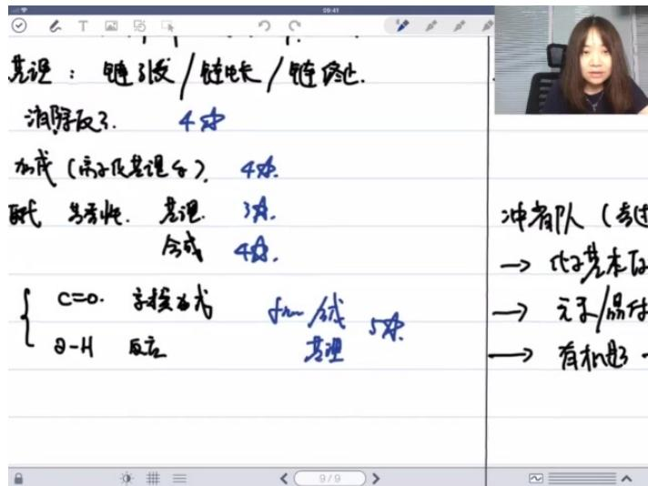

text_image

基理：链引发/链电长/链终止.
消除反应 4克
加成（离子及基理） 4克
取代 基子性. 基理 3克
合成 4克.
{ C=0. 封发为式 机械 5克
θ-H 反应 基理
冲部队（链
→ 化子基本反
→ 元素/晶体
→ 有机肥一

# 五星考点：

○ 亲核加成：C = O 键的特性反应  
- α-H活性：涉及醛酮的典型反应

● 衍生体系：羧酸衍生物的反应（酯化、水解等）

# 7. 低频考点说明

# ● 非重点内容:

○ 卡宾化学（目前命题受限）  
- 氮化学中的重氮化合物  
- 特殊自由基反应

● 应对策略：掌握核心机理（碳正/负电荷分析）即可推导

四、知识小结

<table><tr><td>知识点</td><td>核心内容</td><td>考试重点/易混淆点</td><td>难度系数</td></tr><tr><td>含氮化合物结构</td><td>三级胺手性翻转现象(伞式翻转)</td><td>绝对构型判断(孤对电子优先级最低)</td><td></td></tr><tr><td>氢键与沸点关系</td><td>醇&gt;胺&gt;醚的沸点顺序</td><td>碱性:氨&gt;醇,但氢键强度相反(醇中H酸性更强)</td><td></td></tr><tr><td>胺的制备方法</td><td>1.硝基还原 2.Gabriel合成法 3.还原胺化</td><td>还原胺化机理(亚胺中间体形成)</td><td></td></tr><tr><td>霍夫曼消除</td><td>四级铵盐+AgOH加热生成最少取代烯烃</td><td>与扎伊采夫规则对比(动力学vs热力学控制)</td><td></td></tr><tr><td>重氮盐反应</td><td>1.Sandmeyer反应(上X/CN) 2.成酚反应 3.次磷酸还原</td><td>定位基应用(间位三溴苯制备)</td><td></td></tr><tr><td>糖类立体化学</td><td>D/L构型判断(Fisher投影式最下端OH方向)</td><td>环状糖优势构象(β-D-吡喃糖更稳定)</td><td></td></tr><tr><td>氨基酸等电点</td><td>pi=(pKa1+pKa2)/2计算方法</td><td>电泳方向判断(pH&gt;pi带负电)</td><td></td></tr><tr><td>蛋白质结构</td><td>一级(肽键)、二级(氢键)、三级(二硫键等)</td><td>变性因素(重金属破坏二级结构)</td><td></td></tr><tr><td>聚合反应类型</td><td>1.自由基聚合 2.离子聚合 3.缩聚(尼龙66)</td><td>单体结构推断(去年真题加成聚合陷阱)</td><td></td></tr><tr><td>有机高频考点</td><td>1.立体化学 2.羰基化合物 3.亲核取代/消除</td><td>机理分析优先级:碳正离子稳定性&gt;立体效应</td><td></td></tr></table>