# 一、非正式课程 00:00

# 1. 有机基本概念 56:00

# 1）芳香性 56:27

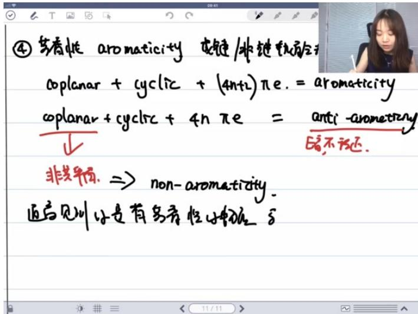

text_image

④ 若春性 aromaticity 染键/非链轮廓合
coplanar + cyclic + (4n+2)πe. = aromaticity
coplanar + cyclrsc + 4n πe = anti-aromaticity
↓
非共平面. ⇒ non-aromaticity.
通后见叫它是有多条性物体的δ

- 三要素：满足芳香性需要三个条件：①所有提供p轨道的原子共平面（coplanar）；②形成环状共轭体系（cyclic）；③具有 $4n + 2$ 个 $\pi$ 电子（Hückel规则）。  
- 反芳香性：与芳香性三要素相同，但具有4n个π电子，表现为自由基性质，能量高且不稳定，实际例子很少见。  
● 非芳香性：当4n个π电子的体系通过调整构象变为非共平面时，就转化为非芳香性体系。

text_image

opianar + cycirc + 4h πe = wr
E₀

非共平分. $\Rightarrow  \mathrm{{non} - {aromaticity}}$ .

追言见训 小是有鸟骨性小物的非鸟骨性小物体.

● 实验验证：偶极矩测量是验证共振结构式的重要实验手段，偶极矩大的分子更倾向于电荷分离的共振结构。  
- 共振结构评估标准：包括：i) 最小电荷原则；ii) 八隅体规则；iii) 电负性差异；iv) 相反电荷分离；v) 相同电荷排斥。  
● 例题:芳香性物质判断 01:00:42

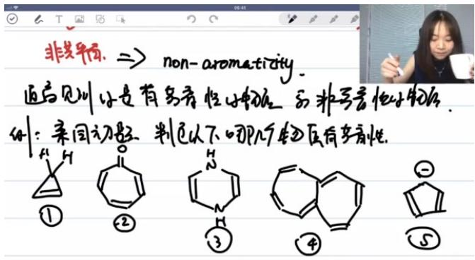

text_image

非共异构. ⇒ non-aromaticity.
通言见词:是有芳香性小物体的非芳香性小物体.
例: 亲同初始. 判断以下几个物体具有芳香性.

# ○ 解题要点：

■ 需要系统应用芳香性三要素进行判断  
■ 特别注意环状共轭体系和π电子数的计算  
■ 实际考试中，反芳香性物质很少出现

# ○ 典型错误：

忽略共平面性要求  
■ 错误计算π电子数  
■ 将非芳香性误判为反芳香性

\- 答案提示：在类似题目中，常见芳香性物质包括符合 $4n + 2$ 规则的环状共轭体系。

# 2. 立体化学 01:03:46

# 1）异构体的分类 01:10:22

● 构造异构 01:10:26

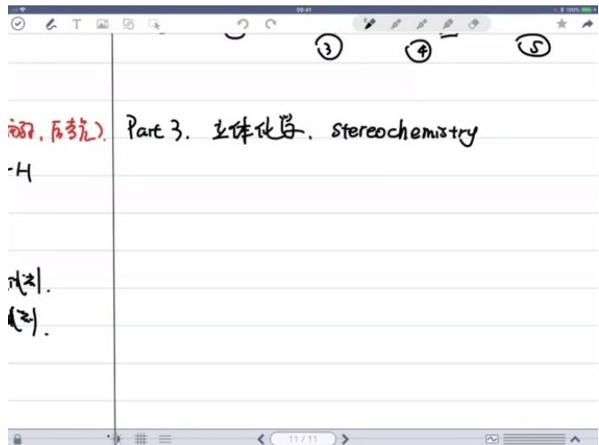

text_image

部分，后考几。
-H
凡(2)。
(2)。
Part 3. 立体化学、stereochemistry

定义：构造异构是指原子之间的连接方式不同，包括碳骨架或非碳骨架的连接方式差异。  
○ 示例：如 $CH_{3}-CH_{2}-CH_{2}-CH_{3}$ 与 $CH_{3}-CH(CH_{3})-CH_{3}$ 就是构造异构体。

● 对应异构体与非对应异构体 01:11:15

○ 对应异构体：即对映异构体(enantiomer)，是立体异构体中最常见的类型。  
○ 非对应异构体：除对映异构体外的所有立体异构体，中文称为"非对映构体"。  
- 分类依据：原子连接方式相同但空间排列不同时即为立体异构体。

● 非对应异构体的分类：构象异构体与旋转异构体 01:11:54

○ 构象异构体(conformer): 来源于σ键旋转产生的稳定构象。  
○ 旋转异构体(rotamer): 来源于σ键旋转产生的所有可能构象。

# ● 构象异构体与旋转异构体的关系与区别 01:12:31

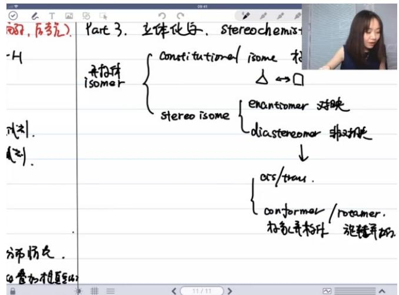

text_image

部分，后考几）
Part 3. 立体化与、stereochemistry
-4
无构体
isomer
constitutational isome 松
△ ↔ □
stereo isome
enantiomer 对称
diastereomer 非对称
↓
css/trau.
conformer /rotamer.
标系并构体 旋转并加
分布情况。
①叠加不是重复的
11/11

○ 能量关系：构象异构体是势能图(P.E. vs 旋转角度)上的能量低点(谷底)，而旋转异构体包含所有可能的旋转状态。  
数量差异：构象异构体数量有限，旋转异构体数量无限(因旋转角度可无限细分)。  
○ 示例说明：以乙烷和丁烷为例，只有达到势能最低点的构象才能称为构象异构体。

# 2）手性中心与绝对构型 01:13:52

# - 基本概念

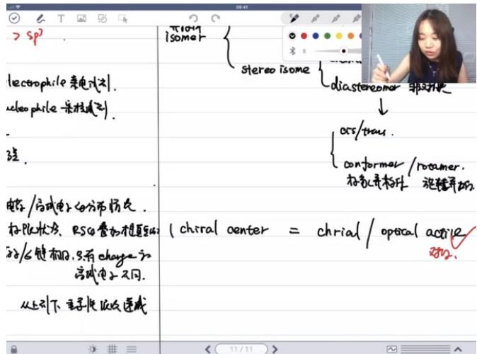

text_image

>sp²
lecoophile 来电式引.
lecoophile 来极式引.
弦.
电势/方式电子的分布情况.
校PLC状态: RSG 增加模量和
式/6键相切,只有charge和
完成电子不同.
从上引下,主导线低波速成
π1049
isomer
stereosome
diastereomer 非对称
oss/tray.
conformal /rotuner.
校孔并标示 旋转并标
chiral center = chrial / optical active
ss2.

○ 手性中心判定：一个分子有且仅有一个手性中心时，该分子一定具有手性(等价于具有旋光性optical active)。  
- 绝对构型：用R/S标记手性中心的绝对构型，是立体化学的基础考点。  
外消旋体：50% R构型与50% S构型的混合物(racemic mixture)，不可能是单一化合物。

# - 手性与光活性

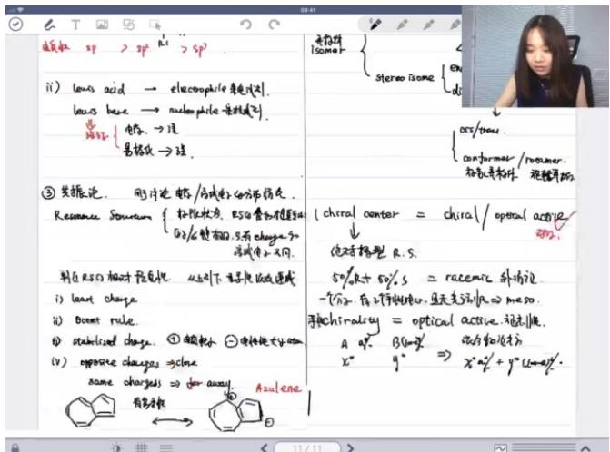

text_image

sp > sp → sp
ii) ions acid → electrophile 气泡大计.
Ions base → nucleophile 气泡减计.
异化 电极 → 运
易极光 → 运

③ 发振论. 刚讨论电极/分式电的溶液结论.
Resource Source { 扎除状态 R50 增加槽温度
0/℃相变 0.5% 有电极和 0.4%
浓度由2不同.
料在RS口相对反应性 从以下子极化吸收速度
i) lead change
ii) Boost rule
iii) stabilized change. ① 酸极小 电极比大小
iv) opposite changes ⇌ close
same charges ⇒ for auxel.
有氧水体
Azulene
光源
Stereo Isome
Osc/tona
Conformar / Prosumer.
标准来材料 运动开始
chiral center = chiral / optical active
绝对模型 R.S.
50%R + 50%S = racemic 外消记
一个N2-有工作原理，且无支流||A|| ⇒ amo S.
手能chirality = optical active. 流光||A.
A q² B(mg)² 法力物激发方
x² y² ⇒ x²q² + y²(100m²).

等价关系：手性(chirality)与光活性(optical activity)在考试中等价，前者基于结构判定，后者基于实验测量。  
- 旋光度计算：混合物的旋光度=物质A旋光度×A百分比+物质B旋光度×(100-A)百分比。  
○ 核心判定：若分子既无对称面也无对称中心，则一定具有旋光性(即手性)。

\- 内消旋体

○ 定义：分子含有两个手性中心但无光活性的情况称为内消旋体(meso)。  
○ 判定条件：需满足分子整体无光活性，不一定要求有对称面或对称中心。

● 例题:手性分子判断 01:21:12

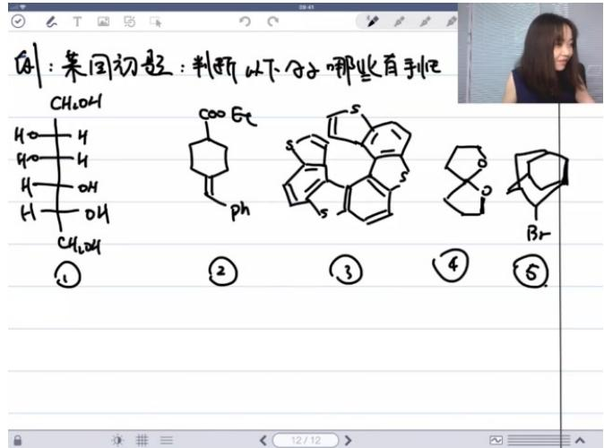

text_image

例1：某团切题：判断以下分子哪些百种
CH₂OH
COO Gt
Ph
S
S
①
②
③
④
⑤
Br

○
○ 题目解析

■ 判断标准：主要考察对称面和对称中心的缺失情况  
■ 解题技巧：需注意螺环化合物的立体构型(如"环绕楼梯"状态)  
■ 常见误区：容易误判具有假对称中心的分子  
■ 复习建议：重点复习课堂例题和作业题，可解决90%相关问题

3. 自由基反应机理 01:27:46

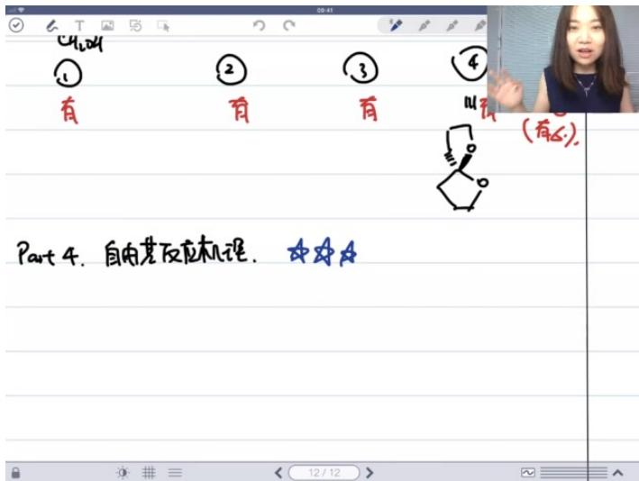

text_image

①
有
②
有
③
有
④
(有△).
Part 4. 自由其反应机理. ★★★☆

- 考点重要性：属于三星考点（满分五星），考频高于周环反应但低于离子化反应，题目难度通常不高  
● 常见考察形式：可能结合高分子合成反应（如加成聚合反应）进行考查，2013-2017年间有三年在无机题中考查相关知识点

1）判断是否为自由基反应机理 01:28:39

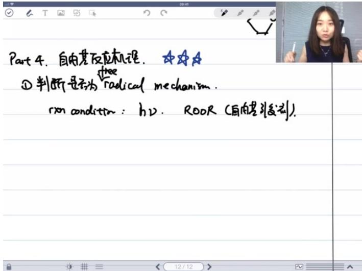

text_image

Part 4. 自由基反应机理.
① 判断是否为 radical mechanism.
rxn condition: hν. ROOR (自由基引发剂).

● 关键条件：主要通过反应条件判断，典型特征包括：

- 光照条件（需注意光照也可能引发周环反应）  
- 使用自由基引发剂（如过氧化物ROOR）

● 典型反应类型：烯烃或共轭二烯烃的加成聚合反应（如橡胶合成反应）

○ 单体特征：π键体系上的取代基既非给电子基团（EDG）也非吸电子基团（EWG）

2）反应机理三步曲

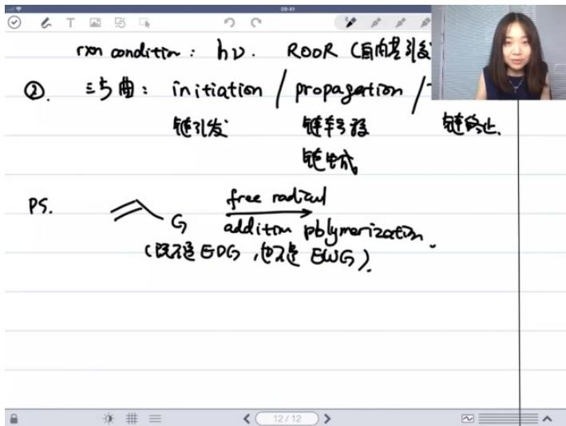

text_image

rxn condition: h2. R00R (自由要引发)
②. 三步曲: initiation / propagation /
链孔发: 链转移 链停止
链生成
PS. G free radical
addition polymerization.
(既不是50G, 也不是8WG).

● 链引发(initiation): 产生初始自由基的过程  
- 链增长(propagation): 自由基与单体连续反应的阶段  
- 链终止(termination): 自由基相互结合使反应终止  
● 高分子合成特点：单体通过链增长步骤逐个加成形成聚合物

# 4. 亲核取代 01:33:38

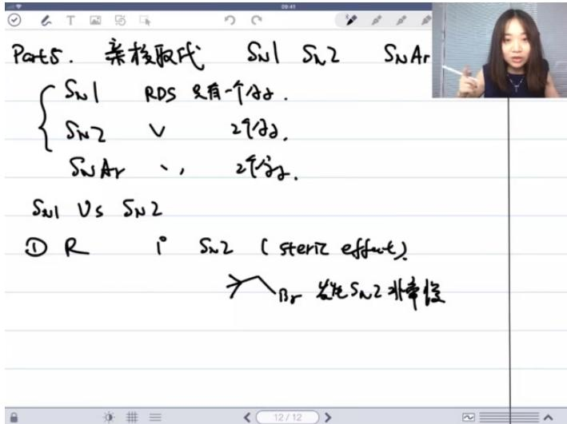

text_image

Parts. 亲核取代 SNU1 SNU2 SNAr
{SNU1 RDS 只有一个分子.
SNU2 V 2分子.
SNAr ,, 2分子.
SNU1 Vs SNU2
① R i° SNU2 (steric effect)
→ BR 发生SNU2非常候

● 🔍 ⚙ ≡ < 12 / 12 >

● 考点重要性：五星核心考点，近五年有机题每年必考

\- 反应类型:

○ $S_{N}1$ ：速率决定步骤涉及单分子  
○ $S_{N}2$ ：速率决定步骤涉及双分子  
○ $S_{N}Ar$ ：芳环亲核取代（需特殊条件）

# 1）SN1和SN2的区别 01:34:44

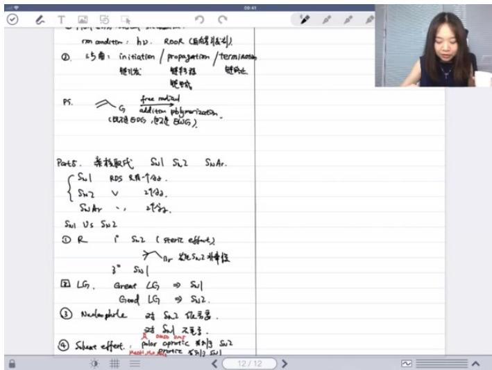

text_image

rm condens : hD. ROR (自由弹性)

①. 5角: initiation / propagation / termination
键化法: 键导法
键性法:
PS. → G → free modified addition polymerization.
(双键的SOS, 按键为SWG)

Parts. 异核取代 Si1 Si2 SiAr.
{Si1 RO5 K/A↑80.
Si2 V 2700.
SiAr · · 2700.
Si1 Vs Si2
① R i Si2 (矩形 effect)
→ Ar 锻化式 Si2 非标值
3" Si1
② LG. Great LG ⇒ Si1
Good LG ⇒ Si2.
③ Nanosphile 对 Si2 低质量.
对 Si1 不毛子.
④ Shear effect: polar capillary defect Si2
Roof due to fracture Si2 Si1

# ● 底物结构影响：

- 一级卤代烃：优先 $S_{N}2$ （受位阻效应影响大）  
○ 三级卤代烃：优先 $S_{N}1$   
- 二级卤代烃：需综合判断

# ● 其他影响因素：

○ 离去基团：好的离去基团（如 $I^{-},OTs$ ）对两者均有利  
- 亲核试剂：强亲核试剂有利于 $S_{N}2$ ，对 $S_{N}1$ 无影响  
○ 溶剂效应：

■ 极性非质子溶剂（如DMSO, DMF）促进 $S_{N}2$   
■ 质子性溶剂（如水, 甲醇）促进 $S_{N}1$

# 2）芳环的亲核取代 01:38:07

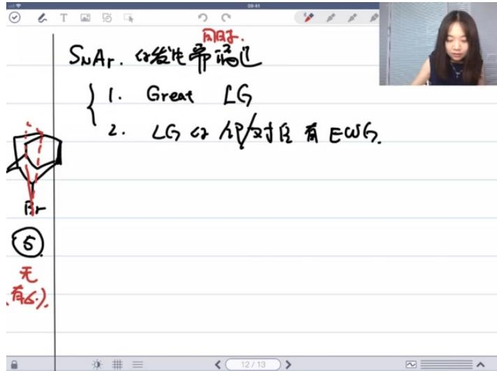

text_image

SnAr. 发生帝瑞尼
{ 1. Great LG
2. LG或HP/对只有EWS.
⑤
无
有6.}

# ● 发生条件（需同时满足）：

○ 存在优良离去基团（Great LG）  
○ 离去基团的邻/对位有强吸电子基团（EWG）

● 反应机理：通过共振稳定中间体负电荷  
● 考试注意：芳环取代反应中，亲电取代更常见，但近年考试中 $S_{N}Ar$ 出现频率增加  
● 例题:亲核取代反应应用 01:40:43

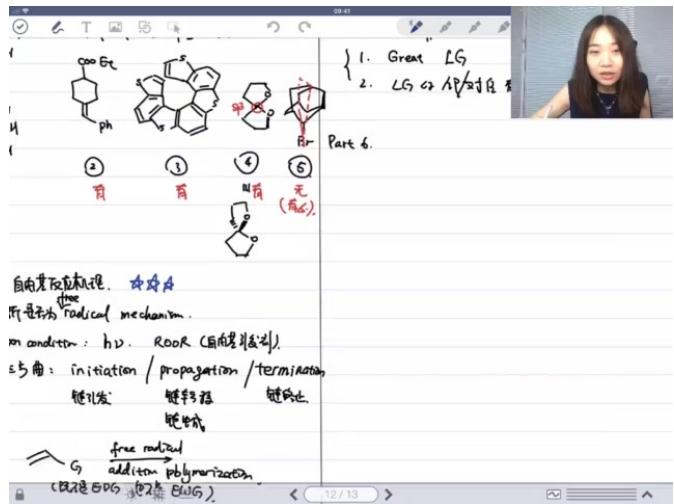

text_image

1. Great LG
2. LG 42 AP/对性
Part 6.
自由其反应机制。
因子是为 Radical mechanism.
on condition: h2. ROOR (自由基反应剂).
3方曲：initiation / propagation / termination
键化发 链导通 链链止
键生成
G free radical
addition polymerization
(BR不是50% 52% BCG)
12/13

# ○ 解题思路：

■ 首先判断反应类型（离子型机理）  
■ 分析电荷分布：电子从富电子区流向缺电子区  
■ 考虑可能的亲核取代或加成途径

# ○ 实际应用：

■ 分子内亲核取代（邻基参与效应）  
■ 未知反应解析的重要思路方向

# 5. 消除反应 01:42:28

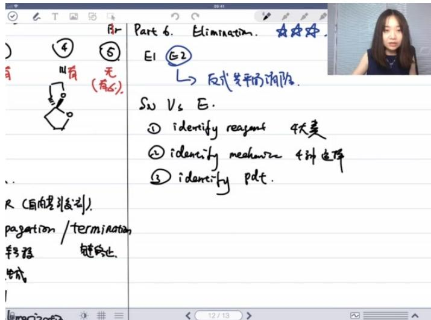

text_image

Part 6. Elimination.
E1 E2
→ 反式等平的消除.
S₂ V₃ E.
① identify reagent 4大类
② identify mechanize 4种电焊
③ identify pdt.
R (自内型引发)
pagation / termination
转移 链停止.
生成
Liparization.

● 核心考点：消除反应是三星级考点，主要考察E1和E2反应机理，其中E2反应的反式共平面消除是重点  
- 反应类型区分：需掌握亲核取代(SN1/SN2)与消除反应(E1/E2)的竞争关系，该内容已多次复习

# 1）试剂的反应条件 01:44:16

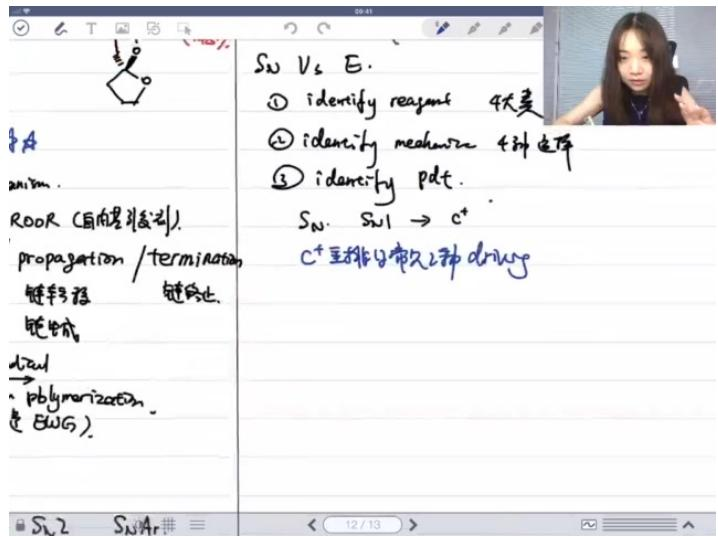

text_image

Sv Vs E.
① identify reagent 4大类
② identify mechanism 4种定律
③ identify pdt.
Sn. Sw1 → c+
c+至排的永久二种drugs
died
→
·polymerization
是BWG。
Sv2 SnAr # ≡ < 12/13 >

# ● 判断步骤：

- Identify reagent: 识别试剂属于四大类中的哪一类  
- Identify mechanism: 根据底物和试剂组合判断机理(SN1/SN2/E1/E2)   
- Identify product: 确定产物结构

# ● 复习方法：通过作业题巩固反应机理判断能力

# 2）SN1亲和试剂反应产物 01:47:29

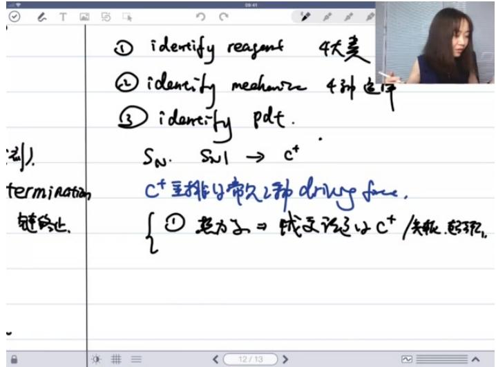

text_image

① identify reagent 4大麦
② identify mechanics 4种定律
③ identify pdt.
S_N. S_W1 → c+
termination
链停止.
C+主排口常久2种drive face.
{①起力之=>歧义说这与c+/先抓、起现。

# ● 产物特征：

○ 生成外消旋产物(racemic mixture)   
○ 存在构型翻转产物略多现象（离子对效应导致）

# - 碳正离子重排：

- 驱动力1：生成更稳定的碳正离子（热力学驱动）  
- 驱动力2：环张力释放(ring strain)

# ● 稳定性因素：主要考虑共轭效应，其次超共轭效应

# 3）SN2亲和试剂反应产物 01:49:52

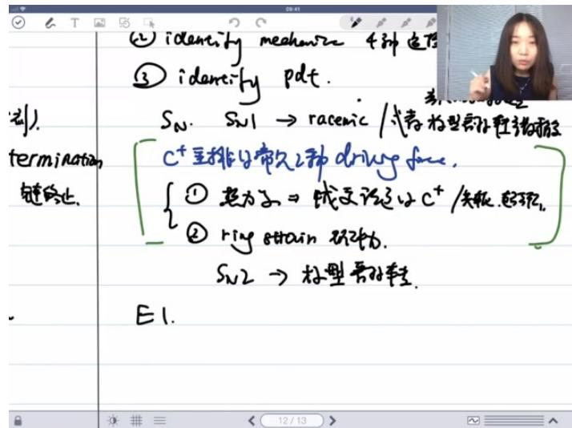

text_image

(2) identify mechanize 4种适应
③ identify pdt.
Sv1 → racemic / 气泡型蛋白链末端
C+呈排氨酸乙酯 drug free.
{① 越力α → 成交该定式C+/夹板、超强。
② ring strain 强动力.
Sv2 → 极型骨对链.
E1.

● 产物特征：构型完全翻转(configuration inversion)  
● 反应机理：一步协同反应，无中间体形成

4）E1消除反应特征

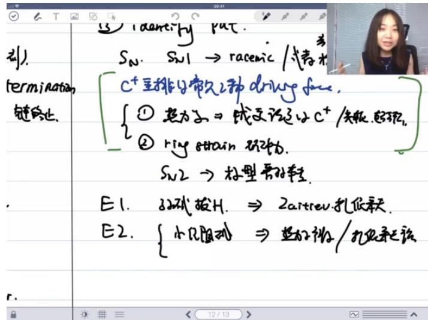

text_image

引).
termination
键停止.
E1. 82°拔H. ⇒ 2artrev扎低跃.
E2. {小见阻则 ⇒ 82°斜/扎低跃法
Sn. Sn1 → racemic / 张素木
C+呈排匀常久这种driving force,
{① 越为a ⇒ 经变速器以C+/夹板、超轻,
{② ring strain 驱动力.
Sn2 → 枕型滑轮车.
12/13}

\- 反应步骤：

○ 离去基团离去形成碳正离子   
○ 弱碱夺取β-H

● 产物选择性：生成Zaitsev产物（取代度高的烯烃）  
● 稳定性原理：超共轭效应(hyperconjugation)使多取代烯烃更稳定

5）E2消除反应特征

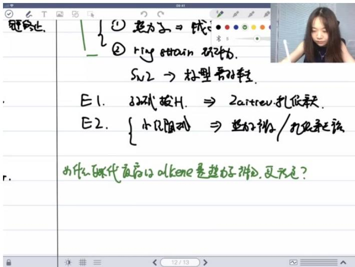

text_image

链停止.
① 越力文 ⇒ 线
② ring strain 线2转为.
Sv2 → 标型滑动鞋.
E1. 82代拔H. ⇒ 2artrev扎低跃.
E2. {小几阻动 ⇒ 越力文/扎低跃法
为什么取代底有olkene是越力棒的,更无色?
r.

● 小位阻碱：如t-BuOK，生成Zaitsev产物（热力学控制）  
● 大位阻碱：如LDA，生成Hofmann产物（动力学控制）  
● 过渡态特征：必须满足反式共平面消除   
● 位阻影响：离去基团或碱中任一位阻较大都会导致Hofmann产物为主

6）霍夫曼消除反应 01:53:16  
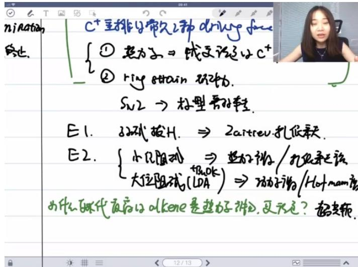

text_image

nination
终止.
C+呈排与带久两种drinyl groups
① 越力子 → 线式反应式C+
② ring strain 码力。
Sn2 → 标型离子链.
E1. 3D碳拔H. ⇒ 2artrev扎低跃迁.
E2. {小几阻断 ⇒ 越力子产生/反应式该
大位阻断(LDA) ⇒ 功力子产生/Hot-mann质
为什么取代反应式alkene是越力子产生,更充足? 超支频.

● 典型条件：使用OH-作为碱  
● 特殊性：虽然OH-是小位阻碱，但因离去基团为体积大的季铵盐，仍得Hofmann产物  
● 本质原因：过渡态位阻效应主导产物选择性

# 6. 烯烃的加成 01:54:57

1）烯烃与溴的加成 01:56:43

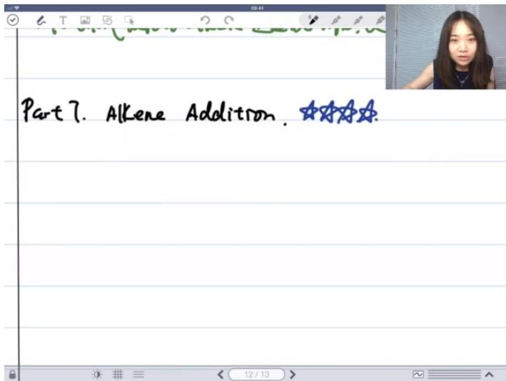

text_image

Part 7. Alkene Addition.

- 经典反应特征：该反应几乎每年都会考察，属于高频考点，涉及派键和σ键的断裂与重排   
- 反应机理：第一步是1,3-偶极环加成，断裂派键；第二步重排过程断裂σ键，最终生成五元环结构  
● 产物特征：重排后的五元环产物具有特定结构，需要记忆其最终形态

2）马尔尼耶夫规则 01:57:38

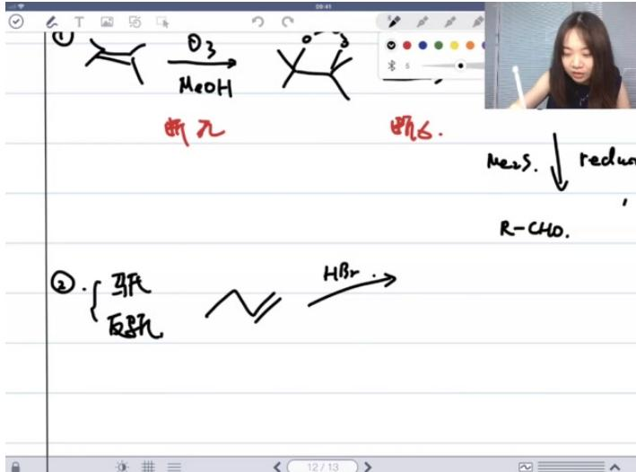

chemical

Handwritten chemical reaction diagram showing decomposition of phenol into amino acids and bromide, with R-CHO as reagent

基本定义：马氏加成是氢加在取代较少的碳上（位阻小），反马氏加成则是氢加在取代较多的碳上  
● 机理差异：

- 马氏加成：质子对双键的亲电加成，生成碳正离子中间体  
- 反马氏加成：自由基机理，先上溴自由基生成碳自由基中间体

● 反应条件：过氧化物的存在会改变反应机理，导致反马氏加成产物  
● 记忆技巧：不需要死记规则，通过画反应机理即可推导出产物位置

3）应用案例 02:00:57

● 例题:马尔尼耶夫规则判断

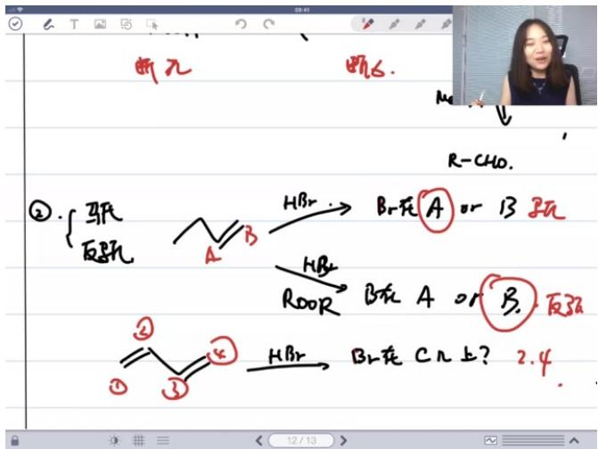

text_image

断元
断6.
②{亚}
反死
A B
HBr → Br在A或B玩
HBr → 2.4
R-CHO.
ROR
A or B. 反死
③
④
HBr → Br在Cn上? 2.4
12/13

# ○ ○ 题目解析

■ 关键点：判断反应条件是否含过氧化物  
■ 机理分析：无过氧化物时为碳正离子机理，有过氧化物时为自由基机理  
■ 答案：无过氧化物时溴在取代多的碳上（马氏），有过氧化物时溴在取代少的碳上（反马氏）  
■ 易错点：容易混淆两种机理对应的产物位置

# 4）铅汞化反应 02:03:45

# - 反应步骤:

- 汞离子对烯烃的亲电加成形成三元环中间体  
- 水作为亲核试剂进攻开环  
- 还原剂脱汞并提供质子

● 区域选择性：由电荷效应主导，羟基会加在更稳定的碳正离子上  
● 变体反应：溶剂可替换为醇或胺类，产物相应变化  
● 考点提示：不需要掌握重排机理，但必须知道最终产物结构

# 5）应用案例 02:06:38

# ● 例题:刀的位置判断

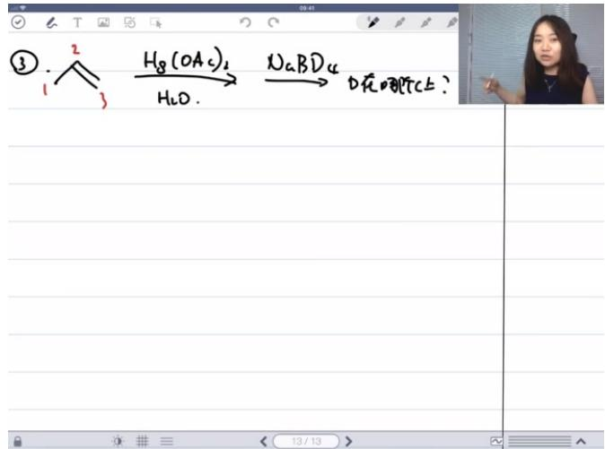

chemical

Chemical reaction diagram showing hydrogenation of acetone to sodium boride and then to dipole, with a photo of a person observing the reaction.

# ○ ○ 题目解析

■ 关键点：判断电荷效应主导的开环位置   
■ 机理分析：汞三元环开环时，羟基加在更稳定的碳正离子上  
■ 答案：刀标记在未加羟基的碳原子上  
■ 立体化学：产物具有手性，羟基和刀原子为同侧加成

# 6）应用案例 02:09:47

# ● 例题:溴的加成位置判断

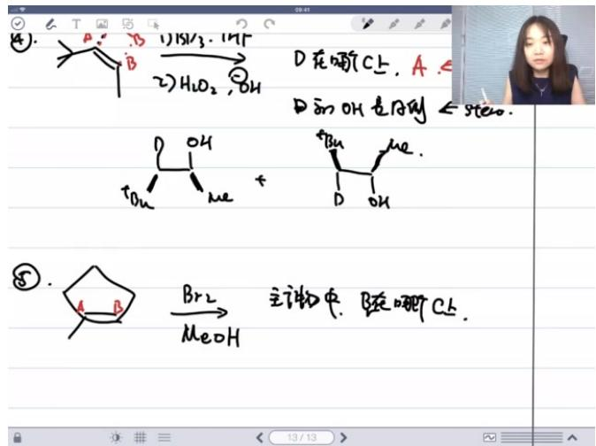

chemical

Hand-drawn chemical reaction equations showing transformation of compound A to B via intermediates D and H₂O₂, with stereochemistry indicated

# ○ ○ 题目解析

■ 反应条件：甲醇溶液中溴加成  
■ 机理分析：酸性条件下开环，电荷效应主导产物分布  
■ 答案争议：多数认为甲氧基加在更稳定的碳正离子上（位置a）  
考点延伸：双键取代度影响开环位置选择（1°vs3°碳时电荷效应主导）

# 7. 羰基的加成反应 02:14:31

# 1）汤基的亲和加成及各种变种 02:14:55

● 汤基的亲和加成与阿尔法氢的活化 02:15:01

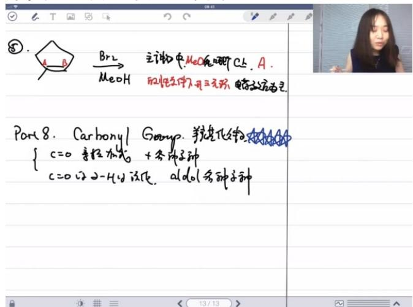

text_image

Br2
MeOH
主产物:MeO在碳中C6.A.
的恒定水伴入开三元/秒,电荷流动为正.

Port 8. Carbonyl Group. 羧化氢化物
{ c=0 氨化加程式 + 各种品种
c=0以2-HCl浓度,aldol各种品种

- 五星考点重要性：最近五年几乎每年都考，分值占比大（可能三道有机题中两道涉及）  
- 反应本质：阿尔法氢活化属于el to反应的各种变种  
考查形式：主要考察汤基的亲和加成或阿尔法氢活化生成碳负离子后的系列反应  
- 核心机理：电荷从密度高的地方流向密度低的地方，关键在于正确绘制反应箭头

● 复习方法与反应机理的重要性 02:16:01

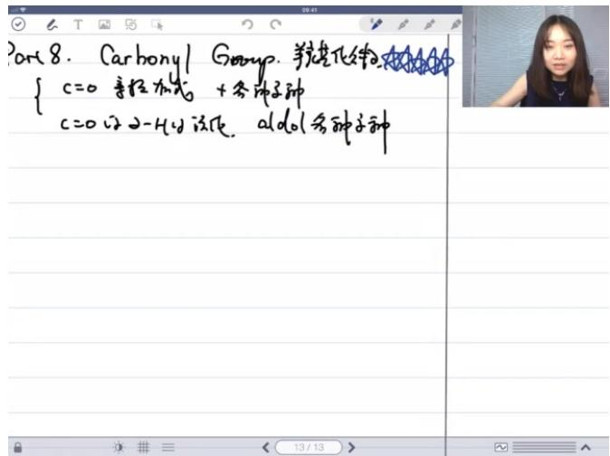

text_image

Part 8. Carbonyl Group. 美克素化物
{ c=0 系性加式 + 参种子砷
c=0 设 2-4 的该代, aldol 参种子砷

# ○ 学习方法：

■ 多画机理：每个例题至少画3-4遍机理，重点掌握核心步骤  
■ 活学活用：通过大量练习实现自动举一反三  
■ 作业要求：能跟随老师画出的机理步骤即可，不必完全独立推导

\- 理解关键：所有反应本质相似，都是离子化过程和电荷流动

● 酸性与碱性条件下的反应特点 02:17:41

\- 酸性条件:

■ 作用机制：活化汤基（在氧上加质子或氯乙酸）  
■ 效果：增强汤基的亲电性  
■ 特殊反应：酸性催化下的阿尔法氢碘代反应

○ 碱性条件：

■ 作用机制：制造亲核试剂（如氢氧根负离子）  
■ 反应类型:  
● 直接对汤基进行亲和加成  
- 酯交换或酯水解反应  
- 拔除阿尔法氢

● 例题1: 国初试题解析 02:19:05

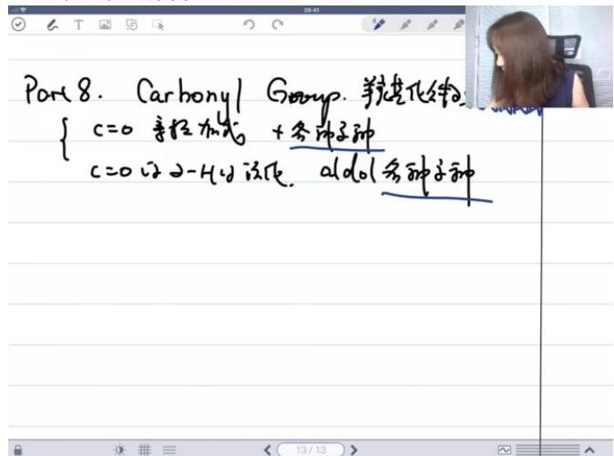

text_image

Part 8. Carbonyl Group. 美烷基化物
{ c=0 氨粒加成 + 参种子种
c=0以2-HCl浓度, aldol各种子种

题目背景：苯甲醛与特定试剂在六氢比定催化下的反应  
○ 解题要点：

第一问解析：  
- 识别试剂中的亲核部分（阿尔法碳负离子）
- pKa≈9的氢易被拔除

■ 第二问解析：

\- 催化剂六氢比定的双重作用:

\- 作为碱拔氢生成亲核试剂

\- 通过生成亚胺正离子活化汤基

● 亚胺生成机理需重点掌握（课后自行绘制）

■ 难点突破：亚胺正离子作为汤基类似物的活化作用

# - 其他重要考点概述

# ○ 聚合反应:

■ 加聚反应：正离子、负离子、自由基三种机理

■ 缩聚反应：condensation polymerization

# ○ 波谱分析：

■ 核磁共振：重点判断氢的化学环境

红外光谱：

\- 羰基峰：\~1700 cm $^{-1}$

● 羟基峰：\~3300 cm $^{-1}$ （宽峰）

# ○ 周环反应：

■ 主要考察Diels-Alder反应

■ 重点掌握endo/exo立体选择性

# - 有机合成策略：

■ 整理所有反应条件与产物到一张A4纸  
■ 密集记忆后立即做题巩固  
■ 比反应机理题更易得分

# 例题2: 连续合成题解析

# - 反应步骤分析：

■ 第一步：典型溴代反应生成C8H15Br  
■ 第二步:

● 碱性条件下阿尔法氢活化

● 发生SN2亲和取代反应

■ 第三步：

- 酯水解生成二羧酸  
● 加热条件下发生脱羧反应

■ 后续步骤：

- SOCI2将羧酸转化为酰氯   
● 胺亲核进攻酰氯的羰基（非酚氧进攻）

# ○ 关键考点：

■ 亲核性比较：胺＞酚（由于氮的孤对电子可极化性更强）  
■ 立体电子效应在反应选择性中的应用

# 二、知识小结

<table><tr><td>知识点</td><td>核心内容</td><td>考试重点/易混淆点</td><td>难度系数</td></tr><tr><td>芳香性</td><td>4n+2规则、共平面性、环电流</td><td>反芳香性判定条件 vs 非芳香性</td><td></td></tr><tr><td>立体化学</td><td>构型翻转(R/S)、外消旋体、内消旋体</td><td>对称面/对称中心对旋光性的影响</td><td></td></tr><tr><td>自由基反应</td><td>链引发/增长/终止三步曲</td><td>过氧化物效应导致的反马氏加成</td><td>★★★</td></tr><tr><td>亲核取代</td><td>SN1/SN2反应机理对比</td><td>极性溶剂对反应机理的影响</td><td>★★★★★</td></tr><tr><td>消除反应</td><td>扎伊采夫规则 vs 霍夫曼规则</td><td>反式共平面消除的立体要求</td><td>★★★</td></tr><tr><td>烯烃加成</td><td>羟汞化-脱汞反应定位规则</td><td>区域选择性与立体选择性</td><td>★★★★</td></tr><tr><td>羰基化合物</td><td>醛酮的亲核加成/α-H活化</td><td>酸性/碱性条件下的反应路径差异</td><td>★★★★★</td></tr><tr><td>高分子合成</td><td>加聚/缩聚反应类型</td><td>自由基/阳离子/阴离子聚合机理</td><td>★★★</td></tr><tr><td>波谱分析</td><td>氢谱化学位移/裂分规律</td><td>取代基测试法判断等效氢</td><td>★★★★</td></tr><tr><td>周环反应</td><td>Diels-Alder反应endo规则</td><td>双烯体/亲双烯体识别</td><td>★★★</td></tr><tr><td>糖化学</td><td>环状结构的异头碳效应</td><td>差向异构体形成机制</td><td>★★</td></tr><tr><td>氨基酸</td><td>两性离子特性/等电点</td><td>二硫键形成条件</td><td>★★</td></tr></table>