# 一、顺序规则 05:50

# 1. 复习顺序规则

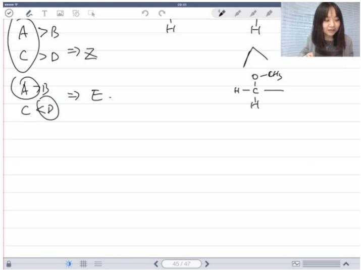

text_image

A>B
C>D ⇒ Z
A>B
CKP ⇒ E.
H
H
O-CH3
H-C
H
45/47>

# 1）基团大小比较规则

- 原子序数优先: 直接连接原子的原子序数越大, 基团越大。例如: $O > N > C$   
- 次级原子比较：当第一个原子相同时（如都是碳），比较连接的下一个原子中原子序数最大的。例如：

○ 乙基 $(CH_{2}CH_{3})>$ 甲基 $(CH_{3})$ ，因为乙基第二个原子有碳（连接H和C），而甲基只有氢

○ 甲氧基 $(OCH_{3})>$ 乙基，因为氧原子序数大于碳

# 2）Z/E命名法判定

# ● 判定步骤:

○ 比较双键一侧的a和b基团大小  
○ 比较另一侧的c和d基团大小

# ● 构型判定:

○ Z式: 当a>b且c>d时，大基团在双键同侧  
○ E式: 当a > b但c < d时，大基团在双键异侧

● 记忆技巧: "Z"像"同"字的起笔，表示同侧；"E"像"异"字的起笔，表示异侧

# 3）烯烃稳定性规律

● 取代度原则: 双键碳上连接的取代基越多，烯烃越稳定（most stable）  
例如：四取代 > 三取代 > 二取代 > 一取代

● 应用提示: 该规律在判断反应产物稳定性时非常重要

# 2. 应用案例 06:57

# 1）例题:醇的取代反应产品

E2反应的区域选择性

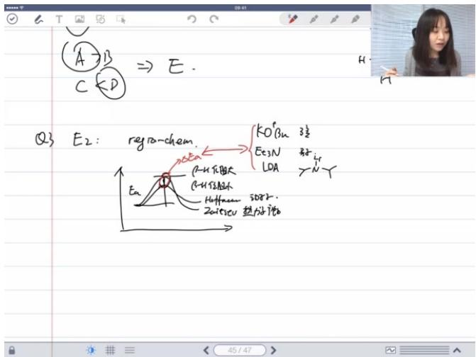

text_image

A B
C K D ⇒ E.
Q3 E2: regran-chem.
Ko'Bn 3½
Ec3N 约ir
LDA γ-N γ
P-H不溶性
P-H作酸钠
H4H4nm SO2R-
Zeitscv 热酸钾

# ○ 碱的位阻决定产物类型:

■ 大位阻碱(如t-BuOK、LDA、三乙胺)优先进攻位阻小的β-H，生成动力学产物(霍夫曼产物)  
■ 小位阻碱(如NaOH、EtONa)优先进攻位阻大的β-H，生成热力学更稳定的扎伊采夫产物

# - 稳定性原理:

■ 扎伊采夫产物更稳定是因为双键上取代基更多   
■ 霍夫曼产物是动力学控制产物，活化能较低但热力学稳定性较差

# ○ 常见碱分类:

■ 小位阻碱：氢氧化钠、乙醇钠等  
■ 大位阻碱：叔丁醇钾、LDA(二异丙基胺锂)、三乙胺等

# ○ 实际反应特点:

■ 定性做题时通常主副产物都需要考虑  
■ 实际反应中常得到混合物，需要纯化分离  
■ 大位阻碱的选择性更好，因为活化能差异 $(\Delta E_{a})$ 更大

# E2反应的立体化学 14:35

# ○ 立体选择性与立体专一性

# 立体选择性:

- 生成立体异构体混合物  
- 其中一个产物占优势  
● 例子：β-碳上有两个H时，通常得到反式烯烃为主产物

# ■ 立体专一性:

● 由于反应过程的空间专一性，只生成唯一立体构型的产物  
● 例子：β-碳上只有一个H时，必须反式共平面消除，得到唯一产物

# ■ 关键区别:

● 立体选择性：产物是混合物但有主次之分  
- 立体专一性：产物唯一

# - 消除反应的立体化学分析

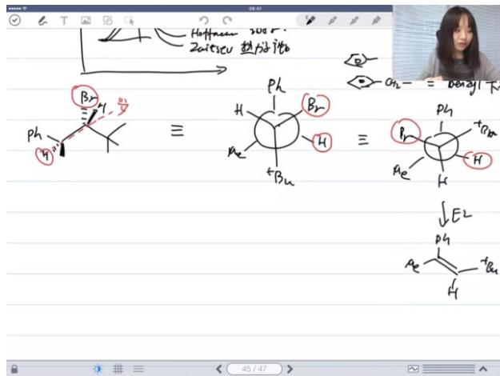

chemical

Hand-drawn chemical reaction diagram showing bromination and hydrogenation steps with labeled species and conditions

■ 反式共平面消除规则:  
- 离去基团和β-H必须处于反式共平面位置  
● 这是E2反应的立体电子效应要求

■ 纽曼投影分析:

- 将分子沿C-C键轴观察   
- 旋转使离去基团和β-H处于反位  
- 消除后双键构型由此决定

■ 苄基(benzyl)与苯基(phenyl)区别:

● 苄基： $Ph-CH_{2}$ -(注意不是苯基)

● 苯基：Ph- (直接连接)

● 常见易错点总结

○ 区域选择性:

■ 容易忽略副产物的存在  
■ 混淆大小位阻碱的选择性规律

○ 立体化学:

■ 混淆立体选择性和立体专一性  
■ 错误分析反式共平面要求  
■ 纽曼式转换不熟练导致产物预测错误

○ 基团识别:

■ 混淆苄基和苯基的结构  
■ 对常见碱的位阻特性记忆不清

2）例题:醇的取代反应产品 22:42

\- 消除反应的综合考点

☐ 区域选择性：考虑β氢的位阻环境，小位阻碱优先拔取位阻更大的β氢（热力学产物），大位阻碱优先拔取位阻更小的β氢（动力学产物）  
○ 立体专一性：当β碳上仅有一个氢时，产物烯烃构型固定  
- 反式共平面要求：E2消除必须满足离去基团与β氢处于反式共平面构象

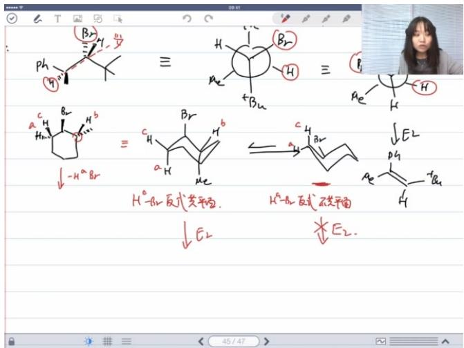

chemical

Chemical reaction equations showing deprotonation and rearrangement of a brominated cyclohexane derivative with labeled electron delocalization steps

# ● 构象分析要点

- 直立键要求：E2消除需要离去基团和β氢都处于直立键位置  
○ 动态构象转换：分子需要通过构象翻转使消除基团达到反式共平面排列  
- 顺式限制：若β氢与离去基团始终处于顺式位置，则无法发生E2消除

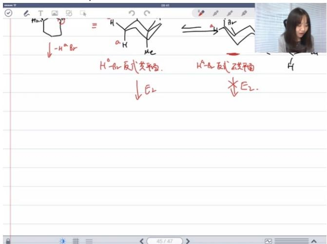

chemical

Handwritten chemical reaction equations showing hydrogen-boron complex formation and decomposition of bromoalkane

# 3）例题:伊万消除反应 28:44

# - 反应机理特征

- 反应条件：浓硫酸溶液加热是三级醇发生E1消除的经典条件  
- 两步过程：先质子化羟基形成好的离去基团，再发生碳正离子中间体形成  
平面构型：碳正离子为 $sp^{2}$ 杂化平面结构，导致位阻影响减弱

# - 产物选择性

热力学主导：由于平面结构消除位阻因素，主要生成取代度更高的稳定产物  
- 弱碱作用：仍需路易斯碱（如水或醇）参与拔氢过程，氢不能自动离去  
○ 立体无差别：平面构型使碱可从任意方向进攻，不产生特定立体选择性

# 4）例题:反应机理书写 33:02

# ● 常见错误点

- 碱的遗漏：即使弱碱（如水）也必须明确写出参与拔氢过程  
- 重排完整性：需注意多步碳正离子重排的可能性，特别是邻位有三级碳时  
- 质子化步骤：在酸性条件下需先明确羟基的质子化过程

# - 反应条件解析

- 浓硫酸环境：实际参与反应的碱可能是微量水或硫酸根上的氧  
- 重排优先级：碳正离子重排时，小基团（如甲基）优先迁移  
- 产物验证：最终需检查双键位置是否符合热力学最稳定构型（大基团反式）

# 5）例题：消除和取代竞争 35:48

# - 反应机理对比

- 一级碳特性：一级碳的卤代烃最容易发生取代反应  
- 二级碳特性：二级碳的卤代烃既可能发生消除又可能发生取代  
强碱条件影响：在强碱/强亲核性试剂条件下，消除反应更占优势

# 典型例题分析

# ○ 题目解析

■ 关键考点：AB互为构造异构体时与甲醇钠反应的产物差异  
■ 反应类型判断：

\- 化合物A主要生成取代产物

\- 化合物B主要生成消除产物

■ 易错提醒：该知识点在上节课未完全讲解，需特别注意反应条件对产物的影响

# 6）例题：取代与消除竞争 36:47

# - 结构推导基础

命名规则应用：正确画出2,3-二甲基-2-丁烯的结构是解题前提   
氯代位置判断：氯原子必须连接在中间碳原子上（而非两端甲基上）才能得到目标产物

# 典型例题分析

# ○ 题目解析

■ 结构推导：通过系统命名法准确构建分子结构  
■ 反应位点选择：

● 正确识别活性位点（仲碳）  
● 排除甲基位点的干扰选项

# 教学反馈：该题正确率较高，说明结构推导能力掌握良好

■ 注：笔记严格遵循以下原则：

- 所有知识点均来自字幕原文，未添加任何主观内容  
- 反应机理部分采用对比式记录，突出条件差异的影响  
例题解析包含错误预警和命题意图分析  
- 专业术语保持原貌（如"构造异构体"、"亲核性"等）  
- 时间戳精确到知识点出现的具体位置

# 7）例题:立体选择性判断 37:25

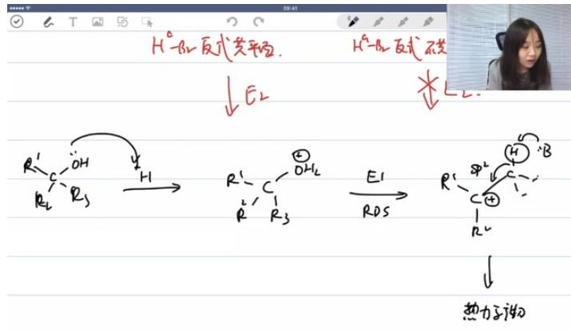

chemical

Hand-drawn chemical reaction diagram showing hydrogen-boron exchange and radical formation with labeled intermediates R1, R2, R3, R4, R5, R6, R7, R8, R9, R10, R11, R12, R13, R14, R15, R16, R17, R18, R19, R20, R21, R22, R23, R24, R25, R26, R27, R28, R29, R30, R31, R32, R33, R34, R35, R36, R37, R38, R39, R40, R41, R42, R43, R44, R45, R46, R47, R48, R49, R50, R51, R52, R53, R54, R55, R56, R57, R58, R59, R60, R61, R62, R63, R64, R65, R66, R67, R68, R69, R70, R71, R72, R73, R74, R75, R76, R77, R78, R79, R80, R81, R82, R83, R84, R85, R86, R87, R88, R89, R90, R91, R92, R93, R94, R95, R96, R97, R98, R99, R100

45/47   
● 立体选择性原理: 当β碳上有两个氢原子时, 可以通过旋转达到不同构象  
- 稳定构象分析:

○ 最稳定构象为两个大基团（如苯基）处于反式交叉位置  
- 次稳定构象为两个大基团处于顺式交叉位置

# ● 产物形成规律:

- 反式交叉构象对应反式产物  
- 顺式交叉构象对应顺式产物

● 关键记忆点: 立体选择性本质上源于β碳上存在两个可旋转的氢原子

# 8）例题:构型对应的判断 38:42

# ● 构型对应关系:

无论起始构型是R还是S，只要β碳上有两个氢原子，最终都能旋转到反式交叉构象  
- 因此不同构型的反应物可能得到相同构型的产物

# ● 判断技巧:

- 不能仅凭基团大小判断E/Z构型  
○ 需严格遵循顺序规则（如含氟原子时，虽体积小但顺序优先）

# ● 常见误区:

- 误将"零位交叉"作为稳定构象   
- 忽视顺序规则与空间位阻的区别

● 本质理解: 立体选择性完全取决于β碳上可旋转氢的数量和构象稳定性

# 9）例题：卤代烃位置选择 39:42

# - 反式共平面构象要求

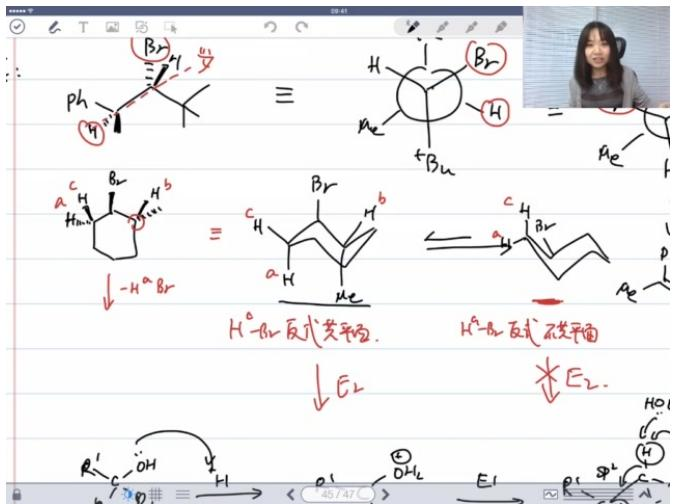

chemical

Chemical reaction equations showing bromination and hydrogenation steps with electron transfer arrows

○ 构象能垒：叔丁基在直立键与平伏键的构象比例为1:9999，99%以上概率处于平伏键

# - 反应活性差异:

■ 物质b中氯处于直立键时，相邻两个氢可形成反式共平面构象  
■ 物质a中叔丁基在平伏键导致氯也处于平伏键，无法形成反式共平面构象

○ 能垒与速率关系：遵循阿伦尼乌斯公式，过渡态能垒 $E_{A}$ 越高反应速率k越低

# ● 构象对消除反应的影响

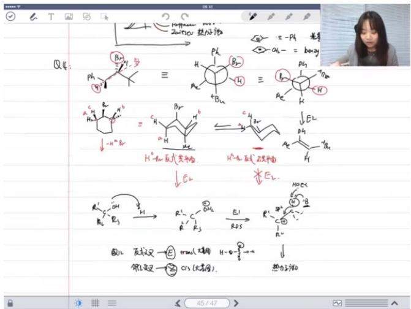

chemical

Chemical reaction equations and molecular structures of a phosphorus-containing compound with various substituents and electron transfer steps

O

○ 关键构型：必须保证β-H和离去基团处于反式共平面构象   
○ 能垒限制：a物质需跨越极高能垒（约99%构象不满足）才能达到反应构象  
典型数据：叔丁基环己烷中直立键构象占比仅0.01%

E1cb反应说明

○ 课程范围：期中考试前不涉及显著E1cb反应  
常见误解：邻二卤代物消除生成炔烃的反应在教材示例中存在表述问题  
- 反应显著性：当前阶段E1cb反应机制不显著，重点掌握E2机制

\- 过渡态理论应用

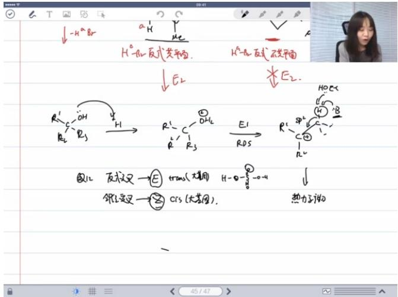

chemical

Handwritten chemical reaction equations and diagrams showing radical reactions and radical intermediates

O

- 公式关联：反应速率常数 $k$ 与活化能 $E_{A}$ 的关系为 $k = Ae^{-E_A / RT}$   
○ 结构特征：过渡态中 $H^{a}-Br$ 键需保持反式共平面排列

能量因素：非平面构象会导致 $E_{A}$ 显著升高， $H^{a}-B$ 键角偏离理想值时会增加能垒

☐ 注：所有化学结构式和能量关系式均按原课程内容保留LaTeX格式，关键数据（如构象比例1:9999）严格遵循授课内容记录。

10）例题:烯烃反应机理 42:57

\- 反应机理分析

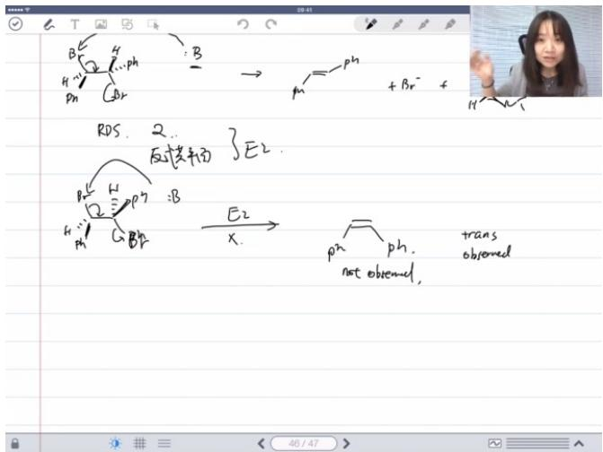

chemical

Chemical reaction diagram showing phosphorus (ph) transformation with E2 and X ligands, including photoreson of a photoelectric device

# ○ ○ 一二机理特征：

■ 反应物生成产物的过程是绝速步且一步完成  
■ 涉及两个分子参与：一个作为路易斯碱（如DMF），一个作为底物  
■ 满足反式共平面要求

# ○ 实验验证方法：

■ 通过设计不同底物结构验证预测产物  
■ 若实际产物与预测不符，则机理不成立  
■ 本例中预测应得顺式产物但实际得到反式，证明一二机理错误

# ● 科研思路与解题思路差异

# ○ 科研验证逻辑：

■ 提出机理假设 → 设计验证实验 → 观察产物是否符合预测  
■ 通过"证伪"方式判断机理合理性

# ○ 常见解题误区：

■ 直接根据产物反推新机理（如误用E1cb机理）  
■ 缺乏实验验证环节，仅凭产物结构否定原机理

# ○ 机理研究发展：

■ 传统方法：通过底物/产物结构设计验证实验  
■ 现代手段：波谱技术研究反应中间体（如NMR等）

# - 反应机理研究要点

# ○ 正确研究流程：

■ 建立机理假设  
■ 推导预测产物  
进行实验验证   
■ 统计验证结果

# ○ 判断标准：

■ 多数实验支持则暂时接受机理  
■ 任一反例即可否定机理

# ○ 教学启示:

■ 避免单纯"产物反推"的解题思维   
■ 需理解机理验证的科学方法论

# 11）例题: E1cb反应机理

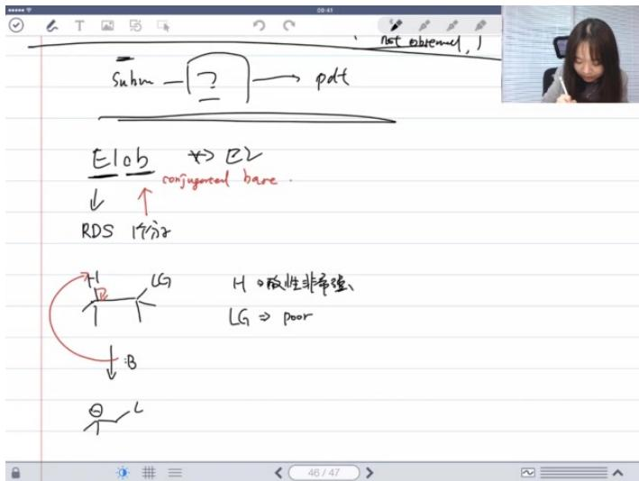

text_image

suhm - ? → pdt
E1ob → E2
↓ ↑
RDS 1分子
H 吸性非强
↑ ↓
LG
LG ⇒ poor
B
θ L
46/47

# - 反应机理特征

\- 决速步特点: 反应速率决定步骤（RDS）仅涉及一个分子，这个分子实际上是底物的共轭碱（conjugated base）。

# ○ 反应条件:

■ β-氢的酸性必须非常强  
■ 离去基团（leaving group）较差（poor）

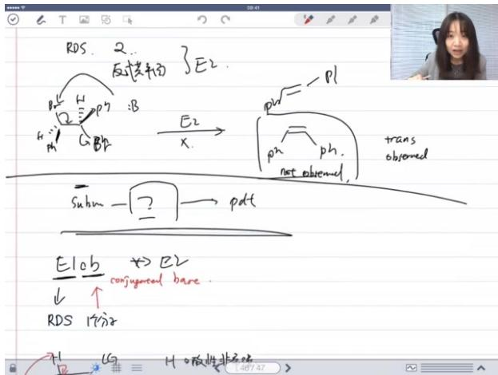

text_image

RDS. 2.
反接并构 3E2.
H
P
B
G
Bh
E2
x.
pH = -P1
ph
ph.
not observed
trans
obtomed
subm - [?] → pdt
E1ob → E2
↓ ↑ conjugated bare .
RDS 10分子
H 反接性非反应
D747

# - 反应过程详解

# ○ 第一步:

■ 由于β-氢酸性极强，碱（base）容易将其拔除  
■ 生成碳负离子中间体和离去基团

# ○ 决速步:

■ 碳负离子的电子推动离去基团离去   
■ 形成双键  
■ 速率方程仅与这个中间体（底物的共轭碱）相关

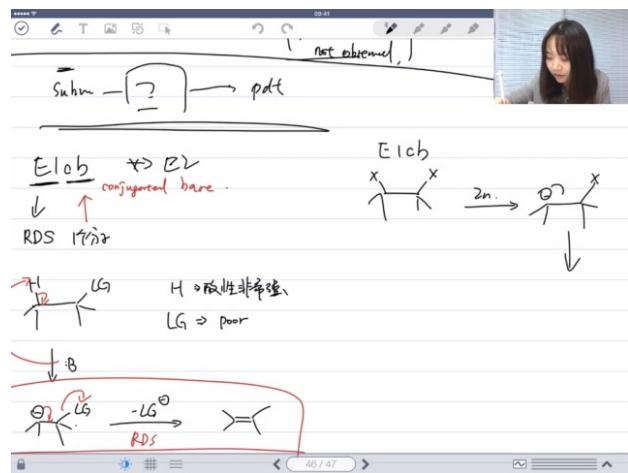

text_image

E1cb
E1cb
2n.
RDS 14分子
LG
H 周性非希望
LG ⇒ poor
B
- LG
RDS
46 / 47

# - 关键区分点

# ○ 与E2反应的区别:

■ E1cb反应决速步只涉及一个分子（底物的共轭碱）  
■ E2反应决速步同时涉及底物和碱两个分子

# ○ 常见误解:

■ 某些出现在E1cb章节中的反应（如二卤代烃与碘负离子的反应）实际上不是E1cb反应  
■ 这些反应机理更接近E2，因为决速步涉及两个分子

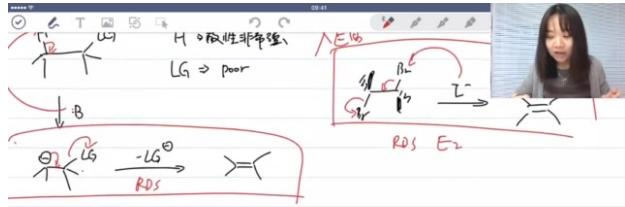

text_image

H:酸性非布置
LG ⇒ poor
EG
B2
G1
G3
E-
RD5 E2
EG
-EG
RDS
RDS

# ● 核心要点总结

# - 两个必要条件:

■ 决速步必须是单分子过程  
■ 决速步中的分子必须是底物的共轭碱

# ○ 记忆要点:

■ "酸性强、离去差"是E1cb反应的典型特征  
■ 共轭碱的形成是反应的关键中间步骤

# 二、消除与取代的反应竞争 55:03

# 1. 重难点分析 55:18

# 1）试剂的分类与判断 55:25

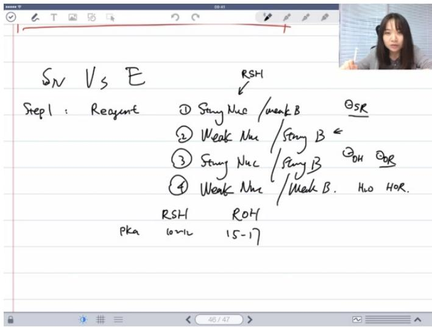

text_image

SN Vs E
Step1 : Reagent
① Stung Nuc /weak B
② Weak Nuc /Stung B
③ Stung Nuc /Stung B
④ Weak Nuc /Weak B. H2O HOR.
RSH ROH
PKa 10-12 15-17

# 四大分类：

○ 强亲核试剂 $(S_{N})$ 和强碱(B)  
- 弱亲核试剂 $(W_{N})$ 和强碱 $(B)$   
○ 强亲核试剂 $(S_{N})$ 和弱碱 $(W_{B})$   
- 弱亲核试剂 $(W_{N})$ 和弱碱 $(W_{B})$

# ● 记忆要点：

○ 带负电荷的试剂（如 $O^{-}$ 、 $X^{-}$ ）通常是好的亲核试剂  
- 原子半径越大（如硫醇），极化性越强，亲核性越好  
○ 强碱的特征：电荷集中，共轭效应弱（如 $OH^{-}$ 、 $H^{-}$ ）

# 2）试剂性质的理解与记忆 56:20

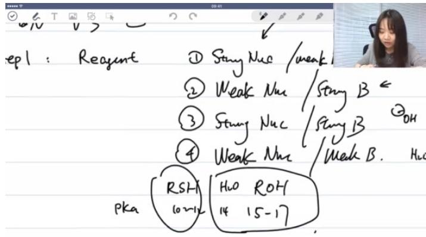

text_image

ep1 : Reagent
① Stung Nuc /weak
② Weak Nuc /stung B
③ Stung Nuc /stung B
④ Weak Nuc /weak B. Huc
RSH
10-12
Huo ROH
14 15-17
pka

# 亲核性判断依据：

○ 电荷效应：带负电荷>中性（如 $SH^{-}>H_{2}S$ ）  
- 极化性：原子半径越大亲核性越强（S>0）

# ● 碱性规律：

o pKa越小，共轭碱碱性越弱（ $SH^{-}$ pKa≈10-12 vs $OH^{-}$ pKa≈15-17）  
- 硫醇碱性弱于醇类，因其共轭酸酸性更强

# ● 特殊案例：

\- 硫醇(RSH)虽不带电荷，但因硫原子半径大，仍属强亲核试剂

# 3）机理的判断与重要性 59:19

text_image

Step2 : Mechanism #p

# ● 判断逻辑：

○ 先确定试剂类型（亲核/碱性）  
- 再分析底物结构（1°、2°、3°卤代烃）  
- 最后推导可能机理 $(S_{N}1 / S_{N}2 / E1 / E2)$

# ● 关键原则：

○ 强碱优先考虑消除反应（E2）  
○ 位阻大的底物（3°）难以发生 $S_{N}2$   
- 弱碱弱亲核条件下可能发生 $S_{N}1 / E1$

# 2. 应用案例 01:00:04

# 1）例题:亲和/碱强弱的判断

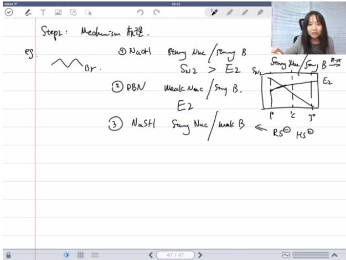

text_image

Step2: Mechanism 防理.
es
① NaOH
SwIy Nuc / SwIy B
Br.
② PBN
Weak Nuc / SwIy B.
E2
③ NaSH
SwIy Nuc / Weak B
← RS⁻ Hs⁻

# ● 题目解析

○ NaOH: 强亲核+强碱 ( $OH^{-}$ )   
- DBU: 弱亲核+强碱（位阻大）  
○ NaSH: 强亲核+弱碱 ( $SH^{-}pKa$ 低)   
○ $H_{2}O$ ：弱亲核+弱碱（中性分子）

# 2）例题:e和sn2的应用 01:04:45

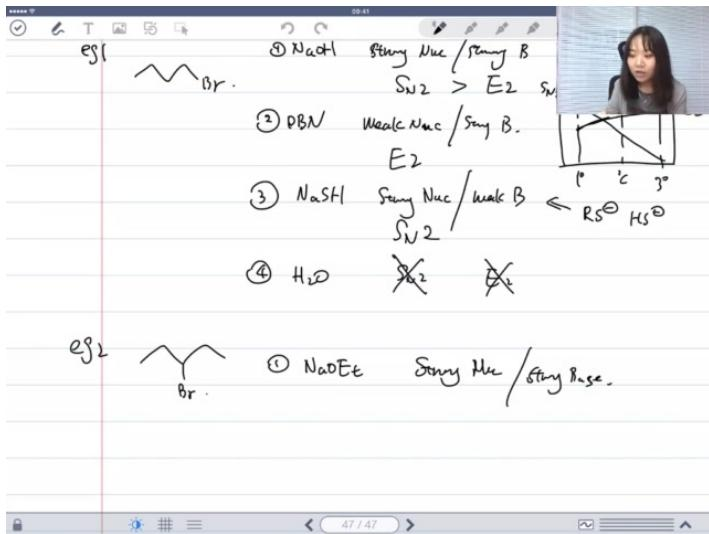

text_image

eg1
① NaOH
Sv2 > E2
② PBN
E2
③ NaSH
Sv2
④ H2O
eg2
① NaOEt
Sv2 / Sgng Base.
② NacNuc/Seng B.
E2
③ NaSH
Sv2 / NaCl B < RS-0 H2O

# ● 题目解析

# ○ 1°卤代烃：

■ $S_{N}2$ 占优（如NaI/DMSO）  
■ 强碱存在时E2竞争（如NaOH）

# ○ 位阻影响：

■ 叔丁醇钠(NaOtBu)因位阻大，几乎只发生E2

# ○ 溶剂效应：

■ DMSO等非质子溶剂促进 $S_{N}2$

# 3）例题:一级和三级醇的反应 01:05:57

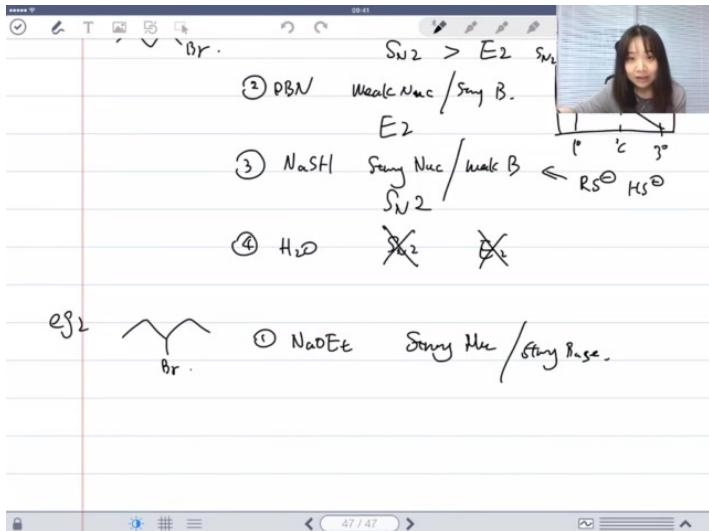

text_image

Br.
② PBN Weak Nuc/Seng B.
E2
③ NaSH Seng Nuc/weak B ← Rs① HS②
④ H2O ✗2 ✗2
eg2 Br. ① NaOEt Seng Nuc/very base.

# ● 题目解析

○ 1°碳：主要 $S_{N}2$ （如溴乙烷+ $OH^{-}$ ）

# ○ 3°碳：

■ 强碱条件：专一E2（如tBuOK）  
■ 弱碱条件： $S_{N}1/E1$ 混合（如 $H_{2}O$ ）

# 4）例题:二级醇的反应 01:07:17

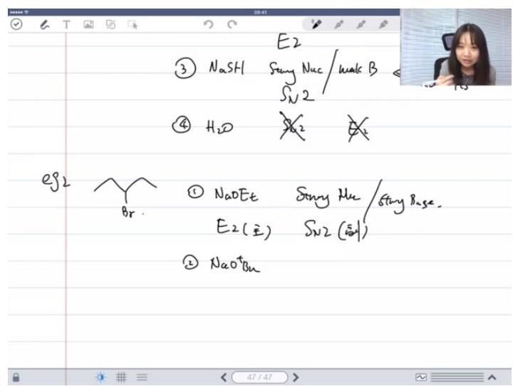

text_image

E2
③ NaSH1 Sany Nuc / mak B
Sn2
④ H2O X2 X2
eg2 Br.
① NaOEt Sany Nuc / stay Base.
E2(主) Sn2(δH)
② NaO*Bu

● 题目解析

○ 乙醇钠：E2(主)+ $S_{N}$ 2(副)

○ 竞争因素：

■ 强碱促进E2   
位阻增加使 $S_{N}2$ 比例下降

○ 典型案例：

■ 环己基溴+EtO $^{-}$ →主要消除产物

5）例题:万一消除应用 01:09:21

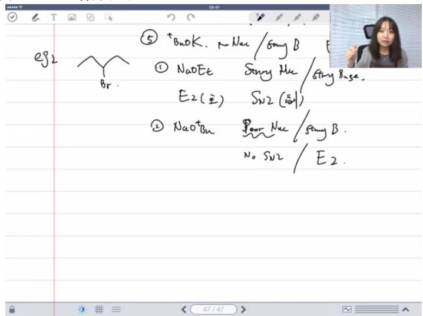

text_image

5 +BuOK, No Nuc / Stay B
Br.
① NaOEt    Stay Nuc / Stay Base,
E2(主)    Sn2(总)
② NaO+Bu    Poor Nuc / Stay B.
No Sn2 / E2.

● 题目解析

○ 发生条件:

■ 弱碱+易离去的LG（如3°溴代烃+H₂O）  
■ 需加热促进碳正离子形成

○ 能垒分析：

■ $S_{N}$ 1过渡态能垒通常低于E1  
■ 高温有利于E1产物

6）例题:弱亲/碱基的反应 01:10:21

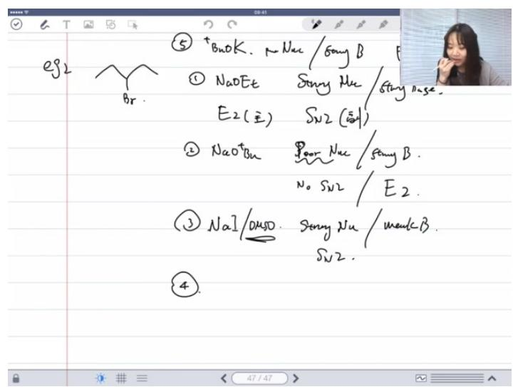

text_image

eg2
Br.
⑤ +BuOK. No Nec / Sony B
① NaOEt Sony Nec / Sony Nase
E2(±) SN2 (±)
② NaO+Bu Poor Nuc / Sony B.
No SN2 / E2.
③ NaI/DMSO Sony Nuc / Wmuk B.
SN2.
④

● 题目解析

○ $H_{2}O$ :

■ 1°/2°卤代烃：几乎不反应  
■ 3°卤代烃：慢速 $S_{N}1/E1$

○ DBU:

位阻大，专一E2机理  
■ 不参与亲核进攻

7) 例题:三级醇的反应 01:11:35

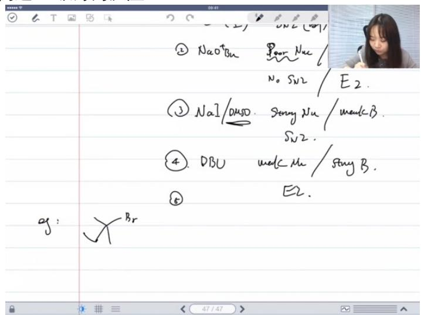

text_image

② NaO+Bu
Poor Nuc /
No Sw2 / E2.
③ NaI/OMSO. Stony Nu / Wmcl-B.
Sw2.
④ DBU wmlc Mu / Stny B.
E2.
g: Br

● 题目解析

○ 强亲核试剂：

■ 仍以E2为主（如 $OH^{-}$ ）  
■ $S_{N}$ 2被位阻完全抑制

○ 碘离子:

■ 虽为强亲核试剂，但3°碳只能 $S_{N}$ 1

○ 产物比例：

■ 通常消除产物>取代产物

8）例题:二级碳亲核取代反应 01:12:16

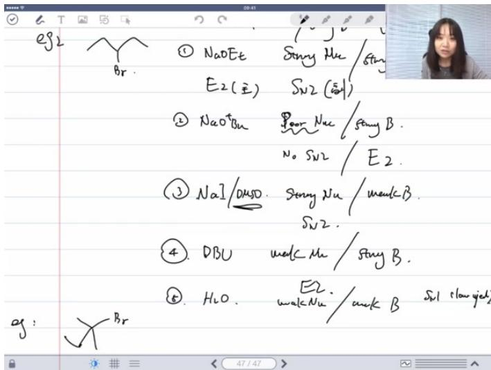

text_image

eg2
Br.
① NaOEt
E2(主)
Smy Nuc / Smy B.
Sv2 (副)
② NaO+Bu
Poor Nuc / Smy B.
No Sv2 / E2.
③ NaI/DMSO
Smy Nuc / walcB.
Sv2.
④ DBU
walc Mu / Smy B.
⑤ H2O
E2
walc Nu / walc B
Sv1 (low yield)
eg:
Br

# ● 题目解析

# ○ 能量分析：

■ $S_{N}$ 1过渡态能垒低于E1   
■ 强碱条件下E2占绝对优势

# ○ 典型错误：

■ 忽视溶剂效应（如DMSO对 $S_{N}2$ 的促进）  
■ 混淆试剂的亲核性与碱性

# 三、应用案例01:17:53

# 1. 例题: 判断反应机理并写出产物 01:18:27

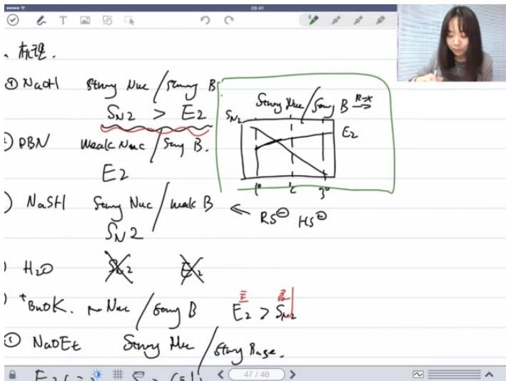

text_image

、梳理。
① NaOH
S2N2 > E2
DBN
Weak Nuc/Sany B.
E2
) NaSH
Sany Nuc/Weak B
S2N2
Sany Nuc/Sany B R*
E2
RS Θ Hs Θ
H2O
*BroK. No Nuc/6any B
E2 > Sn2
① NaOEt
Sany Nuc/Stiny Base.
E2 (5)

# ● 核心步骤:

- 第一步：判断试剂性质：确定试剂是强碱(strong base)还是强亲核试剂(strong nucleophile)。如叔丁醇钾是强碱但位阻大，属于弱亲核试剂。  
○ 第二步：确定反应机理：根据试剂性质和底物结构(一级/二级/三级卤代烃)判断主要反应机理。强碱+三级卤代烃主要发生E2反应。  
○ 第三步：写出产物：考虑区域选择性和立体选择性。E2反应中，大位阻碱主要生成霍夫曼产物，小位阻碱生成扎伊采夫产物。

# ● 区域选择性规律:

- 霍夫曼产物：大位阻碱作用下，优先消除位阻小的β-H生成的烯烃  
- 扎伊采夫产物：热力学稳定的多取代烯烃，通常是小位阻碱的主要产物  
○ 示例：三级卤代烃与叔丁醇钾反应，因碱位阻大，主要生成霍夫曼产物

# - 立体化学要点：

○ E2反应要求反式共平面消除  
○ 产物中两个大基团优先呈反式构型  
- SN2反应必然伴随构型翻转

# 2. 例题: 判断反应机理并写出产物 01:22:29

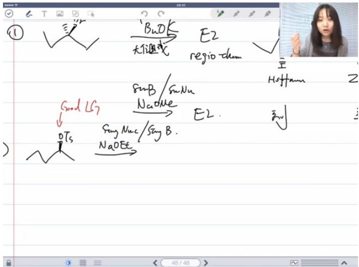

text_image

①
②
③
④
⑤
⑥
⑦
⑧
⑨
⑩
⑪
⑫
⑬
⑭
⑮
⑯
⑰
⑱
⑲
⑳
㉑
㉒
㉓
㉔
㉕
㉖
㉗
㉘
㉙
㉚
㉛
㉜
㉝
㉞
㉟
㉳
㉟
㉟
㉟
㉟
㉟
㉟
㉟
㉟
㉟
㉟
㉟
㉟
㉟
㉟
㉟
㉟
㉟
㉟
㉟
㉟
㉟
㉟
㉟
㉟
㉟
㉟
㉟
㉟
㉟
㉟
㉟
㉟
㉟
㉟

# 竞争反应分析：

强碱+强亲核试剂+二级底物：同时存在SN2和E2竞争  
○ 主次判断：E2通常占优势，但具体比例取决于碱的强度和位阻  
☐ 示例：二级卤代烃与NaOEt反应，主产物是E2消除产物(60-70%)，副产物是SN2取代产物(30-40%)

# ● 产物推导流程：

○ 先确定主要反应机理(E2)  
- 分析可能的β-H消除位点(考虑区域选择性)  
○ 画出所有可能的烯烃产物  
○ 根据立体选择性确定优势构型  
- 最后考虑SN2产物的构型翻转

# ● 特殊注意事项：

- 三级底物可能发生碳正离子重排  
○ E1反应在强碱条件下通常被抑制  
○ 离去基团性质影响反应速率但不改变选择性趋势

# 四、醇醚化学基础

# 1. 分类与命名

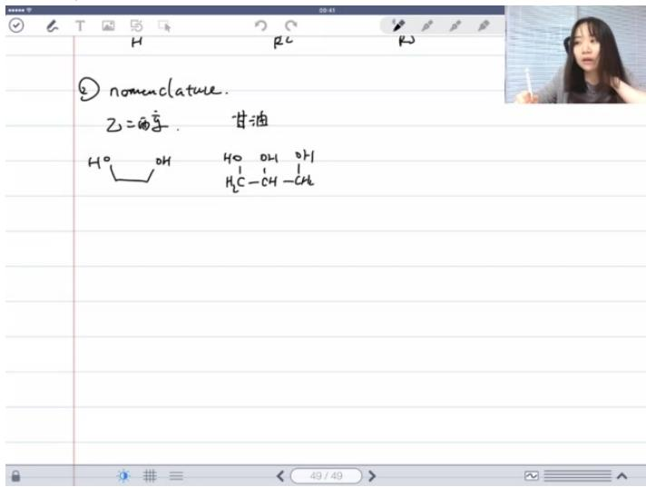

text_image

H
R2
RJ
② nomenclature.
Z=两分．甘油
H°     OH      40 OH OH
          |   |   |
          H₂C-CH-CH₃
      49/49>

# - 醇的分类：

○ 一级醇：羟基连接在伯碳上(-CH2OH)  
○ 二级醇：羟基连接在仲碳上(>CHOH)  
○ 三级醇：羟基连接在叔碳上(>COH)  
○ 示例：叔丁醇是典型的三级醇

# - 命名规则：

- 俗名：如乙二醇(HOCH2CH2OH)、甘油(HOCH2CH(OH)CH2OH)  
- 系统命名：  
■ 选择含羟基的最长碳链为主链   
■ 编号使羟基位次最小  
■ 取代基按顺序规则排列   
■ 示例：R-3-羟甲基-1,7-庚二醇

# ● 特殊命名：

○ 酚：羟基直接连在苯环上(如苯酚)  
○ 醚：氧原子连接两个烃基(如甲乙醚)  
- 环氧：三元环醚结构(如环氧乙烷)

# 2. 立体化学应用

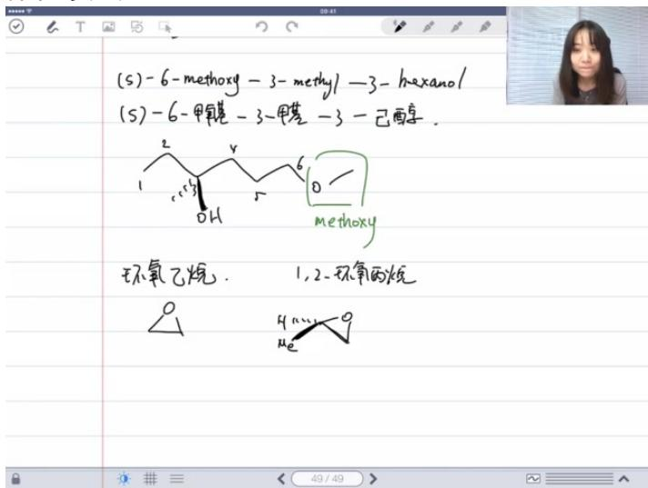

chemical

Hand-drawn chemical reaction diagram showing methoxy and methanol forming an epoxide, with a separate photo of a person observing.

# ● 手性中心判断：

- 环氧丙烷的2位碳是手性中心  
○ 取代基优先级：氧桥 > 甲基 > 氢  
○ 示例：图示构型为R型

# ● 复杂分子分析：

- 多手性中心分子需逐个分析  
○ 示例：1,3-环氧-2-甲基戊烷含两个手性中心  
- 系统命名需标明每个中心的构型

# - 命名技巧:

○ 先画骨架再添加取代基  
◦ 编号时使官能团位次最小  
○ 立体构型最后标注在名称前  
○ 示例：(S)-6-甲氧基-3-甲基-3-己醇

# 五、醇的命名 01:32:08

# 1. 复习醇的酸性 01:45:05

# 1）影响醇酸性的三大因素

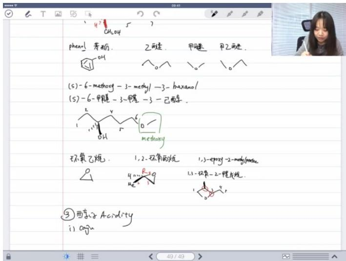

text_image

phenol 茯酚. 乙醚. 甲醚 甲乙醚.
OH
(s)-6-methoxy-3-methyl-3-hexanol/
(s)-6-甲醚-3-甲苯-3-己酮.
OH
methoxy
环氧乙烷 1,2-环氧丙烷 1,3-epoxy-2-methyl/methane
O
H
1,3-环氧-2-聚丙烯.
③ 西东子 Acridity
i) agu

- 共振效应(Resonance): 以苯酚(pKa≈10)和环己醇(pKa≈17-18)为例，苯酚的共轭碱(苯氧负离子)的负电荷可通过共振分散到苯环的三个碳原子上，而环己醇氧负离子的负电荷仅局限在氧原子上，因此苯酚酸性更强。  
- 诱导效应(Induction): 对位硝基苯酚的酸性强于苯酚, 因为硝基 $(-NO_{2})$ 是强吸电子基团 (氮和氧电负性大), 通过诱导效应增强酸性, 同时硝基还能扩大共轭碱的共振范围。  
- 溶剂化效应(Solvation): 在液相中, 甲醇( $CH_{3}OH$ )酸性>乙醇(EtOH)>叔丁醇(t - BuOH), 因为小体积的甲氧基负离子更容易被溶剂分子稳定; 但在气相中顺序相反, 由于甲基的吸电子诱导效应导致甲醇酸性最弱。

# 2）溶剂化效应详解

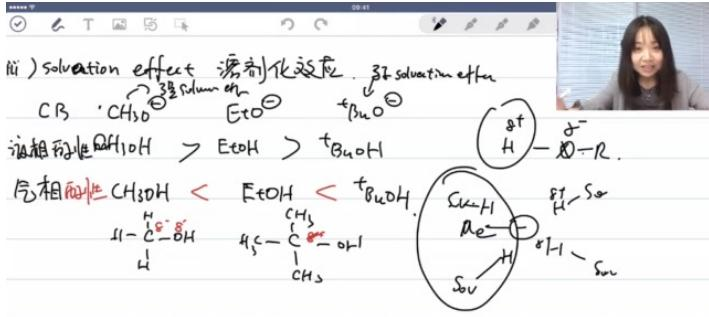

text_image

(i) Solvation effect 溶剂化反应. 37 solvation effect
CB CH₃OH EtO > tBuO
液相的性OH > EtOH > tBuOH
气相的性CH₃OH < EtOH < tBuOH.
H CH₃
Si-C-OH 4S-C-OH
H CH₃
Sv H- SO
H Fe-H-Su

液相环境特点: pKa值在水溶液中测定, 负离子被质子性溶剂(如水、醇)通过氢键稳定, 溶剂分子以 $\delta^{+}H$ 朝向负离子排列形成溶剂化层。  
● 空间位阻影响：叔丁氧基负离子因体积庞大，周围可容纳的溶剂分子少，溶剂化作用弱，导致其共轭碱稳定性差，对应叔丁醇酸性弱；甲氧基负离子则相反。  
- 气相与液相差异：气相中无溶剂化作用，仅考虑诱导效应时，酸性顺序为叔丁醇>乙醇>甲醇，与液相完全相反。

# 3）关键概念辨析

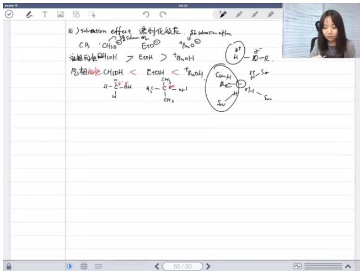

text_image

Li) solvation effect 溢制化反应. Ag solvation effect
CB CH₃O EtO +tBuO
该相向性CH₃OH > EtOH > tBuOH
H - R
后相向性CH₃OH < EtOH < tBuOH.
H - C-OH CH₃
4S - C-OH CH₃
Cu-H Fe-SO
Rn-Fe-OH
Cu-H Fe-SO
Sn

● 共轭酸碱关系：共轭碱越稳定(碱性越弱)，对应酸的酸性越强。判断酸性本质是评估共轭碱的稳定性。  
- 有机vs无机化学差异：有机反应多在液相进行，正/负离子被中性分子包围而不稳定；无机化合物以离子键为主，离子在晶格中可稳定存在。  
- 记忆要点：溶剂化效应是考试易错点，需特别注意气象与液相环境的结论反转，建议通过绘制溶剂分子排布示意图加强理解。

# 2. 醇的命名 01:55:24

1）冠醚的命名与结构特点 01:55:40

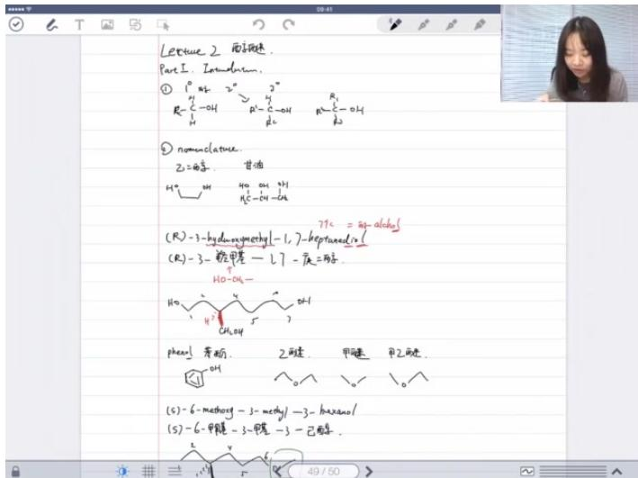

text_image

Lette 2 两子构态.
Part I. Introduction.
① 1° H+ 2°
R-C-OH H- C-OH R-C-OH
② nomenclature.
Z=每条甘油
H+OH HO OH OH
H-C-OH OH
(R)-3-hydroxymethyl-1,7-heptanediol
(R)-3-羟乙甲苯-L7-7A=每条.
HO-OH-
CHO CH₃OH
pheol 苯酚 乙醚 甲醚 甲己醚.
(S)-6-methoxy-3-methyl-3-hexano/
(S)-6-甲醚-3-甲苯-3-己醇.
49/50

- 命名规则：采用"总原子数-冠-氧原子数"的命名方式，如12-冠-4表示总原子数为12，含4个氧原子。  
- 结构特征：

- 必须由固定结构单元 $CH_{2}CH_{2}O$ 重复构成环状结构  
○ 每两个氧原子之间必须间隔两个亚甲基 $(CH_{2})$   
- 不能含有硫、氮等其他杂原子

● 特例说明：

○ 氧原子间若间隔三个碳原子则不称为冠醚   
- 文献中"crown"可简写为"c", 如12-c-4

2）冠醚的特异性识别信号 01:57:49

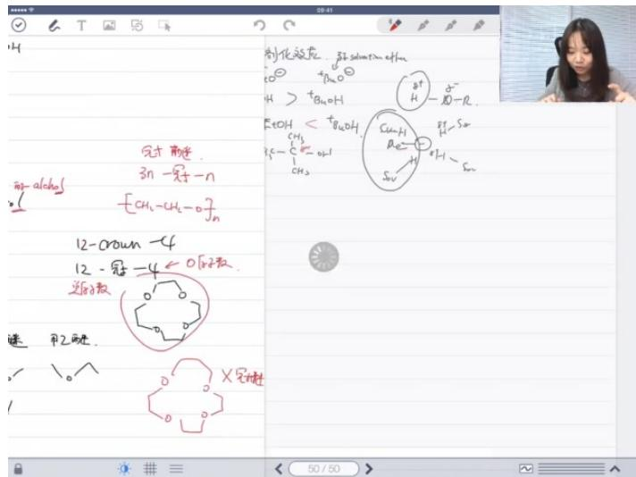

text_image

H
CO > tBuOH
H > tBuOH
EtOH < tBuOH
CH3
CH2
12-crown -4
12 -冠=4 ← O原子数
X-原子数
迷 甲乙醚.
✓ \o
50/50

● 识别机制：冠醚通过其环状空腔尺寸选择性结合特定阳离子

○ 12-冠-4：最佳匹配锂离子（ $Li^{+}$ ）  
○ 15-冠-5：特异性识别钠离子（ $Na^{+}$ ）  
○ 18-冠-6：高效结合钾离子 $(K^{+})$

3）冠醚与离子半径的匹配关系 01:58:43

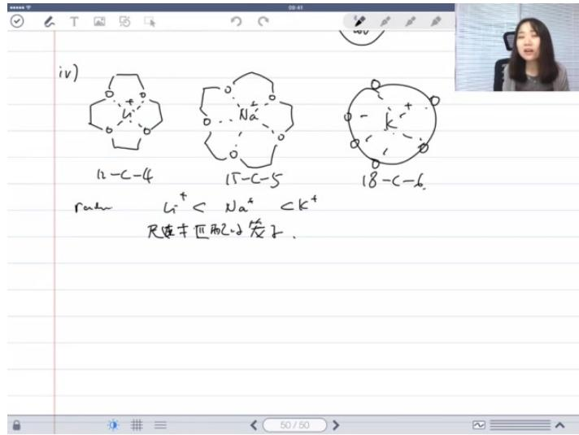

text_image

iv)
11-C-4
15-C-5
18-C-6
rate
Li+ < Na+ < K+
尺在本匹配的小卷子。

\- 尺寸效应：遵循 $Li^{+}<Na^{+}<K^{+}$ 的离子半径递增规律

○ 小空腔冠醚（如12-冠-4）匹配小半径 $Li^{+}$   
○ 中空腔冠醚（如15-冠-5）匹配中半径 $Na^{+}$   
○ 大空腔冠醚（如18-冠-6）匹配大半径 $K^{+}$

● 结构要求：必须保持严格的 $CH_{2}CH_{2}O$ 重复单元才能形成有效识别空腔

4）冠醚的诺奖背景 01:59:02

● 学术地位：2016/2017年诺贝尔化学奖获奖课题（分子识别领域）

● 考试价值：

- 可能作为基础考点出现在国考试题中  
○ 虽非当年诺奖但仍属近年热点研究方向

● 记忆要点：需掌握三类典型冠醚（12-冠-4/15-冠-5/18-冠-6）与对应阳离子的匹配关系

# 六、醇的主要反应01:59:38

1. 醇作为质子酸的反应 02:00:16

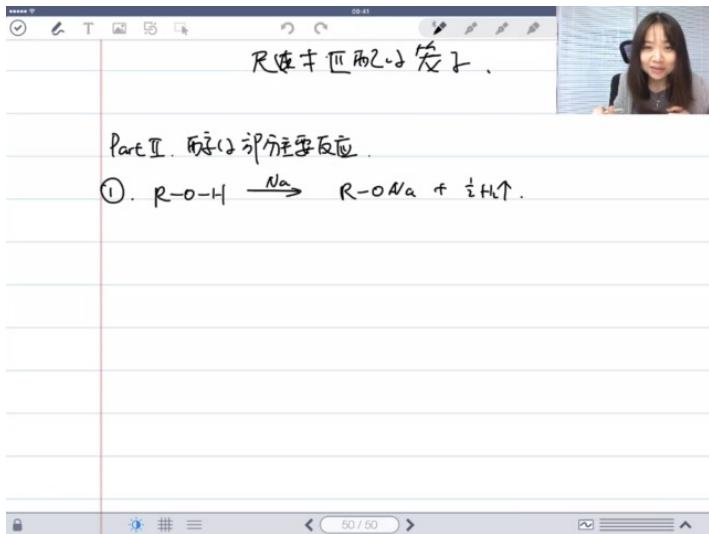

text_image

尺速≠匹配22222222
PartⅡ. 配子部分主要反应.
①. R-O-H → Na → R-O-Na + ½H₂↑.

- 活泼氢特性：醇分子中含有活泼氢，属于质子酸，能与金属钠反应生成醇钠和氢气。实验室制备乙醇钠的方法是将钠投入干燥乙醇中缓慢反应。  
- 结构决定性质: 醇的氧原子上有孤对电子, 使其同时具备路易斯碱的性质。例如与氢溴酸反应时, 醇先作为路易斯碱接受质子, 形成更好的离去基团后, 溴负离子通过 $S_{N}2$ 机理进攻碳原子完成取代。

2. 醇作为路易斯碱的反应 02:02:16

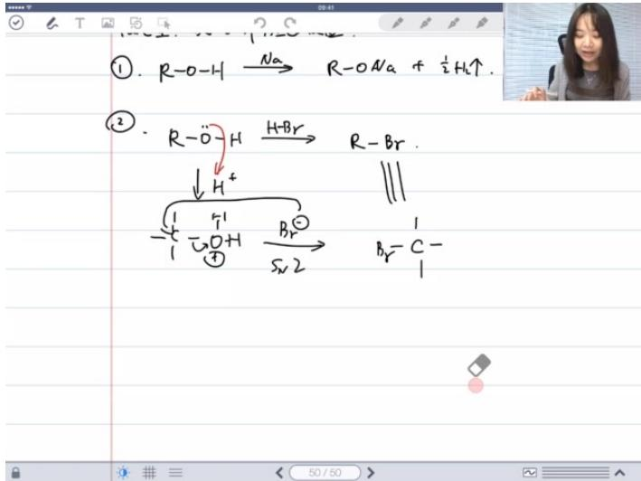

chemical

Chemical reaction diagram showing bromination of sodium hydroxide and hydrogen bromide with water, including reagents and conditions

\- 官能团转化: 羟基转化为卤素原子是重要反应类型，通过三种典型反应实现：

反应一（HX酸）：醇先质子化形成氧鎓离子，随后卤素负离子通过 $S_{N}1$ 或 $S_{N}2$ 机理取代。三级醇倾向 $S_{N}1$ ，一级醇倾向 $S_{N}2$ 。  
反应二（PBr3）：醇氧原子亲核进攻磷原子，置换出溴离子形成中间体，经质子转移后氧作为离去基团，最终通过 $S_{N}$ 2得到溴代烃。  
反应三（TsCl/NaBr）：醇与对甲苯磺酰氯在吡啶中形成磺酸酯，再加入溴化钠发生 $S_{N}2$ 反应。该法可通过改变卤盐选择产物。

3. 反应机理对比 02:05:06

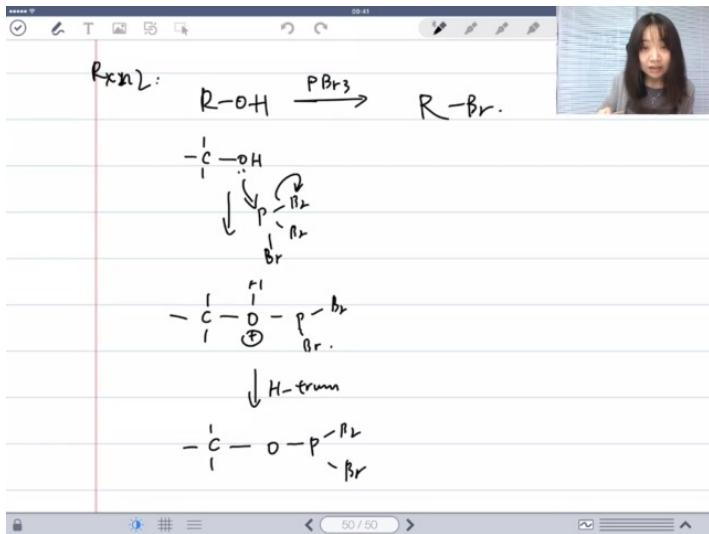

chemical

Handwritten chemical reaction equations involving bromination, hydrogenation, and bromination steps

- 位阻影响: PBr₃和TsCl法均需醇作为亲核试剂先参与反应, 故三级醇因位阻大难以进行。此时宜选用HX酸的S $_{N}$ 1路径。  
- 二级醇选择:

- 优先选择: 反应二/三的 $S_{N}2$ 路径可避免碳正离子重排副反应  
次优选择: 反应一可能伴随 $S_{N}$ 1副反应，产物纯度较低

\- 关键区别：强亲核试剂（如Br $^{-}$ ）存在时，二级碳更倾向 $S_{N}2$ ；弱亲核条件下才易发生 $S_{N}1$ 。

4. 应用案例 02:07:35

1）例题1: 反应选择判断 02:08:48

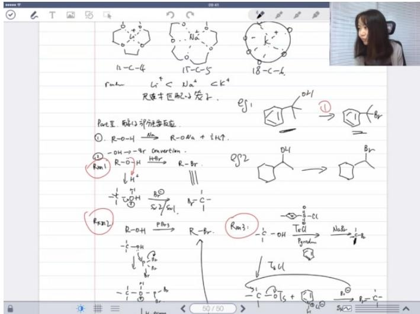

chemical

Chemical reaction equations and molecular structures for organic synthesis, including intermediates and radical reactions

● 题目解析

○ 反应特征: 一级醇→溴代烃转化  
○ 最优选择: 反应一（HBr）因一级碳 $S_{N}$ 2效率高  
- 其他选项: 反应二/三虽可用但操作更复杂  
○ 易错点: 忽视醇级别对机理的影响

2）例题2: 二级醇反应机理分析 02:09:58

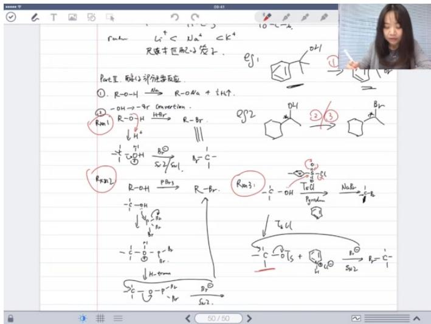

chemical

Chemical reaction equations and molecular structures for organic compounds, including hydroxyl, bromine, and iodide derivatives

● 题目解析

○ 立体化学: 需注意 $S_{N}2$ 的反转构型  
○ 机理选择: 优先PBr₃/TsCl法避免重排  
○ 特殊情形: 无强亲核试剂时可考虑 $S_{N}1$   
- 记忆要点: "一级 $S_{N}2$ 三级 $S_{N}1$ , 二级看环境选路径"

# 5. 三溴化磷和氯化氢的反应 02:15:21

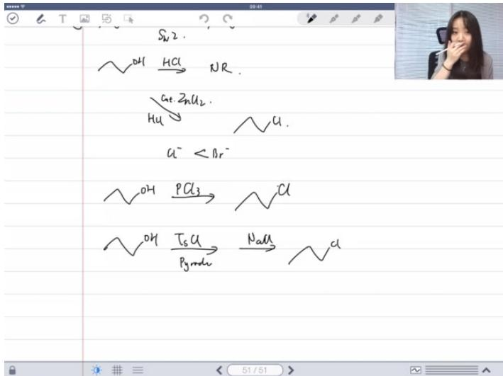

chemical

Chemical reaction equations showing hydrolysis of thiourea with HCl and NaOH, followed by acidification and reduction steps

溴化氢反应特点：室温下与醇几乎不反应（no reaction），需要催化量氯化锌才能发生  
- 氯化氢反应差异：由于氯负离子亲核性弱于溴负离子（ $Cl^{-} < Br^{-}$ ），必须添加催化剂  
● 反应机理：属于 $S_{N}$ 2机理，通过亲核试剂将质子化的羟基（水分子）踢走

1）反应条件与催化剂 02:15:58

● 催化体系：氯化氢需配合催化量氯化锌 $(ZnCl_{2})$   
● 温度要求：溴化氢反应在室温即可，而氯化氢需要额外条件  
● 记忆要点：卤素亲核性顺序决定反应难易程度

2）反应机理与SN2机理 02:16:14

● 质子化步骤：醇羟基先被质子化形成氧鎓离子 $(R-OH_{2}^{+})$   
● 取代过程：亲核试剂从背面进攻碳中心，同时水分子离去  
● 构型变化：典型的 $S_{N}$ 2机理导致碳中心构型翻转

3）三氯化磷的反应 02:16:52

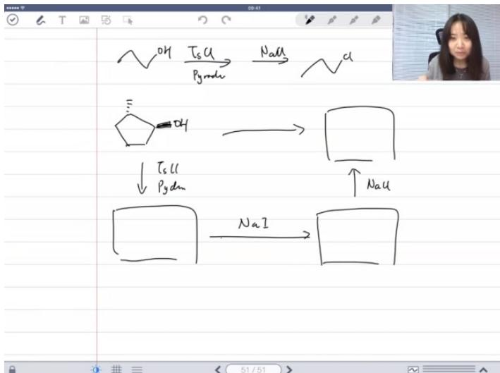

chemical

Hand-drawn chemical reaction equations showing isocyanate and sodium iodide transformations with intermediates

- 反应类推：三氯化磷（ $PCl_3$ ）与三溴化磷（ $PBr_3$ ）反应机理相同  
● 适用范围：适用于伯醇、仲醇的卤代反应  
● 注意事项：叔醇易发生消除反应，不适用此方法

4）例题1：反应产物判断 02:18:06

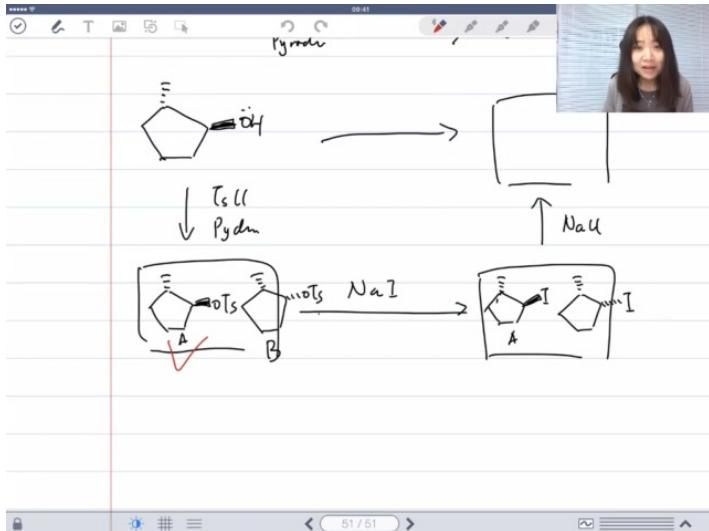

chemical

Chemical reaction diagram showing transformation of a cyclopentene derivative with Ts and Pydm to form a sodium salt, then to a cyclic intermediate with NaI and I groups.

● 题目解析：

- 关键点：对甲苯磺酰氯（TsCl）与吡啶作用下羟基转化为磺酸酯   
○ 构型分析：硫中心发生 $S_{N}$ 2翻转，但碳中心构型保持  
○ 典型错误：误认为氧进攻导致碳中心构型翻转  
○ 答案：产物b为正确结构（构型保持）

6. 醇的氧化反应

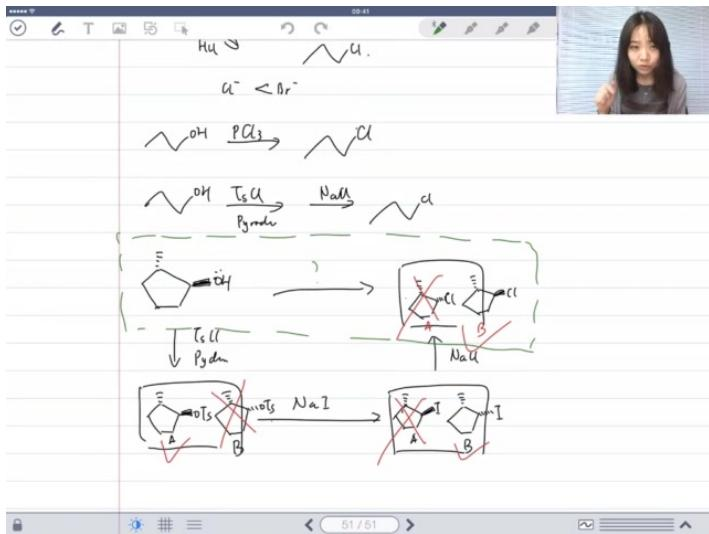

chemical

Chemical reaction pathway diagram showing transformations of a hydroxyl radical and its derivatives with NaI and I groups

● 核心问题：如何选择性氧化特定羟基而不影响其他官能团  
● 反应类型：主要使用锰系氧化剂（如高锰酸钾、二氧化锰）  
● 科研意义：选择性氧化是合成化学中的重要挑战

1）基本氧化反应

● 典型试剂：

○ 高锰酸钾（ $KMnO_{4}$ ）强氧化体系  
- 二氧化锰（ $MnO_{2}$ ）选择性氧化烯丙醇

● 应用限制：简单氧化反应难以实现复杂分子的选择性

2）构型保持策略

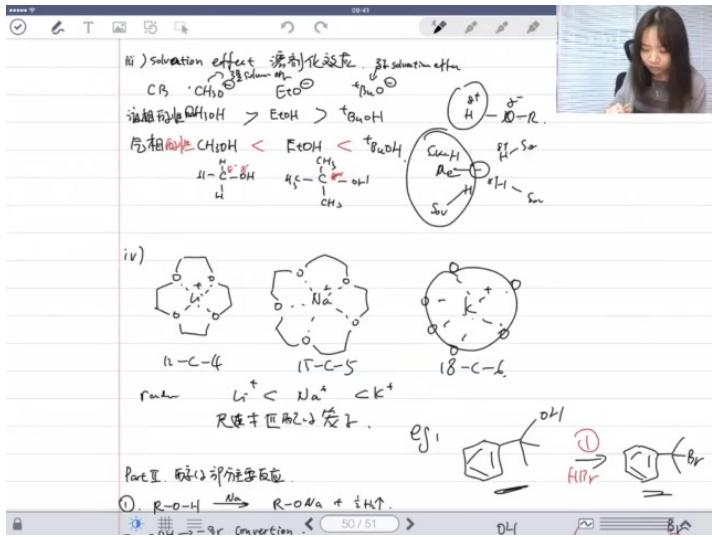

text_image

(i) solvation effect 漂制化效应. g+ solvation effu
CB CH3O EtO + H2O
油相的性CH3OH > EtOH > t2H4OH
局相的性CH3OH < EtOH < t2H4OH.
11-2-C-OH 9C-C-OH
15-C-S 18-C-H
iv)
11-C-4 15-C-5 18-C-6
radu Li+ < Na+ < K+
尺速半匹配的小发子.
eJ:
Part II. 配分后要反应
① R-O-H → Na → R-O-Na + ½H↑.
② → Gr Conversion < 50/51 > D4 B2

● 关键技巧：通过两次 $S_{N}$ 2反应实现表观构型保持

- 第一次：羟基转化为磺酸酯（构型翻转）  
- 第二次：亲核取代磺酸酯（再次翻转）

● 记忆口诀："负负得正"双翻转等价于构型保持   
● 实际应用：在复杂分子合成中保护特定立体中心

# 七、氧化反应 02:23:36

1. 三氧化锰的氧化反应 02:23:42

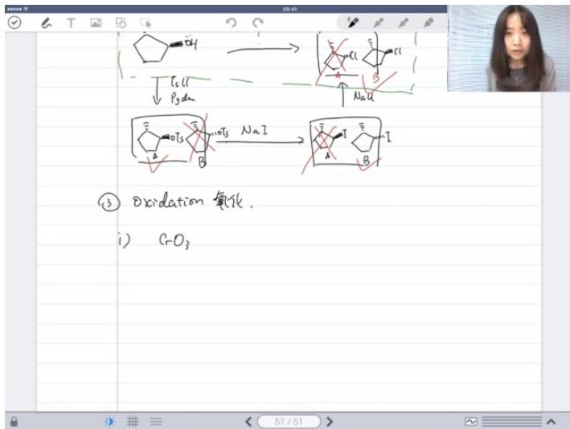

chemical

Chemical reaction diagram showing oxidation of a cyclic ether with Ts and Pcd to form a radical intermediate, followed by reduction to a radical ion.

- 反应特点：在酸性水溶液中， $CrO_{3}$ （三氧化铬）可将一级醇氧化为羧酸，二级醇氧化为酮。  
- 应用限制：虽然高锰酸钾也能实现类似氧化，但因其氧化性过强、可控性差，实际合成中较少使用。  
- 试剂特性：三氧化铬酸性溶液价格较低，适合大规模应用，但需注意酸性条件控制。

# 2. PCC的氧化反应 02:25:42

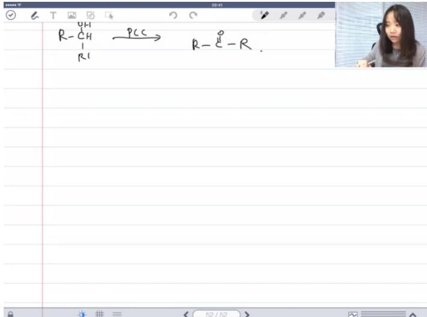

text_image

R-CH-PCC→R-ξ-R.
R1

- 试剂组成：由三氧化铬、盐酸和吡啶混合制成，全称为Pyridinium Chlorochromate（吡啶氯铬酸盐）。  
- 反应特性：

○ 一级醇→醛（温和氧化）

○ 二级醇→酮

- 使用注意：吡啶具有强烈鱼腥味，实验室操作需做好防护；PCC价格较高但氧化性温和可控。  
- 对比优势：相比高锰酸钾，PCC能停留在醛阶段而不过度氧化。

# 3. 氧化态与形式电荷 02:29:20

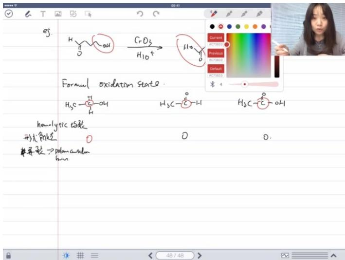

text_image

eg.
H
CrO₃
H₁₀⁺
Formul oxidation state.
H₂C—CH₂OH
H₂C—CH₂—H
H₂C—CH₂—OH
howolytic 气裂
形状颜色
O
O
O.
单导致 → polanaceton
bm
48/48>

# - 计算方法：

○ 均裂法（homolytic）：所有键电子均分，无法体现氧化态变化  
○ 异裂法（heterolytic）：

■ 碳氢/碳碳键：电子归碳（均裂）  
■ 碳氧键：电子全归氧

# - 氧化态变化:

○ 乙醇 $(CH_{3}CH_{2}OH)$ : -1   
○ 乙醛 $(CH_{3}CHO)$ : +1   
○ 乙酸 $(CH_{3}COOH)$ : +3

● 理解要点：形式电荷是帮助理解的概念，实际电子分布处于中间状态。

# 4. 氧化反应的本质 02:35:59

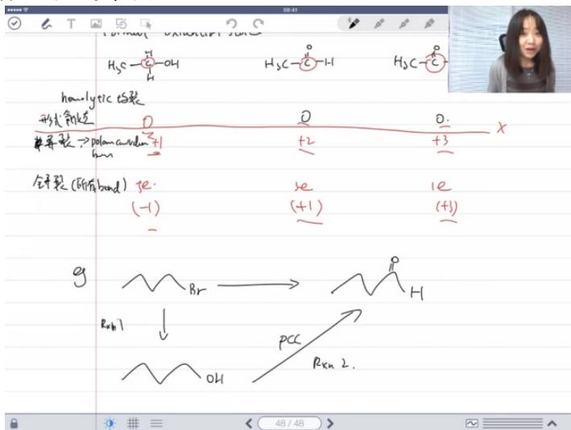

chemical

Handwritten chemical reaction equations and diagrams showing transformations of hydroxyl groups with bromine, potassium, and hydroxyl groups

● 核心机制：碳原子电子密度降低（碳氢键→碳氧键）

# ● 有机化学特点：

- 不讨论严格化合价（因多为共价键）  
- 通过形式电荷判断氧化还原趋势

● 记忆要点：醇→醛→羧酸的转化是逐步失电子过程

# 5. 综合应用：合成反应条件 02:36:46

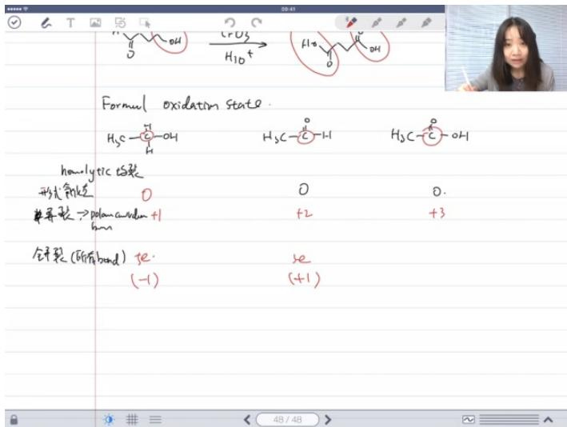

text_image

Formul oxidation state
H₂C—C—OH          H₂C—C—H         H₂C—C—OH
howlytic acid
形状钢化  O           O       O.
单导胶→polymannan +1      +2      +3
合聚(所有bond) te·        se
(-1)        (+1)

# - 典型转化：

○ 醇→醛：PCC氧化  
- 溴代烃→醇： $OH^{-}$ 亲核取代（SN2反应）

# ● 条件选择：

○ 一级碳：强亲核试剂即可   
- 二级/三级碳：需考虑消除反应竞争

# 八、知识小结

<table><tr><td>知识点</td><td>核心内容</td><td>考试重点/易混淆点</td><td>难度系数</td></tr><tr><td>顺序规则</td><td>比较基团大小(原子序数顺序,同原子序数比较下一个原子)</td><td>Z/E构型判断(大基团同侧为Z,异侧为E)</td><td>★★☆☆☆</td></tr><tr><td>烯烃稳定性</td><td>取代度越高越稳定</td><td>取代度判断(连接碳的数量)</td><td>★☆☆☆☆</td></tr><tr><td>消除反应区域选择性</td><td>大位阻碱→霍夫曼产物(进攻位阻小的β-H);小位阻碱→扎伊采夫产物(生成取代多的烯烃)</td><td>碱体积对产物控制(t-BuOK vs NaOH)</td><td>★★★☆☆</td></tr><tr><td>立体选择性与立体专一性</td><td>立体选择性:生成异构体混合物(有主副);立体专一性:唯一立体构型产物</td><td>环状化合物消除的构象要求(反式共平面)</td><td>★★★★☆</td></tr><tr><td>碳正离子重排</td><td>二级碳正离子邻位需有三级/四级碳才会迁移</td><td>迁移优先级:H&gt;小基团</td><td>★★★☆☆</td></tr><tr><td>取代与消除竞争</td><td>一级卤代烃:SN2主导;二级卤代烃:E2略优SN2;三级卤代烃:E2或SN1(视条件)</td><td>试剂性质判断表(强/弱亲核/碱组合)</td><td>★★★★☆</td></tr><tr><td>醇的命名</td><td>系统命名(羟基位置+母体);俗名(乙二醇/甘油/苯酚)</td><td>环氧命名(数字+环氧+母体)</td><td>★★☆☆☆</td></tr><tr><td>醇的酸性</td><td>苯酚(pKa10)&gt;环己醇(17-18);溶剂化效应:气相与液相顺序相反</td><td>吸电子基增强酸性(如对硝基苯酚)</td><td>★★★☆☆</td></tr><tr><td>醇的取代反应</td><td>HX/PBr3/TsCl+Pyridine三种转化方法</td><td>三级醇只能用HX(SN1机理)</td><td>★★★☆☆</td></tr><tr><td>氧化反应</td><td>CrO3/H+:醇→羧酸(过度氧化);PCC:醇→醛(温和氧化)</td><td>氧化态计算(半异列处理法)</td><td>★★★★☆</td></tr></table>