# 一、讲作业03:34

# 1. 例题: SN2 反应机理判断 03:37

# 1）反应机理判断要点

● 底物结构: 一级卤代烃更倾向于发生 $S_{N}$ 2反应，三级卤代烃更倾向于发生E1或 $S_{N}$ 1反应  
- 试剂性质：强碱强亲核试剂（如 $OH^{-}$ ）同时促进取代和消除反应；大位阻碱主要促进消除反应  
- 溶剂影响：极性非质子溶剂（如DMSO）促进 $S_{N}$ 2反应；质子溶剂（如醇类）可能促进 $S_{N}$ 1反应  
● 温度影响: 低温有利于取代反应，高温有利于消除反应

# 2）区域选择性与立体选择性

● 扎伊采夫规则: 消除反应主要生成热力学稳定的多取代烯烃（位阻较大的β-H被消除）  
- 霍夫曼规则: 使用大位阻碱时, 主要消除位阻较小的 $\beta$ -H  
● 立体专一性: 反式消除产物通常占优势，特别是当有两个β-H可供选择时  
● 构型翻转: $S_{N}$ 2反应必然导致构型翻转； $S_{N}$ 1反应可能得到外消旋混合物

# 3）二级卤代烃的特殊性

● 竞争反应: 同时发生 $S_{N}$ 2和E2反应，通常E2略占优势  
- 溶剂效应: 在质子溶剂中, $S_{N}1$ 机理也可能少量发生  
● 产物多样性: 可能生成取代产物（构型翻转/保持）和多种消除产物（顺/反式）

# 4）威廉姆森醚合成法

- 反应特点: 一级卤代烃与醇盐（如 $RO^{-}$ ）主要发生取代生成醚  
● 位阻影响: 大位阻醇盐会抑制 $S_{N}2$ ，使消除反应成为主要路径  
- 离去基团:碘离子是优良离去基团，促进取代反应发生

# 5）反应机理判断流程图

● 一级卤代烃: $S_{N}$ 2占优势，强碱时E2增加  
● 二级卤代烃:E2略优于 $S_{N}$ 2，可能伴随少量 $S_{N}$ 1  
- 三级卤代烃: $E1$ 占优势，高温时更显著

# 6）关键记忆点

- 口诀: "一级取代多, 三级消除强, 二级两边倒, 溶剂温度帮"  
● 易错点: 忽略二级卤代烃在质子溶剂中可能的 $S_{N}$ 1路径  
● 考点: 综合判断反应主要产物及次要产物，包括区域和立体选择性  
● 复习建议: 结合T6讲内容系统掌握卤代烃反应机理判断体系

# 2. 例题：预测主产物 14:11

# 1）反应机理判断

● SN2反应特征：强亲核试剂+弱碱条件（如a选项），位阻小的底物（一级卤代烃）

# E2反应特征：

○ 大位阻碱+二级卤代烃（如b选项）→霍夫曼产物  
○ 强碱+三级卤代烃（如c选项）→扎依采夫产物（热力学稳定）

● E1反应特征：弱碱弱亲核试剂（如水）+三级卤代烃加热（如d选项）→热力学稳定产物

# 2）立体化学要求

- 反式共平面规则：E2消除必须满足离去基团与β-H处于反式共平面（如g/h选项）  
○ g选项：两侧β-H均可反式消除→生成取代度更高的烯烃
○ h选项：仅左侧β-H满足反式→生成取代度较低的烯烃

# 3. 例题：碳正离子重排 17:23

text_image

Screenshot of a mobile app interface with status bar, toolbar, and a photo editing panel showing a person in the background.

\- 反应机理：

- 决速步：离去基团离去生成碳正离子（不考虑质子转移）   
- 弱碱（如水）拔除β-H完成消除

● 易错点：必须明确第二步需要路易斯碱参与，不能直接失去质子

4. 例题：酸性强弱比较 18:36

1）酸性影响因素

● 诱导效应：吸电子基增强酸性（如a选项的氟取代，c选项的氯取代）  
● 位阻效应：小位阻醇酸性更强（如b选项），因溶剂化效应更显著  
● 共轭效应：

- 苯酚氧负离子可共振到苯环（d选项）  
- 对乙酰基苯酚氧负离子还可共振到羰基（d选项）

2）比较方法

● pKa与酸性关系：注意pKa数值越小酸性越强（审题易错点）  
● 特例：叔丁醇氧负离子无共振结构（e选项），酸性弱于苯酚

5. 例题：醇转化率 21:04

● 反应限制：SN2反应对位阻敏感，三级醇转化率极低  
● 硫类似物反应：硫氧键类似羰基，醇作为亲核试剂进攻硫（SN2机理）

6. 例题：三溴化磷反应方案 22:13

1）两种转化方案

\- 三溴化磷法：

- 适用：一级/二级醇（SN2机理）  
- 争议点：部分教材认为三级醇为SN1机理（需查证原始文献）

\- 对甲苯磺酰氯法：

- 第一步：将羟基转化为OTS基团（需吡啶参与）  
- 第二步：需额外加入卤化钠（不能依赖反应生成的微量卤离子）

7. 例题：三溴化磷反应机理 25:05

● 关键步骤：

- 醇氧进攻磷中心，脱去溴离子  
- 溴离子SN2进攻碳中心（构型翻转）

\- 注意事项：

\- 三级醇不适用此反应

对甲苯磺酰氯法中卤离子浓度需通过外加盐保证

☐ 注：所有反应示例和具体选项分析已整合至相应知识点中，重点保留了原文中的机理说明、比较方法和易错点提醒。

8. 例题:烯烃反应机理 28:27

# 1）醇的消除反应

● 反应条件陷阱：浓硫酸加热条件下，即使是二级醇也能缓慢发生消除反应，但需要长时间回流  
● 产物特殊性：最终生成的是热力学稳定的反式二丁烯而非一丁烯，这是易错点  
● 反应机理：该反应本质上是E1消除，受限于羟基作为差的离去基团，反应速率很慢

# 2）氧化反应要点

● PCC氧化的选择性：能将一级醇氧化成醛而不会过度氧化成羧酸  
- 铬试剂等效性： $CrO_{3}$ 在酸性水溶液与铬酸根( $CrO_{4}^{2-}$ )加酸实际产物相同，都是六价铬氧化剂  
● 记忆技巧：所有六价铬氧化剂在酸性条件下具有相同的氧化能力

# 9. 例题:醇钠与丁醇钾反应 31:22

# 1）酸碱反应本质

● 反应判断误区：看似消除反应，实际是强酸制弱酸的酸碱反应  
● 关键因素：羟基是差的离去基团，无法有效发生E2消除   
● 正确产物：生成叔丁醇钾和1-丁醇，而非预期的烯烃

# 2）氢化钠反应特性

● 反应本质：氢化钠(NaH)是强碱，与醇发生质子转移反应  
● 类比反应：类似醇与金属钠的反应，均生成醇钠和氢气  
● 记忆口诀："NaH无氢银，遇醇变碱精"

# 10. 例题:酸性强弱比较 32:37

# 1）酸性比较原理

● 判断标准：pKa值是关键，pKa越小酸性越强  
● 常见误区：不要混淆酸强度与浓度概念  
● 实例说明：1-丁醇(pKa16)比叔丁醇(pKa18)酸性更强

# 11. 例题:二溴产物命名 33:41

# 1）醇的溴代反应

● 选择性差异：一级醇无立体选择性，二级醇需构型翻转  
● 反应条件：需使用PBr3等试剂将羟基转化为好的离去基团  
● 易错提醒：不能直接将醇看作氯代产物，需分步转化

# 2）分子内SN2反应

- 环化关键：氧负离子作为亲核试剂进攻卤代碳形成环状结构  
● 环大小偏好：优先形成六元环等稳定结构  
● 立体化学：反应具有立体专一性(stereospecificity)

# 12. 例题:碳正离子重排产物判断 36:41

# 1）碳正离子稳定性

● 重排规律：三级碳正离子通常不发生重排，除非能形成更稳定结构  
● 迁移选择：当相邻季碳存在时，迁移最小基团(通常是氢)  
● 特殊案例：三元环倾向于开环缓解张力，此时可能迁移C-C键

# 2）产物立体化学

● 异构体形成：重排后产生Z/E两种烯烃异构体  
● 判断依据：大基团在同侧为Z式，异侧为E式

# 能量因素：选择环张力最小的迁移路径是反应驱动力

\- 注：由于提供的课程记录中未包含具体的PPT内容，故未插入图片。实际整理时应根据PPT内容在相应知识点处插入匹配的示意图或反应式图片。

# 13. 例题:重排路径判断 40:44

# 1）碳正离子重排机理

\- 三元环开环迁移：碳正离子通过三元环开环进行迁移是合理的，因为这种迁移可以释放环张力，使体系能量降低。

- 进一步重排可能性：理论上碳正离子可以继续重排形成更稳定的烯丙基正离子，通过质子转移(proton transfer)实现。  
- 产物导向性：实际反应中是否发生二次重排取决于最终产物的结构，需要根据实验观测到的产物来反推反应路径。

# 2）竞争反应分析 41:20

# - 两种可能路径：

◦ 仅发生第一次碳正离子重排后即被亲核试剂捕获  
○ 在重排的同时发生亲核试剂进攻（协同过程）

# - 反应条件影响：

- 高温/长时间反应：有利于重排产物生成  
- 低温/短时间反应：倾向于直接捕获产物

# ● 机理合理性判断：

○ 机理没有绝对的对错，只有合理性的区别  
- 最终以实验观测到的产物为准来反推可能机理  
- 需要能够自圆其说地解释产物形成过程

# 3）关键注意事项

● 氢迁移优先性：第一步碳正离子重排通常优先考虑氢迁移而非三元环开环。  
● 竞争反应速率：当存在竞争反应时，反应速率快的路径往往主导产物分布。  
● 实验证据优先：所有机理推导都必须以实验观测结果为依据，不能脱离实际产物。

# 14. 例题：非对应异构体判断 44:19

# 1）非对应异构体特征

- 定义特征：当分子中存在两个手性中心，但只有一个手性中心的构型不同时，即为非对应异构体（diastereomer）。  
● 常见考点：这是典型的送分题，考察基础概念掌握程度，学生应确保完全掌握。

# 2）反应机理分析

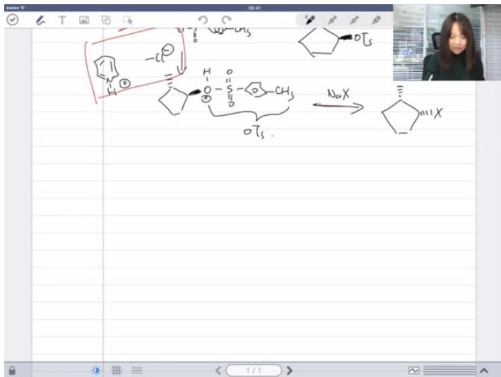

chemical

Hand-drawn chemical reaction diagram showing transformation of a chiral amine with ethyl ether and tosyl groups, followed by NaX conversion to cyclopentadienyl

● TsCI作用：在吡啶溶液中，TsCI（对甲苯磺酰氯）将羟基转化为良好的离去基团OTs。  
- 碱的影响：加入叔丁醇钾（t-butyl oxide）时，由于是强碱且体积大，理论上应得到动力学稳定的Hofmann产物（取代度较低的烯烃）。  
● 实验现象：实际观察到的是热力学稳定的Zaitsev产物（取代度较高的烯烃），需要特别注意这个反常现象。  
- 立体化学要求：反应是立体专一的，必须根据纽曼投影式正确写出四元环上唯一β-氢被消除后的立体构型。

# 15. 醇的氧化反应 45:58

# 1）反应分类

● 反应类型：属于醇的Part 2反应中的第3类——氧化反应（oxidation）。

● 知识衔接：这部分内容紧接着之前讲解的醇化学内容，构成完整知识体系。

# 2）醚的命名

知识回顾：醚的命名规则已在课程早期的命名专题中讲解过，这里作为过渡内容提及。

\- 注：根据要求，已忽略课程记录末尾关于"讲完醇醚就可以下课休息"等衔接性内容，所有知识点均严格来自教师讲解内容，未添加任何非讲授内容。例题部分保留了完整的解题思路和易错点分析，幻灯片插入位置与对应知识点严格匹配。

# 16. 醚的制备 46:54

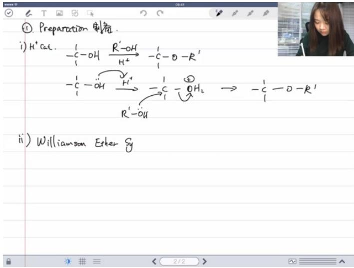

chemical

Chemical reaction diagram showing hydrogenation and esterification steps with labeled reactants and products

# 1）酸催化醚的制备 47:13

- 反应机理：在酸性条件下，醇羟基（R-OH）质子化形成好的离去基团（ $R-OH_{2}^{+}$ ），随后另一个醇分子作为亲核试剂进攻，通过 $SN_{1}$ 或 $SN_{2}$ 机理生成醚（ $R-O-R'$ ）。  
● 适用性：仅适用于制备对称醚（R - O - R），若制备不对称醚（R - O - R'）会产生混合产物（R - O - R 和 R' - O - R'）。  
● 关键步骤：羟基质子化→离去基团形成→亲核进攻→产物生成。

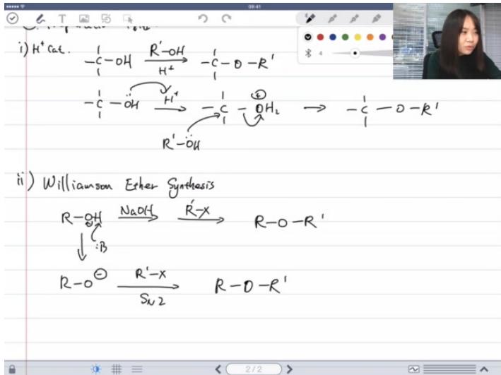

chemical

Chemical reaction equations showing hydrolysis of ethylene with sodium hydroxide and sulfuric acid to form dihydroxyacetone and dihydroxyethane

# 2）碱催化醚的制备（Williamson合成法）48:33

# - 反应步骤：

- 醇与强碱（如NaH或NaOH）反应生成醇钠（ $R-O-Na^{+}$ ）  
○ 加入卤代烃（ $R'$ -X）发生 $SN_{2}$ 反应

● 机理特点：明确为 $SN_{2}$ 机理，醇氧负离子作为强亲核试剂进攻卤代烃的碳中心。  
● 优势：可制备不对称醚，避免混合产物问题。  
● 碱选择：常用氢化钠（NaH）或氢氧化钠（NaOH），醇钠为中间体。

# 3）应用案例 50:18

# ● 例题：醚的制备方法选择

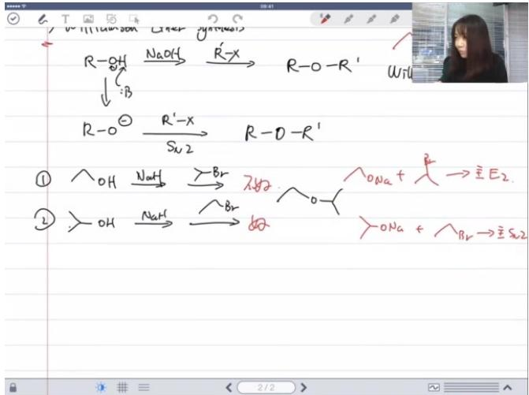

chemical

Handwritten chemical reaction equations involving sodium hydroxide, bromine, and sulfate with reagents and conditions

# ○ ○ 题目解析：

■ 对比酸催化与Williamson法：  
● 酸催化：仅当 $R=R'$ 时适用  
- Williamson法：通用性强，尤其适合不对称醚   
■ 答案：不对称醚必须选用Williamson合成法  
■ 记忆点："对称用酸，不对称用碱"

# ● 例题：醚的制备路径选择 55:58

# ○ 题目解析：

■ 路径一：二级卤代烃+醇钠→易发生E2消除副反应  
■ 路径二：一级卤代烃+醇钠→优先发生 $SN_{2}$ 反应  
■ 答案：选择一级卤代烃路径（路径二）  
■ 原理：一级卤代烃 $SN_{2}$ 活性高，二级卤代烃易消除  
■ 考点：卤代烃反应活性与空间位阻的关系

# 17. 醚的性质 56:54

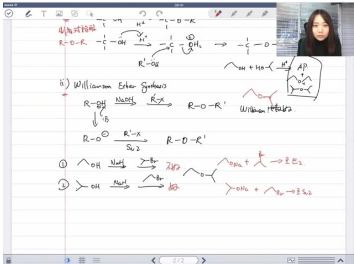

chemical

Handwritten chemical reaction equations involving water, acid, and alkoxide reactions with labeled reactants and products

# 1）醚作为溶剂的应用 56:57

- 主要用途：乙醚和四氢呋喃是最常用的有机溶剂，其分子结构 $R - O - R'$ 使其具有良好溶解性  
● 实验室规范：现代实验室禁止囤积乙醚溶剂，需使用铝制容器储存（早期使用玻璃瓶存在安全隐患）

# 2）醚的久置危险性与过氧化物生成 57:26

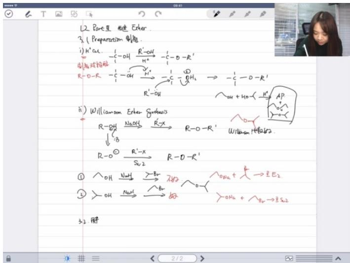

text_image

L2 Port里 酶迷 Ether.
3. (Preparation 制程.
i) H'αL.  \( \ce{-C(OH)2 ->[R'-OH][H^2] -C(-O-R')} \) 
(制式分解)
R-O-R  \( \ce{-C(-OH)2 ->[H^2] -C(-OH)_2 ->[-C(-O-R)] R'-OH} \) 

ii) Williamson Ether Synthesis
R-OH  \( \ce{NaOH} \)   \( \ce{R-X} \)   \( \ce{R-O-R'} \)  William H+Br₂
↓
R-O ①  \( \ce{R'-X} \)   \( \ce{R-D-R'} \) 

①  \( \ce{^OH NaH ->[Br-]^{2+} + [Br-]^{2-}} \)  ②  \( \ce{^-OH NaH ->[Br-]^{2+} + [Br-]^{2-}} \) 

32. 脂

● 危险现象：久置乙醚容器（特别是积尘玻璃瓶）受震荡可能爆炸，需全副武装处理  
- 化学本质：乙醚的 $\alpha$ -氢（与氧相邻的碳原子上的氢）具有活泼性，易形成自由基中间体  
- 反应过程： $\alpha$ -氢与氧气反应生成过氧化物（ $R - O - O - R$ ），这是爆炸性物质的主要来源

3）醚中阿尔法氢的活泼性 58:51

● 结构原因：氧原子的吸电子效应使C-H键易断裂，形成自由基  
● 共振解释：氧的孤对电子可与 $\alpha$ -碳形成p- $\pi$ 共轭，稳定自由基中间体  
● 典型实例：乙醚在储存过程中会缓慢生成爆炸性过氧化物

4）斯辛弗兰的阿尔法氢反应 01:00:08

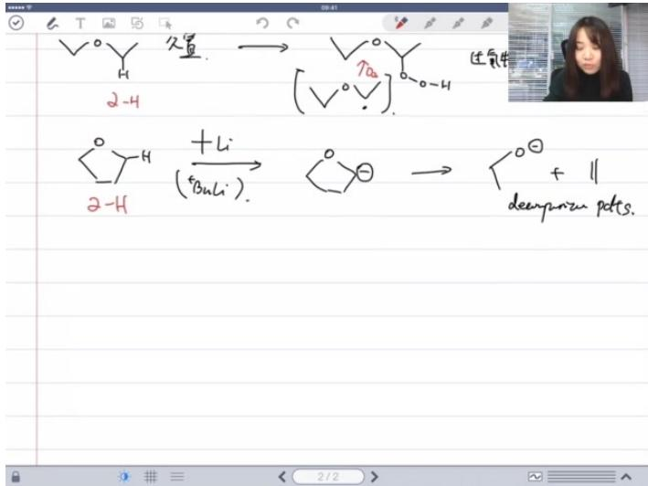

chemical

Chemical reaction diagram showing hydrogenation and lithium addition steps in a cyclic compound

- 碱反应性：叔丁基锂（t-BuLi）等强碱可夺取四氢呋喃的 $\alpha$ -氢  
● 反应产物：生成氧负离子后进一步分解产生乙烯等副产物  
● 实验注意：使用强碱时应避免选择四氢呋喃作溶剂，防止溶剂分解  
● 记忆要点：所有醚类化合物的 $\alpha$ -氢都具有活泼性，这是其最重要的化学特性之一

# 二、环氧的反应01:01:36

1. 环氧的制备 01:02:14

1）环氧制备的经典反应 01:02:18

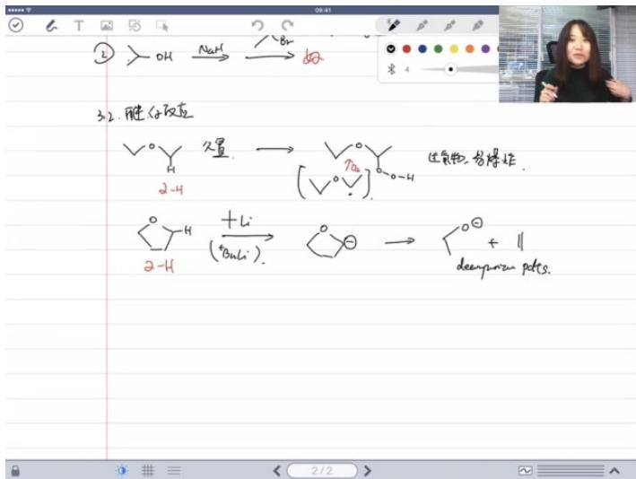

chemical

Chemical reaction diagram showing step 3.2 of hydrolysis to form a pentane derivative with Li and BuLi groups, followed by deprotonation.

● 核心反应物：烯烃与间氯过氧苯甲酸（mCPBA）反应生成环氧化合物  
● 反应特点：这是制备环氧最经典、最可靠的反应，通过烯烃的氧化实现  
● 记忆要点：mCPBA是间氯过氧苯甲酸的缩写，小写m表示"间"（meta）位取代

2）制备环氧的反应物 01:02:29

● 关键试剂：mCPBA（间氯过氧苯甲酸）

○ 全称：meta-chloroperoxybenzoic acid  
○ 结构特征：含有不稳定的过氧键（-0-0-）

● 反应本质：过氧酸氧化烯烃的反应  
● 注意点：过氧化合物易爆炸，实验中需特别注意安全

3）环氧制备的反应过程 01:03:33

\- 反应机理：

○ 氧原子从双键平面上方进攻π电子  
- 过氧键断裂，氧原子与双键碳形成三元环  
- 同时生成间氯苯甲酸副产物

● 电子效应：氧原子与烯烃π电子和p轨道相互作用  
- 简化理解：可以看作氧氧键断裂，一个氧原子插入双键形成环氧

4）环氧制备的产物 01:04:28

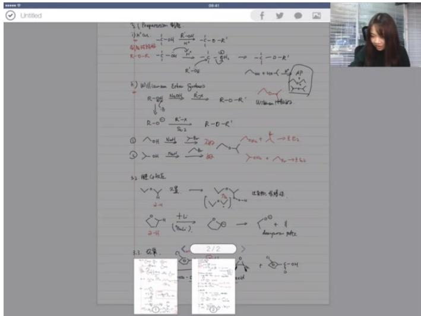

chemical

Chemical reaction equations and molecular structures for organic compounds, including hydroxyl group transformations and radical intermediates

● 主产物：环氧化合物（三元环结构）  
● 副产物：间氯苯甲酸  
● 稳定性：环氧三元环比全碳三元环稳定，但仍具有一定反应活性

2. 环氧的开环反应 01:05:50

1）环氧开环反应的基本条件 01:05:58

● 稳定性范围：在非强酸、强亲核试剂条件下可稳定存在  
- 反应倾向：主要发生开环反应  
● 反应类型：在强亲核试剂或酸性条件下开环

2）区域选择性：进攻位阻小的碳 01:07:40

text_image

Screenshot of a web interface with toolbar icons and a photo editing panel showing a person in a room.

● 电子分布：环氧中氧带 $\delta^{-}$ ，两个碳带 $\delta^{+}$   
● 反应机理：典型的SN2反应

- 亲核试剂进攻位阻较小的碳原子  
○ 氧原子作为离去基团

\- 示例反应:

- 硫氢化钠(NaHS)进攻位阻小的碳   
- 氢氧化钠(OH $^{-}$ )同样优先进攻位阻小的位置

3）立体化学问题：SN2反应的构型翻转 01:10:30

● 进攻方向：亲核试剂必须从氧原子背面进攻   
● 构型变化：典型的SN2构型翻转  
- 产物特征：

○ 生成带有羟基和亲核基团的产物  
○ 形成新的手性中心

● 反应专一性：这是立体专一性反应，只得到单一立体构型产物

4）例题1: 环氧开环反应的具体过程 01:12:59

text_image

直播尚未开始
请同学们稍等
并进行相关预习
质心论坛
forum.eduzhixin.com
官方微信
物理竞赛
质心官网
www.eduzhixin.com
北京质心教育科技有限公司
Center of Mass Educational Tech. Co. Ltd

● 题目解析

- 反应条件：强亲核试剂(如NaH)存在下  
○ 区域选择性：优先进攻位阻小的碳原子

○ 立体化学：必须考虑SN2反应的背面进攻特性  
- 产物预测：根据进攻方向和构型翻转规则推导最终产物结构  
○ 易错点：容易忽略立体化学变化和区域选择性

# 3. 应用案例 01:13:56

# 1）例题:环氧开环反应机理

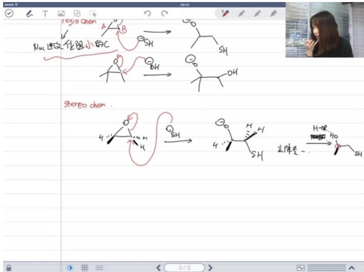

chemical

Chemical reaction diagram showing stereochemistry and electron transfer steps in a molecule structure

- 分步反应特征：反应箭头上标注数字1、2表示分步进行，不能将氢化钠和水同时加入，需先加氢化钠后加水，否则中性水可能直接导致环氧开环。  
● 区域选择性：在SN2反应中，亲核试剂 $(CN^{-})$ 会进攻位阻较小的碳原子（下方碳）。  
● 立体专一性：必须从氧原子的反面进攻，最终得到氧原子在上方离去的中间体。  
● 机理细节： $CN^{-}$ 进攻下方碳时，氧原子离去并翻转至上方，同时原下方氢原子被推向上方。

# 2）例题:环氧开环产物 01:16:37

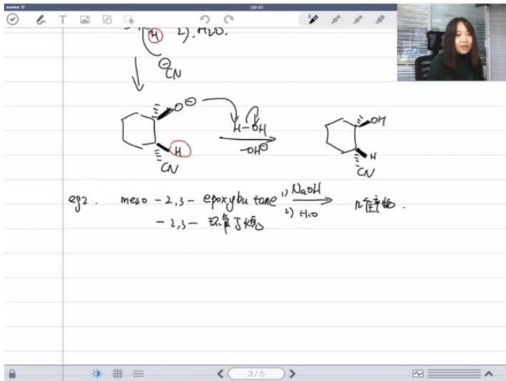

chemical

Chemical reaction diagram showing conversion of a cyclic compound to a hydroxybenzene derivative with NaOH and H2O groups, yielding a diester.

\- 反应特点：内消旋2,3-环氧丁烷与 $NaOH/H_{2}O$ 反应时不存在区域选择性，只需考虑立体化学问题。

# ● 产物分析：

- 亲核进攻两个等价碳原子概率均等（各50%）  
○ 生成一对对映异构体（R,R和S,S构型）  
- 最终产物为1,2-二醇

● 验证方法：通过标记R/S构型可确认产物关系，本例中形成外消旋混合物。  
● 关键区别：与直接羟基离去不同，环氧开环的驱动力主要来自三元环张力释放，碳氧键并未完全断裂。

# 4. 环氧在酸性条件下的开环 01:24:29

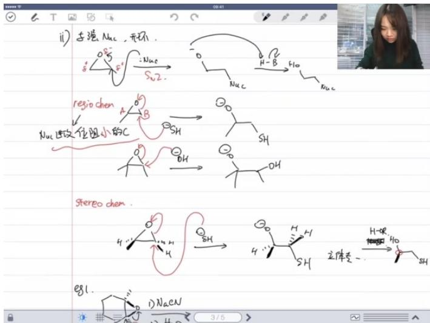

chemical

Chemical reaction pathway diagram showing nucleophilic attack and stereochemical transformation steps

●   
- 反应机理：

- 环氧氧原子作为路易斯碱与质子酸结合  
- 亲核试剂进攻活化后的环氧环

● 条件选择：可使用路易斯酸或质子酸，后者更常见

\- 分析步骤:

○ 先解决区域选择性（radio问题）  
- 再解决立体化学（stereochemistry问题）

● 驱动力：与碱性条件类似，主要利用环张力释放的能量促进反应

5. 应用案例 01:26:16

1）例题:酸性条件下环氧开环产物判断

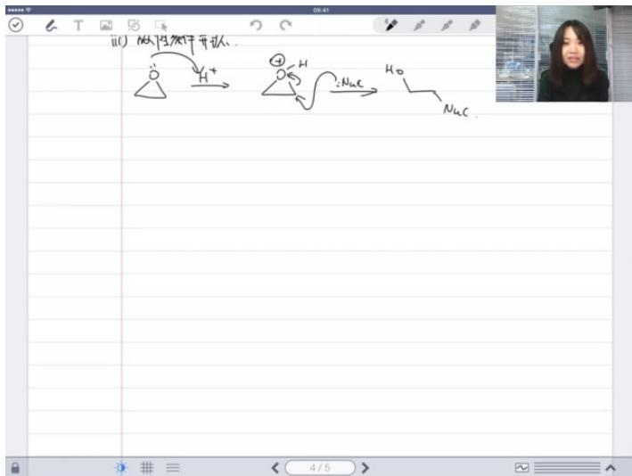

chemical

Hand-drawn chemical reaction diagram showing hydrogenation and nucleophilic substitution steps

●   
● 反应条件选择：强亲核试剂（如硫醇、硫化氢负离子、氢氧根负离子等）可直接与环氧开环反应，而弱亲核试剂（如水、醇）需要先加酸活化  
● 强弱亲核试剂区分：

强亲核试剂：硫醇、硫化氢负离子、氢氧根负离子、氢负离子、醇等

\- 弱亲核试剂：水、醇（在酸性条件下）

● 反应机理：弱亲核试剂需要酸先质子化环氧环，形成碳正离子中间体，再被亲核试剂进攻

2）例题:水进攻碳A或B判断 01:29:30

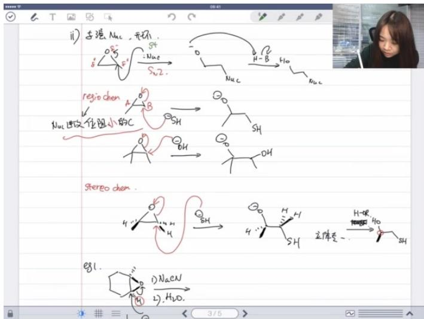

chemical

Hand-drawn chemical reaction equations for Nucleic acid and stereochemical reactions, including nucleophilic addition and deprotonation steps

# ● 影响因素：

○ 电子效应（electro effect）：三级碳能更好稳定正电荷，使氧偏离三级碳  
○ 位阻效应（steric effect）：亲核试剂倾向于进攻位阻小的碳

# ● 判断规则：

\- 酸性条件下:

当存在三级碳时（能稳定正电荷），电子效应占优，进攻三级碳（碳a）  
■ 当只有二级和一级碳时，位阻效应占优，进攻位阻小的碳（碳b）

\- 碱性条件下：无论是否存在三级碳，都是位阻效应占优，进攻位阻小的碳

# - 典型例子：

○ 二级碳和一级碳：都进攻位阻小的一级碳（碳b）  
三级碳和一级碳：酸性条件下进攻三级碳（碳a），碱性条件下进攻一级碳（碳b）  
三级碳和二级碳：酸性条件下进攻三级碳（碳a），碱性条件下进攻二级碳（碳b）

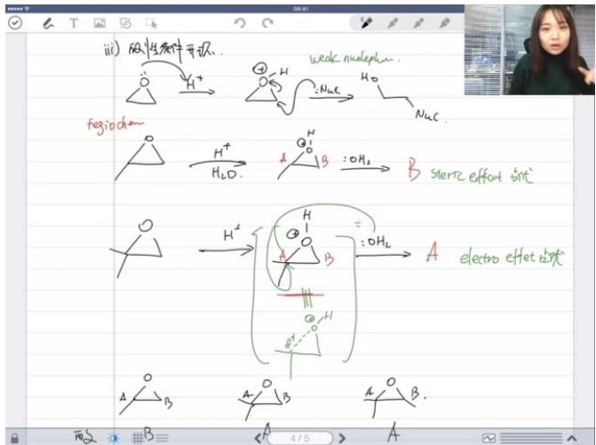

text_image

iii) 的性条件开启.
weak nucleolum.
fogyodium
H+ H2O
B:OH2 B steric effort 60°C
H+ H2O
A:OH2 A electro effect 60°C
A B A B A B.

# ● 关键点：

◦ 大多数情况下位阻效应占优  
- 只有当存在能显著稳定正电荷的三级碳时，酸性条件下电子效应才会占优  
○ 碳氧键越长键能越弱，越容易断裂

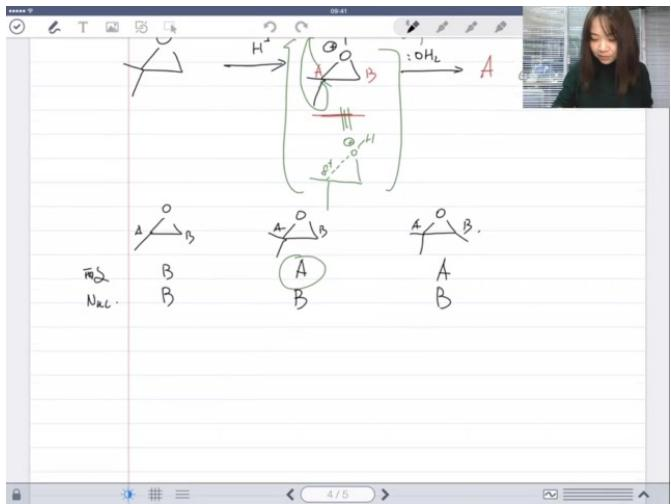

chemical

Hand-drawn chemical reaction diagram showing transformation of a cyclic compound with labeled reactants and products, including reaction conditions and reaction steps.

# - 硫醇特性：

○ 强亲核性：硫原子半径大，可极化性强  
- 反应性:

■ 与氢化钠反应生成硫醇钠（RSNa）  
■ 与卤代烃反应生成硫醚（RSR'）

○ 硫醚特性：

■ 亲核性强于醚   
■ 可与碘甲烷等卤代烃反应生成锍盐（R3S+I-）

# 三、休息 01:39:18

1. 课件存储与整理提示 01:39:22

text_image

All Folder 13
Untitled
+ 2018年5月24日 20:00
ZCHEM200-2018zbz
+ 2018年5月24日 18:00
L2-bj-L2note
+ 2018年5月24日 13:00
Zchem200-2018-zb
+ 2018年5月24日 18:00
Zchem200-2018-bj
+ 2018年5月24日 13:00
Untitled
+ 2018年5月24日 18:40
Business
WWDC 2015
+ 2018年4月24日 12:06
Web Page
+ 2018年4月24日 12:01
Personal
Last Winter
+ 2018年4月24日 13:31
Study Note
+ 2018年4月24日 16:31

● 文件管理建议：课件存储路径显示多个日期标记（2018年3月30日、2018年2月8日等），建议按日期或主题分类整理课件  
- 命名规范：注意避免使用"Untitled"等无意义文件名，可采用"ZCHEM210-L3"等包含课程编号的命名方式

2. 课件内容概览与花边提及 01:39:31

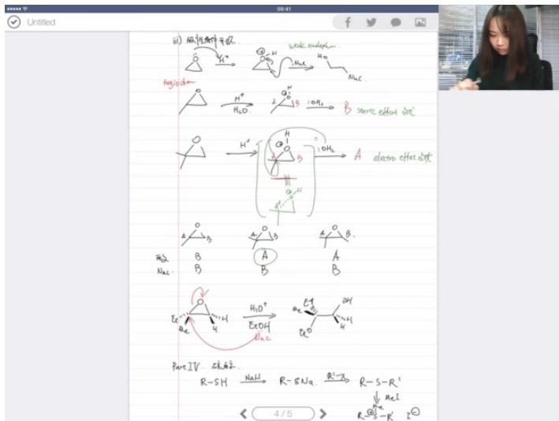

chemical

Hand-drawn chemical reaction equations involving hydrolysis, radical intermediates, and electron transfer steps

- 反应特征：涉及硫醇(R-SH)与烯烃的加成反应，生成硫醚(R-S-R')类化合物  
● 立体效应：反应中存在明显的空间位阻效应（stereo effect）  
● 电子效应：反应过程受电子效应（electro effect）影响显著

# 3. 亲和力与反应讨论 01:39:40

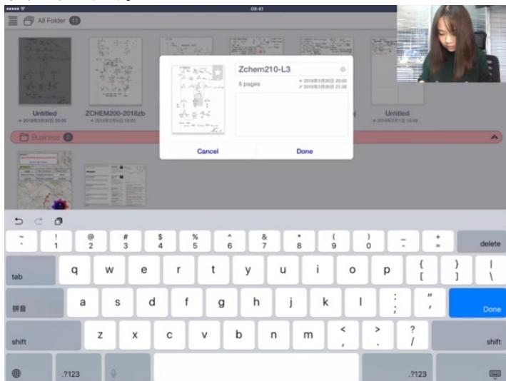

text_image

All Folder
Untitled
+ 2018年3月30日 20:00
ZCHEM200-2018zb
+ 2018年3月30日 18:46
Business
Cancel	Done
Zchem210-L3
5 pages
+ 2018年3月30日 20:00
+ 2018年3月30日 21:38
Untitled
+ 2018年3月31日 18:46
delete
tab
q w e r t y u i o p { } l
拼音
a s d f g h j k l : " Done
shift
z x c v b n m < > ?
? / shift
.7123
.7123

● 反应概率：特定条件下反应发生概率较大（"一个礼拜这个机率会比较大"）  
● 亲和性特征：反应体系表现出弱亲核性特征（"就是一个弱的女孩子"类比）  
● 反应壁垒：存在"流的切割性的一个墙体"比喻反应能垒

# 4. 下课休息与课间互动 01:40:39

● 课堂节奏：教师明确提示"我们下课休息"，并讨论课间BGM选择问题  
- 时间管理：强调"还有一分钟我们就上课"，建议利用碎片时间（"先倒点水"、"先开始写点字"）

# 5. 课间休息与上课准备 01:44:00

- 术语解析：烯烃英文名称为"alkene"，其中"alk"为烷烃词头，“ene”表示双键特征  
● 命名规则：通过词源学解释命名规则（"en 1就是c，所以en 1代表c"）  
● 课程衔接：预告下一环节将重点讲解"烯烃的加成反应"内容

# 四、烯烃的加成反应 01:44:48

# 1. 烯烃的命名 01:45:16

# 1）基本命名规则

● 母体选择: 烯烃命名时通常以烯烃本身作为母体，其他基团作为取代基。  
E/Z标记: 必须标明双键的E/Z构型，这是烯烃命名的关键要素。  
● 结构正确性: 结构错误会导致整个命名错误，考试中结构错误通常不得分。

# 2）命名步骤详解

- 碳骨架构建: 首先确定主链碳原子数, 如己烯为6个碳原子 $(C_{6}H_{12})$ 。  
- 双键定位: 标明双键位置，如"3-己烯"表示双键在第3和第4个碳原子之间。  
● 取代基添加: 在相应位置添加取代基，如"3-氯-3-己烯"表示第3个碳上有氯原子。  
● 构型判断: 根据Cahn-Ingold-Prelog规则判断E/Z构型，大基团在同侧为Z型，异侧为E型。

# 3）例题：3-氯-3-己烯的命名

# ● 题目解析

○ 结构构建: 先画出6个碳的主链，在3-4位添加双键  
○ 取代基添加: 在第3个碳上添加氯原子  
○ 构型判断:

■ 碳3上比较氯原子和氢原子，氯原子优先   
■ 碳4上比较乙基和甲基，乙基优先   
■ 两个优先基团在同侧，故为Z构型

○ 答案: (Z)-3-氯-3-己烯

# ○ 易错点:

容易遗漏E/Z标记  
■ 可能错误判断取代基优先顺序  
■ 碳原子计数错误导致双键位置错误

# 2. 烯烃的加成反应 01:47:30

# 1）加成反应的定义与机理 01:47:43

● 通式： $A - B + C = C \rightarrow C - C$ ，其中烯烃双键断裂与A - B加成  
● 键能变化：断裂1个 $\pi$ 键和1个 $\sigma$ 键，生成2个 $\sigma$ 键   
● 热力学特性： $\Delta H < 0$ 的放热反应，因为 $\pi$ 键比 $\sigma$ 键弱，生成更强键释放能量  
● 反应条件：低温下易自发进行，高温可能发生逆反应

# 2）氢卤化反应 01:49:04

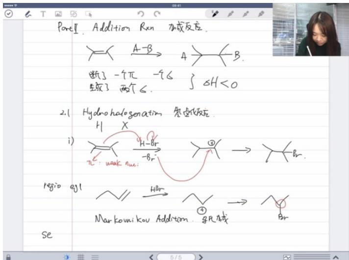

text_image

Pore II. Addition Rxn 加成反应.
A-B
A-B.
断了一个π -46
生成了两个6.
δH<0
2.1 Hydrohalogenation 意卤化反应.
i) H-Br
π: weak nuc:
③ → Br.
legio ey1
Markovnikov Addition gR线
Se

定义：烯烃与卤化氢(HX)的加成反应，如HBr与烯烃反应

# - 反应机理：

\- 第一步： $\pi$ 电子作为弱亲核试剂进攻质子，生成碳正离子
- 第二步：卤素负离子(X-)进攻碳正离子完成加成

- 官能团特性：双键是分子中最易反应的位点(functional group)  
● 区域选择性：产物结构取决于碳正离子稳定性

# 3）马氏加成规则 01:53:01

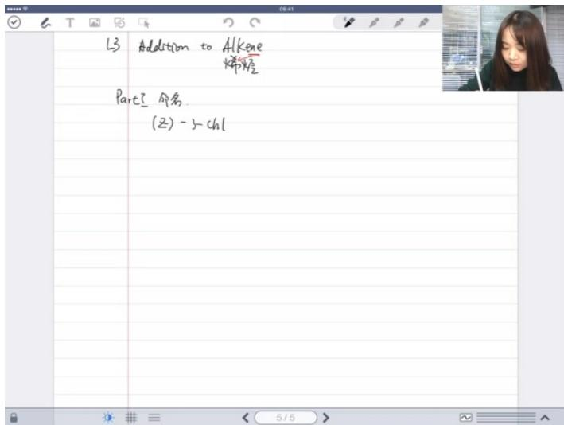

text_image

L3 Addition to Alkene
烯醛
Parts 命房.
(2) - 5-chl

● 核心原理：质子加在取代基较少的碳上，卤素加在取代基较多的碳上  
● 记忆技巧：通过碳正离子稳定性理解，无需死记规则

○ 碳正离子稳定性： $3^{\circ}>2^{\circ}>1^{\circ}$

- 示例分析：1-丁烯与HBr反应时，Br加在C2上因生成的 $2^{\circ}$ 碳正离子更稳定  
● 立体化学：产物为外消旋体，因SP2杂化的碳正离子平面两侧进攻概率相等

4）自由基机理与反马氏规则 02:00:02

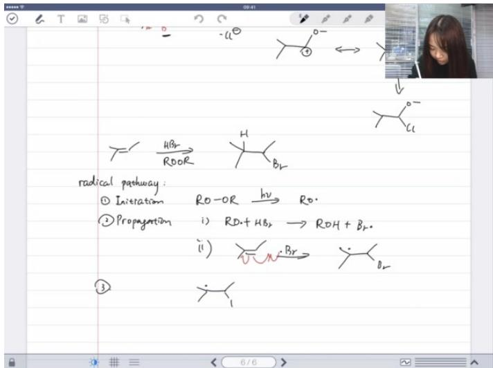

chemical

Hand-drawn chemical reaction pathway diagram showing radical intermediates and radical reactions with reagents like ROOR, HBr, and Br.

6/6   
● 引发条件：溴化氢含过氧化物杂质时发生自由基机理  
- 反应步骤:

\- 链引发：过氧化物分解产生自由基(RO·)

○ 链增长：

■ $RO\cdot + HBr \rightarrow ROH + Br\cdot$   
■ Br·进攻双键生成更稳定的自由基中间体  
■ 中间体夺取HBr的H生成产物和新的Br·

\- 链终止：自由基相互结合使反应终止

- 反马氏产物：因Br·加在取代基较少碳上，H加在取代基较多碳上  
- 卤素差异:

○ HCI仅发生离子机理（H-Cl键能强）

○ HBr两种机理均可（H-Br键能较弱）

● 立体选择性：自由基机理同样无立体选择性，但有区域选择性

5）聚合反应 02:08:41

\- 聚合反应概述

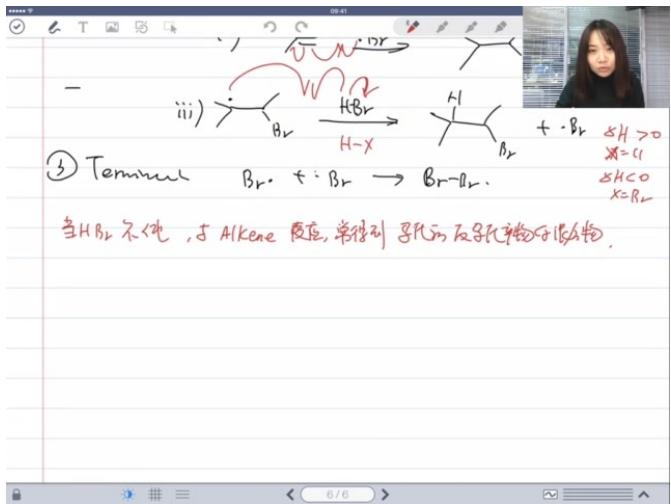

text_image

③ Terminal Br. + Br → Br-Br.
当HBr不纯,才Alkene 度在,常得到异化的反异化率因子很严格。

O

定义：聚合物(polymer)是通过聚合反应(polymerization)将单体(monomer)连接形成的高分子化合物。  
- 反应特点: 当HBr不纯时与烯烃反应，常得到多种副产物的混合物。

# - 聚合反应机理

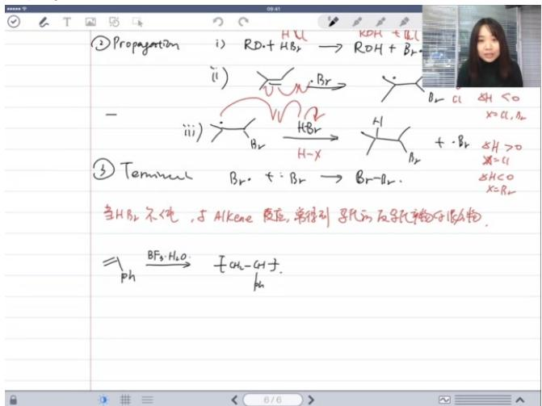

chemical

Chemical reaction scheme showing hydrogenation and bromination steps with reagents and conditions

O

# ○ 常见机理类型:

正离子机理  
负离子机理  
■ 自由基机理

研究背景：高分子合成反应机理研究非常透彻，许多有机反应机理模型最初来源于高分子化学研究。

# - 正离子催化聚合反应示例

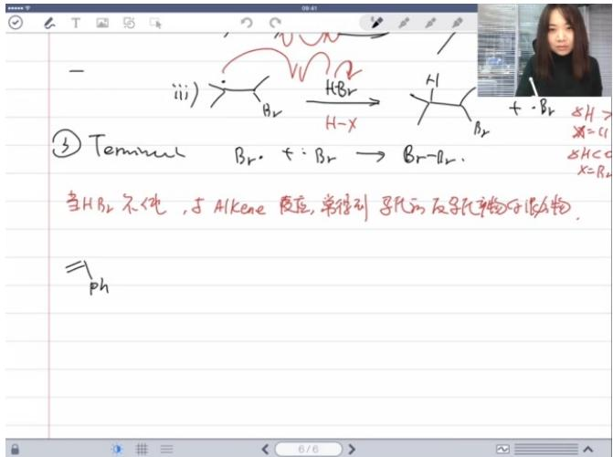

text_image

- 
(iii) Br → HBr → H + Br
③ Terminal Br + Br → Br-Br.
当HB₂不纯，才Alkene 度应，常得到子化的及子化产物的微分物。
= ph

O

- 催化剂: 三氟化硼( $BF_{3}$ )作为路易斯酸, 具有平面构型和大π键  
○ 反应过程:

■ $BF_{3}$ 与水反应生成质子  
■ 质子进攻苯乙烯双键形成碳正离子  
■ 碳正离子通过p-π共轭稳定化  
■ 其他单体分子继续进攻碳正离子  
■ 最终与水反应终止链增长

○ 产物特征: 生成聚苯乙烯，末端为氢原子

6）烯烃与水的加成反应 02:15:00

\- 基本反应

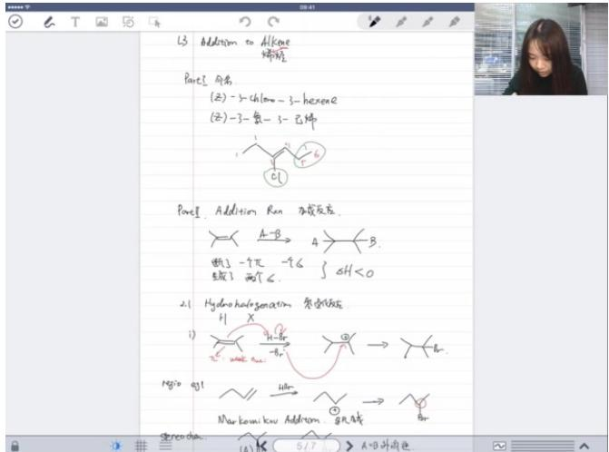

text_image

13
Addition to Alkane
烯成
Part I: 90%
(2) - 3-chloro-3-hexene
(2) - 3-氨-3-己烯

Part II. Addition Ren 为反应.
A-B→A-B.
断了一个π - πδ δH < 0
生成了两个ε.

2.1 Hydrohalogenation 氢赤霉素
i)
X
H
H
H
H
H
H
H
H
H
Markowski Addition gK线
MgO₃ 0.11

反应通式: $C = C + H_{2}O \rightarrow C - OH$   
- 反应条件: 稀硫酸水溶液  
○ 机理步骤:

■ 质子进攻双键形成碳正离子   
■ 水分子作为亲核试剂进攻碳正离子  
■ 质子转移完成反应

● 区域选择性与立体选择性

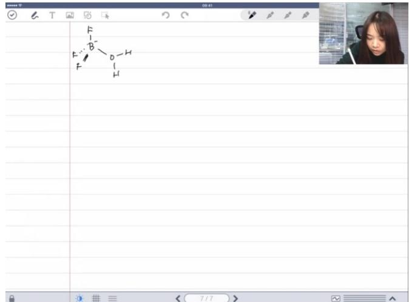

chemical

Hand-drawn chemical structure of ethylene (B₂H₄) with labeled carbon atoms and hydrogen positions

区域选择性: 遵循马氏规则, 羟基加在更稳定的碳正离子上  
○ 立体选择性: 当生成手性中心时, 通常得到外消旋体  
○ 示例: 甲基-乙基烯烃在稀硫酸中反应生成三级醇

\- 反应平衡控制

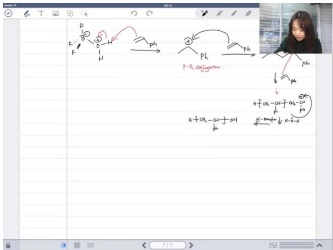

chemical

Hand-drawn chemical reaction diagram showing phosphorus-nitrogen conversion with P-IL conjugation and H-O-N bond formation

O   
○ 稀硫酸:

■ 水多，平衡向加成反应方向移动  
生成醇类产物

○ 浓硫酸:

■ 水少，平衡向消除反应方向移动  
生成烯烃产物

\- 应用: 可通过调节硫酸浓度控制反应方向

\- 碳正离子重排问题

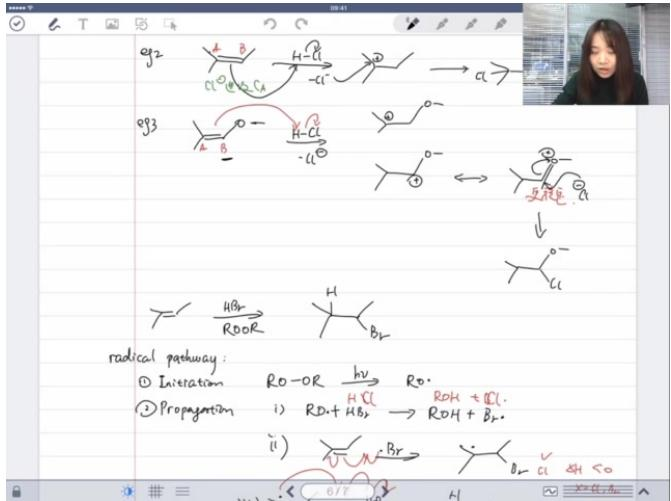

chemical

Chemical reaction pathway diagram showing transformation of alkynes to hydrocarbons via intermediates and radical pathways

问题: 碳正离子容易发生重排，导致副产物生成

\- 解决方案: 使用不产生碳正离子的反应路线，如羟汞化-去汞化反应

○ 示例: 正丁醇与浓硫酸反应会重排生成2-丁烯

# 7）腔汞化与去汞化反应 02:21:24

\- 反应概述

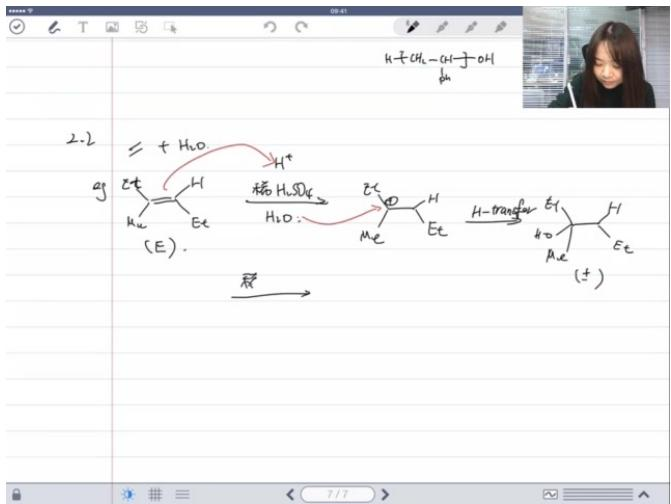

chemical

Chemical reaction diagram showing hydrogenation of ethyl acetate (E) to form a cyclic ester with H2O and H2SO4, followed by hydrogen transfer to an alkene (±)

定义：又称oxymercuration-demercuration反应，是烯烃与水在汞盐催化下生成醇的反应  
○ 特点：

■ 加水且不发生重排（区别于酸催化水合反应）  
■ 汞作为催化剂，不进入最终产物  
净效应相当于马氏规则加水

\- 反应机理

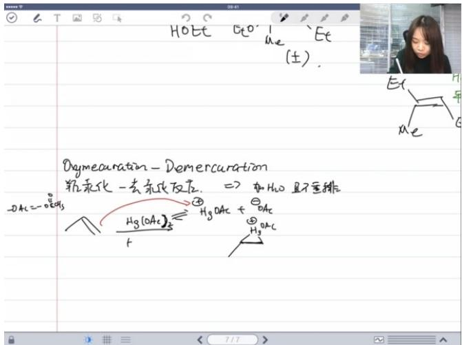

text_image

HOEt
GeO
He
Et
(±).
Dymecuratin - Demercuration
酚汞化 - 去汞化反应. ⇒ 加H₂O 且不重排
-DAc = -OEt
Hg(OAc)₃ ⇌ HgOAc + OAc
t
H₂OAc

第一步：腔汞化：

■ 试剂：使用乙酸汞 $Hg(OAc)_{2}$ ，在溶液中解离生成 $HgOAc^{+}$ 和 $OAc^{-}$   
■ 过程：烯烃双键进攻汞正离子（路易斯酸），形成三元环状汞鎓离子中间体  
■ 溶剂影响：水溶液中亲核试剂为水，甲醇溶液中则为甲醇   
■ 区域选择性：电子效应主导（electro effects dominant），亲核试剂进攻更稳定的碳正中心

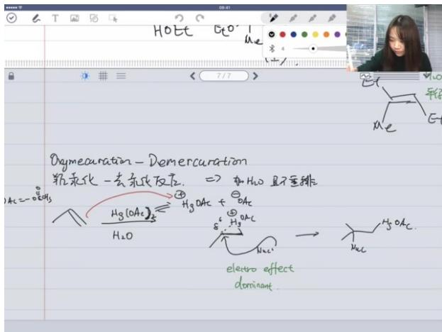

text_image

H0Et
7/7
Oxymecuration - Demercuration
羟二汞化-去汞化反应. → 加H₂O且不至排
Hg(OAc)₃ ⇌ HgOAc + OAc
H₂O
electro effect
dominant.

# ○ 第二步：去汞化：

■ 试剂：使用硼氢化钠 $NaBH_{4}$ 还原  
■ 过程：移除汞原子并质子转移，最终生成醇  
■ 立体化学：产生外消旋混合物（50:50比例）

# - 反应特点总结

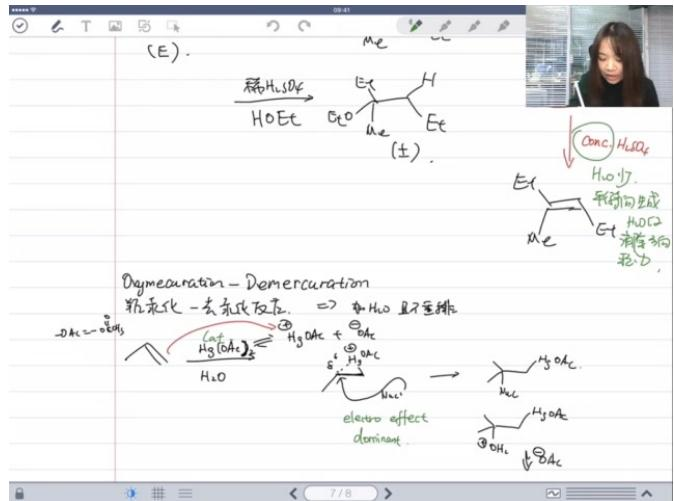

chemical

Chemical reaction diagram showing hydrolysis of ethyl acetate with concitization, followed by deprotonation and subsequent electrophilic aromatic substitution

催化剂：汞盐 $Hg(OAc)_{2}$ 只需催化量

\- 优势：避免碳正离子重排（与酸催化水合反应的关键区别）

等价关系：净效应相当于一分子水按马氏规则加成到双键上

# ● 例题：不同条件下的反应比较

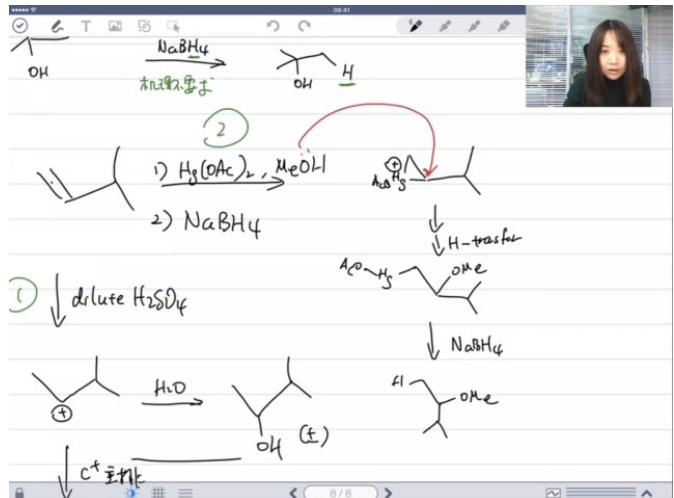

chemical

Handwritten chemical reaction equations involving hydroxyl, acetic acid, and sodium borohydride with reagents like dilute H2SO4 and hydrogenation steps

# ○ ○ 题目解析：

# ■ 条件一（稀硫酸）：

● 生成碳正离子中间体，可能发生重排

● 产物包括未重排和重排后的醇，比例难以预测

# ■ 条件二（腔汞化-去汞化）：

- 无重排发生  
● 在甲醇溶液中得到甲氧基产物  
● 立体化学：产生外消旋体（R和S构型各50%）

■ 关键区别：腔汞化反应保持碳骨架完整性，避免重排副产物

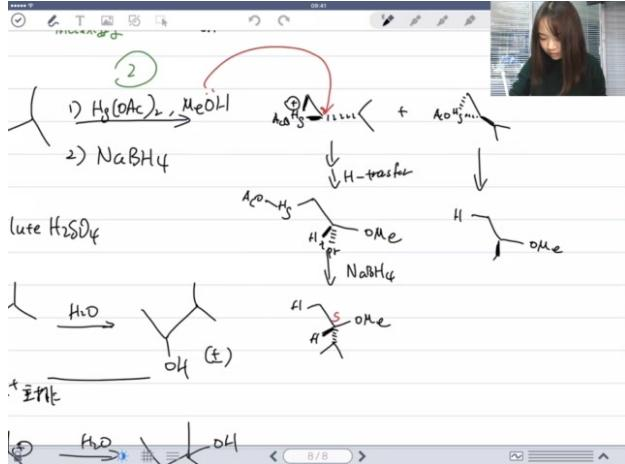

chemical

Hand-drawn chemical reaction equations involving hydrogenation, acidification, and hydrolysis steps

# ○ 立体化学分析：

■ 汞从双键平面两侧进攻概率均等   
■ 亲核试剂（如甲醇）从背面进攻汞鎓离子  
■ 最终产物构型可通过Cahn-Ingold-Prelog规则判断

# - 应用与注意事项

# ○ 典型应用：

■ 制备不重排的醇类化合物  
■ 在特定溶剂中引入其他官能团（如甲氧基）

# ○ 注意事项：

■ 汞化合物有毒，需谨慎操作  
■ 区域选择性遵循马氏规则  
■ 立体化学结果需明确标注外消旋体

# 五、知识小结

<table><tr><td>知识点</td><td>核心内容</td><td>考试重点/易混淆点</td><td>难度系数</td></tr><tr><td>消除与取代反应机理判断</td><td>SN1/SN2与E1/E2反应机理的判断标准(底物结构、试剂性质、溶剂效应)</td><td>三级卤代烃易发生SN1/E1,强碱大位阻试剂导致E2为主</td><td></td></tr><tr><td>区域选择性规律</td><td>扎伊采夫规则(热力学稳定产物)vs霍夫曼规则(动力学控制)</td><td>大位阻碱倾向于霍夫曼产物</td><td></td></tr><tr><td>威廉姆森醚合成法</td><td>醇钠与卤代烃的SN2反应,一级卤代烃最适用</td><td>三级卤代烃会发生消除副反应</td><td></td></tr><tr><td>环氧开环反应</td><td>酸/碱条件下开环的区域选择性和立体专一性</td><td>酸性条件:电子效应主导;碱性条件:位阻效应主导</td><td>★★★★</td></tr><tr><td>马氏加成规则</td><td>氢卤酸与烯烃加成的碳正离子机理</td><td>过氧化物存在时溴化氢发生反马氏加成(自由基机理)</td><td>★★★</td></tr><tr><td>羟汞化-脱汞反应</td><td>汞盐催化加水,避免碳正离子重排</td><td>溶剂决定亲核试剂(水/醇),保持原骨架结构</td><td>★★★★</td></tr><tr><td>硫醇特性</td><td>强亲核性,易氧化形成二硫键</td><td>硫醚可进一步烷基化生成锍盐</td><td>★★</td></tr><tr><td>聚合物合成机理</td><td>正离子聚合(如苯乙烯聚合)</td><td>链引发-增长-终止三阶段,涉及碳正离子中间体</td><td>★★★</td></tr><tr><td>醇的酸性比较</td><td>诱导效应/共轭效应/溶剂化效应的影响</td><td>对硝基苯酚酸性&gt;苯酚&gt;烷醇</td><td>★★</td></tr><tr><td>碳正离子重排</td><td>1,2-氢迁移/烷基迁移的驱动力</td><td>三元环开环释放张力是特殊案例</td><td>★★★★</td></tr></table>