# 一、共轭和芳香性00:04

# 1. 共轭 01:36

# 1）丙二烯 02:08

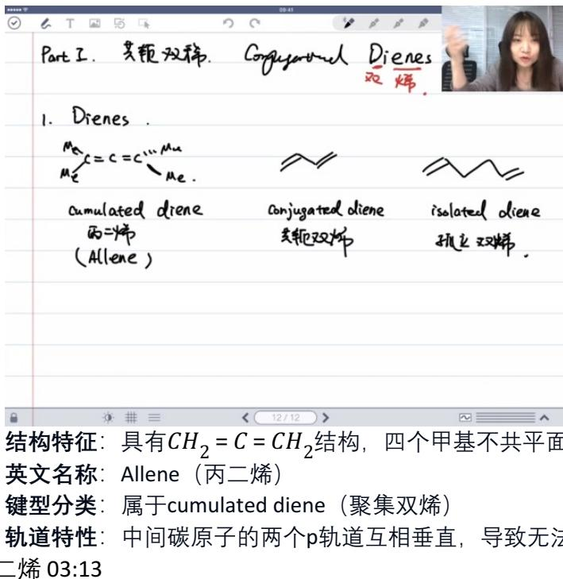

text_image

Part I. 共轭双稀. Copyouruol Dienes
双烯.
1. Dienes .
Me
C = C = C ... Mu
Me
cumulated diene
丙=烯
(Allene)
conjugated diene
共轭双烯
isolated diene
孤立双烯。
结构特征：具有CH₂=C=CH₂结构，四个甲基不共平面
英文名称：Allene（丙二烯）
键型分类：属于cumulated diene（聚集双烯）
轨道特性：中间碳原子的两个p轨道互相垂直，导致无法
二烯 03:13

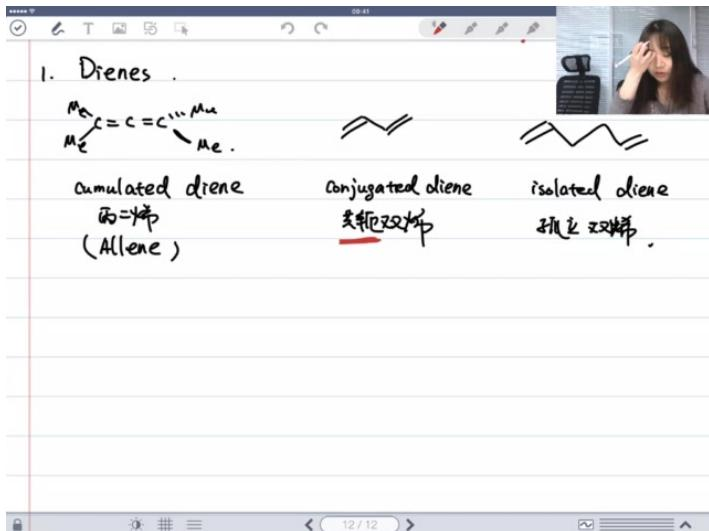

text_image

1. Dienes .
Me
C = C = C ... Me
Me
cumulated diene
丙二烯
(Allene)
Conjugated diene
共轭双烯
isolated diene
孤立双烯.

共轭双烯：

○ 结构特征：双键间间隔一根σ键（如1,3-丁二烯）  
- 英文术语：Conjugated diene  
○ 轨道特点：p轨道能肩并肩有效重叠

\- 孤立双烯：

○ 结构特征：双键间间隔≥2根σ键  
- 英文术语：Isolated diene  
相互作用：双键间无电子离域效应

3）孤立双烯 04:11

● 命名差异：部分教材译为"分离二烯"  
● 本质特征：两个π键独立存在，不发生相互作用

# - 对比要点:

- 与共轭双烯的关键区别在于π键间距  
- 稳定性低于共轭体系

# 4）什么是共轭 05:31

# ● 共轭的定义 05:36

text_image

(Allene)
2. 什么是共轭!
Definition: ≥3个原子α体子内, 原子轨道 (始时度是P轨道)以轴向

○ 核心定义：在≥3个原子的体系内，原子轨道（主要是p轨道）以轴向平行方式有效重叠，使体系能量降低的现象

# ○ 关键要素：

■ 原子数量：必须涉及三个及以上原子  
■ 轨道要求：通常为p轨道，需保持平行取向  
■ 距离条件：原子间距需保证有效重叠（通常间隔1σ键）

# ○ 相关概念：

■ 离域体系：电子不再定域于两个原子间  
■ 共轭效应：使体系稳定的能量降低效应

# ○ 注意事项：

■ 定义会随研究进展更新  
■ 不同教材定义角度可能不同

# ● 应用案例 11:50

例题:共轭体系例子

■ 1,3-丁二烯：

● 轨道特征：四个SP²杂化碳的p轨道肩并肩重叠   
● 电子离域：形成含4电子的大π键（离域π键）  
● 稳定机制：π电子在四个原子间离域降低能量

■ 术语解析：

- $\pi$ - $\pi$ 共轭：两个 $\pi$ 键通过 $\sigma$ 键相互作用  
- 离域体系：电子分布范围扩大

例题:不饱和羰基化合物例子 15:39

■ $\alpha,\beta-$ 不饱和羰基：

● 共轭范围：涉及O、C1、C2、C3四个原子  
● 轨道组成：氧的p轨道与三个碳的p轨道重叠  
● 距离条件：各原子间均间隔1σ键

■ 特殊性质：

- 羰基氧的孤对电子参与共轭  
● 共轭导致C=O键长增加

例题:丙烯正离子例子 17:27

p-π共轭：

● 空轨道作用：带正电碳的p轨道与 $\pi$ 键相互作用  
● 稳定效应：正电荷得以离域分散

# 结构特征：

- 三原子体系（C+-C=C）  
● 即使p轨道为空仍能形成共轭

# 例题:呋喃例子 18:33

# ■ 杂环共轭：

● 体系范围：五原子（4C+1O）共轭体系  
● 杂化状态：氧为 $SP^{2}$ 杂化，提供p轨道

# 共轭类型：

● p- $\pi$ 共轭：氧孤对电子与 $\pi$ 体系作用  
- $\pi$ - $\pi$ 共轭：环内双键间相互作用

# ■ 芳香性：形成稳定的芳香体系（后续讲解）

# 5）共轭效应使体系能量降低 20:19

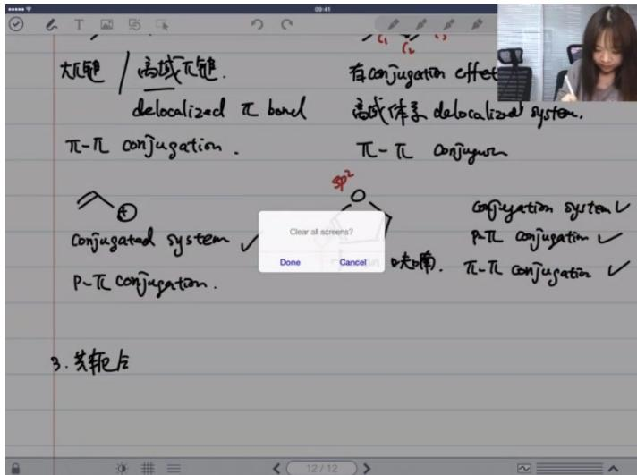

text_image

大轭 / 高域π轭.
delocalized π bond
有 conjugation effect
高域体系 delocalized system.
π-π conjugation.
π-π conjugation
Conjugated system ✓
Done Cancel
Clear all screens?
配置器 system ✓
P-π conjugation ✓
P-π conjugation.
π-π conjugation ✓
3. 共轭合

- 稳定效应：共轭效应可使体系能量降低约10-15 kJ/mol，表现为体系稳定性增加  
● 实验验证：通过比较燃烧热发现，共轭双烯（如1,3-丁二烯）比孤立双烯能量更低  
● 量子解释：离域π键范围越大，体系能量越低（符合薛定谔方程计算结果）  
● 例题:溴化钾反应产物 21:41

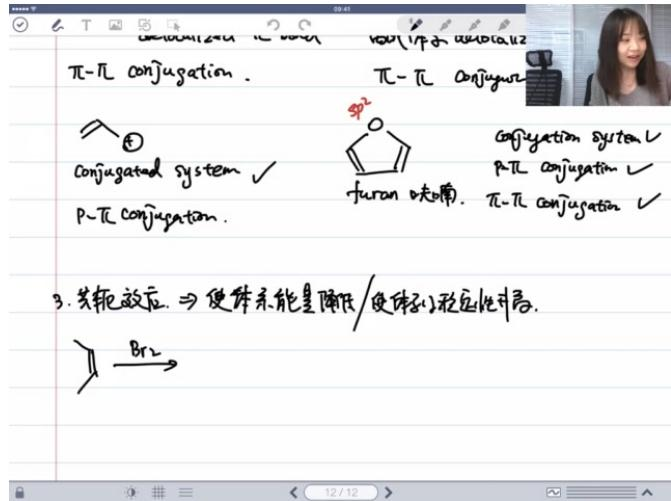

text_image

π-π conjugation.
π-π conjugation
conjugated system ✓
p-π conjugation.
φ²
furan 吡喃.
π-π conjugation ✓
3. 其轭效应. ⇒ 使体系能量降低/使体粒子稳定性升高.
Br₂

○
○

# ○ 题目解析

# ■ 产物书写规范：

● 对称结构产物需标注"±"号表示外消旋体  
● 内消旋体(meso)不可用"±"表示，必须画出具体结构

# ■ 常见错误：

● 将内消旋体错误标注为外消旋体  
- 只写出单一构型产物而未标注比例关系

■ 立体化学：溴离子从双键两侧进攻概率均等，开环后生成两种非对映异构体

# 6）应用案例 23:26

# 例题:产物书写规范

○ 实验现象：双烯产物比炔烃更稳定（消除反应中主要观测到双烯产物）

# ○ 能量数据：

■ 孤立双烯（2×1-丁烯）与烷烃能量差：254 kJ/mol  
■ 共轭双烯（1,3-丁二烯）与烷烃能量差：239 kJ/mol  
■ 共轭稳定化能：15 kJ/mol

# 7）双烯稳定性 25:30

# ● 构型差异:

- 反式1,3-丁二烯比顺式稳定12 kJ/mol  
- 主要源于空间位阻效应

# - 旋转势垒：

○ 二面角 $0^{\circ}$ （顺式）→ $90^{\circ}$ （正交）→ $180^{\circ}$ （反式）  
- 势能曲线显示共轭体系在平面构型时能量最低

# 8）应用案例 28:30

# ● 例题:反式一三丁二烯能量降低

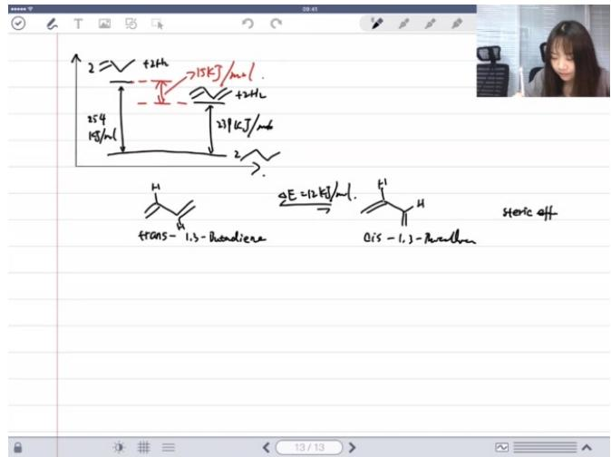

chemical

Hand-drawn chemical reaction diagram showing electron transfer and isomerization steps with energy values and molecular structures labeled

# ○ 关键数据：

■ 共轭vs非共轭双烯能量差：10-15 kJ/mol  
■ 反式vs顺式能量差：约12 kJ/mol

# ○ 记忆要点：

■ 共轭体系稳定性顺序：反式共轭双烯 > 顺式共轭双烯 > 孤立双烯  
■ 实验测定值可能存在±3 kJ/mol误差范围

# 9）离域范围越大体系能量越低 32:48

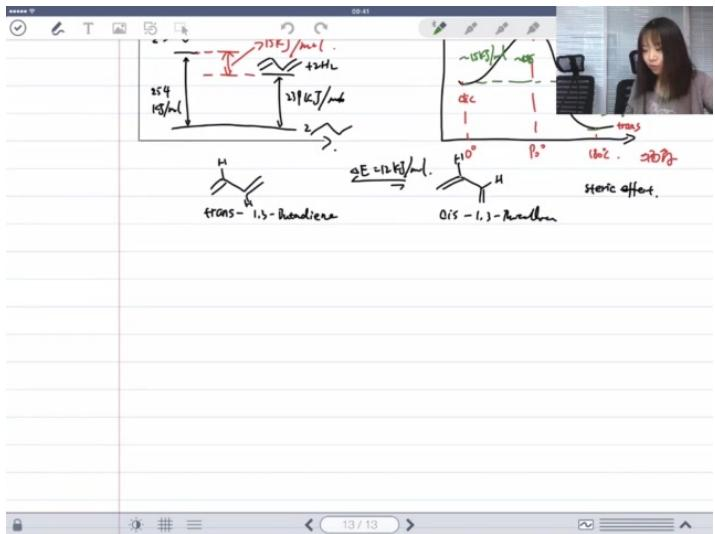

chemical

Chemical reaction diagram showing isomerization and isomerization steps with energy values and enthalpy changes

● 电荷分散原理：电荷积聚在单个原子上最不稳定，分散范围越广体系能量越低  
- $\pi$ 电子离域效应：虽然 $\pi$ 电子体系本身中性，但离域范围扩大同样会降低体系能量  
● 实验验证：共轭双键体系比孤立双键体系能量更低，特别是链状共轭体系

# 10）共轭双烯加成反应 33:46

\- 反应类型

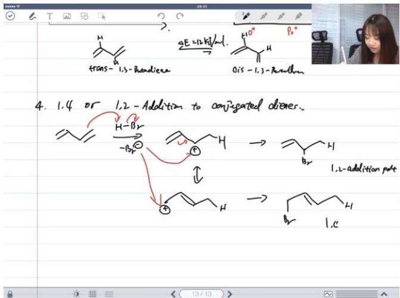

chemical

Reaction mechanism diagram showing conversion of trans-1,3-butadiene to 1,2-adoption via bromination and hydrogenation steps

1,2-加成：在共轭体系的1号和2号碳上发生加成（马氏加成产物）  
☐ 1,4-加成：在共轭体系的1号和4号碳上发生加成（需碳正离子重排）  
○ 共存现象：两种产物通常同时存在，通过实验分离鉴定

\- 温度效应

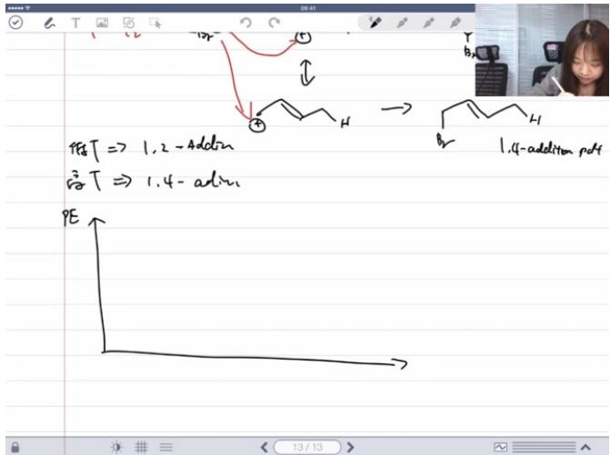

text_image

PE
PEG T => 1.2 - Adolin
PEG T => 1.4 - admi
PE
1.4 - addition pdf
13/13

低温条件：主要生成1,2-加成产物（动力学控制）

○ 高温条件：主要生成1,4-加成产物（热力学控制）  
○ 能垒差异：1,2-加成活化能较低（无需重排），1,4-加成活化能较高（需重排）

\- 碳正离子稳定性

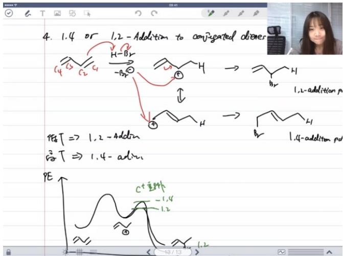

text_image

4. 1.4 or 1,2-Addition to conjugated dioxers
C4 C5 C6 C7 H-Br
→
-Br
→
C=CH2CH2H
1,2-addition p
PE T => 1,2-Addin
3/2 T => 1,4-adin
PE
C+主峰体
-1,4
1,2
1,2
1,4-addition pD
48/13

- 稳定性排序：2号位碳正离子 > 1号位碳正离子  
- 超共轭效应：2号位碳正离子旁接甲基，具有显著超共轭效应  
- 重排难度：1,4-加成需要生成稳定性较低的1号位碳正离子

● 动力学与热力学控制

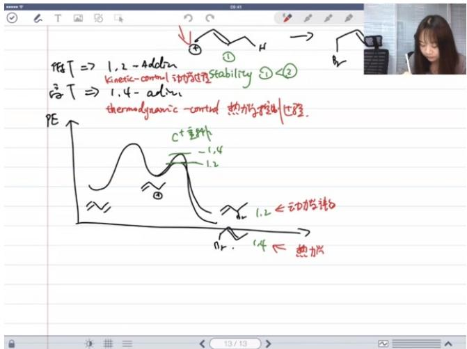

text_image

PE
⇒ 1.2 - 4adm
Kinetic-control 动学过程 Stability ① <②
CE T ⇒ 1.4 - admi
thermodynamic-control 热松控制过程.
PE
C+重斜
-1.4
1.2
1.2 ← 动学路径
0.4 ← 热松
13/13

○ 动力学控制：

■ 特征：活化能低（1,2-加成）  
■ 条件：低温不可逆反应  
■ 产物：取代度较低的结构

○ 热力学控制：

■ 特征：产物能量低（1,4-加成）  
■ 条件：高温可逆反应，时间足够长  
■ 产物：取代度更高的稳定结构

\- 可逆性关键：只有在可逆反应中高温条件才能获得纯热力学产物

11）应用案例 42:49

● 例题:共轭双烯反应产物

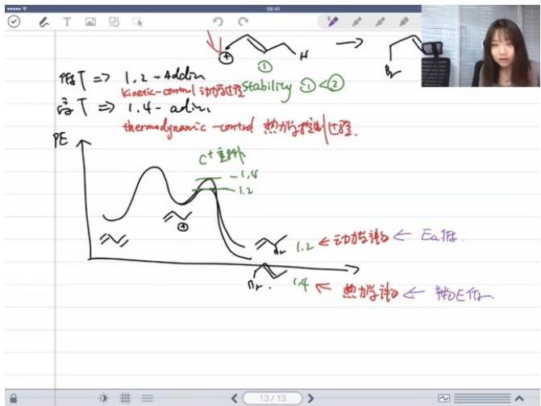

text_image

PE
⇒ 1.2 - 4adon
Kinetic-control 动态过程 Stability ① <②
C²T ⇒ 1.4 - adon
thermodynamic-control 热力学控制过程.
C+重斜
-1.4
-1.2
1.2 ← 动态键O ← Ea序.
1.4 ← 热力学键O ← 端DE序.

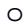

# - 反应产物数量差异:

■ 对称双烯（a型）与HBr反应生成2个产物  
■ 不对称双烯（b型）与HBr反应生成4个产物

# ○ 机理分析：

■ 第一步加氢时，若两个烯烃位点等价（对称结构）则产物较少  
■ 不对称结构中，氢可加在不同位点，分别产生1,2-加成和1,4-加成产物

# ○ 碳正离子稳定性：

在1,2,3,4位体系中，碳三位置形成的碳正离子更稳定（共轭效应>超共轭效应）  
■ 因此氢优先加在碳四位置，使碳正离子位于碳三

# ○ 产物构型：

■ 1,4-加成产物为热力学稳定产物，通常呈反式构型（大基团反向排列）  
■ 1,2-加成产物需要考虑立体化学，可能产生R/S构型对映体

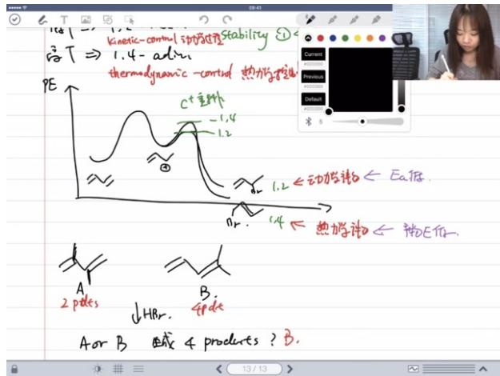

text_image

Kinetic-control 动态过程 Stability ①
³T ⇒ 1.4 - admi
thermodynamic-control 热力学控制
Current
Previous
Default
* #
PE
C+亚钾
-1.4
1.2
1.2 ← 动态酶 ← Ea价.
1.2 ← 热力学酶 ← 被E价.
A
2 pde
B
↓HBr
←pde
A or B 酸 4 procluts ? B.
13/13

# ○ 立体效应说明：

■ 实际反应中需考虑立体效应，可能产生内消旋体或外消旋体  
■ 题目讨论时通常忽略立体效应简化分析

# ○ 记忆要点：

■ 双烯对称性决定产物数量：对称→2产物，不对称→4产物  
■ 1,4-加成产物具有热力学稳定性优势   
■ 碳正离子稳定性遵循共轭效应优先原则

# 二、芳香性 56:44

1. 分子轨道理论简介 58:24  
1）乙烯的分子轨道 59:20

# - 乙烯的分子轨道形成过程

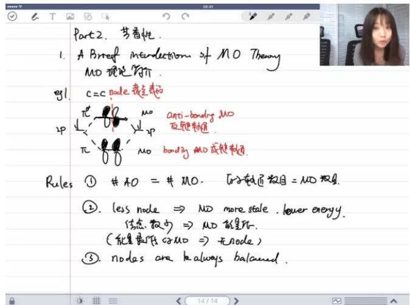

text_image

Part2. 芳看性.
1. A Brief meurolection of MO Theory
MD 规论符 π.
gyl. c = c node 数量法
π  μo anti-bonding MO
↓ ↓ ↓ p 反矩制造
π  μo bonding MO 成矩制造.
Rules ① # AO = # MO. [σσ矩阵数目 = MO 标准]
②. less node ⇒ NO more stale, lower energy.
(能是极低 σσ AO ⇒) 无 node)
③. nodes are k always balanced.

○ 轨道杂化基础: SP2杂化的碳原子各剩一个p轨道，每个p轨道填充一个电子  
○ 轨道组合原理: 两个原子轨道组合形成等数量的分子轨道（1个成键轨道π，1个反键轨道π\*）  
○ 能量变化: 组合后一个轨道能量上升（ $\pi^{*}$ ），一个轨道能量下降（ $\pi$ ）

# ● 分子轨道的形状与节点 01:00:42

○ 成键轨道特征: $\pi$ 轨道由两个p轨道同相重叠形成, 无节点（电子云密度最大区域）  
- 反键轨道特征: $\pi^{*}$ 轨道由两个p轨道异相重叠形成, 存在一个节点 (电子云密度为零的平面)  
相位表示: 黑色表示波函数正相位, 白色表示负相位, 节点处正负相位相互抵消

# ● 分子轨道的书写规则 01:02:36

○ 数量守恒: 原子轨道数目=分子轨道数目 $(n_{AO}=n_{MO})$   
○ 能量规律: 节点数越少，分子轨道能量越低（最低能级轨道无节点）  
◦ 节点特性: 节点总是平衡分布（对称分布）  
○ 能量守恒: 分子轨道体系总能量与原子轨道体系总能量相同

# 2）一三丁二烯的分子轨道 01:06:06

# ● 一三丁二烯的分子轨道概述 01:06:11

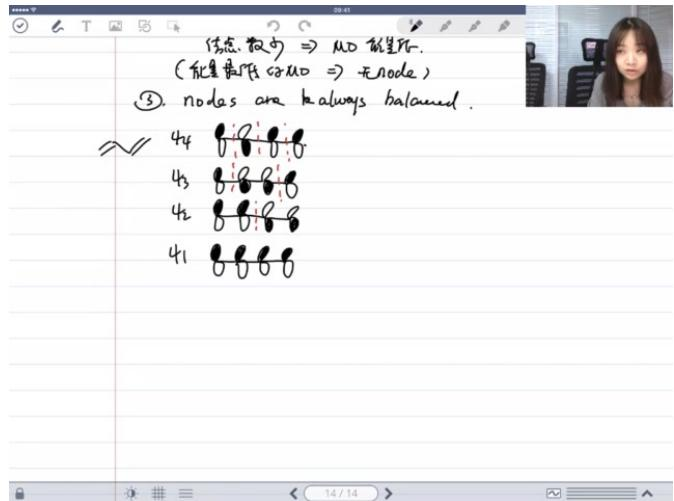

text_image

信态数少 ⇒ MD 能量所。
(能量最低的MD ⇒ 无node)
③. nodes are always balanced.
44
43
42
41

○ 轨道数量: 4个p轨道组合形成4个分子轨道（φ1-φ4）  
○ 能级分布: 轨道能级从低到高排列，对应节点数从0到3递增

# - 分子轨道的命名与能级 01:06:35

○ 命名规则: 链状共轭体系从低到高依次命名为 $\varphi1$ 、 $\varphi2$ 、 $\varphi3...$   
○ 能级关系: 对于n原子体系，最高能级轨道有n-1个节点

● 分子轨道的图形表示 01:07:51

○ φ1轨道: 无节点，所有p轨道同相重叠  
○ φ2轨道: 1个节点（位于体系中心），两侧轨道相位相反  
- φ3轨道: 2个对称分布的节点，相邻轨道相位交替变化  
○ φ4轨道: 3个节点，所有相邻轨道相位均相反

● 分子轨道中节点的特点与规律 01:08:07

- 递增规律: 每升高一个能级，节点数增加1个   
- 对称要求: 节点必须保持空间对称分布  
相互作用: 无节点区域轨道同相重叠（成键），有节点区域轨道异相重叠（反键）  
○ 电子分布: 节点处电子云密度为零，是电子出现的概率零点

# 3）应用案例 01:10:43

# - 分子轨道理论基本原理

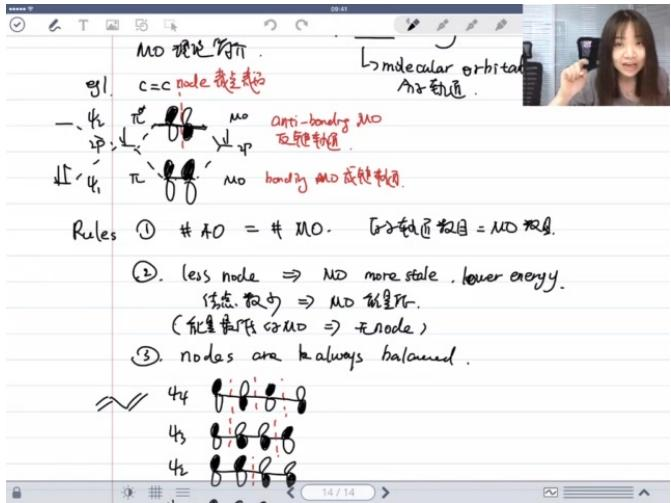

text_image

MD 理论简介
c=c node 裁定式法
L molecular orbital
分子轨道.
一、4i
π → μo
反矩制度
-4i
π → μo
bondy MD 成像数。
Rules ① # A0 = # MO. [子轨迹数目=NO模量.
②. less node ⇒ NO more stale, lower energy.
结点数少 ⇒ MD 的量化.
(能量越低)或A0 ⇒ 无node)
③. nodes are always balanced.
44
43
42

○ 分子轨道形成规则

■ 轨道数目守恒：原子轨道(AO)数目等于分子轨道(MO)数目。例如2个p轨道组合形成2个分子轨道。  
■ 节点与能量关系：节点越少的分子轨道能量越低。无节点轨道( $\pi$ )能量最低，节点数依次增加( $\pi^{*}$ 等)则能量升高。  
■ 节点对称性：节点分布必须保持对称平衡，奇数个轨道的体系会出现非键轨道(non-bonding orbital)。

○ 电子填充原则

■ 填充顺序: 电子优先填入能量最低的轨道，遵循泡利不相容原理和洪特规则。  
■ 能量计算: 以p轨道基线为 $\alpha$ ，成键轨道能量为 $\alpha - \beta$ ，反键轨道为 $\alpha + \beta$ （ $\beta > 0$ ）。例如乙烯体系总能量为 $2\alpha - 2\beta$ 。  
■ 键级计算: 键级=(成键电子数-反键电子数)/2，用于定量描述键的强度。

○ 共轭体系稳定性

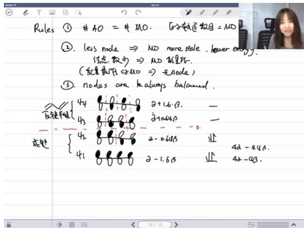

text_image

Rules ① #AO = #MO. [子数位数目=NO]
②. less node ⇒ ND more scale, lower empty.
结点数少 ⇒ MD 能量所.
(能量最低或MD ⇒ 无node)
③. nodes are always balanced.
反链半径
{
44
43
42
41
2+1.6/3.
2+0.6/3.
2-0.6/3.
2-1.6/3.
}
旋链
42 - 4.4.6.
42 - 4.3.

离域效应: 共轭体系通过电子离域降低体系能量，如丁二烯(4α - 4.4β)比孤立双键(4α - 4β)更稳定。  
■ 实验验证：共轭体系的稳定性首先通过实验发现，后由量子化学计算验证，形成"常识性"认知。

# - 链状共轭体系分子轨道

# ○ 丙烯体系

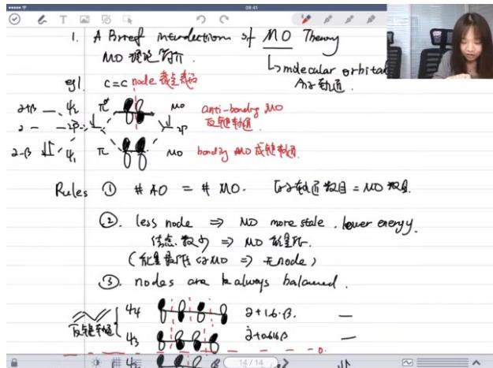

text_image

1. A Brief Meandecnom of MO Theory
MO理论简介.
C=C node 赛定轨道
2-4 - 4
π Mo anti-bonding MO
2 - 4 - 4 反链轨道
2-β 45 - 4
π Mo bonding MO 成键轨道
Rules ① # AO = # MO. [子轨道数目=NO数量]
②. less node ⇒ ND more stale, lower energy.
结点数少 ⇒ MO 的量所。
(能量最低 σ/σ₀ ⇒ 无 node)
③. nodes are always balanced.
反链轨道 44 2+16·β.
43 2+440
-0

■ 轨道分布: 三个p轨道形成三个分子轨道：成键( $\pi$ )、非键(n)、反键( $\pi^{*}$ )

■ 电子构型:

\- 正离子： $\pi^{2}$ （最稳定）

\- 自由基： $\pi^2 n^1$

\- 负离子： $\pi^2 n^2$

# ○ 丁二烯体系

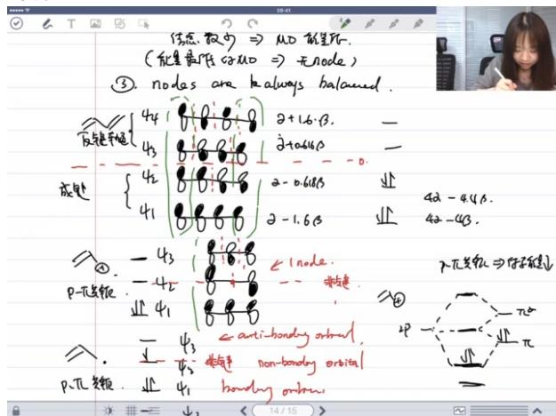

text_image

状态数少 ⇒ MD 能量所.
(能量值的OD ⇒ 无node)
③ nodes are always balanced.
反链平移 {44} 2+1.6·β.
43
旋地 {42} 2-0.6dB
41
4α - 4.46.
42 - 43.
- 43 = node.
p-π矩阵 - 42 非键.
正 41
← anti-bonding orbitals.
- 43 非键 non-bonding orbitals.
p-π矩阵 - 41 bonding orbitals.
7π共轭 ⇒ 电子链子.
- π
正 π

■ 前线轨道:

● HOMO: 第二个成键轨道  
● LUMO: 最低反键轨道

# 绘制技巧:

- 最左侧轨道相位固定  
● 相邻轨道右侧相位必须翻转  
- 节点数依次增加且对称分布

# ○ 五轨道体系

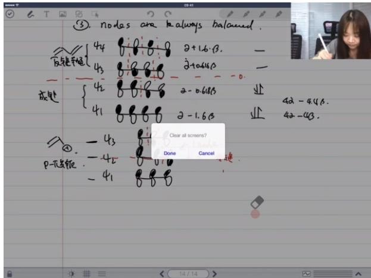

text_image

③. nodes are always balanced.
反链半径
44 2+1.6·B.
43 2+0.640
42 2-0.640B
41 2-1.6B
42 -440.
42 -43.
②. -43
-42
-41
Clear all screens?
Done Cancel
P-π矩阵

# ■

# 节点特征:

- $\psi_{5}$ : 4个节点，相邻轨道相位全反   
- $\psi_{4}$ : 3个对称节点  
- $\psi_{3}$ : 2个对称节点（必须通过特定原子）

# - 分子轨道理论应用

# ○ 周环反应分析

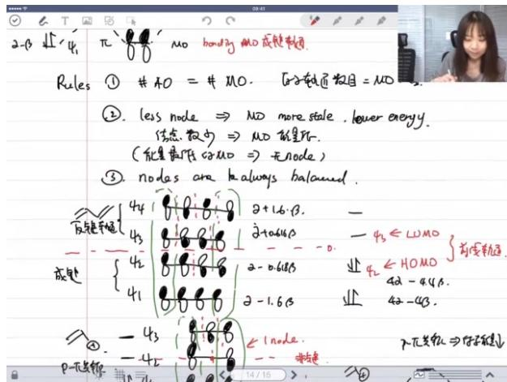

text_image

2-β 45, 41
Rules ① #AO = #MO. [子数证数目=NO]
②. less node ⇒ NO more scale, lower energy.
结点数少 ⇒ MO 数量所.
(能量级的COMO) ⇒ 无node)
③. nodes are always balanced.
反链传递 { 44
43
42
41
2+1.6·β.
2+0.68°
2-0.68°
2-1.6°
2+1.6·β.
2+0.68°
2-0.68°
2-1.6°
2+1.6·β.
43 ≤ LOMO
前变轨迹.
故
42 ≤ HOMO
42 - 4.4.6.
42 - 4.3.
43 = -43
42 = -42
p-元半径 14/15
π-π关系 ⇒ 子子键

# Diels-Alder反应:

- 丁二烯HOMO与乙烯LUMO相位匹配  
● 轨道重叠决定反应位点（端基碳成键）

# ■ 轨道对称性守恒: 反应过程中轨道相位关系保持不变

# ○ 常见错误提醒

# 节点绘制:

● 节点位置必须精确，不能随意移动  
● 奇数体系中心轨道必为节点

# 能量比较:

● 最高MO能量必高于最高AO能量  
- 离域体系能量必低于孤立体系

# - 记忆要点

# 口诀:

● "节点少，能量低；节点对称要牢记"   
● "奇体系，非键出；偶体系，全配对"

# 验证方法:

● 相邻轨道右侧相位必须翻转  
- 节点数=轨道序号-1

# 2. 环状共轭体系的分子轨道理论 01:38:34

# 1）苯环的分子轨道 01:39:06

text_image

43
42
41
2.
15/15

\- 轨道数量：苯环有6个p轨道，对应6个分子轨道（ $\varphi_{1}$ 到 $\varphi_{6}$ ）

# ● 能级分布：

○ $\varphi_{1}$ （最低能级）和 $\varphi_{6}$ （最高能级）最容易绘制  
○ $\varphi_{1}$ 有0个节点， $\varphi_{6}$ 有3个节点（与直链体系n-1规律不同）  
○ $\varphi_{2}$ 和 $\varphi_{3}$ 能量相等，各含1个节点  
○ $\varphi_{4}$ 和 $\varphi_{5}$ 能量相等，各含2个节点

# - 轨道形状:

○ 单节点轨道截面可呈现两种相位分布  
- 双节点轨道相邻区域相位必须相反

● 电子排布：6个π电子填满 $\varphi_{1}$ 、 $\varphi_{2}$ 、 $\varphi_{3}$ 三个成键轨道  
● 芳香性本质：成键轨道全满且反键轨道全空，体系能量最低

# 2）一三丁二烯的分子轨道 01:44:37

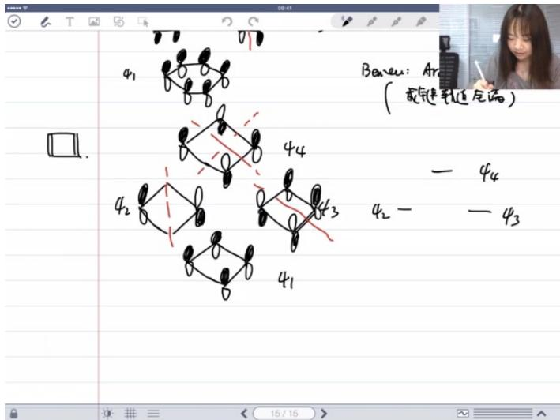

text_image

Beneu: Ar
(成年年近全端)
-
44
42-
43
41
44

# ● 能级特点：

○ $\varphi_{1}$ 为最低能级  
○ $\varphi_{4}$ 含2个节点为最高能级  
○ $\varphi_{2}$ 和 $\varphi_{3}$ 能级相同（各含1个节点），位于非键轨道线

● 电子排布：4个π电子中2个填 $\varphi_{1}$ ，剩余2个分别占据 $\varphi_{2}$ 和 $\varphi_{3}$

\- 反芳香性：

○ 半满的非键轨道导致体系不稳定  
- 可类比双自由基状态  
- 与环张力理论形成互补解释

3. 如何预测环状共轭体系的芳香性 01:48:44

1) Frost Circle规则 01:50:55

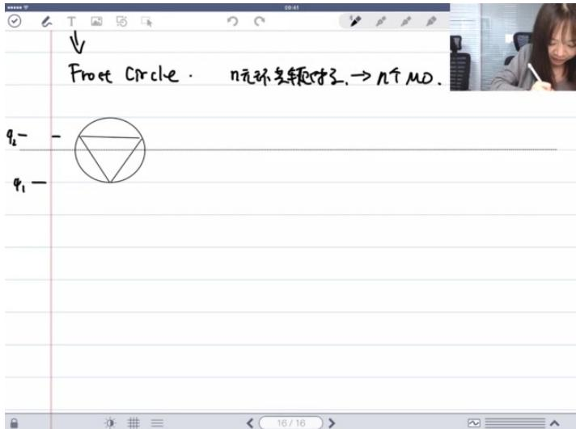

text_image

Frot Circle. n元环复数时,→几个MD.
q₂
φ₁

● 基本原理：

○ 绘制正n边形，一个顶点必须位于图形底部中点  
- 水平中线代表非键轨道能级  
○ 每个顶点对应一个分子轨道能级

\- 应用步骤：

○ 确定环的大小（n值）  
○ 绘制对应正多边形   
- 顶点在水平线下方为成键轨道，上方为反键轨道  
○ 位于水平线上的为简并非键轨道

\- 稳定电子数：

○ 三元环：2电子（ $\varphi_{1}$ 填满）  
○ 四元环：2或6电子（考虑非键轨道）  
○ 五/六元环：6电子  
- 七元环：6电子  
○ 八元环：6或10电子  
- 九/十元环：10电子

● 记忆要点：

- 顶点位置决定能级高低  
○ 非键轨道存在时可能出现多个稳定电子数  
○ 奇数元环没有非键轨道

4. 休克规则 02:06:19

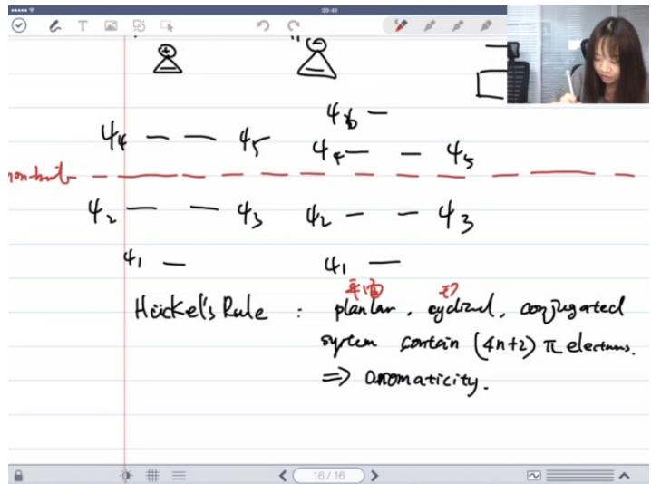

text_image

4₄ — — 4₅
4₆ — — 4₃
4₂ — — 4₃
4₁ —
4₁ —
Hückel's Rule : planar, cyclized, conjugated
system contain (4n+2) π electrons.
⇒ aromaticity.

● 适用条件：平面的、环状的、共轭的体系  
● 电子数要求：含有 $(4n+2)$ 个 $\pi$ 电子时具有芳香性  
- 记忆要点：

○ 常见满足条件的电子数：2,6,10（对应n=0,1,2）  
○ 中文记忆口诀："平面的环状共轭体系有4n+2个π电子就有芳香性"

\- 反芳香性：当体系满足平面、环状、共轭条件但含有4n个π电子时（如4,8个电子）

5. 芳香性的本质 02:07:53

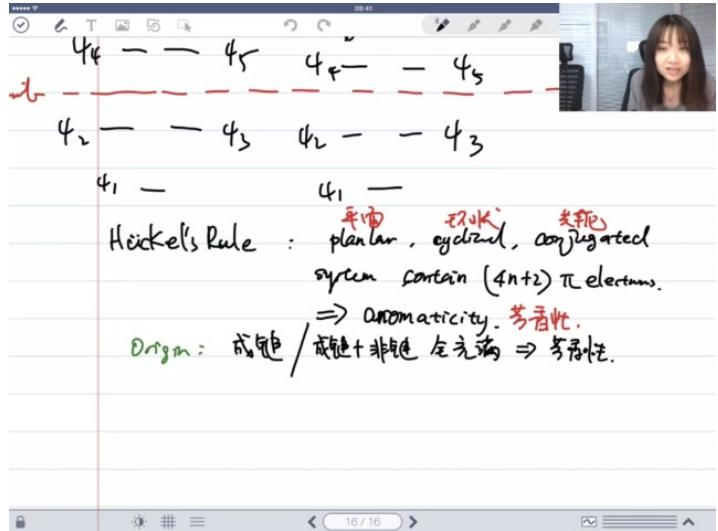

text_image

44 — — 45 4₄ — — 4₅
4₂ — — 4₃ 4₂ — — 4₃
4₁ — 4₁ —
Hückel's Rule : planar, cycland, conjugated
system contain (4n+2) π electrons.
⇒ aromaticity. 芳香化.
Origin: 成酯/成键+非键 全光滴 ⇒ 节尾性.

\- 成键特征：

- 成键轨道全充满：所有成键轨道（包括σ键和π键）电子完全填充  
○ 非键轨道半满：当存在非键轨道时，电子半满状态

\- 反芳香性特征：

- HOMO轨道：最高占据轨道位于反键轨道或非键轨道  
○ 电子排布：反键轨道电子半满（如环丁二烯的4个π电子体系）

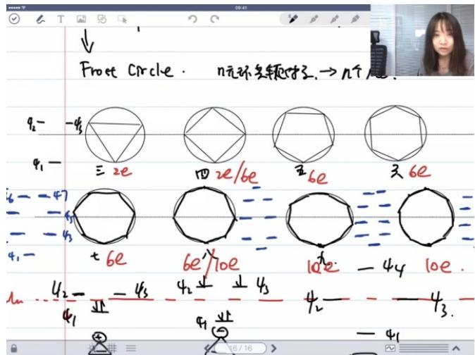

text_image

Froet Circle. n元环复轭对3.→n个
-45
=2e
四2e/6e
五6e
三6e
+6e
6e/10e
10e: -44 10e.
42- -43
41 Ⅱ
41 Ⅲ
-41
(6/16)

# ● 实验判定标准：

\- 核磁共振特征：环电流效应导致

■ 环外氢向低场位移（去屏蔽）  
■ 环内氢向高场位移（屏蔽）

○ 键长均一化：共轭体系中键长趋向均等

# - 理论发展：

○ 概念源于实验现象解释（如苯的特殊稳定性）  
◦ 量子力学理论后期提供理论支持  
○ 概念仍在不断完善中（如外芳香性、同芳香性等新概念）

# 1）典型例题分析

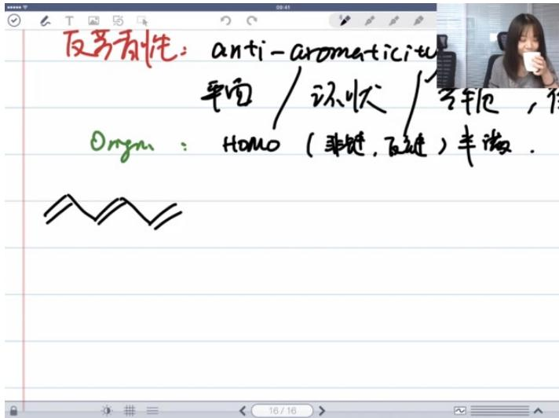

text_image

反弯曲性: anti-aromaticity
平面 / 试吹 / 丰粮，作
Orgn : Homo (非键, 反键) 丰粮。

# ●

# - 解题要点：

检查四个必要条件：平面性、环状结构、共轭体系、 $(4n+2)\pi$ 电子  
- 注意p轨道的连续性：所有环原子必须贡献p轨道形成连续环  
○ 典型反例：

环戊二烯：只有4个原子贡献p轨道（5元环但实际4电子体系）  
■ 环辛四烯（轮烯）：8电子体系（4n）表现反芳香性

# 6. 反芳香性 02:15:57

# 1）环辛四烯的反芳香性 02:16:05

text_image

n: 成链 / 成键+非链 全充满 ⇒ 多副性.

副性: anti-aromaticity.
平面 / 环状 / 节轮, 有 4n 个π由2.
gn : Homo (非键, 驱链) 丰满.

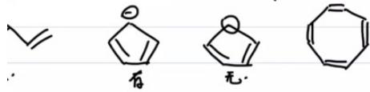

chemical

Hand-drawn chemical structures of cyclopentadiene and cyclohexane with Chinese labels

- 4n规则: 环辛四烯符合4n规则（n = 2），具有8个π电子，属于反芳香性体系  
● 非平面结构: 为避免反芳香性带来的不稳定性，分子会从平面结构扭曲成"澡盆型"（top shape）构型  
● 电子局域化：扭曲后形成4个彼此不相互作用的π键，电子局域在两个碳原子之间，成为正常π键  
● 能量效应: 形成π键能降低体系能量，但反芳香性效应会显著增加体系不稳定性

2）反芳香性与分子结构的关系 02:17:11

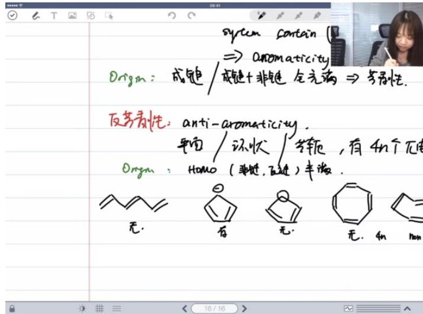

text_image

system contain
⇒ aromaticity
Origin: 成键/成键+非键 全充满 ⇒ 另异性.
反芳特性: anti-aromaticity.
平面 / 环状 / 分轭, 有 4n个元键
Origin: Homo (非键, 反链) 半微.
无. 有 无. 无. 4m non

结构要求:

- 平面性: 必须保持平面结构  
○ 环状共轭: 形成环状共轭体系  
○ 电子数: 含有4n个π电子（如环丁二烯n=1，环辛四烯n=2）

● 稳定性表现: 反芳香性体系在室温条件下通常不存在，因其极不稳定  
● 实验现象：实际观察到的多为通过结构变形（如SP3杂化、非平面构型）来避免反芳香性的分子

3）反芳香性与非芳香性的区别 02:18:22

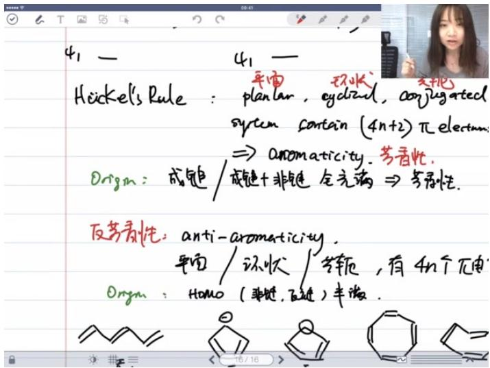

text_image

4₁ —
Hückel's Rule : 平面, 环状, 无化
    planar, cyclized, conjugated
    system contain (4n+2) π electron
⇒ aromaticity. 芳香比.
Origin: 成键 / 成键 + 非键 全充满 ⇒ 芳异性.
反芳异性: anti-aromaticity.
平面 / 环状 / 芳轭, 有 4n个π电
Origin : Homo (非键, 反键) 半微.

# 定义区别:

- 反芳香性: 满足平面、环状、共轭条件但含4n个π电子（如平面环丁二烯）  
○ 非芳香性: 不满足平面或共轭条件（如扭曲的环辛四烯）

# ● 稳定性关系:

○ 所有反芳香性体系都可称为非芳香性  
- 但非芳香性不一定都是反芳香性

● 结构关键: 平面性是区分两者的关键因素，非平面结构只能是非芳香性

4）例题1：判断物质的芳香性 02:20:31

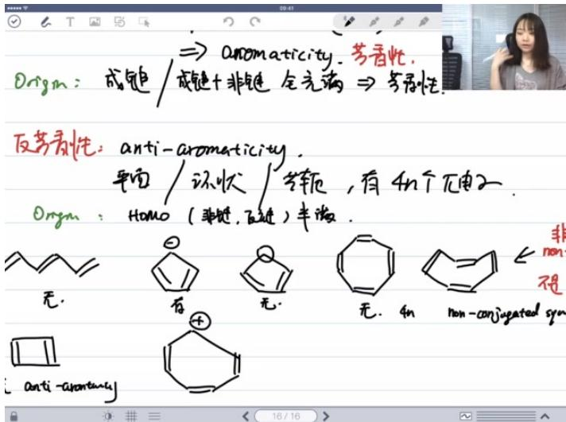

text_image

Origin: 成键/成键+非键 全充满 ⇒ 等属性.

反芳特性: anti-aromaticity.
平面/环状/等距,有4n个π电子
Origin: Homo (非键,互链)丰微.

无.
有
无.
无. 4n non-conjugated sym
非
non-
不是
anti-aromaticity

# ● 题目解析

○ 结构分析: 环状结构, 碳正离子提供空p轨道形成共轭  
○ 电子计数: 6个π电子 (4n + 2, n = 1)  
- 平面性: 通常假设会自发形成平面以获得芳香稳定性  
- 结论: 具有芳香性

# ● 变体分析:

○ 碳正离子变为碳负离子时:

■ 电子数变为4个（4n）  
■ 为避免反芳香性，会采取SP3杂化形成非平面结构  
■ 结论：非芳香性

5）碳正离子与碳负离子的芳香性 02:21:54

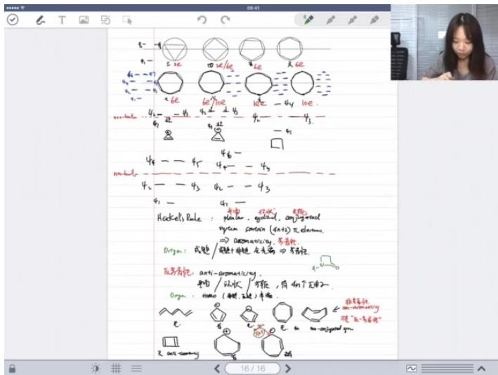

text_image

6- 
n- 
6- -7 
4- -5 
n- -3 
4- -2 
4- -1 
4- -0 
4- 4
4- 4
4- 4
4- 4
4- 4
4- 4
Hacket's Rule : Hacket, 约水, 双极
Hacket, gasket, conjugated
cyclic sinter (add) is electron.
Origin: 强键/旋转/角键, 内流端, 四角键
反考考虑: a +1 - Geometricing.
平面/动水/平铺, 同 4n个正曲2.
Origin: Heto (触底, 正边) 平铺.
E
E
E
E
E
E
E
E
E
E
E
E
E
E
E
E
E
E
E
E
E
E
E
E
E
E
E
E
E
E
E
E
E
E
E
E
E
E
E
E
E
E
E
E
E
E
E
E
E
E
E

# ● 杂化影响:

- SP2杂化：形成平面结构，可能产生芳香性/反芳香性  
- SP3杂化：破坏平面性，消除反芳香性但导致电荷局域化

# ● 稳定性矛盾:

○ 共轭稳定效应与反芳香性不稳定效应的权衡  
◦ 实验表明反芳香性回避是更主导的因素

# ● 实例分析:

○ 环戊二烯碳负离子：

■ 若SP2杂化：6π电子→芳香性  
■ 实际SP3杂化：避免平面结构

○ 环庚三烯碳正离子：

6π电子→芳香性  
■ 比环戊二烯碳正离子（4π电子）更稳定

6）反芳香性对物质性质的影响 02:31:33   
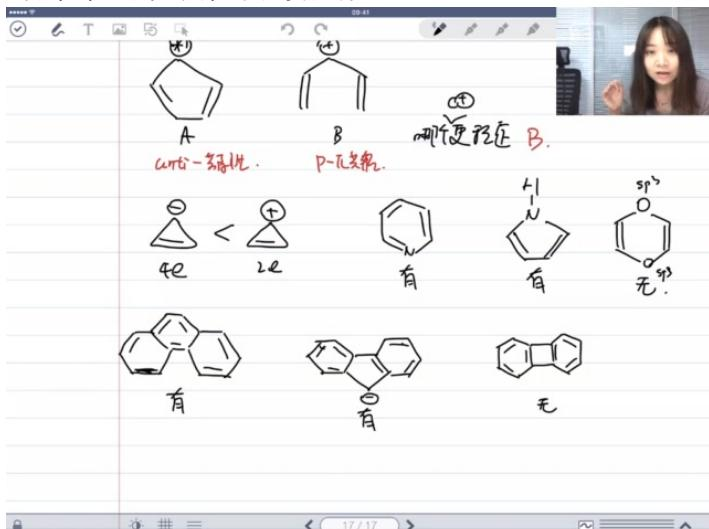

chemical

Hand-drawn chemical structures of naphthalene derivatives with Chinese labels and reaction conditions

● 稳定性特征：四圆环体系由于无法有效构成共轭，表现为不稳定性，容易发生开环反应  
● 键长特征：中间两根键表现为单键键长（非单双键交替），不符合芳香体系键长均一性要求  
- 方向性判定：从稳定性和键长特征两方面均未表现出芳香性，因此总体不具有方向性特征  
● 电子体系：若强行形成共轭，将构成不稳定的四电子环状体系（不符合4n+2规则）

# 7）复杂分子芳香性判断方法 02:32:57

# - 七五环并合体系

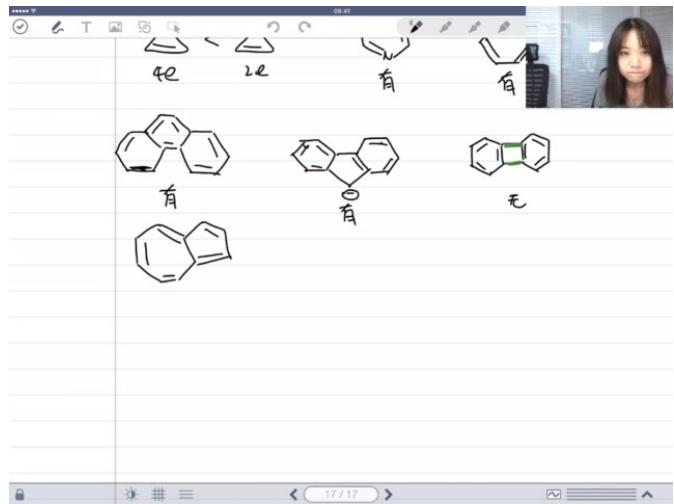

chemical

Hand-drawn chemical structures of naphthalene derivatives with Chinese labels and a photo of a person in the upper right corner.

# 整体分析法：

■ 总电子数：10个π电子（符合4n+2规则，n=2）  
■ 所有原子均能提供p轨道形成共轭体系

# ○ 分离分析法：

■ 将七圆环视为正离子（失去1电子），五圆环视为负离子（得到1电子）  
■ 七圆环正离子：形成6电子体系（符合芳香性）  
■ 五圆环负离子：形成环戊二烯负离子（6电子体系，符合芳香性）

○ 结构特征：整体保持电中性，分离后两部分均满足芳香性条件

# ● 非闭环共轭体系

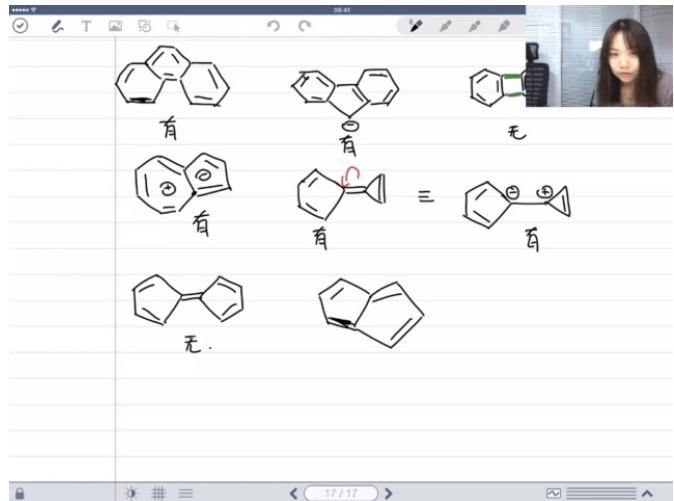

chemical

Hand-drawn chemical structures of naphthalene derivatives with Chinese labels and a photo of a person in the background

电子离域特征：双键电子显著偏移形成极性结构（实测偶极矩较大）

# ○ 等效转化法：

■ 双键电子向左迁移，等效转化为环戊二烯+环丙烯正离子组合  
环戊二烯：6电子芳香体系  
■ 环丙烯正离子：2电子芳香体系（符合4n+2，n=0）

判定要点：虽不构成完整闭环，但通过电子重排可转化为芳香性片段组合

# - 双五元环并合体系

电子需求冲突：两个五元环均需获得1个电子才能满足芳香性，无法同时实现

# 整体分析法：

■ 总π电子数：8个（4n体系，n=2，不符合芳香性条件）  
■ 所有p轨道原子形成完整闭环结构

○ 构象调整：体系可通过空间扭曲避免形成反芳香性平面结构

# 8）酸性强弱与芳香性的关系 02:36:46

# ● 酸性比较与芳香性影响

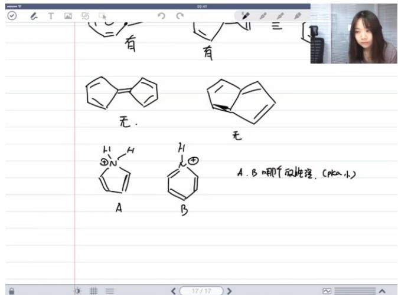

chemical

Hand-drawn chemical structures of naphthalene derivatives labeled A and B, with Chinese annotations and a photo of a person in the corner.

芳香性对酸性的影响：化合物A失去质子后形成的共轭碱A-具有芳香性（无方向性→有方向性），这种芳香性带来的驱动力使其更容易失去质子，因此A的酸性更强（pKa更小）。  
☐ 共轭碱稳定性：B及其共轭碱B $^{-}$ 都保持芳香性（始终有方向性），因此质子得失的驱动力差异较小。具体表现为B的孤对电子与环共平面，不参与π电子体系构建。  
☐ 实验判定原则：当芳香性变化产生显著能量差异时（如A的情况），酸性强弱可通过芳香性获得的驱动力大小来判断。

# - 环状体系的芳香性判定

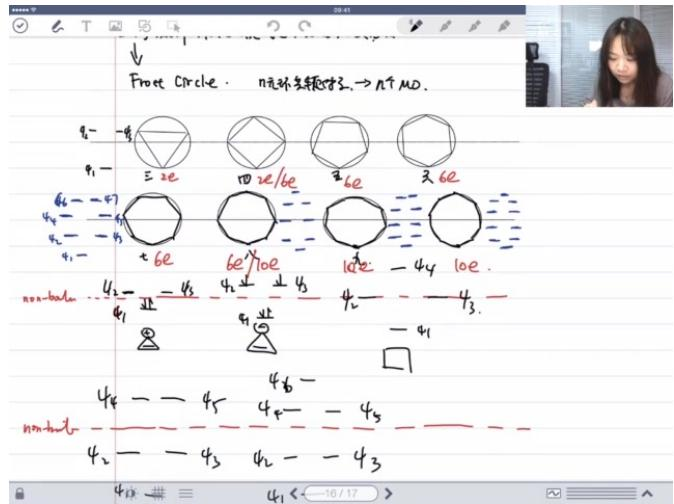

text_image

Froot Circle. n元环条轴对点→n个MD.
q1- -4
q1- = 2e
66 - -47
4x - -47
4x - -47
41- +6e
non-balance - 42 - -43
41 2E
41 2E / 6e
42 2E / 10e
42 2E / 10e
42 - -43
42 - -43
46 -
46 -
46 - -45
46 - -45
46 - -45
42 - -43
42 - -43

# ○ 键角与共面性：

■ 十圆环键角计算公式： $180^{\circ} \times (n - 2) / n \quad (n=10)$ ，实际键角显著大于 $120^{\circ}$ ，导致非平面结构  
■ 反式双键存在位阻效应（氢原子空间碰撞），进一步破坏共面性

# - 芳香性必要条件：

■ 平面性（planarity）是芳香性的前提条件  
■ 八元环二负离子通过释放环张力实现平面化，满足 $4n+2$ 规则（如 $10\pi$ 电子）时具有芳香性

# ○ 特殊案例：

■ 同芳香性（homoaromaticity）：当p轨道能通过空间有效重叠（不严格间隔σ键）仍可使体系能量显著降低  
■ 示例：螺环体系虽非严格共面，但多数p轨道仍能重叠保持芳香性

# - 芳香性本质与扩展

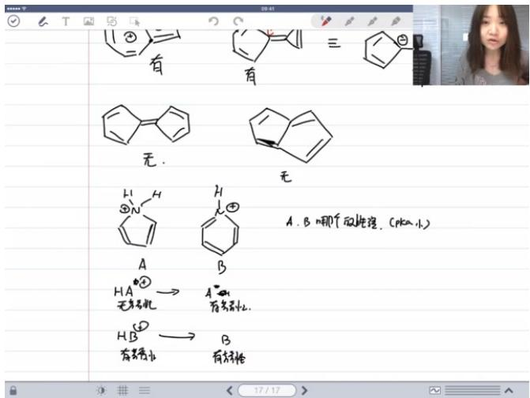

chemical

Hand-drawn chemical reaction equations showing isomeric and isohylened structures of naphthalene derivatives with labeled reactants A, B, H, and HAc

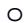

# ○ 能量判据：

■ 芳香性本质特征：体系能量显著降低 ( $\Delta E > 20kJ/mol$ )   
■ 实验表征：异常稳定性与键长均一化

# ○ 电子规则：

■ 芳香性：平面环状共轭体系含 $4n+2\pi$ 电子（成键轨道全充满）  
■ 反芳香性：含 $4n\pi$ 电子（半充满轨道存在未配对电子）

# ○ 现代定义：

在三个及以上原子范围内，原子轨道以轴向平行方式有效重叠使能量降低  
■ 包含非经典芳香体系（如σ芳香性、三维芳香性）

# 三、课程总结

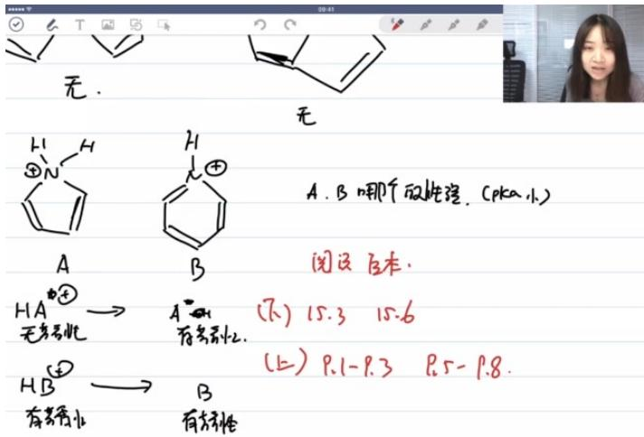

text_image

无.
A. B 哪个的性质连。(PKa 小)
A
B
阅读 互读。
HA
无差异化 →
A
有多弱化.
(下) 15.3 15.6
HB
有差异化 →
B
有多弱化.
(上) P.1-9.3 P.5-9.8.

酸性强弱比较：通过pKa值判断，pKa越小酸性越强

# - 典型pKa值：

○ HA的pKa范围：15.3-15.6（上）  
○ HB的pKa范围：1.9-9.8（下）

● 芳香性特征：HBB结构具有芳香性特征（17/17符合休克尔规则）

# - 反应类型预告：

\- 下节课重点：工准结构的书写方法

# 主要内容：芳环的取代反应机制

☐ 注：由于提供的课程记录内容较为零散且部分信息不完整，笔记主要基于可辨识的化学专业术语和数值进行整理。建议复习时重点关注：

- pKa值的比较方法  
- 芳香性判断标准

四、知识小结

<table><tr><td>知识点</td><td>核心内容</td><td>考试重点/易混淆点</td><td>难度系数</td></tr><tr><td>共轭体系定义</td><td>在≥3原子体系内p轨道轴向平行有效重叠使能量降低的体系</td><td>共轭效应与离域效应的区别</td><td>★★★</td></tr><tr><td>共轭双烯类型</td><td>聚集双烯(丙二烯)、共轭双烯(1,3-丁二烯)、孤立双烯</td><td>结构特征与稳定性对比</td><td>★★</td></tr><tr><td>共轭效应实验证据</td><td>1,3-丁二烯燃烧热比孤立双烯低15kJ/mol</td><td>反式比顺式稳定12kJ/mol</td><td>★★★★</td></tr><tr><td>1,4加成反应</td><td>低温产物(动力学控制) vs高温产物(热力学控制)</td><td>过渡态能量与产物稳定性关系</td><td>★★★★</td></tr><tr><td>分子轨道理论</td><td>原子轨道数=分子轨道数、节点越少能量越低</td><td>奇/偶数p轨道体系画法差异</td><td>★★★★★</td></tr><tr><td>休克尔规则</td><td>平面环状共轭4n+2π电子体系具有芳香性</td><td>环丙烯正离子(2e)的稳定性</td><td>★★★★</td></tr><tr><td>反芳香性</td><td>平面环状共轭4nπ电子体系(如环丁二烯)</td><td>实际通过变形避免反芳香性</td><td>★★★★</td></tr><tr><td>稠环芳香性</td><td>萘、蒽等稠环体系仍保持芳香性</td><td>非六元环部分可能破坏共轭</td><td>★★★★</td></tr><tr><td>杂环芳香性</td><td>呋喃/吡咯等杂环的孤对电子参与共轭</td><td>p-π共轭与芳香性关系</td><td>★★★★</td></tr><tr><td>前线轨道理论</td><td>HOMO-LUMO相互作用决定反应活性</td><td>周环反应中的轨道对称性</td><td>★★★★★</td></tr></table>