# 一、课前讲话08:52

text_image

Zchem210-L4
1 / 1

- 作业反馈：上次作业相对简单，但提交的同学中无人全对，主要错误原因是粗心。习题解答已发至群内，建议自行核对答案，发现问题可在群内讨论。

● 课程安排：

○ 完成烯烃加成内容的讲解  
- 补充烯烃的其他反应细节  
○ 讲解炔烃的性质   
- 若时间允许将复习反应内容并讲解难题

\- 命名规则复习：

○ 烯烃：以"-ene"结尾   
- 炔烃：以"-yne"结尾   
○ 烷烃：以"-ane"结尾

# 二、烯烃加成反应

# 1. 水加成反应

# - 两种方法：

- 直接水加成：通过酸催化将水分子加到烯烃双键上  
○ 间接水加成：先形成中间体再转化为醇

● 注意事项：反应过程中需注意区域选择性和立体化学控制

# 三、上节回顾11:16

# 1. 马氏加成 11:23

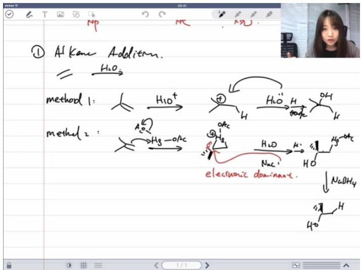

chemical

Hand-drawn chemical reaction scheme showing alkanes reacting with water to form two methods, with electron transfer and hydrolysis steps indicated.

- 酸催化机理：通过酸催化使烯烃形成更稳定的碳正离子中间体，氢加在取代度较少的碳上，最终得到马氏加成产物。  
- 中间体稳定性：反应遵循马氏规则的本质是让碳正离子中间体尽可能稳定，取代基越多（烷基供电子效应）的碳正离子越稳定。  
- 自由基加成对比：在自由基引发剂存在时，卤代氢加成会得到反马氏产物，因为自由基中间体也是取代度越多越稳定，但加成顺序相反（先加卤素自由基再加氢）。  
● 合成局限性: 该方法可能发生碳正离子重排，从合成角度考虑不够理想。

# 2. 腔汞化反应 13:12

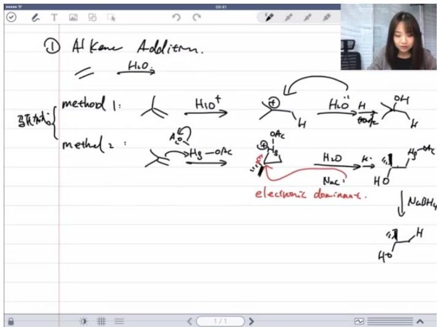

chemical

Hand-drawn chemical reaction scheme involving Alkanes Addition and electron transfer, showing two methods (method 1 and method 2) with water molecules and electron transfer pathways.

# - 反应步骤:

- 第一步: 醋酸汞与烯烃反应形成汞正离子中间体  
- 第二步: 水分子作为亲核试剂进攻（也可以是其他亲核试剂）  
- 第三步: 去汞化还原得到最终产物

- 电子效应主导：与酸催化环氧开环类似，是电荷效应主导的反应，亲核试剂进攻能更好稳定正电荷的碳（取代度多的碳）。  
● 优势: 相比酸催化法，该方法不会发生碳正离子重排，当需要抑制重排时使用。  
● 产物特征: 同样得到马氏加成产物（氢加在取代度少的碳上）。

# 3. 硼氢化-氧化反应

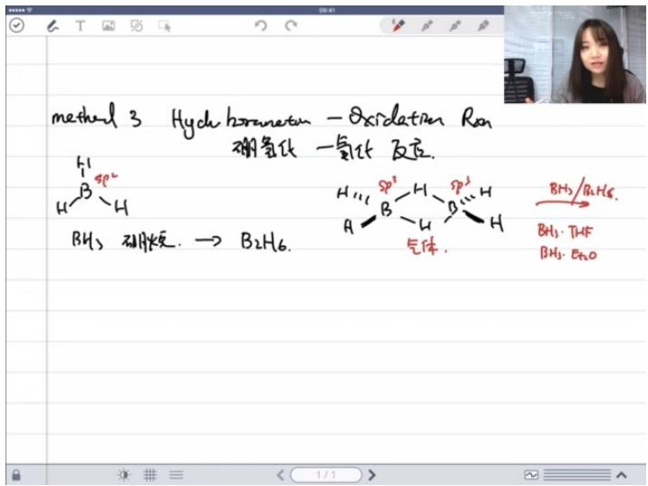

text_image

method 3 Hydro boronate - Oxidation Ro
硼氧化 - 氯化 反应.
H₁ B₆H₂
B₂H₃ 硼酸. → B₂H₆.
→ H₁₁ SP³ H₁ SP³ H
A B H
气体.
→ BH₃/Br₂H₆.
BH₃·THF
BH₃·Et₂O

# - 试剂特性:

○ 实际结构: 硼烷 $(BH_{3})$ 不稳定，实际以二聚体 $B_{2}H_{6}$ 形式存在，含三中心两电子键  
◦ 实验室形式: 常用 $BH_{3}$ -THF或 $BH_{3}$ -醚配合物溶液

# - 反应机理:

○ 硼氢化阶段: 协同反应过程，硼和氢同时加成到双键上  
- 氧化阶段: 用过氧化氢在碱性条件下氧化, 最终得到醇

# - 反马氏选择性:

位阻效应: 体积较大的硼倾向于加到取代度小的碳上  
○ 电子效应：硼氢键极性使电子偏向硼接近的碳，导致取代度多的碳带部分正电荷更稳定

# ● 产物特征: 最终实现反马氏加成（羟基加在取代度少的碳上）

# 4. 膨氢化氧化反应 15:44

# 1）反码式加成 20:36

# - 烯烃硼氢化氧化反应产物判断 28:17

\- 反应机理与立体化学

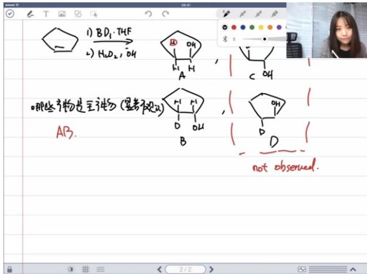

text_image

1) BD₁·THF
2) H₂O₂, OH
哪些产物是主产物(显著反应)
AB.
B
C OH
D
not observed.

同侧加成机制：硼（B）和氢（H/D）总是同侧加入烯烃，这是一个协同过程（concerted process），形成四元环过渡态  
■ 构型保留：羟基引入时通过 $BH_{3}$ 分子内重排，但不改变烷基部分构型，最终羟基与氘（D）保持同侧  
■ 同位素标记：氘（D）是含1个质子和1个中子的氢同位素，用于追踪反应位点

○ 主产物判断示例 31:36

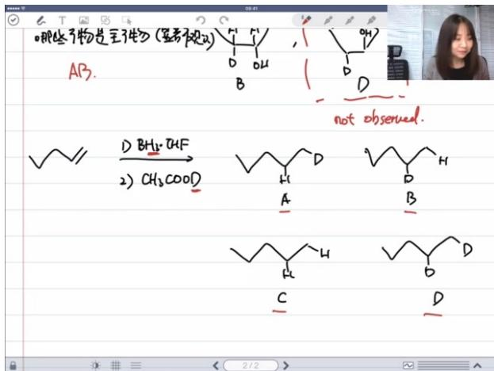

chemical

Hand-drawn chemical reaction diagram showing transformation of compound AB to CH3COOD with labeled structures A–D and conditions D, not observed.

# 典型反应步骤：

- $BH_{3} \cdot THF$ 试剂  
- $CH_{3}COOD$ (氘代乙酸) 处理

# ■ 产物分析：

● 主产物：A（羟基与D同侧）  
● 不可观测产物：B/C/D（违反同侧加成规则）

■ 机理说明：乙酸负离子进攻硼原子，断裂C-H键，氘最终进入产物

● BH3硼氢化氧化反应进阶 35:43

\- 反应中间体与区域选择性

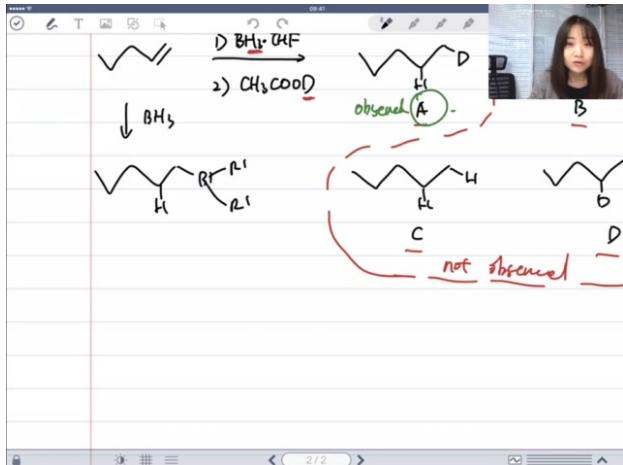

chemical

Hand-drawn chemical reaction diagram showing isomeric transformations of alkene with BH3 and CH3COO, including labeled structures A, B, C, D.

■ 中间体结构：通常表示为 $BR_{2}$ 形式（实际可能连接碳原子）  
■ 多重反应性：1分子 $BH_{3}$ 可与3分子烯烃反应（每个B-H键均可参与）  
■ 区域选择性：主要受电荷效应和位阻效应共同影响

\- 反马氏规则加成

■ 选择性本质：过渡态稳定性决定（活化能差异）  
■ 副产物存在性：一级碳与二级碳能量差不大，副产物仍可检测到  
■ 立体化学表示法：  
● 外消旋体标注：resemic前缀   
- 波浪键表示法：用\~代替竖线  
- ±符号标注法：正负号上下排列

● NineBBN试剂应用 38:58

○ 结构特性与优势

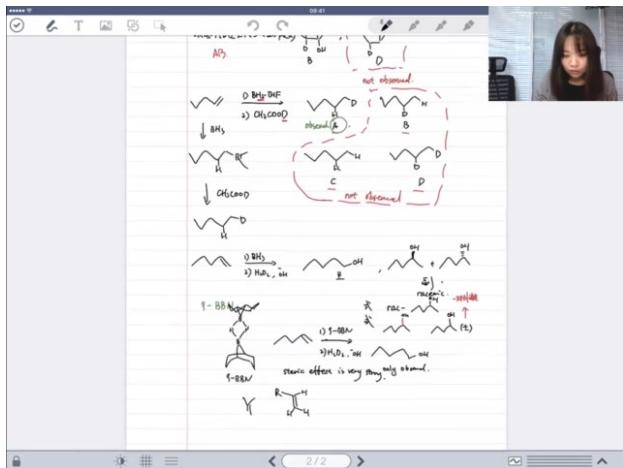

chemical

Chemical reaction scheme showing transformation of aldehyde to alcohol and then to a product with stereochemistry and structural changes

结构特征：二聚体形式，每个硼原子连接六元环结构  
■ 位阻效应：显著大于 $BH_{3}$ ，仅保留1个活性B-H键  
■ 合成价值：专一性制备一级醇的经典方法

# ○ 区域选择性控制

■ 位阻主导：当烯烃位阻差异不明显时，NineBBN可强制实现反马氏加成  
■ 反应通式:  
- NineBBN试剂  
- 氧化剂处理

■ 对比实验：普通烯烃用 $BH_{3}$ 即可，复杂烯烃需NineBBN

# - 反应机理归类

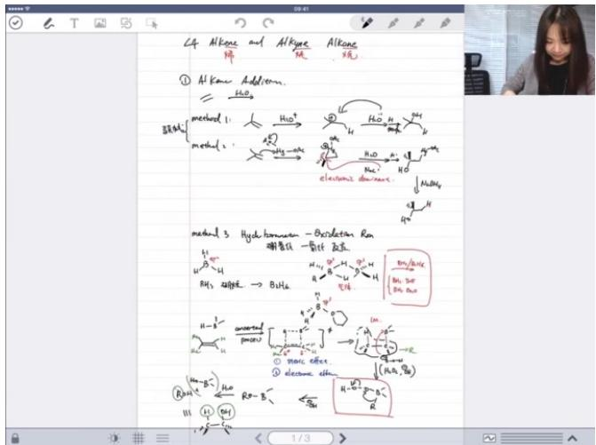

text_image

∠4 Alkene and Alkyne
烯
Alkene
烯
Alkene
烯
① Al Kene Addition.
= H2O
### method 1: H2O+ → ④ H2O H2H
method 2: H2O-→ H2O → H2O
electrons decrease. → MoH2
method 3: Hydro-hydroxymethane-Oxidation Run
### 硝酸化 - BHF 钼素
H2O- → H2O- → H2O
BHS OHFE → BHLa
H-b-1 → [m/z] [m/z] → (m/z) [m/z]
③ MoH2 ester → (m/z) [m/z]
④ oleucane elution
(Ren)-Rn-Rn-Rn-Rn
(1) OH
(1) OH
(1) OH
1/3

○ 共同本质：π键作为弱路易斯碱/亲核试剂

○ 反应家族：

■ 酸催化/汞催化水合   
卤化氢加成  
■ 硼氢化氧化

○ 电子流向：烯烃提供电子对参与反应

# 5. 卤化反应 42:23

# 1）卤化反应定义 42:36

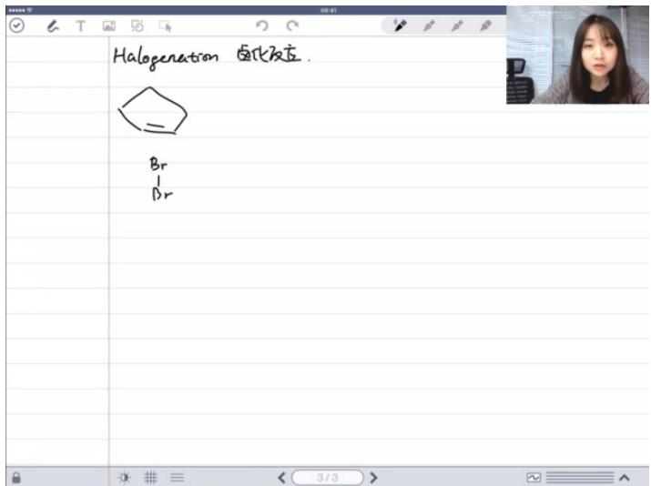

text_image

Halogenation 区化反应.
Br
Br

● 反应本质: 烯烃与卤素分子（如 $Br_{2}$ ）发生的加成反应，又称卤素加成反应  
● 键的特性:

- 卤素分子（如Br - Br）是非极性共价键  
溴和碘因原子半径大，极化性强，是良好的亲核试剂（nucleophile）

\- 反应机理:

○ 当溴分子靠近烯烃π键时，π电子会诱导溴分子产生偶极  
○ 形成三元环溴鎓离子中间体（捕捉实验证实其存在）  
- 最终通过反式开环得到二溴代产物

2）反应机理详解

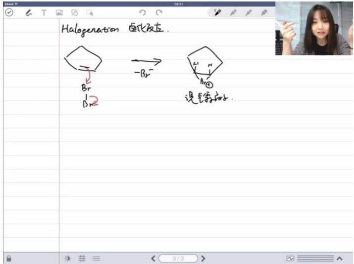

text_image

Halogenation 化化反应.
Br
Dn2 → Br⁻
混氧解水.
3/3

\- 中间体稳定性:

○ 三元环溴鎓离子比碳环稳定（环张力较小）  
○ 原因： $Br^{+}$ 离子半径大，键角更接近理想值  
- 对比：环氧乙烷 > 环丙烷（后者因全重叠构象和位阻极不稳定）

\- 立体化学:

- 溴负离子从反面进攻开环（反式加成）  
- 对称底物无选择性，不对称底物受位阻影响  
○ 示例：当存在甲基时，进攻远离甲基的碳为主产物

3）应用案例 49:30

\- 溶剂效应

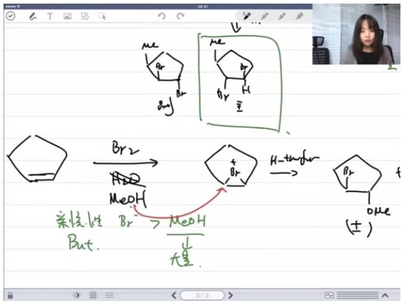

chemical

Chemical reaction diagram showing bromination and hydrogenation steps with stereochemistry and reagents

○ 非亲核性溶剂（如 $CCl_{4}$ ）：

■ 生成常规二溴代产物

○ 亲核性溶剂（如水/甲醇）：

■ 虽然 $Br^{-}$ 亲核性更强，但溶剂分子浓度优势主导  
■ 主产物为卤代醇/醚（如Br-OR）  
■ 典型考点：必须注意题干中溶剂条件的描述

● 例题：溴代反应产物判断

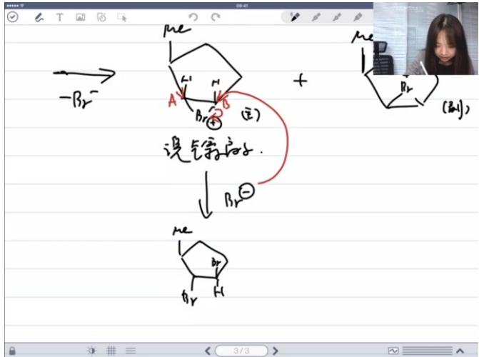

chemical

Hand-drawn chemical reaction diagram showing bromine substitution and hydrogen bonding, with molecular structures labeled A, B, H, Br, Br+ and reaction conditions.

○
○ 题目解析

■ 关键点1：判断底物对称性→影响中间体开环选择性  
■ 关键点2：确认溶剂环境→决定最终亲核试剂种类  
■ 位阻分析：大基团存在时，亲核试剂倾向于进攻位阻小的碳  
答案：非对称烯烃在 $CCl_{4}$ 中产生两种非对映异构体（主产物为位阻小的路径）

● 例题：甲醇溶剂中的产物 50:06

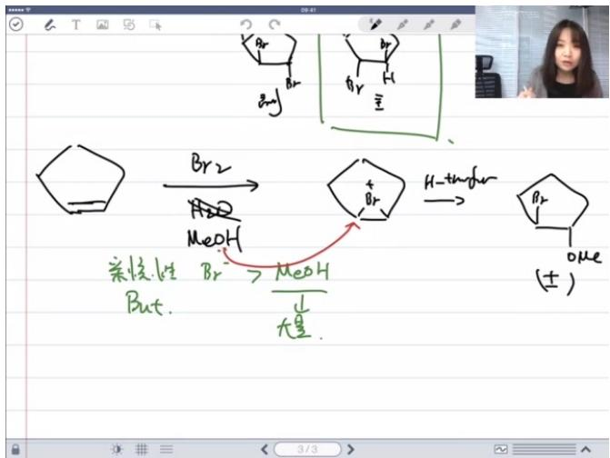

chemical

Hand-drawn chemical reaction diagram showing bromination and hydrogenation steps with reagents and conditions

# ○ ○ 题目解析

■ 反应特点：虽然 $Br^{-}$ 存在，但被大量甲醇分子包围  
■ 产物特征：生成溴代甲氧基化合物（ $Br-CH_{2}-OCH_{3}$ ）  
■ 易错点：忽视溶剂浓度效应，错误选择二溴代产物  
■ 答案：主要产物为反式溴甲氧基化合物

# 6. 催化氢化

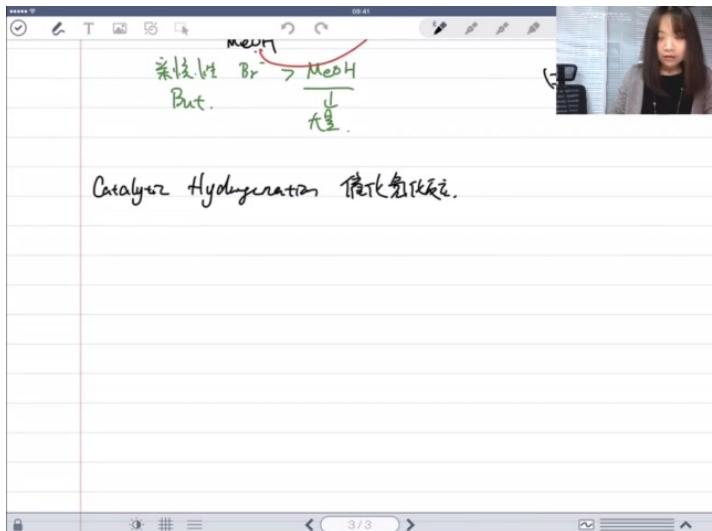

text_image

亲性性 Br > MeOH
But.
大量.
Catalytic Hydrolysis 催化氢反应.

反应定义: 在金属催化剂作用下，氢气与烯烃发生的加成反应

● 常用催化剂:

- 铂(Pt)、镍(Ni)等过渡金属  
- 铂催化效果最佳

● 产物特征: 氢原子以顺式(syn)加成方式加到双键两侧

# 1）催化氢化机理 54:57

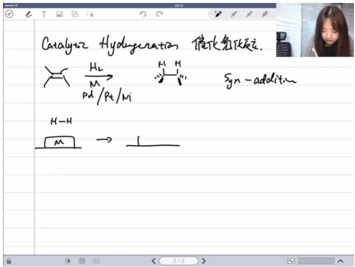

chemical

Handwritten chemical reaction diagram showing catalytic hydrogenation and radical formation with H₂, H, H⁻, and M species

# - 反应步骤:

○ 氢气分子被吸附到金属表面  
○ H-H键与金属轨道重叠，σ键断裂   
○ 形成金属-氢原子中间体  
○ 烯烃双键被吸附到金属表面  
○ 氢原子顺式加成到双键上

# ● 关键特征:

- 吸附活化: 氢气必须先被金属吸附活化  
○ 立体选择性: 主要产物为顺式加成产物(syn - addition)  
副产物: 少量反式(anti)加成产物可能因分子翻转产生

● 例题:催化氢化反应产物判断 58:02

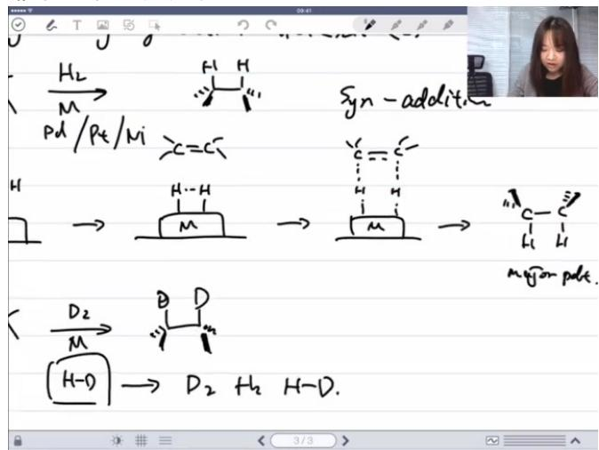

chemical

Hand-drawn chemical reaction equations involving hydrogenation, addition, and reduction steps with labeled intermediates and products

○
○ 题目解析:

■ 当使用氘气 $(D_{2})$ 进行催化氢化时  
■ 主要产物为两个D原子顺式加成  
■ 实际会得到 $D_{2}$ 、 $H_{2}$ 和HD的混合物  
■ 证明氢气在金属表面解离为原子态

○ 机理验证:

■ 混合产物的存在支持自由基/原子吸附机理  
■ 若为协同机理应只得到单一产物

● 例题:催化氢化反应产物判断 58:48

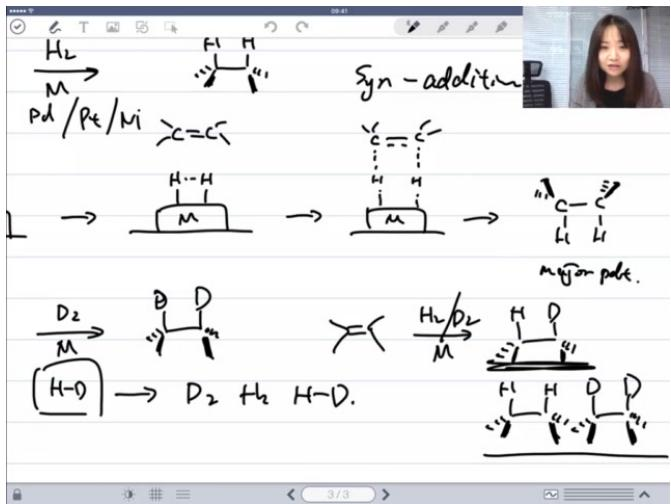

chemical

Hand-drawn chemical reaction equations showing hydrogenation and addition of Pd/Pt/Ni with intermediate structures

# ○ 题目解析:

■ 使用0.5当量 $H_{2}$ 和0.5当量 $D_{2}$ 的混合气体  
■ 产物分布证明氢分子在金属表面解离重组  
■ 实际考试中通常不考察如此复杂的机理

# ○ 考试重点:

■ 掌握主要顺式加成产物  
■ 理解金属表面的吸附活化过程  
■ 同位素标记问题通常简化处理

# 7. 双基化 01:05:29

1）例题：四氧化锇双基化反应示例 01:05:56

- 反应特征：四氧化锇 $(OsO_4)$ 与烯烃反应是典型的顺式双羟基化反应(dihydroxylation)，净效应是在双键两侧同时加上两个羟基。  
- 立体化学：虽然教材常将 $OsO_{4}$ 画成平面结构，但实际上它是四面体构型(d6s2电子构型)，这种简化画法仅为了方便表示有机部分的立体化学。  
● 反应条件：需要加入还原剂(如 $NaHSO_{3}$ )进行水解，最终得到顺式二醇产物。  
- 机理特点：与硼氢化反应类似，是协同过程(concerted process)，机理不需要特别记忆但需知道是顺式加成。

# 2）抗加成 01:12:02

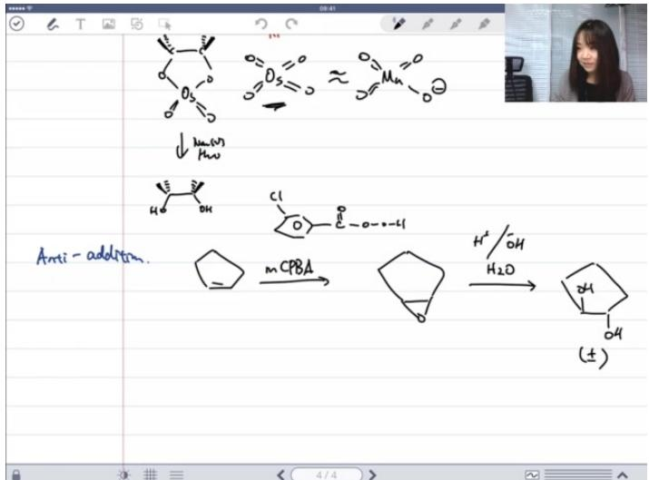

chemical

Chemical reaction scheme showing conversion of a mCpBA to cyclopentadiene using H2O and H+ ion, with photoresistors and stereochemistry indicated.

● 实现方法：通过mCPBA(间氯过氧苯甲酸)先形成环氧化物，再用酸或碱开环实现反式双羟基化(anti-addition)。

\- 反应步骤：

\- 环氧化：mCPBA与双键反应生成环氧结构

\- 开环：酸性或碱性条件下亲核开环，始终保持反式进攻方式

\- 立体选择性：当环上有取代基时，环氧化步骤会产生立体选择性，不同开环条件(nucleophile或酸性)会得到不同主产物。

# 8. 氧臭氧氧化 01:14:01

1）臭氧氧化的基本概念 01:14:06

● 反应名称：又称臭氧解(ozonolysis)或氧化性断裂(oxidative cleavage)

● 反应物：臭氧 $(O_{3})$ 具有共振结构，中心氧为 $sp^{2}$ 杂化

2）臭氧氧化在有机全合成中的应用背景 01:14:40

\- 历史作用：1950-1970年代有机合成黄金时期，用于辅助产物结构鉴定(当时仪器分析手段有限)

● 现代价值：主要用于确定双键位置

3）臭氧氧化的反应过程 01:15:29

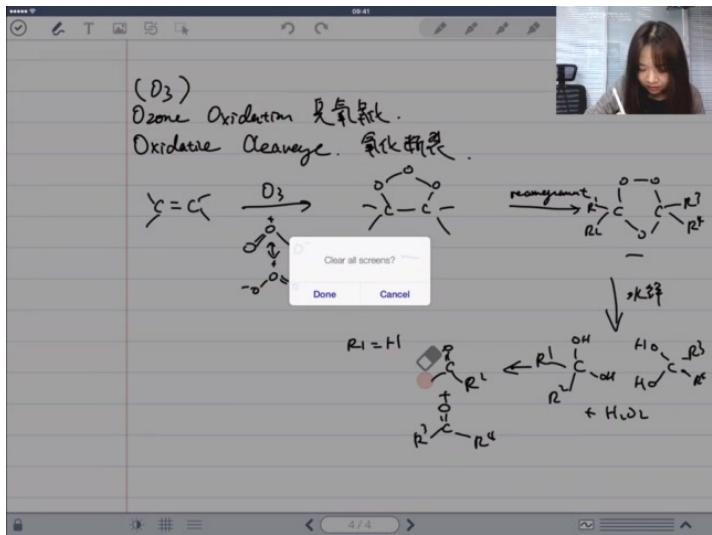

text_image

(O3)
Ozone Oxidation 先氧能.
Oxidative Cleavage. 氧化渐变.
y = c
→
O3
O2
O1
R1
R2
R3
R4
R5
R6
Clear all screens?
Done Cancel
R1 = H1
R2
R3
R4
OH
C
OH
H2O2
+ H2O2

- 第一步：臭氧与双键加成形成臭氧化物(ozonide)中间体  
● 第二步：重排断裂σ键生成两分子羰基化合物  
● 关键中间体：臭氧化物和断裂产物均已被实验证实

4）臭氧氧化后的水解与还原步骤 01:16:54

● 常规处理：需加入还原剂(如Zn/醋酸或 $Me_{2}S$ )防止过氧化氢氧化醛为羧酸

● 产物类型：得到两个羰基化合物(醛或酮)

5）臭氧氧化反应的实际操作 01:19:09

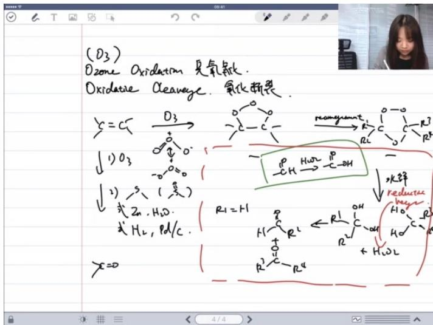

chemical

Handwritten chemical reaction equations involving Ozone, Oxidative, and Oxidative Ceaneye with reagents like H2O and R2C

标准流程：

\- 臭氧化(-78°C)

\- 还原处理(常用Zn/AcOH或 $Me_{2}S$ )

● 注意事项：必须使用还原条件保证反应干净彻底

6）臭氧氧化反应的应用举例 01:20:29

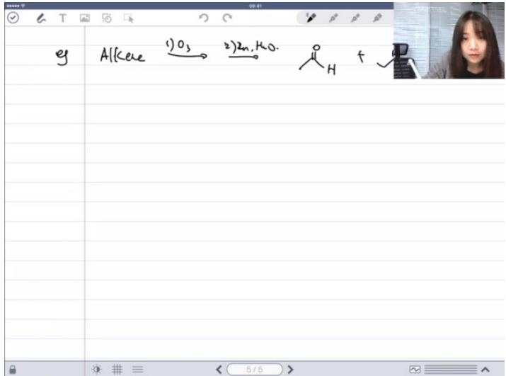

text_image

ey Al(Keur) (1)O₃ → 2)₂n,H₂O. H + [IMAGE]

● 结构推导：通过断裂产物1:1的羰基化合物可反推原烯烃结构  
● 局限性：无法区分E/Z构型，仅能确定双键位置

7）臭氧氧化反应的局限性 01:21:50

● 构型判断：不能区分原烯烃是E型还是Z型  
● 应用场景：主要用于结构推导题中确定双键位置

9. 阿尔法位卤化反应 01:22:44

1）反应概述与条件 01:22:53

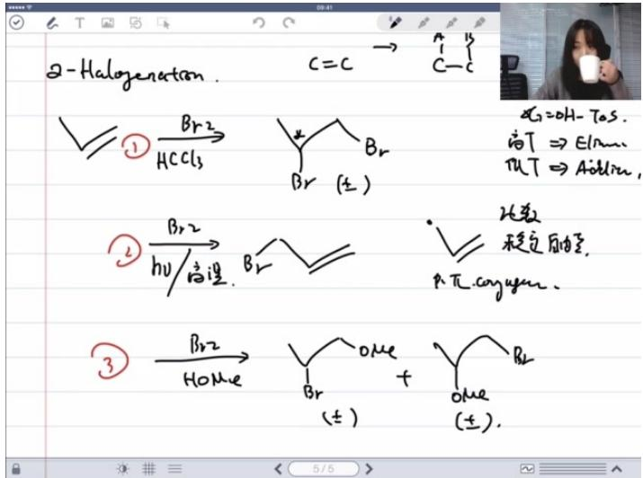

chemical

Handwritten chemical reaction equations involving halogenation, bromination, and hydrogenation steps

条件差异：

○ 室温/黑暗：发生亲电加成  
- 光照/高温：发生α-位卤代反应

2）反应的选择性与产物 01:23:40

\- 溶剂影响：

○ $CHCl_{3}$ 中：主要生成二溴化物  
○ MeOH中：得到混合物(溴代醚产物)

3）烯烃加成反应原理 01:24:41

● 热力学：加成反应放热( $\Delta H < 0$ )，但熵减( $\Delta S < 0$ )  
● 平衡关系： $\Delta G = \Delta H - T\Delta S$ ，高温有利于消除(熵驱动)

4）温度对反应的影响 01:25:48

● 低温：有利于加成(焓驱动)   
● 高温：有利于消除(熵驱动)和自由基反应

5）自由基反应机理 01:26:56

● 引发阶段：光照使 $Br_{2}$ 均裂生成溴自由基  
● 链传递：溴自由基夺取烯丙位H生成稳定烯丙基自由基  
- 终止：自由基结合生成最终卤代产物  
● 关键点：必须仔细区分反应条件(温度/光照)来判断反应类型

# 四、缺的第一课部分 01:28:07

# 1. 端缺 01:28:36

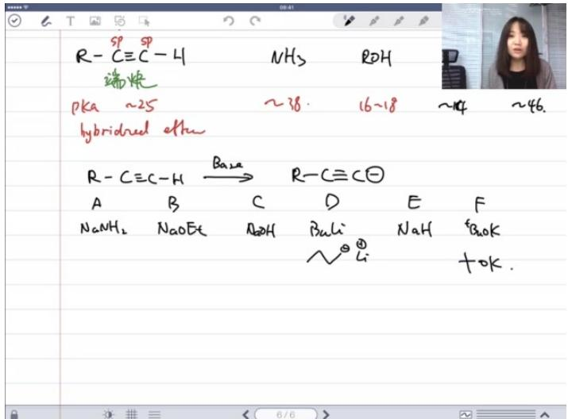

text_image

R-C≡C-41 NH3 ROH
烯烃
PKA ~25 ~38 16~18 ~14 ~46.
hybridne elthu
R-C≡C-H Ba2a R-C≡C-
A B C D E F
NaNH2 NaOEt NaOH BuLi NaH BaOK
~① Li +ok .
+ok .

定义：当 $R' = H$ 时称为端缺(terminal alkyne)，结构为 $R - C \equiv C - H$   
● 酸性特征：端缺具有显著酸性，是重要的有机酸性物质

# 1）端缺的PK值 01:29:06

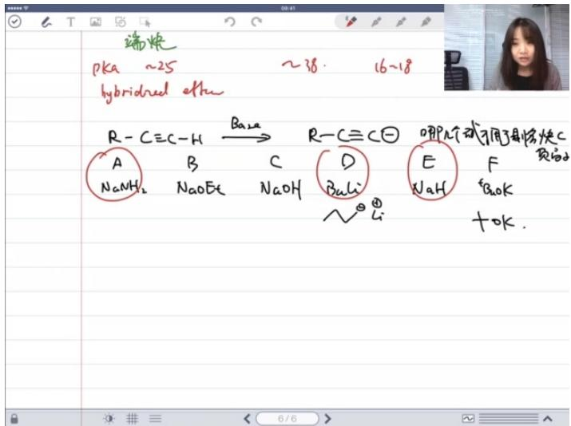

text_image

端炔
PKA ~25 ~38 16~18
hybridred other
R-C≡C-H Ba2a R-C≡C-O 哪A几个试用了耐焰快C
NaNH4 B C D E F 负品
NaOH BaLi NaH +ok
Ni +ok.

# 关键pKa值：

○ 端缺：25  
○ 氨(NH₃): 38   
○ 水：15(有机教材常用值，实际为14)  
○ 普通烷烃：46

● 取代基影响：烷基取代的氨pKa可升至40-42   
● 杂化效应：SP杂化使端缺酸性强于 $SP^{2}$ (烯烃)和 $SP^{3}$ (烷烃)，称为hybridization effect

# 2）应用案例 01:30:28

# ● 例题:制缺碳负离子base

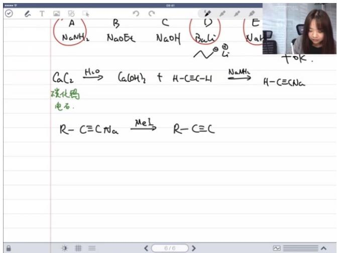

chemical

Chemical reaction diagram showing carbon fixation and nucleophilic substitution steps with sodium hydroxide catalysts

# ○ ○ 题目解析

■ 反应本质： $R - C \equiv C - H + Base^{-} \rightarrow R - C \equiv C^{-}$   
■ 有效碱试剂：

● $NaNH_{2}$ (氨基钠，实验室最常用)   
- BuLi(丁基锂)  
- NaH(氢化钠)

■ 无效碱试剂：

● 醇钠类(如NaOEt、t-BuOK)   
● NaOH(氢氧根是水的共轭碱)

■ 记忆要点：所有醇氧负离子均不能有效制备缺碳负离子

# 3）轻电加成 01:36:50

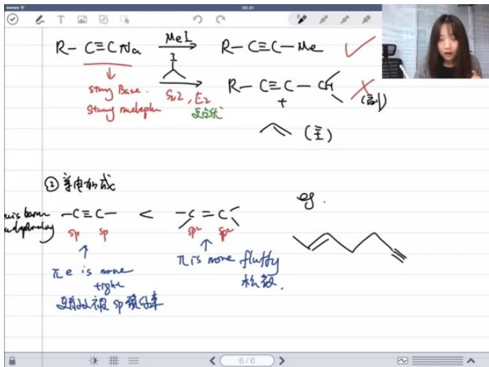

text_image

R-C≡CNa $\xrightarrow[\text{↑}]{\text{MeI}}$ R-C≡C-Me $\checkmark$
### Bace.
### nuclephor
S2, E2
反位伏
R-C≡C-CH
+ (副)
(主)
②亲电构成
is been
and flowering
-C≡C- < -C=C-
sp sp
↑
πe is none
tight
更有之处很sp被子来
πi is more fluffy
松纹.
gg.
6/6>

# 反应活性对比：

- 缺键是比双键更弱的亲核试剂/Lewis碱   
- 原因：SP杂化使π电子更紧促(烯烃π电子更松散)

# - 结构绘制规范：

- SP杂化碳必须画成直线型  
○ 错误示例： $R - C \equiv C - R'$ （非直线）  
○ 正确示例： $R - C \equiv C - R'$ （直线）

# 4）应用案例 01:40:26

● 例题:溴代烷烃轻电加成反应示例

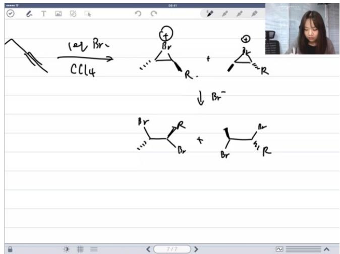

chemical

Chemical reaction diagram showing bromination of CCl4 followed by bromide substitution and subsequent bromination with R groups

# 题目解析

■ 反应选择性：Br2优先与双键反应而非三键  
■ 反应机制：

- 形成溴鎓离子中间体  
- Br $^{-}$ 从反式进攻(SN2机理)

立体化学：

- 必须考虑顺反两种加成方式  
● 错误表达：简单写一种产物  
● 正确表达：需表示所有可能的立体异构体

■ 过量反应：与过量Br2可逐步加成到三键

- 第一步：双键加成  
- 第二步：断裂一个π键  
- 第三步：断裂第二个π键

# 2. 缺的加卤素分子 01:46:10

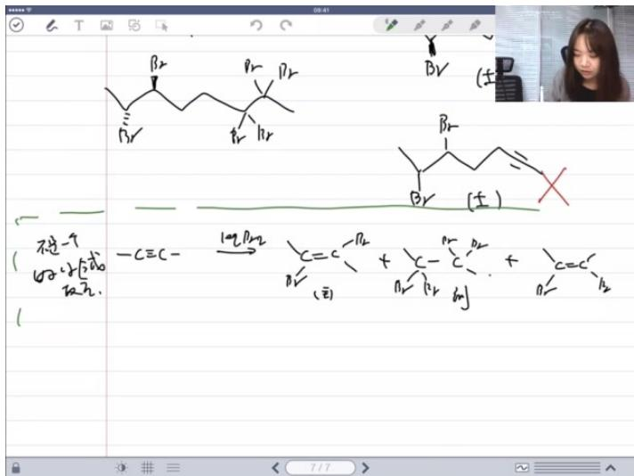

chemical

Chemical reaction diagram showing brominated alkene structures with electron transfer and partial charges labeled

- 反应特点：缺听与卤素（如Br₂）加成时，若只加一分子卤素会得到混合物（反式为主，含少量顺式产物），因此该反应在合成中不常用  
● 实际应用：合成中通常直接进行全卤化反应，避免副产物过多的问题  
● 注意点：考试中一般不考察只加一分子卤素的产物，重点掌握全卤化反应

# 3. 缺的加卤化氢 01:48:06

1）加卤化氢的选择性与马氏规则 01:48:15

\- 产物特征：缺听加卤化氢（如HBr）主要得到马氏规则产物（氢加在取代基少的碳上）

● 记忆技巧：结果与烯烃加成相同，便于记忆但机理不同  
● 机理差异：不同于烯烃通过稳定碳正离子解释，缺听加成机理更为复杂

2）反应机理的初步探讨 01:49:05

● 中间体特点：反应可能涉及两分子卤化氢与缺听的过渡态  
● 稳定性分析：端基碳带正电荷时，烷基可通过超共轭效应部分稳定正电荷

3）动力学研究与过渡态的推测 01:49:28

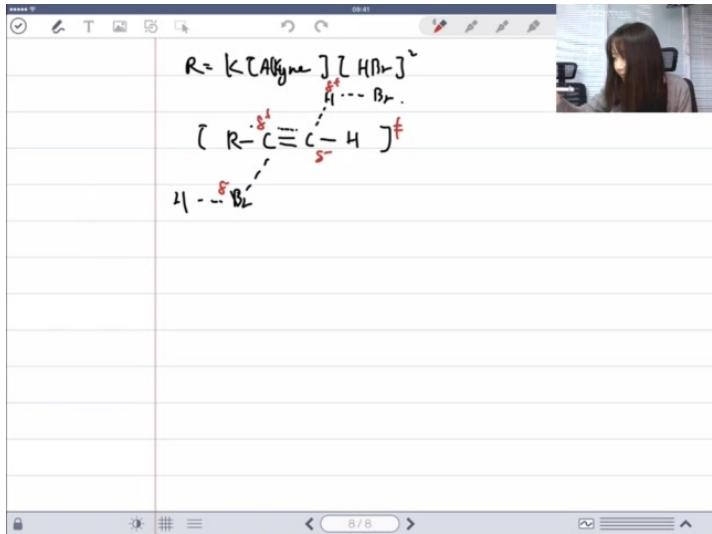

text_image

R = K[Alkyn] [Hn-]²
      1 ... Br.
[R-C=C-H]⁴
41 ... B₂

● 动力学特征：反应速率与缺听浓度和卤化氢浓度的平方相关， $R = k[A][HB_{2}]^{2}$   
● 过渡态推测：可能形成包含两分子卤化氢的中间体结构  
● 研究现状：该机理尚未完全证实，主要基于动力学证据

4）自由基引发下的反式加成产物 01:52:59

● 自由基条件：存在自由基引发剂时，得到反马氏加成产物  
● 产物组成：生成反式产物和少量顺式产物的混合物  
● 记忆对比：结果与烯烃类似（无引发剂得马氏产物，有引发剂得反马氏产物）

5）加一分子质子后的产物与稳定性 01:54:10

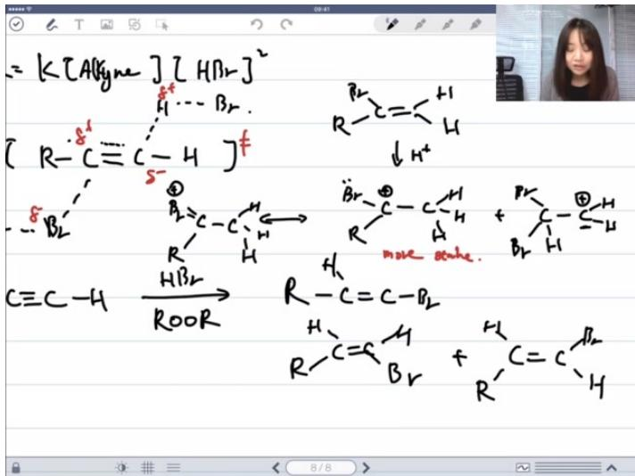

chemical

Chemical reaction equations involving bromine and hydrogen peroxide intermediates with structural formulas

● 主要产物：溴加在能形成更稳定碳正离子的碳上

\- 稳定机制：

- 共振效应：溴的孤对电子可稳定相邻碳正离子  
○ 轨道重叠：溴的p轨道与碳正离子的空p轨道有效重叠（类似p-p共轭）  
○ 诱导效应：正电荷远离电负性大的溴更有利

● 产物分布：实际得到混合物，但以更稳定的结构为主

4. 三键和氢气的反应 01:59:40

# 1）还原反应概述 01:59:50

- 反应类型：炔烃与氢气的反应属于还原反应（reduction），通过加氢使不饱和键变为饱和键。  
● 反应顺序：反应会优先在更活泼的烯烃双键上加氢，最后生成烷烃。

# 2）催化氢化反应 02:03:04

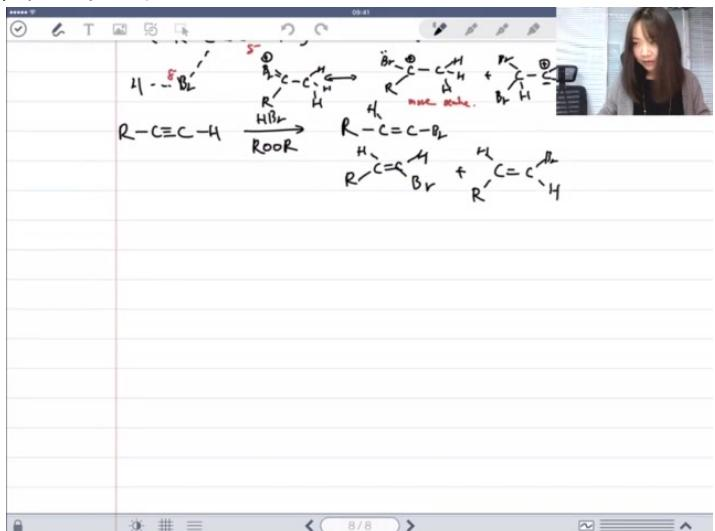

chemical

Chemical reaction diagram showing bromination and hydrogenation steps in a cyclic compound

- 催化剂选择：铂（Pt）、钯（Pd）、镍（Ni）等过渡金属均可作为催化剂，其中铂效果最好。  
● 反应机理：氢气首先吸附在金属表面形成活化的氢原子或自由基，然后进攻π键。  
- 反应特点：炔烃催化氢化通常会直接生成烷烃，因为生成的烯烃中间体比原料更活泼，会继续反应。

# 3）中毒的催化剂与烯烃的生成 02:05:22

● 林德拉催化剂：由钯掺入硫酸钡、甲醇和喹啉组成，记作Pd/BaSO $_{4}$ ,CH $_{3}$ OH,quinoline。

# - 反应特性：

- 使用中毒催化剂可以降低反应活性，使反应停留在烯烃阶段  
○ 产物为顺式烯烃   
○ 机理尚不明确，可能是通过改变活化能实现的

● 其他中毒催化剂：如硼化镍（Ni $_{2}$ B），同样可以得到顺式烯烃。

# 4）反式氢化反应 02:10:20

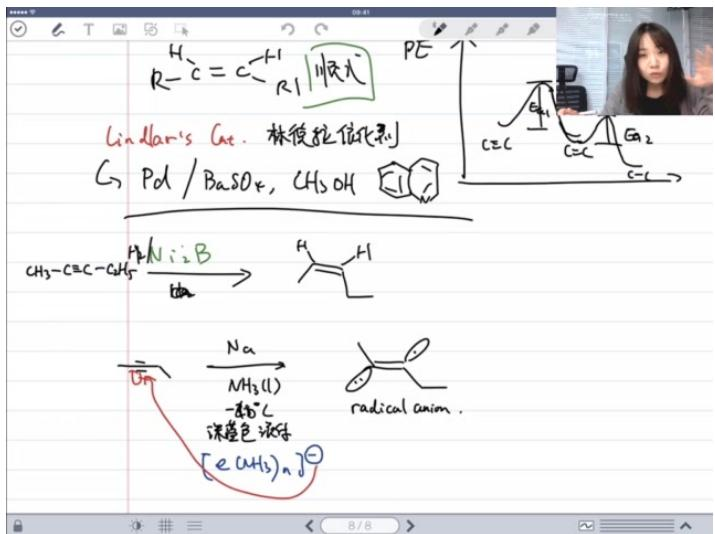

chemical

Handwritten chemical reaction equations and diagrams for carbonation and radicalization, including reaction conditions and structural formulas.

反应条件：钠在液氨溶液中（Na/NH $_3$ I）  
● 反应现象：溶液呈现深蓝色，表明生成了氨合电子 $\left(\mathrm{NH}_{3}+\mathrm{e}^{-}\right)$

# - 反应机理：

\- 电子进攻sp杂化碳，形成自由基负离子中间体

\- 质子转移生成反式烯烃

\- 选择性原因：电子更倾向于进攻缺电子的sp杂化碳，而不会继续与烯烃反应5.加水反应02:14:26

1）烯烃的加水反应概述 02:14:45

● 反应类型：水合反应（hydration）或水化反应  
● 区域选择性：与卤化氢加成类似，遵循马氏规则

2）酸性条件下的加水反应与区域选择性 02:15:02

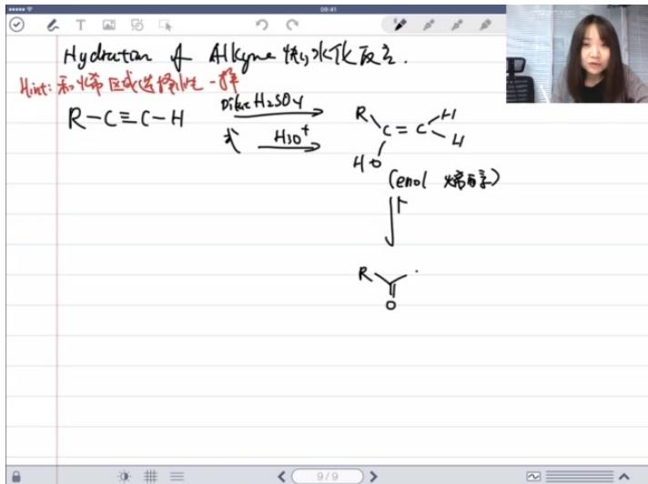

chemical

Handwritten chemical reaction equation involving alkynes, dike, and H2SO4 forming a ketone with R groups

●

● 反应条件：稀硫酸催化或水合氢离子催化  
● 产物：首先生成烯醇（enol），然后迅速互变异构成酮  
● 区域选择性：羟基加在取代度较大、位阻较大的碳上

3）烯醇与互变异构 02:16:30

● 互变异构：烯醇（enol）和酮（ketone）之间的平衡

体系中同时存在两种形式（如15%烯醇和85%酮）  
○ 只有质子和π键位置发生变化

● 与共振结构区别：

- 共振结构是假想的极端形式，实际不存在  
○ 互变异构体都是真实存在的物质

4）其他加水反应方法 02:19:34

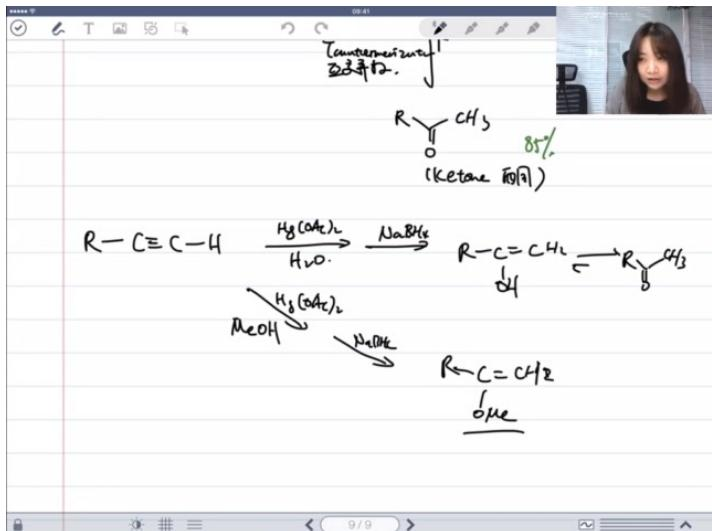

chemical

Chemical reaction scheme showing hydrolysis of ketone to form ket-2, followed by acidification and dehydration steps

●

\- 羟汞化反应：

○ 首先生成碳汞中间体  
○ 用NaBH4还原后可停留在烯醇阶段

● 硼氢化氧化反应：

○ 硼加在位阻较小的位置  
○ 顺式加成  
- 最终产物为醛

# 5）臭氧氧化反应 02:22:05

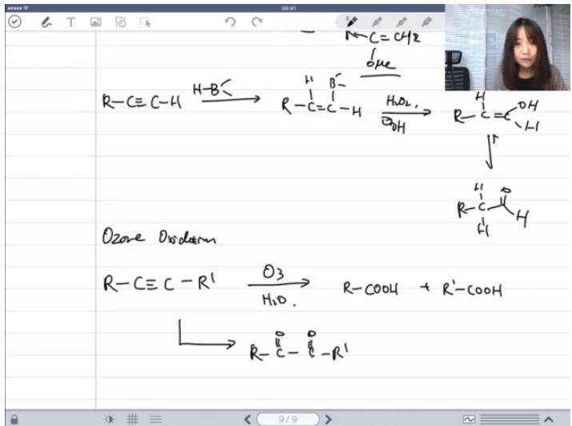

chemical

Chemical reaction equations showing esterification and subsequent decomposition steps with R-C≡C-H and R-C=C-R' groups

●   
● 反应特点：断裂两根碳碳键，生成两个羰基化合物  
● 端炔产物：会生成甲酸，进一步氧化为 $CO_{2}$ 和水  
● 应用：通过产物结构可以反推原炔烃结构  
● 注意事项：画炔烃时碳原子必须保持直线排列

# 五、缺的制备02:25:02

# 1. 碳化钙加水制备法 02:25:26

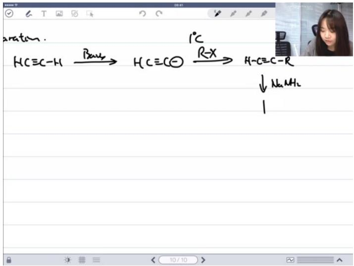

chemical

Handwritten chemical reaction equation showing conversion of carbon to hydrogen and then to sodium ammonia via an intermediate step

●   
● 基础反应：通过 $CaC_{2}+H_{2}O\rightarrow HC\equiv CH$ 先制得乙炔  
● 延伸应用：可将乙炔转化为炔烃，需使用一级卤代烃进行后续反应  
- 反应条件：需保持1度卤代烃（伯卤代烃）才能得到目标产物 $R' - C \equiv C - R$

# 2. 烯烃加卤素后消除制备法 02:26:09

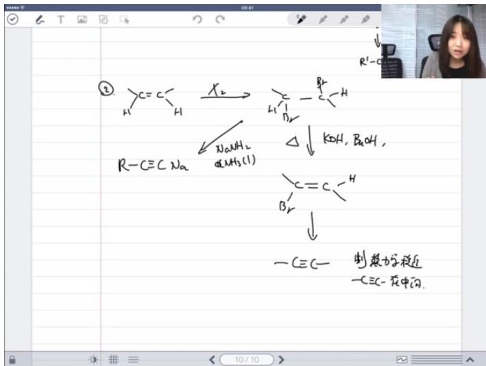

chemical

Handwritten chemical reaction diagram showing transformation of a sodium alkoxide with bromine and hydrogen to form a hydroxyl radical, followed by reduction to carbon atoms.

\- 两步消除法：

i. 烯烃先与卤素（如溴）加成生成二卤代烷   
ii. 在KOH/醇溶液中加热进行消除反应（E2机理）  
iii. 重复消除过程最终得到炔烃

● 适用条件：特别适合制备热力学稳定的中间位炔烃 $(R - C \equiv C - R)$   
● 立体化学：反应过程中暂不考虑立体化学问题

3. 氨基钠在液氨溶液下制备法 02:27:26

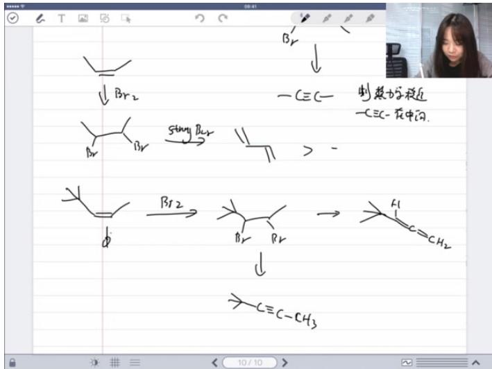

chemical

Hand-drawn chemical reaction equations showing bromine and alkene transformations with structural formulas and reaction conditions

● 反应机理：本质是生成炔碳负离子的驱动力推动反应  
● 传统方法：在非极性卤代烃中高温加热  
● 产物特征：最终得到端炔钠（RC≡CNa）而非游离炔烃  
● 反应本质：通过强碱连续消除两分子卤化氢形成三键

4. 生成缺的反应条件与产物稳定性 02:28:43

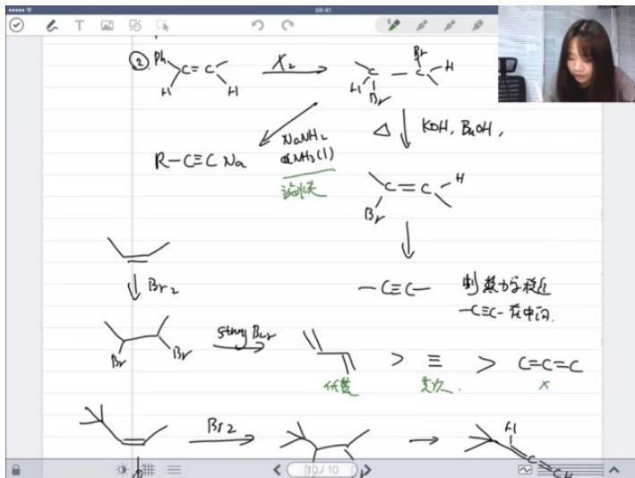

chemical

Handwritten chemical reaction equations involving bromine, sodium hydroxide, and alkyl bromide with reagents and conditions

● 稳定性顺序：共轭二烯 > 炔烃 > 丙二烯   
- 反应选择性：

◦ 优先生成共轭二烯（若可能）  
- 不能生成共轭二烯时生成炔烃  
- 极难生成丙二烯结构

● 取代基影响：当一端有苯环或叔丁基等大位阻基团时，更易形成稳定产物

5. 溶剂对生成缺类型的影响 02:30:35

\- 液氨体系：

○ 使用 $NaNH_{2}$ 在液氨中反应  
○ 生成端炔（单取代炔烃）  
- 因炔钠盐在极性溶剂中溶解性好

\- 醇体系：

- 使用KOH在醇溶液中反应  
○ 生成双取代炔烃  
○ 多取代炔烃热力学更稳定

\- 转化实例：双取代炔在液氨/ $NaNH_{2}$ 条件下可转化为端炔，通过碳负离子中间体实现三键迁移

# 六、脑洞题示例 02:33:09

1. 例题1: 溴分子与物质反应的反视角分析 02:33:22

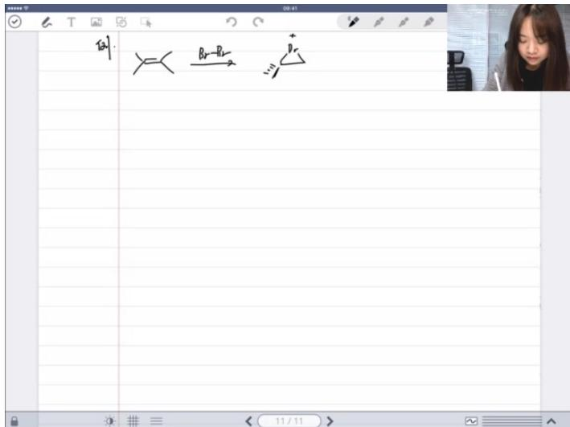

text_image

例
Bn-Bn
Bn
11/11

● 题目解析

\- 经典机理：通常为反式加成形成溴鎓离子中间体

- 苯环影响：苯环稳定碳正离子导致可能形成开环中间体  
○ 产物分布：83%反式产物，17%顺式产物  
○ 键旋转：开环中间体的C-C键可自由旋转导致顺式产物出现

2. 例题2: 溴分子与物质反应中的顺反式产物比例探讨 02:36:54

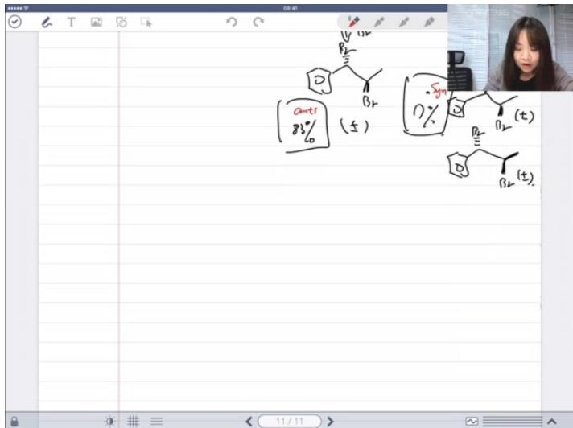

text_image

Handwritten chemical reaction diagram with two reaction products and a person observing the image

# ● 题目解析

○ 取代基效应：高取代度底物会增加顺式产物比例  
◦ 显著性判断：17%顺式产物已属显著量  
○ 结构特征：苯环通过共轭效应显著稳定碳正离子中间体

3. 例题3: 氯离子与物质反应中的中间体及产物比例分析 02:37:05

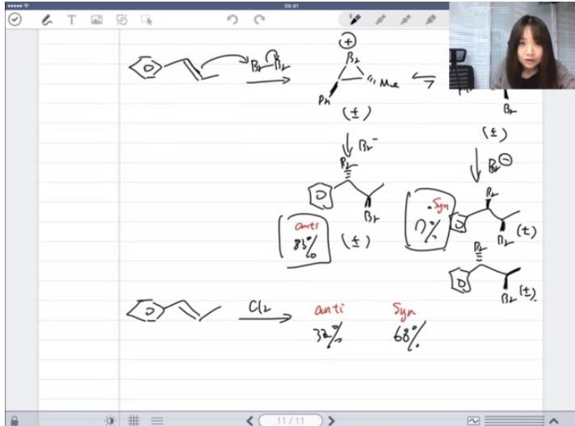

chemical

Chemical reaction scheme showing transformation of a cyclic compound with bromine and phenyl groups, including stereochemistry and yield percentages

# 题目解析

○ 产物比例：68%顺式，32%反式  
○ 机理分析：

■ 主要经历碳正离子中间体而非氯鎓离子  
■ 理论预测应为1:1，实际观察到顺式优势

○ 离子对效应：

■ 氯离子与碳正离子形成离子对  
■ 同向进攻位阻更小，速率更快

\- 结论：实验结果证明碳正离子机理占主导地位

# 七、知识小结

<table><tr><td>知识点</td><td>核心内容</td><td>考试重点/易混淆点</td><td>难度系数</td></tr><tr><td>烯烃加成反应</td><td>马氏加成(酸催化)、反马氏加成(自由基引发)、羟汞化-去汞化反应、硼氢化-氧化反应</td><td>区域选择性(马氏vs反马氏)、立体化学(顺式/反式加成)</td><td></td></tr><tr><td>卤素加成</td><td>溴与烯烃生成溴鎓离子中间体,反式加成主导</td><td>溶剂影响(四氯化碳vs水/甲醇)、位阻效应</td><td></td></tr><tr><td>催化氢化</td><td>金属催化(Pt/Pd/Ni)生成烷烃,Lindlar催化剂选择性生成顺式烯烃</td><td>中毒催化剂的作用机理</td><td></td></tr><tr><td>臭氧氧化</td><td>双键断裂生成醛/酮/羧酸,用于结构推断</td><td>端基烯烃生成 $CO_2$ 的副反应</td><td></td></tr><tr><td>炔烃反应</td><td>端炔酸性(pKa≈25)、硼氢化-氧化得醛、钠/液氨还原生成反式烯烃</td><td>Lindlar催化剂与Na/NH3的立体选择性对比</td><td></td></tr><tr><td>互变异构</td><td>烯醇-酮式平衡(热力学驱动)</td><td>与共振结构区别(真实存在vs理论模型)</td><td></td></tr><tr><td>反应机理</td><td>碳正离子重排、自由基中间体、协同过程(如硼氢化)</td><td>离子对效应对立体化学的影响</td><td></td></tr><tr><td>合成应用</td><td>炔烃通过烷基化延伸碳链(需一级卤代烃)</td><td>二级卤代烃易消除的竞争反应</td><td></td></tr></table>