# 一、有机子欢迎中性状02:32

# 1. 例题：共振结构讨论 03:04

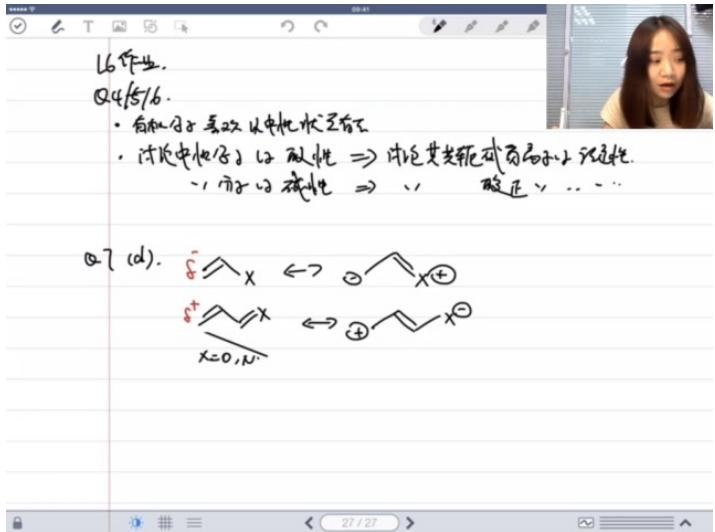

text_image

16作业.
Q4/5/6.
• 有私募子喜欢以中化状态存在
• 讨论中化分子的碱性 ⇒ 中论其轭或奇偶与原子的碱性.
• 介子的碱性 ⇒ √ 碱正 √ · · · ·
Q7 (d). δ↔ ⊙ x⊕
δ+ ← ⊕ x⊖
x=0,N⁻

27/27   
● 核心规则：所有共振结构的原子排布必须相同，包括σ键的排布  
● 常见错误：

- 箭头方向错误：必须表示电子流动方向而非电荷流动  
○ 忽略σ键差异：如C选项明显缺少一个σ键   
○ 电荷分布错误：如E选项箭头反向会生成正电荷

● 能量比较原则：

◦ 优先满足八隅体规则   
○ 当都不满足时：负电荷应在电负性更大的原子上（如氧比碳更稳定）  
○ 特例：碳正离子通常不稳定，但需与氧正离子比较电负性

# 2. 例题：分子酸性讨论 06:20

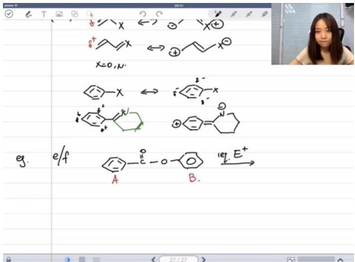

chemical

Hand-drawn chemical reaction scheme showing electron transfer and radical addition steps in organic molecule formation

27/27   
● 中性偏好：有机分子在中性溶剂环境中倾向保持中性状态  
● 酸性本质：讨论共轭碱负离子的稳定性

- 负电荷离域程度越高越稳定  
- 可通过共振结构稳定性判断

● 碱性本质：讨论共轭酸正离子的稳定性

\- 正电荷离域程度越高越稳定

● 应用提示：这是有机化学基本功，必须掌握电荷离域的分析方法

# 3. 例题：活化基团 08:20

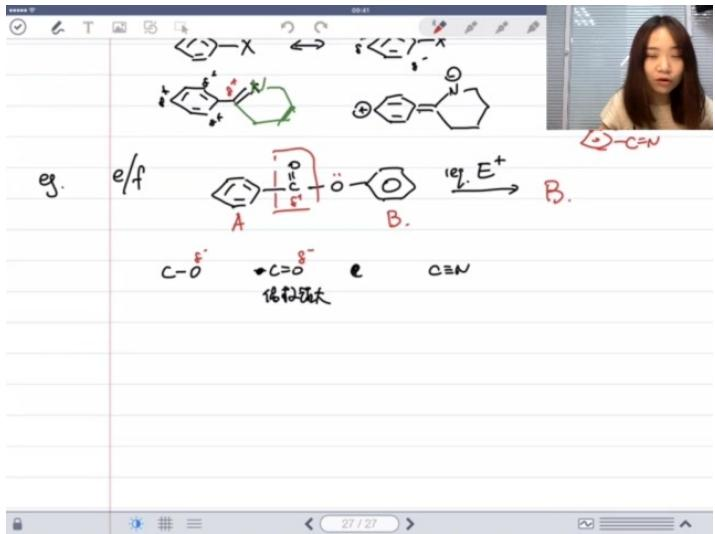

chemical

Chemical reaction diagram showing electron transfer and radical addition steps in organic chemistry

# ● 活化/钝化判断：

○ 活化基团：给电子基（如- $NH_{2}$ 、-OH），增加苯环电子密度  
- 钝化基团：吸电子基（如-NO₂、-COOH），降低电子密度

# ● 特例分析：

- 卤素：孤对电子共振（邻对位定位）但强电负性（总体钝化）  
○ 含杂原子体系：需具体分析共振效应（如D选项的氮正离子结构）

# ● 记忆要点：

○ 活化基团加速亲电取代反应  
- 钝化基团需更强反应条件

# 4. 例题：氢电试剂反应 13:04

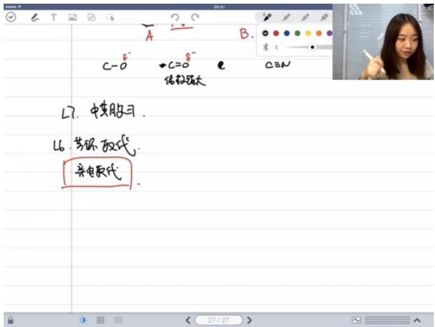

text_image

A
B.
C-0
C=0
偶数放大
C≡N
L7. 中英版习.
L6. 节织取代.
亲电取代.

# - 反应选择原理：

◦ 优先发生在电子密度更高的苯环（活化环）  
- 给电子基（如-O-）显著提高邻对位活性  
○ 强吸电子基（如C=O）通过π键极化降低相连环活性

# - 极化效应：

- $\pi$ 键比 $\sigma$ 键更易被极化  
○ 碳氧双键极化程度 > 碳氧单键  
- 电负性原子通过π键产生更强吸电子效应

# - 典型例题：

- 双苯环系统：比较取代基效应决定反应位点  
- 必须同时考虑共振效应和诱导效应

# 5. 复习芳环取代 19:31

# 1）例题:判断取代反应 25:14

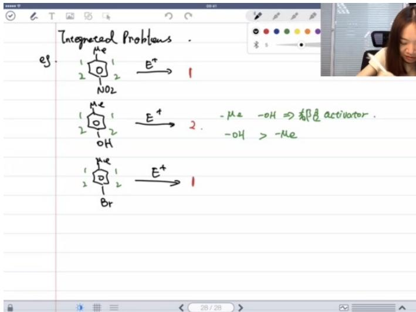

chemical

Chemical reaction diagram showing integrated problems involving nitro, hydroxyl, bromide, and potassium ions with energy levels and activation conditions

● 定位基团优先级判断：当苯环上同时存在甲基（ $-CH_{3}$ ）和硝基（ $-NO_{2}$ ）时，虽然甲基是邻对位定位基，硝基是间位定位基，但两者都倾向于一号位取代。这是因为甲基的邻对位定位效应与硝基的间位定位效应在位置上重合。

# 2）例题:判断取代基 29:03

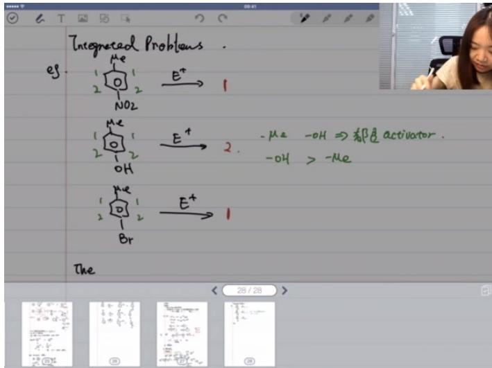

text_image

Integrated Problems
eg.
1 Me 2 NO2 E+ → 1
1 Me 2 OH → E+ → 2. -Me -OH ⇒ 都是 activator.
-OH > -Ne
1 Me 2 Br → E+ → 1
The
< 28/28 >

致活能力比较：羟基（-OH）和甲基（ $-CH_{3}$ ）都是致活基团，但羟基的致活能力更强。因此当两者共存时，取代反应优先发生在羟基倾向的邻对位（二号位）。

# 3）定位效应 31:48

● 定位效应由最强致活基团决定 32:20

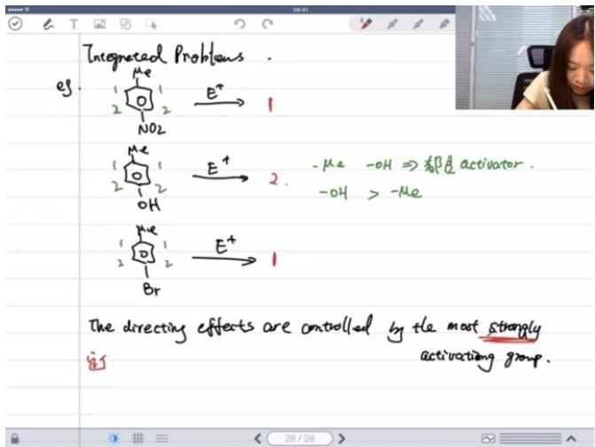

text_image

Integrated Problems
es.
2 NO2
E+ → 1
2 OH
E+ → 2.
- Me -OH ⇒ 都是 activator.
-OH > -Me
2 Br
E+ → 1
The directing effects are controlled by the most strongly
activating group.

核心规则：定位效应由最强的致活基团（most strongly activating group）决定。这是因为致活基团通过给电子效应能显著稳定反应中间体（σ络合物）。  
实例说明：甲基（弱致活）和溴（弱致钝）共存时，虽然都是邻对位定位基，但最终听从甲基的定位效应（一号位）。

# ● 致活基团与致钝基团的作用机制 33:58

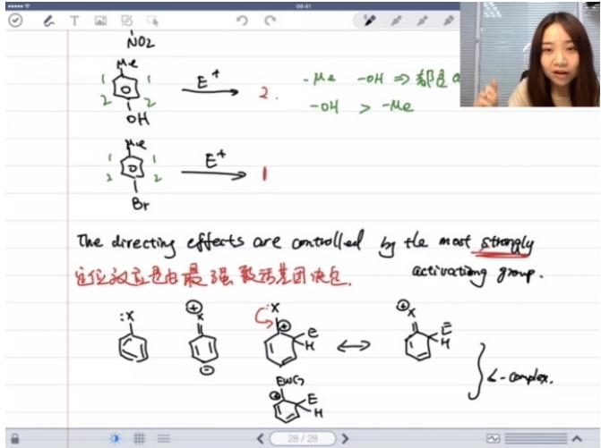

text_image

NO2
2 O 1 OH
E+ → 2. -Me -OH ⇒ 都是 a
-OH > -Me
Me
Br
E+ → 1
The directing effects are controlled by the most strongly
定位反应是由最强、致污基团决定.
activating group.
X
①
C X
②
B u C
③
E H
↔
④
E H
L- complex.

# 致活基团作用：

■ 机理：通过孤对电子共轭（如羟基）或超共轭效应（如甲基）稳定中间体正电荷  
■ 定位特性：通常为邻对位定位基

# ○ 致钝基团作用：

■ 机理：吸电子效应使中间体正电荷更不稳定  
■ 定位特性：多为间位定位基（卤素除外）  
权重原理：越稳定的共振结构贡献越大，因此致活基团效应占主导

# ● 例题1：甲基和溴的定位效应判断 36:17

# ○ 题目解析

■ 基团性质：  
● 甲基：弱致活，邻对位定位  
- 溴：弱致钝，但仍是邻对位定位  
■ 判断依据：根据"最强致活基团决定"规则，优先听从甲基定位  
■ 答案：一号位取代  
■ 易错点：误认为致钝基团会改变定位方向

# 4）例题:亲和基团判断 36:32

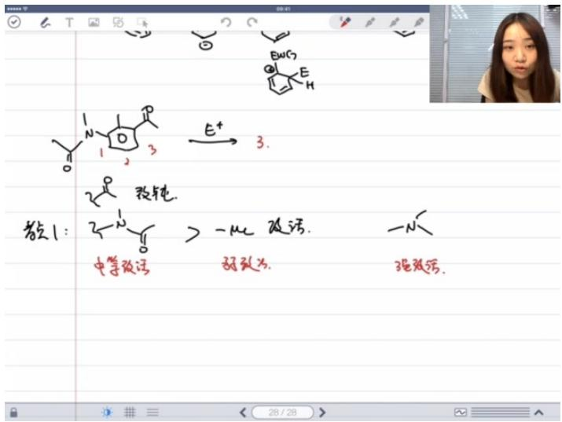

text_image

Buc
E
H
N
O
1
2
3
→ E+
3.
改钝
教1：
-μC 改污.
中学改污
弱敌为.
强敌污.

● 题目解析

○ 基团分析：

■ 乙酰基（ $-COCH_{3}$ ）：强致钝基团（吸电子）  
■ 氨基衍生物：中等致活（氮孤对电子共轭）  
■ 甲基：弱致活

○ 关键考点：

■ 含氮基团致活能力 > 烷基  
■ 乙酰基的定位效应被致活基团覆盖

- 答案：三号位取代（氨基主导的邻对位）  
- 记忆点：氮孤对电子能形成满足八隅体的共振式，致活能力显著强于纯烷基

5）例题:取代基判断 41:15

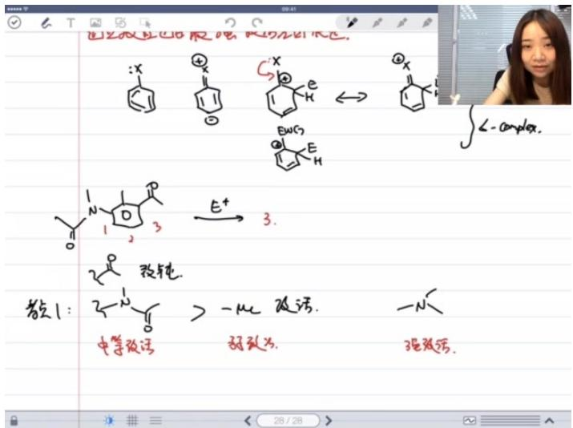

chemical

Chemical reaction scheme showing conversion of cyclohexene to cyclopentenone via intermediate E+ and loss of 2, with Chinese annotations for each step.

● 定位效应决定因素：由最强致活基团决定。在多个取代基中，氮原子取代基是最强的致活基团。  
● 位点选择原理: 氮取代基的零对位是1位和3位，需要在这两个位置中选择主要产物。

位阻效应影响:

- 氮取代基的位阻较大，与1位相邻的是氮取代基，与3位相邻的是乙酰基  
- 氮取代基的位阻效应比乙酰基更大，因此3位比1位更有优势  
- 虽然优势不大，但仍会得到少量1位取代产物

6）例题:多取代苯合成 45:31

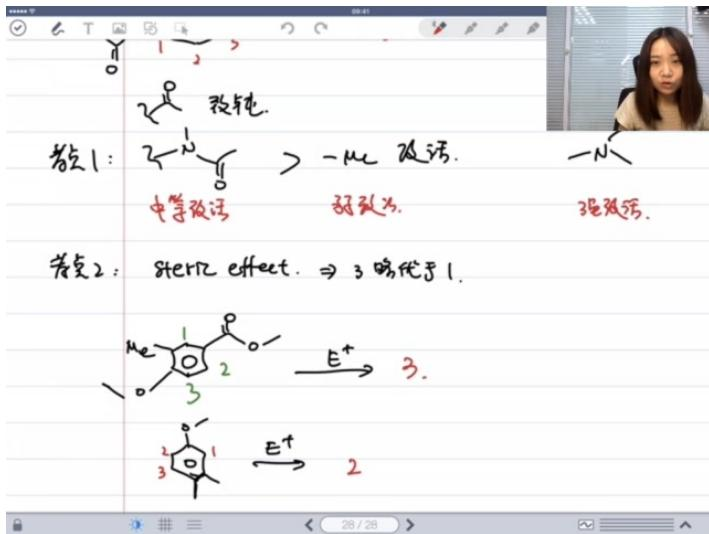

text_image

改钝.
教1: 2-μ → -μc 改污.
中学改污 弱敌3.
强敌污.
教2: stern2 effect. ⇒ 3略优于1.
E+ → 3.
E+ → 2
28/28

● 定位基团比较: 甲氧基的定位效应强于甲基，羰基是致钝基团可忽略  
- 简单案例解析:

○ 甲氧基的零对位只有3位  
- 答案为3位取代产物

● 复杂案例解析:

○ 甲氧基比甲基定位效应强   
○ 甲氧基的零对位有1位和2位  
- 2位的位阻小于1位，因此主要产物是2位取代

7）例题:合成路线分析 49:15

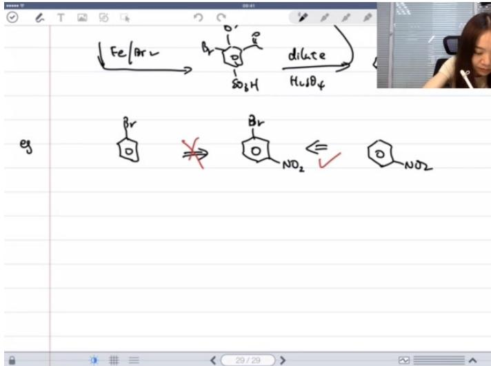

chemical

Chemical reaction diagram showing transformation of Fe/Ar to SO₃H, then to dilute H₂SO₄, followed by bromination and reduction to NO₂

\- 合成路径选择:

\- 制备间硝基溴苯有两种可能路径：

■ 硝基苯溴化  
溴苯硝基化

- 溴是邻对位定位基，硝基化会得到邻位和对位产物，不符合目标  
- 硝基是间位定位基，溴化可得到目标产物

\- 逆合成分析思路:

○ 从目标分子倒推反应步骤  
- 先制备硝基苯，再溴化得到目标产物  
- 所有合成路线都以苯环为起始原料

8）例题:多取代苯合成 52:07

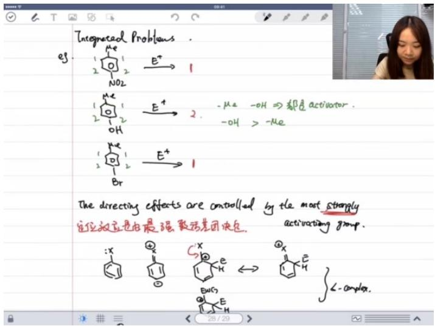

text_image

Integrated Problems
eg.
2 O 2 → E⁺ 1
2 O 2 → E⁺ 2. -μe -OH ⇒ βα activator.
-oh > -Me
2 O 2 → E⁺ 1
Br
The directing effects are controlled by the most strongly
定位反应是由最强、致结基团决定.
activating group.
: x 
C X
H H
↔
E
Buc?
E
H
6-ampho.

# - 丙基取代案例:

○ 目标：制备对位硝基正丙基苯   
必须保留一个邻对位定位基(正丙基)   
○ 先在正丙基苯上引入硝基

# ● 避免重排的方法:

- 不能用正溴丙烷直接傅克烷基化(会发生碳正离子重排)  
○ 需使用傅克酰基化反应，再还原得到正丙基

# - 合成路线总结:

- 苯环→硝基苯→正丙基取代→目标产物  
◦ 关键是通过合理顺序引入取代基控制定位效应

# 6. 休息 54:36

# 1）下课休息与课程预告 54:39

- 格式世纪预告：将在后续讲解"汤基"时专门介绍格式世纪，其性质与烷基里世纪不同  
● 课程安排：本次为唯一课间休息，后续课程将连续进行

# 7. 例题:酯的制备 01:04:46

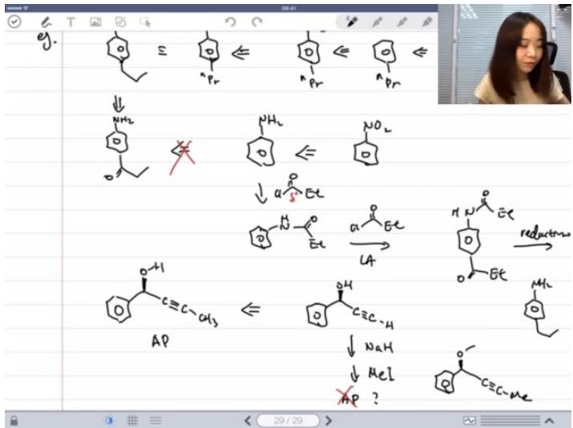

chemical

Chemical reaction scheme showing transformation of a cyclic amide with various reagents and conditions, including hydrolysis, reduction, and neutralization steps.

# ● 题目解析

- 反应机理：使用氢化钠和碘甲烷制备炔烃时，需考虑区域选择性  
○ 关键问题：氢化钠会优先拔取羟基氢而非炔氢，导致无法得到目标产物  
副产物分析：可能生成氧负离子和氮负离子进攻碘甲烷的混合产物  
- 有机合成要点：需综合考虑反应选择性和竞争反应路径

# 8. 亲和取代 01:08:23

# 1）基本要素

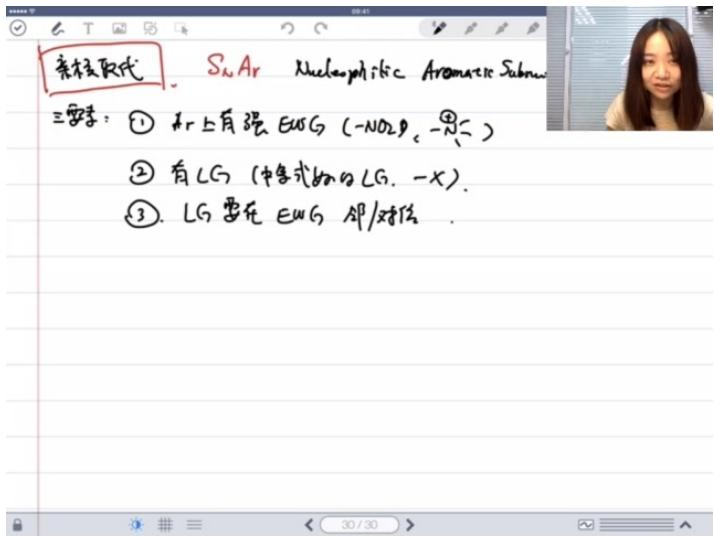

text_image

亲核取代
SₙAr Nucleopolitic Aromatic Substrate
三安亭：① 有上强 EUSG（-NO₂O，一）；
② 有LG（中等式的LG，一）；
③. LG要在EWSG AP/对价。

# 三要素：

○ 芳环上有强吸电子基团（如 $-NO_{2}$ ）  
○ 存在中等或好的离去基团（如 -X）  
○ 离去基团位于吸电子基团的邻/对位

● 典型例子：对溴硝基苯与氢氧化钠反应生成对硝基苯酚   
● 机理特点：分步进行，先亲和进攻生成负离子中间体，再离去基团脱离

# 2）反应机理详解

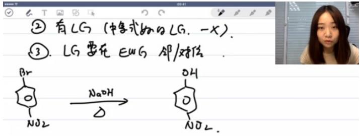

chemical

Handwritten chemical reaction diagram showing bromoalkane (BrNO2) reacting with sodium hydroxide to form a cyclic alcohol with OH and NO2 groups

- 中间体稳定：硝基通过共振效应稳定负电荷，可形成 $N^{+} = O^{-}$ 结构  
● 区域选择性：进攻发生在吸电子基团邻/对位的碳原子上  
● 空间因素：平面芳环结构使进攻方向不影响产物构型

# 3）例题:亲和取代反应 01:10:45

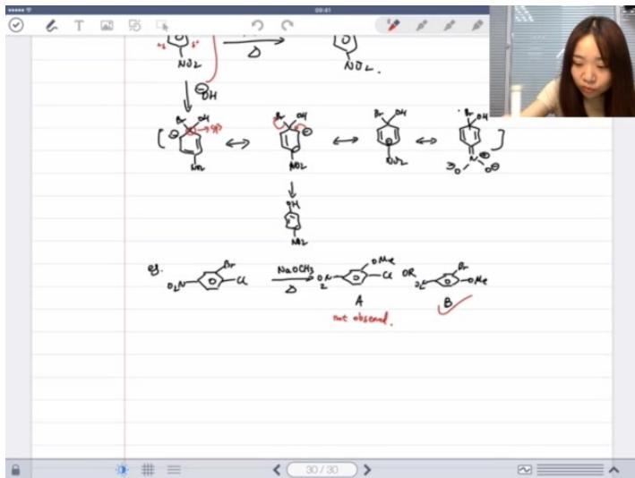

chemical

Chemical reaction pathway diagram showing nitration, hydrolysis, and transformation steps with labeled intermediates and conditions

● 题目解析

- 试剂差异：甲醇钠提供甲氧基负离子作为亲和试剂  
位置选择：反应优先发生在吸电子基团邻位的氯原子上  
副反应：高温条件下可能发生消除反应生成苯炔中间体  
- 极端条件：300℃时主要发生消除而非取代反应

# 4）苯炔反应

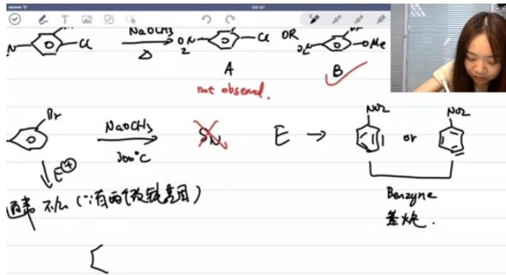

chemical

Chemical reaction diagram showing nitration of benzene with NaOHCH3 and COOH groups, followed by formation of a benzene derivative or aniline.

形成条件：需要强碱如 $NaNH_{2}$ 或RLi，在液氨中-40℃进行  
● 反应特点：先消除HX生成苯炔中间体，再加成氨分子  
● 选择性：当存在取代基时，会生成位置异构体的混合物  
● 应用限制：苯炔活性极高，通常作为反应中间体存在

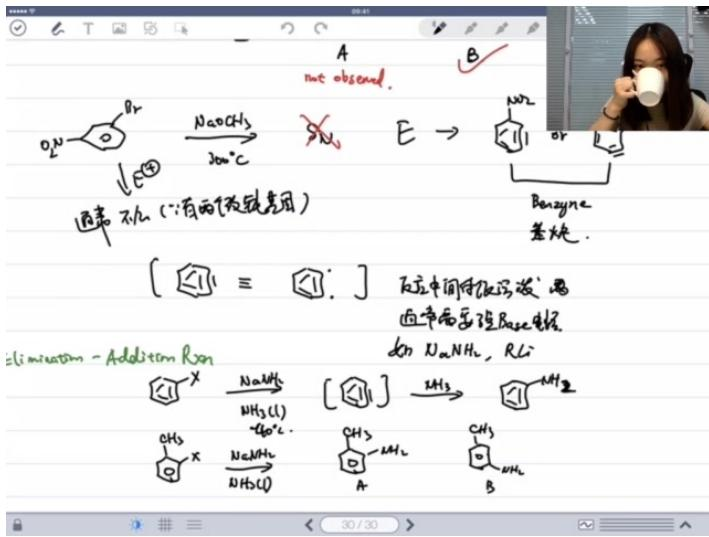

chemical

Chemical reaction scheme showing bromination, acidification, and subsequent hydrolysis of a substituted benzene derivative using NaOH and NH3 groups

# ● 题目解析

- 反应过程：邻位二取代苯在强碱作用下生成苯炔中间体  
○ 产物分析：氨加成会产生两种位置异构体（a和b）  
○ 选择性：由于苯炔的高活性，两种产物都会生成

# 9. 复习芳香性共轭芳香性共振结构 01:26:42

# 1）芳香性的定义与本质 01:27:34

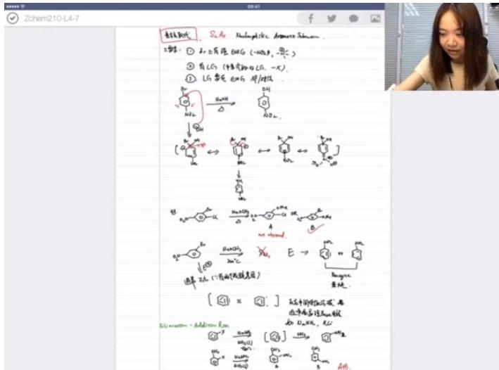

text_image

Zchem210-L4-7
有机物：
S₂Ar
Nucleophilic Anorensic Solution
②溶剂：①H₂↑反应生成的（-NH₃）₂，③H₂O₂
④有Li₃（中等化为O Li₃—X）
⑤Li₃（中等化为O H₂O₂）
[结构式：含SiO₂] → [结构式：含SiO₂]
[结构式：含SiO₂] → [结构式：含SiO₂]
[结构式：含SiO₂] → [结构式：含SiO₂]
[结构式：含SiO₂] → [结构式：含SiO₂]
[结构式：含SiO₂] → [结构式：含SiO₂]
[结构式：含SiO₂] → [结构式：含SiO₂]
[结构式：包含SiO₂] → [结构式：含SiO₂]
[结构式：含SiO₂] → [结构式：含SiO₂]
[结构式：含SiO₂] → [结构式：含SiO₂]
[结构式：含SiO₂] → [结构式：含SiO₂]
[结构式：含SiO₂] → [结构式：含SiO₂]
[结构式：含SiO₂] ← [结构式：含SiO₂]
[结构式：含SiO₂] ← [结构式：含SiO₂]
[结构式：含SiO₂] ← [结构式：含SiO₂]
[结构式：含SiO₂] ← [结构式：含SiO₂]
[结构式：含SiO₂] ← [结构式：含SiO₂]
[结构式：含SiO₂] ← [结构式：不含SiO₂]
[结构式：含SiO₂] ← [结构式：含SiO₂]
[结构式：含SiO₂] ← [结构式：含SiO₂]
[结构式：含SiO₂] ← [结构式：含SiO₂]
[结构式：含SiO₂] ← [结构式：含SiO₂]
[结构式：含SiO₂] ← [结构式：含SiO₂]
[[结构式] = [结构式] ] 无溶剂将相互作用，再在该溶液中通过加入水解
[结构式] ← [结构式] ← [结构式]
[结构式] ← [结构式] ← [结构式]

● 休克尔规则：需同时满足三个条件：环状结构（cyclic）、共平面性（co-planner）、 $4n + 2$ 个π电子体系  
- 分子轨道本质: 通过分子轨道理论解释, 其本质是 $\pi$ 电子的成键轨道（bonding）和非键轨道（non-bonding）全满状态  
- 反芳香性特征：当出现半满轨道时形成反芳香性体系（antiaromaticity），需满足环状、共平面、4n个π电子条件

# 2）芳香性、反芳香性与非芳香性 01:29:13

# - 分类标准:

- 芳香性：满足休克尔三要素   
- 反芳香性：环状+共平面+4nπ电子  
○ 非芳香性（non-aromaticity）：既不满足芳香性也不满足反芳香性

● 考试重点: 常见题型要求判断化合物属于芳香性/反芳香性/非芳香性, 需特别注意 $4n + 2$ 与 4n 的电子数区别

# 3）反芳香性的特点与实例 01:30:02

● 能量特性: 反芳香性体系能量极高，通常以过渡态或中间体形式存在

● 稳定化机制: 分子会通过扭曲共平面结构转变为非芳香性体系来降低能量  
● 典型实例: 环丁二烯是经典反芳香性案例，其正方形结构难以通过扭曲消除共平面性

4）环丁二烯的反芳香性特性 01:30:59

● 不稳定性表现: 极易发生二聚反应（dimerize），表现为自由基特性  
- 稳定化方法:

○ 空间位阻法：通过叔丁基等大位阻基团阻止二聚  
- 分子笼限制法：利用分子笼限制单分子存在

● 特殊案例: 三叔丁基取代环丁二烯可在室温相对稳定存在，归因于steric effect（空间位阻效应）

10. 反芳香族化合物 01:31:54

1）环丁二烯的不稳定性与稳定性因素 01:32:12

● 热力学分析: 反芳香性导致热力学极度不稳定  
● 动力学稳定: 通过空间位阻实现动力学稳定（分子无法有效碰撞）  
● 取代基效应: 大位阻基团既增加热力学不稳定性，又提供动力学保护

2）反芳香族化合物的难以寻找原因 01:34:20

● 结构自调节: 大环体系易通过扭曲共平面转变为非芳香性  
● 存在形式: 主要作为反应中间体或过渡态短暂存在  
● 实验验证: 需要特殊条件（如低温、分子笼）才能观测

3）非环状线性共轭体系的简介 01:34:47

● 体系特征: 线性（acyclic linear）共轭π电子体系  
- 分子轨道: 与环状体系不同，需掌握其分子轨道绘制方法

11. 分子轨道图 01:35:31

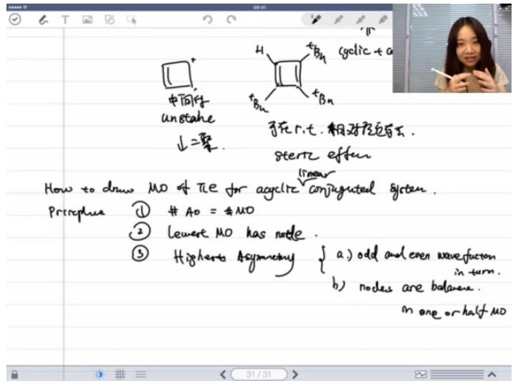

text_image

中间的
unstahé
↓二章.
有在r.t.相对独立存在。
sterre effect
How to draw MO of πe for acyclic conjugated system.
Principle ① # AO = ≠MO
② leuere MO has node .
③ Highest Asymmetry { a) odd and even wavefunction
in turn.
b) nodes are balanera.
m one or half MO

\- 基本原则:

○ 原子轨道数=分子轨道数  
- 最低能级轨道无节点（lowest MO has no node）  
○ 最高对称性原则（highest symmetry）：

■ 波函数奇偶交替（even alternation）  
■ 节点对称分布（balanced nodes）

● 应用实例: 七原子线性共轭体系是最复杂案例，掌握后可应对前线轨道理论需求

12. 前线轨道理论 01:37:38

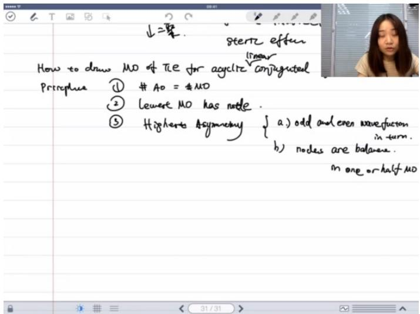

text_image

How to draw MO of TCE for agcycliz conjugated
Prorphone ① # AO = ≠ MO
② Lewere MO has node .
③ Highest Asymmetry { a) odd and even wavefunction in turn.
b) nodes are balanese.
m one or half MO

● 核心概念：只关注分子轨道中的前线轨道，即最高占据轨道（HOMO）和最低未占轨道（LUMO）  
- 轨道类型:

- 成键轨道：HOMO（Highest Occupied Molecular Orbital）  
- 反键轨道：LUMO（Lowest Unoccupied Molecular Orbital）  
○ 非键轨道：在共轭体系中可能存在的特殊轨道

● 理论应用：用于解释化学反应活性，特别是亲电/亲核反应的选择性

13. 共轭和加成 01:38:27

1）共轭体系

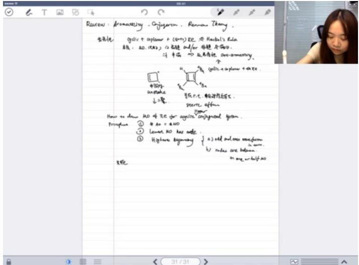

text_image

Rousew : Aromasterzy , Grugaron , Rennan Tramy .
英语词: 
golic + oplanar + (GPT) RE. 叶 Hualal's Rule.
线: AD (进) □ 高键 and/or 非键 交点。
冲 中端 → 玉音有性, also-ammonary.
中国名
unstable
↓二章.
#在r.t.时,相对宽度为5。
steere often.
How to draw AD of RE for agglise omjinguinal system.
Primiphas
① # An = AND
② Learn AD has note.
③ Higher tegmany { a) add and add more transform
in some.
b) makes are below.
in one or half AD
去化

基本特征：π电子离域体系，要求共平面性和(4n+2)π电子数（Hückel规则）  
● 稳定性：共轭体系比孤立双键更稳定，能降低分子总能量  
2）1,2-加成与1,4-加成

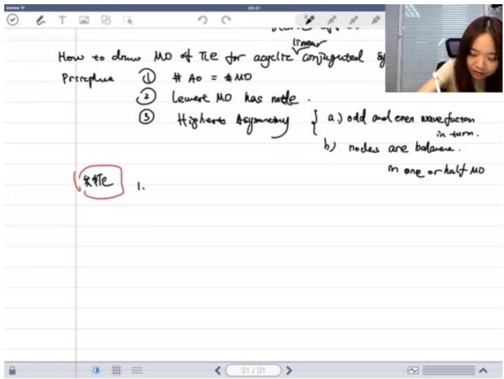

text_image

How to draw MO of TE for agylico conjugated sy
Principle ① # AO = ≠MO
② leuere MO has note.
③ Highest Asymmetry { a) odd and even wavefunction
in turn.
b) nodes are balanee.
m one or half MO
#TE 1.

# - 反应类型:

○ 1,2-加成：直接加成到相邻碳原子上  
- 1,4-加成：加成到共轭体系的两端碳原子上

# - 反应机理：

- 第一步：质子化形成碳正离子中间体  
○ 碳正离子位置：由共轭效应决定，通常不在端位碳上  
- 中间体稳定性：共轭效应是主要稳定因素，强于其他超共轭效应

# 3）动力学和热力学产物 01:44:48

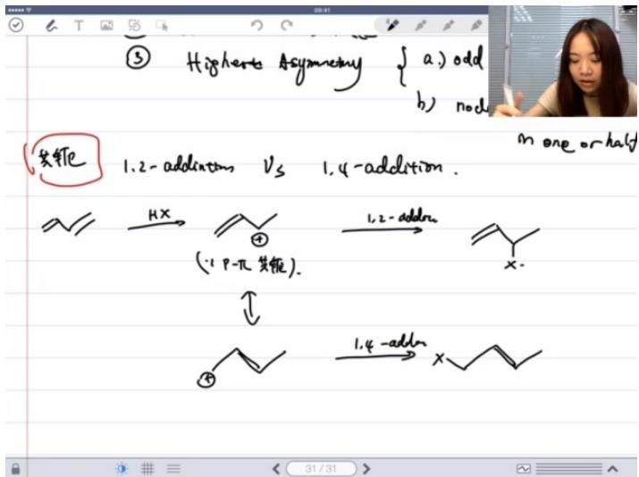

chemical

Handwritten chemical reaction diagram showing asymmetric addition of 1,2-additions to form 1,4-additions and a cyclohexene derivative

# ● 控制因素：

◦ 动力学控制：中间体稳定性决定，活化能低的路径优先  
- 热力学控制：产物稳定性决定，需要反应具有可逆性

# ● 产物稳定性判断：

○ 烯烃取代度：取代基越多越稳定  
○ 共轭程度：共轭体系越大越稳定

# - 反应条件影响：

- 低温短时：倾向于得到动力学产物  
- 高温长时：倾向于得到热力学产物

# - 重要结论：

○ 1,4-加成不一定是热力学产物  
○ 1,2-加成不一定是动力学产物  
- 需要具体分析中间体和产物的稳定性因素

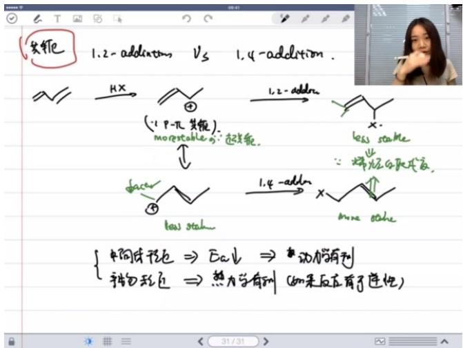

text_image

共轭 1.2-addition Vs 1.4-addition.
HX
(·P-π共轭)
more stable ∵ 越共轭.
less soane
″烯烃的取代
″low stable
1.4-addn
×
more other
中间体形态 ⇒ Ea↓ ⇒ 动力学有利
相切形态 ⇒ 熬力学有利 (如果反应有子连性)

# - 可逆性本质：

- 几乎所有反应在理论上都是可逆的  
○ 表观不可逆反应是指能垒极高的反应  
- 温度足够高时，任何反应都可能表现出可逆性

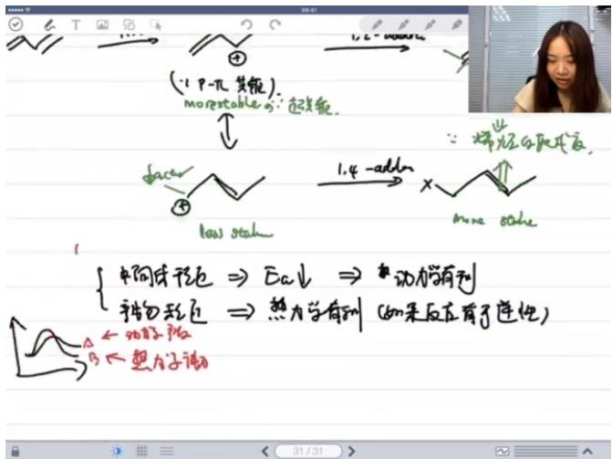

text_image

(1 P-π 共能)
more/stable 5: 越能
↓
face
low stable
1.4 - addn
x
one
800e
:: 烯烃的取代物
{
中间体粒子化 ⇒ Ea↓ ⇒ 动力学有制
物体粒子化 ⇒ 熬力学有制 (如果反在背了连性)
← 动力学产
→ 想力子谱

# ● 记忆要点：

○ 碳正离子稳定性：共轭效应 > 超共轭效应  
○ 产物稳定性：取代度高的烯烃更稳定  
- 反应控制：动力学有利≠活化能低，热力学有利≠产物能量低  
必须考虑具体体系中的所有稳定化因素

# 14. 共振论 01:45:23

# 1）共振论基本原理

● 本质功能：用于判断电荷或 $\pi$ 电子分布情况

# - 结构要求:

- 必须符合路易斯结构规则  
- 原子排布和σ键排布必须相同（仅π电子或电荷流动）

● 表示方法：用双箭头连接不同共振结构，表示极限态的叠加  
● 稳定性原则：越稳定的共振结构对真实结构的贡献权重越大

# 2）共振结构稳定性判断原则

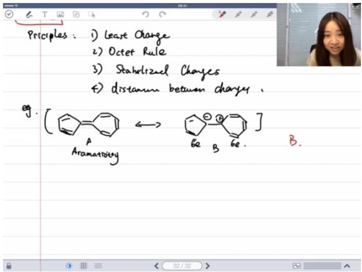

text_image

Principles: 1) leave charge
2) Octet Rule
3) Stahlizuel Changes
4) distance between changes.
eg. [Aramatistry] ← [Be B be.] B.

# 四原则优先级：

○ Least charge: 形式电荷最小化  
- Octet rule: 优先满足八隅体规则   
○ Charge stability: 电荷稳定性（正电荷在电负性小的原子上更稳定）  
○ Charge distance：同号电荷远离，异号电荷靠近

● 例外情况：芳香性体系可能违反原则1（如六元环共轭体系即使带电荷也稳定）

3）例题：共振结构稳定性判断 01:48:06

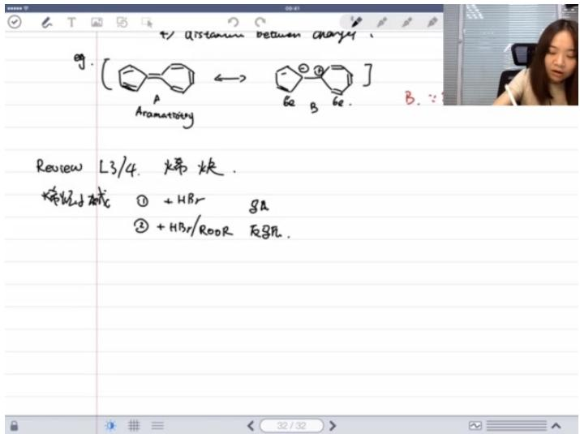

text_image

erg. [C6H5P Aramatory ↔ C6H5O4B Ge B Ge.] B. ∵
Review L3/4. 烯炔.
烯烃式: ① + HBr ga
② + HBr/ROOR 反gK.

# ● 题目解析

○ 关键矛盾：原则1（无电荷更稳定）vs 芳香稳定性  
○ 实验证据：分子极性测量支持带电荷结构更稳定  
- 结论：芳香性可以超越电荷稳定性原则  
- 答案：带电荷的共振结构B更稳定

15. 烯烃和炔烃的加成反应 01:53:33

1）烯烃加成反应

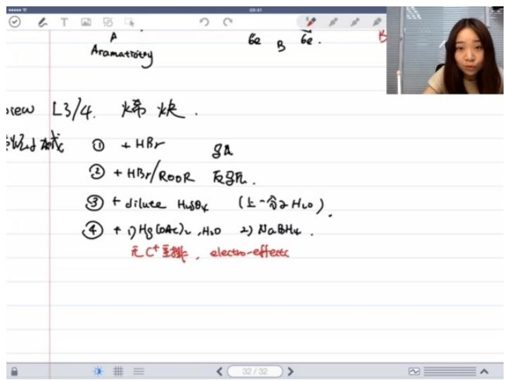

text_image

Aramattotiry
Be Be. Be.
new L3/4. 烯炔.
① + HBr ga
② + HBr/RoOR 反gK.
③ + dilute H2SO4 (上一分子H2O).
④ + 1) HgCOAcI, H2O 2) NaBH4.
无C+重排, electro-effects

● 马氏加成：

- 条件：HBr（无引发剂）  
○ 机理：生成更稳定的碳正离子中间体

\- 反马氏加成：

\- 条件：HBr/ROOR（自由基引发剂）

● 水合反应：

- 稀硫酸：通过碳正离子机理（可能重排）  
- 汞试剂：无重排的三元环机理（Hg(OAc) $_{2}$ →NaBH $_{4}$ ）

● 硼氢化反应：

○ 特点：反马氏、顺式加成  
- 后续： $\mathrm{H}_{2} \mathrm{O}_{2} / \mathrm{OH}^{-}$ 实现同向加水

\- 卤素加成：

- 溴鎓离子机理→反面进攻   
○ 区域选择性：电子效应和位阻效应共同决定

2）炔烃加成特点

● 一般原则：类比烯烃（碳正离子稳定性决定区域选择性）  
● 特殊反应：

\- 顺式加氢：Lindlar催化剂（中毒Pd）

\- 反式加氢： $\mathrm{Na} / \mathrm{NH}_{3}(\mathrm{I})$ 还原

\- 端炔酸性：用 $NaNH_{2}$ 去质子化

3）制备特定化合物的反应 02:02:09

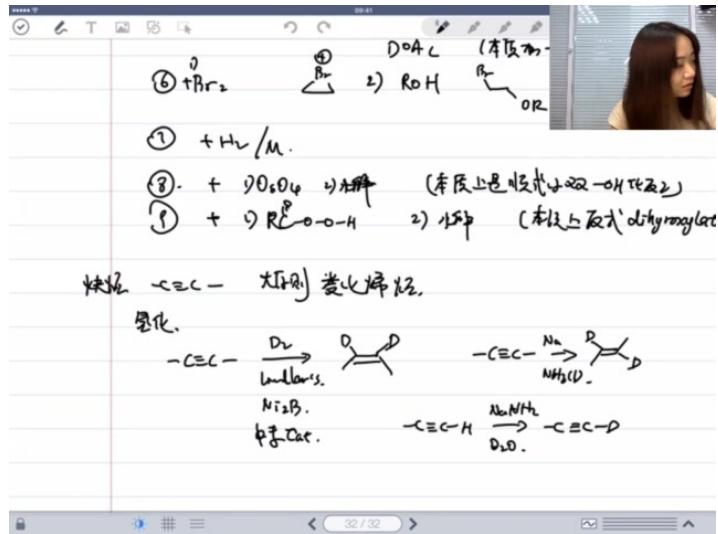

text_image

⑥ +Br₂
③ DOA C (本质加一)
② B₂ 2) ROH
① +H₂/M.
⑧. + 2O₆O₄ 2)水稀 (本质上是顺式小双-OH化反之)
⑨ + 3R²O-O-H 2)水稀 (本段上反式 dihydroxylate)
炔烃 -C≡C- 大刚 增化烯烃,
氢化.
-C≡C- → D₂ → O=C → -C≡C- → NH₃D
Ni₂B.
p+CaE.
-C≡C-H → NaNH₂ → C≡C-D
D₂O.

\- 顺式加氘： $\mathrm{D}_{2}+$ 中毒催化剂（如Lindlar）

- 反式加氘： $\mathrm{Na} / \mathrm{ND}_{3}$   
● 端炔氘代：

○ $NaNH_{2}$ 去质子  
○ D₂O淬灭

16. 应用案例 02:04:15

1）例题：烯烃与溴化氢反应

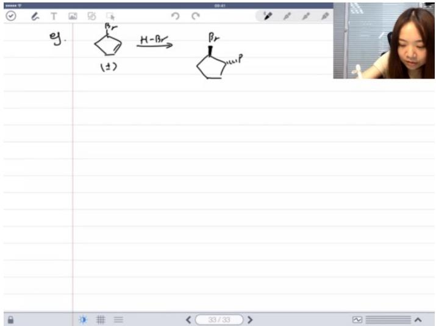

chemical

Chemical reaction diagram showing bromination of cyclohexane to form a cyclopentene derivative with H-Br and wP substituents

● 题目解析

○ 关键现象：生成特定立体构型产物  
○ 机理分析：邻基参与效应（溴原子协助形成溴鎓离子）  
- 稳定性比较：能形成五元环过渡态的结构更有利  
- 答案：通过邻基参与路径生成主要产物

2）例题：分子内/分子内反应 02:07:48

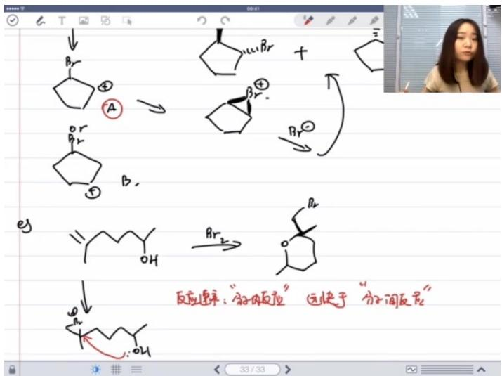

chemical

Hand-drawn chemical reaction scheme showing bromination and hydrolysis steps with reaction arrows and Chinese text notes

● 题目解析

○ 核心原理：分子内反应速率 >> 分子间反应  
○ 环状中间体：六元环比七元环更稳定   
○ 区域选择性：优先形成五/六元环产物  
- 应用：解释邻基参与效应的本质原因

17. 醇的复习 02:11:03

1）醇作为质子酸和路易斯碱 02:11:38

● 例题:醇与TBAOH反应 02:11:49

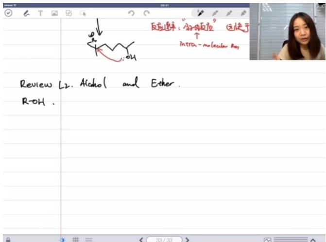

text_image

反应速率:“字母反应” 远快于
↑
Intra-molecular res
Review L2. Alcohol and Ether.
R-OH.

质子酸特性：醇羟基(R-OH)具有质子酸性质，遇强碱(如叔丁醇钾)会发生酸碱反应生成 $RO^{-}$ ，而非消除反应。因为 $OH^{-}$ 是极差的离去基团(terrible leaving group)。  
- 路易斯碱特性：醇氧原子具有孤对电子，可作为路易斯碱：

■ 与质子酸结合： $ROH + H^{+} \rightarrow ROH_{2}^{+}$ （活化羟基使其成为良好离去基团）  
■ 与路易斯酸(如 $ZnCl_{2}$ )结合：显著提高取代反应速率（卢卡斯试剂原理）

○ 卢卡斯试剂应用：

■ 组成：无水 $ZnCl_{2}$ /浓盐酸溶液  
■ 现象：生成不溶于水的卤代烃导致溶液浑浊   
■ 反应速率差异：三级醇(秒反应) > 二级醇(30-60分钟) > 一级醇(需加热)  
■ 现代替代方法：红外光谱检测羟基特征峰

2）醇的氧化反应 02:19:06

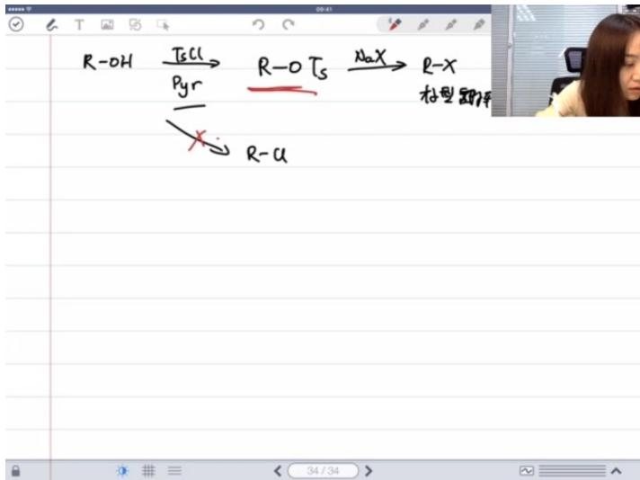

text_image

R-OH → IsCl → R-O Ts → NaX → R-x
Pyr ———— 校型翻译
× → R-u

● PCC氧化：将伯醇温和氧化为醛(R - CHO)，条件为 $CrO_{3}$ /吡啶/HCl复合体系  
● 强氧化条件： $CrO_{3}$ /酸性条件可直接将伯醇氧化为羧酸(R - COOH)  
● 反应选择性：仲醇氧化生成酮，叔醇通常不发生氧化

3）频哪醇重排 02:20:00

● 频哪醇重排反应介绍 02:20:07

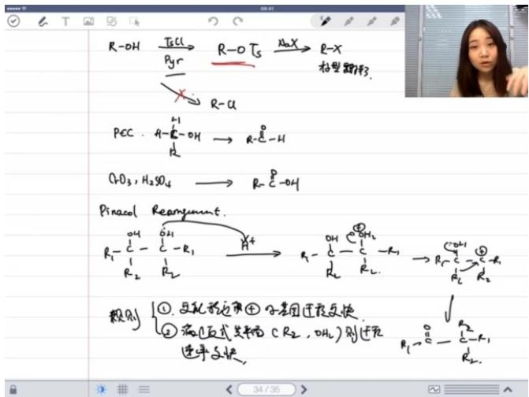

text_image

R-OH → R-O Ts → R-X
PCC · H-ε-H → R-ε-H
CrO₃, H₂SO₄ → R-ε-OH
Pinacol Reamment.
R₁-ε-ε-R₁ → R₁-ε-ε-R₁ → R₁-ε-ε-R₁
R₂ 1 1 1 1 1 1 1 1 1 1 1 1
规则 {①. 变化反应④. 子团迁移更快.
②. 滴C反式共轭 (R₂, OH₂) 则(迁)
速平又快.
R₁→ - R₂
R₂→ - R₁
34/36>

反应类型：邻二醇 $(R_{2}C(OH) - C(OH)R_{2})$ 在酸性条件下的碳骨架重排反应  
○ 特征产物：生成酮类化合物（形成碳氧双键）

● 频哪醇重排反应机理 02:20:33

步骤1：质子化羟基生成 $R_{2}C(OH^{+})-CR_{2}OH$   
步骤2：脱水形成碳正离子 $R_{2}C^{+}-CR_{2}OH$   
○ 关键步骤：邻位羟基的σ键电子迁移，同时生成碳氧双键

● 迁移规则一：稳定碳正离子的集团迁移更快 02:21:33

优先迁移基团：能更好稳定正电荷的基团（与普通碳正离子重排规则相反）

■ 实例：苯基 > 甲基（苯基可通过共轭效应分散正电荷）

● 迁移规则二：满足反式共平面迁移速率更快 02:22:05

- 空间要求：迁移基团与离去的水分子需处于反式共平面位置  
○ 轨道理论：σ键电子对与空p轨道的最大重叠要求

● 迁移规则的本质与实例 02:22:46

本质区别：不同于普通碳正离子重排的"小基团优先迁移"规则  
○ 实验依据：通过计算化学验证的观测现象

● 六元环中的直立性与平复性问题 02:23:59

环状体系：在六元环结构中，只有处于反式双直立键位置的基团才能有效迁移  
○ 构象影响：平伏键基团因空间位阻导致迁移速率显著降低

4）环氧开环反应 02:24:20

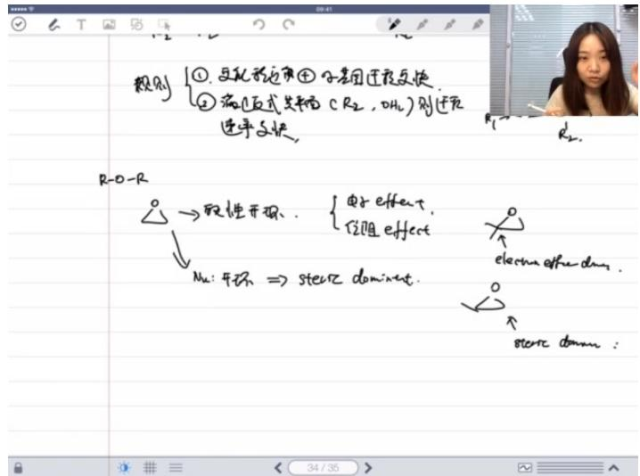

text_image

规则 {①. 变化接近和④子基因迁移变换.
② 滴C反式共轭 (R₂, OH₂) 则迁移
速率变换.

R-O-R

→ 轻性开积. {对 effect,
位阻 effect

Nu: 开积 ⇒ stepz dominant.

electrons effus dem.

sterc domms :

\- 酸性开环反应

○ 主导因素：酸性条件下开环反应受电子效应(electron effect)和位阻效应(steric effect)共同影响

# ○ 取代基影响：

■ 当碳上有两个取代基时，正电荷更稳定，电子效应占主导(electron effect dominant)  
■ 当碳上只有一个取代基或无取代基时，位阻效应占主导(steric effect dominant)  
■ 实际反应中常得到混合物，需具体问题具体分析

\- 反应机理：存在碳正离子中间体

● 碱性/亲核开环反应

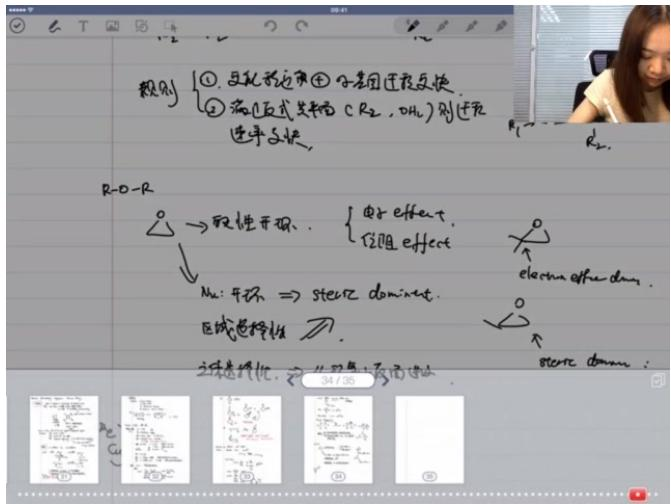

text_image

规则
①.互换式近似④子表面迁移反快
②满(反式共轭(R₂,OH₂))则迁移反
速来反快

R-O-R

→取性开积.
{电子 effect.
位阻 effect

Ne: 开环 ⇒ stepz dominant.
区域选择性 →

2.移位移化, ⇒ 100%
34/35
→
electrons offer down.

stepz down:

主导因素：位阻效应绝对主导(steric effect dominant)  
○ 机理特点：不存在碳正离子中间体，亲核试剂直接进攻中性环氧分子  
○ 立体选择性：亲核试剂总是从环氧环的反面进攻（氧原子在上方时从下方进攻）

● 区域选择性与立体选择性

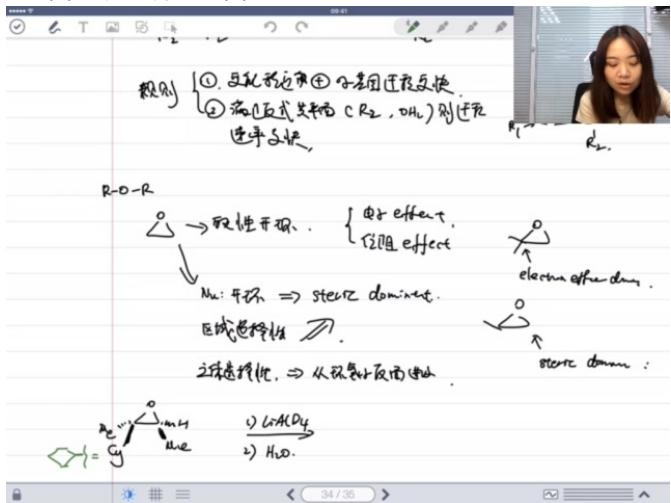

text_image

规则
①.互轮式近似④子类因迁移反快.
②满面反式共轭(R₂，OH₂)则迁移反
速来反快.

R-O-R

→取性开积．
{电子 effect.
位阻 effect

Ne: 开环 ⇒ steze dominant.
区域选择性 →.

立体选择性，⇒从现象反射而使心.

1) LiAc(O₄)
2) H₂O.

区域选择性：决定亲核试剂进攻哪个碳原子  
○ 立体选择性：亲核试剂必须从环氧的反面进攻，形成反式开环产物

● 例题：亲核试剂开环反应

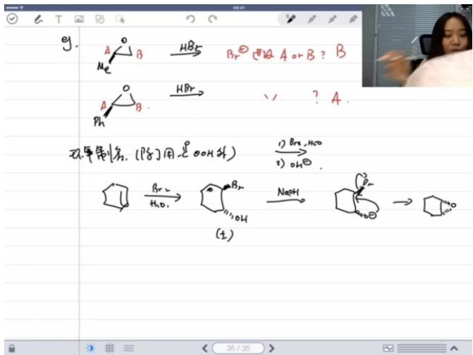

chemical

Chemical reaction scheme showing bromination and hydrolysis steps with labeled intermediates and products

# ○ ○ 题目解析

■ 使用四氘代铝锂 $(LiAlD_{4})$ 作为亲核试剂  
■ 机理分析：位阻效应主导，进攻位阻较小的碳原子  
■ 最终产物：开环后D在下方，甲基在上方，形成OH、H、D、 $CH_{3}$ 、环己基的特定构型  
■ 易错点：开环机理理解错误会导致D/H位置标记错误

# ● 酸性开环反应实例分析

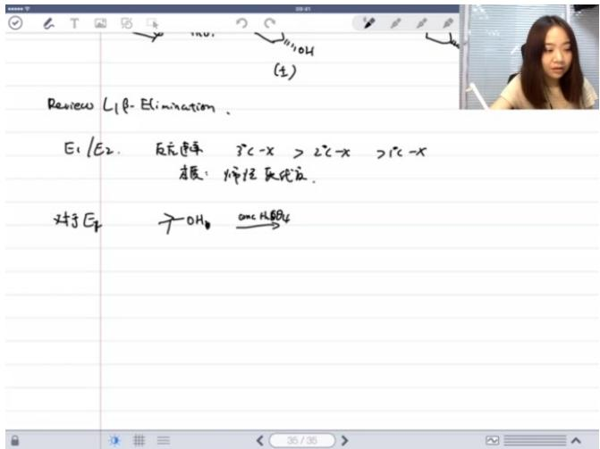

text_image

Review L1β-Elimination.
E1/E2. 反充速率 3℃-x > 2℃-x > 3℃-x
材质：烯烃灰代烃.
对于E2 →OH, onc H684

# ○ 取代基影响：

■ 甲基vs苯基：苯环能更好稳定正电荷，此时电荷效应可能超过位阻效应  
■ 实际反应常得到混合物，主产物需具体分析

\- 经验法则：酸性开环中电荷效应和位阻效应需PK，无绝对规律

# - 环氧制备补充方法

# ○ 溴水法：

■ 烯烃与溴水反应生成反式二溴化物  
■ 与氢氧化钠反应发生分子内 $S_{N}$ 2反应（邻基参与效应）  
■ 最终形成环氧环

○ 特点：氧负离子进攻必须是反式构型

# - 消除反应基础

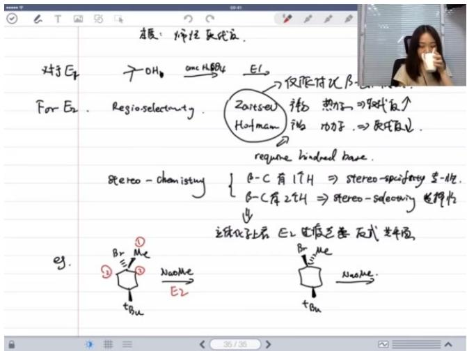

text_image

对E₂ →OH → amHBr₂ → E₁
For E₂. Region-selectivity.
Zaitsseu
Hofman
FeB 热子 ⇌ 2tH⁺反↑
FeB 动子 ⇒ 2tH⁺↓.
regume hindred base.
stereo - chaniisty { β-C有17H ⇒ stereo-specificity 5-11%.
β-C有2tH ⇒ stereo-selectivity 选择性?
↓
主体化子上层 E₂ 使反应生成式共平面.
eg.
Br Me
③ → NaOMe
tBu → E₂
Br Me
tBu → NaOMe
→ 仅限对比β-

- β-消除：消除β位的氢原子

○ 反应类型:

E1：单分子消除，常见于三级碳   
E2：双分子消除，碱与底物共同参与   
○ 反应活性：三级碳＞二级碳＞一级碳（与 $S_{N}1/S_{N}2$ 不同）  
- 决定因素：烯烃取代度越高，产物越稳定，过渡态能垒越低

# - 消除反应的选择性

○ 区域选择性：

■ 扎伊采夫产物：取代度高的烯烃（热力学产物）  
■ 霍夫曼产物：取代度低的烯烃（动力学产物）

位阻影响：大位阻碱(hindered base)倾向于生成霍夫曼产物

○ 立体化学：

E2反应需要反式共平面构象  
■ 当β碳只有一个氢时，反应具有立体专一性  
■ 当β碳有两个氢时，反应具有立体选择性

# 5）SN与消除反应三步骤总结 02:46:15

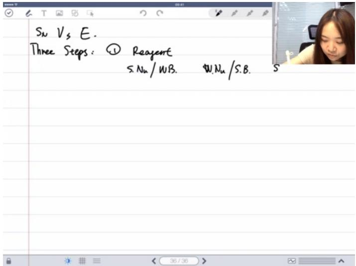

text_image

Sv Vs E.
Three Steps: ① Reagent
S.Nu/W.B. W.Nu/S.B. S

\- 第一步：试剂判定

\- 四大试剂类型:

■ 强亲核弱碱：如卤素负离子 $(X^{-})$ 、硫醇负离子 $(RS^{-})$ ，硫醇(RSH)是唯一中性强亲核试剂  
■ 弱亲核强碱：如氢化钠(NaH)、叔丁醇钾(t-BuOK)等大位阻碱  
■ 强亲核强碱：如烷氧负离子 $(RO^{-})$ 、氨基负离子 $(NH_{2}^{-})$

■ 弱亲核弱碱：如水 $(H_{2}O)$ 、醇(ROH)等中性分子

# - 第二步：机理分析

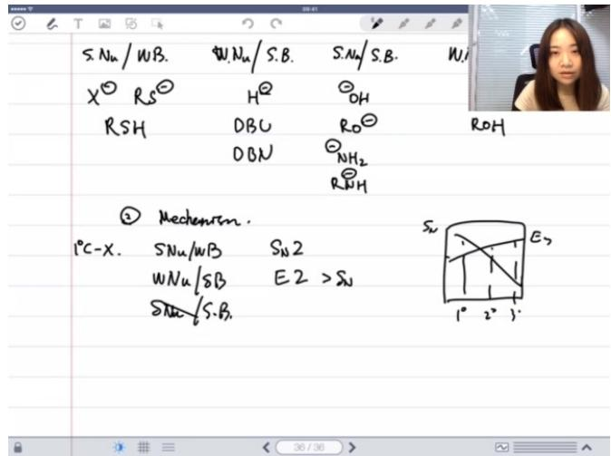

text_image

S Nₐ / W.B. W Nₐ / S.B. S Nₐ / S.B. W
X Ⓞ R S Ⓞ H Ⓞ O H
RSH OBU R O Ⓞ NH₂
OBN R NH
② Mechenrin .
1°C - X. S Nₐ / W.B S N 2
W Nₐ / S.B E 2 > S
S Nₐ / S.B.
S Nₐ / S.B.
1° 2° 1:

# ○ 一级碳反应

■ 强亲核弱碱：主要发生 $S_{N}2$ 反应  
■ 弱亲核强碱：优先发生E2消除   
■ 强亲核强碱： $S_{N}$ 2远大于E2  
■ 弱亲核弱碱：通常不反应(No Reaction)

# ○ 二级碳反应

■ 强亲核弱碱：可能发生 $S_{N}1$ 或 $S_{N}2$ ，需具体分析  
■ 弱亲核强碱：主要发生E2消除  
■ 强亲核强碱： $E2 > S_{N}(S_{N}1 \text{或} S_{N}2)$   
■ 弱亲核弱碱：通常不反应或产物混乱

# ○ 三级碳反应

■ 强亲核弱碱：仅发生 $S_{N}$ 1反应  
■ 弱亲核强碱：优先发生E2消除   
■ 强亲核强碱：E2 >> S\_N1\$   
■ 弱亲核弱碱：可能同时发生E1和 $S_{N}$ 1，得到混合物

# - 第三步：温度影响

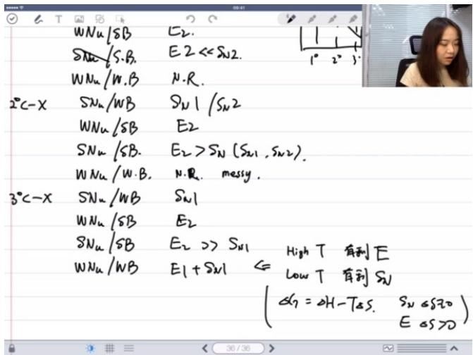

text_image

WNu/SB
SNa/S.B.
WNu/W.B
2°C-X
SNu/WB
WNu/SB
SNu/SB.
WNu/W.B.
3°C-X
SNu/WB
WNu/SB
SNu/SB
WNu/WB
E2
E2 > SN(Sn1, Sn2).
N.R. messy.
E1 + SnI
E2
E2 >> SnI
High T 有到 E
Low T 有到 SnI
(△G = △H - T△S. S_n ≈ S_30)
E ≈ S > D)

高温效应：有利于消除反应(E1/E2)，因 $\Delta S > 0$   
○ 低温效应：有利于取代反应 $(S_{N})$ ，因 $\Delta S\approx0$   
- 热力学原理：遵循 $\Delta G = \Delta H - T\Delta S$ 公式

# - 反应趋势总结

<table><tr><td rowspan="4">1°C-X</td><td>SNa/WB</td><td>SN2</td></tr><tr><td>WNu/SB</td><td>E2</td></tr><tr><td>SNu/S.B</td><td>E2&lt;&lt;SN2.</td></tr><tr><td>WNu/W.B</td><td>N.R.</td></tr><tr><td rowspan="4">2°C-X</td><td>SNu/WB</td><td>SN1/SN2</td></tr><tr><td>WNu/SB</td><td>E2</td></tr><tr><td>SNu/SB</td><td>E2&gt;SN(SN1, SN2).</td></tr><tr><td>WNu/W.B</td><td>N.R.messy.</td></tr><tr><td rowspan="4">3°C-X</td><td>SNu/WB</td><td>SN1</td></tr><tr><td>WNu/SB</td><td>E2</td></tr><tr><td>SNu/SB</td><td>E2 &gt;&gt; SN1</td></tr><tr><td>WNu/WB</td><td>E1+SN1</td></tr></table>

消除反应速率：三级碳 $>$ 二级碳 $>$ 一级碳  
- 混合物处理：当同时存在多种路径时，需标明所有可能机理  
实用建议：弱亲核弱碱体系通常避免使用，因产物不可控

二、知识小结

<table><tr><td>知识点</td><td>核心内容</td><td>考试重点/易混淆点</td><td>难度系数</td></tr><tr><td>芳香性判断</td><td>环状共平面结构+4n+2π电子体系</td><td>反芳香性体系的判断标准(4n电子)</td><td>★★★★</td></tr><tr><td>共振结构稳定性</td><td>1.最少电荷 2.满足八隅体3.电荷稳定性4.电荷间距</td><td>硝基苯酚共振结构例外情况</td><td>★★★★</td></tr><tr><td>亲电取代定位效应</td><td>最强致活基团决定取代位置</td><td>多取代基时的位阻效应影响</td><td>★★★★</td></tr><tr><td>亲核芳香取代</td><td>需同时满足:强吸电子基、离去基团、邻对位定位</td><td>与消除反应的竞争关系</td><td>★★★★</td></tr><tr><td>烯烃加成反应</td><td>马氏规则/反马氏规则(自由基条件)</td><td>硼氢化反应的立体选择性</td><td>★★★</td></tr><tr><td>醇类反应机理</td><td>卢卡斯试剂鉴别醇类(1°/2°/3°)</td><td>频哪醇重排的迁移规则</td><td>★★★★</td></tr><tr><td>环氧开环反应</td><td>酸性条件:电子效应主导; 碱性条件:位阻效应主导</td><td>邻基参与效应的特殊案例</td><td>★★★★</td></tr><tr><td>消除反应竞争</td><td>扎伊采夫产物vs霍夫曼产物</td><td>立体专一性要求反式共平面</td><td>★★★★</td></tr><tr><td>合成路线设计</td><td>定位基团转换(如磺酸基作阻断基)</td><td>傅克反应的碳正离子重排问题</td><td>★★★★</td></tr><tr><td>反应机理判断</td><td>四步分析法:1.试剂性质 2.底物结构 3.机理类型 4.产物预测</td><td>温度对SN/消除反应的影响</td><td>★★★★</td></tr></table>