# 一、醛和酮02:18

# 1. 命名 02:50

# 1）例题:醛的命名 03:10

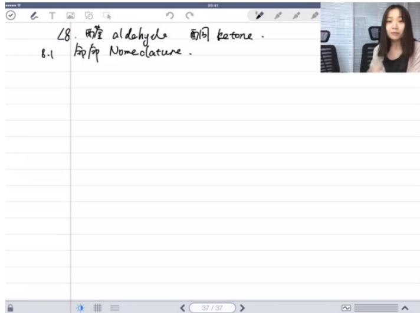

text_image

∠8. 酶 aldehyde 酯同 ketone.
8-1 命郎 None-clature.

基本规则：醛的IUPAC命名以"-al"为后缀，中文用"醛"字表示。例如乙醛（两个碳的醛）。

# ● 复杂结构命名：

○ 先确定母体（最长碳链含醛基），醛基碳编号为1  
○ 示例：三苯基丙醛（苯基在丙醛的3号位）  
○ 注意区分苯基（Ph-）和苄基（PhCH2-）

# - 立体化学：

- 当醛基碳连有不同取代基时，需考虑立体构型  
○ 示例：(R)-3-溴丁醛（溴原子在3号位，R构型）

# 2）例题:酮的命名 05:21

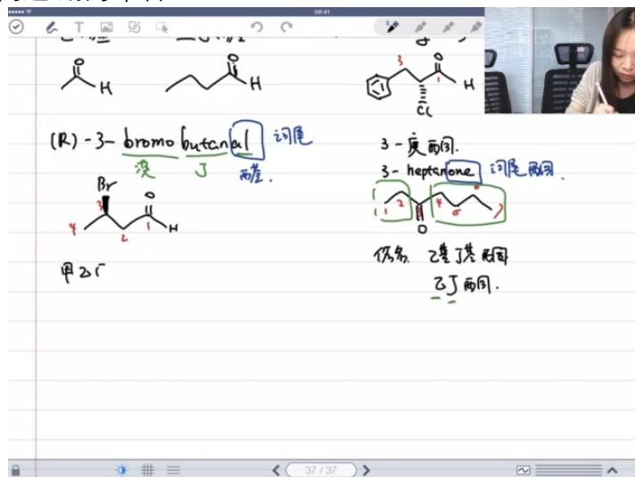

chemical

Handwritten chemical reaction equations and molecular structures for bromo butanil, 3-heptanone, and 2-丁基丙酮

● 基本规则：酮的IUPAC命名以"-one"为后缀，中文用"酮"字表示。例如庚酮-3（七个碳的酮，羰基在3号位）。

# - 俗名系统：

○ 采用"基+基+酮"格式  
○ 示例：甲乙酮（系统名称为丁酮-2）  
命名时将羰基碳视为中心，两侧基团按碳数排序

# ● 编号原则：

○ 选择使羰基编号最小的方向  
○ 当羰基位置相同时，使取代基编号最小

# 2. 醛和酮的制备 09:52

# 1）制备醛的反应 10:22

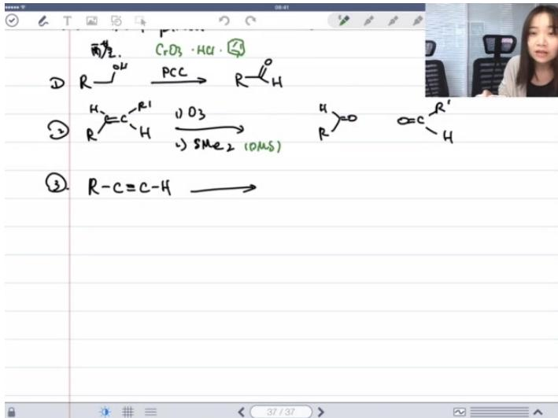

chemical

Chemical reaction scheme showing phosphorus-catalyzed transformation of alkene to ester and then to ketone

# - 醇氧化法：

- 使用PCC（吡啶氯铬酸盐）氧化伯醇  
避免使用强氧化剂（如CrO3/H2SO4）以防过度氧化成酸  
- 反应式: $R - CH_{2}OHP\in CR - CHO$

# - 臭氧解法：

- 烯烃经臭氧分解后加还原剂（如DMS）  
- 两步反应：先臭氧解，后还原  
○ 示例： $R - CH = CH - R'1.O_{3} \backslash 2.DMSR - CHO + R' - CHO$

# ● 端炔水合法：

- 端炔经羟汞化-脱汞反应生成烯醇，互变异构成醛   
○ 需使用HgSO4/H2SO4催化  
○ 区域选择性：OH加在端位碳上

# 2）制备酮的反应 14:47

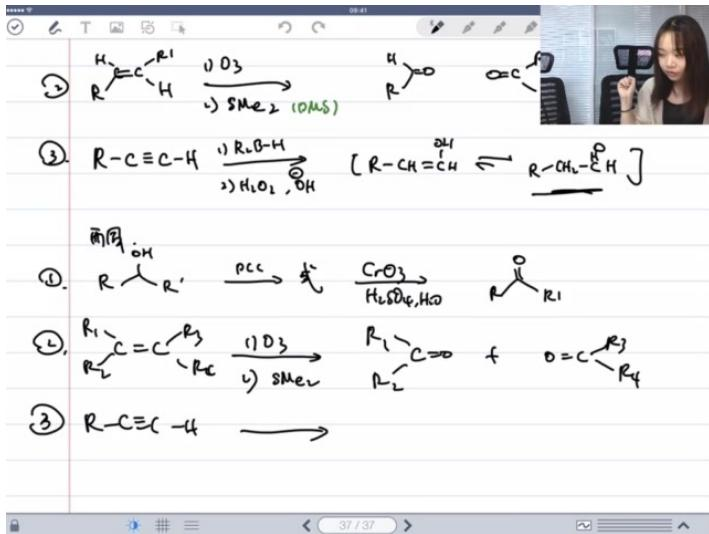

chemical

Handwritten chemical reaction equations involving ester and alkene transformations with labeled steps and structural formulas

# - 仲醇氧化法：

○ 使用PCC或CrO3/H2SO4氧化仲醇  
○ 反应式： $R - CH(OH) - R'[\Theta]R - CO - R'$

# - 烯烃臭氧解法：

- 与醛制备类似，但生成两个酮片段  
○ 需控制反应条件避免过度氧化

# - 炔烃水合法：

○ 非端炔经羟汞化-脱汞反应生成酮  
○ 区域选择性：OH加在内碳上  
○ 示例： $RC \equiv CR'HgSO4 \neq H2SO4R - CO - R'$

# ● Friedel-Crafts酰基化：

- 芳香环与酰氯在Lewis酸催化下反应  
○ 生成芳香酮的重要方法  
○ 示例： $ArH + RCOClAlGl3ArCOR$

# 3）醛和酮制备的额外反应 18:01

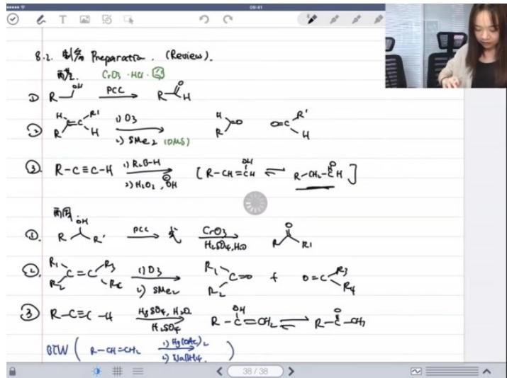

text_image

8.2. 制名 Preparatia . (Review).
丙酮. C₂O₃·HCO·
① R→PCC→R=O
② H₂=C-R¹ 1) O₃ ③ R=O ④ =C-R′
③ R-C≡C-H 1) R₂O-H → [R-CH=C-U ⇌ R-OH-E-P-H]
④ R-C≡C-R' → PCC → 线 → CrO₃ → R=O
⑤ R₁-C=C-R³ 1) O₃ ⑥ R₁-C=O + O=C-R³
⑥ R-C≡C-H 4 → H₂SO₄, H₂O → R-C=CH₂ → R-E-OH
QTW (R-CH=CH₂ 1) H₂(OH)₂
⑦ H₂O₃H₄

# 特殊注意事项：

o PCC的组成：CrO3 + HCl + 吡啶   
- 臭氧解反应中DMS的作用：温和还原剂，防止醛被进一步氧化  
- 汞化反应的替代：现代常用无汞催化体系

# ● 反应选择性控制：

- 制备醛时需选择温和氧化条件  
- 酮制备时要注意取代基的空间位阻效应  
- 芳香酮制备时需考虑芳香环的活性

# 3. 亲和加成 18:36

# 1）例题:醛的水合物 27:10

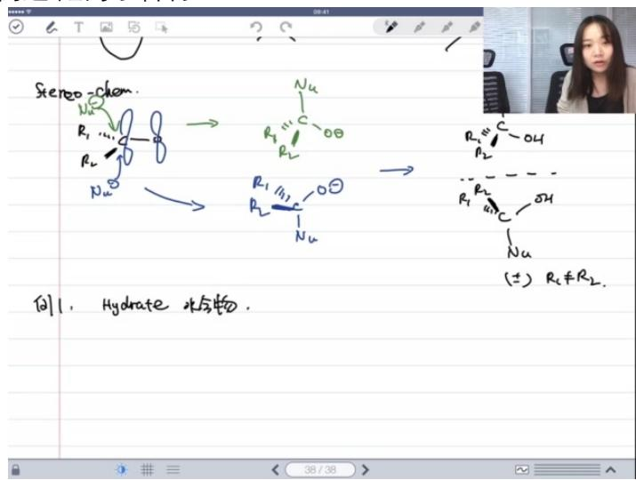

chemical

Handwritten chemical reaction diagram showing stereo-chemical transformation with R1, R2 substituents and water molecules

# - 反应机理：

- 酸催化：氧原子先接受质子转移，使碳的正电性增强，此时水作为亲核试剂进攻碳原子  
- 碱催化：体系中的 $OH^{-}$ 直接进攻羰基碳  
○ 中性条件：反应非常缓慢，因为水既是弱碱又是弱亲核试剂，无法有效进攻未被活化的羰基

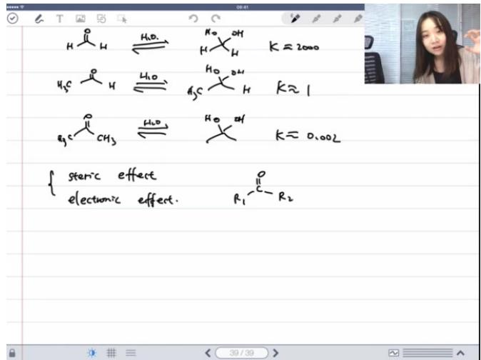

chemical

Handwritten chemical reaction equations involving H2O, H2C, and K groups with stereochemistry and R1/R2 substituents

# - 平衡常数分析：

○ 甲醛水合物平衡常数 $K \approx 2000$   
○ 乙醛水合物平衡常数 $K \approx 1$   
○ 丙酮水合物平衡常数 $K \approx 0.002$

# ● 影响因素：

位阻效应(Steric effect): R基团越大，亲核加成越难进行  
○ 电子效应(Electronic effect): R基团稳定正电荷能力越强（如苯环、甲基），亲核进攻越难进行

# - 反应活性比较：

○ 醛的反应活性普遍高于酮  
○ 甲醛 > 乙醛 > 丙酮

# 2）例题:缩醛/酮的制备及应用 39:11

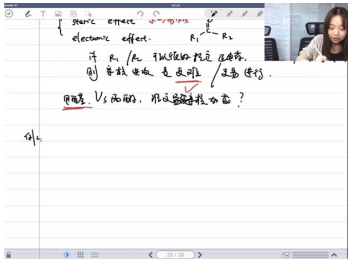

text_image

steric effect 小一而快
electronic effect. R₁ R₂
许 R₁/R₂ 予以继续拉定正中存，
则单独进攻是艰难/更易进行。
同题考. Vs两阶，谁交易多推加成？
例2:

39 / 39   
● 反应条件：两当量醇在酸性催化条件下反应  
- 命名规则：

○ 醛衍生物称为缩醛(acetal)  
○ 酮衍生物称为缩酮(ketal)

# - 反应机理：

- 酸催化下先发生质子转移活化羰基  
○ 生成半缩醛/酮(hemiacetal/hemiketal)中间体  
- 进一步反应形成最终缩醛/酮产物

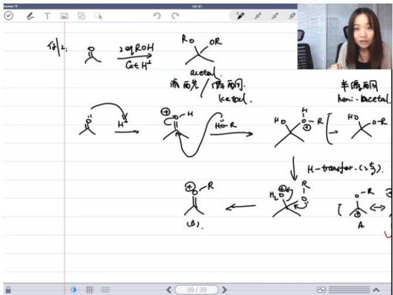

chemical

Hand-drawn chemical reaction equations involving ROH, acetal, and H-O-R groups with molecular structures shown

# - 分子内反应优势：

- 分子内反应速率远大于分子间反应  
- 五元环、六元环形成具有明显优势

# - 应用实例：

○ 乙二醇与醛/酮在酸性条件下反应生成环状缩醛  
○ 常用催化剂：对甲苯磺酸(TsOH)

# 3）缩醛(acetal)的稳定性与反应特性

# ● 醛酮与酯的反应活性比较

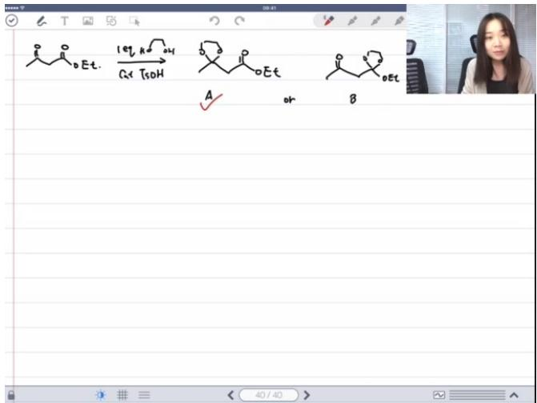

chemical

Hand-drawn chemical reaction diagram showing ethyl ester conversion to ethyl acetate and then to ketone, with labeled steps A and B.

○ 活性顺序：醛 > 酮 > 酯

# ○ 原因分析：

■ 醛的β碳上正电荷( $\delta^{+}$ )更多，反应活性更高  
当存在两个氧原子时，氧的孤对电子与羰基π键形成p-π共轭，降低中间体碳的正电荷密度  
■ 酯基由于氧的给电子效应，使其亲电性最低

# - 氢化铝锂(LiAlH4)的还原作用

# ○ 还原能力：

■ 可将醛、酮、酯基全部还原为醇  
■ 英文名：lithium aluminum hydride (缩写LAH)

# ○ 应用限制：

■ 若需保留酮羰基，需先进行保护  
■ 缩醛/缩酮在LAH条件下稳定，不会被还原

# ● 缩醛/缩酮的酸催化特性

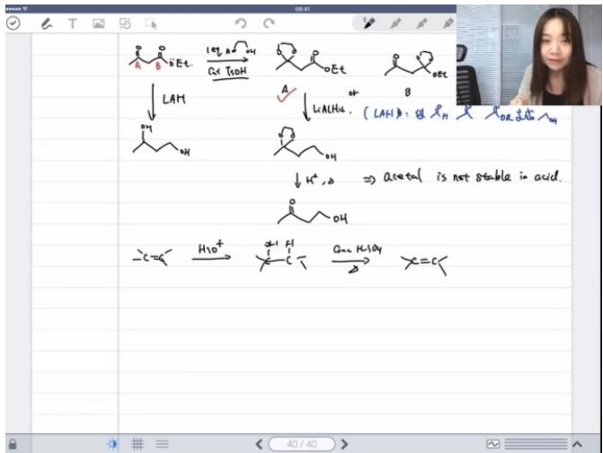

chemical

Chemical reaction scheme showing hydrogenation of ethyl acetate with LAM and H2OH under acidic conditions

# ○ 可逆反应条件：

■ 酸性加热条件下可逆转为羰基化合物  
■ 类比烯烃水合反应：酸催化可逆

# ○ 热力学控制：

■ 低温有利于加成反应(生成缩醛)  
■ 高温( $\Delta$ )有利于消除反应(分解为羰基)  
■ 符合 $\Delta S>0$ 的反应升温有利原则

# ● 碱条件下的稳定性

# ○ 碱中稳定原因：

■ $OH^{-}$ 是极差的离去基团  
■ 无法进行碱催化的逆反应

# ○ 与水合反应区别：

■ 水合反应在酸/碱条件下均可进行  
■ 缩醛/缩酮仅在酸条件下可逆

# ● 半缩醛(hemiacetal)的特殊情况

# ○ 常规特性：

■ 半缩醛在酸性条件下易质子化失水  
■ 通常无法分离得到中间体

# ○ 分子内反应例外：

■ 当醇来自分子内进攻时  
■ 动力学控制：分子内反应速率 >> 分子间反应  
■ 可分离得到稳定的半缩醛产物

# - 反应条件优化

# ○ 除水技巧：

■ 移除生成的水可使平衡右移   
■ 提高缩醛/缩酮产率

# ○ 典型催化剂：

■ 对甲苯磺酸(TsOH)常用作酸催化剂  
■ 反应通常在无水条件下进行

# 例题：缩醛形成反应

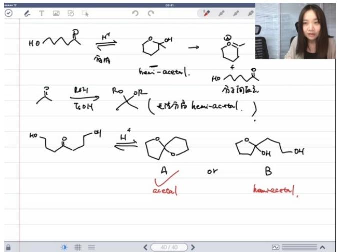

chemical

Hand-drawn chemical reaction equations showing transformation of a hydroxyalkene to a cyclohexanol derivative with stereochemistry indicated

题目解析

■ 关键点：区分分子内/分子间反应  
■ 当存在两分子醇时，即使分子内反应也生成完全缩醛  
■ 只有单分子醇参与时才可能形成半缩醛  
■ 答案：产物为完全缩醛结构(a)

4）例题:三位物质的稳定性 01:15:17

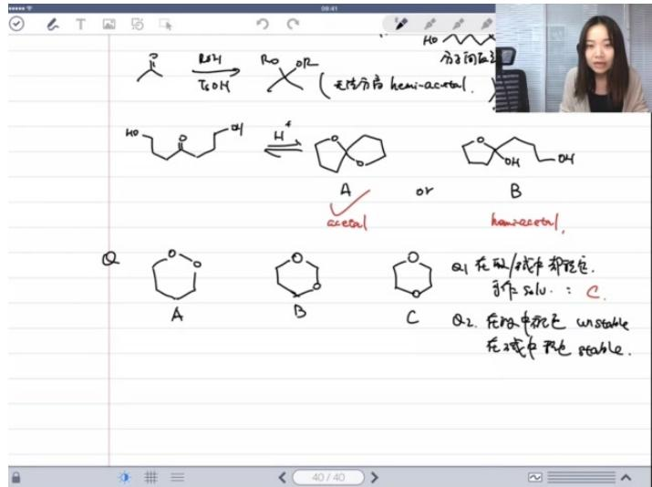

chemical

Hand-drawn chemical reaction equations showing transformation of aldehyde to alkene and then to cyclohexane or cyclohexene derivatives, with accompanying Chinese text explaining the step-by-step synthesis.

物质C特性:

○ 在酸碱环境中均稳定  
- 可作为容器材料  
○ 适合用作溶剂

\- 物质B特性:

○ 在酸中不稳定(unstable)，在碱中稳定(stable)  
- 酸性条件下发生逆反应生成甲醛和一三丙二醇  
- 反应本质是生成缩醛(acetal)的逆反应，需加热条件

\- 物质A特性:

- 酸碱环境中均不稳定  
○ 属于过氧化物，氧氧键 $(O-O)$ 易断裂  
○ 易产生自由基引发链式反应，具有爆炸危险性  
◦ 实验室禁止囤积过氧化物

5）例题:亚胺的制备 01:19:24

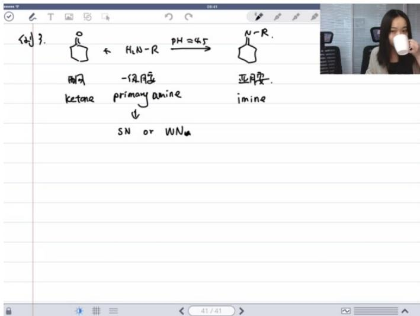

text_image

例3.
H₂N-R
PH=4.5
N-R.
酮 - 保胺
亚胺
ketone primary amine
imine
SN or WNₐ

# - 反应条件:

○ pH≈4.5的弱酸性缓冲溶液   
- 使用对甲苯磺酸(TsOH)作为催化剂

# - 反应物分类:

○ 酮(ketone)   
○ 伯胺(primary amine)

# - 产物分类:

○ 亚胺(imine)

# - 反应机理特点:

- 亲核加成反应(nucleophilic addition reaction)   
○ 需酸催化(acid catalysis)

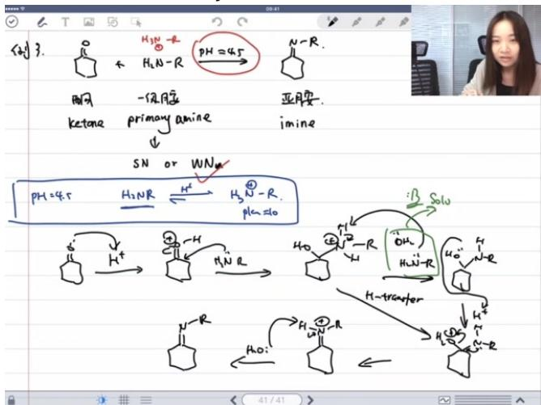

chemical

Chemical reaction scheme showing hydrogenation and rearrangement of ketones with labeled intermediates and conditions

# ● 亲核试剂性质:

○ 伯胺属于弱亲核试剂(WN)  
○ 判断依据：

■ 中性分子无电荷  
■ 氮原子可极化性较差

# pH控制原理:

○ 强酸性会使胺质子化 $(NH_{3}^{+})$ ，丧失亲核性  
○ 胺的pKa≈10，pH4.5时主要以质子化形式存在  
- 少量中性胺即可推动反应进行

# - 反应机理步骤:

\- 羰基质子化活化

○ 胺亲核进攻   
○ 质子转移(proton transfer)   
○ 脱水反应  
- 最终质子迁移生成亚胺

# ● 实验注意事项:

- 质子转移可能通过溶剂介导  
○ 机理书写时可简化表示质子转移步骤  
◦ 考试中允许简化书写反应机理

# 6）例题:二级胺的亲核加成 01:30:07

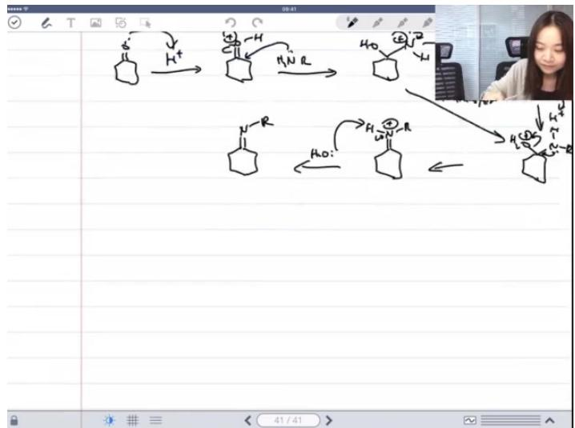

chemical

Hand-drawn chemical reaction scheme showing transformation of cyclopentadienyl to cyclopentanone via intermediate and hydrogenation steps

- 反应特点：二级胺（secondary amine）与一级胺（primary amine）反应机理类似，但产物不同。

\- 反应过程：

○ 胺基加到羰基上形成中间体  
- 中间体经过质子化  
- 最终产物为烯胺（enamine）

● 反应条件：在pH=4-5的弱酸性条件下进行  
● 机理推导：即使不知道具体反应，通过一级胺的反应机理可以合理推断二级胺的产物

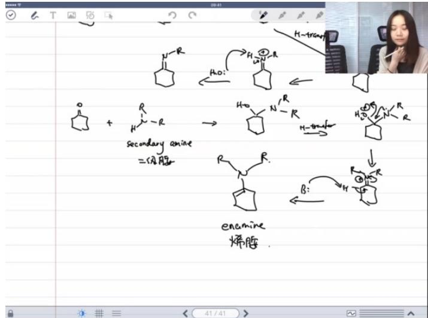

chemical

Hand-drawn chemical reaction diagram showing enamine formation and hydrogenation steps with stereochemistry labels

7）例题:黄鸣龙还原 01:34:41

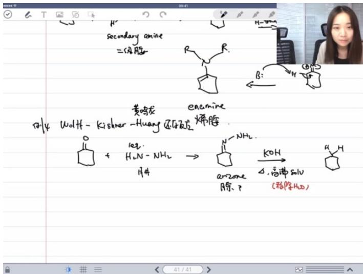

chemical

Chemical reaction diagram showing secondary amine conversion to enamine, followed by protonation and subsequent hydrolysis steps

● 反应本质：将羰基（C = O）还原为亚甲基（ $CH_{2}$ ）

# - 反应条件:

○ 强碱性条件（氢氧化钾）  
○ 高沸点溶剂（用于移除水）

# - 历史背景:

- 最初由Wolf和Kishner发现，但产率低、反应时间长  
○ 黄鸣龙改进后产率提升至90%  
- 国外教材多称Wolf-Kishner还原

# - 反应机理：

- 脓（hydrazone）在碱性条件下形成负离子  
- 负电荷共振到碳上  
- 质子转移后脱去氮气   
- 最终得到烷烃产物

● 应用限制：强碱性条件对某些官能团不兼容

\- 其他羰基还原方法

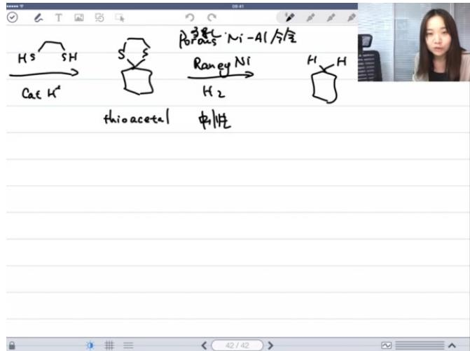

chemical

Hand-drawn chemical reaction equations showing transformation of thiocarbonyl to thiocarboxylic acid using Ramey Ni catalyst and H2

# ○ 硫缩醛法：

■ 先形成硫缩醛（thioacetal）  
■ 使用Raney镍催化剂还原  
■ 优点：中性条件，适用于碱敏感官能团

# - 克莱门森还原：

■ 使用锌汞齐和盐酸  
■ 特点：酸性条件

# ■ 限制：适用于芳环邻近的羰基

\- 条件选择：三种方法分别对应强碱性、中性和酸性条件，需根据其他官能团耐受性选择

# 8) 例题:氢化钠与羰基化合物反应 01:46:59

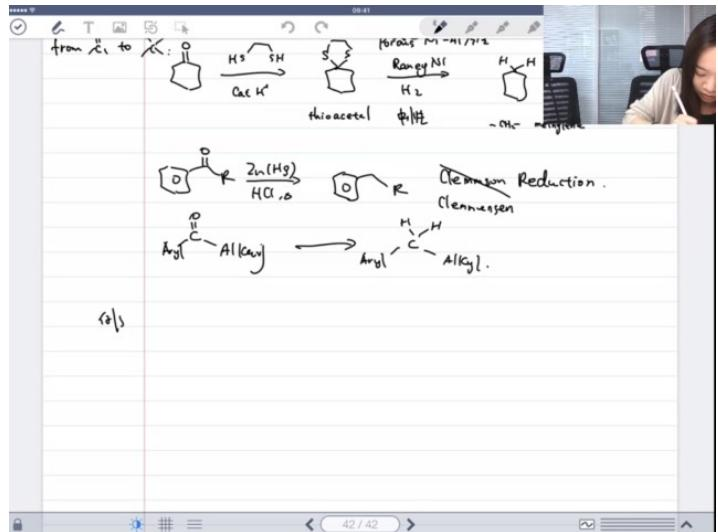

chemical

Chemical reaction scheme showing transformation of cyclohexanone to alkyl alkyne via thioacetal intermediate, with labeled reagents and conditions.

# 氢负离子特性:

○ 氢负离子 $(H^{-})$ 是纯碱(strong base)，几乎没有亲核性  
- 氢化钠(NaH)与羰基化合物通常不发生反应(no reaction)

# ● 氢负离子传递(hydride delivery):

○ 实际反应中使用的是 $BH_{4}^{-}$ (硼氢化物)或 $AlH_{4}^{-}$ (铝氢化物)等复合氢负离子  
这些离子由于体积较大，可极化性更好，表现出亲核性

# - 反应机理对比:

○ $NaH + MeOH \rightarrow NaOH + H_{2} \uparrow$ (强碱反应)  
○ $BH_{4}^{-}$ 可在甲醇溶液中稳定存在，主要表现亲核性而非碱性  
○ $LiAlH_{4}$ (氢化铝锂)既有亲核性又有碱性，会与醇剧烈反应

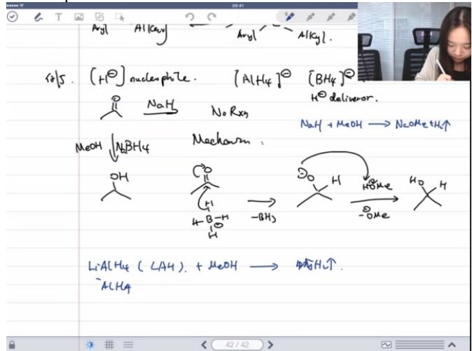

chemical

Handwritten chemical reaction equations involving hydrolysis, methanol, and alkylation steps

# ● 还原剂性质差异:

○ $LiAlH_{4}$ : 还原性强，既有亲核性又有碱性  
○ $NaBH_{4}$ : 还原性较弱，主要表现亲核性  
反应条件： $LiAlH_{4}$ 通常以固体形式加入， $NaBH_{4}$ 可溶于甲醇

# 9）例题:氰化物的亲核加成 01:52:41

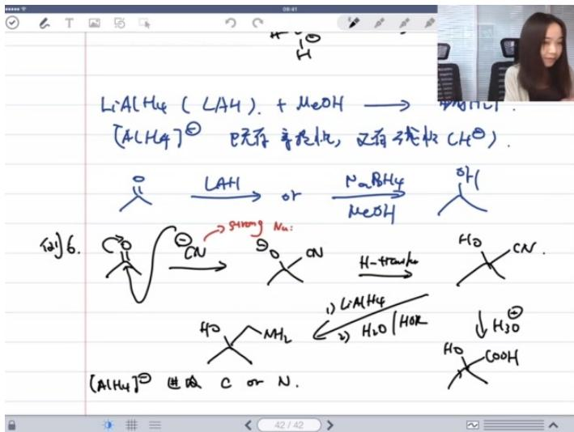

text_image

LiAlH4 (LAH). + MeOH → [AlH4]② 既存着粒状, 又有残余(CH3)。
例6.
[AlH4]② 进成 C or N.

# - 氰化物特性:

○ 剧毒但反应性极好，是强亲核试剂(strong nucleophile)  
- 反应需严格控制pH值，避免生成挥发性HCN气体

# - 反应机理:

- 碱性条件下：先亲核进攻生成氧负离子和CN，再进行质子转移   
- 酸性水解：可将-CN转化为-COOH(羧基)   
- 官能团转化：通过氰基可引入多种官能团(酰胺、醇等)

# ● 还原反应:

○ 与 $LiAlH_{4}$ 反应：进攻带 $\delta+$ 的碳原子(因N电负性>C)  
○ 产物：伯胺 $(RCH_{2}NH_{2})$ ，碳上得2H，氮上得2H  
○ 同位素标记实验：可验证反应机理(判断H/D分布)

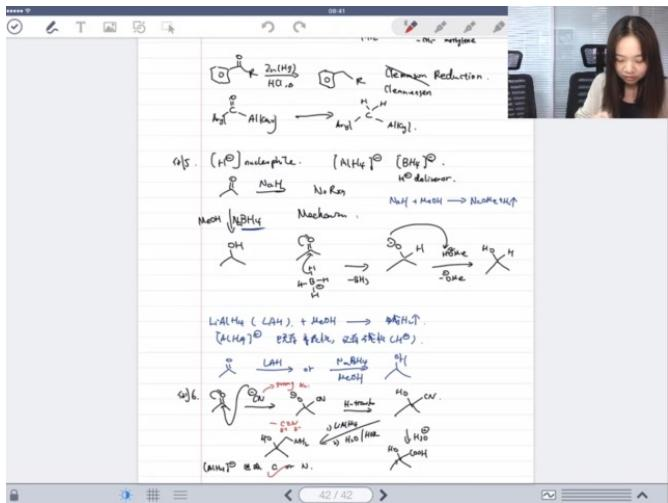

chemical

Chemical reaction equations and molecular structures for organic hydrogenation, including alkylation, methylation, and isobutylene reactions

# - 反应选择性:

- 亲核进攻位点：碳原子(因C-N键中碳带δ+)   
○ 电负性影响：N>C，电子云偏向氮原子

# ● 安全注意事项:

◦ 实验操作必须严格控制pH  
避免体系中出现过量酸  
- 反应后处理需特别小心

# 10）例题：磷叶立德的应用 01:58:46

# - Wittig反应机理

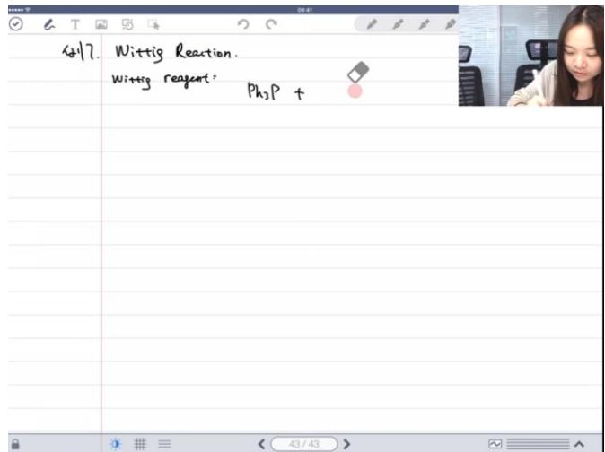

text_image

例7. Wittig Reaction.
Wittig reagent: Ph3P +

试剂制备：三苯基膦 $(Ph_{3}P)$ 与卤代烷通过 $S_{N}2$ 反应生成磷盐，再与强碱（如丁基锂）反应生成磷叶立德

○ 叶立德结构：

共振结构：存在碳负离子与磷正电荷分离形式（b结构）和中性双键形式（a结构）  
■ 稳定性：实际以b结构为主，因磷的3p轨道与碳的2p轨道重叠效果差，导致π键较弱  
■ 命名规则：碳负离子在正电荷元素（如P、S）相邻位置时称为叶立德（如磷叶立德、硫叶立德）

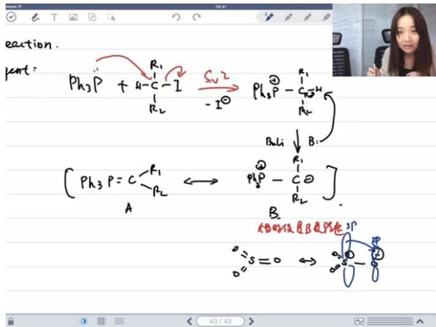

text_image

reaction.
Pent:
Ph₃P + 4-C-I → Ph₃P - C₅H₂
R₁
R₂ - I⁻
Ph₃P = C < P₁
R₂ ⇌ Ph₃P - C
R₂
B
B
Ph₃P = C < P₁
R₂ ⇌ Ph₃P - C
R₂
A B
大的使是B及P的
0 = s = 0 ↔ 0 = -0
0 = 0

○ 反应过程:

■ 叶立德碳负亲核进攻羰基碳   
■ 形成氧负-磷正四元环中间体（oxaphosphetane）  
四元环分解生成烯烃和三苯基氧膦 $(Ph_{3}P=O)$

\- 驱动力：强P=O键的形成（键能约560kJ/mol）

\- 反应特点与局限

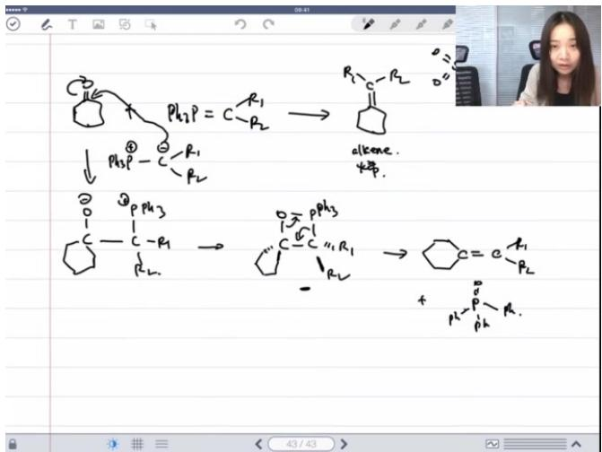

chemical

Chemical reaction scheme showing phosphorus-catalyzed transformation of cyclopentadiene to cyclohexene and then to alkene, with stereochemistry indicated

# ○ ○ 立体选择性：

■ 通常得到E/Z烯烃混合物  
位阻差异不能保证单一构型产物

# ○ 底物限制：

■ 对α-位有强吸电子基的羰基化合物反应性差  
■ 对空间位阻大的酮类反应效率低

# ● Horner-Wadsworth-Emmons反应

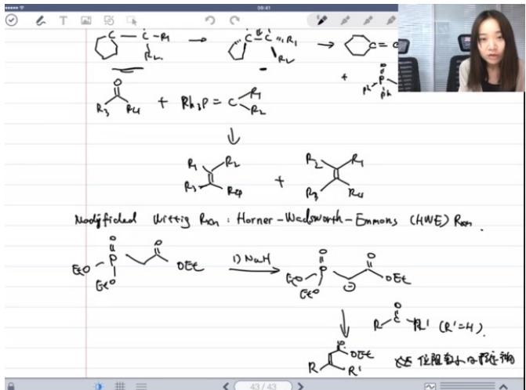

chemical

Chemical reaction scheme showing radical intermediates and electron transfer steps with reagents and conditions

# ○ ○ 改进型反应：

■ 使用磷酸酯稳定的碳负离子 $(R_{2}CH - PO(OR)_{2})$   
■ 负电荷通过磷氧双键和碳氧双键离域稳定

# 优势：

■ 高立体选择性（主要生成E-烯烃）  
■ 特别适合制备 $\alpha,\beta-$ 不饱和酯

# ○ 反应条件:

■ 碱：NaH、KHMDS等   
■ 溶剂：THF、DME等非质子极性溶剂

# 11）例题：亲核加成反应 02:13:01

# ● Baeyer-Villiger氧化

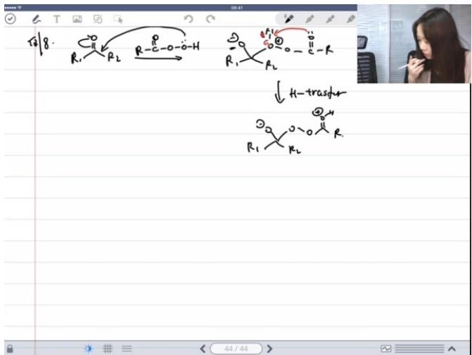

chemical

Hand-drawn chemical reaction diagram showing hydrogen transfer and radical addition steps

# ○ 反应过程：

■ 过氧酸亲核进攻羰基碳   
■ 发生1,2-迁移（通过五元环过渡态）  
■ 生成酯（酮）或羧酸（醛）

# ○ 迁移顺序:

迁移能力： $H > 3^{\circ}C > 2^{\circ}C \approx Ph > 1^{\circ}C > CH_{3}$   
■ 记忆口诀："氢叔仲苯伯甲基"

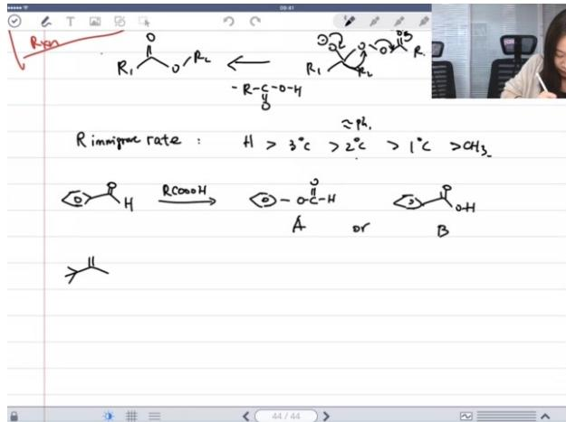

chemical

Handwritten chemical reaction equation showing Rimiproc rate decomposition with temperature and catalyst structures

# ○ 应用示例：

■ 甲醛氧化生成甲酸（而非甲酸酯）  
■ 不对称酮氧化时，取代基多的碳优先迁移

# ○ 注意事项：

■ 使用间氯过氧苯甲酸(mCPBA)等过氧酸试剂  
■ 反应需严格控制温度和浓度（防爆）

# - 立体化学控制

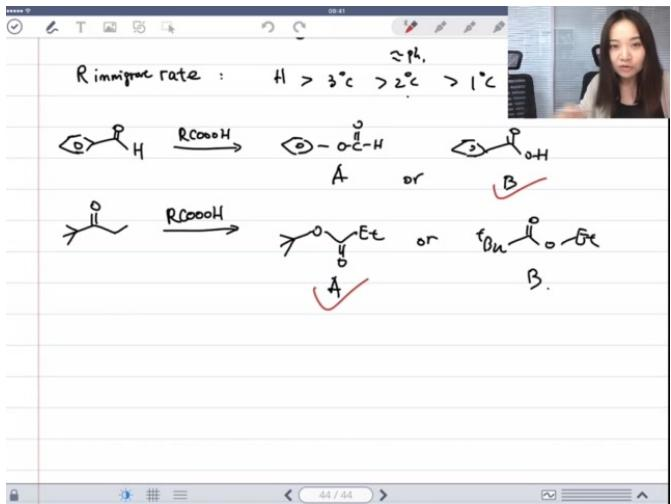

chemical

Reaction scheme showing R-matrix rate conversion to ester products with temperature and reaction conditions

# ○ 判断技巧：

■ 比较迁移基团的电子效应和空间位阻  
■ 当迁移顺序接近时，需具体分析过渡态稳定性

# ○ 典型错误：

■ 误认为碱性强的氧负离子优先接受质子  
■ 忽略五元环过渡态的立体电子效应

# 4. 应用案例 02:19:55

# 1）例题:亲和加成快慢

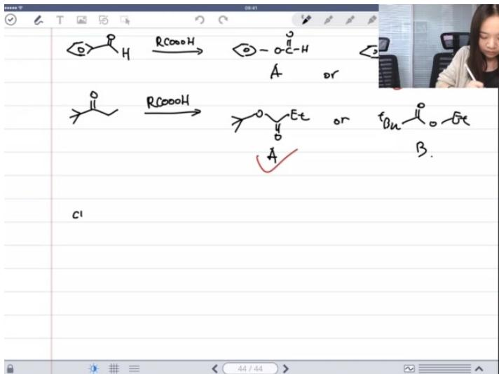

chemical

Handwritten chemical reaction equations showing epoxide formation and subsequent transformation with labeled structures A, B, C, D

- 反应速率决定因素：羰基碳上正电荷越多，亲和加成反应越快。活化能越低反应越容易进行。  
- 取代基影响: 三氟甲基是强吸电子基团(-I效应), 会使羰基碳的正电荷更集中( $\delta^{+}$ 更大), 从而加快反应速率。  
● 典型错误：学生常误认为吸电子基团会稳定正电荷而减慢反应，实际上吸电子基团会增强羰基碳的正电性。  
● 正确答案: 含三氟甲基的化合物b反应更快。

# 2）例题:Wittig试剂制备 02:22:26

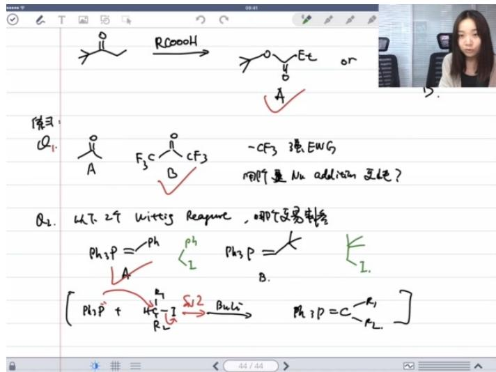

text_image

RCOOOH
or
A
偶习：
Q1.
F3C CF3
-CF3 强 EWG
哪个是 Na addition 变化？
Q2.
以下 2个 Wittig Reapure，哪个交易制备
Ph3P = -Ph
A
Ph3P = K
B.
[ Ph3P + 4FeI → Sf2 → Buli → Ph3P = C -Fe1
R2] 
44/44>

●

● 制备机理: 通过 $S_{N}$ 2反应制备，过程为 $Ph_{3}P + R - X \rightarrow Ph_{3}P^{+} - RX^{-}$ 。  
- 位阻效应: 虽然一级卤代烃通常易发生 $S_{N}2$ 反应，但叔丁基等大位阻基团会显著降低反应速率。  
- 试剂选择: 苯基卤代烃(a)比含叔丁基的卤代烃(b)更易制备Wittig试剂。  
● 联系旧知: 此问题考察了先前学习的 $S_{N}2$ 反应空间位阻效应知识。

3）例题:烯烃合成目标产物 02:25:28  
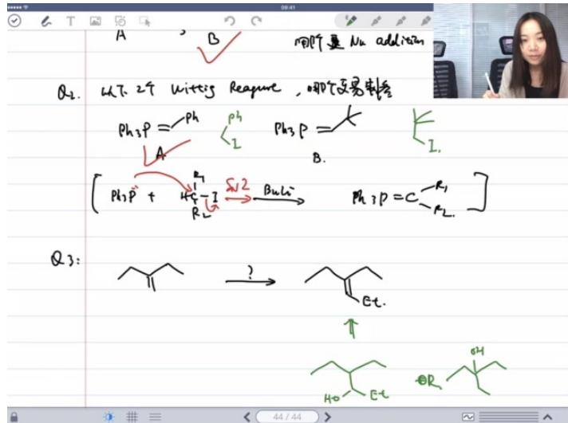

chemical

Chemical reaction scheme showing transformation of a phosphorus-containing compound with alkyl groups and a diene bond, involving Nt addition and BuLi elimination steps

●

\- 逆合成分析思路:

○ 目标产物可拆分为醛和Wittig试剂  
○ 醛可通过醇氧化得到(PCC氧化剂)  
- 醇可通过烯烃氢化得到

\- 替代路线:

\- 臭氧分解 $(O_{3})$ 后还原(DMS)可直接得到醛

\- 格式试剂应用:

由卤代烃与镁在乙醚中反应制备 $(R-X+Mg\rightarrow R-Mg-X)$   
○ 碳镁键具有强亲核性，可看作碳负离子

\- 反应选择:

○ Wittig反应比消除反应路线更直接  
○ 需写出完整反应路径：从原料到Wittig试剂制备，再到最终产物的多步过程

二、知识小结

<table><tr><td>知识点</td><td>核心内容</td><td>考试重点/易混淆点</td><td>难度系数</td></tr><tr><td>醛酮命名</td><td>IUPAC命名规则(醛词尾-al,酮词尾-one)、俗名命名法(如甲乙酮)</td><td>本基与苄基区分、编号规则(醛基优先)</td><td></td></tr><tr><td>醛酮制备方法</td><td>醇氧化(PCC)、烯烃臭氧分解、端炔水合</td><td>PCC与CrO3区别、还原剂DMS作用</td><td></td></tr><tr><td>亲核加成反应</td><td>酸/碱催化机理差异、立体化学(平面进攻)</td><td>酸催化先质子化vs碱催化直接进攻</td><td></td></tr><tr><td>水合反应</td><td>形成偕二醇(不稳定)、甲醛水合物平衡常数2000</td><td>位阻效应主导(丙酮水合物仅0.002)</td><td></td></tr><tr><td>缩醛/缩酮</td><td>二醇保护羰基、酸性不稳定/碱性稳定</td><td>分子内反应优先(五/六元环)</td><td></td></tr><tr><td>亚胺形成</td><td>一级胺pH4.5条件、二级胺生成烯胺</td><td>pH控制关键(强酸导致胺质子化)</td><td></td></tr><tr><td>Wolff-Kishner还原</td><td>肼/碱条件羰基→CH2、黄鸣龙改进法</td><td>与Clemmensen还原(Zn-Hg/HCl)对比</td><td></td></tr><tr><td>氢负试剂</td><td>NaBH4(温和) vs LiAlH4(强还原)</td><td>CN-进攻机理(毒性注意)</td><td></td></tr><tr><td>Wittig反应</td><td>磷叶立德制备烯烃、顺反异构混合物</td><td>Horner-Wadsworth改良法(立体选择性)</td><td></td></tr><tr><td>Baeyer-Villiger氧化</td><td>过氧酸氧化、迁移顺序:H&gt;3°&gt;2°≈Ph&gt;1°</td><td>迁移基团构型保留</td><td></td></tr><tr><td>逆合成分析</td><td>烯烃→醛(臭氧分解)、醇→醛(PCC)</td><td>官能团保护策略(缩醛应用)</td><td></td></tr></table>