# 一、作业讲解01:46

# 1. 多取代苯的合成路径 02:04

# 1）例题1: 特定的多取代苯合成路径 02:11

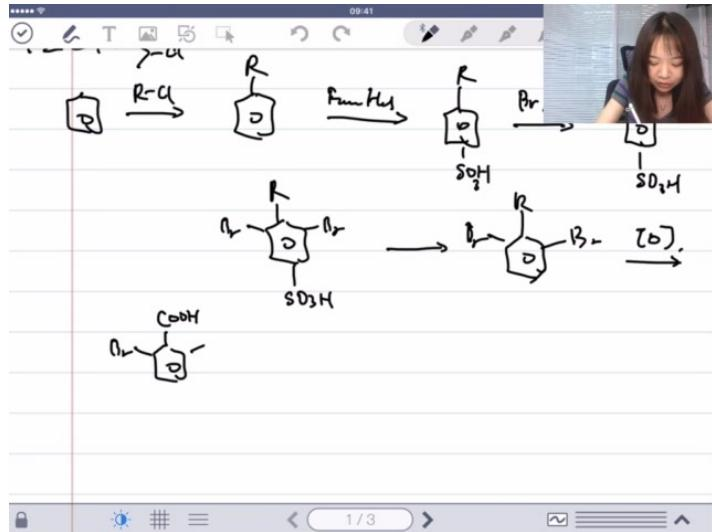

chemical

Hand-drawn chemical reaction scheme showing transformation of a cyclic alcohol with R-Cu, Hd, and SOH groups to form a bromo ester and a carboxylic acid derivative.

- 烷基先导法：先引入烷基（如异丙基）作为占位基团，再通过发烟硫酸引入磺酸基作为block group，最后上溴在零位  
● 定位规则：取代位置由最强给电子基团决定，需注意位阻效应会显著影响全取代苯的生成难度  
- 氧化关键步骤：必须先将烷基氧化为羧基（可用酸性 $MnO_{3}$ 或 $NaMnO_{4}/H_{2}SO_{4}$ ），否则直接去磺酸基会导致氯上到烷基对位  
- 催化剂要点：氯化反应必须注明 $FeCl_{3}$ 催化剂（实际是铁粉被氯氧化生成），单纯写"CI"是错误的反应条件

# 2. 问题解答 05:34

# 1）烷基、硝基、氨基的添加顺序05:44

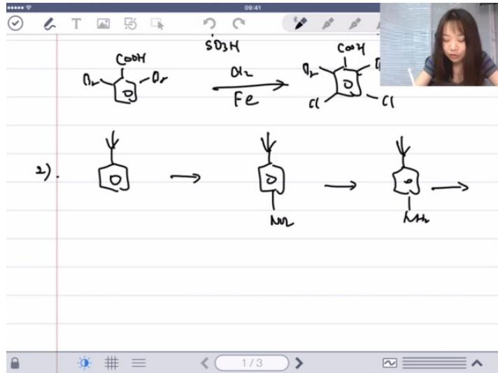

chemical

Chemical reaction diagram showing transformation of a carboxylic acid derivative to a cyclic compound via sulfuric acid and iron reagents, with a photo of a person observing.

正确顺序：叔丁基→硝基→氨基，不可先引入氨基再做Friedel-Crafts烷基化  
- 电子效应解释：氨基是强给电子基（强活化基），烷基是弱活化基，定位能力氨基>烷基  
- 副反应风险：Friedel-Crafts反应的碳正离子会优先进攻氨基的孤对电子（氮是强Lewis碱），导致N-烷基化副产物

# 2）定位集团的决定因素 06:05

● 主导基团：多取代苯中新取代基进入位置由体系中最强的给电子基团决定  
● 活化强度比较：-NH2 > -R（烷基），因此氨基存在时主要由其决定定位效应

3）先上氨基再做Friedel-Crafts的可行性 06:26

● 理论矛盾：虽然部分考题可能不判错，但实际上碳正离子（强亲电试剂）会优先与氨基的孤对电子结合  
● 实际合成：实验室中该路径难以得到目标产物，属于"纸上合成"的典型问题

4）有机合成题考察重点与实际情况 07:25

● 考试本质：主要考察逆向思维能力和机理理解，而非真实可行性  
● 学科现状：当前有机化学对反应机理的理解仍不完善，许多理论路径实验室难以实现  
● 教学安排：后期课程会专门设置逆合成分析专题，补充更多合成案例

# 3. 醛基羰基反应 09:08

1）苯环的Friedel-Crafts反应特性 09:23

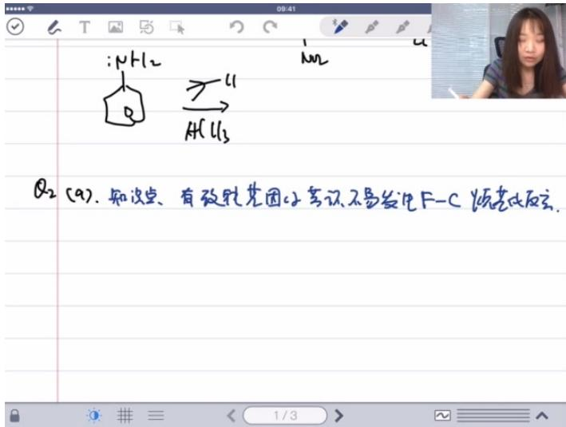

text_image

Q2 (a). 知识点、有放射花团子等识,不易发电F-C频谱化反应.

- 反应限制：含强致钟基团（如硝基）的苯环几乎不能发生Friedel-Crafts反应  
● 电子密度要求：该反应需要苯环π电子云密度较高，活化基团促进反应

2）Friedel-Crafts反应中的碳正离子重排 10:25

● 重排必然性：反应中碳正离子中间体必然发生重排，如正丙基会重排为异丙基  
● 产物特点：通常得到重排产物为主，直接取代产物反而可能是次要产物

3）定位基团对反应产物的影响 10:43

- 溴的定位效应：虽是致钝基团，但仍为邻对位定位基，产物为邻位和对位混合物  
● 位阻影响：大位阻情况下对位产物更有利（单个取代位点vs两个邻位点）

4）例题1：亲核取代反应的条件判断 11:20

三要素原则：

○ 强吸电子基团（如羰基）  
○ 良好离去基团（如-Cl）  
- 两者处于邻/对位关系

● 反应类型：属于芳香亲核取代反应（ $S_{N}Ar$ ），不同于常规亲电取代

5）例题2：甲氧基负离子进攻苯环的反应 12:14

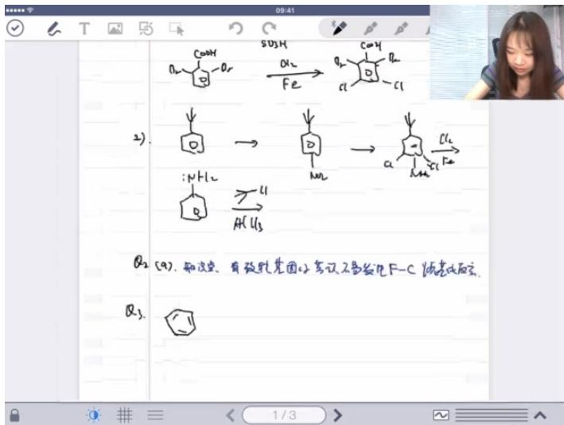

chemical

Chemical reaction diagram showing transformation of a sulfonamide compound to an alkene using Fe and HCl2, with reaction conditions and Q2/Q3 annotations.

● 负电荷表示：必须明确标注负电荷位置，不能简单画成离域六元环  
- 正确画法：

- 方案一：将负电荷定域在单个碳原子上  
○ 方案二：显示负电荷在五元环上离域（非六元环）

● 常见错误：直接画成六元环离域结构会错误表示电子分布

# 4. 共振结构 14:13

1）亚硝基的定位效应 14:25

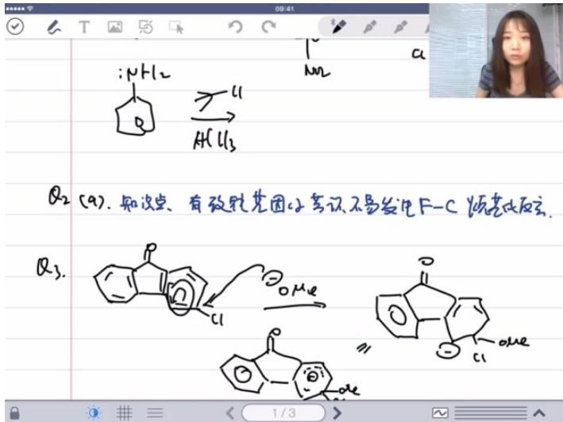

chemical

Hand-drawn chemical reaction equations involving cyclohexane and aldehyde, with accompanying photo of a person observing the reaction.

● 定位效应判断：亚硝基（-NO）是典型的零对位定位基，其判断依据为氮原子上存在孤对电子  
- 电子效应分析：由于氧的电负性极大，氮氧双键的 $\pi$ 电子显著被氧吸引，导致氮带 $\delta+$ 电荷  
● 类比说明：与卤素类似，都具有吸电子效应但又是零对位定位基，共同特点是：①与苯环相连的原子上有孤对电子 ②该孤对电子可以离域到苯环上

2）消除加成反应的特点 14:53

● 反应条件：需要非常强的碱（如纯钠）才能发生  
● 产物特征：必然得到混合物，因为反应中生成的苯炔中间体使两个碳都有反应概率  
● 判断依据：当看到产物为混合物时，可提示为消除加成机理

3）制活基团与制钝基团的判断 16:01

● 亚硝基性质：属于制钝基团，因其强吸电子效应使苯环电子云密度降低  
● 判断技巧：可将-NO看作羰基类似物，氧的强吸电子性导致氮带正电  
● 实验验证：若反应生成单一产物，通常为亲核取代反应而非消除加成

4）共振结构对定位效应的影响 16:49

● 稳定机制：当正电荷离域到与取代基相邻的苯环碳上时，孤对电子可形成额外共振结构  
● 本质原因：与苯环不直接相连的原子上存在孤对电子是关键  
● 示例说明：对于邻位取代，正电荷可离域到-NO基团上形成新的共振结构

5）零对位定位机的共振结构示例 17:22

● 典型错误：学生常遗漏最稳定的共振结构形式  
● 正确画法：必须包含所有可能的共振结构，特别是最稳定的形式  
● 结构特征：最稳定结构需满足八隅体规则（如正电荷在碳上而非氧上）

5. 共振结构稳定性 17:53

1）共振结构稳定性的排序 18:25

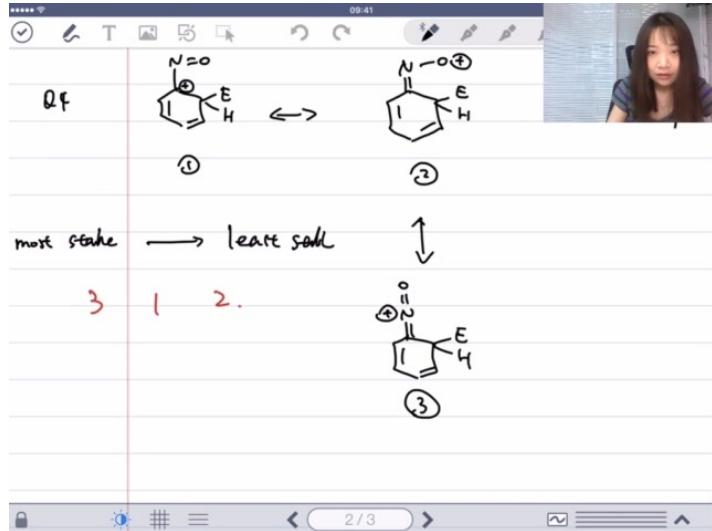

text_image

QF
N=0
④
E
H
↔
N-O④
①
②
most stake
→ lea#t s##l
3 1 2.
④
E
H
③
2/3

● 排序原则：稳定性顺序为3>1>2（数字代表不同共振结构）  
● 关键区别：结构3符合八隅体规则，而结构1和2中分别存在碳正离子和氧正离子不符合

2）稳定性排序的原则解释 19:23

● 第一原则：符合八隅体规则的结构最稳定  
● 第二原则：正电荷在电负性较小的原子上更有利（碳>氧）  
● 应用实例：硝基（ $-NO_{2}$ ）与亚硝基不同，是间位定位基且制钝，因其碳上无孤对电子无法稳定正电荷

6. 点内酯化反应 21:54

1）点内酯化反应的定义与条件 22:15

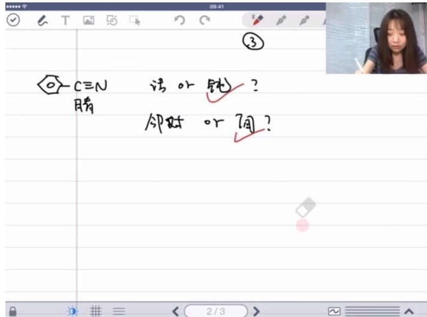

text_image

③
C≡N 话 Or 钝？
腾 邻好 or 问？

● 反应名称: 该反应称为碘内酯化反应（lodolactonization），具体为LA PT one类型

● 环形成条件: 体系需满足能形成五元环或六元环的结构，其中五元环更有利  
● 结构特征: 中间体需同时含有羧基和双键结构，且双键与羧基氧的距离适合成环

2）反应中间体及环的形成 22:30

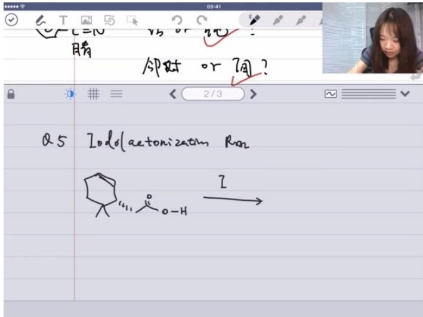

text_image

Q5 Iodolactonization
I
O-H

- 第一步机理: 形成锰离子中间体，由于环下方有取代基，碘优先从上方靠近双键

● 立体选择性: 生成的产物结构呈现向外翻的立体构型

● 关键中间体: 三圆环碘鎓环（三元环状碘正离子中间体）

3）例题：点内酯化反应中的氧进攻选择 23:11

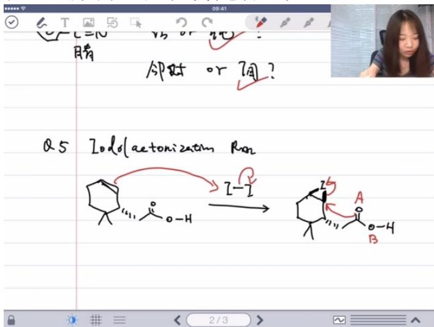

chemical

Chemical reaction diagram showing iodolactonization with labeled intermediates I-I and O-H

● 常见错误: 容易误用氧b（羟基氧）进攻三圆环碘鎓环

● 正确选择: 应使用氧a（羰基氧）进攻，原因:

○ 路易斯碱性: 羰基氧（氧a）是更强的路易斯碱  
- 共振解释: 通过共振结构分析，满足八隅体规则的结构更稳定  
○ 电子极化: 碳氧双键的π电子更易极化，导致羰基氧的亲和性更强

\- 进攻方式:

- 可用羰基氧的孤对电子直接进攻（箭头从孤对电子出发）  
- 也可用π电子参与进攻（因π电子显著偏向氧a）

● 考试重要性: 在北大化院有机考试中这是必考点，国初/国决考试可能扣0.5-1分

7. 重排与直排 26:46

1）氮原子定位效应

● 中性/碱性条件:

- 氮原子表现为邻对位定位基  
○ 属于强致活基团（通过孤对电子共轭给电子）

● 酸性条件:

- 氮原子质子化后带正电荷   
○ 转变为强吸电子基团  
○ 孤对电子被占据，无法参与共轭  
○ 变为间位定位基

# 2）反芳香性体系

# - 环丁二烯特性:

○ 典型的反芳香性骨架（4nπ电子体系）  
◦ 实际物质中罕见存在，会自发调整结构

# ● 稳定性原则:

即使产生分离电荷的共振结构  
- 只要能避免反芳香性，转变为非芳香性即有利

# - 结构要求:

- 芳香性/反芳香性都需要环状、共平面结构  
- 满足特定电子数规则（4n+2为芳香性，4n为反芳香性）

# 8. 应用案例 28:40

# 1）例题:亚硝基质活质钝

● 共振结构应用：通过共振结构可快速判断零位取代是主要产物，与亚硝基题目解法类似  
● 实验验证方法：核磁数据中环电流的存在表明离域电子p轨道构成闭环结构

# 2）例题:环状平面 30:09

# - 方向性判断：

- 丙二烯结构两端碳的p轨道呈垂直关系，不符合方向性要求  
环状结构需满足p轨道肩并肩重叠成环

● 电子数规则：符合 $4n+2$ 电子数的体系会倾向共平面排列

# 3）例题:自由基负电荷问题 30:32

# ● 绘图规范：

- 自由基移动必须使用鱼钩箭头表示单电子转移  
- 负电荷不能共振到14元环上，否则会破坏 $4n + 2$ 规则（需保持14个π电子）

# ● 电荷分布限制：

- 负电荷仅可分布在取代碳或CN基团的氮原子上  
○ 自由基可在14元环上离域

# 4）例题:14元环过渡态 31:54

# - 反应机理：

- 羟基对羰基的亲核进攻形成六元环过渡态  
○ 乙基构象影响：平伏键位有利，直立键位不利

# ● 动力学控制：

- 可逆反应导致高活化能路径产物几乎不出现  
- 快速反应路径会通过平衡消耗慢反应底物

# 5）例题:三键加成机理 36:41

# - 立体化学：

○ Z/E构型判断基于基团体积大小比较（Cl > Ph, R > H）

# ● 区域选择性：

○ 形成直线型SP杂化碳正离子中间体  
○ p轨道与π键垂直，需通过构象调整实现苯环稳定作用

# ● 机理细节：

- 优势中间体：苯环与碳正离子p轨道共轭稳定的构象  
○ 主产物形成：体积大的取代基倾向于处于反式构型

# 二、答疑解惑 45:38

# 1. 探证稳定性比较问题 45:53

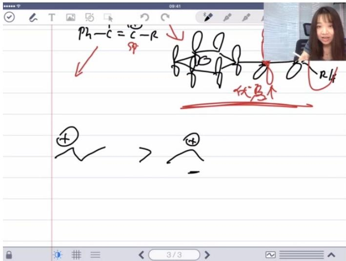

text_image

ph-c = c-R
↓
优先↑
④ > ④
-

● 超共轭效应差异：右侧碳正离子因具有6个C-H键（相比左侧的5个C-H键+1个C-C键）更稳定，因为C-H键在超共轭效应中起主要作用  
● 结论可靠性：该比较案例不够显著，考试中应选择位阻差异更明显的例子进行定性判断

# 2. 碳正离子稳定性的影响因素 47:03

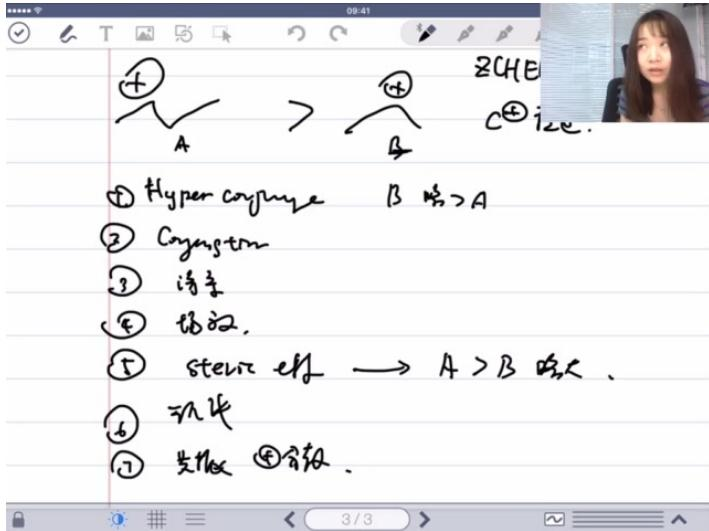

text_image

Hyper coryne B 吠 > A
Coguston
诗桌
场式.
stele eff → A > B 吠 < .
风华
共做 ④分放 .
2CHE
C④ ice.

# - 七大影响因素:

- 超共轭效应(hyperconjugation): 通过σ键电子离域稳定正电荷  
○ 共轭效应(conjugation): $\pi$ 电子离域作用  
○ 诱导效应：通过σ键传递的电子效应  
场效应：通过空间直接作用的静电效应（非键途径）  
○ 位阻效应：空间位阻影响溶剂化程度  
环张力：桥头碳正离子因张力而不稳定  
- 共振效应：正电荷分散程度（与共轭效应部分重叠）

# 3. 位阻效应对探证稳定性的影响 48:13

● 作用机制: 大位阻会限制溶剂分子以最佳角度靠近电荷，降低溶剂化稳定效果  
● 比较原则: 当位阻效应差异显著时, 其影响会超过超共轭效应的细微差别

# 4. 位阻效应对溶剂化及电荷稳定性的影响 48:34

\- 溶剂化原理: 中性溶剂分子靠近电荷时, 靠近端诱导出相反电荷 (δ+或δ-) 而稳定电荷

# 位阻影响:

○ 小位阻：溶剂分子可从更大范围靠近电荷，稳定效果更好

○ 大位阻：溶剂分子只能以特定角度部分靠近电荷，稳定效果受限

● 普适性: 该原理同时适用于正电荷（碳正离子）和负电荷（如 $RO^{-}$ 、 $O^{-}$ 等）的稳定性  
5. 对探证稳定性比较问题的总结 50:03  
● 教学建议: 选择位阻差异显著的案例进行教学，便于学生定性判断  
● 影响因素优先级: 当多重因素共存时，需考虑各效应的相对强弱:

○ 显著位阻效应 > 超共轭效应细微差别

○ 共轭效应通常强于超共轭效应

● 实际应用: 在SN1反应中，碳正离子中间体的稳定性直接影响反应速率

# 三、羧酸50:17

1. 羧酸的结构 51:21

1）羧酸与乙醇的沸点比较 51:31

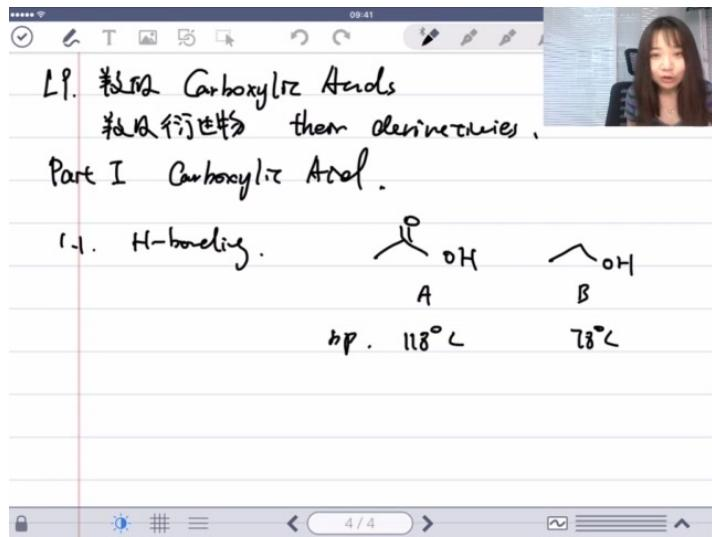

text_image

L9. 都致 Carboxylic Acids
致及衍生物 them derivatives.
Part I Carboxylic Acid.

1.1. H-bonelig.
A
B
hp. 118°C
78°C

沸点差异：羧酸（a）沸点118℃显著高于乙醇（b）78℃  
● 关键原因：两者均能形成氢键，但羧酸的氢键网络更复杂  
- 结构差异：羧酸分子中氧原子既能作为质子受体（acceptor）又能通过羟基氢作为给体（donor），而乙醇仅有一个羟基参与氢键

2）羧酸的氢键形成原理 52:43

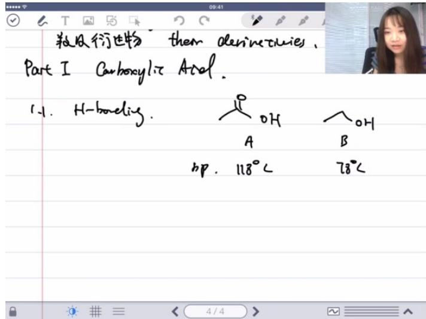

text_image

羧及衍生物 them derivatives.
Part I Carboxylic Acid.

1. H-bonelig.
A
pp. 118°C
73°C

● 氢键本质：质子给体（H-donor）与质子受体（acceptor）的相互作用  
● 网状结构：羧酸在溶液中形成类似水的三维氢键网络，而非简单的二聚体  
● 键能比较：每个羧酸分子平均形成的氢键数量多于乙醇分子  
- 误区澄清：气态羧酸确实以二聚体形式存在，但溶液中主要为网状结构

3）羧酸在溶液中的存在状态 54:40

- 溶液行为：与乙醇不同，羧酸分子间通过氢键形成动态网状体系  
● 温度影响：高温会破坏氢键网络，使分子运动加剧  
● 结构证据：X射线衍射显示羧酸溶液存在类似冰的氢键排列

# 4）分子内氢键对羧酸酸性的影响 55:38

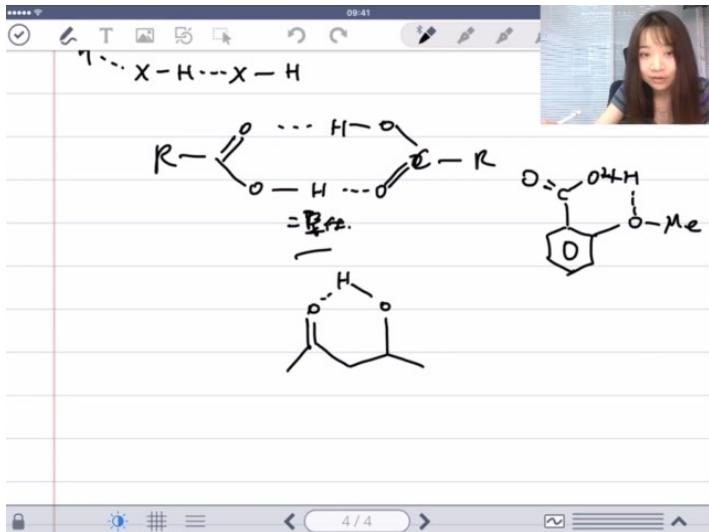

chemical

Hand-drawn chemical structure of a substituted cyclohexene derivative with R groups and ester substituents, accompanied by a photo of a person in the background.

● 典型实例：邻位取代基（如甲氧基）与羧基氢形成分子内氢键  
● 酸性减弱：氢被氧原子稳定化后更难解离，pKa值增大  
● 电子效应：与诱导效应相反，邻位给电子基团通过氢键降低酸性  
● 结构特征：要求给体与受体空间位置合适（通常五/六元环构象）

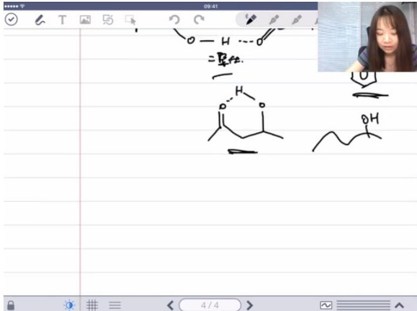

chemical

Hand-drawn chemical reaction diagram showing hydrogen bonding and electron transfer steps

● 经典案例：邻羟基苯甲酸因分子内氢键使其酸性弱于对位异构体  
● 稳定机制：羧酸氢与酚羟基氧形成六元环状结构  
● 实验证据：IR光谱显示特征氢键吸收峰（2500-3000 cm $^{-1}$ 宽峰）

# 2. 休息 57:17

# 1）羧酸与pKa 57:21

● pKa与酸性关系 58:05

o pKa排列规则：pKa从小到大排列对应酸性从强到弱排列。例如CBA和CAB两种排列中，正确答案是CAB。  
- 酸性判断依据：判断酸性强弱实质是判断其共轭碱负电荷的稳定性，负电荷越稳定，酸性越强。

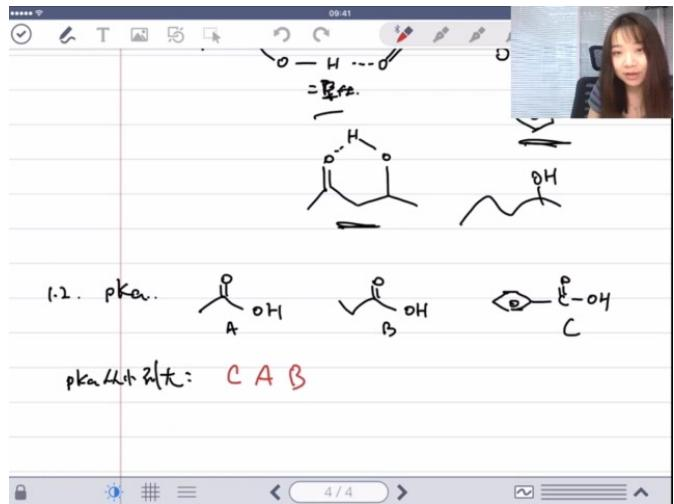

chemical

Hand-drawn chemical structures of pKa and CAB with labeled functional groups A, B, C

● 位阻效应与溶剂化效应 59:18

位阻影响：位阻越大，负电荷在水溶液中越难溶剂化，导致pKa值越大（酸性越弱）。例如化合物b（pKa=4.87）比a（pKa=4.76）位阻大，酸性更弱。  
○ 测量条件: pKa是在水溶液或至少液体环境中测定的参数。

● 诱导效应与酸性 59:55

○ 取代基影响: 对位取代苯甲酸的酸性强弱取决于取代基的电子效应:

■ 吸电子基（硝基、醛基、卤素）增强酸性（pKa减小）  
■ 给电子基（甲基、羟基）减弱酸性（pKa增大）

○ 排序规则: 吸电子能力越强, 酸性越强, 正确排序为: 硝基(6) > 醛基(5) > 卤素(4) > 氢(1) > 甲基(2) > 羟基(3)

2）羧酸的制备 01:02:39

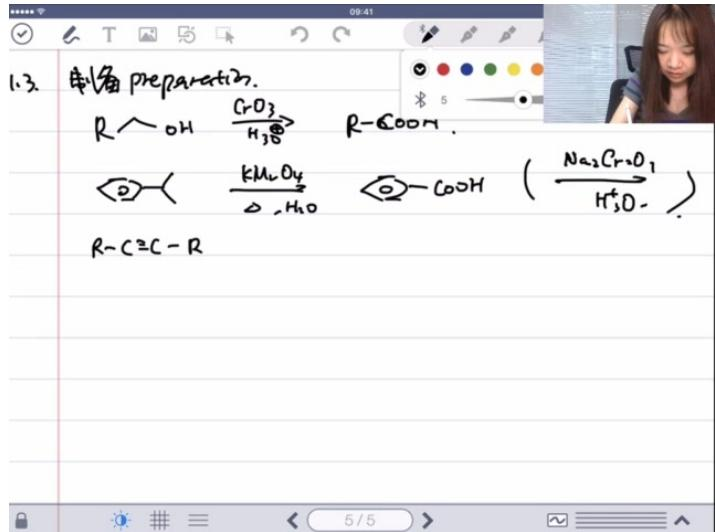

text_image

1.3. 制备 preparation.
R-OH CrO₃ H₃OH R-COOH
Ku₂O₄ H₃O -COOH (Na₂Cr₂O₇ H₃O-)
R-C=C-R

- 醇氧化法: 使用重铬酸钠/硫酸或酸性 $CrO_{3}$ 氧化伯醇 $R-CH_{2}OH$ 得到羧酸  
- 烯烃氧化: 烯烃 $R - C \equiv C - R'$ 经臭氧氧化后直接水解得到两分子羧酸  
- 腈水解: 腈类化合物 $R - C \equiv N$ 在酸性条件下水解生成羧酸  
- 格式试剂法: 卤代烃制备格式试剂 $R - MgX$ 后与 $CO_{2}$ 反应, 再水解得到羧酸

3）羧酸的还原反应 01:06:29

\- 还原剂比较

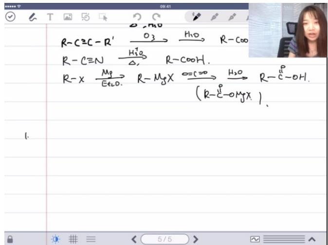

chemical

Chemical reaction equations involving R-C≡N, Mg, and H2O forming a mixture

氢化铝锂(LAH): 强还原剂，可将羧酸R - COOH完全还原为伯醇R - CH₂OH  
○ 硼烷(BH3): 在THF溶液中可选择性还原羧酸为醇  
硼氢化钠(NaBH4): 不能还原羧酸，因其还原性较弱且会与羧酸反应生成氢气

# - 反应机理特点

<table><tr><td rowspan="5">1.4.</td><td colspan="3">Reduction of Carboxylic Acid.</td></tr><tr><td rowspan="3">R-COOH</td><td>×S LAH</td><td>R^OH</td></tr><tr><td>BH3 THF</td><td>R^OH</td></tr><tr><td>NaBH4</td><td>NR.</td></tr><tr><td colspan="2">R-COOH + (BH4)2^-</td><td>→ BH3 + H2↑ + RCOO2</td></tr><tr><td></td><td></td><td></td><td></td></tr><tr><td></td><td></td><td></td><td></td></tr><tr><td></td><td></td><td></td><td></td></tr><tr><td></td><td></td><td></td><td></td></tr><tr><td></td><td></td><td></td><td></td></tr><tr><td></td><td></td><td></td><td></td></tr><tr><td></td><td></td><td></td><td></td></tr><tr><td></td><td></td><td></td><td></td></tr><tr><td></td><td></td><td></td><td></td></tr><tr><td></td><td></td><td></td><td></td></tr><tr><td></td><td></td><td></td><td></td></tr><tr><td></td><td></td><td></td><td></td></tr><tr><td></td><td></td><td></td><td></td></tr><tr><td></td><td></td><td></td><td></td></tr><tr><td></td><td></td><td></td><td></td></tr><tr><td></td><td></td><td></td><td></td></tr><tr><td></td><td></td><td></td><td></td></tr><tr><td></td><td colspan="3">5/5</td></tr></table>

○ LAH作用机制: 提供氢负离子 $(H^{-})$ 进攻羰基碳

○ 硼烷选择性: 对羧酸的还原活性最高，反应受电子效应和位阻效应共同影响

\- 反应记忆要点:

■ LAH和BH3可还原羧酸

NaBH4不能还原羧酸

■ 硼烷优先还原羧酸而非其他羰基化合物

# - 反应活性顺序

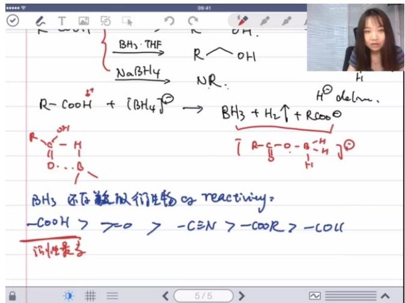

text_image

BH₃·THF
NaBH₄
R-OH
NR.
R-COOH + (BH₄)⁻ → BH₃ + H₂↑ + RCOO
R-O-H
O...O
BH₃ 还可触发衍生物或-reactivity?
-COOH > -O > -C≡N > -COOR > -COL
活性最多

O

- 羧酸衍生物活性: - COOH > C = O > - C ≡ N > - COOR   
○ 应用提示: 在多官能团化合物中，硼烷可选择性还原羧酸基团

# 4）缩酸衍生物的还原反应 01:13:48

# ● 硼烷还原反应特性

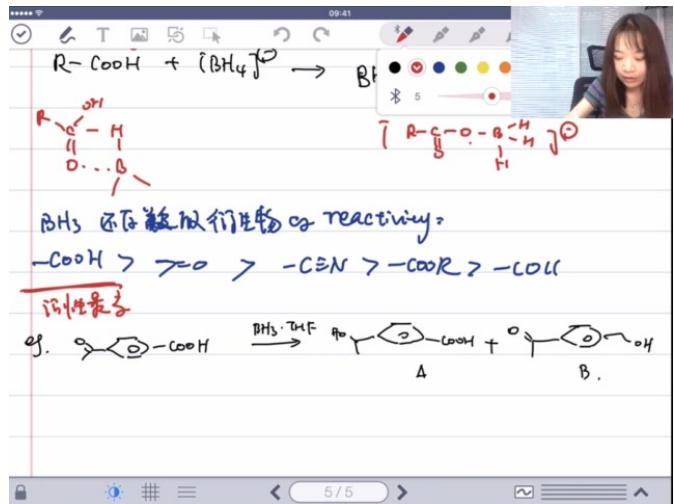

text_image

R-COOH + (BH4)2O → BF
R-O-H
O-H
O-H
R-C-O-B-H
H
BH3 还在凝胶衍生物或 reactivity:
-COOH > 7-0 > -C≡N > -COOR > -COL
活性量
9. ①-COOH → BH3·THF
A
B.

反应选择性：硼烷对缩酸的还原活性最高，会优先还原缩酸基团

# ○ 用量控制：

■ 控制硼烷用量可得到部分还原产物（如b）  
■ 过量硼烷会将所有缩酸基团完全还原（如c）

副产物形成：当反应控制不当时，可能同时得到主产物和次要产物

# ● 缩酸衍生物的分类与结构

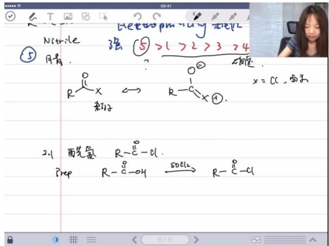

text_image

Nitrile
⑤ 腈.
强 ⑤ >1 >2 >3 >4
? 
确定.
R-C(=O)-x → R-C(=O)-x④.
粉子
x = cc, 分子
2.1 酰氢 R-ⅡC-Cl.
Prep R-ⅡC-OH → R-ⅡC-Cl
500ml₂

# ○ 分类：

■ 酰卤（主要为酰氯）  
酸酐   
■ 酯  
■ 酰胺   
■ 腈

○ 结构特征：中心碳原子连接三个杂原子（含π键体系），表现出亲电性

# - 亲电性比较

text_image

Mechavim.

- 排序依据：通过共振结构稳定性分析，杂原子正电荷稳定性顺序为N>O>Cl

○ 具体排序：

■ 酰卤（1）>酸酐（2）>酯（3）>酰胺（4）  
■ 腈的亲电性位置待确认（需考虑CN键极性和反应活性）

# - 酰卤的制备

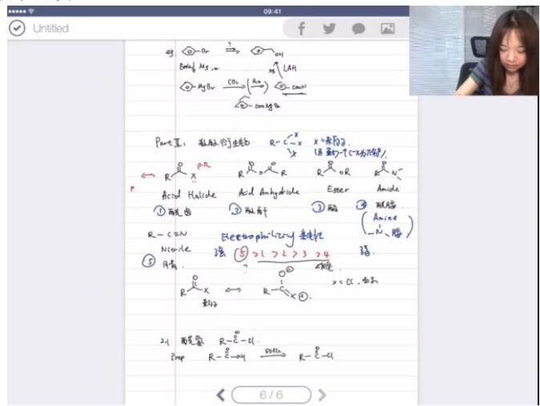

text_image

09:41
Ag: 
Br: 
CO2: 
NH: 
CH3: 
COOH: 
COOH: 
COOH: 
Pur-Ⅱ：酸碱的生成物：R-C-X X=苯胺（B酸）-C(二磷酸乙酯).
→ R-O-R R-O-R R-O-
Acid Halide Acid Amohydrate Enter Amide
①酸碱 ②酸碱 ③酸 ④酸碱
R-CN Electrophenoxy 氧相色
Nitrile 强 ⑤>1>2>3>4 强.
⑥酸：
R-O-X → R-C-X ⑦ x=Ct，由水
粉好
2i 质量：R-E-DL
R-S-C-OH  COOH: R-E-DL
6/6 >

常用方法：羧酸与二氯亚砜（ $\mathrm{SOCl}_2$ ）反应

○ 反应机理：

■ 羧酸氧原子亲核进攻二氯亚砜的硫原子  
■ 硫氧键断裂形成中间体  
■ 氯离子作为离去基团被取代  
■ 最终生成酰氯产物

# ● 反应后处理注意事项

○ 淬灭步骤：

■ 有机合成中通常默认包含反应淬灭步骤  
■ 考试中需注意题目是否明确写出淬灭步骤  
■ 产物可能是淬灭后或未淬灭的形式

○ 合成路径多样性：有机合成题通常存在多种合理路径，需保持思维开放性

# 3. 硝酸及硝酸衍生物 01:26:51

# 1）硝酸衍生物 01:31:01

● 显卤 01:41:37

○ 显卤的反应性 01:50:00

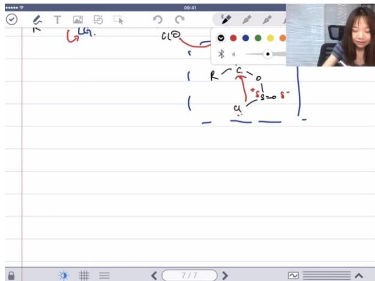

text_image

6.5g.
C10
8 4
R C O
+ s o s
- - - - - - - - - - - - - - - - - - - - - - - - - - - - - - - - - - - - - - - - - - - - - - - - - - - - - - - - - - - - - - - - - - - - - - - - - - - - - - - - - - - - - - - - - - - - - - - - - - - - -

■ 基本特性: 显卤化合物具有极强的反应活性, 其羰基碳表现出显著的正电性。

■ 水解反应

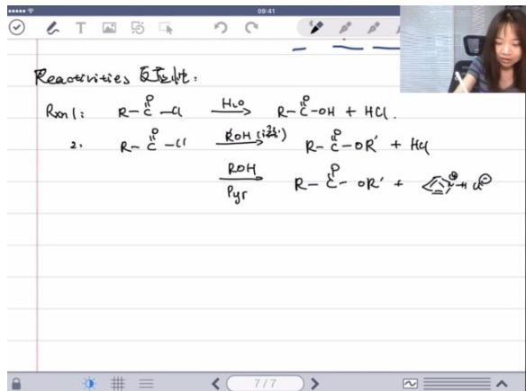

chemical

Chemical reaction equation showing hydrolysis of an alkene with water, producing a hydroxyl radical and a radical product

● 反应现象: 乙酰氯开瓶即冒白烟，迅速水解生成盐酸和羧酸。  
● 反应条件: 水作为弱亲核试剂(nucleophile)仍能快速反应。  
● 机理解释: 羰基碳正电性极强，克服了水的弱亲核性。  
● 实例说明: $RCOCl + H_{2}O \rightarrow RCOOH + HCl$

■ 醇解反应

\- 溶剂条件:

- 醇作溶剂: 反应类似水解, 只需将OH换成OR'并生成HCl  
- 非溶剂条件:需使用吡啶吸收生成的HCl，防止醇质子化降低亲核性

● 位阻效应: 大位阻醇需特别处理，通常选用吡啶作溶剂

■ 氨解反应

- 试剂用量: 需2当量胺(氨、伯胺或仲胺)   
- 原因: 1当量与酰氯反应，另1当量中和生成的HCl  
- 三级胺限制: 不能反应，仅作为碱使用(如三乙胺)  
● 反应通式: $RCOCl + 2R'NH_{2} \rightarrow RCONHR' + R'NH_{3}^{+}Cl^{-}$

■ 还原反应

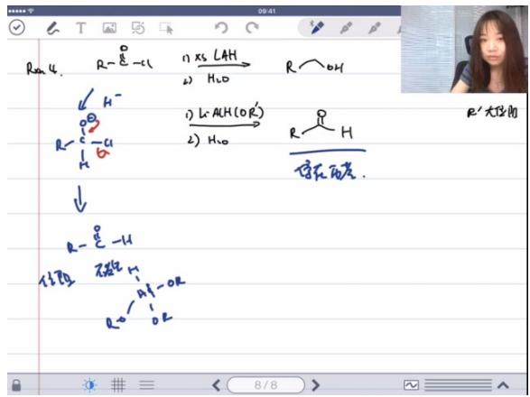

chemical

Handwritten chemical reaction equations involving alkyne derivatives and alkyl groups

# - 完全还原:

○ 过量 $LiAlH_{4}$ 还原为醇  
○ $BH_{3}$ /醚溶液同样还原为醇

# ● 选择性还原:

○ 大位阻试剂 $(LiAlH(OR)_{3})$ 可将反应停留在醛阶段  
替代方案: 先完全还原为醇再用PCC氧化为醛

# ● 记忆要点: 大位阻含氢铝试剂通常用于停留在醛

# ■ 与格氏试剂反应

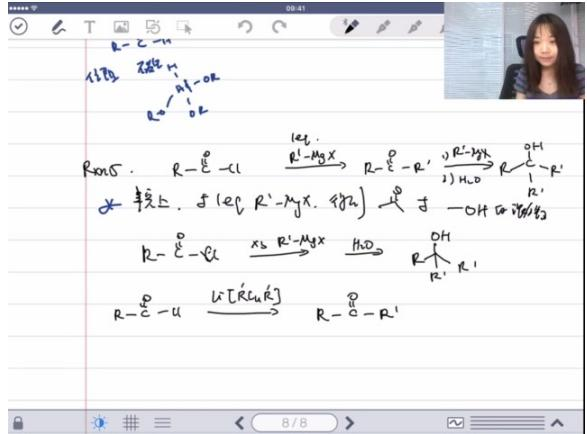

chemical

Handwritten chemical reaction equations involving alkene, thiourea, and alkyne with water, showing structural transformations

# - 理论过程:

○ 1当量:生成酮   
○ 2当量:生成醇

● 实际现象: 1当量时得到酮与醇混合物

# 实用方法:

- 制醇: 使用过量格氏试剂  
○ 制酮: 需使用烷基铜锂试剂 $(R_{2}CuLi)$

● 铜价态: 烷基铜锂试剂中铜为一价

# ■ 反应总结

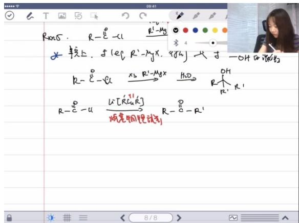

text_image

Rm5. R-ε-Cl
R' - My
× 振上. δ (ep R' - xy, 征) 代寸 -OH ⇌ 测离
R-ε-Cl ×b R'-Myx → H2O → R' + OH
R-ε-Cu Li[Ru'R] → R-ε-R'
烷基铜锂电池

●   
● 亲核试剂类型: 水、醇、胺  
● 还原体系: 完全还原与选择性还原  
● 碳亲核试剂: 格氏试剂与烷基铜锂的区别应用  
● 关键记忆点: 各反应的条件控制与产物特征

● 醋酸酐 02:06:06

○ 制备方法

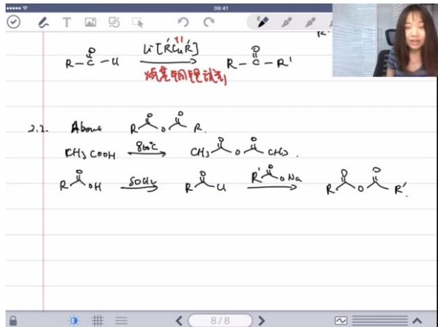

chemical

Chemical reaction diagram showing esterification and subsequent ring expansion with R groups

■   
■ 暴力加热法：将 $CH_{3}COOH$ （醋酸）直接加热至800℃制得醋酸酐，但此方法仅适用于该特定反应

常规制备法：

- 先将羧酸转化为酰氯  
- 再与自身的羧酸盐反应  
- 优点：可制备不对称酸酐，且原料（如二氯亚砜、羧酸盐）价格低廉

■ 对称酸酐制备：两分子相同羧酸加脱水剂DCC反应，但经济性较差（脱水剂比酸酐本身更贵）

\- 反应性 02:07:56

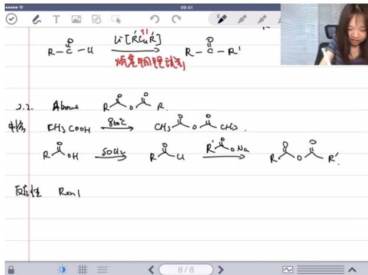

chemical

Chemical reaction diagram showing hydrogenation of a ketone with copper(II) and hydrogen to form a radical intermediate, followed by radical reagent addition to form a radical.

与酰氯的相似性：反应性与酰氯类似，因为：

- 离去基团：两者都具有良好离去基团（ $Cl^{-}$ 和 $RCOO^{-}$ ）  
- 反应类型：可发生多种相似反应

典型反应：

● 水解：与水反应生成羧酸（为制备反应的逆反应）  
- 醇解：与醇反应生成酯  
● 氨解：与氨反应生成酰胺和羧酸  
● 还原反应:

○ 用 $LiAlH_{4}$ 还原得 $RCH_{2}OH$

○ 用含氢铝键试剂还原得醛

● 与格氏试剂反应：需过量格氏试剂，最终得到叔醇  
● 与烷基铜锂试剂反应：得到酮

■ 亲核试剂选择性

\- 氧vs氮亲核性：当乙酸酐与同时含O/N的亲核试剂反应时，氮的亲核性更强（优先生成酰胺）

\- 酯 02:12:45

○ 制备方法

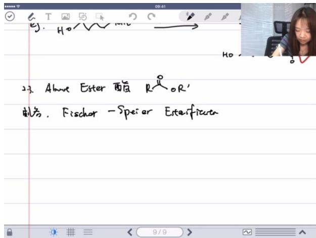

text_image

23. Above Ester 酯 R' or R'
姓名： Fischer - Speier Steerfikcera

Fischer酯化：

● 反应物：羧酸 + 一级/二级醇（三级醇不行）  
● 条件：酸催化（氯乙酸或质子酸），通常需要加热  
● 特点：可逆反应，需通过除水使平衡右移   
● 限制：三级醇在加热条件下易发生消除反应

■ 酰氯法：

\- 将羧酸转化为酰氯后与醇发生 $S_{N}2$ 反应（适用于一级醇，二级醇产率低，三级醇易消除）

■ 酸酐法：酸酐与醇反应（前文已述）  
■ 同位素标记实验

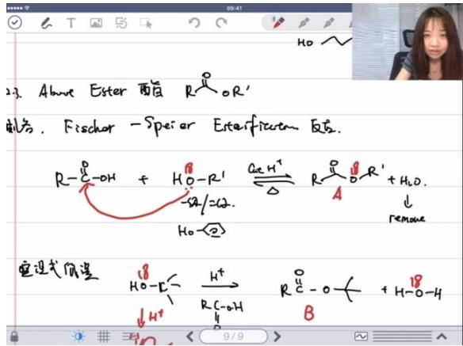

text_image

23. Above Ester 酯 R' + O-R'
副名: Fischer - Speier Esterification 反应.
R-ξ-OH + HO-R' ⇌ R-O-R' + H₂O.
-H=O-
-HO-2
Remove
室送式用途
HO-E → RC-OH + H-O-H
↓H+ → RC-OH + H-O-H
9/9

关键发现：必须标记醇中的氧（羧酸中的氧会质子迁移而等价）

\- 反应机理差异：

○ 常规酯化：醇氧 $^{18}$ O 保留在产物中  
○ 碳正离子机理：醇氧 $^{(18)}$ O不进入产物

\- 反应性 02:20:20

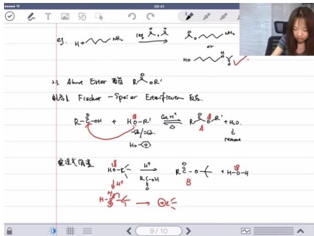

text_image

ej. H→NH₂ → H₂O → NH₂ or HO
23. Above Ester 酯 R' or R'
氨基I. Fischer - Speier Enterficent Ads.
R-ε-OH + H₀-R' Ca-H' R' + H₂O.
      2H/2H.
      H₀-ε⁻ → H⁺ R-C-H + H-O-H
密理式用途
HO-E → H⁺ R-C-H + H-O-H
↓H⁺     ↓
      H-ε⁻ → ⊕C⁻
9/10

■ 离去基团特性：烷氧基负离子 $(RO^{-})$ 是较差离去基团（相比酸酐的 $RCOO^{-}$ ）

■ 主要反应:

● 酸性水解：可逆反应，生成羧酸和醇（Fischer酯化逆过程）  
● 还原反应: $LiAlH_{4}$ 还原生成两分子醇   
- 酯交换：在酸催化下与另一醇反应生成新酯（机理类似Fischer酯化）  
● 与格氏试剂反应：需过量格氏试剂，最终得到叔醇  
● 特殊限制：不与烷基铜锂试剂反应（后者亲核性不足）

● 酰胺 02:23:09

\- 酰胺的反应性 02:23:50

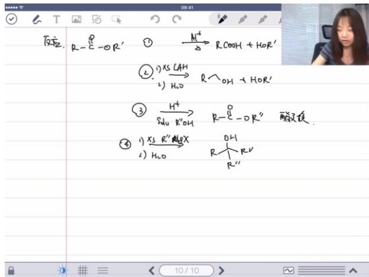

text_image

反应: R-ε-O-R' ① H+ → R-COOH + HOR'
② ③ Xs CH
2) H2O → R-OH + HOR'
③ H+ → R-ε-O-R'' 酸伏
④ ⑤ Xs R'' + OX → D-H
2) H2O → R↑R''
      R''

■ 水解反应：在加热条件下，酰胺 $R-C(=O)-NR'_{2}$ 水解生成羧酸RCOOH和胺 $HNR'_{2}$ 。碱性条件下需加热才能促使氮负离子离去。  
■ 碱性条件机理：氢氧根负离子进攻羰基碳，形成四面体中间体。由于氮负离子是较差的离去基团，反应需要加热才能进行，最终生成羧酸盐和胺。

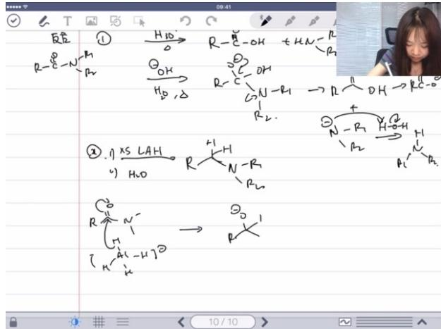

chemical

Handwritten chemical reaction equations showing hydrolysis and radical reactions with labeled intermediates and products

■ 还原特性：与氢化铝锂 $(LiAlH_{4})$ 反应时，酰胺 $R-C(=O)-NR'_{2}$ 被还原生成胺 $R-CH_{2}-NR'_{2}$ ，而非醇类产物。  
■ 还原机理差异：相比其他羧酸衍生物（生成醇），酰胺还原时氮原子保留，因为氮负离子难以离去。反应中氧原子被消除，羰基碳上引入两个氢原子。

\- 腈 02:29:43

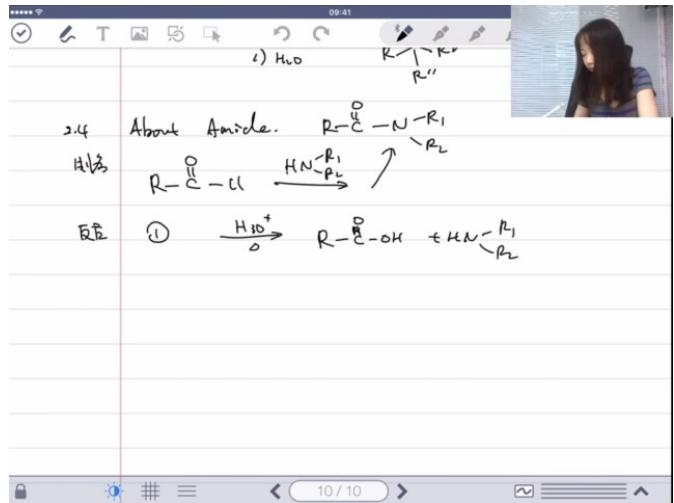

text_image

24
AlBr3
反应
Amide.
R-C=O-N-R1
R-C=O-Cl
HN-R1
→
反位
① H10+
O → R-E-OH + HN-R1
→
10/10

重要制备方法：酰胺与二氯亚砜 $(SOCl_{2})$ 反应可制备腈 $R-C\equiv N$ ，该反应机理与硝酸生成酰氯的反应类似。

反应特性：氰基 $(-C \equiv N)$ 是强亲核试剂，该制备反应在有机合成中具有重要意义。

\- 腈的反应性 02:31:07

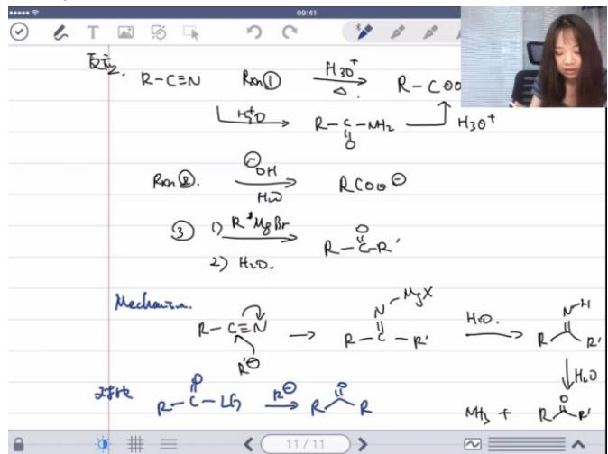

chemical

Handwritten chemical reaction equations involving R-C≡N, H2O, and COOH with reagents and conditions

O

○ 腈的水解反应 02:31:22

■ 反应条件：酸性条件下加热水解  
■ 反应机理：先生成酰胺中间体，再进一步水解生成羧酸  
■ 注意事项：与上节课直接生成羧酸的简化描述不同，实际反应分两步进行  
■ 典型产物：最终生成羧酸 (R - COOH)

\- 腈与金属试剂的反应 02:32:17

■ 氢氧化钠反应：

● 在水溶液中反应生成羧酸钠盐 (R - COONa)  
- 反应直接且容易预测

\- 腈与格式试剂的反应及机理 02:32:39

■ 反应特点：

● 与其它羧酸衍生物不同，反应可停留在酮阶段  
● 需控制格式试剂用量（1当量）并后续加水处理

■ 反应机理：

- 格式试剂（ $R^{\prime -}$ ）进攻腈的碳原子  
● 生成带负电荷的氮中间体 ( $R - C \equiv N^{-}R'$ )  
● 氮负离子使碳原子电子云密度增加，降低亲电性  
● 水解后生成亚胺中间体 $(R - C( = NH) - R')$   
● 最终水解得到酮（R - CO - R'）和氨

■ 关键区别：相比其他羰基化合物，氮负离子的存在阻止了进一步反应

\- 腈与过量的氢化锂铝反应 02:36:36

■ 反应过程:

- 氢负离子（ $H^{-}$ ）持续进攻腈的碳原子  
- 氮原子连接金属形成中间体  
● 最终水解生成伯胺 $(R - CH_{2} - NH_{2})$

■ 反应选择性：亲核进攻始终发生在碳原子上（因氮原子自带δ-）  
■ 注意事项：需使用过量氢化锂铝确保完全还原

2）应用案例 02:37:56

● 例题:醋酸衍生物转化 02:38:21

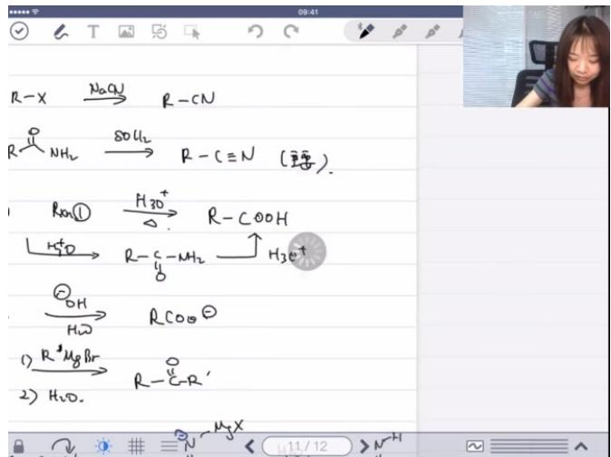

chemical

Handwritten chemical reaction equations involving sodium cyanide, sulfuric acid, and carbon dioxide formation

氮负电荷特性: 氮上的负电荷无法离域到碳上, 这是由于氮的电负性虽然比碳大, 但带负电荷后会排斥 $\pi$ 电子向碳偏移, 导致碳上仅带微量 $\delta$ 负电荷。  
- 反应路径设计原则: 当两个衍生物不能直接转化时, 需设计多步反应路径。例如:

■ 酰胺到酰氯：先水解成羧酸，再加 $SOCl_{2}$   
■ 羧酸到胺：先转化为酰胺，再用 $LiAlH_{4}$ 还原

不确定反应处理：遇到不确定能否发生的反应（如羧酸直接与氨反应），应选择已知可行的迂回路径，体现"条条大路通罗马"的合成策略。

● 例题:格式试剂反应 02:43:14

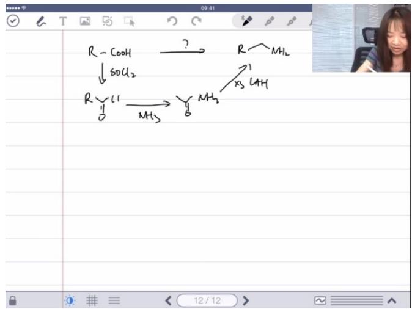

chemical

Chemical reaction diagram showing reduction of carboxylic acid to amino acids via sulfuric acid and alkyl halide intermediates

碳数变化识别：合成设计需首先观察碳骨架变化，本例中产物比反应物多一个碳原子。  
- 格式试剂应用:

■ 将卤代烃转化为格式试剂RMgX   
■ 与 $CO_{2}$ 反应引入羧基  
酸性水解得羧酸

○ 替代合成路径:

■ 氰化物路线：通过 $CN^{-}$ 亲核取代，再酸水解  
■ 复杂路径示例：卤代烃→酰氯→烷基铜锂→醇→对甲苯磺酸酯→硼氢化氧化→末端醇→氧化

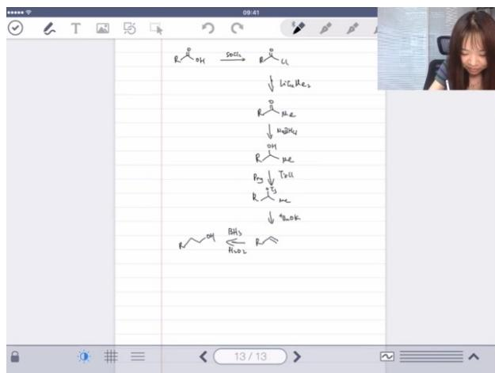

chemical

Chemical reaction scheme showing hydrolysis of ethyl alcohol to form alkene, followed by hydrogenation and reduction steps

# ○ 合成设计要点:

■ 多步反应需确保每步转化正确  
■ 可故意设计复杂路径练习反应知识  
■ 最终氧化步骤使用 $CrO_{3}$ /酸性条件完成转化

# 四、知识小结

<table><tr><td>知识点</td><td>核心内容</td><td>考试重点/易混淆点</td><td>难度系数</td></tr><tr><td>缩酸结构特性</td><td>氢键形成能力(二聚体网状结构)与沸点关系</td><td>分子内氢键与分子间氢键的区别</td><td>★★</td></tr><tr><td>缩酸酸性比较</td><td>pKa影响因素:共轭效应/位阻效应/溶剂化效应</td><td>取代苯甲酸酸性排序: $NO_{2} >CHO >Cl >H >CH_{3} >OH$ </td><td>★★★</td></tr><tr><td>缩酸制备方法</td><td>醇氧化/臭氧分解/腈水解/格式试剂+ $CO_{2}$ </td><td>格式试剂反应需水解淬灭步骤</td><td>★★★★</td></tr><tr><td>缩酸还原反应</td><td> $LiAlH_{4}/BH_{3}$ 还原为醇 vs  $NaBH_{4}$ 不反应</td><td>DIBAL-H可控制还原停留在醛阶段</td><td>★★★★</td></tr><tr><td>酰卤反应活性</td><td>水解/醇解/氨解反应活性顺序: 酰氯&gt;酸酐&gt;酯&gt;酰胺</td><td>酰氯遇水剧烈反应冒白烟</td><td>★★★</td></tr><tr><td>酯化反应机理</td><td>Fischer酯化(酸催化可逆) vs 酰氯直接酯化</td><td>氧18标记证明反应机理</td><td>★★★★</td></tr><tr><td>酰胺特殊性质</td><td> $LiAlH_{4}$ 还原生成胺(非醇)</td><td>氮负离子难离去特性</td><td>★★★★</td></tr><tr><td>腈化合物转化</td><td>格式试剂加成停留酮阶段/酸性水解得羧酸</td><td>与 $LiAlH_4$ 反应生成伯胺</td><td>★★★★</td></tr><tr><td>多取代苯合成</td><td>定位基团协同控制/占位基团应用</td><td>磺酸基可逆去除技巧</td><td>★★★★★</td></tr><tr><td>共振结构分析</td><td>亚硝基定位效应(钝化+邻对位)</td><td>共振结构稳定性:八隅体&gt;电荷分布</td><td>★★★★</td></tr><tr><td>反芳香性体系</td><td>环丁二烯/丙二烯结构特征</td><td>实验判断标准:NMR环电流</td><td>★★★★</td></tr></table>