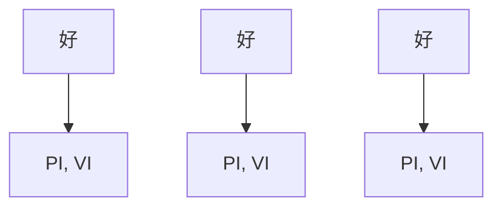

# 一、热力学基本概念06:26

# 1. 温度 06:40

# 1）温度的定义 06:47

![[1_images/4a479a2f915a25f83ea5efad43c9d733538b998e97f21e2768fb014224d6fc60.jpg]]

text_image

Peter 进万之基本概念.

质心官网

www.eduzhixin.com

![[1_images/6d4ce5de940756c845d6482e71ea45f68904d3ff7354641c6735e76a14efe958.jpg]]

化学竞赛

官方微信

质心论坛

forum.eduzhixin.com

● 实验基础: 热力学定律均来自大量实验观测总结，物理实验比化学实验更精确可控  
● 相对定义：通过热平衡状态定义相对温度，如水结冰温度定为 $0^{\circ} \mathrm{C}$ 时，与之无热交换的体系均为 $0^{\circ} \mathrm{C}$   
● 传递方向: 热量只能从高温体系自发传递到低温体系，这是温度定义的实验基础

# 2）热力学第零定律的实质 08:31

● 核心内容: 两个相互接触达到热平衡的体系温度相等 ( $T_{A}=T_{B}$ )   
● 双重定义: 同时定义了温度概念和热量概念（heat）  
● 热量本质: 热不平衡体系间传递的能量形式，平衡时无热量交换

# 3）温度与热量的相对性 09:05

![[1_images/a53e185a45c871d064d6fef29a2eb2d7ada6d5aeb0b52232e7521a03dcd96e6b.jpg]]

text_image

1. 这段 7. Length law of thermal dynamics.
臣义了{赵呈 Q. (heat)

质心官网

www.eduzhixin.com

![[1_images/d46a11f656c5e73b0f6dddad19e2c8668ebcbd4463788319eeb6c84b78907659.jpg]]

化学竞赛

官方微信

质心论坛

forum.eduzhixin.com

\- 相对标准: 以水冰点作为参照标准（0°C），通过热传递方向判断相对温度高低

# ● 判断方法:

○ 若体系A向冰传递热量，则 $T_{A}>0^{\circ}C$   
○ 若冰向体系A传递热量，则 $T_{A}<0^{\circ}C$

# 4）绝对零度的概念 10:13

![[1_images/7c41fffdcfa64dc11980614afeb4c1bda25c914fef9c90a68b87cc0b231c4c77.jpg]]

text_image

臣义了{超量 Q . (heat)
H 体系 A B. 达量平衡 则 T_A = T_B
计 P 矩A 向分子B 使求总量 则 T_A >

![[1_images/ae7cde0fc562c8fe7f1c7ffebecb47293c5069e920069522c62f4a0b5c44cd55.jpg]]

text_image

< 1/1 >

质心官网

www.eduzhixin.com

![[1_images/20ce4b63e81b51ff3cf04acd57a4164d44bba29db3febb949b594470ea3c9af4.jpg]]

化学竞赛

官方微信

质心论坛

forum.eduzhixin.com

● 推导方法: 通过压强-温度关系曲线外推得到绝对零度  
● 本质特征: 理论最低温度极限，实际无法达到

# 2. 体系 11:13

![[1_images/ed262756b25a5e37d195acc384fcd12dae2c17d762b661bd40f6d1eccd7a373e.jpg]]

text_image

计物体A向物体B传递能量 则T_A > T_B.

2 体子 System { 开放 open
    容闭体子 closed ← 追为子全体通用。
    私定体子 isolated.

在文中，“体子”默认为宽闭体素 即只传递能量，不传递能量

质心官网

www.eduzhixin.com

![[1_images/2f51ff79db0c17e0b7577d29c43ece2e2142e54a36c47e3325af25c6199663df.jpg]]

化学竞赛

官方微信

质心论坛

forum.eduzhixin.com

● 开放体系: 可交换物质和能量  
● 密闭体系: 只交换能量不交换物质（化学反应默认体系）  
- 孤立体系: 不交换物质和能量  
● 默认约定: 课程中未特别说明时, "体系"均指密闭体系

# 3. 热力学的平衡状态 13:21

# 1）热平衡的定义 13:47

![[1_images/97580ba8e2e4abfdb9dd0ba5c5cfbe1190ed1abdbea47b1634c12d74681cc6e2.jpg]]

text_image

3. Thermal dynamic equilibrium state.
① thermal equilibrium T 均一.
②. phase equilibrium.

质心官网

www.eduzhixin.com

![[1_images/22fe0e26dbf8eb7c64a9d11029f17809ab0786e774dc752203e916792e7b80e4.jpg]]

化学竞赛

官方微信

质心论坛

forum.eduzhixin.com

![[1_images/1d158bac485cd01e68db41952d523339a0afd04e4711b0d2a960f7a6026661ed.jpg]]

● 判定标准: 体系内部温度处处相等 ( $T_{uniform}$ )  
● 动态特征: 宏观上温度分布均匀，微观粒子仍在运动

2）相平衡的定义与特点 14:20

- 动态平衡: 相间分子交换速率相等（如气液平衡时 $N_{gas \to liquid} = N_{liquid \to gas}$ ）  
● 宏观表现: 各相组成和粒子数保持恒定

3）化学平衡的定义 15:33

● 核心特征: 体系化学组成不随时间变化  
● 动态本质: 正逆反应速率相等

4）力平衡的定义与化学关系 15:49

● 判定标准: 体系边界不发生位移（如活塞位置固定）  
● 化学应用: 主要出现在含活塞装置的热力学问题中

4. 广泛量和强度量 16:52

![[1_images/1ef30e2e6eb8194e8ca127e7c92d8c22e30cb10cccfe695e478b5ba35f0e7542.jpg]]

text_image

4. 度星: extensive property :
V, m, S, H.
张友星: intensive property:
T.

质心官网

www.eduzhixin.com

![[1_images/8523951312839e0990b8d48a4161e45e79cc3b911d0e0f3b0dafbe6ae3cbc922.jpg]]

化学竞赛

官方微信

质心论坛

forum.eduzhixin.com

![[1_images/070098218f50499518bd14494a7f956c96f566e46c08858285f1df4b64650d11.jpg]]

\- 广度量特征:

○ 具有加和性（如体积V：1L+1L=2L）  
○ 典型量：体积V、质量m、熵S、焓H

● 强度量特征:

○ 无加和性（如温度T: $30^{\circ}C + 50^{\circ}C \neq 80^{\circ}C$ ）  
○ 典型量：温度T、密度ρ、摩尔量 $(M_{m},S_{m},H_{m})$

● 转换关系: 广度量/物质的量→强度量

5. 状态方程 19:22

1）理想气体的状态描述 20:08

![[1_images/50f82ad3e0dba936682dad49090aca1694352b542359f98cde7290043f6292c5.jpg]]

text_image

5. 狀查方程. equation of state.
包: P. v. 7. 中只有2个是独立方程.

质心官网

www.eduzhixin.com

![[1_images/fcac46e7f964e3ab5d8b385e47efd4d084a82995930edd60859fe21d9fcac9ba.jpg]]

化学竞赛

官方微信

质心论坛

forum.eduzhixin.com

- 基本变量：描述理想气体状态需要三个量：压强p、体积V和温度T，但其中只有两个是独立变量。  
- 变量关系：通过理想气体状态方程 $pV = nRT$ 可知，确定任意两个变量即可推导出第三个变量。

2）理想气体状态方程 20:21

\- 历史发展：历史上通过固定两个变量获得常数，最终确立 $pV = nRT$ 这个理想气体状态方程。

● 适用范围: 适用于理想气体，即忽略分子体积和分子间相互作用力的气体模型。

3）非理想气体的状态方程 21:01

![[1_images/e068e5b789d42d9a3f883bb47facd9bec853a044a76767229e3ceb5c11cdf2e9.jpg]]

text_image

5. 状态方程. equation of state.
定义一个state: P.v.7),中又有2个是独立变量.
T = f(CP,V)

质心官网

www.eduzhixin.com

![[1_images/20fbd0b42d71ef73737968b89f084a1e7b64f879ea6e5adca6f28f7caedb81ff.jpg]]

化学竞赛

官方微信

质心论坛

forum.eduzhixin.com

\- 修正因素：对理想气体状态方程进行修正，需要考虑分子体积和分子间相互作用力这两个因素。

4）多组分体系的状态描述 21:35

\- 组分表示: 多组分体系的状态描述需要包含各组分的物质的量 $n_{1}, n_{2}, n_{3}, \ldots, n_{i}$ 。

● 数学表达: 温度可以表示为 $T = f(p, V, n_{1}, n_{2}, \ldots, n_{i})$ 的函数形式。

5）化学平衡与物理体系中的状态 21:57

\- 化学平衡特征: 当体系达到化学平衡时, 组分不再发生变化, 即 $dn_{i}=0$ 。

\- 物理体系简化：在物理体系中（不涉及化学反应），组分保持不变，状态方程可简化为 $T = f(p, V)$ 。

6）状态函数的定义与性质 22:34

定义一个state：P. V. I)，4 证明21正弦之必互。

$$
T = f (p, v, n _ {1}, n _ {2}, n _ {3}, \dots , n _ {i} \dots), \text {   当   } n _ {i} \text {   不变   }
$$

$$
T = f (p, v).
$$

![[1_images/146201c109dd27ede865407ac010ecabb32abc9a8f69faec8b28d062775e57bb.jpg]]

![[1_images/3b9d83357c4ac1599e72add2f585bba0533cbe04f232eaa91d143af0adaf550a.jpg]]

text_image

< 1/1 >

质心官网

www.eduzhixin.com

![[1_images/43e4b330ef09a8082cc57959c34f64a6fee5c96a9600b117cdcf75b3df378269.jpg]]

化学竞赛

官方微信

质心论坛

forum.eduzhixin.com

![[1_images/6b8a6e99f140931e02ce66354f5bbd628d1f7eb5b47559aa3ccb7b77e0df76bd.jpg]]

- 核心定义：给定体系的一个状态，其所有状态函数就确定了；但状态改变时，状态函数不一定变化。  
● 典型例子: p, V, T 都是状态函数，而 q 和 w 不是状态函数。  
● 数学表达: 温度可以表示为压强和体积的函数 $T = f(p, V)$ 。

7）状态函数的微小变化与全微分 24:17

定义一个state：P. v. 7，中只有2个是独立子星。

$$
T = f (p, v, n _ {1}, n _ {2}, n _ {3}, \dots , n _ {i} \dots).
$$

$$
T = f (p, v).
$$

$$
\Rightarrow d T = \left(\frac{\partial T}{\partial P}\right) _ {V} d P + \left(\frac{\partial T}{\partial V}\right) _ {P} d V
$$

![[1_images/54f9e0430590762727e4975935739e755e01bb8cedf3698e49d438b972fc548b.jpg]]

text_image

< 1/1 >

质心官网

www.eduzhixin.com

![[1_images/09058ce5af799ed466e2cb2a6beec48ab7198281693f0ba62419836260157219.jpg]]

化学竞赛

官方微信

质心论坛

forum.eduzhixin.com

全微分公式: 当T是p和V的函数时, 其微小变化可表示为:

$\bullet \quad dT = \left(\frac{\partial T}{\partial p}\right)_V dp + \left(\frac{\partial T}{\partial V}\right)_p dV$   
- 偏导数解释:

$\circ \left(\frac{\partial T}{\partial p}\right)_V$ 表示在体积V恒定时，T对p的变化率  
○ $\left(\frac{\partial T}{\partial V}\right)_{p}$ 表示在压强p恒定时，T对V的变化率

● 数学本质: 这是多元函数的全微分，可以推广到更多变量的情况。

8）热力学平衡状态的概念 27:09

![[1_images/f2ee048f1566033c2d03357660fb2d06efd23efceb1c7ef69230d3cb17c221df.jpg]]

text_image

Real 进行者，各由独立。
1. 连行 T. Zooth law of thermodynamics.
(见3) ① 等义 Q. (there)
H 排求 A & B. 还是平移 J) Ta + Ta
J 排求 A 的子 B 指定重量 J) Ta > Ta。
2. 排求 System { 等线 open
    各的子 connected ← 进行者中使用.
    超过子 instead
好文本。“例子”则以为集团对象 即又支持、成立、不支持和解
3. Thermodynamic equilibrium state.
① thermal equilibrium T 终一.
② phase equilibrium 共的组成和组成之成.
③ chemical equilibrium 组成之成.
④ mechanical equilibrium 世界无位数.

质心官网

www.eduzhixin.com

![[1_images/34e1ad7ef2b87b1891cdea7f55b22f0746b885b9846efdcad6a87e42545e2c6e.jpg]]

化学竞赛

官方微信

质心论坛

forum.eduzhixin.com

![[(1_images/4f659909ec5d64bbdf7ecd41050164ac40bd75f1a96ea01c9146292f03cd169b.jpg)]]

# 平衡条件:

○ 热平衡：体系A和B达到平衡时 $T_{A}=T_{B}$   
○ 相平衡：各相组成不随时间变化  
○ 化学平衡：组成不随时间变化  
○ 力学平衡：边界不发生位移

● 体系限制: 在孤立体系中，只交换能量不交换物质。

# 6. 屏幕问题 27:34

● 问题描述：课程开始时屏幕显示异常，顶部内容无法正常显示  
● 解决方案：老师表示将在课后调整屏幕设置

# 7. 热力学基本概念

![[1_images/6269c3c8797b140e9b4e02b34a1304bfa617a50d2720fb0a9111e489c6485b43.jpg]]

text_image

#极子.
T. Zooth law of thermodynamics.
& (heart)
1 & B. 还且平行 2) T_A = T_B
A 向 倾子 B 能使变量 则 T_A > T_B.
System { 放 open
    垂闭体系 closed ← 进为子晶体使用.
    极定体系 isolated
: “体系”默认为集闭体系 即 只支投允许，不交投数据
dynamic equilibrium state.
mal equilibrium T 均一.
s# equilibrium. 等组 维减 将交投无效 < 1/1 >

质心官网

www.eduzhixin.com

![[1_images/74f336138cf19a46e2f4a0a978aac59388e5eee96b1242002099dbca553fe9a5.jpg]]

化学竞赛

官方微信

质心论坛

forum.eduzhixin.com

![[1_images/63e131a5fb5606d2a39b9ebee4d5c8cd40d191edd1addb91995f862cc859dff1.jpg]]

# 体系分类：

○ 孤立体系(isolated system): 不与外界交换能量和物质  
- 封闭体系(closed system): 只交换能量不交换物质   
- 开放体系(open system): 既交换能量又交换物质

# - 平衡状态条件：

○ 热平衡：体系各部分温度相同 $(T_{1}=T_{2})$   
○ 相平衡：各相组成和数量不随时间变化  
○ 化学平衡：组成不变  
○ 力学平衡：无宏观位移

# 8. 过程类型

![[1_images/08f0dec031dadc77b09815117cd1b8721ec14fe724988decdf407a922728ca66.jpg]]

text_image

6. Process 过程.
① isothermal 恒T
② adiabatic 绝差 Q=0.
③ isobaric 恒V.
④ cyclic 所有状态是 (P、V、U、H、S、G) 实际加。

# - 四种基本过程：

○ 等温过程(isothermal): 温度恒定( $\Delta T = 0$ )   
- 绝热过程(adiabatic): 无热交换(q = 0)   
○ 等压过程(isobaric): 压力恒定( $\Delta p = 0$ )   
- 循环过程(cyclic): 始末状态相同, 所有状态量 $(P,V,U,H,S,G)$ 变化为零

# ● 状态量特性

○ 定义：体系处于确定状态时，状态量有确定值  
○ 示例：压力(P)、体积(V)、内能(U)、焓(H)、熵(S)、吉布斯自由能(G)

# 9. 热与功

![[1_images/7e61a72d50fee70290c43adb5b347870cf01b4cbe4dd5a7446c5d8ec1c130586.jpg]]

text_image

④ cyclic 所有状态是 (P、V、U、H、S、G) 高级
7. heat 热 (Q) 和 work 効 (W).

# ● 热(heat):

○ 符号：q   
○ 定义：由于温度差异在体系与环境间传递的能量  
- 特点：与过程路径有关，不是状态函数

# ● 功(work):

○ 符号：w   
○ 分类：

■ 体积功： $w$ 体积 = -PΔV  
非体积功：如电功等

总功表达式： $w = w$ 体积 + w非体积

![[1_images/c6cac9b8c025ec36fe1a0e3ac6cb1268f4b67d3775f1fe70f6244c5f77db47e1.jpg]]

text_image

7. heat 热 (Q) in work 功 (W).
W. = W e + Wf
体功 非常功。(e 乘功)

# ● 电功计算：

○ 表达式： $w^{电}=E\Delta Q$ （E为电势差，Q为电荷量）  
- 物理意义：搬运电荷所做的功

# ● 共同特点：

都是能量传递形式  
◦ 与过程路径有关，不是状态函数

符号规定：体系吸热q>0，体系做功w>0

☐ 注：笔记中保留了老师讲解时提到的具体例子和关键公式，如电功的表达式和体积功的计算公式，这些在实际应用中非常重要。同时按照要求，没有包含任何关于笔记来源或生产过程的信息。

# 10. 热和功 30:34

# 1）热力学第一定律 33:40

![[1_images/ceb98ad31f63f39b9bbbae35000855b214d1ba7eb94960ae2c2ae2a3e1d54cd9.jpg]]

text_image

09:41 1月9日 星二
↑
电势差.
物质
Part II. 热一.
着化 ΔU = Q+W.
物化. dU : sq + sw.
↑
表示把在望子做小做实.

基本表达式: $\Delta U = Q + W$ ，其中W包含体积功和非体积功（如电功W电 = ∫edφ）  
● 微分形式: $dU = \delta q + \delta w$ ，状态量用d表示（如dU），过程量用 $\delta$ 表示（如 $\delta q$ ）  
● 内能 35:37

![[1_images/c262da3196df1c7b68bf0b211415a8c9f88891eeff3b190db4d2e1957d602db8.jpg]]

text_image

着化
△U = Q+W.
物化
dU = sα + sw.
表示把在量子微小做变
表示非松态量分做以做变
对于组分固定的 system U = U(T,P).

状态函数特性: 对于组分固定体系, $U = U(T, P)$ , 可表示为全微分形式:

$\circ \quad dU = \left(\frac{\partial U}{\partial T}\right)_P dT + \left(\frac{\partial U}{\partial P}\right)_T dP$   
数学证明 38:16

![[1_images/d2c646d0db04f5033f991a7acb5dab5e0ecf85fa1cb26a6ec4dec5e32ab625c4.jpg]]

text_image

零无位器.
(简体式称性)
S₀ Hₘ.
主变量:
i ... ), 生 n; 定量 d, i = 0.
T = f(x)
dT = f(0) dₓ
倒 请记明 U = U(T, v)
设: ∵ P = P(U, T)
∴ dp = (2P/2V)ₜ dv + (2P/2T)ᵥ dₜ
故: dU = (2U/2T)ₚ dₜ + (2U/2P)ₜ [ (2P/2V)ₜ dv] + (2P/2T)ᵥ dₜ]
= [(2U/2T)ₚ + (2P/2T)ᵥ] dₜ + (2U/2P)ₜ (2P/2V)ᵥ dₜ
= [(2U/2T)ₚ + (2P/2T)ᵥ] dₜ + (2U/2V)ₜ dₜ.
故 dU = U(T, v)

证明思路: 利用 $P = P(V, T)$ 的状态方程，通过全微分替换：

■ $dP = \left( \frac{\partial P}{\partial V} \right)_{T} dV + \left( \frac{\partial P}{\partial T} \right)_{V} dT$

关键步骤: 将dP表达式代入dU展开式，整理后可得:

■ $dU=\left[\left(\frac{\partial U}{\partial T}\right)_{P}+\left(\frac{\partial P}{\partial T}\right)_{V}\right]dT+\left(\frac{\partial U}{\partial V}\right)_{T}dV$   
物理意义：第一项为恒压热容与压力温度系数的组合，第二项为恒温体积变化功

■ 应用案例 43:42

■ 例题:热力学第一定律计算

● 解题要点: 需区分状态函数 $(U,H$ 等）与过程量 $(Q,W)$ 的数学表达差异  
- 易错提醒: 当组分变化时 $(dn_{i} \neq 0)$ ，需增加化学势项 $\sum \mu_{i} dn_{i}$

2）可逆过程

![[1_images/d096b676097a34faae150076db5f9b555ba1d45642ceccc54ca82be4fa1403da.jpg]]

text_image

2. 可逆过程 reversible process. (理想过程,不相互存在)
特点: • 某 system, 从好处变化到终点, 改进律率权其延续,
• 省一与变化却无限趋近

![[1_images/09d8e3ee399448094c19d570c75329aa8bb8c775b85643b7075400545147fad0.jpg]]

● 理想特性: 实际不存在，但可无限逼近  
● 核心特征:

- 准静态变化: 变化速率趋近于零   
- 双向可逆: 体系+环境能完全复原  
○ 最大功原理: 恒温可逆膨胀时体系做最大功

● 功的图示分析

![[1_images/a6cd55caa2d26b7f4b1f56f7092df3d05cd94e0cde82ad9c065cc810d35fb3c1.jpg]]

text_image

20:41 1月8日 第二
P
P
P
P
P
P
P
P
P
P
P
P
P
P
P
P
P
P
P
P
P
P
P
P
P
P
P
P
P
P
P
P
P
P
P
P
P
P
P
P
P
P
P
P
P
P
P
P
P
P
N
N
N
N
N
N
N
N
N
N
N
N
N
N
N
N
N
N
N
N
N
N
N
N
N
N
N
N
N
N
N
N
N
N
N
N
N
N
N
N
N
N
N
N
N
N
N
N

![[1_images/26199a8c5b607d1e46fa68f679d56c1f4bfd571602f8f9b89912635d4ac1d268.jpg]]

○ 图示要点:

■ 阶梯状曲线代表分步恒外压过程  
■ 平滑曲线代表无限次微小的可逆过程

○ 结论对比:

■ 可逆膨胀功 > 不可逆膨胀功（面积比较）  
■ 可逆压缩功 < 不可逆压缩功（最小环境耗功）

● 实际应用意义

- 热机效率: 可逆过程给出理论效率上限  
- 熵的计算: 为定义热温商 $\frac{\delta q_{rev}}{T}$ 奠定基础  
○ 教学提示: 该概念为后续热力学第二定律的核心预备知识

3）可逆过程 46:25

● 例题:可逆与不可逆过程做功计算 53:27

![[1_images/9f27132c657328012ecb6df72283c68709efb1a22aea41bab030b7cdd46c15af.jpg]]

text_image

eg. 273K时,有10mo

# ○ 题目条件

■ 初始状态: 273K时, 10mol理想气体, $P_{1} = 100kPa$ , $V_{1} = 0.227m^{3}$   
■ 终态条件: $P_{2}=10kPa,\quad V_{2}=2.27m^{3}$ （体积扩大10倍）  
■ 过程特性: 恒温过程（温度保持273K不变）

# ○ 三种膨胀过程计算

# ■ 恒外压一次膨胀

![[1_images/3f4891e68bf7de992f066470047e7becaa1c6b20ef675efa0758e44ad714fe71.jpg]]

text_image

ay. 273K时,有10mol ideal gas.
始 P₁=100kPa V₁=0.227 m³
次 P₂=10kPa V₂=2.27 m³.
求经过以下三种不同的process·Q.w.
Q₁ 空外P=10kPa,一次膨胀过程，w₁=
Q₂ 先强P=50kPa下膨胀到V′
再强P=10kPa下划v₂,w₂=?
Q₃ 可速膨胀到v₂,w₃=?

- 过程特点: 外压恒定 $P_{ext} = 10kPa$ ，一步膨胀至终态  
● 计算公式: $W = -P_{ext} \Delta V = -10 kPa \times (2.27 - 0.227) m^{3}$   
● 计算结果: -20.43kJ (有效数字两位时为 -20kJ)  
● 注意点: 题目设计数值偏小, 建议改为100kPa量级更合理

# ■ 分阶段恒压膨胀

![[1_images/e5e5d72ea66061e1c3320202439d42add3acde988671fa39cfc8716a0b81661c.jpg]]

text_image

ag. 273kPa, 有10mol ideal gas.
始 Pi=100kPa V1 = 0.227 m³
终 Pi2 = 10kPa V2 = 0.27 m³
求经过以下三种不同v process·Q·W
Q1 矩外P = 10 kPa, 一次膨胀速度分发, Wp
W = -PDV = -RΔV = -10kPa (V2-V1) = -20.43 kJ·mol⁻¹
Q2 先稳P = 50 kPa下膨胀到V′
再稳P = 10kPa下划V2, W2=?
Q3 可速膨胀到V2, W3=?
L 100%

# 过程特点:

先在外压 $P' = 50kPa$ 下膨胀至中间态 $V' = 2V_{1} = 0.454m^{3}$   
- 再在外压 $P_{2} = 10kPa$ 下膨胀至终态 $V_{2} = 2.27m^{3}$

# 计算公式:

- $W_{2} = -P'\Delta V_{1} - P_{2}\Delta V_{2} = -50kPa \times (0.454 - 0.227) - 10kPa \times (2.27 - 0.454)$   
- 计算结果: -29.51kJ

# ■ 可逆膨胀过程

![[1_images/f33a4c249a2df23360b51e5bb48fb8b9170fbcef73f322259247ad21e9114458.jpg]]

text_image

算 W = -P dV = -PΔV = -10kPa (v2 - v1) = -20.43 kJ
Q2 先稳 P' = 50 kPa 下 膨胀列 V' = 2V.
再稳 P2 = 10kPa 下 列 V2. w2? -P'ΔV - P2 ΔV. =
Q2 可逆膨胀列 V2 , w3 = ?
W = ∫_{v1}^{v} -P dV = -nRT ∫_{v1}^{v2} \frac{1}{v} dv (定程分)
= -nRT ln \frac{v_2}{v_1}

2/2

● 过程特点: 无限多次微小膨胀，系统始终接近平衡态

# 计算公式:

$$
W _ {3} = - \int_ {V _ {1}} ^ {V _ {2}} P d V = - n R T l n \frac {V _ {2}}{V _ {1}}
$$

(其中 $P=\frac{nRT}{V}$ 为状态方程)  
● 计算结果: -52.26kJ（注意单位是kJ而非kJ/mol，因已乘以物质的量n）

# ■ 过程比较与结论

![[1_images/f54c3da359af01b7f32433b4238068198efb9b00e234bbaf6377bb75917f160a.jpg]]

text_image

2/2
# 1. 每秒 30000 pms，速度：45000
## - # 10000，# 30000 (1) ，# 20000 的线程。
- # 1. 从#到#的线程中，#为1000，#为2000。
- 1. 从#到#的线程中，#为2000。
- # 1. 从#到#的线程中，#为3000。
- # 1. 从#到#的线程中，#为4000。
- # 1. 从#到#的线程中，#为5000。
- # 1. 从#到#的线程中，#为6000。
- # 1. 从#到#的线程中，#为7000。
- # 1. 从#到#的线程中，#为8000。
- # 1. 从#到#的线程中，#为9000。
- # 1. 从#到#的线程中，#为10000。
- # 1. 从#到#的线程中，#为11000。
- # 1. 从#到#的线程中，#为12000。
- # 1. 从#到#的线程中，#为13000。
- # 1. 从#到#的线程中，#为14000。
- # 1. 从#到#的线程中，#为15000。
- # 1. 从#到#的线程中，#为16000。
- # 1. 从#到#的线程中，#为17000。
- # 1. 从#到#的线程中，#为18000。
- # 1. 从#到#的线程中，#为19000。
- # 1. 从#到#的线程中，#为20000。
- # 1. 从#到#的线程中，#为21000。
- # 1. 从#到#的线程中，#为22000。
- # 1. 从#到#的线程中，#为23000。
- # 1. 从#到#的线程中，#为24000。
- # 1. 从#到#的线程中，#为25000。
- # 1. 从#到#的线程中，#为26000。
- # 1. 从#到#的线程中，#为27000。
- # 1. 从#到#的线程中，#为28000。
- # 1. 从#到#的线程中，#为29000。
- # 1. 从#到#的线程中，#为30000。
- # 1. 从#到#的线程中，#为31000。
- # 1. 从#到#的线程中，#为32000。
- # 1. 从#到#的线程中，#为33000。
- # 1. 从#到#的线程中，#为34000。
- # 1. 从#到#的线程中，#为35000。
- # 1. 从#到#的线程中，#为36000。
- # 1. 从#到#的线程中，#为37000。
- # 1. 从#到#的线程中，#为38000。
- # 1. 从#到#的线程中，#为39000。
- # 1. 从#到#的线程中，#为40000。
- # 1. 从#到#的线程中，#为41000。
- # 1. 从#到#的线程中，#为42000。
- # 1. 从#到#的线程中，#为43000。
- # 1. 从#到#的线程中，#为44000。
- # 1. 从#到#的线程中，#为45000。
- # 1. 从#到#的线程中，#为46000。
- # 1. 从#到#的线程中，#为47000。
- # 1. 从#到#的线程中，#为48000。
- # 1. 从#到#的线程中，#为49000。
- # 1. 从#到#的线程中，#为5000
。

# 数值对比:

● 单次膨胀：-20.43kJ  
- 两次膨胀：-29.51kJ   
● 可逆过程：-52.26kJ

# ■ 核心规律:

● 膨胀次数越多，系统对外做功绝对值越大  
● 可逆过程做功达到最大值（绝对值）

■ 数学本质: 将热力学概念用积分形式表达，体现不同路径的功差异

# 4）焓 01:09:14

![[1_images/bbc1048c4a75b79b3bbbe377fcf0a3ea43d7ba6bafb6bc9f40d45a1cc171c3a2.jpg]]

text_image

= -nKT ln v2/v1 = -52.26 kJ.

3. y √3 Enthc lpy .

$$
\begin{array}{l} 1 H \stackrel {\mathrm{Def.}} {=} U + P V. \\ d H = d U + d (P V) \\ = d _ {U} + p d v + v d p. \quad \text {   又   } \because U = a + w. \\ = \delta Q + \delta W + PdV + VdP \\ \end{array}
$$

Def   
● 定义： $H = U + PV$ ，其中U为内能，P为压强，V为体积  
- 微分形式：

○ $dH = dU + PdV + VdP$ （因为PV也是状态函数）

由 $U = Q + W$ 可得： $dH = \delta Q + \delta W + PdV + VdP$

● 关键区别:

○ 状态函数用d表示（如dH,dU）  
○ 非状态函数用δ表示（如δQ,δW）

\- 恒压条件下的焓变

![[1_images/043163d2aecf1cdf6eb6428a1213332e0cddfbbe794491bd17ab6f0a22e3303a.jpg]]

text_image

3. 求弦 Enthc lpy.
H Def U + PV.
dH = dU + d(PV)
= dU + Pdu + Vdp. 又∵ U = a + w.
= Sα + Sw + Pdu + Vdp. =0
在恒P. = Sαp + (Sw + Pdu)
在-标不作非体改功时，ω = we + wf = we = -pdu

○ 推导条件：

■ 恒压 $(dP = 0)$   
■ 不做非体积功 $(W_{f}=0)$

○ 推导过程：

■ $dH = \delta Q_{P} + (\delta W + PdV)$   
■ 体积功 $W_{e}=-PdV$ ，故 $\delta W+PdV=0$   
■ 最终得： $dH = \delta Q_{P}$

重要结论：

■ $\Delta H = Q_{P}$ （焓变等于恒压热效应）  
■ 该结论需同时满足恒压和不做非体积功两个条件

● 例题:过程焓变计算 01:14:43

![[1_images/5360e692ffacf94218153c3820b998a05f42f2f2abd6475ab08e1c4108ec39fe.jpg]]

text_image

eg. 恒P p=100 kPa. ideal gas.
V₁=10 dm³ → V₂=16 dm³.
同时吸热 1.26 kJ. 没该 proces

题目解析:

已知条件： $P = 100kPa$ ， $V_{1} = 10dm^{3} \rightarrow V_{2} = 16dm^{3}$ ，吸热 $Q = 1.26kJ$   
解题步骤：

● 恒压过程直接有 $\Delta H = Q_{P} = 1.26kJ$   
● 计算 $\Delta U=\Delta H-P\Delta V=1.26-100\times6\times10^{-3}=0.66kJ$

■ 关键点：注意单位统一 $(1dm^{3}=10^{-3}m^{3})$

● 例题:焓变计算 01:18:50

![[1_images/094bca7e26e5bca69f818061f2c717bcefa46ead089b879911617384656543b4.jpg]]

text_image

g. 1 mol CaCO₃ 运平衡: CaCO₃(S) ⇌ CaO(S) + CO₂(S).
P=100 kPa Tc 1170K 氧热 178.0kJ.
扩散过程 Q、W、△O，△H.
Q=△H = +178.0kJ.

题目解析：

■ 已知条件： $CaCO_{3}(s)\rightleftharpoons CaO(s)+CO_{2}(g)$ ， $\Delta H=178.05kJ$   
解题步骤：

● 恒压过程 $\Delta H=Q_{P}=178.05kJ$   
- 计算 $\Delta U = \Delta H - \Delta (PV) = \Delta H - RT\Delta n$   
● 气体摩尔数变化 $\Delta n=1$ ，得 $\Delta U=178.05-8.314\times298\times10^{-3}\approx160.83kJ$

易错点：

- 固体不参与Δn计算  
● 注意温度单位换算（例题中为25℃即298K）

11. 热容 01:22:18

![[1_images/9c854cd7ddb1055ac48a25e329c4f584d6a626ceb66a10bb22c5fcb514dc7ad2.jpg]]

text_image

ΔU = ΔH - Δ(PV) = ΔH - PΔV.
= ΔH - RTΔn. = 168.3
4. Heat capacity. 熬象. (C).
Def. C = \frac{δQ}{dT} J \cdot K^{-1}
蹲不熬夜 Cm -

● 定义：体系每升高1开尔文需要吸收的热量  
● 数学表达式： $c=\frac{\Delta q}{dT}$

○ 注意：q不是状态函数，用 $\Delta$ 表示；T是状态函数，用d表示

● 单位：焦耳每开尔文（J/K）  
● 摩尔热容： $C_{m}=\frac{C}{n}=\frac{1\Delta q}{ndT}$

○ 单位：焦耳每摩尔每开尔文（J·mol $^{-1}$ ·K $^{-1}$ ）

1）恒压与恒容热容

![[1_images/2291cbee6da6740b36a9486bfee347ff55d106f977ddb58db6a31a371373c882.jpg]]

text_image

4. Heat capacity. 熱氧. (C).
Def. C = \frac{\delta Q}{dT} J \cdot k^{-1}
\bar{C}_m = \frac{C}{n} = \frac{1}{n} \frac{\delta Q}{dT} J \cdot m \cdot t^{-1} \cdot k^{-1}
C_p = \frac{\delta Q_P}{dT} = (\frac{\partial H}{\partial T})_P C_{p.m}
C_v = \frac{\delta Q_v}{dT} = (\frac{\partial V}{\partial T})_V
-29.51kJ.

\- 恒压热容 $(C_{p})$ :

○ 定义式： $C_{P}=\frac{\Delta q_{P}}{dT}=\left(\frac{\partial H}{\partial T}\right)_{P}$   
○ 摩尔形式： $C_{P,m}=\frac{1}{n}\left(\frac{\partial H}{\partial T}\right)_{P}$

\- 恒容热容 $(C_V)$ :

○ 定义式： $C_{V}=\frac{\Delta q_{V}}{dT}=\left(\frac{\partial U}{\partial T}\right)_{V}$   
○ 摩尔形式： $C_{V,m}=\frac{1}{n}\left(\frac{\partial U}{\partial T}\right)_{V}$

\- 积分关系：

$\circ \quad \Delta H = \int C_p dT$   
$\circ \quad \Delta U = \int C_V dT$

# 2）热容的温度依赖性

![[1_images/a05788313bf1403d92e2da8a507a0b6630808c3412d54998315630078742ca53.jpg]]

text_image

摩尔热身 C_m = \frac{C}{n} = \frac{1}{n} \frac{\delta Q}{dT} \cdot J_{m,n+1}.1
C_p = \frac{\delta Q_p}{dT} = (\frac{\partial H}{\partial T})_p \quad C_{p,m} = \frac{1}{n} (\frac{\partial H}{\partial T})_p
C_v = \frac{\delta Q_v}{dT} = (\frac{\partial U}{\partial T})_v \cdot C_{v,m} = \frac{1}{n} (\frac{\partial U}{\partial T})_v.
9.51(7) ⇒ \Delta H = \int G_p dT
\Delta U = \int C_v dT
( if C_p or C_v 是常数, 则 \Delta H = C_p \Delta T
\Delta U = C_v \Delta T
if C_l

![[1_images/71121bb6b9a3bce327def1633ab5283e2576ef83ea21227b4593fda9ea64aae6.jpg]]

\- 简化计算：当 $C_P$ 或 $C_V$ 为常数时

$\circ \quad \Delta H = C_P\Delta T$   
$\circ \quad \Delta U = C_V \Delta T$

● 精确计算：热容通常是温度的函数

○ 常见形式： $C = a + bT + cT^{2} + dT^{3}$   
○ 物化计算中需要积分精确求解

3）例题：摩尔热容计算 01:31:11

![[1_images/c7cef8574c0a699db902b82a71187aff2fdc7878a01305b64b5e7e5b8708256a.jpg]]

text_image

△O = Cv△T
而 Cp、Cu 是T的酸，C = a + bT + cT² + dT³
eg、P = 100 kPa. 2 mol H₂O

![[1_images/8969e32fc465bfc97d407ce5bf17e5a1fb86e6d73a4a4b810e6bbc1fea8f8ff2.jpg]]

● 题目解析：

○ 计算2摩尔水从50℃加热至110℃的△H  
○ 分三步计算：

■ 液态水从50℃加热至100℃  
100°C时的蒸发焓   
■ 水蒸气从100℃加热至110℃

○ 使用汉斯定律（状态函数性质）将各步焓变相加

● 关键数据：

$\circ C_{P,m}(H_2O,l) = 75.3J\cdot mol^{-1}\cdot K^{-1}$   
$\circ C_{P,m}(H_2O,g) = 36J\cdot mol^{-1}\cdot K^{-1}$   
$\Delta_{vap}H_m^{\circ} = 40.67\mathrm{kJ}\cdot \mathrm{mol}^{-1}$

● 答案：约8954 kJ（估算值）

12. 热对理想气体的应用 01:35:47

# 1）焦耳实验 01:36:45

# - 焦耳实验的介绍与命名

![[1_images/512206d28832fa3d7af6bd550344006f77d1ec185202de6092967a46e59195e7.jpg]]

text_image

5. 熬对理想气体的应用。

①. Gay-Lussac - Joule Experiment

≡ Joule's Experiment

○ 实验别称：该实验在不同文献中被称为"Gay-Lussac-Joule实验"、"焦耳膨胀"或"焦耳扩散"，实质上是同一实验现象的不同表述。  
命名由来：由物理学家Gay-Lussac和Joule共同完成，早期实验存在测量精度问题，后经Joule本人改进验证。

# ● 焦耳膨胀的实验过程 01:37:36

![[1_images/40972b509d43ca4bc07b0f20d03957ad070f771dbf7e64f880ba59cfd31fd21f.jpg]]

text_image

5. 热对理想气体子应用。

①. Gay-Lussac - Joule Experiment

≡ Joule's Experiment ≡ Joule Expeention.

![[1_images/5fd9b459fe71b99e6e4ae8b249cebb03b7fc74c96222507237dd94a0db0e777d.jpg]]

flowchart

初始状态：容器被活塞分隔为两部分，左侧充满理想气体，右侧为真空状态。  
- 操作过程：移除活塞后，气体自由膨胀至整个容器空间。  
○ 关键特征：该过程为对抗零外压（ $P_{ext}=0$ ）的膨胀，因此系统不做功（w=0）。

# ● 焦耳扩散的实验观察与结论 01:38:07

![[1_images/c1c518d69e88a36955b0d6894651a4b28b5d5fba767f7d263db99fcfd8521cc6.jpg]]

text_image

mac - Joule Experiment
Experiment ≡ Joule Expeation.
始
终
PI
V1
题.
Pf
V1
Pf
V2
Pf
V3

实验设计：将膨胀容器浸入水槽，水中放置温度计监测温度变化。  
○ 观测结果： $\Delta T=0$ ，表明系统与环境无热交换（q=0）。  
初步结论：理想气体向真空膨胀是绝热过程（ $q = 0$ ），但早期实验因水的热容大而精度不足。

● 焦耳实验的严谨性与改进 01:39:42

![[1_images/e8b5a688105c5657cf9cb12db0bb92cd3ed5a3763dda9619441d8f882c4787f1.jpg]]

text_image

5. 热对理想气体应应用.
Gay-Lussac - Joule Experiment
≡ Joule's Experiment ≡ Joule Expen sion
热
热
热

实验缺陷：初期测量受限于水温变化不敏感，可能掩盖微小热交换。  
- 验证过程：通过优化实验装置（减小容器尺寸、提高测温精度等）反复验证。  
○ 最终结论：确认理想气体自由膨胀时确实满足q=0，该结论成为经典热力学重要基础。

● 理想气体真空膨胀的 $\Delta U$ 分析 01:41:16

![[1_images/f7cd64c08aa606fec0d40b7797e61160dad48c0e120c7e934c379d10bc220f47.jpg]]

text_image

5. 熟对理想气体的应用.
①. Gay-Lussac - Joule Experiment
≡ Joule 's Experiment ≡ Joule Expansion
结论：理想气体直且膨胀 ⇒ Q=0.
⇒ ΔQ = > < 0

能量分析：根据 $\Delta U = q + w$ ，因 $q = 0$ 且 $w = 0$ ，故 $\Delta U = 0$ 。

推论依据：内能U是V和T的函数，即 $U(V,T)$ 。实验测得 $\Delta T=0$ 且 $\Delta V\neq0$ 时 $\Delta U=0$ ，说明 $\left(\frac{\partial U}{\partial V}\right)_{T}=0$ 。  
- 物理意义：理想气体内能仅是温度的函数，与体积无关。

● 焦耳实验的意义与推论 01:44:51

![[1_images/650e81f6d1d8d0ecb51d006a855cd7bf632dd72f7207c859b3cf0cff91d60550.jpg]]

text_image

⇒ △U = > < 0
∵ △U = (2+w) 而 △=0, w=0 故 △U=0.
前文有 dU = (∂U/∂v)T dv + (∂U/∂T)V dT.
而 dU = 0 ⇒ (∂U/∂v)T dv + (∂U/∂T)V dT = 0.

理论价值：验证了理想气体的特殊性质，为建立状态方程提供实验基础。  
方法论启示：展示了物理学通过实验修正理论的过程，即使初始实验存在缺陷，经改进仍可获得正确结论。  
应用延伸：该结论直接推导出理想气体内能U与体积V无关的重要性质，即

$$
\left(\frac {\partial U}{\partial V}\right) _ {T} = 0 .
$$

2）理想气体的内能是温度的函数 01:46:17

● 理想气体的内能构成 01:46:40

![[1_images/edb6b9dd1cec1c934c64d2328e6c2520d66571b8e7afd1d75abd31ef56e07ce4.jpg]]

text_image

Joule's Experiment Joule Exper sim
结论：视图气体 直径膨胀 ⇒ Q=0.
⇒ △Q > < 0
∵ △U = (q+w) 而 Q≥0, w≥0 取 △U=0.
引用有 dU = (20/2v)dv + (2U/2T)v dt.
由 dU=0 ⇒ (20/2v)dv + (2U/2T)v dt. = 0.
⇒ (2U/2V)t = 0
结论：视图气体 U = U(T)

\- 内能组成：气体体系的内能由两部分构成：

■ 分子热运动动能（温度的函数）  
■ 分子间相互作用势能（体积的函数）

\- 热力学第一定律： $\Delta U = Q + W$ ，其中 $U$ 是状态量， $Q$ 和 $W$ 是过程量

● 理想气体的定义与特性 01:47:08

![[1_images/12997a6faa1a96febbb38b6ce6c27eca349587fcd1aa103876f06c1c9fddf5ab.jpg]]

text_image

≡ Joule ' Experiment ≡ Joule Exper sim
结论：理想气体 真点膨胀 ⇒ Q=0.
⇒ △U ≥ < 0
∵ △U = (Q+W) 而 △U=0, W=0 又 △U=0.
前文有 dU = (20/2V)T dv + (20/2T)VdT.
中 dU=0 ⇒ (20/2V)T dv + (20/2T)VdT=0.
⇒ (20/2V)T = 0
结论：理想气体 U = U(T)

两个基本条件：

■ 分子间相互作用力为零（无势能项）  
■ 分子体积忽略不计

微观特征：分子持续做无规则热运动，保持动能项

● 内能与温度、体积的关系推导 01:47:30

![[1_images/7476599f9bb39b9d64725a887ed21f6d1e53a6d27b2cece278734fc51e25dddf.jpg]]

text_image

Joule's Experiment
结论：理想气体相互膨胀 ⇒ Q=0.
⇒ △U ≥ > < 0
∵ △U = (A+W) 而 A≥0, W≥0 极 △U≥0.
引入有 dU = (20/2V)1 dv + (2U/2T)v dT.
即 dU=0 ⇒ (20/2V)1 dv + (2U/2T)v dT=0.
⇒ (2U/2V)T = 0
结论：理想气体 U = U(T)

微分表达式： $dU = \left(\frac{\partial U}{\partial V}\right)_T dV + \left(\frac{\partial U}{\partial T}\right)_V dT$   
○ 焦耳实验条件:

■ 绝热过程Q = 0   
■ 自由膨胀W = 0  
■ 温度不变dT = 0

○ 推导过程：由dU=0得出 $\left(\frac{\partial U}{\partial V}\right)_{T}=0$

● 理想气体内能仅与温度有关 01:48:48

○ 关键结论： $U = U(T)$ ，与体积无关  
○ 物理解释：

■ 动能项：完全由温度决定 $\left(\frac{\partial U}{\partial T}\right)_{V} \neq 0$

■ 势能项：因分子无相互作用而恒为零 $\left(\frac{\partial U}{\partial V}\right)_{T}=0$

\- 推论延伸：内能也不是压强的函数，因为p和V通过状态方程关联

● 理想气体的焓也是温度的函数 01:49:56

![[1_images/5a0054d8f70a698b68289038864e2e21649f9a82f03559f4b768d4b81d5700ea.jpg]]

text_image

⇒ ∠U > < 0
∴ ∠U = (t+ω) 而 t=0, w=0 故 ΔU>0.
前文有 dU = (∂U/∂v)t dv + (∂U/∂T)v dt.
中 dU = 0 ⇒ (∂U/∂v)t dv + (∂U/∂T)v dt. = 0. 又 dt=0, dv≠0
⇒ (∂U/∂v)t = 0
结论：设虚气体 U = U(T)
场证明：对设虚气体而言 H = H(C)

# ○ ○ 证明方法：

■ 焓的定义式： $H = U + pV$   
■ 理想气体状态方程：pV = nRT   
■ 代入得： $H = U(T) + nRT$

\- 最终结论：对于固定物质的量系统， $H = H(T)$

● 绝热膨胀过程中的内能变化 01:51:39

![[1_images/821868d1860618da8add18b7489206c1ff1cb79893c12b75710391fe514d5621.jpg]]

text_image

①: Gay-Lucai - Jule Experiment
≡ Joule i Experiment ≈ Jule Expression
例说：理想气体垂直膨胀 ⇒ Q=0.
⇒ △D √ > < 0
∵ △U = (5+W) 当 P=0, W=0 数 △D=0.
引文有 du = (20/2V)T dv + (2U/2T), dT.
由 du=0 ⇒ (20/2V)T dv + (2U/2T), dT=0.
⇒ (2U/2V)T = 0
例说：理想气体 U = U(T)
场景说明：对理想气体而言，H = H(T)
记：H = D + PV → U + nRT 对于增色System，nR值
∴ H = H(T).

# ○ 过程特点：

■ 绝热条件 $Q = 0$   
■ 真空膨胀W = 0

○ 能量变化：由 $\Delta U = Q + W = 0$ 可得：

■ 温度保持不变 (dT = 0)   
■ 内能保持不变 (dU = 0)

# 3）焓是温度的函数 01:52:09

● 焓的定义与表达式 01:52:19

基本定义: 焓H的定义式为 $H = U + pV$ ，其中U为内能，p为压强，V为体积  
○ 微分形式: 焓的微分表达式为 $dH = dU + d(pV)$   
○ 理想气体特性: 对于理想气体, 焓仅是温度的函数, 即 $H = H(T)$

● 理想气体的恒压热容与恒容热容 01:52:38

![[1_images/3aad1f5ac4631aa444930442376fba6e64f5df51b808785b6e59218e324d7924.jpg]]

text_image

使: 理想气体 U = U(T)
请说明: 对理想气体定义 H = H(T)
记: H = U + PV 逆时 U + nRT 对于指定系统, nR是零点
∴ H = H(T).
②. dH = dU + dPV
cpdT = cvdT

关键关系式: $C_{p}dT = C_{v}dT + nRdT$ ，推导出 $C_{p} = C_{v} + nR$   
○ 摩尔热容关系: 摩尔恒压热容与摩尔恒容热容的关系为 $C_{p,m}=C_{v,m}+R$   
物理意义: 恒压热容比恒容热容多出的nR项，来源于系统对外做功的能量需求

● 单原子理想气体的热容 01:53:34

![[1_images/0a2a4696cbd1a11502d72bbac66b9609ffd1adb0921b9f0a614a9e0b3f527672.jpg]]

text_image

证明：对速度气体变为 H=H(T)
记：H: U+PV 理的 U+nRT 对于指定系统，nRn点
∴ H=H(T).
②. dH=dU+d(PV)
for ideal gas : CpdT = CvdT + nRdT
    Cp = Ci + nR
    Cm = Cm + R
    对于平面式调理气体  Cv.m = 3x(1/R) = 3/R
双……— Cv.m = 5x(1/R) = 5/R } 出力.
3/3

自由度理论: 每个自由度贡献 $\frac{1}{2}R$ 的热容  
○ 单原子气体: 如氦气(He)，仅有3个平动自由度，故 $C_{v,m}=\frac{3}{2}R$   
○ 计算示例: 氦气的 $C_{p,m} = \frac{3}{2} R + R = \frac{5}{2} R$

● 双原子理想气体的热容 01:54:24

![[1_images/5a6c9dd8007191e06dbf6ed88abb2a9895e6ebaf17b1436e0317f0ec0b2caff8.jpg]]

text_image

→ (2√2)T = 0
设x: 设圆气相 U = U(T)
值说明: 水液态气相为 H = H(T)
设: H: U + pV = 1/2(1) U + nR T 对称的gmm, nR等数
∴ H = H(T).
① dH = dU + d(pV)
in ideal gas : CpdT = CrdT + nRdT
G = G + xR
Gm = Gm + R
对称的圆气相 Cm = 2x(3x) = 3R } U/R.
双……— Cv_m = 5x(5x) = 6x}

O

○ 典型物质: 如氮气( $N_{2}$ ), 处理为理想气体时  
○ 自由度分析: 具有5个自由度(3平动+2转动), 故 $C_{v,m}=\frac{5}{2}R$   
○ 热容计算: $C_{p,m}=\frac{5}{2}R+R=\frac{7}{2}R$   
- 考试重点: 需记忆单原子和双原子理想气体的热容值，省选题可能考查

# 4）热熔与自由度 01:55:26

![[1_images/b60b26d81ad0e3d7b21f48882033458c804d5f6e0d3a90e4c5f3b968a5165802.jpg]]

text_image

for ideal gas : CpdT = CrdT + NRdT
Cp = Q + NR
Gm = Gm + R
对于不同的温度条件: Cm = 3x(1/R) = 2/R
双……— Cm = 5x(1/R) = 2/R } 比较.

![[1_images/e0f6462716342e785d39460947736ef4e6ed597ef1690294aa58deb0c7bac0dc.jpg]]

● 理论基础: 经典热力学中，热容与分子自由度直接相关  
● 记忆要点:

○ 单原子气体： $C_{v,m}=\frac{3}{2}R$ 5   
○ 双原子气体： $C_{v,m}=\frac{1}{2}R$

\- 精确计算: 实际热容是温度的函数 $(C_p(T), C_v(T))$ ，题目会给出具体函数形式 13. 理想气体的绝热可逆过程的状态方程 01:56:17

# 1）绝热可逆过程的基础概念 01:56:19

![[1_images/5d416d30bbf6cc4a9620340c25520802cb121ef8643e23661a5f049b8d6a028c.jpg]]

text_image

双……—— Cu.m = 5×(1/2R) = 5/2R
③. 现境气体分绝热可逆+

![[1_images/9312475539cd6387f10e18a8bf52f5e6fbf58d81800b9377ccb3ee668e61e34d.jpg]]

● 热交换特征：绝热过程q=0，系统与外界无热量交换   
● 能量关系：根据热力学第一定律， $\Delta U = \delta w$ ，内能变化等于做功  
● 功的表达式：对于理想气体，体积功表达式为 $\delta w = -pdV$

# 2）理想气体绝热可逆过程的状态方程推导 01:56:46

![[1_images/d7ad8a266326608b4725dceaa781bb43829b43aba86d558078abeb6e6ce73731.jpg]]

text_image

Q = 0.
∴ dv = sv = swe = -p du
Cv dT = -nRT/V dv.
Cv/T dT = -nR/V dv ∈ . 此4.不能直接求为. ∴ Cv 打心关
写不知道.
又 Cv = Cp - nR.

nRT   
● 关键微分方程： $C_{V}dT = -\frac{1}{V}dV$

● 推导步骤：

○ 将内能变化表示为 $dU = C_V dT$   
○ 结合理想气体状态方程 PV = nRT 进行变量替换  
○ 分离变量得到可积分形式 $\frac{C_{V}}{T}dT=-\frac{nR}{V}dV$

● 积分限制：不能直接积分，因为 $C_{V}$ 与T的关系不明确

3）热熔比（γ）的引入与解释 02:00:11

![[1_images/edd97b41ca96e8fd15e1ae66455bfe048cb7ae744156402f2baac2ea5ab71314.jpg]]

text_image

√ √ T √ 5 √
∴ aU = 2ω = 2we = -puv
Cv dT = -nRT/v dv.
Cv/T dT = -nR/V dv ∈. 此外不能直接数为: ∴ Cv时又关于不知道.
又 Cv = Cp - nR. ⇒ nR = Cp - Cv.
∴ Def γ = Cp/Cv α

C $_{n}$   
● 定义：热熔比 $\gamma=\frac{p}{C_{v}}$ ，对理想气体为常数

\- 物理意义：

○ 单原子气体： $\gamma=\frac{5}{3}$   
○ 双原子气体： $\gamma=\frac{7}{5}$

● 转换关系：利用 $C_{p}-C_{v}=nR$ 将方程简化为 $\frac{dT}{T}=-(\gamma-1)\frac{dV}{V}$

4）状态方程的最终形式与解释 02:03:30

![[1_images/94ebae0bd634a80236a7301d1549c2dfd9d5cd61a8f4bd60b1d5f0400d6c2bb4.jpg]]

text_image

③. 理想气体的绝热可逆过程 的状态方程.
α=0.
∴ dU = Sw = SWE = -pdu
Cv dT = -nRT/V dv.
Cu/T dT = -nR/V dv. 比并不能直接表示 ∴ Cv dT + 共
又 Cv = Cp - nR. ⇒ nR = Cp - Cu.
∴ Def γ = Cp / Cv *
⇒ dT/T = -cP - Cv/V = -(r-1)/V.
lnT + (r-1)lnV = 常数. ⇒ TV^(-1)=cos.
比入 T=nR/√p ⇒ pV^2=cos
v = nRT/p ⇒ T^2p^(-1)^2=cos
② 理想气体的绝热可逆过程 的状态方程.
Q=0.

![[1_images/65283912f0b1a665f079c890fc52696e8cb782dd6f34fa2a561092aa778dbfc0.jpg]]

● 积分结果： $lnT + (\gamma - 1)lnV =$ 常数  
- 三种等价形式：

○ $TV^{\gamma-1}=$ 常数  
○ $PV^{\gamma}=$ 常数  
○ $T^{\gamma}P^{1-\gamma}=$ 常数

● 应用建议：考试时可直接使用这些方程，但需掌握推导过程

14. 焦汤系数 02:04:30

1）定义与物理意义

![[1_images/a769ad69aa82cad48b3f96303a6d89289b4a1760bd88d879fca7887892cbf119.jpg]]

text_image

④ j-T 子数.
x_{j-7} \frac{a+1}{2p} (\frac{2T}{2P})_H

![[1_images/ce7214d9748735c3a1b9bfe1c2df7c8c74c4295ad6fb645e7fda22c4d9490019.jpg]]

数学定义： $\mu_{JT} = \left(\frac{\partial T}{\partial P}\right)_{H}$   
● 物理意义：描述气体在等焓过程中温度随压强的变化率  
● 命名来源：来自Joule和Thomson两位科学家的姓氏首字母

2）节流过程实验分析

![[1_images/cdca9becb1dc8737b1db4f8a143f89bdb173dc1f965f5b4170788326a4f5e978.jpg]]

text_image

Expon sim
P1 → P1
U T1 ← P2 ⇒ P1 → P1 V2
T2 ← P3
θησε
ρ2 < P1
dV = sWe = -P dv.
∴ ΔU = U2 - U1 = P1V1 - P2V2
⇒ U2 + P1V2 = U1 + P1V1
Hv = H1 各H过程.
)= U(T)
)
nRT 对于指定System, nR是零点

![[1_images/f61c76a10644b4010d7b43effae82b829c4709bfc1f0489061581035c8028222.jpg]]

● 实验装置：多孔塞两侧维持不同压强 $(P_{1}>P_{2})$

\- 过程特点：

○ 绝热条件(q = 0)

○ 等焓过程 $(H_{2}=H_{1})$

● 能量分析： $\Delta U = P_{1}V_{1} - P_{2}V_{2}$ ，推导出H守恒

3）理想气体与真实气体的区别

![[1_images/6deb392073cd0dec29314b74ab630fcd51c3c49dd33f4018f157e21220f4f80f.jpg]]

text_image

dU = \u03c9we = -P dv.
∴ \u03c9U = U2 - U1 = P1V1 - P2V2
⇒ U2 + P1V2 = U1 + P1V1
Hv = H1 否H过程.
理数气的 yj-T = 0. ∵ yjH(T) 义H ∠T
ysten, nRt常数.

![[1_images/54e77e060bedc6747395f6afcc6e80f1a1e63cb5a9b9201d163c940d61266ed2.jpg]]

● 理想气体： $\mu_{JT}=0$ ，因为H仅是T的函数

● 真实气体： $\mu_{JT}$ 可正可负，取决于状态

\- 工业应用：选择 $\mu_{JT} > 0$ 的气体通过节流膨胀实现液化

4）实际应用要点

![[1_images/73f675f4c883c0267e4692a1e44ebf0db8793b285a766c42fc5ac35f6c2d15ec.jpg]]

text_image

09:41 1月8日周二
dT=0.0
又dT=0, dv=0
dU = sWe = -P dv.
∴ ΔU = U2 - U1 = P1V1 - P2V2
⇒ U2 + P1V2 = U1 + P1V1
H2 = H1    等H位置.
理数气向 μj-T = 0. ∵ H+H(T)    义H    √T
非湿热气向    测好μj-T.
对于熔化系统, nRt常取    问   近通过节流过程来使气体降温, 甚至液化.
应分解 μj=(2T/2p)>0 的体子.

- 液化条件：必须选择 $\mu_{JT} > 0$ 的温度和压强范围  
● 温度依赖：实际气体存在反转温度，高于此温度 $\mu_{JT}<0$   
● 记忆要点： $\mu_{JT}>0$ 时，降压可致冷，这是气体液化的基本原理

# 15. 应用案例 02:20:26

1）例题：Q/W/U/H计算 02:20:59  
● 理想气体状态变化过程

![[1_images/c3d1944fc07771f1f3053bd30a0a7103ed1b4269bae2e231973cd6a9fd1e0b6c.jpg]]

text_image

① 变分练习.
eg 1 mol N₂(g) (没为湿热气体).
从始点: P₁ = 100 kPa T₁ = 2735.
分割 经过以下 4^

初始条件：1mol氮气（理想气体）， $P_{1}=100kPa,\ T_{1}=273K$   
○ 计算目标：四个不同过程中求Q（热量）、W（功）、 $\Delta U$ （内能变化）、 $\Delta H$ （焓变）  
○ 恒容过程

![[1_images/5ffcb6b4e616a0f7ec8c9d06d8e6c8f8983739492ae36152b7ba8d3ea08cb096.jpg]]

text_image

eg 1 mol N₂(g) (没为湿热气体).
从始点: P₁ = 100 kPa T₁ = 272 k.

分割 经过以下4个过程分割 给查. 求 Q.W△O△H

$Q_{1} \quad \overline{V}, \text{并行直交 } P_{2} = 2P_{1} = 200kPa.$ $\therefore \overline{V} \therefore \Delta V = Q_{V} = \int_{T_{1}}^{T_{2}} C_{V} dT$ ■ 过程特征：体积恒定，升温至 $P_{2}=2P_{1}=200kPa$

![[1_images/c26cbe3b7da963b8b2559b8ea23ec36a63ea5d01f27a6251ccdec04936717d6b.jpg]]

![[1_images/7e7acbe442ef3af7cd981f1e97445405512f56cdedbd5025fd87758991753544.jpg]]

■ 关键公式:

$\Delta \cup = Q_{V} = \int_{T_{1}}^{T_{2}}C_{V}dT$   
- 双原子理想气体 $C_V = \frac{5}{2} R$

计算步骤:

由 $PV = nRT$ 得 $T_{2} = 2T_{1} = 546K$   
$\Delta U = \frac{5}{2} nR(T_2 - T_1) = 5.67kJ$   
● W = 0 （因 $\Delta V = 0$ ）  
$\Delta H = \Delta U + \Delta (PV) = \frac{7}{2} nRT_{1} = 7.94kJ$

■ 结果总结：

Q = 5.67 kJ   
$W = 0$   
- $\Delta U = 5.67\mathrm{kJ}$   
- $\Delta H = 7.94\mathrm{kJ}$

○ 恒压过程

■ 过程特征：压强恒定，升温至 $V_{2}=2V_{1}$

■ 关键公式:

$\Delta H = Q_{P} = \int_{T_{1}}^{T_{2}}C_{P}dT$   
- 双原子理想气体 $C_{P} = \frac{7}{2} R$

计算步骤:

$\Delta H = \frac{7}{2} n R (T_{2} - T_{1}) = 7.94 k J$   
● $W = -P \Delta V = -nRT_{1} = -2.27 kJ$   
- $\Delta U = \Delta H - P\Delta V = 5.67kJ$

■ 结果总结：

$Q = 7.94 k J$   
● W = -2.27kJ   
- $\Delta U = 5.67\mathrm{kJ}$   
- $\Delta H = 7.94\mathrm{kJ}$

\- 恒温可逆膨胀

![[1_images/a0fe032b23e85d24abddb2e628877bd0cfbf78fe9aa17b61d0671377ba3d1cbe.jpg]]

text_image

律 ∵ V ∴ ΔV = Q + W = Qv - pΔV = n∫_{T_1}^{T_2} C_v v
= 5/2 nR (T_2 - T_1),
= 5 nRT_1 = 5.67 kJ
sW = -pdr, w = -pΔV

■ 过程特征：温度恒定，体积膨胀至 $V_{2}=2V_{1}$   
■ 关键公式:

$\bullet \quad W = -\int_{V_1}^{V_2}PdV = -nRTln\frac{V_2}{V_1}$   
● 理想气体 $\Delta U = \Delta H = 0$

# 计算步骤：

$\bullet$ $W = -nRT_{1}ln2 = -1.57kJ$   
● Q = -W = 1.57kJ

# ■ 结果总结：

● Q = 1.57 kJ   
● W = -1.57kJ   
$\Delta U = 0$   
$\Delta H = 0$

# - 绝热可逆膨胀

![[1_images/bcdb47c0a2c60c822f65f6be9ca1e7fc916f8e2068b54175073171b44d77481c.jpg]]

text_image

记作
Q₁  V, 升T 直至 P₂ = 2P₁ = 2ωδPₐ
伴 ∵ V ∴ ΔU = Q + W = Q_U - pΔV = n∫_{T_1}^{T_2} C_V w dT
= \frac{5}{2} nR (T_1 - T_1), 又T_2 = 2T_1
= \frac{5}{2} nRT_1 = s.67 kJ
sW = -pdr, W = -pΔV = 0. (∵ΔU=0)
ΔH = ΔU + ΔCPV) = ΔU + VΔP = ΔU + nRΔT.
= \frac{5}{2} nRT_1 + nRT_1 = \frac{7}{2} nRT_1
= 7.P44kJ.

过程特征： $Q = 0$ ，体积膨胀至 $V_{2} = 2V_{1}$

# ■ 关键公式:

- 绝热过程方程： $TV^{\gamma - 1} = const$   
$\gamma = \frac{C_{P}}{C_{V}} = \frac{7}{5}$

# 计算步骤：

$\bullet T_{2} = T_{1}\left(\frac{V_{1}}{V_{2}}\right)^{\gamma -1} = 207K$   
$\Delta U = \frac{5}{2} nR(T_2 - T_1) = -1.37kJ$   
$W = \Delta U = -1.37\mathrm{kJ}$   
$\Delta H = \frac{7}{2} nR(T_2 - T_1) = -1.92kJ$

# ■ 结果总结：

$Q = 0$   
● W = -1.37kJ   
- $\Delta U = -1.37\mathrm{kJ}$   
$\Delta H = -1.92 \mathrm{~kJ}$

# - 反应进度概念

![[1_images/6d490123a4e687dc5ec9382cf22aa8fa18ea24e2f5e3b4aa73ae4a6fa5a3e887.jpg]]

text_image

= \frac{3}{2}R \quad \left\{\begin{array}{l}\text{记录.}\\=\frac{5}{2}R\end{array}\right.\quad \text{以} \Delta V = P_1 = 100 \text{kPa}, T_1 = 27 \text{kPa}.\\ \text{动到: 流速以下4个过程进列结论, 求 Q、W ∆O ∆H}\\ Q_1 \overline{V}, \text{即T直至P}_2 = 2P_1 = 200 \text{kPa}.\\ \text{体} \because \overline{V} \therefore \Delta U = Q + W = Q_V - p \Delta V = n \int_{T_1}^{T_2} C_x dT \\= \frac{5}{2} n R (T_1 - T_2), \text{又} T_2 = 2T_1\\ = \frac{5}{2} n R T_1 = 5.67 \text{kJ}\\ \Delta W = -p dV, W = -P ∆ V = 0. (\because \Delta U = 0)\\ \Delta H = \Delta U + \Delta (P V) = \Delta U + V ∆ P = ∆ U + n R ∆ T.\\* \frac{5}{2} n R T_1 + n R T_1 = \frac{7}{2} n R T_1\\= 7. P / 4. 4 J.

O

○ 定义： $\xi=\frac{B}{\nu_{B}}$ ，单位：mol

■ $\nu_{B}$ ：配平方程式中物质B的计量系数（产物为正，反应物为负）

○ 特性：

■ 同一反应中所有物质的反应进度相同  
■ 与方程式写法有关（系数不同则 $\xi$ 不同）

○ 示例：

■ 反应 $N_{2}+3H_{2}\rightarrow2NH_{3}$   
■ 初始： $10molN_{2}$ ， $20molH_{2}$ ， $0molNH_{3}$   
■ 终态: $7.5 \, mol N_{2}$ , $12.5 \, mol H_{2}$ , $5 \, mol NH_{3}$   
■ $\xi=\frac{-2.5}{-1}=\frac{-7.5}{-3}=\frac{5}{2}=2.5mol$

● 标准摩尔反应焓

○ 关键概念：

■ 中的"m"指反应进度变化1mol  
■ 与恒容反应内能变化的关系：

○ 测量方法：

■ 弹式量热计测量  
■ 通过气体计量系数 $\Delta n_{gas}$ 换算得到

# 二、热力学定律与计算 02:52:53

1. 基尔霍夫定律与汉斯定律

● 本质关系: 基尔霍夫定律本质上是汉斯定律的特例，汉斯定律是更普适的热力学定律  
● 考试重点: 国学考纲不要求基尔霍夫定律，但掌握其推导思路更为重要  
● 应用特点: 该定律适用于反应物不变但温度变化的情况，且通常在恒压条件下使用

2. 热力学积分公式

● 基本表达式: $\Delta_{r}H_{m}(T_{2})=\Delta_{r}H_{m}(T_{1})+\int_{T_{1}}^{T_{2}}\Delta C_{p}dT$   
● 记忆技巧: 以 $T_{1}$ 为基态，积分从 $T_{1}$ 到 $T_{2}$ 更易记  
- 积分方法: $\int T dT = \frac{1}{2} T^2 + C$ ，这是求导的逆过程

● 热容计算: $\Delta C_{p}=\sum v_{i}C_{p,m,i}$ ，其中产物系数为正，反应物系数为负

3. 例题：甲烷爆炸最高温度计算

\- 解题思路:

\- 分两步计算：标准条件下反应焓变 + 温度变化焓变

○ 关键假设：瞬间爆炸视为绝热过程， $\Delta H_{3} \approx 0$

# - 计算步骤:

○ 计算标准反应焓 $\Delta H_{1}=-802.34\ kJ/mol$   
○ 建立温度相关项 $\Delta H_{2}$ 的积分表达式  
○ 联立方程 $\Delta H_{1}+\Delta H_{2}=0$ 求解 $T_{2}$

# - 注意事项:

○ 注意物质系数： $CO_{2}(1)$ 、 $H_{2}O(2)$ 、 $N_{2}(8)$   
○ 热容表达式为温度函数： $C_{p}=a+bT$   
- 最终解得 $T_{2} = 2256 \mathrm{~K}$

# 4. 热容精确计算

● 完整表达式: $C_{p}=a+bT+cT^{2}+dT^{3}+\ldots$   
- 简化原则: 考试通常保留到一次项，更高次项计算量过大  
● 经验判断: 通过做题积累保留项数的经验

# 5. 概念题解析

# ● 理想气体自由膨胀:

- 向真空膨胀过程  
○ w = 0, q = 0, $\Delta U = 0$ , $\Delta H = 0$

# - 锌与盐酸反应:

○ 非绝热等压放热反应  
○ $q < 0, \Delta H < 0$

# - 氢气与氯气反应:

- 绝热恒容反应  
○ q = 0, w = 0, $\Delta U = 0$

# ● 水结冰过程:

○ 273.15K, 101.325kPa 下  
○ 放热过程q < 0

# 6. 公式适用条件

- $\Delta H = q_{p}$ : 恒压过程, 不做非体积功  
- $\Delta U = q_{v}$ : 恒容过程，不做非体积功   
- $w = nRTln(V_{1} / V_{2})$ : 理想气体等温可逆过程

# 三、知识小结

<table><tr><td>知识点</td><td>核心内容</td><td>考试重点/易混淆点</td><td>难度系数</td></tr><tr><td>热力学第零定律</td><td>定义温度和热量,热平衡体系温度相等</td><td>相对温度与绝对温度的区别</td><td></td></tr><tr><td>体系分类</td><td>开放体系/密闭体系/孤立体系</td><td>化学反应默认在密闭体系中进行</td><td>[S2OK]</td></tr><tr><td>热力学平衡状态</td><td>热平衡/相平衡/化学平衡/力平衡</td><td>动态平衡的本质理解</td><td>[HS TO]</td></tr><tr><td>强度量与广度量</td><td>广度量具有加和性(如体积),强度量无(如温度)</td><td>摩尔量属于强度量</td><td>[HS 4D]</td></tr><tr><td>状态方程</td><td>理想气体PV=nRT,三个变量中两个独立</td><td>多组分体系的状态描述</td><td>[2V103]</td></tr><tr><td>可逆过程</td><td>理想过程,变化极慢,每一步趋近平衡</td><td>可逆膨胀做最大功</td><td></td></tr><tr><td>热力学第一定律</td><td> $\Delta U = Q + W$ ,微分形式 $dU = \delta Q + \delta W$ </td><td>状态函数与非状态函数的符号区分</td><td></td></tr><tr><td>含变计算</td><td>H=U+PV, $\Delta H = Qp$ 条件:恒压且无非体积功</td><td>与普化结论的衔接</td><td></td></tr><tr><td>热容概念</td><td>CP与CV的定义及关系,CP-CV=nR</td><td>单原子/双原子理想气体的热容值</td><td></td></tr><tr><td>理想气体特性</td><td>内能和含仅是温度的函数</td><td>焦耳实验的微观解释</td><td></td></tr><tr><td>绝热可逆过程</td><td> $PV^{\wedge}\gamma =$ 常数, $\gamma = CP/CV$ </td><td>三种状态方程的推导</td><td></td></tr><tr><td>反应进度</td><td> $\xi = \Delta nB/\nu B$ ,与化学计量数相关</td><td>进度单位与反应式写法的关系</td><td></td></tr><tr><td>基尔霍夫定律</td><td>反应热随温度变化: $\Delta H(T2) = \Delta H(T1) + \int \Delta CPdT$ </td><td>热容温度函数的积分处理</td><td></td></tr></table>

