# 第一讲 有机化学概论

# 一、引言

有机化学是什么，又如何该学习它呢？这两个问题的答案都在你身边。每一个生命体都是由有机化合物所构成的。组成你的头发、皮肤和肌肉的蛋白质；控制着你基因遗传的DNA；滋养你身体的食物；治疗你疾病的药物，这些都是有机化合物。任何一个对于生命和生物有兴趣的人，和任何一个想要在药物和生物科学上做出突出成就的人，都必须首先理解有机化学。

有机化学的起源可以追溯到十八世纪中期，那时候化学正从炼金术士的艺术向现代科学转变。那时对于化学人们所知甚少，从植物和动物中分离出的“有机”物质的性质，似乎和从矿石中分离出的“无机”物质并不相同。相比于高沸点的无机物，有机物通常是低沸点的固体并且分离，纯化和加工较为困难。

对于许多化学家来说，解释有机物和无机物的性质差异的最简单的方法是有机物含有奇特的“活力”，因为它们来自获得生物体。由于这种活力说，化学家们认为有机物不像无机物那样能够通过在实验室中制备和操纵。但在1816年，活力理论受到了严重冲击。法国化学家Michel Chevreul发现通过碱和动物脂肪所反应生成的肥皂，能够被分离成多种纯的有机物，他把这些有机物称作脂肪酸。这是人类首次发现一种有机物（脂肪）能够转化为其他有机物（脂肪酸和甘油），而不需要任何活力的介入。

![[01第一章有机概论学生版_images/20bb82269e5bb9cc841d34928462c34cf38d0ad3adb3aa3f5c2903f7fa7c934a.jpg]]

pure_formula_zh

\begin{array}{r l r} {{\mathrm {动 物 脂 肪}}} & {} & {{\xrightarrow [ \mathrm {H _ {2} O} ]{\mathrm {N a O H}} \quad \mathrm {肥 皂} \quad + \quad \mathrm {甘 油}}} \\ {{\mathrm {肥 皂}}} & {} & {{\xrightarrow [ ]{\mathrm {H _ {3} O ^ {+}}} \quad \mathrm {“ \mathrm {脂 肪 酸} ”}}} \end{array}

十年多之后，活力理论又遭到了更大的打击。德国化学家 Friedrich Wöhler 发现“无机”盐类氰酸铵可以转化为“有机”物质尿素，尿素在人类尿液中十分常见。

![[01第一章有机概论学生版_images/1a360b03d7ac0a61a9769572917620f1f1cb1f2fb1c2a794cac12b3a32c3f110.jpg]]

chemical

Chemical reaction equation showing nucleophilic addition of cyanoate to urea, forming a carbonyl group

在十九世纪中期，大量的证据清楚地证明活力理论是错误的。其实在无机物和有机物之间并没有什么根本上的差别。无论是简单或是复杂，所有物质的性质都可以用同样的基本理论来解释。有机物的唯一区分特征是它们都含有碳元素。

所以说，有机化学就是对含碳化合物的研究。但是为什么碳如此特殊呢？为什么超过五百万中已知的化学物质, 大部分都含有碳呢? 碳的电子结构和碳在元素周期表中的位置给出了这两个问题的答案。作为 IVA 族元素, 碳能够用提供四个价电子形成四条强共价键。除此以外, 碳原子可以彼此相互连接, 能够形成的化合物具有极大的多样性, 从简单的只含一个碳的甲烷, 到复杂得吓人的含有一亿个碳以上的 DNA。

![[01第一章有机概论学生版_images/08b5f3e33e96fc342b96cb587a45b7116a8a7ef138439cea80a869404379b5e9.jpg]]

other

| Element | IIA | IIIA | IIIA | IVA | VAVIA | VIIA | He |
|---|---|---|---|---|---|---|---|
| Li | Be | | B | C | N | O | Ne |
| Na | Mg | | Al | Si | P | S | Ar |
| K | Ca | Sc | Ti | V | Cr | Mn | |
| Rb | Sr | Y | Zr | Nb | Mo | Tc | Ru |
| Cs | Ba | La | Hf | Ta | W | Re | Os |
| Fr | Ra | Ac | | | | | |
The image contains only the numerical values for the table above. The cell labels are the element numbers (e.g., '0' at top right, 'He' at bottom left).

碳在周期表中的位置。其他在有机化合物中常见的元素用经常表示它们的颜色标出。

当然，并不是所有含碳化合物都来自于生命体。现代化学家已经发展出了特别聪明的能力来在实验室中设计和合成新的有机化合物——药物、染料、聚合物和许多其他物质。有机化学与每个人的生活息息相关，研究有机化学可以是一件很美妙的事业。

# 二、有机化合物的性质特点

# (1) 易燃

和无机物不同，绝大多数有机物可以燃烧，而且易燃。食盐（NaCl）和糖（如葡萄糖 $C_{6}H_{12}O_{6}$ ）就是典型的无机物与有机物在燃烧性质上的对照物。有机物燃烧后生成二氧化碳和水，同时放出大量热。而绝大多数无机物不能燃烧。因此，在实验室中可以用燃烧试验初步区分有机物和无机物。如有机物中除碳、氢外还含有其他元素时，则也生成该元素的氧化物。

# (2) 熔点、沸点低

许多有机物在常温时呈气态或液态，常温时呈固态的有机物其熔点一般也很低。例如尿素的熔点为 $132.7^{\circ}C$ ，葡萄糖的熔点为 $146^{\circ}C$ 。一般有机物的熔点不超过 $400^{\circ}C$ 。同样，液体有机物的沸点也比较低。熔点通常用 m.p. 表示，沸点用 b.p. 表示。

# (3) 难溶于水

除少数(如糖、酒精、醋酸等)有机物溶于水外,大多数有机物只溶于有机溶剂。常见的

有机溶剂有乙醇、乙醚、氯仿、丙酮和苯等。

# (4) 反应速度慢、反应副产物多

无机反应多数是在离子间进行，很快就可以完成。有机物之间的反应就不同了，常常需要几小时甚至几天才能完成。为了使有机反应加速，往往需要加热、光照、使用催化剂等。而且有机反应比较复杂，一组反应混合物在同一条件下进行反应时，会得到多种不同产物。其中主要的反应称主反应，其他的则是副反应。

# (5) 数目巨大

有机化合物所含的元素，除碳、氢外，还含有氧、氮、硫、磷、卤素等不多的几种元素。这些元素只占周期表中元素总数的很小一部分。但有机化合物的数目，却比几乎包括了周期表中所有元素的无机化合物多得多，目前它已经超过了1000万种。

# 三、有机化合物的结构特征

有机物虽然只含有少数几个元素,但却有巨大数目的不同分子的原因,是由于有机物的构造方式与无机物相比,有着很独特之处,这些特征是:

①有机物分子中碳元素各原子之间以及碳元素和其他元素原子之间的连接,是以共价方式实现的，它们之间的化学键称为共价键。  
共价键具有饱和性，亦即成键过程中各元素只能形成与其价电子数相同的价键。例如碳是4、氢是1、氧是2等等。共价键还具有方向性，也就是说，各元素所形成的共价键都具有特定的方向。例如甲烷分子中,碳原子的四个共价键就互为 $109^{\circ}28'$ ，在空间构成一个正四面体形象。因此所谓的直链烷烃，也并非真是“直链”，而是形如锯齿。  
②有机物分子中碳原子和碳原子之间可以相互连接。一组相同碳原子数目的分子，由于碳原子之间相互连接的方式不同，可以形成若中个不同的异构分子骨架，其中既可以有开链的，也可以有环状的。

![[01第一章有机概论学生版_images/68bab033c9b4a27e48454b7e79b246b8d7e4a8f8510655ded71c86d0d1f62014.jpg]]

chemical

Molecular structure of 2-butene showing carbon and hydrogen atoms with single bonds

![[01第一章有机概论学生版_images/02f46f4250789b8eedebfc9658482a32b9339ae6476da58274a854e967b35b84.jpg]]

chemical

Molecular structure of 1,2-dimethylpropane (isobutylene)

![[01第一章有机概论学生版_images/9d6de684c747e45bc1ba9abeda35561da2d94729637443599c5da8e4462fa5f4.jpg]]

chemical

Molecular structure of 1,2-dimethylbutene showing carbon and hydrogen atoms with single bonds

③有机物中除碳以外的元素, 有的以单个原子直接和碳架上的某个碳原子相连接, 如氢原子和卤原子(F,Cl,Br,I); 更多的情况是这些原子以相互结合成某种固定的原子团的形式连接在碳链上，例如—OH（羟基）、—NH₂（氨基）、—SH（巯基）、—COOH（羧基)等等。这些原子团称为“官能团”或“功能团”，它们在有机化合物中起着十分重要的作用。同一个官能团在同一碳架上与不同位置的碳原子相连，也能形成多种异构体，这又是有机物数目众多的原因之一。常见的几类官能团：

# 1. 含有碳碳多重键的官能团

烯烃、炔烃和芳烃（芳香化合物）都含有碳碳多重键。烯烃含有双键、炔烃含有三键、芳烃在一个六元碳环内含有介于单双键之间的键。由于其结构的类似性，这些化合物的化学性质也较为类似。

![[01第一章有机概论学生版_images/ecb1ec1a8f12f1431e5b60292c769a0bc1f52981081351a11b003ee6c9e9754e.jpg]]  
烯烃

![[01第一章有机概论学生版_images/cec44078c2f4560d9a46d791fb8081d1adfcf9cb230910840c710554d09fd70c.jpg]]  
炔烃

![[01第一章有机概论学生版_images/73cce433d5f60583be11477651a40ed588dbd3b9d8eff81ab2df57a4431a6b86.jpg]]

chemical

Chemical structure of a symmetric organic molecule with carbon and hydrogen atoms labeled

芳烃

# 2. 含有碳原子和电负性较大原子单键的官能团

烷基卤化物（卤代烷）、醇、醚、胺、硫醇、硫醚和二硫化物都含有碳原子和一个电负性大的原子——卤素、氧、氮、硫的单键。烷基卤化物有碳卤键（-X）、醇有碳和羟基氧的键（-OH）、醚有两个碳与同一个氧键合、胺有碳氮键、硫醇有碳和-SH 基团中硫的键、硫醚有两个碳和同一个硫键合。在这些例子中，键是极性的，碳原子带部分正电荷（δ+），电负性大的原子带部分负电荷（δ-）。

![[01第一章有机概论学生版_images/e1cd3e63287c8d893dff7ee69cb6bf9659bfe20263047b961e2f7363701caa3f.jpg]]  
卤代烷

![[01第一章有机概论学生版_images/6d210b7ea2517ad73f38b98a0bebb3dac57be1916800fd56a821c4a8ccc812d2.jpg]]  
醇

![[01第一章有机概论学生版_images/a2cf45d47f9334f4d8bc590f202f606055c9dac85fad1fd2524f66f7bd39a131.jpg]]  
醚

![[01第一章有机概论学生版_images/a21d22fc2df4ab7dde4b498e12a7b2e470068931bf2a635fd0cbe63a058e5d7f.jpg]]  
胺

![[01第一章有机概论学生版_images/0e21c64c3cc47f4d2528ad5e146ffcb6ea5757d004bf0ea71394a55ea14c38f2.jpg]]  
硫醇

![[01第一章有机概论学生版_images/35764ce8c1b0ab2f9d6a25d3286c676621e912de95011535133634ed59119a40.jpg]]  
硫醚

# 3. 含有碳氧双键（羰基）的官能团

羰基存在于大部分有机化合物中，并且几乎是所有生物分子中。这些化合物在许多方面的反应是类似的，但是根据其与羰基碳相连的原子不同而有所区别。醛至少有一个氢原子与 C=O 相连、酮有两个碳原子和 C=O 相连、羧酸有一个-OH 与 C=O 相连、酯有一个像醚中一样的氧原子与 C=O 相连、酰胺有一个像胺一样的氮与 C=O 相连、酰氯有一个氯原子与 C=O 相连，等等。羰基的碳原子带一个部分正电荷（δ+），氧原子带一个部分负电荷（δ-）。

![[01第一章有机概论学生版_images/38cbbf5df87a454e662ddfb076220fb5eae653d2d875043cee66ca19bdc20ebc.jpg]]  
醛

![[01第一章有机概论学生版_images/c4717898d57a353b125a9430c9c6456107da9bff3f10a8fc2c185c5863c96582.jpg]]  
酮

![[01第一章有机概论学生版_images/aa42ba313143a573cad5aad2a919809cbf0a4b7eb8a8289faf982fdd5c98468d.jpg]]  
羧酸

![[01第一章有机概论学生版_images/c08551fe2c7e636bf26f82a7e8c03cb63bf3eb40478372f028aa8126a2287d93.jpg]]  
酯

![[01第一章有机概论学生版_images/45435bd9054a53538eb86d6618923748fd891e7ce2177be3e60745dc6f5cce58.jpg]]  
酰胺

![[01第一章有机概论学生版_images/a6eaac14458321fc40ea334f7f137e752afc5dc763fd5d06aba9beb54cef67c1.jpg]]  
酰氯

4. 官能团的电子效应:

(1) 诱导效应: 官能团对于 $\sigma$ 键电子的影响。考虑电负性。吸电子能力比氢强为吸电子诱导效应, 给电子能力比氢强为给电子诱导效应。(除了烷基之外都是吸电子诱导效应)  
（2）共轭效应：官能团对于 $\pi$ 键电子的影响。考虑提供空轨道还是带有电子对的轨道参与共轭。提供充满电子轨道的为给电子共轭效应，提供未充满电子轨道的为吸电子共轭效应。  
(3) 超共轭效应: 与共轭体系连接的烷基 C-H 键与邻近的 p 轨道部分重叠从而一定程度上参与共轭。该效应能够提供电子, 有利于稳定缺电子的共轭体系

<table><tr><td>类别</td><td>官能团</td><td>典型代表物的名称和结构简式</td></tr><tr><td>烷烃</td><td>——</td><td>甲烷  $CH_4$ </td></tr><tr><td>烯烃</td><td>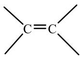 双键</td><td>乙烯  $CH_2=CH_2$ </td></tr><tr><td>炔烃</td><td>C≡C— 三键</td><td>乙炔  $CH≡CH$ </td></tr><tr><td>芳香烃</td><td>——</td><td>苯 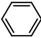</td></tr><tr><td>卤代烃</td><td>-X (X表示卤素原子)</td><td>溴乙烷  $CH_3CH_2Br$ </td></tr><tr><td>醇</td><td>-OH 羧基</td><td>乙醇  $CH_3CH_2OH$ </td></tr><tr><td>酚</td><td>-OH 羧基</td><td>苯酚 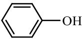</td></tr><tr><td>醚</td><td>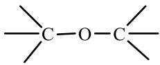 醚键</td><td>乙醚  $CH_3CH_2OCH_2CH_3$ </td></tr><tr><td>醛</td><td>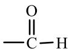 醛基</td><td>乙醛 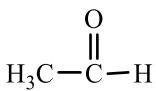</td></tr><tr><td>酮</td><td>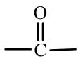 羧基</td><td>丙酮 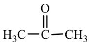</td></tr><tr><td>羧酸</td><td>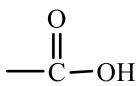 羧基</td><td>乙酸 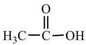</td></tr><tr><td>酯</td><td>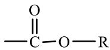 酯基</td><td>乙酸乙酯 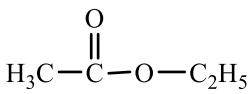</td></tr></table>

# 四、有机物的表示方法

# (1) 蛛网式

将电子式中所有共价键都用短线代替，一根线代表一对共用电子，并省略所有不参与成键的电子。例如：

![[01第一章有机概论学生版_images/8909303d8433f77413a3f200ebd6df5d54affe9e547648a1a53849553d624ea0.jpg]]

chemical

Structural formula of a branched alkane molecule with hydrogen atoms at each carbon and hydrogen atoms at the terminal carbon

蛛网式的特点是标明了所有共价键，而这也就导致了书写上的繁琐，对于较为复杂的分子，结构式还往往容易过于复杂难以辨认。

# (2) 结构简式

为了书写方便，将结构式中部分化学键（主要是横向的碳碳单键和碳氢单键）省略，有时还可以对结构中的某些部分进行简写而得到的式子，称为结构简式。结构简式写法简单灵活，是常用的表示方法。

$$
\begin{array}{c} \mathrm{CH} _ {3} \\ \mathrm{CH} _ {3} \mathrm{CH} _ {2} \mathrm{CHCH} _ {3} \end{array} \qquad \mathrm{CH} _ {3} \mathrm{CH} _ {2} \mathrm{CH} (\mathrm{CH} _ {3}) _ {2}
$$

# (3) 键线式

用折线代表分子骨架，每一个端点或拐点代表一个原子（若是除碳以外的原子则需标注原子符号)，两根单键之间或一根双键和一根单键之间的夹角为 $120^{\circ}$ ，一根单键和一根三键之间的夹角为 $180^{\circ}$ ，与碳直接相连的氢全部省略（碳氢单键也同样不标出），就得到键线式。键线式的最大优势是简洁清晰，当然同时也对使用者的理解能力有较高要求。常见分子的键线式表示可举例如下：

![[01第一章有机概论学生版_images/9e65fbfbe18749dbf5d45ce98c7044e5438d85db38a8c478140cd5a40a2acec4.jpg]]

chemical

Three organic molecular structures: vinyl, cyclohexene, and benzyl alcohol

# 五、烷烃

乙烷中的碳碳单键来自于碳原子的 $sp^{3}$ 杂化轨道的 $\sigma$ （头碰头）重叠。如果我们想象一下用 C-C 单键连接三个、四个、五个或更多碳原子，我们可以得到被称为烷烃的一大类分子。

![[01第一章有机概论学生版_images/c7126fc66f0f21a1e318465d0af00d91fc6bced5f34883593c13c32d240517e9.jpg]]  
甲烷

![[01第一章有机概论学生版_images/42e177065de6c44b1fbcf68400d1f11166677d0585de0959fb9e59dbda54d8da.jpg]]  
乙烷

![[01第一章有机概论学生版_images/0e8997a35630991795810dfc5b216b303040a013841a79724e349fe4b736fa6d.jpg]]

chemical

Structural formula of ethane molecule showing carbon and hydrogen atoms with single bonds

丙烷

![[01第一章有机概论学生版_images/f53ca26c9f86e87917ee82ecf267b3d3acd35c96d8aee7186f035bd339450658.jpg]]

chemical

Structural formula of ethane molecule showing carbon chain with hydrogen and alkyl groups

丁烷

烷烃是由碳氢两种元素组成，碳与碳、碳与氢均以单键相连的一大类化合物，因为它们只含有 C-C 单键和 C-H 单键，因此平均每个碳含有最多的可能含有的氢原子。分子中没有环的烷烃称为链烷烃，有环的称为环烷烃，链烷烃的通式是 $C_{n}H_{2n+2}$ ，n 是正整数。烷烃有时也被称为脂肪化合物，许多动物脂肪含有类似于烷烃的长碳链。

考虑一下碳和氢连接形成烷烃的形式。一个碳和四个氢只有一种可能结构：甲烷， $\mathrm{CH}_4$ 。类似地，两个碳和六个氢也只有一种连接方式（乙烷， $\mathrm{CH}_3\mathrm{CH}_3$ ），三个碳和八个氢也只有一种连接方式（丙烷， $\mathrm{CH}_3\mathrm{CH}_2\mathrm{CH}_3$ ）。然而当碳和氢更多的时候，就不止一种连接方式了。例如有两种物质有 $\mathrm{C}_4\mathrm{H}_{10}$ 的化学式：四个碳都在一条链上（丁烷）或存在分支（异丁烷）。类似地，有三种 $\mathrm{C}_5\mathrm{H}_{12}$ 分子，随着烷烃分子中碳原子数的增多，同分异构体的数目也随之增加。如：己烷 $\mathrm{C}_6\mathrm{H}_{14}$ 有 5 个异构体，庚烷 $\mathrm{C}_7\mathrm{H}_{16}$ 有 9 个异构体，十二烷 $\mathrm{C}_{12}\mathrm{H}_{26}$ 有 355 个异构体…。

![[01第一章有机概论学生版_images/f6fa530fc12ac3c9260f191dc49fb44ed1653fe36024525aa6906b9ea7419e55.jpg]]

chemical

Molecular structure of methane (CH₄) showing tetrahedral geometry with carbon and hydrogen atoms

${\mathrm{{CH}}}_{3}{\mathrm{{CH}}}_{2}{\mathrm{{CH}}}_{2}{\mathrm{{CH}}}_{3}$   
正丁烷

![[01第一章有机概论学生版_images/06b74cabe8adbd3abccc9f411e31476c9738846fd44c4d1b8d04fa037d931de6.jpg]]

chemical

3D ball-and-stick molecular model of ethylene (C2H4) showing carbon, hydrogen, and oxygen atoms in a chain structure

$CH_{3}$ $CH_{3}CHCH_{3}$   
异丁烷

![[01第一章有机概论学生版_images/7be11824f5cdc985513c7684747f10bd39ebd10365815e37a866bff1dfd8767a.jpg]]

chemical

Molecular structure of 2-butene showing carbon, hydrogen, and oxygen atoms in a chain with double bonds

${\mathrm{{CH}}}_{3}{\mathrm{{CH}}}_{2}{\mathrm{{CH}}}_{2}{\mathrm{{CH}}}_{2}{\mathrm{{CH}}}_{3}$   
正戊烷

![[01第一章有机概论学生版_images/634ea89c0042b677be8fd5d7ca4303d8bea238810ca00aee516167c17a827fd7.jpg]]

chemical

3D ball-and-stick model of a molecule with carbon, hydrogen, and oxygen atoms

$CH_{3}CH_{2}CHCH_{3}$   
异戊烷

![[01第一章有机概论学生版_images/0d268b245182e52c3bc5555dcf87a288d90501d1422f46d63d1339bda3c0345a.jpg]]  
$CH_{3}$ $CH_{3}CCH_{3}$ $CH_{3}$   
新戊烷

像丁烷和戊烷这样碳原子都连接在一条链上的化合物被称作直链烷烃，或正烷烃。像2-甲基丙烷（异丁烷）、2-甲基丁烷、2, 2-二甲基丙烷这样存在支链的化合物被称为支链烷烃。

像两种 $C_{4}H_{10}$ 分子与三种 $C_{5}H_{12}$ 分子这样有相同化学式但结构不同的化合物被称为异构体。异构体是含有相同数目相同类型原子但是原子位置不同的化合物。像丁烷和异丁烷这样所含原子连接方式不同的化合物被称为构造异构体。我们随后将会看到其他类型的异构体也是可能的，即使这些化合物中原子连接的方式也是相同的。随着碳原子个数的增加，可能的烷烃异构体的个数迅速增长。

构造异构并不只限于烷烃——它在有机化学中广泛存在。构造异构体可以有不同的碳骨架（如异丁烷和丁烷）、不同的官能团（如乙醇和二甲醚）、或者官能团的位置不同（如异丙胺和丙胺）。无论异构的原因是什么，构型异构总是有着相同化学式的不同性质的不同化合物。

# 六、烷烃系统命名法规则

烷烃的命名原则是各类有机化合物命名的基础。烷烃的命名采用两种命名法：普通命名法、系统命名法。

# 1、普通命名法

1～10 个碳原子的直链烷烃，分别用词头甲、乙、丙、丁、戊、己、庚、辛、壬、癸表示碳原子的个数，词尾加上“烷”。如 $CH_{4}$ （甲烷）、 $C_{2}H_{6}$ （乙烷）、 $C_{3}H_{8}$ （丙烷）、 $C_{10}H_{22}$ （癸烷）。10 个碳原子以上的烷烃用中文数字命名。如 $C_{11}H_{24}$ （十一烷）、 $C_{12}H_{26}$ （十二烷）、 $C_{20}H_{42}$ （二十烷）。

烷烃异构体可用词头“正（normal 或 n-）、异（iso 或 i-）、新（neo）”来区分。“正”表示直链烷烃，常常可以省略。

“异”表示末端为，此外别无支链的烷烃。

“新”表示末端为 CH₃，此外别无支链的烷烃。

$$
\mathrm{CH} _ {3} - \mathrm{CH} _ {2} - \mathrm{CH} _ {2} - \mathrm{CH} _ {2} - \mathrm{CH} _ {3}
$$

$$
\begin{array}{c} \mathrm{CH} _ {3} \mathrm{CHCH} _ {2} \mathrm{CH} _ {3} \\ \mid \\ \mathrm{CH} _ {3} \end{array}
$$

$$
\begin{array}{c} \mathrm{CH} _ {3} \\ \mathrm{H} _ {3} \mathrm{C} - \stackrel {!} {\mathrm{C}} - \mathrm{CH} _ {3} \\ \stackrel {!} {\mathrm{CH} _ {3}} \end{array}
$$

(正)戊烷( $n^{-}$ 戊烷)

异戊烷（iso-戊烷）

新戊烷(neo-戊烷)

★普通命名法只适用于一些直链或含碳原子数较少的烷烃异构体的命名。对于结构比较复杂的烷烃，就必须采用系统命名法。

# 2、系统命名法（IUPAC 命名法）

1892 年，日内瓦国际化学会议首次拟定了有机化合物系统命名原则，此后经 IUPAC 多次修订，所以也称为 IUPAC 命名法。我国根据这个命名原则，结合汉字特点，制定出我国的有机化合物系统命名法，即有机化合物命名规则。

烷烃系统命名法是将带有侧链的烷烃看作是直链烷烃的烷基取代衍生物, 所以在学习系统命名法之前先学习取代基的命名。

★烃分子中去掉一个氢原子，所剩下的基团，称为烃基；脂肪烃基用 R—表示；烷基的通式为 $C_{n}H_{2n+1}$ 。烷基的中文命名是把相应的烷烃命名中的“烷”字改为“基”字。其英文命名是将烷烃词尾的-ane 改为-y1，常见的烷基结构和普通命名法名称如下：

<table><tr><td> $CH_3—$ </td><td> $CH_3CH_2—$ </td><td> $CH_3CH_2CH_2—$ </td><td> $CH_3CH—|CH_3$ </td><td> $CH_3CH_2CH_2CH_2—$ </td></tr><tr><td>甲基</td><td>乙基</td><td>(正)丙基</td><td>异丙基</td><td>(正)丁基</td></tr><tr><td>methyl (Me)</td><td>ethyl (Et)</td><td>n-propyl (n-Pr)</td><td>iso-propyl (iso-Pr)</td><td>n-butyl (n-Bu)</td></tr></table>

烷基的系统命名法适用于各种情况，它的命名方法是：将失去氢原子的碳定位为1，从它出发，选一个最长的链作为主链，从1位碳开始，依次编号，不在烷基主链上的基团作为主链的取代基处理，。写名称时，将主链上的取代基编号和名称写在主链名称前面。

![[01第一章有机概论学生版_images/034c8f8bd5f7b294d178c82e9571b1bbc3f359556a3ae573596d2e296fc9278c.jpg]]

chemical

Structural formulas of three isomeric compounds: tert-butyl, isobutyl, and tert-butyl, with their chemical formulas shown below each.

IUPAC 1-甲基丙基 2-甲基丙基 1, 1-二甲基乙基

此外，两价的烷基称为亚基，三价的烷基称为次基。

![[01第一章有机概论学生版_images/5e19a0eba33cbce9c7f55d74eaafec4d097b96b38c0561fbe8aa15d19e8fa463.jpg]]

chemical

Structural formulas of three alkane groups: ethyl, ethyl-1, and ethyl-2

# ★顺序规则

有机化合物中的各种基团可以按照一定的规则排列先后次序，这个规则称为顺序规则，主要内容如下：

1. 将单原子取代基按原子序数大小排列，原子序数大的顺序在前，小的顺序在后，有机化合物中常见的元素顺序如下：

$$
\mathrm{I} > \mathrm{Br} > \mathrm{Cl} > \mathrm{S} > \mathrm{P} > \mathrm{F} > \mathrm{O} > \mathrm{C} > \mathrm{D} > \mathrm{H}
$$

2. 如果两个多原子基团的第一个原子相同，则比较与它相连的其它原子，比较时，按原子序数排列，先比较最大的，仍相同，再按顺序比较居中的，最小的。如- $CH_{2}Cl$ 与- $CHF_{2}$ ，第一个均为碳原子，再按顺序比较与碳相连的其它原子，在- $CH_{2}Cl$ 中为-C(Cl,H,H)，在- $CHF_{2}$ 中为-C(F,F,H)，Cl>F，故- $CH_{2}Cl$ 在前。如果有些基团仍相同，则沿取代链依次比较。

3. 含有双键或三键的基团，可认为连有两个或三个相同的原子。

如- $C\equiv CH>-C(CH_{3})_{3}$ ，再如醛基-CHO>1，1-二羟基甲基- $CH(OH)_{2}$

![[01第一章有机概论学生版_images/2ae6328bc2ae9154b03dc991b8aba835bc70049a5cea502a9d3b42e40cc38072.jpg]]

chemical

Three polymer chain structures with labeled functional groups: (C)(C), (C)(C), and (O)(C)

4. 若参与比较顺序的原子的键不到四个，则可以补充适量的原子序数为零的假想原子，假想原子的排序放在最后。

# ★烷烃系统命名法规则

（1）选主链：选择含有取代基最多的、连续的最长碳链为主链，有两条或多条等长的主链时，则根据侧链的数目来确定主链，多的优先。若仍无法分出，则考虑一下原则，侧链位次小的优先，各侧链碳原子数多的优先，侧分支少的优先。根据主链所含碳原子数命名为“某烷”。  
（2）编号：主链上若有取代基，则从靠近取代基的一端开始，给主链上的碳原子编号。当有多个取代基时，应该使取代基编号依次最小；在满足上一条件后，当两个不同取代基位于相同位次时，应使小的取代基编号较小。  
（3）命名：主链连有相同的取代基时，合并取代基，并在取代基名称前，用二、三、四等数字表明取代基的个数。并在最前面标明取代基的编号，各编号间用“，”隔开，数字与名称之间用“—”短线隔开。

主链上若连有不同的取代基，应按“次序规则”将取代基先后列出，较小基团应先列出。主要烷基的大小顺序是：异丙基>丙基>乙基>甲基；在英文命名中，取代基是按字首的字母排列顺序先后列出。

![[01第一章有机概论学生版_images/82cb1c224576f55567e065a797cc060e41d00385af1225039b34759f7fe49568.jpg]]  
3-甲基己烷

![[01第一章有机概论学生版_images/67e02458712af32a5648daa0ef494c99b57de3d5b7ba92bf6813d59441f9d132.jpg]]

chemical

Chemical structure of a branched alkane with numbered carbon atoms and methyl groups

4,7-二甲基-3-乙基壬烷

![[01第一章有机概论学生版_images/3528b01035d1ea1fa9360ed84eb43e950a195dcef90255bb116267c7064691db.jpg]]  
2-甲基-3-乙基己烷

![[01第一章有机概论学生版_images/01c9eb40fa87ae61e8b9531234f4cb6efcf93ce43602bec870830a6ecff86858.jpg]]

chemical

Chemical structure of a branched alkane with numbered carbon atoms and methyl groups

3-甲基-4-乙基庚烷

![[01第一章有机概论学生版_images/cdbdbb2582a1e55352edf33860b338f459d5c80e7620ea786cca0dc311130944.jpg]]  
2,4-二甲基-3-乙基己烷

伯（一级，1°）、仲（二级，2°）、叔（三级，3°）、季（四级，4°）是指某个碳原子上所连接的碳原子的个数。另外，我们也会说氢原子是伯、仲、叔的。伯氢是连接在伯碳（RCH₃）上的氢、仲氢是连接在仲碳（R₂CH₂）上的氢、叔氢是连接在叔碳上的氢（R₃CH）。

# 习题

习题 1.为什么不会有分子式为 $C_{2}H_{7}$ 的有机分子？

习题 2. 将下列结构转化为骨架画法:

![[01第一章有机概论学生版_images/9d9119e84cb103c7c4afc7ff82a15452953b79e527df6bb5ffc5982e5ca1d6f6.jpg]]

chemical

Chemical structure of a substituted pyrimidine derivative with carbon and hydrogen groups

吲哚

![[01第一章有机概论学生版_images/8778848a5b718e47c7aaaaabcb5f7dd5db9f5504bc95d64b24c8116b9913cc0f.jpg]]

chemical

Chemical structure of a diene molecule with carbon and hydrogen atoms labeled

1,3-戊二烯

![[01第一章有机概论学生版_images/76038dad6e8e41607522e0bf5bcd5d1e5e2d10ff3ae0cc039fcc6d45e4fe57cd.jpg]]

chemical

Chemical structure of a substituted cyclohexane with chlorine and hydrogen groups

1,2-二氯环戊烷

![[01第一章有机概论学生版_images/c9c032b4eeca38cfc0bba24e8a41b2a2dbe440496b9b6c9f64d76081b28aa5e1.jpg]]

chemical

Chemical structure of a cyclic ester with four hydroxyl groups and carbonyl groups

苯醌

习题 3. 说出下列物质中每个碳分别连了多少个氢，并给出分子式：

![[01第一章有机概论学生版_images/55c74b769595ae8e230c8fcdf683466508aacfe98cea0df3ff1bf03333beb4bb.jpg]]

chemical

Chemical structure of a substituted benzene ring with ethyl and vinyl groups

![[01第一章有机概论学生版_images/54f2ed7e7ca458793b286f4926306e840566536598f86033473f007ed88640e2.jpg]]

chemical

Chemical structure of a brominated naphthalene derivative with an ester group

![[01第一章有机概论学生版_images/2a3d19ca4ad86ce71da451bf5cbc443454c8971cbef1e04605d11c6fa10290a6.jpg]]

chemical

Chemical structure of a fused bicyclic ketone with a cyclopentenone ring, labeled (c)

习题 4. 指出下列分子中的官能团。

![[01第一章有机概论学生版_images/440f2f6de5ad91d94b004b9da88dc53e35bec6b50e0fb8aa2eb3014560e03a31.jpg]]

![[01第一章有机概论学生版_images/3830599204e977ab02e47899de0bb7542256acdc7bde07e86c2a373cb7d583d7.jpg]]

![[01第一章有机概论学生版_images/52ed355e16185b87f1d0cb6cfc262a1226a2d85490a452cea83ec56b5277f24c.jpg]]

![[01第一章有机概论学生版_images/252b4671d09cebebf05a2f4efa7084b4e509245dbb2fccb5e0b3674342936c72.jpg]]

![[01第一章有机概论学生版_images/1f543c8d6afc783f026e442b2b5f15f7e69ef8c028ac2e2b0249db19c69d7e15.jpg]]

![[01第一章有机概论学生版_images/1871cec6ecaa2dbf227b33d0e9a8615071da59125cff53f7bbb55e25bf36a65f.jpg]]

习题 5.画出下列结构:

(a) 2-甲基庚烷

(b) 2,2-二甲基-4-乙基己烷

(c) 3,4-二甲基-4-乙基辛烷

(d) 2,4,4-三甲基庚烷

(e) 2,5-二甲基-3,3-二乙基壬烷

(f) 3-甲基-4-异丙基庚烷

习题 6. 画出八种 5 碳的烷基（戊基的异构体）。

习题 7. 命名下列化合物:

![[01第一章有机概论学生版_images/b98fa8671e60a669bf30ac2e4b064110a009094048c7ce0b41b8a51949c840c6.jpg]]

![[01第一章有机概论学生版_images/e92ce9d2a62b3b77eaf636be7c122538e6a3d9f9bf3d8f50167d7aa0e870ffe5.jpg]]

![[01第一章有机概论学生版_images/b6ba9de89bae1c7f617171f4ffe71615398366b06c3d0a44986eb0acf6eeb8b6.jpg]]

![[01第一章有机概论学生版_images/a63dc62b0c7ae4ba4857a33a0e7cad84a352893a3f6d18ead470b4616bf51c95.jpg]]

![[01第一章有机概论学生版_images/2726709410801a61e2eb2086a4e19fe4b15b8c6742c9b835c3f7811b56f014de.jpg]]

![[01第一章有机概论学生版_images/83237227ba5c81a27a09c414f915d1f15996ef48b3bbdfe68180a56f5f3c9da8.jpg]]

习题 8. 命名 $C_{6}H_{14}$ 的五个异构体。

习题 9. 画出这样的化合物:

(a) 只有一级和三级碳  
(b) 没有二级和三级碳  
(c) 有四个二级碳

习题 10. 画出这样的化合物:

(a) 有九个一级氢

(b) 只有一级氢

习题 11. 算出下列化合物的经验式

(1) C 38.7%, H 9.7%, O 51.6%   
(2) C 33.6%, H 5.6%, C 49.6%, O 11.2%   
(3) C 71.3%, H 6.7%, N 4.9%, O 16.8%

习题 12. 如碳原子的四个键排列在一个平面上，即碳原子位于正方形的中心，四个价指向正方形的四个顶点， $CH_{2}Cl_{2}$ 可能有几种异构体。

习题 13. 写出下列物质的分子式

![[01第一章有机概论学生版_images/93825db9acdf1f667708b80efd53931d33a7206c744a70942464dd173e1fbb29.jpg]]

习题 14. 写出己烷 $C_{6}H_{14}$ 的五种异构体的构造式，将仲碳原子和叔碳原子分别用圆圈和方块标示出来，并系统命名。

习题 15. 下列构造式中哪些代表同一化合物？请系统命名各化合物

(1) $CH_{3}CHCH_{2}CHCH_{3}$

(2) $\mathrm{C}(\mathrm{CH}_2\mathrm{CH}_3)_4$

(3) $\mathrm{CH}_3(\mathrm{CH}_2)_2\mathrm{CH}(\mathrm{CH}_3)_2$

(4) $\mathrm{CH}_3\mathrm{CH}_2\mathrm{C}$ $(\mathrm{CH}_2\mathrm{CH}_3)_2\mathrm{CH}_2\mathrm{CH}_3$

(5) $CH_{3}CHCH_{2}$ $CH_{2}CH_{3}$

(6) $(\mathrm{CH}_3)_2\mathrm{CHCH}_2\mathrm{CH}(\mathrm{CH}_3)_2$

(7) $\begin{array}{c}CH_{3}\\ CH_{3}CCH_{2}CH(CH_{3})_{2}\\ CH_{3}\end{array}$

$CH_{3}$ (8) $CH_{3}CHCH_{2}C(CH_{3})_{3}$

习题 16. 写出下列各化合物的结构式:

(1)3,3-二乙基戊烷

(2)2,4-二甲基-3,3 二异丙基戊烷

(3)2,2,3-三甲基丁烷

(4)四甲基丁烷

习题 17 下列各组物质中，组内各种物质都属于烃的是（）

A $CH_{4}$ 、 $C_{2}H_{6}O$ 、 $CH_{3}Cl$

B $\mathrm{C_{100}H_{202}}$ 、 $\mathrm{C_6H_6}$ 、 $\mathrm{C_2H_2}$

C $H_{2}O_{2}$ 、 $CH_{4}$ 、 $C_{2}H_{6}$

D $\mathrm{C_2H_4}$ 、 $\mathrm{CH}_4$ 、 $\mathrm{C_6H_5NO_2}$

习题 18 在烷烃同系物中，含碳元素质量百分率最大应接近于（）

A 75%

B 80%

C 85.7%

D 92.3%