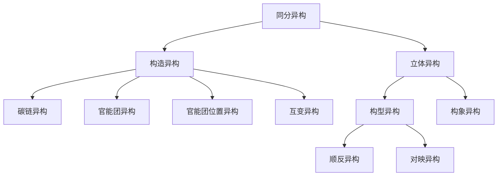

# 第三讲 立体化学

# 一、异构现象

同分异构现象主要分为两种：构造异构和立体异构。构造异构是分子中所含原子连接方式不同。而立体异构是原子连接方式相同，但原子在三维空间中的排布方式不同。

![[03第三章立体化学学生版_images/7e358d5d33cd410591c10ce3b243a9500c270aedf1d729b818f08095d88aec50.jpg]]

flowchart

# 二、对映异构

![[03第三章立体化学学生版_images/e360dbff27c180b57f1ecf04f42ab8999ca15c76671bb213d9160bfa68d343f2.jpg]]

chemical

Molecular structures of three acrylate groups: CH₃X, CH₂XY, and CHXYZ, shown with ball-and-stick models.

$CH_{3}X$ 和 $CH_{2}XY$ 分子和它们的镜像相同，因此是非手性的。如果你对每一个分子做它们和它们的镜像的模型，你会发现你可以令二者完全重合，所以所有原子是一样的。相比之下，CHXYZ 分子和它的镜像并不相同。你不能令它的模型和它镜像的模型重合，就像你不能把左手和右手重合一样：它们实际上是不同的。

与自己的镜像不能重合的分子被称为是手性的。和其镜像不相同的分子被称为对映异构体。实物和镜象是一对对映体。

连有四个不同基团的碳原子是最为普遍的产生手性的原因——这样的碳被称为手性中心（手性碳、不对称碳原子）。

许多药物和我们身体中几乎所有分子——氨基酸、碳水化合物、核酸，等等——都是手性的。分子手性令酶和底物精密地结合，这一过程在数千个作为生命基础的化学反应中出现。

当偏振光通过含有手性分子的溶液时，偏振光旋转了一个角度 $\alpha$ 。这个特性被称作光学活性。对映异构体，又叫光学异构体，有相同的物理特性如熔沸点，但溶液对偏振光的旋转方向不同。

一对对映异构体是两种不同的化合物，它们的物理性质、化学性质（非手性条件下）并无差别，差别是对偏振光有不同的反映。一个可以把偏振光向左旋，另一个则把偏振光向右旋。偏振光是检验手性分子的一种最常用的方法。

# 三、分子的手性与对称性

分子与其镜象是否能互相叠合决定于分子本身的对称性。即分子的手性与分子的对称性有关。我们讨论常见的对称元素：对称面、对称中心和旋转轴。

# 1 对称面（σ）

定义：若有一个平面，能将分子切成两部分，一部分正好是另一部分的镜象，这个平面就是这个分子的对称面， $CH_{2}Cl_{2}$ 有两个对称面：

![[03第三章立体化学学生版_images/697c1aa6136c5de75e4686eec41f6e7bdf4340ba9e09c8da0647c7144f6adbd8.jpg]]  
$\sigma_{1}$ : H-C-H   
$\sigma_{2}$ : Cl-C-Cl

可看出 H-C-H 平面上下翻转 180 度，实物和镜象重叠。它们是一种化合物。

![[03第三章立体化学学生版_images/de4c6f40aaf455d19e777514c566fad7195d52c84a791fb3b34647f0139be6c5.jpg]]

分子中有一个对称面。

![[03第三章立体化学学生版_images/a3cc6de9c55b48462dbf09dd39b7d4a2ab5d89802d40d6962b114530075a3617.jpg]]

三元环所在平面左右翻转 180 度，实物和镜象重叠。

![[03第三章立体化学学生版_images/3872da4813f0db6647877f7d3b611a017711ce1e0c1d0a2658172c94b1d21b08.jpg]]  
1 个 σ

![[03第三章立体化学学生版_images/c477ee6a57acf02dcd0fe59505a238dcf7664e1a7bb27da731141ded929373eb.jpg]]

chemical

Structural formula of 2-methylcyclopropane (isopropanol)

2 个 σ

![[03第三章立体化学学生版_images/a48a17f05a5aeefd154bb0f394d93820b40745a0487396c5e828823b1917a2ae.jpg]]  
无数个 $\sigma$

结论：有对称面的分子，实物和镜象能重叠，无手性，无对映异构体，无旋光性。

# 2 对称中心(i)

定义: 分子中有一点 P，以分子任何一点与其连线，都能在延长线上找到自己的镜象，则 P 点为该分子的对称中心。

![[03第三章立体化学学生版_images/156f04ed49b0a2c2df5aa8a72d2b9bd5dbc0387abfb6ed03cbf74625dfc6a1cc.jpg]]

chemical

Simple 3D molecular structure with hydrogen atoms and a green atom at one vertex

![[03第三章立体化学学生版_images/fadaf336348e34cfdecc615e90d87e3f5c450b9db34dc1c27e68652f5bc195a6.jpg]]

chemical

Simple molecular structure diagram of pentane (tetrahedron)

![[03第三章立体化学学生版_images/f3975675d9311c0900235c90c83d73fa21a560c58533605960aeb11f08e7440e.jpg]]

chemical

Chemical structure diagram of a fluorinated organic compound with chlorine substituents and hydrogen atoms

有对称中心

![[03第三章立体化学学生版_images/6da6f040ba26ec0f3cfdec689618a3be194c63f471be49fc991d531d092b5e50.jpg]]

chemical

Chemical structure of a fluorinated cyclohexane with chlorine and hydrogen substituents

镜象和实物能重叠，无手性

结论：有对称中心的分子，实物和镜象能重叠，无手性，无对映异构体，无旋光性。

# 3 旋转轴 ( $C_{n}$ )

定义：穿过分子画一直线，以它为轴旋转 $360^{\circ}/n$ 角度后，可以获得于原来分子相同的构型，这一直线叫 $C_{n}$ 轴。

![[03第三章立体化学学生版_images/8b4bad76caef8233937ebbe0ffc7f669c7ec17429b15af8a2a13675ee942c076.jpg]]

chemical

Chemical structure diagram of a carbon-carbon double bond with hydrogen atoms and C4 group

![[03第三章立体化学学生版_images/1a823fa579159f58996ac91ec67c465e48776a3a353fb290f63cef2e9d9ed383.jpg]]

chemical

Molecular structure of chlorine (Cl) showing carbon, hydrogen, and chlorine atoms with bonds

![[03第三章立体化学学生版_images/a7a1b7cdb8c739820daef2a5687c393d80e3b24cd3c4ab8d166c0e8904908cdd.jpg]]

chemical

Chemical structure of a dichlorinated alkene with two chlorine substituents and a central carbon atom bonded to two hydrogen atoms

![[03第三章立体化学学生版_images/7b239607db1a48757ab88d6cf4bb221e97e9b05c4711a5e7bc68c13f781dc379.jpg]]

chemical

Chemical structure diagram showing two identical organic molecules with chlorine substituents and hydrogen atoms, connected by single bonds.

镜象和实物不能重叠，用旋光仪测定，一个是左旋，另一个则是右旋，是两种化合物。

结论：对称轴不能作为分子有无手性的判据。

# 4. 结论

判断一个分子有无手性，一般只要判断这个分子有没有对称面、对称中心，若既没有对称面又没有对称中心，那么这个分子有手性，有对映异构体，有旋光性；若分子中有对称面或者有对称中心，则这个分子无手性。

# 四、R、S 命名

使用 R、S 来标出手性碳原子的构型。首先根据顺序规则来对手性碳原子上的四个基团进行排序。

把手性碳上的四个基团排好序之后，我们通过将序号最靠后的基团（d）放在正后方，远离我们的分子摆放方式，来描述围绕着这个碳的立体化学构型。我们接着看剩下三个取代基，现在它朝着我们伸出来，就像一个方向盘一样。如果从最靠前的取代基到次靠前的取代基到第三靠前的取代基的弯箭头（a→b→c）是顺时针的，那么我们就说这个手性中心是 R 构型。如果从 a→b→c 的箭头是逆时针的，该手性中心是 S 构型。

![[03第三章立体化学学生版_images/fefbbb53cc0d99b8a0babd358cf6898852c049f72867f841838603a3bd6db811.jpg]]

# 五、Fischer 投影式

虽然用球棍模型来表示立体构型很清晰，但并不方便。而 Fischer E 最早建议的投影式至今还是表达立体构型最常用的一种方法。画 Fischer 投影式有以下规定：

1. 碳链要尽量放在垂直方向上，氧化态高的在上面，氧化态低的在下面。其他基团放在水平方向上。  
2. 垂直方向碳链应伸向纸面后方，水平方向基团应伸向纸面前方。  
3. 将分子机构投影到纸面上，用横线与竖线的交叉点表示碳原子。

如 R-乳酸按下面的过程画出 Fischer 投影式:

![[03第三章立体化学学生版_images/2285dd434c1dce912cce930fc06ad9966421e1732a9c52123bfd911f412c57aa.jpg]]  
楔形式

![[03第三章立体化学学生版_images/ade8831ca02f6e2cee9c6cb5dc79bbb84165a4b48d0f79eda9988c0a4a6988d2.jpg]]  
立体透视式

![[03第三章立体化学学生版_images/4cc13ca883ad22a9b5b62f930a303f13872d2d8f3fe0159d0badd0c7a8a91c87.jpg]]  
一般投影式

![[03第三章立体化学学生版_images/5f18919d72c437a883ed0aebf39d3284560d8acc2ec2a61f5ec3c0c247c04b81.jpg]]  
Fischer 投影式

Fisher 投影式不能在平面上旋转 $90^{\circ}$ ，也不能离开纸面翻转 $180^{\circ}$ 。Fischer 投影式中的基团两两交换的次数不能为奇数次。

# 六、非对映异构体、内消旋体、外消旋体

当分子有不止一个手性中心时，情况就会变得更加复杂。一个基本原则是一个有 n 个手性中心的分子最多可以有 $2^{n}$ 个立体异构体。

2-氨基-3-羟基丁酸的四个立体异构体能够被分成两对对映异构体。2R，3R 立体异构体是 2S，3S 立体异构体的镜像，而 2R，3S 立体异构体是 2S，3R 立体异构体的镜像。但是并不是镜像的立体异构体之间是什么关系呢？例如 2R，3R 立体异构体和 2R，3S 立体异构体之间是什么关系呢？它们是立体异构体，但它们不是对映异构体。为了描述这种关系，我们需要一个新术语——非对映异构体。

![[03第三章立体化学学生版_images/78a5946bf32c6474559140307aa60956758ed835e46adcbebfa09b056669b2ff.jpg]]

chemical

Chemical structure of a dihydropyran with labeled functional groups: CO₂H, NH₂, OH, and CH₃

2R,3R

![[03第三章立体化学学生版_images/a92267f648b67ee0fd6a6b3d3e39bdfeebcbe52dc080e967b9b5b7517f209d3c.jpg]]

chemical

Molecular structure of a diol compound with labeled atoms and functional groups

2S,3S

![[03第三章立体化学学生版_images/c7ad59cbe9e23702b9065456ab4a4e9df8d3a59a69873ea0bffc0da6c81e40ba.jpg]]

chemical

Molecular structure of a dihydropyran with labeled atoms and functional groups

2R,3S

![[03第三章立体化学学生版_images/4a87fdda795fc5e328c89f03cebcd3ccf001d5a73e6bbe12098acbf8779cf212.jpg]]

chemical

Chemical structure of a diol compound with amino, carboxyl, hydroxyl, and methyl substituents

2S,3R

非对映异构体是不为镜像的立体异构体。就像我们使用右手/左手的类似关系来描述两个对映异构体之间的关系那样, 我们可以延伸这种类似关系来描述非对映异构体就像不同人的手一样。你的手和你朋友的手看起来类似, 但是它们不一样, 也不是互为镜像。这些对于非对映异构体也是对的: 它们很像, 它们不一样, 它们不互为镜像。

要细心地注意对映异构体和非对映异构体的区别: 两个对映异构体的所有手性中心构型相反, 而两个非对映异构体一些 (一个或多个) 手性中心构型相反, 但其他的手性中心构型相同。

在某些特殊的情况下两个非对映异构体只有一个手性中心不相同，其他都相同，这种化合物叫做差向异构体。

包含手性中心的非手性化合物被称为内消旋体。例如酒石酸的一个立体异构体中，虽然含有两个手性中心，但其含有对称面，因此是非手性的。

![[03第三章立体化学学生版_images/b99a7bd823b33d7afac8a84b4cd9c8dc5d3e74460d7d1d6ce7b61d1321e5bb4d.jpg]]

chemical

Molecular structure of a diol with two hydroxyl groups and two CO₂H groups attached to the carbon bridge

一对对映异构体等量的混合物被称为外消旋体。二者对偏振光的偏转正好互相抵消，表面上不显示出光学活性。但通过一些方法，可以将两种对映异构体分开。

例：三羟基戊二酸的 3 号碳有无手性要具体分析。

2 号碳、4 号碳不能说它们是相同的还是不同的手性碳，因为 2 号碳、4 号碳也有 R、S 之分。

它有四种立体异构体:

![[03第三章立体化学学生版_images/e84a56a843e31b12ccce4e0d6f104dd0b7b92ec236b84b2d8714bc01e9395597.jpg]]  
3 号碳无手性  
(2R, 4R)

![[03第三章立体化学学生版_images/13a92b0648e44260e6f8d6fcec0ea21034dc44d3f811f56e217dca4346046d33.jpg]]  
3 号碳无手性  
(2S, 4S)

![[03第三章立体化学学生版_images/c983a0f487a6349f72be7b2a60e36b31b3df0420a3ae0ee1ae0319a85a0f451b.jpg]]  
3 号碳有手性  
(2R, 3r, 4S)

![[03第三章立体化学学生版_images/1c045357596f49a0729d7c127f69b5f081910a7db7aab5b97a510ecbc82bd0af.jpg]]  
3 号碳有手性  
(2R, 3s 4S)

假不对称碳原子：一个碳原子（A）若和两个相同取代的不对称碳原子相连而且当这两个取代基构型相同时。该碳原子为对称碳原子，而若这两个取代基构型不同时，则该碳原子为不对称碳原子，则（A）为假不对称碳原子。假不对称碳原子的构型用小 r，小 s 表示。在判别构型时，R > S，顺>反。

# 习题

习题 1. 按照顺序规则对下列各组取代基排序:

(a) $-CH=CH_{2}, -CH(CH_{3})_{2}, -C(CH_{3})_{3}, -CH_{2}CH_{3}$   
(b) $-\mathrm{C}\equiv \mathrm{CH}, -\mathrm{CH} = \mathrm{CH}_2, -\mathrm{C}(\mathrm{CH}_3)_3,$   
(c) $-CO_{2}CH_{3}, -COCH_{3}, -CH_{2}OCH_{3}, -CH_{2}CH_{3}$   
(d) $-C\equiv N, -CH_{2}Br, -CH_{2}CH_{2}Br, -Br$

习题 2. 标出下列分子的手性中心的构型是 R 还是 S:

![[03第三章立体化学学生版_images/399242032c32fab8ebc3951bf5f2c7f1e2cfac29e92d5f6fd4a7cd0ff28b3a84.jpg]]

![[03第三章立体化学学生版_images/098d22a7bee4263d3fe607fc1ee47b14464b7c9ae5cbc7d2603a728ae4b8fb83.jpg]]

![[03第三章立体化学学生版_images/921c5d5f6a9a87331fba8c64a019567c08dd3601c79d1bc0545dbd472d08831e.jpg]]

习题 3. 标出下列分子中手性中心的构型是 R 还是 S:

![[03第三章立体化学学生版_images/0303c1fd4ed5b17394c314e40a7dcd3bea08a9788e3f68ac4aff45a15f9a63ba.jpg]]

![[03第三章立体化学学生版_images/3d4d2b7c9cba91150d124e16fb8f8db0d12548b47cec377edb07d5bc0e776bc3.jpg]]

![[03第三章立体化学学生版_images/9345fa6562723e9501dc1c0e5cb899d23060b2f48c56d4f3e8327cba24df361e.jpg]]

习题 4. 标出下列分子中每个手性中心的构型是 R 还是 S:

![[03第三章立体化学学生版_images/80978775c0709991c8cc86a3e9652c5be732ab7bce10245e251d57462873e254.jpg]]

![[03第三章立体化学学生版_images/2078f1e5594be77fdbb18ca76f790402b549767411d15fe3aead89b236d8e575.jpg]]

![[03第三章立体化学学生版_images/a051d5a30c9e8fbf20bc2e3ee5497c0464331acf5dd607f9f196e429fad3a189.jpg]]

习题 5. 下面哪些结构是内消旋化合物?

![[03第三章立体化学学生版_images/d7ded177995518a40e3dff02ac82b2acca442daa9695e87b20ff4b009344daed.jpg]]

![[03第三章立体化学学生版_images/7463df86a985716592fef3cf297219b495babd9672abc601d857295016a60b1f.jpg]]

![[03第三章立体化学学生版_images/d867b58ee392a42412a63b2ed50e153e007f85b2df1647c71e8562f4b825cb25.jpg]]

chemical

Chemical structure of a cyclohexane derivative with methyl and hydrogen substituents

![[03第三章立体化学学生版_images/9bdcd755960d3b97227ffbb69d1b97523ac3302c6ea907950f57947a3743d482.jpg]]

chemical

Chemical structure of a brominated alkane with methyl and hydrogen substituents

习题 6.（S）-2-甲基-1-氯丁烷与 $Cl_{2}$ 发生光照诱导的反应，生成 2-甲基-1,4-二氯丁烷和 2-甲基-1,2-二氯丁烷的混合物。

（a）写出反应式，标出反应物正确的立体化学。  
（b）两个产物其中一个是光学活性的，另一个是非光学活性的。哪个是光学活性的？哪个是非光学活性的？

习题 7 写出 2,3,4-三羟基丁醛的四种异构体中各个不对称碳原子的构形（R 或 S）

习题 8 推测下列化合物有无手性，如有手性，写出其对映体。

![[03第三章立体化学学生版_images/721ec111ec866bfa43b61267324013f972773832f83d4fc334cf1a853cf6b93d.jpg]]

chemical

Chemical structure diagram of a fused bicyclic compound with fluorine substituents

![[03第三章立体化学学生版_images/04c522e66149f72af41b215ac0ad61b85af4d96ae2e52152d0476b9403d6b204.jpg]]

![[03第三章立体化学学生版_images/aed7066010d9228fde53925f046e277fda4f79551ec17341996e2de880ebe017.jpg]]

![[03第三章立体化学学生版_images/93cc69012ae227a8783ef83174cdb82282568974ca20a1ffb6bc611ccd172fe2.jpg]]

![[03第三章立体化学学生版_images/a84cc89d1825fdf89d1d6881fc97ea0f631bab28bea49600a3ebc43705c81e89.jpg]]

chemical

Chemical structure of a substituted cyclohexane with methyl group

![[03第三章立体化学学生版_images/e7c3807182d7707d547e9c15af5440d7a5bf806d8b471d4cbd96b823ac71fee2.jpg]]

chemical

Molecular structure of 1,3-butadiene showing two hydrogen atoms and a cyclohexane ring with double bonds

![[03第三章立体化学学生版_images/f4266c95c494885c748d44d31151f3b94f0fa6edb7f6fb86dc24a1f072812bbb.jpg]]

chemical

Chemical structure of a bridged bicyclic compound with cyclohexane and chlorinated alkyl chains

![[03第三章立体化学学生版_images/f5d847575114eaa46e5435085d58f5449bebf62fc63d4fb9a4afcbbfb0934f5a.jpg]]

chemical

Chemical structure of a brominated cyclohexane derivative with a carbonyl group

![[03第三章立体化学学生版_images/b2fabbcccfa7f924f96b4aadbf335f015f78747dcf10b51139a06a13edb30532.jpg]]

chemical

Chemical structure of a carbonyl compound with hydroxyl and methoxy substituents

习题 9 判断下列化合物是否有光活性？请标明不对称碳原子的构型。

![[03第三章立体化学学生版_images/51fcc70c6903fdc280611b69a335d1345661ab3d0a22b8ac79707f880d1d363a.jpg]]

chemical

Chemical structure of a diene with methyl and iodine substituents

(i)

![[03第三章立体化学学生版_images/b26e348c8d3119d827b50bb0d63ec063072544676af888ed8a63610a6b91b64d.jpg]]

chemical

Chemical structure of a brominated hydrocarbon chain with hydroxyl and vinyl groups

(ii)

![[03第三章立体化学学生版_images/a5e9986ab41d7b518e92be304843a6dd8b8e8baf7142b0c678b30a9969887b46.jpg]]

chemical

Chemical structure of a brominated hydrocarbon with hydroxyl and bromine substituents

(iii)

![[03第三章立体化学学生版_images/360eeb6c028021d2e8425e51e669ce93f3bb018a3979d16891c5b9f23d492679.jpg]]

chemical

Chemical structure of a diol compound with hydroxyl and chlorine substituents

(iv)

习题 10 $\alpha$ -蒎烯具有下列的结构，它们的分子中有几个不对称碳原子？有几个光活性异构体存在？写出这些光活性异构体的结构式（或构象式），并标明手性碳原子的构型。

![[03第三章立体化学学生版_images/4f8d5d0fc443bae9dafe168126f590f652a4494a7b9b529559d0d1be2981aabd.jpg]]

natural_image

Simple line drawing of a 3D cube with vertical and horizontal lines, no text or symbols present.

