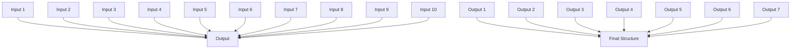

# 第四讲 烯烃

烯烃是含有碳碳双键的碳氢化合物。由于烯烃有双键，因此它比同碳数的烷烃的氢要少。烯烃的通式是 $C_{n}H_{2n}$ ，而烷烃则是 $C_{n}H_{2n+2}$ ，因此烯烃被称为是不饱和的。例如乙烯的化学式是 $C_{2}H_{4}$ ，而乙烷是 $C_{2}H_{6}$ 。

# 一、不饱和度

通常地，分子中的每一个环或双键对应着从同碳数的烷烃中失去两个氢。知道这个关系之后，就可以从分子式反向计算分子的不饱和度——分子中环和/或多重键的数量。

有机卤化物（C、H、X， $\mathrm{X} = \mathrm{F}$ 、Cl、Br、I）卤素取代基在有机分子中取代了氢的位置，因此我们可以把卤素和氢的个数加起来作为一个等价的碳氢化合物的分子式，这样就能够得到不饱和度了。例如，分子式 $\mathrm{C_4H_6Br_2}$ 和是 $\mathrm{C_4H_8}$ 等价的，因此对应于不饱和度一。

有机氧化物（C、H、O）氧形成两条键，因此它不影响等价的碳氢化合物的化学式，所以在计算不饱和度时可以忽略它。如果你不太放心，可以看看当氧原子插入到烷烃的化学键中时会发生什么：C-C变成了C-O-C，或者C-H变成了C-O-H，氢的个数并没有发生变化。例如分子式 $C_{5}H_{8}O$ 和 $C_{5}H_{8}$ 对应不饱和度二。

有机氮化物（C、H、N）氮形成三条键，因此有机氮化物比对应的含有相等碳原子的有机物多一个氢。因此我们从氢数中减去氮原子的个数，就得到了等价的碳氢化合物分子式。

不饱和度计算：对于分子式为CmHnNwXxYy(X=卤素原子，Y=O或S)

$$
\Omega = \mathrm{m} + 1 - (\mathrm{n} + \mathrm{x} - \mathrm{w}) / 2
$$

# 二、烯烃的结构

![[06第四章烯烃学生版_images/84a82c796e2397c0a3f5c177f99877834225bc5b324c95853b7e6f6557a5b1c5.jpg]]

chemical

Molecular orbital diagram showing electron density and spin squared orbitals in a carbon-carbon bond system

![[06第四章烯烃学生版_images/2ce4f85310fda9f278ae854bc91974aced412482b885949112ba6fa3ea1e31e1.jpg]]

chemical

Molecular orbital diagram showing π bonding between two C atoms with H ligands

杂化轨道理论认为，烯烃中双键碳原子是 $\mathrm{sp}^2$ 杂化的，有三个等价的 $\mathrm{sp}^2$ 杂化轨道处于同一平面上，相互成 $120^\circ$ 角，未参与杂化的p轨道与该平面垂直。两个碳原子各用一个 $\mathrm{sp}^2$ 杂化轨道通过轴向“头碰头”重叠形成一条σ键，通过未杂化p轨道“肩并肩”重叠形成一条垂直于 $sp^{2}$ 平面的π键。

C=C键的平均键能为 $610.9\ kJ\cdot mol^{-1}$ ，C—C σ键平均键能为 $347.3\ kJ\cdot mol^{-1}$ ，因此π键的键能大约为 $263.6\ kJ\cdot mol^{-1}$ 。

$\pi$ 键的特点是：i.容易断裂。因为 $\pi$ 键是通过侧面重叠形成的，重叠程度小于 $\sigma$ 键，所以较易断裂；ii.不能绕轴自由旋转。因为旋转变会使两个p轨道离开平行状态，从而破坏p轨道电子云的重叠。

![[06第四章烯烃学生版_images/037a3d8cc3774a4983613826d42adf68ea0e8401196bf493f017ce9e068c6f6c.jpg]]

chemical

Three molecular structures showing carbon-carbon double bonds, likely isobutylene or ethylene

2-丁烯中的两个甲基可以在双键的同侧或不同侧。因为不能发生键的旋转，两个2-丁烯不能自发地相互转化；它们是不同的，可以分离的化合物。这样的化合物叫做顺反异构体。取代基在同侧的叫做顺-2-丁烯，在不同侧的叫做反-2-丁烯。

顺反异构并不只是在二取代烯烃中出现。只要两个双键都连接有不同的取代基，就会出现顺反异构。如果一个双键碳原子上连接了两个相同的官能团，顺反异构就不会出现。

![[06第四章烯烃学生版_images/3c2c7376d19f6562bf06ba925b15ccecbfc63c501b733b1fc4085bd836efdabe.jpg]]

chemical

Two chemical structures showing carbon and hydrogen atoms with labeled bonds and substituents

双键 Z/E 构型的确定

Z/E 的确定:

（1）按官能团顺序规则分别比较 A 与 B 和 D 与 E。

(2) 若较大的取代基在同侧 (如 $A > B$ 且 $D > E$ ), 则为 $Z$ , 若较大的取代基在异侧 (如 $A > B$ 且 $E > D$ ), 则为 $E$ 。(口诀: $Z$ 同 $E$ 异)

# 三、烯烃的稳定性

1、反式比顺式稳定：

虽然烯烃的顺反异构体不会自发地相互转化，但加入强酸时是可以进行转化的。如果我们令顺-2-丁烯和反-2-丁烯相互转化并达到平衡，我们会发现它们的稳定性并不相同。在室温下，反式异构体比顺式异构体能量低 2.8 kJ/mol，在平衡中对应的比例是 76:24。

在一对顺反异构体中，一般来说反型异构体较顺型稳定，如顺-2-丁烯中，两个甲基之间距离为 $200\mathrm{pm}$ ，而甲基的van der waals半径为 $200\mathrm{pm}$ ，所以顺型中两个甲基有van der waals斥力，反-2-丁烯中则不存在这种斥力。

![[06第四章烯烃学生版_images/82475fc212eefe256c71bb4f6f64c82bfcb571b6fb7d5d4e3e4e6c8e58eeca55.jpg]]

chemical

Two molecular structures showing hydrogen bonding interactions between R groups and carbon atoms

# 2、取代基越多越稳定：

取代烯烃的稳定性顺序来自于两个因素的结合。一个是 C=C π 键和取代基上 C-H σ 键的稳定相互作用。在价键理论中，该相互作用被称为超共轭效应。在分子轨道描述中，有一个成键分子轨道在 C=C-C-H 原子团上。双键上取代基更多，存在的超共轭效应越多，烯烃就越稳定。

另一个对烯烃稳定性有贡献的作用涉及到键的强度。 $sp^{2}$ 碳和 $sp^{3}$ 碳所成的键在某种程度上比两个 $sp^{3}$ 碳所成的键强。因此，在 1-丁烯和 2-丁烯的比较中，单取代的异构体有一条 $sp^{3}-sp^{3}$ 键和一条 $sp^{3}-sp^{2}$ 键，而二取代异构体有两条 $sp^{3}-sp^{2}$ 键。更高取代的烯烃比更少取代的烯烃有更多 $sp^{3}-sp^{2}$ 键的比例，从而更加稳定。

# 四、烯烃的命名（IUPAC）

1. 找到包含双键的最长碳链，命名母体碳氢化合物,命名某烯。  
2. 对链上的碳编号。开始于离双键最近的一端，或者如果双键和两端是等距离的，开始于离第一个分支最近的的一端。  
3. 根据分支在链上的位置对其编号，按照字母顺序列出它们。写出全名。如果存在不止一个双键，标明每一个的位置，用二烯、三烯来命名。

![[06第四章烯烃学生版_images/1a6f072394f3aac37dfbb50ce51c96df640406ef1eef979ba36fb9bd9d82d0c9.jpg]]

chemical

Chemical structure of a branched alkene with methyl and ethyl substituents

2-己烯   
2-甲基-3-己烯

![[06第四章烯烃学生版_images/8d52dc6901d90bf02668b34fa2f6139cd3eb2606352eb7ecccc40ebea42ace96.jpg]]  
2-乙基戊烯

![[06第四章烯烃学生版_images/339d3e5c04e586f3c497c3e966a74e403c503ae2fd3e907dee09bbf5b2d692f5.jpg]]  
2-甲基-1,3-丁二烯

4.如果存在构型异构，标出其构型是Z还是E。

# 五、烯烃的物理性质

# 1. 烯烃的物理性质

单烯烃的物理性质与烷烃相似，含2\~4个碳原子的烯烃为气体，含5\~15个碳原子的烯烃为液体，高级烯烃为固体。所有烯烃都不溶于水。燃烧时，火焰明亮。

根据碳原子的杂化理论，在 $sp^{n}$ 杂化轨道中，n的数值越小，s的性质越强。由于s电子更靠近原子核，比p电子与原子核结合得更紧，n越小，轨道的电负性越大，电负性大小次序如下：

$$
\mathrm{s} > \mathrm{sp} > \mathrm{sp} ^ {2} > \mathrm{sp} ^ {3} > \mathrm{p}
$$

即碳原子电负性随杂化时s成分的增加而增大。烯烃由于 $sp^{2}$ 碳原子的电负性比 $sp^{3}$ 碳原子的大，比烷烃容易极化，成为有偶极矩的分子。以丙烯为例，甲基与双键碳原子相连的键易于极化，键电子偏向于 $sp^{2}$ 碳原子，形成偶极，负极指向双键，正极位于甲基一边。因此当烷基和不饱和碳原子相连时，由于诱导效应与超共轭效应成为给电子基团。如果分子中没有相反的作用将其完全抵消，分子就会成为一个有偶极矩的分子。

![[06第四章烯烃学生版_images/f2216a56513e7bfd31a4b360b82414732f2761000ad739fa2be370eb24f8e6ca.jpg]]

chemical

Molecular structure of ethene showing carbon-carbon double bond with hydrogen and methyl groups

$$
\mu = 1. 1 6 7 \mathrm{X} 1 0 ^ {- 3 0} \mathrm{C} \cdot \mathrm{m}
$$

但对称的反型烯烃分子的偶极矩为 0，由于偶极的向量和为 0。

顺-2-丁烯是偶极分子，由于分子间相互作用，沸点比反-2-丁烯更高。

可以通过比较顺、反异构体的偶极矩和沸点来确定其构型，

# 六、碳双键的反应

双键比单键有更高的电子密度——双键有四个电子，而单键只有两个。另外， $\pi$ 键的电子是可以接触到反应物的，因为它们是在双键平面上方和下方，没有处于核之间，也就没有被核所屏蔽。因此，双键是亲核性的，并且烯烃化学性质主要是和亲电体的反应。烯烃可以在极性反应中作为亲核体，从它富电子的碳碳双键上给出一对电子到一个亲电体上。

烯烃的反应:

烯烃的反应基本上可以分为四大类：亲电加成反应、其他加成反应、氧化反应和还原反应。

# 1、亲电加成反应

亲电加成反应是烯烃的主要类型。主要包括和卤素、卤化氢、水、次卤酸的加成。

# 1.1 与 HX 加成（碳正离子中间体）

烯烃可以与 HCl、HBr、HI 进行亲电加成。

![[06第四章烯烃学生版_images/e97d28a2fd8c8b603c7c662f0c82eb9cdc31c966d7e23658094cdf0009d6fd40.jpg]]

chemical

Chemical reaction showing conversion of alkene C=C to alkene C-C with HX and X substituents

反应机理：

![[06第四章烯烃学生版_images/ad43377b6808032359be4fc28dd8fe883a5ac6a6e8f99660d3ae4e5a37931568.jpg]]

chemical

Reaction mechanism diagram showing protonation and resonance formation of a carbocation intermediate

亲核性的碳碳双键先与亲电性的质子结合形成碳正离子，这是决速步，所以称该反应为亲电加成，碳正离子受到卤素负离子的进攻生成产物。

反应活性 HI>HBr>HCl>HF,由HX在溶剂中的酸性决定。

马氏（Markovnikov）规则：卤化氢等极性试剂与不对称烯烃发生亲电加成反应时，算中的氢原子加在含氢较多的双键碳原子上，卤素或其他原子及基团加载含氢较少的双键碳原子上。马氏规则适用于双键碳上有给电子基团的烯烃。

![[06第四章烯烃学生版_images/32f0e80743231288745f5708e68fb7d3788b383bbe3a01855c9158e39db5cb40.jpg]]

chemical

Chemical reaction equation showing hydrogenation of a carbonyl compound with chlorine and HCl to form a tertiary alcohol

如何理解马氏规则？从亲电加成的机理出发：亲电加成反应的决速步是碳正离子的形成，也就是说，产生哪种产物是因为产生了哪种碳正离子。因此，反应生成了更多取代的碳正离子。

![[06第四章烯烃学生版_images/b4e6844df5d46130d70018b3e4a731f47757d2a36943c1db235bc5546d508069.jpg]]

chemical

Molecular orbital diagram showing bond angles and sp² notation around a central carbon atom

大量的实验表明碳正离子是平面结构的。成三条键的碳是 $sp^{2}$ 杂化的，三个取代基朝向等边三角形的三个角。由于碳只有六个价电子，用来成了三条 $\sigma$ 键，所以朝平面上和下伸展的 p 轨道是未占据的。孤对、 $\pi$ 键和 $\sigma$ 键稳定碳正离子的过程相似:一个填充有电子的非键 n 轨道、 $\pi$ 轨道或 $\sigma$ 轨道与中心碳原子那个空的 p 轨道重叠，线性组合后产生一个新的成键分子轨道和一个新的反键分子轨道。原来填满电子的轨道中的电子现在重新排布在成键轨道内，导致体系能量降低，从而使碳正离子得以稳定。稳定效果排序 $n > \pi > \sigma$ ，因为能量最接近的两个轨道之间才能产生最强的相互作用，从下图可以看出:中心碳原子的 p 轨道能量高于 n、 $\pi$ 、 $\sigma$ 轨道，而后三者中，n 轨道能量与 p 轨道最为接近，因此相互作用也最强。

![[06第四章烯烃学生版_images/18432ee008084c983248d6489f3c7b268e575b7fae770039c256070bb6504f09.jpg]]

chemical

Molecular orbital diagrams showing X(p) and C=C(π) orbitals with stabilization energy and interaction pathways with lone pair, π bond, and σ bond

如果烯烃连接有吸电子的取代基如- $\mathrm{CF_3}$ 、 $-\mathrm{NO}_2$ ，那么就会产生反马氏规则的产物。

$$
\mathrm{CH} _ {2} = \mathrm{CH} - \mathrm{CF} _ {3} \quad \xrightarrow {\mathrm{HBr}} \quad \begin{array}{c} \mathrm{CH} _ {2} - \mathrm{CH} _ {2} \mathrm{CF} _ {3} \\ | \\ \mathrm{Br} \end{array}
$$

可以用电子效应来解释， $\mathrm{CF}_3$ 有吸电子诱导效应，使双键上的 $\pi$ 电子云向与其相连的双键碳上倾斜，电子云密度相对更高，在加成时， $\mathbf{H}^+$ 更倾向于与电子云密度更高的双键碳结合， $\mathbf{X}^-$ 与远端碳结合，就得到了反马氏规则的产物。但是，由于双键上电子云密度同时降低，反应的活性也会下降。

若果烯烃双键碳上含有X, O,N等具有孤对电子的原子或基团，加成产物仍符合马氏规则，因为虽然有这些原子或基团吸电子诱导效应，但其上的孤对电子可以与碳带正电荷的p轨道共轭，有给电子共轭效应，大大分散了体系的正电荷，使碳正离子稳定。

# 1.2 碳正离子重排

支持亲电加成反应的碳正离子机理的最有力证据之一是在二十世纪三十年代期间，宾夕法尼亚州立大学的 F.C.Whitmore 发现 HX 与烯烃的反应中经常出现结构的重排。碳正离子最主要的重排机理为 1,2-负氢迁移和 1,2-烷基迁移。例如，HCl 与 3-甲基-1-丁烯的反应产生大量的 2-甲基-2-氯丁烷与“预期的”产物，3-甲基-2-氯丁烷。

![[06第四章烯烃学生版_images/cb201357f537f16d9cba0752da5e5718323e18fb4530b00c3fb46b849a3fd350.jpg]]

如果反应以一步发生，解释重排是非常困难的。但如果反应以多步发生，重排就容易解释了。Whitmore认为是碳正离子中间体发生了重排。3-甲基-1-丁烯质子化生成的二级碳正离子通过氢迁移——一个氢原子和它的一对电子（一个氢负离子，:H-)在邻近的碳原子之间的迁移，重排为更稳定的三级碳正离子。

![[06第四章烯烃学生版_images/3827d45a1ba342f653724a40b32d9fb1850a409d85ae7997287bcddc13c73e61.jpg]]  
3-甲基-2-氯丁烷   
2-甲基-2-氯丁烷

碳正离子重排也能够通过一个烷基带着它的电子对迁移而发生。例如，3,3-二甲基-1-丁烯与HCl的反应产生等量的未重排的3,3-二甲基-2-氯丁烷和重排的2,3-二甲基-2-氯丁烷。在这个例子中，一个二级碳正离子通过甲基迁移重排为更稳定的三级碳正离子。

![[06第四章烯烃学生版_images/2d22d263d602269354633341bdda1ac0b46089d86a26ef54ec63f81f3f526a76.jpg]]

chemical

Chemical reaction equation showing acylation of a tertiary alcohol with chlorine

3,3-二甲基-1-丁烯

![[06第四章烯烃学生版_images/3021c7bc5478ae41cc98130ddcde29afd077a8dd5b1c2e8aece8be87e02ec98c.jpg]]

chemical

甲基氢键转移示意图，展示氢键转移过程

二级碳正离子  
![[06第四章烯烃学生版_images/2619557de73701718208a7bd25efe63f26a3c3885964d01c8ad2825ea8a123c2.jpg]]

chemical

Chemical structure of a dichlorinated alkene with methyl and chlorine substituents

3,3-二甲基-2-氯丁烷

![[06第四章烯烃学生版_images/a210e0eca9a128c93fe70f826babf6f66ee6b52bfe45b6ca93a396a95e3677f7.jpg]]

chemical

Lewis structure of a carbon dioxide molecule showing chlorine ion and hydrogen bonding

2,3-二甲基-2-氯丁烷

在任何含有碳正离子的过程中，都可能出现碳正离子的重排。碳正离子寿命越长（反应酸性越强），重排的倾向也就越大。一般来说重排倾向于生成更稳定的碳正离子，但高温下也会有不稳定的碳正离子生成。

# 1.3 和 $X_{2}$ 加成

溴和氯迅速地加到烯烃上形成 1,2-二卤代烷，这一过程被称为卤化。氟的反应性太强，不利于控制。碘和大多数烯烃不反应，但 ICl 或 IBr 比较活泼，可以定量地与碳碳双键发生加成反应。反应速率与空间效应关系不大，与电子效应有关。

当溴化反应在一个环烯烃，如环戊烯上发生时，只生成一对二卤加成产物的反式立体异构体。

![[06第四章烯烃学生版_images/7bbb9a11f3bf888699e437b40ce6810b9e35ec7585851ee9b3ded0add1c9eabb.jpg]]

chemical

Chemical reaction showing bromination of a cyclopentene derivative to form a bridged bicyclic alcohol with Br substituents

反应机理:

![[06第四章烯烃学生版_images/96300cae49bdbb27f53ef3665b836d89ce54ede1b7f592359981a19c877fffdc.jpg]]

chemical

环戊烯与溴鎓离子中间体反应示意图，标注了表面和下面运动方向

该反应的中间体不是碳正离子，而是烯烃对 $Br^{+}$ 亲电加成产生的溴鎓离子， $R_{2}Br^{+}$ 。体积大的溴原子会“屏蔽”分子的一侧。第二步与 Br $^{-}$ 的反应只能在没有被屏蔽的一面发生，得到反式产物。

由于溴原子比氯原子电负性小，体积大，溴原子的孤对电子轨道易与碳正离子的 p 轨道重叠形成环正离子，因此反应按环正离子中间体进行；而氯原子电负性大，体积小，提供孤对电子对于碳正离子成键不如溴原子容易，所以当氯对一般烯烃加成是，是环正离子机理得到反式产物，当与 1-苯丙烯加成时主要得到顺式产物，是因为 1-苯丙烯类化合物中，碳正离子 p 轨道可与苯共轭，使正电荷分散，主要按离子对中间体和碳正离子中间体进行反应。

# 1.4 和 HOX 加成

$$
\mathrm{C} = \mathrm{C} <   \frac {\mathrm{X} _ {2}}{\mathrm{H} _ {2} \mathrm{O}} \quad \mathrm{C} - \mathrm{C} \xrightarrow [ \text {OH} ]{\mathrm{X}} + \mathrm{HX}
$$

当 $Br_{2}$ 与烯烃反应时，环状溴鎓离子中间体与存在的唯一的亲核体 Br-反应。然而如果反应在另一个亲核体锌的存在下发生时，溴鎓离子中间体会被另外的亲核体拦截并转化为不同的产物。例如在稀水溶液或碱性稀水溶液中，水或 OH-作为亲核体与 Br-竞争，与溴鎓离子中间体反应生成溴代醇。

反应机理：

$$
\mathrm{C} = \mathrm{C} \xrightarrow {\text {   X   -   X   }} - \mathrm{C} - \mathrm{C} - \xrightarrow {\text {   H   } _ {2} \ddot {\mathrm{O}}} - \mathrm{C} - \mathrm{C} - \xrightarrow {- \mathrm{H} ^ {+}} - \mathrm{C} - \mathrm{C} - \mathrm{OH}
$$

由于经过鎓离子中间体，因此产物也是反式的。

类似的试剂还有 $\mathrm{ICl}$ ，NOCl， $\mathrm{HgCl_2}$

# 1.5 和水加成

$$
\begin{array}{c c c} \mathrm{H} & \mathrm{H} \\ \mathrm{C} = \mathrm{C} & + & \mathrm{H} _ {2} \mathrm{O} \\ \mathrm{H} & \mathrm{H} \end{array} \xrightarrow [ 2 5 0 ^ {\circ} \mathrm{C} ]{\mathrm{H} _ {3} \mathrm{PO} _ {4} \text {催化剂}} \quad \mathrm{CH} _ {3} \mathrm{CH} _ {2} \mathrm{OH}
$$

硫酸也可以作为催化剂（为什么不用盐酸和硝酸呢？）。反应通过碳正离子机理进行，然后再与水结合生成盐，再失质子生成醇。乙醇和异丙醇可按此方法大规模生产。

然而强酸水溶液是一个官能团容忍性很差的条件（比如有个酯基团，它可能会水解），因此在有机合成里面通常使用另外的一些“间接”方法，如羟汞化-脱汞。

![[06第四章烯烃学生版_images/c1b1d6fd6076baec6bebcfc5155d442874971342296a4f77d28691b349c884d6.jpg]]

chemical

Chemical reaction equation showing cyclopentadiene derivative reacting with Hg(OAc)2 and NaBH4 to form a cyclic alcohol product

反应机理:

![[06第四章烯烃学生版_images/2a35fcd7d4c091e23cfe076254435b1cebab23d34a92eeeca01ea51d1abe1e0d.jpg]]  
1-甲基环戊烯

![[06第四章烯烃学生版_images/c4ea0a4251313657d054d2299b27de1e3b8f8e6a11a1b42b4f3d90c09c7f8c73.jpg]]

![[06第四章烯烃学生版_images/e136d680fae1555e63024b9ffa3f2520071926c03d5c70aaa84ab123e6864c8e.jpg]]  
汞鎓离子

![[06第四章烯烃学生版_images/e1f5cbb82d8c7282c61b73c7d7116cb20d486dceba703a84d3ac8a75a9fec2bd.jpg]]

![[06第四章烯烃学生版_images/126a2afcabd931fec651d76e3489a075efd2596e603212638656a195f6501999.jpg]]  
有机汞化合物

![[06第四章烯烃学生版_images/09226dde28d4401c0f24e6d64bf0d7007a844679dd095d737e88e239568d5eea.jpg]]

![[06第四章烯烃学生版_images/532722e1bb9af472614bf9f206fddbbc5dc3988519571d8acfd96366b51fd955.jpg]]  
1-甲基环戊醇

烯烃羟汞化和卤代醇形成很类似。反应通过烯烃对 $Hg^{2+}$ 离子的亲电加成生成与溴鎓离子结构类似的汞鎓离子中间体而开始。就像卤代醇形成一样，水亲核加成，之后失去质子产生稳定的有机汞产物。最后一步，有机汞化合物通过和硼氢化钠反应的脱汞是比较复杂的，涉及到自由基。注意该反应是符合马氏规则的；换句话说，-OH 连接到较多取代的碳原子上，而-H 连接到较少取代的碳原子上。在脱汞步骤中取代了汞的氢可以从分子的两侧连接，取决于具体情况。

优点：反应条件更为温和

缺点：醋酸汞是有毒的

2、其他加成反应:  
2.1 自由基加成

$$
\mathrm{CH} _ {3} \mathrm{CH} = \mathrm{CH} _ {2} + \mathrm{HBr} \xrightarrow {\text { R   O   O   R }} \mathrm{CH} _ {3} \mathrm{CH} _ {2} \mathrm{CH} _ {2} \mathrm{Br}
$$

自由基加成需要自由基引发剂（过氧化物等）或光照。

只能与 HBr 加成，因为 HCl 键能大得多，需要较高的自由能才能产生自由基，阻碍了链引发，而 HI 中 I 与双键加成要求提供高自由能，且 I 原子较易自相结合成键。第一步 Br·与烯烃结合优先生成稳定的自由基，然后氢原子加到自由基的碳原子上，因此自由基加成与亲电加成位置恰好相反，产物为反马氏规则的产物。

烯烃聚合的其中一种机理也是经过自由基链反应进行的。

反应机理：

![[06第四章烯烃学生版_images/88f7cbf87fe6528c78cc7425656ab117742a0bbff685ed44f2ad42a5ac4fb994.jpg]]

chemical

Chemical reaction equations showing radical intermediates and products including ROOR, ROH, Br, and CH₃CH₂Br

# 2.2 硼氢化-氧化:

![[06第四章烯烃学生版_images/4b2843fcf8bde9c93e57003f3706fe8849540b6e92a560a171fbc7330465e622.jpg]]

chemical

有机硼中间体生成甲基-2-戊醇的化学反应方程式

THF 不仅仅是溶剂。硼烷是一种剧毒气体，但与 THF 形成的 Lewis 酸碱加合物可以溶解在 THF 中，使用起来既方便又安全。

硼氢化-氧化的结果是反马氏规则的。反应机理是周环机理，由于 C-H 键和 C-B 键是同时从烯烃的同面形成的，就产生了顺式立体化学。由于硼倾向于连接到电子云密度较大的 C 上，因此产生反马氏规则的产物，对于位阻较大的烯烃，硼加到位阻较小的双键碳上。用羧酸和烷基硼作用可以得到烷烃，称为硼氢化-还原反应。

反应机理:

![[06第四章烯烃学生版_images/196ee97045c96a53d73365b093aff6d148d14f89ea28bd6c38b42f1f03a4d874.jpg]]

chemical

苯环戊烯生成反应示意图，展示1-甲基环戊烯与反-2-甲基环戊醇的生成过程及氢氧化氢交换

# 2.3 与卡宾加成：生成环丙烷

还有一种烯烃的加成反应是和卡宾反应生成环丙烷。该反应属于周环反应中的环加成反应。

卡宾， $\mathrm{R}_2\mathrm{C}$ : 是含有成两条键，价层只有六个电子的碳的中性分子。因此其反应活性很高，只作为反应中间体而不是可分离的分子出现。由于其为缺电子的，单线态卡宾作为亲电试剂核亲核性的 $\mathrm{C} = \mathrm{C}$ 键反应。反应以一步进行，没有中间体。与卡宾加成有两种类型：与二氯卡宾加成或与类卡宾的（像卡宾那样反应的物质）Simmons-Smith 反应，加成是立体专一的。

二碘甲烷

碘甲基碘化锌

(一种类卡宾)

环己烯

双环[4.1.0]庚烷

(92%)

# 3、烯烃的氧化：形成顺式、反式邻二醇与羰基化合物

有机化学中的氧化，指通过断裂 C-H 键，形成新的 C-N、C-O、C-X 键来降低电子密度。

# 3.1 环氧化与环氧开环

烯烃与过氧酸反应可生成环氧化合物，反应经历一个五元环过渡态，

机理如下:

![[06第四章烯烃学生版_images/96339b9f0447d3116751b1f13e742ff83ab27eabaf5a9bef6a5449b8c1b65003.jpg]]

chemical

Chemical reaction mechanism showing radical intermediates and radical chain formation

反应条件是有机过氧酸，相比于过氧化氢更加稳定，并且拥有更好的立体选择性。

乙烯可以在 $Ag_{2}O$ 催化下被氧化为环氧乙烷。

![[06第四章烯烃学生版_images/b28abb1be2ed4be9f60017b3bcbf5f2049ae5e1763343d62fa0960ee11b7db19.jpg]]

chemical

Chemical reaction equation showing hydrogenation of ethylene to cyclohexane under temperature and oxygen conditions

产生的环氧化合物能够被其他亲核试剂（如 $OH^{-}$ 、 $NH_{3}$ 、 $RO^{-}$ 等）进攻从而开环，产生邻位取代的醇。

酸催化下，产物环氧化合物发生水解。注意环上的环氧化物专一地生成反式二醇，与后面所讲的 $OsO_{4}$ 氧化法不同。

![[06第四章烯烃学生版_images/58f0612c2f7efc5d143a1af852afc880d8091fa2d58ddd9b90d40ff3bd25fc9a.jpg]]

chemical

Reaction mechanism of 1,2-环氧环己烷 to form 86% aldehyde, showing intermediate intermediates and radical species

![[06第四章烯烃学生版_images/f5117538e67893c3aa6cf2e7fcf6ca6a13c3355b026abfee41b5a38f77531cca.jpg]]

chemical

Reaction mechanism diagram showing Br₂-mediated ring-opening of cyclohexene to form cyclohexane and bromide, with reagents labeled in Chinese.

3.2 KMnO $_{4}$ 或 OsO $_{4}$ 氧化

![[06第四章烯烃学生版_images/72df6dcd7ad8780d21c50f8076b82a61385bd3d42ec7b6d8ec2fd1498a983410.jpg]]

chemical

Chemical reaction equation showing isocyanate reacting with osmium oxide to form a sulfonated intermediate, followed by hydrolysis with sodium sulfate and water.

注意产生的是顺式的二醇，从中间体结构很容易理解这一点。

四氧化锇是一种有恶臭并且有毒的物质。所以实际上使用四氧化锇时是用催化量的，

使用 NMO（）作为当量的氧化试剂。它能够将中间体氧化为四氧化锇和产物邻二醇。

冷、稀高锰酸钾也能够进行类似的反应。

较浓的高锰酸钾或是加热会令碳碳双键完全断裂，产生两个新的羧酸。可以注意到产率不算高，因为反应条件很剧烈，副反应较多。这个反应一般不用来进行有机合成。

$$
\begin{array}{c} \mathrm{CH} _ {3} \\ | \\ \mathrm{CH} _ {3} \mathrm{CHCH} _ {2} \mathrm{CH} _ {2} \mathrm{CH} _ {2} \mathrm{CHCH} = \mathrm{CH} _ {2} \end{array} \xrightarrow [ \mathrm{H} _ {3} \mathrm{O} ^ {+} ]{\text {KMnO} _ {4}} \begin{array}{c} \mathrm{CH} _ {3} \\ | \\ \mathrm{CH} _ {3} \mathrm{CHCH} _ {2} \mathrm{CH} _ {2} \mathrm{CH} _ {2} \mathrm{CHCOH} \end{array} + \quad \mathrm{CO} _ {2}
$$

# 3.3 臭氧氧化

强力的氧化剂会断裂 C=C 键，产生两个含有羰基的碎片。臭氧（ $O_{3}$ ）大概是最为有用的双键断裂试剂。通过将氧气流经过高压放电而制备的臭氧，于低温下迅速加到 C=C 双键上生成环状分子臭氧化物中间体。一旦形成之后，分子臭氧化物随后重排为臭氧化物。

低分子量的臭氧化物是易爆炸的，因此不能被分离，而是立即用还原性试剂如醋酸中的锌处理将其转化为羰基化合物。臭氧化/还原的净结果是 C=C 双键断裂，原来的双键碳上各用双键连了一个氧原子。如果一个四取代的双键被臭氧化，会形成两个酮；如果一个三取代的双键被臭氧化，会形成一个醛和一个酮；等等。

# 4. 烯烃的氢化（还原）

对于有机化学中所指的还原，通常可以理解为加氢，而氧化也可以理解为脱氢。

一般来说, 还原反应意味着通过形成 C-H 键来增加电子密度, 也可能伴随着 C-N、C-O、C-X 键的断裂。

![[06第四章烯烃学生版_images/394cdd99278e597ab0b3faf8cb0f799c5624e9f13a8bcc4a3891ee3fdfba6a3c.jpg]]

chemical

Chemical reaction equation showing hydrogenation of alkene to form a C-H bond, with catalyst

可以使用的催化剂：Pd/C、 $PtO_{2}$ 、Raney 镍、Rh 配合物等

由于烯烃氢化更容易，因此通过控制条件可以在含有醛、酮、酯、腈等官能团存在时还原双键。

氢化反应并不发生在均相的溶液中，而是发生在固体催化剂粒子的表面。两个氢都从同侧加到双键上。反应对于双键的空间环境是特别敏感的。因此造成催化剂通常只从烯烃最容易接近的那一面靠近，得到单一的产物。烯烃的双键碳上取代基越少，越容易被催化剂表面吸附，氢化也越快。因此烯烃的氢化速率为：乙烯>一元取代乙烯>二元取代乙烯>三元取代乙烯>四元取代乙烯，可以在含有不同取代基的烯烃混合物中进行有选择的氢化。

![[06第四章烯烃学生版_images/78a1c5f183d1d6b8b67751816dee66974dab653d52112a9baa07fa6617ce96f9.jpg]]

chemical

Reaction mechanism diagram showing hydrogen bonding and resonance formation in a catalyst surface

# 5.烯烃的聚合

在自由基引发剂或者其他催化剂存在下，烯烃可以发生聚合生成高分子化合物。

![[06第四章烯烃学生版_images/3673b6dff66a141f7c16a8844bd831266843d19e0674a92915827c58864970d2.jpg]]

chemical

Chemical reaction showing conversion of a benzene ring to a polymer chain with methyl and ethylene groups

# 六、特殊烯烃的反应

# 1、烯丙位自由基卤代

从烯烃制备卤代烃的另一个方法是与 N-溴代丁二酰亚胺（缩写为 NBS）在光照的存在下得到双键旁边位置——烯丙位上的氢被溴取代的产物。例如环己烯生成3-溴代环己烯。此反应NBS与体系中存在的极少量的酸或水作用，生成少量的 $\mathrm{Br}_2$ ，再与烯烃发生自由基链式反应。反应中每产生一点HBr，就会与NBS反应产生一点 $\mathrm{Br}_2$ ，因此反应体系中始终使 $\mathrm{Br}_2$ 保持在一个低浓度，有利于卤代而非加成。

由于烯丙基自由基是电子对称的，它有两个共振式——一个的未成对电子在左边，双键在右边，另一个未成对电子在右边，双键在左边。两个结构自身都是不对的；烯丙基自由基的真实结构是二者的共振杂化体。共振形式的数量越多，化合物的稳定性越大，因为电荷更分散。烯丙基自由基有两种共振形式，因此比只有一个结构的典型烷基自由基更稳定。

在分子轨道术语中，烯丙基自由基的稳定性是由于未成对电子是通过延伸的 $\pi$ 轨道网络离域的，或者说是弥散的，而不是定域在一个点上。

# 2、共轭烯烃

区分共轭双烯与非共轭双烯的一个特征是中间的单键比预期的要短。例如 1,3-丁二烯中 C2-C3 单键键长为 147 pm，比丁烷中的 C2-C3 单键（153 pm）短 6 pm。

分子轨道理论中,共轭双烯中的四个邻近的p轨道的结合生成了一组四个 $\pi$ 分子轨道,两个是成键的,另外两个是反键的。四个 $\pi$ 电子占据两个成键轨道,留下空的反键轨道。在共轭双烯中能量最低的 $\pi$ 分子轨道对于C2和C3存在有利于成键的相互作用,因此,C2-C3键有部分的双键特性,令这条键比典型的单键更短更强。

![[06第四章烯烃学生版_images/b38c0050b9d071024a8ec6c1dc17757b97c511e4fc1bc4ba386b1b9f1f377edc.jpg]]

flowchart

共轭双烯与典型烯烃的最主要的区别之一是在亲电加成反应中的表现。共轭双烯很容易发生亲电加成，但总是得到混合产物。例如 1,3-丁二烯与 HBr 加成，生成两种产物的混合物（不考虑顺反异构体）。3-溴-1-丁烯是典型的对双键的 1,2-加成产物，但 1-溴-2-丁烯却不同寻常地出现了。该产物的双键移动到了碳 2 和 3 之间，HBr 加在了碳 1 和 4 上，这样的结果被称为 1,4-加成。

我们该如何解释 1,4-加成产物的形成呢？答案是涉及到烯丙基碳正离子。当 1,3-丁二烯与亲电试剂如 $H^{+}$ 反应时，会形成两种可能的碳正离子——一级的非烯丙基碳正离子和二级的烯丙基碳正离子。由于烯丙基碳正离子被两种形式之间的共振所稳定，它比非烯丙基的碳正离子更稳定，形成更快。

当烯丙基碳正离子与 Br-反应以完成亲电加成时，反应既能发生在 C1 上，又能够发生在 C3 上，因为两个碳都分享正电荷。因此会产生 1,2-与 1,4-的加成产物。研究表明：共轭双烯发生共轭加成是一种普遍现象。1,2-加成产物和 1,4-加成产物的比例由这个体系的结构本质所决定，也随反应条件变化。多数情况下，总可以得到两种不同的产物，并且 1,4-加成是主要的。

![[06第四章烯烃学生版_images/7d77b52c0df9e43106215deca8cc5abacf95e291d532e306ff7dd2c535eb9aad.jpg]]

chemical

Chemical reaction diagram showing bromination of a carbocation intermediate to form a hydrogen-brominated product

# 3、Diels-Alder 反应

共轭双烯与烯烃发生加成生成取代的环己烯产物。例如 1,3-丁二烯与 3-丁烯-2-酮生成

# 3-环己烯基甲基酮。

Diels-Alder 反应是一个周环过程。需要经过环状过渡态。

正常的 D-A 反应主要是由双烯体的 HOMO 与亲双烯体的 LUMO 发生作用。反应过程中，电子从双烯体的 HOMO 流入亲双烯体的 LUMO。因此，带有给电子取代基的双烯体和带有吸电子基的双烯体对反应有利。

亲双烯体含有吸电子取代基时，Diels-Alder 反应更容易发生。因此，乙烯自身反应很慢，但丙烯醛、丙烯酸乙酯、马来酸酐、苯醌、丙烯腈等类似的化合物反应活性很高。也要注意炔烃，就像丙炔酸甲酯也能作为 Diels-Alder 反应的亲双烯体。在这些例子中，亲双烯体中的双键或三键都邻近吸电子取代基的正极性的碳原子。因此，这些底物的双键碳比乙烯中的碳更加缺电子。

D-A 反应具有很强的区域选择性，实验证明：当双烯体与亲双烯体上均匀取代基时，两个取代基处于邻位或对位的产物占优势。

G=给电子基团 L=拉电子基团

Diels-Alder 反应最有用的特征之一是该反应是立体专一的，意思是只形成一种立体异构的产物。进一步地，亲双烯体的立体化学是保留的。如果我们对顺-2-丁烯酸甲酯进行环加成，只会生成顺式取代的环己烯产物。与反-2-丁烯酸甲酯反应，只生成反式取代的环己烯产物。

Diels-Alder 反应的另一个立体特征是双烯和亲双烯体处于形成内型产物的位置，而不是形成另外的外型产物。内型和外型是用来指像取代的降莰烷这样双环化合物（4.9节）的相对立体化学的。如果一个桥上的取代基与另外两个桥中较大者处于 syn（顺），就说它是内型的，而如果它与另外两个桥中较大者处于 anti（反），就说它是外型的。

Diels-Alder 反应产生内型产物是由于双烯和亲双烯体二者一个正好叠在另一个上面，令亲双烯体的吸电子取代基处于双烯双键下面的时候，二者轨道重叠的量会更大。

双烯

就像亲双烯体具有影响其反应活性的限制一样，共轭双烯部分也有。双烯必须对于单键采取 s-cis 构象，意思是“像顺式的”来发生 Diels-Alder 反应。只有 s-cis 构象中碳 1 和 4 靠的足够近以经过一个环状过渡态进行反应。

在另外的 s-trans 构象中，双烯的两头离得太远，不能与双烯的 p 轨道重叠。

![[06第四章烯烃学生版_images/2650c4386bb7c24dff26f87ef53c22e760f806ff098e3aff0f84cc278d8f43da.jpg]]  
顺利反应

![[06第四章烯烃学生版_images/18e3ab326d416bca09a7863d317e0853d183fb0bc7f0a84d48aebe6959116a0e.jpg]]

chemical

Chemical structure of a molecule with ethyl and propyl groups, showing stereochemistry indicated by dashed lines

不反应（末端离得太远）

两个不能采取 s-cis 构象因此不能发生 Diels-Alder 反应的双烯的例子如图 14.9 所示。在双环双烯中，双键紧紧地被环的立体结构限制固定在 s-trans 排布上。在（2Z，4Z）-己二烯中，两个甲基之间的空间张力阻止了分子采取 s-cis 结构。

![[06第四章烯烃学生版_images/62cddcea9832042923a38650d5ae2d22eb6097290c051a690503fa1d48d69459.jpg]]

chemical

Chemical equilibrium reaction showing hydrogen bonding between a cyclohexane and a carbocation with two CH3 groups

相比于这些不能达到 s-cis 构象的不能反应的双烯，另外的双烯只被固定于正确的 s-cis 结构上，因此在 Diels-Alder 反应中活性很高。例如 1,3-环戊二烯活性高到可以自身之间反应。在室温下，1,3-环己二烯会二聚。

![[06第四章烯烃学生版_images/b75ddb9b639ccf48bf34f2d30836b5cb4abd66fcfd331e657331815d60b501b2.jpg]]

chemical

Chemical reaction showing cyclopentene reacting with a cyclohexene under 25°C to form a bridged bicyclic alcohol product

要注意 Diels-Alder 反应有一定的可逆性。逆 Diels-Alder 反应往往发生在会生成芳环或释放出小分子的情况下。

习题

习题 1. 计算下列化学式的不饱和度，接着尽可能多地画出其结构：

(a) $C_{4}H_{8}$

(b) $C_{4}H_{6}$

(c) $C_{3}H_{4}$

习题 2. 计算下列化学式的不饱和度:

(a) $C_{6}H_{5}N$

(b) $C_{6}H_{5}NO_{2}$

(c) $C_{6}H_{5}Cl_{3}$

(d) $C_{9}H_{16}Br_{2}$

(e) $C_{10}H_{12}N_{2}O_{3}$

(f) $C_{20}H_{32}ClN$

习题 3. 命名下列化合物:

(a) $H_{3}C=CHCHCCH_{3}$

(b) $CH_{3}CH_{2}CH=CCH_{2}CH_{3}$

(c) $CH_{3}CH=CHCHCH=CHCHCH_{3}$

(d) $CH_{3}CHCH_{2}CH_{3}$ $CH_{3}CH_{2}CH_{2}CH=CHCHCH_{2}CH_{3}$ 习题 4. 画出对应于下列名称的结构:

(a) 2-甲基-1,5-己二烯   
(b) 2,2-二甲基-3-庚烯   
(c) 2,3,3-三甲基-1,4,6-辛三烯   
(d) 2,5-二甲基-3,4-二异丙基-3-己烯

习题 5. 下面哪些化合物存在顺反异构体？画出每对顺反异构体，指出其空间结构。

(a) $CH_{3}CH=CH_{2}$   
(b) $(\mathrm{CH}_3)_2\mathrm{C} = \mathrm{CHCH}_3$   
(c) $CH_{3}CH_{2}CH=CHCH_{3}$   
(d) $(\mathrm{CH}_3)_2\mathrm{C} = \mathrm{C}(\mathrm{CH}_3)\mathrm{CH}_2\mathrm{CH}_3$   
(e) ClCH=CHCl   
(f) BrCH=CHCl

习题 6. 确定下列烯烃的构型是 E 还是 Z:

![[06第四章烯烃学生版_images/c476e8173ed1cc8c7bf1a9a5f068d0f509d8d4c6f4a40bed6ccb98867669de43.jpg]]

chemical

Chemical structure of a chlorinated alkene with hydroxyl and methyl substituents

![[06第四章烯烃学生版_images/14cf869b7397a1f6232bbebd962eb2aa0a8c94705151cefd06fcdd1319d0054a.jpg]]

chemical

Chemical structure of a dichloroalkane compound with ethyl and methyl substituents

![[06第四章烯烃学生版_images/12782796ba7bfb40a3f7616a4a2791555b30768a807f131c99029cf689fb95dd.jpg]]

chemical

Chemical structure of a substituted cyclohexane derivative with methyl, carboxyl, and hydroxy groups

![[06第四章烯烃学生版_images/a02cb8a325fdd0567eb726d72a07a2ef65af92a141d921d2b5082fc9cb41a3cd.jpg]]

chemical

Chemical structure of a tertiary amine with cyano and amino substituents

习题 7. 预测下列反应的产物:

![[06第四章烯烃学生版_images/b42dd37a9719492342b4686600fd79a42469ccaed37e108057b8c962470e7718.jpg]]

![[06第四章烯烃学生版_images/6ab4a273b09f2694b9979691bda41bdd0c95e0c4e486d5960a00c0e2f8c02312.jpg]]

![[06第四章烯烃学生版_images/214128e20f3774df4aa0d5fd8f5562e182bda5cb49723b53af3b82d42d008a0a.jpg]]

![[06第四章烯烃学生版_images/d27a4ff103030386d50f4b78ccad4393067ad14f6540269c46d1484a5a08a458.jpg]]

(发生了 $H_{2}O$ 的加成)

习题 8. 用 HBr 处理时，乙烯基环己烷发生加成并重排生成 1-乙基-1-溴环己烷。使用弯箭头提出符合该结果的机理。

![[06第四章烯烃学生版_images/b65b1db06420151fa2a3a4e519523b9d873605ab81e4963b01f0008dd8d2cc3f.jpg]]

chemical

Chemical reaction showing bromination of cyclohexene to form a brominated cyclohexane derivative

习题 9. 预测下列反应的产物（芳香环在所有的条件下都不会反应）。

![[06第四章烯烃学生版_images/55906f54d62ad1ff64e0d862e37c006a159179407895ba4aaf204cb7310e6ed0.jpg]]

chemical

Chemical reaction pathway of benzene to form a cyclic intermediate, showing intermediates (a)–(f) with reagents and conditions.

习题 10. 预测下列反应的产物:

![[06第四章烯烃学生版_images/b832169d4f2d0cc611f19715cc785031d045da350bbf5429db7fc7434b624eb1.jpg]]

chemical

Two chemical reaction equations showing oxidation of cyclohexane derivatives using oxygen and zinc catalysts

![[06第四章烯烃学生版_images/e0ba383fb480d8f3719f050071ae5f94ea11c86f4de81dfef175d6d19806f31b.jpg]]

chemical

Chemical reaction diagram showing cyclohexene derivative with KMnO4 and H3O+ reagents

![[06第四章烯烃学生版_images/9a0da72af945b319e49bed408d0bdc45b2849dfb65b5b8db16a58e4756f8a44d.jpg]]

chemical

Chemical reaction equation showing cyclohexene derivative with acetic acid and sodium borohydride as reactants

答案:

习题 11.叠氮化碘， $IN_{3}$ 通过类似于溴的亲电机理与烯烃加成。如果使用单取代烯烃如 1-丁烯，只产生一种产物：

$$
\mathrm{CH} _ {3} \mathrm{CH} _ {2} \mathrm{CH} = \mathrm{CH} _ {2} + \mathrm{I} - \mathrm{N} = \mathrm{N} = \mathrm{N} \longrightarrow \mathrm{CH} _ {3} \mathrm{CH} _ {2} \mathrm{CHCH} _ {2} \mathrm{I}
$$

（a）为画出的 $IN_{3}$ 的结构添加孤对电子，画出该分子的第二个共振结构。  
（b）受 $\mathrm{IN}_3$ 对1-丁烯加成所观察到结果的启发， $\mathrm{I - N_3}$ 键的极性如何？提出该反应的机理，用弯箭头表示每一步中电子的流动。

习题 12.用水中的 $Br_{2}$ 处理 4-戊烯-1-醇生成环状溴代醚而不是预计的溴代醇，提出机理，用弯箭头表示电子移动。

$$
\mathrm{H} _ {2} \mathrm{C} = \mathrm{CHCH} _ {2} \mathrm{CH} _ {2} \mathrm{CH} _ {2} \mathrm{OH} \quad \xrightarrow {\mathrm{Br} _ {2} , \mathrm{H} _ {2} \mathrm{O}} \quad \text {   } \begin{array}{c} \mathrm{O} \\ | \\ \mathrm{CH} _ {2} \mathrm{Br} \end{array}
$$

习题 13. 画出用来制备下列聚合物的单体:

$$
\text {(a)} \quad \left( \begin{array}{c c c} & \mathrm{OCH} _ {3} & \mathrm{OCH} _ {3} \\ & \mid & \mid \\ - \mathrm{CH} _ {2} - \mathrm{CH} - \mathrm{CH} _ {2} - \mathrm{CH} - \mathrm{CH} _ {2} - \mathrm{CH} - \end{array} \right)
$$

$$
\left( \begin{array}{c c c c c c} \mathrm{Cl} & \mathrm{Cl} & \mathrm{Cl} & \mathrm{Cl} & \mathrm{Cl} & \mathrm{Cl} \\ | & | & | & | & | & | \\ - \mathrm{CH} - \mathrm{CH} - \mathrm{CH} - \mathrm{CH} - \mathrm{CH} - \mathrm{CH} - \mathrm{CH} - \end{array} \right) \tag {b}
$$

习题 14. 画出一个与 HBr 发生 1,2-与 1,4-加成都生成同一个产物的共轭双烯的结构。

习题 15 你如何使用 Diels-Alder 反应来制备下列产物？画出每种情况中起始的双烯和亲双烯体。

(a)   
![[06第四章烯烃学生版_images/51edcd60f8d8c169056db0380359e5e1d6c83d5d274c2f0f6d5f918f66a02893.jpg]]

(b)   
![[06第四章烯烃学生版_images/f3eec1a35ac14199ec6c23e454e8ddb4a7b32a035ffe535be3b5f00287f335cb.jpg]]

(c)   
![[06第四章烯烃学生版_images/5af971a5a4f31ab13ef780f372343ccb32951baaaf27c32aadf4c6ff43459c36.jpg]]

chemical

Molecular structure of a fused bicyclic compound with two carbonyl groups and stereochemistry indicated by wedges and dashes

(d)   
![[06第四章烯烃学生版_images/ea8bc1e3e343c6c3a50f2eb6e40e9e6222d135a9f8631e2c4b54eef7b9aa265b.jpg]]

习题 16 一些烯烃经臭氧化和水解后生成下面的产物，试推测原来烯烃的结构。

(1) $\mathrm{CH}_3\mathrm{CH}_2\mathrm{CH}_2\mathrm{CHO},\mathrm{CH}_2\mathrm{O}$

(2) $(\mathrm{CH}_3)_2\mathrm{CHCHO},\mathrm{CH}_3\mathrm{CHO}$

(3) $(\mathrm{CH}_3)_2\mathrm{C} = 0$

![[06第四章烯烃学生版_images/94bc0aaf9972606c8ada5013d7ca4b6dc78a61657fa01e2013c17ca95bad6cc9.jpg]]

chemical

Chemical structure of a cyclohexane ring with two hydrogen atoms and two CHO groups at adjacent positions

习题 17 写出下列反应中的产物、原料或试剂。

(1) $\mathrm{CH}_3\mathrm{CH}_2\mathrm{CH} = \mathrm{CHCH}_2\mathrm{CH}_3 \longrightarrow \mathrm{CH}_3\mathrm{CH}_2\mathrm{CH}_2\mathrm{CHICH}_2\mathrm{CH}_3$   
(2) $(\mathrm{CH}_3)_2\mathrm{CHCH}_2\mathrm{CH}_2\mathrm{CH}_2\mathrm{CH}=\mathrm{CH}_2 \longrightarrow (\mathrm{CH}_3)_2\mathrm{CHCH}_2\mathrm{CH}_2\mathrm{CH}_2\mathrm{CH}_2\mathrm{CH}_2\mathrm{Br}$

![[06第四章烯烃学生版_images/084280e45be0130ee00733fd2810a19ea8c1c76784591536ab6d63262e11c324.jpg]]

chemical

Chemical reaction showing conversion of a polycyclic ketone to a cyclic carbamate

![[06第四章烯烃学生版_images/51cde7ee6e7fe861374ecba838a806f10f640ceb3d1100ce533dd1d9335fd034.jpg]]

chemical

Chemical reaction showing bromination of a cyclohexene derivative using HBr and RO-OR reagents

![[06第四章烯烃学生版_images/4209339bed9665887fc81da3580b1360a5a4d03dfc09f3bbf801aa7fb8fa14df.jpg]]

chemical

Chemical reaction equation showing acetic acid reacting with ethanol to form a brominated alkene

$$
(\mathrm{CH}_3)_2\mathrm{CHCH}_2\mathrm{CH}_2\mathrm{CH}_2\mathrm{CH}=\mathrm{CH}_2 \longrightarrow (\mathrm{CH}_3)_2\mathrm{CHCH}_2\mathrm{CH}_2\mathrm{CH}_2\mathrm{CH}_2\mathrm{CH}_2\mathrm{OH}
$$

$$
(\mathrm{CH}_3)_2\mathrm{CHCH}_2\mathrm{CH}_2\mathrm{CH}_2\mathrm{CH}=\mathrm{CH}_2 \longrightarrow (\mathrm{CH}_3)_2\mathrm{CHCH}_2\mathrm{CH}_2\mathrm{CH}_2\mathrm{CHCH}_3
$$

![[06第四章烯烃学生版_images/2fdfb46d0e0a46aee12853ba35d2db3ec3c984544455d3c537bd464dc77eaf3d.jpg]]

chemical

Chemical reaction equation showing oxidation of a cyclohexene derivative to (1)O3 and (2)Zn,H2O

习题 18 推测下列反应的机理。

(1) $(\mathrm{CH}_3)_2\mathrm{C} = \mathrm{CH}_2 + \mathrm{Cl}_2 \longrightarrow \mathrm{CH}_2 = \mathrm{C} - \mathrm{CH}_2\mathrm{Cl} + \mathrm{HCl}$

![[06第四章烯烃学生版_images/5571aa67581aad7b70199e1b81ac4c435a1b0575a08b7e1b6b4f73229d705822.jpg]]

chemical

Chemical reaction showing conversion of a steroid derivative to a polycyclic aromatic ketone using H3PO4

![[06第四章烯烃学生版_images/cb0f497499b71f22bd1aeadcddb2a001505cef3d6e417d09a270ba66656ffb70.jpg]]

chemical

Chemical reaction equation showing cyclohexane derivative reacting with sulfuric acid to form a cyclic alcohol

习题 19 如何完成下列转变?

(1) $\mathrm{CH}_3\mathrm{CHBrCH}_3 \longrightarrow \mathrm{CH}_3\mathrm{CH}_2\mathrm{CH}_2\mathrm{Br}$

(2) $\mathrm{CH}_3\mathrm{CH}_2\mathrm{C} = \mathrm{CH}_2 \longrightarrow \mathrm{CH}_3\mathrm{CH}_2\mathrm{C}(\mathrm{CH}_3)_2$ $\mathrm{OCH}_3$

(3) $\mathrm{CH_3CH_2C=CH_2}$ $\mathrm{CH_3CH_2CHCH_2OCH_3}$

(4)

(5)   
![[06第四章烯烃学生版_images/badf328fa29d4d8291cc072e3f86ea0e09c6b61b371aea1f4ad2cd158d30a14a.jpg]]

chemical

Chemical reaction showing brominated cyclopentane to form a hydroxy ketone

(6)   
![[06第四章烯烃学生版_images/740be7d95ec954fd0aa6187353df9945195b976adc4b3b97e822b7ea588040f3.jpg]]

chemical

Chemical reaction equation showing acetic anhydride reacting with a cyclic ether to form a methyl iodide product

习题20 写出下列反应历程

![[06第四章烯烃学生版_images/f91511803c6ce850697516cca203f4ed680cfef433d7cd6d9758f53b61dc65e1.jpg]]

chemical

Chemical reaction showing hydrogenation of a branched alkene to form a cyclohexene derivative

习题21 写出A与B的结构

![[06第四章烯烃学生版_images/da83c2f1c268643706d1b4bcabaa8ca482da06783b90aa0f7783c3a4722e45af.jpg]]

chemical

Chemical reaction pathway showing conversion of compound 2 to A and then to B via KMnO4 in H+

习题22 写出下面机理，并对产物碳原子进行编号

![[06第四章烯烃学生版_images/2d519b55cd1cc79d75fb9480d471f62850a1fb8a8d9f0434e4f28f2c5caa9535.jpg]]

chemical

Chemical reaction showing conversion of a cyclic compound with MsO to an acetal under AcOH conditions

