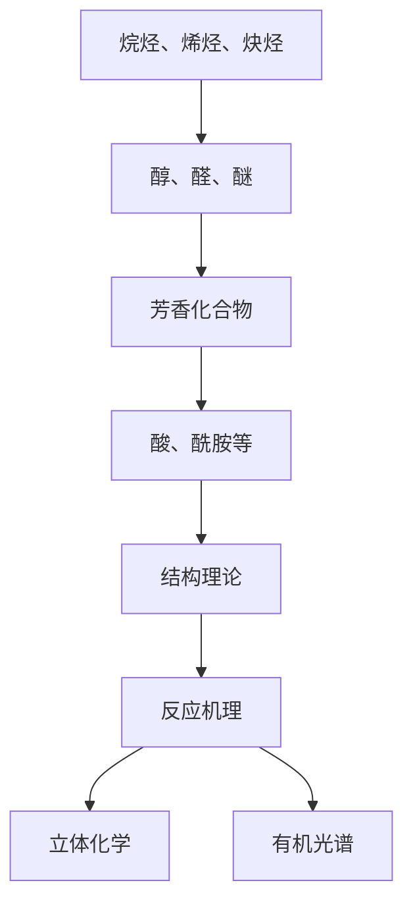
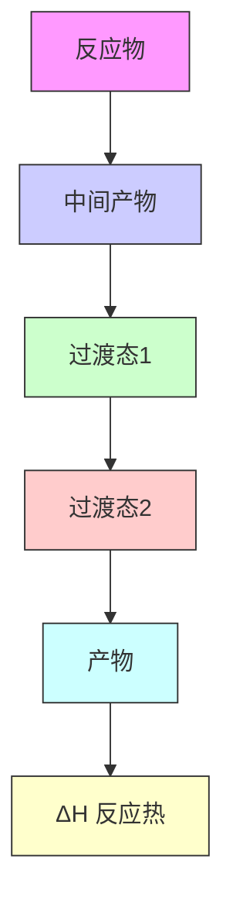
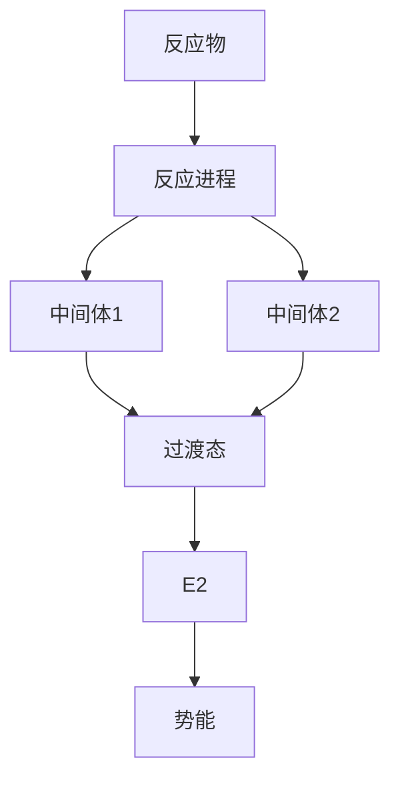
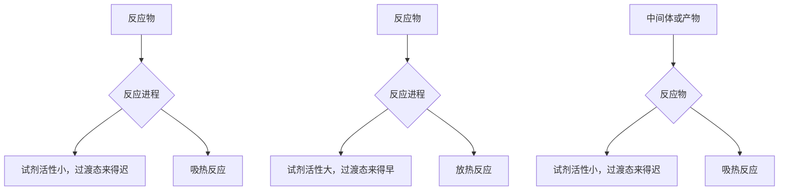

# 一、有机绪论00:05

# 1. 课程介绍

1）课程开始前的互动与准备

● 课程形式：采用直播授课方式，建议学生积极参与实时互动  
● 时间安排：课程于下午2点准时开始，建议优先观看直播而非回放  
● 技术准备：老师会通过文字确认直播信号正常，学生需及时反馈观看状态

2）对有机化学的初步认识 02:06

● 学科特点：有机化学并非玄学，存在可循规律，初学者可能觉得神奇但会逐渐理解  
● 学习体验：高一下学期开始接触有机化学时，会感受到其趣味性（如碳氢组合的多样性）  
● 类比说明：有机化合物构建如同拼积木，相比无机化学元素种类虽少但结构更丰富

![[01.有机绪论_笔记_images/5ad0e2b7edf24e26f5e20c454a78cf93c7ba8c141658cd68b33402f2358ee876.jpg]]

![[01.有机绪论_笔记_images/9e9214ddd877755a11561c414f260b36db5ab1d7d9b6124ea9ab8ed20f7cc1ff.jpg]]

# 有机绪论

刘曦廷

\-

2018.03.04

![[01.有机绪论_笔记_images/5fefb16e99c053d2643006b7c065b405771da211177f485a4e5c4000b0ce608d.jpg]]

![[01.有机绪论_笔记_images/cb82a9b877a90c6dfc46b82c6bd5848f7fba4c73ba379bfb3e7f2604c6ebb6cd.jpg]]

3）课程直播与回放建议 03:44

● 观看建议：推荐实时参与直播，回放视频需要处理时间（约至下周一才能观看）  
● 课程价值：直播互动能及时解决问题，避免学习进度延迟

4）有机化学课程大纲介绍 05:07

● 课程结构：共15次课，本次为绪论课，旨在建立学习框架  
● 教学目标：帮助学生形成系统的有机化学学习思路

2. 教师介绍 05:18

1）教师基本信息 05:30

● 学术背景：刘曦廷老师，2012年全国化学奥赛冬令营金牌（第25名），具备保送资格  
● 毕业院校：北京大学化学与分子工程学院（原化学系）2017届毕业生

![[01.有机绪论_笔记_images/48ff92f1ed73dbc05771d6de6d78f56f1d03547b19ce09095a3c88763cdcf2cb.jpg]]

# 2018年春季有机化学在线课程

主讲老师：刘曦廷

2012年CCHO金牌，保送PKU CCME

2017年加入学而思，高中化竞教研负责人

理化竞赛在线课负责人

QQ: 418035973

百度化学竞赛吧@刘曦廷老师°

![[01.有机绪论_笔记_images/8b19fc1e41c6b77590242e28a203f32eac56d460a216558d9b84e6e76272d9a5.jpg]]

![[01.有机绪论_笔记_images/6ac82dcc6f56a0cc29c576e120a6ac5fd0a3757a9bc39a889fbe0c5e7ac2c052.jpg]]

学而思化学竞赛讨论群扫一扫二维码，加入群聊。

![[01.有机绪论_笔记_images/efdfe6f7c9325753b825641d12cd610f61698c27bae562f8dc4aff41542bdcd3.jpg]]

![[01.有机绪论_笔记_images/f1b25d72757c99a5e626b662787add28de65ca51e947068575dbc69741de207d.jpg]]

![[01.有机绪论_笔记_images/78c0b2bedc3e0487e721fb2deb533f9c6841e544611352c684a78bd171cfe52b.jpg]]

XES化学竞赛在线课程群扫一扫二维码，加入群聊。

![[01.有机绪论_笔记_images/93703e553e5adf2720aee539b4de75c9d584562b99c84bdf25681e56ee32bd1a.jpg]]

![[01.有机绪论_笔记_images/c9521138f2a969c500df66f4a9e5df1d584a64e1076b25e9f8abd0719097e587.jpg]]

2）教师工作经历与职责 06:01

● 现任职务：学而思高中化学竞赛教研负责人，负责线上线下课程讲义编写与修改  
● 工作内容：同时担任理化竞赛在线课负责人，全面参与课程设计与教学  
3）联系方式与群信息 06:20

# - 联系方式：

○ QQ: 418035973   
- 百度贴吧：化学竞赛吧@刘曦廷老师°

# - 学习群组：

○ 学而思化学竞赛讨论群（大群，定期发布群作业）  
○ 学而思化学竞赛在线课课程群（专属群，上传每周讲义和习题）

● 入群要求：申请时需备注购课报名姓名，否则不予通过

# 3. 学习有机化学的意义 08:23

# 1）国初考试占比 08:33

● 考试重要性：国初考试有机化学占比约30%（2017年达36分）  
● 命题趋势：题目难度逐年增加，出题人裴杰老师倾向考察环状分子结构  
● 备考建议：有机化学是竞赛备考不可忽视的重要部分

学而思培优

# 为什么要学习有机化学？

1.国初占比约 $30\%$   
2.有机化学是一门重要的基础学科  
3.有机化学与每个人的生活息息相关

![[01.有机绪论_笔记_images/f3dc0415d814dba1f43cf99ae26637e48106638f02bffee3d45dd9a899e68a10.jpg]]

# 2）基础学科重要性 09:22

● 学科地位：北大化院等理科院系大一下学期必修课程  
● 交叉应用：生命科学、医学等学科都需要有机化学知识支撑  
● 研究价值：如裴杰教授课题组研究的OLED有机电致发光材料

# 3）生活应用 10:06

● 普遍存在：自然界绝大多数物质为有机化合物  
● 工业应用：石油提炼（汽油、煤油生产）、药物合成（如抗癌药顺铂）  
● 生命构成：人体组织（头发、肌肉、皮肤）、遗传物质DNA均为有机物  
● 研究前景：在药物研发和生物学领域具有重要应用价值

# 4. 有机化学学习方法 12:16

# 1）预习复习 12:19

● 学习流程：课前预习→课堂听讲→课后复习（及时解决问题）  
● 注意事项：避免因一时跟不上导致后续学习困难

学而思培优

# 如何学好有机化学？

1. 认真听讲、课前预习、课后复习   
2.积极思考、不断总结   
3.多做练习、提高解题能力

![[01.有机绪论_笔记_images/9010f88347511f0bfa2489ed6db188cf68beed1de33b5a949b5d9622cb4b6854.jpg]]

# 2）思考总结 12:51

● 学习要点：发现有机反应规律（如扎伊采夫规则、马氏规则）  
● 记忆策略：通过理解规律减少死记硬背，特殊反应要单独记忆

● 进阶技巧：学习深入后会发现特殊反应也符合潜在规律

3）练习解题 13:12

● 教材推荐：

基础教材：《基础有机化学》（第三版/第四版均可）  
○ 拓展读物：《有机反应机理的书写艺术》等专业书籍

● 练习建议：重视国初真题练习，近年命题更侧重机理分析

● 辅助资源：课程群内提供配套习题，可随时讨论答疑

![[01.有机绪论_笔记_images/595698b7d2ef4dbf562e0f5a5b54d59c713da34b4d82d7cc9f2dd294cfc1a09c.jpg]]

如何学好有机化学？  
![[01.有机绪论_笔记_images/634f4beb0b65b7ce432f80e8dbefc6b851e6661f74f0042ffc922cf110e0b3fc.jpg]]

![[01.有机绪论_笔记_images/5055419accb0f498e97e69b4f092a3e1c53bf8e36bd9179db536b6a3eb44e022.jpg]]

flowchart

4）知识体系

● 学习主线：按官能团分类学习（烷烃、烯烃、炔烃、醇、醛、醚等）  
● 核心内容:

○ 结构理论：理解结构决定性质  
- 反应机理：重点掌握反应过程  
○ 立体化学：如酒石酸的旋光异构  
- 有机光谱：核磁谱等验证手段

![[01.有机绪论_笔记_images/b921f3af76497be1eeca13430e4fb81ff64e84f9c4a2cea2db8b0d42165903a0.jpg]]  
如何学好有机化学？

1. 有机化合物的结构与反应

![[01.有机绪论_笔记_images/d3ffe413e0febb987a3388049653c5baab3aa3cda90bcd5c24c285a8bd8c3ce7.jpg]]

![[01.有机绪论_笔记_images/ad3c45d8aafa3b9392491a2ad68beae147afe7edefa2935cd4785a7c0873fc0b.jpg]]

![[01.有机绪论_笔记_images/6e946defd942317ec371d2d813585356c9d89956b30bf273c9d97b64e9a1d8f5.jpg]]

![[01.有机绪论_笔记_images/26dde2a1e7d2be64da39147f89a435f890bd7517c334aa219aba4eef1a048a2b.jpg]]

![[01.有机绪论_笔记_images/6ef69c3ba159fa9f854cc463f7fd6fc76c131b1960017bfefe53f78e4e3e0cfa.jpg]]

![[01.有机绪论_笔记_images/6e4012dff4967bea519e3f6c17c1fb4b9529e1dc059edf5329323f74a4650096.jpg]]

有规律的反应

特殊反应

2. 有机反应与反应机理

![[01.有机绪论_笔记_images/ae5d0da9e11e788ff4b41ac56819e8af789d3a65e023482655319cbc6494000a.jpg]]

![[01.有机绪论_笔记_images/a9e3568018c484e5a0456676f593e2ca30cb75c33342cebaa1d50e1d0eb9d0be.jpg]]

![[01.有机绪论_笔记_images/d8698285cc3b9121dd0c94e0eb734a6db018e04967c26e1a26167f4893df5f3c.jpg]]

![[01.有机绪论_笔记_images/66c9a45b99dffb44bafffd815ae2490e5c913c39831785cd2c435bcecbfdae9c.jpg]]

反应原理

反应过程

机理

反应规律

3. 有机反应的应用——有机合成

![[01.有机绪论_笔记_images/d7ba4fa2d97e979b10ccc6ed392dcb21452ce20a3ef9e0961e8505fb90920005.jpg]]

多步反应

![[01.有机绪论_笔记_images/1000de8f7dad38e745489fa43a36e7715f7f80bf2ced9329a6c6a5e999aaded3.jpg]]

复杂分子

如何

步骤最少

产率最好

![[01.有机绪论_笔记_images/ae6b6fd7cc62c7f8d706d9a8f1b6131a28854c6df492a73186340954aa5a5351.jpg]]

5）学习框架

\- 三大线索：

○ 结构与反应：规律性反应与特殊反应  
- 反应机理：原理、过程和规律  
- 有机合成：多步反应设计（步骤最少、产率最优）

● 高阶内容：参考裴坚《中级有机化学》中的十条合成路径

5. 有机化学发展历史 17:18

1）有机化学起源 17:28

# 早期的有机化学

有机化学（Organic Chemistry）这个名词是在1806年由瑞典化学家J. Berzelins首先提出来的。意思是指“有生机之物”。

1) 当时所有已知的有机物都是从生物体内分离出来的。  
2）人们认识到，有机物与从矿石、金属盐等物质在组成、结构上有很大的区别。  
3）当时人们对生命现象的本质没有认识，认为有机物只能在生物细胞中受一种特殊力量的作用才能产生出来，是“生命力”创造的。

首次提出：1806年由瑞典化学家J. Berzelius提出"Organic Chemistry"概念，中文译为"有生机之物"

\- 早期认知：

- 当时所有已知有机物都从生物体分离（如酒精通过发酵获得）  
○ 发现有机物与矿石/金属盐在组成、结构上有显著差异（燃烧会放出 $CO_{2}$ 和水）  
- 受限于对生命本质的认识，认为有机物需"生命力"创造（类似灵魂的神秘力量）

# 2）生命力理论 20:29

![[01.有机绪论_笔记_images/0702ac53079431bf519ad6d0cdfe29a13b8a7fb6b26b4474e582aa458e278f95.jpg]]

![[01.有机绪论_笔记_images/98619a6c99e08146a7b9b76fcac7566e5b25374c397ef68f00cf82711722128d.jpg]]

早期的有机化学

![[01.有机绪论_笔记_images/ea70dafc40ef83aa8ad16b3fa2187694e881f1b0de0dfc601af5a70b03bb36ce.jpg]]

最早的有机化合物来自于动植物体（有机体）

生命论(Vitalism)认为：有机化合物只能由有机体产生。无机化合物则存在于无生命的矿藏中，同时也可由有机体产生。

\- 进入主张，有投资合作才能占有投资产业。无投资可占有无破产或占有投资产业。（如

\- 核心主张：有机化合物只能由有机体产生，无机物可存在于矿藏或由有机体产生（如呼出的 $CO_{2}$ ）

● 理论局限：认为有机物无法像无机物那样通过实验制备和操纵

\- 突破实验:

1816年法国化学家Michel发现皂化反应：动物脂肪+碱→脂肪酸+甘油（有机物间转化）

○ 1828年Wöhler实验：无机物氰酸铵 $(NH_{4}^{+}CNO^{-})$ →有机物尿素 $(H_{2}N-NH_{2})$

\- 1845年德国科学家用纯无机物碳和硫经五步反应制得醋酸

\- 1816年法国化学家Michel发现皂化反应：动物脂肪+碱→脂肪酸+甘油（有机物间转化）
- 1828年Wöhler实验：无机物氰酸铵 $(NH_{4}^{+}CNO^{-})$ →有机物尿素 $(H_{2}N-NH_{2})$ - 1845年德国科学家用纯无机物碳和硫经五步反应制得醋酸

![[01.有机绪论_笔记_images/92de3fd17ac6f23817c4ca886e26760b1574c4aa1380925ddfeb54d7f81c91bc.jpg]]

![[01.有机绪论_笔记_images/73bcc0515d4d32c8e81de5e140629c9e841c24b08ce788f38f55d6f7821203dc.jpg]]

■ Friedrich Wöhler (German)的实验(1828

由腈酸铵（无机物）制得尿素（有机物）

![[01.有机绪论_笔记_images/583edf6e6dfb273cfc7b10dd16564c31c0e083506672d6564e4649014ea8d96c.jpg]]

inorganic

organic

# 3）现代定义 22:48

# 有机化学的定义

有机化学 (Organic Chemistry)
——研究有机化合物的结构和性能与合成的科学

有机化合物——含碳的化合物

<table><tr><td colspan="16">IA</td><td>0</td></tr><tr><td>H</td><td colspan="10">IIA</td><td colspan="5">IIIAIVA VAVIAVIIA</td><td>Ho</td></tr><tr><td>Li</td><td>Be</td><td></td><td></td><td></td><td></td><td></td><td></td><td></td><td></td><td></td><td>B</td><td>C</td><td>N</td><td>O</td><td>F</td><td>No</td></tr><tr><td>Na</td><td>Mg</td><td></td><td></td><td></td><td></td><td></td><td></td><td></td><td></td><td></td><td>Al</td><td>Si</td><td>P</td><td>S</td><td>Cl</td><td>Ar</td></tr><tr><td>K</td><td>Ca</td><td>Sc</td><td>Ti</td><td>V</td><td>Cr</td><td>Mn</td><td>Fe</td><td>Co</td><td>Ni</td><td>Cu</td><td>Zn</td><td>Ga</td><td>Ge</td><td>As</td><td>Se</td><td>Kr</td></tr><tr><td>Rb</td><td>Sr</td><td>Y</td><td>Zr</td><td>Nb</td><td>Mo</td><td>Tc</td><td>Ru</td><td>Rh</td><td>Pd</td><td>Ag</td><td>Cd</td><td>In</td><td>Sn</td><td>Sb</td><td>Te</td><td>I</td></tr><tr><td>Cs</td><td>Ba</td><td>La</td><td>Hf</td><td>Ta</td><td>W</td><td>Re</td><td>Os</td><td>Ir</td><td>Pt</td><td>Au</td><td>Hg</td><td>Tl</td><td>Pb</td><td>Bi</td><td>Po</td><td>At</td></tr><tr><td>Fr</td><td>Ra</td><td>Ac</td><td></td><td></td><td></td><td></td><td></td><td></td><td></td><td></td><td></td><td></td><td></td><td></td><td></td><td></td></tr></table>

![[01.有机绪论_笔记_images/18ce806b76d1039ab56b5d1b3f0393195ff44bc7c220f8baa8e06587714c5bf8.jpg]]

# 定义演变：

- 1848年：研究碳的化学（不全面，如 $CO_{2}$ 不属于有机物）  
- 1874年：研究碳氢化合物及其衍生物的化学  
现代定义：研究有机化合物结构、性能与合成的科学

● 本质特征：含碳化合物（除 $CO_{2}$ 、碳酸盐等少数特例）

\- 碳的特殊性:

○ 位于元素周期表IVA族，可形成4个强共价键  
○ 碳原子间可相互连接，形成从甲烷 $(CH_{4})$ 到DNA的巨大多样性

# 6. 有机化合物特征 24:59

1）都含有C原子 25:10

学而思培优

# 有机化合物的特征

1. 都含有C原子  
2. 种类繁多  
3. C原子可以形成比较稳定的共价键  
4. 易燃、易溶解于有机溶剂中，难溶于水  
5. 通常反应速率慢、易发生副反应

![[01.有机绪论_笔记_images/8088adda7721f368cf5d07d3ddca2d4ffe1cd9626bf5a00ce413c9563f4f781f.jpg]]

![[01.有机绪论_笔记_images/2487aaa49ceb9a84dfae685e5325c27dd88569fd3e3693ee43fab0b0b9cf0e54.jpg]]

● 核心元素：必须含碳（但 $CO_{2}$ 、碳酸、碳酸盐等除外）  
● 边界案例：二硫化碳 $(CS_{2})$ 虽含碳但属无机物，却可作为有机溶剂使用

2）种类繁多 26:25

学而思培优

# 有机化学的定义

有机化学 (Organic Chemistry) 一一研究有机化合物的结构和性能与合成的科学

有机化合物——含碳的化合物

<table><tr><td colspan="16">IA</td><td>0</td><td></td></tr><tr><td>H</td><td colspan="10">IIA</td><td colspan="5">III A I V A V A V I A V I I A</td><td>Ho</td><td></td></tr><tr><td>Li</td><td>Be</td><td></td><td></td><td></td><td></td><td></td><td></td><td></td><td></td><td></td><td>B</td><td>C</td><td>N</td><td>O</td><td>F</td><td>Ne</td><td></td></tr><tr><td>Na</td><td>Mg</td><td></td><td></td><td></td><td></td><td></td><td></td><td></td><td></td><td></td><td>Al</td><td>Si</td><td>P</td><td>S</td><td>Cl</td><td>Ar</td><td></td></tr><tr><td>K</td><td>Ca</td><td>Sc</td><td>Ti</td><td>V</td><td>Cr</td><td>Mn</td><td>Fe</td><td>Co</td><td>Ni</td><td>Cu</td><td>Zn</td><td>Ga</td><td>Ge</td><td>As</td><td>Se</td><td>Br</td><td>Kr</td></tr><tr><td>Rb</td><td>Sr</td><td>Y</td><td>Zr</td><td>Nb</td><td>Mo</td><td>Tc</td><td>Ru</td><td>Rh</td><td>Pd</td><td>Ag</td><td>Cd</td><td>In</td><td>Sn</td><td>Sb</td><td>Te</td><td>I</td><td>Xe</td></tr><tr><td>Cs</td><td>Ba</td><td>La</td><td>Hf</td><td>Ta</td><td>W</td><td>Re</td><td>Os</td><td>Ir</td><td>Pt</td><td>Au</td><td>Hg</td><td>Tl</td><td>Pb</td><td>Bi</td><td>Po</td><td>At</td><td>Rn</td></tr><tr><td>Fr</td><td>Ra</td><td>Ac</td><td></td><td></td><td></td><td></td><td></td><td></td><td></td><td></td><td></td><td></td><td></td><td></td><td></td><td></td><td></td></tr></table>

![[01.有机绪论_笔记_images/a4c5cb1639d4b95eaa2437121a350e53e5e79f113fac619c89c5715ddf00206f.jpg]]

- 数量对比：已知有机化合物超2000万种，无机物仅40-50万种  
- 结构特点：

○ 同分异构现象（如 $C_{2}H_{6}O$ 既有乙醇又有甲醚）  
○ 随碳数增加异构体数量呈指数增长

● 现代趋势：有机-无机界限模糊（如金属有机配合物）

# 3）C原子可以形成比较稳定的共价键 27:28

学而思培优

# 有机化合物的特征

1. 都含有C原子  
2. 种类繁多  
3. C原子可以形成比较稳定的共价键  
4. 易燃、易溶解于有机溶剂中，难溶于水  
5. 通常反应速率慢、易发生副反应

![[01.有机绪论_笔记_images/cb3cc85b0da0d9a76af4612f5cf11910d8f08b7ceb30a4745ffa41e015b35597.jpg]]

![[01.有机绪论_笔记_images/aa8ba828bf45f14dd8fb75d46227adb8199648721c02cafbffc197e7cc6fd772.jpg]]

# ●

![[01.有机绪论_笔记_images/bc90de1386d46b3c606dcc9785c51e3ddb22b69da70896e64f273d3bfc4e2451.jpg]]

● 键能特点：C - C键(348kJ/mol)和C - H键(413kJ/mol)键能较大  
● 结构表现：可形成长链、支链、环状等稳定结构

# 4）易燃、易溶解于有机溶剂中，难溶于水 27:37

# - 物理性质：

○ 多数易燃（四氯化碳等卤代烃除外）  
- 溶解性遵循"相似相溶"原则   
○ 随碳数增加水溶性降低（乙醇可溶，丁醇难溶）

# 5）通常反应速率慢、易发生副反应 28:10

学而思培优

# 有机化合物的特征

1. 都含有C原子  
2. 种类繁多  
3. C原子可以形成比较稳定的共价键  
4. 易燃、易溶解于有机溶剂中，难溶于水  
5. 通常反应速率慢、易发生副反应

![[01.有机绪论_笔记_images/f813e4469c8a98f5cafaaa374b4d9e87f2e2c997069a42729536505560776669.jpg]]

![[01.有机绪论_笔记_images/6b8e50a19ac8943e2becf1363d9a01dec6ead9ebd0e2d1917ba53d8b9deeb257.jpg]]

$C_{2}H_{6}O$

![[01.有机绪论_笔记_images/2faf7f5ac5d674f42554544782f44d41b41879a7e73b4ab3f539f79535f32de8.jpg]]  
甲醚

![[01.有机绪论_笔记_images/ce93414249b88d7b383a441fee17fcf8356d1c92d0ba81782c559463b86aab4d.jpg]]  
乙醇

# ●

# 反应特性：

○ 比无机反应（如酸碱中和）速率慢  
○ 常伴随副反应（如丁烷氯化可生成多种氯代产物）  
- 反应机理复杂（自由基、离子型等多种反应类型）

# 7. 有机化合物结构 29:33

1）组成有机化合物的原子——碳原子 29:43  
● 主要组成元素：有机化合物主要由碳原子构成，氢原子因结构简单不作重点讨论  
● 其他常见元素：氮、氧、硫、磷等原子也常出现在有机化合物中

# 2）碳原子的电子排布原理 29:53

学而思培优

# 有机化合物的结构

组成有机化合物的原子——碳原子

a) Pauli不相容原理  
每个轨道最多只能有两个电子，且这两个  
电子必须自旋相反，通常用2个箭头表示。

b) 能量最低原理

电子首先排满能量最低的轨道 (Orbital),  
再排高能级的轨道。原子轨道离核越近，  
受核的静电吸引力越大，能量就越低。

c) 洪特规则

电子尽可能分占不同的轨道，且自旋

平行。

![[01.有机绪论_笔记_images/41c909d0b601c2bceff4b8573cb2ff6aa0dfdfeb83b87985abbb9bda636d34b3.jpg]]

![[01.有机绪论_笔记_images/34d3551c37b9a214e4240b00152f2f8ba10e92cd1b9da3ea5cdf0ee1817313c9.jpg]]

电子的填充顺序为：

$1S^{2}2S^{2}2P_{X}^{2}2P_{Y}^{2}2P_{Z}^{2}3S^{2}3P\cdots\cdots$

# ●

![[01.有机绪论_笔记_images/f9a40112d44d6f9a98616b2acc9a8d2728849e15232f84e9f58efc46a0117e41.jpg]]

- 泡利不相容原理：每个轨道最多容纳两个自旋相反的电子，用↑↓表示  
● 能量最低原理：电子优先填入能量最低的轨道（离核越近，静电吸引力越大，能量越低）  
● 洪特规则：电子尽可能分占不同轨道且自旋平行  
● 体系能量理解：电子排布应使整个原子体系能量最低，需考虑电子间排斥作用

3）碳原子的电子构型 32:18

![[01.有机绪论_笔记_images/3adecc8ffb2a063f8e4aa28c6a29c6097a34355f2931684cc8d8e8b8e2561263.jpg]]

组成有机化合物的原子——碳原子

![[01.有机绪论_笔记_images/d5f204156413b84a1ff8c1e05f38abad5b7b00f0e1057549378da0d6a3e57e9b.jpg]]

碳原子的电子构型为:

C: $1\mathrm{s}^2 2\mathrm{s}^2 2\mathbf{p}_{\mathrm{X}}{}^{1}2\mathbf{p}_{\mathrm{Y}}{}^{1}2\mathbf{p}_{\mathrm{Z}}{}^{0}$

![[01.有机绪论_笔记_images/c66d87f192584eb0099ebf3c8fb5210114ffea1579f2306342bae69140104b35.jpg]]

text_image

3s —
2s —
1s —
— — — — — — — 3d
— — — — 3p
— — — — 2p

基态电子构型： $C:1s^{2}2s^{2}2p_{x}^{1}2p_{y}^{1}2p_{z}^{0}$   
● 轨道能量比较：2s轨道（豪华套间）能量低于2p轨道（廉价招待所）  
● 电子排布顺序：1s→2s→2p→3s→3p→4s→3d（存在能级交错现象）

8. 化学键理论 34:28

1）八隅体(Octet)概念 34:38

![[01.有机绪论_笔记_images/162e93412a61c4940425e1703b1779799d020beaf3d6459ce157e44a9d4d4357.jpg]]

有机分子中的化学键 —— 共价键

八隅体(Octet)：原子总是倾向获得与惰性气体相同的价电子排布(价电子层达到8个电子的稳定结构)

离子键(ionic bond): 原子间通过电子转移产生的正负离子相互结合而成键

共价键(covalent bond)：原子间通过共用电子对相互结合而成键（电子共享）

![[01.有机绪论_笔记_images/469be82026d9b5f50f43e5e544f059f19a84d4ab9d5e52a2f72884f1e8c34079.jpg]]

● 定义：原子倾向于获得与惰性气体相同的价电子排布  
● 价电子层：前周期元素达到8电子稳定结构，后周期可能扩展至18电子  
● 价电子：参与成键的电子，主族元素为最外层电子，副族包括次外层部分电子  
- 示例说明：铁原子电子排布 $3d^{6}4s^{2}$ ，最外层2电子但价电子8个

2）离子键(ionic bond)定义 37:01

● 形成机制：通过电子转移产生正负离子相互吸引  
● 形象比喻：类似"劫富济贫"，如钠将电子转移给氯

3）共价键(covalent bond)定义 37:11

● 形成机制：通过共用电子对实现稳定结构  
● 形象比喻：类似"共享单车"，如氯化氢共用电子对

4）Lewis结构式与形式电荷 38:20

# Lewis结构式

形式电荷=该元素价电子数-该原子周围键数(σ键、π键)-未成键电子数所谓形式电荷，更多的是为了描述有机化合物的结构，而不是反应的实质，只是为了保证反应前后电子数量一致。如 $NH_{4}^{+}$ 和 $CH_{3}^{+}$ 有同样的形式电荷，但它们反应性截然相反。

对一个用σ键连接的分子骨架，如何放置剩下的π键和未成键电子有多种方案，这些不同的结构式称为共振式。一个化合物的真实电子结构是该物质合理共振结构的加权平均，称为共振杂化体，共振体之间转化用“↔”表示。同一物质的共振式间仅仅是未成键电子与π键摆放位置不同，通过σ键连接的分子骨架是不会变的。如果两个结构式的分子骨架不同，则它们互为异构体。

计算公式：形式电荷=价电子数-成键数-未成键电子数  
● 本质说明：仅用于描述结构而非反应实质，如 $NH_{4}^{+}$ 和 $CH_{3}^{+}$ 形式电荷相同但性质迥异

5）共振式与共振杂化体 39:42

● 定义：同一分子骨架下π键和未成键电子的不同排布方案

● 表示方法：用双向箭头↔连接共振式

● 重要区别：分子骨架改变则成异构体而非共振式

6）共振式的能量与稳定性 41:06

\- 稳定性规则：

- 满足八隅体的共振式更稳定   
- 低电负性原子缺电子比高电负性原子缺电子更稳定  
- 中性结构比电荷分离结构更稳定

● 示例分析：碳氧双键的共振式中，中性结构贡献最大

7）电负性概念及其影响 42:41

● 定义：原子对电子的吸引能力

● 计算方法：基于电子亲和能和电离能的加权平均（Mulliken电负性）

● 应用：解释电荷分布倾向（高电负性原子带负形式电荷更稳定）

9. 电负性概念 43:52

学而思培优

![[01.有机绪论_笔记_images/269ef7d2375304e0dfedd908f99986382d043a9ce83d39c942e0164d0a0406e5.jpg]]

能量更低的共振式往往权重更大，也能更好地描述化合物的电子结构，评价规则（重要性依次递减）：

1. 第二周期元素价层电子数不超过八个  
2.所有原子都达到八隅律的共振体更稳定，低电负性的原子缺电子比高电负性原子缺电子更稳定  
3. 不带电的共振体比电荷分离的共振体更稳定  
4. 如果电荷分离，高电负性的原子应带形式负电荷，低电负性的原子应带形式正电荷。

\- 评价规则：共振式稳定性判断标准（重要性递减）：

- 第二周期元素价层电子数不超过八个  
- 满足八隅律的共振体更稳定；低电负性原子缺电子比高电负性原子缺电子更稳定  
- 中性共振体比电荷分离的共振体更稳定  
- 电荷分离时，高电负性原子应带负电荷，低电负性原子应带正电荷

● 电子掌控能力：电负性反映原子对周围电子的吸引能力，直接影响形式电荷分布合理性

10. 路易斯结构式 44:10

1）共振体的书写方法 44:14

如何书写一个给定Lewis结构式的共振体？

1. 寻找一个与孤对电子相邻的缺电子原子，公用一对电子形成 $\pi$ 键  
2. 寻找一个与 $\pi$ 键相邻的缺电子原子，将 $\pi$ 键移向该原子，形成新的 $\pi$ 键，远端原子变为缺电子原子  
3. 寻找一个与 $\pi$ 键相邻的自由基， $\pi$ 键中一个电子与单电子结合成新的 $\pi$ 键，远端原子变为自由基  
4.寻找一个与 $\pi$ 键相邻的孤对电子，将孤对电子推向原π键形成新π键，远端原子带上孤对电子

# 基本方法：

○ 孤对电子转移：寻找与孤对电子相邻的缺电子原子（如碳正离子 $C^{+}$ ），共用电子对形成 $\pi$ 键（例：氧的孤对电子转移至碳正离子，氧带正电荷）  
- $\pi$ 键迁移：将 $\pi$ 键移向相邻缺电子原子，远端原子变为缺电子（例：烯丙基正离子中 $\pi$ 键迁移导致正电荷位置变化）  
- 自由基参与：π键电子与相邻自由基单电子结合成新π键，远端产生新自由基  
○ 孤对电子推挤：将孤对电子推向π键形成新π键，远端原子获得孤对电子（例：羰基共振形成烯醇式）

# ● 关键区别:

- 共振体：仅电子分布不同（如烯丙基正离子的两种形式）  
○ 互变异构体：原子位置改变（如酮式与烯醇式）

● 稳定性变化：虽然氧带正电荷不稳定，但新π键形成使体系总能量降低

2）芳香化合物中π键的特性 46:04

学而思培优

![[01.有机绪论_笔记_images/b5f87e97a38cf2de70a9ce7b92821050f86a0fe61c86712f1a4a5f491a490795.jpg]]

5.芳香化合物中，π键可以绕环移动产生新的共振结构  
6.一根 $\pi$ 键上的电子可以均分或不均分给两个成键原子  
7.一对弧对电子或空轨道不能和与之正交的π键相互作用  
8. 不同的共振式之间含有同样多的原子和电子，形式电荷总数也必须相等。

# 特殊规则：

- 芳香环中π键可绕环移动产生新共振结构   
○ π键电子可均分或不均分给成键原子（例：羰基中碳带部分正电荷，氧带部分负电荷）  
正交限制：孤对电子/空轨道不能与垂直的π键相互作用（需p轨道平行才能肩并肩重叠）  
- 守恒原则：所有共振式必须保持：

■ 相同原子数和电子数  
■ 相同形式电荷总量  
■ 相同σ键骨架

3）共振式与共振杂化体 47:27

# Lewis结构式

形式电荷=该元素价电子数-该原子周围键数(σ键、π键)-未成键电子数所谓形式电荷，更多的是为了描述有机化合物的结构，而不是反应的实质，只是为了保证反应前后电子数量一致。如 $NH_{4}^{+}$ 和 $CH_{3}^{+}$ 有同样的形式电荷，但它们反应性截然相反。

对一个用σ键连接的分子骨架，如何放置剩下的π键和未成键电子有多种方案，这些不同的结构式称为共振式。一个化合物的真实电子结构是该物质合理共振结构的加权平均，称为共振杂化体，共振体之间转化用“↔”表示。同一物质的共振式间仅仅是未成键电子与π键摆放位置不同，通过σ键连接的分子骨架是不会变的。如果两个结构式的分子骨架不同，则它们互为异构体。

- 形式电荷计算：形式电荷 = 价电子数 - 成键数 $(\sigma + \pi)$ - 未成键电子数

● 本质说明：

形式电荷仅描述结构特征，不反映实际反应性（例： $NH_{4}^{+}$ 与 $CH_{3}^{+}$ 形式电荷相同但反应性迥异）  
- 真实电子结构是各合理共振式的加权平均（共振杂化体）

● 书写规范：

○ 用双箭头"↔"连接共振式  
◦ 仅允许π键和孤对电子位置变化，σ骨架必须保持不变  
- 分子骨架不同的结构属于异构体，非共振关系

11. 分子轨道理论 47:44

1）分子轨道理论的基本概念 47:46

![[01.有机绪论_笔记_images/4dff12ce0eea9241f9e9804d9b05ed756e419a0653f9bf5c009340ffda989b24.jpg]]

![[01.有机绪论_笔记_images/f07a1fb6cadab0f3092e3971b4925f3cf4a0d631940054597bebfb9cdcdedd6b.jpg]]

# 分子轨道理论

当两个原子在空间上相互接近时，每个原子的电子由于受到其他原子的作用，其能量和概率分布都会改变。

![[01.有机绪论_笔记_images/bf37e31833dd43e63912a17da3c83b33a4d7cdbb3ca7e757a931889b23b5439f.jpg]]

chemical

Molecular orbital diagram showing subtraction and addition of antibonding and bonding moieties

反键轨道破坏稳定性的作用比成键轨道的稳定作用强。

- 理论延伸：分子轨道理论是对路易斯结构和价键理论的延伸，解释共价键形成的本质机制  
- 电子行为：当两个原子接近时，每个原子的电子会受到其他原子核（库仑力）和其他电子的共同作用  
● 概率分布改变：电子云的概率密度分布和能量状态都会发生改变，如HCl分子中H的1s轨道与Cl的3p轨道相互作用

2）原子轨道的相互作用 47:55

\- 轨道选择原则：相互作用轨道需满足能量相近原则（如HCI中CI选择3p轨道而非3s轨道与H的1s轨道作用）

\- 波函数叠加：当两个原子轨道波函数符号相同时叠加形成成键轨道，符号相反时形成反键轨道

● 能量分布：组合后产生两个新分子轨道，一个能量降低（成键轨道），一个能量升高（反键轨道）

3）成键轨道与反键轨道的形成 48:59

● 稳定性影响：反键轨道破坏稳定性的作用强于成键轨道的稳定作用

● 实例分析：He\_2分子中，两个1s电子填入成键轨道，另两个填入反键轨道，导致体系总能量升高而无法稳定存在

如果两个互相作用的原子轨道上只有一对电子，则两个电子进入成键轨道。此时体系总能量比单独的两个原子要低，此时就产生了一根化学键。如果每个原子轨道都充满了电子，则两个进入成键轨道两个进入反键轨道，体系总能量升高，原子间相互排斥，无法形成化学键。

![[01.有机绪论_笔记_images/030bfab7815009992566809d57ce28ad7837ef6bf276fd829eebf45034da7541.jpg]]

text_image

Energy
Both electrons decrease in energy upon mixing of AOs to form bonding MO.
Two electrons decrease in energy, two increase. Overall there is an increase in the energy of the electrons.

4）化学键的形成条件 49:50

● 单电子情况：当相互作用轨道仅含一对电子时，电子全部进入成键轨道，体系总能量降低形成化学键  
● 满电子情况：若原子轨道均充满电子，电子需同时填入成键和反键轨道，导致总能量升高而无法成键  
● 能量关系：电子填入成键轨道时能量降低，但反键轨道电子能量升高幅度更大（整体表现为能量增加）

5）特例：光激发下的化学键形成 51:03

● 光激发机制：通过光子将基态电子激发到高能轨道（如He的1s→2s跃迁）  
- 暂态分子：激发态He的2s轨道可组合形成新成键轨道，虽为不稳定中间体但比自由基状态稳定  
● 能量释放：电子最终会通过发光返回反键轨道，导致分子解离

12. 碳原子特性 53:46

● 电子构型： $C:1s^{2}2s^{2}2p^{2}$ ，最外层4个价电子，中等电负性（2.5）  
- 成键特点：通过共享电子满足八隅体，主要形成共价键（与电负性差<1.5的元素如F）

● 键型分类：

○ 单键：1对共享电子（键能最小）  
- 双键：2对共享电子（键能中等）  
◦ 叁键：3对共享电子（键能最大，核间距最小）

● 稳定性比较：键能越大越难断裂（类比折断筷子数量）  
- 离子键难点：需完全失去/获得4个电子才能达到稳定构型，能垒过高

13. 有机结构表达 56:08

1）共价键的定义与甲烷的形成 56:12

![[01.有机绪论_笔记_images/1b924568a41566eb55be32cbb21829cfd2c4c2507af8ac0745f62b764aedcd42.jpg]]

有机分子中的化学键 —— 共价键

![[01.有机绪论_笔记_images/586b5f1daa50edc66ddb55ad08a2ff789b893239197f13911b4448711a6977cf.jpg]]

甲烷的形成

![[01.有机绪论_笔记_images/29c45cadde681bc3b68c76269b27e621f54cdbc88dbee8246952198a80cb57c6.jpg]]

chemical

Chemical reaction equation showing protonation of a carbon with H• to form a radical intermediate

反应原子间以电子对互相结合在一起形成的键，称为共价键。

- 电子配对成键: 反应原子间通过电子对互相结合形成的化学键称为共价键, 如甲烷形成时碳原子 (C·) 与四个氢原子 (H×) 各提供一个电子形成四对共用电子对。  
- 甲烷电子式: 表示为 $\mathrm{H}^{*}\mathrm{C} \cdot \mathrm{H}$ , 其中星号和点分别代表氢和碳的价电子, 最终形成 $\mathrm{CH}_{4}$ 的稳定结构。

2）碳原子的成键方式与有机分子结构 56:36

![[01.有机绪论_笔记_images/0d3b0a9991a64341c8a9d9c6de0db543b1dd60ead426f75bacef0d656b3a14e2.jpg]]

![[01.有机绪论_笔记_images/c836b1fbd977d3929e2773c892fb01e7e0e8a5605162b96e6f56fe558ac9da02.jpg]]

有机分子中的化学键 —— 共价键

![[01.有机绪论_笔记_images/38d4d7920cf00897b2cb94dc803a41a502c4dcd46f73a1e1f733bc14d8401f82.jpg]]  
直链

![[01.有机绪论_笔记_images/021af0a32312d6eea32860b5da7d3fa0ef51cb59a4ccd9602cc43f6d93fceecc.jpg]]  
带侧链

![[01.有机绪论_笔记_images/97ae8fcc3562fab1f6a4ac0e58a4b8ec1b3088e2203f1de709cadd1f8775f891.jpg]]  
环状

![[01.有机绪论_笔记_images/bdf515e1e2d9c925d73cce43faa97efe7c1c1a228203ab8fc8c739cf36f600bb.jpg]]  
单键

![[01.有机绪论_笔记_images/49c1e9a79e234e1f84793a338017511d10b1538d87d75420a2d5faa36983732c.jpg]]  
双键

![[01.有机绪论_笔记_images/daf599907301e67e1cf09486acb2e36a739613bad425409a2544059b60a2b56a.jpg]]  
三键

成键对象多样性：碳原子不仅能与氢原子成键（如甲烷），还能与其他碳原子形成直链（如乙烷）、带侧链（如异丁烷）或环状结构（如环己烷）。  
- 结构复杂性：碳链可呈现单一直链、分支结构或闭合环状，这是有机化合物种类繁多的结构基础。

# 3）单键、双键与三键 56:56

# ● 键型分类:

○ 单键：C-C（如乙烷）  
○ 双键：C = C （如乙烯 $H_{2}C = CH_{2}$ ）  
○ 三键： $C \equiv C$ （如乙炔 $H - C \equiv C - H$ ）

● 电子对差异: 单键含1对共用电子，双键含2对，三键含3对，键能随键数增加而增大。

4）有机化合物结构的常用表达方式 57:08

![[01.有机绪论_笔记_images/79f295ccf0023141b99a8a538c0be9f89256a12a945d9ef89306459afeb22a25.jpg]]

有机化合物结构的常用表达方式  
![[01.有机绪论_笔记_images/483ce0671c5fb1a4407fabe5bb857c7e95fad18b8b934c1b85cee3a578fb0c08.jpg]]

chemical

Lewis电子式与价键式、缩写式对比图，展示甲烷、乙烯、乙炔三种结构及其单键/双键的氢键型组合

Lewis电子式: 用点（·）和叉（×）明确标注所有价电子，如甲烷的电子式显示碳与氢的电子配对情况。  
- 价键式: 用短线表示共价键, 如乙烯写作 $H_{2}C = CH_{2}$ , 乙炔写作 $H - C \equiv C - H$ 。  
- 缩写式: 简化表示, 如甲烷为 $\mathrm{CH}_4$ , 乙炔为 $\mathrm{HC} \equiv \mathrm{CH}$ 。

5）有机结构的常见缩写 58:16

![[01.有机绪论_笔记_images/1d93f21a57508fd018b939675e821fe1b85a103d66b45e462e86a03e06119d64.jpg]]

![[01.有机绪论_笔记_images/741495c5776b7c49761f8184de23ae967244304ba34a160378b3385d8f0eba82.jpg]]

有机结构的常见缩写  
TABLE 1.1. Common abbreviations for organic substructures 

<table><tr><td>Me</td><td>methyl</td><td> ${\mathrm{{CH}}}_{3} -$ </td><td>Ph</td><td>phenyl</td><td> ${\mathrm{C}}_{6}{\mathrm{H}}_{5} -$ </td></tr><tr><td>Et</td><td>ethyl</td><td> ${\mathrm{{CH}}}_{3}{\mathrm{{CH}}}_{2} -$ </td><td>Ar</td><td>aryl</td><td>(see text)</td></tr><tr><td>Pr</td><td>propyl</td><td> ${\mathrm{{CH}}}_{3}{\mathrm{{CH}}}_{2}{\mathrm{{CH}}}_{2} -$ </td><td>Ac</td><td>acetyl</td><td> ${\mathrm{{CH}}}_{3}\mathrm{C}\left( { = \mathrm{O}}\right) -$ </td></tr><tr><td>i-Pr</td><td>isopropyl</td><td> ${\mathrm{{Me}}}_{2}\mathrm{{CH}} -$ </td><td>Bz</td><td>benzoyl</td><td> $\mathrm{{PhC}}\left( { = \mathrm{O}}\right) -$ </td></tr><tr><td>Bu, n-Bu</td><td>butyl</td><td> ${\mathrm{{CH}}}_{3}{\mathrm{{CH}}}_{2}{\mathrm{{CH}}}_{2}{\mathrm{{CH}}}_{2} -$ </td><td>Bn</td><td>benzyl</td><td> ${\mathrm{{PhCH}}}_{2} -$ </td></tr><tr><td>i-Bu</td><td>isobutyl</td><td> ${\mathrm{{Me}}}_{2}{\mathrm{{CHCH}}}_{2} -$ </td><td>Ts</td><td>tosyl</td><td> $4 - \mathrm{{Me}}{\left( {\mathrm{C}}_{6}{\mathrm{H}}_{4}\right) }{\mathrm{{SO}}}_{2} -$ </td></tr><tr><td>s-Bu</td><td>sec-butyl</td><td>(Et)(Me)CH-</td><td>Ms</td><td>mesyl</td><td> ${\mathrm{{CH}}}_{3}{\mathrm{{SO}}}_{2} -$ </td></tr><tr><td>t-Bu</td><td>tert-butyl</td><td> ${\mathrm{{Me}}}_{3}\mathrm{C} -$ </td><td>Tf</td><td>triflyl</td><td> ${\mathrm{{CF}}}_{3}{\mathrm{{SO}}}_{2} -$ </td></tr></table>

● 烷基缩写:

○ Me (甲基, $CH_{3}-$ )

- Et (乙基, $\mathrm{CH}_3\mathrm{CH}_2-$ )   
○ Pr（丙基）、Bu（丁基）及其异构体（i-Pr, t-Bu等）

# ● 芳香基团:

○ Ph（苯基， $C_{6}H_{5}-$ ）  
○ Bn（苄基，PhCH $_{2}$ -）  
○ Bz（苯甲酰基，PhC(=O)-）

# ● 特殊基团:

○ Ac（乙酰基， $CH_{3}C(=O)$ -，注意与无机化学中醋酸HOAc区分）  
- Ts（对甲苯磺酰基）、Ms（甲磺酰基）等常用于反应保护基

# 14. 立体化学表示 01:00:11

![[01.有机绪论_笔记_images/044021c32a514bf6e3f50674f8dda55be4f3734e97042ca5ca6925b4a4ebe170.jpg]]  
立体化学的表示方法

![[01.有机绪论_笔记_images/f1f823852091e2ea8773c575daf83b159204cf41f10d4f1690e34a39d1072516.jpg]]

一根楔形加粗的线说明一个取代基指向纸面上方，楔形散列的短线表示取代基指向纸面下方，一根弯曲的线表示手心中心两种不同手性的混合物，而一根普通的直线则表明立体化学不明或者不重要的场合。

![[01.有机绪论_笔记_images/b99bdf1a31a072fae14de91c5c9969312fad7c0d3f4ba7bb4c9635dc263f672a.jpg]]  
虚线表示部分成键，如过渡态中的化学键。

# ● 楔形式表示法:

◦ 加粗楔形线：取代基指向纸面上方（立体构型中突出）  
- 散列楔形线：取代基指向纸面下方（立体构型中凹陷）

# ● 其他符号:

○ 弯曲键：表示手性中心的两种构型混合物（外消旋体）  
○ 虚线：表示部分成键（如过渡态）或氢键等弱相互作用

# 15. 键线式应用 01:01:34

# - 简化规则:

折点/端点默认代表碳原子，省略碳上氢原子（如环己烷简化为六边形）  
- 杂原子（O、N等）必须显式写出，如乙醇的键线式需保留羟基OH

● Grossman规则：反应机理中需画出反应中心及其直接相连的所有原子，其他部分可省略  
● 环状结构简化: 六元环可直接用正六边形表示，苯环可用内部带圈的六边形表示

# 二、共价键的键参数 01:03:34

![[01.有机绪论_笔记_images/4722d50c023a6f68d6a2c9c6b27f0888d2480ca134651199fb0bbecad975a8d7.jpg]]  
- 用键线式简化结构式

省略了什么？  
![[01.有机绪论_笔记_images/3cacf79d42528896cbfb55f87fa5ab297220951cebd603086bbcc735e5c7f160.jpg]]

![[01.有机绪论_笔记_images/0ce47250ad2d0c9e4dfd0906a61da95ab4fb60864fedc9987a6e718b378c10af.jpg]]

chemical

Chemical reaction diagram showing a molecule undergoing ring-opening under a chiral bond, with a separate chemical structure labeled '键线式'

键线式

![[01.有机绪论_笔记_images/4a463898575011f7890a60a20d94048d1268e753f7b736302b7500d386eb5820.jpg]]

chemical

Chemical structure of a branched alkane with ethyl and methyl substituents, accompanied by a photoresonant form labeled '不正确的表达方式'

![[01.有机绪论_笔记_images/9ac8e2bd77b8822da2fc31dca608832b6e8d676ffa0c3221d8e10ce9bd4d89c8.jpg]]

● 键线式省略规则：省略碳原子上的氢原子，但杂原子（如O、N等）上的氢原子或其他基团不省略

# 1. 键长 01:03:49

● 定义：两个原子核之间最远最近距离的平均值  
● 物理意义：两核间吸引力和排斥力达到平衡时的距离  
● 特点：原子核不是固定不动的，存在振动现象

2. 键角 01:04:16

● 定义：键与键之间的夹角  
● 典型例子：甲烷的键角为完美的109°28'

3. 键能 01:04:25

● 定义：分解时所需要的能量  
● 双原子分子：离解为单原子所需能量称为离解能  
- 多原子分子：为各离解能的平均值  
● 非简单倍数关系：双键键能不是单键的2倍（如C=C键能610kJ/mol vs C-C键能349.8kJ/mol），因π键与σ键重叠方式不同（π键肩并肩重叠）且电子间存在排斥

4. 化合物键参数比较 01:04:57

![[01.有机绪论_笔记_images/cd919eebdbbb620b0bcb40f6be9ff88eab227bdcf245399c17636ea589e0c3d4.jpg]]

![[01.有机绪论_笔记_images/bbf6f78224c2216bef365784a11b1390fcf0dad5ce2ecb85cfd1053c890eb5e5.jpg]]

# 共价键的键参数

键长：两个原子核之间最远最近距离的平均值。两核之间

吸引力和排斥力达到平衡时的距离。

键角：键与键之间的夹角。

键能：分解所需要的能量。双原子分子离解为单原子所需能量-

离解能，多原子分子为离解能的平均值。

<table><tr><td>化合物</td><td>轨道</td><td>键角</td><td>键长</td><td>键能</td></tr><tr><td>烷烃</td><td>sp3</td><td>109°28&#x27;</td><td>0.154 nm</td><td>349.8 kJ/mol</td></tr><tr><td>烯烃</td><td>sp2</td><td>120°</td><td>0.134 nm</td><td>610 kJ/mol</td></tr><tr><td>炔烃</td><td>sp</td><td>180°</td><td>0.120 nm</td><td>836 kJ/mol</td></tr></table>

- 烷烃： $\mathrm{sp}^3$ 杂化，键角 $109^{\circ}28'$ ，键长0.154nm，键能349.8kJ/mol  
- 烯烃： $\mathrm{sp}^{2}$ 杂化，键角 $120^{\circ}$ ，键长0.134nm，键能610kJ/mol  
- 炔烃：sp杂化，键角 $180^{\circ}$ ，键长0.120nm，键能836kJ/mol

# 三、共价键的极性01:06:13

![[01.有机绪论_笔记_images/f5fda62e57ee1ac54819c0efc385b8b612437dfe5b4aa2546bf488a309cf5fab.jpg]]

![[01.有机绪论_笔记_images/21162419bfa51f1b97fa578ce0314c55beb1ed1542fbd5a083f2e73c70f5aff7.jpg]]

共价键的极性(polarity)电负性(electronegativity)，偶极矩(dipole moment)

![[01.有机绪论_笔记_images/be33f0e8739cf012afaba6215d2cb91ee7c3e724d297246d192a0b96e18bb94c.jpg]]

chemical

Chemical reaction equation showing lithium-catalyzed transformation with labeled intermediates and products

1. 电负性 01:06:25

● 常见元素值：H(2.1)、C(2.5)、N(3.0)、O(3.5)、F(4.0)、Cl(3.5)  
● 作用：衡量原子吸引电子能力

2. 偶极矩 01:06:47

● 计算公式： $\mu(D)=e\times d$ （电荷×距离）  
● 非极性示例：H-H偶极矩为零  
● 极性示例：H-Cl偶极矩较大

# 四、极性共价键 01:07:03

学而思培优

![[01.有机绪论_笔记_images/3bdc1920ed64f305a5095925291b14214d750c3265f50da5d34be0ecb84f8d9c.jpg]]

极性共价键

形成共价键的原子，它们之间吸引电子的能力是不一样的。这就使得两原子间共价键的电子云不是平均分配在两个原子核之间，而是偏向电负性较大的原子，这种键成称为极性共价键。

![[01.有机绪论_笔记_images/1a7603c5b5422a258d5721231121378cd1804719117cf98673b9938a11616723.jpg]]

# 1. 电子云分布 01:07:16

● 特点：电子云偏向电负性较大原子（如 $H^{\delta+}-Cl^{\delta-}$ ）  
● 本质：共价键中电子云非对称分布

# 五、分子的极性01:07:31

学而思培优

![[01.有机绪论_笔记_images/d39ef7712a97615126f3f4d84f6d3eaf94107fb7073893d5add7b5cecc2b6942.jpg]]

分子的极性

在两个原子组成的分子中，键的极性就是分子的极性。在两个以上原子组成的分子中，分子的极性是每个键的极性向量之和。因此，并不是所有具有极性键的分子都是极性分子。偶极矩 $\mu$ 的大小表示有机分子的极性强弱。偶极矩是有方向性的。如 $\mathrm{CCl_4}$ ，虽然每个键都有极性，但这些键的偶极矩向量和为零，所以这个分子没有极性。  
分子有极性，分子间作用力增加，会影响沸点、熔点、溶解度。

![[01.有机绪论_笔记_images/b12ed14a6155fdfdf4011bda6207603f1ae0bca1dab4a8211b9e565117804f07.jpg]]

chemical

Chemical structure diagram showing chlorine (Cl) and carbon (C) atoms with positive charge indicators

1. 多原子分子极性 01:07:45

● 判断原则：各键偶极矩的向量和  
● 非极性特例： $CCl_{4}$ 虽有极性键但偶极矩向量和为零

2. 偶极矩向量和 01:08:14

● 方向性：偶极矩具有方向特征（类似物理中的矢量）  
● 影响：极性增加会提高分子间作用力，进而影响沸点、熔点和溶解度

# 六、共价键的饱和性 01:08:39

学而思培优

![[01.有机绪论_笔记_images/98677238a1213ad89924ccb27c19c1b52f3d62cd060a14daa92ec8dd44312521.jpg]]

共价键的饱和性

如果一个原子的未成对电子已经配对，就不能再与其它的未成对电子配对。

![[01.有机绪论_笔记_images/8e1d5c78b14ac560cb4c1a7416a4ab12e35d7dece802afc6910db6366697751d.jpg]]

chemical

Diagram illustrating electron density and stability in hydrogen bonding, showing two electrons and eight electrons with their respective stability conditions.

1. 电子配对原理 01:08:50

● 基本规则：未成对电子配对后不能再与其他未成对电子结合  
● 特殊情况：可与非键电子对形成配位键（如HF可与 $F^{-}$ 形成 $[F-H-F]^{-}$ ，键级为1）

# 七、共价键的方向性01:10:28

# 1. 原子轨道杂化 01:10:34

● 量子基础：电子运动服从薛定谔方程，具有波粒二象性  
● 轨道特性：原子轨道有特定空间取向（如 $p_{x}$ 、 $p_{y}$ 、 $p_{z}$ 相互正交）

# 2. 分子轨道理论 01:11:20

● 形成条件：需满足最大重叠原理、对称性匹配和能量相近原则  
● 重叠方式：s轨道与p轨道成键需沿p轨道对称轴方向重叠  
● 能量要求：轨道能量越接近，成键越容易（如sp杂化使σ键和π键能量重新分配）

# 八、碳原子的轨道杂化01:22:12

# 1. sp3杂化 01:22:24

![[01.有机绪论_笔记_images/994db9c6bbc00277d0848294d8d445113911ed505ddc1786e647b47ae6636ed7.jpg]]

text_image

■ 碳原子的几种轨道杂化
1. sp³杂化
C: 1s²2s²2p²
跃迁
原子轨道重组
4个sp³轨道
四面体型

- 电子跃迁: 碳原子基态电子构型为 $1s^{2}2s^{2}2p^{2}$ , 通过2s轨道电子跃迁至 $2p_{z}$ 轨道, 形成 $1s^{2}2s^{1}2p_{x}^{1}2p_{y}^{1}2p_{z}^{1}$ 激发态  
- 轨道重组: 1个s轨道与3个p轨道重组形成4个等价的 $sp^{3}$ 杂化轨道，每个轨道含1/4 s成分和3/4 p成分  
- 空间构型：正四面体结构，键角 $109^{\circ}28'$ ，碳原子位于中心，四个轨道波函数相位为正时指向四面体顶点  
- 成键特点：通过σ键（头碰头重叠）形成，电子云沿键轴呈圆柱形对称，可自由旋转而不破坏轨道重叠

● 实例应用：甲烷 $(CH_{4})$ 中碳的 $sp^{3}$ 杂化轨道与氢的1s轨道形成σ键，碳-碳单键 $(C-C)$ 也是 $sp^{3}-sp^{3}\sigma$ 键

![[01.有机绪论_笔记_images/76eb4742d010516a4915eb4224f03de5053ea3541186ebbd992dfbd542f99421.jpg]]

chemical

甲烷(CH₄)的成键示意示意图，展示σ键在sp³-s、sp³-s、sp³-sp³和sp³-p四种结构中的交换过程

- 杂化轨道成键: $sp^3$ 杂化轨道可与不同原子轨道形成 $\sigma$ 键, 包括 $sp^3 - s$ (如C-H)、 $sp^3 - sp^3$ (如C-C) 和 $sp^3 - p$ (如C-Cl)

# 2. sp2杂化 01:26:11

![[01.有机绪论_笔记_images/5487a4871e073b4947b9e885efb4e011f50e5beb0c9745fe3a494182d70c0c38.jpg]]  
2. $\mathfrak{sp}^2$ 杂化

![[01.有机绪论_笔记_images/7390de99379834827fc55e6eb5d20ed8c10e6636046853bcd6b538fcfd6d9d8a.jpg]]

![[01.有机绪论_笔记_images/00e1e46909029ff89413b9604e8d9cbb1127f76655dd64369f2c29da15b68624.jpg]]

text_image

跃迁
2s 2px 2py 2pz
原子轨道重组
120°
平面型
3个sp²轨道 2pz

- 轨道组成: 1个s轨道与2个p轨道重组形成3个 $sp^{2}$ 杂化轨道, 每个轨道含1/3 s成分和2/3 p成分  
● 空间构型: 平面三角形结构, 键角120°, 剩余1个p轨道垂直于杂化轨道平面  
- 波函数关系：杂化轨道波函数 $\psi = c_{1}\psi_{s} + c_{2}\psi_{p}$ ，其中 $c_{1}^{2} = 1 / 3$ ， $c_{2}^{2} = 2 / 3$ ，保证总概率为1

![[01.有机绪论_笔记_images/9db442701fa6f2477ba81ec7500087df5fc2c76395ab07797683f3a1daaf8337.jpg]]

- 乙烯 $(\mathrm{CH}_2 = \mathrm{CH}_2)$ 的成键示意  
![[01.有机绪论_笔记_images/80842e0415ea3a60ecc0e9551f46285a5e1a1abd90926b7d87ed74dece709e1f.jpg]]

chemical

Molecular orbital diagram showing electron density distribution in a pi bond with side overlap

![[01.有机绪论_笔记_images/52ce3187666a683893076763eaa3f5e6d27d96f5245f8e67751fb5715e48a161.jpg]]  
$\sigma$ 键 $(\mathbf{sp}^2 -\mathbf{sp}^2)$   
$\pi$ 键 $(\mathbf{p} - \mathbf{p})$

![[01.有机绪论_笔记_images/6052f5311e66dff9e5b587bcf5b8e2205ac9f592c072679a670adaf979c0d79d.jpg]]  
$\sigma$ 键 $(\mathbf{sp}^2 -\mathbf{sp}^3)$

![[01.有机绪论_笔记_images/9a5ead40aa49743807540060ce4e501eccf74b925490636d2e08ac2dc0cefa48.jpg]]  
$\sigma$ 键 $(\mathbf{sp}^2 -\mathbf{sp}^2)$   
π键(p-p)

- 双键形成: 碳原子间形成1个 $sp^{2} - sp^{2}\sigma$ 键和1个 $p - p\pi$ 键（肩并肩重叠）， $\pi$ 键电子云结合较松散  
● 键旋转限制: $\pi$ 键旋转需要克服较高能垒（约270kJ/mol），通常需要光激发才能实现  
- 杂化轨道应用：在乙烯 $(CH_{2} = CH_{2})$ 中，碳的 $sp^{2}$ 杂化轨道与氢形成 $sp^{2} - s\sigma$ 键，碳间形成 $\sigma + \pi$ 双键

# 3. sp杂化 01:31:38

![[01.有机绪论_笔记_images/d48040c4727b017873869ade449bcaeae27bf9721e853f96d2e15f545082d8e4.jpg]]

3. sp杂化  
![[01.有机绪论_笔记_images/ff33a34e0079e7d7b5770ae5510908c83a66b408bf6707398efd30fd00ece4a5.jpg]]

chemical

原子轨道重组示意图，展示直线型轨道与跃迁过程

● 轨道特征: 1个s轨道与1个p轨道重组形成2个sp杂化轨道，各含1/2 s成分和1/2 p成分  
- 几何构型: 直线型结构, 键角 $180^{\circ}$ , 剩余2个p轨道相互垂直且均垂直于杂化轨道轴  
- 三键构成: 如乙炔 $(C_{2}H_{2})$ 中, 碳原子间形成1个 $sp - sp\sigma$ 键和2个相互垂直的 $p - p\pi$ 键  
● 键长规律: 随着s轨道成分增加 $(sp^{3}\rightarrow sp^{2}\rightarrow sp)$ ，杂化轨道半径减小，键长缩短  
- 旋转特性: 三键中π键旋转需破坏电子云重叠, 能垒更高 (需旋转180°才能恢复重叠)

# 九、有机化合物构型 01:36:56

# 1. 烷烃构型 01:37:10

![[01.有机绪论_笔记_images/3b9fe21d8a0e38ab55fbb90facd554cd57f7a2bc755a86d7afef635e236eb231.jpg]]  
1. 烷烃：四面体型

![[01.有机绪论_笔记_images/ae6f964781c6c2120fc0bd1146df0702f5682b570cb1af041d1c5aedf3b82246.jpg]]

![[01.有机绪论_笔记_images/477f5b94cd2ca5d2c1748f4bd129fca682a0386a46d999770ec0ebcca3414ed8.jpg]]

chemical

Structural formulas of methane and chlorine molecules, showing their relative types in the planar and four-sided models

![[01.有机绪论_笔记_images/96e97aa9461a28f12ced6a1825080af5f8b8941fac92f0f0d15f28ebb5cff753.jpg]]

- 四面体特征：烷烃碳原子呈四面体构型，当四个取代基相同时为正四面体（如 $CH_{4}$ ），不同时为不规则四面体  
- 二氯甲烷实验证据：若为平面构型应存在两种异构体（邻位和对位），但实验证明只有一种物质，证实其为四面体构型  
- 立体异构现象：氯溴碘甲烷存在两种旋光异构体（左旋和右旋），平面构型会有三种不同排布方式

![[01.有机绪论_笔记_images/f2e35dc14d3aa16d8554e0c5a0e6213e8b0cc1b4da73921facf3282155bd96cf.jpg]]

![[01.有机绪论_笔记_images/93a4a6351876e802fbeebfe4095b1ad644700f778de87d5a14e60383b8288409.jpg]]

chemical

氯溴碘甲烷与四面体结构式对比图，展示三者均不同分子的相对位置及伞形式

![[01.有机绪论_笔记_images/0fd487ab53df3492fbf52f2efeb1c716c73b1592c81e3b920e281e363ee14b81.jpg]]

● 键线表示法：

○ 实线：键在平面上  
○ 楔形线：键指向观察者  
○ 虚线：键指向纸面后方

\- 旋光性：互为镜像的立体异构体具有相反的旋光方向（左旋/右旋），RS构型将在立体化学章节详细讲解

# 2. 烯烃构型 01:39:29

![[01.有机绪论_笔记_images/398e1d85bc057a25e7ae5134c177d40e9072790bfc4ab2823844c1522a990077.jpg]]  
2. 烯烃：平面型

![[01.有机绪论_笔记_images/5e8cd90974d223ec509874fe2b97123e1a235d7f06e088df2576c6a1a98bf6f0.jpg]]

![[01.有机绪论_笔记_images/b44f362f353246938f1d7e004751d648c35ecf3c875ed68b173e5c71be28658c.jpg]]  
平面型

![[01.有机绪论_笔记_images/3cabd8268dbedd79a7667b008c3f0155451b465ae3b7aa2d8fe85f16d352e795.jpg]]  
有顺反异构体  
(双键不能旋转)

![[01.有机绪论_笔记_images/2d90904006ebbfcc88a72f2fe3b5b6970f48da0da9e499dacf394be460591511.jpg]]

![[01.有机绪论_笔记_images/e865d13e110f7d02624a8a04985c367d69e128c6aabc2f5ea5d7d090351bf5a2.jpg]]  
顺式

![[01.有机绪论_笔记_images/9d31ec8282264a43f5a2685f0395fcb0597a9e40a815a20b1327da8f21aa1a36.jpg]]  
反式

![[01.有机绪论_笔记_images/1017a2f66b578f0c8bf443eb16063fa93df1c26430bf7e2102734c257bd8ac89.jpg]]

chemical

Chemical structures of isobutane derivatives with labeled bonds and stereochemistry

![[01.有机绪论_笔记_images/5a975bbbfa7624de9b602c3659aa071002e5c47f8548577061467eaa8dfff7a1.jpg]]

● 平面型结构：烯烃双键碳原子采用 $sp^{2}$ 杂化，形成平面三角形构型（键角约120°）  
- 顺反异构：以2-丁烯为例存在顺式（ $CH_{3}$ 在同侧）和反式（ $CH_{3}$ 在异侧）两种构型  
● 偶极矩差异：

- 顺式：偶极矩不能完全抵消（甲基与氢电负性不同）  
- 反式：偶极矩矢量完全抵消（结果为0）

● 构型转换：双键构型翻转需要加热或光照条件，通常会有明确提示  
● 键特性： $sp^{2}$ 杂化碳电子吸引力强于 $sp^{3}$ 杂化碳（因s轨道成分更多，键长更短）

# 3. 炔烃构型 01:42:02

学而思培优

3. 炔烃：直线型  
![[01.有机绪论_笔记_images/ac03a4af7876056cca3b258ae2b773f0df52d061565ba9501f2e2db11dab615f.jpg]]

chemical

Chemical structure of a linear diene with three carbon atoms and their corresponding H-C≡C-H bond

![[01.有机绪论_笔记_images/9f7d06259c7c180e7c1c85a64e7b91d66ca83dbcbec80ef1cef94a9b840e46d3.jpg]]

![[01.有机绪论_笔记_images/d71a01588d97a415967b66911b48324e11b2c080859975e913a55bf3e48827a6.jpg]]

![[01.有机绪论_笔记_images/d7cbb4644a6a66c8269bd2ab93a543967762bf5f887d33f3080c0d5489cd9e50.jpg]]

chemical

Chemical structure of a chiral alkene with labeled bond type

直线型特征：炔烃三键碳采用sp杂化，形成直线型结构（键角 $180^{\circ}$ ）

\- 成键方式：

○ 1个σ键（sp - sp杂化轨道重叠）  
○ 2个π键（未杂化的 $p_{z}$ 和 $p_{y}$ 轨道侧面重叠）

● 结构表达规范：必须保持直线型表示（如丁炔中四个碳应成一直线）

\- 旋转障碍：π键存在使炔烃旋转比普通σ键更困难

# 十、有机化合物分类01:42:36

# 1. 按碳架分类 01:42:54

学而思培优

有机化合物的分类  
![[01.有机绪论_笔记_images/3668ccb67cb8420c115d6fc52b057213f13f241cae203fca965b8eb3a93cf0eb.jpg]]

chemical

碳链化合物分类示意图，标注直链与支链结构

![[01.有机绪论_笔记_images/d944a11b6995e6337eedaadd637303f5dd9449972587c14afaea555e8f0f5758.jpg]]

![[01.有机绪论_笔记_images/76253fb94d59e7607f959f7a196591484788d997b0bb0b95bf6142e57f0dba64.jpg]]

![[01.有机绪论_笔记_images/58993bb510bcf95fef9a8ad20b84f34b0dc985d514aac6b31d1c575d4742e06c.jpg]]  
碳环

![[01.有机绪论_笔记_images/57733ce1369cffd719b0e8546959e3ff1706515bc869a579bf95a3f8e05172b5.jpg]]  
芳环

![[01.有机绪论_笔记_images/28317d9a23de3445f6d5c07f9248226aeb0fe1410c3b8315500fc1c153b4e98d.jpg]]  
杂环

链状化合物：

◦ 直链/支链  
- 饱和（仅含σ键）/不饱和（含π键，可发生加成反应）

\- 环状化合物：

○ 碳环：饱和（如环己烷）、不饱和（如环己烯）、芳香环（苯、萘）  
- 杂环：含O、N等杂原子（如吡啶、呋喃）

● 不饱和特性：π键可被加成（如催化加氢打开π键形成σ键）

# 2. 按官能团分类 01:44:39

\- 烃类：

- 烷烃（乙烷）：自由基取代  
○ 烯烃（乙烯）：亲电加成  
○ 炔烃（乙炔）  
○ 二烯（丁二烯）  
○ 芳烃（苯）：亲电取代

- 卤代物：含卤原子直接连接碳架（如二氯甲烷）  
● 含氧衍生物：

○ 醇/酚/醚   
○ 醛/酮   
○ 羧酸/酯

● 含氮化合物：胺类（如乙胺 $CH_{3}CH_{2}NH_{2}$ ）

● 反应机理区别：

- 亲电加成：缺电子试剂（如 $H^{+}$ ）进攻富电子底物（如乙烯）  
- 亲核加成：富电子试剂（如 $CH_{3}^{-}$ ）进攻缺电子底物（如乙炔）

环张力现象：

○ 三元环（如环丙烷）键角偏离理想 $sp^{3}$ 杂化角（109°28'），形成弯曲键（banana bond）  
环越小张力越大，开环倾向越明显（三元环＞四元环＞五元环）

# 十一、官能团的电子效应01:57:29

![[01.有机绪论_笔记_images/0df7b9a3870da969460c4571e7c4fb0ed563ad8f07ef8ec69627825596e317ef.jpg]]  
■ 按有机官能团分类

![[01.有机绪论_笔记_images/c6e5b21c2c7593c17e5e5739446a4f1b342dc283702bd0627dfbf9f01b7690de.jpg]]

<table><tr><td></td><td>举例</td><td>名称</td><td>典型反应类型</td></tr><tr><td colspan="4">碳氢化合物</td></tr><tr><td>烷烃</td><td> ${\mathrm{{CH}}}_{3}{\mathrm{{CH}}}_{3}$ </td><td>乙烷</td><td>自由基取代</td></tr><tr><td>烯烃</td><td> ${\mathrm{{CH}}}_{2} = {\mathrm{{CH}}}_{2}$ </td><td>乙烯</td><td>亲电加成</td></tr><tr><td>炔烃</td><td>HC≡CH</td><td>乙炔</td><td>亲电加成</td></tr><tr><td>二烯</td><td> ${\mathrm{{CH}}}_{2} = \mathrm{{CHCH}} = {\mathrm{{CH}}}_{2}$ </td><td>丁二烯</td><td>亲电加成</td></tr><tr><td>芳烃</td><td></td><td>苯</td><td>芳香亲电取代</td></tr><tr><td>卤代物</td><td> ${\mathrm{{CH}}}_{3}{\mathrm{{CH}}}_{2}\mathrm{{Cl}}$ </td><td>氯乙烷</td><td>亲核取代、消除</td></tr><tr><td colspan="4">含氮有机物</td></tr><tr><td>胺</td><td> ${\mathrm{{CH}}}_{3}{\mathrm{{CH}}}_{2}{\mathrm{{NH}}}_{2}$ </td><td>乙胺</td><td>碱或亲核试剂</td></tr><tr><td>腈化物</td><td> ${\mathrm{{CH}}}_{3}\mathrm{C} \equiv \mathrm{N}$ </td><td>乙腈</td><td>亲核加成</td></tr><tr><td>硝基化合物</td><td> ${\mathrm{C}}_{6}{\mathrm{H}}_{5}{\mathrm{{NO}}}_{2}$ </td><td>硝基苯</td><td>还原</td></tr></table>

![[01.有机绪论_笔记_images/c0ed9d907b683d19f6d3f168096b755bde6a652f634e7b47eedd4a56f77dda64.jpg]]

![[01.有机绪论_笔记_images/8a86f70c67496aeb72988dfea82c6c27d05efe5285421515bc6e70ecf6548951.jpg]]

1. 诱导效应 01:57:44

● 作用机理：通过 $\sigma$ 键传递电子效应，原子核视为固定支点，电子相互作用主导分子稳定性  
- 分类标准：

○ 吸电子诱导效应：电负性>2.1（H的电负性值）  
○ 给电子诱导效应：电负性<2.1

● 特殊现象：

○ 气态时甲基 $(-CH_{3})$ 表现为吸电子效应（碳电负性2.5）  
- 溶液中需考虑溶剂化等环境影响

\- 传递特性：

○ 沿σ键逐级衰减（如 $Cl-CH_{2}-CH_{2}$ -中氯的效应主要影响相邻1-2个碳）  
- 极性键中电子偏向电负性大的一方（如C - Cl键电子偏向氯）

2. 共轭效应 02:01:22

\- 轨道要求:

○ 给电子共轭：提供充满电子的轨道（如氯乙烯中氯的孤对电子）  
吸电子共轭：提供未充满电子的轨道（如羰基的反键轨道 $\pi^{*}$ ）

\- 氯乙烯案例：

○ 诱导效应：氯通过 $\sigma$ 键吸电子使 $\alpha$ -碳带部分正电荷  
○ 共轭效应：氯的孤对电子通过 $p-\pi$ 共轭使 $\beta$ -碳带部分负电荷  
- 净效应：中间碳电子云密度降低，端基碳电子云密度升高

● 共振结构：可写出极限式描述电子离域（如氯乙烯的电荷分离共振式）

3. 超共轭效应 02:06:05

● 作用条件：

- 烷基碳氢键与相邻空p轨道部分重叠（如碳正离子的 $sp^{2}$ 杂化空轨道）  
○ 或与反键轨道相互作用（如乙烷构象中的 $\sigma^{*}$ 轨道）

# - 稳定化机制：

○ σ键电子离域到空轨道（类似"经济舱升头等舱"的电子填充模型）  
○ 碳正离子稳定性：三级>二级>一级（与超共轭的C-H键数量正相关）

# ● 特殊形式：

- 桥头碳正离子因构型限制难以形成超共轭，特别不稳定  
- 丙基碳正离子存在两种异构体，超共轭效应不同

# 十二、有机反应类型02:14:39

# 1. 加成反应 02:14:58

![[01.有机绪论_笔记_images/56fae5bdb641365fc8a59572c0007d14285d124dbac6411dd39b6d50eb6dcee3.jpg]]

有机化合物的反应  
![[01.有机绪论_笔记_images/71419b5e958f15c09dc8010905e320f5bef70ebb75493532c977a1b648590c4e.jpg]]

按起始原料和产物的关系，可将有机反应分成四种基本的类别：加成反应，消除反应，取代反应和重排反应。  
加成反应中，多种起始原料组合为一种产物

![[01.有机绪论_笔记_images/2d6822cbffd44f5069b04077cd025b5027e65144714e78bb10529216575908f5.jpg]]

chemical

Two-step organic reaction sequence showing bromination and reduction steps with reagents HBr, (BzO)₂, and CH₃MgBr

![[01.有机绪论_笔记_images/d64eecea352a23ed09ee53b1298049c635d0aa86518e40728fe7c63e2eef42f6.jpg]]

● 基本特征: 多种起始原料组合为一种产物, 如烯烃与溴化氢反应生成卤代烷  
● 马氏规则：无过氧化物时，氢优先加成到含氢较多的碳原子上，形成更稳定的碳正离子中间体  
● 反马氏规则: 存在过氧化物时发生自由基加成，溴自由基优先加成到端基碳上  
● 中间体稳定性: 碳正离子稳定性受超共轭效应影响，正电荷位于中间碳更稳定

# 2. 亲和加成反应 02:18:08

● 反应机理: 羰基碳带正电性，格式试剂（RMgX）中碳负离子对羰基进行亲核进攻  
● 电子效应: 镁的电负性远小于碳，使C-Mg键具有离子键特性，碳显负电性  
- 后处理过程：反应后需水解，醇的碱性比水强，氧负离子会夺取水中的质子形成最终醇产物  
- 溶剂作用: 反应过程中格氏试剂需要溶剂化，产物分离需进行后处理

# 十三、有机反应分类 02:21:04

# 1. 消除反应 02:21:12

# 1）消除反应定义 02:21:13

![[01.有机绪论_笔记_images/c61ce16b2b814d3a63cf05c276d9717c737f95bc576292b68cb19d89bb497a32.jpg]]

消除反应中，一种起始原料分解为两种产物

![[01.有机绪论_笔记_images/86d1c7d277b7e1f40e7860dd097d0de73cb60173c6943d2f68546fbfdd09c0cd.jpg]]

![[01.有机绪论_笔记_images/116cfe38c7403313cb4a835330ab4d36f739d6fd3456595bf0e70531bf338cee.jpg]]

取代反应中，一个通过 $\sigma$ 键连接在起始原料的原子或基团被另一个通过 $\sigma$ 键连接的原子或基团所取代

![[01.有机绪论_笔记_images/32e6d34da918aad2a414c26f1e8be767ef743b5be6b72dab83de233e28fd8c4a.jpg]]

![[01.有机绪论_笔记_images/4383275f9e80eb56f407dbc94c9b6d53e32976de143d19bff62c2caee0a05890.jpg]]

● 基本特征: 一种起始原料分解为两种产物, 如脱水反应或脱二氧化硫反应  
● 典型例子: 醇在酸性条件下脱水生成烯烃，或某些化合物热分解产生二氧化硫

# 2. 取代反应 02:21:34

# 1）取代反应定义 02:21:36

学而思培优

消除反应中，一种起始原料分解为两种产物

![[01.有机绪论_笔记_images/d6dc74577003f84acee1d25c7490d16da525d8ccf9227f9b8eb2ea46f497b848.jpg]]

![[01.有机绪论_笔记_images/286d75ec94fa20bb3879e4d7ff15cb3792d7bf34c34de2fb73ad49c3c0d26a5f.jpg]]

取代反应中，一个通过 $\sigma$ 键连接在起始原料的原子或基团被另一个通过 $\sigma$ 键连接的原子或基团所取代

![[01.有机绪论_笔记_images/6a83167920c3e96a6827a991eda4d968dfaf62713865fe00169ee5ca84c0eb90.jpg]]

chemical

Chemical reaction scheme showing acetylation of a ketone to form a cyclic ester and alcohol, with reagents and conditions labeled

基本特征: $\sigma$ 键连接的原子/基团被另一个 $\sigma$ 键连接的原子/基团取代  
● 自由基取代: 使用AIBN（偶氮二异丁腈）作为引发剂，产生异丁基自由基引发反应  
● 乙酰基取代: 乙酰基 $(Ac_{2}O)$ 取代反应中，乙酰基上连同时生成乙酸副产物

# 3. 重排反应 02:23:12

# 1）重排反应定义 02:23:14

学而思培优

![[01.有机绪论_笔记_images/a0d0caaac6b9dd55271abaa5880d941a6c8bf80f202503980396be2240d70b62.jpg]]

重排反应中，一种起始原料得到一个结构不同的产物

![[01.有机绪论_笔记_images/9fbfd3b9570cab4466f265998c3cdaa5bbb86ef7cfb3b4abdac4ce8c1124e227.jpg]]

chemical

Two-step organic reaction sequence showing conversion of a cyclohexene derivative to a cyclopentenone via isocyanate and formaldehyde steps

有些变化过程是由多种反应组合而成。如酯和Grignard试剂得到醇的反应包括一步取代反应和一步加成反应。

基本特征: 起始原料结构重组得到不同结构的产物  
● 反应机理: 常涉及碳正离子中间体的重排，如环己烯在酸性条件下重排为甲基环戊烯  
● 碱引发重排: 强碱（如KH）先与活泼质子反应生成氧负离子，随后发生σ键迁移

# 4. 组合反应 02:24:55

1）酯和Grignard试剂反应 02:24:56

● 两步机理: 先发生亲核取代（甲氧基离去），再进行亲核加成生成叔醇  
● 中间体不稳定性: 两个氧连在同一碳上的结构特别不稳定，促使反应继续进行  
● 电子效应: 氧的吸电子诱导效应和给电子共轭效应共同影响反应进程  
● 最终产物: 经过两步反应后生成相应的醇类化合物

# 十四、反应机理分类02:26:32

# 1. 极性反应 02:26:38

学而思培优

![[01.有机绪论_笔记_images/59e7668391e9d220be2f3f3631eb51e987cecc4616676d191573d900e5a22fe7.jpg]]

对反应分类的第二种方式是根据机理类型来划分。最基本的反应机理有四种：极性，自由基，周环和金属催化或协同。

极性反应会经历电子对从电子密度高的区域（亲核体，Nu）移动到电子密度低的区域（亲电体，E），或从充满的轨道移动到空轨道。极性机理还可进一步分为碱性条件下和酸性条件下发生的反应。

![[01.有机绪论_笔记_images/1cfb4081dcfb03d2dd0079c47e42a7c97d3c23557e54319284d4364fbcc07de5.jpg]]

chemical

Chemical reaction mechanism showing nucleophilic addition of bromoalkane to form a trionophile, followed by hydrogenation and elimination steps

●

- 电子转移特征：电子对从电子密度高的区域（亲核体，Nu）移动到电子密度低的区域（亲电体，E），或从充满轨道移动到空轨道  
- 分类依据：

碱性条件反应：如叔丁基溴水解生成叔丁醇的过程，先异裂生成叔丁基正离子和溴负离子，再与水分子发生亲核取代  
- 酸性条件反应：涉及质子转移的特殊极性反应类型

● 实例分析:

![[01.有机绪论_笔记_images/9ebe4a8dc45faafdba98547e86fcbf5522c0707cc7c17ecfa32db82dc4b2b93a.jpg]]

叔丁基溴水解： $H_{3}C - C - Br\rightarrow H_{3}C - C^{+} + Br^{-}\longrightarrow H_{3}C - C - OH_{2}^{+}\rightarrow H_{3}C - C - OH$   
- 酯与Grignard试剂反应：包含取代和加成两步极性反应

2. 自由基反应 02:36:32

![[01.有机绪论_笔记_images/11cf994f5b3cdc9cd7f103a690a4e529c58dac9bd9a49577f97112275f012f66.jpg]]

![[01.有机绪论_笔记_images/795f805a4d2358993cbcd61d97c81d1490abaa95962623ec551691b946f42cea.jpg]]

自由基反应经历单个电子的移动。新键通常是由两个半充满轨道各自提供一个电子形成。通常会经历一个链式反应。

![[01.有机绪论_笔记_images/bc83464fa36d9e10431431404ec3650f52eeea23b72389cdda077ca258949041.jpg]]

chemical

Chemical reaction equations showing chlorination and acidification steps with labeled reactants and products

● 电子特征：涉及单电子移动，通过两个半充满轨道各提供一个电子形成新键

\- 链式反应机制：

![[01.有机绪论_笔记_images/fe7e5caa2b5eae71005f28ccadb4d6dedd6b29c4243133ba13bcd194f3fbdd5e.jpg]]

○ 引发阶段: $Cl_{2} \rightarrow 2Cl$ (键能较低的Cl-Cl键优先断裂)  
○ 增长阶段： $CH_{4} + Cl \cdot \rightarrow CH_{3} \cdot + HCl, \quad CH_{3} \cdot + Cl_{2} \rightarrow CH_{3}Cl + Cl \cdot$   
○ 量子产率：单个光子可引发多个产物分子生成，产率远大于1

● 反应特点：中间体为不稳定的自由基，反应具有持续传递性

3. 周环反应 02:38:36

![[01.有机绪论_笔记_images/1f2df47e3c1e2db898e519dbd66b35248422870c2102114cd4f7d13ef8802b92.jpg]]

![[01.有机绪论_笔记_images/78d5eb8fefc5855eb51a0bbdd03e346893c3fc4c6b8caab869d58f3c00455a97.jpg]]

周环反应特征是电子在环内移动。

![[01.有机绪论_笔记_images/bcddac928fcf2a9ccc3c3bd255d053ee4d13ec156b66e3e1966cfc40fb90b7ab.jpg]]

chemical

Hydrogenation reaction of propargylenesulfonate with alkyl halides, showing electron transfer and radical formation

金属协同或金属催化的反应需要过渡金属。但一些特定的过渡金属化合物在有机反应中仅仅是作为Lewis酸(如TiCl₄和FeCl₃)，有些是像Na、Li这样的碱金属作为单电子还原剂(如TiCl₃和SmI₂)，这类反应通常被算作其他三类反应。

● 协同过程特征：

- 旧键断裂与新键形成同时进行  
○ 电子在封闭环状过渡态中移动  
- 无离子或自由基中间体生成

● 典型示例：电环化反应如 $CH_{2}=CH-CH=CH_{2}\rightarrow$ 环丁烯   
● 键断裂特点：无法明确区分均裂或异裂类型

4. 金属催化反应 02:39:17

● 过渡金属作用：

作为Lewis酸（如 $TiCl_{4}$ 、 $FeCl_{3}$ 催化苯环溴化）  
作为单电子还原剂（如Na、Li、 $SmI_{2}$ ）

# - 典型反应：

- 铂催化烯烃加氢   
- 烯烃复分解反应（2011年化学奥赛初赛考点）

\- 分类说明：大多数可归入前三种机理，特殊配合物反应需单独研究

# 十五、反应机理概念02:40:33

● 实现方式：通过一系列基元反应实现化学变化的详细过程，包含从原料到产物的中间过程  
- 组成关系：反应机理包含≥1个基元反应，可能包含中间体存在

# 1. 基元反应 02:40:37

● 核心特征：仅含一个过渡态且不包含任何中间体的过程  
- 过渡态本质：在基元反应过程中经历的具有最高势能的结构（寿命极短，约 $10^{-13} \sim 10^{-14}$ 秒）

# 2. 反应中间体 02:41:21

● 形成条件：由≥2个基元反应组成的反应机理中存在  
● 能量特征：体系中的最低能量化学结构  
● 观测依据：寿命长于分子振动（>10^{-13}秒），故可被实验检测

# 十六、活化能与过渡态 02:46:32

学而思培优

![[01.有机绪论_笔记_images/8cf10fa772eb360f79e891a45f852dced5b31ab9f1f6b8f539b82dc3aa41b6ad.jpg]]  
Large $\Delta G^{\ddagger}$ , $\Delta G^{\circ} < 0$ slow and favorable

![[01.有机绪论_笔记_images/cc2b96386f24edba758d41322fcd8f4733b57e35488404578c24c7ed76df7001.jpg]]  
Progress of reaction
Small $\Delta G^{\ddagger}$ , $\Delta G^{\circ} < 0$ fast and favorable

![[01.有机绪论_笔记_images/3534515947fbfb05f8bc6881f726d67e1d952dbc3854b8908a864ac62abe86de.jpg]]

![[01.有机绪论_笔记_images/cf223b14079537f50f8d53141968ccfba07c5a8ec2f611ef2a41d6b34b8bef5f.jpg]]  
Small $\Delta G^{\ddagger}$ , $\Delta G^{\circ} > 0$ fast and unfavorable

反应物需要经过一个能垒才能变成产物，反应物到达能垒顶端所需的能量为活化能 $\Delta G^{\ddagger}$ ，处于能垒顶端的结构称为过渡态TS。反应速率取决于活化能 $\Delta G^{\ddagger}$ ，自发性取决于 $\Delta G$ ，彼此之间相互独立。当一个反应的正反应速率和逆反应速率相等时，该反应即达到了化学平衡，理论上所有反应都是可逆的。如果平衡常数K大于 $10^{3}$ ，即可认为该反应不可逆。

# •

● 能垒关系：反应物需克服能垒（活化能）才能形成产物  
● 速率决定：反应速率仅取决于活化能大小  
- 平衡特征：正逆反应速率相等时达到平衡，理论上所有反应可逆（当 $K > 10^{3}$ 时可视为不可逆）

# 1. 活化能定义

● 物理本质：克服分子接近时电子云排斥所需的最低能量  
● 影响因素：温度升高通过增加分子动能来提高克服活化能概率  
● 催化原理：通过降低活化能加速反应（如酶催化）

# 2. 过渡态特征 02:47:54

学而思培优

![[01.有机绪论_笔记_images/36fdc2bbbc084a1215a4803afecbfc6adfded79f444f66aa9155aaf713214114.jpg]]

活化能：当分子间发生反应时，分子接近到一定的程度，就会产生排斥力。因此存在一个能垒，要发生反应就必须提供能量，克服这个能垒，迫使分子接近，克服这个能垒所必需的最低能量，称为活化能。

过渡态：它是人们假想在反应过程中，从分子碰撞到形成产物之间，旧的键逐步分开离去，新的键逐步靠近形成，中间要经过的一个状态，的势能最高。

![[01.有机绪论_笔记_images/4b0ef7dcdc1c6be6b6caaea0e2657fd2f3318d18eb0f9555c537dd60baf6b1dc.jpg]]

chemical

Handwritten chemical reaction diagram showing electron transfer and ion movement in a solution

# ●

● 理论性质：假想的结构状态（旧键断裂与新键形成的中间阶段）

● 能量特征：反应路径中的势能最高点  
- 表示方法：用方括号加 $\mp$ 上标表示（如 $[A - -B - -C]^{\mp}$ ）  
● 实例分析：SN2反应中形成三中心四电子过渡态（如 $CH_{3}Cl$ 与 $OH^{-}$ 反应时碳杂化从 $sp^{3}$ 变为 $sp^{2}$ ）

# 十七、动力学与热力学02:52:03

学而思培优  
![[01.有机绪论_笔记_images/f5b31dd6b9d4eb40b9e2b293159cdbb4cd5712fd8f0225010328b1be03e81360.jpg]]

flowchart

![[01.有机绪论_笔记_images/ca8a55decba19b7328c66ee2d4f9f8b1fbb5afb1f728819f0041c543d4b42f90.jpg]]  
反应进程

![[01.有机绪论_笔记_images/e07f04d6399d1d5e50532a5162c30c9db03bd9306b29b4b44c02fc034d728875.jpg]]

● 势能变化图：反应进程中存在过渡态（高峰）和中间产物（低谷）， $\Delta H$ 表示反应热  
● 多产物反应特性：一个反应可能生成多种产物，其生成速率和稳定性存在差异

# 1. 动力学产物 02:52:08

学而思培优  
![[01.有机绪论_笔记_images/f4d9b2c7e8a997d92d1e2393be6bac6911e7a2e08ee38d42cbaeb7bf0f298d41.jpg]]

如果一个反应能生成多种产物，则生成最快的产物(动力学产物)不一定是能量最低的产物(热力学产物)。

![[01.有机绪论_笔记_images/0dd4910a4b08d9e46141de06bba210d91cdfd77edd9d73e52c5d845e48ad2bbc.jpg]]

如马来酸酐与呋喃发生D-A反应，最初产物是空间更拥挤能量更高的内型(endo)产物，随着时间的推移，产物会转化为能量更低一些的外型(exo)产物。

- 定义特征：反应速率最快生成的产物，对应活化能最低的路径  
● 稳定性特点：不一定是体系能量最低的产物，如D-A反应中的内型(endo)产物  
- 形成机制：轨道次级相互作用（如马来酸酐与呋喃反应中羰基电子与双键电子的轨道重叠）降低过渡态能量

# 2. 热力学产物 02:52:17

● 定义特征：体系能量最低的稳定产物，如D-A反应的外型(exo)产物  
● 空间效应：外形产物氧原子空间位阻更小（仅1个氧原子与碳排斥，内型产物有2个碳相互排斥）  
● 转化规律：初始生成的动力学产物会随时间转化为热力学产物

# 十八、Hammond假说 02:54:05

学而思培优

![[01.有机绪论_笔记_images/b8c134b949b1b41068c289046c22cc2822b3ca626dd5cc1dcff4e7f692520ded.jpg]]

很多反应会经历不稳定，高能量、短寿命的中间体，如碳正离子。中间体是反应坐标图上的一个低谷，而过渡态是一个高峰。过渡态寿命极短，不能分离，但所有反应都会有过渡态，有些反应则没有中间体。

![[01.有机绪论_笔记_images/49231dc5cecc7e518fb5ae989144ca3f34b37738ae9bd43c603534af86fc1d26.jpg]]

line

| Phase | Value |
|---|---|
| Me₂C=CH₂ + HCl | |
| Me₃C⁺ + Cl⁻ | |
| Me₃CCl | |

Hammond假说认为，过渡态的结构接近他前后两种物质中能量更高的物质。如异丁烯与HCl的加成形成碳正离子的过渡态能量与碳正离子相关，因此反应速率取决于碳正离子的稳定性。

![[01.有机绪论_笔记_images/fcb64c81727388125326da1d1cc02ac4aad3fee393f13e49d4103703418b5444.jpg]]

● 中间体特征：可观测的能量低谷（如碳正离子），寿命短但可低温捕获  
● 过渡态特征：不可分离的能量高峰，所有反应必然存在但寿命极短  
● 反应类型差异：单步反应无中间体，多步反应存在中间体

1. 假说内容 02:54:08

● 核心观点：过渡态结构更接近能量较高的相邻物种（反应物/中间体/产物）  
● 实例分析：异丁烯与HCl加成时，过渡态结构更接近叔丁基碳正离子中间体   
● 速率决定：反应速率取决于碳正离子稳定性，稳定性越高则活化能越低

2. 应用分析 02:56:47

学而思培优

![[01.有机绪论_笔记_images/283804304178ecb9cca63242ae9cf66904d8fe0467a4b3622499481ed91519f7.jpg]]

Hammond假定的两点重要应用

(1) 对于自由基、离子反应等，由于形成的中间产物是不稳定的自由基、正或负碳离子，它们的势能比较高，因而在这样的反应中，过渡态的结构较接近于这些不稳定的中间体。在类似的化合物进行同类反应时，如果中间体结构稳定，就表现为它的势能低，过渡态的势能也低，活化能相对也低，反应活性就大。反之，反应活性就小。

![[01.有机绪论_笔记_images/505f486163e2a073f0bd82b60c4ba48200addc94337b8c2dcce4df9a441e088e.jpg]]

flowchart

![[01.有机绪论_笔记_images/b65e1a3521213644ba581deb67e60c3135ffd865f9989f06e3724760adedc422.jpg]]

\- 中间体稳定性影响：

- 稳定中间体：势能低→过渡态势能低→活化能低→反应活性大  
○ 不稳定中间体：势能高→过渡态势能高→活化能高→反应活性小

学而思培优

![[01.有机绪论_笔记_images/dbea69566002c22d99f0cb6dcb3a0f60e426c31befee304ce52d03554b3fe9cd.jpg]]

(2）对于自由基、正或负离子反应，若用活性较大的反应试剂，反应物不需要经过多大变化就可达到过渡态，过渡态的势能比反应物高不了多少，反应的活化能较低，过渡态的结构较类似于反应物，我们就认为反应的活化能受中间体结构的影响较小。

若用活性较小的试剂，过渡态的势能比反应物高许多，反应物需经过较大变化才能达到过渡态，导致反应的活化能高，过渡态相对地较类似于中间体结构，我们就认为反应活化能受中间体结构影响大。

![[01.有机绪论_笔记_images/aee6bc46e7c76272b8c5a2c342a09f4e3f8dee146628774cc19cb1957e7a3381.jpg]]

flowchart

![[01.有机绪论_笔记_images/8287f4647707105d98eb47b2457a32bb7e13e374e44f30d841e726762a8eb3cf.jpg]]

\- 试剂活性影响：

○ 高活性试剂：过渡态接近反应物结构（如NaOH与HCl反应），活化能受中间体影响小  
- 低活性试剂：过渡态接近中间体结构，活化能受中间体稳定性影响显著

# 十九、酸碱理论 02:59:54

学而思培优

![[01.有机绪论_笔记_images/82541b4d200f85d6ed723f9bfa23125351b613c5df60b0bdfe7c052cd71d7fb1.jpg]]

酸碱的概念

1) Brønsted-Lowry 酸碱定义

酸是质子的给予体，碱是质子的接受体。酸释放质子后产生的酸根就是该酸的共轭碱。碱与质子结合后形成的质子化物就是该碱的共轭酸。

![[01.有机绪论_笔记_images/070803416db7a23bbf03a68c7079ba978744233119d52c8b75d2b47443721cd4.jpg]]

chemical

Chemical reaction equation showing acid reacting with proton to form chloride and ammonia, then to form ammonia and ammonia₄

![[01.有机绪论_笔记_images/ba622606062ada0d104c8765433e092bc87e005ec8149e2cf762877da02e1c8c.jpg]]

![[01.有机绪论_笔记_images/c4dfb23d5b0f93b78a945f3e5a811734096561352a4aa8ad7a8de53237600f76.jpg]]

1. Bronsted-Lowry酸碱 03:00:34

● 质子给予体: 酸是能够释放质子 $(\mathrm{H}^{\oplus})$ 的物质, 如 $\mathrm{HCl}\rightleftharpoons\mathrm{H}^{\oplus}+\mathrm{Cl}^{\ominus}$ 中HCl为酸  
● 质子接受体: 碱是能够接受质子的物质, 如 $NH_{3} + H^{\oplus} \rightleftharpoons NH_{4}^{\oplus}$ 中 $NH_{3}$ 为碱  
● 共轭关系:

- 酸释放质子后形成的物种称为该酸的共轭碱（如Cl⁻是HCl的共轭碱）  
碱接受质子后形成的物种称为该碱的共轭酸（如 $NH_{4}^{+}$ 是 $NH_{3}$ 的共轭酸）

\- 水溶液中的实例: 水既可以作为碱接受质子形成 $H_{3}O^{\oplus}$ （共轭酸），也可以作为酸释放质子形成 $OH^{\theta}$ （共轭碱）

学而思培优

![[01.有机绪论_笔记_images/f2c115a5cd503fdb37aa9284bdc6628f89df5e43c2f0da818c8cc8229294fa9a.jpg]]

酸碱的概念

1) Brønsted-Lowry 酸碱定义

酸是质子的给予体，碱是质子的接受体。酸释放质子后产生的酸根就是该酸的共轭碱。碱与质子结合后形成的质子化物就是该碱的共轭酸。

![[01.有机绪论_笔记_images/8c0c16c490170cbee067a0317ccfb278c0b67e8d2a54bab83800ff124b2d565b.jpg]]

chemical

Chemical reaction equation showing acid and sodium hydroxide reactions with proton transfers

![[01.有机绪论_笔记_images/70e42b962083d2b21a9675d9ebc0bd82ecfc421e8ab9cb614399d34df45bde46.jpg]]

![[01.有机绪论_笔记_images/8826986aa250a2bdae288af9959de207588338125aa91d8436341df1bd7d7fc4.jpg]]

2. 两性物质示例 03:01:38

\- 丙酮的双重性质:

作为碱：可与强酸（如 $H_{2}SO_{4}$ ）反应接受质子  
作为酸：在碱性条件下（如 $CH_{3}O^{\theta}$ 存在时）可失去α-H形成碳负离子 $CH_{3}CCH_{2}^{\theta}$

\- 醋酸的两性:

通常作为酸（与强碱反应失去质子）  
- 也可作为碱（在强酸如 $H_{2}SO_{4}$ 中被质子化）

\- 苯胺的两性:

○ 主要表现碱性（ $NH_{2}$ 基团可接受质子）  
○ 在特定条件下也可表现酸性（如与强碱反应）

学而思培优

![[01.有机绪论_笔记_images/d4c2a67cc77fe5d485cfbfd78a5e1784924ae22193dc6fb73898d09e83f1d954.jpg]]

应当注意许多通常认为即不是酸也不是碱的有机化合物实际上即可以是碱，或也有可能是酸，或者常常是两者都是。

例如，丙酮即可以是酸也可以是碱。

丙酮作为碱  
![[01.有机绪论_笔记_images/ee683cbcba649eb664959bb3e2237ca65f256f2247e05189cb14171f4e749099.jpg]]

丙酮作为酸  
![[01.有机绪论_笔记_images/24cf8bd257fa0b32cc0f9e1e477bc5b7439cc3a3a2c2618e4a20f6505dd2efdf.jpg]]

O

# ● 普遍性原则:

- 任何含氢分子都可能是潜在的Bronsted酸  
○ 几乎所有分子都可能是潜在的Bronsted碱（如甲烷可被超强酸质子化形成 $CH_{5}^{\oplus}$ ）

# ● 电子效应影响:

○ 丙酮的α-H酸性源于羰基的吸电子诱导效应  
○ 形成的烯醇式负离子 $(CH_{2}=C-O^{\theta})$ 因共轭效应而稳定

# 二十、知识小结

<table><tr><td>知识点</td><td>核心内容</td><td>考试重点/易混淆点</td><td>难度系数</td></tr><tr><td>有机化学定义</td><td>研究含碳化合物的结构、性质与合成的科学</td><td>区分有机物与无机物( $CO_2$ /碳酸盐除外)</td><td>★★☆☆☆</td></tr><tr><td>有机化合物特征</td><td>含碳原子(除 $CO_2$ /碳酸盐)、种类繁多(2000万+)、易燃、难溶于水</td><td>四氯化碳不可燃的特殊性</td><td>★★★☆☆</td></tr><tr><td>共价键参数</td><td>键长(核间距)、键角(109°28&#x27;甲烷)、键能(解离能平均值)</td><td>双/三键键能非简单倍数关系</td><td>★★★★☆</td></tr><tr><td>杂化轨道理论</td><td> $SP^3$ (四面体)、 $SP^2$ (平面120°)、SP(直线180°)</td><td> $SP^2$ 杂化p轨道垂直平面</td><td>★★★★☆</td></tr><tr><td>共振式规则</td><td>骨架不变、电子流动、形式电荷守恒</td><td>苯环共振式非真实结构</td><td>★★★★☆</td></tr><tr><td>有机反应类型</td><td>加成/消除/取代/重排</td><td>DA反应的协同机理</td><td>★★★★☆</td></tr><tr><td>反应机理分类</td><td>极性/自由基/周环/金属催化</td><td>碳正离子超共轭稳定</td><td>★★★★☆</td></tr><tr><td>酸碱理论应用</td><td>布朗斯特(质子转移)/路易斯(电子对)</td><td>丙酮兼具酸碱两性</td><td>★★★☆☆</td></tr><tr><td>官能团特性</td><td>烯烃(亲电加成)、炔烃(亲核加成)、卤代烃(SN1/SN2)</td><td>马氏vs反马氏规则</td><td>★★★★☆</td></tr><tr><td>立体化学基础</td><td>顺反异构/对映异构(R/S标记)</td><td>二氯甲烷无几何异构</td><td>★★★★☆</td></tr></table>