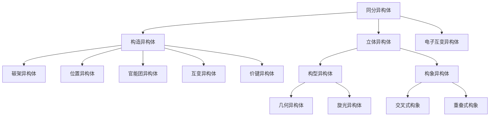
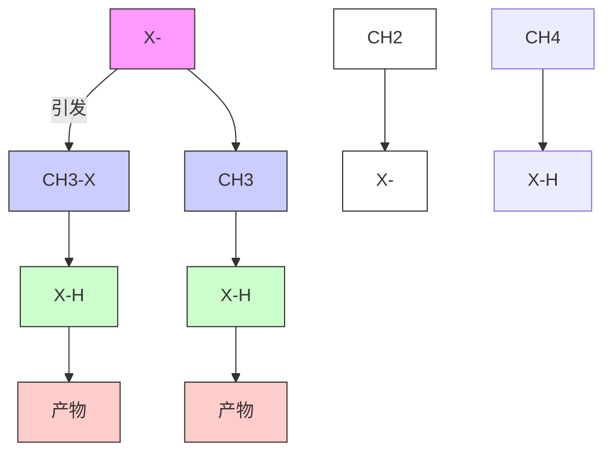
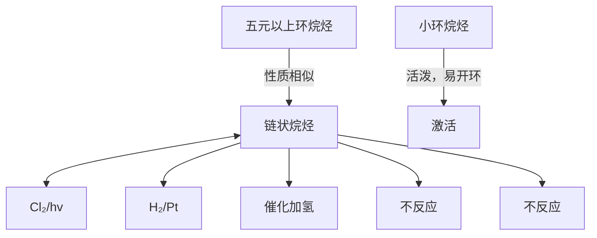

# 一、烷烃课程 00:00

# 1. 课前准备 00:09

1）复习与预习提醒 00:26

● 课前要求：提前10分钟进行课前复习和预习，确保两点准时上课  
● 设备说明：直播使用双屏系统，一块用于课件展示，一块用于查看学生弹幕

2）上节课内容回顾：CH5+00:45

● 结构特征：甲烷被质子化后的产物，带正电荷   
● 动态特性：五个氢原子围绕中心碳高速旋转，无法区分

3）课程安排说明 01:32

● 内容规划：完成上节课剩余内容，重点讲解习题部分  
● 学习建议：建议观看直播而非回放，以便参与实时互动提问

4）学生互动与疑问解答 03:22

● 答疑范围：接受关于上节课内容的疑问解答  
● 设备兼容性：手机端可能存在弹幕发送问题，建议使用电脑或iPad

5）省份与竞赛情况讨论 04:55

● 天津省队特点：省一分数线相对宽松，30多分可能被上报  
● 竞赛规划建议：高一完成高中内容学习，高二专注竞赛准备

2. 烷烃定义 09:56

1）烷烃的布朗斯泰德酸酸性 10:07

![[02.烷烃_笔记_images/f89c3802eef517c6ae8439cae33dbff631a4a76617d398c8a84f05fc4fc4703a.jpg]]

可以进一步说醋酸也可以是一个碱，而苯胺也可以是一

![[02.烷烃_笔记_images/8113622c47da77b09054c4b05b6383a6a1c9c933b75c711167aa6c419a75d0a7.jpg]]

![[02.烷烃_笔记_images/13dd8167cd1314ae261e426863085785e25b592d558c4ff6c30eac85c2cd4ea3.jpg]]

![[02.烷烃_笔记_images/172a84f148839fc8cfafe6a34c8e60d232d7148d328630dde72f65a4d9a8fef2.jpg]]

- 质子化过程：CH5+可视为甲烷接受质子（H+）形成的布朗斯泰德酸  
● 电子转移：氢分子的σ键电子填入甲基阳离子的空p轨道

2）甲基阳离子的路易斯酸性质 11:08

● 杂化状态：甲基阳离子为 $sp^{2}$ 杂化，具有垂直于平面的空p轨道  
● 成键机制：接受氢分子电子对后转变为 $sp^{3}$ 杂化，形成三中心两电子键（3c-2e）

3）烷烃的结构与杂化方式 11:43

● 结构动态：CH5+中五个氢等价是通过多个共振结构实现的  
● 键型解释：3c-2e键的快速交换导致氢原子不可区分

4) 烷烃的高速旋转特性与3c2a键 12:23

- 旋转现象：实际观察到的快速旋转是多个共振结构平均化的结果  
● 键能特点：超共轭效应稳定了这种特殊键型

5）酸碱强度与解离能力的关系 13:24

● 强度定义：酸强度指给出质子能力，碱强度指接受质子能力

● 共轭关系：

- 弱酸的共轭碱为强碱（如 $CH_{3}COO^{-}$ ）  
○ 强酸的共轭碱为弱碱（如 $Cl^{-}$ ）

6）酸度表示方法：PK值 14:31

● 计算公式： $pK_{a} = -\log K_{a}$ ，其中 $K_{a}$ 为酸解离常数  
- 数值意义： $K_{a}$ 越大酸性越强，对应 $pK_{a}$ 值越小  
● 应用实例：甲烷在超酸中可形成CH5+，说明超酸极强的质子给予能力

3. 酸的强度 15:10

学而思培优

![[02.烷烃_笔记_images/8a9fcc6910940a21fac849d2c9d23c105b79f0097f80c4d652bcc0d56c305b82.jpg]]

酸的强度决定与它放出质子的能力。碱的强度决定有它接受质子的能力。弱酸的共轭碱是强碱，强酸的共轭碱是弱碱。弱碱的共轭酸是强酸，强碱的共轭酸是弱酸。

![[02.烷烃_笔记_images/76e719abb6ac92a7118761f86ab646e517ce01ee8f3a9c45b622c624ae4a8834.jpg]]

chemical

Chemical reaction equation showing acetic acid reacting with protonated formate to form acetic acid and acetic acid, then forming a bipyridine derivative

酸度最为常用的方法是用 $-\log \mathrm{Ka}$ ，定义为pKa。由定义可以知道，pKa值越大，则Ka越小，酸的强度就越弱。

强度决定因素：酸的强度取决于放出质子的能力，碱的强度取决于接受质子的能力。

● 共轭关系规律：

☐ 弱酸的共轭碱是强碱（如 $CH_{3}CO_{2}H\rightleftharpoons CH_{3}CO_{2}^{-}+H^{+}$ 中醋酸为弱酸，其共轭碱 $CH_{3}CO_{2}^{-}$ 为强碱）  
○ 强酸的共轭碱是弱碱   
- 弱碱的共轭酸是强酸   
○ 强碱的共轭酸是弱酸

\- pKa量化标准：酸度常用 - $logK_{a}$ 表示，定义为 $pK_{a}$ 。 $pK_{a}$ 值越大， $K_{a}$ 越小，酸性越弱（如三氯乙酸 $pK_{a}=0$ 表示强酸，烷基 $pK_{a}=40-44$ 表示极弱酸）。

4. pKa值测定 17:01

1）pKa值测定的溶液环境 17:04

\- 有机溶剂体系：pKa值通常在有机溶液（如醇溶液、DMSO二甲亚砜）中测定，因强碱性物质（如甲基负离子）无法在水溶液中稳定存在。DMSO结构为三角锥形，含孤对电子。

2）pKa、PKb值与酸碱性强弱的关系 18:10

学而思培优

![[02.烷烃_笔记_images/1e72df43ab1b4fdf8c3cb95252bf2a0db93975f4b7d31f21de57a480dcb42f65.jpg]]

<table><tr><td colspan="4">TABLE 1.4. Approximate  ${\mathrm{{pK}}}_{\mathrm{a}}$  values for some organic acids</td></tr><tr><td> ${\mathrm{{CCl}}}_{2}{\mathrm{{CO}}}_{2}\mathrm{H}$ </td><td>0</td><td>EtOH</td><td>*17</td></tr><tr><td> ${\mathrm{{CH}}}_{3}{\mathrm{{CO}}}_{2}\mathrm{H}$ </td><td>*4.7</td><td> ${\mathrm{{CH}}}_{3}{\mathrm{{CONH}}}_{2}$ </td><td>17</td></tr><tr><td>pyrH+</td><td>*5</td><td>t-BuOH</td><td>19</td></tr><tr><td> ${\mathrm{{PhNH}}}_{3}^{ + }$ </td><td>5</td><td> ${\mathrm{{CH}}}_{3}{\mathrm{{COCH}}}_{3}$ </td><td>*20</td></tr><tr><td>HC=N</td><td>9</td><td> ${\mathrm{{CH}}}_{3}{\mathrm{{SO}}}_{2}{\mathrm{{CH}}}_{3}$ </td><td>23</td></tr><tr><td>N=CCH  ${}_{2}{\mathrm{{CO}}}_{2}\mathrm{{Et}}$ </td><td>9</td><td>HC=CH</td><td>*25</td></tr><tr><td> ${\mathrm{{Et}}}_{3}{\mathrm{{NH}}}^{ + }$ </td><td>*10</td><td> ${\mathrm{{CH}}}_{3}{\mathrm{{CO}}}_{2}\mathrm{{Et}}$ </td><td>*25</td></tr><tr><td>PhOH</td><td>10</td><td> ${\mathrm{{CH}}}_{3}\mathrm{{CN}}$ </td><td>26</td></tr><tr><td> ${\mathrm{{CH}}}_{3}{\mathrm{{NO}}}_{2}$ </td><td>10</td><td> ${\mathrm{{CH}}}_{3}{\mathrm{{SOCH}}}_{3}$ </td><td>31</td></tr><tr><td>EtSH</td><td>11</td><td> ${\mathrm{{NH}}}_{3}$ </td><td>*35</td></tr><tr><td>MeCOCH  ${}_{2}{\mathrm{{CO}}}_{2}\mathrm{{Et}}$ </td><td>11</td><td> ${\mathrm{C}}_{6}{\mathrm{H}}_{6},{\widehat{\mathrm{H}}}_{2}\mathrm{C} = {\mathrm{{CH}}}_{2}$ </td><td>*37</td></tr><tr><td>EtO  ${}_{2}{\mathrm{{CCH}}}_{2}{\mathrm{{CO}}}_{2}\mathrm{{Et}}$ </td><td>*14</td><td> ${\mathrm{{CH}}}_{3}\mathrm{{CH}} = {\mathrm{{CH}}}_{2}$ </td><td>37</td></tr><tr><td>HOH</td><td>*15</td><td>alkanes</td><td>*40-44</td></tr><tr><td>cyclopentadiene</td><td>*15</td><td></td><td></td></tr></table>

Note: pyr = pyridine.

数值对应关系：

o pKa越大酸性越弱（如烷烃pKa=40-44为极弱酸）  
o pKb越大碱性越弱（如pKb=36的碱虽弱，但通过平衡移动仍可拔除质子）

● 动态平衡原理：即使弱碱（高pKb）也能参与反应，因产物消耗推动平衡持续右移。

3）判断化合物酸性强弱的方法 19:11

- 查表法：直接比较pKa值（如表格中 $CH_{3}CO_{2}H$ 的pKa=4.7强于EtOH的pKa=17）  
● 结构分析：含吸电子基团（如 $CCl_{3}$ ）增强酸性，给电子基团（如烷基）减弱酸性

4）实验方法测定pKa值的原理 19:38

- 氘标记法：通过监测酸性氢与氘(D)的交换速率判断酸性强弱。酸性越强，氢-氘交换速率越快，可通过核磁共振定量测定标记程度。  
● 平衡监测：利用酸碱解离平衡的动态特性，通过产物浓度变化推算解离常数。

# 5. 质子氢活性判断 20:35

# 1）pKa规则介绍 20:38

学而思培优

<table><tr><td>Compound</td><td>pKROH</td><td>pKDMSO</td><td>Base</td><td>pKROH</td><td>pKDMSO</td></tr><tr><td> $\mathrm{C_{2}NCH_{2}NO_{2}}$ </td><td>3.6</td><td></td><td> $\mathrm{CH_{3}CO_{2}^{-}}$ </td><td>4.2</td><td>11.6</td></tr><tr><td> $\mathrm{CH_{3}COCH_{2}NO_{2}}$ </td><td>5.1</td><td></td><td></td><td></td><td></td></tr><tr><td> $\mathrm{CH_{3}CH_{3}NO_{3}}$ </td><td>8.6</td><td>16.7</td><td> $\mathrm{HCO_{2}^{-}}$ </td><td>6.5</td><td></td></tr><tr><td> $\mathrm{CH_{3}COCH_{2}COCH_{3}}$ </td><td>9</td><td></td><td></td><td></td><td></td></tr><tr><td> $\mathrm{PbCOCH_{2}COCH_{3}}$ </td><td>9.6</td><td></td><td> $\mathrm{PhO^{-}}$ </td><td>9.9</td><td>16.4</td></tr><tr><td> $\mathrm{CH_{3}NO_{2}}$ </td><td>10.2</td><td>17.2</td><td></td><td></td><td></td></tr><tr><td> $\mathrm{CH_{3}COCH_{2}CO_{2}C_{2}H_{5}}$ </td><td>10.7</td><td>14.2</td><td> $\mathrm{CO_{2}^{3-}}$ </td><td>10.2</td><td></td></tr><tr><td> $\mathrm{NCCCH_{3}CN}$ </td><td>11.2</td><td>11.0</td><td> $(\mathrm{C_{2}H_{5})_{2}N}$ </td><td>10.7</td><td></td></tr><tr><td> $\mathrm{PbCH_{3}NO_{2}}$ </td><td></td><td>12.3</td><td> $(\mathrm{CH_{3}CH_{3})_{2}NH}$ </td><td>11</td><td></td></tr><tr><td> $\mathrm{CH_{3}(SO_{4})CH_{3})_{2}}$ </td><td>12.2</td><td>14.4</td><td></td><td></td><td></td></tr><tr><td> $\mathrm{CH_{3}(CO_{2}C_{2}H_{5})_{2}}$ </td><td>12.7</td><td>16.4</td><td></td><td></td><td></td></tr><tr><td>Cyclopentadiene</td><td>15</td><td></td><td> $\mathrm{CH_{3}O^{-}}$ </td><td>15.5</td><td>29.0</td></tr><tr><td> $\mathrm{PS\&CH_{2}COCH_{3}}$ </td><td></td><td>18.7</td><td> $\mathrm{HO^{-}}$ </td><td>15.7</td><td>31.4</td></tr><tr><td> $\mathrm{CH_{3}CH_{3}CH(CO_{2}C_{2}H_{5})_{2}}$ </td><td>15</td><td></td><td> $\mathrm{C_{2}H_{5}O^{-}}$ </td><td>15.9</td><td>29.8</td></tr><tr><td> $\mathrm{PbSCCH_{3}CN}$ </td><td></td><td>20.8</td><td> $(\mathrm{CH_{3}CH_{2}CHO^{-}}$ </td><td></td><td>30.3</td></tr><tr><td> $(\mathrm{PbCH_{3})_{2}SO_{2}}$ </td><td></td><td>23.9</td><td> $(\mathrm{CH_{3}CH_{2}CO^{-}}$ </td><td>19</td><td>32.2</td></tr><tr><td> $\mathrm{PbCOCH_{3}}$ </td><td>15.8</td><td>24.7</td><td></td><td></td><td></td></tr><tr><td> $\mathrm{PbCH_{3}COCH_{3}}$ </td><td>19.9</td><td></td><td></td><td></td><td></td></tr><tr><td> $\mathrm{CH_{3}COCH_{3}}$ </td><td>20</td><td>26.5</td><td></td><td></td><td></td></tr><tr><td> $\mathrm{CH_{3}CH_{2}COCH_{2}CH_{3}}$ </td><td></td><td>27.1</td><td></td><td></td><td></td></tr><tr><td>Fluorene</td><td>20.5</td><td>22.6</td><td></td><td></td><td></td></tr><tr><td> $\mathrm{PS\&O, CH_{3}}$ </td><td></td><td>29.0</td><td></td><td></td><td></td></tr><tr><td> $\mathrm{PbCH_{3}SOCH_{3}}$ </td><td>29.0</td><td></td><td> $[(CH_{3})_{2}Si]_{2}N^{-}$ </td><td> $30^{\text{b}}$ </td><td></td></tr><tr><td> $\mathrm{CH_{3}CN}$ </td><td>25</td><td>31.3</td><td></td><td></td><td></td></tr><tr><td> $\mathrm{Pb_{2}CH_{2}}$ </td><td></td><td>32.2</td><td></td><td></td><td></td></tr><tr><td> $\mathrm{Pb_{3}CH}$ </td><td>33</td><td>30.6</td><td> $NH_{2}^{+}$ </td><td>35</td><td>41</td></tr><tr><td></td><td></td><td></td><td> $\mathrm{CH_{3}SOCH_{2}^{-}}$ </td><td>35</td><td>35.1</td></tr><tr><td></td><td></td><td></td><td> $(CH_{3}CH_{2})_{2}N^{-}$ </td><td>36</td><td></td></tr><tr><td> $\mathrm{PbCH_{3}}$ </td><td></td><td>43</td><td></td><td></td><td></td></tr><tr><td> $\mathrm{CH_{4}}$ </td><td></td><td>56</td><td></td><td></td><td></td></tr></table>

![[02.烷烃_笔记_images/25fac86a68db3ab804120660ab1cec1697be55d365bfba49d2b50e06496fae22.jpg]]

判断H活性的办法？

- pKa定义：表示化合物解离出质子的能力，数值越小酸性越强

\- 对照表示例:

- 硝基甲烷( $CH_{3}NO_{2}$ ) pKa=10.2   
○ 丙酮 $(CH_{3}COCH_{3})$ pKa=20   
○ 三乙胺 $\left(\left(C_{2}H_{5}\right)_{3}N\right)$ pKb=10.7

# 2）丙酮与氢氧根反应的pKa分析 20:47

学而思培优

![[02.烷烃_笔记_images/2deb8af8209d0b943631bf0ab6d210906eee55999c4a8d3cbb2db39352f59921.jpg]]

pKa规则

![[02.烷烃_笔记_images/fd34562c461166c736094e0e71ad347a3ba54f0bf70b73d67cadced620270693.jpg]]

chemical

Chemical reaction equations showing protonation and deprotonation of a carbonyl compound with varying pKa values

unfavorable, but sufficiently rapid to be proposed in a mechanism

unfavorable, and not sufficiently rapid to be proposed in a mechanism

反应平衡分析：

○ 丙酮 $(pK_{a} = 20)$ 与氢氧根 $(pK_{b} = 15)$ 反应  
○ $\Delta pK = 5$ ，反应平衡常数约 $10^{-5}$   
- 虽然热力学不利，但动力学上可进行后续反应

● 关键数据：

○ 当BuC≡CH( $pK_{a}=25$ )时，ΔpK=10，平衡常数约10^{-10}，反应难以进行

# 3）酸性强弱的一般规律 22:08

学而思培优

![[02.烷烃_笔记_images/15024d98533ea84e8b7d12b139f7e143bf48533f08ccbf9a06dfe7ae9aa20753.jpg]]

一般规律：

1.同周期从左至右，化合物酸性增强  
2.同主族从上到下，化合物酸性增强  
3.给定原子带正电比不带电时强   
4.与吸电基相连酸性增强，与给电基相连酸性减弱   
5.对于不带电荷的酸而言，酸性随取代基的增大而降低   
6.对于给定原子A，A-H中s轨道成分越多酸性越强   
7.无方向性的HA，如果共轭碱有芳香性，则HA酸性显著增强，如果一种物质被质子化时被破坏芳香性，则其碱性减弱。

●

![[02.烷烃_笔记_images/3612fcebb2c8c058fb69b777ed8127748a51138255c580142c09f0bd190b780b.jpg]]

# ● 周期性规律：

○ 同周期从左至右酸性增强（电负性增大）  
○ 同主族从上到下酸性增强（轨道半径增大导致键能减弱）

# - 结构影响因素：

○ 带正电荷原子酸性 > 中性原子（如 $NH_{4}^{+} > NH_{3}$ ）  
○ 吸电子基增强酸性（如三氟乙酸＞乙酸）  
○ s轨道成分越多酸性越强 $(sp > sp^{2} > sp^{3}$ 杂化

# 4）pKa差值与反应可能性的关系 22:21

# - 反应界限：

○ 当 $pK_{a}-pK_{b}<8$ 时，反应可以进行  
○ 当 $pK_{a}-pK_{b}>8$ 时，反应基本不发生

# ● 实例说明：

○ 丙酮反应( $\Delta pK = 5$ )产物浓度约 $10^{-5}$ mol/L  
○ BuC ≡ CH 反应(ΔpK = 10)产物浓度约 $10^{-}$ -10 mol/L

# 6. 酸性增强规律 24:11

# 1）同周期元素化合物酸性变化规律 24:19

# ● 机理分析：

从左到右电负性增强，对H的吸引力增强  
○ 电子云更偏向中心原子，质子更易解离

# - 典型实例：

○ $CH_{4}<NH_{3}<H_{2}O<HF$ 酸性增强

# 2）同主族元素化合物酸性变化规律 25:21

# - 反常现象解释：

○ 虽然电负性F > Cl > $B_{r}$ > I   
- 但酸性HF < HCl < HBr < HI

# ● 轨道理论解释：

- 原子半径增大导致键能减弱  
○ 轨道重叠效果变差（特别是s-p轨道匹配度下降）

# 3）给定原子带正电荷对酸性的影响 27:26

# ● 电荷效应：

○ $NH_{4}^{+}(pKa=9.2)$ 比 $NH_{3}$ 更易解离质子  
- 正电荷增强对电子的吸引，促进质子解离

# 4）与吸电子基或给电子基相连对酸性的影响 28:20

# - 诱导效应：

$CF_{3}COOH(pKa=0.23)$ 比 $CH_{3}COOH(pKa=4.76)$ 酸性强  
- 吸电子基通过σ键传递电子效应

# ● 共轭效应：

\- 苯环等共轭体系可稳定负电荷，增强酸性

# 5）原子s轨道成分对酸性的影响 29:18

# - 杂化轨道影响：

○ 乙炔(sp, 50%s) > 乙烯(sp², 33%s) > 乙烷(sp³, 25%s)  
○ s轨道成分越高，电子越靠近核，电负性越强

# - 轨道形状解释：

o s轨道球形对称，电子云更靠近原子核  
o p轨道纺锤形，电子云分布更分散

# 7. 无方向性酸 31:11

# 一般规律：

1.同周期从左至右，化合物酸性增强  
2. 同主族从上到下，化合物酸性增强  
3.给定原子带正电比不带电时强   
4.与吸电基相连酸性增强，与给电基相连酸性减弱   
5.对于不带电荷的酸而言，酸性随取代基的增大而降低   
6.对于给定原子A，A-H中s轨道成分越多酸性越强   
7.无方向性的HA，如果共轭碱有芳香性，则HA酸性显著增强，如果一种物质被质子化时被破坏芳香性，则其碱性减弱。

# 酸性增强条件:

○ 共轭碱具有芳香性时酸性显著增强  
- 质子化破坏芳香性时碱性减弱

# - 轨道成分影响:

对于给定原子A，A-H键中s轨道成分越多酸性越强

# ● 典型示例:

环戊二烯（无芳香性）失去质子形成环戊二烯负离子（6个π电子，符合4n + 2规则）时酸性增强  
- 吡啶质子化后氮原子孤对电子参与成键，破坏环系芳香性，导致碱性减弱

# 8. 互变异构体 33:21

学而思培优

![[02.烷烃_笔记_images/9b651de58007c0febaaf0fc85fed1e7015df9007bb1a63f6f97a19a8f99be424.jpg]]

互变异构

![[02.烷烃_笔记_images/af5b3a5aa5e0bcb5f7d07ced0275a13b26b25275777fb5cb008bde7d986e2b88.jpg]]

chemical

Chemical reaction mechanism showing t-BuO⁻ conversion to form a carbocation intermediate and then to a hydroxyl radical

互变异构体之间是异构体而非共振体的关系，因为它们有不同的 $\sigma$ 骨架。互变异构化是一个在酸性或碱性介质中极快的化学平衡，共振体之间不存在化学平衡问题。

# 结构特征:

○ 异构体关系（非共振体），具有不同σ骨架  
- 用双向箭头表示化学平衡关系

# - 反应特性:

○ 在酸/碱介质中快速达成平衡  
○ 典型示例：叔丁醇的互变异构

# ● 与共振区别:

- 共振体使用单箭头表示，不存在实际化学平衡  
- 共振体保持相同σ骨架，仅电子分布不同

学而思培优

![[02.烷烃_笔记_images/02043ac86b44ca9c42d3d7bf4fae1deca4d035793ba222f39140028adec285c7.jpg]]

互变异构

![[02.烷烃_笔记_images/866eaf36eac7c30c33e53875b58f9eff4995f3427c04f705d7d1b593aad8e665.jpg]]

互变异构体之间是异构体而非共振体的关系，因为它们有不同的σ骨架。互变异构化是一个在酸性或碱性介质中极快的化学平衡，共振体之间不存在化学平衡问题。

![[02.烷烃_笔记_images/1d489713043c3bda5a9f891b667ef0ecb9b9475b813594a08d0927325c5cef5b.jpg]]

# - 识别要点:

○ 互变异构必然涉及原子位置改变（如H迁移）  
- 共振结构中原子的空间排列保持不变

# ● 动力学特征:

- 互变异构化是可观测的动态平衡过程  
- 共振现象是理论模型，无实际转化过程

# 9. 路易斯酸碱理论 34:24

# 1）路易斯酸碱理论的基本概念 34:25

![[02.烷烃_笔记_images/f4fe467861e3d02d083fd520f9bf1aa97d5d2f46bed8c6ede8f08d68086b3003.jpg]]

![[02.烷烃_笔记_images/09a2a9d93f124a30eee3819e8ef82b91c06181c18faeb2a19073df93a2a14d6b.jpg]]

2）Lewis酸碱理论

酸是电子的接受体，碱是电子的给予体。酸碱反应是酸从碱接受一对电子得到一个加合物。

![[02.烷烃_笔记_images/b2d1b1d1ccce35f98645e4b01cf21720d5842f64c078f3420edbe7e55640f900.jpg]]

chemical

Chemical reaction equation showing BF₃ + NH₃ → H₃N-BF₃ with acid and alkoxide reactants

- 电子受体与给体：酸是电子的接受体，碱是电子的给予体。酸碱反应是酸从碱接受一对电子形成加合物，如 $\mathrm{BF}_{3} + \mathrm{N}\ddot{\mathrm{H}}_{3} \longrightarrow \mathrm{H}_{3} \mathrm{~N} - \mathrm{BF}_{3}$   
● 理论扩展性：相比布朗斯特酸碱理论（质子转移），路易斯理论将酸碱范围扩大到电子对转移，包含更多反应类型  
- 电子对本质：电子对（孤对电子）与质子（正电荷）形成对立概念，如 $\mathrm{BF}_3$ 中B原子缺电子，通过接受NH3的孤对电子达到八隅体稳定结构

# 2）路易斯酸碱反应的特点 34:40

- 加合物形成：反应产物称为酸碱加合物，通过配位键连接（如 $\mathrm{H}_{3} \mathrm{~N} - \mathrm{BF}_{3}$ 中的 $\mathrm{N} \rightarrow \mathrm{B}$ 键）  
- 双重属性物质：某些物质（如 $\mathrm{H}^{+}$ ）既是路易斯酸也是布朗斯特酸，而 $\mathrm{BF}_{3}$ 仅为路易斯酸  
- 稳定性驱动：反应动力来自路易斯酸获取电子达到稳定构型（如B原子从6电子 $\rightarrow 8$ 电子）

# 3）可接受电子的分子（路易斯酸） 36:29

![[02.烷烃_笔记_images/1b79539fd029e615a83afca935ced313fa20be6368a441c7fed02f6a83808b75.jpg]]

![[02.烷烃_笔记_images/96ca013a0447df53804329526515281bea780c5d5730f4bdfbd603a2f91eb7ff.jpg]]

可接受电子的分子:

$\mathrm{BF}_{3}$ $\mathrm{AlCl}_{3}$ $\mathrm{SnCl}_{4}$ $\mathrm{ZnCl}_{2}$ $\mathrm{FeCl}_{3}$

# 路易斯酸

金属离子:

Li $^{⊕}$ Ag $^{⊕}$ Cu $^{⊕}$

正离子:

$^{+}$ RC=O $^{+}$ Br $^{+}$ NO $_{2}$ $^{+}$ H

# 缺电子化合物：

- 无机物： $\mathrm{BF}_{3}$ 、 $\mathrm{AlCl}_{3}$ 、 $\mathrm{SnCl}_{4}$ 、 $\mathrm{ZnCl}_{2}$ 、 $\mathrm{FeCl}_{3}$   
○ 有机物：含羰基化合物 (RC = O)

# - 阳离子类：

金属离子： $\mathrm{Li}^{+}$ 、 $\mathrm{Ag}^{+}$ 、 $\mathrm{Cu}^{+}$   
○ 其他正离子：烷基正离子（R $^{+}$ ）、酰基正离子（RC=O $^{+}$ ）、Br $^{+}$ 、NO $_{2}^{+}$

● 特殊案例：质子（ $H^{+}$ ）是最简单的路易斯酸

4）具有未共享电子对原子的化合物（路易斯碱）37:13

● 中性分子：

- 氮系: $\mathrm{NH}_{3}$ 、 $\mathrm{RNH}_{2}$   
○ 氧系：ROH（醇）、ROR（醚）  
- 硫系：RSH（硫醇）  
- 羰基化合物：RC = O（醛/酮）

\- 阴离子类：

- 卤离子: X $^{-}$   
○ 氢氧根： $HO^{-}$   
- 烷氧基: RO $^{-}$   
- 硫氢根：HS $^{-}$   
○ 碳负离子: R $^{-}$

10. 烷烃结构 37:38

\- 基本定义：

- "烷"表示完全饱和，"烃"指碳氢化合物  
○ 通式：链烷烃 $C_{n}H_{2n+2}$ ( $n \geqslant 1$ )

\- 结构特征：

○ 碳均为 $sp^{3}$ 杂化，键角接近 $109^{\circ}28'$   
○ 甲烷为正四面体，其他烷烃因取代基差异产生键角微调（如乙烷C-C-H键角109.3°）  
○ 碳数 > 3时呈锯齿状排列（因 $sp^{3}$ 键角导致）

● 键型特性：

○ 所有C-H和C-C键均为σ键  
○ 键长数据：C-H键109pm（小于范德华半径和），C-C键154pm

11. 同系物概念 39:56

1）同系物与同系列的定义 40:14

学而思培优

![[02.烷烃_笔记_images/46c41dde7025085ed8c7eeaa576e9afb6c7b10dfc8641e538092a551702f5c4c.jpg]]

chemical

Structural formulas of methane, ethane, propane, and butane with Chinese labels

链烷烃的通式： $\mathbf{C}_{\mathrm{n}}\mathbf{H}_{2\mathrm{n} + 2}$

同系列：有相同通式、结构上相差一定的“原子团”的一系列化合物。

同系物：同系列中的化合物为同系物。

- 同系列：具有相同通式（如 $C_{n}H_{2n+2}$ ）、结构上相差 $\mathrm{CH}_{2}$ 单元的一系列化合物  
● 同系物：同系列中的各个化合物（如甲烷、乙烷、丙烷等）  
- 递变规律：物理性质随 $\mathrm{CH}_2$ 增加呈现规律性变化

2）烷烃的同系物特性 40:44

\- 结构共性：

○ 所有碳原子均为 $sp^{3}$ 杂化  
○ 含相同类型的σ键（C-C和C-H）

\- 差异特征：

○ 甲烷为唯一气态正四面体结构  
- 高级烷烃因分子间作用力增强而呈现液态/固态

3）烷烃的结构特点 41:28

# - 空间构型:

○ 除甲烷外，其他烷烃不形成完美正四面体（如新戊烷中心碳）  
○ 碳数≥4时存在构象异构（如乙烷的交叉式与重叠式）

# ● 键参数：

○ C-H键长109pm，键能414kJ/mol   
○ C-C键长154pm，键能347kJ/mol

# 4）σ键的定义与性质 42:51

● 形成方式：两个原子轨道沿对称轴方向头碰头重叠

# ● 关键特性：

- 最大重叠：电子云重叠程度高，键能较强  
○ 自由旋转：旋转不破坏电子云重叠，允许构象变化

● 实例说明：烷烃中所有单键均为σ键，决定其柔性分子骨架

# 5）烷烃的几种结构表示方式 43:46

● 伞形式：突出键角与空间排布（如 $CH_{4}$ 的四面体）

# - 球棍模型：

- 球体代表原子  
○ 棍棒代表化学键

# ● 比例模型：

- 按原子实际大小比例制作  
○ 体现电子云重叠区域（非完美球体）

● 键线式：对复杂烷烃简化为折线表示碳骨架

# 12. σ键性质 45:51

# 1）同分异构体概述 45:54

![[02.烷烃_笔记_images/9a2e93bb92a1d686c0409a22af5d73a495d261a27134d2b5642ddcea3e82bdf9.jpg]]

分子式相同，结构不同的化合物称为同分异构体，也叫结构异构

![[02.烷烃_笔记_images/b343f4b463e7a7abf510af0d11e22a62cf47a952dc63baac976f23e32c9116ea.jpg]]

![[02.烷烃_笔记_images/eb20b1cfd1d477c5ffc26597ccd533bb1fe05e862a6b0802a17c89f92d2ff077.jpg]]

flowchart

- 基本概念：分子式相同但结构不同的化合物称为同分异构体，包括构造异构体和立体异构体两大类。  
- 分类依据：根据原子连接方式或空间排列差异可分为构造异构体（碳架、官能团、位置异构等）和构象异构体（交叉式、重叠式等）。

# 2）构造异构体定义及分类 46:13

![[02.烷烃_笔记_images/5d739521ff4ef5a9abaaefe2d295d21f3ee95f6bb3314f73f8b8997e94676636.jpg]]

![[02.烷烃_笔记_images/bacc03f3f6ad5f6367c51d7c1b6f55c43e3232b88e0c3f901675e9c86b0387bf.jpg]]

构造异构体：因分子中原子的连结次序不同或者键合性质不同而引起的异构体。

碳架异构体：因碳架不同而引起的异构体；如：

官能团异构体：由于分子中官能团不同而产生的异构体；如：

![[02.烷烃_笔记_images/95c4903ace492bfd6e194854b25bd8d47b15d60cd65b036bd73b272b4cd8406c.jpg]]

● 核心特征：因原子连接次序或键合性质不同引起，包含三种情况：

○ 仅连接次序不同  
○ 仅键合性质不同  
- 两者均不同

● 典型类型：碳架异构体、官能团异构体、位置异构体、互变异构体、价键异构体。

3）碳架异构体 46:43

● 定义特征：因碳原子骨架差异导致的异构现象，仅考虑碳-碳连接方式。  
- 最早出现：从丁烷（ $C_4H_{10}$ ）开始出现，具有直链和支链两种结构：

○ 正丁烷（直链）

\- 异丁烷（带甲基支链）

● 判断方法：通过逐步增加甲基观察连接位点是否产生新结构。

4）官能团异构体 48:13  
● 本质区别：官能团种类不同导致性质差异，与碳架无关。  
- 经典案例：

○ 乙醇 $(CH_{3}CH_{2}OH)$ 与二甲醚 $(CH_{3}OCH_{3})$

\- 区别在于氧原子连接方式（连氢/烷基 vs 连双烷基）

5）位置异构体 49:17

![[02.烷烃_笔记_images/6043dfa9a01272448cf27b853de83f6c82cb68e945e5f7f3a9f01da2eb076959.jpg]]

![[02.烷烃_笔记_images/7296984e40a5962de57b044e4b66d99a16e93ff5a3aace686d3297094a484fed.jpg]]

位置异构体：由于官能团在碳链或碳环上的位置不同产生的异构体；如：

互变异构体：因分子中某一原子在两个位置迅速移动而产生的官能团异构体；如：

价键异构体：因分子中某些价键的分布发生了改变，与此同时也改变了分子的几何形状，从而引起的异构体；如：

- 识别要点：碳架相同但官能团位置不同。

● 实例分析：

○ 正丙醇 $(CH_{3}CH_{2}CH_{2}OH)$   
○ 异丙醇 $(CH_{3}CH(OH)CH_{3})$

● 与碳架异构区别：不改变主链碳原子数。

6）互变异构体 49:56

● 动态特征：氢原子快速移动导致官能团互变。   
- 酮-烯醇式：

○ 酮式：C = O 结构   
○ 烯醇式：C = C - OH 结构

\- 移动机制：涉及σ键断裂与π键形成。

7）价键异构体简介 51:01

● 特殊类型：价键分布改变伴随分子几何形状变化。  
● 典型案例：

- 苯环结构 vs 杜瓦苯结构  
○ 三棱柱形 $C_{6}H_{6}$ 异构体

13. 同分异构体 51:55

1）C1\~C3烷烃无异构现象 52:02

\- 根本原因：

○ 甲烷（ $CH_{4}$ ）：单中心结构  
○ 乙烷 $(C_{2}H_{6})$ ：唯一线性连接

○ 丙烷 $(C_{3}H_{8})$ ：甲基仅能端基连接

# 2）C4以上烷烃的同分异构现象 52:27

![[02.烷烃_笔记_images/7986b7712eea9fa2fa1397f4fec409a6208f9b7483067b57c9f45c2d769f13c0.jpg]]

chemical

C4以上烷烃出现同分异构现象的分子结构示意图，标注同分异位数及分子量

# $\bullet$ 数量规律：

○ 丁烷：2种  
○ 戊烷：3种  
○ 己烷：5种  
- 二十烷：366,319种

● 构建方法：通过前体烷烃甲基化，考察等效位点。

# 3）同分异构体数量的增长规律 53:49

![[02.烷烃_笔记_images/69868e29437cfc34bca23ed9aae62e91d5a19d1aa9274cdbf5e12256e9801707.jpg]]

other

Table 3.2 Number of Alkane Isomers
| Compound | Formula | Number of isomers |
|---|---|---|
| C₄H₁₀ | C₆H₁₄ | 5 |
| C₅H₁₂ | C₇H₁₆ | 9 |
| C₆H₁₄ | C₈H₁₈ | 18 |
| C₆H₁₄ | C₉H₂₀ | 35 |
| C₆H₁₄ | C₁₀H₂₂ | 75 |
| C₂₀H₄₂ | C₁₅H₃₂ | 4,347 |
| C₂₀H₄₂ | C₂₀H₄₂ | 366,319 |
| C₂₀H₄₂ | C₃₀H₆₂ | 4,111,846,763 |

同分异

Legend:
- Blue line: H-bond (C₆H₁₄)
- Red line: H-bond (C₂₀H₄₂)

Y-axis label: Table 3.2 Number of Alkane Isomers

Table 3.2 Number of Alkane Isomers
| Compound | Formula | Number of isomers |
|---|---|---|
| C₄H₁₀ | C₆H₁₄ | 5 |
| C₅H₁₂ | C₇H₁₆ | 9 |
| C₆H₁₄ | C₈H₁₈ | 18 |
| C₆H₁₄ | C₁₀H₂₂ | 75 |
| C₂₀H₄₂ | C₁₅H₃₂ | 4,347 |
| C₂₀H₄₂ | C₂₀H₄₂ | 366,319 |
| C₂₀H₄₂ | C₃₀H₆₂ | 4,111,848,763 |

366,319

# $\bullet$ 指数增长：

○ 碳数增加5 $(C_{15} \rightarrow C_{20})$ ： $4,347 \rightarrow 366,319$   
○ 碳数增加10 $(C_{20}\rightarrow C_{30})$ : 366,319→41亿

● 数学特征：碳原子数与非对称位点呈非线性关系。

# 4）例题1: 画出C2H7N的两种同分异构体 54:25

![[02.烷烃_笔记_images/eb37a0902a114c9d13be231b3ae214c0440315630560a5eec3e4745a2decf00c.jpg]]

text_image

学而思培依
Drawing the Structures of Isomers

Drawing the Structures of Isomers

Propose structures for two isomers with the formula $C_2H_7N$ .

# 解题步骤：

○ 计算不饱和度： $\Omega=0$ （饱和化合物）  
○ 确定成键规则:

■ 碳形成4键

氮形成3键

○ 排列组合:

■ 乙胺 $(CH_{3}CH_{2}NH_{2})$   
■ 二甲胺 $(CH_{3}NHCH_{3})$

● 结构特点：均与丙烷类似但含氮杂原子。

14. 碳原子类型 56:57

1）碳原子的四种基本类型 56:58

![[02.烷烃_笔记_images/1d47f4ca317d9cb387ca9d055f30cead3453f5c027abb25fed05db81f4c505b6.jpg]]  
- 碳原子的四种类型

![[02.烷烃_笔记_images/e8206d2e392b7c0cd3a758cfb3b10495228b61ad197df934d4baadba7bbda6d4.jpg]]

![[02.烷烃_笔记_images/7108b8295dfa0e6c93b410da2c96207b6d0e51ffeb8ed41c599f5f61b9b69293.jpg]]

chemical

Chemical structure of hydrogen and carbon atoms showing primary and secondary carbon positions with bond angles

![[02.烷烃_笔记_images/6149e883bc8224692417307c132c2120a885b0fe89a160184c175b6b26483d8f.jpg]]

secondary carbon   
![[02.烷烃_笔记_images/00fa22ebce62b45bf7bf8e46a816ed77772875f71829c7ba0618c085b1a730ce.jpg]]

- 分类依据：根据碳原子连接的碳原子数量分为伯、仲、叔、季四种类型  
- 伯碳（1°C）：只连接1个其他碳原子，如 $CH_{3}-CH_{2}$ -中的端基碳  
- 仲碳（2°C）：连接2个其他碳原子，如 $-CH_{2}$ -中的亚甲基碳  
- 叔碳（3°C）：连接3个其他碳原子，如分支点碳 $>CH-$   
● 季碳（4°C）：连接4个其他碳原子，如完全取代的碳 > C <

2）碳原子类型的命名与解释 57:36

● 记忆口诀：采用"伯仲叔季"的古代排行顺序对应1-4级碳   
● 特殊案例：

○ 甲烷碳：不连接任何碳原子 $(CH_{4})$

○ 甲基碳：特指 $CH_{3}$ -基团

\- 氢原子分类：

○ 伯氢：连接在伯碳上的氢  
○ 仲氢：连接在仲碳上的氢  
- 叔氢：连接在叔碳上的氢  
- 无季氢：季碳已无氢连接位点

3）分析化合物中的碳原子种类 59:06

![[02.烷烃_笔记_images/c9cd0ea8ead5243dc0b08d0ae0f3f8fb1fdc19206ee30970cbceb4a6861e8a68.jpg]]  
分析下列化合物所含碳原子种类

![[02.烷烃_笔记_images/31fdfac96eec1a556fff21ad64bf7d0b8e66ffa2a16d6b8dd719c850a530efa2.jpg]]

![[02.烷烃_笔记_images/84e552e574f172882a6b3727f88e08069235e210019eb9955f54517bd71c955e.jpg]]  
二种类型 $2^{\circ} \mathrm{C}$

![[02.烷烃_笔记_images/63e7bea16c56d34a1aa1a8ffdc7584b498c1d75086ddde073f1c3c57ca12bb08.jpg]]  
二种类型 $1^{\circ} \mathrm{C}$

![[02.烷烃_笔记_images/0a4da48e7eca2795f364536a366d6a45f3a1fe7845044ffe76191b9c82469530.jpg]]  
二种类型 $1^{\circ} \mathrm{C}$

\- 直链烷烃：

- 端基碳均为伯碳（如 $CH_{3} - CH_{2} - CH_{2} - CH_{3}$ 中的 $CH_{3}$ ）  
○ 中间碳均为仲碳（如 $-CH_{2}-$ ）

● 支链烷烃：

\- 分支点可能形成叔碳（如 $>CH-$ ）

○ 完全分支点形成季碳（如 > C < ）

# - 化学环境判断：

- 对称结构碳原子化学环境相同  
- 旋转不影响化学环境判定

4）碳原子种类的扩展：自由基与离子 01:00:39

学而思培优

碳原子种类的扩展

![[02.烷烃_笔记_images/3eb514b4d9353d5bebe622993848657de92df0164cf9f3da004716f369d010ad.jpg]]

![[02.烷烃_笔记_images/6775400c2cd6adec8459f503c97b7c64b107da446ea4323a149dc114d744cb8c.jpg]]

![[02.烷烃_笔记_images/c0b5dc0160c1e9f84878d86003ac4a65beb71d72d1aee3dcee9f7ce540e3246e.jpg]]

![[02.烷烃_笔记_images/8801ded65a009d1938fd675478f6877f64f364c03ab2131df4af029abfd91ffd.jpg]]

1°自由基
(伯自由基)

$2^{\circ}$ 自由基（仲自由基）

$3^{\circ}$ 自由基（叔自由基）

![[02.烷烃_笔记_images/80afb09f676c29a5e6f9b787619fc51dbb1e8b41302f7c61e2c0813cad2de32d.jpg]]

![[02.烷烃_笔记_images/1f1cbe2f9583bd40ee0da74e9dc63644103adc18775b91d78d77f68ddca9b587.jpg]]

1°碳负离子
(伯碳负离子)

$3^{\circ}$ 碳正离子 (伯碳正离子)

# - 自由基分类：

○ 伯自由基：伯碳失去氢形成的· $CH_{2}$ -  
○ 仲自由基：仲碳失去氢形成的·CH-  
- 叔自由基：叔碳失去氢形成的·C<

# - 碳负离子:

○ 伯碳负离子： $CH_{3}-CH_{2}^{-}$   
○ 仲碳负离子： $-CH_{2}-CH_{2}-$

# - 碳正离子:

○ 伯碳正离子： $CH_{3}-CH_{2}^{+}$   
- 叔碳正离子: $(CH_{3})_{3}C^{+}$ 稳定性最高

# 15. 命名法介绍 01:01:54

学而思培优

![[02.烷烃_笔记_images/2a7b85d8a591d24e327ef0a79c77349635f0ad4e922bd46f5ce53e93296a3c91.jpg]]

·普通命名法用于简单化合物的命名

·IUPAC命名法（系统命名法）（IUPAC：国际纯粹与应用化学联合会，International Union of Pure and Applied Chemistry）

# ● 普通命名法：

- 适用于简单化合物（如甲烷、乙烷）  
○ 常用前缀：正（n-）、异（iso-）、新（neo-）

# ● IUPAC系统命名法：

- 国际标准命名体系  
○ 中文版根据国情有所调整

# - 异构体分类：

○ 碳架异构：如丁烷与2-甲基丙烷   
- 官能团异构：如醇与醚

# 16. 普通命名法 01:03:04

# 1）普通命名法的基本规则 01:03:14

● 中文命名规则：碳原子数目（1-10用天干表示）+ "烷"字

- 英文命名规则：词尾加"-ane"表示烷烃  
- 示例:

○ $CH_{4}$ : 甲烷 (methane)   
○ $CH_{3}CH_{3}$ : 乙烷 (ethane)   
○ $CH_{3}CH_{2}CH_{3}$ : 丙烷 (propane)

2）碳原子数目与天干表示法 01:03:53

● 天干对应关系：

○ 甲 (1)、乙 (2)、丙 (3)、丁 (4)、戊 (5)
○ 己 (6)、庚 (7)、辛 (8)、壬 (9)、癸 (10)

● 记忆技巧：与传统文化中的"十天干"完全一致  
- 英文词尾：所有烷烃英文名均以"-ane"结尾，便于识别

3）超出天干范围的命名方式 01:04:29

● 11碳及以上命名：直接使用数字+"烷"

○ 示例：11碳为"十一烷"，20碳为"二十烷"

\- 英文命名：保持"-ane"词尾不变

○ 示例：undecane（十一烷）、eicosane（二十烷）

4）异构体的命名规则 01:04:44

\- 中文前缀：

\- "正": 直链结构 (n-)
- "异": 含异丙基结构 (iso-)
- "新": 含叔丁基结构 (neo-)

\- 英文前缀：

\- n- (normal, 不加连字符)
- iso- (不加连字符)
- neo- (不加连字符)

\- 典型示例：

\- 正丁烷（n-butane） $CH_{3}(CH_{2})_{2}CH_{3}$ - 异丁烷（isobutane） $(CH_{3})_{2}CHCH_{3}$ - 新戊烷（neopentane） $C(CH_{3})_{4}$

5）普通命名法的适用范围与局限 01:06:54

![[02.烷烃_笔记_images/519c22db49755082c281b19aac8fdebb37d096aeac522fe39686718c8c42f173.jpg]]

chemical

Chemical structures of C6 and Chinese natural alcohols with their chemical formulas and names

● 适用情况：

\- 直链烷烃（正构体）
- 简单支链异构体（含异丙基或叔丁基结构）

● 局限性：

\- 无法区分复杂异构体（如己烷的五种异构体中仅能命名三种）
- 当分子含有多个支链时命名困难

● 解决方式：需要引入更系统的命名方法

17. 系统命名法 01:07:36

# 1）发展历史

学而思培优

![[02.烷烃_笔记_images/85c8c76d145fabd7180f9824dcd2cf9d6c2d13082479f6ac2981883683eb757a.jpg]]

1892 年，日内瓦国际化学会议首次拟定了有机化合物系统命名原则，此后经IUPAC多次修订，所以也称为IUPAC命名法。我国根据这个命名原则，结合汉字特点，制定出我国的有机化合物系统命名法，即有机化合物命名规则。（2017年新版规则出炉）

烷烃系统命名法是将带有侧链的烷烃看作是直链烷烃的烷基取代衍生物，所以在学习系统命名法之前先学习取代基的命名。

● 起源：1892年日内瓦国际化学会议首次制定  
● 修订：经IUPAC（国际纯粹与应用化学联合会）多次修订  
● 中国标准：结合汉字特点制定，2017年发布新版规则  
● 现状：教材尚未完全更新，存在新旧规则过渡期  
● 核心概念：将支链烷烃视为直链烷烃的烷基取代衍生物  
● 前提条件：需要先掌握取代基的命名规则  
● 应用范围：适用于所有复杂结构的烷烃命名

# 2）基本思路

# 二、烷烃系统命名法01:10:11

# 1. 取代基命名 01:10:13

# 1）烃基定义 01:10:19

学而思培优

![[02.烷烃_笔记_images/ff53ac5a3283bf93602122ebd6b35d399df38711dc54e303c736de65820f3422.jpg]]

烷烃系统命名法是将带有侧链的烷烃看作是直链烷烃的烷基取代衍生物，所以在学习系统命名法之前先学习取代基的命名。

烃分子中去掉一个氢原子，所剩下的基团，称为烃基；脂肪烃基用R—表示；烷基的通式为 $C_{n}H_{2n+1}$ 。烷基的中文命名是把相应的烷烃命名中的“烷”字改为“基”字。其英文命名是将烷烃词尾的-ane改为-y1，常见的烷基结构和普通命名法名称如下：

- 基本概念：烃分子中去掉一个氢原子后剩下的基团称为烃基，脂肪烃基通常用R—表示。  
- 烷基特性：饱和烷烃（通式 $C_{n}H_{2n+2}$ ）去掉一个氢原子形成烷基，通式为 $C_{n}H_{2n+1}$ 。

# 2）烷基通式 01:10:28

● 结构特征：烷基仍保留一个共价键与其他原子相连，区别于自由基或离子状态。

\- 示例说明：甲烷 $(CH_{4})$ 失去一个氢形成甲基 $(CH_{3}-)$ ，丙烷 $(C_{3}H_{8})$ 可形成丙基 $(C_{3}H_{7}-)$ 和异丙基 $\left(\left(CH_{3}\right)_{2}CH-\right)$ 。

# 3）中英文命名规则 01:10:46

- 中文规则：将相应烷烃名称中的"烷"改为"基"，如丙烷 $\rightarrow$ 丙基。  
- 英文规则：将烷烃词尾-ane改为-yl，如methane→methyl, propane→propyl/isopropyl。

# 2. 常见烷基结构 01:11:11

![[02.烷烃_笔记_images/33030d96517689fd68680f196d6e67f1871b0e9dd7ccdd77a10dd3145d2266d4.jpg]]

![[02.烷烃_笔记_images/dcde8ad68b7d3b8d3a3bdec82b0a854f9b32615c9a077ac7bf27a2f56e27a166.jpg]]

![[02.烷烃_笔记_images/3b45b18d16d4adc2a9de49006be25bb885b8bfb934d8708a282a77c7763477d9.jpg]]  
Methane

![[02.烷烃_笔记_images/ca821c73dd4e2a8ffbd627ebd44a3e81b8f3e0c366c854bc0d68fc99135c6f48.jpg]]

![[02.烷烃_笔记_images/c6829277fbe943b3fac6d43de9faa853528456d2c8e8f7e11e07970c5e0a157a.jpg]]  
A methyl group

![[02.烷烃_笔记_images/50b958841e13fbb1ffa5e37064a29d26764d4261a420965755f5615b3a8857a5.jpg]]

![[02.烷烃_笔记_images/5088b7d61e18d5b83302098740901c66a68748476612574ab0706afcfea3775e.jpg]]  
Methyl alcohol (methanol)

![[02.烷烃_笔记_images/8ba91739fdf3483527fbc6812613df0d2f6263f8b4a62c57897eedb378dd9c0c.jpg]]

![[02.烷烃_笔记_images/51132300ff264098abdd1bb53e83e62e15097000045bb261d9b3df9c494b0942.jpg]]  
Methylamine

![[02.烷烃_笔记_images/bbd7e44f5aa8a5fc4510fd6b4401301f6f3b601a1f4e2e0cfcf2a7f5599c4328.jpg]]  
$CH_{3}CH_{2}CH_{3}$   
Propane

![[02.烷烃_笔记_images/f77b139412ab58d7b3922bf4cf8f72c623f542a61a8cf52aacc68f3f0526ed8b.jpg]]  
$CH_{3}CH_{2}CH_{2}\geq$   
Propyl

![[02.烷烃_笔记_images/38bb61287b8491e73b0578a2677f6ebae1433bf352dc1c529e9468c8da61ee06.jpg]]  
$CH_{3}CHCH_{3}$   
Isopropyl

● 甲基衍生物：甲基可形成甲醇 $(CH_{3}OH)$ 、甲胺 $(CH_{3}NH_{2})$ 等化合物。

\- 丙基异构：正丙基 $(CH_{3}CH_{2}CH_{2}-)$ 和异丙基 $\left(\left(CH_{3}\right)_{2}CH-\right)$ 的区别在于氢原子去除位置不同。

\- 丁基类型:

- 正丁基（伯氢去除）  
○ 仲丁基（仲氢去除）  
- 异丁基（异丁烷伯氢去除）  
- 叔丁基（叔氢去除）

# 3. 系统命名规则 01:12:22

1）主链确定原则 01:13:36

● 定位方法：将失去氢原子的碳原子编号为1，从其出发选择最长碳链作为主链。  
- 示例分析：仲丁基系统命名为1-甲基丙基，叔丁基为1,1-二甲基乙基。

# 2）编号规则 01:14:11

![[02.烷烃_笔记_images/bcb45109a6300fc59a97af6888e4aa5a3ff8b3f21d783e0bbbf17daaad1e4b93.jpg]]

![[02.烷烃_笔记_images/7e31d0b103b16477413d7585d93733e2da3d275e2ec973c8aac431e1e3f518d1.jpg]]

烷基的系统命名法适用于各种情况，它的命名方法是：将失去氢原子的碳定位为1，从它出发，选一个最长的链作为主链，从1位碳开始，依次编号，不在烷基主链上的基团作为主链的取代基处理。写名称时，将主链上的取代基编号和名称写在主链名称前面。

![[02.烷烃_笔记_images/54692fa0a7b1e25a5843c3feae450a2f569759bb0d64740481bc540b0d38b902.jpg]]  
$CH_{3}$ $CH_{3}CHCH_{3}$   
Isobutane

![[02.烷烃_笔记_images/38cc9c92498b7908e2adfbe610426791193b79c12ba03e490daa6af9ab432dac.jpg]]  
$CH_{3}CH_{2}$   
Isobutyl

![[02.烷烃_笔记_images/432929f446cb6a8545fec67767c2a9e0541f3f7965b1622288930360feef27d9.jpg]]  
$CH_{3}-\overset{CH_{3}}{\underset{CH_{3}}{C}}$   
tert-Butyl

● 取代基处理：不在主链上的基团作为取代基，编号和名称写在主链名称前。

● 复杂情况：当普通命名法不适用时（如多支链情况），必须采用系统命名法。

3）取代基命名示例 01:14:52

- 正误对比：仲丁基最初误称为"重丁基"，正确系统命名为2-甲基丙基。  
● 书写规范：取代基编号与名称需完整写出，如1,1-二甲基乙基。

# 4. 顺序规则 01:15:31

1）原子序数比较 01:15:54

● 基本原则：按原子序数从大到小排列，I > Br > Cl > S > P > F > O > C > D > H。  
● 同位素处理：同种元素按质量数排序，如D>H。

2）多原子基团比较 01:16:53

● 逐级比较：首原子相同时，依次比较连接的其他原子（按原子序数降序）。  
● 典型案例： $-CH_{2}Cl>-CHF_{2}$ ，因为Cl>F（比较最大连接原子）。

# 3）双键三键处理 01:19:04

3. 含有双键或三键的基团，可认为连有两个或三个相同的原子。如 $-\mathrm{C}\equiv\mathrm{CH}>-\mathrm{C}(\mathrm{CH}_{3})_{3}$ ，再如醛基-CHO>1，1-二羟基甲基- $\mathrm{CH}(\mathrm{OH})_{2}$

![[02.烷烃_笔记_images/9408898866d7a805717b53897b9f8860648ccfcaf51da5815e7a91b40ee06486.jpg]]

chemical

Three polymer chain structures with labeled functional groups: (C)(C), (C)(C), and (O)(C)

● 等效原则：双键视为连接两个相同原子，三键视为连接三个相同原子。  
- 醛基比较： $-CHO > -CH(OH)_2$ ，因为双键氧原子序数大于羟基氢。  
- 缺位补充：未饱和价键可补充原子序数为0的假想原子进行比较。

# 5. 命名实例解析 01:22:26

# 1）复杂取代基命名 01:30:19

学而思培优

![[02.烷烃_笔记_images/05122620bb307dba26965898e9b04b9512776687d8ebf43ac89715d64b524ec1.jpg]]

![[02.烷烃_笔记_images/9bb47f2f3e58c55ed055c00dc4b4829ad8c728b358ed723980e2ee858432f6d5.jpg]]

text_image

Locant—Prefix—Parent—Suffix
Where are the substituents and functional groups?
What are the substituents?
How many carbons?
What is the primary functional group?

(A) 确定主链：

链的长短（长的优先），侧链数目（多的优先），侧链位次大小（小的优先），各侧链碳原子数（多的优先），侧分支的多少（少的优先）。

![[02.烷烃_笔记_images/3c2f6fdabe2b86d3cbf3dd1f813b96ed22c77647b0e4c56b92b3a40022449350.jpg]]

chemical

Chemical structures of substituted hexane and heptane with labeled carbon chain positions

\- 主链选择原则：按优先级顺序比较：

◦ 链长优先（选择最长碳链）

○ 侧链数目多优先

○ 侧链位次小优先

○ 侧链碳原子数多优先

○ 侧分支少优先

# - 示例分析：

\- $CH_{3}CH_{2}CH_{2}CH - CH_{3}$ 应命名为取代己烷而非戊烷

\- 直链不一定是主链，需考虑所有可能路径（如拐弯路径可能更长）

学而思培优

![[02.烷烃_笔记_images/2fee1aab665bd6e1dc858cdce068cfde60598c14f59e6e00480fa230ec4e8f96.jpg]]  
(B) 编号：按最低系列原则编号。

最低系列原则：使取代基的位置号码小。若有多个取代基，逐个比较，直至比出高低为止。在满足上一条件后，当两个不同取代基位于相同位次时，应使小的取代基编号较小。

![[02.烷烃_笔记_images/8e559135584d6916c51a75917c9198f922ad0f7a926e7254815e8f18ffda198c.jpg]]

chemical

Chemical structure of a branched alkane with numbered carbon atoms and functional groups

# ● 最低系列原则：

○ 使取代基位置编号最小  
- 多个取代基时逐个比较，直至比出高低  
○ 不同取代基同位置时，使较小取代基编号更小

# - 示例对比：

- 3-甲基-6-乙基辛烷（正确）  
- 6-甲基-3-乙基辛烷（错误）

![[02.烷烃_笔记_images/26d0f2190ca9c92cef9c43bc35823bc05e6f6ddcdb4a8e3f533914beb64f43d7.jpg]]

![[02.烷烃_笔记_images/194c6585cb2d7df6ff141d422ba8336423aacaf422f2c8e9495205199721a4d2.jpg]]  
3-甲基-6-乙基辛烷   
6-ethyl-3-methyloctane

![[02.烷烃_笔记_images/f6646631ca935396ceb71020fd82401689b9169aa8da0a4934f40a53ee35f772.jpg]]  
3, 4, 6-三乙基辛烷   
3, 4, 6-triethyloctane   
用“，”隔开

![[02.烷烃_笔记_images/b578ad15c01aa5cf91efd224475a6b164c006883b41fe79415e5915f4ceecbef.jpg]]  
> 不同基团编号相同时，使小取代基编号最小  
相同取代基合并用大写数字表示（英文表示基团数目用词头di, tri, tetra, penta, hexa表示）

# ● 特殊规则：

○ 不同基团编号相同时，使小取代基编号最小  
○ 相同取代基合并表示（中文用大写数字，英文用di/tri等前缀）  
◦ 编号间用逗号隔开

# - 示例:

○ 3,4,6-三乙基辛烷（3,4,6-triethyloctane）

# 2）例题：复杂链烃命名

![[02.烷烃_笔记_images/c4c204876f76fd7fe32cecd76dcf41e2d9cbb0211bd675597378b861ee43d307.jpg]]  
命名下列化合物

![[02.烷烃_笔记_images/62ff698549fd8832132c41b449b964484ef7f259f46a69e1fab69cc10d75292c.jpg]]

![[02.烷烃_笔记_images/4db04cc06f32fc31e08d273af04efa74149312c0989f1b01e618083201cb13c0.jpg]]

chemical

Chemical structure of a branched alkane with two methyl groups and a long alkyl chain

# $\bullet$ 题目解析：

○ 主链选择：需比较两种可能路径（8个碳）

■ 路径1：取代基位次2,4,7  
■ 路径2：取代基位次2,5,6

○ 编号确定：比较第二位次（4<5），选择路径1

○ 取代基命名：

■ 仲丁基需系统命名为1-甲基丙基  
■ 使用括号避免编号混淆

\- 最终命名：2,7-二甲基-4-(1-甲基丙基)辛烷

# - 连接符号规则：

○ 主链与取代基直接相连不加短横  
- 其他位置用短横连接

# 三、构象异构体01:38:49

# 1. 构象定义 01:39:04

由于键的旋转所产生的原子的不同排布被称为构象，不同构象的分子被称为构象异构体（conformational isomers，或conformers）。不像构造异构体，不同的构象异构体在一般条件下是不能被分离的，因为它们相互转化实在太快了。

![[02.烷烃_笔记_images/095aebb56c236dde7e7f33d37ca5809b39a33838ed109ba86d2b422ebb5ed1a0.jpg]]

- 基本概念：由于单键旋转产生的原子空间排布差异称为构象，不同构象的分子称为构象异构体（conformers）。  
- 与构造异构体区别：构象异构体在常温下无法分离，因其相互转化能垒极低（仅需克服微小阻力），转化速率极快。  
- 特殊分离条件：在-250°C以下的低温环境可实现分离，因低温降低分子动能使其难以越过旋转能垒。

# 2. 立体结构表示 01:41:05

# 1）伞形式 01:41:08

![[02.烷烃_笔记_images/ac47e8c5864b806cae2efebafb7047bb125a0dd75304891f705cba41f679f5a0.jpg]]

![[02.烷烃_笔记_images/21773c52f362142b6ab263ec7c36ccd4ebfe152de8c39220eeaf95ee78fd405d.jpg]]

- 描述立体结构的几种方式  
![[02.烷烃_笔记_images/06a4c81b4d12cf747c0c120406a29b4a3547f270b7bada3d1ad2fb311f7f3101.jpg]]

chemical

Chemical structure of a molecule with carbon and hydrogen atoms, showing resonance configuration

伞形式  
锯架式  
Newman投影式

- 观察视角：垂直于碳碳键轴方向观察

符号规范：

○ 实线：位于纸平面上的键  
○ 虚线：伸向纸面后的键   
○ 楔形线：指向纸面前的键

● 局限性：不适合表现键旋转过程

2）纽曼投影式 01:41:34

● 观察视角：沿碳碳键轴方向观察

\- 绘制规则：

- 前碳原子：用圆心点表示，键连接于圆心  
○ 后碳原子：用同心圆表示，键连接于圆周

● 优势：特别适合研究二面角变化，但仅适用于两个相邻碳原子的构象分析

# 3. 乙烷构象 01:43:13

# 1）旋转势能图 01:43:56

![[02.烷烃_笔记_images/37c9c91486e68965e75954493dda374d6422089c2f4c80af645d48fa3671338e.jpg]]

![[02.烷烃_笔记_images/9841e374cdbc01ec57985d3b4aee8ff0dc37038654d7335cdd551f8a0121f165.jpg]]

![[02.烷烃_笔记_images/cb0a2206fd20ef8f2d3b7ee329ff02602aac8b1b6e88ee2d406e6767e5836dbf.jpg]]

text_image

Eclipsed conformations
Energy
12 kJ/mol
0° 60° 120° 180° 240° 300° 360°

二面角定义：相邻碳上非键连原子间的夹角 $\varphi$

● 构象分类：

○ 重叠式（ $\varphi = 0^{\circ}$ ）：氢原子完全对齐，能垒最高（12 kJ/mol）  
○ 交叉式（ $\varphi = 60^{\circ}$ ）：氢原子交错排列，能量最低  
○ 扭曲式（ $0^{\circ}<\varphi<60^{\circ}$ ）：过渡态构象

● 稳定性分析：

- 范德华斥力：氢原子间距2.3Å小于范德华半径和（2.4Å），产生5.5 kJ/mol斥力  
- 超共轭效应： $\sigma_{C-H}$ 成键轨道与 $\sigma_{C-H}^{*}$ 反键轨道相互作用，额外降低体系能量6.5 kJ/mol

\- 分子行为：

○ 单个分子：主要存在于交叉式构象（约99.9%时间）  
- 分子群体：遵循玻尔兹曼分布，高温时重叠式比例增加

4. 丁烷构象 01:53:15

1）构象稳定性比较 01:55:00

![[02.烷烃_笔记_images/391693385456ec3f67efc6be8fa4d00775accadfa1104abc88c7dc17e9dd19fd.jpg]]

chemical

Reaction mechanism diagram showing conversion of anti-conformation to eclipsed conformations with 60°/4.0 kJ/mol rotation steps

\- 完全交叉式(anti): 两个甲基处于对位, 斥力最小, 最稳定构象 (0 kJ/mol)

● 部分重叠式：旋转60°后甲基与氢重叠，斥力为6.0 kJ/mol（H-CH3）和4.0 kJ/mol（H-H），总能量16 kJ/mol

● 邻位交叉式(gauche): 再转60°后甲基间呈60°夹角, 存在额外斥力3.8 kJ/mol, 总能量3.8 kJ/mol

● 全重叠式：甲基完全重叠时斥力最大（11 kJ/mol），总能量19 kJ/mol，最不稳定构象

![[02.烷烃_笔记_images/7c13965c48dba3bf02b37beb11f938e36601d41920e9662a8f122da44b82b16a.jpg]]

![[02.烷烃_笔记_images/b33fec98e4d914163365d51b2195a4e618c1c7131893df4abb1458e70408b3b8.jpg]]

chemical

Reaction mechanism diagram showing C2 rotation and structural rearrangement of a chiral molecule, including anti-antifunction, partial叠式, and邻位交叉式.

![[02.烷烃_笔记_images/f11a4b25d220932ae3125fe183a2d11437b6f7a68c9c47bdb3018c04ba56028d.jpg]]

# ● 构象分类：

- 反交叉式：甲基最大距离（最稳定）  
邻位交叉式：甲基间有空间位阻（较不稳定）  
○ 全重叠式：甲基最近距离（最不稳定）

![[02.烷烃_笔记_images/393af759f33686967bba62c5c0c3987eaf0173e5bc51fbd356ea2327a9146b7d.jpg]]

![[02.烷烃_笔记_images/6d90af72dc64cd84844cf558d9694021043ee9825cb6bbb59203c78c6bfc4eb0.jpg]]

![[02.烷烃_笔记_images/d80a2ed21a7cddf910bef46989767bdda17231238c4e1ff7af1690a0a5e10199.jpg]]

line

| Dihedral angle between methyl groups | Energy (kJ/mol) |
| ----------------------------------- | --------------- |
| 16                                | 16              |
| 3.8                                 | 3.8             |
| 19                                | 19              |

# ● 能量特征：

- 反交叉式（0°）为能量最低点  
○ 部分重叠式（60°）能量峰值为16 kJ/mol  
邻位交叉式（120°/-120°）形成次级稳定点（3.8 kJ/mol）  
○ 全重叠式（180°）达到最高能量峰（19 kJ/mol）

# 2）分子构象分布规律

![[02.烷烃_笔记_images/bb8c2d6af82bcb7e08b8db1e683103610a44c499553597810430a9bb2de88a6e.jpg]]

分子总是倾向于以稳定的构象形式存在

![[02.烷烃_笔记_images/373529e21c80e48cab842f8ed37ce58818d9d996f8b2cc8cab30300881e0d846.jpg]]

chemical

Chemical equilibrium reaction showing conversion of a cyclic alkene to a diol with 15% yield and 70% yield

![[02.烷烃_笔记_images/ec04da806b603855ac2d2c29435bcf4050dceb9f69e9b2be458e7b116464c7ee.jpg]]

Table 3.5 Energy Costs for Interactions in Alkane Conformers 

<table><tr><td rowspan="2">Interaction</td><td rowspan="2">Cause</td><td colspan="2">Energy cost</td></tr><tr><td>(kJ/mol)</td><td>(kcal/mol)</td></tr><tr><td> $\mathrm{H} \leftrightarrow  \mathrm{H}$  eclipsed</td><td>Torsional strain</td><td>4.0</td><td>1.0</td></tr><tr><td> $\mathrm{H} \leftrightarrow  {\mathrm{{CH}}}_{3}$  eclipsed</td><td>Mostly torsional strain</td><td>6.0</td><td>1.4</td></tr><tr><td> ${\mathrm{{CH}}}_{3} \leftrightarrow  {\mathrm{{CH}}}_{3}$  eclipsed</td><td>Torsional and steric strain</td><td>11</td><td>2.6</td></tr><tr><td> ${\mathrm{{CH}}}_{3} \leftrightarrow  {\mathrm{{CH}}}_{3}$  gauche</td><td>Steric strain</td><td>3.8</td><td>0.9</td></tr></table>

# 平衡分布：

- 反交叉式占比70%（能量最低）  
- 两个邻位交叉式各占15%  
○ 全重叠式接近0%（能量最高）

# 相互作用能：

○ H-H重叠：4.0 kJ/mol（扭转张力）  
○ H-CH3重叠：6.0 kJ/mol（主要扭转张力）  
- CH3-CH3重叠：11 kJ/mol（扭转+空间位阻）  
- CH3-CH3邻位交叉：3.8 kJ/mol（纯空间位阻）

# 3）丙烷构象分析

学而思培优

![[02.烷烃_笔记_images/a94a9039780030c9557eabb23fe47d0c6ba1dab8acbb2831c05373b9588c328b.jpg]]

![[02.烷烃_笔记_images/915e04e9620df0701aeb126e57710ce9755bc6069257454bfba644c0a3799af9.jpg]]

chemical

Molecular structure of a diene with hydrogen bonding shown below

# - 极限构象类型:

○ 全交叉式（能量最低）  
○ 单重叠式（能量16 kJ/mol: 6+4+4）  
○ 双重叠式（能量32 kJ/mol）

# 链状烷烃特征：

○ 锯齿状排列使每个C-C键呈反交叉式  
○ 最大基团（甲基）处于对位最稳定

# 4）例题：一氯丙烷构象分析

学而思培优

![[02.烷烃_笔记_images/b05801730a3dd912bc0af607a6822729624419e30763cc3974993f1d2e968997.jpg]]

# Drawing Newman Projections

Sight along the C1–C2 bond of 1-chloropropane, and draw Newman projections of the most stable and least stable conformations.

# 题目解析

○ 最稳定构象：氯原子与甲基呈对位交叉（范德华半径大需最大间距）  
○ 最不稳定构象：氯原子与甲基完全重叠（空间位阻最大）  
○ 关键因素：氯原子的体积效应 > 甲基的空间位阻

# 四、烷烃化学性质 02:01:41

# 1. 结构特点 02:01:49

学而思培优

\- 烷烃的结构

![[02.烷烃_笔记_images/18353ff54f7a62287ba83b596281f491b19186fbb3516b37937ce77d46ad548e.jpg]]

$\mathbf{sp}^3$ 杂化已饱和不能加成

![[02.烷烃_笔记_images/25d5a19e99f367bf0566701aeb2aec3a2dd59f271e025734b7ce94a4117bead5.jpg]]

低极性共价键  
H酸性小  
不易被置换

- 一般情况下烷烃化学性质不活泼、耐酸碱（常用作低极性溶剂，如正己烷、正戊烷、石油醚等）  
- 烷烃可与卤素发生自由基取代反应（烷烃的重要反应）

● 电负性差异: 碳(2.5)与氢(2.2)电负性差异小，形成低极性共价键

● 杂化状态: 碳为 $sp^{3}$ 杂化，呈四面体结构

- 化学惰性：由于键能高且已饱和，不易发生加成反应，耐酸碱（常用作正己烷、石油醚等低极性溶剂）  
● 酸性特征: 氢原子电子云分布均匀, 酸性极小, 难以被置换

2. 卤代反应 02:03:16

1）反应特点 02:03:40

![[02.烷烃_笔记_images/f69d604ad06dba2dec504ba99628ccdf373621ff0f952c09173c3ffa3cb69100.jpg]]

$$
\mathrm{CH} _ {4} + 2 \mathrm{O} _ {2} \rightarrow \mathrm{CO} _ {2} + 2 \mathrm{H} _ {2} \mathrm{O} + 8 9 0 \mathrm{kJ/mol(213kcal/mol)}
$$

$$
\begin{array}{l} \mathrm{CH} _ {4} + \mathrm{Cl} _ {2} \xrightarrow {h \nu} \mathrm{CH} _ {3} \mathrm{Cl} + \mathrm{HCl} \\ \xrightarrow {\mathrm{Cl} _ {2}} \mathrm{CH} _ {2} \mathrm{Cl} _ {2} + \mathrm{HCl} \\ \xrightarrow {\mathrm{Cl} _ {2}} \mathrm{CHCl} _ {3} + \mathrm{HCl} \\ \xrightarrow {\mathrm{Cl} _ {2}} \quad \mathrm{CCl} _ {4} + \quad \mathrm{HCl} \\ \end{array}
$$

- 燃烧反应: $CH_{4} + 2O_{2} \rightarrow CO_{2} + 2H_{2}O + 890kJ/mol$ (213kcal/mol)

● 取代特征: 光照条件下逐步生成 $CH_{3}Cl \rightarrow CH_{2}Cl_{2} \rightarrow CHCl_{3} \rightarrow CCl_{4}$ ，伴随HCl副产物

● 条件控制: 甲烷过量时一氯甲烷为主产物，氯气过量时四氯化碳为主产物

![[02.烷烃_笔记_images/9517574c5231a994fbd12d010c30ed9f9bc7a21aa5c09e9f4978aaef1cee4741.jpg]]

$$
\mathrm{CH} _ {4} + \mathrm{Cl} _ {2} \xrightarrow {\text {hv or } \Delta} \left\{ \begin{array}{l l} \mathrm{CH} _ {3} \mathrm{Cl} & + \mathrm{CH} _ {2} \mathrm{Cl} _ {2} + \\ \mathrm{CHCl} _ {3} & + \mathrm{CCl} _ {4} + \mathrm{HCl} \end{array} \right.
$$

$$
\mathrm{CH} _ {4} (\text {过量}) + \mathrm{Cl} _ {2} \xrightarrow {\mathrm{hvor} \Delta} \mathrm{CH} _ {3} \mathrm{Cl} + \mathrm{HCl}
$$

$$
\mathrm{CH} _ {4} + \mathrm{Cl} _ {2} (\text {过量}) \xrightarrow {\mathrm{hvor} \Delta} \mathrm{CCl} _ {4} + \mathrm{HCl}
$$

# 反应特点：

(1) 反应需光照或加热。  
(2)光照时吸收一个光子可产生几千个氯甲烷（反应有引发过程）。  
(3)有 $\mathbf{O}_2$ 存在时反应延迟, 过后正常。延迟时间与 $\mathbf{O}_2$ 量有关。

\- 必要条件: 需光照或加热引发

● 量子效率: 单个光子可引发数千个氯甲烷分子生成（链式反应特征）

● 氧气效应: $O_{2}$ 存在会导致反应延迟，延迟时间与 $O_{2}$ 浓度正相关

2）卤素反应活性 02:05:18

![[02.烷烃_笔记_images/0388dfc901f99140b6932b9d9f3dbd197f53f3895c17342488d0ddc9a67fd690.jpg]]

![[02.烷烃_笔记_images/54ba487f926d4c7a9a31ff3e1c41cf6b5358207e280fae7a0324f9e7ab16fd54.jpg]]

chemical

Chemical reaction equations showing formation of CH₃X and CX₄ from reactants X₂ under hv or Δ conditions

反应速率: $F_{2} > C l_{2} > B r_{2} > I_{2}$ (不反应)

$F_{2}$ ：反应过分剧烈、较难控制

$Cl_{2}$ ：正常（常温下可发生反应）

$\mathbf{Br}_2$ ：稍慢（加热下可发生反应）

$I_{2}$ ：不反应。即使反应，其逆反应易进行

$$
\mathrm{CH} _ {3} \mathrm{I} + \mathrm{HI} \longrightarrow \mathrm{CH} _ {4} + \mathrm{I} _ {2}
$$

● 活性顺序: $F_{2}>Cl_{2}>Br_{2}>I_{2}$ （碘代反应基本不发生）

● 实际应用:

- 氟代反应过于剧烈难以控制  
- 氯代（常温）和溴代（加热）具有实用价值   
○ 碘代逆反应易进行， $CH_{3}I + HI \rightarrow CH_{4} + I_{2}$

# 五、自由基反应 02:06:03

# 1. 自由基定义 02:06:10

![[02.烷烃_笔记_images/8393fc63d0e6d6255f6456cc1a09275b433b35975b0ed9aa5012fc77eb377be6.jpg]]

定义：带有孤电子的原子或原子团称为自由基。  
碳自由基：含有孤电子碳的体系称为碳自由基。

![[02.烷烃_笔记_images/f75b67140b8a7908b883b0a336f35ac244a10aaa292a7391993616426d7690bf.jpg]]

![[02.烷烃_笔记_images/f1682b085b465089c5ab7477221943f210c6c551145356909a307c873fe57e74.jpg]]

![[02.烷烃_笔记_images/13fcb5c3606fa8f5d355338ceb1b223abde3cc9113ffddd666ee5203d51fed7f.jpg]]

一级碳自由基

二级碳自由基

三级碳自由基

自由基的结构特点：有三种可能的结构：（1）刚性角锥体，（2）迅速翻转的角锥体，（3）平面型。如下图：

![[02.烷烃_笔记_images/328ec20e37212c481028a5204e66bb9e77645f563bbb1a13195f2fed22c53f3a.jpg]]

chemical

Molecular orbital diagram showing electron spin states and bonding interactions

● 基本概念: 含未成对电子的原子/原子团

\- 碳自由基分类:

○ 一级（如 $CH_{3}CH_{2}\cdot$ ）  
○ 二级（如 $CH_{3}CH\cdot CH_{3}$ ）  
○ 三级（如 $(CH_{3})_{3}C\cdot$ ）

\- 结构特点: 可能为刚性角锥体、可翻转角锥体或平面型，杂化方式介于 $sp^{2} - sp^{3}$ 之间  
2. 自由基稳定性 02:09:23

![[02.烷烃_笔记_images/ade3df9d88cd66209e8ef294833d4a7d0a124b47789b5751da8aa4611b82253b.jpg]]

自由基的稳定性  
![[02.烷烃_笔记_images/601086214a6fb6ae26bdf07e833991d779dbdda3f7a631273ea40f3ee36443ad.jpg]]

共价键均裂时所需的能量称为键解离能。键解离能越小，形成的自由基越稳定。

![[02.烷烃_笔记_images/4c40e2be8e87c5cc6da4713a3e9c4a7b09e9205805a23dd94d0aedbe035e56da.jpg]]

chemical

Chemical reaction equations showing benzene ring substitution with ethyl and acrylate groups

\- 判断依据: 键解离能越小越稳定（如丙烯C-H键解离能359.8kJ/mol）

● 稳定性顺序: 苯甲基 > 烯丙基 > 三级丁基 > 异丙基 > 乙基 > 甲基 > 苯基

● 特殊现象: 苯基自由基因 $sp^{2}$ 杂化碳的强吸电子效应而不稳定

![[02.烷烃_笔记_images/61fefe84494b318630f4326f20a6297fa18f2a77e33ba48ff329beda1b241314.jpg]]

超共轭的结果是使自由基能量降低，我们称该降低的能量为超共轭能。

<table><tr><td>自由基</td><td>超共轭能(KJ/mol)</td></tr><tr><td> $3^{\circ}$ </td><td>54</td></tr><tr><td> $2^{\circ}$ </td><td>38</td></tr><tr><td> $1^{\circ}$ </td><td>25</td></tr><tr><td> $CH_3$ </td><td>0</td></tr></table>

\- 稳定机制: 碳氢键 $\sigma$ 电子与自由基空轨道超共轭

● 超共轭能:

○ 三级自由基35kJ/mol

○ 二级自由基38kJ/mol

○ 一级自由基25kJ/mol

○ 甲基自由基0kJ/mol

\- 三级自由基35kJ/mol
- 二级自由基38kJ/mol
- 一级自由基25kJ/mol
- 甲基自由基0kJ/mol

# 3. 反应机理 02:14:14

![[02.烷烃_笔记_images/fd55000a6df62f9eaba1bab5e84c550c739269f84c2d24cc10b8d78c9ea369ef.jpg]]

# 么是反应机理：

反应机理是对反应过程的详细描述，应解释以下问题：

- 反应是如何开始的？ - 反应条件起什么作用？  
- 产物生成的合理途径？ - 决速步骤是哪一步？  
- 经过了什么中间体？
- 副产物是如何生成的？

研究反应机理的意义：

- 了解影响反应的各种因素，最大限度地提高反应的产率。  
- 发现反应的一些规律，指导研究的深入。

# 研究内容:

○ 引发条件作用  
- 中间体/过渡态  
○ 决速步骤   
- 副产物成因

● 研究意义: 优化反应条件，发现反应规律

# 4. 甲烷氯代机理 02:15:11

# 1）链引发 02:15:59

![[02.烷烃_笔记_images/5ab6aa665196249bf4b56f66671ef713146aadc199a9b60449514a52e32224cc.jpg]]

![[02.烷烃_笔记_images/1a62f1c2d3c3264b1ed727935da25d0e03022af5cbe9368e9f1534b7baf8c4f0.jpg]]

![[02.烷烃_笔记_images/48c8657dca166f0f3e0a5035b26a9022b6f9874b947fac12f694a44330b42c53.jpg]]

![[02.烷烃_笔记_images/d493638fa93f9b5a0c2ff265916486d2a50d585c308a11bdc435ae3dd75ab0c2.jpg]]

![[02.烷烃_笔记_images/0eebf51bafd7431b3c558658551f8973a280d9cf7ff2c4ba5f42e6fa51b622e1.jpg]]  
氯自由基  
甲基自由基

![[02.烷烃_笔记_images/d552d52c2b4c8efa2d6ee67b1680aed728c97b2933ecbbffb99373b997786b36.jpg]]

![[02.烷烃_笔记_images/7ea73c7b86d2c7ac09bab3772c2c885684b850b57379e6ad0f45939c0bddc6e8.jpg]]

![[02.烷烃_笔记_images/a6da0c3c5b1c2c01fbf0e0f2e830a122398998df5e3d846a9f4079707c61e959.jpg]]

![[02.烷烃_笔记_images/c5209dd6682c2119eb3573cbcf6217c5febc303e3bd81baad95f0c31af34d196.jpg]]

![[02.烷烃_笔记_images/312d769ab1f441987c61c361ea75e30bdfa270c0745f7055cdf4cbab20014fa2.jpg]]

# 能量对比:

○ Cl - Cl键断裂需242.7kJ/mol   
○ C - H键断裂需439.3kJ/mol

● 主要途径: 光照优先产生氯自由基 $(Cl_{2}\rightarrow2Cl\cdot)$

# 2）链增长 02:16:56

● 有效碰撞: $Cl\cdot+CH_{4}\rightarrow HCl+CH_{3}\cdot$ （生成新自由基）

# - 无效碰撞:

○ $Cl \cdot +Cl \cdot \rightarrow Cl_{2}$ （自由基淬灭）  
○ $Cl \cdot +Cl_{2} \rightarrow Cl_{2} + Cl \cdot$ （净结果为零）

# 六、自由基反应机理 02:17:32

# 1. 自由基链式反应 02:17:36

![[02.烷烃_笔记_images/e9f587e9ca0de1c1f1efd7b1487395e5de2d6172c79c232a7c0f4e2a85def632.jpg]]

![[02.烷烃_笔记_images/fd7944a558f75ed6bf01bcd3b2f9cf1fb80ecfa31740e1c72f1e6f74e7724656.jpg]]

chemical

Chemical reaction diagram showing chlorine substitution and acidification steps

![[02.烷烃_笔记_images/e85f52cf909945471d74424a744b8e23fab66354baad17b01a048d5af6f2ac66.jpg]]

重复前面反应  
![[02.烷烃_笔记_images/3ee3467b2449395f406e17f34c293a4490c47edaa4dd81ef409d065521221e45.jpg]]

● 有效碰撞： $CH_{3} + Cl - Cl \rightarrow CH_{3} - Cl + Cl$ 反应中，有效碰撞会产生 $CH_{3}Cl$ 和Cl自由基  
自由基生成： $Cl\cdot+\cdot CH_{3}\rightarrow CH_{3}-Cl$ 和 $Cl\cdot+H-CH_{3}\rightarrow Cl-H+\cdot CH_{3}$ 是典型的自由基反应步骤

1）链终止步骤 02:17:48

\- 终止方式：自由基相互碰撞导致反应终止，如 $CH_{4} + \cdot CH_{3} \rightarrow \cdot CH_{3} + CH_{4}$ 净结果为零

\- 产物多样性：最终可能生成 $Cl_{2}$ （氯自由基结合）、 $CH_{3}Cl$ （氯与甲基自由基结合）或 $CH_{3}-CH_{3}$ （两个甲基自由基结合）

\- 浓度特点：自由基浓度极低，因为每个光子仅产生有限数量的自由基，且自由基间会相互碰撞消耗

2）链传递步骤 02:18:01

![[02.烷烃_笔记_images/2400d067eb496ef39de42592f88973b354d35d80ee6f4472810b7e3d873a8862.jpg]]

![[02.烷烃_笔记_images/588653da745f3b5ccfeff392777c154ef71263bcaad06b5519619b955e8aa1e4.jpg]]

chemical

Chemical reaction diagram showing chlorination of methyl groups and HCl to form n-CH3Cl and n-HCl with CH3-CH3 (少) group

![[02.烷烃_笔记_images/5df2351895d81d509219776b59a101156e6db76d70e783378d29554a4e52a2e4.jpg]]  
自由基完全消失，反应终止

- 循环特性：甲基自由基与氯气碰撞生成氯甲烷和新氯自由基，此过程可近乎无限循环  
● 传递效率：一个光子产生的两个氯自由基可催化生成多个氯甲烷分子  
● 中断可能：链传递可能在反应中途因自由基碰撞而突然终止

2. 反应机理表达 02:19:05

1）链引发反应式 02:19:08

![[02.烷烃_笔记_images/c6e5813e22c8a94cd166b6d2d188ad970d9834b11f7836fe9b2c2662f4eea214.jpg]]  
- 甲烷的氯代反应机理的表达

![[02.烷烃_笔记_images/481818e244cb5f689f273d79c0e7686861e30d355012346b1c2a173bbd7d25a1.jpg]]

chemical

Reaction mechanism diagram showing chain initiation and termination of chloride formation with chain propagation steps

自由基型链反应（chain reaction）

- 引发条件: $Cl - Clh\nu \cdot or \Delta Cl \cdot + Cl \cdot$ 需要在光照或加热条件下发生  
● 自由基产生：这是从无到有产生自由基的关键步骤，称为链引发(chain initiation)

2）链终止反应式 02:19:43

- 终止类型：包括 $Cl\cdot+ \cdot Cl\rightarrow Cl-Cl$ 、 $Cl\cdot+\cdot CH_{3}\rightarrow CH_{3}-Cl$ 和 $CH_{3}\cdot+\cdot CH_{3}\rightarrow CH_{3}-CH_{3}$ 三种方式  
● 反应终点：当所有自由基通过上述方式结合后，反应完全终止

# 3. 自由基型链反应 02:20:50

![[02.烷烃_笔记_images/6c576ecb1b9daf3272eeb2611b33f2ac657217daf457b7ab5e06119306996b88.jpg]]

# 烷的溴代反应机理

![[02.烷烃_笔记_images/a7894025df5683b8df947eaca579013b73b2483a6ab752bdd585ab973eba8690.jpg]]

chemical

Reaction mechanism diagram showing bromine hydrolysis and chain termination steps with reagents and conditions

● 反应共性：溴代反应与氯代反应机理相同，都遵循链引发、链传递、链终止的基本模式

● 反应分类：整个机理称为自由基型链反应(chain reaction)，具有典型的链式特征

# 4. 循环表达式 02:21:02

![[02.烷烃_笔记_images/1295e591114da95c4ebbc6ceafb36ae43005a7afe26999b3d93f338e5c6544bc.jpg]]  
甲烷卤代机理的循环表达式

![[02.烷烃_笔记_images/c30abb527b8bef96bccef8d80b70588ace802bf75d37dd183b1c173a285b007f.jpg]]

flowchart

机理应解释的实验现象  
√ 产物的生成
√ 光或加热的作用
√ 链现象  
? $\mathbf{O}_2$ 存在时有延迟现象  
? 反应速率：氯代 $>$ 溴代

- 循环图示：卤素经光照/加热 $\rightarrow$ 自由基 $\rightarrow$ 与甲烷碰撞 $\rightarrow$ 生成卤化氢和甲基自由基 $\rightarrow$ 甲基自由基再与卤素反应，形成循环  
● 表达优势：能清晰展示链反应的整个过程（不包含链终止步骤）  
● 结构特征：甲基自由基为 $sp^{2}$ 杂化结构

# 5. 机理解释现象 02:21:57

● 产物生成：机理能解释氯甲烷等产物的形成过程  
● 速率差异：氯代反应速率>溴代反应速率的现象可通过自由基活性解释  
● 延迟现象：当 $O_{2}$ 存在时会出现反应延迟，机理需能解释这一现象  
● 链现象：机理需能解释观察到的链反应特征

# 七、势能变化分析02:23:03

# 1. 过渡态结构 02:30:59

- 过渡态定义：反应物转变为产物的中间状态，是势能最高处的原子排列，寿命=0无法测得。例如甲烷氯代反应中，氯自由基接近氢原子时碳氢键将断未断的状态。  
- 中间体特征：反应中生成的短寿命分子/离子/自由基（如甲基自由基），虽活泼但可通过实验观察到，与过渡态有本质区别。  
● 结构示例： $\left[\begin{array}{ccc}l\delta\cdot & & \delta\cdot \\ \mathrm{Cl}\cdot\cdots\cdot+H\cdot\cdots\cdot CH_{3}\end{array}\right]^{\neq}$ 表示氯自由基与甲烷形成过渡态时部分键合的状态。

# 2. 活化能与反应热 02:32:05

![[02.烷烃_笔记_images/e62a95cf9b1be0741a479aef3860c5d27e5d3f16ec0bccb44b753f093f73e7d1.jpg]]

![[02.烷烃_笔记_images/63777ed2edb377526fb6517aca957f15765c4b1924d776c2f56bc436275f838d.jpg]]

line

| 反应进程 | 势能变化 |
| -------- | -------- |
| Cl + CH₄ | Ea₁ |
| Cl - H + ·CH₃ | ΔH₁ |
| Cl - ·CH₂ | ΔH₂ |
| Cl + Cl | ΔH |
| [Cl···H···CH₃]≠ | δ. |
| [Cl···Cl···CH₂]≠ | δ. |
| [Cl···Cl + ·CH₃] | δ. |
| [Cl···Cl + ·CH₄] | ΔH₁ |
| [Cl···Cl + ·CH₂] | ΔH₂ |
| [Cl···Cl + ·CH₃] | ΔH |
| [Cl···Cl + ·CH₂] | ΔH |
| [Cl···Cl + ·CH₄] | ΔH |
| [Cl···Cl + ·CH₂] | ΔH |
| [Cl···Cl + ·CH₃] | ΔH |
| [Cl···Cl + ·CH₂] | ΔH |
| [Cl···Cl + ·CH₃] | ΔH |
| [Cl···Cl + ·CH₂] | ΔH |
| [Cl···Cl + ·CH₃] | ΔH |
| [Cl···Cl + ·CH₂] | ΔH |
| [Cl···Cl + ·CH₃] | ΔH |
| Cl···Cl + ·CH₂] | ΔH |
| Cl···Cl + ·CH₃] | ΔH |
| Cl···Cl + ·CH₂] | ΔH |
| Cl···Cl + ·CH₃] | ΔH |
| Cl···Cl + ·CH₂] | ΔH |
| Cl···Cl + ·CH₃] | ΔH |
| Cl···Cl + ·CH₂] | ΔH |
| Cl···Cl + ·CH₃] | ΔH |

- 决速步骤：链传递第一步（ $Cl \cdot + CH_{4} \rightarrow HCl + \cdot CH_{3}$ ）活化能最高（+7.5 kJ/mol吸热），决定整体反应速率，类比为"过马路时最慢的交叉路口决定通行速度"。

● 能量关系：

○ $E_{a}$ （活化能）：过渡态与反应物的势能差  
- $\Delta H$ （反应热）：产物与反应物的焓变，第二步反应放热显著（-112.9 kJ/mol）

\- 自由基稳定性：氯自由基比甲基自由基更稳定，因为 $Cl - Cl$ 键比 $CH_{3} - H$ 键更易均裂，这也是第一步吸热的原因。

![[02.烷烃_笔记_images/f3003223529ae6043e319ac3491bc6465031c536a7a6460fdbf2af90207373c4.jpg]]

![[02.烷烃_笔记_images/9c35fdb30a29573b965e5522a6cb4b3abb2254a74739ef873eda52e1c01e3d33.jpg]]

chemical

Chemical reaction mechanism diagram showing chlorination, chain initiation, chain propagation, and termination steps with labeled reactants and products

自由基型链反应（chain reaction）

链反应三阶段：

○ 链引发： $Cl_{2}hv2Cl\cdot$ （需光/热）  
○ 链传递： $Cl\cdot+CH_{4}\rightarrow HCl+\cdot CH_{3}$ 和 $\cdot CH_{3}+Cl_{2}\rightarrow CH_{3}Cl+Cl\cdot$ 循环  
- 链终止：自由基结合（如 $2Cl\cdot \rightarrow Cl_{2}$ 或 $2\cdot CH_{3}\rightarrow C_{2}H_{6}$ ）

\- 氧气延迟效应：氧气是双自由基，能与甲基自由基结合形成更稳定的单自由基（ $\cdot CH_{3} + \cdot O - O \rightarrow CH_{3} - O - O \cdot$ ），抑制链传递。

\- 卤代反应活性：氯代>溴代因Cl - Cl键能较低（242.58 kJ/mol vs Br-Br 192.8 kJ/mol），但需注意溴自由基更稳定。

# 八、卤素反应活性比较 02:33:15

1. 键能计算 02:33:39

![[02.烷烃_笔记_images/8127bebbd8d73cec7d0e638676e55b8b2c98b2ca2e20138f36f66e26118801d3.jpg]]

<table><tr><td colspan="4"> $\bullet \mathrm{X} + {\mathrm{{CH}}}_{3} - \mathrm{H} \longrightarrow \bullet {\mathrm{{CH}}}_{3} + \mathrm{H} - \mathrm{X}\;\Delta \mathrm{H}\left( {\mathrm{{KJ}}/\mathrm{{mol}}}\right)$ </td><td>Ea (KJ/mol)</td></tr><tr><td>F</td><td>439.3</td><td>568.2</td><td>-128.9</td><td>+4.2</td></tr><tr><td>Cl</td><td></td><td>431.8</td><td>+7.5</td><td>+16.7</td></tr><tr><td>Br</td><td></td><td>366.1</td><td>+73.2</td><td>+75.3</td></tr><tr><td>I</td><td></td><td>298.3</td><td>+141</td><td>&gt;+141</td></tr></table>

总反应热(KJ/mol): F(-426.8) Cl(-104.6) Br(-30.96) I(53.97)

1. 氟化反应难以控制。  
2. 碘化反应一般不用。碘自由基是不活泼的自由基。  
3. 氯化和溴化反应常用，氯化比溴化反应快5万倍。

- 反应热计算：通过 $X - H$ 和 $CH_{3} - H$ 键能差计算反应热，氟化反应放热最多（-426.8 KJ/mol），碘化反应吸热（+53.97 KJ/mol）  
● 活化能差异：氟反应活化能最低（4.2 KJ/mol），碘最高（>141 KJ/mol），与原子半径和放热程度相关  
● 实际应用限制：

- 氟化反应剧烈难控制（键能568.2 KJ/mol）  
- 碘自由基不活泼且反应吸热，通常不发生  
- 常用氯化和溴化（氯化快5万倍）

2. 碘自由基特性 02:35:02

![[02.烷烃_笔记_images/f0b2fe7755c67781f141cf9c92ec4b7edcd06780489fb7aba29b5ed8e696b2fc.jpg]]

line

| 反应进程 | 气代 (kJ/mol) | 溴代 (kJ/mol) |
|---|---|---|
| 初 HCl + •CH₃ | 16.7 | 75.3 |
The chart displays two line plots: left for 氯代 (molecular reaction), right for 溴代 (molecular reaction). The curves are labeled with chemical formulas and their corresponding energy values in kJ/mol.

- 空间位阻效应：溴原子体积大，形成过渡态需克服更高空间位阻（活化能75.3 KJ/mol vs 氯16.7 KJ/mol）  
● 键能影响：虽然I - I键能小（298.3 KJ/mol），但生成的HI键能也小，导致总反应吸热  
- 反应方向性：碘代反应通常逆向进行（ $\Delta H = +141 \mathrm{~KJ} / \mathrm{mol}$ ），符合自发反应向放热方向进行的规律

# 九、反应选择性 02:35:46

1. 氢原子类型影响 02:37:01

● 相对活性比： $3^{\circ}H:2^{\circ}H:1^{\circ}H=5.0:3.7:1$ (25℃)  
● 统计修正方法：需考虑氢原子数量（如丙烷6个1°H和2个2°H）  
● 温度影响：高温会降低选择性（分子动能增加削弱位阻差异）

![[02.烷烃_笔记_images/57e83cb2a603f5ba16feb828b2f5355e9b4c6503b5698c25c3d15727cfddb7f9.jpg]]

\- 溴代反应的选择性

$$
\mathrm{CH} _ {3} \mathrm{CH} _ {2} \mathrm{CH} _ {3} \xrightarrow [ \text {hv,127°C} ]{\mathrm{Br} _ {2}} \mathrm{CH} _ {3} \mathrm{CH} _ {2} \mathrm{CH} _ {2} - \mathrm{Br} + \mathrm{CH} _ {3} \mathrm{CHCH} _ {3}
$$

选择性： $2^{\circ}H:1^{\circ}H = 82:1$

$$
\begin{array}{c} \mathrm{CH} _ {3} \\ \mathrm{CH} _ {3} \mathrm{CHCH} _ {3} \end{array} \xrightarrow [ \text {hv,127°C} ]{\mathrm{Br} _ {2}} \begin{array}{c} \mathrm{CH} _ {3} \\ \mathrm{CH} _ {3} \mathrm{CHCH} _ {2} - \mathrm{Br} \\ \text {少量} \end{array} + \begin{array}{c} \mathrm{CH} _ {3} \\ \mathrm{CH} _ {3} \mathrm{CCH} _ {3} \\ \mathrm{Br} \\ > 9 7 \% \end{array}
$$

选择性： $3^{\circ}H:1^{\circ}H = 1600:1$

$$
\begin{array}{r l} & \text {溴代选择性(127°C):} \\ & 3 ^ {\circ} \mathrm{H}: 2 ^ {\circ} \mathrm{H}: 1 ^ {\circ} \mathrm{H} = 1 6 0 0: 8 2: 1 \end{array}
$$

- 极端选择性: 溴代 $3^{\circ} H: 2^{\circ} H: 1^{\circ} H = 1600: 82: 1$ (127°C)  
● 产物纯度优势：如异丁烷溴代时>97%得到叔丁基溴

2. 卤素类型影响 02:38:54

● 选择性排序：溴代>氯代（溴原子对氢类型更敏感）  
● 合成价值：溴代产物更纯净，适合定向合成  
● 反应速率对比：氯化快但副产物多，溴化慢但选择性高

3. 自由基稳定性 02:40:20

![[02.烷烃_笔记_images/a890de103b3681f90c61b16d395b6e7bb58a7b6930e08bd70ac623a38d3a5588.jpg]]  
考虑反应的决速步骤

![[02.烷烃_笔记_images/570d4c0c38448de1895d4ffd301e04616474659bcbc3afb32d7a06db72d5bb1f.jpg]]

chemical

Chemical reaction scheme showing R-H bond dissociation with free base stability, leading to equilibrium stability and final equilibrium state

- 决定因素：碳自由基稳定性 $3^{\circ} > 2^{\circ} > 1^{\circ} > CH_{3}$   
● 键离解能关系：C-H键能随自由基稳定性增加而降低（二级碳自由基解离能比一级低约10 KJ/mol）  
● 过渡态理论：稳定自由基对应的过渡态能垒更低，反应更快  
● 记忆口诀："叔仲伯甲基"对应自由基稳定性递减顺序

# 十、Hammond假说02:41:57

# 1. 放热反应过渡态 02:43:23

![[02.烷烃_笔记_images/e1707ba07e4fd3da9b434a4278f31e6900db702bf52307b8e348ba36a3e90924.jpg]]  
Hammond 关于过渡态结构的假说  
在简单的一步反应（基元反应）中，该步过渡态的结构、能量与更接近的那边类似。

![[02.烷烃_笔记_images/a48e61f867dbcf200a7baec93ac2c029be9eeaeed2ff94d9045b4712caea5878.jpg]]

line

| 反应进程 | 势能 |
| -------- | ---- |
| 过渡态   | 峰    |
| 生成物   | 峰    |

过渡态早到达，结构与反应物相似

![[02.烷烃_笔记_images/14b453e43df24fc96a7f8cdc3d3086b43b74de1e417fa2b2e8008015aac429b7.jpg]]

line

| 反应进程 | 势能 |
| -------- | ---- |
| 吸热反应 | 过渡态 |

过渡态晚到达，结构与生成物相似

● 过渡态特征：在放热反应中，过渡态会较早到达，其结构和能量更接近于反应物而非产物。这是因为放热反应释放能量较快，过渡态不需要吸收太多能量就能形成。  
● 实例分析：以自由基反应为例，当反应放热时（如氯代反应），过渡态结构与起始反应物相似，导致不同反应路径的选择性差异较小。

# 2. 吸热反应过渡态 02:45:04

![[02.烷烃_笔记_images/5a51855731af8eb4e76cd559730ef63ae665a72eec987842ab8e2381e7e95938.jpg]]

![[02.烷烃_笔记_images/1c3ba58da38559117dd5aba48066748b342bb5a0d0904c2519edcb3ac5ae8c1c.jpg]]

chemical

Reaction equations showing hydrogenation of propene and bromine to form alkene, with heat absorption at 366.1 kJ/mol

![[02.烷烃_笔记_images/1c85b030b4b2640f014f83cc1ba294daa28b373f8e0ecb3dc1b14d2b87b550f1.jpg]]

chemical

Reaction mechanism diagram showing thermodynamic changes with labeled reactants and products

吸热反应，过渡态到达较晚，结构接近于不同的生成物，差别较大，反应的选择性好。

● 过渡态特征：吸热反应的过渡态到达较晚，其结构更接近于产物。因为需要吸收较多能量才能到达过渡态，此时不同产物的稳定性差异会显著影响过渡态结构。  
- 选择性原理：溴代反应（吸热）中，二级碳自由基(3°)比一级(1°)更稳定，导致过渡态结构差异明显，反应选择性更强。具体数据： $\Delta H_{2} = +31.4 \mathrm{~kJ} / \mathrm{mol}$ ， $\Delta H_{1} = +43.9 \mathrm{~kJ} / \mathrm{mol}$ 。

# 十一、环烷烃性质 02:48:34

# 1. 环烷烃结构 02:50:35

学而思培优

![[02.烷烃_笔记_images/b4a9267c892f719709d5b67c8ba11281187aadad9e86d850c699d3347f3e7be4.jpg]]

饱和的环状碳氢化合物被称为环烷烃，或者脂环烃化合物。由于环烷烃含有- $CH_{2}$ -单元所组成的环，因此它们的通式是 $(CH_{2})_{n}$ 或 $C_{n}H_{2n}$ ，并可以用多边形的骨架结构来表示。

![[02.烷烃_笔记_images/603bc23a9dcbbb52979312327e47941d8924e887c7ad48568084bd3ada947888.jpg]]

chemical

Four molecular structures labeled Cyclopropane, Cyclobutane, Cyclopentane, and Cyclohexane, each with corresponding atomic ball-and-stick models.

# 基本特征：

通式为 $(CH_{2})_{n}$ 或 $C_{n}H_{2n}$ ，可用多边形骨架表示（如三角形环丙烷、四边形环丁烷等）  
- 刚性结构：相比开链烷烃σ键的自由旋转，环烷烃（特别是小环）具有更低的变形性  
- 平面性例外：除环丙烷（三点共面）外，其他环烷烃不一定是平面结构

# 2. 小环化合物特性 02:52:51

# 1）环丙烷键角张力 02:53:45

学而思培优

![[02.烷烃_笔记_images/81344793f10ac309f2a8a53743d6717a2ff1a9256c1a742e908a4739f716a5c0.jpg]]

chemical

Hand-drawn chemical structures of methylcyclopentane and 1-cyclopropylbutane with labeled carbon positions and reaction conditions

- 键角异常：环丙烷键角仅 $60^{\circ}$ ，远小于 $\mathrm{sp}^{3}$ 杂化的理想键角 $109^{\circ}28'$ ，产生 $49^{\circ}$ 的角张力  
● 结构限制：必须保持刚性平面结构，碳碳键无法旋转（断裂开环除外）  
● 比较数据：环丁烷（差19°）、环戊烷（差1°）、环己烷（差11°）

# 2）燃烧热数据分析 02:56:06

学而思培优

![[02.烷烃_笔记_images/849c8bd86ca813cd3b4d8fa8a104208c783d0714d4661be4465dde4767ca80de.jpg]]

bar

| Ring size | Strain energy (kJ/mol) |
|---|---|
| 3 | 120 |
| 4 | 110 |
| 5 | 30 |
| 6 | 0 |
| 7 | 30 |
| 8 | 40 |
| 9 | 55 |
| 10 | 50 |
| 11 | 45 |
| 12 | 10 |
| 13 | 20 |
| 14 | 0 |

| Ring size | Strain energy (kJ/mol) |
|---|---|
| 3 | 28.7 |
| 4 | 23.9 |
| 5 | 19.1 |
| 6 | 14.3 |
| 7 | 9.6 |
| 8 | 4.8 |
The image displays a bar chart with two data series: one for 'Cyclopropane' and one for 'Cyclobutane'. The left panel shows the molecular weight diagram with labeled bond angles (e.g., -49°, -10°, -90°, etc.). The right panel shows the corresponding energy values in kcal/mol.

# ● 能量指标：每个 $CH_{2}$ 单元的燃烧热反映环的稳定性

○ 环丙烷：120 kJ/mol（极高）  
○ 环丁烷：110 kJ/mol  
- 环己烷：接近0 kJ/mol（最稳定）

● 稳定性规律：3-4元环因角张力显著不稳定，6元环后趋于稳定  
● 实验证据：燃烧热数据直接证明小环化合物的高能状态

# 十二、环烷烃反应 03:02:15

学而思培优  
![[02.烷烃_笔记_images/eadc6305809ef5a80360d02d0ce96012b70e52f8880a05cfd6556eef667831ff.jpg]]

flowchart

- 五元以上环烷烃特性：五碳以上的环烷烃与链状烷烃性质相似，每摩尔能量差仅3-4千焦，40多千焦的能量差异使其化学性质接近。  
● 小环特殊性：小环环烷烃（如环丙烷、环丁烷）因环张力大而活泼，易发生开环反应。

# 1. 催化加氢反应 03:05:28

学而思培优  
小环化合物的催化加氢  
![[02.烷烃_笔记_images/d0208ba324908120e774f7662e84435715dd438074cc620737038b179700dde2.jpg]]

![[02.烷烃_笔记_images/e6cf9560f1db1a952661060ad281b9e3f0b0527f3d26ca884358083bb1f67657.jpg]]

chemical

Reaction pathways for C-C bond formation using hydrogenation and Ni catalysts, showing three cycloalkane structures with temperature conditions

- 反应条件：在 $H_{2} / Pt, 50^{\circ}C$ 或 $Ni, 80^{\circ}C$ 条件下，环丙烷可开环加氢生成丙烷。

\- 位阻效应：对于取代环丙烷（如一乙基环丙烷），优先断开位阻较小的C-C键，生成 $CH_{3}CHCH_{2}CH_{3}$ 为主要产物。

● 能量分析：环丙烷键角 $60^{\circ}$ 与正常 $sp^{3}$ 杂化 $109^{\circ}28'$ 的偏差导致键能降低，开环所需能量减少。

学而思培优  
![[02.烷烃_笔记_images/ffae1710cadb542c7aa3bbf46cc4501248b94e2fe5267dac1a69ee965bff4db0.jpg]]

chemical

Molecular structures of alkane and bent cyclopropane with labeled bond angles and electron configurations

![[02.烷烃_笔记_images/bfadb7448cbdec26b34de88b79700c1831ad0eb71fd77b87fa8123e6a5057758.jpg]]

构象分析：

\- 重叠式构象：环丙烷所有氢原子呈完全重叠状态，且无法自由旋转
- 键角畸变：碳原子保持 $sp^{3}$ 杂化但被迫形成60°键角，导致键电子云偏离正常重叠方向

# 2. 离子型加成反应 03:07:33

学而思培优

![[02.烷烃_笔记_images/be47166e18e46f96850a28bf5da643d126d6f59912e3fdde92d5f3d576df1066.jpg]]

chemical

Chemical reaction equations showing bromine and chlorine reacting with FeCl3 under different conditions, with a photo of a photo of a chemical reaction in the inset.

# 反应差异：

- 环丙烷：室温下与 $Br_{2}$ 发生离子型加成，生成1,3-二溴丙烷  
- 环丁烷：室温不反应（需加热/光照引发自由基取代）

\- 反应机理：三氯化铁催化下， $Cl_{2}$ 与环丙烷通过碳正离子中间体进行亲电加成

# 3. 反应选择性分析 03:09:20

学而思培优

![[02.烷烃_笔记_images/400f38c1f1de27a8b019d330b6b047a6635010f42100b5ad942d0d3d8d739b12.jpg]]

chemical

Reaction pathways of diene and alkene showing protonation, deprotonation, and neutralization steps with Chinese annotations

![[02.烷烃_笔记_images/71bd8b1ba5fa32f58fee00a3b0ef930d29af7b798b530fea4c4339df1812d50c.jpg]]

- 极性键断裂：加HI时优先断开极性最大的C-C键（如甲基取代环丙烷中C2-C3键）  
● 碳正离子稳定性：反应选择性受碳正离子稳定性影响，遵循马氏规则

○ 示例：一甲基环丙烷加HI主要生成2-碘丁烷

\- 环丁烷反应性：需更高反应条件（如 $H_{2} / Pt, 120^{\circ} \mathrm{C}$ ）才能开环加氢

# 十三、知识小结

<table><tr><td>知识点</td><td>核心内容</td><td>考试重点/易混淆点</td><td>难度系数</td></tr><tr><td>CH5+正离子结构</td><td>甲烷质子化产物,SP3杂化碳与氢形成三中心两电子键,五个氢原子高速旋转不可区分</td><td>布朗斯泰德酸性与路易斯酸性双重性质</td><td>★★★☆</td></tr><tr><td>酸碱理论对比</td><td>布朗斯泰德理论(质子转移) vs 路易斯理论(电子对接受),超共轭效应稳定碳正离子</td><td>弱酸共轭碱是强碱的机理</td><td>★★★★</td></tr><tr><td>烷烃命名规则</td><td>IUPAC系统命名法:主链选择&gt;编号规则&gt;取代基排序,中国命名特殊调整项</td><td>取代基排序规则(原子序数&gt;连接原子&gt;支链复杂度)</td><td>★★★☆</td></tr><tr><td>构象分析</td><td>乙烷交叉式(稳定) vs重叠式,丁烷反交叉式能垒最低,Newman投影式解析</td><td>超共轭作用对构象稳定性的影响</td><td>★★★★</td></tr><tr><td>自由基反应机理</td><td>链引发(光照均裂)→链增长(自由基传递)→链终止(自由基结合),甲烷氯代反应能量曲线</td><td>溴代反应选择性显著高于氯代(1600:82:1)</td><td>★★★★☆</td></tr><tr><td>小环烷烃特性</td><td>环丙烷角张力大( $60^{\circ}$  vs  $109.5^{\circ}$ ),易发生开环加成(催化加氢/与卤化氢反应)</td><td>开环方向选择:位阻最小原则 vs 碳正离子稳定性</td><td>★★★★</td></tr><tr><td>反应活性顺序</td><td>氢原子活性: $3^{\circ}>2^{\circ}>1^{\circ}>CH3$ ;卤素活性: $F2>Cl2>Br2>>I2$ (吸热反应)</td><td>温度升高导致选择性降低</td><td>★★★☆</td></tr><tr><td>立体化学基础</td><td>顺反异构标记法,环己烷椅式构象的轴向/平伏键区分</td><td>未来将引入R/S命名体系</td><td>★★★★</td></tr><tr><td>互变异构现象</td><td>酮式-烯醇式平衡(涉及质子迁移),与共振结构的本质区别</td><td>芳香性对互变异构平衡的影响</td><td>★★★★</td></tr><tr><td>分子轨道理论</td><td>σ键最大重叠原理,SP杂化轨道s成分与酸性关系(乙炔&gt;乙烯&gt;乙烷)</td><td>碳负离子稳定性与杂化轨道关系</td><td>★★★★☆</td></tr></table>