# 一、立体化学09:54

# 1. 立体化学任务 10:01

1）分子立体形象研究 10:06

● 定义：研究分子立体形象及与立体形象相联系的特殊物理性质和化学性质的科学  
● 研究对象：包括分子三维空间排列对性质的影响，如环烷烃的构象稳定性差异

# 2. 立体异构体 10:21

# 1）原子空间排列差异 10:35

![[03.立体化学_笔记_images/3fa42712637226c9fa08bb345fa881fc79e1d6abdf027847cee2956105c42c76.jpg]]

![[03.立体化学_笔记_images/a9e16ae8b9880d736fb17fb7a54805f4f1f6494f8fcee3e76c266f23755dc2af.jpg]]

任务：研究分子的立体形象及与立体形象相联系的特殊物理性质和化学性质的科学。

立体异构体：分子中的原子或原子团互相连接的次序相同，但在空间的排列方向不同而引起的异构体。

![[03.立体化学_笔记_images/0dc7e434140b9ada0070b7f8bea6cb4bc04ea78e955ac0bc84686a6f2bb9a27b.jpg]]

text_image

立体异构体 { 构型异构体 { 几何异构体
    旋光异构体
    构象异构体

基本特征：分子中原子连接次序相同，但空间排列方向不同

\- 分类依据：根据空间排列差异的性质可分为构型异构体和构象异构体

# 2）构型构象异构体 10:47

● 构型异构体：

几何异构体：如环状化合物取代基在环同侧/异侧（例：三元环取代基位置差异）  
- 旋光异构体：涉及分子手性的异构现象（后续讲解）

● 构象异构体：通过单键旋转可相互转换的空间排列形式（如环己烷椅式和船式）

# 3. 环烷烃构象 11:21

# 1）环丙烷构象 11:25

![[03.立体化学_笔记_images/cfe1f98a6a9699188497cd21d109e69b6a3a19c97690482350627ed92acb016c.jpg]]

(a)   
![[03.立体化学_笔记_images/fa80fa9e9c4a8d2cc70ac01feb7f78af285bd93e275969183f60b355df26fbf6.jpg]]

![[03.立体化学_笔记_images/0cda9367e2240c9cc1edf2d874d31445c697ea9f85a7d480623fad3f000f28e1.jpg]]

![[03.立体化学_笔记_images/d5713a79c9b53963e11ade049d87de36f734a5d1ec6421e0836c9809e00d6ab2.jpg]]

![[03.立体化学_笔记_images/2dcc43832111d3365f1f24569e36cd0905b8e05815c1062a7824396fea521c5c.jpg]]

(a)   
![[03.立体化学_笔记_images/2db322acf6289b856c3db7afa771ee07c94793a1184a6ea2fd2f0e66270e85bf.jpg]]

(b)   
![[03.立体化学_笔记_images/5b5fcba71e2c364a5aa82fdb11d5b9d856da6445477bb3f78cb3c252d7d653a8.jpg]]

![[03.立体化学_笔记_images/cc63b629ff279eec668cfff6648675e91fbc1bdd6cb478e49ed2ed3fa19844b2.jpg]]

- 结构特征：平面结构，C-C-C键角 $60^{\circ}$ ，所有H原子共平面

● 不稳定性因素：

○ 角张力：键角偏离109.5°理想值  
○ 扭转张力：σ键扭转避免H-H斥力  
○ 范德华斥力：重叠式H原子间距过小（<2.4Å）

# 2）环丁烷构象 12:02

● 非平面结构：通过弯曲减少H-H斥力  
● 键角变化：从平面90°变为88°

○ 代价：角张力略微增加  
- 收益：扭转张力显著降低（H间距增大）

3）环戊烷构象 13:39   
![[03.立体化学_笔记_images/eb0f42232d1a3c0505e511422b54a2b40b089e9d38ef4f11f970ef9a21717433.jpg]]

![[03.立体化学_笔记_images/5a361d625cedfe9cbdc41e1ef072c8a364b116638bc14d7e3c2cf49e61ae1f9b.jpg]]

chemical

Molecular structures and electron density maps of a metal-organic framework, including observer and atomic arrangements

![[03.立体化学_笔记_images/df43b2f91afbcb346139160479ea513397bd3be2a8704d2d4eb68e0594fa11c2.jpg]]

- 理想键角：平面结构键角 $108^{\circ}$ 接近 $109.5^{\circ}$

● 实际构象：

- 信封式结构：一个C原子翘起（可上下翻转）  
纽曼投影：部分C-H键交错，部分重叠  
- 优势：平衡角张力和扭转张力

# 4）环己烷构象 15:01

● 椅式构象   
![[03.立体化学_笔记_images/73c6df0b31acd267b56cbbe4a24da0e13b56207e05899e2910e95e6604fd4088.jpg]]

![[03.立体化学_笔记_images/423ccce9d43af71cba7e29789371820c49a2cb1aca1e41d14c9f7f57d7763913.jpg]]

![[03.立体化学_笔记_images/31e97ae073359d3c86a7c3833e30795ad184be54572fc5fd1aa96a1081990c90.jpg]]

○ 结构优势：

■ H间距：2.49-2.50Å > 范德华半径和(2.40Å)  
■ 键角：接近109.5°（角张力最小化）  
■ 扭转角：邻位交叉式排列

○ 绘图技巧：

■ 画两条平行线（对应4个C）  
■ 平面上方连接1个C原子  
■ 平面下方连接1个C原子

- 船式构象  
![[03.立体化学_笔记_images/fd58d1c2ddec1b0174063659032a8939dc8193936c21c50fc96dea3973b05b76.jpg]]

![[03.立体化学_笔记_images/945e75e38045af516c8b33fea7205ab6e42681a0c12777e9562cc8d61be3714b.jpg]]

chemical

Molecular structure transformation showing H-H bond distance and van der Waal's radius to boat form, with labeled bond lengths and structural changes.

![[03.立体化学_笔记_images/4ff8df3a139982a1517fd9abbe9435f117b07cf28446d97b99979962f92dd8c3.jpg]]  
两者互为构象异构体

O

# ○ 不稳定因素：

■ 旗杆H斥力：C1-C4上H间距<2.4Å   
■ 重叠式排列：4组H完全重叠

○ 能量关系：椅式(0kJ/mol) < 扭船式(23kJ/mol) < 船式

# ● 构象转换

学而思培优

![[03.立体化学_笔记_images/800b9b5088ea152b9aa02baa98e34e34186370e8235a2405d2fda8931ddd349f.jpg]]

![[03.立体化学_笔记_images/85892799b8e2866ff9667cb8c84e6af13e02b1c1faa0a67e7e50ddfa7c5a69ae.jpg]]

![[03.立体化学_笔记_images/51d5d18c6d27bb6b02146a38db957ba93b6321d7c533ec715343d2902c3b4152.jpg]]

○ 动态平衡：椅式构象占绝对优势（>99%）  
- 中间态：扭船式构象（势能23kJ/mol）

■ 结构改进：部分H从重叠式变为交错式

\- 生物应用：葡萄糖等糖类分子多采用椅式构象

# 4. 六元环原子替代 20:14

学而思培优

![[03.立体化学_笔记_images/9b89ae1a2c719b33228ec4f609b2cf6d190b93c650705ae775cbefe5323aba17.jpg]]

chemical

Structural formulas of steroid, twist-boat cyclohexane, cyclohexane, and glucose with corresponding molecular conformations

![[03.立体化学_笔记_images/f1951e280d2aa29810f3302df82361d822ff6979df2b398f860c48ef108be8cc.jpg]]

\- 替代可能性：六元环上的碳原子可以被其他原子（如氧原子）替代，形成不同的环状结构。例如葡萄糖分子中就存在氧原子替代的情况。

# 5. 环己烷键型分类 20:25

# 1）直立键 20:32

学而思培优

![[03.立体化学_笔记_images/d0af79f31751a0be9f435d3bd4da52131b8b4ba0cdfc5f5039de0ed4871de3ce.jpg]]

chemical

Molecular structure diagrams showing ring equator, equatorial, and axial views of a cyclic compound

![[03.立体化学_笔记_images/ae38e5ef53c87827491b0d32e4789e0b78761da2e3a6b06f97ff40eaa948d997.jpg]]

- 定义与特征：六个直立键（轴向键）分别位于每个碳原子上，彼此平行且交替上下排列。  
- 空间关系：相邻碳原子上的直立键方向相反（一个朝上则相邻朝下），相隔碳原子上的直立键方向相同。

\- 杂化要求：必须保持 $SP^{3}$ 杂化的109°键角，因此直立键只能选择特定方向以避免空间位阻。

# 2）平伏键 21:20

![[03.立体化学_笔记_images/18757b7a0d20c2538c2934f35ba4ccd9440521ed550205f0e97a7769be78dde1.jpg]]

Axial bonds: The six axial bonds, one on each carbon, are parallel and alternate up-down.

![[03.立体化学_笔记_images/22c7e6c816fe56953ec995c1044b70ea07b10a2bd64e822526ebd27b30a50350.jpg]]

![[03.立体化学_笔记_images/51e28fef7b5b0b707b5a1660a320427d9d917256c8c7ede64d3feb687fa6bdec.jpg]]

Equatorial bonds: The six equatorial bonds, one on each carbon, come in three sets of two parallel lines. Each set is also parallel to two ring bonds. Equatorial bonds alternate between sides around the ring.

![[03.立体化学_笔记_images/28f1ea843bf2ca05c21068e351c5fc8293b4663c142d79bd3851d6c41e0385ea.jpg]]

Completed cyclohexane

![[03.立体化学_笔记_images/8de33696d54275d04412db9d77fc78134529f938de329fc5e231abb72f827c6a.jpg]]

● 定义与特征: 六个平伏键（赤道键）位于环平面附近，与部分环键平行。

\- 空间关系:

○ 每三个平伏键为一组平行线  
○ 相对碳原子上的平伏键互相平行但方向相反  
○ 相邻平伏键方向相反，相隔平伏键方向相同

● 键角关系: 平伏键与两个环键保持平行关系，形成特定的空间排列模式。

# 3）构象稳定性

![[03.立体化学_笔记_images/5616af54b9ee61db1bc49b7cab5c5fb767aa8180ba00a63ca11d750e78b7eb9f.jpg]]

![[03.立体化学_笔记_images/688e3c525de8369c8d7ef7d4f85b2f76e6589f654ba15cb11464fb51563f7ca6.jpg]]

chemical

Structural formulas of five fatty acid chains: Stein, Torional, Twist-boat cyclohexane, Cyclohexane, and Glucose (chair conformation)

- 椅式构象: 最稳定构象，直立键和平伏键排列有序，空间位阻最小。  
● 扭船式构象: 存在23 kJ/mol的应变能，主要来源于扭转张力和空间位阻。  
● 空间位阻: 当直立键上的取代基较大时（如 $CH_{2}OH$ ），会产生明显的空间排斥作用。

# 6. 环己烷构象翻转

![[03.立体化学_笔记_images/6ec301c869a04d8378eb8e0e91c2ea00325f0720a4040e9bab134c0514ec7aa5.jpg]]

![[03.立体化学_笔记_images/d8bd644a65059fc03628afff9bef9bb2a7f3d7315c18be524309421459ffcd97.jpg]]

chemical

Molecular structure diagrams showing bond distances and van der Waal's radius for chair and boat forms, with labeled atoms and H-H bond angles.

两者互为构象异构体

构象类型: 环己烷存在椅式构象(chair form)和船式构象(boat form)两种构象异构体  
● 空间参数: H-H间距均大于范德华半径之和(2.40Å)，椅式构象中典型H-H距离为2.49-2.50Å

● 构象转换：通过碳原子上下移动实现快速互变，如将某个碳原子向上移动，同时将另一个碳原子向下移动

# 7. 取代环己烷构象 26:28

# 1）一溴环己烷 26:45

学而思培优

![[03.立体化学_笔记_images/eea6507c58fcd2e498b0e84ee6d0c298947747e8adcba556321072ef5ff5a493.jpg]]

chemical

Molecular structures of axial and equatorial bromocyclohexane showing ring-flip conformation

![[03.立体化学_笔记_images/98e19eb67d7e5b18c2339b9108a57b62446911183c983efe07b13c2d56b3105d.jpg]]

● 空间位阻: 溴原子半径大于氢原子，在轴向位置时会与相邻氢原子产生较大空间位阻  
● 稳定构象: 较大基团(如溴)处于平伏键时构象更稳定，平衡会向平伏构象方向移动  
● 转换机制: 通过环翻转(ring-flip)实现轴向构象与平伏构象的相互转换

# 2）例题：一一二甲基环己烷 27:33

学而思培优

# Drawing the Chair Conformation of a Substituted Cyclohexane

Draw 1,1-dimethylcyclohexane in a chair conformation, indicating which methyl group in your drawing is axial and which is equatorial.

![[03.立体化学_笔记_images/5896dca673f2fbbee2212c224c481c16d2b1423ace74663e5b200ca69c10b890.jpg]]

![[03.立体化学_笔记_images/48e28c46ec91db31244c83d693d8278911c26e391b93cb28d58dfcd532738a33.jpg]]

text_image

安酒甜茶馆

# Drawing the Chair Conformation of a Substituted Cyclohexane

Draw 1,1-dimethylcyclohexane in a chair conformation, indicating which methyl group in your drawing is axial and which is equatorial.

Solution

![[03.立体化学_笔记_images/772bd47c8cabdd87c2ecb722a8bc39cf2ce3fb7855d71b29a71a131ad9983063.jpg]]

● 结构特征: 同一碳原子上连接两个甲基，必然一个处于轴向键，一个处于平伏键  
● 键型判断:

- 轴向键与环的轴线平行  
- 平伏键与环上的键平行

● 绘图要点:

○ 先绘制标准椅式环己烷构象  
- 在指定位置添加两个甲基取代基  
- 明确标注轴向和平伏键位置

# 8. 取代基空间位阻 30:34

1）例题1:环己烷的构向翻转与取代基位置变化 30:42

Identify each of the colored positions—red, blue, and green—as axial or equatorial. Then carry out a ring-flip, and show the new positions occupied by each color.

![[03.立体化学_笔记_images/7a63bccebf1a5edd24a80ccae9c7966ce1f1e796c31d49a851623578c4fdde1e.jpg]]

构象翻转过程：环己烷构象翻转时，原本朝上的碳会向下移动，朝下的碳会向上移动。红色氢原子保持最右侧位置且方向不变（始终朝下），蓝色和绿色氢原子也保持朝下方向但位置发生变化。  
- 空间关系记忆：翻转后各取代基的相对空间位置会互换，但轴向/equatorial性质可能改变，需通过模型辅助理解。

2）一甲基环己烷的空间位阻分析 33:03  
![[03.立体化学_笔记_images/c86fc721cc34d9b48659b0254d342b33ada20740c77a8ebd374f615df1d72b9c.jpg]]

chemical

Molecular structure transformation showing ring-flop formation from a steric interface to a cyclic compound with labeled atoms and stereochemistry

- 范德华力影响：甲基氢与环己烷氢原子间距离小于2.5Å时会产生显著范德华斥力（约3.8 kJ/mol），迫使甲基从直立键转变为平伏键构象。  
● 能量差异：平伏键构象的位阻应变能比直立键低7.6 kJ/mol，这是甲基优先占据平伏键位置的热力学原因。

# 3）取代基对环己烷构象的影响 34:11

● 取代基体积效应：随着取代基体积增大（如从甲基到叔丁基），直立键构象的1,3-二直立位阻急剧增加，促使取代基更倾向于平伏键构象。  
● 构象分布规律：无取代基时两种构象各占50%；当取代基达到三个碳原子时，平伏键构象占比接近100%。

4）取代基大小与环己烷构象能量关系 35:07  
![[03.立体化学_笔记_images/4d4e150c5058923088cfb21392395483df4e09310b6c483a73042109f48372fa.jpg]]

chemical

Molecular structures and energy difference curves of Gauche butane and Axal metylocytoisobexane, showing stability transitions from less stable to more stable isomers.

# 能量量化比较：

\- 丁烷邻位交叉式应变能：3.8 kJ/mol

○ 甲基环己烷直立键应变能：7.6 kJ/mol  
- 两者能量差反映环体系特有的空间张力特征

# 5）不同取代基的空间位阻数据对比 36:10

![[03.立体化学_笔记_images/bd13b79dfde7cac0ecddbfd3aea337803ca02d33dc4b1713a11d05a0e23b1a9e.jpg]]

![[03.立体化学_笔记_images/99443c956038424ad7100a40dedcceab6e48319a13444d6a8f11aa78490b6a8f.jpg]]

<table><tr><td colspan="3">Table 4.1 Steric Strain in Monosubstituted Cyclohexanes</td></tr><tr><td rowspan="2">Y</td><td colspan="2">1,3-Diaxial strain</td></tr><tr><td>(kJ/mol)</td><td>(kcal/mol)</td></tr><tr><td>F</td><td>0.5</td><td>0.12</td></tr><tr><td>Cl, Br</td><td>1.0</td><td>0.25</td></tr><tr><td>OH</td><td>2.1</td><td>0.5</td></tr><tr><td> ${\mathrm{{CH}}}_{2}$ </td><td>3.8</td><td>0.9</td></tr><tr><td> ${\mathrm{{CH}}}_{2}{\mathrm{{CH}}}_{3}$ </td><td>4.0</td><td>0.95</td></tr><tr><td> $\mathrm{{CH}}{\left( {\mathrm{{CH}}}_{3}\right) }_{2}$ </td><td>4.6</td><td>1.1</td></tr><tr><td> $\mathrm{C}{\left( {\mathrm{{CH}}}_{3}\right) }_{3}$ </td><td>11.4</td><td>2.7</td></tr><tr><td> ${\mathrm{C}}_{6}{\mathrm{H}}_{5}$ </td><td>6.3</td><td>1.5</td></tr><tr><td> ${\mathrm{{CO}}}_{2}\mathrm{H}$ </td><td>2.9</td><td>0.7</td></tr><tr><td>CN</td><td>0.4</td><td>0.1</td></tr></table>

# 关键数据：

- 氟原子: 0.5 kJ/mol (0.12 kcal/mol)   
- 氯/溴原子：1.0 kJ/mol (0.25 kcal/mol)  
○ 甲基：3.8 kJ/mol (0.9 kcal/mol)  
- 叔丁基：11.4 kJ/mol (2.7 kcal/mol)  
- 苯基：6.3 kJ/mol (1.5 kcal/mol)

# 9. 二取代环己烷 36:48

# 1）顺一二甲基环己烷 37:37

![[03.立体化学_笔记_images/34a5d2375229da4144e9fac24cafc9d5402b946badcd2b8607f8025ccf373a73.jpg]]

![[03.立体化学_笔记_images/a5baa74076b8bfc4a1e466cb5c8054b75a761cc4e1b5b97b5b3379c54e826ba3.jpg]]

![[03.立体化学_笔记_images/330716bca49fec0d5cc231b03f4112fc0766c323a5b7733204efc3755263a482.jpg]]

chemical

Two molecular structures with labeled hydrogen atoms and interaction equations for ring-flip conformation analysis

构象特征：必然存在一个甲基在直立键，另一个在平伏键，两种构象通过环翻转互相转换

● 能量组成：

邻位交叉作用：3.8 kJ/mol  
- 两个CH3-H直立作用：7.6 kJ/mol  
总应变能：11.4 kJ/mol

● 稳定性：两种构象能量相同，无法通过构象翻转降低体系总能量

# 10. 糖类构象分析 38:48

![[03.立体化学_笔记_images/bfcfe7d1166127548d79fd50abf1942ef28d709cedb6839887b45aa2b6b86b4b.jpg]]

chemical

Molecular structures of glucose and mannose showing their chemical formulas with labeled atoms and functional groups

- 葡萄糖构象：所有大取代基（羟基、羟甲基）均处于平伏键位置，形成最稳定构象  
● 甘露糖构象：

- 与葡萄糖的区别仅在一个碳的构型不同  
若强制某个羟基变为平伏键，会导致其他三个羟基变为直立键  
- 实际以部分直立键构象存在，因总应变能最低

● 构象选择原则：大基团优先占据平伏键，多个小基团可妥协采用部分直立键构象

# 11. 叔丁基环己烷

![[03.立体化学_笔记_images/dde1e564f6ec81865f5c95e3f534bf4ab55579e4d79ab1243fccbd21317d429b.jpg]]

![[03.立体化学_笔记_images/cd1bde9cf37e18c0550543b16abff87e5d7ccfb3aa8b08a9e95edfdf222f13a6.jpg]]

<table><tr><td colspan="3">Table 4.1 Steric Strain in Monosubstituted Cyclohexanes</td></tr><tr><td rowspan="2">Y</td><td colspan="2">1,3-Diaxial strain</td></tr><tr><td>(kJ/mol)</td><td>(kcal/mol)</td></tr><tr><td>F</td><td>0.5</td><td>0.12</td></tr><tr><td>Cl, Br</td><td>1.0</td><td>0.25</td></tr><tr><td>OH</td><td>2.1</td><td>0.5</td></tr><tr><td> ${\mathrm{{CH}}}_{2}$ </td><td>3.8</td><td>0.9</td></tr><tr><td> ${\mathrm{{CH}}}_{2}{\mathrm{{CH}}}_{3}$ </td><td>4.0</td><td>0.95</td></tr><tr><td> $\mathrm{{CH}}{\left( {\mathrm{{CH}}}_{3}\right) }_{2}$ </td><td>4.6</td><td>1.1</td></tr><tr><td> $\mathrm{C}{\left( {\mathrm{{CH}}}_{3}\right) }_{3}$ </td><td>11.4</td><td>2.7</td></tr><tr><td> ${\mathrm{{CaH}}}_{6}$ </td><td>6.3</td><td>1.5</td></tr><tr><td> ${\mathrm{{CO}}}_{2}\mathrm{H}$ </td><td>2.9</td><td>0.7</td></tr><tr><td>CN</td><td>0.4</td><td>0.1</td></tr></table>

● 1,3-二直立键张力值：不同取代基在直立键位置产生的空间位阻（kJ/mol和kcal/mol双单位制）

○ 最小：CN (0.4 kJ / mol/0.1 kcal / mol)  
○ 最大：叔丁基（11.4 kJ / mol/2.7 kcal / mol）

● 甲基系列规律：随着烷基体积增大，位阻显著增加

○ 甲基→乙基→异丙基→叔丁基 (3.8→4.0→4.6→11.4 kJ/mol)

● 特殊基团对比：苯基位阻（6.3 kJ/mol）大于羧基（2.9 kJ/mol）

# 12. 十氢化萘构象 43:40

# 1）顺式十氢化萘 45:35

![[03.立体化学_笔记_images/27ae7f948a65c4e765e494770f7cb582b1a9cb577b56dcb8dd6a6a5638e0b33d.jpg]]

![[03.立体化学_笔记_images/6fb682f1ace75f8ebbba495991c90159b552e1858539fb0c3b8d9299acaab7de.jpg]]

![[03.立体化学_笔记_images/84dcd0a38c3942468198b33f6295ad786e2e722d242ea34de009865a6caf4f1a.jpg]]

chemical

Molecular structures of glucose and mannose with labeled functional groups and stereochemistry

甘露糖

- 结构特征：两个环己烷稠合，氢原子同侧排列  
● 键型分布：

○ 一个氢在直立键，另一个在平伏键  
○ 对应碳原子也呈交错键型（一个平伏键，一个直立键）

● 稳定性原理：通过键型交替排列实现空间位阻最小化

2）反式十氢化萘 47:42

学而思培优

![[03.立体化学_笔记_images/ba3ed64bf7cc2abcf6ad92cb397a9f885c6edaf0f3705e644a2751ff545d7f9e.jpg]]

![[03.立体化学_笔记_images/bab083b982f1c1646959fb093f8a0af8055d64a9d587b738570a930c9d233090.jpg]]

![[03.立体化学_笔记_images/f739a48e37a265fb69b64ed7ff481c8fdfb1f692af22e30b0f443a21a035d5b2.jpg]]

![[03.立体化学_笔记_images/2c53497753b9895544325a09b13be7cc024364e608b28b2d45ccd04c4dfeee35.jpg]]

![[03.立体化学_笔记_images/6c26a14944bf5808d5ed66a54dc242f469891bba66c747a4e345c270511f3301.jpg]]

![[03.立体化学_笔记_images/0d12b7cce10117b21794e6565bc456715f986dc898dd9a26fb0bc68b9839136b.jpg]]

优势构象：

- 两个氢原子反向排列（一个朝上一个朝下）  
○ 亚甲基优先占据平伏键位置

● 能量优势：相比顺式构象减少22.8 kJ/mol位阻能  
- 绘制要点：

○ 先确定一个环己烷的椅式构象  
○ 另一环的键需与首环键平行（避免键角冲突）

13. 多环化合物构象 49:01

1）构象表示规范 49:10  
- 绘图约定：

○ 实线：朝向纸面的键（如直立键向上）  
○ 虚线：背向纸面的键（如直立键向下）

2）并环构象策略 49:34

● 绘制顺序:

○ 先构建稳定的六元环椅式构象  
- 再添加五元环信封式构象

● 取代基取向：

○ 大基团优先占据平伏键（如甲基朝下）

3）杂化限制 51:26

学而思培优

![[03.立体化学_笔记_images/e216a3fd524bcdcdd7bdd806a534cdbba62055df2c0a9acb903612ae5d4c5470.jpg]]

![[03.立体化学_笔记_images/6b821295aaca2435da5d4b1471a2e8fab8adcef215c8605970f1efd9fe4d00fa.jpg]]

chemical

Chemical reaction diagram showing decalin-fused cyclohexane rings with oxidation states and reagents

![[03.立体化学_笔记_images/50db3c11db3aa7dca6e5a25b8d86adfb6e5046d4f830c09594ce58fe9609cbaf.jpg]]

sp²杂化限制：

- 双键碳原子强制形成平面结构  
○ 键角固定为 $120^{\circ}$ ，限制相邻环的构象自由度

● 实例分析：高统（男性荷尔蒙）的刚性结构

\- 六元环必须保持椅式构象

# 五元环信封式构象受双键平面性制约

☐ 注：所有构象分析均基于能量最低原则，通过比较不同构象的空间位阻值（见 Table 4.1 数据）确定最稳定构型。实际绘制时需注意环翻转带来的键型变化（平伏键↔直立键转换）。

# 14. 手性概念 52:28

# 1）手性定义 53:34

![[03.立体化学_笔记_images/68634074434133a06445faaae2d2f1a21a3281bf2f1202df539db9dcee5f3cb4.jpg]]

![[03.立体化学_笔记_images/d8282a73bcc0a44f37c6b9acbc46ac06789ef7eceaceb24cdbc45584c71370d3.jpg]]

![[03.立体化学_笔记_images/c96f0a53b5e246f7f35e57074325fc14a5a624e68ccbcb9009c28d9a650bab35.jpg]]

chemical

Hand-dimethyl group interaction diagram showing CH3X, CH2XY, and CHXYZ groups with 3D molecular models

- 镜像关系：如同左右手互为镜像但无法通过旋转重合，手性分子与其镜像也不能完全重叠  
● 判断标准：当分子无法通过平移或旋转与其镜像重合时，该分子具有手性  
● 取代基影响：  
○ $CH_{3}X$ （一取代甲烷）：可通过旋转与镜像重合，无手性  
- $CH_{2}XY$ （二取代甲烷）：即使 $\mathrm{X} \neq \mathrm{Y}$ ，仍可通过旋转与镜像重合，无手性  
- CHXYZ（三取代甲烷）：当X/Y/Z均不相同时，无法通过旋转或平移与镜像重合，具有手性

# 2）自然界手性现象 55:53

![[03.立体化学_笔记_images/0432d5b5413684cdc79d570d1d8207595ad35fa7d6d1d225e0e5a31673690876.jpg]]

![[03.立体化学_笔记_images/fb748ecd6b54d9cfb725d01651029086b10c735fb337f3715a3489d7a23cf42d.jpg]]

葡萄园里的蜗牛  
![[03.立体化学_笔记_images/aff4eccadb3163a7487c42d2709dfcfadae278bc2f0d61fe0b5794b890bfeb8a.jpg]]

- 宏观表现：蜗牛壳螺旋方向存在顺时针与逆时针两种，比例约为20000:1  
● 典型案例：Jeremy蜗牛因壳螺旋方向相反（逆时针）导致繁殖困难，体现自然界手性匹配的重要性  
● 生物意义：手性现象在自然界普遍存在，影响生物分子识别与相互作用

# 15. 乳酸手性分析 57:58

![[03.立体化学_笔记_images/9e2aa34b5adb40706b650e1ce30aa22703cecf7b12a42c94a58d92e102c4e2c9.jpg]]

![[03.立体化学_笔记_images/1bf0b4c8eb17a85a216d9c6d28108f42a6607e1c65502bbf41a7fe71b5005cb7.jpg]]

![[03.立体化学_笔记_images/ad1fd1c88af0a089123024677997cc98a4e80c3283a2e69372179b0682439720.jpg]]

![[03.立体化学_笔记_images/45070434cef555285a529684c0fe93265f733bb023658a90b2cf1f4a84828626.jpg]]

Lactic acid: a molecule of general formula CHXYZ   
![[03.立体化学_笔记_images/4562fa268404272ec0c8cdab47e8079ce84d30778405271911593966edcceaa8.jpg]]

chemical

Molecular structures of (+)-Lactic acid and (−)-Lactic acid with labeled atoms and functional groups

# 1）对映异构体 58:27

● 结构特征：中心碳原子连接四个不同基团（-OH, -COOH, -CH3, -H），形成手性中心

# - 光学活性：

○ (+)-乳酸：使偏振光右旋   
○ (-)-乳酸：使偏振光左旋

# - 空间关系：

- 互为镜像但无法通过旋转重合  
固定任意两个基团时，剩余基团始终无法对齐（如固定-H和-COOH时，-OH与-CH3位置错位）

![[03.立体化学_笔记_images/ea5eaad82a843a53602f0e11398af5908e9a31a799f5d877bcbd0d61aa2f8091.jpg]]

chemical

Molecular structures of Lactic acid and its derivatives, including CHOCH3 groups and a photochemical reaction diagram

● 定义：这种互为镜像但不能重合的立体异构体称为对映异构体

# 16. 非手性分子 01:00:27

![[03.立体化学_笔记_images/c5b664d07859a59db64031a654aa893103f1d63e437c039b4f4ca03d15e7937f.jpg]]

![[03.立体化学_笔记_images/fba36529e69aac341db84d0b194ff794047559ff1b359252e96f0bf36e4c3331.jpg]]

chemical

化学反应示意图，展示非手性分子与镜像相重合的转化过程

定义：能与镜像完全重合的分子称为非手性分子，这类分子不含有手性碳原子。

# ● 判定方法：

○ 旋转重合：如一氟二氯甲烷 $(CHFCl_{2})$ ，其镜像通过绕碳氟键旋转60°即可与原分子重合  
☐ 对称轴重合：如1,2-二氯-1,2-二溴环丁烷，其镜像通过绕 $C_{2}$ 轴旋转180°可与原分子完全重合

● 关键特征：存在对称元素（旋转轴或对称面）使得分子与其镜像能够通过简单操作重合

# 17. 手性化合物重要性 01:01:34

学而思培优

为什么手性化合物重要？

![[03.立体化学_笔记_images/e917efd1629c2e43c3adcd0d61051e26d7cd8740f3f53af871bb4f8209426dff.jpg]]

不同构型的药物分子在人体中的作用可能是不一样的

![[03.立体化学_笔记_images/63b419e3342a51b05906faa3c0a8c96578738ba4791d562891601c6b417bc6ab.jpg]]

![[03.立体化学_笔记_images/07d107ac408aabe2bc88fa9ab98b04638274b03df0919804b3cbc6fb6c785e70.jpg]]

● 核心意义：不同构型的药物分子在生物体内可能产生截然不同的生理效应

1）酶专一性 01:02:00

● 作用机制：

○ 酶具有高度专一性，其活性位点（椭球形）与手性底物形成精确的三点结合  
- 镜像分子由于基团空间排列不同，无法与酶形成有效结合

● 实例说明：

\- 手性碳连接四个不同基团时，其镜像分子会导致：

■ 本应结合的位点无法匹配

■ 基团位置错位导致结合松散

○ 最终结果：酶促反应无法正常进行

# 2）沙利度胺事件 01:03:00

学而思培优

![[03.立体化学_笔记_images/25628b35bd12cffa66b42ca9e8fc6c37b06378c08a09a62527b778b58b36462e.jpg]]

沙立度胺（Thalidomide）事件

20世纪60年代德国推出一种名叫“反应停”的新药，顾名思义就是用于停止孕妇的早孕反应的药物。然而不幸的是，这种当时颇受孕妇青睐的新药，却导演了一幕人间悲剧：

一时间在德国，一种罕见的无肢畸形和短肢畸形婴儿的出生迅速增多。

全世界约有1.2万名儿童因“反应停”而致畸。

![[03.立体化学_笔记_images/9b55ee6ab492662fdd6ce609a76a1f699f1454d71ecd0206c5da41e2a5426fed.jpg]]

事件概况：

\- 20世纪60年代德国"反应停"药物（沙利度胺）

○ 用于缓解孕妇早孕反应

◦ 导致全球约1.2万名儿童出现无肢/短肢畸形

\- 手性机制：

\- 药物存在R型和S型两种对映体

○ S型代谢产物（二甲酰亚胺亚氨基戊二酸）：

■ 可渗入胎盘  
■ 干扰胎儿谷氨酸→叶酸的转化  
■ 导致发育畸形

○ R型不与代谢酶结合，不产生致畸产物

● 历史意义：药物手性研究的重要警示案例

# 二、沙立度胺事件01:04:44

# 1. 反应停药物事件

![[03.立体化学_笔记_images/8e6429c534ca6dccf46734c0ab889db9de67bcb4686e0789a4452523fd0b4a06.jpg]]

chemical

Chemical reaction diagram showing S- and S-methyl groups reacting with a dipeptide to form a dipeptide product, including enzyme activity and catalytic conversion.

事件背景: 20世纪60年代德国推出的"反应停"药物用于缓解孕妇早孕反应，却导致全球约1.2万名儿童出现无肢或短肢畸形  
- 异构体差异:

○ R-异构体：仅减缓孕妇反应  
S-异构体：代谢产物邻苯二甲酰亚胺基戊二酸可渗入胎盘，干扰胎儿叶酸合成，导致畸胎

● 代谢机制：S-(-)-沙立度胺的二酰亚胺经酶促水解生成致畸代谢物，而R-(+) -异构体不易与代谢酶结合

# 2. 手性化合物理解 01:04:53

![[03.立体化学_笔记_images/ec70219af75ddf1fd1116ae46f2eba79d6c61823a3fc6a68ad98c5486d35958a.jpg]]

![[03.立体化学_笔记_images/ef795ae79b0caa0e5774da3bef0668c35619c0ad848e3ba6eda38b809becd68e.jpg]]  
沙立度胺（Thalidomide）事件

20世纪60年代德国推出一种名叫“反应停”的新药，顾名思义就是用于停止孕妇的早孕反应的药物。然而不幸的是，这种当时颇受孕妇青睐的新药，却导演了一幕人间悲剧：

一时间在德国，一种罕见的无肢畸形和短肢畸形婴儿的出生迅速增多。

全世界约有1.2万名儿童因“反应停”而致畸。

![[03.立体化学_笔记_images/edb86c46f6c97f48e1d81b825281c8ae5c266467859227ed485f3feea92828d1.jpg]]

- 历史局限: 当时对手性化合物的认识不足，未将两种异构体分离使用  
● 严重后果: 混合异构体导致药物同时具有治疗作用和致畸作用  
● 现代启示: 该事件促使药物研发中必须考虑手性异构体的不同药理活性

# 三、手性分子判定 01:05:08

# 1. 对称元素

![[03.立体化学_笔记_images/0ef54ca563517a676c29445dab4807d1aef9af306189dd68ce1d380496c1e9ba.jpg]]

![[03.立体化学_笔记_images/05dddc4cd39639d0d292a6f4a6b33b04d3119e6793981f26982487c9240143ca.jpg]]

对称元素

对称面（σ）

对称轴(Cn) $2\pi / n$

对称中心(i)
(或反演中心)

更迭对称轴(Sn)
(或旋转反射轴 $2\pi/r$

对称操作

反映（射）

旋转

倒反

旋转+反射

判别手性的依据

有对称面无手性

不能作为区别手性的依据

有对称中心无手性

有更迭对称轴无手性

基本类型: 对称面( $\sigma$ )、对称轴( $C_{n}$ )、对称中心(i)、更迭对称轴( $S_{n}$ )

\- 操作对应:

\- 对称面：反映操作

- 对称轴： $2\pi / n$ 旋转  
- 对称中心：倒反操作  
- 更迭对称轴：旋转+反射复合操作

# 2. 手性判别依据 01:05:20

● 核心标准: 分子不能与其镜像完全重合  
● 排除条件: 若分子具有对称面、对称中心或反轴，则必定无手性  
● 特例说明: 存在既无对称面也无对称中心但仍无手性的分子（如具有 $S_{4}$ 对称轴的分子）

# 3. 对称轴作用 01:05:49

● 判断局限: 不能单独作为手性判别依据  
● 实例分析: 如二氟一氯甲烷虽有 $C_{2}$ 轴，但镜像不能通过旋转重合，仍可能有手性

# 4. 对称中心作用 01:06:53

● 判定作用: 有对称中心的分子必定无手性  
● 操作特征: 对称中心对应空间倒反操作

# 5. 反轴作用 01:07:47

● 复合操作: 先旋转90°再反射  
● 判定价值: 存在 $S_{4}$ 反轴的分子虽无对称面和对称中心，但仍无手性

# 四、手性分子实例 01:08:23

# 1. S4对称轴分子

学而思培优

![[03.立体化学_笔记_images/23de5756283cff94469fa9b165d0b3812161e7534312125e52a153fe8f76bb17.jpg]]

![[03.立体化学_笔记_images/e126b048aa89be1bce867826a64a35e20246eed24a98e7d02ab48c9defe5e935.jpg]]

![[03.立体化学_笔记_images/0622b55c53e4a0f773389afb6bf2507853a1791bfb34b04407152dd4827792e1.jpg]]

chemical

Chemical structure diagram of sulfur-nitrogen-oxygen compound labeled S4, showing a five-membered ring with alternating S and N atoms.

- 典型特征: 无对称面、无对称中心但有 $S_{4}$ 反轴  
● 操作过程: 旋转90°后经反射操作可与原分子重合  
● 学科侧重: 此类分子在无机化学中更常见

# 2. 无手性分子特征 01:08:52

● 充分条件: 具有任一对称元素（对称面、对称中心或反轴）  
● 宏观类比: 锥形瓶因有对称面而无手性，人手因无对称面而有手性

# 五、手性判定规则 01:09:31

# 1. 对称面判定

- 快速判断: 找到任一对称面即可确定分子无手性  
● 实例对比:   
- 丙酸有对称面（沿三个碳原子平面），故无手性  
○ 乳酸无对称面（取代基不对称），故有手性

# 2. 手性宏观实例 01:09:54

● 生活实例: 左右手互为镜像但不能重合，是典型的手性关系  
- 分子类比: 如同人手，分子结构的内外不对称性导致手性

# 六、分子手性分析01:10:39

# 1. 丙酸手性分析

● 结构特征: $CH_{3}CH_{2}CO_{2}H$ 沿三个碳原子平面有对称面  
● 判定结果: 对称面存在→无手性

# 2. 乳酸手性分析 01:10:48

![[03.立体化学_笔记_images/f5d3e66858462a643839cdf165671e9e781b4b0098ce57c3c4703d093da37e24.jpg]]

只要分子内具有对称面、对称中心或反轴，这种结构的分子就不具有手性。

![[03.立体化学_笔记_images/633f8bb912defa615f45c6160a04f928068ac17f74092a963d7f724ffb166fe6.jpg]]

![[03.立体化学_笔记_images/215da202b33797c3f866d547caaf2324cf383bba464663da6371883122f8fe1a.jpg]]

chemical

Molecular structures of propanoic acid (achiral) and lactic acid (chiral) with symmetry planes and functional groups labeled

- 结构特征: $CH_{3}CH(OH)CO_{2}H$ 中羟基和氢原子位置不对称  
● 判定过程: 镜像分子不能通过旋转与自身重合  
● 结论: 无对称元素→有手性

# 七、手性中心标记01:11:14

# 1. 五溴癸烷分析

![[03.立体化学_笔记_images/fff61cfafa022d30fc629458a05073760a4fb4a0146498e962742b5e8c13cb78.jpg]]

![[03.立体化学_笔记_images/77c984eb5eee53e648d6282a6fab08df96e01fbc9661edeff185e3d089a19bba.jpg]]

![[03.立体化学_笔记_images/7d3b1a17e280f3ecb75378205712e521c144031a998b056869150840ccad3841.jpg]]

![[03.立体化学_笔记_images/b6075f55f55f434a801b8f67d6d5d77935ac9b6d7dddc39bd24403644115a58c.jpg]]

- 结构特征: 分子式为BrCH\_3CH\_2CH\_2CH\_2CH\_2CCH\_2CH\_2CH\_2CH\_3，是十个碳的癸烷衍生物

● 取代基分析:

○ 5号碳上连接有：氢原子、溴原子、正丁基 $(-CH_{2}CH_{2}CH_{2}CH_{3})$ 和正戊基(

$$
- C H _ {2} C H _ {2} C H _ {2} C H _ {2} C H _ {3})
$$

\- 该碳原子连接四个不同的基团

\- 手性判断:

\- 由于5号碳连接四个不同取代基，符合手性中心条件

○ 需用星号(\*)标记该手性中心

\- 由于5号碳连接四个不同取代基，符合手性中心条件
- 需用星号(\*)标记该手性中心

# 2. 甲基环己烷分析 01:12:14

![[03.立体化学_笔记_images/8f5df6c83c1b8b7e149641740f782b38169519780ca5a02919801dad6f4c8877.jpg]]

![[03.立体化学_笔记_images/a19e3d88e8ee7ce8a2abc14ade048c4dad0774deb4654cf4e0170acba1fbe547.jpg]]

![[03.立体化学_笔记_images/979d4e6ed59b0b8817634330fb4293111a71c439ad192d25963fa2510ea8e9fe.jpg]]

![[03.立体化学_笔记_images/66345d2ad39cb779390cf60a235d40f4598ab632d55e0c21d50e9fbffc7a2da8.jpg]]

![[03.立体化学_笔记_images/27ac9c8bd2d5e2fa29101cb9faab0496931aa43506e1fb1bbb7322cabe1d6ccd.jpg]]

# 对称性分析:

- 分子存在对称面，通过1号和4号碳原子  
○ 2号碳与6号碳互为镜像，3号碳与5号碳互为镜像

# - 手性判断:

- 虽然单个碳可能连接不同基团，但整体分子具有对称性  
○ 甲基环己烷属于非手性分子(achiral)   
- 与五溴癸烷形成对比，说明对称性是判断手性的关键因素

# 八、三维结构表示01:13:35

# 1. 伞形式表示

# - 表示方法:

○ 用于展示手性分子的三维构型  
○ 实线表示在纸平面内的键  
○ 楔形实线表示朝向观察者的键  
○ 虚线楔形表示远离观察者的键

# - 应用示例:

- 五溴癸烷的5号碳可采用伞形式表示其四面体构型  
- 可清晰展示四个不同取代基的空间排布

# 2. Fischer投影式 01:14:06

# - 基本规则:

○ 交叉线表示手性中心的四面体构型  
- 水平线代表朝向观察者的键  
◦ 垂直线代表远离观察者的键

# - 简单手性分子绘制:

以甲烷衍生物为例，展示不同取代基的空间排列  
○ 需注意保持投影式的规范性，避免构型误判

# - 命名规范:

○ 绘制后需按照IUPAC规则进行系统命名  
命名时应考虑手性中心的绝对构型(R/S)

# 九、立体异构体 01:14:58

# 1.23丁二醇异构

![[03.立体化学_笔记_images/96b592ee4241bfc45d1de5b0a05b2da049d285bf812973d92170461c0a5e3198.jpg]]

Drawing the Three-Dimensional Structure of a Chiral Molecule

Draw the structure of a chiral alcohol.

![[03.立体化学_笔记_images/24ea5bc8ea3a5024d65b5d253cab5295a98f5c6b5267e87f92d7b99e92ca0dbf.jpg]]

Solution

![[03.立体化学_笔记_images/8c50e903d1f58ca676d06e147daea03c91cdd91b3c4a870026a837138e792aeb.jpg]]

![[03.立体化学_笔记_images/fc2fae0544437e8848b39f5b5fd18cb257bfd9208c560ffbe7374bf3fe73cd01.jpg]]

- 最简单手性醇：2-丁醇（ $CH_{3}CH_{2}CH(OH)CH_{3}$ ），其中心碳原子连接四个不同基团（甲基、乙基、氢和羟基），是最基础的手性分子结构。  
- 手性判断标准：当碳原子连接四个不同基团时即具有手性，不考虑同位素差异（如氘代物）。

![[03.立体化学_笔记_images/6607b6f198906f0db3434812ed3d300e5f6bea6ef7028f9467405850731e0885.jpg]]

![[03.立体化学_笔记_images/655dd6a7031730d6dbed94f64560c91aab63170b1df1191fe9641d9b8a5f8e5d.jpg]]

![[03.立体化学_笔记_images/bfa2dd5dbe8bdf3f8de59ed3d43b67f8a8ba212b08269141250c4fffed5b688b.jpg]]  
Methylcyclohexane (achiral)

![[03.立体化学_笔记_images/edfe2b1ae0d8bc72963e9973deabc3b2a051543be7bf2534c86392071c8080e0.jpg]]

![[03.立体化学_笔记_images/d8c9cd7b7fa42f870694ead45ae672370c7ffcf5060d9dbcf7bb93562474c3b9.jpg]]  
2-Methylcyclohexanone (chiral)

![[03.立体化学_笔记_images/fdf6cc89fab48406a00742b446df2055f43c17855134ff62ba27d238d4aedb2d.jpg]]

- 对称性破坏原则：偶数碳链中，若取代基位置使分子无法被对称平面平分（如2-甲基环己酮），则产生手性；反之（如甲基环己烷）则无手性。

# 2. 对应异构体 01:15:54

![[03.立体化学_笔记_images/1342b9eb99f144619c383df8f4d14864002b60086a9c01a91abe2533f8438dd6.jpg]]

Drawing the Three-Dimensional Structure of a Chiral Molecule

Draw the structure of a chiral alcohol.

![[03.立体化学_笔记_images/59d88527d766bd9831a5f1b28b98713b4d4868f9385583fa5a7456743079232a.jpg]]

Solution

![[03.立体化学_笔记_images/65e1c43ef43e8bd96f17ed63f895f48e5fc654649207167b437fea0c8d02f494.jpg]]  
2-Butanol (chiral)

![[03.立体化学_笔记_images/660cc926eb07b91f605e739db25942b6b0717ce696ff9c4acce8f037e42cfb4c.jpg]]

- 定义特征：互为镜像且不能通过旋转重合的分子对，如2-丁醇的(R)和(S)构型。  
● 特殊性质：具有完全相同的物理性质（熔点、沸点等），但旋光方向相反。

2,3-丁二醇有几个立体异构体？  
![[03.立体化学_笔记_images/1e33dda95911d31286ae401eac803b6bd7e20813ac4a321722b1a85878875840.jpg]]

chemical

Chemical structures of enantiomers with labeled substituents and Chinese annotations

- 异构体数量：含两个手性中心的2,3-丁二醇实际存在3种立体异构体（2种对映体+1种内消旋体），而非理论最大值的4种。  
- 内消旋体识别：当分子存在对称中心（如C2-C3键中点）时，其镜像可通过 $180^{\circ}$ 旋转重合，因此无旋光性。

# 3. 非对应异构体 01:19:29

● 结构特征：不满足镜像关系的立体异构体，如内消旋2,3-丁二醇与其他对映体之间。  
- 鉴别方法：通过模型旋转验证能否重合，能重合则为同一化合物，不能则属不同异构体。  
● 关键区别：与对映异构体不同，非对映异构体之间物理性质存在差异（如溶解度、折射率等）。

# 十、旋光性 01:19:59

# 1. 旋光条件

学而思培优

![[03.立体化学_笔记_images/81d28988fb654d191498b8a0c31d35fb923a988a4f459d32bfedf2a4bf565600.jpg]]

chemical

化学反应示意图，展示非手性分子与异构体的转化过程及相对依赖度

- 非手性分子特征：分子结构与其镜像可以完全重合，具有对称性，无旋光性  
● 手性分子特征：分子结构与其镜像不能完全重合，不具有对称性，有旋光性  
- 对映异构体定义：一对互为镜像且不互相重合的分子（一类特殊的立体异构体），如2,3-丁二醇的Ⅰ和Ⅱ  
● 非对映异构体定义：相互不为镜像的立体异构体，如2,3-丁二醇的Ⅰ与Ⅲ或Ⅱ与Ⅲ

# 2. 偏振光原理 01:20:47

学而思培优

![[03.立体化学_笔记_images/f9d95b11ce76249fdb031328d235bfe0de5a0592bb5730ad57eed9f8f2cc4add.jpg]]

text_image

Unpolarized light
Polarized light
Light source
Polarizer
Sample tube containing organic molecules
Analyzer
Observer

![[03.立体化学_笔记_images/b7aaf9ba3391f6aa049f4b0bb5b03b218a18cc1042044d56ed855d8a781f3d7a.jpg]]

1 平面偏振光  
普通光通过尼可尔棱镜后产生只能在一个平面振动的光。  
这种只能在一个平面振动的光为平面偏振光。  
2 旋光物质   
能使平面偏振光旋转一定角度的物质称为旋光性物质。

● 平面偏振光产生：普通光通过尼可尔棱镜后产生只能在一个平面振动的光  
● 旋光物质定义：能使平面偏振光旋转一定角度的物质   
● 旋光仪工作原理：通过测量偏振光旋转角度确定物质的旋光性  
- 旋光方向判断：右旋使偏振光顺时针偏转 $(+)$ ，左旋使偏振光逆时针偏转(-)

# 3. 旋光方向表示 01:21:56

学而思培优

![[03.立体化学_笔记_images/823ccd2379035d86f4b7f54819dace82b5a3ee3b928ecb39f9405d966b0edf6a.jpg]]

右旋(dextrorotatory)：使偏振光向顺时针方向偏转，表示为 $(+)$

左旋(levorotatory)：使偏振光向逆时针方向偏转，表示为(-)

![[03.立体化学_笔记_images/071505c9ccd1b0b0ef35f58c4d11495cac81bf37397540d375f7b6fe1e13e9b8.jpg]]

chemical

Chemical structures of carboxylic acids (R, R- and S, S-) with labeled rotation directions and structural annotations

一对对映体对偏振光的作用不同，一个使偏振光向顺时针方向偏转，另一个使偏振光向逆时针方向偏转，两者偏转数值相同。

● 对映体旋光特性：一对对映体使偏振光偏转方向相反但数值相同   
● 实例说明： $(R,R)-(+)-$ 酒石酸使光右旋， $(S,S)-(-)-$ 酒石酸使光左旋  
● 旋光性本质：源于分子结构不对称性，与分子构型直接相关

# 十一、旋光度测量 01:23:50

# 1. 影响因素

学而思培优

![[03.立体化学_笔记_images/5a3a559cc36d42a481db5094bdc2ad574337f82fe888a068534bc9f7f0e70a14.jpg]]

text_image

Unpolarized light
Polarized light
Light source
Polarizer
Sample tube containing organic molecules
Analyzer
Observer
α

![[03.立体化学_笔记_images/af52d92ec409e4266f652c955c49a8419159a1024172dde613e5704cc92ab886.jpg]]

![[03.立体化学_笔记_images/8a97c584c3aa7e6b830bfa20ad50b0bb0a3754566c3be848cac20e6892355392.jpg]]

1 平面偏振光  
普通光通过尼可尔棱镜后产生只能在一个平面振动的光。这种只能在一个平面振动的光为平面偏振光。  
2 旋光物质   
能使平面偏振光旋转一定角度的物质称为旋光性物质。

# 主要影响因素：

○ 被测物质本身性质  
○ 溶液浓度（浓度越高旋光度越大）  
○ 盛液管长度（长度越长旋光度越大）  
○ 测定温度  
- 所用光的波长

# 十二、构型标记01:26:49

# 1. 分子结构表示方法

1. 分子结构表示方法

![[03.立体化学_笔记_images/d43450f37e82ce66083edc37a841f0fbcfc90066d1f684aabd0c8e569e8d2a9d.jpg]]

![[03.立体化学_笔记_images/00fd069a38278c96a700c3c3b7a3c6bde7fc0cf49318fd9551eebb83f22c5315.jpg]]

chemical

Chemical structures of three carboxylic acids: pentamethyl, Fischer projection, and pentane, with Chinese labels for structural variants.

![[03.立体化学_笔记_images/e6e2b11efc4f854231318cc642868e6c208fa6f4e7308f095ea152f8409518b0.jpg]]

● 伞形式：实线表示平面上键，楔形键指向屏幕外，虚线键指向屏幕内  
● Fischer投影式：主链垂直放置，伸向后方（用虚线表示），水平键朝前  
- 十字式：简化Fischer投影式，省略中心碳原子，主链必须垂直  
● 注意事项：十字式不是立体结构式，不能随意旋转或翻转

# 2. 构型判定实例 01:30:52

![[03.立体化学_笔记_images/b3e3b681d6c92d535b489b7fb97a070243860c0ca9f1d90634e1e7298fdac5a1.jpg]]  
画出2,3-丁二醇三种立体异构体的十字表达式

![[03.立体化学_笔记_images/d71eff84f90d5cd0f35ea07d4737d285ae97568e4d4e2c038d2e1d40f171747d.jpg]]

![[03.立体化学_笔记_images/a2e50bc4ee2de07ca6223115a2735de00989994dc2bb8f38efb65c9ad4c33aca.jpg]]

chemical

Three labeled chemical structures (I, II, III) showing carbon and hydrogen atoms with numbered positions

● 实例分析：

○ I 和 II 为对映异构体（互为镜像且不重合）  
- III为非手性分子（与镜像重合）  
○ I 与 III、II 与 III 为非对映异构体

● 绘制技巧：主链垂直放置，观察方向一致，注意取代基空间取向

# 十三、立体异构体关系 01:32:14

![[03.立体化学_笔记_images/d28216cc1d7c9ad7ac48e97285069d5bd5f4f8948566217599291292d17dc013.jpg]]

![[03.立体化学_笔记_images/80e0a82b9f809dae8b9e5e3b85116e71e99b83d1f22724d1c1091ddeed7d5733.jpg]]

chemical

Chemical reaction diagram showing conversion of compound III to III' with 180° rotation

![[03.立体化学_笔记_images/7717d60f7181937b5ceaceed5b7f0e11353555c90b6860dd7de73f69b0cd135c.jpg]]  
III为非手性分子（与其镜像 III'可完全重合）  
I 与 III，或 II 与 III 不成镜像，互为非对映异构体  
非对映异构体 (diastereoisomers): 相互不为镜像的立体异构体

\- 分类原则：

○ 能细分的异构体优先使用更具体分类（如非对映异构体）  
○ 立体异构体是更广义的分类

\- 化学性质差异：

○ 在非手性环境中对映体性质相同

\- 旋光性不同（方向相反数值相同）

\- 在手性环境中可能表现出不同反应活性

\- 在非手性环境中对映体性质相同
- 旋光性不同（方向相反数值相同）
- 在手性环境中可能表现出不同反应活性

# 十四、立体化学应用 01:35:07

# 1. 药物构型影响

# 1）旋光度的表示与影响因素

- 比旋光表示法：由于旋光度受多种因素影响，需用比旋光来表示分子的旋光能力。比旋光通过消除影响因素来标准化测量结果。  
● 样品管长度影响：样品管长度与旋光度成正比关系，管长越长旋光度越大。在比旋光计算中，样品管长度（单位：分米）位于分母位置。  
- 浓度影响: 溶液浓度（单位：克每立方厘米）与旋光度成正比，浓度越高旋光度越大。在比旋光计算中，浓度同样位于分母位置。  
● 其他影响因素：温度和光的波长也会影响旋光度测量结果，这些因素在比旋光计算中都需要被考虑和标准化。

# 2. 旋光异构体分离 01:35:54

# 1）旋光度的定义与影响因素 01:35:56

![[03.立体化学_笔记_images/aafb901cf016f7227b16177237fc989e1d4f814dd56518f3aa410bf2eb6dbec3.jpg]]

![[03.立体化学_笔记_images/e1ced085757392491266a7a084fc5d97066ed633bcb551fb8a84eeaf0c7972f0.jpg]]

在旋光仪中被测出的使偏振光旋转的角度称为旋光度。

影响旋光度的因素

(a)被测物质:   
(b) 溶液的浓度;   
(c) 盛液管长度;   
(d) 测定温度:   
(e) 所用光的波长

\- 手性分子旋光能力的表示方式 —— 比旋光 $[\alpha]_{\lambda}^{e}$

![[03.立体化学_笔记_images/31f5e03202c642aec87c1bd07844a14e219ad42d98d6ddd3ce77d9d042be2ab4.jpg]]

$\alpha_{\lambda}^{\prime}$ ：实验观察到的选光度  
1: 样品管长度 (dm, 分米)  
c: 样品浓度 (g/cm³)  
t: 测试时温度

例：  
![[03.立体化学_笔记_images/513a4e004f5c3ee77bab3448e55a765caf79fd7f4c811b67a633abe55860bd0d.jpg]]  
(R, R)-(+)-酒石酸

$[\alpha]^{25}_{\mathrm{D}} = +12^{\circ}$ （水， $20\%$ ）（钠光，D线， $\lambda = 589\mathrm{nm}$ ）

- 定义：在旋光仪中被测出的使偏振光旋转的角度称为旋光度。

● 影响因素：

- 物质特性：不同手性分子具有不同的旋光能力  
- 溶液浓度：浓度越高旋光度越大，计算公式中c为样品浓度 $(g/cm^{3})$   
◦ 样品管长度：以分米(dm)为单位，长度越长旋光度越大  
○ 测定温度：温度会影响分子构象从而影响旋光度  
光源波长：常用钠光D线( $\lambda = 589nm$ )

\- 外消旋体：测不出旋光度的物质不一定没有旋光性，可能是等量右旋体和左旋体的混合物(如甲醇)

# 2）比旋光与旋光度的计算 01:37:06

![[03.立体化学_笔记_images/fcf44b82a24d75e367463d78fe0db83c97b28b9cc2a3ab80c097df6aa70497cd.jpg]]  
Calculating an Optical Rotation

A 1.20 g sample of cocaine, $[\alpha]_{D} = -16$ , was dissolved in 7.50 mL of chloroform and placed in a sample tube having a pathlength of 5.00 cm. What was the observed rotation?

![[03.立体化学_笔记_images/9ac790961f946115322efa5ad8f0a2dd2edb83a74c1da5ea263cde7004952500.jpg]]

chemical

Chemical structure of cocaine with labeled parameters including yield, concentration, and distance

![[03.立体化学_笔记_images/3481ab5a24dc4a220e5a266912fb4b9c11638840ed15787d539df1e80f9208a3.jpg]]

- 比旋光定义：标准条件下的旋光能力表示方式 $[\alpha]_{\lambda}^{t}$   
- 计算公式： $[\alpha]_{\lambda}^{t} = \frac{\alpha_{\lambda}^{t}}{l\times c}$

○ $\alpha_{\lambda}^{t}$ ：实验观察到的旋光度

○ I: 样品管长度(分米dm)

\- $\alpha_{\lambda}^{t}$ ：实验观察到的旋光度
- I: 样品管长度(分米dm)

○ c: 样品浓度 $(g/cm^{3})$

● 标准条件：浓度 $1g/cm^{3}$ ，管长1dm时的旋光度  
● 实例： $(R,R)-(+)$ -酒石酸在25℃水溶液(20%)中 $[\alpha]^{25}=+12^{\circ}$ (钠光D线)  
● 例题：可卡因旋光度计算

学而思培优

Calculating an Optical Rotation

A 1.20 g sample of cocaine, $[\alpha]_{D} = -16$ , was dissolved in 7.50 mL of chloroform and placed in a sample tube having a pathlength of 5.00 cm. What was the observed rotation?

![[03.立体化学_笔记_images/48a46d1e23f009271f111d217f9612015062cc24c60186d8479268d603753a03.jpg]]

chemical

Chemical structure of cocaine with labeled parameters including yield, concentration, and length

α = ?

![[03.立体化学_笔记_images/b66f49005d491c52d69a4cd1b82bc118fb18e39bf7af3f1165e40117bcb06ef1.jpg]]

# ○ ○ 题目解析：

■ 已知： $\left[\alpha\right]_{D} = -16^{\circ}$ ，质量1.20g，溶解体积7.50mL，管长5.00cm  
计算步骤:

$\bullet$ 浓度 $c = 1.20g / 7.50cm^3 = 0.160g / cm^3$   
● 管长l=5.00cm=0.500dm  
● 代入公式： $\alpha = [\alpha]_{D} \times l \times c = (-16)(0.500)(0.160) = -1.3^{\circ}$

■ 答案：观察到旋光度为-1.3°(左旋)

■ 注意：计算时不需要分子量，直接使用质量浓度

# 3）手性碳原子的R、S标记法 01:39:59

![[03.立体化学_笔记_images/547fa25fae6b9f0d442e10ce4917da413a0b01b8f67b3bad52f98a83e2346f92.jpg]]

![[03.立体化学_笔记_images/d2d0e43cff326920441dc1babb642a9c97b79e7d9c981778a132e3c895650fe6.jpg]]

用R、S标记手性碳原子

这种表示方法是将手性碳相连的四个不同的基团或原子按由大到小的顺序排出，大小顺序规定与顺序规则相同。把最小的基团或原子放在眼对面最远的位置，在眼前余下三个基团或原子，观察这三个基团由大到小的顺序，如为顺时针，称为 R。反时针，称为 S。

# 标记步骤：

- 将手性碳连接的四个基团按优先级排序   
- 将最小基团置于观察者最远端   
○ 观察剩余三个基团：

■ 顺时针排列为R构型  
■ 逆时针排列为S构型

# ● 基团优先级规则

# RULE 1

Look at the four atoms directly attached to the chirality center, and rank them according to atomic number. The atom with the highest atomic number has the highest ranking (first), and the atom with the lowest atomic number (usually hydrogen) has the lowest ranking (fourth). When different isotopes of the same element are compared, such as deuterium $\left(^{2}\mathrm{H}\right)$ and protium $\left(^{1}\mathrm{H}\right)$ , the heavier isotope ranks higher than the lighter isotope. Thus, atoms commonly found in organic compounds have the following order.

Atomic number 35 17 16 15 8 7 6 (2) (1)
Higher ranking Br > Cl > S > P > O > N > C > $^{2}$ H > $^{1}$ H Lower ranking

# 规则1：比较直接连接原子的原子序数

■ 常见顺序: Br > Cl > S > P > O > N > C > $^{2}$ H > H

■ 同位素：质量数大的优先(如D>H)

学而思培优

![[03.立体化学_笔记_images/218ac2367b2cb0bb6b3735b058c77dfdad97ad25d4feb27a267aa6c6c70d8a79.jpg]]

RULE 2
If a decision can't be reached by ranking the first atoms in the substituent, look at the second, third, or fourth atoms away from the chirality center until the first difference is found. A -CH₂CH₃ substituent and a -CH₃ substituent are equivalent by rule 1 because both have carbon as the first atom. By rule 2, however, ethyl ranks higher than methyl because ethyl has a carbon as its highest second atom, while methyl has only hydrogen as its second atom. Look at the following pairs of examples to see how the rule works:

![[03.立体化学_笔记_images/3aad0090aa1b0ad43716d021e5d314f425c43e0eb8f1459fdc5aee17518e6b81.jpg]]

# - 规则2：当直接连接原子相同时，依次比较第二、第三层原子

实例：

- 乙基 $(-CH_{2}CH_{3})>$ 甲基 $(-CH_{3})$   
- 甲氧基 $(-OCH_{3})>$ 羟基 $(-OH)$   
- 氯甲基 $(-CH_{2}Cl) >$ 氨甲基 $(-CH_{2}NH_{2})$

学而思培优

![[03.立体化学_笔记_images/fa6de2b5714c5179f4e451a418c7ac63a8f6ea06ea8a63364f0bb65dd4a51ae0.jpg]]

RULE 3
Multiple-bonded atoms are equivalent to the same number of single-bonded atoms. For example, an aldehyde substituent ( $—CH=O$ ), which has a carbon atom doubly bonded to one oxygen, is equivalent to a substituent having a carbon atom singly bonded to two oxygens:

![[03.立体化学_笔记_images/69ad8a306bc0a83915e85bad4db0eb39593afe1248abee174f88c227ddb25157.jpg]]

H 0.1

![[03.立体化学_笔记_images/9dbba0fd44e2f3f1e808d18cb060e579d4e3d5df803b340d98426a8a070233ad.jpg]]

![[03.立体化学_笔记_images/00baf27dffa36a2cb8e4aa0a98e6215312a842187b84414050b245a307693844.jpg]]

# ○ 规则3：多重键原子视为等效的单键原子

■ 醛基(-CH=O)视为连接2个氧原子  
■ 氰基 $(-C \equiv N)$ 视为连接2个氮原子  
■ 注意：新增的虚拟原子不连接其他原子

# 4）例题2：基团优先顺序的比较 01:48:22

\- 基团比较方法

![[03.立体化学_笔记_images/9f259faed27b85ba280b2cfe091c44e822fd291865a124e62611d36c4db56a05.jpg]]

例：比较以下基团的优先顺序

1 —CH=CH₂ 与 —CH₂CH₂CH₃

2 与 $\ce{CH3-C(CH3)3}$

![[03.立体化学_笔记_images/5e00748537dac2f7a84814f9c0cc52c54e27b2c2ce55901723c4c63dfd6b8d1f.jpg]]

○ 比较原则：采用"依次比较法"，从与主链直接相连的第一个原子开始逐级比较  
○ 乙烯基与丙基比较：

■ 乙烯基 - CH = CH₂ 打开后第一个原子为碳（连接两个碳）  
丙基- $\mathrm{CH}_2\mathrm{CH}_2\mathrm{CH}_3$ 打开后第一个原子为碳（连接两个氢和一个碳）  
■ 结论：乙烯基 > 丙基

\- 苯基与叔丁基比较：

■ 第一个原子均为碳且连接方式相同（都连三个碳）  
■ 比较第二个碳的连接：苯基第二个碳连两个碳一个氢，叔丁基第二个碳连三个氢  
■ 结论：苯基 > 叔丁基

● 比较技巧

![[03.立体化学_笔记_images/66c4952d578957cf54e3238deb91f35a21e10ac86572dcc2ea1ac7acf8dae163.jpg]]

例：比较以下基团的优先顺序

![[03.立体化学_笔记_images/ed6505b1ff08c5a41f84e7e918eed630a2e21d172bd5a97028a56b27ca6ad9fa.jpg]]

1 —CH=CH₂ 与 —CH₂CH₂CH₃

![[03.立体化学_笔记_images/37a455552fde296c735c0ef716cd64ecf77d5e1f2fe64c5f42fad232124adeb7.jpg]]

![[03.立体化学_笔记_images/0fc7e5afb9682de6b0cc8e4b61e521d97d8f1e4c89e388523e2398c49643ef11.jpg]]

![[03.立体化学_笔记_images/ab579b5073661af54d842143e8183d94fc3d59a73750803d84a60eb1810549a4.jpg]]

关键步骤：将多重键展开为单键形式进行比较  
- 原子连接数比较：优先比较连接更多重原子（如碳）的基团  
- 特殊情况：当第一个原子相同时，需比较后续原子的连接情况

5）构型的判断与绘制 01:52:36

● R/S构型判断方法

```mermaid
graph TD
    subgraph_R_configuration["Reorient like this"]
        A1["1"] --> B1["2"]
        B1 --> C1["3"]
        C1 --> D1["4"]
        D1 --> E1["5"]
        E1 --> F1["6"]
        F1 --> G1["7"]
        G1 --> H1["8"]
        H1 --> I1["9"]
        I1 --> J1["10"]
        J1 --> K1["11"]
        K1 --> L1["12"]
        L1 --> M1["13"]
        M1 --> N1["14"]
        N1 --> O1["15"]
        O1 --> P1["16"]
        P1 --> Q1["17"]
        Q1 --> R1["18"]
        R1 --> S1["19"]
        S1 --> T1["20"]
        T1 --> U1["21"]
        U1 --> V1["22"]
        V1 --> W1["23"]
        W1 --> X1["24"]
        X1 --> Y1["25"]
        Y1 --> Z1["26"]
        Z1 --> AA1["27"]
        AA1 --> AB1["28"]
        AB1 --> AC1["29"]
        AC1 --> AD1["30"]
        AD1 --> AE1["31"]
        AE1 --> AF1["32"]
        AF1 --> AG1["33"]
        AG1 --> AH1["34"]
        AH1 --> AI1["35"]
        AI1 --> AJ1["36"]
        AJ1 --> AK1["37"]
        AK1 --> AL1["38"]
        AL1 --> AM1["39"]
        AM1 --> AN1["40"]
        AN1 --> AO["41"]
        AO --> AP["42"]
        AP --> AQ["43"]
        AQ --> AR["44"]
        AR --> AS["45"]
        AS --> AT["46"]
        AT --> AU["47"]
        AU --> AV["48"]
        AV --> AW["49"]
        AW --> AX["50"]
```

![[03.立体化学_笔记_images/1961917a9cb584f0d7808da75062e80d139695b851b56983014fca74ea5cd10b.jpg]]

![[03.立体化学_笔记_images/ab9e900bdc2ebb2c8b5bc6694bd0ec84e9fbff99f27b5da56e6731237ad05221.jpg]]

flowchart

操作步骤：

■ 将最小基团（通常为H）置于观察者最远端  
■ 观察剩余三个基团的排列顺序（1→2→3）  
■ 顺时针为R构型，逆时针为S构型

- 记忆技巧：类比方向盘转向，右转(R)对应顺时针，左转(S)对应逆时针   
- 注意事项：若从正面观察得到S构型，实际应为R构型（需考虑视角反转）

\- 乳酸构型分析

![[03.立体化学_笔记_images/eec92bb7c796be023e7f7c968fedf06088c01a9fa2abf4686af11467e55c7f3d.jpg]]

![[03.立体化学_笔记_images/71a9293ae25bfdeca904d786566144582f7ae2277631b087906524207c061fe7.jpg]]

chemical

Molecular structures of R and S configurations with Lactic acid groups, showing 3D ball-and-stick models

![[03.立体化学_笔记_images/f1f8849e221c02ab3c9f60bcfccf36d600f08c63d06932f92b4a5bfc693c2853.jpg]]

○ 基团优先级：

■ 羟基（-OH，连接氧原子）  
■ 羧基（-CO2H，展开后连接三个氧）  
■ 甲基（-CH3，连接三个氢）  
■ 氢原子

○ 构型确定：

■ (-)-乳酸：R构型（1→2→3为顺时针）  
■ (+)-乳酸：S构型（1→2→3为逆时针）

○ 命名规范：应标注绝对构型，如R-2-羟基丙酸

6）例题3：2-氯丁烷的构型绘制 01:55:56

● 构型绘制步骤

![[03.立体化学_笔记_images/b96bcae12fc6ce8a5ce0ef574d1899275e7a15846718687fa49096d4324327e1.jpg]]

Drawing the Three-Dimensional Structure of a Specific Enantiomer

Draw a tetrahedral representation of (R)-2-chlorobutane.

![[03.立体化学_笔记_images/f7482b42093b5d916bc940e94bdd12bdccf95b961912e462885222ac711fcc55.jpg]]

![[03.立体化学_笔记_images/9c2cc54f052005b84c5367faafc620ad3dae5498da4d6abce088dddcee4dc447.jpg]]

○ 基团优先级排序：

■ 氯 (-Cl)   
■ 乙基 (-CH2CH3)  
■ 甲基 (-CH3)  
■ 氢 (-H)

○ 绘制方法：

■ 将氢原子置于后方  
■ 按1→2→3顺序顺时针排列其他基团  
■ 最终得到R-2-氯丁烷的四面体结构

绘制技巧

![[03.立体化学_笔记_images/422c764aeaeca576e081ad80c7a9d2d24bace6a12326811eb4c358a8baf1b4dd.jpg]]

# Drawing the Three-Dimensional Structure of a Specific Enantiomer

Draw a tetrahedral representation of (R)-2-chlorobutane.

Strategy

Begin by ranking the four substituents should to the chirality center: (1) -Cl, (2) -CH₂CH₃, (3) -CH₂(4)-H. Long way a tetrahedral representation of the molecule, orient the lowest-ranked group (-H) away from you and imagine that the other three groups are coming out of the page toward you. Then place the remaining three substituents such that the direction of travel 1 → 2 → 3 is clockwise (right turn), and tilt the molecule toward you to bring the rear hydrogen into view. Using molecular models is a great help in working problems of this sort.

Solution

$$
\begin{array}{c} \mathrm{Cl} \xrightarrow [ 3 ]{1} \mathrm{CH} _ {2} \mathrm{CH} _ {3} \\ \mathrm{H} _ {3} \mathrm{C} \end{array} \xrightarrow [ \text {Cl} ]{\text {H}} \begin{array}{c} \mathrm{H} \\ \mathrm{CH} _ {2} \mathrm{CH} _ {3} \\ \mathrm{H} _ {3} \mathrm{C} \end{array} \tag {R-2-Chlorobutane}
$$

![[03.立体化学_笔记_images/bbc8cae75f46a62ba9f66379056967f47774cf136185eff3d55a6e080b901ced.jpg]]

空间想象技巧：可将分子模型倾斜以便观察氢原子位置  
- 验证方法：通过分子模型辅助确认构型  
○ 常见错误：注意不要将观察方向弄反导致构型判断错误

# 7）例题4：复杂分子的构型判断 01:58:48

![[03.立体化学_笔记_images/c4d1625e7829d2bae25e6be829566e17b76246abfe0f9bab8de2e37be74802ac.jpg]]

$$
\begin{array}{c} \mathrm {F - CH_ {2} -CHF} \\ \mathrm{I-CH} _ {2} - \mathrm{CH} _ {2} \end{array} \begin{array}{c} \mathrm{H} \\ \mathrm{CH} - \mathrm{C} - \mathrm{CH} \\ \mathrm{OH} \end{array} \begin{array}{c} \mathrm{FHC-CHF-CH} _ {2} - \mathrm{Cl} \\ \mathrm{H} _ {2} \mathrm{C-CH} _ {2} \mathrm{CH} _ {2} - \mathrm{Br} \end{array}
$$

![[03.立体化学_笔记_images/97e265e4781156c40e58cca081da32601d48a7d7b6d005f78372941c0aa55435.jpg]]

# R/S构型判断步骤：

○ 首先确定手性中心连接的四个基团的优先级顺序  
- 将最小基团（通常是氢）朝向后方  
○ 观察剩余三个基团从大到小的排列方向：顺时针为R，逆时针为S

# ● 基团比较方法：

从连接手性中心的第一个原子开始比较  
○ 若第一个原子相同（如都是碳），则比较第二个原子  
○ 若仍相同，则继续向外比较第三个原子

# ● 特殊比较情况：

○ 当侧链第三个碳不同时（如Br与F），比较中间碳的取代基  
○ 含F的侧链（C - F）比含H的侧链（C - H）优先级高  
- 最终确定该分子构型为S型

# 8) 2,3-丁二醇的立体异构体命名 02:02:41

![[03.立体化学_笔记_images/f854b32655eef6e6a5c1b12cfce84aa7523cf24e46e59cc8e1610dbe9bf5869e.jpg]]

![[03.立体化学_笔记_images/cb9c14c7a9201ad1cf165c6e3aa4951c7ac4d6a82a8fd05614dc25166913040a.jpg]]

命名2,3-丁二醇的三个立体异构体  
![[03.立体化学_笔记_images/08c746314d0cecdd3d566fb6ba441ec509e60771277e320c995c9b5c44ecd1e6.jpg]]

chemical

Three labeled chemical structures of a carbohydrate molecule, showing carbon positions and functional groups (I, II, III)

# 立体异构体分析方法：

\- 将十字式转换为伞形式便于观察

- 将氢原子旋转至后方（远离观察者方向）  
○ 确定各基团优先级：羟基＞甲基＞氢

# ● 构型判断要点：

○ 2号碳和3号碳均为手性中心  
- 两个手性中心均为S构型  
○ 分子整体为非手性分子（存在对称面）

# - 手性分子判断误区：

◦ 有手性碳不一定就是手性分子  
○ 需考虑分子整体对称性（如内消旋体）

# - 命名规范：

○ 碳原子编号需明确（2号碳和3号碳）  
○ 构型标注使用R/S系统命名法

# 十五、立体异构体02:05:32

# 1.2,3-丁二醇构型

# 1）(2S,3S)-2,3-丁二醇

![[03.立体化学_笔记_images/7aef91aae7916dffba0048f96ce724085d3140b2cd0afa17755c959d78130d75.jpg]]

![[03.立体化学_笔记_images/6db08c0265cc2b0fcba5f2d9314c755fe9e4265675b91968bea200195b81f49e.jpg]]

chemical

Chemical structure of (2S, 3S)-2, 3-丁二醇 with labeled carbon positions and S-type ring representation

![[03.立体化学_笔记_images/a63bdbc51f11d9c9e5672f87e2cc8823d857bf2aa8e5ed94ac4b0e3fd713e3b9.jpg]]

● 命名规则：需用括号标明构型，命名为(2S,3S)-2,3-丁二醇

● 对映体：其对应体为(2R,3R)-2,3-丁二醇，只需将构型标记全部取反

# 2. 非手性分子 02:05:53

# 1）内消旋化合物

![[03.立体化学_笔记_images/b008a3fae0648a3de435b496dce150984fe79f7cc97c3eff4ca4a605b5a06ea7.jpg]]

![[03.立体化学_笔记_images/84733b04c4a55f6deae486787f36db1ae44aed92af63ddd461bd9720ea0dfac8.jpg]]

![[03.立体化学_笔记_images/51ce32886554ec6b7a7ce5895d10f6902b6e1de9621fbe2471ec2260fe6834c2.jpg]]

chemical

Chemical structure of a trihydroxyalkane with labeled carbon positions and functional groups (2S, 3R)-2, 3-丁二醇 or (2R, 3S)-2, 3-丁二醇

- 定义：分子中含有手性碳但整体无手性的化合物

● 特征：存在分子内对称面，使旋光性相互抵消

● 示例：(2S,3R)-2,3-丁二醇与其镜像(2R,3S)-2,3-丁二醇实为同一化合物

# 2）命名规则 02:06:16

● 优先顺序：R构型>S构型（当取代基相同时）  
● 编号原则：在满足依次最小规则后，应使较小取代基（S构型）获得更小编号  
● 错误示例：(2R,3S)-2,3-丁二醇的命名违反此规则，正确应为(2S,3R)形式

# 3. 手性判断方法 02:08:03

# 1）对映体重合法

● 原理：绘制分子及其镜像，通过平移旋转判断能否重合  
● 局限性：对复杂分子不实用

# 2）手性碳观察法 02:08:29

● 单手性碳：含一个手性碳必定是手性分子  
● 多手性碳：需具体分析，可能出现内消旋情况

# 4. 多手性碳分子 02:08:52

# 1）2,3-丁二醇案例 02:08:57

● 特殊情况：虽然含两个手性碳，但因存在内消旋体，实际只有3个立体异构体

# 2）立体异构体数目 02:09:35

- 理论值：含n个手性碳的分子理论上最多有 $2^{n}$ 个立体异构体  
● 实际值：当手性碳组成相同时，异构体数目会减少   
● 示例：2,3-戊二醇有4个立体异构体（两对对映体），符合理论值

# 5. 环状化合物 02:10:32

# 1）顺反异构体 02:11:32

● 判断方法：可先视为平面结构分析对称性  
● 示例：顺-1,2-二甲基环丁烷含两个手性中心但整体无手性

# 2）构象分析 02:16:34

● 构象对应体：如反-1,2-二甲基环己烷的椅式构象存在不能重合的构象对映体  
● 构象非对应异构：需区分构象外消旋体和构象非对应异构体  
- 简化原则：对可快速翻转的构象，按平面结构处理即可判断手性

# 6. 非碳手性中心 02:20:03

# 1）氮原子手性 02:20:41

- 假手性碳原子：当碳原子连接四个不同基团（如氢、羟基、R型和S型碳）时，若分子中存在对称面使R和S构型可通过镜面对称操作重合，则该碳为假手性中心，用小写 $r / s$ 表示。  
- 判断标准：即使存在手性碳，若分子整体有对称面或对称中心（如内消旋化合物），则分子无手性。例如2,3-丁二醇（2S,3R构型）因存在镜面而非手性分子。

# 2）磷原子手性 02:21:47

● 非碳手性中心：除碳外，其他原子（如磷、氮）若形成四面体结构且连接四个不同基团，也可成为手性中心。但需注意分子整体对称性是否破坏手性。

# 7. 手性轴化合物 02:23:32

# 1）连二烯型 02:24:52

- 结构特征：两个双键共轭的连二烯结构中，两端取代基不在同一平面（如 $p_{z}$ 和 $p_{x}$ 轨道垂直），导致分子无对称面/中心。  
- 手性判断：若两端碳连接的基团不同（如氢和氯），则分子为手性。例如1,3-二氯丙二烯因取代基空间位阻无法自由旋转而具有手性。  
● 构型标记：沿手性轴投影，按基团优先级从上至下排序（如Cl>H），顺时针为R型，逆时针为S型。

# 2）螺环型 02:27:01

- 结构特征：螺环化合物中两个环平面互相垂直，取代基空间排列固定（如螺[3.3]庚烷衍生物）。  
- 手性判断：若取代基无法通过旋转重合镜像（如两个苯环非共平面），则分子为手性。构型标记用M（逆时针）或P（顺时针）表示螺旋方向。  
● 特殊案例：联苯型化合物因大基团位阻限制单键旋转，形成手性轴，如6,6'-二硝基联苯-2,2'-二甲酸。

# 8. 手性分子来源 02:35:41

# 1）外消旋体拆分 02:35:51

● 天然来源：自然界中糖类、氨基酸、生物碱、萜类化合物和三萜化合物都具有手性  
- 化学拆分方法：

物理法：巴斯德在1848年通过显微镜观察酒石酸钠铵晶体形态差异，手工分离左旋/右旋晶体（类似丁二醇案例）  
化学法：将外消旋体与手性试剂（如酒石酸）反应生成非对映异构体盐，利用溶解性差异（如甲醇中结晶）分离后，经NaOH处理和H+水解获得单一构型

\- 生物意义：生命体系中生物大分子多以对映体形式存在，药物作用具有手性特异性（如S-天冬氨酸呈苦味，R-型呈甜味）

# 9. 潜手性化合物 02:41:28

1）丁酮案例 02:41:42

● 定义：本身无手性但经反应可生成手性中心的化合物（如丁酮 $CH_{3}COCH_{2}CH_{3}$ ）  
- 反应机制：

\- 亲核试剂从羰基平面上/下两侧进攻，分别生成S型或R型2-丁醇

\- 卤代反应中取代不同位置的氢会产生不同构型（R/S）

\- 立体控制：二甲基环己酮与格氏试剂反应时，甲基位阻导致上/下进攻产物比例不同（非对映体过量 $\mathrm{de}=\frac{[A]-[B]}{[A]+[B]}\times100\%$ ）

2）不对称合成 02:43:03

- 手性助剂法：通过手性辅助基团（如与苯环空间排斥的基团）控制反应立体选择性  
● 催化法：使用手性催化剂（如酶）直接合成目标构型，如硼氢化-氧化反应的顺式加成特性  
● 评价指标：对映体过量 $ee=\frac{[R]-[S]}{[R]+[S]}\times100\%$ ，用于衡量选择性

10. 立体化学应用 02:47:01

1）取代反应 02:47:08

● 构型保持：亲核试剂从离去基团同侧进攻（如 $S_{N}i$ 机制）  
- 瓦尔登翻转：试剂从背面进攻导致构型反转（典型 $S_{N}2$ 反应）  
● 外消旋化：两面随机进攻导致消旋混合物（ $S_{N}$ 1机制特征）

2）加成反应 02:48:19

- 顺式加成： $\mathrm{H}_{2} / \mathrm{Pt}$ 催化烯烃加氢时两个H加在同侧  
- 反式加成：Br₂与烯烃反应时Br原子加在异侧  
● 立体控制：不对称烯烃加成会产生新手性中心，需考虑空间位阻影响

11. 反应机理证明 02:50:24

1）自由基反应 02:50:39

\- 反应产物分析

- 产物构型判断：通过旋光仪检测光偏转情况可判断产物构型。若氯原子进攻氢原子，会形成三角形自由基中间体，氯可从左右两侧进攻，最终得到外消旋体。  
☐ 过渡态分析：若氯原子与甲基结合，经过过渡态后氢自由基离去，构型完全翻转（瓦尔登翻转），产物仍保持光学活性。  
反应机理验证：实验证明步骤a（氯进攻氢）是主要反应路径，步骤b（氯与甲基结合）是错误的反应路径。

2）构型保持 02:51:52

\- 氮原子手性

- 手性缺失原因：氮原子上孤对电子可快速翻转（能垒很小），导致连有三个不同基团的氮原子无手性。  
○ 诱导手性方法：

■ 方法一：添加第四个取代基形成季铵盐（ $R_{1}R_{2}R_{3}R_{4}N^{+}$ ），当四个基团不同时产生手性

■ 方法二：固定构型（如桥头氮），使孤对电子只能朝向外侧

# - 手性氮构型判定

# ○ 优先级规则：

■ 孤对电子为最小基团（比氢更小）  
■ 其余基团按原子序数排序（最大基团>第二大基团>第三大基团）

○ 构型示例：当从背后观察时，若基团排列为逆时针方向，则氮为S型

# - 磷原子手性

# ○ 手性保持机制：

■ 键角差异：P-H键角约93.5°（N-H键角104°），翻转需要达到120°过渡态  
■ 能垒分析：磷原子翻转能垒显著高于氮原子（需克服更大角度变化）

# ○ 电负性影响：

■ 氮电负性更高，N-H键电子更偏向氮，斥力大导致键角增大  
■ 磷电负性较低，P-H键电子分布更均匀，斥力小导致键角更小

# - 硫正离子手性

○ 结构特征：三配位硫正离子 $(R_{1}R_{2}R_{3}S^{+})$ 具有手性

# ○ 构型判定：

■ 孤对电子仍视为最小基团  
■ 当最大基团在竖键，第二、第三大基团顺时针排列时为R型  
■ 实际观察需从背后看，因此多数情况为S型

# ● 构象能垒比较

# - 过渡态理论应用：

■ 氮原子翻转能垒：\~25 kJ/mol（室温下可快速翻转）  
■ 磷原子翻转能垒：>100 kJ/mol（室温下基本不翻转）

☐ 周期律影响：第三周期元素（P/S）因键长更长、电负性更低，导致翻转能垒显著增加

十六、知识小结

<table><tr><td>知识点</td><td>核心内容</td><td>考试重点/易混淆点</td><td>难度系数</td></tr><tr><td>环烷烃构象分析</td><td>环丙烷平面构型不稳定(60°键角张力);环丁烷非平面构型(88°键角减少氢斥力);环己烷椅式构象最稳定(1,3-直立键排斥)</td><td>环己烷a键/e键空间分布规律</td><td>★★★★</td></tr><tr><td>手性分子判定</td><td>分子与镜像不重合性质;四个不同取代基的碳中心;对称面/中心/反轴检测法</td><td>假手性碳判断(如内消旋化合物)</td><td>★★★★☆</td></tr><tr><td>构型标记法</td><td>R/S命名规则(次序规则→最小基团远离→顺时针R/逆时针S);Fischer投影式转换技巧</td><td>多手性中心化合物的系统命名(如2R,3S)</td><td>★★★★★</td></tr><tr><td>旋光性原理</td><td>平面偏振光旋转现象;比旋光度计算公式: $[\alpha]=\alpha/(1\cdot c)$ ;外消旋体与内消旋体区别</td><td>旋光度测量影响因素(浓度/光程/温度)</td><td>★★★☆</td></tr><tr><td>药物手性案例</td><td>沙利度胺事件(R构型治疗孕吐,S构型致畸);左旋多巴(有效)vs右旋多巴(无效)</td><td>酶对特定构型的识别机制</td><td>★★★★</td></tr><tr><td>构象异构体</td><td>乙烷交叉式/重叠式(12kJ/mol能垒);环己烷椅式/船式(23kJ/mol能差)</td><td>取代环己烷1,3-二直立键排斥</td><td>★★★★</td></tr><tr><td>不对称合成</td><td>化学拆分法(形成非对映异构体盐);手性助剂诱导(如Evans辅基)</td><td>对映体过量率(ee%)计算</td><td>★★★★★</td></tr><tr><td>特殊手性体系</td><td>丙二烯型/联苯型/螺环型轴手性;氮/磷中心手性(能垒差异)</td><td>S4反轴分子(无手性碳但有手性)</td><td>★★★★★☆</td></tr><tr><td>立体电子效应</td><td>SN2反应的瓦尔登翻转;烯烃顺反加成立体选择性</td><td>消除反应的反式共平面要求</td><td>★★★★☆</td></tr><tr><td>构象动态平衡</td><td>环己烷构象翻转(a键/e键互换);受阻旋转(如邻位取代联苯)</td><td>能垒测定方法(DNMR)</td><td>★★★★</td></tr></table>