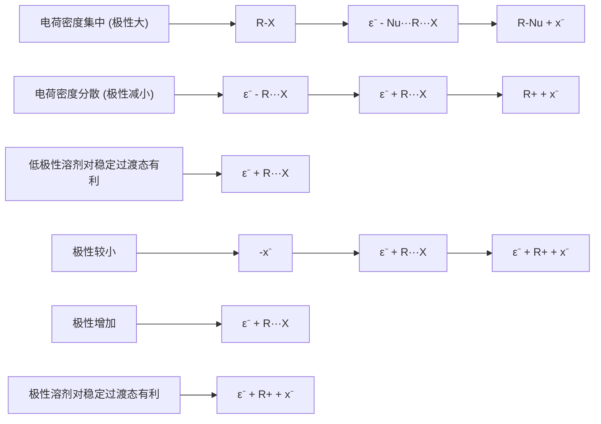

# 一、有机化学07:00

# 1. 卤代烃的结构性质 07:03

# 1）卤代烷 07:59

\- 卤代烷的通式 08:06

![[04.卤代烃一_笔记_images/65ada263de496a08397a27f9d4baedcc2245ed5130ddbe433d64a14099cdb6f3.jpg]]

![[04.卤代烃一_笔记_images/ad7c986ea558b160fe2b6b5e0c3b03683b02135b1543769936c367cd80ecb4da.jpg]]

卤代烷通式：R-X（X = F, Cl, Br, I）

R-Cl, R-Br, R-I RF

性质接近

通常总称 卤代烷

基本结构: 通式为 $R - X$ ( $X = F, Cl, Br, I$ )，其中R代表烷基  
研究重点: 主要研究氯代烷、溴代烷、碘代烷，因氟代烷性质特殊需单独区分  
- 特殊说明: 碘代烷虽存在但因碘具有放射性而不常见

\- 卤代烷的分类 09:07

![[04.卤代烃一_笔记_images/c5a8939c8cd4cf8c80bcae04764121de4a952109cb0f17bae15da236d24185f6.jpg]]

![[04.卤代烃一_笔记_images/9dfda3f2cf7964b9dc54f2f80b5cd9b5ec55b99f34393167cb29ee083dda592b.jpg]]

<table><tr><td>按烃基的结构分类</td><td>CH₃CH₂X 饱和卤代烃</td><td>CH₂=CHCH₂X 不饱和卤代烃</td><td>芳香卤代烃</td></tr><tr><td rowspan="2">按卤素数目分类</td><td colspan="2">一卤代烃
CH₃CH₂Br</td><td>三卤代烃</td></tr><tr><td>二卤代烃
ClCH₂CH₂Cl
CH₂Br₂</td><td>连二卤代烃
倍二卤代烃</td><td>CHF₃ 氟仿(fluroform)
CHCl₃ 氯仿(chloroform)
CHBr₃溴仿(Bromoform)
CHI₃碘仿(Iodoform)</td></tr><tr><td rowspan="2">按卤素连接的碳原子分类</td><td colspan="2">(CH₃)₂CHCH₂Cl</td><td rowspan="2">Br
CH₃CH₂CHCH₃
二级卤代烷
三级卤代烷</td></tr><tr><td colspan="2">一级卤代烷</td></tr></table>

○ 按烃基结构分类:

■ 饱和卤代烃（如 $CH_{3}CH_{2}Br$ ）  
■ 不饱和卤代烃（如 $CH_{2}=CHCH_{2}X$ ）  
■ 芳香卤代烃（特殊不饱和类）

\- 按卤素数目分类:

■ 一卤代烃（如溴乙烷）  
二卤代烃：

- 连二卤代烃（卤素连相邻碳，如 $ClCH_{2}CH_{2}Cl$ ）  
● 偕二卤代烃（卤素连同一碳，如 $CH_{2}Br_{2}$ ）

■ 三卤代烃：

- 卤仿类（ $CHX_{3}$ ，如氯仿 $CHCl_{3}$ 、溴仿 $CHBr_{3}$ 、碘仿 $HI_{3}$ ）  
四氯化碳 $CCl_{4}$

○ 按连接碳级分类:

■ 一级（伯）卤代烷（如 $(CH_{3})_{2}CHCH_{2}Cl$ ）  
■ 二级（仲）卤代烷（如 $CH_{3}CH_{2}CHBrCH_{3}$ ）  
■ 三级（叔）卤代烷（如 $(CH_{3})_{3}C-I$ ）  
■ 特殊：甲基卤代烷

\- 卤代烷的命名 11:33

# ○ 普通法和俗称

学而思培优

![[04.卤代烃一_笔记_images/1d66bebc5648f130b624761fde057d62f3958aa92b3befbe2e10d970820d9034.jpg]]

<details>
<summary>chemical</summary>

Chemical structures of n-butyl chloride and bromide derivatives with Chinese labels
</details>

# 命名规则:

● 将烷基作为主体（如正丁基氯、异丁基氟）  
● 特殊命名：氯仿（三氯甲烷）、溴仿等

# ■ 双语对照:

- 正丁基氯 → n-butyl chloride  
- 仲丁基溴 → sec-butyl bromide   
- 叔丁基碘 $\rightarrow$ tert-butyl iodide

学源思培优

卤代烷的命名

\- 普通法和俗称：

![[04.卤代烃一_笔记_images/f9e64e142a56c007f665070251c63bddd8cd824edf342b3f4fedd1054b75e971.jpg]]

<details>
<summary>chemical</summary>

Chemical structures of tert-butyl bromide and tert-butyl bromide with labeled functional groups including isobutyl, isobutyl, and chloroform
</details>

叔溴丁烷

![[04.卤代烃一_笔记_images/e95d149e409ece670e921198ba327dad6e25827ecc96844d3d059fd6e3ca9571.jpg]]

# ■ 两种视角:

- 烷烃为母体（正溴丁烷、仲溴丁烷）  
- 卤化物为母体（正丁基溴、仲丁基溴）

# ■ 记忆要点:

● 必须掌握正/异/仲/叔丁基结构  
- 氯仿有甜味但不可食用

# - IUPAC命名法 13:15

学而思培优

![[04.卤代烃一_笔记_images/c651f620ad8af51ab313e3d54ca0b1e49c978a74da664f001143a61a1f07b64d.jpg]]

IUPAC命名法选取含卤素的最长碳链为主链

![[04.卤代烃一_笔记_images/26379c4a9847e30bb76539e9f2aa0ecaf93153ce2510224c6bc295d04e10b908.jpg]]

(4R)-2-甲基-4-氯辛烷

![[04.卤代烃一_笔记_images/1407cda3de52327cc9dbd20feb39c2015ecab367f3eb41df1b1c0d2cdd2a8117.jpg]]

![[04.卤代烃一_笔记_images/ceb32e7cc924b7e437d9a6ec555b5da0fda9aba6afbc646568b3210a5be897f7.jpg]]

![[04.卤代烃一_笔记_images/465b6fd8c1100179ac2f992387c7b018254ea8e14619986c8ac5baa452c9cd53.jpg]]

# 命名步骤:

- 选取含卤素的最长碳链为主链  
- 使取代基位次编号最小   
● 标明立体构型（R/S）

# 实例解析:

● (4R)-2-甲基-4-氯辛烷：主链8碳，4位R构型  
● 2S,3S-二氯三溴丁烷：编号时使较小取代基位次更低   
● 1r3r-二溴环己烷：需标明两个手性中心构型

# ■ 注意事项:

- 卤素作为取代基而非官能团命名  
- 立体构型标注需加括号  
- 多卤代物需区分连/偕二卤代烃

# 2. 卤代烃的物理性质 18:04

# 1）卤代烃的极性与电负性 18:09

学而思培优  
![[04.卤代烃一_笔记_images/469270dc882115709d4bdc8659982b5dc53753c54fe31f8c7fa841cbbfd71600.jpg]]

![[04.卤代烃一_笔记_images/7a7587a78fb940951a41487624489f70f147c9121585efcb255f8b8b763be183.jpg]]

![[04.卤代烃一_笔记_images/4099557254c2a50b006f4048405bfe13edbfb62ed1da48f42ca46c1d5fb2b521.jpg]]  
Methyllithium

![[04.卤代烃一_笔记_images/9ded5f50b56aefa9415fead6cbd3fec13d94f60afaa7142f368b480cbf9bd150.jpg]]

![[04.卤代烃一_笔记_images/a276fb56e4acac24b90c2e598dbb5ba7c2f0b61f55e28df3c35508766acc9517.jpg]]

<table><tr><td>H</td><td>C</td><td>N</td><td>O</td><td>F</td></tr><tr><td>2.1</td><td>2.5</td><td>3.0</td><td>3.5</td><td>4.0</td></tr><tr><td></td><td></td><td>P</td><td>S</td><td>Cl</td></tr><tr><td></td><td></td><td>2.1</td><td>2.5</td><td>3.0</td></tr><tr><td></td><td></td><td></td><td></td><td>Br</td></tr><tr><td colspan="4">一些元素的电负性</td><td>2.8</td></tr><tr><td></td><td></td><td></td><td></td><td>I</td></tr><tr><td></td><td></td><td></td><td></td><td>2.5</td></tr></table>

- 电负性差异：F(4.0)、Cl(3.0)、Br(2.8)、I(2.5)与C(2.5)的电负性差值分别为1.5、0.5、0.3、0，说明C-F键极性最大  
● 特殊现象：虽然C-I电负性差为0，但仍表现为拉电子基团，实际电负性比标称值更大  
- 对比案例：N(3.0)和P(2.1)的电负性差异，P的电负性反而比C小

# 2）卤代烃的电子云密度与颜色表示 19:17

● 电子云偏移规律：电子云总是向电负性更大的原子偏移  
- 可视化表示:

\- 红色区域：电子密度高（带负电）

\- 蓝/绿色区域：电子密度低（带正电）

● 甲基锂案例：Li(1.0)与C(2.5)形成极性共价键时，电子云向碳偏移，与卤代烃情况相反

# 3）卤代烃的偶极矩与键能 20:30

学而思培优  
![[04.卤代烃一_笔记_images/17b924f7b80a2ebef368d995928b51ff3879691c55ba8814a2f766d1c16a7f85.jpg]]

![[04.卤代烃一_笔记_images/717e3bb40d6c332fb6108cf9d13abe8284ee536473cf84d58bac6b500ae7d7aa.jpg]]

![[04.卤代烃一_笔记_images/bb907911abda11b989c94aaabdd2c328dc3766831c837294b1166e8dc1a6b9c0.jpg]]

![[04.卤代烃一_笔记_images/5fda893a7d36c623c09ef79912f759e3d7fb45dd32d5b3026fadf1d82d9a71ed.jpg]]

<table><tr><td>Halomethane</td><td>Bond length (pm)</td><td>(kJ/mol)</td><td>(kcal/mol)</td><td> $\left( {\mathrm{{cm}}/{\mathrm{m}}^{2}}\right)$ </td><td>pole moment (D)</td></tr><tr><td> ${\mathrm{{CH}}}_{3}\mathrm{\;F}$ </td><td>139</td><td>460</td><td>110</td><td>1.85</td><td></td></tr><tr><td> ${\mathrm{{CH}}}_{3}\mathrm{{Cl}}$ </td><td>178</td><td>350</td><td>84</td><td>1.87</td><td></td></tr><tr><td> ${\mathrm{{CH}}}_{3}\mathrm{{Br}}$ </td><td>193</td><td>294</td><td>70</td><td>1.81</td><td></td></tr><tr><td> ${\mathrm{{CH}}}_{3}\mathrm{I}$ </td><td>214</td><td>239</td><td>57</td><td>1.62</td><td></td></tr></table>

![[04.卤代烃一_笔记_images/a18f1e9927554e02c0b832f5d176efd34477119e2c3e17e2eee24d490c65d593.jpg]]  
Methyllithium

![[04.卤代烃一_笔记_images/483c6da4970a1c435bcb0cc2a971e0d7ef9c650856d86ee4de57375fd665b900.jpg]]  
的电贝性

![[04.卤代烃一_笔记_images/8abc1262277e5ba832813f23b0eca0293435d6d0f162160fb8bd9b0c215ca1d4.jpg]]

![[04.卤代烃一_笔记_images/9a0b258786a125a7e863021711f454f944751a64927fc5a0238ae2ee06f27d35.jpg]]

![[04.卤代烃一_笔记_images/3d328d98ad956a52d41467f260ea209bddb830a46e25c015693a4af82bafc002.jpg]]

![[04.卤代烃一_笔记_images/0ea33dd528630824a0605ee576808f7af99a94cef2a4b40cd90c679b0a04562e.jpg]]

![[04.卤代烃一_笔记_images/13c712dfe67ad2b5db733581224a1707c49aeb5b31452802041b1889f89e55ed.jpg]]

![[04.卤代烃一_笔记_images/0fa6cf3cd0af002ce867ae1f8f9c4a8acde9cfe091fc9d5db8c9f8186fc774b9.jpg]]

- 偶极矩反常现象： $\mathrm{CH}_3\mathrm{F}(1.85\mathrm{D}) < \mathrm{CH}_3\mathrm{Cl}(1.87\mathrm{D})$ ，尽管F电负性更大   
- 原因：F原子半径小导致电荷中心距离(l)缩短，根据 $\mu=q\times l$ 公式，总偶极矩减小  
● 键能特点：

○ C-F键能(460kJ/mol)接近C-H/C-C键   
○ 键长：C-F(139pm) < C-C(154pm) < C-H(110pm)

● 稳定性应用：不粘锅涂层使用氟代烃，因其高温稳定性远优于其他卤代烃

# 4）卤代烃的物态与比重 24:10

# 卤代烷的物理性质简介

- 物态：一般为液体，高级为固体，少量为气体  
- 比重：一般 $d > 1$ ，一氯代物通常 $d < 1$ 。  
- 溶解度：不溶于水，易溶于有机溶剂   
- 其它：多卤代物一般不燃烧

物态规律：

- 低级卤代烷：气体（如 $CH_{3}F$ 、 $CH_{3}Cl$ ）  
- 中级卤代烷：液体  
- 高级卤代烷：固体

\- 比重特点：

○ 多数d>1  
○ 一氯代物例外 (d<1)

5）卤代烃的溶解度与燃烧性 24:39

\- 溶解特性：

- 不溶于水（极性不足）  
○ 易溶于有机溶剂

● 燃烧特性：多卤代物一般不燃烧（特别是全氟化合物）

3. 可极化性 25:04

学而思培优

![[04.卤代烃一_笔记_images/1b0cc65dde96caf58ed7cb0e6cf61c560dcdf6a8ef0a46d884c4b453c4cbdade.jpg]]

# 可极化性

影响可极化性的因素：

\* 原子核对电子控制弱，可极化性大。所以同一族由上至下  
可极化性增大。同一周期由左至右可极化性减小。  
\* 孤电子对比成键电子对可极化性大。  
\* 弱键比强键可极化性大。  
\* 处于离域状态时比处于定域状态时可极化性增大。  
卤代烷可极化性次序为：RI > RBr > RCl > RF   
可极化性大的分子易发生化学反应。

4

● 定义：在外电场作用下电子云变形的能力

● 影响因素：

- 原子核对电子控制弱→可极化性大  
○ 同族：自上而下增大（半径增大）  
○ 同周期：自左至右减小（核电荷增加）  
○ 孤对电子 > 成键电子  
○ 弱键 > 强键  
○ 离域状态 > 定域状态

- 卤代烷次序：RI > RBr > RCl > RF   
● 反应活性：可极化性越大越易反应（如C-I键易断裂）

4. 诱导效应 27:02

1）诱导效应的定义 27:08定义：因分子中原子或基团的极性不同而引起成键电子云沿着原子链向某向移动的效应称为诱导效应。

![[04.卤代烃一_笔记_images/857dc4afca765d3eb15b2ff8c46be7d00377188afec95d78651625b1df5f0985.jpg]]

![[04.卤代烃一_笔记_images/560d9abbfd7352fd254431f7b3c79231af3f2d13412ffec79c1862919d0b68b2.jpg]]  
$\sigma$ -电子发生偏移，X起吸电子作用。

![[04.卤代烃一_笔记_images/87985552f28ca7934aefea84cb9da917e6ee5e9ff6054a7dc103030ffd2b474e.jpg]]

特点  
\*沿原子链传递。  
\*很快减弱（三个原子）  
![[04.卤代烃一_笔记_images/94b6e9ed79a2c241a5bcbbeaf7921a8f25c07b28215fc67d9ad3d5d001d14fa1.jpg]]

![[04.卤代烃一_笔记_images/164ae35c8830f7629ea9df10f57ed16642ecd8c1794807e893c5429e0007dbc4.jpg]]  
—CCl₃，—CF₃
(强) 吸电子基团
(electron withdrawing group)

本质：极性差异导致电子云沿σ键定向移动  
● 作用范围：通常影响3个原子后显著减弱

2）诱导效应的特点 27:34

\- 累积效应：如CCl₃的吸电子能力是单个CI的叠加

● 酸碱度影响：

○ 三氟乙酸酸性远强于乙酸  
○ 机理：F的强吸电子效应使O-H键极性增强

3）常见的吸电子基团与给电子基团 30:21

![[04.卤代烃一_笔记_images/280cfa8a7838e8c29ca75a9c2a7bf7dbc5296d10a65c2024ab4a52967f3609bf.jpg]]

常见的吸电子基团（吸电子诱导效应用-I表示） $\mathrm{NO}_2 > \mathrm{CN} > \mathrm{F} > \mathrm{Cl} > \mathrm{Br} > \mathrm{I} > \mathrm{C} \equiv \mathrm{C} > \mathrm{OCH}_3 > \mathrm{OH} > \mathrm{C}_6\mathrm{H}_5 > \mathrm{C} = \mathrm{C} > \mathrm{H}$

常见的给电子基团（给电子诱导效应用+I表示） $(\mathrm{CH}_{3})_{3}\mathrm{C} > (\mathrm{CH}_{3})_{2}\mathrm{C} > \mathrm{CH}_{3}\mathrm{CH}_{2} > \mathrm{CH}_{3} > \mathrm{H}$

![[04.卤代烃一_笔记_images/8ed180296650d824d43791fe4ac0918fcf938594c7d628d40ff8263854888c8c.jpg]]

吸电子基(-I):

○ 排序: $NO_{2}>CN>F>Cl>Br>I>C\equiv C>OCH_{3}>OH>C_{6}H_{5}>C=C$   
○ 判断标准：吸电子能力>H

\- 给电子基(+I):

○ 排序: $(CH_{3})_{3}C>(CH_{3})_{2}CH>CH_{3}CH_{2}>CH_{3}>H$   
○ 特殊现象：虽然C(2.5)>H(2.1)，但烷基表现为给电子

5. 共轭效应 32:35

1）共轭体系的定义 32:40

● 结构特征: 单双键交替出现的体系, 如 C = C - C = C - C = C 结构

● 类型区分:

- $\pi$ - $\pi$ 共轭： $\pi$ 键之间的电子离域  
o p-π共轭：p轨道（含孤对电子或空轨道）与π键的相互作用

\- 稳定作用: 能稳定自由基、碳正离子等活性中间体, 如烯丙基正离子可通过共振式 $[CH_{2} = CH - CH_{2}^{+} \leftrightarrow CH_{2}^{+} - CH = CH_{2}]$ 分散正电荷

2）共轭效应的定义 33:22

● 本质: 共轭体系中原子间相互影响导致π电子（或p电子）分布变化的电子效应

● 作用表现:

- 使单键获得部分双键特性（如键长缩短、旋转受阻）  
○ 增加原子间电子云密度（如碳碳单键电子密度增大）

● 表示方法:

○ 给电子共轭效应：用 + C 表示（如氯乙烯中 Cl 的孤对电子参与共轭）  
○ 吸电子共轭效应：用 -C 表示（如羰基中氧原子吸引 π 电子）

# 3）吸电子共轭效应 35:38

![[04.卤代烃一_笔记_images/32bec13dcfbaaf5207a11078859b52f71ee321dc26898c806f1ce2ca9354b710.jpg]]

# 共轭效应

共轭体系：单双键交替出现的体系。

![[04.卤代烃一_笔记_images/dcdbf9dfcdb1897e9ef2f574f67f1767c4608de2353c6917f4665a5ff216f2da.jpg]]  
$\pi - \pi$ 共轭  
$\mathbf{p} - \pi$ 共轭

定义：在共轭体系中，由于原子间的一种相互影响而使体系内的 $\pi$ 电子（或p电子）分布发生变化的一种电子效应。

给电子共轭效应用+C表示

![[04.卤代烃一_笔记_images/98412ed8dd313de799522715bd9532ce87ad47917434ff4fb463eab86a2fabbe.jpg]]

吸电子共轭效应用-C表示

![[04.卤代烃一_笔记_images/8e26eb52a7b0caa5903a1b8d167d334167fd90f116f4fbbcf707981d45b78f69.jpg]]

特点：1 只能在共轭体系中传递。

2 不管共轭体系有多大，共轭效应能贯穿于整个共轭体系中。

![[04.卤代烃一_笔记_images/7e63d43c162b84b88e2fe5365414d8c4fd1ceea165c308fbc71feb34e1ecd2e7.jpg]]

● 典型实例: 在 C = O 键中, $\pi$ 电子偏向氧原子, 可通过共振式 $C^{+} - O^{-} \leftrightarrow C = O$ 描述

● 传递特性:

沿共轭链持续传递（与诱导效应不同，后者在3个键后基本消失）  
正电荷可通过共轭体系分散（如 $CH_{2}=CH-CH=CH-CH_{2}^{+}$ 中正电荷离域）

# 6. 超共轭效应 36:17

# 1）超共轭效应的定义 36:19

![[04.卤代烃一_笔记_images/943073d0c907036450e12e5d5d76f35aa8a9002dee7bd646a4234e50dfc76ee6.jpg]]

# 超共轭效应

定义：当C-Hσ键与π键（或p电子轨道）处于共轭位置时，也会产生电子的离域现象，这种C-H键σ电子的离域现象叫做超共轭效应。

![[04.卤代烃一_笔记_images/465a182d2533ef7e24cd70b4ed69d035ba1c76f692fd13c1be5e8424d3721814.jpg]]  
$\sigma - \pi$ 超共轭

![[04.卤代烃一_笔记_images/3ebaefb7cb1f2399d28078c876e50b8097fdf5baa4e5ddc221cd04b3ff8e3d50.jpg]]  
$\sigma -\mathbf{p}$ 超共轭

在超共轭体系中，电子偏转的趋向用弧型箭头表示。

![[04.卤代烃一_笔记_images/8ca48a0d9956e83191ae06b68e7ab17855dcac67f0681c19669697f3c8d66161.jpg]]

![[04.卤代烃一_笔记_images/db5cf4bd0a72c7223aca2aed78efdae42316e782745300eed27c541dd1495d10.jpg]]

● 基本概念: 当 C-H 的 $\sigma$ 键与 $\pi$ 键（或 p 轨道）共轭时， $\sigma$ 电子发生离域的现象

● 作用形式:

- σ-π超共轭：如乙烷中C-H键与相邻C-C键的相互作用  
- σ-p超共轭：如碳正离子中C-H键与空p轨道的相互作用

● 轨道机制: C - Hσ键轨道与π/p轨道重新组合形成能量更低的分子轨道

# 2）超共轭效应的特点 37:51

![[04.卤代烃一_笔记_images/5cc18a606472f3f4cdecac19366996c13fabf58b7be400f24831586c7582f331.jpg]]

![[04.卤代烃一_笔记_images/2d5a81d5298441920f85c687619d47476e3c67c27cc71af89b291fb4a2e7452e.jpg]]

特点：1 超共轭效应比共轭效应弱得多。

2 在超共轭效应中， $\sigma$ 键一般是

给电子的，

C-H键越多，超共轭效应越大。

$-\mathrm{CH}_{3} > -\mathrm{CH}_{2}\mathrm{R} > -\mathrm{CHR}_{2} > -\mathrm{CR}_{3}$

![[04.卤代烃一_笔记_images/b2911aa56865c9f2ccba2d1a210c4309b4350b93b1f8aee532b4421b3b74d1d6.jpg]]

● 相对强度: 显著弱于共轭效应（因σ轨道与π/p轨道能量差较大）  
● 电子流向: σ键通常表现为给电子效应（含电子对）  
● 轨道限制:

- 需要满足对称性匹配   
○ 轨道重叠程度有限（斜向重叠效率低）

3）超共轭效应中C-H键数量的影响 38:57

![[04.卤代烃一_笔记_images/968729629c2bb985861f66752e04001799652ebe450ae3582b5717349e738987.jpg]]

# 超共轭效应

定义：当C-Hσ键与π键（或p电子轨道）处于共轭位置时，也会产生电子的离域现象，这种C-H键σ电子的离域现象叫做超共轭效应。

![[04.卤代烃一_笔记_images/11e4779c095c4ce3310e1448182268eff0de4f955c12d37904977e815576c75f.jpg]]  
$\sigma - \pi$ 超共轭

![[04.卤代烃一_笔记_images/999ae5a1299358b999f095fbac54718c9dc9bd5bb3585d67e4f3a36cf13ab8f2.jpg]]  
σ-p 超共轭

![[04.卤代烃一_笔记_images/98bafb93bf68a72778605b304b5d81e78511aae827dd9d72c06ef42c172723a1.jpg]]

在超共轭体系中，电子偏转的趋向用弧型箭头表示。

数量规律: C - H 键越多效应越强，排序为 $-CH_{3} > -CH_{2}R > -CHR_{2} > -CR_{3}$

● 能量原理:

○ $C - H\sigma$ 键电子能量高于 $C - C\sigma$ 键  
- 更易与π/p轨道发生有效相互作用

\- 稳定作用: 解释叔碳正离子 $(-CR_{3})$ 比伯碳正离子 $(-CH_{3})$ 更稳定的现象

7. 芳环或碳碳双键直接相连的卤素 40:08

1）超共轭效应 40:09

![[04.卤代烃一_笔记_images/f23060c1fd9b53411f16067dad5cc90d9364161b41dad50240060bf36d48df9c.jpg]]

![[04.卤代烃一_笔记_images/f108642fac71d63351304cce4cd50db5285c286814c116ee336b367a681e4942.jpg]]

特点：1 超共轭效应比共轭效应弱得多。
2 在超共轭效应中， $\sigma$ 键一般是给电子的，
C-H 键越多，超共轭效应越大。

$$
- \mathrm{CH} _ {3} > - \mathrm{CH} _ {2} \mathrm{R} > - \mathrm{CHR} _ {2} > ^ {\text { 4 }} - \mathrm{CR} _ {3}
$$

![[04.卤代烃一_笔记_images/1328be0c87a9df91617c00fa746937e59b6504c6af000766b4e515d6b3789f2d.jpg]]

![[04.卤代烃一_笔记_images/07760b8c60a9abe4bf4e7389b0936c5581b3f66416aa52c9343d00c2940b84d8.jpg]]

强度比较: 超共轭效应比共轭效应弱得多

● 电子给予性: 在超共轭效应中， $\sigma$ 键一般是给电子的

● C-H键影响: C-H键越多，超共轭效应越大，顺序为 $-CH_{3}>-CH_{2}R>-CHR_{2}>-CR_{3}$

● 能量关系:

○ 碳碳键电子吸引作用强，电子能量更低  
- 碳氢键电子吸引作用较弱，电子能量相对较高  
○ 能量差越大，轨道重叠性质越差

● 碳碳键作用: 碳碳键也能产生超共轭效应，但强度较弱，通常不考虑

2）与芳环或碳碳双键直接相连的卤素的特性 41:22

与芳环或碳碳双键直接相连的卤素，具有特性

![[04.卤代烃一_笔记_images/dc328a3e13d7be3189b8bbd4f38a34b8f9476139f9cf61b4ebe1a2698f6d22ce.jpg]]

<details>
<summary>chemical</summary>

Chemical reaction diagram showing CICH=CH₂ catalyst with π bond formation and p-π共轭 mechanism involving C, Cl, and p orbitals
</details>

![[04.卤代烃一_笔记_images/f4bdf55dbed98c81cdd72d6144fa76b4e3b959add6131ed9a18a9d6f258635a0.jpg]]

# p-π共轭:

- 卤素p电子可与π电子形成p-π共轭  
例如氯乙烯 $(ClCH = CH_{2})$ 形成 $\pi 34$ 大π键  
○ 氯苯 $(C_{6}H_{5}Cl)$ 形成π78大π键

# ● 效应比较:

- 吸电子诱导效应(-I)强于给电子共轭效应  
- 虽然存在p-π共轭，但净效应仍为吸电子

# - 轨道差异:

○ 碳(第二周期)与卤素(第三周期)轨道大小形状不同  
- 但仍可形成有效的p-π共轭

# 3）碳正离子

学而思培优

\- 碳正离子：一类碳上只带有六个电子的活泼中间体

![[04.卤代烃一_笔记_images/71cd63738c5d0333b798a5012a4d5e7b2d3e5b4304a5a697363ad1be9f1fe0ad.jpg]]

<details>
<summary>chemical</summary>

Chemical structure diagram of sp² hybrid plane with labeled atoms and bond angles
</details>

碳正离子一般无法分离得到，可通过实验方法捕获：

![[04.卤代烃一_笔记_images/8728868fb739301d89acdb856276a2a4694469469596ccf965e65da4d21cbe9d.jpg]]

![[04.卤代烃一_笔记_images/8d7364963ebde671a590d0fada31c157b948218a1ded48e5f6d90fba7b02749d.jpg]]

定义: 碳上只带有六个电子的活泼中间体

● 杂化类型: $sp^{2}$ 杂化，平面型结构(键角约120°)

● 稳定性顺序: $3^{\circ} > 2^{\circ} > 1^{\circ} > CH_{3}^{+}$

# ● 实验观察:

通常无法分离得到  
○ 可通过超酸(如 $SbF_{5}$ )捕获  
例如: $\left(CH_{3}\right)_{3}CF+SbF_{5}\rightarrow\left(CH_{3}\right)_{3}C^{+}SbF_{6}^{-}$   
- 可用核磁共振观察

# ● 电子特性:

○ 与 $BH_{3}$ 为等电子体  
○ 高度缺电子，易被给电子基团稳定

# 8. 碳正离子 43:22

# 1）碳正离子的相对稳定次序 45:30

![[04.卤代烃一_笔记_images/1a837f902bb6688514f34c0388a9268cb9332ef7ef5cd22ce43a46202eb7c1d6.jpg]]

\- 碳正离子的相对稳定次序: $3^{\circ} > 2^{\circ} > 1^{\circ} > \mathrm{CH}_{3}$

![[04.卤代烃一_笔记_images/fea69503883c12d5323ffb4f0ace8769c21a01a0260131dbc78626a4298d71e5.jpg]]

<details>
<summary>chemical</summary>

Redox reaction equations for hydrogen and electron transfer in a catalyst, showing enthalpy changes
</details>

补充：苄基和烯丙基碳正离子的相对稳定性：

![[04.卤代烃一_笔记_images/5d305c1da40065305a739860161e7509a0e8bceb0842519c708a45600d57f8da.jpg]]

![[04.卤代烃一_笔记_images/b2c64c033e9f13e17515f53bc60b7d1b60d493d783dcb8259ea7135d6fecca62.jpg]]

● 稳定性规律： $3^{\circ}>2^{\circ}>1^{\circ}>CH_{3}^{+}$ ，苄基（ $PhCH_{2}^{+}$ ）和烯丙基（ $CH_{2}=CHCH_{2}^{+}$ ）稳定性介于 $2^{\circ}$ 和 $1^{\circ}$ 之间  
● 能量数据：生成焓 $\Delta H$ （kJ/mol）依次为970（3°）、1000（2°）、1040（1°）、1071（ $CH_{3}^{+}$ ）、1130（ $CH_{3}$ ）  
形成过程： $\Delta H = \Delta H_{1} + \Delta H_{2}$ ，其中 $\Delta H_{1}$ 为键离解能（C-H键断裂）， $\Delta H_{2}$ 为电离能（自由基失去电子）

# 2）影响碳正离子稳定性的因素 47:07

● 电子效应 47:14

![[04.卤代烃一_笔记_images/d2a4e2781e52c3144134bb907320dd93b25076d69543f4e5cbcb710b0325cc23.jpg]]

# 影响碳正离子稳定性的因素

1 电子效应：有利于正电荷分散的取代基使碳正离子稳定。  
2 空间效应：当碳与三个大的基团相连时，有利于碳正离子的形成。  
3 几何形状的影响

$(\mathbf{CH}_3)_3\mathbf{CBr}$   
![[04.卤代烃一_笔记_images/fdeb1e760818108dcdb454b2b17a132f83ebace8d6c26396794414352d198555.jpg]]  
$10^{-3}$

![[04.卤代烃一_笔记_images/a842b867a47948e0222c466373317f6e170dd53c3d28da8e7b590d360e28bac6.jpg]]  
$10^{-6}$

![[04.卤代烃一_笔记_images/1b87c607d94128e4b7ea35ca8f2f33e8d27eb96c79d20d4b447294043061a525.jpg]]  
10 $^{-11}$

![[04.卤代烃一_笔记_images/54f04a7b03d937b29ef39e7783e2ef335ddc1aba7547e8f22626e7d9602bb0c8.jpg]]

![[04.卤代烃一_笔记_images/ed51525c270e02bc5f23d52e76fdd52b75e9d425c57ffac3319e6791f3d202c0.jpg]]

电荷分散原理：正电荷越分散，碳正离子越稳定。取代基通过诱导效应和共轭效应分散正电荷  
○ 超共轭作用：烷基的σ-p超共轭使电子可在分子内离域，降低中心碳的正电性（如三级碳正离子有9个C-H键参与超共轭）

● 空间效应 47:37

○ 键角变化：碳正离子为 $sp^{2}$ 杂化（键角120°），相比四面体结构（109°28′）可缓解大基团间的空间排斥  
生成促进：三个大基团相连时，形成平面结构可显著降低空间位阻，如 $(CH_{3})_{3}CBr$ 解离速率比桥头溴代物快 $10^{11}$ 倍

\- 几何形状的影响 48:24

☐ 桥头碳限制：刚性环系（如桥头碳）无法实现 $sp^{2}$ 平面结构，导致碳正离子极不稳定，解离速率降至 $10^{-11}$ 量级  
○ 相对速率对比： $\left(CH_{3}\right)_{3}CBr(1) >$ 二级溴代烷 $(10^{-3}) >$ 一级溴代烷 $(10^{-6}) >$ 桥头溴代物 $(10^{-11})$

\- 溶剂效应 50:02

![[04.卤代烃一_笔记_images/e94a05502e16d65c57fdeab788d50f81dd805bbc3bf1465dbbd473d76f360c54.jpg]]

4 溶剂效应  
![[04.卤代烃一_笔记_images/b0d82a1095412a32a4c6f497d3f290a71425143a699e4ebb5eb92363fc55e1ce.jpg]]  
在气相中，需要836.8 kJ/mol。在水相中，需要83.7 kJ/mol。

卤代烷在溶剂中容易电离，是由于达到过渡态时所需要的大部分能量，可从溶剂和极性过渡态之间形成偶极偶极键来供给。

$$
\mathrm{R} - \mathrm{X} \longrightarrow \left[ \mathrm{R} ^ {\delta^ {+}} \dots \dots \mathrm{X} ^ {\delta^ {-}} \right] ^ {\ddagger} \longrightarrow \left| \mathrm{R} ^ {+} + \mathrm{X} ^ {-} \right.
$$

作用物 过渡态 产物

溶剂的极性越大，溶剂化的力量越强，电离作用也就越快

![[04.卤代烃一_笔记_images/44cbe5fb13f281f7d20959769d4fe2c1858d1b8526843e7aa8dbf2a02fe65390.jpg]]

能量差异: $\left(CH_{3}\right)_{3} CBr$ 解离时, 气相需 $836.8 \mathrm{~kJ} / \mathrm{mol}$ , 水相仅需 $83.7 \mathrm{~kJ} / \mathrm{mol}$   
○ 作用机制：极性溶剂通过偶极-偶极作用稳定过渡态 $[R^{\delta+}\cdots X^{\delta-}]$ 和产物 $R^{+}+X^{-}$   
○ 规律：溶剂极性越强，溶剂化作用越显著（水分子可同时稳定碳正离子和卤素负离子）

# 3）烷基对碳正离子的稳定作用 52:33

学而思培优 烷基对碳正离子的稳定作用——（诱导）给电子效应

稳定性

![[04.卤代烃一_笔记_images/485a2232a6e3ea6724806faf6bab7585d6867949c7a69d31cd96b7e8edc5460b.jpg]]

(通过单键传递的)

诱导给电子效应

烷基充当给电子基作用

(electron releasing group)

超共轭解释

![[04.卤代烃一_笔记_images/2d4791962f2effa9a091771794bf31923d95e97a69e7b67944d248d5c8dcb1f3.jpg]]

$\sigma$ 电子转移，使

电荷更分散，有

利于体系的稳定

$\sigma - p$ 超共轭

![[04.卤代烃一_笔记_images/5a76203ed8cd1d0be2bf4c83ac11b491193f0566a54643dd6eadb5893de4667c.jpg]]

# - 双重稳定机制：

○ 诱导效应：烷基通过 $\sigma$ 键给电子（ $\sigma^{+}$ 效应），比氢的供电子能力更强  
○ 超共轭效应：σ-p超共轭使电子离域，三级碳正离子有9个C-H键参与，二级6个，一级3个

● 稳定性证据： $\Delta H$ 数据证明 $3^{\circ}$ 最稳定（970 kJ/mol）， $CH_{3}^{+}$ 最不稳定（1130 kJ/mol）

# 4）π键对碳正离子的稳定作用 54:38

- 稳定机理：π键通过电子云分散作用稳定碳正离子，使正电荷密度不再集中，分散到整个共轭体系中，每个碳原子都带部分正电荷。  
● 共振式解释：烯丙基碳正离子可画出2个共振式，苄基碳正离子可画出4个共振式，共振式越多表明正电荷分散程度越高，稳定性越强。   
- 位置效应：在共轭体系中，正电荷可在邻位、对位、间位等多个位置分散，如苄基碳正离子的正电荷可分布在苯环不同位置。

# 5）p-p超共轭对碳正离子的稳定作用 56:21

● p-p超共轭的基本概念 56:26

![[04.卤代烃一_笔记_images/dbb673653d4571ec1205c8d0578b75977fe1af71b8362beac3944be5f2117f8d.jpg]]

$\pi$ 键对碳正离子的稳定作用

![[04.卤代烃一_笔记_images/d292b38549b2d7d616381c3f207dede375b04602652fe49acfed46b310e3cb49.jpg]]  
烯丙基碳正离子

![[04.卤代烃一_笔记_images/c340e1ed670be5215332db43e2f7c15dec05912a9bc664db94dcc5ae76fde688.jpg]]  
苄基碳正离子

$\pi -\mathbf{p}$ 超共轭

正碳离子的稳定性：

(共轭) 给电子

p轨道对碳正离子的稳定作用

$R_{2}C=CHCR_{2}>R_{3}C\approx RCH=CHCHR>R_{2}CH>RCH_{2}>CH_{3}$

![[04.卤代烃一_笔记_images/d79de51b0287a42a91279f2dab0f89642a240e7ad6fc3718e88cc01f735c9143.jpg]]

![[04.卤代烃一_笔记_images/05077b7c1066bef060e4209fd1bdc7ad5d7e7989523e602656d0d7091b72bd60.jpg]]  
p-p超共轭

![[04.卤代烃一_笔记_images/6420389550fd538a57aa26c12fa8627dfe82f08e7339d9c95e6db53cb582501c.jpg]]

O

定义：当碳正离子相邻原子（如O、卤素）具有填充电子的p轨道时，这些电子可离域到碳正离子的空p轨道中，形成p-p共轭。  
实例：烷氧基（-OR）的孤对电子可通过p-p共轭稳定相邻碳正离子，形成氧带正电荷的共振式，使各原子满足八隅体结构。

● p-p超共轭对碳正离子稳定性的解释 56:50

○ 电子转移：杂原子（如O、卤素）的p轨道电子向碳正离子空轨道转移，降低正电荷密度。  
共振效应：可写出杂原子带正电荷的共振式，虽然实际正电荷仍在碳上，但共振结构使体系更稳定。  
- 对比强度：p-p共轭的给电子作用强于单纯诱导效应，是稳定碳正离子的主要因素。

● 碳正离子稳定性的比较 57:33

- 稳定性规律： $R_{2}C^{+}>R_{3}C^{+}>R_{2}CH^{+}>RCH_{2}^{+}>CH_{3}^{+}$   
○ 特殊案例：烯丙基碳正离子（ $R_{2}C=CH-CR_{2}^{+}$ ）稳定性与三级碳正离子相当，因其共轭效应补偿了取代基数目的差异。

\- 三氟甲基碳正离子的稳定性分析 59:52

- 反常稳定性：尽管F有强吸电子诱导效应，但三氟甲基碳正离子（ $\mathrm{CF}_3^+$ ）通过形成π46离域体系稳定正电荷。  
- 对比分析： $\mathrm{CF}_{3}^{+}$ 比 $\mathrm{CCl}_{3}^{+}$ 更稳定，因为F的2p轨道与C的2p轨道能级匹配更好，形成的π46体系更稳定。  
○ 能量壁垒：破坏 $CF_{3}^{+}$ 的平面结构需要克服更大的 $\pi46$ 离域能，反映在其较低的路易斯酸性上。

● 常见的碳正离子稳定性排序 01:01:01

○ 综合排序：烯丙基/苄基 ≈ 三级 > 二级 > 一级 > 甲基碳正离子  
○ 结构特征：稳定性不仅取决于取代基数量，共轭效应（π键、p-p共轭）可显著提升稳定性，如烯丙基虽为一级碳正离子，但因共轭作用与三级相当。

6）碳正离子的重排性 01:01:34

● 重排本质：不稳定碳正离子通过结构重组形成更稳定的碳正离子  
● 典型反应：1,2-H迁移和1,2-CH3迁移是两种主要重排形式

● 1,2-H迁移的动力 01:01:49

- 驱动力：生成更稳定的碳正离子（如从伯碳正离子重排为仲碳正离子）  
○ 能量变化：虽然两者都不稳定，但体系总能量降低是反应发生的根本原因  
- 过渡态特征：形成环状过渡态结构，氢原子在迁移过程中与两个碳原子同时成键

● 超共轭效应解释1,2-H迁移 01:02:24

![[04.卤代烃一_笔记_images/0f0558463b5d568744bcb0255402595d3b6bc2ffa909e1823ebc6f838272bae4.jpg]]

<details>
<summary>chemical</summary>

碳正离子重排性反应示意图，展示氢化反应过程
</details>

迁移动力：生成更稳定的正碳离子

○ 电子转移：C-H键σ电子向碳正离子空p轨道离域（超共轭效应）

○ 迁移过程:

■ 氢原子携带电子对迁移至相邻碳原子  
■ 原C-H键电子完全转移到p轨道形成新的碳正离子

\- 理论解释：高等有机化学中可用超共轭理论完美解释该现象

● 其它形式的碳正离子重排 01:03:47

![[04.卤代烃一_笔记_images/5dd83535299ba591c351aff9ea6722fe515b1429fea31d8a27bec8b0c8a44a06.jpg]]

<details>
<summary>chemical</summary>

碳正离子重排反应示意图，展示1,2-H和1,2-CH3迁移过程及扩环步骤
</details>

○ 迁移类型：除H迁移外还包括甲基迁移和环系重排  
○ 共同特点：所有重排都趋向于形成更稳定的结构

● 1,2-CH3迁移的可能性 01:04:06

- 作用机制：C-C键σ电子微弱离域（虽弱于C-H超共轭但仍存在）  
○ 电子转移：甲基迁移时C-C键电子向空p轨道转移  
- 反应活性：相比H迁移需要更高活化能，但热力学有利时仍可发生

● 扩环反应与环张力减小 01:04:28

○ 典型案例：四元环→五元环的扩环重排   
○ 能量平衡：

■ 碳正离子稳定性降低（三级→二级）  
■ 环张力显著减小（四元环→五元环）

- 整体效应：体系总自由能下降驱动反应发生  
- 重要原则：需从整个分子体系角度评估重排的可行性

9. 溴乙烷与氢氧化钠的反应 01:05:08

● 反应方程式: $CH_{3}CH_{2}-Br+NaOH\rightarrow CH_{3}CH_{2}-OH+NaBr$   
- 初中认知：该反应在初中被称为复分解反应，也可视为强基（ $OH^{-}$ ）取代溴原子生成乙醇的过程

1）亲核取代反应 01:05:55

![[04.卤代烃一_笔记_images/fe1d0bd3ce777c6f38a755437edddc35205485f74aa7fc6f9fb46b38b190765f.jpg]]

<details>
<summary>text_image</summary>

溴乙烷与NaOH的反应：
CH₃CH₂—Br + NaOH → CH₃CH₂—OH + NaBr
中心碳原子
RCH₂-A + Nu: → RCH₂-Nu + A:
底物 (进入基团) 产物 离去基团
受进攻
的对象
亲核试剂
一般是负离子或带未
分电子对的中性分子
C 12 p
复分解
取代
应称
心碳原
</details>

● 定义: 有机化合物分子中的原子或原子团被亲核试剂取代的反应  
- 反应本质:

○ 键变化: 中心碳原子与离去基团（如Br）的键断裂，亲核试剂与中心碳原子形成新键  
○ 电性作用：碳原子带部分正电（δ+），亲核试剂（如 $OH^{-}$ ）带负电，通过正负电荷吸引完成取代

● 命名解析: "亲核"指试剂对原子核的亲和性, "取代"描述反应结果  
- 卤代烷的亲核取代反应 01:08:46

![[04.卤代烃一_笔记_images/5082ec23fcad753de129277e0f653ac2a9a8161bcbf914fa6864002e00f761eb.jpg]]

# 卤代烷的亲核取代反应

$(S_{N}$ 反应，Nucleophilic Substitution Reaction)

![[04.卤代烃一_笔记_images/f52d15662b4e944d514f116166ad384bef556960ddb776be71a578e3a6bdf15b.jpg]]

<details>
<summary>chemical</summary>

Reaction mechanism diagram showing substrate formation with negative ionization and neutralization steps
</details>

分子型亲核试剂

亲核试剂：
至少含有一
对未共用电子对  
![[04.卤代烃一_笔记_images/9f199e31e904d4fc31490497562edae5505f4f238636065e1e088772441250c7.jpg]]

反应通式: $R - X + Nu^{-} \rightarrow R - Nu + X^{-}$   
○ 分子型试剂: $R - X + H - Nu \rightarrow R - Nu + H - X$   
- 亲核试剂特征: 必须含有至少一对未共用电子对  
○ 亲核试剂类型:

■ 孤对电子型（如 $OH^{-}$ ）  
■ π型（如烯烃π电子）  
■ σ型（如 $AlH_{4}^{-}$ 中的Al-Hσ键电子）

● 与负离子型亲核试剂的反应 01:10:48

![[04.卤代烃一_笔记_images/c865fa9904fed43472d623ecf053732b47355561a12e8039728679c127f68a39.jpg]]

- 与负离子型亲核试剂的反应  
![[04.卤代烃一_笔记_images/1e91813be31d3034e5e87bf6e158bfff788f65c1122974434df5bce49fb7a22c.jpg]]

<details>
<summary>chemical</summary>

Chemical reaction diagram showing nucleophilic addition of a radical species to a tertiary amine, with corresponding chemical structures for phenol and aldehyde derivatives.
</details>

○ 常见试剂及产物:

$OH^{-} \rightarrow \text{醇 } (R - OH)$   
$RO^{-} \rightarrow \text{醚 } (R - OR')$   
$SH^{-} \rightarrow$ 硫醇 (R - SH)   
■ $SR^{-}\rightarrow$ 硫醚 $(R - SR^{\prime})$   
$CN^{-} \rightarrow$ 腈 (R - CN)   
■ 炔基负离子 → 高级炔 $(R - C \equiv C - R')$   
■ 丙二酸酯负离子 $\rightarrow$ 烷基丙二酸酯 $(R - CH(CO_{2}Et)_{2})$

![[04.卤代烃一_笔记_images/de2efbe78dd644bdc83be40ef8a9b09216ca13d9adec1be94eabb62781222c66.jpg]]

![[04.卤代烃一_笔记_images/165edb1169dbb86c45682d84957116ff65e2c0131331e96ca02fa0e4f6f1ed89.jpg]]

<details>
<summary>chemical</summary>

Chemical reaction scheme showing nucleophilic substitution of a chiral molecule with R groups and their corresponding functional groups
</details>

○ 丙二酸酯特性: 由于两个强吸电子基团（酯基）的存在，α-H酸性增强，易形成稳定碳负离子  
- 碘离子作用: 可作为亲核试剂生成碘代烷

● 与分子型亲核试剂的反应 01:13:15

# ○ 溶剂解反应:

■ $H_{2}O \rightarrow$ 醇 $(R - OH)$   
■ $R'OH \rightarrow$ 醚 $(R - OR')$

# ○ 氨及胺类反应:

$NH_{3}\rightarrow$ 伯胺 $(R-NH_{2})$   
■ 伯胺 → 仲胺 (R - NHR')   
■ 仲胺 $\rightarrow$ 叔胺 $(R - NR'_{2})$   
■ 叔胺→季铵盐 $(R-NR'_{3}X)$

○ 季铵盐稳定性: 因八隅体结构稳定，不易分解为碳正离子

● 总结 01:14:36

```mermaid
graph TD
    A["R—X"] --> B["R—CH(CO₂Et)₂"]
    A --> C["R—CN"]
    A --> D["R—I"]
    A --> E["R—OH"]
    A --> F["R—OR'"]
    A --> G["R—SH (R—SR')"]
    A --> H["R—NH₂"]
    A --> I["R—NR'₂"]
    A --> J["R—COONa"]
    A --> K["R—C≡C-R'"]
    A --> L["R—O=C-R'"]
    A --> M["R—C≡C-R'"]
    A --> N["NaCH(CO₂Et)₂"]
    A --> O["NaCN"]
    A --> P["NaOH or H₂O"]
    A --> Q["NaOR' or HOR'"]
    A --> R["NaSH or NaSR'"]
    A --> S["伯胺"]
    A --> T["仰胺"]
    A --> U["叔胺"]
    A --> V["NHR'₂(H)"]
    A --> W["R—X"]
    X["烷基丙二酸酯"] --> Y["XMg—C≡C—R'"]
    X --> Z["or NaC≡C—R'"]
    AA["高级炔"] --> AB["XMg—C≡C—R'"]
    AC["R—X"] --> AD["R—CN"]
    AC --> AE["碘代物"]
    AC --> AF["醇代物"]
    AC --> AG["酮代物"]
    AC --> AH["酮代物"]
    AC --> AI["酮代物"]
    AC --> AJ["酮代物"]
    AC --> AK["酮代物"]
    AC --> AL["酮代物"]
```

![[04.卤代烃一_笔记_images/f2a8e70c6aa1b36abe2af79a0eca28d97369da081f4835a78a4630071be8b42d.jpg]]

<details>
<summary>flowchart</summary>


</details>

- 中间体特性: 卤代烷 (R-X) 是有机合成中的重要中间体  
- 产物多样性: 可通过不同亲核试剂制备醇、醚、硫醇、胺类等多种化合物  
- 反应选择性: 根据亲核试剂类型（负离子型/分子型）控制产物结构  
应用价值: 该反应体系是构建C-O、C-N、C-S等键的重要方法

# 10. 应用案例 01:18:26

# 1）例题:卤代烃的反应

学而思培优

![[04.卤代烃一_笔记_images/517ab03826e776c2ce791bdf2a2bedc51bb6e75ebda6cc3f3d87e370e3719741.jpg]]

<details>
<summary>chemical</summary>

Organic reaction scheme showing ethanol reacting with ethanol to form a hydroxy radical and aldehyde, producing 1,2,3,4 products.
</details>

![[04.卤代烃一_笔记_images/da8eef987f0da6a6fe38400974ff47714d9e54356f5c6ffd0b0d624ad46cba22.jpg]]

1、2、3号反应的特点是（1）速度随[OH]的浓度增加而加快（2）反应速度 $1 > 2 > 3$ 4号反应不受[OH]的浓度影响。这个实验说明：1、2、3的反应速度取决于卤代烷及碱的浓度。而4号反应的速度只取决于卤代烷的浓度。

# 反应特点对比：

○ 1、2、3号反应：

■ 反应速度随 $[OH^{-}]$ 浓度增加而加快  
■ 反应速度顺序：1号 > 2号 > 3号  
■ 速率取决于卤代烷和碱的浓度

○ 4号反应:

■ 不受 $[OH^{-}]$ 浓度影响  
■ 速率仅取决于卤代烷浓度

\- 反常现象分析：四号反应速率与溴离子无关，这与常规认知不同，暗示存在特殊反应机理

# 11. 二级动力学与一级动力学 01:20:40

反应速度依靠两个化合物的浓度，在动力学上为二级反应

反应速度= k[RX] [OH⁻]

$S_{N}2$

亲核取代双分子历程

反应速度依靠一个化合物的浓度，在动力学上为一级反应

反应速度= k[RX]

$S_{N}1$

亲核取代单分子历程

$k$ 代表反应的速度常数。

# SN2反应机理：

◦ 动力学特征：二级反应  
○ 速率方程：速率 = k[RX][OH⁻]   
- 分子过程：双分子亲核取代反应  
○ 特点：同时涉及卤代烷和亲核试剂浓度

# SN1反应机理：

◦ 动力学特征：一级反应  
○ 速率方程：速率 = k[RX]   
- 分子过程：单分子亲核取代反应  
○ 特点：仅取决于卤代烷浓度

# - 速率常数k:

○ 表征反应速率的常数  
- 与活化能、指前因子和温度相关  
- 在两种机理中具有不同的物理意义

# 12. 构型转化型反应 01:21:59

# 1）Hughes教授的实验介绍 01:22:03

![[04.卤代烃一_笔记_images/fd77816845418b46c9c53841f4f99af94368671e62cf6a7e1c1d05207b548e49.jpg]]

![[04.卤代烃一_笔记_images/79732d06237c82b36f18366fef1cfeb16ba31f58b893d610bf73f1eba9343ee2.jpg]]

1935年，伦敦大学的Hughes教授做了如下实验：

将光活性的2-碘辛烷与放射性同位素碘离子在丙酮

中进行取代反应。经测定发现，30℃时，

![[04.卤代烃一_笔记_images/e480556a2ab437425060f2a0913b09de22dc27843d8b9b7404bee51e219fb713.jpg]]  
光学纯

a. 消旋化速率取决于[RI]和[I-]   
b. 消旋化速度比同位素交换快一倍

● 实验设计：1935年伦敦大学Hughes教授将光学活性的2-碘辛烷(R构型)与放射性同位素碘离子( $I^{*}$ )在丙酮中进行取代反应

● 反应条件：实验在 $30^{\circ}C$ 下进行，观察到消旋化和同位素交换现象

● 关键试剂：使用放射性标记的 $NaI^{*}$ 作为亲核试剂，通过放射性检测追踪反应进程

2）消旋化概念的解释 01:22:41

\- 消旋化本质：将单一构型(如S型)化合物转化为等量对映体(R型和S型)混合物的过程

● 光学活性变化：消旋化后旋光度为零，但可能由两种构型相反的化合物(对映体)组成

● 实验现象：初始光学纯的R-2-碘辛烷反应后旋光性逐渐消失

3）实验结果分析：消旋化速率 01:23:46

1935年，伦敦大学的Hughes教授做了如下实验：

将光活性的2-碘辛烷与放射性同位素碘离子在丙酮

中进行取代反应。经测定发现，30℃时，

![[04.卤代烃一_笔记_images/c5ac71676bc6eb605521d65bc0bd9f7ffaeba8bc4853cb79cd31aab88b96fcda.jpg]]

<details>
<summary>chemical</summary>

Chemical reaction equation showing nucleophilic addition of sodium iodide to cyanide, leading to cyclization
</details>

a. 消旋化速率取决于[RI]和[I-]

b. 消旋化速度比同位素交换快一倍

● 速率决定因素：

\- 浓度依赖：消旋化速率同时取决于RI和I⁻

\- 速率比较：消旋化速度是同位素交换速度的两倍

\- 反应机理暗示：双分子反应特征，每个标记 $I^{*}$ 取代都会导致构型翻转

4）构型转化的定义与实例 01:25:33

![[04.卤代烃一_笔记_images/c8637f62434da4cb9deac601e2906f12174a6cb404b974230865f9ace1d57b16.jpg]]

![[04.卤代烃一_笔记_images/7529b6abdc41757c2aa5286d691592d8da1ec32f65f6c6c1951035dd48bb18bc.jpg]]

<details>
<summary>chemical</summary>

Chemical reaction scheme showing radical addition of alkyl iodide to form a carbocation intermediate, with structural diagrams S and R shown below.
</details>

- 瓦尔登转换：反应中 $S$ 构型通过 $S_{N}2$ 机制完全转化为 $R$ 构型的过程

\- 消旋化机制：

○ 每生成1个R构型产物，抵消2个S构型的光学活性

○ 当R = S时旋光性完全消失

● 定量关系：消旋化速度是反应速度的2倍，这是 $S_{N}$ 2反应的特征证据5）SN2反应的实验证据与特点01:26:30

![[04.卤代烃一_笔记_images/a4dfb07a4694332e6c386dd285324095ddac393718d3c9c6a6d5a51055fe8370.jpg]]

\- 实验证据：存在两种类型的反应

![[04.卤代烃一_笔记_images/702c18b6ea1c6f42f07554a59428f9ea4b32d0cb6f886e3a1fcb98c12f596635.jpg]]

![[04.卤代烃一_笔记_images/a6a94520f06697dd9262b4beb1e129057e1efd1cc2e368a553a0d2e6b7b31021.jpg]]

<table><tr><td></td><td>动力学证据反应速率</td><td>立体化学证据对手性底物,产物的立体化学</td><td>重排现象</td><td>反应类型</td></tr><tr><td>I</td><td> $\propto [RX][Nu^{\ominus}]$ </td><td>构型翻转</td><td>无</td><td>双分子机理bimolecular mechanism $S_{N}2$ </td></tr><tr><td>II</td><td> $\propto [RX]$ </td><td>消旋化</td><td>有</td><td>单分子机理unimolecular mechanism $S_{N}1$ </td></tr></table>

● 动力学特征：

- 速率方程： $v = k[RX][Nu^{-}]$ ，与底物和亲核试剂浓度均相关  
- 分子性：双分子反应(bimolecular mechanism)

\- 立体化学：

○ 构型变化：必然发生构型翻转(瓦尔登转换)  
- 无重排：反应过程中不产生碳正离子中间体，故无重排产物

● 实验验证：Hughes实验同时满足动力学和立体化学两方面的 $S_{N}$ 2特征

6）SN1反应的特点与对比 01:27:06

● 动力学差异:

- 速率方程： $v = k[RX]$ ，仅与底物浓度相关  
- 分子性：单分子反应(unimolecular mechanism)

\- 立体化学结果：

- 消旋化产物：同时生成 $R$ 和 $S$ 构型，且比例接近1:1  
○ 存在重排：通过碳正离子中间体，可能产生重排产物

● 机理区别：

○ $S_{N}1$ ：分步反应，首先生成平面型碳正离子  
○ $S_{N}2$ ：协同反应，旧键断裂与新键形成同时进行

13. SN2的特点 01:28:00

![[04.卤代烃一_笔记_images/b421308a76cf7b3de321729ec22aaaf074b15c43e8af78113bc16f162b833c4d.jpg]]  
构型转换型反应

![[04.卤代烃一_笔记_images/e7f38a1a3b811e5c455e52c7048bf490307cadfcd80b720341f9ea7889c19fab.jpg]]

![[04.卤代烃一_笔记_images/e5fecd4a54893349f9defc899c69fdf5ebb87f15d60f0dc4b443ad9350bf328a.jpg]]

<details>
<summary>chemical</summary>

Chemical reaction equation showing bromination of 1,3-dibromobutane with NaOH to form 2,4-dibromobutane and NaBr
</details>

![[04.卤代烃一_笔记_images/38473fe8b18d4e71885f040f47c4c5e4bca7ee8fad1597366de9e0e2e9b3debe.jpg]]

<details>
<summary>chemical</summary>

Reaction mechanism of Sₙ₂ monomer with Br and C₆H₁₃ groups, showing electron transfer and deprotonation steps
</details>

● 反应特征：反应速率与两个反应物浓度相关，产物构型发生翻转，符合SN2机理

● 机理过程：亲核试剂（如 $OH^{-}$ ）从碳-卤键背面进攻中心碳原子，同时卤素离去基团断裂

1）过渡态的结构特点 01:28:56

● 杂化状态：中心碳为 $sp^{2}$ 杂化，但呈现类似 $sp^{3}d$ 的五配位几何构型  
- 空间排布：

\- 未参与反应的三个基团与中心碳共平面

◦ 亲核试剂和离去基团垂直于该平面，位于同一直线上

\- 两者分别与中心碳 $p$ 轨道的两个瓣结合

● 能量变化：过渡态势能最高，表现为新建部分形成而旧键部分断裂的状态

2）二级动力学控制的反应 01:30:33  
● 速率特征：反应速率与亲核试剂和底物浓度均成正比（二级反应）  
- 立体化学:

○ 所有产物构型完全翻转（瓦尔登翻转）

\- 消旋化速率是取代反应速率的两倍

● 轨道理论解释：亲核试剂电子填入反键轨道，其不稳定作用强于成键轨道的稳定作用

3）SN2反应机理的详细解释 01:30:45

![[04.卤代烃一_笔记_images/3e18f5cb773bd761ef748fb9187369c81e0f0701e0f8434624139f8d990e6b41.jpg]]

![[04.卤代烃一_笔记_images/96f89eb517a3f8d00359c960b0d1df080796774832b120c861e0271816ff12fd.jpg]]

![[04.卤代烃一_笔记_images/cce8e154d771c1f363d77c34333e036b24ff0cbcf856d96d47e30e45e74f2981.jpg]]

![[04.卤代烃一_笔记_images/5feab577ae480ac83ad774036722ab83c5a001b2c4b90ebc5951966c3f465131.jpg]]

<details>
<summary>chemical</summary>

Reaction mechanism diagram showing proton transfer and deprotonation steps in a brominated compound
</details>

![[04.卤代烃一_笔记_images/3bcb1f791560e5dff1b22f7c52eef4adbe08a98df5183440f7061117eff11d7d.jpg]]

# - 过程模拟：

- 亲核试剂从背面接近，碳-卤键逐渐拉长  
○ 形成五配位高能过渡态（用"‡"符号表示）  
- 旧键完全断裂，新键完全形成

● 立体变化：构型经历伞形→平面形→翻转伞形的转变过程  
● 空间效应：第二周期元素中心碳半径小，五配位导致严重空间拥挤  
- 分子轨道：涉及σ成键轨道和σ\*反键轨道的电子转移过程

# 14. 消旋型反应 01:34:05

学而思培优  
消旋型反应  
![[04.卤代烃一_笔记_images/bfa0410eadaa3657eed7910f2c361bd1a835e29e196c6cd09526097ed9cb0332.jpg]]  
叔卤代烷

![[04.卤代烃一_笔记_images/d68aa327424bfa835d0f6cd78ac5a260d50ba45bd9a61887804df1e57c92bd7f.jpg]]  
一对快件

![[04.卤代烃一_笔记_images/66ff31a0363a9b45e5c41a7f9116ceba2538513be1def1808c3fa00e6d5f24f9.jpg]]

与 $\mathsf{S}_{\mathsf{N}}1$ 机理吻合  
![[04.卤代烃一_笔记_images/8a12ddc55fb7f95e6e21b629bbc3691c31d4607b0fa3305f1c8e88c66f4379f2.jpg]]

![[04.卤代烃一_笔记_images/c612b9a38233533b5f4990c96f3bfedf1929e459e0a38751e404abdaab31161f.jpg]]  
平面型（Sp²杂化）

![[04.卤代烃一_笔记_images/0f8379008fa6ba6c48a2ebcafedc7c546b2ab44f87917757b7cbd6b0b0c6b2f2.jpg]]  
广力云智慧零售收银系统

![[04.卤代烃一_笔记_images/16116f8138fd81d6afffa9530244de82305e364ac0ecaf8aebc92140e298ddd7.jpg]]

- 反应特征：叔卤代烷与亲核试剂反应时，同时生成R型和S型产物，且两者比例相同形成外消旋体  
● 机理证明：该现象证实反应中存在碳正离子中间体，因为平面型 $Sp^{2}$ 杂化的碳正离子允许亲核试剂从两侧等几率进攻  
● 立体化学：当R1、R2、R3取代基不完全相同时，左侧进攻得到一种构型产物，右侧进攻得到对映构型产物

学而思培优  
![[04.卤代烃一_笔记_images/9688c72d410777f188e4bdb1c25261d977648e6376207440834b8a9073c27bdf.jpg]]

<details>
<summary>chemical</summary>

碳原子轨道示意图，展示氢键与氢键离子组合生成的结构式
</details>

$\Delta A\sim$

![[04.卤代烃一_笔记_images/b4100250bfba91dd0d7dee5aa2f7a58a0df6e781053b19aca02fabe8ef30bb83.jpg]]

● 轨道特性：碳正离子的空p轨道具有波函数正负相位，亲核试剂可等同地从轨道两侧接近

# 15. SN1的特点 01:35:33

# - 反应步骤:

- 两步过程：包含两个过渡态和一个碳正离子中间体  
○ 能量变化：与单步SN2反应（单过渡态）形成对比

# - 立体选择性:

○ 构型结果：不对称碳上产生构型保持与构型翻转的等量产物  
- 原因：平面型碳正离子使亲核试剂双侧进攻概率均等

# ● 动力学特征：

- 一级反应：反应速率仅与卤代烷浓度相关  
- 分子性：决速步仅涉及单个分子（底物）的离解

# 16. 应用案例 01:36:22

# 1）反应物解离与碳正离子形成 01:36:26

![[04.卤代烃一_笔记_images/3d44bc9aff604054477732ff4a659c26a561280487374141367d7e7b8e3b5fe0.jpg]]

![[04.卤代烃一_笔记_images/4efa5164476272d217a494a6264203a6550bdc659a2321fef2144ecd249e4885.jpg]]

<details>
<summary>chemical</summary>

Chemical structure diagram showing a polymer chain with repeating units and labeled functional groups
</details>

● 解离过程: 三级卤代烷逐步解离成碳正离子和离去基团（如叔丁基正离子和溴离子）  
● 稳定性因素: 三级碳正离子由于空间位阻减小和电子效应更稳定，有利于形成

2）杂化方式与键角变化 01:36:46

\- 杂化变化: 从 $SP^{3}$ 杂化（四面体，键角109°28′）变为 $SP^{2}$ 杂化（平面三角形，键角120°）

● 空间效应: 键角增大可减少范德华斥力，使碳正离子更稳定

● 空轨道: 碳正离子保留一个空的2p轨道用于成键

3）碳正离子沉淀与结构变化 01:37:18

● 结构转变: 当空p轨道参与成键时, 从平面三角形重新变为四面体结构

● 中间体特性: 碳正离子作为反应中间体可短暂稳定存在

4）过渡态与能量变化 01:37:29

学而思培优  
![[04.卤代烃一_笔记_images/87a4aafe271a6309e87b82ea2829ad9868520ad91ba2cdeb05bd2dadd076d7fb.jpg]]

![[04.卤代烃一_笔记_images/a7fe90ec3543effcf5cbf11ea7e442925e5b930553997a19e5b4306f0920758e.jpg]]

![[04.卤代烃一_笔记_images/b9ff952400f6d0cf8e656ae95d528b7c4ae2e51a49ade17c5e00b0d8487a06b7.jpg]]

<details>
<summary>chemical</summary>

Chemical structure diagram showing a polymer chain with repeating units and functional groups including CH₃, Br, Nu, and C≡C-Br
</details>

在 $\mathrm{S}_{\mathrm{N}}1$ 反应中，伴随有重排和消除产物！

- 断裂过渡态: 碳-卤键断裂过程需要吸收能量，过渡态能量较高  
● 形成过渡态: 亲核试剂接近时需克服空间位阻和键角变化阻力（从120°回到109°28′）

5）反应产物与过渡态能量比较 01:38:16

● 能量比较: 键断裂的过渡态能量高于键形成的过渡态

● 双过渡态: SN1反应存在两个过渡态和一个中间体

6）重排与消除产物 01:38:52

● 重排现象: 不稳定的碳正离子（如一级）会重排为更稳定的碳正离子（如三级）

● 竞争反应: 除取代反应外，还可能发生消除反应（如乙醇脱水生成乙烯）

● 实例分析: 叔丁基溴在乙醇中既可生成醚（取代产物），也可生成烯烃（消除产物）

7）温斯坦离子对机理 01:39:56

![[04.卤代烃一_笔记_images/83713282b892984619adea404ee43017430e595ed9a2f694c531c2f51519e8b3.jpg]]

温斯坦 (Winstein) 离子对机理  
![[04.卤代烃一_笔记_images/b363156adb46087929e8cb298cadd174eebe5f1f5908020adb0208a072bd5ae9.jpg]]

![[04.卤代烃一_笔记_images/522cc2b8c6510d7c83497e42ea404287165730aada4f09824454efa3e08ecee1.jpg]]

<details>
<summary>chemical</summary>

Chemical reaction diagram showing RX conversion to R+X- with molecular transformations and properties
</details>

实例分析  
![[04.卤代烃一_笔记_images/9e1541abf79290c7afab9159be46467d3b940444bfccdc714bcf121d02941c9a.jpg]]

<details>
<summary>chemical</summary>

Chemical reaction pathway showing chlorination of benzene with acrylate under water- and coconensation, yielding 95% deprotonation
</details>

# - 离子对类型:

- 紧密离子对：构型完全翻转（瓦尔登翻转）  
- 溶剂分离子对：主要得构型转化产物  
○ 游离离子：得外消旋产物

● 实验证据: 二苯基氯乙烷溶剂解反应仅95%外消旋化，证明存在离子对中间体8）溶剂解反应定义与机理01:43:31

![[04.卤代烃一_笔记_images/d03a1753e678f31fac5fc7d5315cc812a1b6fca957446bd95db407877d0426d1.jpg]]

![[04.卤代烃一_笔记_images/6cce936bb50a6908802e270997cc7c68f570eb15dae0f7ad52eb9aa7251fbbef.jpg]]

![[04.卤代烃一_笔记_images/66e2d3548be9324415057178e6cbdee285793f6cc1beea34968756e4afa18b00.jpg]]

<details>
<summary>chemical</summary>

Chemical reaction equation showing nucleophilic addition of R-X and Nu-oxide under solvent, with annotations on structural, capacity, and stability properties
</details>

绝对的按 $S_{N}2$ 或 $S_{N}1$ 机理的例子不多，一般情况下两种机理并存，并依反应条件而改变。

- 定义: 当反应体系中无外加试剂时, 底物与溶剂发生的反应  
● 机理步骤:

- 叔丁基溴解离生成碳正离子   
- 乙醇氧原子亲核进攻形成氧鎓离子  
- 脱质子生成乙基叔丁基醚

● 研究价值: 反应速率慢，适合机理研究

9）亲和取代反应影响因素 01:45:33

![[04.卤代烃一_笔记_images/71765a6f39df4b6b5be2ad0eb8bdbe3b2a5a36d557a28d066ca2398f67329a37.jpg]]

![[04.卤代烃一_笔记_images/4a1350f458426cd3e766e24f309c5939511b8e30919a8529c8f36db6581de749.jpg]]

![[04.卤代烃一_笔记_images/3b4f1f55191dbcb17299bd27471931b29ff66dc37f42776cba4c66c2fa6e0b7b.jpg]]

<details>
<summary>chemical</summary>

Chemical reaction equation showing nucleophilic addition of R-X and Nu-oxide under solvent, with R-Nu reacting under stability conditions
</details>

绝对的按 $S_{N}2$ 或 $S_{N}1$ 机理的例子不多，一般情况下两种机理并存，并依反应条件而改变。

底物结构: 烷基的空间位阻和稳定性  
● 键强度: C-X键的断裂难易程度  
● 浓度效应: 反应物浓度对机理选择的影响  
● 溶剂极性: 极性溶剂促进SN1（如水使解离能从860降至85kJ/mol）

10）电正性原子与亲和试剂 01:47:16

![[04.卤代烃一_笔记_images/4447a6cd8aa84e187525dd107759acd36839f0609fed4ac9c0fb46fd00fabe28.jpg]]

![[04.卤代烃一_笔记_images/2146047a91c4c9b8a68d2088b486d397ab0b2c92862b2b904962f4f541896c67.jpg]]

<details>
<summary>chemical</summary>

Diagram illustrating electron movement from B+ to A+ and B+ states in a new covalent bond, with electrostatic potential diagrams for each state.
</details>

● 亲电中心: 包括碳正离子、卤代烷碳原子、羰基碳、质子等缺电子物种  
● 亲核试剂: 含孤对电子的物种（如 $NH_{3}$ 、 $H_{2}O$ 、 $OH^{-}$ 、 $Cl^{-}$ ）

11）亲和试剂电子密度与进攻 01:47:34

● 电子云分布: 亲核试剂的富电子区域（如N、O的孤对电子）可进攻缺电子中心

● 反应扩展: 亲核取代不仅限于卤代烷，可发生在任何缺电子中心

12）SN1与SN2反应扩展 01:48:27

● 机理共存: 实际反应中常是两种机理并存，依条件动态变化

● 应用范围：适用于所有亲电中心与亲核试剂的结合反应，需考虑反应平衡常数和合成实用性

17. 底物结构对机理的影响 01:48:58

1）SN2机理的影响因素 01:49:02

![[04.卤代烃一_笔记_images/0e190c345ed46a25925076ff11702d4781e5bc83d9af103869530b9d91d30ecc.jpg]]

![[04.卤代烃一_笔记_images/53bcdda5663d488db219db717ff307f11697c339693ba3529ae40fab4830a422.jpg]]

<details>
<summary>chemical</summary>

底物结构对机理的影响，展示S_N2和S_N1两种材料的R-X反应及C-X键强等过程
</details>

- 空间位阻效应: 亲核试剂从碳原子背后进攻时, 连接的基团空间位阻越小越有利。例如甲基溴 $\left( CH_{3}Br \right)$ 比叔丁基溴 $(t-BuBr)$ 更易发生SN2反应。  
- 碳正电性: $\alpha$ -碳的电正性越大, 与亲核试剂的库仑作用越强, 反应速率越快。给电子基团 (如甲基) 会降低碳正性。  
● C-X键解离能：键能顺序为 $F \gg Cl > Br > I$ ，碘代烷（R - I）因键能最低最易解离，是SN2反应最佳底物。

2）SN1反应的影响因素 01:50:40

\- 碳正离子稳定性：生成的碳正离子越稳定（如三级碳正离子），反应速率越快。稳定性顺序： $3^{\circ} > 2^{\circ} > 1^{\circ} > CH_{3}^{+}$ 。

\- 离去基团能力: 与SN2相同，C-X键解离能越低越有利，仍遵循 $I > Br > Cl \gg F$ 的顺序。

3）实例分析：溴代烷在乙醇水溶液中的SN2反应 01:51:22

■ $S_{N}2$ 机理与烷基的结构  
>空间位阻效应  
>电子效应  
![[04.卤代烃一_笔记_images/8742f49dc0cc014aa4bb832a73ad91913ae15c84b1d52ddab18837a3b6029fbb.jpg]]

![[04.卤代烃一_笔记_images/055e11cdafc7774e6d42cd444c3c1a150f6b1b6e113158972fe2e51722b6dafa.jpg]]

<details>
<summary>chemical</summary>

Chemical reaction equation showing bromination of hydroxyl groups under 80% ethanol solution at 55°C, yielding two products with relative efficiencies and enantiomeric excesses.
</details>

![[04.卤代烃一_笔记_images/c3d9e1cb6a8b085e760967cc854523c1d26be168a9bf41dcb584f3ad31cf0a33.jpg]]

<details>
<summary>chemical</summary>

Acetone (丙酮) reaction mechanism showing relative stability of alkenes with R=Br and NaI, yielding products 150 and 1.00 respectively.
</details>

# ● 相对速率数据:

○ 溴甲烷 $(CH_{3}Br)$ :100   
○ 溴乙烷 $(CH_{3}CH_{2}Br)$ :7.99   
○ 异丙基溴 $\left(\left(CH_{3}\right)_{2}CHBr\right):0.22$   
○ 叔丁基溴 $\left(\left(CH_{3}\right)_{3}CBr\right):\sim0$

# ● 影响因素解析:

○ 空间位阻：甲基增多导致过渡态位能升高  
○ 电子效应：甲基的给电子诱导效应降低α-碳正电性

# 4）实例分析：溴代烷与碘化钠在丙酮中的反应 01:53:22

# ● 特殊现象: 溴化钠在丙酮中不溶而碘化钠可溶（需思考原因）

# ● 相对速率对比:

○ 溴甲烷: 150   
- 叔丁基溴: 0.001

# ● 核心机制: 仍由空间位阻和电子效应共同决定

# 5）取代基体积效应 01:54:05

![[04.卤代烃一_笔记_images/fd1120c56474be1518943711869a248885736321859e335889a3ce77fae073e8.jpg]]

![[04.卤代烃一_笔记_images/fed1b87684cc8de3f4222434bd6cd9f533cd45f83b47c50be6539a8de0d0b35f.jpg]]

![[04.卤代烃一_笔记_images/381f11a02a5cc3064dee074f9a9979701a152f5bab3299bd6fc70e82591d1d62.jpg]]

<details>
<summary>chemical</summary>

Molecular structure diagrams showing carbon atoms and hydrogen atoms with labels for bond length and position
</details>

![[04.卤代烃一_笔记_images/18a4e948a5c4e073072ecdbea5c9ac6fc4bf014ca54462df0d5fbc01cb0b2647.jpg]]

# 位能变化规律:

- 无支链α碳（如 $CH_{3}CH_{2}-$ ）位阻小，过渡态能量低  
支链增多（如 $(CH_{3})_{2}CH-$ ）位阻显著增大，活化能升高

# - $\beta$ 碳影响: 当 $\beta$ 碳上连有甲基时, 会进一步增大空间斥力

![[04.卤代烃一_笔记_images/471317dcb28017652978109c1e810af957750516eaf96d2ca870e5c099c71d7b.jpg]]  
■ $S_{N}2$ 机理与取代基体积

![[04.卤代烃一_笔记_images/2f7a4684175052833469afed0a9ecb6e804701c9e6a3b76e5a48c73e232907e5.jpg]]

![[04.卤代烃一_笔记_images/ec6eef31ccd7f6265d26989ee00583b9c38f4b340ab1eedee69b775ca561c0cf.jpg]]

<details>
<summary>chemical</summary>

Organic reaction scheme showing bromination and acetylation of acetone with water ethanol at 55°C, yielding products with relative speed and yield
</details>

主要原因：空间位阻效应

# $\bullet$ 速率对比:

- 溴乙烷: 100   
○ 异丙基溴: 28   
- 叔丁基溴: \~0

● 决定性因素: 空间位阻效应主导反应速率差异

18. SN1机理与烷基的结构 01:55:59

1）SN1反应的定义与特点 01:56:03

![[04.卤代烃一_笔记_images/fe7f83ace674ce28096f79cdc2ebbc5a47875706e0ec5152b74fe5d6f9279fad.jpg]]  
■ $S_{N}1$ 机理与烷基的结构

- 正碳离子稳定性
- 空助效应（消除X减少基团拥挤  
![[04.卤代烃一_笔记_images/e5dc3b50665b179a7a54ad113c02a54b1f743228de16388b3bb3c04261d412d4.jpg]]

![[04.卤代烃一_笔记_images/e7b779b2244e9a8afcec26bc6a9025125149ef4e356064d9f78d953a1dde563f.jpg]]

<details>
<summary>chemical</summary>

Organic reaction scheme showing bromination with ethylene at room temperature, producing HBr and various brominated products with relative speed values
</details>

![[04.卤代烃一_笔记_images/195c1dc8673727ad7d895748babd767cd2258fad35396d0704689ce5a83fe5d7.jpg]]

<details>
<summary>chemical</summary>

Chemical reaction equation showing bromination and hydrolysis of a bromoalkane under HCOOH conditions, yielding 1.0, 1.7, 45, and 10⁸ respectively.
</details>

- 单分子特性: SN1反应是单分子亲核取代反应, 其速率决定步骤仅涉及一个分子 (底物) 的浓度, 与亲核试剂浓度无关。  
- 两步反应机制：先发生卤代烷解离生成碳正离子中间体（慢步骤），再与亲核试剂结合（快步骤）。  
- 典型底物: 三级卤代烷（如叔丁基溴）在80%乙醇水溶液55℃条件下反应，相对速率可达100，而甲基溴相对速率为0。

2）SN1反应与烷基结构的关系 01:56:33

![[04.卤代烃一_笔记_images/712ec03e49bae3552b6429379ccf62cc67054de9b2515f7839d41576f16c1e30.jpg]]  
■ $S_{N}1$ 机理与烷基的结构

- 正碳离子稳定性
- 空助效应（消除X减少基团拥挤  
![[04.卤代烃一_笔记_images/9bc926181d4a39e93b6b0d4c383d48d1fac9314b6f1c824ce388de09c358a872.jpg]]

![[04.卤代烃一_笔记_images/6dc45d629ff1a116a703f6da4dd9ca60ff268d3488a4d6139fc1e5e7c33a09fc.jpg]]

<details>
<summary>chemical</summary>

Organic reaction scheme showing bromination and hydrolysis steps with yields and relative stability data
</details>

![[04.卤代烃一_笔记_images/a6f4bf0f1f179e71bd41ab8e49449fdce52d2bd2051326ffaa2ff351bc9b0d72.jpg]]

<details>
<summary>chemical</summary>

Chemical reaction equation showing bromination and hydrolysis of a bromoalkane under HCOOH conditions, yielding 1.0, 1.7, 45, and 10⁸ respectively.
</details>

- 速率差异: 叔丁基溴 $\left(\left(CH_{3}\right)_{3}C-Br\right)>$ 异丙基溴 $\left(\left(CH_{3}\right)_{2}CH-Br\right)>$ 乙基溴 $\left(CH_{3}CH_{2}-Br\right)>$ 甲基溴 $\left(CH_{3}-Br\right)$   
● 关键因素: 反应速率差异主要取决于生成的碳正离子中间体的稳定性, 稳定性顺序为: 三级碳正离子 > 二级 > 一级 > 甲基。

3）电子效应对SN1反应的影响 01:57:10

- 超共轭效应：甲基取代基越多，碳正离子的超共轭效应越显著（如叔丁基碳正离子有9个C-H键参与超共轭）。  
- 电正性变化：甲基的给电子效应会降低中心碳原子的电正性，但超共轭效应带来的稳定化作用占主导地位。  
- 速率提升: 在丙酮溶液中，叔丁基溴的SN1反应速率可达 $10^{8}$ 倍于甲基溴。

4）空助效应（消除X减少基团拥挤）01:57:36

![[04.卤代烃一_笔记_images/d1a80ea808c29c0a3d99ec281bd87a155f12e3c7c7f4d8f088cab468bb193554.jpg]]  
■ $S_{N}2$ 机理与取代基体积

![[04.卤代烃一_笔记_images/00554d806b7ab00bf121235c657461d7e1b02bd8610f1905856a568f063bfcbf.jpg]]

![[04.卤代烃一_笔记_images/832889112505baeb9a15db0622673dad92958f094378f42ac0cf3c3cb16486b0.jpg]]

<details>
<summary>chemical</summary>

Organic reaction scheme showing bromination and acetylation of acetone with water ethanol at 55°C, yielding products with relative speed and yield
</details>

主要原因：空间位阻效应

- 定义: 三级卤代烷中三个烷基的空间拥挤, 解离后碳正离子呈平面三角形结构 (键角 $120^{\circ}$ ), 显著降低空间排斥。  
● 形象比喻: 从"经济舱"（拥挤的四面体结构）变为"头等舱"（舒展的平面结构）。  
● 促进解离：该效应特别有利于体积大的叔卤代烷解离，如叔丁基溴解离速率比甲基溴快 $10^{8}$ 倍。

5）空助效应对SN1反应的促进作用 01:58:26

![[04.卤代烃一_笔记_images/b7e17b79b2310f4eae2b1468fb9a5eb8c317301f77dacf39a9c3c6939fb2f45b.jpg]]

![[04.卤代烃一_笔记_images/34cd1c024ae124c8d5292cf314389087a780b9f1e968f8a83b7862ec73513e78.jpg]]

![[04.卤代烃一_笔记_images/17f6261c9d25d369d625bcef2872a020a6f46e30fa1b790476fe2601ae8d26a2.jpg]]

<details>
<summary>chemical</summary>

Bromination reaction of a tertiary alcohol showing Br⁻ counterion
</details>

● 协同作用：叔丁基溴既有空助效应（减少空间拥挤）又有电子效应（超共轭稳定碳正离子）。  
- 结构特异性：三级碳正离子的平面结构使取代基间距增大（从109.5°到120°），显著降低立体阻碍。  
- 实验证据：在相同条件下， $\left(CH_{3}\right)_{3}C - Br$ 的相对反应速率为100，而 $CH_{3} - Br$ 几乎不反应（相对速率 $\approx 0$ ）。

6）空组效应与SN2反应的对比 01:59:04

![[04.卤代烃一_笔记_images/38aa4b3cd78c97d857f0c7d24d221932ac29864078eac0a910b3c1187c32e584.jpg]]  
$S_{N}2$ 机理与烷基的结构

>空间位阻效应  
>电子效应  
![[04.卤代烃一_笔记_images/0d57a62585a3d0ea4806e6a5c668e4bdc595dc3395f17f3cda07f58c2c5cb1e1.jpg]]

![[04.卤代烃一_笔记_images/314641c5b326935a5d025022fcbea8497388fff3ac12b8ac122be701be82e3c0.jpg]]

<details>
<summary>chemical</summary>

Chemical reaction equation showing bromination of hydroxyl groups under 80% ethanol solution at 55°C, yielding two products with relative efficiencies and reaction rates.
</details>

![[04.卤代烃一_笔记_images/ef32e00781eedc6ba1831533839078696581b6f37a438a96d3a995b9c14a9317.jpg]]

<details>
<summary>chemical</summary>

Acetone (丙酮) reaction mechanism showing alkylation of R-Br with NaI, producing products R-I and NaBr with different acetonitrile catalysts
</details>

![[04.卤代烃一_笔记_images/616d4800c569c0baba68a0616747b124f79a05889c86269299285483ac023d21.jpg]]

# ● 效应区分:

○ 空助效应（对SN1）：促进解离，三级卤代烷>二级>一级  
○ 空间位阻效应（对SN2）：阻碍亲核进攻，甲基>一级>二级>三级

● 速率反转: 在SN2中甲基溴相对速率为150，叔丁基溴仅0.001，与SN1趋势完全相反。  
● 记忆要点: "SN1爱拥挤（空助效应），SN2怕拥挤（空间位阻）"

# 19. 苄基与烯丙基卤代烃的亲核取代 01:59:44

# 1）空组效应对SN1反应的影响 02:00:07

![[04.卤代烃一_笔记_images/8385376dea5159eba5ede1e8bd54889d9b4ddaef4fab10fac14cc74341ed217e.jpg]]

![[04.卤代烃一_笔记_images/5df170ec530e0fa7e9b503c683f695b8cc75e415ff8491c809fb720f52cf11c1.jpg]]

![[04.卤代烃一_笔记_images/6cfe75a8b09e099301392b287aa78c2c2fa194b58a9769272d0f23b9ab6de817.jpg]]

<details>
<summary>chemical</summary>

Bromination reaction of a brominated alkene to form a tetrahedral intermediate
</details>

- 定义：空组效应指在SN1反应中，空间拥挤的取代基会促进离去基团的解离，有利于碳正离子的生成。  
● 作用机制：以叔丁基溴为例，三个甲基的空间排斥作用会"挤走"溴离子（如同电瓶车上三人排挤第四人），使碳正离子更易形成。  
● 适用范围：该效应仅适用于SN1反应，与SN2反应的位阻效应有本质区别。

# 2）苄基与烯丙基卤代烃的SN2反应速率 02:01:43

![[04.卤代烃一_笔记_images/87459d37451c72e321e2ed8b58b9decf0e769da1d619dd777d6e8c1a4cdc5b24.jpg]]

■ 芦基（benzyl）与烯丙基（allyl）卤代烃的亲核取代  
![[04.卤代烃一_笔记_images/5e30c5d3207ffad3d57b730af270b93a15d204c5933d68389c5ff0cb26d4c7b9.jpg]]

![[04.卤代烃一_笔记_images/717e48dbeefb8829b29bf7331ef7d8eee875416f3839f297a9b9bc5793177539.jpg]]

<details>
<summary>chemical</summary>

Chemical reaction scheme showing acetylation of an alkyne with acetone, yielding two products with different relative efficiencies and yields
</details>

苄基与烯丙基卤代烃易发生 $S_{N}2$

# ● 实验数据：

- 苄基氯相对速率：93  
○ 烯丙基氯相对速率：33  
○ 甲基氯相对速率：93   
○ 乙基氯相对速率：1.0

● 现象：苄基和烯丙基卤代烃的SN2反应速率显著高于普通烷基卤代烃，与甲基卤代烃相当。

3）苄基与烯丙基卤代烃易发生SN2的原因 02:02:46

● 电子效应：

- $\pi$ 电子可流入C-X键的 $\sigma^{*}$ 反键轨道，削弱键能（键级降低0.5）  
○ 形成过渡态时存在两种可能路径：直接背面进攻（典型SN2）或通过π体系进攻（SN2'机理）

● 结构优势：相比普通烷基卤代烃，其过渡态更稳定，活化能更低。

4）苄基与烯丙基卤代烃的SN1反应 02:04:17

![[04.卤代烃一_笔记_images/7b6ecae383ea942c0ef55161748f3a443e51cb7bacf5cd63b342646bf0682384.jpg]]

<details>
<summary>chemical</summary>

Chemical reaction scheme showing S_N1 reacting with R-Cl and H2O under 80% ethanol peroxide to form a mixture, with relative efficiency and product yields indicated.
</details>

反应活性：

- 叔丁基氯：12000（最快）  
○ 苄基氯：140  
○ 烯丙基氯：74

\- 稳定性解释：生成的碳正离子可与 $\pi$ 体系共轭（ $p-\pi$ 共轭），但稳定性仍低于叔碳正离子。

20. 桥头卤素难被取代 02:04:45

![[04.卤代烃一_笔记_images/a97a3710ab289388f4434fa5cccaf9fbb9192eb202a6e7a9d71e5536530c19f7.jpg]]

<details>
<summary>chemical</summary>

化学反应方程式，展示桥头卤素难取代后两种不同碳正离子的化学反应路径
</details>

SN2障碍：

◦ 刚性结构无法实现构型翻转  
- 叔碳位阻极大阻碍亲核试剂接近

SN1障碍：

- 无法形成平面型碳正离子  
○ p-π共轭效应微弱   
○ C-X键解离能高

● 特殊案例：在强条件（如AgNO3）下可能发生SN1反应，但产物构型唯一。

21. 注意反应条件改变对机理的影响 02:15:43

![[04.卤代烃一_笔记_images/4978d18a4e434f03e74c5cb96347a6e395a2be0395c0b9ccb4e0fe403267eb84.jpg]]

■ 注意反应条件改变对机理的影响  
![[04.卤代烃一_笔记_images/faded526faf0b8fd0e325a6c156f273642f57992cb397e10dbfd845601d9b3b3.jpg]]

<details>
<summary>chemical</summary>

Reaction mechanism diagram showing deprotonation and ring-opening reactions of Sₙ1 with Br and AgNO₃ under slow conditions
</details>

![[04.卤代烃一_笔记_images/aaf419d4838e716d27ccd148b3dcdfd2b35d39d14346d9f30753ea4374d974d1.jpg]]

● 常规反应：新戊基卤代烃SN1/SN2均极慢（位阻效应）

\- 硝酸银作用

○ 通过AgBr沉淀完全移除Br $^{-}$   
◦ 促使碳正离子生成并重排为更稳定的叔碳正离子  
- 最终与亲核试剂结合得到重排产物

● 关键点：反应条件改变可能导致机理变化，需具体分析。

![[04.卤代烃一_笔记_images/5e8bb6651289432e24b8c0599c812db5e33ff4e0e42b484bf654e4d01fb203f6.jpg]]  
二. 亲核试剂对机理的影响

![[04.卤代烃一_笔记_images/8755076fe10973f93a5499f33c779c3adaca0b875c41a0fa827c0d001c304280.jpg]]

![[04.卤代烃一_笔记_images/5cd8add3ee1044440b93253b758cf3c8f9fcc5aa0d23d9bc9c7692e04542a64b.jpg]]

![[04.卤代烃一_笔记_images/3e9cf27027af183e51b1b0725c8a9926a5c79faa05923996a8a9c556715a6a45.jpg]]

<details>
<summary>chemical</summary>

Chemical reaction equation showing S_N2 2 mechanism with Nu and R groups, yielding product X⁻
</details>

![[04.卤代烃一_笔记_images/21a7a23b6317b259373de39572d1ebc4b932c719264fc0631882ef43c77d5aee.jpg]]

<details>
<summary>chemical</summary>

Reaction mechanism diagram showing nucleophilic substitution with R groups and electron transfer, involving S_N1 and S_N1 speed constants
</details>

SN2反应：

○ 速率公式： $S_{N}2 = k[RX][Nu]$

◦ 亲核性越强、浓度越高越有利

SN1反应：

- 速率仅与[RX]相关   
◦ 亲核试剂的特性与浓度不影响决速步

# 22. 亲核试剂对机理的影响 02:17:29

1）亲核性与碱性的关系 02:19:43

● 亲核性与碱性的定义 02:19:46

亲核性本质：具有未共用电子对的负离子或分子与正电性碳原子的反应能力（如 $S_{N}2$ 反应中的碳正离子）  
- 碱性本质：具有未共用电子对的负离子或分子与质子的反应能力（如酸碱中和反应）  
○ 核心区别：反应对象不同（碳原子vs质子），导致测量方法和影响因素存在本质差异

● 亲核性与碱性的测量方法 02:20:23

![[04.卤代烃一_笔记_images/2b6a5e5f0590471a31ac704264610e5fd5eae65d49f91773445a17f947af9800.jpg]]

所有的亲核试剂都是碱，

所有的碱也都是亲核试剂

![[04.卤代烃一_笔记_images/dc7762e5089e59db9d5cdbd42bacf813823eeb1a38f4e5da34b5ffc164c1abc7.jpg]]

$\Theta_{OH}$ $\Theta_{OR}$ $\Theta_{CN}$ $\Theta$

$RCOO_{2}^{\ominus}$ $NH_{3}$ $H_{2}O$

![[04.卤代烃一_笔记_images/b40a2051c232bf18b1f12662559863f59003b390eb7686bf2f706dc6317a9502.jpg]]

■ 问题1：如何衡量亲核试剂的亲核性？  
■ 问题2：亲核性与碱性的关系如何？

定义

亲核性：有未共用电子对的负离子和分子与正电性碳原子的反应能力  
碱性：有未共用电子对的负离子和分子与质子的反应能力

测量方法

亲核性：测定亲核试剂与某一底物进行 $S_{N}2$ 反应的相对速率，速率快者亲核性强。（动力学参数）

碱性：测定碱与 $\mathsf{H}_2\mathsf{O}$ 的反应，平衡常数Kb大者碱性强。（热力学参数）

# ○ ○ 亲核性测量：

■ 方法：测定与特定底物进行 $S_{N}$ 2反应的相对速率  
■ 性质：动力学参数（速率越快亲核性越强）  
■ 示例：碘离子在 $S_{N}2$ 中反应速率>溴离子>氯离子

# ○ 碱性测量：

■ 方法：测定与 $H_{2}O$ 反应的平衡常数 $K_{b}$   
■ 性质：热力学参数（ $K_{b}$ 越大碱性越强）  
■ 示例： $NH_{2}^{\Theta}$ 的 $K_{b}>RO^{\Theta}>HO^{\Theta}$

● 同种或同周期中心原子的亲核性与碱性顺序 02:21:01

# ○ 氧中心规律：

■ 顺序: $RO^{\Theta} > HO^{\Theta} > ArO^{\Theta} > RCOO^{\Theta} > ROH > H_{2}O$   
■ 特例：苯酚氧（ $ArO^{\theta}$ ）因共轭效应碱性弱于醇氧

# ○ 同周期规律：

负离子： $NH_{2}^{\Theta}>RO^{\Theta}>HO^{\Theta}$   
■ 中性分子： $RNH_{2}>NH_{3}>F^{\Theta}>H_{2}O$   
■ 共性：碱性越强，亲核性越强（同周期内一致）

● 同族中心原子亲核性与碱性顺序 02:22:31

![[04.卤代烃一_笔记_images/ae58e6b925b61557461fbbcfb5ad2e0a3761e3ea0a03deea8ab75637c8478e78.jpg]]

■ 同种或同周期中心原子的亲核性与碱性顺序大致相同
➢ 未共用电子对在氧原子上

$$
\mathrm{RO} ^ {\ominus} > \mathrm{HO} ^ {\ominus} > \mathrm{ArO} ^ {\ominus} > \mathrm{RCOO} ^ {\ominus} > \mathrm{ROH} > \mathrm{H} _ {2} \mathrm{O}
$$

同一周期原子

$$
\mathrm{NH} _ {2} ^ {\ominus} > \mathrm{RO} ^ {\ominus} > \mathrm{HO} ^ {\ominus} > \mathrm{RNH} _ {2} > \mathrm{NH} _ {3} > \mathrm{F} ^ {\ominus} > \mathrm{H} _ {2} \mathrm{O}
$$

$$
R _ {3} C ^ {\ominus} > R _ {2} N H ^ {\ominus} > R O ^ {\ominus} > F ^ {\ominus}
$$

■同族中心原子亲核性与碱性顺序不相一致（受溶剂影响）

$$
\mathrm{I} ^ {\ominus} > \mathrm{Br} ^ {\ominus} > \mathrm{Cl} ^ {\ominus}, \quad \mathrm{RS} ^ {\ominus} > \mathrm{RO} ^ {\ominus}, \quad \mathrm{HS} ^ {\ominus} > \mathrm{HO} ^ {\ominus}
$$

质子性溶剂中

# ○ ○ 卤素特性：

■ 碱性顺序： $F^{\Theta} > Cl^{\Theta} > Br^{\Theta} > I^{\Theta}$ （键能递减）  
■ 亲核性顺序： $I^{\Theta} > Br^{\Theta} > Cl^{\Theta} > F^{\Theta}$ （质子溶剂中）

# - 硫氧对比：

■ 碱性： $HO^{\Theta} > HS^{\Theta}$   
■ 亲核性： $HS^{\Theta} > HO^{\Theta}$

● 溶剂分类与极性 02:23:07

![[04.卤代烃一_笔记_images/576946b044dcbfdf4a2713161246c3f2e8304500c56d422ccd33e7e2462073c3.jpg]]

<table><tr><td rowspan="4">极性溶剂</td><td>质子性溶剂</td><td>ROH</td><td>H₂O</td><td>RCOOH</td><td>具有可解 离活泼氢</td></tr><tr><td rowspan="3">非质子 性溶剂 (偶极 溶剂)</td><td colspan="2">H₃C-S-CH₃</td><td rowspan="2" colspan="2">N, N-二甲基甲酰胺 DMF (N, N-Dimethylformamide)</td></tr><tr><td colspan="2">二甲亚砜 DMSO (Dimethyl Sulfoxide)</td></tr><tr><td colspan="2">CH₃CN</td><td colspan="2">H₃C-C-CH₃</td></tr><tr><td colspan="6">非极性和 低极性溶剂 (非质子性溶剂) 烷烃，苯，醚类，酯类 (亲核试剂较难溶解，较少使用)</td></tr></table>

# ○ 质子性溶剂：

■ 特征：含可解离活泼氢（如 $H_{2}O,ROH,RCOOH$ ）  
■ 介电常数：水(80)>甲醇(59)>乙醇(33)>乙酸(6)

# ○ 非质子极性溶剂：

■ 类型：DMSO(49), DMF(37), 乙腈(36), 丙酮(21)   
■ 结构特征：偶极矩明显（如DMSO中硫带正电、氧带负电）

# ○ 非极性溶剂：

■ 限制：烷烃/苯/醚类溶解能力差，实际应用少

# ● 质子性极性溶剂中同族元素的亲核性与碱性 02:25:19

![[04.卤代烃一_笔记_images/f0c1dfe7ed309b14f80f353dd0ee839a0c63a00d14932cd75983d0f7030f1519.jpg]]

<details>
<summary>chemical</summary>

质子性极性溶剂中同族元素的亲核性与碱性，展示亲核性与碱性之间及溶剂化作用与极化作用
</details>

# ○ 反常现象：

■ 氟离子：碱性最强但亲核性最弱  
■ 碘离子：碱性最弱但亲核性最强

# ○ 机理分析：

■ 溶剂化效应：小体积高电荷密度离子（如 $F^{\theta}$ ）被质子溶剂强烈包围，屏蔽亲核中心  
■ 可极化性：大体积离子（如 $I^{\theta}$ ）电子云易变形，部分电子即可参与亲核进攻

# - 记忆口诀：

■ "同周期看碱性，同族要看溶剂化"   
■ "氟氧强碱弱亲核，碘硫弱碱强进攻"

# ● 非质子性极性溶剂中同族元素的亲核性与碱性 02:30:17

![[04.卤代烃一_笔记_images/b1820d5327433b9847ce88f95ca97cf646f0b019597f7ec1b0535f2b359632b2.jpg]]

<details>
<summary>chemical</summary>

化学反应示意图，展示非质子性极性溶剂中同族元素的亲核性与碱性，标注为MX在DMSO中的正离子被溶剂化
</details>

O

☐ 溶剂化机制：在DMSO等非质子性极性溶剂中，正离子（如 $Na^{+}$ ）被完全溶剂化，负离子（如 $F^{-}$ 、 $Br^{-}$ 、 $I^{-}$ ）保持游离状态，未被溶剂化。  
电荷密度影响：负离子的电荷密度越大（如 $F^{-}$ ），对底物碳原子的库仑吸引力越强，亲核性和碱性同步增强。  
○ 同族元素规律：在非质子性溶剂中，同族元素的亲核性与碱性呈现相同趋势（ $F^{-}>Cl^{-}>Br^{-}>I^{-}$ ），与质子性溶剂中的表现相反。

![[04.卤代烃一_笔记_images/b3415a1778c25f91b3082c3e6ae93f36e07c7c953feaec98d7875831b314237b.jpg]]

<details>
<summary>chemical</summary>

质子性极性溶剂中同族元素的亲核性与碱性，展示溶剂化作用与极化作用两种结构式
</details>

- 溶剂差异：质子性溶剂中，负离子通过氢键被溶剂化，体积小的 $F^{-}$ 溶剂化程度最高，导致其亲核性减弱但碱性保持最强。  
- 极化作用：大体积原子（如 $I^{-}$ ）外层电子束缚弱，可极化性强，在质子性溶剂中表现出更强的亲核性。

● 试剂的体积对亲核性的影响 02:32:16

![[04.卤代烃一_笔记_images/458ed26e93635e5ff6e0a166abc758c94257d5913227bc3355dc86326a1a5915.jpg]]

<details>
<summary>chemical</summary>

化学反应示意图，展示试剂的体积对亲核性的影响，包括亲核性与碱性、试剂的体积作用及烷基电子作用
</details>

○ 空间位阻：大体积试剂（如叔丁醇负离子）接近底物时位阻增大，活化能升高，亲核性显著减弱（例：LDA二异丙基氨基锂无亲核性）。

碱性增强机制：烷基的给电子效应增加氧负离子的电荷密度，使叔丁醇氧负离子成为强碱（碱性： $t-BuO^{-}>MeO^{-}$ ）。

\- 反比关系：在体积效应主导时，亲核性与碱性呈反比——体积越大，亲核性越弱但碱性越强。

● 溶剂极性对反应机理的影响 02:34:30

![[04.卤代烃一_笔记_images/e21cb73c8c5e85ee4c67a4d9ba728517ed3b0632d6d6a1540e5298d4a2a31c70.jpg]]

<details>
<summary>flowchart</summary>


</details>

极性溶剂作用原理：溶剂极性大时有利于稳定电荷密度集中的体系（如碳正离子），极性小时有利于电荷密度分散的体系（如过渡态）。

# ○ SN2机理分析：

■ 过渡态特征：形成三中心过渡态 $(R - X \cdots Nu^{\delta-})$ ，电荷分布相对分散。  
■ 溶剂选择：低极性非质子性溶剂（如乙醚）更有利，因其能稳定弱极性过渡态，且避免质子溶剂与亲核试剂的氢键作用。  
■ 实例说明：原底物（卤代烃）电荷集中，溶剂极性降低会促使体系向电荷分散的过渡态转化。

# - SN1机理分析：

■ 反应进程：经历 $R-X\rightarrow[R^{\delta+}\cdots X^{\delta-}]\rightarrow R^{+}+X^{-}$ ，极性逐渐增大。  
■ 溶剂选择：高极性溶剂（如水）能稳定碳正离子中间体及极性过渡态。  
■ 关键对比：SN1的过渡态极性 > SN2过渡态，故溶剂极性要求相反。

# ● 各种影响亲核取代机理的因素总结 02:36:49

![[04.卤代烃一_笔记_images/7a942b39e368307c05cbd9346fc915c46ee1ea938a183650e1b52b47ddcb499b.jpg]]

<details>
<summary>text_image</summary>

■各种影响亲核取代机理的因素总结
对S_N2有利的因素
R—X : 1°, 2°
Nu° : 强亲核性, 大浓度
溶剂 : 非质子性, 低极性
典型的S_N2
对S_N1有利的因素
R—X : 3°, 烯丙型, 苄基型
Nu° : 弱亲核性（避免S_N2）
溶剂 : 大极性
典型的S_N1
</details>

# ○ SN2机理有利条件：

底物结构： $1^{\circ}>2^{\circ}>3^{\circ}$ （空间位阻越小越有利），烯丙型/苄基型因p- $\pi$ 共轭可例外。  
■ 亲核试剂：强亲核性（如 $OH^{-}$ ）、高浓度。  
■ 溶剂特性：非质子性低极性溶剂（如DMF），避免质子溶剂与亲核试剂的溶剂化。

# - SN1机理有利条件：

底物结构： $3^{\circ}>2^{\circ}$ （碳正离子稳定性是关键），烯丙型/苄基型因共轭稳定。  
■ 亲核试剂：弱亲核性（如 $H_{2}O$ ）以避免竞争性SN2反应。  
■ 溶剂特性：高极性溶剂（如含水乙醇）稳定离子中间体。

# ○ 构型变化考点：

■ SN2伴随瓦尔登翻转，双次SN2可恢复原构型；  
■ SN1因平面碳正离子导致外消旋化。

# ● 离去基团对取代反应的影响 02:39:38

![[04.卤代烃一_笔记_images/1e1f84f5834b752b893f37646f932e1252c2f1aad74a9fa62d20a3a20a9954ac.jpg]]

<details>
<summary>chemical</summary>

离子基团取代反应的影响示意图，展示R-L与Nu结合生成离子基团及碱性顺序
</details>

基本概念：在取代反应 $RYL + Nu \rightarrow RNu + L$ 中，离去基团(L)可以是F、Cl、Br、I等卤素。

# ○ 好离去基团条件：

■ 必须是稳定的弱碱（碱性越弱越易离去）

■ 共轭酸越强，其负离子越稳定（如HI的pKa=-9.5， $I^{-}$ 是优良离去基团）  
■ 键能数据： $C - F(485.3) > C - Cl(339.0) > C - Br(284.5) > C - I(217.0) \, \text{kJ/mol}$

# ○ 具体分类：

■ 优良离去基团： $I^{-}>Br^{-}\approx H_{2}O>Cl^{-}>-OSO_{3}H$   
■ 差离去基团： $F^{-}$ 、 $HO^{-}$ 、 $RO^{-}$ 、 $NH_{2}^{-}$ 、-CN

反应机理影响：离去能力越强，对 $S_{N}1$ 和 $S_{N}2$ 反应越有利，因为键能弱则活化能降低。

# - 碘离子的亲核取代问题 02:43:03

![[04.卤代烃一_笔记_images/6c2bb110169183942f1bbd60fd8086246d1bd44dc6422b2e15bfb92a19379a08.jpg]]

<details>
<summary>flowchart</summary>

```mermaid
graph TD
    A["利用碘离子促进（催化）反应行"] --> B["R—Cl"]
    B --> C["Nu⁻, NaI"]
    C --> D["R—Nu"]
    D --> E["Nu⁻"]
    E --> F["[R—I"]]
    F --> G["Nu⁻"]
    G --> H["碘离子的高亲核性和好离去性"]
    I["通过卤素交换制备碘代物"] --> J["R—Cl (Br)"]
    J --> K["NaI"]
    K --> L["溶于丙酮"]
    L --> M["R—I + NaCl (NaBr)"]
    M --> N["不溶于丙酮"]
    O["S_N2"] --> P["丙酮"]
```
</details>

# ○ 双重特性：

■ 高亲核性：在质子性溶剂中体积大、电负性小，外层电子控制能力差（易极化）  
■ 好离去性：碳-碘键能弱(217.0 kJ/mol)，碱性弱

# - 卤素交换反应:

■ 反应式： $NaI + R - Cl(Br)S_{\overrightarrow{N}}2R - I + NaCl(NaBr)\downarrow$   
■ 丙酮溶剂效应：利用NaCl / NaBr不溶特性驱动平衡

\- 催化作用：可作为反应"中转站"，先制备碘代物再转化其他产物

# ● 氢根离子的双位反应性能 02:45:20

![[04.卤代烃一_笔记_images/1c2e461cdce54947bce591bf1de9761ed3701757e14212ab653462b139e09f79.jpg]]

<details>
<summary>chemical</summary>

Chemical reaction equations showing the formation of RCH₂NC(异腈) and AgCN from HCN, including nucleophilic addition and alkyl radical formation steps.
</details>

# ○ 双位反应性：

■ 碳端（软碱）：亲核性强，与软酸（如碳正离子）结合生成腈 $R-CH_{2}-CN$   
■ 氮端（硬碱）：碱性强，与硬酸（如 $H^{+}$ ）结合

# ○ 结构特性：

■ 电负性： $N(3.0) > C_{sp}(2.4-2.6)$   
■ 电子密度：形式上负电荷在碳，实际氮电子密度更高

# ○ 特殊反应：

■ 与AgCN反应：通过四中心过渡态生成异腈 $R-CH_{2}-NC$   
■ 机理：银离子（软酸）与碳结合， $X^{-}$ 进攻银导致 $CN^{-}$ 离去，氮端亲核进攻

# ● 其它底物的亲核取代问题 02:51:46

![[04.卤代烃一_笔记_images/feaba84b9eb853ac654efacfe40c25f6bfe746463f229815236d8eb3abd47080.jpg]]

<details>
<summary>chemical</summary>

化学反应示意图，展示其亲核取代问题，涉及R-OH、R-Nu、R-CN等离子的羟基难取代与碱性强差异
</details>

○ 难取代原因：醇的羟基（R-OH）是差的离去基团，因为氢氧根（OH $^{-}$ ）碱性非常强，难以被亲核试剂（Nu）取代生成R-Nu和OH $^{-}$ 。  
○ 类似基团：氨基 $(NH_{2})$ 和氰根离子 $(CN^{-})$ 也属于难被取代的基团，其中氰根离子相对较易被取代，因为其碱性最弱。

● 转变为好的离去基团 02:52:36

\- 质子化增强离去能力

![[04.卤代烃一_笔记_images/3fd26abddcc99110289ff8a1c3929735421189b5a862cb436d0c6f5192d9e359.jpg]]

<details>
<summary>chemical</summary>

化学反应示意图，展示醇溴代与氯代的转化过程及金属络合物的反应步骤
</details>

■ 质子化方法：通过加入酸（如HBr）将羟基质子化，形成 $\left[R-OH_{2}\right]^{+}$ ，使离去基团变为弱碱性的水分子 $\left(H_{2}O\right)$ 。

■ 反应类型：质子化后的醇既容易发生 $S_{N}2$ 反应，也容易发生 $S_{N}1$ 反应，具体取决于烷基结构。

■ 实例说明：

溴代反应： $R-OHHBr[R-OH_{2}]^{+}Br^{-}R-Br+H_{2}O$   
- 氯代反应：需使用更强的酸性条件（如 $ZnCl_{2}$ ），形成稳定的金属络合物 $[HO - ZnCl_{2}]$ 作为离去基团。

○ 磺酸酯化增强离去能力

![[04.卤代烃一_笔记_images/1be4eaddc33f9b7bd6e71e78f0bdf93b153cfa0b7f21f01ad3e6356d57fe7019.jpg]]

<details>
<summary>chemical</summary>

Chemical reaction scheme showing conversion of hydroxyl chloride to nitro sulfonate via nucleophilic substitution, with corresponding chemical formulas for the formation of nitric acid and sulfuric acid.
</details>

■ 反应原理：醇与对甲苯磺酰氯（TsCl）反应生成对甲苯磺酸酯（R-OTs），磺酸根负离子（ $OTs^{-}$ ）是稳定的弱碱，成为优良离去基团。  
■ 结构特点：对甲苯磺酸根负离子 $(H_{3}C-S-O-R)$ 的负电荷可通过硫原子离域，稳定性高。

■ 反应类型：此转化后主要发生 $S_{N}$ 2反应，生成产物R-Nu和对甲苯磺酸根负离子。  
■ 缩写说明：

\- TsCl: 对甲苯磺酰氯

\- ROTs: 对甲苯磺酸酯

● 利用对甲基苯磺酸酯的取代 02:55:37

○ 构型翻转机理

![[04.卤代烃一_笔记_images/a5da9577b6ea5fa085f52a0b567a85cef744df9146cc034449778e7eaeb8c559.jpg]]

例：利用对甲基苯磺酸酯的取代（ $\mathbf{S}_{\mathrm{N}}2$ ）制备构型完全相反的

![[04.卤代烃一_笔记_images/1eb666d93cddf18111dcc9d7533fe19654e6a3f339404a919277352e4a6a497d.jpg]]

![[04.卤代烃一_笔记_images/f929654c932ce6f6591e641b44b901e86f608ca5efad9408c3467c5ffe136bd5.jpg]]

<details>
<summary>chemical</summary>

Two-step organic reaction sequence showing transformation of a hydroxyphenyl alcohol to an enol ether via TsCl and C2H5OK steps
</details>

试写出合理的机理解释

■ 构型保留步骤：第一步反应是消除反应（脱氯化氢），该步骤中分子构型保持不变。  
■ 构型翻转步骤：第二步发生 $S_{N}$ 2反应，亲核试剂从背面进攻导致构型翻转。  
■ 多步翻转机制：通过生成中间体（如钾盐）后再次进行 $S_{N}2$ 反应，可使特定碳原子的构型发生两次翻转，最终得到构型完全相反的产物。

\- 脱氯化氢机理

![[04.卤代烃一_笔记_images/1c457edb8ca469b94d71a5249a813295b0882fa8f522919082601e911ef7dc6c.jpg]]

\- 转变为磺酸酯（常用对甲基苯磺酸酯）

![[04.卤代烃一_笔记_images/136cafeb483a3446d01f902d7248c31ca3c7f4e46208787b5b5c642dd4df7db7.jpg]]

![[04.卤代烃一_笔记_images/48054229174f7ad313384eb4c33837fc7ebbf31b05daa6139c7c07a1b8566a98.jpg]]

<details>
<summary>chemical</summary>

Chemical reaction scheme showing nucleophilic addition of TsCl to HCl, followed by nucleophilic substitution with S₂N2 and deprotonation of nitrobenzene
</details>

对甲苯磺酸酯

■ 氧的亲核性：醇羟基的氧具有亲核性，可进攻缺电子的硫原子。  
■ 加成-消除过程：氧加成后带上负电荷，随后消除氯离子（Cl $^{-}$ ），形成稳定的对甲苯磺酸酯。  
■ 离去基团特性：对甲苯磺酸根负离子（ $TsO^{-}$ ）是稳定的弱碱，属于优良离去基团。

● 好的离去基团与不好的离去基团 02:58:26

○ 取代反应规律

![[04.卤代烃一_笔记_images/b0377a0171ffd500f61a19c852d082949699089967164e660a5b3ef1cce904c6.jpg]]

好的离去基团总是可以被不好的离去基团所取代。

![[04.卤代烃一_笔记_images/689f52d22de6abd40c66f2d1aaddfb62f759fe15bb74961ae7e8a22c777b6d68.jpg]]

![[04.卤代烃一_笔记_images/ecc123e0e78ece6d7fbb42d3b7ca22445d84f560bd60eaea60ae53c8c4717c90.jpg]]

<details>
<summary>chemical</summary>

Chemical reaction equation showing nucleophilic addition of sulfate and methanol to form a free group, then dehydration to an unsaturated group
</details>

基本规律：好的离去基团（如卤素、磺酸酯）总是可以被不好的离去基团（如烷氧基）取代。

■ 能量驱动：该过程是强碱（如 $C_{2}H_{5}O^{-}$ ）向弱碱（如 $CH_{3}O^{-}$ ）转化的放能过程。  
■ 沉淀反应应用：卤代烃与 $AgNO_{3}$ 反应时，好的离去基团（ $X^{-}$ ）被不好的硝酸酯基（ $ONO_{2}$ ）取代，同时生成AgX沉淀。

◦ 关键记忆点

■ 判断标准：离去基团的优劣与其共轭酸的酸性强弱相关，酸性越强（如 $T_{s}OH$ ）对应越好的离去基团。  
■ 典型实例：对甲苯磺酰氯（TsCl）生成的磺酸酯是优良离去基团，常用于构型翻转反应。

● 分子内氢和取代反应 02:59:25

\- 反应机理与特点

■ 反应机理: 分子内氢和取代反应通常按照 $S_{N}$ 2机理进行，因为分子内亲核试剂与碳原子的电子接触良好。  
■ 产物特征: 生成环状产物, 这类反应被称为成环的 $S_{N}2$ 反应。  
■ 离去基团判断：通过比较离去能力确定反应路径，若溴参与成环，则氨基负离子需离去。

○ 环大小对反应速率的影响

■ 速率排序: 五元环和六元环 > 中环 > 三元环和四元环  
原因分析:

● 空间因素: 氧原子与碳原子距离越近越易发生反应  
● 产物稳定性:

○ 五/六元环产物稳定  
○ 三/四元环产物不稳定易开环  
- 中环因分子链过长导致两端原子接触概率降低

■ 熵增效应: 反应生成两个分子（溴化氢和环状产物），是熵增过程，易进行

\- 反应条件要求

■ 溶液浓度: 中环和大环反应需在稀溶液中进行, 否则易发生分子间反应生成长链产物

例题：介子器水解反应

■ 题目解析

\- 反应机理:

- 分子内 $S_{N}2$ 反应生成三元环（硫进攻碳，氯离去）  
○ 氢氧根开环（因三元环不稳定）

● 速率决定步骤: 第一步生成三元环为决速步  
● 浓度关系: 水解速率仅与底物浓度相关，与氢氧根浓度无关

\- 原因：决速步不涉及氢氧根参与

● 能量分析:

- 第一步生成高能三元环  
- 第二步开环释放能量，反应快速

# 二、氯离子浓度对反应速率的影响 03:07:58

1. 氯离子浓度上升对反应速率的影响 03:08:01

学而思培优  
![[04.卤代烃一_笔记_images/e0d7de5682f21798f0f9b8b40644bb8227f6cdcac019fb16d902a8f4f011d275.jpg]]

<details>
<summary>chemical</summary>

Reaction mechanism diagram showing bromination and ring opening steps in a cyclic compound with V-methyl groups
</details>

![[04.卤代烃一_笔记_images/2cd4c9058940fc78536fb5410131768e879dc84b5accb9f5e670bb470561ac54.jpg]]

- 反应机理分析：当体系中氯离子浓度增强时，氯离子会参与进攻反应中间体，导致反应回到初始底物状态。  
- 速率影响机制：

- 氯离子进攻会使反应"回退"到第一步，相当于第一步反应没有实际发生  
- 这种逆向过程会显著降低整体反应速率

\- 竞争反应说明：除了主要反应物外，体系中存在的氯离子会与主要反应物形成竞争关系，干扰正常反应进程。

学而思培优  
![[04.卤代烃一_笔记_images/8fe57a789667efe50298920b5e6d015eb52ad3148bdf75007c596dc889aa5097.jpg]]

<details>
<summary>chemical</summary>

Chemical reaction equations showing bromination and ring opening steps with reagents and conditions
</details>

关键结论：氯离子浓度上升会通过逆向反应机制降低整体反应速率。  
- 反应特点：

- 该反应需要在稀溶液中进行  
环状化合物的反应活性顺序：五元环 > 六元环 > 中环 / 大环 > 三元环 > 四元环

● 实际应用提示：该知识点在竞赛中常出现，如去年国初第八题第二小问就考察了反应机理判断（ $S_{N}1$ 或 $S_{N}2$ ）和产物构型确定。  
- 学习建议：需要重点掌握 $S_{N}1$ 和 $S_{N}2$ 反应的特点、有利因素和不利因素，以及构型翻转等核心概念。

# 三、知识小结

<table><tr><td>知识点</td><td>核心内容</td><td>考试重点/易混淆点</td><td>难度系数</td></tr><tr><td>卤代烃分类</td><td>按烃基结构(饱和/不饱和)、卤素数目、碳原子种类(伯仲叔)、卤素种类分类</td><td>多卤代烃特殊命名(氯仿/溴仿/碘仿)</td><td>★★☆☆☆</td></tr><tr><td>卤代烃命名</td><td>IUPAC命名法(主链含卤素)、普通命名法(正/异/仲/叔)</td><td>立体构型标记(R/S构型在命名中的体现)</td><td>★★★☆☆</td></tr><tr><td>碳正离子稳定性</td><td>三级&gt;二级&gt;一级&gt;甲基;烯丙基≈苄基&gt;二级</td><td>超共轭效应对稳定性的影响</td><td>★★★★☆</td></tr><tr><td>SN1反应机理</td><td>两步反应、碳正离子中间体、外消旋化产物</td><td>溶剂极性对反应速率的影响</td><td>★★★★☆</td></tr><tr><td>SN2反应机理</td><td>一步反应、构型翻转、双分子动力学</td><td>空间位阻对反应的影响(桥头卤素难反应)</td><td>★★★★☆</td></tr><tr><td>亲核试剂类型</td><td>孤对电子型(OH-）、π电子型(烯烃)、σ电子型(AlH4-)</td><td>双位负离子(CN-的碳/氮进攻选择性)</td><td>★★★★☆</td></tr><tr><td>离去基团能力</td><td>I-&gt;Br-&gt;Cl-&gt;F-;好的离去基=弱碱稳定阴离子</td><td>醇的活化(转化为磺酸酯提高离去能力)</td><td>★★★☆☆</td></tr><tr><td>分子内亲核取代</td><td>五/六元环易形成(环张力适中)</td><td>邻基参与效应导致构型保持</td><td>★★★★★</td></tr><tr><td>反应条件影响</td><td>SN1:极性溶剂有利;SN2:低极性非质子溶剂有利</td><td>硝酸银促进SN1并引发重排</td><td>★★★★☆</td></tr></table>