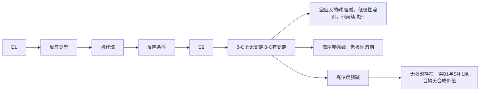
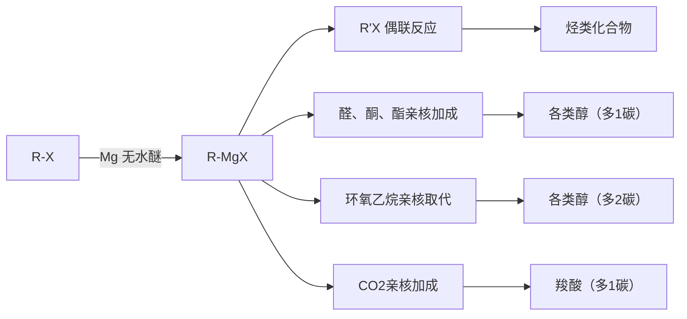

# 一、卤代烃消除反应01:17

# 1. 消除反应定义 06:36

学而思培优

![[05.卤代烃二_笔记_images/80f1e55f400f78181d40ab1b1c7e994de917e544353030a880e577f5bbdfc5d8.jpg]]

![[05.卤代烃二_笔记_images/26b9239816c1d8abc1873cd6333e571451093eead858ae904e97f2062e41e702.jpg]]

# 卤代烃（二）

刘曦廷

2018.04.01

● 伴随反应：卤代烃的亲核取代反应常伴随消除反应发生  
● 反应条件：当体系中存在强碱时更易发生消除反应  
● 反应特点：消除反应与亲核取代反应存在竞争关系

学而思培优

![[05.卤代烃二_笔记_images/0455d35be02566ad4b0f41a49fe86acfdb22ac693c6bf9ff0ca8d2f28f637fc3.jpg]]

# 2018年春季有机化学在线课程

主讲老师：刘曦廷

2012年CCHO金牌，保送PKU CCME

2017年加入学而思，高中化竞教研负责人

理化竞赛在线课负责人

QQ:418035973

百度化学竞赛吧@刘曦廷老师。

![[05.卤代烃二_笔记_images/316a95a138ace99bcce3023372831dc0c6c000fe47f7680307d750f93f8db87c.jpg]]

![[05.卤代烃二_笔记_images/5595159857a9a7bab8c7d340fcdf9d5be27512dc9aa2958c049d16c2e3bea0d5.jpg]]

学而思化学竞赛讨论群

扫一扫二维码，加入群聊。

![[05.卤代烃二_笔记_images/b462b141a4ed3e546f20a7176aa517198cf2b895e5f3ad863fb281cec4c626d7.jpg]]

![[05.卤代烃二_笔记_images/1b4c23c10e3b12b7d41f73af16eee08d2a4614a8d00cfbfad4d054a668c1afac.jpg]]

XES化学竞赛在线课程群

扫一扫二维码，加入群聊。

# 课程资源：

○ 学而思化学竞赛讨论群用于问题交流  
◦ 在线课程群提供讲义下载和课程咨询  
◦ 课程回放功能可供补课使用

# - 反应机理：

○ 强碱进攻β-H形成双键  
- 与亲核取代反应的进攻位点不同  
- 反应产物为烯烃和卤化氢

# ● 时间安排：

- 本次课程重点讲解消除反应  
- 后续会涉及金属有机化合物内容  
○ 课程包含习题讲解环节

# 2. 消除反应机理 07:41

# 1）E1机理 08:12

\- 卤代烷的消除反应定义 08:24

在卤代烷的亲核取代反应中，经常伴随着另一个反应-消除反应。即在卤代烷上消去一分子卤化氢，得到烯烃。这个反应用E（Elimination）表示。

定义：卤代烷失去一分子卤化氢，生成稀烃的反应称为卤代烷的消除反应。 $\mathrm{CH}_3 - \mathrm{CH}_2\mathrm{X}\rightarrow \mathrm{CH}_2 = \mathrm{CH}_2 + \mathrm{HX}$ 机理：E1，E2

基本概念：卤代烷在碱作用下失去一分子卤化氢（HX）生成烯烃的反应，用E(Elimination)表示。通式为： $CH_{3}-CH_{2}X\rightarrow CH_{2}=CH_{2}+HX$

○ 扩展定义：卤代烯烃消除HX生成炔烃的反应也属于消除反应范畴

反应特点：与亲核取代反应（SN1/SN2）存在竞争关系，碱条件下更有利

● 消除反应的特点与机理概述 09:46

学而思培优

![[05.卤代烃二_笔记_images/be84b87ad04d561099dc3835c1e1cb130170a1f9042e7d7f4021ce7975b1e9f6.jpg]]

![[05.卤代烃二_笔记_images/56549b11e5911c3728e9a73e2bd1cd0b24d635a6bb8f732ad720840327a88467.jpg]]

chemical

Reaction mechanism diagram showing卤代烃消除反应 with α-hydroxyl and β-hydroxyl intermediates

○ 电子效应：

■ α碳受卤原子吸电子诱导效应带正电（δ^+）  
■ β碳受诱导效应影响较小，但β-H电子云密度降低呈现质子特性

\- 反应位点选择：

■ 亲核试剂进攻α碳发生取代反应（SN1/SN2）  
■ 碱进攻β-H发生消除反应（E1/E2）

\- 竞争关系：消除产物越多则取代产物越少，两者存在动态平衡

\- 卤代烷消除反应的详细机理 10:04

○ 键断裂特点：

■ 同时断裂C-X键和β-C-H键  
■ 形成π键需要α与β碳的p轨道平行重叠

○ 碱的作用：

■ 强碱（如KOH）更易夺取β-H   
■ 弱碱（如EtOH）也能通过溶剂化效应促进消除

○ 区域选择性：

■ 遵循Saytzeff规则，优先生成取代基更多的烯烃   
■ 实例：2-氯丁烷消除主要生成2-丁烯而非1-丁烯

\- 卤代烷消除反应实例分析 13:57

![[05.卤代烃二_笔记_images/20f33d92c97681bdc23ed92ecff31cdeb86c3a4921ce1e8a0ea87d24174fae82.jpg]]

chemical

化学反应示意图，展示卤代烷的分解过程及产物结构变化

# ○ 典型条件：

■ 强碱（KOH/EtOH）： $CH_{3}CH_{2}CH_{2}CH_{2}ClK\Theta HCH_{3}CH_{2}CH=CH_{2}$   
■ 弱碱（EtOH单独）：产物比例发生变化

# ○ 产物特点：

■ 含氢较少的β碳优先被消除（违反统计规律）  
■ 实例：2-溴-2-甲基丁烷主要生成2-甲基-2-丁烯

# ● 立体专一性消除反应实例 17:34

![[05.卤代烃二_笔记_images/853aa2874b74d19f3b3cdb1d7993cef66bf4c8d1a1f859bd140cad4324e4c85d.jpg]]

chemical

Chemical reaction scheme showing deprotection of 1,2-benzyl-1,3-dibromobutane to form alkene derivatives with KOEt and EtOH reagents

# ○ 构型要求：

■ H与X必须处于反式共平面（anti-periplanar）   
■ 实例：(1R,2R)-1-溴-1,2-二苯基丙烷消除仅得特定构型产物

# 命名规范：

■ 示例：1-溴-2-苯基丙烷需标注绝对构型（R/S）

# - 反应特异性：

■ 对映体产生特定构型烯烃   
非对映体产生不同构型产物

# 2）E2机理 21:04

# E2与E1消除反应的比较 21:15

![[05.卤代烃二_笔记_images/428b7039193a770052371ebc7801e346ac2a2ef23549ee4a65076e733354c262.jpg]]

chemical

Chemical reaction equation showing radical addition of boronate ion to alkene, producing hydrogen and boronate species

实验证据：消除反应存在两种类型的消除反应

<table><tr><td></td><td>动力学证据反应速率</td><td>反应的立体化学</td><td>重排现象</td><td>反应类型</td></tr><tr><td>I</td><td> $\alpha [RX][B:]$ </td><td>立体专一性</td><td>无</td><td>双分子机理E2</td></tr><tr><td>II</td><td> $\alpha [RX]$ </td><td>无选择性</td><td>有</td><td>单分子机理E1</td></tr></table>

# ○ 动力学差异：

E2：反应速率与底物浓度和碱浓度均相关， $V = k[RX][B:]$   
E1: 反应速率仅与底物浓度相关, $V = k[RX]$

# ○ 立体化学:

E2：具有立体专一性（如1-溴-1,2-二苯基丙烷反应中，特定构型原料只能得到特定构型产物）

E1: 无立体选择性

# ○ 重排现象：

E2: 不发生重排

E1: 可能发生碳正离子重排

# E2消除反应的特点 21:30

![[05.卤代烃二_笔记_images/8aab65a5b9d64893285c48e5936fa41753c803ca541c24a8bed5cdf7609d32ab.jpg]]

chemical

Chemical reaction diagram showing deprotonation of 1,2-bis(4-methyl-1,2-dibenzyl)phenol to form 1,2-sulfonate and then to form 1,2-butene with KOEt/EtOH reagents

反式消除：要求卤原子与氢原子处于对位交叉式构象（通过纽曼投影式观察）  
同步过程：碱夺取β-H与C-X键断裂同时进行，经过单一五中心过渡态  
○ 电子转移：C-H键电子流向形成C=C双键，同时卤离子离去

# ● E2消除反应的动力学特征 22:12

![[05.卤代烃二_笔记_images/366f26d4a3c190e44a5f65d57c200f8510d258a1a64d6af4b47027b151df9ef7.jpg]]

text_image

安鑫超优

![[05.卤代烃二_笔记_images/1111a5f91c9405a9767fd3b73c9795e9ccbbf46e34847c5a6eb577ef350d359e.jpg]]

chemical

Reaction mechanism diagram showing E2 elimination and reaction of a cyclohexane derivative with loss of [RX][C2H5] under reflux conditions

○ 二级反应：反应速率= $k[RX][B:]$   
- 过渡态特征：旧键断裂（C-X和C-H）与新键形成（C=C和B-H）同步完成
- 能量变化：整体为放热反应，因强碱（如 $C_{2}H_{5}O^{-}$ ）转化为弱碱（如 $HOC_{2}H_{5}$ ）

# ● E2消除反应的过渡态与产物 23:07

![[05.卤代烃二_笔记_images/53c4e82a54ceca52d8ed7b97688758da1b87b27f3e91ed8bcdc49052fe7d4779.jpg]]

chemical

Chemical reaction mechanism diagram showing bond formation and resonance behavior with a five-center transition state graph

○ 过渡态结构：五中心线性排列（B...H...C...C...X）  
○ 键能变化：过渡态时势能最高，产物能量低于原料  
○ 产物特征：生成烯烃和卤化氢，如 $CH_{2}=CH_{2}+Br^{-}+HOC_{2}H_{5}$

# ● E1消除反应的特点与动力学 25:12

- 反应分级：一级反应，速率仅取决于[RX]  
○ 空间效应：三级卤代烃反应最快，因碳正离子平面化（键角 $109^{\circ}\rightarrow120^{\circ}$ ）缓解空间拥挤  
- 稳定因素：碳正离子可通过9个C-H键超共轭稳定（如叔丁基碳正离子）

● E1消除反应的机理与过渡态 27:26

学而思培优  
![[05.卤代烃二_笔记_images/61c858186e8cbdc7205e0dbca18f8bf77043a03ba24ae8a68978c46df90c6449.jpg]]

chemical

E1机理（单分子消除机理）反应示意图，展示碳正离子中间体的化学反应过程

![[05.卤代烃二_笔记_images/4fbca8db8ff4d6a27d07e0be5c59d2de479c6f1dc2839b741cc1857785427bd5.jpg]]  
先消除 $\mathsf{X}^{-}$ ，再消除 $\mathsf{H}^{+}$ （分步机理）  
➢第一步是决速步骤，符合动力学特征 V = k[RX]

![[05.卤代烃二_笔记_images/2e177d7c11cd2c5444d6b958ae370e24ff5dd24de2a2c1fb0812d0ae6e1206d0.jpg]]

○ 分步机理：

■ 慢步骤：RX解离生成碳正离子（决速步）  
■ 快步骤：碱夺取β-H形成烯烃

○ 过渡态特征：存在两个过渡态（C-X断裂过渡态和C-H断裂过渡态），中间体为碳正离子  
- 竞争反应：可能同时发生SN1取代（当碱进攻碳正离子时）

3）Elcb机理 30:27

学而思培优

相比于涉及到碳正离子中间体的 E1 反应，E1eb 反应经过碳负离子中间体进行。在较慢的决速步中碱诱导的去质子生成负离子，它从邻近的碳原子上推走取代基。该反应在羰基的 β 位含有不好的离去基团如 -OH，HO-C-CH-C=O 的结构的底物上特别常见。不好的离去基团对于 E1 与 E2 这两种其他的可能性都不利，而羰基通过共振稳定负离子中间体提高了邻近氢原子的酸性。

![[05.卤代烃二_笔记_images/14c1aea2a49921942eddbbbb8f6289224de4bddfa9f2f593b9785872d65df91e.jpg]]

![[05.卤代烃二_笔记_images/729781bc86da001f9fdb87494a493651e60e1e1c18ebe4d72447a27fdb4c1b15.jpg]]

● 中间体差异：生成碳负离子而非碳正离子（单分子共轭碱消除）  
● 反应条件：常见于β位含-OH等不良离去基团的羰基化合物  
● 稳定机制：羰基通过共振稳定碳负离子 $(C = C - O^{-} \leftrightarrow C^{-} - C = O)$   
● 反应顺序：先脱H+后脱离去基团（与E1相反）  
● 酸性要求：羰基增强β-H酸性（pKa\~20），使去质子化更易进行

3. 消除反应影响因素 32:30

1）烷基结构影响 32:45

学而思培优  
影响消除反应机理的一些因素  
a) E2机理  
![[05.卤代烃二_笔记_images/d1febf0c0d6e2eecb0bd47e36186ef98024c1b4625814f392f7a8e619fa3ba48.jpg]]

chemical

Chemical reaction mechanism showing protonation and deprotonation steps of a carbocation intermediate

![[05.卤代烃二_笔记_images/10ccef5c4b3ef29c8e9f94413a1f663671fe32a9b96d964a73de49eaccb26581.jpg]]

# 有利于E2机理的因素

R-X: $3^{\circ}$ R-X，被进攻的是β-H,不是X,空间阻碍影响不大。且卤代烷上β-H越多，被夺取H的机会就越多，反应就快。

B(碱)：强碱、大浓度有利

溶剂：弱极性溶剂有利（过渡态电荷分散，极性减小）

![[05.卤代烃二_笔记_images/fbc06577964955c1da58bde28648bbfe69bfe4484d238e6b7e1784471fafa737.jpg]]

- 三级卤代烷优势： $3^{\circ}R - X$ 最有利于E2机理，因为进攻的是 $\beta$ -H而非 $\alpha$ -C，空间位阻影响小  
- $\beta$ -H数量效应：卤代烷上 $\beta$ -H越多，被夺取机会越多，反应速率越快（如三级>二级>一级）  
● 与SN2区别：不同于SN2需要小位阻底物，E2对三级卤代烷同样有利

2）碱性强弱影响 34:51

![[05.卤代烃二_笔记_images/0dd770158699276c9a99de744598a2891459b9fcae1f58800409b78e170105ca.jpg]]

影响消除反应机理的一些因素  
a) E2机理  
![[05.卤代烃二_笔记_images/83713e3e5ec6a37064cb3a61fa161686894e0c4ca779e12a7cc1a0b593742262.jpg]]

chemical

Chemical reaction mechanism showing hydrogen bonding and radical formation steps

有利于E2机理的因素：  
R-X: $3^{\circ} \mathrm{R} - \mathrm{X}$ ，被进攻的是 $\beta - H$ ，不是 $X$ ，空间阻碍影响不大。且卤  
代烷上 $\beta - H$ 越多，被夺取 $H$ 的机会就越多，反应就快。  
B(碱)：强碱、大浓度有利  
溶剂：弱极性溶剂有利（过渡态电荷分散，极性减小）

![[05.卤代烃二_笔记_images/aae9205d5eb76c7acf13630b0a949f08a5a98a0f704596ec9231978f0edb8543.jpg]]

- 碱强度要求：强碱（如KOH）和大浓度碱显著促进E2机理  
● E1反应特殊性：碱对E1影响较小，但弱碱（如EtOH）或低浓度碱可减少E2竞争  
● 竞争控制策略：通过调节碱强度可选择性控制E1/E2路径（强碱促E2，弱碱容E1）

3）溶剂极性影响 36:27

![[05.卤代烃二_笔记_images/3f75368fff7adb46cebf9bb2ebe257e2313865d5fb26956b9c4cc8d7c2f873f5.jpg]]

![[05.卤代烃二_笔记_images/c15e41bfdbddb33e8cb823bb18405f22934e4ebbf5684f7e1e6ada38ff4a7d11.jpg]]

chemical

E1机理反应示意图，展示慢态与过渡态生成氢键的化学过程

有利于E1机理的因素：  
$R - X:3^{\circ}R - X$   
B(碱)：对E1反应影响较小，但弱碱或低浓度碱，可减少E2的竞争  
溶剂：大极性溶剂有利（过渡态电荷密度增加，极性加大）

![[05.卤代烃二_笔记_images/3abc18aacab16e45f1c5c811e1f02aa627932b9a0a4fcf28907dbf89fcefaa9d.jpg]]

E2溶剂选择：弱极性溶剂有利，因五中心过渡态电荷分散（极性减小）  
● E1溶剂需求：大极性溶剂有利，促进碳正离子中间体形成（过渡态偶极矩增大）  
● 机理判断依据：溶剂极性可作为区分E1/E2的辅助指标

4）例题：消除反应机理判断

![[05.卤代烃二_笔记_images/d7ec049c1519a1d61821c4307ae5d9ee3be5b30bb952c493d8d47e5289273592.jpg]]

- 例1：下列消除反应是经过E1还是E2？  
![[05.卤代烃二_笔记_images/55bfb446a9efd6ecc04ba192bdcf3e8161608f82128d81eeeecea1be2c6eed4a.jpg]]

chemical

Reaction mechanism diagram showing KOH addition to CH₃CH=CHCH₃ with R-X catalyst and KOH碱性较强

是E2机理，有两个β位氢可消除  
![[05.卤代烃二_笔记_images/8d61405705011a273738160ad9794da16c63abcc5e7793c20bc39c16c89c4899.jpg]]

chemical

Chemical reaction mechanism showing deprotonation and ring-opening steps of a chlorinated alcohol

![[05.卤代烃二_笔记_images/9e2e8bf81954500279ec9260999554b8207592d975a089b5bc35725e90edf3c2.jpg]]

题目解析

○ 条件分析： $2^{\circ}$ R-X在强碱(KOH)条件下  
○ 产物特征：存在两个β-H消除位点（生成1-丁烯和2-丁烯）  
○ 判断关键：二级底物本可E1/E2，但强碱决定E2主导

# - 答案：E2机理

学而思培优

![[05.卤代烃二_笔记_images/c3537735b52ba0594f2fa87e449c39cda5026663341cb6803d5094c09be349a3.jpg]]

\- 例2：下列消除反应是经过E1还是E2？

![[05.卤代烃二_笔记_images/da713ef175513ac8c40d7be1c9ea10e85c84cb6a9164d5970e04f7bb650ce320.jpg]]

chemical

Reaction mechanism showing bromination of ethyl acetate with alkoxide, yielding two products: '主要' and '次要'

是E1机理，有两个β位氢可消除

![[05.卤代烃二_笔记_images/45aac6d35a6e0fca7368f0f8388da8af45d736d96b5b24bb80551917b7de06c5.jpg]]

chemical

Organic reaction mechanism showing bromination and deprotonation steps with labeled intermediates and products

# ● 题目解析

- 条件分析：3°R-X在弱碱(EtOH)条件下  
- 消除方向：a位(2H)和b位(6H)消除，遵循取代基多者为主产物  
○ 判断关键：三级底物+弱碱组合决定E1主导   
○ 答案：E1机理

学而思培优

![[05.卤代烃二_笔记_images/5babb34d5cd87c7f856055ae364d49998f3e37233e1dbc298ff483a73f390ef3.jpg]]

\- 例2：下列消除反应是经过E1还是E2？

![[05.卤代烃二_笔记_images/252d0bb0b68a97441abfcdf380621ddcc79745cd9f1def718af9463c17dc8f3d.jpg]]

chemical

Reaction mechanism showing ethanol formation with alkyl substitution, producing two products: '主要' and '次要'

是E1机理，有两个β位氢可消除

![[05.卤代烃二_笔记_images/7ed3b929e882de37382723e5f07f128990dcd1b8c11e533c0ce853bf4c139f22.jpg]]

chemical

Organic reaction mechanism showing bromination and deprotonation steps with labeled intermediates and products

# ● 题目解析

○ 混合机理可能：3°R-X在强碱(KOH)下可能E1/E2共存  
○ 产物分布：同时出现Saytzeff产物和Hofmann产物  
○ 特殊现象：可能伴随碳正离子重排（甲基迁移）  
- 答案：E1与E2竞争

# 4. 烯烃稳定性 45:47

# 1）烯烃的类型及其稳定性分类 45:55

学而思培优

■补充：烯烃的类型及其稳定性  
分类：将烯烃看作乙烯的取代产物  
稳定性：多取代烯烃较稳定

![[05.卤代烃二_笔记_images/d27eb9627d2137e486f8810692fcd6a25525e3aea0a5662479a6394cd9941334.jpg]]

chemical

Reaction mechanism diagram showing four different烯烃 (four-toe, three-toe, two-toe, and one-toe) reacting with hydrogen to form a van der waals residue

trans

![[05.卤代烃二_笔记_images/38b59316dd64dc0bc84a857dcd0e61dcf03e8d1c2ed12c4ace3d0df8789a1b90.jpg]]

![[05.卤代烃二_笔记_images/360b194878c650de711c7e3d7fe8294c08c457915aedf395537376a92b7c95c4.jpg]]

- 分类依据：将烯烃看作乙烯的取代产物，取代基越多越稳定  
● 稳定性顺序：四取代烯烃 > 三取代烯烃 > 二取代烯烃（反式 > 顺式）> 一取代烯烃  
- 顺反异构差异：顺式烯烃因取代基间存在van der Waals排斥力而不如反式稳定

# 2）烯烃稳定性的测定—氢化热 47:29

![[05.卤代烃二_笔记_images/c73585f901d66f94540e40fe7daa5b129c92ba55bb6b96d592cb200e15349453.jpg]]  
■ 烯烃相对稳定性的测定——烯烃的氢化热

![[05.卤代烃二_笔记_images/0dacac4a914c9ba03b3e349f72348c32967b32ce672fd4ec951ccc09c43cb374.jpg]]

![[05.卤代烃二_笔记_images/8640f117cef5441a2029c05faac9d28dcb52fbb50849b21b7efb935ed5623c2b.jpg]]

chemical

Reaction mechanism diagram showing hydrogenation of alkene with hydrogen under catalytic conditions, yielding hydrogen peroxide and heat

- 测定原理：氢化热值越大，原烯烃能量越高，稳定性越低   
● 实验数据：三取代烯烃氢化热为 -112.6 kJ/mol，二取代为 -119.3 kJ/mol，一取代为 -126.8 kJ/mol  
● 能量关系：放热越多说明原烯烃能量越高，稳定性越差

3）烯烃稳定性的原理—σ-π超共轭 48:16

![[05.卤代烃二_笔记_images/a9abf923ed6dc78a836be753e313f3f3fd8ea3284d61effb0532d15787670125.jpg]]

![[05.卤代烃二_笔记_images/0854a43baed44663486fa595d79be07baf9b93ef9ad42db65d19d8fb94ccf1a0.jpg]]

![[05.卤代烃二_笔记_images/e6aaff1d7bbadca3444688f2ae3e448c45bd5e41b6e3b3858d3551fbf2232e57.jpg]]

chemical

Molecular orbital diagram showing σ-n super共振 and sp²/³ hybridization orbitals with π orbital

![[05.卤代烃二_笔记_images/2b5e8ec4675007e11d9e7a80e8c133bd270628dd91f3d35801dfb66b18789ac6.jpg]]

- 结构特征：烯烃碳为 $sp^2$ 杂化，存在未杂化p轨道形成π键  
● 稳定机制：相邻碳的σ电子可离域到π反键轨道（σ-π超共轭），降低体系能量  
● 效应强度：取代基越多，超共轭效应越强，稳定性越高  
● 类比说明：与碳正离子、自由基稳定性原理相似，均涉及电子离域

4）Zaitsev规则 51:10

![[05.卤代烃二_笔记_images/751d5e6808b8113b237e5248a518ef24918ca04115cfd85c35d0787a5ed6e3d9.jpg]]

![[05.卤代烃二_笔记_images/a9fad16495b4c5f3150eb4d63c4df2336f0a2bb747b3e87633c743a6d2300ce3.jpg]]

![[05.卤代烃二_笔记_images/8e6d79040cd163085be1bfe82c640bdcd9e2c590da6c5f2a651ecba55977b187.jpg]]

chemical

Zainsev formula for producing 70% and 30% products using methanol and ethyl acetate

- 规则内容：卤代烷消除反应主要生成取代基更多的烯烃  
- 实例分析:
    - 2-溴丁烷消除: $81\%$ 二取代产物 $(CH_{3}CH = CHCH_{3})$ vs 19
    - 叔丁基溴消除: $70\%$ 三取代产物 vs $30\%$ 二取代产物
- 取代基影响: 甲基越多, $\beta$ -H消除位点增加, 会降低主产物比例

5. E2过渡态特性 52:51

E2反应中，其过渡态和最终产物烯烃在结构上具有一定的相似性，既是说过渡态具有一定烯烃的性质。因此生成取代烷基多的烯烃的过渡态的位能较低，活化能也较低，反应快。

![[05.卤代烃二_笔记_images/563099e4dcee40d833729ad5c30532d30dcee2a1304d8fb2bc0dedb9ca49e84c.jpg]]

![[05.卤代烃二_笔记_images/de7074cbd081048ba19d45235d3aab27f715c997d6a0d325b529a4f74615982c.jpg]]

● 结构相似性：过渡态具有烯烃特性，C-H键电子流入C-X反键轨道

● 稳定性关系：取代基多的烯烃对应过渡态位能更低，活化能更小

● 反应速率：生成稳定烯烃的路径反应更快（如81% vs 19%产物比例）

学而思培优

![[05.卤代烃二_笔记_images/23f30025e2549a8f2bfa88cefcdd3368a52e46f68c73962a04c269d20af2940d.jpg]]

chemical

E2反应生成化合物的化学反应方程式，展示主要和次要反应路径及碱基取代过程

![[05.卤代烃二_笔记_images/f42b83f9101d5a084e552a3597d0b0150545dd9698f970089c038528e0b9d975.jpg]]

- 产物选择：遵循Zaitsev规则，主要生成 $CH_{3}CH=CHCH_{3}$ （二取代）而非 $CH_{2}=CHCH_{2}CH_{3}$ （一取代）  
● 过渡态分析：主产物过渡态因更接近稳定烯烃结构而能量更低

# 6. E1反应特点 54:57

1）E1反应产物稳定性与比例 55:00

学而思培优

![[05.卤代烃二_笔记_images/6c02fd1e7f8f400d6c14cc2176b05f65d0d8487a399413104abf906f7bb7e95a.jpg]]

chemical

E1反应生成乙烯基的化学反应方程式，包含主要和次要反应步骤

![[05.卤代烃二_笔记_images/4f4b8317a505ad583ca537ef75dd3f93fa4232ade8d7d11ac2e526bfa89c33a0.jpg]]

碳正离子中间体：E1反应首先生成碳正离子，随后碱夺取质子形成烯烃

\- 消除方向选择性：可以从碳正离子两侧消除质子，形成不同取代度的烯烃

\- 产物稳定性规律：三取代烯烃（ $CH_{3}CH_{2}C = CH_{2}$ ）比二取代烯烃更稳定

● 过渡态理论解释：更稳定的产物对应更稳定的过渡态，因此三取代烯烃为主要产物

2）Hofmann消除反应取向 55:54

![[05.卤代烃二_笔记_images/daf331c0d999b87a0908883d1dacd62090b120d280803c9807a0c83b1e23b8ef.jpg]]

Hofmann消除取向   
![[05.卤代烃二_笔记_images/6c12e627bf0e3f5829c6e2423ef5ddfaa2396bd6a3f99fe11da4f5e41a73c6b7.jpg]]

chemical

Chemical reaction scheme showing formation of Zaitsev and Hofmann from a chloroalkane intermediate, with yields and molecular structure of the product.

![[05.卤代烃二_笔记_images/5bc995a27306ae263bc3969f9346e17eb97d94aa4fb2618f096e938e525a372c.jpg]]

Zaitsev规则：在甲醇负离子作用下主要生成取代基更多的烯烃（67%）  
- Hofmann规则：使用大体积碱（如叔丁醇钾）时优先进攻位阻小的β-H，生成取代基较少的烯烃（91%）  
● 空间位阻影响：大体积碱难以接近空间位阻大的 $\beta-H$ ，导致消除取向改变  
● 典型例子： $CH_{3}(CH_{2})_{3}CHCH_{3}$ 在RO-作用下生成33% Zaitsev产物和67% Hofmann产物

3）碱的体积对消除反应的影响 56:42

![[05.卤代烃二_笔记_images/30638b5f901180a3ccaca056a32b30c9efb08ce1e3c9d9d0c25e718b337c02af.jpg]]

![[05.卤代烃二_笔记_images/421c5301902cf57a84ca1e64e87175ee0030ad20313fb980831223880e420289.jpg]]

当使用空阻大的碱时  
![[05.卤代烃二_笔记_images/b80c84971e699bbe2c83c23033bf591d5e5c5a27ffe899ec191f37ba917e682c.jpg]]

chemical

Organic reaction scheme showing conversion of bromoalkane to alcohol with yields and stereochemistry indicated

● 碱体积效应：叔丁醇钾作用下生成72% Hofmann产物（ $CH_{3}CH_{2}CH=CH_{2}$ ）和28% Zaitsev产物  
● 过渡态活化能：进攻位阻大的β-H时过渡态活化能升高，产物比例降低  
● 甲基位阻优势：碱进攻甲基上的H仅需克服C-H键位阻，比进攻亚甲基更有利  
- 消除几率：甲基上的H数量更多，被消除的几率更大

4）霍夫曼取向的合理解释 59:10

![[05.卤代烃二_笔记_images/1539d014f7a3d3c37c32ffcb96ddb4c8941905ed6506f35eb40546024fbe02d3.jpg]]

![[05.卤代烃二_笔记_images/3cfe628860077295cfeff1d3db13c2aa1ab1aa5c13ac9627469ac9324291e7b3.jpg]]

chemical

Chemical reaction mechanism showing two pathways: '空阻大' (atmosphere) and '空阻小' (atmosphere), with yields 28% and 72% respectively.

![[05.卤代烃二_笔记_images/7ab2bfec2504b6bf660ce1bb71d5254be3150e85ae0a7667062cb1b3c1535101.jpg]]

位阻双重影响：当底物和碱都具大位阻时，只能消除位阻最小的 $\beta$ -H  
● 过渡态分析：碱进攻β-H时受到邻近基团（如叔丁基）强烈排斥  
● 产物比例趋势：碱体积增大时Hofmann产物比例显著增加（从14%升至98%）  
- 极端案例：某些卤代烷不论碱体积大小均表现Hofmann取向，因β-H被大基团完全屏蔽

7. 温度对消除影响 01:01:52

1）温度对消除反应和取代反应的影响 01:02:02

# 温度对消除反应的影响

![[05.卤代烃二_笔记_images/e3c05b229ec469e7eb8af9408af8d823ea0619597471a50f09a0cf809348ad07.jpg]]

![[05.卤代烃二_笔记_images/5238347681521d76c4a644bcb0e888f6a00062202e207ecbfbc152ea33af4289.jpg]]

chemical

Chemical reaction equation showing bromoethanol reacting with 80% ethanol per 2 liters to form a mixture of 50°C, 80°C, and 100°C with corresponding yields.

- 竞争反应类型：卤代烷在碱性条件下可发生消除（生成烯烃）和取代（生成醇/醚）  
● 温度效应：50℃时消除产物占58%，100℃时升至66%  
- 分子数差异：消除反应生成3分子（烯烃+水+溴离子），取代反应生成2分子

2）消除反应与取代反应的产物数量对比 01:03:36

\- 熵驱动原理：消除反应分子数增加更多（ $\Delta S > 0$ ），高温有利于熵增过程

● Gibbs自由能： $\Delta G=\Delta H-T\Delta S$ ，温度升高使- $T\Delta S$ 项影响增强

● 水相变化：100℃时水汽化离开体系，推动平衡向消除方向移动

3）溶剂解反应介绍 01:07:03

![[05.卤代烃二_笔记_images/14bcac09271a777fdb3508b324a1be1d8c2a3e1a3f9cf650d1487d7ea4d6938c.jpg]]

# 溶剂解

底物与溶剂发生反应，这时溶剂就成为试剂，这些反应叫做溶剂解。

![[05.卤代烃二_笔记_images/fe19cd66bc352dcb76e1d833bb2ca65b1ab2161ea0e160ee7d18911d76c57dde.jpg]]

![[05.卤代烃二_笔记_images/693b478917fd62e8c5fbf10335d4401a3c8b04db74e3770eb7eb44a8a137d250.jpg]]

![[05.卤代烃二_笔记_images/fb46536befac06afca556354ca24b8c4b97bfc45d632c9091624ed6aa97ad261.jpg]]

- 定义：底物与溶剂发生的反应，溶剂同时作为试剂参与反应  
● 常见溶剂：水、乙醇、乙酸、液氨等均可作为反应溶剂  
● 实例：苄溴与乙酸反应生成酯和溴化氢

4）溶剂解反应速率与反应级数的关系 01:07:56

● 表观反应级数：二级反应（如SN2/E2）在大量溶剂中表现为一级反应

● 原因：溶剂浓度基本恒定，可并入速率常数k

● 局限性：不利于反应常数测定和合成应用，反应速率较慢

8. 溶剂解反应 01:09:07

1）一一反应与一二反应的比较 01:09:30

![[05.卤代烃二_笔记_images/76b60a439083c2de822310ded032f4d05f7b5a9f4203109d5116e28a31d488bd.jpg]]

![[05.卤代烃二_笔记_images/857fcb6ea328f1ae458b74e48dac5a50751b419ce9c37049ea8689be4edd9e29.jpg]]

flowchart

底物适应性：  
底物适应性：

○ E2：适用于1°、2°、3°卤代烷  
○ E1: 主要适用于3°卤代烷

# ● 条件差异：

- β-C无支链：需大位阻碱   
- β-C有支链：需强碱/低极性溶剂/弱亲核试剂  
- 3°卤代烷：只需高浓度强碱即可抑制E1反应

# 2）溶剂解反应的立体专一性 01:17:23

● 构型保持：某些消除反应具有立体专一性，特定构型反应物只产生一种产物  
● 过渡态约束：空间位阻限制碱只能从特定方向接近β-H   
● 合成控制：通过调控碱的性质和反应条件可选择性获得特定构型产物

# 二、立体化学01:19:50

# 1. 立体专一性 01:20:02

学而思培优

E2 消除的立体化学——立体专一性反应

![[05.卤代烃二_笔记_images/cb6b6bbefd214c065854735e9fad888fb773b0f713a0002b141ef6e1ca5e2da8.jpg]]

立体专一性反应 (Stereospecific Reaction) 具有一定立体结构的底物通过反应只生成一种类型的立体异构体。

>立体有择性反应（Stereoselective Reaction）底物通过反应可以生成2个以上立体异构体，其中有一个占优势。

● 专一性定义: 具有一定立体结构的底物通过反应只生成一种类型的立体异构体  
● 选择性定义: 底物通过反应可以生成2个以上立体异构体，其中有一个占优势  
○ 非对应体过量用de表示（百分数）  
○ 对应体过量用ee表示（百分数）

# ● 定量描述:

# 2. 反式共平面消除 01:21:21

学而思培优

![[05.卤代烃二_笔记_images/89236444a892f912bd712ea9df47524b08a2c72b7e8a5fa68b3cc1784afb1b33.jpg]]

chemical

E2消除反应示意图，展示反式共平面消除过程及交叉构象与负电荷相距特征

\- 轨道变化: $sp^3 \rightarrow sp^2$ 杂化过程中, 消去的H和X必须在同一平面上

● 最大重叠原理: 只有反式共平面构象才能满足生成的p轨道最大限度的交叠

# - 对称性匹配:

○ $\sigma(\mathrm{C}-\mathrm{H})$ 键电子填入 $\sigma^{*}(\mathrm{C}-\mathrm{X})$ 反键轨道  
- 反式构象中轨道对称性匹配

# ● 电荷因素: 负电荷相距较远（Anti periplanar），库仑斥力小

# 1）反式消除优势 01:23:47

![[05.卤代烃二_笔记_images/b8fff3c6576984bc626443e6a90942f95fb5f2c92aa7213c2b7ee4ee7d6cb5e2.jpg]]  
■ E2 消除为反式共平面消除（反式消除）

![[05.卤代烃二_笔记_images/221c927337dcebc60f1e6869a9f9fa04d1a73d85c91a989b1d86e9db242e92d3.jpg]]

![[05.卤代烃二_笔记_images/253e18cfe54a705616e621487d2a368ba86720f8cbabbe192cfca5483e7b6413.jpg]]

chemical

Reaction mechanism diagram showing proton transfer and electron transport in a polycyclic carbocation with anti-periplanar interaction

![[05.卤代烃二_笔记_images/e3850d21790002809add4c05c62032367052dd8af8aea6cef13c458f028576d8.jpg]]

构象稳定性: 交叉式构象（反式）比重叠式构象（顺式）更稳定  
● 过渡态能量: 反式消除的活化能较低  
● 实际应用: 在环己烷体系中，消除基团必须都处在直立键位置

# 3. 顺式消除难点 01:26:06

![[05.卤代烃二_笔记_images/3d6bf33214566222c786dd2d38ed5b1523da51b7f41231397512eff5feb22814.jpg]]

![[05.卤代烃二_笔记_images/709d7666d7c4b312874294b6b1ae9712195ea232f79fc7f3bd4d3c18ca5552aa.jpg]]

chemical

Reaction mechanism diagram showing three pathways (顺式, 反反式, 顺式共平面) for carbon-carbon transfer with energy gap and electron density changes

![[05.卤代烃二_笔记_images/7faf326db1b4478468339814413b417743a8a9ff363aa0a16fec7ac979e0bfa9.jpg]]

构象障碍: 重叠式构象（Syn periplanar）位阻较大，升高活化能  
● 电荷排斥: 负电荷相距较近，产生强烈库仑斥力  
● 轨道限制: 轨道对称性不匹配，电子转移受阻  
● 例外情况: Cope消除通过六元环过渡态实现顺式消除

# 4. 例题：1-溴-1,2-二苯基丙烷消除反应

![[05.卤代烃二_笔记_images/e8fc8c95a1baa5a0a2a4058ba1f2ee171b667641c5f3fe5dde7a2669f4a06e53.jpg]]  
- 例：解释1-溴-1,2-二苯基丙烷的消除反应的立体专一性

![[05.卤代烃二_笔记_images/50655f698a366249d7cc2896ddaef1a8c68a22492bbffc58d997b91370726ef4.jpg]]

![[05.卤代烃二_笔记_images/17ac7660f728709c5c35cfd23987745fccf3f2543aa66270ae6a6277826582dc.jpg]]

# ● 题目解析

- 反应机理: E2反式消除  
○ 构象转换: 需将十字式转为伞形式, 使H与Br反式共平面  
○ 产物特征: 生成Z-1,2-二苯基丙烯（两个苯基在同侧）  
命名规则: 优先基团在同侧为Z构型

# 5. 例题：环状化合物消除反应差异

![[05.卤代烃二_笔记_images/e279c371a952eaf6fcdb0675aee2508d4881497bb311c598f1434dc739aacc65.jpg]]

\- 例：解释下列两个异构体在相同反应条件下的不同反应结果（环状化合物的E2消除）

![[05.卤代烃二_笔记_images/d127c863d5c134601de7057da6d483342978f1bc08dabe35fae908df158d0b88.jpg]]

![[05.卤代烃二_笔记_images/d3a2e3ca27703440ea3ac238667a978cc5e369a799fb808a63e6fb26842a6713.jpg]]

chemical

Two organic reaction schemes showing deprotonation of cyclohexene derivatives with C2H5O and 25% or 75% yields, yielding products I and II with elimination rate I:II = 200:1

● 题目解析

○ 化合物I:

■ 稳定构象中Cl与两个a键H反式共平面  
■ 生成75%三取代烯烃（更稳定）和25%二取代烯烃

○ 化合物II:

■ 稳定构象中所有β-H不与CI共平面  
■ 需转为不稳定构象才能消除（活化能高）  
■ 消除速率比慢200倍，且产物唯一

\- 关键因素: 消除方向决定产物，而非碱的体积效应

# 三、取代与消除竞争01:38:24

# 1. SN2与E2比较 01:38:37

![[05.卤代烃二_笔记_images/43f27858378ca8cccd208432fb3b666edc29b9ec5bf13edd8d08d24558301ed3.jpg]]

取代反应对消除反应

![[05.卤代烃二_笔记_images/25c2bcaa9b33edac5a56103fad72123ccf85e36861c770c35f9735f78da7b4e1.jpg]]

![[05.卤代烃二_笔记_images/8aeaa7b6ebaac35402852f0fb1bf8865ddfd07f900776ffb4ab9219aeaab8691.jpg]]

![[05.卤代烃二_笔记_images/2d2e9c5ea983481e0c189eaccf5a4fb71534c1f23b7e2004daa2b37939c75c10.jpg]]

<table><tr><td>碱性和亲核性：碱性强（NH₂⁻，RO⁻，OH⁻等），浓度大有利于消除。</td></tr><tr><td>温度：高温有利于消除。</td></tr><tr><td>溶剂：低极性溶剂对E2更好。</td></tr><tr><td>■S_N1与E1：高温对E1有利。</td></tr></table>

- 烷基结构影响：在 $RCH_{2}X$ 中，R基团体积增大时，消除反应比例上升。一级碳(1°)主要发生取代，三级碳(3°)更易发生消除。  
● 碱性与亲核性：  
- 碱性试剂( $NH_{2}^{-}$ 、 $RO^{-}$ 、 $OH^{-}$ 等)浓度越大越有利于消除   
◦ 亲核性强则有利于取代反应  
● 温度影响：高温条件更有利于消除反应（熵增效应）  
● 溶剂效应：低极性溶剂对E2消除更有利   
● 竞争本质：碳原子体积越小，亲核试剂进攻碳越容易；体积增大时，碱进攻β-H更有利

# 2. SN1与E1比较 01:40:16

![[05.卤代烃二_笔记_images/3443eafa13340f4b192b77f9c45e4bb3a87285efe48c63cb4f29da3e671bfd8b.jpg]]

取代反应对消除反应

■ $S_{N}$ 2与E2

烷基结构： $\mathrm{RCH}_{2} \mathrm{~X}$ 中， $\mathrm{R}$ 体积增加，消除比例上升。

![[05.卤代烃二_笔记_images/fc11191dd53216a15ff00db83cb57e9dd99bc3c6afd892e30dfae19ecdf21da8.jpg]]

![[05.卤代烃二_笔记_images/1de28cfd8e3b063e98d4fc422cc77abba706b8ee0113b27e8b687788a48bcfae.jpg]]

碱性和亲核性：碱性强（ $NH_{2}^{-}$ ， $RO^{-}$ ， $OH^{-}$ 等），浓度大有利于消除  
温度：高温有利于消除。  
溶剂：低极性溶剂对E2更好。   
$S_{N}1$ 与E1：高温对E1有利。

![[05.卤代烃二_笔记_images/0d03c136101dcae750cc50eabfe28b2209a0cca89fe57e53361330d850a4a054.jpg]]

● 温度影响：高温对E1消除有利（与SN2/E2相同）

\- 试剂要求：E1对试剂碱性无特殊要求

● 竞争特点：

- 试剂碱性增强会使E2比例上升，E1比例下降   
三级碳底物(3°RX)既可发生SN1也可发生E1

● 溶剂影响：极性溶剂有利于SN1和E1反应

# 3. 例题: 产物分析 01:41:44

![[05.卤代烃二_笔记_images/6f534380d667a0b6a6ac0ffb039a53789d4a96b11cdf02bac910adc4eca90aa8.jpg]]

■例：分析下列产物的形成机理

![[05.卤代烃二_笔记_images/3442ab6cbec9139c8fd1e307fb1837bbafa8daa8660f9983971673168451b0c2.jpg]]

chemical

Chemical reaction equations showing deprotection and reduction of alkenes with NaI and acetic anhydride, yielding products E2 and E1

![[05.卤代烃二_笔记_images/bc58c0fe31b588c7aa6bb2625331b8b4fd39a9e99ddbaee2d04218d085e3d616.jpg]]

碘化钠体系：

○ 特点：亲核性强(I⁻可极化)、碱性弱  
- 主要产物：SN2取代产物  
- 次要产物：E2消除产物（少量E1）  
○ 溶剂：非质子低极性丙酮溶剂

\- 醋酸钠体系：

○ 特点：碱性不弱、亲核性较强   
○ 产物：SN2与E2竞争

● 关键区别：碘离子亲和性强但碱性弱，主要发生取代；醋酸根碱性较强，消除比例上升

![[05.卤代烃二_笔记_images/81041a013eb215fb7a39298b8bca5d69894c033d395d55f3a46734c624e3f078.jpg]]

■例：分析下列产物的形成机理

![[05.卤代烃二_笔记_images/0dbb9fde8527fb0bac701d6113afb67c3943e96a1e89132cfa217f68725b2233.jpg]]

chemical

Organic synthesis reaction scheme showing reduction of chloroacetyl chloride to acetaldehyde using C2H5OH and alkyl halide, with E1 as a product

![[05.卤代烃二_笔记_images/c697c0812b6508cec46fa49e76d3932f7bff83c1fd37ea30e23b441d0861efce.jpg]]

80%乙醇水溶液：

- 条件：弱碱性、弱亲核性、强极性溶剂  
○ 三级碳底物( $3^{\circ}RX$ )  
○ 产物：SN1与E1竞争

# - 乙醇钠体系：

○ 条件：强碱性 $(C_{2}H_{5}O^{-})$ 、强亲核性、中等极性  
○ 产物：SN1为主，同时存在E2和E1  
○ 特点：碱性增强使E2比例上升

# 四、威廉姆斯合成法 01:49:07

![[05.卤代烃二_笔记_images/fc1861b3da691a938ef3e299cc5d1b74c799400263a47844768a9dfd0293e464.jpg]]

chemical

化学反应方程式分析，展示裂解中C2H5OH与C2H5OH的生成及碱性、溶剂极性等步骤

- 反应机理：通过卤代烷（R-X）与醇负离子（ $R'O^{-}$ ）发生亲核取代反应生成醚（R-O-R'）

\- 反应特点：

- 弱碱性和弱亲核性条件下以 $S_{N}1$ 为主  
○ 强碱性和强亲核性条件下可能伴随E2 / E1消除反应  
- 溶剂极性影响反应路径选择

# 1. 逆合成分析 01:50:28

![[05.卤代烃二_笔记_images/7c4d3c5230c8dfb4cfb916b8e5dadda301cbbe360debeadefe45684ac031f302.jpg]]

chemical

Chemical reaction scheme for Williamson醚合成法, showing reagents, conditions, and resulting molecular structures with Chinese annotations

● 核心思想：由E.J.Corey提出（1990年诺贝尔化学奖），通过逆向思维从目标分子推导原料

\- 切断方式：

○ 可切断R - O - R'的左边键，得到R - X和R'O-  
- 也可切断右边键，得到 $R^{\prime}O - X$ 和 $R^{-}$

● 应用实例：甲基叔丁基醚的合成有两种切断方式

![[05.卤代烃二_笔记_images/4f799f4fb0ab15d15e31eb0b0719fae8690097be49213751558834794a467c61.jpg]]  
甲基叔丁基醚的反合成分析

![[05.卤代烃二_笔记_images/65f231b5c4687a8802372c4fdade3d731ed0d0c8b540c5600fb1001668dbeb19.jpg]]

![[05.卤代烃二_笔记_images/fd17b78dac75ab870679d8c41dfd24b09ed86a2a76120f4b6cb7c958b811aa84.jpg]]

chemical

Chemical reaction scheme showing two different cutting methods for producing TM, with Chinese text questioning why one is more conformable.

# 2. 合成路线选择 01:52:00

![[05.卤代烃二_笔记_images/d7153510a402cec8ad385ee6800024608a482c89761ad722189dfc0446e40399.jpg]]

![[05.卤代烃二_笔记_images/b032eecf2d53d5e391577ecdb7973003d339ce0cdd527fc268a6caacc4c39754.jpg]]

chemical

Comparison of two organic synthesis methods (a and b) for producing different products, with method b being the suitable route.

![[05.卤代烃二_笔记_images/68c96606302b224075652bf98cf8d675c6bbbc5a94e1ee37446278c9d0f73b9f.jpg]]

# ● 方法a:

\- 使用叔丁基卤代烃（ $CH_{3}C - X$ ）与甲醇钠反应
- 缺点：会同时生成消除产物异丁烯（ $H_{2}C = C(CH_{3})_{2}$ ）

# ● 方法b:

- 使用叔丁醇钠与甲基卤代烃反应  
优点：仅生成取代产物，无副产物

● 选择依据：三级卤代烃易发生消除反应，应优先选择方法b

# 五、卤代烷的还原01:53:27

# 1. 卤代烷极性 01:53:37

● 键极特性：碳-卤键（C-X）具有极性，碳带部分正电荷，卤素带部分负电荷  
● 还原目标：主要还原带正电的碳原子，使其转变为氢原子 $(C^{+} \rightarrow C - H)$

# 2. 还原难易顺序 01:54:11

● 活性顺序：RI（最易）>RBr>RCl（最难）  
● 特殊说明：氟代烷通常难以被还原

# 3. 酸性还原剂 01:54:30

# 1）Zn+HCl还原剂 01:54:44

![[05.卤代烃二_笔记_images/455a7c1a5e2f3d2350953480977e055f0e12c3f7a946c7f59ed6ba10a1584a7d.jpg]]

![[05.卤代烃二_笔记_images/55fd623f7448afdcbc24a3ba0e6436a99d62e8fed97f8aebf6a036876b63d740.jpg]]

chemical

Chemical reaction equation showing conversion of halogenic acid to R-X under heating and cooling conditions

![[05.卤代烃二_笔记_images/07b628e9edf4a29f08d2e28d00631c7752381ed181d22e1074bd5657192bd963.jpg]]

1 酸性还原剂：HI，Zn + HCl

注意干扰基团，例如： $NO_{2}$

![[05.卤代烃二_笔记_images/57c795b90312ada1f5bec5e898d68a761628dd0fbb19ca28a48d790a31077ce1.jpg]]

chemical

Chemical reaction equation showing zinc and hydrogenation of alkyl iodide to form alkyl iodide and methane

![[05.卤代烃二_笔记_images/95a31fa186285c99127d2fb70903949f2ae5d9459ee2f0fe6caac5302492412b.jpg]]

# - 反应机理：

- 锌表面形成双电层，产生原子态氢（ $H \cdot$ ）  
- 原子态氢具有强还原性，可断裂C-X键

# - 典型反应：

○ $CH_{3}(CH_{2})_{14}CH_{2}IZn \rightarrow HClCH_{3}(CH_{2})_{14}CH_{3}$   
○ RX - HXRIHRH + I $_{2}$

# 4. 催化氢化还原 01:56:57

# 1）Pd催化 01:57:08

![[05.卤代烃二_笔记_images/3c47496dd0603157c4a70c6d6e9a52a6b1973c9479bd41a0a326830495b8cacc.jpg]]

RX (or ArX)

![[05.卤代烃二_笔记_images/d7f55c5689d6de93783ac704e38b3966a57d8e8c39545816ef484058772abc20.jpg]]

RH (orArH)

![[05.卤代烃二_笔记_images/c2f8d169276466596813d3d299a0d89e8997fde2e68330692797392ddafe1d60.jpg]]

![[05.卤代烃二_笔记_images/a298358df3e4ad20a66aeda436bafee8c9389db5a20aaa0feff4c62c8a5abeb3.jpg]]

![[05.卤代烃二_笔记_images/3a72d1b62bd6272b540bb7ffd170d67ef8bdd68dd057c5dd39c64792b217b1fc.jpg]]

chemical

Chemical reaction showing nucleophilic substitution of a pyridine derivative with H2/Pd-C catalyst

特点: 选择性差。

适用范围：芳香卤代烃、苯甲型、烯丙型卤代烃、三级卤代烃、RI。

反应通式： $RXH_{2}\neq PdRH$

● 特点：选择性较差，可能还原其他官能团

# 2）适用范围 01:57:49

# ● 适用底物：

○ 芳香卤代烃   
- 苯甲型卤代烃（苄基型）  
○ 烯丙型卤代烃  
○ 三级卤代烃  
○ 碘代烷（RI）

● 特殊应用：可断裂碳-杂原子键（C-O、C-N、C-X）

# 六、碱性还原剂 01:58:48

# 1. 硼氢化钠 01:59:03

![[05.卤代烃二_笔记_images/ce00e07471143450b1f1061d97506805446d3c5de82e8ab9aafb66c36aab2ab6.jpg]]

碱性还原剂

(1)硼氢化钠（ $\mathrm{NaBH}_{4}$ ）温和还原剂

![[05.卤代烃二_笔记_images/8e9cbbf8af1dad34ea9e9e5f8a1368fa2db0056ea89af9157eeda03988bf6535.jpg]]

特点：还原能力差，选择性好。

范围： $2^{\mathrm{o}} \mathrm{RX}, 3^{\mathrm{o}} \mathrm{RX}$ , 醛、酮、酰卤、酸酐。

注意：必须在碱性水溶液中进行。

![[05.卤代烃二_笔记_images/e9acbfe2dfb9193c111e844491e6f39f5cc210b5f4f2881f3d96c29d49226247.jpg]]

- 反应特点：还原能力差但选择性好，不会还原其他位置，适合需要选择性还原的反应场景。  
● 适用范围：可还原二级卤代烃（ $2^{0}RX$ ）、三级卤代烃（ $3^{0}RX$ ）、醛、酮、酰卤和酸酐，反应示例： $(CH_{3})_{3}CXNaBH_{4}(CH_{3})_{3}CH$ 。  
- 反应条件：必须在碱性水溶液中进行，酸性条件下会与氢离子反应生成氢气和硼烷（ $B_{2}H_{6}$ ），导致还原剂失效。

# 2. 氢化锂铝 02:00:30

# (2) 氢化锂铝 (LiAlH $_4$ ) 强还原剂

![[05.卤代烃二_笔记_images/4e8a66e53d68c4ab357f253d5c71fd8b11c5db05184897049e5a246065d84ab8.jpg]]

$$
\mathrm{CH} _ {3} (\mathrm{CH} _ {2}) _ {6} \mathrm{CH} _ {2} \mathrm{Br} \xrightarrow [ \mathrm{LiAlH} _ {4} ]{72 \%} \mathrm{CH} _ {3} (\mathrm{CH} _ {2}) _ {6} \mathrm{CH} _ {3}
$$

特点：还原能力强，选择性差。

范围：孤立C=C不被还原。3°RX消除为主。

$$
\mathrm{CH} _ {3} \mathrm{X} > 1 ^ {\circ} \mathrm{RX} > 2 ^ {\circ} \mathrm{RX}
$$

注意：必须在无水介质中进行。

- 反应特点：还原能力强但选择性差，铝的电负性比硼低，使氢负离子（ $H^{-}$ ）的还原性更强。  
- 适用范围：不还原孤立碳碳双键（ $C = C$ ），三级卤代烃（ $3^{0}RX$ ）以消除反应为主，还原活性顺序： $CH_{3}X > 1^{0}RX > 2^{0}RX$ ，反应示例：  
- 反应条件：必须在无水介质中进行，氢负离子会与水剧烈反应生成氢氧根离子和氢气。

$$
C H _ {3} \left(C H _ {2}\right) _ {6} C H _ {2} B r L i A t H _ {4} C H _ {3} \left(C H _ {2}\right) _ {6} C H _ {3} 。
$$

# 七、有机金属化合物 02:02:20

# 1. 制备条件 02:02:30

- 环境要求：需在无水无氧条件下进行，通常用氮气排除空气（氧气、二氧化碳和水蒸气），溶剂为醚或烷烃。  
● 反应示例：卤代烃与锂反应生成烷基锂（RLi），与镁反应生成格氏试剂（RMgX）。

# 2. 烷基锂 02:03:09

学而思培优

有机金属化合物

![[05.卤代烃二_笔记_images/a03a624a13aee863af26cd72e10a96fb0001c336a288effe40c0f1f4695c3741.jpg]]

一定义

金属与碳直接相连的一类化合物称为有机金属化合物。

二命名

<table><tr><td> ${\mathrm{{CH}}}_{3}\mathrm{{Li}}$ 甲基锂methyllithium</td><td> ${\left( {\mathrm{{CH}}}_{3}{\mathrm{{CH}}}_{2}\right) }_{2}\mathrm{{Hg}}$ 二乙基汞diethylmercury</td></tr><tr><td> ${\left( {\mathrm{{CH}}}_{3}\right) }_{4}\mathrm{{Si}}$ 四甲基硅烷tetramethylsilane</td><td> ${\mathrm{{CH}}}_{3}{\mathrm{{CH}}}_{2}\mathrm{{HgCl}}$ 氯化乙基汞ethylmercuric chloride</td></tr></table>

- 结构特点：锂原子提供单电子填充到碳-卤键的 $\sigma^{*}$ 反键轨道，削弱键能后断裂生成碳自由基，再与锂结合形成烷基锂。  
- 化学性质：介于离子键和共价键之间（以离子键为主），碳带负电（ $R^{-}$ ），活性高但较稳定，是重要的有机金属试剂。

# 3. 格氏试剂 02:07:24

- 溶剂选择：常用乙醚或四氢呋喃（THF），后者因沸点高适用于高温反应。  
- 存在形态：稀溶液中为单体（RMgX），浓溶液中为二聚体（卤原子桥连，镁为四配位 $sp^{3}$ 杂化）。  
- 应用注意：格氏试剂对水敏感，需严格无水操作，但毒性低于其他有机金属化合物（如有机汞）。

# 八、格氏试剂性质 02:10:50

# 1. 作为碱 02:11:01

![[05.卤代烃二_笔记_images/a250428cb6082b30d026feac7712145c2e9841716bd1ac90560115feeaa9b915.jpg]]

烷基卤化镁（Grignard试剂）的性质   
![[05.卤代烃二_笔记_images/e1b8c541dd353637c51c192c815ce4cbc01a329da14bfe500ae8428f2f7f9945.jpg]]

chemical

MgX与镁反应示意图，展示 Grignard试剂在无水下生成 Mg的反应过程

遇氧气发生反应

![[05.卤代烃二_笔记_images/b49b31281cc4eaef2794be1edcce9315f227ec09e2ce27b4d73cddf2372f0e40.jpg]]

text_image

诺贝
Victor Grignard
(1871 ~1935)

2 R-MgX + O₂ → 2 R-OMgX $\xrightarrow{\mathrm{H}_2\mathrm{O}}$ R-OH

● 反应活性：格氏试剂(RMgX)具有强碱性，遇水会立即反应，因此溶剂必须绝对无水  
● 制备注意事项：镁需处理成薄片并擦亮表面除去氧化物，再剪成细丝以增加反应表面积  
● 稳定性：性质活泼且不稳定，需现制现用，Victor Grignard因此研究获得1912年诺贝尔化学奖

# 2. 作为亲核试剂 02:11:43

1）偶联反应 02:11:48

● 反应类型：有机金属化合物可通过偶联反应形成新的C-C键  
● 后续讲解：该反应机理将在后续课程中详细讲解

2）与氧气反应 02:13:17

$$
H _ {2} O
$$

● 反应方程式： $2R - MgX + O_{2} \rightarrow 2R - OMgX \rightarrow R - OH$   
● 注意事项：格氏试剂易与氧气反应生成醇，操作时需隔绝空气

3）与二氧化碳反应 02:15:03

● 反应特点：格氏试剂和有机锂试剂都能与 $CO_{2}$ 发生反应  
● 应用价值：这是制备羧酸的重要方法之一

# 九、有机金属化合物分类

![[05.卤代烃二_笔记_images/0ce1fa84d4203f3f83d072550cf909447d30391412beb9e2736ec539feaedfc9.jpg]]

R—M （M = 金属，metal）

1. 类型

离子型（与碱金属形成的化合物）

![[05.卤代烃二_笔记_images/3494c92f319daa887a411ddd2860305abc2cc1fc7b11663c0fa4e17b695a8836.jpg]]

烷基锂

![[05.卤代烃二_笔记_images/413c7a6b5a422873cf2af2b17de63d7e68d7b30c4c638daf8dfd998bc51f9980.jpg]]

![[05.卤代烃二_笔记_images/783fd880a53b176a064f1c0ecb62d771033fc38ad819d7328e99165cc8dc9e2b.jpg]]

极性共价键型（与第II、第III族金属形成的化合）

R-MgX

$\mathsf{R}_2\mathsf{CuLi}$ 二烷基铜锂

$R_{2}Cd$ 烷基镉

![[05.卤代烃二_笔记_images/d3f67f41999937634c8b39fbc56897338553bcc1e0a4e4dd34ed81356eef518a.jpg]]

M = Na, K

这类化合物太活泼，遇水爆炸，遇空气燃烧。

![[05.卤代烃二_笔记_images/ba0ea40d74659316cf9fb9cc49af0d92600c9487290d60e01fb1386f4c878550.jpg]]

M=Na+Li-Cd

这类化合物具有相当的稳定性，又有相当的活性，用处大。

![[05.卤代烃二_笔记_images/97ae62b6a1688c92297059c95a3166fddb19624801e18767eb39c971aeb52020.jpg]]

过渡

金属络合

![[05.卤代烃二_笔记_images/112ea1e53f1cd0df475a97f1b2ab1204cbf447cbcd8bc51184a92eb2e3ca4c02.jpg]]

M = Pb, Sn, Hg

这类化合物活性

差，在空气中稳定存在。

是存在。

RLI RMgX R2CuLi R2Cd

- 离子型：与碱金属(Na,K)形成的化合物，电负性差大(Li:1.0)  
● 极性共价型：与Ⅱ、Ⅲ族金属形成的化合物(Mg:1.2, Cd:1.7, Cu:1.9)

● 稳定性差异:

- 离子型化合物太活泼，遇水爆炸，遇空气燃烧   
- 过渡金属络合物(Pb, Sn, Hg)稳定性较好

● 典型代表：

○ RLi(烷基锂)   
- RMgX(格氏试剂)   
○ $R_{2}CuLi$ (二烷基铜锂)  
○ $R_{2}Cd$ (烷基镉)

# 十、三中心两电子键

学而思培优

三结构  
![[05.卤代烃二_笔记_images/d4fb98e0a69a3e088dc70afadb5809650980dbe4d376f0c9637376901391ae19.jpg]]  
三中心两电子键

![[05.卤代烃二_笔记_images/10f34bbc738246553f5ea3e45ae7fc4be1bb6ef5cf37d39458eaa0697c23f592.jpg]]  
格氏试剂

![[05.卤代烃二_笔记_images/c14c4abff7a204d9d680bd0fa3e345047eef940aeda69848bcfddf807c82357e.jpg]]

# 四 反应和制备

1 格氏试剂、有机锂试剂与 $O_{2}$ 、 $CO_{2}$ 、 $H_{2}O$ 的反应。  
2 格氏试剂、有机镉试剂、有机锂试剂、二烃基铜锂的制备。  
3 有机金属化合物的偶联反应。

![[05.卤代烃二_笔记_images/5701678c54c1b129af22efbb7b135f34de8837cff334759193de9f6da2723661.jpg]]

![[05.卤代烃二_笔记_images/04890a23a924380d060a9fb942af7f6cbb46bc83f8fcb47caa2b3776e8d88b49.jpg]]

● 结构特点：与乙硼烷类似，形成三中心两电子键  
● 稳定机制：格氏试剂通过两个醚分子配位稳定，使金属原子达到八电子稳定结构

# 十一、习题讲解02:19:25

# 1. 烷基卤化镁(Grignard试剂)的制备与性质

![[05.卤代烃二_笔记_images/4c1c10f5cdd84c03435a44b2e457f72bb9a72c37c33eb4ed489274c9f3145798.jpg]]

烷基卤化镁（Grignard试剂）的性质   
![[05.卤代烃二_笔记_images/ec58b14635a13415a1cd73690d24f01b8706276fd9c9e5fbeaaf0fd715d6a499.jpg]]

溶剂应绝对无水，因格氏试剂可与水结合。Mg为固体，一般用刨床刨成薄片，用前需将表面擦亮，除去氧化物，再剪成细丝，以增加表面积。

![[05.卤代烃二_笔记_images/f96f94bcf782603aba32c40713906ffa22030508f549e82fe02f87f43f6b3be5.jpg]]

- 基本性质：活泼，不太稳定  
![[05.卤代烃二_笔记_images/d12107aeed55f8a7a082ba35d26bec100b14109dcb4aa10ccc07336d65c72285.jpg]]  
遇氧气发生反应

![[05.卤代烃二_笔记_images/34e0e62d0f032ea8edf9ddc5ce6bf86cfe94ac5f91cad728756e5e50f4baa427.jpg]]

诺贝尔化学奖(1912)  
![[05.卤代烃二_笔记_images/2e03d09cc064fa7ff63c487551ef9719e51145d4c6489a9d83c02adb81897a08.jpg]]  
Victor Grignard (1871 \~1935)

![[05.卤代烃二_笔记_images/6df901a22d516f7c1055f45ef7970c9065e5e51f457e2f626bbcab6713e27078.jpg]]

![[05.卤代烃二_笔记_images/d0009895547024f3bbdd94adcb2a892cc9db6122f7634d098697de0b8584c17d.jpg]]

# 制备方法

- 反应式： $R - X + Mg$ 醚 $R - Mg - X$   
- 原料处理：

- 镁条需用砂纸打磨去除表面氧化膜  
- 剪成细丝以增加反应表面积

\- 反应条件:

○ 需在绝对无水乙醚溶剂中进行  
- 必要时可加入碘单质作为催化剂

2）性质特点

● 不稳定性：

- 必须现制现用  
- 对水和氧气极其敏感

\- 化学性质:

○ 强碱性：pKa≈40，可夺取水中的活泼氢  
○ 强亲核性：碳-镁键极性极强，可视为 $R^{-}$ 碳负离子

\- 氧化反应: $2R - Mg - X + O_{2} \rightarrow 2R - O - Mg - XH_{2} OR - OH$

3）注意事项

\- 溶剂要求:

- 必须绝对无水，连水蒸气都要避免   
- 乙醚需严格干燥处理

\- 操作要点：

\- 反应装置需隔绝空气

\- 镁条表面处理直接影响反应活性

# - 储存禁忌：

\- 不能长期保存

制备后应立即使用

注：由于提供的课程记录中未包含关于卤代烷命名、结构绘制和合成路线设计的具体内容，因此这些部分的笔记暂时无法完善。建议补充相关课程内容后再进行整理。

# 2. 反应机理分析 02:23:08

# 1）碳负离子结构 02:23:16

![[05.卤代烃二_笔记_images/7361d13abcbf9cb4fc82c7f258f05ffdc02505333ff3c9a901e3a2d692c29483.jpg]]

# 碳负离子

结构 烷基碳负离子有两种合理的结构，一种平面 $\mathfrak{sp}^2$ 杂化构型和一种棱锥体 $\mathfrak{sp}^3$ 杂化构型：

![[05.卤代烃二_笔记_images/19d1e1166e81d33f21338a1d11466a1ecb7861d5fa3cde11e16b2026257a3a56.jpg]]

![[05.卤代烃二_笔记_images/887b3317a16f3cdc0b7a818012fee6f99730825120b421131493944e7ce9ef33.jpg]]

![[05.卤代烃二_笔记_images/bf64f922fb82dd27bd748065870531872be7a72faa3f4564f3a88b99c30980f8.jpg]]

在一个轨道中s特性的增加（如 $sp^{2}=1/3s$ ； $sp^{3}=1/4s$ ）会使该轨道更靠近核，因而能量更低。因为碳负离子的孤对电子靠核愈近愈稳定，所以棱锥体 $sp^{3}$ 杂化构型看来对碳负离子并不利。但是孤对电子和三个成键电子对之间还有一种相互排斥的作用，这种作用在棱锥体中是最小的（ $sp^{3}$ 杂化轨道中的 $108^{\circ}$ 对 $sp^{2}$ 杂化轨道中的 $90^{\circ}$ 角）。

● 构型特点：烷基碳负离子存在两种合理结构——平面 $sp^{2}$ 杂化构型和棱锥体 $sp^{3}$ 杂化构型。  
● 稳定性分析：

☐ $sp^{2}$ 优势：s轨道成分更高（ $sp^{2}=1/3s$ vs $sp^{3}=1/4s$ ），使孤对电子更靠近原子核，能量更低。  
☐ $sp^{3}$ 优势：孤对电子与三个成键电子对的排斥作用在棱锥体构型中更小（ $sp^{3}$ 键角 $108^{\circ}$ vs $sp^{2}$ 键角 $90^{\circ}$ ）。

● 实际构型：虽然 $sp^{2}$ 构型电子更稳定，但综合考虑排斥作用， $sp^{3}$ 杂化构型在多数情况下更有利。

# 2）Grignard试剂的碱性 02:24:43

![[05.卤代烃二_笔记_images/f80caf9902cb51fc231e2a327951a25861fe2d5c0537d395f283c8bcde5d8092.jpg]]

![[05.卤代烃二_笔记_images/f23a4a0e76ea75551dbacbd1425984dcb979750ecf9ef90ab938bf4508ea1670.jpg]]

chemical

Grignard 作为碱反应方程式，展示R-MgX与多个H-或O-取代基（如H-OH、H-OR'）的生成步骤

<table><tr><td>化合物</td><td>pKa</td><td>共轭碱</td><td>化合物</td><td>pKa</td><td>共轭碱</td></tr><tr><td> ${\left( {\mathrm{{CH}}}_{3}\right) }_{2}\mathrm{C}$  、H</td><td>71</td><td> ${\left( {\mathrm{{CH}}}_{3}\right) }_{3}{\mathrm{C}}^{\text{① }}$ </td><td> ${\mathrm{H}}_{2}\mathrm{\;N} - \mathrm{H}$ </td><td>36</td><td> ${\mathrm{H}}_{2}{\mathrm{\;N}}^{\text{①}}$ </td></tr><tr><td> ${\mathrm{{CH}}}_{3}{\mathrm{{CH}}}_{2}$  、H</td><td>62</td><td> ${\mathrm{{CH}}}_{3}{\mathrm{{CH}}}_{2}{}^{\text{②}}$ </td><td>HC=C-H</td><td>26</td><td> $\mathrm{{HC}} = {\mathrm{C}}^{\text{① }}$ </td></tr><tr><td> ${\mathrm{{CH}}}_{3}$  、  $\mathrm{H}$ </td><td>60</td><td> ${\mathrm{{CH}}}_{3}{}^{\text{③}}$ </td><td> ${\mathrm{{CH}}}_{3}{\mathrm{{CH}}}_{2}\mathrm{O} - \mathrm{H}$ </td><td>16</td><td> ${\mathrm{{CH}}}_{3}{\mathrm{{CH}}}_{2}{\mathrm{O}}^{\text{① }}$ </td></tr><tr><td></td><td></td><td></td><td>HO-H</td><td>15.7</td><td> ${\mathrm{{HO}}}^{\text{① }}$ </td></tr></table>

![[05.卤代烃二_笔记_images/e9604b7c77af9f83fcc38e917fff3854bca293a57c3132c77b6fd14f1338a3d0.jpg]]

- 碱性本质：作为强碱可夺取活泼氢，生成烷烃和碱式氯化镁（如与 $\mathrm{H}_2\mathrm{O}$ 反应生成 $\mathrm{Mg(OH)Br}$ ）。

\- 碱性比较：

○ pKa规律：pKa越大，共轭碱碱性越强（如叔丁基负离子pKa=71 > 乙基负离子pKa=62 > 甲基负离子pKa=60）。  
○ 典型值：氨（pKa=36）＞炔（pKa=26）＞醇（pKa=16）＞水（pKa=15.7）。

● 键极性：炔基Grignard试剂中碳sp杂化使C-Mg键极性增大，碳负电性增强。

# 3）Grignard试剂的制备条件 02:27:21

![[05.卤代烃二_笔记_images/6485f20467cd8341b5d31bf5104a6c97eba6663ea6aa79cf15416bd8bb5aada5.jpg]]

chemical

Grignard试剂制备氢代化反应示意图，展示有活泼氢和无水醚的取代路径及应用说明

![[05.卤代烃二_笔记_images/08280e2667ec468b1c8e9baa957eb6a4f75c0c3aa8e016d430745e11ab3c363f.jpg]]

# 关键条件：

- 无水无氧：防止试剂与水/氧气反应分解。  
☐ 底物限制：底物中不能含活泼氢（如-OH、-NH₂），否则会优先与Grignard试剂反应。

# - 应用实例：

- 氘代化合物：通过 $\mathrm{MgD_2O}$ 与R-MgX反应生成R-D。  
- 还原反应：R-MgX直接水解可还原卤代烷为烷烃（R-H）。

# 4）Grignard作为亲核试剂的反应 02:28:49

![[05.卤代烃二_笔记_images/48ab9d664ab7d3aca6cca6a57d2256ecb6ea095c4f824f9404d8aba1e8187dac.jpg]]

- Grignard 作为亲核试剂  
与卤代烷的亲核取代

![[05.卤代烃二_笔记_images/68bd2a80bb2d0ff657a4168e88940149cedc24b003b157695db7e4f9c94318de.jpg]]

chemical

Chemical reaction equation showing coupling of magnesium and alkene with a trioxide, producing MgX₂ and 1°/2° isocyanate

![[05.卤代烃二_笔记_images/b2fa922900c80014fc2dc190e3879663adc08f995e26c866326292ebf7a4cac1.jpg]]

![[05.卤代烃二_笔记_images/8fb28d7e21dd77676c3b4f909e56c86938818ff94c41390c11c758a10c1334d9.jpg]]

提示：制备活泼卤代烷的Grignard试剂时，应采用低温和稀溶液反应，以防偶联发生。

# 反应类型：

○ 偶联反应： $RMgX + R' - X \rightarrow R - R' + MgX_{2}$ （限于苄基、烯丙基、 $3^{\circ}$ 烷基卤代烷）。  
○ 1°/2°卤代烷：倾向发生消除反应而非偶联（如生成烯烃）。

# - 反应控制：

\- 条件优化：活泼卤代烷需低温稀溶液反应，抑制偶联副反应。

# ● 机理分析：

- 烯丙基/苄基：消除会生成不稳定丙二烯或高能中间体，故优先偶联。  
- 3°烷基：通过SN1机理快速生成碳正离子与碳负离子结合。   
- 1°/2°烷基：主要按E2机理发生β-消除生成烯烃。

# 5）与环氧乙烷衍生物的反应 02:32:50

![[05.卤代烃二_笔记_images/58eca6ddf812080a275a0c07a0312b498fa0895916aea6772cc62f314fc60c3c.jpg]]

与环氧乙烷衍生物的反应

![[05.卤代烃二_笔记_images/e941293f5d950f371fc0ace74b4ffc3cf27cd522286c07277d4a9b1720a294c8.jpg]]

chemical

Reaction mechanism diagram showing hydrogenation of环氧乙烷 and acryloyl ether with intermediate formation and alcohol intermediates

![[05.卤代烃二_笔记_images/f1ff6500bf6121893ac16ad0f85e23fa280e7a7554ff09fd7620df3d7f13f4b1.jpg]]

![[05.卤代烃二_笔记_images/3b87dd92aa385d651fc903381f2884e5d5e089eeb3eea810394debad7f22c9cc.jpg]]

- 反应活性：环氧乙烷三元环结构 $H_{2}C - CH_{2}$ 中，由于空间位阻小且碳氧键极性大（ $\delta^{\wedge} + -\delta^{\wedge -}$ ），使其比普通  
- 反应机理：

- 格氏试剂R-MgX的碳负离子会进攻环氧乙烷中空间位阻较小的碳原子（通常是未取代的碳）  
- 开环后氧原子与镁结合形成烷氧基镁中间体  
○ 水解后得到伯醇 $R-CH_{2}-CH_{2}-OH$

- 取代基影响：当环氧乙烷有取代基 $R'$ 时，反应会选择位阻更小的位置进攻，最终生成仲醇 $R - CH_{2} - CH - R'$ 。  
- 合成应用：该反应可制备比原料卤代烷多2个碳的醇类化合物（因环氧乙烷贡献2个碳原子），且新增的烷基 $R^{\prime}$ 连接在醇的 $\beta$ 碳上。

6）与醛酮的亲核加成反应 02:34:37

![[05.卤代烃二_笔记_images/e185b35eeb73ffb2ccaba498cfec3c9a970e972b8492289903569e482f60fce4.jpg]]  
与醛酮的亲核加成反应

![[05.卤代烃二_笔记_images/70d81bc4a5a7de2e855b36a49c81a3adc86a31f99b314ee5fd0b0ace92120ac1.jpg]]

![[05.卤代烃二_笔记_images/511701e85796aecb5f5d6a625cbbabd0058ce0f8f400c5a56ff73bae1d0c115e.jpg]]

chemical

Reaction mechanism of acrylonitrile (α-phenyl) forming alcohol, showing monomerization and acid-catalyzed reaction steps

![[05.卤代烃二_笔记_images/5de48c23e18314c4dc9deeb0561d928e77ff12b7cbbc8fbf8693e1fed9c3a373.jpg]]

chemical

Chemical reaction equations showing hydrogenation of R-MgX with different R' substituents and alcohol intermediates

- 反应本质：羰基碳 $C = O$ 具有强亲电性（碳氧双键极性大于环氧乙烷中的单键），易受亲核试剂进攻。

\- 反应过程:

○ 格氏试剂R - MgX进攻羰基碳，打开C = Oπ键  
○ 氧原子与镁结合形成中间体  
- 水解后生成相应醇类

● 产物类型：

○ 与甲醛 $H_{2}C=O$ 反应生成伯醇 $R-CH_{2}-OH$   
○ 与其他醛 $R^{\prime}CH=O$ 反应生成仲醇 $R-CH-R^{\prime}$   
○ 与酮 $R^{\prime}-C-R^{\prime\prime}$ 反应生成叔醇 $R-C-R^{\prime\prime}$

- 合成应用：该反应可制备比原料卤代烷多1个碳的醇类化合物（羰基碳计入产物），且羟基始终连接在原来羰基的α碳上。  
- 关键区别：相比环氧乙烷反应，此反应增加的碳链长度少1个碳，且取代基连接位置不同（α碳 vs β碳）。

7）与酯类加成反应 02:36:13

![[05.卤代烃二_笔记_images/0ec9750d64b4dc7886902ea2028590b3c0005c573baf1ac3141cfece317c2189.jpg]]

![[05.卤代烃二_笔记_images/98f996820fc1d598fcc7ec98d00508cf953b9d30c076d50414cf2462074cd9e4.jpg]]

chemical

Reaction mechanism diagram showing acid-catalyzed transformations of R'-MgX with H2O and CO2, producing a carboxylic acid derivative

- 反应特点：需要2当量格氏试剂，首先生成酮中间体，随后氧原子上的孤对电子引发乙醇负离子离去，再次与格氏试剂反应得到叔醇。

\- 与 $\mathrm{CO}_{2}$ 反应对比： $\mathrm{CO}_{2}$ 虽含碳氧双键，但仅需1当量格氏试剂生成多1碳的羧酸，原因在于：

羧酸根负离子（R-COO $^{-}$ ）与进攻的碳负离子（R $^{-}$ ）存在静电斥力  
- 羧酸根负离子稳定性高，不易发生二次亲核加成  
○ 空间位阻和π键断裂能垒较高

8）Grignard试剂在合成中的应用小结 02:41:00

![[05.卤代烃二_笔记_images/9712db2a9ace8069bf25bfd5da72373291a4a04e38dcb1cde9b33155ac2da021.jpg]]

![[05.卤代烃二_笔记_images/e803363a76d872bf502480d90e646365e32836dac26795b082eecde204a89700.jpg]]

![[05.卤代烃二_笔记_images/f48f833d243aa17c002520349f6a7ff115e6599a324237e850247335047d972d.jpg]]

flowchart

● 制备条件：必须在无水乙醚中隔绝空气（ $O_{2}/CO_{2}/H_{2}O$ ）  
● 偶联反应：适用于烯丙基卤、炔丙基卤、三级卤代烷，其他易发生消除  
- 亲核加成：

○ 醛/酮/酯→多1碳的醇（伯/仲/叔醇）  
- 环氧乙烷→多2碳的醇（SN2机理）

● 特殊反应：

○ $CO_{2}\rightarrow$ 多1碳的羧酸  
- 一级/二级卤代烷主要发生消除生成烯烃

9）烃基锂的性质与反应 02:42:45

![[05.卤代烃二_笔记_images/27aac14baf1990b2cd58420a01899558df038a218f005ba1ec2464a76a5bafb2.jpg]]

![[05.卤代烃二_笔记_images/c02bc78d2aad907c8e11276410d633eb053ed806f86c40606b87d7facb0aa519.jpg]]

# 烃基锂

烃基锂由金属锂与卤代烃反应得到。卤代烃的活性次序为：RI > RBr > RCl。烷基或芳基氟化物很少用于合成有机锂化物。

![[05.卤代烃二_笔记_images/b4457d7603009b4c3d25be688392cd0e217436507978230e2af9ab0acc8cb254.jpg]]

chemical

Chemical reaction equation showing R-X reacting with 2 Li to form R-Li and LiX under alcohol catalysis

制备： $2\mathrm{Li} + \mathrm{R - X}\rightarrow \mathrm{R - Li} + \mathrm{LiX}$ （单电子转移机理）  
- 卤代烃活性：RI > RBr > RCl，氟化物一般不适用  
- 反应特性：

○ 比格氏试剂更活泼（Li电负性1.0 < Mg的1.2）  
- 可进攻位阻大的酮（如二乙酮），生成三级醇  
- 能继续与酮反应生成新的碳负离子

10）二烷基铜锂的反应 02:44:56

![[05.卤代烃二_笔记_images/156b9af343ddb31c9cb67122ce980ba2fdd8058f067349938a72cac0ff0fd933.jpg]]

二烷基铜锂  
![[05.卤代烃二_笔记_images/8bd14c16675066ae8bcfc2ac8da9003d10cb098f6df2467830f1935ab6ac6577.jpg]]

chemical

Chemical reaction equations showing reduction of R2CuLi to R'X using alkene under basic conditions, followed by hydrogenation and structural modification steps

![[05.卤代烃二_笔记_images/16a74c0a46230156f47d699bd9f80b068a980fc1bb8b46747a6826c6ab4fbc1b.jpg]]

# •

# ● 特性:

- 碱性/亲核性弱于格氏试剂（Cu电负性1.9）  
- 碳-金属键共价性更强   
- 不易发生消除反应

# - Corey-House反应：

通式： $R_{2}CuLi + R^{\prime}-X \rightarrow R-R^{\prime} + RCu + LiX$   
○ 示例： $(n-C_{4}H_{9})_{2}CuLi+C_{10}H_{21}Br\rightarrow CH_{3}(CH_{2})_{9}CH_{3}$   
- 保持双键构型不变（如： $Br - CH = CH_{2}$ 反应后双键构型保留）

# ● 用量关系：需2当量烷基锂制备1当量二烷基铜锂

# 11）Wurtz反应简介 02:46:56

![[05.卤代烃二_笔记_images/446d3b652b22df41c853b8d77d0be8b0e0a52824df65d506370f6f0d178ae794.jpg]]

![[05.卤代烃二_笔记_images/8a21c0d2caf5201dcb88243014194e18388f213ccb76d622ff401229b78c8253.jpg]]

chemical

Wurtz反应生成混合产物的化学反应示意图，包含对称烷烃和中间体的取代步骤

![[05.卤代烃二_笔记_images/4a30d1e5065cbec89f59b014e0a15e7bb8701a3f1cd8a9ead7593d2d2026b673.jpg]]

-   
● 基本反应式： $2R-X+2Na\rightarrow R-R+2NaX$ ，用于制备对称烷烃

# ● 产物特点：

- 只能得到对称烷烃（如氯甲烷反应生成乙烷）  
- 混合卤代烃会产生复杂产物（甲基氯+乙基氯会生成乙烷、丙烷、丁烷）

# - 副产物比例：

○ 不同卤代烷混合反应时产物比例为1:2:1  
○ 类似孟德尔遗传定律中的分离比

# - 反应机理：

- 可能中间体为烷基钠（RNA）  
- 烷基钠活性高于烷基锂，可进攻其他卤代烃发生偶联

# ● 特殊案例：

四氯化碳与钠反应：在高温高压下可生成金刚石结构

■ 可能形成船式或椅式构象金刚石  
■ 椅式构象更稳定但反应无法控制构型

# 12）过渡金属催化的交叉偶联反应 02:50:52

# - 反应限制与解决方案

![[05.卤代烃二_笔记_images/076c17dc3f23a348971445445ad58b190d973b1791903edd32e85be8c47365a2.jpg]]  
过渡金属催化的交叉偶联反应简介

![[05.卤代烃二_笔记_images/cd4de8a7728527ac7209f34a5b92b05d5e84d5caeec11e9752d243d18d219017.jpg]]

![[05.卤代烃二_笔记_images/ca4a31e47557981782b8e8f0c300fa16e6c1029158f963a1fe46ae4db5efebd5.jpg]]  
Traditional nucleophilic substitution reaction does not work with vinyl halides and aryl halides.

![[05.卤代烃二_笔记_images/ecf6309e6b4b6a9e060ff032b983374bcf041f985cc92fc6862a26f06d199a09.jpg]]

![[05.卤代烃二_笔记_images/6f13b75d14bf564bfff5e0bdc8d89a8737da2d73b964e75ff9869931da06404e.jpg]]

![[05.卤代烃二_笔记_images/b7d5c5f8bb529224b824319a7ef452a24d1a47856de19862142a037e5fa9f9e1.jpg]]

# ○ 传统取代反应局限：

■ 乙烯基卤化物和芳基卤化物难以发生亲核取代  
■ 原因：需破坏 $sp^{2}-sp^{2}\sigma$ 键和 $\pi$ 键（如氯苯中C-Cl键）

# 金属催化优势：

■ 通过过渡金属活化惰性碳卤键  
■ 特别适用于 $sp^{2}$ 杂化碳的偶联反应

# - 催化反应机理

![[05.卤代烃二_笔记_images/1063014cdedc360feb889bd86ea601764d0271a7f3f7d5cf03052ef1f22cae67.jpg]]

![[05.卤代烃二_笔记_images/448015aeb57259379efbfb4f58afd50cf102f070ec252e652f5b707893cd7a54.jpg]]

过渡金属催化的交叉偶联反应  
![[05.卤代烃二_笔记_images/26c7e897474184fc5dd975c0b1717367d04805a935525ec8fc069f49bb33028c.jpg]]

chemical

Chemical reaction scheme showing oxidative addition of R-X and M-R' to Ni(Pd) and Sn, with catalytic cycle and transmetalation steps

# ○ 催化循环步骤：

■ 氧化加成：零价钯 $(Pd^{0})$ 插入C-X键形成二价钯配合物  
■ 转金属化：有机金属试剂与钯配合物发生配体交换   
■ 还原消除：二价钯还原为零价，生成偶联产物

# ○ 常见反应体系：

■ 有机硼试剂：Suzuki反应（钯催化）  
■ 有机锡试剂：Stille反应  
■ 有机硅试剂：Hiyama反应  
■ 有机锌试剂：Negishi反应  
■ 格氏试剂：Kumada反应

# 金属选择依据：

■ 根据原料碳的杂化方式 $(sp^{3}/sp^{2}/sp)$ 选择匹配的有机金属试剂  
■ 不同金属试剂对应不同名称的反应（多为日本化学家发现）

# 13）Suzuki-Miyaura偶联反应 02:54:01

![[05.卤代烃二_笔记_images/9c99a779440ac0e1b3a10d369d0e48f84e79ed92d88271b8de757f49289ca03b.jpg]]  
Suzuki-Miyaura coupling

![[05.卤代烃二_笔记_images/432330de3bdbeb955adbdcb5e73bbc0c618ec5763312c6e04a59478ee106d4c3.jpg]]

![[05.卤代烃二_笔记_images/0d24b53821553dc4ffeca813982d943fb6ea135dce1e342dc3a061774a60d4cc.jpg]]

![[05.卤代烃二_笔记_images/f3816b345bc5c7a85e122e47dda2bc2828ed02f0ef04cb9ccc5244ae5666dd81.jpg]]

chemical

Chemical reaction scheme showing PdLn catalyzed cyclization of R-X and R'-BR''₂ to form R-R' and X-BR''₂, with alkyl substituent X=Cl, Br, OTf, OPO(OR)₂

![[05.卤代烃二_笔记_images/04d68acccb36a36e949bcfaaf1a7428786027dd25ee039265d10b36e638235e5.jpg]]

![[05.卤代烃二_笔记_images/61bd6d1ec63e0129c3354e53a86950ccbc1b7d7b44370c3c4baa5989eaafb232.jpg]]

![[05.卤代烃二_笔记_images/4aa6cd97721596fc48f71d56b334fe5cebba652bbe2ab964a4d0b51c330e5bc6.jpg]]  
(a) Miyaura, N.; Yamada, K.; Suzuki, A. Tetrahedron Lett. 1979, 20, 3437
(b) Miyaura, N.; Suzuki, A. J. Chem. Soc. Chem. Commun. 1979, 866.

- 反应通式： $PdLnR - X + R' - BR''_{2}baseR - R' + X - BR''_{2}$

● 底物范围：

○ R: 芳基、烯基等   
○ $R'$ : 烷基  
○ X: Cl、Br、OTf、 $OPO(OR)_{2}$ 等离去基团  
○ 碱： $Na_{2}CO_{3}$ 、 $Ba(OH)_{2}$ 、 $K_{3}PO_{4}$ 、 $Cs_{2}CO_{3}$ 、 $K_{2}CO_{3}$ 等弱碱

\- 反应特点

优点：

■ 反应条件温和  
■ 硼酸试剂无毒、稳定且商业易得   
■ 优异的官能团耐受性  
■ 副产物易去除

○ 缺点：

■ 可能生成自偶联副产物  
■ 芳基卤化物反应活性较低  
■ 必须使用碱

\- 反应机理

![[05.卤代烃二_笔记_images/12928f2c99aa1fb1a9844bde6d4d929bbb35c48e12a51c0a3436ca0dcd793c36.jpg]]  
Suzuki-Miyaura coupling - mechanism

![[05.卤代烃二_笔记_images/3445fa016be17c82033998fe4afeda511f6a298a5ce6d978b8eb97f310886d59.jpg]]

![[05.卤代烃二_笔记_images/47bc3d2a10942b9124a8a60c6ac3388f7d23bdc37e03280d544f142291ee9a98.jpg]]

flowchart

○ 关键步骤：

■ 氧化加成： $Pd(0)$ 与 $R^{2}-X$ 反应生成 $R^{2}-Pd-X$   
■ 转金属化： $R' - B(R)_{2}$ 与Pd中心发生转金属化  
■ 还原消除：生成最终产物 $R^{1}-R^{2}$ 并再生 $Pd(0)$ 催化剂

○ 碱的作用：促进转金属化步骤，生成活性中间体 $R-B(OR)_{2}$

应用注意事项

○ 硼试剂选择：可使用 $sp^{2}$ 或sp杂化碳连接的硼试剂  
- 底物兼容性：芳香族和脂肪族底物均可反应  
- 反应条件优化：需根据具体底物选择合适的碱和溶剂体系

# 十二、知识小结

<table><tr><td>知识点</td><td>核心内容</td><td>考试重点/易混淆点</td><td>难度系数</td></tr><tr><td>消除反应定义</td><td>卤代烷失去卤化氢生成烯烃的反应</td><td>区分消除与取代反应</td><td></td></tr><tr><td>消除反应类型</td><td>E1(单分子)/E2(双分子)/ECB(共轭碱)机理</td><td>E1与SN1、E2与SN2的竞争关系</td><td></td></tr><tr><td>扎伊采夫规则</td><td>生成取代基更多的稳定烯烃</td><td>与霍夫曼规则对比</td><td></td></tr><tr><td>立体专一性</td><td>反式共平面消除的轨道对称性要求</td><td>环己烷衍生物的消除取向</td><td></td></tr><tr><td>格式试剂制备</td><td>卤代烷+镁在醚中反应</td><td>严格无水无氧条件</td><td></td></tr><tr><td>格式试剂反应</td><td>与醛酮/酯/环氧乙烷/ $CO_2$ 的加成</td><td>多1-2个碳的醇/酸合成</td><td></td></tr><tr><td>金属有机化合物</td><td>碳-金属键极性比较( $Li>Mg>Cu$ )</td><td>烷基铜锂的偶联应用</td><td></td></tr><tr><td>过渡金属催化</td><td>钯催化的Suzuki偶联反应机理</td><td>氧化加成-配体交换-还原消除</td><td></td></tr><tr><td>卤代烷还原</td><td> $LiAlH_4/NaBH_4/催化氢化选择差异$ </td><td>碘代烷&gt;溴代烷&gt;氯代烷活性</td><td></td></tr></table>