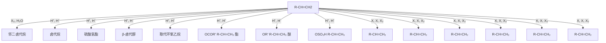
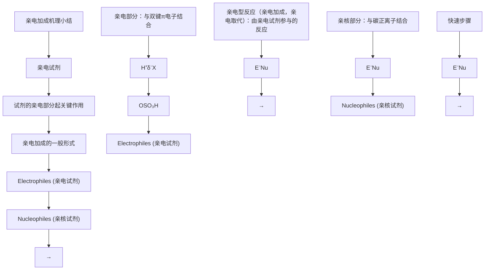
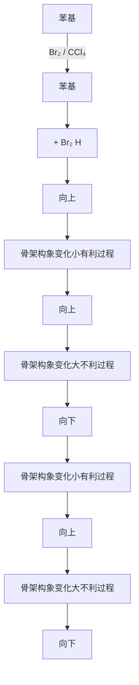
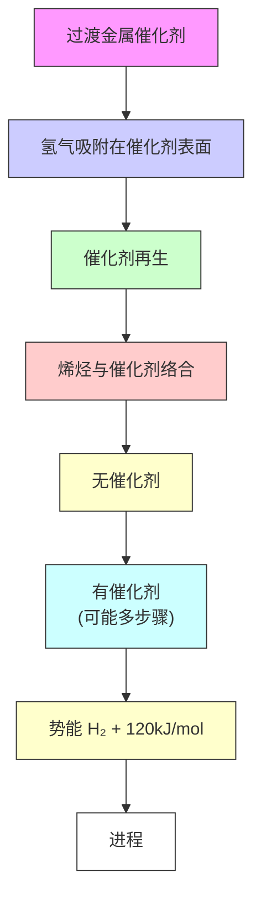

# 一、烯烃课程介绍00:00

# 1. 课程预习提醒 00:26

● 预习要求: 上课前五分钟需预习讲义内容，讲义每周会在学而思化学竞赛在线课程群更新  
● 习题安排: 讲义后附有习题，课上会抽时间对答案

# 2. 课程群加入说明 03:50

![[06.烯烃_笔记_images/aa2765f8de65489043c3a60c47bc3cc5ab809095cbaf07bc4dca8d13707692a2.jpg]]

text_image

学语融络优

2018年春季有机化学在线课程  
主讲老师：刘曦廷  
2012年CCHO金牌，保送PKU CCME  
2017年加入学而思，高中化竞教研负责人  
QQ:418035973   
百度化学竞赛吧@刘曦廷老师

理化竞赛在线课负责人

![[06.烯烃_笔记_images/d2aa137663cb89f1b42804e056747d832137e5b2ef9c81e7b936b2cffd00bcfd.jpg]]

![[06.烯烃_笔记_images/e0130b8880fa899dd31262a39b9e55788f044eeee77b2d7a033da216b9145a44.jpg]]  
学而思化学竞赛讨论群扫一扫二维码，加入群聊。

![[06.烯烃_笔记_images/fec549112622b406feeab7784877f96822f9e6a6472129a23c3a8d20ba586d4d.jpg]]

![[06.烯烃_笔记_images/78241b08e55ffe4044f223430c292c8d4d18ae8e44b768601cb1507199df9d79.jpg]]  
XES化学竞赛在线课程群扫一扫二维码，加入群聊。

\-

● 联系方式: QQ 418035973，百度化学竞赛吧@刘曦廷老师

● 学习资源: 学而思化学竞赛讨论群提供讲义更新和习题资源

# 二、烯烃基础知识05:54

# 1. 烯烃类型 06:09

![[06.烯烃_笔记_images/039dcc5d220ac27b15a0f9ea8dbe1274c28dd76ede5d9d94a70d89077a94890d.jpg]]

chemical

烯烃的类型、结构和命名，包含连二烯、共轭二烯和孤立二烯的化学结构及维生素A的特征

1）单烯烃通式 06:18

\- 通式特征: 单烯烃通式为 $C_nH_{2n}$ , 与烷烃 $C_nH_{2n+2}$ 相比少两个氢原子

● 最小碳数: $n \geqslant 3$ ，当 n=2 时只能形成炔烃结构

● 实例对比: 乙烯 $(H_{2}C=CH_{2})$ 是最简单的烯烃

2）二烯烃分类 07:25

● 共轭二烯: 双键间存在共轭效应，性质特殊（第六章重点）

\- 孤立二烯: 性质类似单烯烃，双键间隔较远

● 连二烯/累积二烯: 如丙二烯结构，两端氢原子不在同一平面

● 典型实例: 异戊二烯结构唯一，双键不能连在同一碳原子上

# 2. 烯烃结构 08:47

![[06.烯烃_笔记_images/33dae23e658f515c88b0f236894c30302589bd9f315aac1e36cd03fd16f12eda.jpg]]

text_image

学而思培
结构
> 与双键相连的原子在同一平面上
σ键 (sp²-sp²)
π键 (p-p)
> 双键不能旋转——有立体异构
cis
trans

1）sp2杂化轨道 08:50

● 杂化方式: 碳原子采用sp2杂化，形成平面三角形结构  
● 键型组成: 包含一个sp2-sp2 σ键和一个p-p π键  
● 空间特征: 所有与双键相连的原子共平面， $\pi$ 键垂直于分子平面

2）双键旋转限制 09:32

- 旋转障碍: 双键通常不能自由旋转，需光照条件才能发生旋转  
● 立体异构: 产生顺反异构现象，如Diels-Alder反应中需特别注意

3. 烯烃命名 10:23

![[06.烯烃_笔记_images/faa72e5808871e9b86d5c4c93d2cea6e3b6e64f44951688399caedbd9defc659.jpg]]

chemical

Chemical structures and descriptions of ethylene, isobutene, and isoprene derivatives with Chinese labels

1) 普通命名法 10:28

● 命名规则: 基于相应烷烃名称, 如异丁烯源自异丁烷  
- 典型实例:

○ 乙烯(ethylene)  
○ 异丁烯(isobutene)   
○ 异戊二烯(isoprene)

2）系统命名法 11:29

● 主链选择: 必须包含双键的最长碳链  
● 编号原则: 使双键位次最小, 取代基编号次之  
● 环烯烃规则: 双键默认1号位，取代基取最小编号  
● 长链实例: 十二碳烯需标明双键位置（如2-十二碳烯）

3）顺反异构标记 16:12

● 顺式定义: 取代基在双键同侧（如顺-2,2,5-三甲基-3-己烯）  
- 反式定义: 取代基在双键异侧  
Z/E标记:

○ Z源自德语"zusammen"(一起)，指优先基团同侧  
○ E源自德语"entgegen"(相反)，指优先基团异侧

● 取代要求: 仅适用于每个双键碳有一个取代基的情况

# 三、烯烃化学性质 17:54

# 1. 双键键能分析 18:02

![[06.烯烃_笔记_images/0033eaf8377260f2b9b749fba370f1a3c63fa090148a05903ab3df8734d3bda5.jpg]]

chemical

化学性质分析图解，展示双键结构与性质分析，含键能、电子结合及亲电试剂反应等关键参数

- σ键与π键对比：σ键键能约347 kJ/mol（头碰头重叠区域大），π键键能约263 kJ/mol（肩并肩重叠程度小），两者相差约90 kJ/mol

\- $\pi$ 键特性：

○ 电子活性： $\pi$ 电子结合松散，是电子供体，具有亲核性  
- 反应活性：π键活性显著大于σ键，易与亲电试剂结合  
○ 不饱和度：可通过加成反应达到饱和（通式 $C_{n}H_{2n}\rightarrow C_{n}H_{2n+2}$ ）

\- 轨道解释： $\mathrm{SP}^2$ 杂化碳的p轨道能量较高，形成的π键电子更容易给出（相比 $\mathrm{SP}^3$ 杂化的烷烃）

# 2. 加成反应类型 29:54

# 1）亲电加成反应 30:00

![[06.烯烃_笔记_images/b0f540f7b6fe08f0f970ca0458492407169b7cc06ffd8e18cb3363573a3fa418.jpg]]

chemical

Chemical reaction diagram showing electrophilic addition of methylene under various conditions, producing pentachloroacetic acid and dihydroxybenzene derivatives.

● 反应本质：烯烃作为电子供体与缺电子试剂（亲电试剂）发生的异裂加成  
● 常见类型:

- 卤化氢：生成卤代烷（如HBr→溴代烷）  
- 硫酸：生成硫酸氢酯 $(H - OSO_{3}H)$   
○ 水：生成醇（需酸催化）  
- 卤素：生成邻二卤代烷 $(X_{2})$   
○ 次卤酸：生成β-卤代醇（如HOCl）

2）自由基加成 31:00

● 反应特点：通过自由基中间体进行的均裂加成 $(A \cdot + B \cdot)$

● 机制：自由基攻击双键生成新自由基，再结合终止

3）催化加氢 31:15

● 特殊反应：使用钯/铂等催化剂， $H_{2}$ 直接加成使烯烃饱和

● 应用：工业上用于植物油氢化

# 四、烯烃命名与构型

# 1. 顺反命名法

![[06.烯烃_笔记_images/5eee00a50c02973e63af013f76fa9bf6d4e89387c40c9908c39dd34007fa9dc2.jpg]]

chemical

双取代烯烃异构体的化学结构式及取代基的同侧，包含氢原子与碳原子的代际代际关系

- 适用范围：仅适用于双取代烯烃（如 $(H_{3}C)_{2}HC = C(CH_{3})_{3}$ ）  
● 规则:

○ 顺式(cis): 较大取代基在双键同侧   
- 反式(trans): 较大取代基在双键异侧

● 示例：顺-2,2,5-三甲基-3-己烯（cis-2,2,5-trimethyl-3-hexene）

# 2. Z/E命名法

![[06.烯烃_笔记_images/01453635411677047b8c265b2e71932a48c39ccf082f3b256b6af070a5c89cf0.jpg]]

chemical

Chemical structures and reaction examples of three organic molecules with labeled substituents and reaction conditions

● 适用范围：所有取代烯烃（特别是多取代情况）  
● 优先规则：

○ Z型：两个双键碳上的优先基团在同侧（记忆：Z=Zusammen，德语"在一起")  
○ E型：优先基团在异侧（E=Entgegen，德语"相反")

● 实例分析：

○ (Z)-3-甲基-2-戊烯：左侧甲基优先，右侧乙基优先   
○ (E)-2-溴-1-氯丙烯：溴与氯在异侧（编号使双键位次最小）  
○ (Z)-3-乙基-1,3-戊二烯：乙烯基＞乙基（双键视为连接两个假想碳）

# 五、常见烯基基团

![[06.烯烃_笔记_images/40f692b4463a99057559c1d15e883f599b250ff67ff42fc35530e38b458b6ce2.jpg]]

chemical

Chemical structures of propenyl and isopropenyl groups with examples for methylene, ethylene, vinyl, propenyl, isopropenyl, and 3-propenyl

乙烯基(vinyl): $H_{2}C = CH -$ (比乙基大)  
- 丙烯基：

○ 1-丙烯基(propenyl): $H_{3}C - CH = CH -$   
○ 2-丙烯基(isopropenyl): $H_{2}C = C(CH_{3})$

\- 烯丙基(allyl): $H_{2}C = CH - CH_{2}$ - (双键不与取代位直接相连)

\- 区分技巧:

○ "烯丙基": 先烯后丙 $(CH_{2}=CH-CH_{2}-)$   
- "丙烯基": 先丙后烯 $(CH_{3} - CH = CH - )$

\- 衍生物示例:

○ 甲基乙烯基醚： $H_{2}C=CH-OCH_{3}$   
○ 乙烯基氯： $H_{2}C=CH-Cl$   
○ 烯丙基胺： $H_{2}C=CH-CH_{2}-NH_{2}$

# 六、亲电加成反应32:02

# 1. 与HX加成 32:08

1）反应活性比较 32:12

![[06.烯烃_笔记_images/2ebe33c25b27552dc94fd48b8aab78586e9bcb976be1a631b5b07c5c67a8d2b6.jpg]]

chemical

Chemical reaction scheme for producing alkyl halide products using H-bromocyclopropane and chloroalkane, with reagents and yields labeled.

● 活性顺序：HI > HBr > HCl，碘化氢活性最高，氯化氢最低

\- 反应条件差异：

- 氯化氢需150-250℃高温， $AlCl_{3}$ 或 $FeCl_{3}$ 催化（生成四氯合铝酸增强酸性）  
溴化氢在-30℃氯仿中即可反应，产率76%  
- 碘化反应可直接用 $KI/H_{3}PO_{4}$ 在80℃进行，产率88-90%

● 本质原因：酸性强弱决定活性（HI酸性>HBr>HCl）

2）反应机理 33:41

![[06.烯烃_笔记_images/82dcfdc7be80aff2ebd94795d93f3a5ebc1fb2424b17a7c54b70738789b44963.jpg]]

chemical

碳正离子加成反应机理示意图，展示H与HX的加成过程及氢电势变化

两步机理：

○ 慢步骤：烯烃π电子进攻 $H^{+}$ ，生成碳正离子中间体  
- 快步骤：碳正离子与 $X^{-}$ 结合生成卤代烷

● 过渡态分析：

○ 过渡态 I：C-H键将成未成，H-X键将断未断   
○ 过渡态Ⅱ：C-X键形成过程需克服溶剂化效应

● 能量变化:

- 破坏π键和H-X键所需能量 < 形成C-H和C-X键释放能量  
三级碳正离子空间位阻更大，过渡态势能更高

# 2. 与硫酸加成 35:12

![[06.烯烃_笔记_images/cfa6d511c38fab8526f4a1145ad987f152ac4b3205b6331ab6193b56b9b4c6da.jpg]]

chemical

Chemical reaction equations for producing H-OSO₃H and ROso₃H from acetic anhydride, including hydrogenation and hydrolysis steps

反应条件： $0^{\circ} \mathrm{C}$ 即可反应

\- 产物应用：

- 硫酸氢酯水解可制备醇（工业制乙醇/异丙醇）  
○ 乙烯→硫酸氢乙酯→乙醇   
○ 丙烯→硫酸氢异丙酯→异丙醇

● 副应用：通过硫酸反应可除去烯烃杂质

# 3. 水合反应 36:32

# 1）烯烃在H+催化下与H2O的水合反应 36:44

![[06.烯烃_笔记_images/ff16f0b17d6259252ac6c9c785f90e64514f65785b102d207446ad9408b05a6b.jpg]]

chemical

Chemical reaction equations for producing H+ catalyst and alcohol under acidic conditions

催化剂要求：强酸 $(H_{2}SO_{4}, H_{3}PO_{4}, HBF_{4}, TsOH$ 等）

● 类似反应：

○ 与醇（HOR）加成生成醚  
○ 与羧酸（RCOOH）加成生成酯

# 2）烯烃与X2的加成反应及立体化学 37:16

![[06.烯烃_笔记_images/73ae4c29a41f4fae823926b040cae9a5ad26aa2a06491f8ad62c5d24a1915899.jpg]]

chemical

Chemical reaction scheme for the formation of a brominated alkene using X₂ and CCl₄, with reagents and conditions noted.

反应特性：

○ 主要发生反式加成 $(X = Cl, Br)$

○ 立体选择性： $Br_{2}>Cl_{2}$

● 分析应用：5%溴的 $CCl_{4}$ 溶液鉴别烯烃（红棕色褪去）  
● 例外：碘不参与此反应

3）烯烃亲电加成反应小结 38:11

![[06.烯烃_笔记_images/5c2594787d1b3addb75d27f6f59dfd608dcbc70c58c76dfd42c648b21835952d.jpg]]

flowchart

● 区域选择性规律：不对称烯烃中，X/OH主要加在中间碳上  
● 产物类型：

- 卤代烷（HX加成）  
邻二卤代烷（X2加成）  
○ β-卤代醇 (X2/H2O)   
○ 醚/酯（与醇/酸加成）

4）亲电加成反应机理——经碳正离子的加成 38:52

![[06.烯烃_笔记_images/11faff9777dbfa5c243526f0af43add81711880fad940c49af21bfa9b989bac4.jpg]]

chemical

反应进程分析与反应过程图，展示中间体中C=C(δ+H)键的反应过程及产物结构

- 决速步：碳正离子生成（第一步）

● 稳定性因素：

○ 三级碳正离子 > 二级 > 一级  
○ 共轭效应可稳定中间体

5）与H2SO4的加成机理 42:47

![[06.烯烃_笔记_images/54e87753f48925ab9fda92ec792fb71f03b12a753a5a04e0b5aaf8ce91ef8817.jpg]]

chemical

Chemical reaction scheme showing acid-catalyzed addition of H₂SO₄ to form a monomer, with electron transfer indicated

与HX机理相似：

\- 双键质子化生成碳正离子

○ $HSO_{4}^{-}$ 亲核进攻生成硫酸氢酯

● 关键区别：后续需水解步骤才能得到最终醇产物

# 4. Markovnikov规则 43:08

![[06.烯烃_笔记_images/a949bf5552b289a05cdc76786547e8a98bf2249f2a564eb976c744dc899b3bff.jpg]]

chemical

Reaction mechanism diagram showing acetylene hydrogenation and electron transfer in Markovskov method, with intermediate states labeled for 2° and 1° electrons.

基本定义: 氢离子总是加在含氢较多的碳原子上, 形成更稳定的碳正离子中间体。

\- 反应机理:

以1-丁烯 $(CH_{3}CH_{2}-CH=CH_{2})$ 与HBr加成为例，会生成两种碳正离子中间体：

■ 二级碳正离子（氢加在右边）： $CH_{3}CH_{2}-CH-CH_{2}^{+}$   
■ 一级碳正离子（氢加在左边）： $CH_{3}CH_{2}-CH_{2}-CH_{2}^{+}$

稳定性比较：二级碳正离子比一级碳正离子更稳定，其过渡态能量更低，反应速率更快（4:1比例）。  
○ 决定因素：中间体碳正离子的稳定性决定了加成取向，这是Markovnikov规则的本质。

# 1）规则例外分析 44:49

![[06.烯烃_笔记_images/2972b15fa2a7518240877277c1f23269bc15842650f67200f3ce09adb081bfaa.jpg]]

chemical

Chemical reaction equation showing formation of a chlorinated alkene using Markovnikov method

典型例外:

三氟甲基取代烯烃 $(F_{3}C-CH=CH_{2})$ 与HCl的加成不遵守Markovnikov规则。

● 原因分析:

电子效应：三氟甲基是强吸电子基团，当与碳正离子直接相连时会使正电荷高度集中，极不稳定。

○ 稳定中间体选择：氢加在远离三氟甲基的位置（形成 $F_{3}C-CH_{2}-CH^{+}$ ）比加在相邻位置（形成 $F_{3}C-CH^{+}-CH_{3}$ ）更稳定，因为正电荷不与强吸电子基直接相连。

共振稳定：特殊情况下（如氟取代）可能通过p-π共轭形成更稳定的碳正离子，此时仍可能符合Markovnikov规则。

\- 电子效应：三氟甲基是强吸电子基团，当与碳正离子直接相连时会使正电荷高度集中，极不稳定。
- 稳定中间体选择：氢加在远离三氟甲基的位置（形成 $F_{3}C-CH_{2}-CH^{+}$ ）比加在相邻位置（形成 $F_{3}C-CH^{+}-CH_{3}$ ）更稳定，因为正电荷不与强吸电子基直接相连。
- 共振稳定：特殊情况下（如氟取代）可能通过p-π共轭形成更稳定的碳正离子，此时仍可能符合Markovnikov规则。

![[06.烯烃_笔记_images/2a95e25028b75b7e5b86e995dd53ae3f799a25f4a01915fce75cf4b146fa060c.jpg]]

chemical

碳原子结构式与加成机理关系图，展示正碳离子在不同分子中的反应路径

# ● 判断方法:

- 必须画出所有可能的碳正离子中间体结构进行比较  
- 不能仅凭取代基的吸电子性质直接判断，需考虑：

■ 正电荷离吸电子基的距离  
■ 可能的共振稳定作用  
空间位阻效应

# 七、加成反应机理 52:27

# 1. 碳正离子重排 52:29

![[06.烯烃_笔记_images/73a90b12ee1952b2c0760d924d45519240b579c2a416c0fa35778e7cc128e0d2.jpg]]

chemical

碳正离子迁移 reaction mechanism involving acetic acid and hydrogen peroxide, showing electron transfer and nucleophilic attack steps

\- 重排现象：卤化氢加成烯烃时，除正常产物外还会生成重排产物，如 $H_{3}C-$

$C(CH_{3})=CH_{2}$ 与HCl反应会生成 $H_{3}C-C^{+}(CH_{3})-CH_{3}$ 和 $H_{3}C-C(CH_{3})H-CH_{2}Cl$ 两种产物

# - 重排机理：

- 第一步：生成二级碳正离子中间体 $H_{3}C - C^{+}(CH_{3}) - CH_{3}$   
- 第二步：发生σ键迁移（氢迁移），氢带着电子对转移到缺电子的碳上，形成更稳定的三级碳正离子  
- 第三步：氯离子进攻新的碳正离子得到重排产物

● 证据意义：重排现象是碳正离子中间体存在的直接证据，说明反应经过碳正离子阶段

# 2. 亲电加成小结 54:34

# 1）亲电试剂的定义与特点 54:42

![[06.烯烃_笔记_images/7cacf5630cfc98ca23db60a76520dc8ed8a220e52f4b18a8ee6d9685cbed0d43.jpg]]

flowchart

● 定义：试剂中亲电部分起关键作用的试剂称为亲电试剂（如HCl中的 $H^{+}$ ）  
- 特点:

○ 具有 $\delta^{+}$ 和 $\delta^{-}$ 两部分（如HCl中H带 $\delta^{+}$ ，CI带 $\delta^{-}$ ）  
- 反应时双键π电子进攻亲电部分（δ+），亲核部分（δ-）与碳正离子结合

● 常见类型：卤化氢（HCl、HBr）、硫酸等

2）亲电加成反应的一般形式 55:20

● 反应通式： $E^{\delta+}-Nu^{\delta-}+C=C\rightarrow C-C-E+Nu^{-}$   
● 决速步骤：π电子进攻亲电部分形成碳正离子  
● 反应类型：包括亲电加成和亲电取代（如芳香亲电取代）

3）酸催化下烯烃与水的加成（水合反应）机理 56:07

![[06.烯烃_笔记_images/0ad360831867982ef1ba3cc47879ef5091f5752588fb7fdb20c58e95204b391d.jpg]]

chemical

酸催化下烯烃与水的加成反应机理示意图，展示主要产物形成与化学反应过程

三步机理：

- 亲电进攻：烯烃双键进攻水合质子 $H_{3}O^{+}$ ，生成碳正离子  
- 亲核加成：水分子进攻碳正离子形成氧鎓离子  
- 质子转移：另一水分子夺取质子生成醇产物

● 区域选择性：遵循马氏规则，氢加在含氢较多的碳上  
● 亲电试剂：水合质子 $H_{3}O^{+}$ （实际反应介质中的主要存在形式）

4）酸催化下烯烃与醇的加成机理 58:08

![[06.烯烃_笔记_images/70c939e61e11803fb4209d12fb648a520fa7e72ddefe0d5951b1dd92f33e2c1b.jpg]]

chemical

酸催化下烯烃与醇的加成机理示意图，展示生成物与水合反应类似过程

\- 反应特点：

○ 使用Lewis酸（如 $HBF_{4}$ ）催化  
○ 机理与水合反应类似的三步过程

# ● 选择性原理：

- 醇的氧原子（ $CH_{3}O^{-}$ ）比 $BF_{4}^{-}$ 更具亲核性  
○ 氧的电负性较小，电子更易给出

# 5）酸催化下烯烃与酸的加成机理 01:00:06

![[06.烯烃_笔记_images/a57a24ac8bde1301c0d353b41a759ce4ee2850a09013c713e3095e5cb6495a5b.jpg]]

chemical

酸催化下烯烃与酸的加成机理反应示意图，含氢氧化还原机制及羰基氧作为碱的化学方程式

关键区别：羰基氧（而非羟基氧）作为亲核中心

● 稳定性分析：

- 羰基氧进攻形成的中间体可通过共振分散正电荷   
- 羟基氧进攻会破坏π共轭，导致正电荷集中不稳定

● 碱性比较：羰基氧碱性更强（因正电荷可通过共振分散）

# 3. 卤素加成机理 01:04:04

# 1）立体化学分析 01:05:47

![[06.烯烃_笔记_images/d4c378e8aa64a1f5cfc1dc1f6145b995e413fbd253b59c9af881147f04c7454c.jpg]]

chemical

Chemical reaction equations for acetylene and acetic anhydride (II) under ether reduction, showing structural transformations and reagents.

立体选择性：

\- 反式二丁烯加 $Br_{2}$ 主要生成外消旋体（>99%）

\- 顺式二丁烯加 $Br_{2}$ 生成内消旋体

\- 反式二丁烯加 $Br_{2}$ 主要生成外消旋体（>99%）
- 顺式二丁烯加 $Br_{2}$ 生成内消旋体

# ● 机理证据：

\- 干燥条件下反应慢，加入极性试剂（ $H_{2}O/FeCl_{3}$ ）加速

○ 表明极性分子对 $X_{2}$ 有极化诱导作用 ( $\delta^{+}-X-X^{\delta-}$ )

\- 干燥条件下反应慢，加入极性试剂（ $H_{2}O/FeCl_{3}$ ）加速
- 表明极性分子对 $X_{2}$ 有极化诱导作用（ $\delta^{+}-X-X^{\delta^{-}}$ ）

● 选择性差异： $Br_{2}$ 比 $Cl_{2}$ 立体选择性更好（因溴原子体积更大）

# 八、烯烃反应比较01:13:00

# 1. 溴水反应 01:13:05

![[06.烯烃_笔记_images/ffd97a8eff9adfcf8dd2c175e975df63b98391c3d9e2288697a4c8ac13b1810e.jpg]]

chemical

碳正离子机理解与反应示意图，展示H₂C=CH₂与Br₂、H₂O、NaCl的转化过程及反应生成

● 决定性作用：溴在反应中起决定性作用，当只有水和氯化钠时烯烃不发生反应  
● 酸催化需求：烯烃与水的氢卤加成需要质子催化，中性氯化钠溶液缺乏质子故不反应  
- 产物解释：通过碳正离子机理可以解释溴水反应中产生的多种产物（Br、OH、Cl取代产物）

# 2. 碳正离子机理 01:13:19

● 异裂机制：溴在双键和极性试剂诱导下发生异裂   
● 反应过程：双键对溴进行亲核进攻→形成碳正离子中间体→得到各种取代产物  
● 局限性：该机理不能解释反应的立体选择性（如环己烯加溴产生>99%的对映体）

# 九、环正离子机理01:14:19

# 1. 环卤鎓离子 01:15:47

![[06.烯烃_笔记_images/a29e21030710dba5e0652ff89248d8f1fd5ba53a771052c26502f90013424735.jpg]]

chemical

环正离子机理与实验依据的化学反应示意图，包含环卤链离子稳定性及无重排产物生成步骤

形成过程：卤素正离子与烯烃形成三元环中间体（环卤鎓离子）  
● 稳定性顺序：Br > Cl（溴因电负性较小、体积较大更易成环）  
● 立体选择性： $Br_{2}>Cl_{2}$ ，通过 $S_{N}$ 2背面进攻得到反式加成产物  
● 实验证据：无重排产物生成证明不存在碳正离子中间体

# 2. 邻基参与效应 01:18:29

![[06.烯烃_笔记_images/b5a1a7d66aaf4c87f12c54758fc8ff291a17d75bc960b805d1ecdbd66d2e504a.jpg]]

chemical

化学反应方程式，展示用环正离子机理解并生成β-卤代醇的有机理与氢氧化碳反应过程

- 多亲核试剂竞争：体系中 $Br^{-}$ 、 $Cl^{-}$ 和 $H_{2}O$ 均可进攻环鎓离子  
- $\beta$ -卤代醇形成：水分子进攻后需经历去质子化步骤

● 命名规则：与羟基相连的碳为 $\alpha$ 碳，相邻碳（连卤素）为 $\beta$ 碳

# 3. 顺反2丁烯加成 01:22:44

![[06.烯烃_笔记_images/89f8496baeb6943e188e38e12f9ec435c5470d4d9fae7b5fc373e3ec3f47a800.jpg]]

chemical

环正离子开环区域选择性（取向）的化学反应示意图，展示次溴酸与主要/次要产物的取代关系

顺式加成：得到一对对映体外消旋体   
- 反式加成：得到内消旋化合物  
● 区域选择性：次溴酸加成符合Markovnikov规则（Br+加在含氢较多的碳上）

![[06.烯烃_笔记_images/aed0954bf31577dd2f85ed37bfb08e8f0e7c3a7c6913a79d8c409201052b5276.jpg]]

chemical

环正离子开环区域选择性（取向）的化学反应示意图，展示主要和次要产物生成次溴酸的结构式

● 主产物形成：通过三元环中间体主要生成二溴代产物  
● 次产物机理：水分子进攻时存在竞争性反应路径

# 十、区域选择性 01:23:46

# 1. 马氏规则应用 01:24:48

![[06.烯烃_笔记_images/52c658b9fda4b594baaa6ac03387b65bd6ef327481898d6082e3dc38012210ed.jpg]]

chemical

Chemical reaction mechanism of 2-tert-butadiene showing monomerization and cross-coupling steps

- 顺式加成产物：顺-2-丁烯与 $Br_{2}$ 反应生成一对对映体（外消旋混合物），如结构式a和b所示。  
- 反式加成产物：反-2-丁烯反应生成内消旋化合物，如meso结构所示。  
● 非手性反应特点：非手性原料与试剂反应总是得到消旋产物。

![[06.烯烃_笔记_images/1a368ee7ee96d18a824ae0e0f0f03835269cd85861fe4ca3d22008e7cd986336.jpg]]

chemical

环正离子开环区域选择性（取向）的化学反应示意图，展示主要与次要产物生成次溴酸的结构式

- 主要产物形成：溴正离子优先加在含氢较多的碳上，符合Markovnikov规则，如 $\delta^{+}$ 标记的碳吸引 $Br^{+}$ 。  
- 次要产物说明：次溴酸(HOBr)的加成同样遵循马氏规则，但产率较低。

# 2. 取代基影响 01:26:29

![[06.烯烃_笔记_images/75f34a40d865b7956c781c0b2c8214fc0410b96ab08e4a6a611facdeb8194a96.jpg]]

chemical

有机碳反应示意图，展示取代基较多碳正电荷密度较大下的两种稳定与不稳定状态

● 电荷密度原理：取代基较多的碳正电荷密度较大，如 $H_{3}C^{\delta}$ +比未取代的碳更稳定。  
● 稳定性解释：甲基通过诱导给电子效应稳定碳正离子，三级碳正离子（左边）比二级（右边）更稳定。  
● 进攻方向：亲核试剂从碳正离子背面进攻（如左边），导致溴加在含氢多的碳上。

# 十一、烯烃加成机理 01:28:09

# 1. 环己烯构象分析 01:28:27

![[06.烯烃_笔记_images/74f7414d664589be6d9f1f2317d14ddd84e74e2b9d9ad3532fa8cedbb37a5e7a.jpg]]

flowchart

● 有利过程：溴从上方进攻时，原有朝上/下的碳构象改变小（骨架变化小），能量有利。  
- 不利过程：从下方进攻导致构象翻转（如朝下碳变为朝上），骨架变形大，能量较高。

# 2. 位阻影响因素 01:30:24

![[06.烯烃_笔记_images/2134a8dbc095b7db419acad1d2afdbc83e9b335a2c2a010108ee50629638c0ea.jpg]]

chemical

化学反应方程式，展示顺-2-丁烯加卤素的立体化反应及异构式转移

- 顺式烯烃产物：得到一对外消旋体（如结构a/b对映体）。  
- 反式烯烃产物：生成内消旋化合物（如meso结构）。  
● 结构转换技巧：将锯架式转为十字式时，主链碳朝后竖直放置，取代基水平朝前。

# 十二、硼氢化反应01:34:02

# 1. 甲硼烷性质 01:38:59

![[06.烯烃_笔记_images/8ae4de6bd2ea21ff854c38cbe1c1594bfc33027afe10952e08b8d36373ca126c.jpg]]

chemical

β-溴代醇与HBr反应示意图，展示其在不同化合物间生成的反应路径及结构式

- 立体专一性现象： $\beta$ -溴代醇反应仅得内消旋产物（构型保持）或外消旋体，无法用单纯 $S_{N}1 / S_{N}2$ 解释。  
- 环正离子证据：通过分子内 $S_{N}2$ （邻基参与）形成环正离子中间体，如结构a/b所示，最终产物构型保持。

# 2. 氧化还原区别 01:43:10

![[06.烯烃_笔记_images/417fa7bb83482aac45a38cd63e2d8cf088665548cca7f637a231cd8101198ec6.jpg]]

chemical

双键上有氧和氮原子的生成与分解反应图，展示二氢吡喃与ROH、R₂NH等产物的生成及加成过程

- 反应惯性：含杂原子（如Cl）的双键加成仍符合马氏规则，但速率比乙烯慢。  
- 双重电子效应：

吸电子诱导：降低双键电荷密度，减慢反应（如Cl的-I效应）。  
○ 给电子共轭：通过p-p共轭稳定碳正离子（如Cl的+M效应）。

● 动态选择性：反应前吸电子主导（速率慢），反应后给电子主导（产物稳定）。

# 十三、烯烃聚合反应01:45:08

# 1. 二聚反应 01:48:44

![[06.烯烃_笔记_images/641b3a8345ac488c96dc342b3b63edf075e03beb10749e68ea89bb6f46ffaacb.jpg]]

chemical

烯烃二聚（正离子型）反应方程式，涉及H3PO4和H2SO4的取代步骤

- 反应取向：主要产物为少取代烯烃（霍夫曼取向），占比 $80\%$ ；次要产物为多取代烯烃（扎伊采夫取向），占比 $20\%$   
● 机理分析：

- 第一步：烯烃与质子结合生成碳正离子 $(R_{3}C^{+})$   
- 第二步：碳正离子与另一分子烯烃结合形成新的碳正离子  
- 第三步：消除质子形成双键

\- 取向原因：

- 霍夫曼产物优势：消除右侧质子时过渡态空间位阻较小   
◦ 扎伊采夫产物劣势：消除左侧质子时过渡态存在较大排斥力而不稳定

\- 分子内二聚：

○ 碳正离子稳定性：左侧生成的碳正离子（8个C-H σ键超共轭）比右侧（7个C-H σ键）更稳定   
- 消除取向：仍遵循霍夫曼规则，优先消除位阻较小的氢

![[06.烯烃_笔记_images/59de8a1dc84e40ded45aa2dbf51ba9399a12e7afa18ae8fc061fcfcc04c8dd35.jpg]]

chemical

分子内二聚的生成与机理反应示意图，展示新生成C-C键和8C-HV两个步骤

● 实例分析:

○ 反应条件： $60\%H_{2}SO_{4}$ 或 $80\%H_{3}PO_{4}$ ， $100^{\circ}C$   
○ 关键步骤:

■ 孤立双键优先与质子结合  
■ 三级碳正离子稳定性比较  
■ 分子内环化形成新C-C键

2. 自由基聚合 01:57:08

![[06.烯烃_笔记_images/80e4500874f5936a1b3b4ce1c3fbca2965519182b05e89330fe72a9ef6cae0ea.jpg]]

chemical

Polymerization reaction scheme of benzoyl peroxide using methylene glycol, showing monomerization and chain transfer steps

● 引发剂：过氧化苯甲酰（Benzoyl peroxide）

\- 反应机理：

○ 链引发：PhCOO - OOCPh△2PhCOO·   
- 链增长：自由基进攻烯烃双键，形成新的自由基并持续增长  
- 链终止：自由基结合形成稳定产物

\- 特点:

◦ 与正离子型聚合不同，自由基引发双键异裂

○ 形成高分子长链（如聚苯乙烯）

\- 结构分析：

○ 结构基元需包含2个碳原子（考虑空间取向）

○ 实际高分子忽略端基（通常为H和OH）

# 十四、催化氢化 01:59:54

![[06.烯烃_笔记_images/a9c43e52cb07b4c644af605943b1fbd6d0b05dea139064eb22fe35c1d61c3f9c.jpg]]

text_image

3. 烯烃的催化氢化（还原反应）
C=C + H₂ → C—C—H
催化剂
实验室常用催化剂：
Pt, Pd (用活性炭、CaCO₃、BaSO₄等负载)
Raney Ni (Ni(Al) + NaOH) → Ni + NaAlO₂ + H₂
骨架镍
H₂ 压力：
Pt, Pd : 常压及低压
Raney Ni : 中压（4~5MPa）
温度：常温（<100oC）

● 常用催化剂：实验室常用Pt、Pd（负载于活性炭、 $CaCO_{3}$ 、 $BaSO_{4}$ 等载体上）和Raney Ni（骨架镍）

\- 反应条件:

- Pt/Pd: 常压或低压  
○ Raney Ni: 中压 (4-5 MPa)   
- 温度：常温（<100℃）

# 1. 顺式加成 02:01:02

![[06.烯烃_笔记_images/6b5c044a47c5b72a35797eefb4a656b705ae40a4f7cc0a6721ddae590131c586.jpg]]

flowchart

# - 反应机理：

- 氢气吸附在过渡金属催化剂表面形成活性氢物种  
- 烯烃与催化剂络合后发生分步加成（可能多步骤）  
- 最终生成烷烃并再生催化剂

# - 催化剂作用：

○ 降低活化能 ( $\Delta H \approx -120kJ/mol$ )  
- 同时加速正逆反应速率（但放热反应平衡更倾向正反应）

![[06.烯烃_笔记_images/b02af5bba8611adc44ff1fa736a246d82e4b23068178ca598552bd47f8266a9a.jpg]]

chemical

化学反应方程式，展示催化氢化、主要顺式加氢和位阻小的化学反应步骤

# - 立体选择性:

- 主要发生顺式加成（立体有择反应）  
例：甲基环己烯加氢产物中70-85%为顺式产物

# - 轨道对称性解释：

○ 金属d轨道电子填入H-H反键轨道（ $\sigma^{*}$ ）使其断裂  
○ 氢原子从π键同侧协同加成（轨道对称性匹配）

# 2. 位阻影响 02:05:53

![[06.烯烃_笔记_images/44efb1d0678aaf802227a9d0fa6153514e583032939e516864b7957604bad18f.jpg]]

chemical

化学反应示意图，展示位阻对加氢取代的影响，涉及小基团与大基团的位阻变化及主要产物转化过程

# ● 主要规律：

○ 氢优先从位阻较小的一侧加成  
○ 例：三环化合物中，单碳位阻面产物占优（70%）

# ● 特殊案例：

○ 当取代基靠近双键时（如邻位甲基），位阻关系反转

○ 导致氢从原"位阻较大"面加成成为主要途径

# 十五、烯烃氧化02:07:01

![[06.烯烃_笔记_images/9e26adce4d3f959fe1b86632b1476a1686dc6d2967e19d719d220f27204c69ae.jpg]]

chemical

Reaction mechanism of methanol oxidation to form carboxylic acid and cyclopropane, with key intermediates and products labeled

# 强氧化体系：

○ $KMnO_{4}$ （浓、热）/OH $^{-}$ 或 $K_{2}Cr_{2}O_{7}/H^{+}\rightarrow$ 酮/酸  
- 端烯会被彻底氧化为 $CO_{2}$ （合成少一个碳的酮）

# ● 温和氧化体系：

○ 冷稀 $KMnO_{4}/OH^{-}$ 或 $OsO_{4}\rightarrow$ 邻二醇  
○ RCOOH/过氧酸 → 环氧化物

# 1. 臭氧氧化 02:09:29

![[06.烯烃_笔记_images/735bf26222882e5c3353b668c2e5a9459d1629002364e966ccba38beb37e9f5f.jpg]]

chemical

Chemical reaction mechanism of benzene oxide formation using oxygen reduction, showing intermediates and products like 2-methylglyoxide and secondary oxime.

# - 反应机理：

○ 形成一级臭氧化物（环氧结构）  
○ 重排为二级臭氧化物（含-0-0-键）  
○ Zn/H₂O还原避免醛被过氧化氢氧化

# - 特点:

- 保持原烯烃碳骨架  
○ 每个双键碳转化为羰基碳（醛/酮）

![[06.烯烃_笔记_images/d3d0601d275fbed1b636003360e7a5c2ae013bfade8d9da8035cef1b46905652.jpg]]

chemical

臭氧氧化烯烃应用与分析结构的化学反应示意图，包含制备醛和有机分析步骤

# - 合成价值：

\- 专一性制备醛（特别是端烯→甲醛）

○ 环烯烃开环得二羰基化合物

# 2. 结构分析应用 02:12:27

# - 结构解析：

○ 通过臭氧化产物反向推导原烯烃结构  
○ 例：得两分子甲醛→原结构含端烯

# ● 硼氢化反应补充：

○ 甲硼烷 $(BH_{3})$ 与烯烃加成得烷基硼  
- 后续可氧化为醇（反马氏规则）或还原为烷烃

# 十六、硼氢化反应机理 02:14:24

# 1. 反应机理 02:14:27

# 1）乙硼烷与烯烃反应 02:14:30

![[06.烯烃_笔记_images/a05921946e949cc286ac930402e380617fab01cc52643bb73361dbb0fea2a828.jpg]]

chemical

硼氢化反应的机理，展示四中心过渡态中苯环与氢键生成的化学反应过程

- 反应物结构: 乙硼烷 $(B_{2}H_{6})$ 在THF中解离为甲硼烷 $(BH_{3})$ , 与烯烃 $(CH_{3}CH = CH_{2})$ 发生反应  
● 反应类型: 亲电加成反应，硼原子带部分正电荷，氢原子带部分负电荷  
● 产物结构: 生成三烷基硼( $(CH_{3}CH_{2}CH_{2})_{3}B$ )

# 2）亲电加成过程 02:15:01

![[06.烯烃_笔记_images/ba83a7a83bc4195fa8ac4f498900157b8d529b92eb8a2695811702cdff104cfa.jpg]]

chemical

烯烃与二硼烷反应机制示意图，标注了二级碳带正电荷、稳定性差及四中心过渡态

● 电子流向: 硼原子接近π电子密度高的双键碳原子, 同时接纳π电子  
● 电荷分布: 与马氏规则相反，硼加在含氢较多的碳上，氢加在含氢较少的碳上  
● 空间位阻:硼优先接近空间位阻小的双键碳原子

# 3）四中心过渡态 02:15:37

![[06.烯烃_笔记_images/9569ca4f8d62ffb316937b4c6f9b4b48fb69816561c64634615c768eacc95d39.jpg]]

chemical

硼氢化反应的机理图，展示氢氧化钠与二氧化碳反应生成四中心的过程

● 过渡态特点: 形成四元环状过渡态, 硼和氢同时与双键碳原子作用  
● 稳定性差异: 二级碳正离子比一级碳正离子更稳定  
● 反应步骤: 需经过三步相同的反应才能完全转化为三烷基硼

# 2. 反应特点 02:16:09

# 1）顺式加成

● 立体化学:硼和氢从双键同侧加成，保持烯烃原有构型  
● 与催化氢化对比: 类似催化氢化反应，但需要考虑空间位阻影响  
● 环状化合物: 对于环状烯烃，硼从位阻较小的一侧进攻

# 2）反马氏规则 02:16:45

![[06.烯烃_笔记_images/821f9efe1dfe96a8fb5b4169c035399c4d65b01cfb494b1559c2f3c71f94c081.jpg]]

chemical

烯烃与二硼烷反应机制示意图，展示二级碳带正电荷与四中心过渡态的结构变化

● 区域选择性: 氢加在含氢较少的碳上, 硼加在含氢较多的碳上  
● 与酸催化对比: 硫酸催化时羟基加在中间碳上, 硼氢化-氧化则加在端基碳   
● 产物差异: 硼氢化-氧化得到反马氏规则的醇，而酸催化得到马氏规则的醇

# 3）无重排产物 02:17:03

● 一步反应: 反应只经过一个环状过渡态, 没有碳正离子中间体  
● 稳定性优势: 避免了碳正离子重排导致的产物复杂性  
● 反应可控性: 产物结构可预测性强，适合合成特定结构的醇

# 3. 过氧化氢氧化机理 02:18:14

![[06.烯烃_笔记_images/ce5892eccee97f19916ba35cd473f92de6cb46ea8f3e4d44b93b024e0f9b6082.jpg]]

chemical

烯烃与二硼烷反应机制示意图，展示CH₃CH=CH₂与BH₃₂的反应过程及碳带正电荷稳定性差

● 配位变化: 硼从三配位变为四配位, 再变回三配位

● 电子转移: 氧原子拉电子作用促使硼-碳键断裂  
● 最终产物: 经过水解得到醇 $(CH_{3}CH_{2}CH_{2}OH)$ 和硼酸 $(H_{3}BO_{3})$   
● 还原反应: 在酸性条件下，硼可被还原为氢，生成烷烃

# 4. 硼氢化反应应用 02:20:49

![[06.烯烃_笔记_images/785acf7754c975ea9f8aa8e0aaff0f3d0c7825b4b776e8d20516798ae644edda.jpg]]

chemical

硼氢化-氧化反应应用的化学方程式，包含三步反应步骤

- 端基醇合成: 如丙烯转化为1-丙醇( $CH_{3}CH_{2}CH_{2}OH$ )  
● 环状化合物: 可得到反式取代的环烷烃衍生物  
- 混合产物: 对称烯烃可能生成两种产物，如2-戊烯氧化得到2-戊醇和3-戊醇  
● 还原应用: 硼氢化-还原反应可将烯烃直接转化为烷烃

# 十七、烯烃氧化反应02:22:54

# 1. 邻二醇制备 02:23:00

# 1）高锰酸钾氧化 02:23:25

![[06.烯烃_笔记_images/f575acbb76feefe2b099cea484e70debb240efdb562699c8711876b45ed78a62.jpg]]

chemical

Chemical reaction equations for producing meso from cyclohexene and cis, using KMnO4 catalysts

● 反应条件：必须使用稀的、冷的（约5℃）碱性高锰酸钾溶液  
- 反应特点：只打开π键而保留σ键，与完全氧化断裂双键的反应不同  
● 立体化学：顺式加成（立体专一性反应）

- 顺式烯烃反应得到内消旋产物（meso）  
- 反式烯烃反应得到一对对映体

● 机理：通过五元环中间体进行  
- 双键电子给到高锰酸根的氧上形成五元环
- 断裂后得到邻二醇和六价锰（最终变为 $MnO_{2}$ 和 $MnO_{4}^{-}$ ）

# 2）四氧化锇氧化 02:25:45

![[06.烯烃_笔记_images/d331353e54e46b9447087d582f43a081072894458fcf277c2a1fc49d95285193.jpg]]

chemical

Chemical reaction mechanism diagram showing hydrogenation and oxidation steps of a molybdenum complex with MnO₃ and OsO₄ ligands

反应步骤: (1) $OsO_{4}$ 氧化, (2) $H_{2}O$ 水解  
● 立体化学：同样为顺式加成  
● 机理特点：

- 与高锰酸钾类似，通过五元环中间体  
- 最终得到五价锇 $(OsO_{3})$ 和邻二醇

\- 经典案例：

- 反式双键的八元环氧化后，虽然初始是顺式加成，但产物会翻转得到反式结构  
○ 这是一个验证机理的经典题目

2. 环氧化物制备 02:29:09

1）过氧酸氧化机理 02:29:55

![[06.烯烃_笔记_images/c822efad2a54d6e5b521b8884ea609fa5384816ec98cd07c9af23dff776b92ab.jpg]]

chemical

Chemical reaction scheme for synthesizing acetic acid from aldehydes, showing intermediates and products including methanol, phenyl chloride, and acetone.

● 常用试剂：

○ 过氧乙酸 $(CH_{3}CO_{3}H)$   
○ 过氧苯甲酸 $(PhCO_{3}H)$   
○ 过氧三氟乙酸 $(CF_{3}CO_{3}H)$   
○ MCPBA（间氯过氧苯甲酸）

● 机理：协同机理

○ 烯烃π电子进攻过氧键的缺电子氧  
○ 同时羧酸根离去  
- 一步形成三元环氧化物

● 立体化学：顺式加成，构型保持

- 顺式烯烃得到单一产物  
- 反式烯烃得到外消旋体

● 区域选择性：主要发生在位阻较小的一边（99%选择性）

3. 反式邻二醇制备 02:33:47

![[06.烯烃_笔记_images/67fab35d51c8c45600bf5e2345511b17427db54a0b70570e4f69f59c2a9d35d6.jpg]]

chemical

合成上应用与环氧化物生成反应的化学方程式，涉及环氧化物和反式邻二醇的化学反应步骤

● 合成路线：先制备环氧化物，再酸性开环  
● 开环机理：

○ 质子催化： $H^{+}$ 先与环氧基结合增加碳的电正性  
○ 水分子从背面 $S_{N}$ 2进攻，得到反式邻二醇

\- 两种方法比较：

- 过氧酸路线：先顺式加成形成环氧化物，再反式开环，最终为反式加成效果  
- 四氧化锇/高锰酸钾：直接顺式加成  
- 反式烯烃在两种条件下的产物不同：

■ 过氧酸路线：先得外消旋环氧化物，开环后得内消旋产物   
四氧化铁路线：直接得外消旋邻二醇

# 十八、烯丙位取代反应02:37:33

# 1. 氯代反应机理

![[06.烯烃_笔记_images/c67b7f4c54069474bd4766c07eb6ff8139d19289c258edb6b1f073f617e78e27.jpg]]

chemical

烯烃与X₂反应的两种形式（例：丙烯+Cl₂），展示双键亲电加成和饱和碳基取代的化学方程式

反应条件：高温（气相）、 $Cl_{2}$ 低浓度  
● 反应类型：饱和碳上的自由基取代  
● 机理特点：

○ 链引发：Cl - Cl△2Cl·（通过加热断裂Cl-Cl键）

○ 链转移:

$Cl\cdot+H-CH_{2}CH=CH_{2}\rightarrow HCl+\cdot CH_{2}CH=CH_{2}$ （生成稳定的烯丙基自由基）  
$Cl_{2} + \cdot CH_{2}CH = CH_{2} \rightarrow Cl \cdot + Cl - CH_{2}CH = CH_{2}$ （自由基再生）

\- 稳定性解释：烯丙基自由基可通过共振稳定（形成 $\pi_3^3$ 体系），比丙烯基自由基更稳定

![[06.烯烃_笔记_images/7e717f7d897be5a538d410281455473800f68f7e396cb30b5a0d5da89b8b786a.jpg]]

chemical

烯丙位氯代机理——自由基取代机理的化学反应示意图，包含链转移、分离步骤及生成条件

- 氢原子类型：烯丙基自由基中仅存在2种化学环境不同的氢原子  
● 反应选择性：优先夺取烯丙位氢原子而非双键上的氢

# 2. NBS溴代反应 02:42:44

![[06.烯烃_笔记_images/fc1cd767fc16ea13fb484d87d36018e3863e834a6f1c0aa98bbcce8385e2771e.jpg]]

chemical

NBS溴代机理与NBS化学反应方程式，展示烯丙位溴代的实验室常用方法及链引发、转移步骤

- 试剂全称：N-溴代丁二酰亚胺（N-bromosuccinimide）  
● 核心功能：持续提供低浓度 $Br_{2}$   
● 反应优势：避免直接使用液态溴，更易控制反应条件

# 1）NBS应用 02:45:07

![[06.烯烃_笔记_images/efa1ecbb23091607aaaa80084ba59da01cdfb7b2e5374efea62e393b9b3db06c.jpg]]

chemical

NBS溴代机理与NBS化学反应示意图，展示烯丙位溴代的实验室常用方法及链引发、转移过程

● 引发过程:

○ $(PhCOO)_{2}\Delta2PhCOO\cdot$ (过氧苯甲酰分解)   
○ $PhCOO \cdot \rightarrow Ph \cdot + CO_{2}$ (脱羧反应)   
○ $Ph\cdot+Br_{2}\rightarrow PhBr+Br\cdot$ (生成活性溴自由基)

\- 链转移：与氯代反应类似，通过Br·夺取烯丙位氢生成烯丙基自由基

● 特殊应用：

- 苄基位溴代: $ArCH_{2}RNBSArCHRBr$ (同样通过自由基机理)   
- 亲电加成/分子内取代：可与烯烃发生反式开环反应，需后续 $SN_{2}$ 亲核取代

# 十九、共振论应用 02:46:37

# 1. 乙酸根负离子

![[06.烯烃_笔记_images/7ad3e235c9406d2b805d9b68715020be1382bc9beed7d06761aba9d3864d6628.jpg]]

chemical

化学反应示意图，展示乙酸根负离子在共振式与共振式两种条件下生成氢键长的结构

● 键长特征：两根碳-氧键键长均为0.127nm，介于C-O单键（0.135nm）和C=O双键（0.120nm）之间  
● 共振解释：存在两个等价共振式（ $H_{3}C-C=O^{-}\leftrightarrow H_{3}C-C^{-}-O$ ），真实结构为两者的杂化体  
● 电荷分布：负电荷均匀分布在两个氧原子上，形成 $\pi_{3}^{4}$ 大π键  
● 类似体系：硝酸根（三个等价共振式， $\pi_{4}^{6}$ ）、碳酸根（ $\pi_{4}^{6}$ ）、三氟化硼（ $\pi_{4}^{6}$ ）

# 2. 苯的结构 02:50:21

![[06.烯烃_笔记_images/2f1b45d3b980f403f94670c9245aaebf2561c06b50f0bf10e970b74b373b6a7e.jpg]]

text_image

例 2：苯的结构（六元环，所有C-C键均相同）
经典式（价键式）
（苯的Keküle式）
> 单双键交替，不能解释
苯的真实结构
共振式
共振式1 共振式2
苯分子的真实结构为
两者的杂化体

- 经典式局限：凯库勒式（单双键交替）无法解释所有C-C键等长（0.139nm）的事实  
● 共振结构：两个凯库勒式共振杂化（各占50%），真实结构用六边形内画圆表示  
● 应用限制：当苯环有取代基时不宜用圆圈表示法，需保留经典式以显示取代位置差异

# 3. 烯丙基自由基 02:51:50

![[06.烯烃_笔记_images/2b5d6ed5794c1f6642e7179046768af58afb6f42a1bc68b43128787c7f540d87.jpg]]

chemical

烯丙基自由基的化学反应方程式，展示同位素标记与共振式1/2的转化过程

● 同位素标记实验：碳14标记的烯丙基氯代反应产物比例为1:1  
● 共振解释：自由基可离域到两端碳原子（ $CH_{2}=CH-CH_{2}\cdot\leftrightarrow\cdot CH_{2}-CH=CH_{2}$ ）  
● 轨道特征：形成 $\pi_{3}^{3}$ 体系（含一个非键电子），所有原子共平面  
- 氢原子等性：现代谱学证实实际只有3种氢（一般表达式显示4种），说明末端 $\mathrm{CH}_{2}$ 基团等价

# 二十、烯丙位自由基取代02:55:51

# 1. 链引发过程

![[06.烯烃_笔记_images/f52e22220be5f28296bbe49d1713c5323d18cde7db1a81f918c6ea11e9a69913.jpg]]

chemical

烯丙位自由基取代机理的完整表达过程，包含链转移、链终止步骤及反应方程式

● 引发步骤：Cl-Cl键均裂生成氯自由基（Cl·）   
- 氢夺取：氯自由基夺取烯丙位氢原子，形成共振稳定的烯丙基自由基

# 2. 链转移过程 02:56:24

- 双途径进攻：烯丙基自由基可分别从两端碳原子进攻 $\mathrm{Cl}_2$ 分子  
● 产物特征：产生两种等价产物（当无同位素标记时）或1:1比例的标记/未标记产物  
● 取代位点：现代谱学证实实际有4种一卤代产物（考虑立体异构）  
● 反应实例：NBS（N-溴代丁二酰亚胺）是常用的烯丙位溴代试剂

# 二十一、课程复习 03:02:40

# 1. 烯烃结构与命名 03:02:44

![[06.烯烃_笔记_images/7e6640199d2dcaf9ce7c64d749530b87b69cefacd271c666862a1b0829e67266.jpg]]

chemical

烯烃的类型、结构和命名，标注含碳氢化合物、共轭二烯、多烯等化学结构及特征

基本定义：含 $C = C$ 的碳氢化合物，通式为 $C_nH_{2n}$ （单烯烃）

\- 分类体系：

○ 单烯烃：如乙烯 $CH_{2}=CH_{2}$

○ 二烯烃：

■ 共轭二烯： $CH_{2}=CH-CH=CH_{2}$   
■ 孤立二烯：分子内2个双键间隔较远  
■ 累积二烯：C = C = C 结构（第六章重点）

○ 多烯烃： $n \geq 1$ 个双键，如维生素A

# ● 特殊结构：

○ 连二烯：中间碳为sp杂化，性质类似炔烃  
○ 共轭二烯：下节课重点内容

![[06.烯烃_笔记_images/cee1261565c9e1c99e0fa925188335fa703dd36d5d7ff3c4a56e883b646fb19f.jpg]]

chemical

化学反应方程式，展示乙烯、异丁烯、异戊二烯三种化合物的取代路径及最终生成方程式

# - 系统命名法

○ 选取含双键的最长碳链为主链  
○ 双键编号取最小  
○ 取代基编号最小化

# ● 构型标记：

- 双取代烯烃：用"顺/反"标记（取代基同侧为顺式）  
○ 多取代烯烃：用"Z/E"标记（优先基团同侧为Z型）

# ● 实例:

○ 顺-2,2,5-三甲基-3-己烯   
○ (Z)-3-甲基-2-戊烯

![[06.烯烃_笔记_images/cdcb135f74bfefe284f79638539b37224a3617d1601683b791846373783205fc.jpg]]

text_image

一些常用的不饱和基团（烯基）
H₂C=CH—
H₂C—CH=CH—
H₂C=C—
CH₃
H₂C=CH—CH₂
例
H₂C=CH—OCH₃
甲基乙烯基醚
乙烯基氯
乙烯基—CH₂—NH₂
丙烯基，propenyl，1-propenyl
异丙烯基，isopropenyl，2-propenyl
烯丙基，allyl，3-propenyl
H₂C=CH—Cl
H₂C=CH—CH₂—NH₂
烯丙基胺

# - 重要基团：

○ 乙烯基（vinyl）： $CH_{2}=CH-$   
○ 丙烯基（propenyl）： $CH_{3}-CH=CH-$   
○ 烯丙基（allyl）： $CH_{2}=CH-CH_{2}-$

# ● 区别要点：

- 丙烯基与烯丙基的取代位置不同  
○ 需注意产物需同时标注双键构型和手性碳构型

# 2. 烯烃加成反应 03:04:32

![[06.烯烃_笔记_images/e4432953035d56604a92364f7b84c8bc12dbff31fe3e726cb73fa10f74b8a082.jpg]]

text_image

烯烃的化学性质 (1)
1.双键的结构与性质分析
键能:
σ键 ~347 kJ/mol
π键 ~263 kJ/mol
>π键活性比σ键大
>不饱和,可加成至饱和
CnH₂C=CCnH₂n+2
CnH₂n+2
π电子结合较松散,
易参与反应。是电子
供体,有亲核性。
>与亲电试剂结合
>与氧化剂反应
C₁₂H₁₁H₁Br… 亲电加成

# ● 电子特性：

- $\pi$ 键电子结合松散（键能263 kJ/mol vs $\sigma$ 键347 kJ/mol）  
- 具有亲核性，易与亲电试剂反应

# - 反应活性：

- $\pi$ 键活性显著高于 $\sigma$ 键   
○ 电子更易给出参与反应

![[06.烯烃_笔记_images/829378f4bb90f1d0e18236614a584a86e5d3a904bb5ebe750e871e1d1708519e.jpg]]

text_image

2.烯烃加成的三种主要类型
C=C + A—B → C—C—A B
重点
亲电加成 δ+δ-A—B → A⁺ + B⁻ (异裂)
自由基加成 A—B → A⁺ + B⁺ (均裂)
催化加氢 A—B = H₂ Rt, Pd.

# ○ 三大类型：

○ 亲电加成（异裂）： $A-B\rightarrow A^{+}+B^{-}$   
○ 自由基加成（均裂）：如 $H_{2}$ 加成  
○ 催化加氢： $H_{2}/Pt$ 催化

![[06.烯烃_笔记_images/d6285cb3b6753fc8b092c3c4ba4d26f19c789196ca33ca140aa4bb73304c225b.jpg]]

chemical

Chemical reaction diagram showing electrophilic addition of acetic acid to acetic anhydride, with enzyme reactions and resulting products labeled in Chinese.

# ○ 典型反应：

○ 与HX生成卤代烷  
○ 与 $X_{2}$ 生成邻二卤代烷  
○ 与XOH生成β-卤代醇

# ● 机理特征：

经碳正离子中间体（三级>二级>一级）  
- 溴鎓离子中间体（选择性Br>Cl）  
○ 立体化学以反式加成为主

![[06.烯烃_笔记_images/848a7a9599edb2789ce431e0251a1294ec1d697c70bf22501ba7c6e80e29c322.jpg]]

chemical

化学反应方程式，展示加成机理对Markov勒的解释与碱性反应过程

# 区域选择性：

○ H加在含H较多的碳上   
○ 由碳正离子稳定性决定（3°>2°>1°）

# - 重排现象：

○ 碳正离子可能发生1,2-氢迁移  
如 $H_{3}C-C(CH_{3})-CH=CH_{2}$ 与HCl反应

# 3. 烯烃氧化反应 03:09:43

# - 氧化剂类型:

○ 高锰酸钾/重铬酸钾（生成二醇/羧酸）  
- 臭氧氧化（需加Zn还原，否则继续氧化为酸）  
○ 四氧化锇/过氧酸

# - 立体化学:

- 顺式加成产物为主  
- 臭氧化还原需控制条件避免过氧化

# ● 特殊反应：

○ 烯丙位氯代（NBS试剂应用）  
- 聚合反应（注意质子转移终止步骤）

# 二十二、知识小结

<table><tr><td>知识点</td><td>核心内容</td><td>考试重点/易混淆点</td><td>难度系数</td></tr><tr><td>烯烃结构与命名</td><td>含碳碳双键的烃类,通式CnH2n;二烯类型:累积二烯、共轭二烯、孤立二烯</td><td>顺反异构与Z/E标记法;取代基编号优先级</td><td></td></tr><tr><td>烯烃加成反应</td><td>亲电加成(HX、H2SO4、H2O/X2等)、自由基加成、催化加氢</td><td>马氏规则 vs反马氏规则;碳正离子稳定性与重排</td><td></td></tr><tr><td>亲电加成机理</td><td>分步进行:双键质子化→碳正离子中间体→亲核试剂结合</td><td>溴鎓离子机制(反式加成);酸催化水合反应步骤</td><td></td></tr><tr><td>氧化反应</td><td>高锰酸钾氧化(断双键→醛/酸)、臭氧化还原(O3/Zn→醛酮)、环氧化(过氧酸)</td><td>冷稀KMnO4→顺式二醇;臭氧化产物分析结构</td><td>★★★</td></tr><tr><td>硼氢化氧化</td><td>B2H6加成→H2O2/OH-氧化,反马氏规则制伯醇</td><td>立体化学:顺式加成无重排</td><td></td></tr><tr><td>烯丙位取代</td><td>NBS溴代(自由基机制)、共振稳定化烯丙基自由基</td><td>选择性:烯丙位&gt;3°C-H;等价共振结构</td><td></td></tr><tr><td>聚合反应</td><td>阳离子聚合(碳正离子链增长)、自由基聚合(过氧化物引发)</td><td>二聚产物取向:霍夫曼产物为主</td><td></td></tr><tr><td>催化加氢</td><td>金属催化剂(Pt/Ni/Pd)表面顺式加成,位阻影响选择性</td><td>环己烯加氢构象分析</td><td></td></tr><tr><td>共振论应用</td><td>烯丙基正离子/自由基的离域稳定( $\pi 3^{3}$ 体系);羧酸根共振杂化</td><td>真实结构为共振杂化体,键长平均化</td><td></td></tr></table>