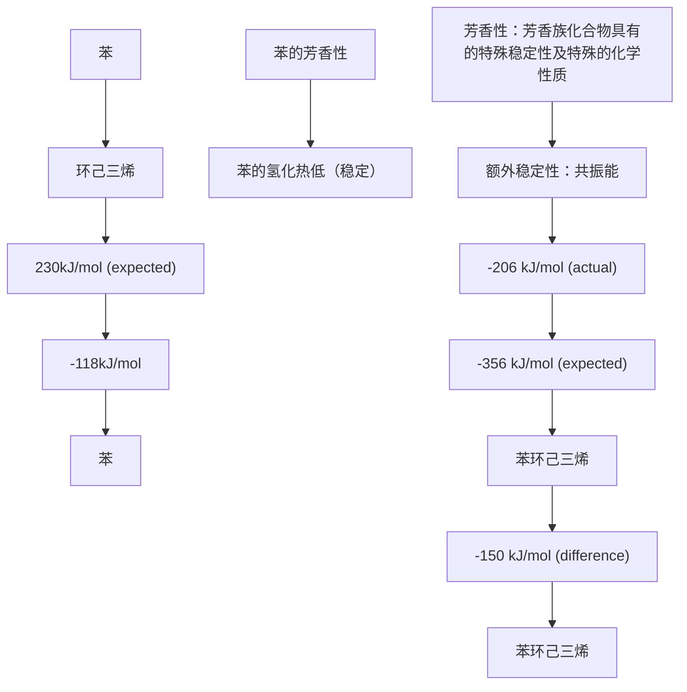
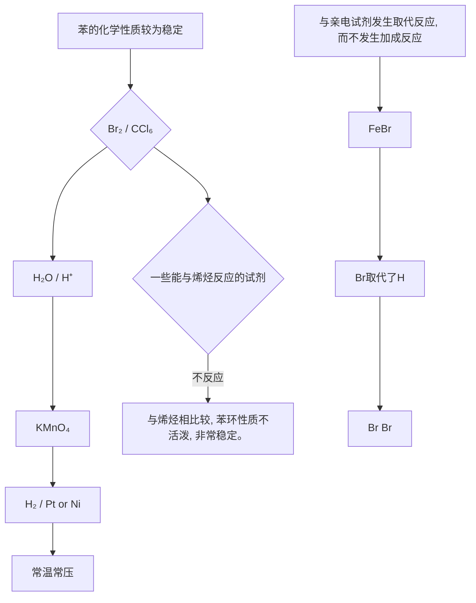
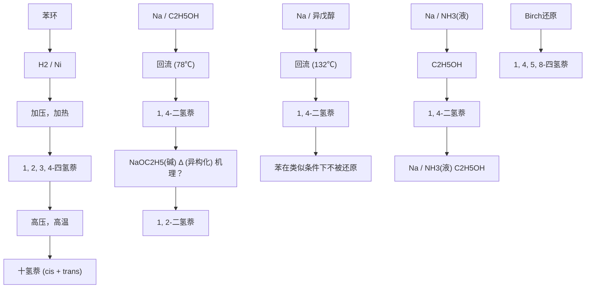

# 一、芳香族化合物及芳香性03:13

# 1. 芳香族化合物 03:23

# 1）芳香族化合物类型 04:34

![[08.芳香烃_笔记_images/8e89e6f550d83b7767c65c464bfed7700f38808b6e8a76bbdc8840ac78889431.jpg]]

![[08.芳香烃_笔记_images/097c3d574f885fb1c6b14d184b101f33058c8da72ca7941f9b6898f0792c1cf1.jpg]]

text_image

一．芳香族化合物及芳香性
芳香族化合物(Aromatic Compounds)：一些具有特殊稳定性和化学
性质的环状化合物。
■ 芳香族化合物类型
满足Hückel规则
R
芳烃
H
杂环芳烃
非苯芳烃
离子型芳烃
Hückel规则：
• 平面型环状分子
• 环状共轭体系
• 有4n + 2个π电子
E. Hückel, 1931

- 定义：具有特殊稳定性和化学性质的环状化合物，最新定义也包含某些非环状但具有芳香性的化合物。

\- 分类:

- 苯系芳烃：由碳氢原子组成的芳香环（如苯）  
杂环芳烃：环中含有杂原子（如氮、氧、硫）  
○ 非苯芳烃：不含苯环但具有芳香性（如环戊二烯负离子）  
○ 离子型芳烃：带电荷的芳香体系（如环戊二烯负离子）

Hückel规则：

- 条件1：分子必须是平面型环状结构  
- 条件2：具有环状共轭体系  
○ 条件3：π电子数符合4n + 2规则（n为整数）  
○ 示例：苯有6个π电子（n=1），符合规则

# 2）苯的结构 05:03

![[08.芳香烃_笔记_images/430f4ff52e96d98892c90641130b5fc733ef1aa26456b933f16d380c9902678a.jpg]]

![[08.芳香烃_笔记_images/06234f0857973209db297991103a3098c45710ada26a9b8de13548376a638a67.jpg]]

chemical

苯的结构示意图，标注平面型分子与C-C完全相等位置及 bond angles

![[08.芳香烃_笔记_images/f87242bf4457c14d51cd5b3c1f5c38b69619365c01cdd9a7c4b9229c63a0500d.jpg]]

chemical

苯的结构表达方式与同一分子的反应示意图，标注了苯的1,2-二溴代产物

![[08.芳香烃_笔记_images/d673b030165c4281620893509be66a4c90d401ffdfa39e5f97923b967b598d44.jpg]]

● 键参数：

○ C-C键长：140pm（完全相等）  
○ C-H键长：108pm  
○ 键角： $120^{\circ}$

\- 结构表示法：

○ 凯库勒式（环己三烯结构）  
○ 共振式（两种凯库勒式共振）  
○ 离域式（圆圈表示π电子云）

● 限制：离域式仅适用于未取代苯或对称取代苯（如六氯苯），不对称取代时不能使用

# ● 苯的芳香性 08:36

学而思培优  
![[08.芳香烃_笔记_images/8a80f300fe9551229b7bcfc5ecb2d048412227969deeec3ba4e3fc3ea68ee08a.jpg]]

flowchart

# - 稳定性表现：

■ 氢化热实测值（206kJ/mol）比理论值（356kJ/mol）低150kJ/mol   
■ 比环己二烯（230kJ/mol）更稳定24kJ/mol

# ○ 量子化学解释：

■ 电子在二维环状势箱中运动  
■ 所有 $\pi$ 电子填充在成键轨道（反键轨道空置）  
■ 满足 $4n + 2$ 规则的体系都有此特征

# ○ 典型例子：

■ 吡啶（6π电子）  
呋喃（6π电子）  
■ 环戊二烯负离子（6π电子）

# 3）苯的化学性质 16:01

学而思培优  
![[08.芳香烃_笔记_images/3869ed689ad8a53abe1f957bc540cb980787572211f39b823733cf1611538ad7.jpg]]

flowchart

# - 稳定性验证：

○ 不与 $Br_{2}/CCl_{4}$ 反应  
○ 不与稀 $KMnO_{4}$ 反应  
○ 常温常压下不与 $H_{2}/Pt$ 反应

# ● 特殊反应：

○ 在 $FeBr_{3}$ 催化下与 $Br_{2}$ 发生亲电取代  
○ 产物为溴苯（保留芳香环）

# - 反应性比较：

- 苯环π电子能级比烯烃低   
- 给电子能力较弱，需要更强条件

# 4）芳香族化合物命名简介 18:05

芳香族化合物命名简介

① 以苯为母体

![[08.芳香烃_笔记_images/c1b6a75909c5356727cb6aa2c2298dd56c054107880e1f4ed51e8d9fa6f13e25.jpg]]  
烷基苯

![[08.芳香烃_笔记_images/5a9e03e3798b4dc19b4435eb42ccea90871892a51172b3cbabcf225ae1ea9919.jpg]]  
甲苯

![[08.芳香烃_笔记_images/4ca4870e8acc4c7a1dfade40c5b8c0d057e4e861e2dcd774c3dcdfe75c0ee2f0.jpg]]  
异丙苯

简写

Ph-R

Ph-X

Ph-NO $_{2}$

Ph：苯基（phenyl）

![[08.芳香烃_笔记_images/2a6fccb5bead45079548bbb0a65d62f8c6956d4d27c66ade3454b4a243a55065.jpg]]  
卤代苯

![[08.芳香烃_笔记_images/3b73b07a0500cb860e60b5eb979610d2865e0aff9dc5a0bab7ff7c365a54149c.jpg]]  
溴苯

![[08.芳香烃_笔记_images/db66ffe1161495370a758799acdcef6dd2abe9b25c32650442dc4cb0f70cd65c.jpg]]  
氯苯

![[08.芳香烃_笔记_images/305dfd5198f24aa3a4732ddf2e0a5027ff171dcd46eed49ebfecce72eddf8ca8.jpg]]  
硝基苯

# 以苯为母体：

- 烷基苯：甲苯（ $Ph - CH_3$ ）、异丙苯（枯烯）  
- 卤代苯：溴苯（Ph - Br）、氯苯（Ph - Cl）  
○ 硝基苯 $(Ph - NO_{2})$   
○ 简写：Ph - 表示苯基

学而思培优

② 苯环为取代基

![[08.芳香烃_笔记_images/18018c1cd3eaf404b54aa2457ae2bd1a7d134abe05214bfd1fda1252966dd49e.jpg]]  
苯乙烯

$\left(\mathrm{Ph}-\mathrm{CH}=\mathrm{CH}_{2}\right)$

![[08.芳香烃_笔记_images/2197ef628e005ab1eb2bcc7b5f1d011c3c8826544953397954307ef61b4bf03c.jpg]]  
苯乙炔

![[08.芳香烃_笔记_images/6ec2a4dc626afe1d9d00d5ce72d3c9d54eeeb36d117208d4561dd12cb2cf8c76.jpg]]  
苯甲醛

![[08.芳香烃_笔记_images/1c22fa08e420c7df117e4be46b74d4df3b21924f3eade713885de2e11464ca46.jpg]]  
苯乙酮

![[08.芳香烃_笔记_images/01bd6bf9d1251f3c417a1cf1c6450ea9b8e99cee8d19a07cf0b71b60df568f0c.jpg]]  
苯甲酸

![[08.芳香烃_笔记_images/c10cb8ac64c9d85f4da4e92ee17105b24d04f2331ebe889a9a8e998f86a15069.jpg]]  
苯甲醚

![[08.芳香烃_笔记_images/2cb1344a6b443fc4dde163ed2843f2b5914fa9943315f1650c0d5f9810d03f37.jpg]]  
苯胺

![[08.芳香烃_笔记_images/914833ba334b42ff209115f0abafc870e535c62838c69c2294aea3ab9bbda9e2.jpg]]  
苯磺酸

# - 苯环作取代基：

○ 苯乙烯 $(Ph - CH = CH_{2})$   
○ 苯乙炔 $(Ph - C \equiv CH)$   
- 苯甲醛 (Ph - CHO)   
- 苯甲酸 (Ph - COOH)  
- 苯甲醚 $(Ph - OCH_{3})$   
○ 苯胺 $(Ph-NH_{2})$   
○ 苯磺酸 $(Ph-SO_{3}H)$

学而思培优

③ 多取代苯的命名

\- 多取代时母体选择次序：

![[08.芳香烃_笔记_images/01c84581cfc755672295ccdac21e82314494da22a4c6f3795eb48442dc7ea80a.jpg]]

\- 二个基团相对位置表示方法

![[08.芳香烃_笔记_images/48e4d501022e8906e57ca5c15c7677a8b7fb4de72f3c1ddd927bf2dc74b64204.jpg]]  
4-氯苯甲醛   
对氯苯甲醛   
p - 氯苯甲醛 (para)

![[08.芳香烃_笔记_images/94f181aa6b79bfb10c6e060019591d26ca5a59584657ee0a6f8a215a3cc5f1c8.jpg]]  
1,2-二溴苯   
邻二溴苯   
o - 二溴苯 (ortho)

![[08.芳香烃_笔记_images/b86c68b3e33cc8747bd1fe049431deef9fae0f3b75885d898f401c2c1a95fcea.jpg]]  
3-硝基苯甲酸  
间硝基苯甲酸  
m - 硝基苯甲酸 (meta)

简写 $p - \mathrm{ClC}_6\mathrm{H}_4\mathrm{CHO}$

$o - Br_{2}C_{6}H_{4}$

m - NO $_{2}$ C $_{6}$ H $_{4}$ COOH

# ● 多取代命名规则：

- 官能团优先顺序: $-COOH > -CHO > -NH_{2} > -R > -NO_{2}$   
○ 位置表示法:

■ 数字法（如4-氯苯甲醛）

邻(o-)、间(m-)、对(p-)

○ 简写示例:

![[08.芳香烃_笔记_images/e39f6a00790a767adfc72c0051001e8d0cfbab504a4ec593a9cf0538da7132ac.jpg]]

![[08.芳香烃_笔记_images/ec60697eb3b0672fdb7f7970b239c2a1e4b9f25b3eabb062f081255fc518aeee.jpg]]

![[08.芳香烃_笔记_images/a9978d58026e1f1d257083eaf3e7184ca33f8eb625f4bd77fbb3ff6b46ab5c1f.jpg]]

■ 对氯苯甲醛： $p - ClC_{6}H_{4}CHO$   
邻二溴苯： $o - Br_{2}C_{6}H_{4}$   
■ 间硝基苯甲酸： $m-NO_{2}C_{6}H_{4}COOH$

学而思培优  
- 多个基团时用数字表示相对位置  
![[08.芳香烃_笔记_images/3d8d2590b3f6cd801e260e2dfa7a2c31a3c9ea28546955726762db5f383aabdc.jpg]]

④ 其它情况  
![[08.芳香烃_笔记_images/e8f4183dff2dddb7471d7d1e123d7dc11774427f48f2d3e4b33e973751e3fb27.jpg]]  
2-苯基庚烷   
苯基为取代基

![[08.芳香烃_笔记_images/65ab7278f538961d79ec615ba99833414292bec021367edaf3d4866389dcaace.jpg]]

![[08.芳香烃_笔记_images/85945a5cc924533c2a37bb83af3a5db5887c30e6284c11a893e9d9d34da34831.jpg]]  
甲基苄基胺

![[08.芳香烃_笔记_images/02021091a00f7e0aba23ba47536d3c23cb5f9dbd54c7f580bc9621b6df31998a.jpg]]

# ● 复杂情况：

○ 长链取代：2-苯基庚烷  
- 苄基化合物：甲基苄基胺 $(Ph - CH_{2} - NHCH_{3})$   
○ 注意：Ph - 与Bz - 的区别（Bz - 指苯甲酰基）

● 例题：芳香族化合物命名 23:07

学而思培优  
![[08.芳香烃_笔记_images/19a1ebd700eaf9b04c14ddc1695adf5d8b3290294d69ca4a7f34e9d6731f5b5c.jpg]]

chemical

苯环的亲电取代与与亲电试剂反应分析图，包含主要性质与芳香性变化

反应特点：

■ 保持芳香性（取代优于加成）  
■ 需要较强亲电试剂  
■ 通常需要催化剂（如 $FeBr_{3}$ ）

○ 机理分析：

■ 第一步：π电子进攻亲电试剂（类似烯烃）  
■ 关键区别：消除H+恢复芳香性（而非加成）  
■ 热力学优势：芳香稳定化能驱动反应

5）苯环上的亲电取代 25:17

● 苯环的性质分析 25:20

学而思培优  
![[08.芳香烃_笔记_images/528baac02e45fa9ae64519829bcc3f5fcb70d3f01c3d538f196e19704179e0b4.jpg]]

chemical

苯环上的亲电取代机理通式，展示氢氧化钠与电子化氢反应生成的路径及反应过程

反应机理：苯环上的亲电取代反应分为两步：首先生成 $\sigma$ -络合物（慢步骤），随后消去质子（快步骤）。第一步活化能较高，是决速步骤。

- 中间体稳定性： $\sigma$ -络合物虽然比苯环能量高，但仍较稳定，能写出三种共振式使正电荷分散。这种稳定性解释了为何取代反应比加成反应更有利。  
☐ 芳香性保持：取代反应最终恢复苯环的芳香性，而加成反应会破坏芳香性，这是取代反应更易发生的关键原因。

![[08.芳香烃_笔记_images/965d6ddbd4a29d278b6c7a3d01a5f3a3d80b9c0fa55de4299e36e8c0bc0ebf68.jpg]]

chemical

苯环上的亲电取代的化学反应分析，包含电子化、氧化、化合及芳香性变化等步骤

主要反应类型：苯环主要发生亲电取代反应，而非加成或氧化反应。其π电子虽类似烯烃，但芳香性使其反应特性显著不同。  
反应选择性：与亲电试剂反应时，取代产物能保持芳香性，而加成产物会失去芳香性，因此取代反应在热力学上更有利。

● 常见的几类苯环上的亲电取代反应 26:42

![[08.芳香烃_笔记_images/78009401e978463e0c2b70b8e5fe388a1115ce464c247298476c20a6da9e6971.jpg]]

chemical

Chemical reaction scheme for producing various nitrile-based phenyl derivatives, including halogenation, nitroalkylation, and fluorination reactions.

反应条件共性：均需强催化剂（浓酸/路易斯酸）才能进行，反映苯环反应活性较低的特点。

\- 具体反应类型:

■ 卤代反应：需Fe或FeX₃催化（X=Cl/Br）  
■ 硝化反应：需浓 $H_{2}SO_{4}$ 和浓 $HNO_{3}$ （混酸）  
■ 磺化反应：需浓 $H_{2}SO_{4}$ 或发烟 $H_{2}SO_{4}$   
■ Friedel-Crafts反应：包括烷基化（R-X/AlCl₃）和酰基化（R-CO-X/AlCl₃）

● 苯环上的卤代反应 27:33

![[08.芳香烃_笔记_images/358a32737fa38622b26095b64d74b286dc0687264822a5f51b9ab81140421de7.jpg]]

chemical

苯环上的卤代反应示意图，展示亲电中心与电子化反应过程

催化剂作用：Fe与X2反应生成FeX3（路易斯酸），进一步与X2形成[X]+[FeX4]−活性物种，显著增强卤素的亲电性。  
○ 限制条件：

■ 仅适用于Cl/Br（F太活泼难以控制，I会与Fe发生氧化还原）  
■ FeX3通过接受卤素孤对电子，使卤素带形式正电荷

\- 反应进程：生成的卤正离子进攻苯环形成σ-络合物，最终脱质子得到卤代苯。

\- 和自由基取代反应的区别 30:26

学而思培优  
![[08.芳香烃_笔记_images/3d8ed292da153d1affd82bb8cf29eb9a470e482080ee415a9dc05da73782dd15.jpg]]

chemical

Reaction scheme showing asymmetric substitution of benzene with X2 under Fe or FeX3 catalysis, followed by photoelectric and photoelectric reactions

![[08.芳香烃_笔记_images/0ec5ee09b135d8fb49fac58a24d823948efa14408263f52a6df8e7d0cfe2598c.jpg]]  
芳环上的卤代在合成上的重要性  
- 是芳环引入卤素（Cl、Br）的主要方法之一。  
- Ar-X是合成其它类型的化合物的重要中间体，

![[08.芳香烃_笔记_images/a9390bacd3139d0cef1c235c98a75fc26d1b97dcc21edf13884121383ef88489.jpg]]

# 条件差异：

● 亲电取代：需路易斯酸催化（如 $FeX_{3}$ ），取代发生在芳环  
● 自由基取代：需光照条件，优先发生在侧链α-H上

■ 产物差异：亲电取代得卤代芳烃（Ar-X），自由基取代得侧链卤代物（如苄基卤）  
■ 合成价值：芳环卤代物是重要中间体，可用于后续转化反应。

○ 芳环的氟代和碘代方法 31:17

学而思培优  
![[08.芳香烃_笔记_images/1a13d0d97a7c03af8966aa37b15ef0a3be70e5b6e66a200986263cd67229effa.jpg]]

chemical

Furan-catalyzed reaction mechanism with iodination, HNO3 conversion, and deprotection steps

![[08.芳香烃_笔记_images/7d18f77121b7beef11499b27b2a87a5af0aceb0c5c92e8840be96fb3c287abb7.jpg]]

![[08.芳香烃_笔记_images/0ec3827aec07d94c7716b129e94844d9535da28a673521af282504212fa5682d.jpg]]

![[08.芳香烃_笔记_images/e1db65e13ee35b1e6c82b8c4382b27691893d927f5b53eecd1b052eba9aafa63.jpg]]

■ 碘代难点： $Fel_{3}$ 不稳定，会分解为 $Fel_{2}$ 和 $I_{2}$ ，需改用：

- 氧化法（如 $\mathrm{HIO}_{3}$ ）生成 $\mathrm{I}^{+}$   
- 卤素互化物（如ICI）

■ 氟代方法：

● 避免直接使用 $F_{2}$ （反应过剧烈）  
● 采用温和氟化剂（如XeF₂），通过自由基机理进行

■ 应用注意：氟代和碘代产物在合成中具有特殊用途，但需注意反应选择性控制。

● 苯环上的硝化反应 33:04

学而思培优  
![[08.芳香烃_笔记_images/c736b6f529a44df2ecf934a5dadb6623fc6d28466aedefe1919794d2fcf648da.jpg]]

chemical

苯环上的硝化反应示意图，展示HNO3与H2SO4的生成及氢氧化还原过程

![[08.芳香烃_笔记_images/935cd549c6e1451c913dc5c44f482351b21f8c0e56e89273faffde6e37348b76.jpg]]

反应条件：需浓硝酸 $(HNO_{3})$ 和浓硫酸 $(H_{2}SO_{4})$ 混合体系，温度控制在55\~60℃

- 无硫酸时的现象：反应速率显著降低  
○ 浓硫酸的双重作用：

■ 产生硝基正离子( $\oplus NO_{2}$ ): 通过质子转移生成硝酸阳盐( $H_{2}O - NO_{2}^{+}$ ), 再脱水形成直线型结构的 $NO_{2}^{+}$   
■ 吸水剂作用：移除反应生成的水 $(H_{2}O)$ 促进平衡正向移动

○ 反应机理：

■ 亲电试剂生成： $H_{2}SO_{4}$ 质子化 $HNO_{3}$ 形成 $H_{2}O-NO_{2}^{+}$ ，脱水得 $NO_{2}^{+}$   
■ 亲电进攻： $NO_{2}^{+}$ 与苯环π电子形成σ络合物  
■ 脱质子：络合物失去 $H^{+}$ 生成硝基苯

\- 硝化反应在合成上的重要性 35:09

![[08.芳香烃_笔记_images/612d6d839a4a44008712d2b186c3e8d37e4e330857d16677e0bf2e1f6c2048d2.jpg]]

chemical

Chemical reaction equations for synthesizing 3-methyl-1-nitrophenylbenzene using nitrosoxide and nitroaniline derivatives, with temperature-dependent reactions and reagents labeled.

炸药制备：

● 一硝化： $55^{\circ}$ C浓 $HNO_{3}$ /浓 $H_{2}SO_{4}$ 制硝基苯  
● 二硝化： $80^{\circ}$ C发烟硝酸/浓 $H_{2}SO_{4}$   
● 三硝化：110℃制TNT(2,4,6-三硝基甲苯)

■ 条件递变原理：硝基的强吸电子效应使苯环电子密度逐步降低，后续硝化需更剧烈条件

■ 还原制备苯胺：

● 还原剂：Fe/Sn + HCl体系  
- 反应路径： $Ar - H \rightarrow Ar - NO_{2} \rightarrow Ar - NH_{2}$   
● 替代方法：氢气催化还原（北京育才考点）

● 苯环的磺化反应 37:07

![[08.芳香烃_笔记_images/89e185b11a63670a99900cd9a98d390b0121a15abf57618362ffa62ad526f27b.jpg]]

![[08.芳香烃_笔记_images/704fd810e0ab5994f419e9ef0cce3ce6f101f060e1f49bf34eb489316b4bfc18.jpg]]

4. 苯环上的磺化反应  
![[08.芳香烃_笔记_images/7695ea896b503b9581e86c2f847efadc2d62d37f72d258cb3f98da8683d03b44.jpg]]

chemical

Chemical reaction equation showing conversion of benzene to benzoic acid using sulfuric acid under different conditions

注意：磺化反应是可逆的  
![[08.芳香烃_笔记_images/95d606b57d3120da24a62c786742c22f2f6d5060d8f4b3d6c978b029d96fd534.jpg]]

![[08.芳香烃_笔记_images/287f714d65721592860f3e1ab6b48dde73a6fbeb928951ae6a32d84d5ccfb895.jpg]]

![[08.芳香烃_笔记_images/7387a4a212e7e24907d572d90840627d634416b4331982a5a5b466888ca9f7e8.jpg]]  
去磺酸基反应

○ 反应条件：

标准条件：浓 $H_{2}SO_{4}$ ，110℃  
■ 强化条件：发烟硫酸(含10% $SO_{3}$ ), 40℃

\- 可逆性特征：稀酸溶液中加热可发生去磺酸基反应

\- 苯环的磺化机理 37:26

![[08.芳香烃_笔记_images/94840c81087eb771e711f7307cc3c74c49eba562baa19db864458e658c79b439.jpg]]  
■ 苯环的磺化机理(逆向为去磺酸基机理)

![[08.芳香烃_笔记_images/723ff16bca5982602d363db5cc299ca2b22865de04ca214a1a76f6cc223fbe76.jpg]]

![[08.芳香烃_笔记_images/fe73157849f036db1ed26a43327f343286cb792867a20c883b4acdd3f913073e.jpg]]

chemical

Redox reaction mechanism diagram showing electron transfer and activation steps for SO₃⁻ ions

![[08.芳香烃_笔记_images/b80781256acb0ed55667152aa53ad972881898f26e874b46f4b947fc4dfa7884.jpg]]

# 亲电试剂生成：

● 硫酸自偶电离： $2H_{2}SO_{4}\rightleftharpoons H_{3}O^{+} + HSO_{4}^{-} + SO_{3}$   
● 活性物种：缺电子的 $SO_{3}$ （硫带部分正电荷）

# ■ 反应势能特征：

- 双过渡态"微笑型"势能曲线  
- 正逆反应活化能 $(E_{act})$ 接近相等

# 条件控制：

- 正向磺化：脱水环境促进  
- 逆向去磺化：大量水+加热

○ 磺化反应及苯磺酸衍生物的重要性 39:36

![[08.芳香烃_笔记_images/19e5197ee7acc28c6f6eb1d4fb639719a726ae7cf7673021eba06efceaad5c2c.jpg]]

■磺化反应及苯磺酸衍生物的重要性  
![[08.芳香烃_笔记_images/bb385a160b8b83cca2ee8d6508c60401cbc891b1cc96629769c769c0b0dd81bb.jpg]]

chemical

Chemical reaction scheme for synthesizing β-hydroxybenzoic acid from benzaldehyde and sulfonate, yielding 3,4-dihydroxybenzoic acid with T2OH and ethyl acetate.

![[08.芳香烃_笔记_images/6d9a374082ee0af5c3f810e74228e133997ae562f90fae4c606bb2ecabe5ba70.jpg]]

![[08.芳香烃_笔记_images/3c0694727a473de3be1514920d7ca4f481967fbae50436c611e5607435f294ad.jpg]]

chemical

Chemical reaction equation showing hydrolysis of sulfonic acid to sulfate chloride, followed by reduction to aryl sulfoxide and sulfonamide derivatives

![[08.芳香烃_笔记_images/2960a4c8ec932a54a1b4d0cc6f3b763e8070e649675cf99dbe9976bd0c73aa36.jpg]]

# 合成应用：

# ● 保护基策略：

○ 案例：氯代甲苯异构体分离   
- 步骤：磺化保护对位→邻位氯代→去保护得纯邻位产物

# - 表面活性剂：

○ 结构： $C_{12}H_{25}-SO_{3}Na$ （十二烷基苯磺酸钠）  
○ 作用机制：亲油端 $(C_{12}H_{25})$ 结合油污，亲水端 $(-SO_{3}^{-})$ 溶于水

# ● 有机强酸：

\- 对甲基苯磺酸(TsOH):

固体酸催化剂  
■ pKa≈-2（强于多数羧酸）

# - 衍生转化：

○ 磺酰氯制备： $Ar-SO_{3}H+PCl_{3}\rightarrow Ar-SO_{2}Cl$

\- 后续产物:

■ 磺酸酯： $Ar-SO_{2}Cl+ROH\rightarrow Ar-SO_{2}OR$   
■ 磺酰胺： $Ar-SO_{2}Cl+RNH_{2}\rightarrow Ar-SO_{2}NHR$

● 磺化反应可逆性在合成上的应用 40:51

○ 磺化反应保护对位氯代产物 40:56

![[08.芳香烃_笔记_images/506f302e8dde9cdf8c9fa296d8613e82777f7bcd1d5ac8028d270dac5c139d99.jpg]]  
■磺化反应可逆性在合成上的应用

![[08.芳香烃_笔记_images/73522588b9a38761548a9a841d9188d4f89fd418b112aa04b512dc215174d354.jpg]]

![[08.芳香烃_笔记_images/68c7a64253cddb726ebe26091b202e5e014b8014fd4f2706f149d1806ee442e5.jpg]]

![[08.芳香烃_笔记_images/49cc3084aa56ad62f90bc903ce6f7c3bbb3acb82d3761edb79d910624cc1f4f7.jpg]]

![[08.芳香烃_笔记_images/6ff20555380efbfc6a2b9c722ce21028a676b695778e1f5fd4b1e6429022b81e.jpg]]

chemical

Chemical reaction scheme showing hydrogenation of benzene with sulfonate under different conditions, yielding polyphenyl and ethyl products

■ 保护原理：磺酸基作为大位阻基团优先取代甲基对位，保护该位置不被氯代

■ 反应步骤:

● 甲苯先磺化保护对位  
● 用 $FeCl_{3}$ 催化氯代反应（主要发生在邻位）  
● 酸性水解去除磺酸基保护基

■ 产物优势：避免直接氯代产生邻/对位混合产物，最终获得纯净对位氯代甲苯

○ 磺化反应保护苯酚制备苦味酸 41:52

![[08.芳香烃_笔记_images/a0aeeb46ebd7194a2b4ce15c0e157e716babdaf5739bb2eb8c48969a5062148c.jpg]]

![[08.芳香烃_笔记_images/e3bebc44bd18ef96780550f1d96656de6be27c60e90153a8b6045792c210d6f7.jpg]]

![[08.芳香烃_笔记_images/caec42bd0f9f53663a46599114a8f0e6b628ad90d1f3cb9b5208ac3a99335bbb.jpg]]

chemical

Chemical reaction scheme showing hydroxyl group conversion to benzene derivative via diazotization and nitric acid elimination

思考题：写出下列转变的机理  
![[08.芳香烃_笔记_images/49f4c302c27a9a21d4a1355239124ed2a630f00069a350f5dc5d2c587926a7f3.jpg]]

■ 保护必要性：苯酚直接硝化易被氧化（空气中即会被氧化）

■ 电子效应调控：磺酸基吸电子降低苯环电子密度，使其不易被氧化

■ 反应条件：先磺化后，在-10℃下与 $HNO_{3}$ 反应

■ 思考题提示：注意硝化反应中磺酸基的定位效应及后续脱保护步骤

\- 苯环上的烷基化反应（Friedel-Crafts烷基化反应）42:56

![[08.芳香烃_笔记_images/dae1ebfdee6ccc89d446c25ef561c03ab3710916e71861b04ce3a2253d97e60d.jpg]]

![[08.芳香烃_笔记_images/4ff0917f8e49eb91312940c046688f27ffe29cab4a89444f9b09f01629e0f425.jpg]]

![[08.芳香烃_笔记_images/a6e4205e4e2ec36968a0a4ef970e7d7f582f5e86f26fdd9407dca604020efe5f.jpg]]

chemical

Chemical reaction scheme for synthesizing biphenyl derivatives using Friedel-Crafts catalyst and alkyne intermediates

催化剂类型：Lewis酸催化剂（ $AlCl_{3}$ 、 $SnCl_{4}$ 、 $FeCl_{3}$ 、 $ZnCl_{2}$ 、 $TiCl_{4}$ 、 $BF_{3}$ 等）

■ 反应机理：

$R - X + AlCl_{3} \rightarrow R^{+} + [AlCl_{4}]^{-}$   
● 碳正离子进攻苯环形成σ络合物  
- 脱质子恢复芳香性

■ 重排现象：正丙基会重排为异丙基碳正离子（通过1,2-氢迁移）

证据：产物中出现异丙苯结构

\- 苯环烷基化的其他方法 45:21

学而思培优  
![[08.芳香烃_笔记_images/a540e038a836f0038929566ec80fca5bb7301a7736ec77fe1dfd16d2939daff0.jpg]]

chemical

苯环烷基化方法与碳反应示意图，展示由烯烃和由醇的生成与反应过程

![[08.芳香烃_笔记_images/c004a1d5ba583d7bf1c895134bb948e1450221902f6f74d3876ed7b354585039.jpg]]

烯烃途径：烯烃质子化生成碳正离子（如丙烯+HF→异丙基碳正离子）   
■ 醇类途径：醇在酸性条件下脱水形成碳正离子（如乙醇 $+H_{2}SO_{4}\rightarrow$ 乙基碳正离子）  
■ 思考题：需写出这两种途径的具体反应机理

● 苯环上的酰基化反应 46:37

\- 酰基化反应介绍 46:46

学而思培优  
6. 苯环上的酰基化反应（Friedel-Crafts酰基化反应）  
![[08.芳香烃_笔记_images/5891685f3ec140d2b4c92b501c9eda001353ec57a7ed73f7f3ad7067f89dbf48.jpg]]

chemical

Chemical reaction equation showing phenyl radical reacting with acrylate under AlCl₃ catalyst

$\mathrm{AlCl}_{3}$ 用量：  
- 用酰氯时，用量 $>1$ eqv.  
- 用酸酐时，用量 $>2$ eqv.  
eqv. = equivalent

![[08.芳香烃_笔记_images/a7364523058cdc005012ca97f31777c10a78098f0cc7a7b2c8156a1f0bce935c.jpg]]

试剂类型：酰氯或酸酐   
■ 与烷基化区别：产物酮基使苯环钝化，不会发生多取代

\- 酰基化试剂与三氯化铝的用量关系 46:58

■ 酰氯：需>1当量 $AlCl_{3}$ （与产物酮络合消耗）  
■ 酸酐：需>2当量 $AlCl_{3}$ （断裂C-O键额外消耗）  
■ 对比：烷基化只需催化量 $AlCl_{3}$ （不形成稳定络合物）

\- 反应机理 47:41

学而思培优  
![[08.芳香烃_笔记_images/da8b21b2a1b7312c57144774a995be72e8553ce2832b8065d8daec468bcc47c6.jpg]]

chemical

Reaction mechanism diagram showing the synthesis of aldehydes from allic acids and alkynes, including reaction conditions and products.

![[08.芳香烃_笔记_images/6c17113aebe1ceabda6e2dbc71dcefbcb68ce4d921a809ff748a2bdf80ffbe8b.jpg]]

酰氯机理：

- 形成酰基正离子 $R - C^{+} = O$   
- SP杂化碳正离子受苯环亲核进攻   
● 产物酮与 $AlCl_{3}$ 络合（消耗1当量）

酸酐机理：

● 优先与羰基氧络合（保持π电子离域）  
● 诱导效应促进C-O键断裂   
- 分步消耗2当量 $AlCl_{3}$

\- Friedel-Crafts酰基化反应在合成中的应用 53:02

![[08.芳香烃_笔记_images/1ff39f16513a8a2675e1f903c728ebd50d066bf786613fc4e2cff2cfdba2cf02.jpg]]

Friedel-Crafts酰基化反应在合成中的应用  
- 制备芳香酮  
- 间接制备烷基苯

![[08.芳香烃_笔记_images/32ad4bf00de57e37d6a0cb761ed4f805df9e2822d4c7823e59d0eeaf15ef3522.jpg]]

![[08.芳香烃_笔记_images/e3c863382441f741b961ebd5e6e309c77dd7b98cbdad3cb3a9ac9a962db9c25b.jpg]]

直接法不足之处：(1)有重排。(2)易进一步取代

![[08.芳香烃_笔记_images/ca896f32e57f661731ba67fca6d983af4d11ad9b55580a92e2a966a9bd564def.jpg]]

![[08.芳香烃_笔记_images/11052a56c9c007408ec27c3debc0cc92057a4f1268a273924c3b8294dec79403.jpg]]

制备芳香酮：直接得到单取代产物（酮基钝化苯环）  
间接制备烷基苯：通过还原芳香酮（避免直接烷基化的两个问题）

- 无重排副反应  
● 无多取代问题（因第一步产物活性降低）

■ 直接烷基化缺陷：

- 碳正离子重排   
● 一取代产物比原料更活泼（给电子效应）

\- 氯甲基化反应和Gattermann-Koch反应

![[08.芳香烃_笔记_images/25c8ffa767600677967bde98fc9311e3ce7942de42d8fe8af2b8a849d82554d8.jpg]]

7. 芳环的氯甲基化反应和Gattermann-Koch反应

氯甲基化反应（与Friedel—Crafts烷基化类似） 氯甲基

![[08.芳香烃_笔记_images/a740bf7892cdc8bed63c6cc5effcae6d0e08c89ddb72c545def1e61deab167d0.jpg]]

![[08.芳香烃_笔记_images/ff9ef2cce99323e7ad93f43acbc840d52fe44ce13573721b19b96116a35ab2a2.jpg]]

chemical

Reaction mechanism diagram showing hydrogenation and nucleophilic substitution steps in a chlorinated compound

![[08.芳香烃_笔记_images/25e87c2df34d4078ef38433f475d4acf6bc9a9cc0abd2a65d10671c8698f531d.jpg]]

![[08.芳香烃_笔记_images/017b208dcdc215dcb185cdfc84a3fa6057e58bfd310048ce6b57709aeed6c95a.jpg]]

氯甲基化反应介绍 56:32

■ 反应本质：与Friedel-Crafts烷基化类似，通过生成活性碳正离子中间体进行反应  
■ 反应物：使用甲醛(H - C - H)和氯化氢(HCl)在 $ZnCl_{2}$ 催化下反应  
■ 中间体形成：甲醛的氧与质子结合后，氧上带形式正电荷，碳成为反应位点

\- 氯甲基化反应过程与产物 56:48

![[08.芳香烃_笔记_images/4ef3de374790451df6e66219be4aae4a644cb29f8f2ba6499f95b33b1e8e32ba.jpg]]

7. 芳环的氯甲基化反应和Gattermann-Koch反应

![[08.芳香烃_笔记_images/9115d79955d1a3a40fc83962d0e0366cf0abdd4145a38311c244fdd26fb01b35.jpg]]

![[08.芳香烃_笔记_images/b37fc6c6252cd0972624070e30b7af94b55a84c1fbf8bd2979281fca9e725a31.jpg]]

chemical

Reaction mechanism diagram showing hydrogenation and nucleophilic substitution steps in a benzene derivative

![[08.芳香烃_笔记_images/06ab2d07dabbce13c397ea4423718cf4b146febb75c9e86358acdc9882f56e1b.jpg]]

![[08.芳香烃_笔记_images/5e9a331a33753c6b32d418c548f03d146dc4def403ce3c32e86c45f8979bde9f.jpg]]

反应机理：

● 苯环电子对碳正离子进行亲核进攻，打开C=O键  
● 苯环电子对碳正离子进行亲核进攻，打开C=O键  
- 生成苯甲醇中间体  
- 在 $ZnCl_{2}$ 和 $HCl$ 作用下转化为苄氯 $(CH_{2}Cl)$

■ 催化剂作用：

● 促进质子释放： $ZnCl_{2}$ 与氯离子结合释放质子  
● 增强离去能力：锌与氧结合形成氧鎓盐，增强氧的离去性和碳的电正性

# ○ Gattermann-Koch反应介绍 58:47

学而思培优

![[08.芳香烃_笔记_images/c588b5903ec501e43181afe82ab2c775fbea3b7198b97f82b96db5db433d8cdb.jpg]]

![[08.芳香烃_笔记_images/25e613169a393f3a2312b4f4b778e0915d5f42e4230b544b1b4792c5658da083.jpg]]

chemical

Chemical reaction equation involving Gattermann-Koch反应 and Friedel-Crafts酰基化类似, showing alkylation and subsequent reduction steps

■ 反应特点：与Friedel-Crafts酰基化类似，使用CO和HCl在 $AlCl_{3}$ 和CuCl催化下引入甲酰基(-CHO)  
■ 反应物差异：与氯甲基化反应相比，用一氧化碳替代甲醛

# ○ Gattermann-Koch反应机理 59:02

学而思培优

![[08.芳香烃_笔记_images/c8b76732c33832605be65c5a39e3d04e0eb766066fb32855cbd4b5b96781487f.jpg]]

![[08.芳香烃_笔记_images/752cebf4e84e88d31102cb5bb7b213acfe354ba2835ff35863ffc835dae6961e.jpg]]

chemical

Chemical reaction equations involving Gattermann-Koch and Friedel-Crafts酰基化, showing intermediates and products like aldehyde and methanol

■   
■ 关键中间体：

- $CO$ 与 $HCl$ 反应生成甲酰氯 $(H - C = O - Cl)$   
● 与 $AlCl_{3}$ 结合形成酰基碳正离子 $(H-C^{+}=O)$

■ 反应过程：苯环对碳正离子亲核进攻，最终得到芳香醛  
■ 类比说明：类似质子化的一氧化碳 $(O^{+} \equiv C^{-})$ ，碳的负电性使其可与质子结合

# ● 苯环上的亲电取代反应小结 59:57

学而思培优

![[08.芳香烃_笔记_images/0c838477c8c2c1276f0730d400943dc332631bd4a2d81d7c14a000ab630a203e.jpg]]

苯环上的亲电取代反应小结

![[08.芳香烃_笔记_images/a212ae867279df8377edbb4d11ea1dd8eb44a87b6910b459a5d8caa64f7aa169.jpg]]

chemical

Organic reaction mechanism diagram showing nitration, reduction, and subsequent formation of phosphorus-containing compounds

O

\- 反应机理概述 01:00:13

■ 共同特征：都需要在催化剂作用下生成亲电性强的中间体  
■ 反应本质：亲电试剂进攻苯环的π电子体系  
■ 定位效应：普遍具有邻对位选择性

# - 具体反应类型 01:00:31

■ 主要反应类型:

- 磺化反应: 使用浓 $H_{2}SO_{4}$ 或发烟硫酸引入 $-SO_{3}H$   
● 硝化反应： $HNO_{3}$ 和 $H_{2}SO_{4}$ 体系引入 $-NO_{2}$   
- 卤代反应: $X_{2}$ 在 $Fe$ 或 $FeX_{3}$ 催化下引入卤素

● Friedel-Crafts反应：包括烷基化和酰基化  
- 氯甲基化反应: $H_{2}CO$ 和 $HCl$ 体系  
● Gattermann-Koch反应：CO和HCl体系

# 2. 取代基对亲电取代的影响 01:10:36

# 1）取代基对反应有两方面影响 01:10:46

![[08.芳香烃_笔记_images/1346eaa52df2ab1e94e041d824c5aa3c53b93b772e7cb4834e7e046da82cbbd6.jpg]]

![[08.芳香烃_笔记_images/97c0382643cee62ff25697659788cd454adc39dae9596ba43137e593d5ccfd41.jpg]]

chemical

取代基对亲电取代的影响示意图，展示苯环中R和NO2的生成及HNO3/H2SO4反应

<table><tr><td>R</td><td>反应温度</td><td>邻位取代</td><td>对位取代</td><td>间位取代</td><td>反应速度</td></tr><tr><td>H</td><td>55~60°C</td><td></td><td></td><td></td><td>1</td></tr><tr><td> ${\mathrm{{CH}}}_{3}$ </td><td>30°C</td><td>58%</td><td>38%</td><td>4%</td><td>25</td></tr><tr><td>CI</td><td>60~70°C</td><td>30%</td><td>70%</td><td>微量</td><td>0.03</td></tr><tr><td> ${\mathrm{{NO}}}_{2}$ </td><td>95°C</td><td>6%</td><td>1%</td><td>93%</td><td> ${10}^{-4}$ </td></tr></table>

![[08.芳香烃_笔记_images/fb6bb1e76b7db018c9fffe1989ce68f9b929a334a4acd77d84475e9f0d3e350d.jpg]]

取代基对反应有两方面影响——反应活性和反应取向

双重影响机制：取代基对芳香亲电取代反应的影响体现在反应活性和反应取向上。甲基使反应速率提升25倍，氯降低至苯的 $3\%$ ，硝基更降至 $10^{-4}$ 倍。

● 产物分布规律：

○ 甲基：邻位58%+对位38%=96%，间位仅4%（不符合统计分布2:2:1）  
○ 氯：邻位30%+对位70%=100%，间位微量  
- 硝基：间位93%为主产物

\- 温度相关性：反应温度随取代基变化显著（甲基55-60°C→硝基95°C），反映活化能差异

# 2）取代基的分类 01:13:04

![[08.芳香烃_笔记_images/7598ddceec3eb54f2511f569360307ec96ae617ced2b3cbbda2a506ea4481eac.jpg]]

1. 取代基的分类

致活基团和致钝基团（考虑对反应活性及速度的影响）(activating groups and deactivating groups)

![[08.芳香烃_笔记_images/5676a000eb5fbd42b5a3011b69438ccd3145e64e1f7f802af597c9fc0ce37d51.jpg]]

chemical

Chemical reaction equations showing benzene ring conversion to nitrobenzene via acetylation reactions

![[08.芳香烃_笔记_images/a4ac82de0e41af76e6d21fd7fcfcb1f6b05f186523a7c77b835a5509e70d1c06.jpg]]

致活/致钝标准：

○ 致活基团：使亲电取代比苯更快（如- $CH_{3}$ ）

\- 致钝基团：使反应比苯更慢（如-Cl、 $-NO_{2}$ ）

\- 致活基团：使亲电取代比苯更快（如-CH₃）
- 致钝基团：使反应比苯更慢（如-Cl、-NO₂）

\- 分类依据：同时考虑电子效应（诱导/共轭）和空间效应

3）常见取代基的分类 01:14:47

● 取代基对苯环活性的影响概述 01:14:49

![[08.芳香烃_笔记_images/daeb52c1609e4ce4c2e71d0824cfa73e90854e0210bc34f0ae34402973e152e7.jpg]]

\- 邻对位定位基和间位定位基（考虑对反应取向的影响）

![[08.芳香烃_笔记_images/2675f3d41e6e119a2b56cae5803b398867f9579b71a8d155074ee33594c5d53d.jpg]]

![[08.芳香烃_笔记_images/cf4a17ea357a6916f31d7a60b7ac8b28ef837af3b2ee7bb384bb95e3a3ce5f73.jpg]]

chemical

Three chemical structures showing different molecular configurations: proximal and intermolecular, ortho- and para-directing, and meta-directing deactivators.

# ○ 三维分类体系：

邻对位致活基（如-CH₃）  
邻对位致钝基（如-Cl）  
■ 间位致钝基（如-NO $_{2}$ ）

\- 记忆要点：定位效应与活化/钝化性质相互独立，需分开记忆

● 强致活取代基 01:15:03

![[08.芳香烃_笔记_images/9957741d5fb91eaed2ffcadf17e1ce7c904a41cbeb789bf57ce852cc7934ca74.jpg]]

![[08.芳香烃_笔记_images/e098fe110e4f664e217ec852227305ecf2cc41167bc55d2d490c8dc6f6a8bc11.jpg]]

chemical

Chemical reaction diagram showing reactivity of benzene (benzene) with various substitution types and corresponding chemical reactions

![[08.芳香烃_笔记_images/d48456b93a0387fabf313445385b9c23e204e5ef147f01d65324e17d710f2ab5.jpg]]

典型基团： $-O^{-}$ 、 $-NH_{2}$ 、 $-NHR$ 、 $-NR_{2}$ （给电子共轭效应>>吸电子诱导）  
○ 作用机制：

■ 氧/氮原子与苯环p-π共轭（第二周期轨道匹配）  
■ 孤对电子直接离域到苯环

\- 反应表现：使苯环电子密度显著增加，反应速率大幅提升

● 弱致活取代基与致钝取代基的区别 01:15:25

○ 关键区别点：

■ 弱致活：仅有给电子共轭效应（如烷基）  
■ 中致钝：共轭与诱导效应竞争（如酰胺基）  
■ 强制钝：强吸电子效应主导（如- $NR_{3}^{+}$ ）

\- 氟、氯、溴、碘的致钝原因 01:16:56

○ 特殊案例解析：

■ 氟：强吸电子诱导效应抵消给电子共轭（电负性4.0）  
氯/溴/碘：轨道失配导致共轭效应弱（第三周期后）

\- 活性排序：致钝程度F<Cl<Br<I（与电负性趋势相反）

● 键位致钝基与邻对位致钝基 01:17:39

○ 结构特征：

■ 间位定位基：带正电荷或强吸电子基（ $-NO_{2}$ 、 $-CF_{3}$ ）  
■ 邻对位致钝基：含孤对电子的卤素

\- 记忆口诀："间位基团多带正，邻对定位有孤对"

4）取代基对反应的影响的其他例子 01:19:02

![[08.芳香烃_笔记_images/ba7755603c21a6eedc82f0867a92f8920aa846d08dfe34b2854778bc36b5c0af.jpg]]

- 取代基对反应的影响的其它例子  
![[08.芳香烃_笔记_images/2aaf0b4542f53d0abf747be699cd8ad74572c7791277d6205254a28c25e412a4.jpg]]

chemical

Nitration reaction equations of benzene derivatives with reagents and conditions

![[08.芳香烃_笔记_images/a850b9a662e1f694e8f8534a96ef5830f39590998e55d058895d6b71bfa7b53f.jpg]]

# - 苯酚溴化：

- 无需Fe催化，水中直接生成2,4,6-三溴苯酚  
- 反应速率：强制活基团-OH使反应瞬间完成

# - 重氮盐耦合：

◦ 仅与活化芳环反应（pH=5时选择性耦合）

# ● Friedel-Crafts限制：

- 钝化基存在时不发生二次取代  
- 苯胺硝化受阻： $\mathrm{NH}_{2}$ 质子化转为间位定位基

# 5）取代基的电子效应对苯环电荷密度的影响 01:21:13

# ● 诱导效应的影响 01:21:25

![[08.芳香烃_笔记_images/32c066a6c10484e21849166e1288dfc85b9941aac6dc4ee3b2fe8fe7b80f8061.jpg]]  
2. 取代基对反应活性及定位的分析和解释  
① 取代基的电子效应对苯环电荷密度的影响

■诱导效应的影响  
致活基  
![[08.芳香烃_笔记_images/926ad98c635cd8205c99b121875e976717227fef90b2d2bb7e85f94ccd3aa610.jpg]]  
诱导给电子（使苯环活化）

致钝基  
![[08.芳香烃_笔记_images/0e1c4f557c7387700b09f9fd68fb87a77b1d472dac0ba9765ffa39e9008b4d73.jpg]]  
诱导吸电子（使苯环钝化）

![[08.芳香烃_笔记_images/4ce9d085f90785f67ca577bf29eb6bfb6987ea7312362e4d101af2aaef2be7cf.jpg]]

- 烷基的活化作用：甲基等烷基通过 $SP^{3}$ 杂化碳的诱导给电子效应，使苯环电子密度增强（ $\delta +$ 表示电子云偏移），苯环活化。因为 $SP^{2}$ 杂化碳电负性更大，能吸引烷基电子。

吸电子基的钝化作用：三氟甲基或卤素等基团通过诱导吸电子效应（ $\delta$ - 表示电子云偏移），使苯环电子密度降低，导致钝化。

# ● 共轭效应的影响 01:22:08

![[08.芳香烃_笔记_images/db30856727ca952996fefee5552a8752bcf464d5737407424f3a33a07bfffa09.jpg]]

■共轭效应的影响  
例： $-\mathrm{NH}_2$ 的致活作用  
![[08.芳香烃_笔记_images/1e4bf92a796e093f4cba7ce1aa3b61a898bf97b6cf9e3519895634dd2395a0f4.jpg]]

chemical

Chemical reaction mechanism showing electron transfer between benzene and amine under heating conditions

共轭给电子效应  
(使苯环邻、对位活化)

![[08.芳香烃_笔记_images/9c91bb5e48e31314c96354cf74804587eb38a81829bfe3b70766239d5df5338c.jpg]]

○ 氨基的邻对位活化：虽然氨基有吸电子诱导效应，但氮孤对电子可通过共轭给到苯环（共振式显示氮带正电荷，苯环邻对位带负电荷），使邻对位电子密度显著增强，活化反应。

☐ 硝基的邻对位钝化：硝基同时具有诱导和共轭吸电子效应，共轭效应使邻对位带正电荷（ $\delta+$ ），导致邻对位钝化程度大于间位。

● 取代基的电子效应对中间体稳定性的影响 01:24:41

![[08.芳香烃_笔记_images/e6932e417dcfde88789b4364c594f80edcc6e5ed357f2ce0e7e2bd755a74532b.jpg]]

chemical

电子效应对中间体稳定性影响示意图，展示中间体稳定性分析与最稳定共振式（CH₃起稳定作用）的反应过程

甲基稳定中间体：甲苯在亲电取代中，邻/对位中间体可写出正电荷与甲基直接相连的共振式，甲基通过超共轭效应稳定正电荷，因此邻/对位为主要产物。  
- 间位取代劣势：间位中间体无法通过甲基稳定正电荷，反应速率较慢。

![[08.芳香烃_笔记_images/128ca54e08697f5a01ac952c3abdfa3a20a3589771836618657d99e4a091d17a.jpg]]

chemical

化学反应示意图，展示对位取代与间位取代的两个过程：最稳定的共振式（CH₃）起稳定作用及电子效应未起作用

定位效应本质：甲基使苯环整体活化，但邻/对位活化更显著（电子密度增幅更大），间位产物仅为少量。

6）反应进程势能图分析 01:27:16

![[08.芳香烃_笔记_images/274eee02ff95843ac29292e6c01eae7d5145b4c3088e6884fd52d78d70863ccd.jpg]]

chemical

苯反应图，展示苯的反应生成三元化反应过程，含CH₃和E基团结构

- 活化能差异：甲苯反应势能图中，邻/对位活化能降低最多，间位次之，但均低于苯的反应活化能，印证"整体活化，邻对位更优"。  
- 活化能差异：甲苯反应势能图中，邻/对位活化能降低最多，间位次之，但均低于苯的反应活化能，印证"整体活化，邻对位更优"。

![[08.芳香烃_笔记_images/c2c80d20014f2d283e44aba5ff4fee39c1284ea3890999c43e0966f84cc5cbed.jpg]]

- 反应进程——势能图  
![[08.芳香烃_笔记_images/eb9a9dab64714ebcdc68c2a4eebbdf6ec4708bb9e94128ba25b366df91997302.jpg]]

chemical

Reaction mechanism diagram showing phenyl radical reacting with ethylene to form a monomer, with red and blue curves indicating different reaction pathways.

![[08.芳香烃_笔记_images/4a399686ae3343d0842556a2c7a982fd6a6df3d822b459d909b9a0caeb4ec115.jpg]]  
√-OR使得邻、对位活化（共轭效应）。  
√-OR使得间位钝化（诱导吸电子效应）

- 烷氧基的特殊性：虽然烷氧基（如-OR）诱导吸电子，但共轭给电子效应主导，使邻/对位活化能显著降低，间位因缺乏共轭稳定而钝化。

# 7）卤素的双重作用 01:29:31

# ● 硝基对苯环的影响 01:29:38

学而思培优  
![[08.芳香烃_笔记_images/4ec9c320c144dc488eb8a1a5d3a55707c87fd4f78d3e063e7cfad38694815151.jpg]]

chemical

中性体稳定性分析与主要产物反应示意图，展示共轭吸电子效应的影响

![[08.芳香烃_笔记_images/1df1fdb3ca6340d71c2794884e7a9da2e9ea80aa094bc0400bdb248317366224.jpg]]  
○
○

硝基的强钝化：硝基通过共轭吸电子使苯环所有位置钝化，但邻/对位因能写出不稳定的共振式（正电荷与硝基直接相连），钝化更显著，间位成为主要产物。

学而思培优  
![[08.芳香烃_笔记_images/2628f9149f0ad5e8774fffe8bf058f86ab604cf131c3fd10bb4a2a269eb9c487.jpg]]

chemical

Chemical reaction mechanism diagram showing nitration of benzene with electron transfer and electron transfer, including energy diagrams and reaction curves.

![[08.芳香烃_笔记_images/5721f18e4dd33f2a9d8a7bd2690abd6525a69ee6f737acef42fd5086130f3f59.jpg]]  
O

反应选择性：硝基苯亲电取代需更高活化能，间位相对受影响最小，成为唯一可行路径。

# - 卤素的邻对位致钝作用 01:30:47

学而思培优  
![[08.芳香烃_笔记_images/f1066906c2bf889ebc7a8fb234fb6352be0b3f78bcc4f7e432897604987d647c.jpg]]

chemical

Fluorination reaction mechanism of benzene with chloroacetyl chloride, showing intermediate reactions and stability conditions

![[08.芳香烃_笔记_images/b8e81c686e9d9761141b137218788d79666d38bce70e33cd33e11f4d38a24032.jpg]]

O   
![[08.芳香烃_笔记_images/84e2bf406c84452ee6f94077b59da5513939c554052e8c574647220c904a700d.jpg]]

chemical

Chemical reaction mechanism showing邻位取代 (correlation with covalent) and intermediate stability (four共振) steps

☐ 诱导与共轭竞争：氯原子吸电子诱导效应强于给电子共轭效应，导致苯环整体钝化（反应速率慢），但邻/对位中间体可通过氯的孤对电子稳定（满足八隅体），产物仍以邻/对位为主（30%邻位，70%对位）。

\- 卤素间位取代的影响 01:31:30

![[08.芳香烃_笔记_images/db73948a4c125c8a2ecea5866650b9c560cc368b7affa5f26cf6714a8ed7378e.jpg]]

chemical

化学反应过程示意图，展示中间体的三共振式不稳定性及苯的反应路径

O

间位劣势：间位中间体仅三个共振式且无氯稳定作用，活化能最高，产物微量。对位因诱导效应衰减，受影响小于邻位。

# 3. 双取代基时的反应取向 01:32:42

# 1）两个同类定位基的反应取向

![[08.芳香烃_笔记_images/b5de92254fde07f1aa70b4d42e44b7c94b78bb028da307f30cc66d8845f424aa.jpg]]

3. 双取代基时的反应取向

■ 两个同类定位基时服从定位能力强者，差别不大时，得混合物

定位能力：
邻对位定位基 $-NR_{2}(H) > -OH(R) > -NHCR > -OCR > -R > -X$ 间位定位基 $-NR_{3}(H) > -NO_{2} > -CN > -SO_{3}H > -CR$

![[08.芳香烃_笔记_images/18793f8e263c62491cd5ca3ecf11ceb2d2cc756c261ce2b3322180c553380a9e.jpg]]

![[08.芳香烃_笔记_images/6ac7525b8d02cf5ff1b08a0e95e36cfa0a072ff3b8604a6145f1bccd78c82403.jpg]]

chemical

Chemical reaction scheme showing conversion of phenol derivatives to nitrobenzene via intermediates, with yield percentages and substituent variations indicated.

- 同类定位基规则：当苯环上有两个同类定位基时，反应取向服从定位能力更强的基团；当两者定位能力差别不大时，会得到混合物。

● 产物比例示例：

氯甲基苯：42%（强定位基位置） vs 58%（弱定位基位置）  
○ 甲基苯：19% vs 17% vs 20%（三种可能位置）

2）定位能力的强弱排序 01:33:01

● 邻对位定位基排序: $-\mathrm{NR}_{2}(\mathrm{H}) > -\mathrm{OH}(\mathrm{R}) > -\mathrm{NHCR} > -\mathrm{OC}'''\mathrm{CR} > -\mathrm{R} > -\mathrm{X}$

\- 间位定位基排序: $-NR_{3}(H) > -NO_{2} > -CN > -SO_{3}H > -CR$

● 记忆要点：

邻对位基中氨基最强，卤素最弱   
○ 间位基中铵离子最强，羧基最弱

3）两者定位一致与定位不同的情况 01:33:46

● 定位一致示例：

四甲基苯酚：取代发生在酚羟基的邻位  
邻甲基苯酚：取代发生在酚羟基的邻位和对位

● 位阻影响：即使某位置同时是两个基团的邻位，若位阻过大（如二号位），反应也不会发生

4）间位定位基的影响及位阻效应 01:34:25

\- 间位基竞争：当两个间位定位基存在时，取代发生在定位能力更强的基团间位

○ 示例：硝基（43%）强于磺酸基

● 位阻效应：体积大的基团会优先选择位阻小的位置进行取代

# 5）不同类型定位基时的反应取向 01:35:21

学而思培优  
![[08.芳香烃_笔记_images/19830344d248ba9d5ef717116060e5d09c932afabf4b44061c618b3aa87e9b41.jpg]]

chemical

Chemical reaction scheme showing substitution effects of benzene with different positions and nitro groups, yielding products 80% and 12% respectively.

![[08.芳香烃_笔记_images/86349ef340fe6fc81407bf8445e212054ce94c551de289dacfb1b8a0ef93636a.jpg]]

![[08.芳香烃_笔记_images/3e14023a72fdac7fc8bb1410ca5d39cf3929f8810cbe7c77eea9d61cb0fb153b.jpg]]

● 主导规则：当存在不同类型定位基时，主要服从邻对位定位基的定位  
● 原因：给电子的稳定作用比吸电子作用更强，反应中间体的电荷主要分布在给电子基附近

# 4. 位阻对反应取向的影响 01:35:54

1）硝化反应中的位阻效应

● 叔丁基苯硝化：80%对位产物，12%邻位产物，8%间位产物  
● 原因分析：虽然邻位理论上更有利，但位阻使得对位成为主要产物

# 2）磺化反应中的位阻效应

学而思培优  
![[08.芳香烃_笔记_images/888f5d3680ec10223cd6cee262b1dc8e4ac0afd3e89292d9325a1be7be65becf.jpg]]

chemical

Nitration reaction equation of benzene with sulfonic acids under different conditions, including yield and product yields

![[08.芳香烃_笔记_images/c5dab4d08531987c3be2bb3df00e4360201cfab935138d8da6bdaa966909eb9d.jpg]]

● 磺酸根基团特性：体积较大，优先取代在位阻较小处   
- 温度影响：

○ 0°C时：53% vs 43%   
- 100℃时：79% vs 13%（热力学稳定产物比例升高）

● 酰胺基团示例：78%对位产物，14%邻位产物

\- 原因：酰胺基体积较大，优先在对位发生取代

# 二、取代基的定位作用在合成上的应用 01:37:37

# 1. 例题1：硝基氯苯的合成路线 01:37:44

学而思培优  
![[08.芳香烃_笔记_images/6857fb5966499408c025582fd060c970e319680e8a0792e28628ff82056e0580.jpg]]

chemical

取代基的定位作用在合成上的应用，展示 brominated nitrobenzene derivatives

![[08.芳香烃_笔记_images/120e708222f5052bb3e82fd5cce02379b00469d75d9fcde2fe5059755c075892.jpg]]

![[08.芳香烃_笔记_images/b4ed42c12ea88f0f7d6754880a38c4a032a50551599ae758e18812a02f27b6d7.jpg]]

# ● 定位基选择原则：

- 硝基是间位定位基，溴是邻对位定位基  
○ 合成对硝基溴苯应先上溴（邻对位定位），再硝化得对位产物  
○ 合成间硝基溴苯应先上硝基（间位定位），再溴化得间位产物

# - 反应控制要点：

- 钝化基团（如硝基）存在时，苯环难以发生多取代反应  
- 该特性仅针对Friedel-Crafts反应，其他取代反应仍可进行

# 2. 例题2：对硝基苯胺的合成 01:38:44

学而思培优  
![[08.芳香烃_笔记_images/8992e0ea890dc81026ffc56c47ffc5b1c5cf412b7afc4249d1b2519dcd503719.jpg]]

chemical

Chemical reaction scheme showing nitrobenzene oxidation to nitrobenzene via nitric acid protection, with key steps and conditions in Chinese.

![[08.芳香烃_笔记_images/aad3d3e573dc8210a7b81f459116d3019e3b5218b26a4a301a2898ac9fa80f3a.jpg]]

![[08.芳香烃_笔记_images/02a5cd683245b561e5413cd96301c18b931a9d40ff234d96b4c77abda880e4e4.jpg]]

# 直接硝化问题：

- 苯胺易被硝酸氧化  
- 质子化后形成铵盐（强间位钝化基团）  
- 主要生成间位产物（非目标对位产物）

# - 氨基保护策略：

◦ 先用乙酰氯保护氨基（生成乙酰苯胺）  
- 保护后优势:

■ 抗氧化能力增强  
■ 碱性减弱不易质子化  
■ 变为弱活化基团，反应更易控制

\- 硝化后水解得目标产物（对硝基苯胺为主产物）

# 3. 例题3：纯邻硝基苯胺的合成方法 01:40:35

学而思培优  
![[08.芳香烃_笔记_images/780f1ddb38e30f5f3878c7d0587d4d7f50dc5689e742d27372c37b42e2cf9233.jpg]]

chemical

Nitration reaction equation of benzene

![[08.芳香烃_笔记_images/ee884485460bb4b535e836ce2d3745ff3d0fd5fb6fea3e85a181b5e6dda6fb4c.jpg]]

![[08.芳香烃_笔记_images/cb3498a82f9ad75c191e0603581b97af16f472c746e7019abcfd75f7ed19e161.jpg]]

![[08.芳香烃_笔记_images/847ff9d1d0428f7423009302419baf12e9753ed33811b18e746375fc99e34412.jpg]]

# - 对位保护原理：

○ 磺化反应优先在对位生成热力学稳定产物  
- 利用磺酸基"卡位"占据对位

# - 合成步骤:

- 乙酰化保护氨基  
○ 发烟硫酸磺化对位  
- 硝化反应（被迫发生在邻位）  
- 酸性水解去除磺酸基和保护基

# - 产物纯度：

- 该方法可获得高纯度的邻硝基苯胺  
副产物极少（磺酸基有效阻断对位取代）

4. 例题4：四丙基苯的合成 01:41:31

![[08.芳香烃_笔记_images/b620b06e9c4e6fa4e4b8f1ebe2578a1a887e961b914adabafa690d107e21d64c.jpg]]

chemical

苯丙烯酸酯的化学反应分析与第二步反应难判断流程图

# - 直接烷基化问题:

○ 丙基易重排为更稳定的异丙基  
- 丙基是活化基团，易导致多取代  
- 第二步Friedel-Crafts反应难以控制

● 优化合成路线：

![[08.芳香烃_笔记_images/4cb6d49dba65f6de8ef3405209dcc03dc7a887855032ce89effab89d1489c8dd.jpg]]

![[08.芳香烃_笔记_images/9fab5da0bf3adf61c24bebf2ed351f3efe3333c7abe6cef22c37fada57c47380.jpg]]

chemical

Chemical reaction pathway showing synthesis of benzene derivatives using Clemmensen and Wolff-Kishner enantiomers, with reagents and conditions labeled.

![[08.芳香烃_笔记_images/e648579a64ff4daf09360aa7ab4ff084652927ab130ac19822b7c85568fe26f6.jpg]]

\- 先进行Friedel-Crafts酰基化（不重排、不多取代）

- 引入酰基作为钝化基团  
- 选择还原方法：
    - 酸性条件：Clemmensen还原（Zn(Hg)/HCl）
    - 碱性条件：Wolff-Kishner还原（NH₂NH₂/NaOH）  
- 最后进行丙基化反应  
● 关键优势：
○ 避免碳正离子重排
○ 控制单取代产物
○ 准确定位取代位置

# 三、多环芳烃01:46:18

1. 多环芳烃的类型 01:46:46  
1）多苯代脂烃

![[08.芳香烃_笔记_images/c49053e8a9f687e6b9eac41d0ed6fe705c5162bd439f3c87280d7617db52f685.jpg]]

多环芳烃  
![[08.芳香烃_笔记_images/f20da74640e46e1a6ac3866fb71966b4371e46a4e4f3f9144904048b63888809.jpg]]

chemical

Chemical structures of 1,2,3-trimethylbenzene derivatives with labeled n≥2 groups and CPhe group annotation

![[08.芳香烃_笔记_images/1e96bc1e5387e990deed0a72c9bdd2a5f4b7f7eeedeb08c60b7fcb4081166836.jpg]]

- 定义：苯环作为取代基连接在脂肪烃上的化合物，如二苯甲烷、三苯甲烷等  
● 结构限制：四苯甲烷无法合成，因空间位阻过大（键角需压缩回109°28′）  
● 连接方式：苯环可通过单键直接相连形成联苯类（如二联苯、三联苯）

# 2）稠环芳烃 01:47:53

![[08.芳香烃_笔记_images/b751d822e4fadc9d7d9eec15bdff442e4d93111cd41c4821ce1bbd5d0becb647.jpg]]

3. 稠环芳烃   
![[08.芳香烃_笔记_images/55d03378c8a53198988ad7e767086c5f1430aebd7376749aa115c7c693dd2f94.jpg]]

chemical

Chemical structures of naphthalene derivatives with labeled functional groups and reaction pathways

![[08.芳香烃_笔记_images/c724a3ee6b35463f1908c2151390cc19676873bb0e21e91ad6ffe542da39bb8b.jpg]]

# 基本类型：

- 萘（2个苯环稠合）  
- 葱/菲（3个苯环稠合，两种异构形式）

# - 位置编号：

○ 萘环：α位（1,4,5,8）、β位（2,3,6,7）  
命名示例：β-萘磺酸、6-硝基-2-萘磺酸、1,5-二硝基-2-萘胺

# ● 特殊规则：

○ 只对有氢原子的位置编号  
- 官能团优先定位原则（如磺酸基优先编号）

# 3）多苯代脂烃的制备 01:50:24

![[08.芳香烃_笔记_images/ed23fd412675ac28b0ec68e625d6fdf4cc51dc24215758d3de028ea9d85b397d.jpg]]

多苯代脂烃类  
1. 制备：通过Friedel-Crafts烷基化反应  
![[08.芳香烃_笔记_images/5a343b5288ec15154c92be2582b9f492a39b275e32435041228ee556d37951ae.jpg]]

chemical

Chemical reaction equations showing chlorination and subsequent hydrolysis of biphenylbenzene derivatives

![[08.芳香烃_笔记_images/c70e2a28dada4808177ccc84a8c3126f68a5ba7d011f0f8a4099cc6c56ddb794.jpg]]

# 主要方法：Friedel-Crafts烷基化反应

○ 二氯乙烷+苯→二苯乙烷 ( $AlCl_{3}$ 催化)  
○ 二氯甲烷+苯→二苯甲烷  
○ 氯仿+苯→三苯甲烷

# 位阻限制：

- 四氯化碳只能生成二苯二氯甲烷（无法形成四苯甲烷）  
- 二苯二氯甲烷水解可得二苯酮（经SN2反应生成偕二醇后脱水）

![[08.芳香烃_笔记_images/bf15a9f3ef145cbc0d4abb9ecdca851c30fc0fd3ff6959d0aab9594b4d79995f.jpg]]

- 通过醛酮进行烷基化制备  
![[08.芳香烃_笔记_images/f2528bac353e6e3d753b31dc80659602fd6b94842f8c42290187eb243e6a1d06.jpg]]

chemical

Reaction mechanism diagram showing benzene ring substitution and subsequent hydrolysis to form phenylbenzene derivatives

![[08.芳香烃_笔记_images/dc3c1f19b6ce2313a2807459cfa06b163e3c4e50e65e71dc4bb77c130a971a27.jpg]]

# ● 扩展方法：醛酮烷基化

○ 机理类似氯甲基化反应：先形成酰基正离子→σ络合物→质子转移  
○ 关键中间体：碳正离子通过苯环共轭稳定

# 2. 多苯代脂烃类 01:54:34

# 1）多苯代脂烃的化学性质 01:54:39

● 基本特性：长碳链时类似烷基取代苯，苯环可独立反应

# - 反应类型:

○ 氧化反应 ( $H_{2}CrO_{4}$ 氧化三苯甲烷→三苯甲醇)  
- 卤代反应（加热条件下与HX反应）  
○ 氨解反应（与 $NaNH_{2}$ 反应生成碳负离子）

# 2）三苯甲烷及其衍生物的活泼性 01:55:02

![[08.芳香烃_笔记_images/ff233c5d7d059fa2a632280742df9de3692bbbe5b626cae8659898a899dd3265.jpg]]

- 三苯甲基正离子、自由基、负离子  
![[08.芳香烃_笔记_images/36cf407aaf7aa5b0905fc5333a1252ebcfa5fbdc529d1e536a459e0228154a83.jpg]]

chemical

Chemical reaction equations showing deprotonation of 2-phenylthiophene with 2Ag under basic conditions to form a dihydropyridine product and free base.

![[08.芳香烃_笔记_images/e8a56a88b67ff4a0dae0413444c7be3c716165f0670d1026fa11f44d93c3dbf6.jpg]]

![[08.芳香烃_笔记_images/fbc2b968db0538ecc3778be1fa6b4fbbdf9162a91fd52c0c79bc5b2c32dc23ff.jpg]]

chemical

Chemical reaction equation showing oxidation of 2Ph3CCl with 2Ag under O2 to form 2Ph3C- and then oxidize to yield 1,4,6,7,8,9,10,11,12,13,14,15,16,17,18,19,20,21,22,23,24,25,26,27,28,29,30,31,32,33,34,35,36,37,38,39,40,41,42,43,44,45,46,47,48,49,50,51,52,53,54,55,56,57,58,59,60,61,62,63,64,65,66,67,68,69,70,71,72,73,74,75,76,77,78,79,80,81,82,83,84,85,86,87,88,89,90,91,92,93,94,95,96,97,98,99

![[08.芳香烃_笔记_images/d1434f283c3235bb97d724617dfe7f191a47a853eee24498f3dc5fc34ab7ce81.jpg]]

# ● 特殊活性：可形成稳定中间体

○ 三苯甲基正离子 $(Ph_{3}C^{+})$   
○ 三苯甲基自由基 $(Ph_{3}C\cdot)$   
○ 三苯甲基负离子 $(Ph_{3}C^{-})$

# 3）三苯甲基正离子、自由基、负离子的稳定性 01:55:42

# - 稳定因素：

○ 空间效应：SP2杂化（120°）缓解SP3杂化的空间张力（>109°28′）  
- 电子离域：正电荷/自由基/负电荷可通过苯环共轭分散  
○ 共轭体系：每个苯环可形成独立π体系（π6/π7/π8）

# 4）三苯甲基正离子的稳定性原因 01:56:01

● 空助效应：SP2杂化减小空间位阻  
● 共轭局限：三苯环不一定共平面，可能仅与一个苯环共轭

# 5）三苯甲基自由基的二聚反应 01:57:59

![[08.芳香烃_笔记_images/cebc093fb00a8270528519cfe46d3d024eba807a6b4d0892017b88f08fff6492.jpg]]

\- 三苯甲基正离子、自由基、负离子

![[08.芳香烃_笔记_images/2a3a771b50021ba2cbd9d6f79deb34a82ac5616af5cb3f0b67454aace01fe69a.jpg]]

chemical

Chemical reaction equations showing synthesis of benzene derivatives from alkenes and a triene monomer, with annotations on structural changes.

![[08.芳香烃_笔记_images/d6d817a0b51d1c878cd69ffdef5f44625c774950be581fb4abf2d9543bc676e0.jpg]]

# 反应特点：

○ 通过银镜反应产生自由基  
○ 位阻导致自由基优先在苯环对位偶联（非直接碳-碳连接）

# ● 机理证明：

○ 自由基离域到苯环（形成π7体系）  
- 共振式显示单电子可转移到邻/对位

# 3. 联苯类多环芳烃 02:00:46

# 1）Ullmann反应制备联苯 02:00:54

![[08.芳香烃_笔记_images/006a390fdb4fdbf0ac82b01f3e43441b23b288ef434ffcf62d7f485782a59d9d.jpg]]

![[08.芳香烃_笔记_images/467052b45ab2ec95f5a7c771b1bf832ee0f42dbf0b535788b4abde83f86ad1fa.jpg]]

chemical

Chemical reaction scheme showing copper-catalyzed coupling of substituted benzene derivatives with I and Br, including molecular structures and structural formulas.

![[08.芳香烃_笔记_images/336e85fd3ff9a7337bd481df60ed0bb2ac2c137c90195d3ea535f42d383e4ecd.jpg]]

- 反应式：卤代苯 + Cu → 联苯（适用Br、Cl、I）  
● 应用：可制备硝基取代联苯（引入手性）

# 2）联苯的构象与手性 02:01:22

● 空间构象：两苯环平面夹角约 $45^{\circ}$ （避免邻位H范德华力）  
● 手性产生：邻位四取代时旋转受阻（如二硝基联苯二甲酸）  
● 手性类型：轴手性（类似阻转异构体）

# 3）亲电取代反应 02:02:26

# - 反应特点：

- 两苯环π体系孤立（类似 $N_{2}O_{4}$ 气态结构）  
○ 取代基电子效应主导定位

■ 给电子基活化自身环  
■ 吸电子基钝化自身环更显著

# 4）例题1:写出一溴代产物 02:03:44

![[08.芳香烃_笔记_images/b1c1f520322369156eb976cb17c5b0c7e761468c104848f0c638b0a591838c13.jpg]]

3. 亲电取代反应  
![[08.芳香烃_笔记_images/ad0f9feb7f8d16bd1c1714fa0812ea3339b47bfd9195abbba877ee04acb06125.jpg]]

chemical

Chemical reaction scheme showing transformations of biphenyl derivatives with reagents and conditions, including HNO3, H2SO4, Br2/Fe, and AICl3 groups.

- 思考题：写出下列两个化合物的一溴代产物

![[08.芳香烃_笔记_images/9c14712dcc17a385e05e446acf7ea7db0b1a52f223dba092f2cc598cef1d1b5e.jpg]]

![[08.芳香烃_笔记_images/d71a0daa67c4a163587968673cf9c516a32fb2829acc183ce32693f5e9bcd15b.jpg]]

# $\bullet$ 题目解析：

# ○ 硝基联苯：

■ 硝基强吸电子作用限制溴化在未取代环  
■ 诱导效应使溴进入硝基间位（3位）

# ○ 羟基联苯：

■ 羟基强给电子作用使溴化发生在取代环  
■ 邻对位定位使溴进入羟基邻位（2位）

# ● 关键点：孤立 $\pi$ 体系需分别分析各环电子效应

# 四、稠环芳烃 | —萘 02:15:54

# 1. 萘的结构和芳香性 02:15:56

学而思培优  
四．稠环芳烃Ⅰ——萘  
![[08.芳香烃_笔记_images/5d7f3b47c94639ca174039e18ee751d13ecb9bd961e5b03b027cfe1da47a53df.jpg]]

chemical

萘的结构和芳香性，展示一个完整苯环与两个完整苯环的转化过程及共振式分析

- 有四种不等性C - C键，其中C1 - C2双键性质最明显（键最短）
- 只有一个环始终保持芳香性（说明另一环较为活泼）

![[08.芳香烃_笔记_images/16b657999b23e6a7e1a714da3e64d60cc5fcf836f8545289b6de1f0d194acc4a.jpg]]

碳原子类型：萘分子中存在三种碳原子：α位（1,4,5,8位）、β位（2,3,6,7位）和桥头碳（9,10位）

\- 芳香性分析：

○ 符合休克尔规则（ $4n + 2$ ， $n = 2$ ），整个分子具有10个π电子  
○ 每个单独环也保持6π电子体系，但两个环不完全等同  
☐ 共振能为255 kJ/mol，低于两个独立苯环的总共振能（301.4 kJ/mol）

# ● 键长特征：

○ 存在四种不等价C-C键：C1-C2（137pm）最短，显示最强双键特性  
- 其他键长依次为：C2-C3（142pm）、C9-C1（140pm）、C9-C8（139pm）

# ● 共振式稳定性：

- 最稳定共振式包含两个完整苯环结构  
- 次稳定共振式仅保留一个完整苯环  
- 反应时通常只破坏一个环的芳香性

# 2. 萘环上的亲电取代反应 02:20:35

# 1）反应特点

![[08.芳香烃_笔记_images/26ba57d93da4dd59f2a78d629c3b5a1cdad43aaa1c811d5db55c4b0f74aa37de.jpg]]  
反应特点

- 性质比苯活泼   
- 通常反应发生在一个环上  
![[08.芳香烃_笔记_images/fcbfdf0ba2ee0ffdc1983e0c22b345ca09f6155866a4096e0a495e9cddacad06.jpg]]

氧化反应  
![[08.芳香烃_笔记_images/cdb3befe7080a5928719930e7f145288532fcde8a311cbb4c7ae8e8503a505ce.jpg]]  
$\mathrm{CrO_3 / HOAc}$   
25°C

![[08.芳香烃_笔记_images/64767fcad6f021878d6af75d6d0c328c3a30cfe19ac07243e979c39bedf7a666.jpg]]

对比：  
![[08.芳香烃_笔记_images/04819b447ad30e8717ddc6b6f4938b65b2863016196b838937f91648a4be28ed.jpg]]  
$\mathrm{CrO}_{3} / \mathrm{HOAc}$   
不反应

亲电取代  
![[08.芳香烃_笔记_images/6d8031d4723ccb999111adc8d36abb3290b6d4aae8fe09a23ea0259714ee128d.jpg]]

![[08.芳香烃_笔记_images/d35c7e204445e6139f981d30cdaf2af6eb1e0242444459926e7aed69c7adb937.jpg]]

![[08.芳香烃_笔记_images/841852bc5712148958b4fd12e2a8c50b2c63ac43b8632138e136f0d8b45bda55.jpg]]

- 反应活性：比苯更活泼，可在较温和条件下反应（如 $Br_{2}/HOAc$ 体系无需Fe催化剂）

● 区域选择性

通常发生在α位（1,4,5,8位），为动力学控制产物  
○ 大体积取代基倾向于β位（2,3,6,7位），为热力学控制产物

\- 氧化反应特性： $CrO_{3}/HOAc$ 可选择性氧化一个环生成1,4-萘醌，而苯在相同条件下不反应

# 2）取代取向机理分析

学而思培优  
![[08.芳香烃_笔记_images/0960c25f82d8369bd3104ad7c0570f6481b8f8d5e85aa9dc385512dfd19417ab.jpg]]

chemical

有机物反应示意图，展示α-位取代与β-位取代的三种状态：中间体较稳定、中间体不稳定，每个状态中有二个独立共振式。

![[08.芳香烃_笔记_images/bd362be59790dc9a83aa0a68070ea09383d4a737a9df63030df1238a836c6995.jpg]]

$\bullet$ $\alpha$ 位取代优势：

- 中间体可形成两个含完整苯环的共振式（初始式和电荷在C2位的共振式）  
○ 活化能较低，反应速率快

\- $\beta$ 位取代特点：

- 中间体仅有一个含完整苯环的共振式  
位阻效应：大体积取代基在α位会与8-H产生空间排斥（范德华力）

# 3. 萘环上的各类亲电取代反应 02:23:10

# 1）卤代与硝化反应

学而思培优  
3. 萦环上的各类亲电取代反应  
① 卤代反应和硝化反应 ( $\alpha-$ 取代)  
![[08.芳香烃_笔记_images/95a80304484ad87d78278c83cddd7a54b5ceee5d873755e39e2fe93135313c32.jpg]]

![[08.芳香烃_笔记_images/f10cd65eb962afd3644bdb0d0d5ed7bec2f7939ec3dab12bfd545545d35e8c63.jpg]]

chemical

Chemical reaction scheme for β卤代或硝化产物采用其它方法制备，涉及X₂/Fe、NHO₃/H₂SO₄和NO₂等化学步骤

典型条件：

\- 卤代： $X_{2}/FeX_{3}$ (X=Br,Cl) 或无催化剂直接反应

\- 硝化： $HNO_{3}/H_{2}SO_{4}$ 体系

\- 卤代： $X_{2} / FeX_{3}$ （ $X = Br,Cl$ ）或无催化剂直接反应
- 硝化： $HNO_{3} / H_{2}SO_{4}$ 体系

● 产物特征：主要生成α位取代产物（1-卤代萘或1-硝基萘）

● 特殊制备：β位卤代/硝基萘需通过间接方法合成

2）磺化反应

![[08.芳香烃_笔记_images/813c215461d17d7e07ea5b277581d5f4a9c9b7ce6f8ac5f40ee61885d1dc9d64.jpg]]

②磺化反应（取向受反应温度影响）  
![[08.芳香烃_笔记_images/fc39c6d00052d23a2358385c37405e85df3c169a9189665ae924dc09b49552e7.jpg]]

chemical

Chemical reaction equation showing formation of SO3H from naphthalene under different temperatures and yields

![[08.芳香烃_笔记_images/8a13d9f36c6235307efd3c5309dbf31addea923c901da97059401ac184390c64.jpg]]

![[08.芳香烃_笔记_images/dc055200277c7d4cd9959ebf68ff738c3651ba73e46fc20a3ee0985801c6a9a9.jpg]]

![[08.芳香烃_笔记_images/272312516952c3c927fbf30eb5cb6e5b5ed604053ffcfad54f6da60d7469c6a9.jpg]]

line

| 反应进程 | 势能 (H₂SO₄) | 势能 (SO₃H) |
| -------- | ------------ | ----------- |
| 起始点   | ~0.5         | ~0.5        |
| 中间点   | ~1.2         | ~1.0        |
| 后端点   | ~0.8         | ~0.6        |

● 温度效应：

低温（0-40℃）：84-85% α-萘磺酸（动力学控制）  
○ 高温（160℃）：85-93% β-萘磺酸（热力学控制）

\- 可逆性分析：

α-萘磺酸生成快但稳定性较差，易发生去磺化反应  
- β-萘磺酸生成慢但形成后难逆转（"势阱"效应）

● 反应进程：高温下 $\alpha$ 产物可通过平衡转化为更稳定的 $\beta$ 产物

3）Friedel-Crafts反应

![[08.芳香烃_笔记_images/7db926339ef885ccbaf84581f7e47909f24f9e1645f2e0f355709b1f605b0287.jpg]]

③ Friedel-Crafts酰基化反应（取向受试剂影响）  
![[08.芳香烃_笔记_images/a469f2617957495aec176ac7b6af36b8a7f7024d402c946ff297daae754c297c.jpg]]

chemical

Chemical reaction scheme showing synthesis of naphthalene derivatives using AlCl3 and CS2 at -15°C and PhNO2 at 200°C, yielding products 3:1 and 3:2

![[08.芳香烃_笔记_images/d204afbf66b5c8ef07ce18887cb3f8245ce01c592119fed12a107091f403ed6e.jpg]]

- 萘的Friedel-Crafts烷基化用处不大  
![[08.芳香烃_笔记_images/7ea86b385755db4fe2b8f8953806a0c3e1968873165cda56415e10d13ee5be91.jpg]]

● 酰基化反应：

○ 低温（-15℃）：α:β=3:1 $(CH_{3}COCl/AlCl_{3}/CS_{2})$   
- 高温（200℃）：主要生成β-酰基萘（硝基苯作溶剂）

\- 烷基化限制：

○ 易生成多取代副产物  
○ 实际合成应用价值有限

4. 取代基对反应取向的影响 02:28:38

1）α位有给电子基

![[08.芳香烃_笔记_images/2a39bd91fa3800697a45b0d65d178e8d0b3ba530bf807ae86d83519e0c04ee81.jpg]]

4. 取代基对反应取向的影响  
① $\alpha$ 位有给电子基  
![[08.芳香烃_笔记_images/e556c1886126b60f9c2a926dddb7b124c2b2abb8b9871479eebb1c599977beaa.jpg]]

chemical

Reaction mechanism diagram showing the formation of secondary and primary products from a naphthalene derivative, involving lyophilic ring and formaldehyde.

![[08.芳香烃_笔记_images/d0af1f1681a48b7d1666f651f3f5e100274bace5e341f669fc751ae9c9f35ff2.jpg]]

![[08.芳香烃_笔记_images/bd8e06e36ab97be58aa5f99e5ec61c69c27fe5148c5786a869d7f9830ec9a450.jpg]]

● 活化效应： $\alpha$ 位给电子基（+E效应）会活化相邻的环，使该环成为主要反应位点  
● 产物分布：生成对位产物（主要）和邻位产物（次要），例如α-萘酚硝化主要生成对位硝基产物  
- 中间体稳定性： $\alpha$ 取代时有两个含苯环的共振式， $\beta$ 取代只有一个，因此 $\alpha$ 位活化能更低

# 2） $\beta$ 位有给电子基

![[08.芳香烃_笔记_images/68f10d6e598be490132b2fcd556aa3437e79b2c0b2f3eeb9a8f002bed3347039.jpg]]

② $\beta$ 位有给电子基  
![[08.芳香烃_笔记_images/77abaf6ea65a4d40744bc4551430a58237cb239d930a9dacf004ca8f86c753c3.jpg]]

chemical

Reaction mechanism showing activation of a polycyclic aromatic compound with G ligand, producing two controlled products via active and thermal control.

![[08.芳香烃_笔记_images/e6ddc609dfc415c556630ebc95b12788ccd1d9be8e85193fafdf4dd8486f39c5.jpg]]

![[08.芳香烃_笔记_images/f445a62220768941725a99d743d8a036a89cfe0d4164f479e2381a1ba4099296.jpg]]

chemical

Chemical reaction equation showing formation of a sulfonamide derivative from naphthalene and sulfuric acid under two different temperatures (40°C and 140°C)

● 动力学控制：低温（40℃）时主要在邻位（α位）反应，如β-乙基萘与硫酸反应  
● 热力学控制：高温（140℃）时主要在对位（β位）反应  
● 解释方法：通过绘制含苯环的共振式分析中间体稳定性

# 3） $\alpha$ 位有吸电子基

![[08.芳香烃_笔记_images/35f683bdc1d2b382a13e0004c621ba0caa5417e3e9fd3a03a239c16953d04934.jpg]]

![[08.芳香烃_笔记_images/9e76f2a3d15cbd212be2bd3b43c5b93070b262b8663802001215f79ff3c81cf3.jpg]]

chemical

Reaction mechanism diagram showing α isotope formation and subsequent product formation with yield percentages

![[08.芳香烃_笔记_images/88eac8e735c9608bfdb559cea9ef0c82fc9f5ca64cccf822268130cd4284dcf5.jpg]]

![[08.芳香烃_笔记_images/261de5409d66b6ef9c1a84832a458a8ce7b9427faa3f4d4bd6987d923a43b363.jpg]]

钝化效应： $\alpha$ 位吸电子基（-E效应）会钝化相邻环  
● 取代规律：优先在未被取代的环上反应（45%产率），其次在间位（31%产率）  
● 副反应：约24%产物被氧化（如硝基萘的硝化反应）

# 4）β位有吸电子基

![[08.芳香烃_笔记_images/ace960a2f59dbe38161a047091b5f171638d9cf8e8306ce3e6da6a9eee4806af.jpg]]

![[08.芳香烃_笔记_images/97e63a88b624e90f3eed76ce79c2e902a9c0bf822ea1a7ef1d343aef85bfe903.jpg]]

chemical

β 位有吸电子基的化学反应示意图，展示主要与次要产物生成不同化合物的转化过程

![[08.芳香烃_笔记_images/33d5d6b56b8cd92acba4a8d037232c2fffb6ccb4911d977d64b2b3883258e49a.jpg]]

- 反应位点：主要在 $\alpha$ 位（间位）反应，次要产物在 $\beta$ 位  
● 实例：β-硝基萘的溴代反应主要生成α位溴代产物

# 5. 萘环的氧化 02:35:03

# 1）基本氧化反应

学而思培优  
![[08.芳香烃_笔记_images/9493f1a08515679a6c1b657895a73e6d9755497e7297f0703aedea2ef4e1a4eb.jpg]]

chemical

Chemical reaction scheme showing oxidation of naphthalene to benzoic acid derivative using V2O5 and CrO3/HOAc under 400–500°C, with 25°C reduction

- 有烷基取代时  
氧化负电荷密度较大的环

![[08.芳香烃_笔记_images/cc827e85486e20d0a200cba6838d17c20b5cd170a95f0d587b2332096209a371.jpg]]

- 强氧化条件： $V_{2}O_{5}$ /空气，400-500°C生成邻苯二甲酸酐   
● 温和氧化： $CrO_{3}/HOAc$ ，25℃生成1,4-萘醌  
● 取代基影响：优先氧化电子密度更高的环（如烷基取代的环）

# 2）特殊取代基的氧化选择性

学而思培优  
![[08.芳香烃_笔记_images/f83182d5d1844a3987ec831a7966ec1b94b255a75b015909d2337f042a0f4f10.jpg]]

chemical

Chemical reaction equation showing oxidation of naphthalene to naphthol via nitric oxide, with NO2 and HOOC groups indicated

![[08.芳香烃_笔记_images/eef70526e2bcd8e832ca3d48872b94fb38630ca3ae0a0ab364f3711d09cae18c.jpg]]

![[08.芳香烃_笔记_images/e4cedb7b673dc3e9f162113b2e1b61cb5175558c8a0e51aa614e2d4ba5c92d51.jpg]]

chemical

β-萘甲酸的化学反应示意图，显示苯环中CH3和[O]键作用于苯环中COOH的生成

- 氨基萘：强氧化生成邻苯二甲酸  
● 硝基萘：需要更强氧化剂生成三硝基苯-1,2-二甲酸  
- $\beta$ -甲基萘：不直接氧化为 $\beta$ -萘甲酸，需通过乙酰基萘的卤仿反应制备

# 6. 萘环的还原

学而思培优  
![[08.芳香烃_笔记_images/27adb6c751d492e5f9ed39645dc3636fdbec295f4d1016a34b90fee52c1f2f4e.jpg]]

flowchart

![[08.芳香烃_笔记_images/fc9f0cd353b3af37fccb7c30fbe12bcf87d3279ab9f1deb3485e9d21a03e1c99.jpg]]

# 氢气催化还原：

○ 条件： $H_{2}/Ni$ 加压加热（高压高温）  
○ 产物：首先生成1,2,3,4-四氢萘，继续还原可得十氢萘（顺式+反式混合物）  
○ 能量变化：第一个苯环破坏需104 kJ/mol，加上苯环氢化热；第二个环还原放出能量更小

# ● 碱金属还原：

○ 条件： $Na/C_{2}H_{5}OH$ 或 $NaOC_{2}H_{5}$ 回流（78℃）  
○ 产物：1,4-二氢萘 → 异构化为1,2-二氢萘  
○ 异构化机理：1,4-二氢萘α位具有酸性，碱夺质子形成负电荷（π-9电子体系），最终重排为更稳定的π-8电子体系（1,2-二氢萘）

# Birch还原：

○ 条件： $Na / NH_{3}$ (液) $+ C_{2}H_{5}OH$   
○ 产物：1,4-二氢萘 → 1,4,5,8-四氢萘  
- 对比：苯在相同条件下不被还原，需钠/液氨体系才能发生Birch还原

# 7. 葱的化学反应

# 1）亲电取代反应

![[08.芳香烃_笔记_images/8535f08fb67be2ae4701de60aef5d1152adda5fbd3119288463c0f039f3a5c1f.jpg]]

# 五．稠环芳烃Ⅱ——葱和菲

1. 葱的化学反应  
- 亲电取代（芳香性）

![[08.芳香烃_笔记_images/3166e24ac692de97c4d55fe00714789738b2fef32dc7c91204d70a9d71b406c3.jpg]]

chemical

Chemical reaction pathway showing transformations of naphthalene derivatives with reagents and conditions

![[08.芳香烃_笔记_images/23a9ced8069ed05c2caac00eb5d3b9af27b0259a6175dbb5542945d28d887811.jpg]]

主要位点：通常在9位发生反应（如硝化、溴化、乙酰化）

○ 原因：中间体稳定性高（只需破坏中间环芳香性，保留两侧苯环结构）  
○ 电子解释：反应后形成含两个完整苯环的中间体

# - 磺化例外：

位阻效应：磺酸根基团较大，在9位取代会与两个氢产生位阻  
编号规则：蒽环编号为1-10号位，中间为9,10位

# 2）加成与氧化反应

![[08.芳香烃_笔记_images/5970f21a6f58f386665eff848a3a23d5622e5451f9411942768c3a1630a6934e.jpg]]

\- 加成和氧化（共轭双烯性质）

![[08.芳香烃_笔记_images/3cc1769fdafe26a11072f0e4b8723059f4ccb1de3977e1ef53ccfe2bea383532.jpg]]

chemical

Reaction pathways for bromination, hydrolysis, and oxidation of a naphthalene derivative, starting from 9/10 units and ending with蒽醌

![[08.芳香烃_笔记_images/fb33f081f949e4848ea4746210499707ca4b811be16277971afc3a6c5f9c5cfb.jpg]]

# 共轭双烯特性：

- 溴加成：低温下发生1,4-加成（保留两个苯环）  
- 钠/乙醇还原：生成9,10-二氢蒽

# Diels-Alder反应：

○ 在9,10位发生反应（作为亲双烯体）  
- 原因：中间双键电子易给出，满足双烯体要求

# - 氧化反应:

- 氧化剂： $K_{2}Cr_{2}O_{7}/H_{2}SO_{4}$ 或 $CrO_{3}/HOAc$ 或 $HNO_{3}$   
○ 产物：蒽醌（保留两侧苯环结构）

# 8. 菲的化学反应

![[08.芳香烃_笔记_images/eae904acffa3424ec49bb32ccc663a89844652aa14e7e9fbecd91ee88793d6bf.jpg]]

![[08.芳香烃_笔记_images/01836972175ea09355347daf455dd9a08e8f8604c2fbd7231f157e33c00741d9.jpg]]

![[08.芳香烃_笔记_images/eee858a121bf2a3c7376719f1abd43e7da7f57622813cdb04f45add33ca04eea.jpg]]

chemical

Chemical reaction pathway for ferroan derivative showing bromination, oxidation, and reduction steps

- 结构特性：与蒽不同，含有两个完整苯环结构

\- 双重反应性：

- 芳香性: $Br_{2} / Fe$ 催化下发生亲电取代  
- 烯烃性质：无催化剂时发生加成/氧化反应

● 特征反应位点：

○ 均在9,10位反应（类似蒽但机理不同）

\- 氧化：生成菲醌（保留两侧苯环）

\- 还原: $H_{2} / Cu - Cr$ 催化加氢

![[08.芳香烃_笔记_images/706164055f78fcaf3e0ff036b5a8a26353a5430f2e560eb1b92d0640c98a86aa.jpg]]

![[08.芳香烃_笔记_images/b43be831e1f3239f938711fe6fcda873bdd28699512d77321ccf01b30f178133.jpg]]

![[08.芳香烃_笔记_images/5dbe1840b8d40197684f792ad0c24bb94c8db3dcf0ad0a6ae4d17b05fcc66100.jpg]]

chemical

Chemical reaction pathway for ferroxybenzene showing bromination, oxidation, and reduction steps with reagents and conditions

● 稳定性差异：

○ 菲的双键反应性更强（反应不破坏苯环结构）  
○ 与普通烯烃更相似（相比蒽的共轭双烯特性）

# 五、稠环芳烃Ⅱ—蒽和菲 02:47:44

![[08.芳香烃_笔记_images/da49fe8743b19b983df1e59e44a3e522efc3c0527e2cc11302c6e970ae5bd6be.jpg]]  
六. 稠环体系合成法  
1. Haworth 萘合成法  
- 合成思路  
- 合成路线

![[08.芳香烃_笔记_images/34f390dc7f30972b8a8ea8d586d6330518b20f1810633cb29d92bbdd6542ef50.jpg]]

![[08.芳香烃_笔记_images/0a053edf8180220d98060aa28d911c45c3f8981908b8165b9a1bbae418d0ae52.jpg]]

![[08.芳香烃_笔记_images/45fe993689cac6d390cc7e09d482324315761d28037ecf80860e258d387a663a.jpg]]  
脱氢
(芳构化)

![[08.芳香烃_笔记_images/9f044828eb30ccd56e5c4c0ff24daf62960607a50ccd443c17d7484176b3f0e9.jpg]]

![[08.芳香烃_笔记_images/8d800cad01a81bd11fcbfaeb580c1573a688169a7f76fd15bfffc9192717b857.jpg]]

● 芳构化思路：通过脱氢反应实现芳构化，将非芳香体系转化为芳香体系  
● 合成路线设计：重点考虑如何将苯环转化为六元环结构

# 六、稠环体系合成法02:48:51

1. Haworth合成法概述

![[08.芳香烃_笔记_images/50aa28db68891f03009dce5bf734bbd7038a9ab4f1671beb2d7165237537c14a.jpg]]

# 六. 稠环体系合成法

1. Haworth 萘合成法

\- 合成思路

\- 合成路线

![[08.芳香烃_笔记_images/25bc26eb855a91e00675a721241b6e316db00feb64c8c63d9748096807d79e62.jpg]]

![[08.芳香烃_笔记_images/06dc829089e4f1d51ff9df3d0820d59acca3447204e043ef0d4a170af8c3fcd5.jpg]]

● 核心步骤：通过Friedel-Crafts酰基化和还原反应构建稠环骨架

● 关键转化：需要经历酰基化→还原→二次酰基化→芳构化的多步过程

# 2. Haworth合成法具体步骤 02:49:38

![[08.芳香烃_笔记_images/20bee6aa23ede329461a1532750f61df787419d60166de80d42866a926230294.jpg]]

# 六．稠环体系合成法

1. Haworth禁合成法

\- 合成思路

\- 合成路线

![[08.芳香烃_笔记_images/06252a16be439619cad19061b3cb32eafd3a7c51e9c63ccdc8101f0e028d227a.jpg]]

chemical

Chemical reaction pathway showing transformation of phenyl acetate to benzodioxane via Zn(Hg) and PPA steps, including Friedel-Crafts酰基化 and芳构化 reactions.

![[08.芳香烃_笔记_images/2a9bd9f8cc50a6b86c822c999d502d94f5cc17f0e26ba125e95f377eb3988a84.jpg]]

\- 第一步反应:

\- 试剂：使用 $AlCl_{3}$ 和丁二酸酐进行Friedel-Crafts酰基化

\- 特点：只能引入一个酰基，因为第一个酰基会钝化苯环

\- 试剂：使用 $AlCl_{3}$ 和丁二酸酐进行Friedel-Crafts酰基化
- 特点：只能引入一个酰基，因为第一个酰基会钝化苯环

● 还原步骤：

\- 方法：采用Clemmenson还原 (Zn(Hg) / HCl)

○ 选择性：只还原酮羰基而不还原羧酸，因为羧酸存在π34共轭体系

\- 方法：采用Clemmenson还原（Zn(Hg) / HCl）
- 选择性：只还原酮羰基而不还原羧酸，因为羧酸存在π34共轭体系

● 芳构化：

\- 催化剂：使用Se或Pd催化脱氢

优势：芳构化过程热力学有利

\- 催化剂：使用Se或Pd催化脱氢
- 优势：芳构化过程热力学有利

# 3. 补充：直接由酸进行的Friedel-Crafts反应 02:52:27

![[08.芳香烃_笔记_images/31fdb12d8e051b8d86c95a39d3da710b5bdc04e04ff44e5d9af3e2e81ed69ac1.jpg]]

补充：直接由酸进行Friedel-Crafts反应

![[08.芳香烃_笔记_images/1b2065849e478fd1c45cbce1d5908cf1db83522066ccc9705160e9fd7f608d73.jpg]]

chemical

Chemical reaction scheme showing phosphorus-catalyzed coupling of aldehyde and benzene with sulfonyl chloride to form substituted benzene and chloride

PPA: 多聚磷酸

![[08.芳香烃_笔记_images/804dcdf470555c736e0e7db73bd9a66a37b778fd5c41412b89a36e19aa4d720f.jpg]]

- 反应条件：使用多聚磷酸(PPA)或HF作为催化剂

● 作用机理：

\- 质子化：PPA首先使羧基质子化

\- 脱水：类似硫酸的作用，促进酰基正离子形成

\- 质子化：PPA首先使羧基质子化
- 脱水：类似硫酸的作用，促进酰基正离子形成

# 4. 扩展I:制备α-取代萘 02:53:14

![[08.芳香烃_笔记_images/d2c681eadc7be23cdbaf9c99e702fca95e9c32dea2dd1fc0c2d4e785759b8024.jpg]]  
扩展I：制备 $\alpha$ -取代萘

![[08.芳香烃_笔记_images/dd961331dafae9792b7cd79d38e1fb6107b63c438463a2164ada3576a6cd0031.jpg]]

![[08.芳香烃_笔记_images/73486af94874dfec84a89c2c1bf7f174e8a1d6cd11c96a85d3a577ef9c1f6097.jpg]]

chemical

Multi-step organic synthesis pathway for α-phenylmethane, showing intermediates and reagents like AlCl3, Zn(Hg), PPA, and Se/Pd

# 关键步骤：

- 标准Haworth合成得到酮中间体  
○ 与格氏试剂 $(CH_{3}MgI)$ 反应生成醇  
- 酸化脱水形成双键  
- 最后用Se/Pd脱氢完成芳构化

# ● 区域选择性：产物为 $\alpha$ -甲基萘

# 5. 扩展II:制备β-取代萘 02:54:19

![[08.芳香烃_笔记_images/ba96f33c00640a366b08a721b0bd8fb06f97f6227bb01587b5fe66b178183bc2.jpg]]  
➢扩展Ⅱ：制备β—取代萘

![[08.芳香烃_笔记_images/1f709fcd4f3b01c825bf191be40214c9cb2112e854c70c5d29f25de71cccf743.jpg]]

![[08.芳香烃_笔记_images/ae7b90e89ab0ac62f0783098489353d20edc02ae0a018bfb9724484af65f99a7.jpg]]

chemical

Reaction mechanism diagram showing transformations of aldehyde, benzaldehyde, and β-phenyl carbene with reagents and conditions labeled

# 替代方案：

○ 从甲苯出发更经济  
- 通过LDA形成碳负离子再甲基化的方法成本较高

# ● 定位规律：甲基作为给电子基团，是邻对位定位基

# 6. 蔥的合成方法 02:55:24

![[08.芳香烃_笔记_images/6ba9b37899512dfc6d7de3210f5af0ad493641b8e84d4e3d24c8f7812d49278e.jpg]]  
2. 葱的合成

![[08.芳香烃_笔记_images/2e4929e5a037864310a798d076b08822a7a150ac80adf61c0eb77692f814973d.jpg]]

方法 1:  
![[08.芳香烃_笔记_images/1b379da082a6b2d6d346e019184860c06a9bef67f2addfb84d90367dd35669f3.jpg]]

chemical

Chemical reaction scheme showing synthesis of naphthalene derivatives using PPA and Pd catalysts, with reagents and conditions labeled

# ● 方法一：

使用邻苯二甲酸酐进行Friedel-Crafts反应  
- 需要加热促进脱氢

# ● 方法二：

○ 通过两次Friedel-Crafts烷基化  
- 优势：第二个烷基化会立即跟随第一个发生

# 7. 菲的合成方法 02:56:16

学而思培优

3. 菲的合成

![[08.芳香烃_笔记_images/9e224cc8d759279ba55b97661c3a1fe4a3597f6e345db82b3bccc4242128517e.jpg]]

chemical

Chemical reaction sequence showing iodination, acetylation, and hydrolysis steps with reagents AlCl3, Zn(Hg), and HCl

取代在 $\alpha$ 位或 $\beta$ 位  
![[08.芳香烃_笔记_images/175c5fc22d1c892f7914260043b47ad81eef3f85cc89494e88575e8d8352b25d.jpg]]

![[08.芳香烃_笔记_images/02c98ed070b5b6cfe8a5f6bbe0d98ba573fd27398be2a856a0b522a370076da3.jpg]]

# 区域选择性：

- 低温条件取代发生在α位  
◦ 加热条件下取代发生在β位

● 定位效应：甲基作为给电子基团控制后续取代位置

# 七、非苯芳烃及性质简介02:57:31

# 1. 环庚三烯正离子 02:57:42

学而思培优

2. 环庚三烯正离子

![[08.芳香烃_笔记_images/59f7eb552a2653c7984e3c687726583f6081ee5fc56fb6364b496431e8fbf76b.jpg]]

\- 平面，6个π电子

有7个等价共振式

![[08.芳香烃_笔记_images/01977344c9c743699f6a1293ed806dd74230329f4d10c9b8ef78279885a445c0.jpg]]

环庚三烯酚酮 (Tropolone)

![[08.芳香烃_笔记_images/f9ec271a9c818e609afad4075ae87ba04ada59201e2d07e4f6b4f9374acb6650.jpg]]

\- 亲电取代（芳香性）

![[08.芳香烃_笔记_images/578a768a30b33337bd282f44657324754ab3497054a798392b87471b2faca76b.jpg]]

![[08.芳香烃_笔记_images/8fbed24ea470f191ca118f257b4ea6d7b1b8ff4ea407e518eb4229d5c116e949.jpg]]

# - 结构特征：

- 平面共轭体系  
- 6个π电子满足Hückel规则

# - 反应特性：

○ 能发生亲电取代反应  
- 有7个等价共振式

# ● 实际应用：

○ 形成二茂铁结构 $(Fe(C_{5}H_{5})_{2})$   
○ 每个环提供6个电子与铁配位

# 2. Azulene (奥) 03:02:08

学而思培优

![[08.芳香烃_笔记_images/a09935773fa0fcaa1c6d6acb1f5b8fb34b7400c7a372dff85be365d3523e876d.jpg]]

chemical

Chemical reaction mechanism diagram showing acetylation of azulene using naphthalene, followed by electron transfer and radical formation

![[08.芳香烃_笔记_images/149947daa4fcc73e754922928dac46cd824472c878055e56cc9145bcfea2ef15.jpg]]

![[08.芳香烃_笔记_images/c289412934a4dd37a44e6ccbab1759b7c680a88d03809f606ab486016455b983.jpg]]

![[08.芳香烃_笔记_images/759540aaa712bcca8087baa5fb3aafa61a544d82cb5705ddddc7a45b808c7e06.jpg]]

# ● 电子分布：

○ 五元环带负电荷（环戊二烯负离子）  
- 七元环带正电荷（环庚三烯正离子）

# - 反应特点：

○ 亲电取代：发生在负电性的五元环（类似萘的α位）  
- 亲核取代：发生在正电性的七元环特定位置

# ● 共振结构：通过电荷分离满足芳香性要求

八、知识小结 

<table><tr><td>知识点</td><td>核心内容</td><td>考试重点/易混淆点</td><td>难度系数</td></tr><tr><td>芳香族化合物定义</td><td>具有特殊稳定性的环状化合物,包括苯芳烃、杂环芳烃、非苯芳烃、离子型芳烃</td><td>非苯芳烃的芳香性判断(如环戊二烯负离子)</td><td>★★</td></tr><tr><td>休克尔规则</td><td>平面环状分子,环状共轭体系, $4n+2$ 个 $\pi$ 电子(n=0,1,2...)</td><td>应用规则判断分子芳香性(如环辛四烯不符合)</td><td>★★★</td></tr><tr><td>苯的结构与表达</td><td>碳碳键等长(140pm),可用凯库勒式或离域 $\pi$ 键圆圈表示</td><td>取代苯不能用圆圈表示(因化学环境不等效)</td><td>★★</td></tr><tr><td>芳香性稳定性</td><td>苯的氢化热比理论值低150kJ/mol(共振能)</td><td>对比环己烯、环己二烯的氢化热数据</td><td>★★★★</td></tr><tr><td>亲电取代反应机理</td><td>分三步:亲电试剂进攻→ $\sigma$ 络合物→脱质子恢复芳香性</td><td> $\sigma$ 络合物的共振式稳定性分析(如甲苯的邻对位定位)</td><td>★★★★</td></tr><tr><td>卤代反应</td><td>FeX $_{3}$ 催化生成卤苯(X=Cl/Br),自由基取代生成苄卤</td><td>氟/碘代需特殊试剂(如XeF $_{2}$ 、I $^{+}$ 试剂)</td><td>★★★</td></tr><tr><td>硝化反应</td><td>浓HNO $_{3}$ /浓H $_{2}$ SO $_{4}$ 生成硝基苯,条件随取代基数增加而苛刻</td><td>TNT合成条件梯度(55°C→80°C→110°C)</td><td>★★★</td></tr><tr><td>磺化反应</td><td>可逆反应,高温得热力学产物(对位),低温得动力学产物</td><td>位阻影响(如1,3-二甲苯的磺酸基定位)</td><td>★★★★</td></tr><tr><td>傅克反应</td><td>烷基化(易重排/多取代)vs酰基化(无重排,需&gt;1当量AlCl $_{3}$ )</td><td>碳正离子重排问题(如正丙基→异丙基)</td><td>★★★★★</td></tr><tr><td>取代基效应</td><td>活化基(-OH/-CH $_{3}$ )vs钝化基(-NO2/-COOH),邻对位vs间位定位</td><td>卤素的特殊双重效应(诱导吸电子+共轭给电子)</td><td>★★★★</td></tr><tr><td>多环芳烃反应</td><td>萘的α位活性&gt;β位,蒽/菲的9/10位优先反应</td><td>氧化选择性(如α-甲基萘→邻苯二甲酸)</td><td></td></tr><tr><td>非苯芳烃</td><td>环戊二烯负离子(6πe-)、环庚三烯正离子(6πe-)、薁(10πe-)</td><td>休克尔规则在非环体系的应用</td><td></td></tr><tr><td>合成策略</td><td>定位基组合(如先磺化保护对位)、克莱门森还原(Zn-Hg/HCl)</td><td>傅克酰基化+还原制备直链烷基苯</td><td></td></tr></table>